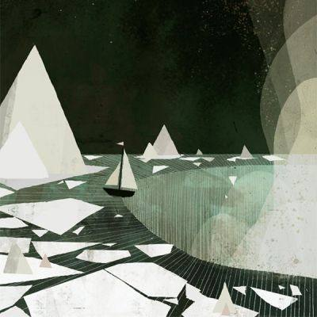

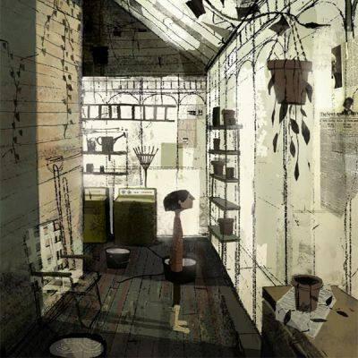

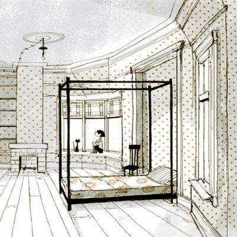

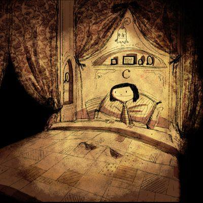

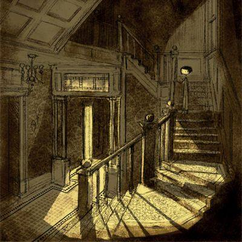

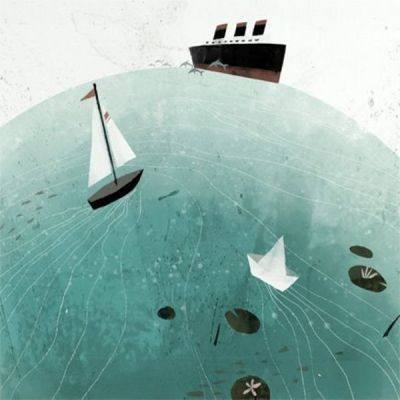

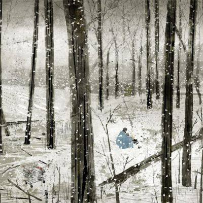

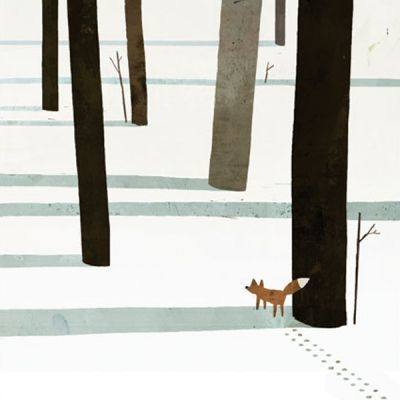

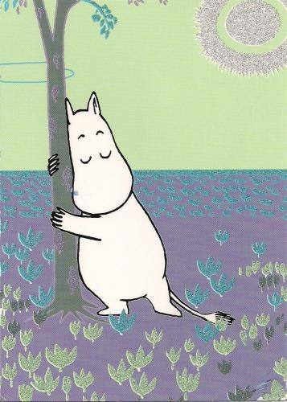

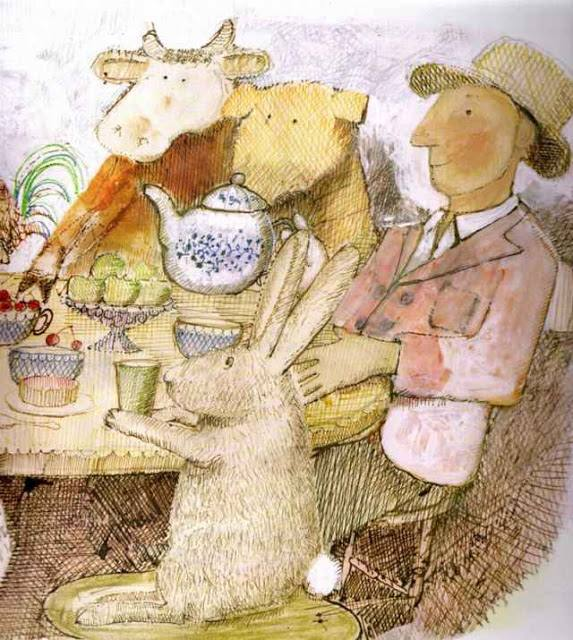

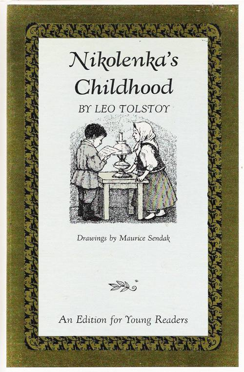

In 1961, legendary editor Ursula Norstrom sent young Maurice Sendak an
exquisite letter of creative encouragement as he was spiraling into
self-doubt while working on a children’s adaptation of Nikolenka’s
Childhood (public library) by Leo Tolstoy, originally published in 1852
— an intense, expressionistic chronicle of the inner life of a young
boy, the first novel in the author’s autobiographical trilogy.

Thanks to Nordstrom’s steadfast support, Sendak did finish the project
and it was published two years later, the same year Sendak’s own
now-iconic Where the Wild Things Are was released. His youthful
insecurity, however, presents a beautiful parallel to the coming-of-age
themes Tolstoy explores. The illustrations, presented here from a
surviving copy of the 1963 gem, are as tender and soulful as young
Sendak’s spirit:

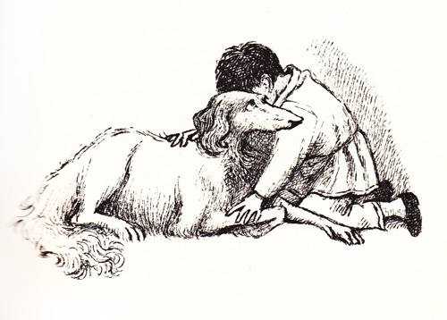

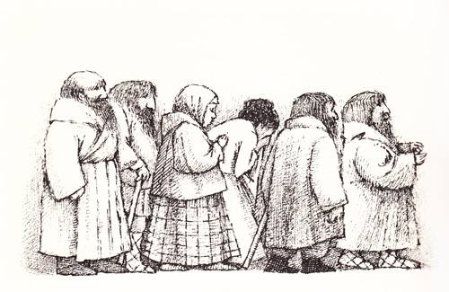

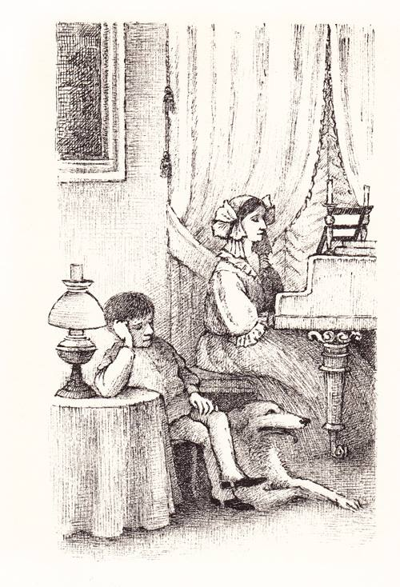

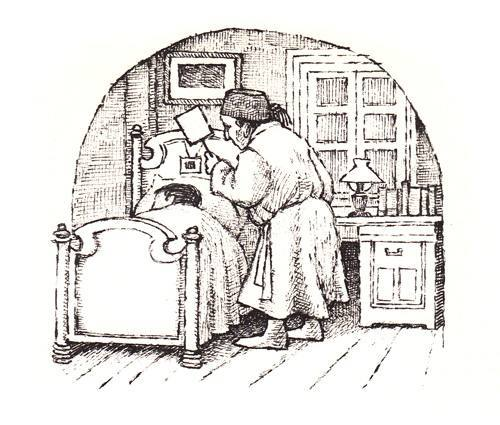

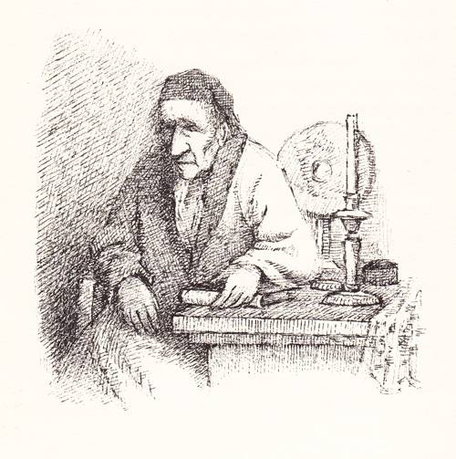

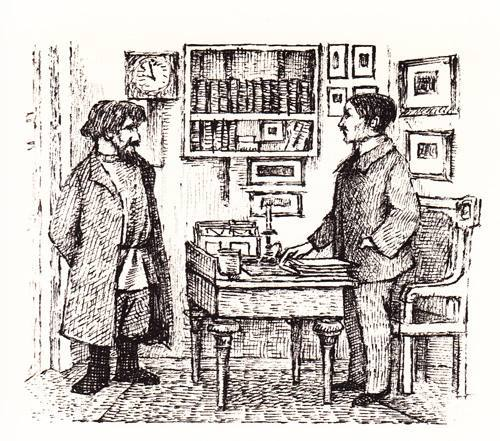

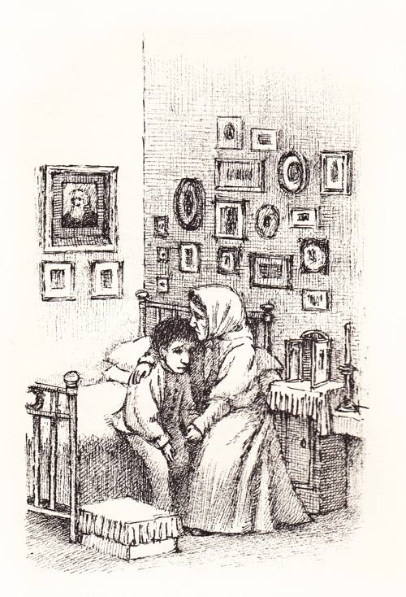

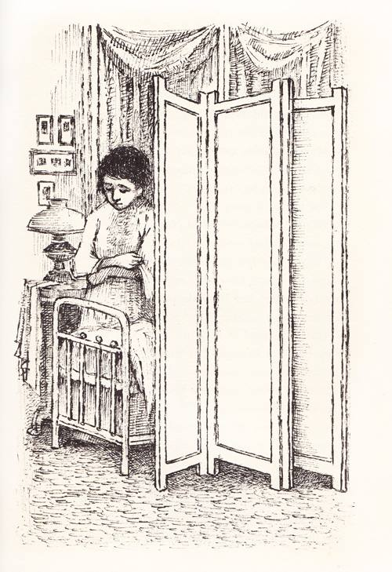

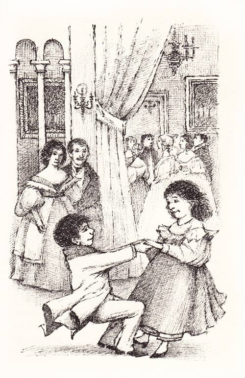

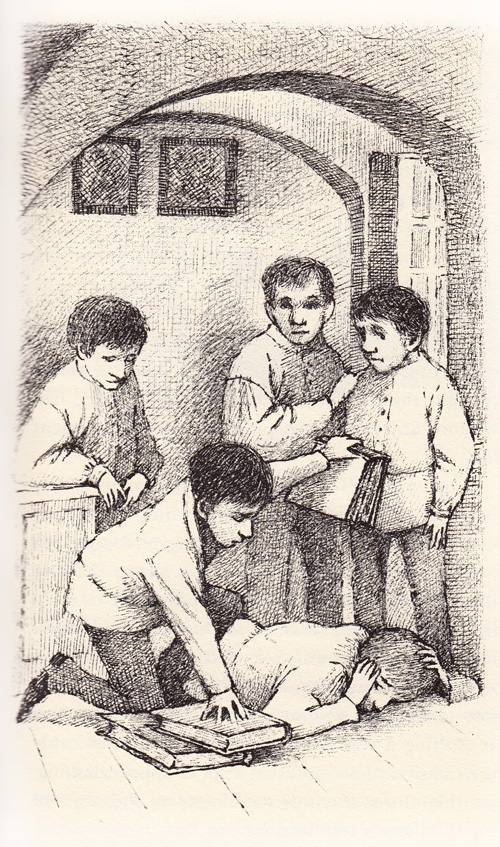

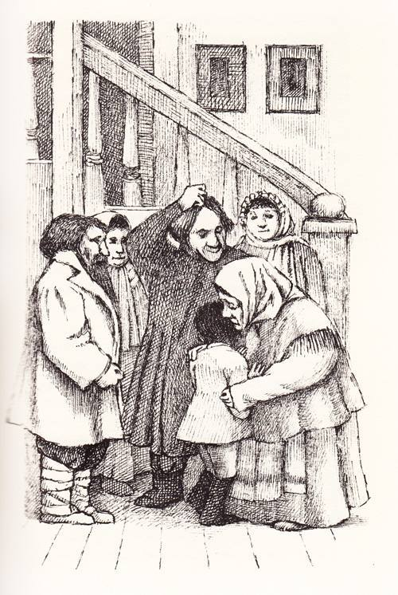

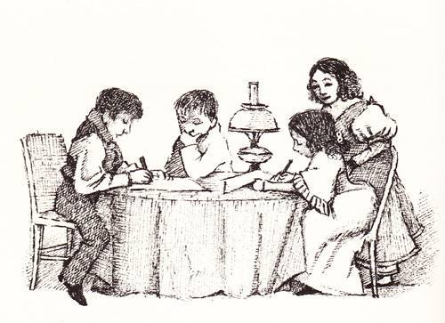

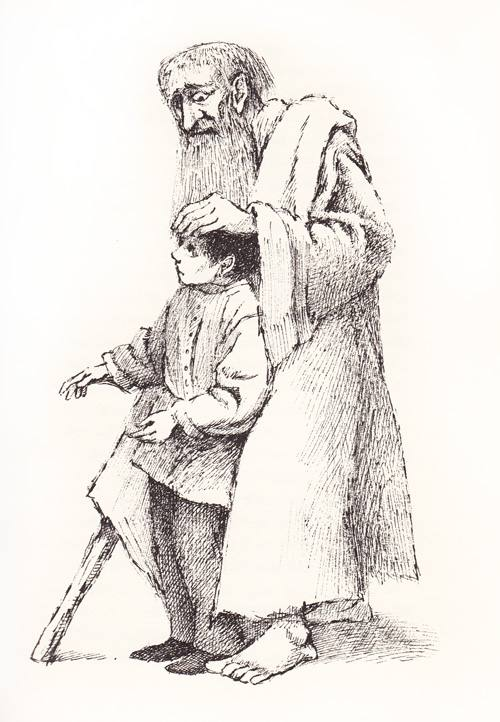

The closing pages of the book echo the ideas and ideals of Tolstoy’s
personal magnum opus, his Calendar of Wisdom, as he describes the final
moments of the family’s lovable servant, Natalya Savishna:

She left this life without regret, did not fear death, and accepted it
as a boon. This is often said, but how seldom it really is so! … Her
whole life had been pure unselfish love and self-sacrifice.

What if her beliefs might have been more lofty and her life devoted to
higher aims — was that pure soul therefore less worthy of love and
admiration?

She accomplished the best and greatest thing in life — she died without
regrets or fear.

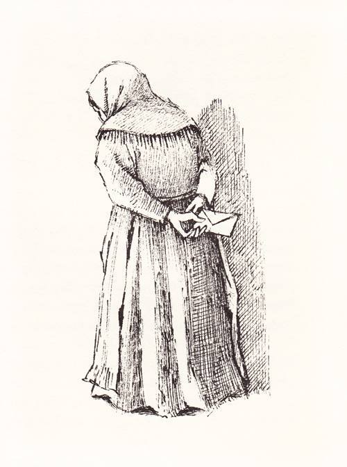
