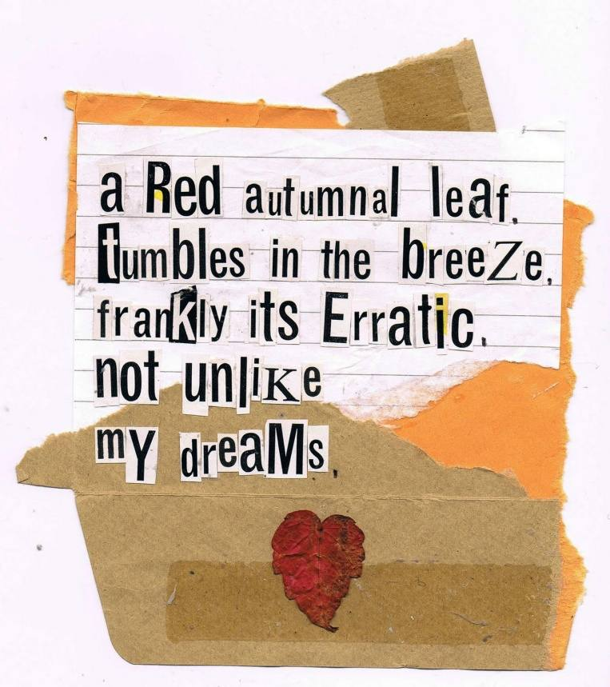
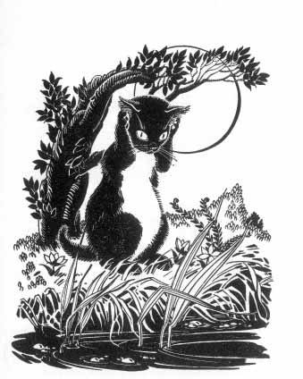
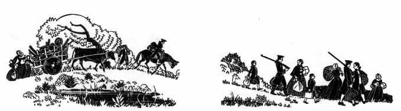

**CHORAL READING**

**FOUND POETRY**

**(2)**

**Choral Reading/Found Poetry Texts 2**

- [Over and Under the Snow Kate Messner](#over-and-under-the-snow-kate-messner)
- [Nothing to Do Douglas Wood](#nothing-to-do-douglas-wood)
- [The Stone Swan](#the-stone-swan)
- [Forest Sonya Hartnett](#forest-sonya-hartnett)
- [Faithful Elephants Yukio Tsuchiya](#faithful-elephants-yukio-tsuchiya)
- [Letters from Rifka Karen Hesse](#letters-from-rifka-karen-hesse)
- [The Hunger Games](#the-hunger-games)
- [Home Place Crescent Dragonwagon](#home-place-crescent-dragonwagon)
- [The Tenth Good Thing about Barney Judith Viorst](#the-tenth-good-thing-about-barney-judith-viorst)
- [An Angel for Solomon Singer Cynthia Rylant](#an-angel-for-solomon-singer-cynthia-rylant)
- [Fly Away Home](#fly-away-home)
- [Homeless — Anna Quindlen](#homeless-anna-quindlen)
- [Prince’s Unwelcome Disguise:](#princes-unwelcome-disguise)
- [Night Tree Eve Bunting](#night-tree-eve-bunting)
- [Sylvester and the Magic Pebble](#sylvester-and-the-magic-pebble)
- [Amos & Boris William Steig](#amos-boris-william-steig)
- [DAKOTA DUGOUT](#dakota-dugout)
- [Encounter Jane Yolen](#encounter-jane-yolen)
- [Barefoot](#barefoot)
- [The Book Thief Markus Zusak](#the-book-thief-markus-zusak)
- [Paddle Whispers Douglas Wood](#paddle-whispers-douglas-wood)
- [Twilight Holly Young Huth](#twilight-holly-young-huth)
- [The Last Dinosaur Jim Murphy](#the-last-dinosaur-jim-murphy)
- [The Blue Cat of Castle Town](#the-blue-cat-of-castle-town)
- [I Like Noisy Mum Likes Quiet Eileen Spinelli](#i-like-noisy-mum-likes-quiet-eileen-spinelli)
- [Moving Michael Rosen](#moving-michael-rosen)
- [Guess Who My Favourite Person Is Byrd Baylor](#guess-who-my-favourite-person-is-byrd-baylor)
- [Python Christopher Cheng](#python-christopher-cheng)
- [Slower Than the Rest Cynthia Rylant](#slower-than-the-rest-cynthia-rylant)
- [John Henry Julius Lester](#john-henry-julius-lester)
- [Grandad’s Prayers of the Earth Douglas Wood](#grandads-prayers-of-the-earth-douglas-wood)
- [The Deliverance of Dancing Bears Elizabeth Stanley](#the-deliverance-of-dancing-bears-elizabeth-stanley)
- [Daddy Played Music Maryann Weidt](#daddy-played-music-maryann-weidt)
- [The One and Only Ivan Katherine Applegate](#the-one-and-only-ivan-katherine-applegate)

Over and Under the Snow Kate Messner

Nothing to Do Douglas Wood

The Stone Swan Helen Bell

Forest (extract) Sonya Hartnett

Faithful Elephants Yukio Tsuchiya

Letters from Rifka (extract) Karen Hesse

The Hunger Games (extract) Suzanne Collins

Home Place Crescent Dragonwagon

The Tenth Good Thing about Barney Judith Viorst

An Angel for Solomon Singer Cynthia Rylant

Fly Away Home Eve Bunting

Homeless Anna Quindlen

Prince’s Unwelcome Disguise

Night Tree Eve Bunting

Sylvester and the Magic Pebble William Steig

Amos & Boris William Steig

Dakota Dugout Ann Turner

Encounter Jane Yolen

Barefoot Pamela Duncan Edwards

The Book Thief - Prologue Markus Zusak

Paddle Whispers Douglas Wood

Twilight Holly Young Huth

The Last Dinosaur Jim Murphy

The Blue Cat of Castle Town Catherine Cate Coblentz

I Like Noisy Mum Likes Quiet Eileen Spinelli

Moving Michael Rosen

Guess Who My Favourite Person Is Byrd Baylor

Python Christopher Cheng

Slower Than the Rest Cynthia Rylant

John Henry Julius Lester

Grandad’s Prayers of the Earth Douglas Wood

The Deliverance of Dancing Bears Elizabeth Stanley

Daddy Played Music Maryann Weidt

The One and Only Ivan Katherine Applegate

## Over and Under the Snow Kate Messner
Over the snow I glide. Into woods, frosted fresh and white.

Over the snow, a flash of fur – a red squirrel disappears down a crack.

“Where did it go?”

“Under the snow,” Dad says.

“Under the snow is a whole secret kingdom, where the smallest forest
animals stay safe and warm. You’re skiing over them now.”

Over the snow I glide, past beech trees rattling leftover leaves and
strong, silent pines that stretch to the sky. On a high branch, a great
horned owl keeps watch.

Under the snow, a tiny shrew dodges columns of ice; it follows a cool
tunnel along the moss, out of sight.

“Look,” Dad says. “Tracks. Tracks always tell a story.”

Over the snow, a deer has crossed our path. Deep hoof prints punch
through the crust, up the hill, under a tree. An oval of melted snow
tells the story of a good night’s sleep.

Under the snow, deer mice doze. They huddle up, cuddle up against the
cold in a nest of feathers and fur.

Over the snow I climb, digging in my edges so I don’t slide back down.

Under the snow, voles scratch through slippery tunnels, searching for
morsels from summer feasts.

Over the snow I swoosh –

*down, down, faster, faster,*

*down, faster, faster,*

whoops!

Under the snow, a snowshoe hare watches from a shelter of spruce. Almost
invisible, she smooths her fur – a coat of winter white.

Over the snow I glide, past reeds where tadpoles paly tag in springtime.

Under the snow, fat bullfrogs snooze. They dream of sun-warmed days,
back when they had tails.

Over the snow I stand and stare. Little mountains in the marsh.

Under the snow, beavers gnaw on aspen bark, settled in for supper. Can
they hear my tummy rumbling, too?

Over the snow – stop. A sound.

We stand like statues carved in ice till a bushy-tailed fox steps from a
thicket. Tips his ear to the ground.

*listens ...*

*listens ...*

*listens still ...*

*and leaps*

out onto the snow after an invisible dinner.

His paws scratch away to find the mouse he heard
scritch-scritch-scratching along underneath. Under the snow.

Over the snow I glide. A full moon lights my path to supper.

Under the snow, a chipmunk wakes for a meal. Bedroom, kitchen, hallway –
his house under my feet.

Over the snow I climb one last hill. Bonfire smoke rises: warm hands,
hot cocoa, hot dogs sizzling on pointed sticks.

Under the snow, a black bear snores, still full of October blueberries
and trout.

Over the snow, the fire crackles, and sparks shoot up to the stars. I
lick sticky marshmallow from my lips and lean back with heavy eyes.
Shadows dance in the flames.

Under the snow, a queen bumblebee drowses away December, all alone.
She’ll rule a new colony in spring.

Over the snow I glide home on tired legs.

Clouds whisper down feathery-soft flakes.

Under the covers, I snuggle deep and drift into dreams ...

of cuddling deer mice and slumbering frogs. Hungry beavers and
tunnelling voles. Drowsy bears and busy squirrels. And the secret
kingdom under the snow.

## Nothing to Do Douglas Wood
Once in a while, along comes a day when there is nothing –

absolutely, positively *nothing* ……………………………………………….**to do.**

And isn’t that **great?**

No school. No homework. No Little League. No dance class. No play
rehearsal. No soccer practice. No computer camp.

No *anything!*

Just a white, empty space on the calendar.

(Of course, some people get a little worried about these spaces. These
people are very nice and wear big shoes. But we’ll think about them a
little later.)

But what do you do when there’s *nothing* to do?

Well, I have heard stories, wonderful stories, about taking off your
shoes and walking through green grass or mud – in your bare feet!

Or making toy ships out of sticks and sailing them across a puddle that
somehow seems as wide as an ocean.

I’ve heard about lying on your back and watching clouds turn from
dinosaurs into crocodiles into dragons into bears into butterflies into
… clouds.

Or lying on your stomach watching an ant carry something three times
bigger than he is while you wonder, how can he do that?

And what do ants eat for breakfast that makes them so strong?

I’ve heard of making a paper aeroplane do loop-de-loops and barrel rolls
in the soft summer air, then land smooth as butter on bread.

Or building a fort, a secret place where no one can see you because you
can’t see them. And surviving for hours on peanut-butter sandwiches and
lemonade.

I’ve heard about catching fireflies on a warm evening and putting them
in a jar until you have two hands full of gold, and then letting them
all go.

I’ve heard of swinging until your toes touch the clouds ….

Or hanging by your knees like a monkey, just to find out how monkeys
feel.

I’ve heard of climbing a good tree that’s been waiting all its long life
just to be climbed by you. Or finding a quiet spot and reading your very
favourite book.

And then reading it again …

… just because it *is* your favourite.

I’ve heard stories about exploring places that really need to be
explored ….

About making angels in the snow, or building igloos or caves, or
sledding, or tasting icicles, or throwing snowballs, or making round,
fat men with orange noses and old hats who smile at everyone.

Why, I’ve heard of swimming and building sand castles and hopscotching
and jump-roping and running and throwing and bouncing and painting and
drawing and playing with toys and puzzles and dolls and games and
puppies and kittens and hamsters and gerbils and doing cartwheels and
doing somersaults and doing…

…well, sometimes, just doing *nothing.*

And maybe one of the *best* ways to do nothing is to show someone else
how to do it with you.

Maybe even someone with big shoes. Just to remind them that, sometimes,
doing nothing is the most important thing in the whole wide world to do.

## The Stone Swan

**Helen Bell**

The black swan shadowed his mate up towards the pale mustard moon. Below
them, mulga trees softened to a pale green dusting over the red earth.
And above, the rest of the flock stretched out to form a black arrow
winding westward across the sky.

Invisible threads of instinct drew the swans in a timeless arc to their
summer home in the western wetlands. There they would hatch their young
before the winter rains set in. For three moonlit nights the pair flew
tirelessly with the flock, filling the air with long bugling calls as
the country slipped beneath their wings. On the fourth night, as they
neared the wetlands, one swan slowed, too tired to keep up. The black
swan’s mate dropped away from the flock, weary after many years of
tracing the same pathway.

The black swan broke away, too, wheeling back and trumpeting loudly. A
faint call urged him on as he dipped down towards his mate. Then he
circled and flew before her, easing the way. Ahead he could hear the
flock slowing, then hitting the water.

Somewhere below, a young girl was disturbed by the calling of the swans
and stirred in her sleep.

The black swan’s mate dropped, her strength exhausted. Hard ground
rushed up at her, but with a final thrust she reached the safety of the
wetlands. Folding her aching wings, she floated through the soothing
water. In a moment the black swan joined her, circling around and
around, and bugling softly.

At daybreak the pair flew downstream to join the other swans. As they
approached, the flock warned them off with loud trumpeting and beating
of wings. The nesting territory had already been claimed and they were
no longer welcome. The black swan and his mate flew back upstream. They
would have to nest alone and try to rejoin the flock later.

Weeks passed and the swans worked together as they had done for many
years, weaving, pushing and pulling grasses to form a mound. When the
sides of the nest were high out of the water, the black swan’s mate laid
her first egg.

Each day she laid another egg. And each day the swans continued to build
the nest, forming it carefully around a growing clutch of pale green
eggs. After six days the black swan’s mate squatted carefully on the
nest and began to pluck the down from her breast, pushing it under her
body. Before long a warm glove of feathers formed around the clutch. She
squatted lower, pressing her bare warm skin close to the eggs.

The black swan flew off. He would feed all night and at first light take
his turn on the nest. And so they continued for the next few weeks.

One night the black swan’s mate felt a stirring beneath her, and eased
up a little. Tap-tap, tap-tap. A small sharp beak broke through the pale
green shell. After much tapping and pushing, the shell burst apart, and
a damp grey cygnet coiled limply amongst the feathers and broken shell.

The black swan’s mate nudged the cygnet gently against her warm skin.
Gradually, soft leathery feet unfurled and the new cygnet pushed up into
her feathers, fluttering clumsily.

At daybreak the black swan returned, ready to replace his mate on the
nest. She shifted slightly but stayed, content to sit until all the eggs
were hatched. So he moved off to dabble amongst the reeds in the
shallows, unaware of what lay ahead.

The black swan shuffled out of the shallows towards a patch of green on
the water’s edge. As he moved clumsily through the mud, twine tangled
around his leg. He pulled, tightening the snarl and trumpeting loudly in
fear. He pulled again, thrashing his wings wildly through the mud.

The sun rose higher, beating down on the black swan. All through the day
he pulled, first this way, then that, struggling to be free. Finally, as
night fell, the swan lay exhausted in the slush, his wings coated with
mud, his legs fouled with rubbish.

Next morning, as the black swan lay trapped in the mud, his mate stirred
restlessly. All the eggs were hatched and she was hungry. She trumpeted
loudly, calling her mate, but there was no reply.

The wetlands were fringed with bush, but beyond there was a large
housing estate. Jo, one of the estate kids, loved the wetlands.
Sometimes she would visit with a friend and they would work on their
secret cubby made from rubbish dropped in the bush.

One morning, while walking to the wetlands, Jo noticed that a track had
been cleared through the bush. Moving closer to the water she saw that
the level had dropped right down, exposing smelly mud and tangles of
rubbish.

Suddenly, from an island of reeds in the middle of the water, there was
a loud trumpeting. Without warning a hissing black head reared up from
the mud. Jo jumped in fright.

The black head slumped back again, exhausted. “Oh, you poor thing,” Jo
whispered, as she crouched beside it, tears welling in her eyes. “You
poor black swan.”

Still as stone, the swan watched her. Slowly Jo stretched out her hand,
but the swan jerked back. “It’s okay, swan,” she whispered, “I won’t
hurt you.” She shuffled closer, soothing his fear with her voice, as she
slowly reached out again. This time the swan didn’t flinch.

Jo raised his head out of the mud and cradled it, then knelt to untangle
the snarl around his legs. Bit by bit she pulled the mess away, as the
black swan lay still, seeming to trust this creature with the gentle
hands and the soft voice.

Finally there was only one tangle left. A twist of plastic twine had cut
into the flesh as the swan struggled. Jo crooned softly to the big black
bird as she eased its foot out of the mud. “Don’t worry, swan, you’ll
soon be free,” she murmured, blinking back fresh tears while she gently
unravelled the twine.

“There you are,” she said as she finished. “Look, you’re free now…you
can go.” The swan gazed at her, then closed his eyes, his feathers
coated in mud and his throat parched. The black swan was too exhausted
to move.

An urgent trumpeting call sounded across the water. The black swan
arched his neck and let out a long loud reply. Slowly he eased out of
the mud, shuffled into the water and paddled towards his mate. He paused
near the island and looked back at Jo. Dipping his head, the swan
trumpeted loudly and then swam away, disappearing into the reeds.

The following morning, Jo returned to the wetlands to look for the black
swan. As she sat on the edge of the water he emerged momentarily from
the reeds and then disappeared.

Jo came again the next morning, and this time the two swans swam out of
the reeds with six grey cygnets bobbling and jostling on the water. Jo
watched, entranced, until the swan family retreated to the island of
reeds.

Jo came each day to watch the swans swim by as she sat at the water’s
edge. But the trucks came, too, tipping more dirt across the wetlands.
Long black pipes snaked beneath the surface, draining away the water.
Each day there was more rubbish exposed and more smelly black mud.

One day, Jo saw that the dirt stretched right across the water, forming
a road. Heavy trucks lumbered up and down this new road and at the edge
of the bush there was a tall fence with signs saying ‘TRESPASSERS
PROSECUTED!’ and ‘LAND SALES SOON’. Jo followed the fence, looking for a
way through, but it was too high. She wandered home sadly, wondering
about the swans.

The stench of exposed black mud and the rapidly shrinking wetlands
prompted the swans to move. Swiftly the black swan led his family
downstream towards the main flock, but their way was blocked. A wall of
dirt stretched across the wetlands, cutting them off from the rest of
the flock.

The black swan clambered awkwardly up the steep bank and stood on the
edge of the road. A truck whooshed past, coating him with dust. The swan
shook his long neck, trying to clear the dust from his eyes and
nostrils. He looked down and called to his mate, trumpeting long and
loud. The cygnets clustered at the edge of the bank trying to climb the
steep sides, as his mate urged them forward, bugling softly.

She pushed through them and scrambled up the bank a little, slipping on
the loose dirt. The black swan called again and the cygnets jostled each
other, panicking, then slipped back with high-pitched cries. Finally the
black swan’s mate surged back into the water, gathering the distressed
cygnets around her.

Up on the road the black swan sent a long and mournful call to his mate.
Above him the clouds darkened and thunder rolled across the sky. Fat
raindrops burst in the dust and the wind swept dirt and debris along the
road. His mate swam frantically backwards and forwards, calling the
cygnets then trumpeting back to him. Trucks thundered past, spraying the
black swan with mud, as the storm tossed his calls away. Soon he was
coated in mud but still he called.

After many hours the wind dropped away and the rain eased to a gentle
mist. A thin slice of moonlight broke through the clouds, shining down
onto the flooded wetlands.

The flood subsided as the days passed. Trucks returned, tipping dirt
into the water to rebuild the road. But strangely, each morning, water
had flooded the road and rejoined the divided wetlands.

The people living in the estate soon grew tired of the thundering
trucks. They fought off the land developers and declared the wetlands a
sanctuary. Peace returned to the wetlands and the people found that they
enjoyed watching the birds, although they saw no sign of the black
swans. Only one person saw them again and just once…

Early one evening a few months after the storm, Jo stood at the edge of
the wetlands. A pale mustard moon glowed low on the horizon. As Jo
watched, she saw a black swan lit for a moment against the moon. And
then another, and another, and another. She counted seven altogether.
Then one of the swans broke away, wheeling low over the water.

Jo watched the swan glide gracefully over the water and then slowly
circle the solitary stone jutting through the surface. She saw the swan
dip its head and toss silvery water down its long neck. She heard it
trumpeting a long and mournful song, then she watched as it rose slowly
into the sky. Jo stood there until the black shape became a dot and
disappeared. Turning back to the water, she gazed at the stone until it
was swallowed by shadows and it, too, disappeared.

## Forest Sonya Hartnett

Inside the box they crouched, too frightened to make a sound. Through
their feet they could feel they were flying; even in blackness they
sensed the speeding hills and trees. They heard the roar of the wind
beyond the weighted lid of the box, heard the crank and thrash of the
engine and the spin of the tyres on the road. They closed their eyes as
though darkness were a dazzling thing, bowed their heads as if the
noise, every moment of it come and gone in a slick, slashing instant,
was more than their sensitive ears could bear. Above the locked-in odor
of each other they could smell smoke, grease, and oil; the box itself
tanged with the sugary scent of citrus. The eldest of them, his chest
soaked with nervousness, could not hunch into any smaller shape and so
waited, frozen tensely to his place; the siblings, still kittens, buried
themselves against him for the comfort of hearing his heart. When they
felt the car’s slowing their eyes flashed open, black and full of alarm;
beneath the wheels they heard gravel crunch and grinding, stones pressed
together by the burden of the vehicle just as they themselves had been,
huddled inside the box.

When the container was lifted they slid forward, grappling at the
cardboard. The walls of the box were waxy and high but through them the
cats smelled crisp air and huge open spaces beyond. They hit the ground
heavily and the lid was pulled back and the animals found themselves
blinking at the early stars, at the marbled grey evening sky. The
littlest kitten bounded to the lip of the box and was over it and gone,
claws scarring the wax. Their confines made vast by her absence, the two
remaining cats shrank, and their paws, outstretched, found nothing to
catch; the cats sprawled across the muddy earth and the coal-black male
kitten darted into the cover of some pampas, his ears sleeked to his
skull. The bigger cat stayed where it had landed, flinching in the
grass. Through midnight eyes it watched the man, looming tall above. The
man gave off smoke, sweat, and the snaky smell of unwashed skin. The man
and the animal stared at one another, but the cat made no move: “Get,”
the man said finally, and shoved the creature with his boot. “Get.”

The cat quailed, blinking, but did not run. The man swayed backward,
defied. The cat turned its eyes and, for a moment, denied the very
existence of its foe. Then the man reached out and gripped it by the
scruff, dragging the animal to him. The cat’s mouth came open and it
stiffened, claws scything the dirt. The man’s hand fumbled under the
cat’s chin and among the twists of hair, seeking the vulnerable throat.
The cat wrenched its hind legs up and they threshed at nothing, its
forelegs flailing wildly, but from its gaping mouth came no noise. The
man hissed and snarled, forcing the animal’s head upward, blinding it
with a palm. The cat felt squirming fingers at its throat and then a
sharp jerk that severed the cold flow of the air – and suddenly it was
free again, dumped forcefully to the ground. It gathered itself against
the earth and gazed at the man, who crumpled the animal’s collar and
threw it aside, the disc and bell jinkling as they fell into the weeds.
He stamped a foot and the cat cowered, squinting, groaning. “Get!” the
man bellowed; he snatched abruptly for the creature, hoisting it by the
armpits and flinging it as far as he could. The cat dived gracefully,
dancing sideways through the grass with its eyes fixed on the man.
“Get!” the man barked, kicking the box so it bucked, all angles, into
the air. “Get! Scat! Get!”

The cat could feel the heat pouring from the man, could smell the bitter
mix of frustration and rage. It stayed still as it watched the man
bundle himself into the car and the car itself, then, leap into eager
life, spinning its wheels as if bursting with impatience to be gone; it
raced out of a cloud of its own fumes, gravel stinging off its
underside. The dusty pall it left behind hung in the air for a long
while, powdering red the dull slate sky.

The pampas whispered as the hidden kitten rose to his feet. The bigger
cat shook himself, noting at once the oddness left by the missing
collar. Somewhere in his pedigree was a long-haired splendidness of coat
that had passed down to him diluted into wispiness, and his ruff
preserved a flattened ring: he had worn his collar every day of his five
and a half years. As the kitten stepped forward, lifting his paws high
from the clammy ground, the older cat sank to his haunches, wanly
terrified. He stared at a world that was not his, furling his ears
against its peculiar smell and sound. Something bumped his paw and he
scrambled back but it was only a moth stuttering a path across the dirt,
wings folded primly over stern. The black-and-white cat sagged into the
grass, his heart battering.

The kitten, however, was quickly forgetting he had ever been afraid. He
stretched his legs and yawned hugely – the journey in the box had been
long and cramped. The car still droned on the edge of his hearing but it
was a long way off now, and easily ignored. The young cat’s coat was jet
and glossless and he moved like a shade, gliding past the box and then
the collar before trotting onto the shoulder of the road and stopping on
its crest, to look about. On either side of the road was a tract of wet,
weedy, liverwort-smeared land and beyond this was wilderness, a jungle
of brake and fallen bark and embankments of rotting leaves. Rising out
of and above this were the peeling trunks of a forest of ashen trees,
the canopy a craggy scribble against the sky. Shadows and darkness
concealed its depths mysteriously; the dusk’s light glazed the peaks of
huge ferns and raffish weeds. The kitten had never seen anything like
it, and he walked in circles of wonder. A scarf of darkness slipped
between the branches and flapped silently into the clouds and the kitten
watched it intently, his golden eyes swiveling in his skull. “Kian,” he
said, “what’s that?”

The black-and-white cat hardly dared glance up. “A bat. Jem, come here.”

In response Jem feigned deafness, and stayed on the road. Kian continued
to scan the scrub, wide-eyed with shock and fear. He had never seen a
forest, but some ancestral memory assured him that the crowding of trees
with its serrated scents made up that thing, a forest. Kian had been
born and raised a suburban cat, and his life, until this evening, had
been lived amid glass and brick and steel. He had known a garden with
fruiting plants, lawns crossed by stepping stones, flowers staked neatly
in terracotta pots. A forest was not something he had ever even dreamed
of, and though his ancestors might recognize it, Kian knew with
certainty that a forest was not his home. He stared about in dismay,
whiskers quivering, coat rumpled by the strengthening breeze, and from
the corner of a lime eye he spied a gauzy shadow winnowing between the
eucalypts and knew it wasn’t an animal or a phantom but the very eyes of
the forest itself, staring back at him. His blood ran cold but he made
no move, too desolate to flee: this cataclysmic day had shredded his
courage and dignity, stripping him of all desire to even breathe any
more.

The cold evening silence was rattled, suddenly, as a tiny wagtail,
evidently pushed to the brink of its tolerance, nose-dived from the
canopy chitting furiously as it came. It rushed for Jem, its minute pied
frame spearing the air. Jem ducked as it swooped him, his whiskers blown
by the slipstream. The wagtail wheeled and dived again, a flurry of
feather and sickle claw, and Jem went prostrate to the road, yowling
unhappily. Kian watched as the little bird landed beside the kitten and
hopped about in the dirt, boiling with an anger it could not give voice
to fast enough. “Grr grr!” it spluttered at the kitten. “Meiow meiow!
Cak cak! Wa wa! Aargh! Aaargh! Aaaargh!”

The wagtail clearly believed that this gabble, though nonsensical to
itself, made perfect sense to a cat: when the kitten did not react as
desired, emotion overcame the bird and it leapt into the air, shooting
like a wasp for Jem’s eyes. The kitten sprang to his feet and bolted. He
scuttled past Kian, low as a lizard, the wagtail zooming through the air
behind him, and plunged blindly into the forest. The bird alighted on a
broken twig and shouted insults after him before fluffing its feathers
dismissively and turning its beady glare on Kian. “Mew,” it told the
astonished cat. “Hiss hiss hiss, mew.”

All birds abhor cats but Kian had rarely encountered one so recklessly
passionate about the matter; when his gaze swept the canopy, however, he
saw it shudder with an equal animosity. Cats, he realised, were known
here, and creatures hated them. He could stay among the weeds forever so
he stepped cautiously into the concealment of the forest and the wagtail
supervised his leaving, tail bobbing, muttering abuse. Jem hurried from
the shadows and as the two cats wove into the forest the kitten watched
the older cat’s ears turning and shifting, saw the ivory threads of his
whiskers tremble and felt the wariness in each snowy paw, and the last
of his bravery deserted him, and he slunk along the earth.

Kian stopped at the base of a stringybark and jem followed his gaze up
its crusted, blood-dark trunk. “Cally,” Kian murmured, and without
hesitation the small kitten came down, rump-first and wriggling,
slipping at the last moment so she dropped into a hill of sodden leaves.
She stood up and shook herself before touching her nose to Jem’s.
siblings, the kittens could hardly have been less alike, for dainty
Cally carried no suggestion of her robust brother’s sooty hide –
instead, her coat was a patchwork of red, apricot, storm-grey and cream,
each colour leaking into the others like water in overflowed puddles.
Just the tip of her muzzle was white, as if she’d drunk too greedily
from a plate of milk, and perhaps walked through it as well, for her
paws were similarly stained. Her amber eyes were round, now, and her
ears pirouetted. She crouched beside her brother and looked uncertainly
at Kian. “What is this place?” she asked him. “Why have we come here?”

It went against his feline nature to admit to being nonplussed, so Kian
disregarded the question. Jem pinned down a leaf that was ticking in the
wind and told his sister, “The man took off Kian’s collar.”

It sounded ominous, and Cally pressed to the ground. Pinging and
clicking all around them were the eerie sounds of the shifting forest,
the retreat of the daytime inhabitants to secure sleeping-places, the
waking of those who rose with the moon. Bickering broke out among
roosting birds and the brief flurried commotion was followed by silence
fragile as shale. The trees and earth drew breath as one, exhaling a
ghost’s frosty sigh. The breeze carried an odour that, to the cats, was
physical as the trees, streaked as it was with evidence of unknown
animals and eccentric landscapes, this spectre of scent was the most
nerve-racking aspect of their altogether awful plight. Kian knew he
could not strain his senses more vigilantly nor be more prepared to fly,
but he felt, and knew the kittens felt, hopelessly endangered and
exposed. He stared at the peeling trunks and massing ferns, daunted,
fretful for the comfort of his cemented home. “We don’t belong here,” he
told the kittens softly. “We have to go back where we came from.”

## Faithful Elephants Yukio Tsuchiya
The cherry blossoms are in full bloom at the Ueno Zoo. Their petals are
falling in the soft breeze and sparkling in the sun. Beneath the cherry
trees, crowds of people are pushing to enter the zoo on such a beautiful
day.

Two elephants are outside performing their tricks for a lively audience.
While blowing toy trumpets with their long trunks, the elephants walk
along large wooden logs.

Not far from the cheerful square, there stands a tombstone. Not many
notice this monument for the animals that have died at the Ueno Zoo. It
is quiet and peaceful here, and the sun warms every corner.

One day, an employee of the zoo, while tenderly polishing the stone,
told me a sad story of three elephants buried there.

“Today,” he said, “there are three elephants in this zoo. But years ago,
we had three different elephants here. Their names were John, Tonky, and
Wanly. At that time, Japan was at war. Gradually, the war had become
more and more severe. Bombs were dropped on Tokyo every day and night,
like falling rain.

“What would happen if bombs hit the zoo? If the cages were broken and
dangerous animals escaped to run wild through the city, it would be
terrible! Therefore, by command of the Army, all of the lions, tigers,
bears, and big snakes were poisoned to death.

“By and by, it came time for the three elephants to be killed. They
began with John. John loved potatoes, so the elephant keepers mixed
poisoned potatoes with the good ones when it was time to feed him. John,
however, was a very clever elephant. He ate the good potatoes, but each
time he brought a poisoned potato to his mouth with his trunk, he threw
it to the ground, *kerplunk!*

“ ‘ As it seems there is no other way,’ the zoo keepers said, ‘we must
inject poison directly into his body.’

“A large syringe, the kind used to give shots to horses, was prepared.
But John’s skin was so tough that the big needles broke off with a loud
*snap*, one after the other. When this did not work, the keepers
reluctantly decided to starve him to death. Poor John died seventeen
days later.

“Then it was Tonky’s and Wanly’s turn to die. These two had always gazed
at people with loving eyes. They were sweet and gentle-hearted. The zoo
keepers wanted so much to keep Tonky and Wanly alive that they thought
of sending them to the zoo in Sendai, far north of Tokyo.

“But what if bombs fell on Sendai? What if the elephants got loose and
ran wild there? What would happen then?

“Tonky and Wanly, too, were doomed to be killed at the Ueno Zoo, just
like all the other animals.

“The elephant keepers stopped feeding Tonky and Wanly. As the days
passed, the elephants became thinner and thinner, weaker and weaker.
Whenever a keeper walked by their cage, they would stand up, tottering,
as if to beg, ‘Give us something to eat. Please, give us water!’ Their
small, loving eyes began to look like round rubber balls in their
drooping, shrunken faces. Their ears seemed too large for their bodies.
The once big, strong elephants had become a sad shape.

“All this while, the elephants’ trainer loved them as if they were his
own children. He could only pace in front of the cage and moan, ‘You
poor, poor, pitiful elephants!’ One day, Tonky and Wanly lifted their
heavy bodies, staggered to their feet, and came close to their trainer.
Squeezing out what little strength they had left, Tonky and Wanly made
their appeal. They stood on their hind legs and lifted their front legs
up as high as they could. Then, raising their trunks high in the air,
they did their banzai trick. Surely their friend would reward them with
food and water as he used to do.

“The trainer could stand it no longer. ‘Oh, Tonky! Oh, Wanly!’ he
wailed, and dashed to the food shed. He carried food and pails of water
to them and threw it at their feet. ‘Here!’ he said, sobbing, and clung
to their thin legs. ‘Eat your food! Please drink. Drink your water!’

“All of the other keepers pretended not to see what the trainer had
done. No one said a word. The director of the zoo sat very still, biting
his lip and gazing at the top of his desk. No one was supposed to give
the elephants any food. No one was supposed to give them any water. But
everyone was hoping and praying that if the elephants could survive only
one more day, the war might be over and the elephants would be saved.

“At last, Tonky and Wanly could no longer move. They just lay on their
sides, hardly able to see the white clouds floating in the sky over the
zoo. However, their eyes appeared clearer and more beautiful than ever.

“Seeing his beloved elephants dying this way, the elephant trainer felt
as if his heart would break. He had no more courage to see them. All of
the other keepers felt the same, and they too stayed away from the
elephants’ cage.

“Over two weeks later, Tonky and Wanly were dead. Both died leaning
against the bars of their cage with their trunks stretched high in the
air, still trying to do their banzai trick for the people who once fed
them.

“ ‘The elephants are dead! They’re dead!’ screamed the elephant trainer
as he ran into the office. He buried his head in his arms and cried,
beating the desk top with his fist.

“The rest of the zoo keepers ran to the elephants’ cage and stumbled in.
They took hold of Tonky’s and Wanly’s thin bodies, as if to shake them
back to life. Everyone burst into tears, then stroked the elephants’
legs and trunks in sorrow.

“Above them, in the bright blue sky, the angry roar of enemy planes
returned. Bombs began to drop on Tokyo once more. Still clinging to the
elephants, the zoo keepers raised their fists to the sky and implored,
‘Stop the war! Stop the war! Stop all wars!’

“Later, when the bodies of the elephants were examined, nothing was
found in their washtub-like stomachs – not even one drop of water.”

With tears in his eyes, the zoo keeper finished his story. “These three
elephants – John, Tonky, and wanly – are now resting peacefully under
this monument.”

He was still patting the tombstone tenderly as the cherry blossoms fell
on the grave, like snowflakes.

## Letters from Rifka Karen Hesse

September 21, 1920

Atlantic Ocean

*Dear Tovah,*

I have lost so much already, and now it seems I must lose more.

I nearly drowned at sea in a horrible storm. But I am alive. Everyone
did not have my luck. But I am alive.

Our ship, which seemed so large and safe when first I boarded, barely
survived the fury of this storm.

The tempest started during the night while we slept. I had dreams od
pogroms, of Cossacks on their horses, snapping whips at me, pointing
rifles. I heard the crack of gunshot. In my dream the countryside was
burning. I trembled in your cellar while the fire raged around me.

I woke from one terror into another. I had been thrown to the floor of
my cabin, tossed from my bed by the angry seas.

Quickly I pulled on my clothes, tying my kerchief with trembling
fingers. I opened my cabin door. Though it was still night, the sky was
a sickly yellow, like an old bruise. I bashed against the ship’s walls,
flung back and forth by the tossing sea as I made my way towards the
deck. The ship shivered in the hateful ocean. Twice the floor dropped
beneath me suddenly, and I fell.

There was so much confusion on deck. No rain yet, but a wind that
roared. The seas, which had seemed so gentle yesterday, rose like hungry
beasts, mouths open, hovering and crashing over the sides of the ship.

Sailors ran like spiders, back and forth in the yellow light. They
yelled to each other over the wind, shouting directions. Pieter, my
Pieter, clung to a pillar as a wave broke over his shoulders.

All the horrors of Russia returned to me. The storm frightened me as
much as any pogrom, when the peasants would come after the Jews to burn
our homes, to break into our stores, to murder us.

My stomach twisted and I knew I would be sick, so I crawled, making my
way with difficulty, towards the side of the ship. The ship rolled, my
stomach rolled with it. I clung to the rail, trying to raise up off my
knees so I would not soil myself with my own sickness. The ship
plummeted from beneath me and I hit my head on the metal rail.

Someone came up behind me and wrapped a blanket around my shoulders.

“Pieter!” I cried.

I didn’t realise the waves had drenched me.

“Come, Rifka!” Pieter yelled over the wind. “You must come away from the
side.”

I started shivering. I could taste blood in my mouth and smell it in my
nose. It had a cold, metallic taste that made my stomach twist inside
out. I tore away from Pieter’s grip and ran back to the rail, emptying
my stomach over the side.

Before I could finish, water, a wall of water, rose up over me. Pieter
grabbed me around the waist and hurled me away from the side. The water
came crashing down over our heads, slamming us onto the deck.

Pieter held on to me as the water sucked at my body, trying to pull me
overboard. If he had not been there, Tovah, the ocean would have claimed
me. He saved my life. Pieter held me until the wave lost its power and
slipped away. Then he lifted me to my feet again before another
monstrous wave could attack us.

“Come,” he cried, guiding me towards a hatch. “Quickly. You must stay
down in the hold while the storm lasts.” Pieter shouted over the violent
wind.

I descended into the ship’s hold, looking up once at my friend. His hair
lay plastered against his head and water streamed from his storm
clothes.

“Pieter,” I called, “are you putting me in steerage?”

Pieter laughed. “Brave and clever!” he called down to me. the wind
screamed around him.

“Be careful, Pieter!” I cried.

“I will, Rifka,” he answered.

I could hear the fear under the calm in his voice. It echoed in my ears
as I stumbled down the ship’s steep steps.

When I reached the bottom of the stairs, I found many of the other
passengers already in the hold, huddled together. We were still equal.
We were equally miserable, equally frightened for our lives.

Everyone got sick, even me. it stank worse than a flood of soured milk
down there.

Women rocked back and forth weeping. Men held their stomachs and moaned.
All the time I worried for Pieter and the others. I doubted, Tovah, that
I would live to see my family again…

We shivered and sweated and retched for thirty-six hours, until the ship
stopped its pitching. At last the hatch was opened and we climbed up out
of our hole.

There was no more deck left to the ship. Everything once bolted down had
been ripped away. The player piano had crashed against a wall and
shattered into pieces.

Most of the deck chairs were gone too, torn right out of the floor.
Twisted metal and bolts stuck up as signs of where the chairs had been.

The parquet tiles, what remained of them, were thick with filth from the
sea.

A sailor lay on the deck, wrapped in gauze from head to toe, moaning. My
heart jumped into my throat. What if it’s Pieter? I thought. Oh, Tovah,
if only I’d known.

I ran to the sailor’s side, but it wasn’t Pieter.

I asked if there was something I could do for him anyway. He didn’t
answer.

Other sailors were limping or bandaged. I looked for Pieter everywhere,
but I couldn’t find him.

Finally I stopped one of the officers.

“Have you seen the boy, Pieter?” I asked. “Please, I know you are busy,
but could you tell me where I might find him?”

The officer looked down at me. he steadied my shoulders in his hands the
way Papa had the night he told me of Uncle Zeb’s death. “We lost one
sailor overboard in the storm,” he said.

“Pieter?” I whispered.

The officer nodded.

Tovah, I felt myself smothering. I couldn’t see anything, hear anything.

Somehow I found my way back to my cabin, and for the first time since
leaving Berdichev, I cried. All the tears that had collected in this
year, in this enormous year, shoved their way out of my heart, and how I
cried.

Pieter, who said I was so brave … what would he say to see me now?

I didn’t care. I cried for Pieter, I cried for myself. I couldn’t stop.
I didn’t want to stop.

I cried until I was empty of tears. Then I was still. As still as the
sea after a storm.

## The Hunger Games

**Suzanne Collins**

From Chapter 11

Sixty seconds. That’s how long we’re required to stand on our metal
circles before the sound of a gong releases us. Step off before the
minute is up, and landmines blow your legs off. Sixty seconds to take in
the ring of tributes all equidistant from the Cornucopia, a giant golden
horn shaped like a cone with a curved tail, the mouth of which is at
least seven metres high, spilling over with the things that will give us
life here in the arena. Food, containers of water, weapons, medicine,
garments, fire starters. Strewn around the Cornucopia are other
supplies, their value decreasing the further they are from the horn. For
instance, only a few steps from my feet lies a metre square of plastic.
Certainly it could be of some use in a downpour. But there in the mouth,
I can see a tent pack that would protect me from almost any sort of
weather. If I had the guts to go in and fight for it against the other
twenty-three tributes. Which I have been instructed not to do.

We’re on a flat, open stretch of ground. A plain of hard-packed dirt.
Behind the tributes across from me, I can see nothing, indicating either
a steep downwards slope or even a cliff. To my right lies a lake. To my
left and back, sparse piney woods. This is where Haymitch would want me
to go. Immediately.

I hear his instructions in my head. “Just clear out, put as much
distance as you can between yourselves and the others, and find a source
of water.”

But it’s tempting, so tempting, when I see the bounty waiting there
before me. and I know that if I don’t get it, someone else will. That
the career Tributes who survive the bloodbath will divide up most of
these life-sustaining spoils. Something catches my eye. There, resting
on a mound of blanket rolls, is a silver sheath of arrows and a bow,
already strung, just waiting to be engaged. *That’s mine,* I think.
*It’s meant for me.*

I’m fast. I can sprint faster than any of the girls in our school,
although a couple can beat me in distance races. But this forty-metre
length, this is what I am built for. I know I can get it. I know I can
reach it first, but then the question is, how quickly can I get out of
there? by the time I’ve scrambled up the packs and grabbed the weapons,
others will have reached the horn, and one or two I might be able to
pick off, but say there’s a dozen; at close range, they could take me
down with the spears and the clubs. Or their own powerful fists.

Still, I won’t be the only target. I’m betting many of the other
tributes would pass up a smaller girl, even one who scored an eleven in
training, to take out their more fierce adversaries.

Haymitch has never seen me run. Maybe if he had he’d tell me to go for
it. Get the weapon. Since that’s the very weapon that might be my
salvation. And I only see one bow in that whole pile. I know the minute
must be almost up and I’ll have to decide what my strategy will be and I
find myself positioning my feet to run, not away into the surrounding
forests but towards the pile, towards the bow. When suddenly I notice
Peeta. He’s about five tributes to my right, quite a fair distance;
still, I can tell he’s looking at me, and I think he might be shaking
his head. But the sun’s in my eyes, and while I’m puzzling over it the
gong rings out.

And I’ve missed it! I’ve missed my chance! Because those extra couple of
seconds I’ve lost by not being ready are enough to change my mind about
going in. My feet shuffle for a moment, confused at the direction my
brain wants to take, and then I lunge forward, scoop up the sheet of
plastic and a loaf of bread. The pickings are so small and I’m so angry
with Peeta for distracting me that I sprint in twenty metres to retrieve
a bright orange backpack that could hold anything, because I can’t stand
leaving with virtually nothing…

I continue running until the woods have hidden me from the other
tributes, then slow into a steady jog that I think I can maintain for a
while. For the next few hours I alternate between jogging and walking,
putting as much distance as I can between myself and my competitors… I
don’t dare stop to examine the contents of the pack yet. I just keep
moving, pausing only to check for pursuers.

I can go for a long time. I know that from my days in the woods. But I
will need water. That was Haymitch’s second instruction, and since I
sort of botched the first, I keep a sharp eye out for any sign of it. no
luck.

The woods begin to evolve, and the pines are intermixed with a variety
of trees, some I recognise, some completely foreign to me. at one point,
I hear a noise and pull my knife, thinking I may have to defend myself,
but I’ve only startled a rabbit. “Good to see you,” I whisper. If
there’s one rabbit, there could be hundreds just waiting to be snared.

The ground slopes down. I don’t particularly like this. Valleys make me
feel trapped. I want to be high, like in the hills around District 12,
where I can see my enemies approaching. But I have no choice but to keep
going.

Funny, though, I don’t feel too bad. The days of gorging myself have
paid off. I’ve got staying power even though I’m short on sleep. Being
in the woods is rejuvenating. I’m glad for the solitude, even though
it’s an illusion, because I’m probably on screen right now…

I slump down next to my pack, exhausted. I need to go through it anyway
before night falls. See what I have to work with. As I unhook the
straps, I can feel it’s sturdy made, although a rather unfortunate
colour. This orange will practically glow in the dark. I make a mental
note to camouflage it first thing tomorrow.

I flip open the flap. What I want most, right at this moment, is water.
Haymitch’s directive to immediately find water was not arbitrary. I
won’t last long without it. for a few days, I’ll be able to function
with unpleasant symptoms of dehydration, but after that I’ll deteriorate
into helplessness and be dead in a week, tops. I carefully lay out the
provisions. One thin black sleeping bag that reflects body heat. A pack
of crackers. A pack of dried beef strips. A bottle of iodine. A box of
wooden matches. A small coil of wire. A pair of sunglasses. And a
two-litre plastic bottle with a cap for carrying water that’s bone dry.

No water. how hard would it have been for them to fill up the bottle? I
become aware of the dryness in my throat and mouth, the cracks in my
lips. I’ve been moving all day long. It’s been hot and I’ve sweated a
lot. I do this at home, but there are always streams to drink from, or
snow to melt if it should come to it.

As I refill my pack I have an awful thought. The lake. The one I saw
while I was waiting for the gong to sound. What if that’s the only water
source in the arena? That way they’ll guarantee drawing us in to fight.
The lake is a full day’s journey from where I sit now, a much harder
journey with nothing to drink. And then, even if I reach it, it’s sure
to be heavily guarded by some of the Career Tributes. I’m about to panic
when I remember the rabbit I startled earlier today. It has to drink,
too. I just have to find out where.

Twilight is closing in and I’m ill at ease. The trees are too thin to
offer much concealment. The layer of pine needles that muffles my
footsteps also makes tracking animals harder when I need their trails to
find water. and I’m still heading downhill, deeper and deeper into a
valley that seems endless.

I’m hungry, too, but I don’t dare break into my precious store of
crackers and beef yet. Instead, I take my knife and go to work on a pine
tree, cutting away the outer bark and scraping off a large handful of
the softer inner bark. I slowly chew the stuff as I walk along. After a
week of the finest food in the world, it’s a little hard to choke down.
But I’ve eaten plenty of pine in my life. I’ll adjust quickly.

In another hour, it’s clear I’ve got to find a place to camp. Night
creatures are coming out. I can hear the occasional hoot or howl, my
first clue that I’ll be competing with natural predators for the
rabbits. As to whether I’ll be viewed as a source of food, it’s too soon
to tell. There could be any number of animals stalking me at this
moment…

If only I wasn’t so thirsty.

## Home Place Crescent Dragonwagon
Every year,

these daffodils come up.

There is no house near them.

There is nobody to water them.

Unless someone happens to come this way,

like us, this Sunday afternoon, just walking,

there is not even anyone to see them.

But still they come up, these daffodils

in a row, a yellow splash

brighter than sunlight, or lamplight, or butter,

in the green and shadow of the woods.

Still they come up, these daffodils,

Cups lifted to trumpet

The good news

Of spring,

though maybe no one hears

except the wind

and the raccoons who rustle at night

and the deer who nibble delicately

at the new green growth

and the squirrels who jump

from branch to branch

of the old black walnut tree.

But once,

someone lived here.

How can you tell?

Look. A chimney, made of stone,

back there, half-standing yet, though honeysuckle’s

grown around it – there must

have been a house here. Look.

Push aside these weeds – here’s

a stone foundation, laid on earth.

The house once here was built on it.

And if there was a house, there was

a family.

Dig in the dirt, scratch deep, and what

do you find?

A round blue glass marble, a nail.

A horseshoe and a piece

of plate. A small yellow bottle. A china doll’s arm.

Listen. Can you listen, back, far back?

No, not the wind, that’s now. But listen,

back, and hear:

a man’s voice, scratchy-sweet, singing “Amazing Grace,”

a rocking chair squeaking, creaking on a porch,

the bubbling, hot fat in a black skillet, the chicken frying,

and “Tommy! Get in here this minute! If I have to call you

one more time -!”

and “Ah, me, it’s hot,” and “Reckon it’ll storm?”

“I don’t know, I sure hope, we sure could use it,”

and “Supper! Supper tiiiiime!”

If you look, you can almost see them:

the boy at dusk, scratching in the dirt with his stick, the

uneven swing hanging vacant

in the black walnut tree, listless in the heat;

the girl, upstairs, combing out her long, long hair, unpinning,

unbraiding, and combing, by an oval mirror;

downstairs, Papa washing dishes as Mama sweeps the floor

and Uncle Ferd, Mama’s brother, coming in, whistling, back

from shutting up the chickens

for the night, wiping the sweat

from his forehead.

“Ah, Lord, it’s hot, even late as it is,”

“Yes, it surely is.”

Someone swats

at a mosquito.

Bedtime.

But in that far-back summer night,

the swing begins to sway

as the wind comes up

as the rain comes down

there’s thunder there’s lightning (that’s just like now)

the dry dusty earth soaks up the water

the roots of the plants, like the daffodil bulbs

the mama planted, hidden under the earth, but alive

and growing, the roots

drink it up. A small green snake

coils happily in the wet woods,

and Tommy sleeps straight through the storm. Anne, the girl, who

wishes for a yellow hair ribbon, wakes, and then returns to

sleep, like Uncle Ferd, sighing as he dreams

of walking down a long road with change in his pocket. But

the mother wakes, and wakes the father, her husband,

and they sit on the side of the bed,

and watch the rain together,

without saying a word, in the house where everyone else

still sleeps. Her head on Papa’s shoulder,

her long hair falling down her back, she’s wearing

a white nightgown

that makes her look

almost like a ghost when the lightning flashes.

And now, she *is* a ghost, and we

can only see her

if we try. We’re not sure

if we’re making her up, or if

we really can see her, imagining

the home place as it might have been, or was, before

the house burnt down, or everyone moved away

and the woods moved in.

her son and daughter, grown and gone, her brother

who went to Chicago, her husband, even

her grandchildren, even her house,

all gone, almost as gone as if

they had never laughed and eaten chicken and rocked,

played and fought and made up,

combed hair and washed dishes and swept,

sang and scratched at mosquito bites.

Almost as gone, but

not quite. Not quite.

They were here.

This was their home.

For each year, in a quiet green place,

where there’s only a honeysuckle-vined chimney

to tell you there was ever a house

(if, that is, you happen to travel that way,

and wonder, like we did);

where there’s only a marble, a nail, a horseshoe, a piece

of plate, a piece of doll,

a single rotted almost-gone piece of rope swaying

on a black walnut tree limb,

to tell you there was ever a family here;

only deer and raccoons and squirrels

instead of people

to tell you there were living creatures;

each year, still,

whether anyone sees, or not,

whether anyone listens, or not,

the daffodils come up,

to trumpet their good news

forever and forever.

## The Tenth Good Thing about Barney Judith Viorst
**My cat Barney died last Friday. I was very sad.**

**I cried, and I didn’t watch television. I cried, and I didn’t eat my
chicken or even the chocolate pudding. I went to bed, and I cried.**

**My mother sat down on my bed, and she gave me a hug.**

**She said we could have a funeral for Barney in the morning. She said I
should think of ten good things about Barney so I could tell them at the
funeral.**

**I thought, and I thought, and I thought of good things about Barney. I
thought of nine good things. Then I fell asleep.**

**In the morning my mother wrapped Barney in the yellow scarf. My father
buried Barney in the ground by a tree in the yard. Annie, my friend from
next door, came over with flowers. And I told good things about
Barney.**

**Barney was brave, I said. And smart and funny and clean. Also cuddly
and handsome, and he only once ate a bird. It was sweet, I said, to hear
him purr in my ear. And sometimes he slept on my belly and kept it
warm.**

**Those are all good things, said my mother, but I just count nine. I
said I would try to think of another one later.**

**At the end of the funeral we sang a song for Barney. Then Annie and I
went into the kitchen with Mother. She gave us orangeade and butter
cookies, and she left the box on the table so we could have seconds. I
gave my seconds to Annie. I miss Barney, I said. Annie said Barney was
in heaven with lots of cats and angels, drinking cream and eating cans
of tuna. I said Barney was in the ground.**

**Heaven, said Annie, heaven. So there! The ground, I told her, the
ground. You don’t know anything.**

**My father came in from the yard and took a cookie. Big-mouthed Annie
said heaven again. I said ground. Tell her who’s right, I asked Father.
She doesn’t know anything.**

**Maybe Barney’s in heaven, my father began. Aha, said Annie, and stuck
her tongue out at me.**

**And maybe, said my father, Barney isn’t.**

**What did I tell you, I said, and yanked Annie’s braid.**

**Father made me let go. We don’t know too much about heaven, he told
Annie. We can’t be absolutely sure that it’s there.**

**But if it is there, said Annie in her absolutely sure voice, it’s
bound to have room for Barney and tuna and cream. She finished another
cookie and went back home.**

**My father told me he had to work in the garden. I said I would
help-but only a little. I told him I didn’t like it that Barney was
dead.**

**He said, why should I like it? It’s sad, he said. He told me that it
might not feel so sad tomorrow. My father had a packet of little brown
seeds. He shook some out on his hand. The ground will give them food and
a place to live, he said. And soon they’ll grow a stem and some leaves
and flowers.**

**I squeezed the packet open and looked down to the bottom. I told him,
I don’t see leaves and I don’t see flowers.**

**Things change in the ground, said my father. In the ground everything
changes.**

**Will Barney change too? I asked him.**

**Oh yes, said my father. He’ll change until he’s part of the ground in
the garden.**

**And then, I asked, will he help to make flowers and leaves?**

**He will, said my father. He’ll help grow the flowers, and he’ll help
grow that tree and some grass. You know, he said, that’s a pretty nice
job for a cat.**

**My father and I planted all of the seeds in the garden.**

**Mother made sandwiches, and we ate them under the tree. After lunch we
worked in the garden some more.**

**At night I still didn’t want to watch any television. When I turned
out the light, my mother sat down on my bed. She gave me s hug, and I
said I had something to tell her. Listen, I said, and I told her the
good things about Barney**

**Barney was brave, I said. And smart and funny and clean. Also cuddly
and handsome, and he only once ate a bird. It was sweet, I said, to hear
him purr in my ear. And sometimes he slept on my belly and kept it
warm.**

**Those are all good things, said my mother, but I still just count
nine.**

**Yes, I said, but now I have another.**

**Barney is in the ground and he’s helping grow flowers. You know, I
said, that’s a pretty nice job for a cat.**

**The Other Side**

**Jacqueline Woodson**

That summer the fence that stretched through our town seemed bigger. We
lived in a yellow house on one side of it. White people lived on the
other. And mama said, “Don’t climb over that fence when you play.” She
said it wasn’t safe.

That summer there was a girl who wore a pink sweater. Each morning, she
climbed up on the fence and stared over at our side. Sometimes I stared
back. She never sat on that fence with anybody, that girl didn’t.

Once, when we were jumping rope, she asked if she could play. And my
friend Sandra said no without even asking the rest of us.

I don’t know what I would have said. Maybe yes, maybe no.

That summer everyone and everything on the other side of that fence
seemed far away. When I asked my mama why, she said, “Because that’s the
way things have always been.”

Sometimes when me and Mama went into town, I saw that girl with her
mama. She looked sad sometimes, that girl did.

“Don’t stare,” my mama said. “It’s not polite.”

It rained a lot that summer. On rainy days that girl sat on the fence in
a raincoat. She let herself get all wet and acted like she didn’t even
care. Sometimes I saw her dancing around in puddles, splashing and
laughing.

Mama wouldn’t let me go out in the rain.

“That’s why I bought you rainy-day toys,” my mama said. “You stay inside
here – where it’s warm and safe, and dry.”

But every time it rained, I looked for that girl. And I always found
her. Somewhere near the fence.

Someplace in the middle of the summer, the rain stopped. When I walked
outside, the grass was damp and the sun was already high up in the sky.
And I stood there with my hands up in the air. I felt brave that day. I
felt free. I got close to the fence and that girl asked me my name.

“Clover,” I said.

“My name’s Annie,” she said. “Annie Paul. I live over yonder,” she said,
“by where you see the laundry. That’s my blouse hanging on the line.”

She smiled then. She had a pretty smile.

And then I smiled. And we stood there looking at each other, smiling.

“It’s nice up on this fence,” Annie said. “You can see all over.”

I ran my hand along the fence. I reached up and touched the top of it.

“A fence like this was made for sitting on,” Annie said. She looked at
me sideways.

“My mama says I shouldn’t go on the other side,” I said.

“My mama says the same thing. But she never said nothing about sitting
on it.”

“Neither did mine,” I said.

That summer me and Annie sat together on that fence. And when Sandra and
them looked at me funny, I just made believe I didn’t care.

Some mornings my mama watched us. I waited for her to tell me to get
down from that fence before I break my neck or something. But she never
did.

“I see you made a new friend,” she said one morning. And I nodded and
Mama smiled.

That summer me and Annie sat on that fence and watched the whole wide
world around us.

One day Sandra and them were jumping rope near the fence and we asked if
we could play. “I don’t care,” Sandra said.

And when we jumped, Sandra and me were partners, the way we used to be.
When we were too tired to jump anymore, we sat up on the fence, all of
us in a long line.

“Someday somebody’s going to come along and knock this old fence down,”
Annie said.

And I nodded. “Yeah,” I said. “Someday.”

## An Angel for Solomon Singer Cynthia Rylant
Solomon Singer lived in a hotel for men near the corner of Columbus
Avenue and Eighty-Fifth Street in New York City, and he did not like it.
The hotel had none of the things he loved.

His room had no balcony (he dreamed of beautiful balconies). It had no
fireplace (and he knew he would surely think better sitting before a
fireplace). It had no porch swing for napping and no picture window for
watching the birds.

He could not have a cat. He could not have a dog. He could not even
paint his walls a different colour and, oh, what a difference a yellow
wall would have made!

It is important to love where you live, and, Solomon Singer loved where
he lived not at all, and it was this that drove him out into the street
each night. It was dreams of balconies and purple walls that took him to
the street.

Solomon Singer wandered.

He was a wanderer by nature, anyway. He had grown up in Indiana, a place
absolutely famous for wandering. So much of Indiana was mixed into his
blood that even now, fifty-odd years later, he could not give up being a
boy in Indiana and at night he journeyed the streets, wishing they were
fields, gazed at lighted windows, wishing they were stars, and listened
to the voices of all who passed, wishing for the conversations of
crickets.

Solomon Singer was lonely and had no one to love and not even a place to
love, and this was hard for him. He didn’t feel happy as he wandered.

One evening, somewhere between Columbus Avenue and Central Park West,
Solomon Singer wandered into a small restaurant called the Westway Cafe.
He liked the name. He was from the Midwest and liked to imagine he was,
each day, making his way west, that someday he would again be west, and
so the name meant something to him.

He opened up the plastic menu before him and there he read these words:
*The Westway Cafe – where all your dreams come true.* The menu told him
how much hamburgers and bowls of soup and pieces of pie and other things
cost. But it didn’t put a price on dreams.

A voice quiet like Indiana pines in November said, “Good evening, sir,”
and Solomon Singer looked up into a pair of brown eyes that were lined
at the corners from a life of smiling. Solomon Singer smiled back at the
waiter and ordered a bowl of tomato soup, a cup of coffee, and a balcony
(but he didn’t say the balcony out loud).

The tomato soup was delicious, and he even got a second cup of coffee
free, and the smiling-eyed waiter told Solomon Singer to come back again
to the Westway Cafe. Solomon Singer did, the very next night.

He ordered two biscuits and some bacon and a large glass of grapefruit
juice and a fireplace (but he didn’t say the fireplace out loud). The
smiling-eyed waiter was glad to see him, glad to have him, and told him,
“Come back again,” and Solomon Singer did, the very next night.

For many, many nights Solomon Singer made his way west, carrying a dream
in his head, each night ordering it up with his supper. When he reached
the end of his list of dreams (the end was a purple wall), he simply
started all over again and ordered up a balcony (but he didn’t say the
balcony out loud).

And slowly and quietly with time, something happened. On Solomon
Singer’s walks each night to the Westway cafe, the streets began to move
before him like fields of wheat, and he thought them beautiful.

The lights in the buildings twinkled and shone like stars, and he
thought them lovely. And the voices of all who passed sounded like the
conversations of friendly crickets, and he felt friendly towards them.

Rounding the corner off Columbus Avenue, seeing the lighted window of
the Westway Cafe, Solomon Singer felt as he had as a boy, rounding the
bend in Indiana and seeing the yellow lights of the house where he
lived.

Walking into the Westway cafe, he felt at home as he had in Indiana, and
the smiling waiter greeted him as familiarly as his parents had once
greeted him in Indiana, when he would come in from wandering the roads
he loved.

The waiter’s name, it turned out, was Angel.

Solomon Singer went to the Westway Cafe every night for dinner that
first year and he dines there still. He hasn’t given up carrying a dream
in his head each time he goes, and one of his dreams has even come true
(he has sneaked a cat into his hotel room).

Solomon Singer has found a place he loves and he doesn’t feel lonely
anymore, and if ever you are near the Westway Cafe, wishing instead you
were in a field of conversational crickets beneath the shining stars, go
inside, and Angel will take your order and Solomon Singer will smile and
make you feel you are home.

## Fly Away Home

**Eve Bunting**

My dad and I live in an airport. That’s because we don’t have a home and
the airport is better than the streets. We are careful not to get
caught.

Mr. Slocum and Mr. Vail were caught last night. “Ten green bottles,
hanging on the wall,” they sang. They were as loud as two moose
bellowing. Dad says they broke the first rule of living here. Don’t get
noticed. Dad and I try not to get noticed. We stay among the crowds. We
change airlines.

“Delta, TWA, Northwest, we love them all,” Dad says. He and I wear blue
jeans and blue T-shirts and blue jackets. We each have a blue zippered
bag with a change of blue clothes. Not to be noticed is to look like
nobody at all.

Once we saw a woman pushing a metal cart full of stuff. She wore a long,
dirty coat and she lay down across a row of seating in front of
Continental Gate 6. The cart, the dirty coat, the lying down were all
noticeable. Security moved her out real fast.

Dad and I sleep sitting up. We use different airport areas. “Where are
we tonight?” I ask. Dad checks his notebook. “Alaska Air,” he says.
“Over in the other terminal.” That’s OK. We like to walk. We know some
of the airport regulars by name and by sight. There’s Idaho Joe and
Annie Frannie and Mars Man. But we don’t sit together.

“Sitting together will get you noticed faster than anything,” Dad says.

Everything in the airport is on the move—passengers, pilots, flight
attendants, cleaner with their brooms. Jets roar in, close to the
windows. Other jets roar out. Luggage bounces down chutes, escalators
glide up and down, disappearing floors. Everyone’s going somewhere
except Dad and me. We stay.

Once a little brown bird got into the main terminal and couldn’t get
out. It fluttered in the high, hollow spaces. It threw itself at the
glass, fell panting on the floor, flew to a tall, metal girder, and
perched there, exhausted.

“Don’t stop trying,” I told it silently. “Don’t! You can get out!”

For days the bird flew around, dragging one wing. And then it found the
instant when a sliding door was open and slipped through. I watched it
rise. Its wing seemed okay.

“Fly, bird,” I whispered. “Fly away home!”

Though I couldn’t hear it, I knew it was singing. Nothing made me as
happy as that bird. The airport’s busy and noisy even at night. Dad and
I sleep anyway. When it gets quiet, between two and four A.M., we wake
up.

“Dead time,” Dad says. “Almost no flights coming in or going out.” At
dead time there aren’t many people around, so we’re extra careful. In
the mornings Dad and I wash up in one of the bathrooms, and he shaves.
The bathrooms are crowded, no matter how early. And that’s the way we
like it. Strangers talk to strangers.

“Where did you get in from?”

“Three hours our flight was delayed. Man! Am I bushed!”

Dad and I, we don’t talk to anyone. We buy doughnuts and milk for
breakfast at one of the cafeterias, standing in line with our red trays.
Sometimes Dad gets me a carton of juice.

On weekends Dad take the bus to work. He’s a janitor in an office in the
city. The bus fare’s a dollar each way. On those days Mrs. Medina looks
out for me. The Medinas live in the airport, too—Grandma, Mrs. Medina,
and Denny, who’s my friend. He and I collect rented luggage carts that
people have left outside and return them for fifty cents each. If the
crowds are big and safe, we offer to carry bags.

“Get this one for you, lady? It looks heavy.” Or, “Can I call you a
cab?” Denny’s real good at calling cabs. That’s because he’s seven
already.

Sometimes passengers don’t tip. Then Denny whispers, “Stingy!” But he
doesn’t whisper too loud. The Medinas understand that it’s dangerous to
be noticed.

When Dad comes home from work, he buys hamburgers for us and the
Medinas. That’s to pay them for watching out for me. If Denny and I have
had a good day, we treat for pie. But I’ve stopped doing that. I save my
money in my shoe.

“Will we ever have our own apartment again?” I ask Dad. I’d like it to
be the way it was, before Mom died.

“Maybe we will,” he says. “If I can find more work. If we can save some
money.” He rubs my head. “It’s nice right here, though, isn’t it,
Andrew? It’s warm. It’s safe. And the price is right.”

But I know he’s trying all the time to find us a place. He takes
newspapers from the trash baskets and makes pencil circles around
letters and numbers. Then he goes to the phones. When he comes back he
looks sad. Sad and angry. I know he’s been calling about an apartment. I
know the rents are too high for us.

“I’m saving money, too,” I tell him, and I lift one foot and point to my
shoe.

Dad smiles. “Atta boy!”

“If we get a place, you and your dad can come live with us,” Denny says.

“And if we get a place, you and your mum and your grandma can come live
with us,” I say.

“Yeah!”

We shake on it. That’s going to be so great!

After next summer, Dad says, I have to start school.

“How?” I ask.

“I don’t know. But it’s important. We’ll work it out.”

Denny’s mom says he can wait for a while. But Dad says I can’t wait.
Sometimes I watch people meeting people.

“We missed you.”

“It’s so good to be home.”

Sometimes I get mad, and I want to run at them and push them and shout,
“Why do you have homes when we don’t? What makes you so special?” That
would get us noticed, all right. Sometimes I just want to cry. I think
Dad and I will be here forever. Then I remember the bird. It took a
while, but a door opened. And when the bird left, when it flew free, I
know it was singing.

## Homeless — Anna Quindlen

 

     Her name was Ann, and we met in the Port Authority Bus Terminal
several Januarys ago. I was doing a story on homeless people. She said I
was wasting my time talking to her; she was just passing through,
although she'd been passing through for more than two weeks. To prove to
me that this was true, she rummaged through a tote bag and a manila
envelope and finally unfolded a sheet of typing paper and brought out
her photographs.

     They were not pictures of family, or friends, or even a dog or cat,
its eyes brown-red in the flashbulb's light. They were pictures of a
house. It was like a thousand houses in a hundred towns, not suburb, not
city, but somewhere in between, with aluminum siding and a chain-link
fence, a narrow driveway running up to a one-car garage, and a patch of
backyard. The house was yellow. I looked on the back for a date or a
name, but neither was there. There was no need for discussion. I knew
what she was trying to tell me, for it was something I had often felt.
She was not adrift, alone, anonymous, although her bags and her raincoat
with the grime shadowing its creases had made me believe she was. She
had a house, or at least once upon a time had had one. Inside were
curtains, a couch, a stove, potholders. You are where you live. She was
somebody.

     I've never been very good at looking at the big picture, taking the
global view, and I've always been a person with an overactive sense of
place, the legacy of an Irish grandfather. So it is natural that the
thing that seems most wrong with the world to me right now is that there
are so many people with no homes. I'm not simply talking about shelter
from the elements, or three square meals a day, or a mailing address to
which the welfare people can send the check--although I know that all
these are important for survival. I'm talking about a home, about
precisely those kinds of feelings that have wound up in cross-stitch and
French knots on samplers1 over the years.

     Home is where the heart is. There's no place like it. I love my
home with a ferocity totally out of proportion to its appearance or
location. I love dumb things about it: the hot-water heater, the plastic
rack you drain dishes in, the roof over my head, which occasionally
leaks. And yet it is precisely those dumb things that make it what it
is--a place of certainty, stability, predictability, privacy, for me and
for my family. It is where I live. What more can you say about a place
than that? That is everything.

     Yet it is something that we have been edging away from gradually
during my lifetime and the lifetimes of my parents and grandparents.
There was a time when where you lived often was where you worked and
where you grew the food you ate and even where you were buried. When
that era passed, where you lived at least was where your parents had
lived and where you would live with your children when you became
enfeebled. Then, suddenly, where you lived was where you lived for three
years, until you could move on to something else and something else
again.

     And so we have come to something else again, to children who do no
understand what it means to go to their rooms because they have never
had a room, to men and women whose fantasy is a wall they can paint a
color of their own choosing, to old people reduced to sitting on molded
plastic chairs, their skin blue-white in the lights of a bus station,
who pull pictures of houses out of their bags. Homes have stopped being
homes. Now they are real estate.

     People find it curious that those without homes would rather sleep
sitting up on benches or huddled in doorways than go to shelters.
Certainly some prefer to do so because they are emotionally ill, because
they have been locked in before and they are determined not to be locked
in again. Others are afraid of the violence and trouble they may find
there. But some seem to want something that is not available in
shelters, and they will not compromise, not for a cot, or oatmeal, or a
shower with special soap that kills the bugs. "One room," a woman with a
baby who was sleeping on her sister's floor once told me, "painted
blue." That was the crux2 of it; not the size or location,
but pride of ownership. Painted blue.

     This is a difficult problem, and some wise and compassionate people
are working hard at it. But in the main I think we work around it, just
as we walk around it when it is lying on the sidewalk or sitting in the
bus terminal--the problem, that is. It has been customary to take
people's pain and lessen our own participation in it by turning it into
an issue, not a collection of human beings. We turn an adjective into a
noun: the poor, not poor people; the homeless, not Ann or the man who
lives in the box or the woman who sleeps on the subway grate.

     Sometimes I think we would be better off if we forgot about the
broad strokes and concentrated on the details. Here is a woman without a
bureau. There is a man with no mirror, no wall to hang it on. They are
not the homeless. They are people who have no homes. No drawer that
holds the spoons. No window to look out upon the world. My God. That is
everything.

## Prince’s Unwelcome Disguise:
**The Trials of a Pup Without a Home**

**On the Road**

Prince didn’t know why, but this morning was different. Ears perked, he
could feel excitement in the air. Prince’s family was in motion. Sarah
Jean, who had just turned six, was putting tape on the last of the boxes
stacked by the front door. Mum was writing on each box with a big, black
pen. Dad was carrying the boxes out to the large van parked in the
driveway. Prince had never seen that van

before. And he had never seen the house so empty. Looking out the
window, Prince saw Dad put the last box in the van and close the big
sliding door.

“Come on, Prince!” Sarah Jean called, holding Prince’s leash in her
hand.

Oh, boy! Prince thought, wagging his tail. Time for our morning walk!

But it turned out to be a very short walk. Sarah Jean took Prince to the
family car, opened the back door, and patted the seat. That was their
secret signal that he should jump in and sit in his special place.

Mum drove for what seemed like hours. Looking out the back window,
Prince could see Dad following in the big van.

At the end of the day, they stayed in a room that smelt like a lot of
people had already been there. Prince decided to ignore the strange
scents because he was with the people who loved him.

Prince thought everything would be perfect if they would just go back
home. He missed the soft cushion in his doghouse. He wished he had his
large white bowl instead of the cold metal bowl in the car. And he
wanted to chase the

shiny ball that Sarah Jean had given him last week.

**Escape**

The next day, Prince’s family drove on and on. Prince napped as well as
he could, but he felt uneasy. He wanted to know when they would go home.

That night, they stayed in another room that smelt of strangers.

Suddenly just as Prince was dreaming of his favourite chew-bone, an
alarm went off. Mum and Dad jumped out of bed and shook Sarah Jean
awake. People outside the room were yelling, “Fire! Fire!”

Dad grabbed the suitcase. Mom wrapped a blanket around Sarah Jean. They
flung the door open and ran into the courtyard with Prince right behind
them. The smoke in the air stung Prince’s eyes. The sirens hurt his
ears. And the noise was getting louder and louder as people ran in every
direction. Prince knew the only way to get away from the bad sounds was
to run until his ears didn’t hurt anymore. So run he did!

Prince ran as hard and as fast as he could. He sped past the swimming
pool and all the buildings. He ran until the air was clear and the only
thing he heard was the beating of his heart. Exhausted, Prince eased
down onto the prickly ground and fell into an uneasy and dreamless
sleep.

The next morning, Prince awoke to the sound of birds chirping about the
showers that were turning Prince’s grassy bed to mud. Before long, his
once beautiful and shiny coat was matted with muddy clumps. Worse yet,
sticky little briars had become tangled in his fur during the night.
Worst of all, he

was alone. Prince wanted to get back to Mom and Dad and Sarah Jean as
soon as he could. Ears on high alert he stood perfectly still and quiet.
He listened for Sarah Jean’s call. He listened for Mum’s call. He
listened for Dad’s call. But he

heard only the noisy birds.

Prince tried to find his path from the night before when he was running
in the dark. But, no matter where he looked, he didn’t see anything he
recognised or anyone he knew. And the morning rain had washed away his
scent. But Prince wasn’t about to give up. If Mum, Dad, and Sarah Jean
couldn’t call, he could.

At first, he blasted the air with loud, urgent barks. No answer. He
switched to long, pitiful howls. No reply. Prince continued calling
until the only sound he could make was a tiny whimper. For the first
time in his life, Prince had no family and he had no home.

**Slim Pickings**

Feeling lonely and scared made Prince’s stomach hurt. Having nothing to
eat made it hurt even worse. But he was too tired to chase the bold
birds that were searching the damp grass for insects.

Ears drooping low, Prince started walking. Before long, he came to a
place that reminded him of the park back home. He remembered running
after the bright red disk that Sarah Jean tossed for him again and
again.

A familiar scent led Prince to a large trashcan in the park. The
trashcan was full. Bottles, metal cans, and used food bags litter the
ground.

One bag drew Prince’s attention. Tearing at the greasy paper, he found a
small chicken bone that still had some meat on it. In a moment, he
gobbled it down.

Encouraged by the tiny snack, Prince sniffed and pawed at the other
bags. Within minutes, he found a small bowl of cold mashed potatoes
mixed with foul-smelling gravy. But he ate it anyway.

Standing on his hind legs, Prince pulled more garbage from the trashcan.
But his only reward was a few cold, stiff fries.

Thirsty from his efforts, Prince ran to a fountain in the centre of the
park. Edged with green scum, the water wasn’t at all like the clear
water in his bowl back home. But he drank the slimy water anyway.

**Lost and Scorned**

Prince rolled in the dewy grass to rub off at least some of the mud that
had dulled his once shiny coat. He pulled at the sticky briars tangled
in his fur. But the briars were so small that they slipped through his
teeth.

Suddenly Prince heard a sound. Looking up, he saw a tall woman with two
well-groomed dogs. Wagging his tail, Prince began running towards them.
The

woman began shouting at him in a harsh, cold voice.

“Get back, you ugly thing! Go away! Go away!!”

The dogs began to snarl at Prince and pull at their leashes. The woman
stroked the dogs and spoke to them in soft, loving tones. “Don’t you
worry. That dirty old dog is not fit to bother with.”

Throwing its head high in the air, the smaller dog laughed at Prince in
a way that only another dog can understand. The other dog, a large,
well-groomed hound, pointed his nose at the sky as he and his family
walked away.

Once again, Prince was alone.

**Wishful Memories**

The sun was going down. Prince crawled under a park bench and fell
asleep.

When Prince opened his eyes the next morning, he was hungrier than he
had ever been in his life. He ran back to the trashcan where he had
found food the day before. More litter lay on the ground but none of it
had even a morsel of

food.

Prince thought of his old life. He missed his doghouse with its soft
cushion. He missed his bowl filled to the top with clean, clear water.
He missed his favourite chew-bone. Most of all, he missed playing ball
with Sarah Jean.

**Always a Prince**

Prince was feeling very sad and alone. Then he heard a gentle voice.

“Come here, boy. Come here.”

The man held out a hand. The fingers were open and relaxed.

“Good dog. You’re a good dog, aren’t you?”

Prince’s ears perked up. He always knew when a person

was asking him a question.

“Yes, I can see that you are. And smart, too!”

The man took a small bag of crackers out of his pocket and offered one
to Prince.

With a big, happy gulp, Prince no longer felt so alone.

That night, clean and well fed, Prince slept on a rug by the man’s bed.
Prince’s collar and dog tags lay on a table next to the telephone.

The next morning, the man took Prince for a walk in the park. When they
came back to the man’s house, Mum and Dad and Sarah Jean were waiting.

With a happy cry, Sarah Jean ran to Prince and hugged him while Mom and
Dad talked with the man.

“Thank goodness he didn’t lose his tags,” Dad said. “We were hoping that
someone would find him and call the vet that has Prince’s records.”

“He’s a great dog!” the man replied. “The minute I saw him, I knew he
was a prince in disguise.”

## Night Tree Eve Bunting
On the night before Christmas we always go to find our tree.

We bundle up so we’re warm. Nina is already wearing her boots that are
too big for her. She has been wearing them all day.

Dad sets our box in the back of the truck with the rest of his stuff and
the four of us squish into the front seat.

We drive through the bright Christmas streets to where the dark and
quiet begin.

Nina is almost asleep in Mum’s lap when we stop

“Are we there?” I ask, and Dad says “Yes” and rolls down the windows so
we can smell the tree smell.

We scramble out.

There are oaks growing here and alder and maples that are bare now and
white in the moonshine. The pines and the spruces and the firs are
green.

This is called Luke’s Forest, but Dad says it’s not really a forest,
just a nice forgotten place where our town ends.

Dad goes first on the path between the trees, carrying our box and the
big red lantern. Mum and Nina go next, holding hands. I come last, with
the blanket.

It hasn’t snowed yet. It’s so cold my breath hurts. The sky is spattered
with stars, and the moon, big as a basketball, slides in and out between
the treetops.

Dad’s lantern sweeps ahead.

“Look,” he whispers.

We stop. A deer is watching us. I see the brightness of its eyes; then
it turns and it’s gone.

“Here’s our tree,” Dad says.

It has been our tree forever and ever. We walk around it, touching it.

“It’s grown since last year,” I say.

Mum puts her hand on my shoulder. “So have you.”

“So have I,” Nina says. Nina hates to be left out.

An owl hoots in the darkness. There are secrets all around us.

“Can I put on the popcorn chain?” Nina asks. She hops up and down and
right out of one of her boots. Mum helps her get it back on.

Nina takes one end of the chain and I take the other and we wind it
around our tree. We’ve brought apples and tangerines with strings on
them, and we hang them from the branches. It’s hard to hang string loops
when you have gloves on, but it’s too cold to take them off.

For weeks we’ve been making balls of sunflower seeds and pressed millet
and honey. We hang those, too.

We scatter shelled nuts and breadcrumbs and pieces of apple underneath
for the little creatures who can’t climb very well.

Our tree looks so pretty.

Mum says I should spread the blanket so we can sit and admire our tree.
She has brought a thermos of hot chocolate. I take off my gloves and
toast my hands around my warm cup.

Dad turns off the lantern and we stay quiet, hoping some of the little
animals will come while we’re here, hoping the deer will come back. But
it doesn’t.

“It’s shy,” Dad says.

“I’m shy, too,” says Nina.

Before we leave she and I get to choose a Christmas carol to sing. I
choose “Oh Come, all ye Faithful.”

Nina chooses “Old MacDonald Had a Farm.”

“That’s not a Christmas song, silly,” I tell her, but Mum says it’s fine
and a very nice song, too.

We sing fast because there are a lot of verses and it’s getting colder.

After the last “E-I-O” we gather up our things and head for the truck.

I look back once.

Our tree has folded itself into the darkness, but I think I can see it
still, stars caught in its branches and the moon swinging lopsided on
top.

Nina gets tired and dad has to wrap her in the blanket and carry her. I
carry her boots.

Later, in bed, I think about our tree, and sometimes, next day, when the
aunts and the uncles and the cousins are at our house and it’s noisy and
happy, I let my mind go back to Luke’s Forest.

I think of the birds having Christmas dinner and the squirrels and the
opossums and the raccoons and the skunks. There might even be a bear
because Dad says bears don’t really sleep all winter and if one’s going
to wake up I just bet it would wake up for Christmas.

Maybe a fox has come, stepping high on its thin, sharp paws, and they’re
all there together, singing their own Christmas songs on Christmas Day
around our tree.

## Sylvester and the Magic Pebble
**William Steig**

Sylvester Duncan lived with his mother and father at Acorn Road in
Oatsdale. One of his hobbies was collecting pebbles of unusual shape and
colour.

On a rainy Saturday during Vacation he found a quite extraordinary one.
It was flaming red, shiny, and perfectly round, like a marble. As he was
studying this remarkable pebble, he began to shiver, probably from
excitement, and the rain felt cold on his back. “I wish it would stop
raining,” he said.

To his great surprise the rain stopped. It didn’t stop gradually as
rains usually do. It CEASED. The drops vanished on the way down, the
clouds disappeared, everything was dry, and the sun was shining as if
rain had never existed.

In all his young life Sylvester had never had a wish granted so quickly.
It struck him that magic must be at work, and he guessed that the magic
must be in the remarkable-looking red pebble. (Where indeed it was.) to
make a test, he put the pebble on the ground and said, “I wish it would
rain again.” Nothing happened. But when he said the same thing holding
the pebble in his hoof, the sky turned black, there was lightning and a
clap of thunder, and the rain came shooting down.

“What a lucky day this is!” thought Sylvester. “From now on I can have
anything I want. My father and mother can have anything they want. My
relatives, my friends, and anybody at all can have everything anybody
wants!”

He wished the sunshine back in the sky, and he wished a wart on his left
hind fetlock would disappear, and it did, and he started home, eager to
amaze his father and mother with his magic pebble. He could hardly wait
to see their faces. Maybe they wouldn’t even believe him at first.

As he was crossing Strawberry Hill, thinking of some of the many, many
things he could wish for, he was startled to see a mean, hungry lion
looking right at him from behind some tall grass. He was frightened. If
he hadn’t been so frightened, he could have made the lion disappear or
he could have wished himself safe at home with his father and mother.

He could have wished the lion would turn into a butterfly or a daisy or
a gnat. He could have wished for many things, but he panicked and
couldn’t think carefully.

“I wish I were a rock,” he said, and he became a rock.

The lion came bounding over, sniffed the rock a hundred times, walked
around and around it, and went away confused, perplexed, puzzled, and
bewildered. “I saw that little donkey as clear as day. Maybe I’m going
crazy,” he muttered.

And there was Sylvester, a rock on Strawberry Hill, with the magic
pebble lying right beside him on the ground, and he was unable to pick
it up. “Oh, how I wish I were myself again,” he thought, but nothing
happened. He had to be touching the pebble to make the magic work, but
there was nothing he could do about it.

His thoughts began to race like mad. He was scared and worried. Being
helpless, he felt hopeless. He imagined all the possibilities, and
eventually he realised that his only chance of becoming himself again
was for someone to find the red pebble and to wish that the rock next to
it would be a donkey. Someone would surely find the red pebble – it was
so bright and shiny – but what on earth would make them wish that a rock
were a donkey? The chance was one in a billion at best.

Sylvester fell asleep. What else could he do? Night came with many
stars.

Meanwhile, back at home, Mr and Mrs Duncan paced the floor, frantic with
worry. Sylvester had never come home later than dinner time. Where could
he be? They stayed up all night wondering what had happened, expecting
that Sylvester would surely turn up by morning. But he didn’t, of
course. Mrs Duncan cried a lot and Mr Duncan did his best to soothe her.
Both longed to have their dear son with them.

“I will never scold Sylvester again as long as I live,” said Mrs Duncan,
“no matter what he does.”

At dawn, they went about inquiring of all the neighbours.

They talked to all the children - the puppies, the kittens, the colts,
the piglets. No one had seen Sylvester since the day before yesterday.

They went to the police. The police could not find their child.

All the dogs in Oatsdale went searching for him. They sniffed behind
every rock and tree and blade of grass, into every nook and gully of the
neighbourhood and beyond, but found not a scent of him. They sniffed the
rock on Strawberry Hill, but it smelt like a rock. It didn’t smell like
Sylvester.

After a month of searching the same places over and over again, and
inquiring of the same animals over and over again, Mr and Mrs Duncan no
longer knew what to do. They concluded that something dreadful must have
happened, and that they would probably never see their son again.
(Though all the time he was less than a mile away.)

They tried their best to be happy, to go about their usual ways. But
their usual ways included Sylvester and they were always reminded of
him. They were miserable. Life had no meaning for them any more.

Night followed day and day followed night over and over again. Sylvester
on the hill woke up less and less often. When he was awake, he was only
hopeless and unhappy.

He felt he would be a rock forever and he tried to get used to it. He
went into an endless sleep. The days grew colder. Fall came with the
leaves changing colour. Then the leaves fell and the grass bent to the
ground.

Then it was winter. The winds blew, this way and that. It snowed.
Mostly, the animals stayed indoors, living on the food they had stored
up.

One day a wolf sat on the rock that was Sylvester and howled and howled
because he was hungry.

Then the snows melted. The earth warmed up in the spring sun and things
budded. Leaves were on the trees again. Flowers showed their young
faces.

One day in May, Mr Duncan insisted that his wife go with him on a
picnic. “Let’s cheer up,” he said. “Let us try to live again, and be
happy even though Sylvester, our angel, is no longer with us.” They went
to Strawberry Hill.

Mrs Duncan sat down on the rock. The warmth of his own mother sitting on
him woke Sylvester up from his deep winter sleep. How he wanted to
shout, “Mother! Father! It’s me, Sylvester, I’m right here!” But he
couldn’t talk. He had no voice. He was stone-dumb.

Mr Duncan walked aimlessly about while Mrs Duncan set out the picnic
food on the rock – alfalfa sandwiches, pickled oats, sassafras salad,
timothy compote. Suddenly Mr Duncan saw the red pebble. “What a
fantastic pebble!” he exclaimed. “Sylvester would have loved it for his
collection.” He put the pebble on the rock.

They sat down to eat. Sylvester was now as wide awake as a donkey that
was a rock could possibly be. Mrs Duncan felt some mysterious
excitement. “You know, Father,” she said suddenly. “I have the strangest
feeling that our dear Sylvester is still alive and not far away.”

“I am, I am!” Sylvester wanted to shout, but he couldn’t. If only he had
realised that the pebble resting on his back was the magic pebble!

“Oh, how I wish he were here with us on this lovely May day,” said Mrs
Duncan. Mr Duncan looked sadly at the ground. “Don’t you wish it too,
Father?” she said. He looked at her as if to say. “How can you ask such
a question?”

Mr and Mrs Duncan looked at each other with great sorrow. “I wish I were
myself again, I wish I were my real self again!”

And in less than an instant, he was!

You can imagine the scene that followed – the embraces, the kisses, the
questions, the answers, the loving looks, and the fond exclamations!

When they eventually calmed down a bit, and had arrived home, Mr Duncan
put the magic pebble in an iron safe. Some day they might want to use
it, but really, for now, what more could they wish for? They had all
that they wanted.

## Amos & Boris William Steig
Amos, a mouse, lived by the ocean. He loved the ocean. He loved the
smell of sea air. He loved to hear the surf sounds – the bursting
breakers, the backwashes with rolling pebbles.

He thought a lot about the ocean, and he wondered about the faraway
places on the other side of the water. One day he started building a
boat on the beach. He worked on it in the daytime, while at night he
studied navigation.

When the boat was finished, he loaded it with cheese, biscuits, acorns,
honey, wheat germ, two barrels of fresh water, a compass, a sextant, a
telescope, a saw, a hammer and nails and some wood in case repairs
should be necessary, a needle and thread for the mending of torn sails,
and various other necessities such as bandages and iodine, a yo-yo and
playing cards.

On the sixth of September, with a very calm sea, he waited till the high
tide had almost reached his boat; then, using his most savage strength,
he just managed to push the boat into the water, climb on board, and set
sail.

The Rodent, for that was the boat’s name, proved to be very well made
and very well suited to the sea. And Amos, after one miserable day of
seasickness, proved to be a natural sailor, very well suited to the
ship.

He was enjoying his trip immensely. It was beautiful weather. Day and
night he moved up and down, up and down, on waves as big as mountains,
and he was full of wonder, full of enterprise, and full of love for
life.

One night, in a phosphorescent sea, he marvelled at the sight of some
whales spouting luminous water; and later, lying on the deck of his boat
gazing at the immense, starry sky, the tiny mouse Amos, a little speck
of a living thing in the vast living universe, felt thoroughly akin to
it all. Overwhelmed by the beauty and mystery of everything, he rolled
over and over and right off the deck of his boat and into the sea.

“Help!” he squeaked as he grabbed desperately at the Rodent. But it
evaded his grasp and went bowling along under full sail, and he never
saw it again.

And there he was! Where? In the middle of the immense ocean, a thousand
miles from the nearest shore, with no one else in sight as far as the
eye could see and not even so much as a stick of driftwood to hold on
to. “Should I try to swim home?” Amos wondered. “Or should I just try to
stay afloat?” He might swim a mile, but never a thousand. He decided to
just keep afloat, treading water and hoping that something – who knows
what? – would turn up to save him. But what if a shark, or some big
fish, a horse

mackerel, turned up? What was he supposed to do to protect himself? He
didn’t know.

Morning came, as it always does. He was getting terribly tired. He was a
very small, very cold, very wet and worried mouse. There was still
nothing in sight but the empty sea. Then, as if things weren’t bad
enough, it began to rain.

At last the rain stopped and the noonday sun gave him a bit of cheer and
warmth in the vast loneliness; but his strength was giving out. He began
to wonder what it would be like to drown. Would it take very long? Would
it feel just awful? Would his soul go to heaven? Would there be other
mice there?

As he was asking himself these dreadful questions, a huge head burst
through the surface of the water and loomed up over him. It was a whale.
“What sort of fish are you?” the whale asked. “You must be one of a
kind!”

“I’m not a fish,” said Amos. “I’m a mouse, which is a mammal, the
highest form of life. I live on land.”

“Holy clam and cuttlefish!” said the whale. “I’m a mammal myself, though
I live in the sea. Call me Boris,” he added.

Amos introduced himself and told Boris how he came to be there in the
middle of the ocean. The whale said he would be happy to take Amos to
the Ivory Coast of Africa, where he happened to be heading anyway, to
attend a meeting of whales from all the seven seas. But Amos said he’d
had enough adventure to last him a while. He wanted only to get back
home and hoped the whale wouldn’t mind going out of his way to take him
there.

“Not only would I not mind,” said Boris, “I would consider it a
privilege. What other whale in all the world ever had the chance to get
to know such a strange creature as you! Please climb aboard.” And Amos
got on Boris’s back.

“Are you sure you’re a mammal?” Amos asked. “You smell more like a
fish.” Then Boris the whale went swimming along, with Amos the mouse on
his back.

What a relief to be so safe, so secure again! Amos lay down in the sun,
and being worn to a frazzle, he was soon asleep.

Then all of a sudden he was in the water again, wide awake, spluttering
and splashing about! Boris had forgotten for a moment that he had a
passenger on his back and had sounded. When he realised his mistake, he
surfaced so quickly that Amos was sent somersaulting, tail over
whiskers, high into the air.

Hitting the water hurt. Crazy with rage, Amos screamed and punched at
Boris until he remembered he owed his life to the whale and quietly
climbed on his back. From then on, whenever Boris wanted to sound, he
warned Amos in advance and got his okay, and whenever he sounded, Amos
took a swim.

Swimming along, sometimes at great speed, sometimes slowly and
leisurely, sometimes resting and exchanging ideas, sometimes stopping to
sleep, it took them a week to reach Amos’s home shore. During that time,
they developed a deep admiration for one another. Boris admired the
delicacy, the quivering daintiness, the light touch, the small voice,
the gemlike radiance of the mouse. Amos admired the bulk, the grandeur,
the power, the purpose, the rich voice, and the abounding friendliness
of the whale.

They became the closest possible friends. They told each other about
their lives, their ambitions. They shared their deepest secrets with
each other. The whale was very curious about life on land and was sorry
that he could never experience it. Amos was fascinated by the whale’s
accounts of what went on deep under the sea. Amos sometimes enjoyed
running up and down on the whale’s back for exercise. When he was
hungry, he ate plankton. The only thing he missed was fresh, unsalty
water.

The time came to say goodbye. They were at the shore. “I wish we could
be friends forever,” said Boris. “We *will* be friends forever, but we
can’t be together. You must live on land and I must live at sea. I’ll
never forget you, though.

“And you can be sure I’ll never forget *you*,” said Amos. “I will always
be grateful to you for saving my life and I want you to remember that if
you ever need my help I’d be more than glad to give it!” How he could
ever possibly help Boris, Amos didn’t know, but he knew how willing he
was.

The whale couldn’t take Amos all the way in to land. They said their
last goodbye and Amos dived off Boris’s back and swam to the sand.

From the top of a cliff he watched Boris spout twice and disappear.

Boris laughed to himself. “How could that little mouse ever help me?
Little as he is, he’s all heart. I love him, and I’ll miss him
terribly.”

Boris went to the conference off the Ivory Coast of Africa and then went
back to a life of whaling about, while Amos returned to his life of
mousing around. And they were both happy.

Many years after the incidents just described, when Amos was no longer a
very young mouse, and when Boris was no longer a very young whale, there
occurred one of the worst storms of the century, Hurricane Yetta; and it
just so happened that Boris the whale was flung ashore by a tidal wave
and stranded on the very shore where Amos happened to make his home.

It also just so happened that when the storm had cleared up and Boris
was lying high and dry on the sand, losing his moisture in the hot sun
and needing desperately to be back in the water, Amos came down to the
beach to see how much damage Hurricane Yetta had done. Of course Boris
and Amos recognised each other at once. I don’t have to tell you how
these old friends felt at meeting again in this desperate situation.
Amos rushed toward Boris. Boris could only look at Amos.

“Amos, help me,” said the mountain of a whale to the mote of a mouse.
“I’ll think I’ll die if I don’t get back in the water soon.”

Amos gazed at Boris in an agony of pity. He realised he had to do
something very fast and had to think very fast about what it was he had
to do. Suddenly he was gone.

“I’m afraid he won’t be able to help me,” said Boris to himself. “Much
as he wants to do something, what can such a little fellow do?”

Just as Amos had once felt, all alone in the middle of the ocean, Boris
felt now, lying alone on the shore. He was sure he would die. And just
as he was preparing to die, Amos came racing back with two of the
biggest elephants he could find.

Without wasting time, these two goodhearted elephants got to pushing
with all their might at Boris’s huge body until he began turning over,
breaded with sand, and rolling down toward the sea. Amos, standing on
the head of one of the elephants, yelled instructions, but no one heard
him.

In a few minutes Boris was already in water, with waves washing at him,
and he was felling the wonderful wetness. “You have to be *out* of the
sea really to know how good it is to be *in* it,” he thought. “That is,
if you’re a whale.” Soon he was able to wiggle and wiggle into deeper
water.

He looked back at Amos on the elephant’s head. Tears were rolling down
the great whale’s cheeks. The tiny mouse had tears in his eyes too.
“Goodbye, dear friend,” squeaked Amos.

“Goodbye, dear friend,” rumbled Boris, and he disappeared in the waves.
They knew they might never meet again. They knew they would never forget
each other.

## DAKOTA DUGOUT

**Ann Turner**

Tell you about the prairie years? I’ll tell you, child, how it was.

When Matt wrote, “Come!” I packed all I had, cups and pots and dresses
and rope, even Grandma’s silver boot hook, and rode the clickety train
to a cave in the earth, Matt’s cave.

Built from sod, you know, with a special iron plough that sliced the
long earth strips. Matt cut them into bricks, laid them up, into a hill
that was our first home.

I cried when I saw it.

No sky came in that room, only a paper window that made the sun look
greasy.

Dirt fell on our bed, snakes sometimes, too, and the buffalo hide door
could not keep out the wind or the empty cries in the long grass.

The birds visited me, there was no one else, with Matt all day in the
fields. A hawk came, snake in its claws, a heron flapped by with wings
like sails, and a sparrow jabbered the day long on a grey fence post. I
jabbered back.

Winter came sudden. Slam-bang! the ground was iron, cattle breath turned
to ice, froze their noses to the ground.

We lost twelve in a storm and the wind scoured the dugout, whish-hush,
whish-hush.

Spring, child, was teasing slow then quick, water booming in the lake,
geese like yarn in the sky, green spreading faster than fire, and the
wind blowing shoosh-hush, shoosh-hush.

First summer we watched the corn grow, strode around the field clapping
hands.

We saw dresses, buggies, gold in that grain until one day a hot wind
baked it dry as an oven, ssst-ssst, ssst-ssst.

Matt sat and looked two whole days, silent and long.

Come fall we snugged like beavers in our burrow, new grass on the floor,
willows our roof under the earth.

I pasted newspaper on the walls, set bread to bake on the coals, and the
wind was quiet.

Corn grew finally, we got our dresses, buggies, some gold, built a
clapboard house with windows like suns, floors I slipped on, and the
empty sound of too many rooms.

Didn’t think I’d miss the taste of earth in the air. Now the broom went
whisp-hush, and the clock tocked like a busy heart.

Talking brings it near again, the sweet taste of new bread in a Dakota
dugout, how the grass whispered like an old friend, how the earth kept
us warm.

Sometimes the things we start with are best.

## Encounter Jane Yolen
The moon was well overhead, and our great fire had burned low. A loud
clap of thunder woke me from my dream.

All dreams are not true dreams, my mother says. But in my dream that
night, three great-winged birds with voices like thunder rode wild waves
in our bay. They were not like any birds I had ever seen, for sharp,
white teeth filled their mouths.

I left my hammock and walked to the beach. There were my dream birds
again. Only now they were real. – three great-sailed canoes floating in
the bay. I stared at them all through the night.

When the sun rose, each great canoe gave birth to many little ones that
swam awkwardly to our shore.

I ran then and found our chief still sleeping in his hammock.

“Do not welcome them,” I begged him. “My dream is a warning.”

But it is our custom to welcome strangers, to give them tobacco leaf, to
feast them with the pepper pot, and to trade gifts.

“You are but a child,” our chief said to me. “All children have bad
dreams.”

The baby canoes spat out many strange creatures, men but not men. We did
not know them as human beings, for they hid their bodies in colors, like
parrots. Their feet were hidden, also.

And many of them had hair growing like bushes on their chins. Three of
them knelt before their chief and pushed sticks into the sand.

Then I was even more afraid.

Our young men left the shelter of the trees. I – who was not yet a man –
followed, crying, “Do not welcome them. Do not call them friends.”

No one listened to me, for I was but a child.

Our chief said, “We must see if they are true men.” So I took one by the
hand and pinched it. The hand felt like flesh and blood, but the skin
was moon to my sun.

The stranger made a funny noise with his mouth, not like talking but
like the barking of a yellow dog.

Our chief said to us, “See how pale they are. No one can be that color
who comes from the earth. Surely they come from the sky.”

Then he leaped before them and put his hands up, pointing to the sky, to
show he understood how far they had flown.

“Perhaps they have tails,” said my older brother. “Perhaps they have no
feet.”

Our young men smiled, but behind their hands so the guests would not
feel bad. Then they turned around to show that *they* had no tails.

Our chief gave the strangers balls of cotton thread to bind them to us
in friendship. He gave them spears that they might fish and not starve.
He gave them gum-rubber balls for sport. He gave them parrots, too –
which made our young men laugh behind their hands all over again,
knowing it was our chief’s little joke, that the strangers looked like
parrots.

But the strangers behaved almost like human beings, for they laughed,
too, and gave in return tiny smooth balls, the color of sand and sea and
sun, strung upon a thread. And they gave hollow shells with tongues that
sang *chunga-chunga.* And they gave woven things that fit upon a man’s
head and could cover a boy’s ears.

For a while I forgot my dream.

For a while I was not afraid.

So we built a great feasting fire and readied the pepper pot and yams
and cassava bread and fresh fish. For though the strangers were not
quite human beings, we would still treat them as such.

Our chief rolled tobacco leaves and showed them how to smoke, but they
coughed and snorted and clearly did not know about these simple things.

Then I leaned forward and stared into their chief’s eyes. They were blue
and grey like the shifting sea.

Suddenly, I remembered my dream and stared at each of the strangers in
turn. Even those with dark human eyes looked away, like dogs before they
are driven from the fire.

So I drew back from the feast, which is not what one should do, and I
watched how the sky strangers touched our golden nose rings and our
golden armbands but not the flesh of our faces or arms. I watched their
chief smile. It was the serpent’s smile - no lips and all teeth.

I jumped up, crying, “Do not welcome them.”

But the welcome had already been given.

I ran back under the trees, back to the place where my *zemis* stood. I
fed it little pieces of cassava, and fish and yam from the feast. Then I
prayed.

“Let the pale strangers from the sky go away from us.”

My *zemis* stared back at me with unblinking wood eyes. I gave it the
smooth balls a stranger had dropped in my hand.

“Take these eyes and see into the hearts of the strangers from the sky.
If it must be, let something happen to me to show our people what they
should know.”

My *zemis* was silent. It spoke only in dreams. Indeed, it had spoken to
me already.

When I returned to the feast, one of the strangers let me touch his
sharp silver stick. To show I was not afraid, I grasped it firmly, as
one would a spear. It bit my palm so hard the blood cried out. But still
no one understood; no one heard.

They did not hear because they did not want to listen. They desired all
that the strangers had brought; the sharp silver spear; round pools to
hold in the hand that gave a man back his face; darts that sprang from
sticks with a sound like thunder that could kill a parrot many paces
away.

We were given none of these – only singing shells and tiny balls on
strings. We were patted upon the head as a child pats a yellow dog. We
were smiled at with many white teeth, a serpent’s smile.

The next day the strangers returned to their great canoes. They took
five of our young men and many parrots with them. They took me.

I knew then it was a sign from my *zemis,* a sign for my people. So I
was brave and did not cry out. But I *was* afraid.

That night, while my people slept on shore, the great-sailed canoes left
our bay, going farther and farther than even our strongest men could go.
Soon the beach and trees and everything I knew slipped away, until my
world was only a thin, dark line stretched between sky and sea.

What else was there to do?

In the early morning, another land lay close enough to see. Silently, I
let myself over the side of the great canoe. I fell down and down and
down into the cold water. Then I swam to that strange shore.

Many days I walked, following the sun. Many nights I swam. And many
times the sky was full with the moon and stars.

All along the way I told the people of how I had sailed in the great
canoes. I told of the pale strangers from the sky. I said our blood
would cry out in the sand. I spoke of my dream of the white teeth.

But even those who saw the great canoes did not listen, for I was a
child.

So it was we lost our lands to the strangers from the sky. We gave our
souls to their gods. We took their speech into our mouths, forgetting
our own. Our sons and daughters became *their* sons and daughters, no
longer true humans, no longer ours.

That is why I, an old man now, dream no more dreams. That is why I sit
here wrapped in a stranger’s cloak, counting the stranger’s bells on a
string, telling my story. May it be a warning to all the children and
all the people in every land.

## Barefoot

***Escape on the Underground Railroad***

***Pamela Duncan Edwards***

The barefoot didn’t see the eyes watching him as he ran into the
overgrown pathway.

His breath came in great gasps. In the hours since he had run from the
plantation, he had travelled faster and farther than ever in his life.
He was fearful of what lay before him. He was terrified of what lay
behind.

The heron’s keen eyes had spotted the Barefoot moving furtively towards
the pathway. The heron’s warning cry had been a signal to the other
animals.

They had seen many Barefeet along their pathway. And they had seen some
of them being led away in ropes by the Heavy Boots.

The barefoot stopped and leaned wearily against the trunk of a loblolly
pine. He raised a bottle to his lips. It was empty, and no water flowed
to his mouth.

Then from a few feet away came the urgent croaking of a frog. It sang
out its message into the night: “Freshwater. Freshwater.”

The Barefoot moved towards the sound and drank deeply.

Looking back along the pathway, the Barefoot made a decision. He sank
down in the tall marsh grass, his head on his arms. There was a rustling
sound. His heart pounding, the barefoot slowly raised his head and saw a
white-footed mouse nibbling a wild berry.

The white-footed mouse scurried away as the barefoot reached for a
handful of berries, stuffing them into his mouth with a frantic hunger.

From the branches of the cherry tree a mockingbird began to sing.
Looking up at the tree, the barefoot watched a squirrel disappearing
into its nest of twigs and leaves.

With an exhausted sigh, the barefoot pulled a thick blanket of leaves
over himself. He closed his eyes and rested.

But the heron, standing sentinel, broke the silence. His warning cry
echoed along the pathway.

The Heavy Boots were closing in on their prey. It was too late for the
barefoot to find safety. Loud voices and tramping feet grew nearer.

“We’ll get him,” cried a voice.

“He’ll soon be back where he belongs,” laughed another.

One of the Heavy Boots kicked at a rock in his path.

Suddenly out of the grass rose an army of mosquitoes. The Heavy Boots
stopped within inches of where the barefoot lay. Dozens of mosquitoes
attacked, biting hands and faces and through clothing.

The Heavy Boots moved away from the marsh grass, slapping and cursing.

Ahead of them a shape darted across the pathway. A cracking of branches
brought cries of, “There he is,” as the Heavy Boots crashed their way
into the thick undergrowth.

They cursed again and slashed at greenbrier and poison ivy as the deer
led them farther and farther away from where the barefoot lay trembling.

The mosquitoes returned to their hideaways amid the grass. The
mockingbird sang again. The Barefoot looked at his body in awe. Not one
mosquito bite was to be seen.

Hidden along the pathway, the animals watched the Barefoot. He walked
straighter than before, knowing he had eluded his pursuers.

The pathway opened to a wider area. Trees had been felled and logs
stacked as if for a fire. Standing a little way off was a house.

The animals heard a quick intake of the Barefoot’s breath. Did this
house represent safety or danger?

The barefoot strained to see the house, but the moon remained behind
thick clouds.

Then out of the trees flew firefly after firefly. Their tiny lanterns
sparkled and flashed as the barefoot moved silently forward. His eyes
suddenly made out the shape of a quilt hanging in front of the house.
This was the signal of welcome for which the barefoot had been hoping.

As he reached the quilt, a door opened and a warm light flooded through.
With wonder on his face, the Barefoot glanced back at the pathway he had
travelled.

He slipped through the door, the noises of the animals following him. To
the Barefoot’s ears, the sounds were a salute to courage.

Silence fell again along the pathway, and the animals slept. But through
their dreams the heron’s cry once again screamed a warning.

Another Barefoot was approaching.

## The Book Thief Markus Zusak

**PROLOGUE**

a mountain range of rubble

in which our narrator introduces:

himself—the colours—and the book thief

**DEATH AND CHOCOLATE**

First the colours. Then the humans. That’s usually how I see things. Or
at least, how I try.

HERE IS A SMALL FACT

You are going to die.

I am in all truthfulness attempting to be cheerful about this whole
topic, though most people find themselves hindered in believing me, no
matter my protestations. Please, trust me. I most definitely can be
cheerful. I can be amiable. Agreeable. Affable. And that’s only the A’s.
Just don’t ask me to be nice. Nice has nothing to do with me.

REACTION TO THE

AFOREMENTIONED FACT

Does this worry you?

I urge you—don’t be afraid.

I’m nothing if not fair. —

Of course, an introduction. A beginning. Where are my manners? I could
introduce myself properly, but it’s not really necessary. You will know
me well enough and soon enough, depending on a diverse range of
variables. It suffices to say that at some point in time, I will be
standing over you, as genially as possible. Your soul will be in my
arms. A colour will be perched on my shoulder. I will carry you gently
away.

At that moment, you will be lying there (I rarely find people standing
up). You will be caked in your own body. There might be a discovery; a
scream will dribble down the air. The only sound I’ll hear after that
will be my own breathing, and the sound of the smell, of my footsteps.
The question is, what colour will everything be at that moment when I
come for you? What will the sky be saying? Personally, I like a
chocolate-coloured sky. Dark, dark chocolate. People say it suits me. I
do, however, try to enjoy every colour I see—the whole spectrum. A
billion or so flavours, none of them quite the same, and a sky to slowly
suck on. It takes the edge off the stress. It helps me relax.

A SMALL THEORY

People observe the colours of a day only at its beginnings and

ends, but to me it’s quite clear that a day merges through a

multitude of shades and intonations, with each passing

moment. A single hour can consist of thousands of different

colours. Waxy yellows, cloud-spat blues. Murky darknesses.

In my line of work, I make it a point to notice them.

As I’ve been alluding to, my one saving grace is distraction. It keeps
me sane. It helps me cope, considering the length of time I’ve been
performing this job. The trouble is, who could ever replace me? Who
could step in while I take a break in your stock-standard resort-style
vacation destination, whether it be tropical or of the ski trip variety?
The answer, of course, is nobody, which has prompted me to make a
conscious, deliberate decision —to make distraction my vacation.
Needless to say, I vacation in increments. In colours. Still, it’s
possible that you might be asking, why does he even need a vacation?
What does he need distraction from? Which brings me to my next point.
It’s the leftover humans. The survivors. They’re the ones I can’t stand
to look at, although on many occasions I still fail. I deliberately seek
out the colours to keep my mind off them, but now and then, I witness
the ones who are left behind, crumbling among the jigsaw puzzle of
realization, despair, and surprise. They have punctured hearts. They
have beaten lungs. Which in turn brings me to the subject I am telling
you about tonight, or today, or whatever the hour and colour. It’s the
story of one of those perpetual survivors—an expert at being left
behind. It’s just a small story really, about, among other things:

• A girl

• Some words

• An accordionist

• Some fanatical Germans

• A Jewish fist fighter

• And quite a lot of thievery

I saw the book thief three times.

**BESIDE THE RAILWAY LINE**

First up is something white. Of the blinding kind. Some of you are most
likely thinking that white is not really a colour and all of that tired
sort of nonsense. Well, I’m here to tell you that it is. White is
without question a colour, and personally, I don’t think you want to
argue with me.

A REASSURING ANNOUNCEMENT

Please, be calm, despite that previous threat.

I am all bluster—

I am not violent.

I am not malicious.

I am a result.

Yes, it was white. It felt as though the whole globe was dressed in
snow. Like it had pulled it on, the way you pull on a sweater. Next to
the train line, footprints were sunken to their shins. Trees wore
blankets of ice. As you might expect, someone had died. They couldn’t
just leave him on the ground. For now, it wasn’t such a problem, but
very soon, the track ahead would be cleared and the train would need to
move on. There were two guards. There was one mother and her daughter.

One corpse.

The mother, the girl, and the corpse remained stubborn and silent.

“Well, what else do you want me to do?” The guards were tall and short.
The tall one always spoke first, though he was not in charge. He looked
at the smaller, rounder one. The one with the juicy red face.

“Well,” was the response, “we can’t just leave them like this, can we?”
The tall one was losing patience.

“Why not?” And the smaller one damn near exploded. He looked up at the
tall one’s chin and cried,

“Spinnst du?! Are you stupid?!” The abhorrence on his cheeks was growing
thicker by the moment. His skin widened. “Come on,” he said, traipsing
over the snow. “We’ll carry all three of them back on if we have to.
We’ll notify the next stop.”

As for me, I had already made the most elementary of mistakes. I can’t
explain to you the severity of my self-disappointment. Originally, I’d
done everything right:

I studied the blinding, white-snow sky who stood at the window of the
moving train. I practically inhaled it, but still, I wavered. I
buckled—I became interested. In the girl. Curiosity got the better of
me, and I resigned myself to stay as long as my schedule allowed, and I
watched. Twenty-three minutes later, when the train was stopped, I
climbed out with them. A small soul was in my arms. I stood a little to
the right. The dynamic train guard duo made their way back to the
mother, the girl, and the small male corpse. I clearly remember that my
breath was loud that day. I’m surprised the guards didn’t notice me as
they walked by.

The world was sagging now, under the weight of all that snow. Perhaps
ten metres to my left, the pale, empty-stomached girl was standing,
frost-stricken. Her mouth jittered. Her cold arms were folded.

Tears were frozen to the book thief’s face.

**THE ECLIPSE**

Next is a signature black, to show the poles of my versatility, if you
like. It was the darkest moment before the dawn. This time, I had come
for a man of perhaps twenty-four years of age. It was a beautiful thing
in some ways. The plane was still coughing. Smoke was leaking from both
its lungs. When it crashed, three deep gashes were made in the earth.
Its wings were now sawn-off arms. No more flapping. Not for this
metallic little bird.

SOME OTHER SMALL FACTS

Sometimes I arrive too early.

I rush, and some people cling longer to life than expected.

After a small collection of minutes, the smoke exhausted itself. There
was nothing left to give. A boy arrived first, with cluttered breath and
what appeared to be a toolbox. With great trepidation, he approached the
cockpit and watched the pilot, gauging if he was alive, at which point,
he still was. The book thief arrived perhaps thirty seconds later. Years
had passed, but I recognised her. She was panting. From the toolbox, the
boy took out, of all things, a teddy bear. He reached in through the
torn windshield and placed it on the pilot’s chest. The smiling bear sat
huddled among the crowded wreckage of the man and the blood. A few
minutes later, I took my chance. The time was right. I walked in,
loosened his soul, and carried it gently away. All that was left was the
body, the dwindling smell of smoke, and the smiling teddy bear. As the
crowd arrived in full, things, of course, had changed. The horizon was
beginning to charcoal. What was left of the blackness above was nothing
now but a scribble, and disappearing fast. The man, in comparison, was
the colour of bone. Skeleton-coloured skin. A ruffled uniform. His eyes
were cold and brown—like coffee stains—and the last scrawl from above
formed what, to me, appeared an odd, yet familiar, shape. A signature.
The crowd did what crowds do. As I made my way through, each person
stood and played with the quietness of it. It was a small concoction of
disjointed hand movements, muffled sentences, and mute, self-conscious
turns.

When I glanced back at the plane, the pilot’s open mouth appeared to be
smiling. A final dirty joke. Another human punch line. He remained
shrouded in his uniform as the greying light arm-wrestled the sky. As
with many of the others, when I began my journey away, there seemed a
quick shadow again, a final moment of eclipse—the recognition of another
soul gone. You see, to me, for just a moment, despite all of the colours
that touch and grapple with what I see in this world, I will often catch
an eclipse when a human dies. I’ve seen millions of them. I’ve seen more
eclipses than I care to remember.

**THE FLAG**

The last time I saw her was red. The sky was like soup, boiling and
stirring. In some places, it was burned. There were black crumbs, and
pepper, streaked across the redness. Earlier, kids had been playing
hopscotch there, on the street that looked like oil-stained pages. When
I arrived, I could still hear the echoes. The feet tapping the road. The
children-voices laughing, and the smiles like salt, but decaying fast.
Then, bombs. This time, everything was too late. The sirens. The cuckoo
shrieks in the radio. All too late. Within minutes, mounds of concrete
and earth were stacked and piled. The streets were ruptured veins. Blood
streamed till it was dried on the road, and the bodies were stuck there,
like driftwood after the flood. They were glued down, every last one of
them. A packet of souls. Was it fate? Misfortune? Is that what glued
them down like that? Of course not. Let’s not be stupid. It probably had
more to do with the hurled bombs, thrown down by humans hiding in the
clouds. Yes, the sky was now a devastating, home-cooked red. The small
German town had been flung apart one more time. Snowflakes of ash fell
so lovely you were tempted to stretch out your tongue to catch them,
taste them. Only, they would have scorched your lips. They would have
cooked your mouth. Clearly, I see it. I was just about to leave when I
found her kneeling there. A mountain range of rubble was written,
designed, erected around her. She was clutching at a book. Apart from
everything else, the book thief wanted desperately to go back to the
basement, to write, or to read through her story one last time. In
hindsight, I see it so obviously on her face. She was dying for it— the
safety of it, the home of it—but she could not move. Also, the basement
didn’t even exist anymore. It was part of the mangled landscape. Please,
again, I ask you to believe me.

I wanted to stop. To crouch down. I wanted to say: “I’m sorry, child.”
But that is not allowed. I did not crouch down. I did not speak.
Instead, I watched her awhile. When she was able to move, I followed
her. She dropped the book. She knelt. The book thief howled. Her book
was stepped on several times as the cleanup began, and although orders
were given only to clear the mess of concrete, the girl’s most precious
item was thrown aboard a garbage truck, at which point I was compelled.
I climbed aboard and took it in my hand, not realising that I would keep
it and view it several thousand times over the years. I would watch the
places where we intersect, and marvel at what the girl saw and how she
survived. That is the best I can do— watch it fall into line with
everything else I spectated during that time. When I recollect her, I
see a long list of colours, but it’s the three in which I saw her in the
flesh that resonate the most. Sometimes I manage to float far above
those three moments. I hang suspended, until a septic truth bleeds
toward clarity. That’s when I see them formulate.

THE COLOURS RED: WHITE: BLACK:

They fall on top of each other. The scribbled signature black, onto the
blinding global white, onto the thick soupy red. Yes, often, I am
reminded of her, and in one of my vast array of pockets, I have kept her
story to retell. It is one of the small legion I carry, each one
extraordinary in its own right. Each one an attempt— an immense leap of
an attempt—to prove to me that you, and your human existence, are worth
it. Here it is. One of a handful. The Book Thief. If you feel like it,
come with me. I will tell you a story. I’ll show you something.

## Paddle Whispers Douglas Wood
Going in ...

Dawn in the North Woods. The silence of rocks. A sleeping lake, wrapped
in night blankets of fog. The paddle whispers, the canoe glides. From
far ahead I hear rising the long, lone wail of a single loon.

From where the loon calls, an outlet. A phantom river lost in fog and
bulrushes. Finally, a break in the rushes, an almost imperceptible
current swirls past a great boulder, a black finger of water points into
the mist.

*The paddle whispers,*

*the canoe glides ...*

From green-black walls of forest begin to float the first madrigals –
white-throated sparrows and hermit thrushes and veeries. A heron flaps
ahead into the mist, settles, moves again. A kingfisher swoops close by,
then rattles from a dead branch.

The sun climbs over the pines. Over the spruces. Over Saganaga,
Kabererogama, Nistowiak, Namew, Athabaska. And ten thousand other places
with no names.

The North Woods calls. The river pulls, the paddle whispers. I listen.
And gradually ... gradually the mist burns away.

But how to truly explore this land of poetry and storms and solitude, of
lakes and islands more beautiful than dreams? I want to listen more
deeply than ever before to its secrets and catch its meanings, and at
the same time, perhaps, my own.

Yet such things can’t be sought out or thought out, captured or even
discovered. They come, if they come at all, quietly, unplanned, almost
unnoticed. Like the rustling of an aspen in the wind, tracks on the
beach left by small creatures in the night, or a shaft of sunlight
slanting down through a vaulted cathedral of pines.

These will be my landmarks. And perhaps through the accumulation of
them, a whole landscape will emerge.

The river pulls. An unseen lake calls. The paddle whispers, the canoe
glides ...

I hold in my hand a small chunk of cedar, and absently whittle at the
bark as I gaze upon a blue shield of lake, bossed with emerald islands
and the sailing reflections of clouds. It is midday, and I sit in the
shade of an old white pine, my back against its trunk. The air is sweet
with the scent of dry needles. Among the pine’s spreading roots,
delicate harebells sway with an imperceptible breeze. Down a slope of
granite, the canoe is moored among sedges and leatherleaf, and the lake
is whipering secrets to the shore. I gaze at the horizon, whittle at the
cedar.

The bark is soon gone, and I have created ... have arrived at ... a new
surface. How far would I have to go, I wonder, before running out of
surfaces? Out of horizons? To the heartwood? To the quark? To the
quasar?

I whittle off a few more shavings and stuff them into my pocket, tinder
for the evening fire. I untie the canoe and push off from shore,
pointing the bow towards a distant island.

Under every surface is another surface; beyond each horizon, a wider
horizon. I whittle. I explore. And sometimes just rest. In the cool,
scented shade of mystery.

The moon is gone, the night is still. The mosquitoes have subsided. I
slip outside for one last listen, stand under the ink=black shape of a
pine, fill my lungs with the night scent of the North. The North ...
with its dark and silent mantle of forest draped over the shoulders of
the continent. A land of many moods and many names. The *bois forts,* or
strong woods, of the early French explorers. The boreal forest, the
Laurentian shield, the Canadian shield, The North Woods. The *pays d’en
haut.*

Home, they say, is where your dreams live. And despite my doubts about
the journey I have begun, I know that, for me, there is no better name
for this country that has enchanted me for so long. Tonight, with
glaciated granite underfoot and stars overhead, I am home.

The water chuckles almost inaudibly at the shore. In the west there
seems to be a ragged bank of black beneath the stars. It could blow
later. I check the canoe, making sure that it’s snugged safely and the
paddles are secure. I go back into the tent, fold up the maps. From far
down-lake a loon once more casts a voice to the shores and the silence
and, this time, finishes the hymn.

Morning dawns full of crystal light and the arias of song sparrows and
veery thrushes. It’s a sparkling sapphire of a day, the lake glistening
with a thousand flagships of the sun. The storm must have gone around,
and the doubts of last night now seem equally far away.

I make breakfast, clean up, break camp, move down the lake.

*The paddle whispers,*

*the canoe glides ...*

## Twilight Holly Young Huth
The little girl took charge of the day as it turned into night. Up along
the avenue she skipped in a zigzag, merry way.

“It’s twilight,” she shouted to her mother. “It’s twilight,” she said to
the man in the store window and to the people she passed on their way
home from work. “Twilight, twilight, twilight,” the little girl
announced to the city.

“She’s the keeper of twilight,” her mother explained as they sped by a
couple in love, who were laughing.

Up beyond the tall buildings the sky was not a colour you could say, but
it was soft. And it held fast to its light as if waiting for permission
to be night. And then the pink came ...

The little girl threw her head back to take it all in. “It’s twilight!”
she shouted again, reminding the world in case it forgot.

With a wave of her hand across the sky, it began. She’d be the one to
lead the way. She was the keeper of twilight.

“I’m in charge of the twilight here and there and everywhere,” the
little girl keeper announced. “Now I must go to the faraway places to
check on the time that comes before dark.”

And she lifted up and up and up ... to a place that lived after the sun
and before the moon. She went straight through a crack where the sky
stood still to the quiet world of twilight.

First she climbed her way up to the faint day stars and helped them get
ready to shine. But she reminded them as she went away, “It’s not time.”

Just as the sun was tucking itself in under the woolly hills, she read
it a bedtime story.

When a coyote pack howled through the desert silence, the little girl
ran over and hushed them up. “Not yet,” she said, “not yet.”

She scolded an owl for opening an eye. “It’s too soon,” she said, “too
soon.”

She flew for a while with a flock of pelicans on their way home for
supper ... down through the darkening sky.

That’s when she found the moon, hiding behind the ocean, and persuaded
it to rise.

On the way home she saw a man in a window, straining to read his
newspaper, and she flicked on the light behind him. Before she knew it,
she was back on the sidewalk again, just in time to see the lights of
the city sparkle all at once like a thousand dressed-up stars.

Reaching for her mother’s hand, the little girl whispered, “It’s
nighttime now.”

She wasn’t in charge of that.

## The Last Dinosaur Jim Murphy
The sun came up slowly, fingers of light poking through into and
brightening the tangled forest of pine and poplar and hemlock trees. The
drone of insects quieted, and the tiny mammals scampered to hide.

In a clearing a small Triceratops herd began their day. The female
Triceratops blinked several times before moving to get the light out of
her eyes. Then she went back to the frond she’d ripped from a cycadeoid.

The frond was tough and spiky, but her sharp-edged beak and rows of
teeth chopped the plant into easily swallowed pieces. She was about to
tug at another frond when a male Triceratops began stamping his feet in
alarm.

He had feeding at the base of a tree when his horns became entangled in
a mass of grapevines. He shook his head violently to get free. When that
didn’t work, he backed away, yanking his head from side to side. Still
covered with vines, he halted. His breathing came in short, grunting
pants.

Suddenly he lowered his head and charged the tree. He hit it solidly,
backed up, and hit it again. The fourth butt splintered the tree’s base
and it leant over. A few wiggles of his head and the vine slipped off.

He snorted at the vine, challenging it. When it didn’t move, he walked
around it and left the clearing. He was the largest Triceratops and
leader of the herd, so the smaller male and the female followed him.

The three wandered through the forest, always staying near the stream
that was their source of water. They did not hurry, and often stopped to
nibble at figs or tender tree saplings. On the second day they came to a
hillside covered with tasty ferns. The spot was cool and quiet, so they
stayed the afternoon, browsing.

A sudden noise made the female jerk up her head to look and listen. They
had not seen another dinosaur in a very long time, but she was still
wary. A hungry Tyrannosaurus might have picked up their scent and
followed, hoping one of them would stray from the herd.

The two males sensed her unease and also looked around. A giant
dragonfly circled the Triceratops, then flew away. A bird chattered
briefly. Then the forest grew still. Was a Tyrannosaurus out there,
watching, waiting? Nothing moved and the noise did not return, but the
herd was nervous. They left the hillside and continued their journey.

The next day, the land sloped downward and the stream widened to become
a series of falls, pools, and swirling rapids. The path twisted to
follow the water and dipped sharply in places. Despite their great size,
the Triceratops walked the narrow ledges and leapt boulders with an easy
grace.

The female Triceratops smelt something. Her sense of sight was very
poor, so she turned to face what was causing the strange odour. Wisps of
smoke trailed through the trees.

The smoke was from a fire started the night before by heat lightning.
The female couldn’t see the fire or know that it was advancing towards
them. But the smoke was growing thicker and more unpleasant, so the
three animals trotted away.

All night they moved quickly to stay clear of the smoke. At dawn, the
ground levelled, and the smell seemed to disappear. The two males
stopped, exhausted, and bent to drink the cool water. The female
continued along the path.

Weeks before, the female Triceratops had mated with the leader of the
herd. She was hunting now for a spot to build her nest.

The leader stamped his feet and snorted for her to stop, but it did no
good. The female would not obey until the nest was completed and her
eggs laid. This time, the males followed.

A mile downstream. the forest thinned and the stream emptied into a
broad marsh. In the past, dome-headed Pachycephalosaurus or armoured
Ankylosaurus would be browsing in the cattails and rushes. Now only the
bones of a long dead Anatosaurus, half buried in mud, were there to
greet the herd.

The female walked the edge of the marsh carefully. The ground was either
too wet or too rocky for the nest. On the opposite side of the marsh she
found a warm, sandy area with low growing shrubs.

Immediately she began digging, using the toes of her front and rear feet
to shovel out the sand. The hole she dug was two metres across and
thirty centimetres deep.

When the hole was finished, she laid fifteen eggs in it to form a
circles. Gently she covered the eggs with sand. The sun would warm the
sand and eggs, and eventually baby Triceratops would emerge.

The two males were feeding a little distance from the nest. The smaller
male approached the nest.

When the female saw him, she placed herself between him and her eggs and
lowered her head as a warning. The curious male kept coming, so the
female charged him. Only when he backed away did the female stop her
charge.

When the herd had been larger, many females would make nests in the same
area. They would then take turns guarding the nests or feeding and
sleeping. But the female Triceratops was alone now. It would be her job
to keep clumsy males and egg-eating creatures away from her eggs. The
quick shewlike mammals were especially annoying at night.

Two days later the smell of smoke returned. It was faint, distant, and
yet the three Triceratops grew nervous. The female paced near her nest.

Late in the day, a heavy line of smoke appeared on the other side of the
marsh. Flames erupted, reaching into the air.

A flock of birds flew overhead, screeching an alarm. Mammals, made bold
by their fear, left their hiding places and ran from the fire. The two
males edged away, but the female stayed to guard her eggs.

In the smoke and dark forest shadows, something moved. The shape was
big, as big as many of the trees, and had a massive head. Tyrannosaurus
rex. The giant flesh-eater stepped from the forest, snapping his mouth
to reveal seven-inch-long slashing teeth.

Instictively the two Triceratops males rejoined the female and formed a
semicircle in front of the nest. The leader lowered his head and stared
at his enemy. neither moved.

Ordinarily, the Tyrannosaurus would not attack a Triceratops, especially
near its nest. But a wall of flames and heat had cut off his retreat.
Besides, the Tyrannosaurus had not had a large meal in weeks.

The Tyrannosaurus darted at the herd, skidded to a sudden halt, then
began circling warily, watching for a chance to strike. He hissed and
snapped his teeth. At that instant, the largest Triceratops charged, his
powerful legs driving him directly at the soft belly of his attacker.

With the aid of his long tail and thickly muscled legs, the
Tyrannosaurus leapt aside to avoid the sharp horns. He spun and dived,
mouth wide open, and sank his teeth into the back of the Triceratops.

Then the smaller Triceratops lunged at the giant, but he was an
inexperienced fighter. The Tyrannosaurus’ teeth closed on his neck and
with a quick, deadly yank, he tore a chunk of flesh from the
Triceratops. The smaller Triceratops fell, dying.

The other Triceratops tried to charge again, but his right leg was
dragging and his movements were slow. Again the Tyrannosaurus moved
aside easily. using his tail as a spring, the Tyrannosaurus launched
himself for the kill. His teeth sank into the Triceratops, while his
clawed feet struck him in the stomach. The two rolled, kicking and
biting each other.

At this moment, the female Triceratops abandoned her eggs and rammed the
Tyrannosaurus full in the side. He bellowed painfully, releasing his
hold on the male. The female pushed forward with all her strength,
pinning the Tyrannosaurus against a tree and driving her horns in
deeper.

She stepped away and watched her enemy, ready to charge if he got up.
His legs and tail flailed weakly, his breathing became laboured. Then,
with a violent shudder, the great killer died.

During the battle, the fire had spread, leaping and dancing from tree to
tree until it reached the edge of the sandy area. Flames rolled through
the reeds.

The male Triceratops struggled to get up, but his legs buckled under
him. He crawled a few feet but had to stop. His wounds were too severe.
A choking wave of smoke surrounded him.

The female triceratops went back to protect her eggs. To one side a tree
crashed to the ground, sending up an explosion of sparks. A bush nearby
caught fire. The female charged it, slashing at it blindly with her
horns.

The roar of the fire became deafening, and the heat and smoke grew
painful. Reluctantly the female moved away from her eggs to find air.

She went only a short distance and turned to go back. The smoke stung
her lungs and burnt her eyes. She shook her head, but the choking pain
would not go away. She backed away some more and lost sight of her nest.

Immediately the tiny mammals pounced on the unguarded nest. Low to the
ground the smoke was not so thick. Digging hastily, they uncovered the
eggs and devoured them. Then they scurried from the approaching fire.

The female Triceratops hurried through the forest. Several times she
stopped to look back towards her eggs. A wall of smoke and flames was
all she could see. Finally she gave up.

A tongue of flames reached out at her, and she broke into a gallop. She
crashed through branches and vines, leapt over fallen logs heedlessly,
with the fire just behind her. At last she came to a rock ledge
overlooking a wide river.

The water was dark and deep. Branches and tree roots floated near the
banks. The female wanted to find another retreat, but she was surrounded
by flames. She hesitated a second, then jumped into the water.

Legs churning frantically, she swam across the river and away from the
fire. The river’s current caught her, pulling her swiftly along. She
struggled to keep her head above water, to breathe, all the while moving
her legs. At last her feet touched the river bottom.

Exhausted, he breathing fast, she hauled herself onto solid ground.
Across from her, the fire had stopped at the river’s edge. She was safe.
It was then she noticed the streams of mammals that had also crossed the
river to escape the fire.

The light grew dim and the air became chilly. The female’s breath gave
off thin vapour streams.

The Triceratops shook her head and snorted. She hadn’t eaten much in
days and wanted to find some tender plants. And maybe, somewhere deep in
the forest, there was another Triceratops herd she could join.

Slowly, as the sun went down, the female pushed through the bushes to
begin her search.

- 

## The Blue Cat of Castle Town
**Catherine Cate Coblentz **

Chapter One

<table>
<colgroup>
<col style="width: 100%" />
</colgroup>
<thead>
<tr class="header">
<th><em>Once in a blue moon there comes 
   A cat that is blue, 
Singing the river's song, 
   Seeking – for you!</em></th>
</tr>
</thead>
<tbody>
</tbody>
</table>

THE blue kitten was born under a blue moon in a warm nest of dried
clover, Queen Anne's lace and chickory, which his mother had made for
him at the foot of a forgotten haycock in a Vermont meadow. It was the
end of the first third of the nineteenth century, or more than a hundred
years ago, which is a very long time indeed.

The mother cat had been quite upset when she first saw the blue kitten.
She had looked fearfully then toward the river. For, like all cats, she
had heard that a blue kitten could learn the river's song.

Any kitten has a hard enough time to find a home for himself. For every
kitten must find a hearth to fit his song. But a kitten who listens to
the river and learns the river's song has the hardest time of all.

Not only must the kitten who sings the river's song find a hearth to fit
that song, but he must teach the keeper of that hearth to sing the same
song. The river's song is very old. And mortals who have ears to hear
and hearts to sing are fewer than few.

Yet such folk must be found at least once in a blue moon. For if the
river's song rise no longer from the hearthside, then it is said, the
very days of the land itself are numbered.

So a blue kitten is like a knight, a small knight sent forth on a quest,
armed only with a song. There are great rewards for knights and kittens
who succeed. But no one has ever told what happens to those who fail.

Small wonder the mother cat was afraid. Still, when she found three
black hairs on the end of the kitten's tail she was a bit more hopeful.
For as long as a blue kitten has even one black hair, there is a chance
that he will live and die an ordinary cat. "And after all," the mother
cat consoled herself, "my kitten has three black hairs, *three!*" She
counted them again to be sure she was right.

"Do not listen to the river," she warned the blue kitten, as soon as his
eyes were wide open and he was old enough to pay attention. "Remember,
grasshoppers make you thin. Moles are indigestible. While birds should
be killed only when no mortal is looking. Yet though these are important
matters, still it is permitted that now and then you may forget. But –
whatever you do, never listen to the river!

She turned her back on him then and stalked off, as though she could not
bear to tell him any more. Only her tail stood up, straight and tall,
moving through the grass stubble, like a horrible warning.

The blue kitten watched, head on one side, his amber eyes puzzled.
Perhaps if his mother had turned back and told him why he must not
listen, things might have turned out differently. One never knows.

For a long time, however, the kitten paid no attention to the river's
far-off murmuring. Perhaps he thought it all part of the sound of
summer, surging up, sweeping down, or wafted over the nest of dried
clover, Queen Anne's lace and chickory.

Besides, the kitten was busy with the business of growing up, which
meant playing with a timothy tassel, watching a spider looping his web,
or wondering whether for one wonderful second he had really seen the
pointed nose and the bright eyes of a field mouse.

The river bided its time. Every day, however, its murmur grew a trifle
louder. Oh, the least bit louder. Until one morning the kitten pricked
up his blue ears, which deep inside were pink like sea shells. Was that
low sound someone talking? Then, as the pointed tips of his ears bent
forward, simple, lovely words slipped in, past the blue tips, down into
the sea-shell pinkness, like so many notes of music, spilled from the
bobolink.

"Castle Town, where I am going, is a lovely town," came the words.
"Nobody knows why it is called Castle Town. But everybody, even a blue
kitten, knows that castles are enchanted."

The blue kitten nodded his head. "Yes, wind," he said. "Castles are
enchanted." Naturally, living in a meadow, he understood a good deal
about enchantment.

"There have even been some folk in Castle Town," the murmur continued,
"and there is one there now, who would break this enchantment.
Enchantment is made up of three things – of beauty, peace and content."

"Beauty, peace and content," purred the blue kitten, thinking of the
wonder of the meadow.

"The one who would break the enchantment," went on the soft, slow sound,
"does not see beauty. He has no peace. He is not content."

The blue kitten shook his head sadly. Two tears dropped from his amber
eyes.

"Not content," he said.

"More than that, he is weaving a dark spell." The murmur was so low and
so sad that the kitten put his head close to the grass roots to listen.

"Out of greed for gold and power is the dark spell being woven. And if
the folk in Castle Town yield to this spell, and do not listen to our
song, then the glory of Castle Town will be lost forever."

It was difficult for the blue kitten to hear. Perhaps if his ears were
larger. Or perhaps if he sat up straight. He tried that. Sure enough he
could hear much better. Over the widespread leaves of the meadow sorrel,
in a low, sweet whisper came the words, "If the glory of Castle Town be
not lost forever, you must find some there, blue kitten, who will listen
to our song."

"Listen to our song." The blue kitten nodded, watching the sorrel
nodding too. "Listen . . ." He stopped and asked sharply, "Are you the
wind?"

"I am the river," came the murmur. "And you will listen to me!"

"Will listen to you," replied the kitten.

Suddenly he remembered his mother. "She said . . ." wailed the kitten.

"It is too late now," replied the river. "Besides, you will discover
that you hear me whether you listen or no. So, listen well, and some
time I will teach you The Song. But first, I shall tell you of Castle
Town."

"I – will – not – listen!" declared the blue kitten stoutly, putting two
blue paws firmly over both ears. Kitten paws do make good ear muffs, but
they are warm. And summer is no time for a kitten to wear ear muffs, at
least not for long.

When he removed the paws, just to cool his ears, the river was laughing
at him. "You are not a blue kitten for nothing," it said, and went right
on murmuring. But now it was only a comforting, soothing hum, just part
of the meadow's enchantment and wonder.

After that the blue kitten really tried not to listen. But of course no
kitten can keep his ears covered all the time. And little by little, day
after day, he heard the sound of the river. Every now and then it told
of Castle Town.

"Castle Town was settled a long time ago," said the river. "Up from
Connecticut, through the wilderness, came men and women, riding on
horseback or walking beside their oxcarts.

"They brought their Bibles and their babies in their arms. They brought
apple seeds and rose roots, which had come long ago from England and
from Scotland, in their saddlebags. They brought seed corn and barley.
They brought axes and tools and pewter molds, spinning wheels and looms
in their carts."

"And they brought my seven-times great grandfather in a little girl's
pocket," interrupted the kitten. His mother, when she had been in a
story-telling mood – which was not often – had told him that.

The river paid no attention. Perhaps the river knew more about the
kitten's seven-times great grandfather than the kitten – or even his
mother, knew.

"Best of all," declared the river, "these folk from Connecticut brought
the Bright Enchantment. Beauty and peace and content they brought in
their hearts. They knew, and some among them sang, the river's song.

"So they came to the Vermont valley and said that here should be their
castle forever. For a man's home is his castle. They cleared the land,
they planted their corn and barley. They slipped the apple seeds
hopefully in the earth, and they set out their rose roots near the log
cabins which were their first homes.

"Soon the cabins gave place to homes of boards of pine, of maple and of
birch. Some of these homes were set close together for company, along a
mile of road which ran east and west through the valley. At the east end
of this mile was the village green so the children of Castle Town should
have a place to play forever. The church was built on the edge of the
green and a graveyard was beside it for the dead to rest in. Not far
from the centre of this settled mile was a tavern, where men often
gathered and talked much of liberty. And at the west end was the
cobbler's shop. The bricks in the walls of that shop were the softest
rose colour, folk said, in all the world – or at least in as much of the
world as they had seen. The boards which went into the homes in the
valley were the finest, the apples which soon hung on the apple boughs
were a much better flavour than they had even been in Connecticut. And
as for juice – well you had only to taste the cider to judge that! While
the fragrance lifting from the roses was such a sweet, though unseen,
cloud that it made the hearts of all those passing through it beat
faster, and their feet kept time as to music.

"All this was part of the Bright Enchantment in the days when there was
beauty and peace and content in the hearts of the people of Castle
Town."

In spite of himself the blue kitten began to purr, "Beauty and peace and
content."

"What did I tell you?" cried the mother cat, coming to the haycock at
that very moment with a field mouse. And she smacked the blue kitten
sharply on his right ear. And even more sharply on the left, for that
was the ear nearest the river.

But it was too late. The blue kitten was growing fast. And, the river
had been right, for whether he listened or not, he heard it murmuring.
Day after day he heard it. Most of all he heard the words, "Beauty and
peace and content." He would like to find a hearth where a mortal
understood and sang that song.

"It will not be easy," warned the river. "Occasionally there have been
men and women who were born knowing the song, but mortals cannot teach
it to other mortals. Only a blue cat can do that, a blue cat who sings
and believes in the song."

"Believes – what is that?" asked the kitten.

"That is something you must find out for yourself. Not even I, the
river, can tell you. But this I can say. Castle Town needs to learn the
song and that quickly if the dark spell, which is now being fashioned,
is to be kept from engulfing the place. So your quest, blue kitten, is
very important. Remember, you must live your own life, and sing your own
song.

"Now, whatever happens, and plenty will happen, do not be discouraged
too easily or too soon. Your task is hard and there will be many
difficulties to face. But this, too, is true, blue kitten, if you do
find a mortal who will welcome you at the hearthstone, and who will both
listen and sing the song as long as you live, not only shall you rest in
comfort in your chosen place, but you shall live forever!"

"Live forever," echoed the blue kitten.

"That is utter nonsense," declared his mother, when the kitten told her
he was going to live forever. "Never have I heard of a cat with more
than nine lives! Never!"

"But the river . . ." began the kitten.

"Mer-row! I see you would rather listen to the river than to me," said
the blue kitten's mother sadly. And she sat and looked at nothing for a
long time.

At last she came to a decision. "Very well, blue kitten!" she said. "The
moon will be blue tomorrow night. So, as long as you are determined upon
it, you had better go then and sit in the reeds by the river's edge and
learn the river's song. It must be done, if it is to be done at all, in
a single night.

"Besides," she continued, "you will be grown soon and there are no
longer enough mice in the meadow to feed the two of us. So perhaps it is
just as well that you get ready now to make your way in the world."

"But," began the blue kitten, thinking how full of mouse his stomach
was, and how soothing it was to have his whiskers brushed, "the river
says my task is hard and there will be many difficulties."

"Of course," agreed the mother. "I told you that a long time ago. Or at
any rate I told you not to listen to the river. But, after all, a nest
of dried clover, Queen Anne's lace and chickory cannot last forever. You
must live your own life and sing your own song."

"That's just what the river says," declared the kitten.

"Mer-row! Oh, go and listen to the river then!" said the mother cat
crossly.

## I Like Noisy Mum Likes Quiet Eileen Spinelli
I like noisy. I like clomping and stomping and romping in the kitchen
like a monkey.

“Where’s my banana?”

Mum like quiet. She likes napping and knitting or sitting under a tree,
reading a book, or sketching the cat.

I like wild. I like storms and thunder and twirling under an umbrella
that whooshes inside out. I like the wind swooping hats away.

Mum likes calm. She likes soft rain pattering, spattering the pots of
mint on the back porch steps. She likes drying the cat with a blue
towel.

I like messy. I like things in a jumble, a tumble of toys spilling
across the floor, a wind-up frog croaking under a dust ball.

Mum likes tidy. Mum likes labelled boxes and bins and tins and folders
to keep things in. Even the cat has a bag Mum stitched: Cat’s Toys.

I like staying up late. I like hippity, hopping, bopping puddles of
moonlight with my pillow, out winking the last star.

Mum likes sleeping. Mum likes going to bed ahead of time if she can, all
toasty in her pink pyjamas. “Nighie-night,” she croons, all smiles.

One morning I wake up, but no clomping or stomping or romping like a
monkey.

Instead, I’m quiet as a mouse slippering softly around the house ...
swish ... swish ... swish ... Cat gives me a look.

When it rains that afternoon, I don’t wish for wilder weather. I help
Mum gather laundry from the line. Together we laugh in the raindrops.

Next I put my toys away: frog on the shelf, bear on the chair, red truck
here, green kite there.

My room is very neat now. Dust ball gone ... and all before dinner!

When it’s time for bed, I don’t even complain or whine. I simply say,
“Fine, Mum.”

And off I go. No hippity hopping, no moonlight bopping, last star still
shining. “Nightie-night,” I croon, all smiles.

Cat curls up beside me. Mum tousles my hair. She kisses me twice.
Whispers, “Honey, that was the nicest Mother’s Day ever!”

## Moving Michael Rosen
No one knows what I do.

No one knows where I go.

They see me when I come in to eat.

They see me when I sit on my chair.

They have me to tickle,

I have their laps.

Other times I am nowhere and everywhere.

And that’s how it is.

That’s how it was till the boxes came.

Old things, new things going in,

good smells, bad smells going in.

They saw me when I came in to eat.

They saw me when I sat on my chair.

They had me to tickle,

I had their laps.

Other times I was nowhere and everywhere.

And it became bare.

Just boxes.

And boxes.

Still I came in to eat,

but the chair was stacked.

Still they had me to tickle,

but I had no laps.

I ate.

I was licking the last.

Soon I would go nowhere and everywhere,

but first – the hands came for a tickle and No.

There was a twist and a push and I was in.

I who could go nowhere and everywhere

was in a somewhere.

Held in.

This is what teeth are for,

this is what claws are for,

and that dark somewhere was

ripped and scarred and chewed.

But I was always in there.

Held in.

Held in

and held in,

swaying and swinging,

held in,

held in,

till there was a creak

and I was out and away.

To a where?

A new corner,

a new hole,

a new board,

a new stair,

no tickles,

no laps,

all boxes

and boxes

and boxes,

and I said:  
No one knows what I do.

No one knows where I go.

I am the one

who is nowhere,

I am the one

who is everywhere,

and I vanished myself.

I warmed a new nowhere

and I waited.

Now they will worry,

now they will be sorry,

now they will want me

to come from my nowhere,

but I won’t.

Now they will want to have me to

tickle,

now they will want me to have laps,

but I won’t.

I won’t come

to those hands that twisted and pushed

and held me in.

You can call,

you can croon,

you can cry,

you can coo,

I won’t come

into the new,

into the bare,

I won’t come,

and so I sit

and grow glad

at your sadness.

For I am nowhere

and you are lost.

You can call,

you can croon,

you can cry,

you can coo.

I won’t come.

But then the trick:

I hear a smell. I smell a sound.

Up and around and through the air

you tease me with a taste.

I won’t come,

I won’t come,

though you tease me with the taste.

I won’t come

I won’t come ...

but then nothing can stop me.

I fly from nowhere.

And they see me when I come to eat.

They see me when I sit on my chair.

They have me to tickle

and I have their laps.

Yes,

they have me to tickle,

I have their laps.

But remember this:

Other times

I will be nowhere and everywhere.

... and that’s how it is.

## Guess Who My Favourite Person Is Byrd Baylor
I happened I was

to be going back

in an alfalfa field, to my own part

barefoot, of the field

sort of when she said,

lying down “Now

watching choose

ladybugs your

climb favourite one.”

yellow flowers

when It wasn’t easy

I saw because

this little farm kid I hadn’t ever

who was also practised

barefoot, choosing

sort of ladybugs

lying down but

watching ladybugs finally

climb I did.

yellow flowers,

helping them up again She looked surprised.

when they fell off. “I can’t believe

“Want to see you like

my favourite that one.

one?” I passed her up

she called to me. about two days

ago.

So but that’s your

I went over to business.”

where she was.

She pointed to For a while

a we didn’t

bug. talk at all.

To tell the truth I stretched out

I couldn’t see and closed my eyes

much difference between and just let

that one the alfalfa

and about a million be

others. taller

than

I was.

but

she said,

“What’s your favourite

thing –

sleeping

or being awake?”

“Awake,”

I said.

“Then wake up

and we can play

the

tell-what-your-favourite-thing-is

game.”

“I think

we are

already

playing it.”

I said.

She said,

“We are,

and it’s

my turn.

My favourite turn is FIRST,”

So I said,

“Go ahead.”

She said,

“Tell

your favourite

colour.”

I said,

“Blue.”

But

she said,

“See,

you’ve already

done it wrong.

In this game

you can’t just say

it’s blue.

You have to say

what *kind* of

blue.”

So I said,

“All right.

You know

the

blue

on a lizard’s

belly?

That sudden kind of

blue

you see

just

for a second

sometime –

so blue

that

afterwards

you always think

you made it up?”

“Sure,”

she said.

“I know that kind

of blue.”

Then

she told me

*hers*

and it was

brown.

Maybe

I looked

surprised

because

she said,

“Not many people

appreciate

brown

but

I don’t care.

I do.

And the one

I like the best

is

a dark reddish brown

that’s good

for mountains

and for rocks.

You see it

in steep cliffs

a lot.”

I said,

“I know

that kind of brown.”

Then it was

my turn

to ask

so

I said,

“What’s your

favourite thing

to touch?”

She said,

“My feet

like

mud

but

my face

likes

wind,

especially

if I’m running up

a hill,

so I have to

choose

both things.”

I said,

“Wait.

It isn’t fair

to choose

two

favourite things.”

“It is

when you have to,”

she said.

“Any other way

to play it

would be

silly.”

I could see

that

she

was right.

I said

my favourite thing

to touch

was

kitten fur

but then

I changed my mind

and wanted

clear creek water

and then

i changed again

and

that time

I was sure

my favourite thing

was

sand,

clean

dry

powdery

desert sand.

She didn’t like it

that I changed

my mind

but

all she said was,

“It makes

the game

go better

if you’ve

already thought of

all your favourite things

before

you play.”

I said

I would

next time.

Then

we chose

our favourite

sounds.

She said

hers was

bees

but not

just

one

or two.

She said

it takes

about

a thousand

bees

buzzing

in all the

fields

around

to make

the kind of

loud

bee sound

she likes.

For mine,

I chose

a bird

I’d heard

one morning

in the mountains

in New Mexico

and never

saw

and never

heard again

and couldn’t

even say

why

‘I still

remember it.

She said

it was all right

that

I didn’t know

its name.

So

we

went on to

what’s your favourite

place to live.

She said’

her favourite

place to live

was

in

a tree.

I said,

“Doesn’t it have to be

someplace

you’ve

*really* lived?”

She said,

“That’s right,

it does.

And

I’ve lived

in

lots

of trees.”

She didn’t say

how long she’d lived

in any tree

and

I

didn’t

ask.

I said

I knew

my favourite place

to live

but

I wasn’t sure

it was fair

to say

because

I hadn’t

really

lived there

*yet –*

even though

i plan to.

She said

the rule is

that

it’s okay

if

you’re

pretty sure

you’re

going

to live there

someday.

So

I said,

“I am.

It’s

in

a cave

with foxes.”

“That’s

fair,”

she said.

“I think

a tree

is best

for summer

but

a cave

would be

all right

for

winter nights.”

We must have

named

a hundred

favourite

things

that afternoon.

I remember

that

her favourite

dream

is FLYING.

She said

it is so

easy

in that dream,

looking down

on little hills

and valleys,

flapping

her arms

when she wants

to go

higher.

She said

she’d dreamt it

seven times.

Mine is

finding

turquoise beads

when

I’m

just

walking along,

not

really

looking,

not trying to find them.

I dreamt it

once

about a year

ago.

Her favourite

thing

to see

moving

is

fish –

underwater.

Mine

is

falling stars.

Her favourite

thing

to taste

is

snow

and honey mixed ...

a little more

honey

than snow.

Mine

is

bread

just baked

at home

still warm.

Her favourite

smell

is the

alfalfa

growing

in this field.

Mine is

*desert* rain –

not rain

anywhere

else.

Her favourite

shape

is zigzag.

Mine

is

round.

Finally

I said,

“What’s

your favourite

time of day?”

And

she said,

“Now,

just about

now

when

I’ve been

running

in the field

and getting

out of breath

and falling down

and watching ladybugs

and finding someone

to play

the tell-what-your-favourite-thing-is

game

and playing it

and then

maybe

walking back

as far as the road

together.”

I was going to say

that

sunrise

is

my favourite

time of day

but

when

I thought about it

I wanted

to choose

*now,*

too.

I wasn’t sure

she’d

let us both

choose

the same thing

but

she was

nice

about it.

She said,

“We can.

That’s

my favourite way

to end

the game.”

By then

it was

getting

late

so

we walked

back

as far as

the road

together.

## Python Christopher Cheng
It’s morning in the bush. Python stirs and peeps out from her sheltered

nocturnal resting place. She warms her head and smells the air with her
forked tongue. Now it’s time to warm her whole body. She slithers into
the open to bask. A sunny rock is the perfect place.

*Pythons, like all reptiles, are ectothermic. That means their body
temperature varies with the temperature of the environment around them.*

Her scales are dull. Her eye scales are cloudy. Her body can grow no
more inside her old scaly covering. It’s time to slough. She rubs her
head against a rock and the old sack of scales peels back, just like a
sock! Underneath is a bigger, shiny snake. Now her smooth scales glisten
in the sun.

*Pythons’ sleek scales are made of keratin – just like human
fingernails. Snakes don’t have eyelids, so they can’t blink. Their eyes
are covered by scales.*

With her body now warm, she glides to the dappled light in the trees.
Slowly, rippling, she moves along the branches. a bird drops onto a
branch. He pecks at the bark, unaware he’s being watched – very, very
closely. Python smells the air, lies in ambush and waits.

*Pythons flick their tongues in and out to pick up scents. The snake is
not being rude. She’s smelling!*

Bird takes another step closer, focused only on crawling insects. Python
waits no longer.

Misses.

Just in time, Bird flaps away, safe from razor-sharp teeth.

*Pythons have rows of needle-like teeth – perfect for grabbing, hooking
and holding prey, but no good for chewing food.*

The sky grows darker. Python drops to the scrub and finds a covered
spot. Passing bush creatures will not see her here. She checks the air.
The animals of the night are on the move! Possum scurries past from her
nest in the tree. Bat flaps by close to the ground, chasing low-flying
moths. Rat scampers among the grasses. Python smells the air, lies in
ambush and waits.

*Many pythons have pits just under their lips. These are sensors that
help them detect “warm” animals. Pits are great for hunting in the dark
or in shady forests.*

Rat stops. He scratches the ground and moves a little closer, looking
for seeds to eat. Python waits no longer.

Dinner!

*Pythons are constrictors. A python doesn’t crush its prey; instead, it
suffocates it. Broken bones would make it harder to eat.*

With a vice-like grip, she holds her prey tightly and then quickly,
carefully, she coils her body around her evening feast.

When rat can no longer breathe, dinner is ready. Python loosens her
coils and starts to east, head first, then the body, until finally the
tail disappears.

*Pythons, like all snakes, can unhinge their jaws and expand their
bodies to eat food that is much bigger than them.*

Heavy python moves very slowly to a shelter to rest and digest her big
meal. It will take days. Meanwhile, she waits.

*For some pythons, one large meal will be enough to last for weeks
without eating again.*

One day python stays in her nest. She is not alone. She is coiled around
her eggs. Her body shivers, not from cold, but to help keep her eggs
warm. She leaves her clutch to warm her body in the sun, though not for
long. She doesn’t want her eggs to cool – or to be eaten by a hungry
predator!

*Some pythons can lay clutches of more than 100 eggs. The shells are not
hard like birds’ eggs. They are softer and leathery.*

Quickly, it’s back to her nest. And that’s where she stays, for many
days and nights, until ...

An egg is about to hatch. A small slit appears and out pops a head. Soon
many heads are poking out from their shells. The hatchlings smell the
air, watch and wait. Once again, Python leaves her clutch to bask in the
sun, but this time she doesn’t return.

*Pythons, like many snakes, are born with an egg tooth to slit the
shell. This tooth is soon discarded.*

Fianlly, after many days, the hatchlings leave their shells. Now they
are ready to start their own lives of smelling, resting and watching.

And waiting.

## Slower Than the Rest Cynthia Rylant
Leo was the first one to spot the turtle, so he was the one who got to
keep it. They had all been in the car, driving up Tyler Mountain to
church, when Leo shouted, “There’s a turtle!” and everyone’s head jerked
with the stop.

Leo’s father grumbled something about turtle soup, but Leo’s mother was
sympathetic towards turtles, so Leo was allowed to pick it up off the
highway and bring it home. Both his little sisters squealed when the
animal stuck its ugly head out to look at them, and they thought its
claws horrifying, but Leo loved it from the start. He named it Charlie.

The dogs at Leo’s house had always belonged more to Leo’s father than to
anyone else, and the cat thought she belonged to no one but herself, so
Leo was grateful for a pet of his own. He settled Charlie in a cardboard
box, threw in some lettuce and radishes, and declared himself a happy
boy.

Leo adored Charlie, and the turtle was hugged and kissed as if he were a
baby. Leo like to fit Charlie’s shell on his shoulder under his left
ear, just as one might carry a cat, and Charlie would poke his head into
Leo’s neck now and then to keep them both entertained.

Leo was ten years old the year he found Charlie. He hadn’t many friends
because he was slower than the rest. That was the way his father said
it: “Slower than the rest.” Leo was slow in reading, slow in numbers,
slow in understanding nearly everything that passed before him in a
classroom. As a result, in fourth grade Leo had been separated from the
rest of his classmates and placed in a room with other children who were
as slow as he. Leo thought he would never get over it. He saw no way to
be happy after that.

But Charlie took care of Leo’s happiness, and he did it by being
congenial. Charlie was the friendliest turtle anyone had ever seen. The
turtle’s head was always stretched out, moving left to right, trying to
see what was in the world. His front and back legs moved as though he
were swimming frantically in a deep sea to save himself, when all that
was happening was that someone was holding him in midair. Put Charlie
down and he would sniff at the air a moment, then take off as if no one
had ever told him how slow he was supposed to be.

Every day, Leo came home from school, took Charlie to the backyard to
let him explore and told him about the things that had happened in fifth
grade. Leo wasn’t sure how old Charlie was, and, though he guessed
Charlie was probably a young turtle, the lines around Charlie’s forehead
and eyes and the clamp of his mouth made Leo think Charlie was wise the
way old people are wise. So Leo talked to him privately every day.

Then one day Leo decided to take Charlie to school.

It was Prevent Forest Fires week and the whole school was making
posters, watching nature films, imitating Smokey the Bear. Each member
of Leo’s class was assigned to give a report on Friday dealing with
forests. So Leo brought Charlie.

Leo was quiet about it on the bus to school. He held the covered box
tightly on his lap, secretly relieved that turtles are quiet except for
an occasional hiss. Charlie rarely hissed in the morning; he was a
turtle who like to sleep in.

Leo carried the box to his classroom and placed it on the wide
windowsill near the radiator and beside the geraniums. His teacher
called attendance and the day began.

In the middle of the morning, the forest reports began. One girl held up
a poster board pasted with pictures of raccoons and squirrels, rabbits
and deer, and she explained that animals died in forest fires. The
pictures were too small for anyone to see from his desk. Leo was bored.

One boy stood up and mumbled something about burnt-up trees. Then
another got up and said if there were no forests, then his dad couldn’t
go hunting, and Leo couldn’t see the connection in that all.

Finally it was his turn. He quietly walked over to the windowsill and
picked up the box. He set it on the teacher’s desk.

“When somebody throws a match into a forest,” Leo began, “he is a
murderer. He kills trees and birds and animals. Some animals, like deer,
are fast runners and they might escape. But other animals” – he lifted
the cover off the box – “have no hope. They are too slow. They will
die.” He lifted Charlie out of the box. “It isn’t fair,” he said, as the
class gasped and giggled at what they saw. “It isn’t fair for the slow
ones.”

Leo said much more. Mostly he talked about Charlie, explained what
turtles were like, the things they enjoyed, what talents they possessed.
He talked about Charlie the turtle and Charlie the friend, and what he
said and how he said it made everyone in the class love turtles and hate
forest fires. Leo’s teacher had tears in her eyes.

That afternoon, the whole school assembled in the gymnasium to bring the
special week to a close. A ranger in uniform made a speech, then someone
dressed up like Smokey the Bear danced with two others dressed up like
squirrels. Leo sat with his box and wondered if he should laugh at the
dancers with everyone else. He didn’t feel like it.

Finally, the school principal stood up and began a long talk. Leo’s
thoughts drifted off. He thought about being home, lying in his bed and
drawing pictures, while Charlie hobbled all about the room.

He did not hear when someone whispered his name. Then he jumped when he
heard, “Leo! It’s you!” in his ear. The boy next to him was pushing him,
making him get up.

“What?” Leo asked, looking around in confusion.

“You won!” they were all saying. “Go on!”

Leo was pushed onto the floor. He saw the principal smiling at him,
beckoning to him across the room. Leo’s legs moved like Charlie’s –
quickly and forward.

Leo carried the box tightly against his chest. He shook the principal’s
hand. He put down the box to accept the award plaque being handed to
him. It was for his presentation with Charlie. Leo had won an award for
the first time in his life, and as he shook the principal’s hand and
blushed and said his thank-you’s, he thought his heart would explode
with happiness.

That night, alone in his room, holding Charlie on his shoulder, Leo felt
proud. And for the first time in a long time, Leo felt fast.

## John Henry Julius Lester
You have probably never heard of John Henry. Or maybe you heard about
him but don’t know the ins and outs of his comings and goings. Well,
that’s why I’m going to tell you about him.

When John Henry was born, birds came from everywhere to see him. The
bears and panthers and moose and deer and rabbits and squirrels and even
a unicorn came out of the woods to see him. And instead of the sun
tending to his business and going to bed, it was peeping out from behind
the moon’s skirts trying to get a glimpse of the new baby.

Before long the mama and papa come out on the porch to show off their
brand new baby. The birds “ooooooohed” and the animals “aaaaaaahed” at
how handsome the baby was.

Somewhere in the middle of one of the “ooooooohs,” or maybe it was on
the backside of one of the “aaaaaaahs,” that baby jumped out of his
mama’s arms and started growing.

He grew and he grew and he grew. He grew until his head and shoulders
busted through the roof which was over the porch. John Henry thought
that was the funniest thing in the world. He laughed so loud, the sun
got scared. It scurried from behind the moon’s skirts and went to bed,
which is where it should’ve been all the while.

The next morning John Henry was up at sunrise. The sun wasn’t. He was
tired and had decided to sleep in. John Henry wasn’t going to have none
of that. he hollered up into the sky, “Get up from there! I got things
to do and I need light to do ‘em by.”

The sun yawned, washed its face, flossed and brushed its teeth, and
hurried up over the horizon.

That day John Henry helped his papa rebuild the porch he had busted
through, added a wing onto the house with an indoor swimming pool and on
of them jacutzis. After lunch he chopped down an acre of trees and split
them into fireplace logs and still had time for a nap before supper.

The next day John Henry went to town. He met up with the meanest man in
the state, Ferret-Faced Freddy, sitting on his big white horse. You know
what he was doing? He was thinking of mean things to do. Ferret-Faced
Freddy was so mean, he cried if he had a nice thought.

John Henry said, “Freddy, I’ll make you a bet. Let’s have a race. You on
you horse. Me on my legs. If you and your horse win, you can work me as
hard as you want for a whole year. If I win, you have to be nice for a
year.”

Ferret-Faced Freddy laughed an evil laugh. ‘It’s a deal, John Henry.”
His voice sounded like bat wings on tombstones.

The next morning folk lined up all along the way the race would go. John
Henry was ready. Ferret-Faced Freddy and his horse were ready.

BANG! The race was on.

My great-granddaddy’s brother’s cousin’s sister-in-law’s uncle’s aunt
was there that morning. She said everybody saw Ferret-Faced Freddy ride
by on his big white horse and they were sho’ ‘nuf moving. Didn’t nobody
see John Henry. That’s because he was so fast, the wind was out of
breath trying to keep up with him. When ferret-Faced Freddy crossed the
finish line, John Henry was already on the other side, sitting in a
rocking chair and drinking a soda.

After that Ferret-Faced Freddy was so nice, everybody called him
Frederick the Friendly.

John Henry decided it was time for him to go down the big road. He went
home and told his mama and daddy good-bye.

His daddy said, “You got to have something to make your way in the world
with, Son. These belonged to your granddaddy.” And he gave him two
twenty-pound sledgehammers with four-foot handles made of whale bone.

A day or so later, John Henry saw a crew building a road. At least,
that’s what they were doing until they came on a boulder right smack-dab
where the road was supposed to go. This was no ordinary boulder. It was
as hard as anger and so big around, it took half a week for a tall man
to walk from one side to the other.

John Henry offered to lend them a hand.

“That’s all right. We’ll put some dynamite to it.”

John Henry smiled to himself. “Whatever you say.”

The road crew planted dynamite all around the rock and set it off.

KERBOOM BLAMMITY-BLAMMITY BOOMBOOM BANGBOOMBANG!!!

That dynamite made so much racket, the Almighty looked over the parapets
of Heaven and hollered, “It’s getting too noisy down there.” The
dynamite kicked up so much dirt and dust, it got dark. The moon thought
night had caught her napping and she hurried out so fast, she almost
bumped into the sun who was still climbing the steep hill towards
noontime.

When all the commotion from the dynamite was over, the road crew was
amazed. The boulder was still there. in fact, the dynamite hadn’t
knocked even a chip off it.

The crew didn’t know what to do. Then they heard a rumbling noise. They
looked around. It was John Henry, laughing. He said, “If you gentlemen
would give me a little room, I got some work to do.”

“Don’t see how you can do what dynamite couldn’t,” said the boss of the
crew.

John Henry chuckled. “Just watch me.” He swung one of his hammers round
and round his head. It made such a wind that leaves blew off the trees
and birds fell out of the sky.

RINGGGGGG!

The boulder shivered like the morning when freedom came to the slaves.

John Henry picked up his other hammer. He swung one hammer in a circle
over his head. As soon as it hit the rock – RINGGGG! – RINGGGG! Soon the
RINGGGG! Of one hammer followed the RINGGGG! of the other one so
closely, it sounded like they were falling at the same time.

RINGGGG! RINGGGG!

RINGGGG! RINGGGG!

Chips and dust were flying from the boulder so fast that John Henry
vanished from sight. But you could still hear his hammers – RINGGGG!
RINGGGG!

The air seemed to be dancing to the rhythm of his hammers. The boss of
the road crew looked up. His mouth dropped open. He pointed into the
sky.

There, in the air above the boulder, was a rainbow. John Henry was
swinging the hammers so fast, he was making a rainbow around his
shoulders. It was shining and shimmering in the dust and grit like hope
that never dies. John Henry started singing.

I got a rainbow

RINGGGG! RINGGGG!

Tied round my shoulder

RINGGGG! RINGGGG!

It ain’t gon’rain,

No, it ain’t gon’ rain.

RINGGGG! RINGGGG!

John Henry sang and he hammered and the air danced and the rainbow
shimmered and the earth shook and rolled from the blows of the hammer.
Finally it was quiet. Slowly the dust cleared.

Folks could not believe their eyes. The boulder was gone. In its place
was the prettiest and straightest road they had ever seen. Not only had
John Henry pulverised the boulder into pebbles, he had finished building
the road.

In the distance where the new road connected to the main one, the road
crew saw John Henry waving good-bye, a hammer on each shoulder, the
rainbow draped around him like love.

John Henry went on his way. He had heard that any man good with a hammer
could find work building the Chesapeake and Ohio Railroad through West
Virginia. That was where he had been going when he stopped to build the
road.

The next day John Henry arrived at the railroad. However, work had
stopped. The railroad tracks had to go through a mountain, and such a
mountain. Next to it even John Henry felt small.

But a worker told John Henry about a new machine they were going to use
to tunnel through the mountain. It was called a steam drill. “It can
hammer faster and harder than ten men and it never has to stop and
rest.”

The next day the boss arrived with the steam drill. John Henry said to
him, “Let’s have a contest. Your steam drill against me and my hammers.”

The man laughed. “I’ve heard you’re the best there ever was, John Henry.
But even you can’t outhammer a machine.”

“Let’s find out,” John Henry answered.

Boss shrugged. “Don’t make me no never mind. You start on the other side
of the mountain. I’ll start the steam dill over here. Whoever gets to
the middle first is the winner.”

The next morning all was still. The birds weren’t singing and the
roosters weren’t crowing. When the sun didn’t hear the rooster, he
wondered if something was wrong. So he rose a couple of minutes early to
see.

What he saw was a mountain as big as hurt feelings. On one side was a
big machine hooked up to hoses. It was belching smoke and steam. As the
machine attacked the mountain, rocks and dirt and underbrush flew into
the air. On the other side was John Henry. Next to the mountain he
didn’t look much bigger than a wish that wasn’t going to come true.

He had a twenty-pound hammer in each hand and muscles hard as wisdom in
each arm. As he swung them through the air, they shone like silver, and
when the hammers hit the rock, they rang like gold. Before long, tongues
of fire leaped out with each blow.

On the other side the boss of the steam drill felt the mountain shudder.
He got scared and hollered, “I believe this mountain is caving in!”

From the darkness inside the mountain came a deep voice: “It’s just my
hammers sucking wind. Just my hammers sucking wind.” There wasn’t enough
room inside the tunnel for the rainbow, so it wrapped itself around the
mountain on the side where John Henry was.

All through the night John Henry and the steam drill went at it. in the
light from the tongues of fire shooting out of the tunnel from John
Henry’s hammer blows, folks could see the rainbow wrapped around the
mountain like a shawl.

The sun came up extra early the next morning to see who was winning.
Just as it did, John Henry broke through and met the steam drill. The
boss of the steam drill was flabbergasted. John Henry had come a mile
and a quarter. The steam drill had only come a quarter.

Folks were cheering and yelling, “John Henry! John Henry!”

John Henry walked out of the tunnel into the sunlight, raised his arms
over his head, a hammer in each hand. The rainbow slid off the mountain
and around his shoulders.

With a smile John Henry’s eyes closed, and slowly he fell to the ground.
John Henry was dead. He had hammered so hard and so fast and so long
that his big heart had burst.

Everybody was silent for a minute. Then came the sound of soft crying.
Some said it came from the moon. Another said she saw the sun shed a
tear.

Then something strange happened. Afterward folks swore the rainbow
whispered it. I don’t know. But whether it was a whisper or a thought,
everyone had the same knowing at the same moment: “Dying ain’t
important. Everybody does that. What matters is how well you do your
living.”

First one person started clapping. Then another, and another. Soon
everybody was clapping.

The next morning the sun got everybody up early to say good-bye to John
Henry. They put him on a flatbed railroad car, and the train made its
way slowly out of the mountains. All along the way folks lined both
sides of the track, and they were cheering and shouting through their
tears.

“John Henry! John Henry!”

John Henry’s body was taken to Washington, D.C.

Some say he was buried on the White House lawn late one night while the
President and the Mrs President was asleep.

I don’t know about none of that. what I do know is this: if you walk by
the White House late at night, stand real still, and listen real
closely, folks say you just might hear a deep voice singing:

I got a rainbow

RINGGGG! RINGGGG!

Tied around my shoulder

RINGGGG! RINGGGG!

It ain’t gon’ rain,

No, it ain’t gon’ rain.

RINGGGG! RINGGGG!

## Grandad’s Prayers of the Earth Douglas Wood
when I was little, my Grandad was my best friend. Being with him always
made the world seem just right.

Grandad and I liked to go for walks in the woods together. We didn’t
walk very far. Or very fast. Or very straight.

While we walked, I would ask him questions about things I wasn’t sure
of.

“Why is it, Grandad ...?”

I would ask.

And “What if ...?”

And “Does it ever ...?”

One day I asked my Grandad about prayers.

For a long time, Grandad was quiet. He didn’t say anything until we came
to the tallest tree in the forest. And then he answered with a question.

“Did you know, boy,” he whispered, “that trees pray?”

I listened closely, but I couldn’t hear them.

“See how they reach for the sky,” he said. “They reach and reach – for
clouds and sun and moon and stars. And what else is reaching for heaven
but a prayer?”

I thought about the trees and kept listening for them, and while I
thought I sat down on an old, mossy rock.

“Rocks pray, too,” said Grandad. “Pebbles and boulders, and old
weathered hills. They are still and silent, and those are two important
ways to pray.”

I thought hard about the rocks. I picked up a pebble and stuck it in my
pocket.

We walked a little farther and came to a small stream. The water
splashed and sparkled, and tiny fish hovered in the shadows.

“Do streams pray, too, Grandad?” I asked.

“Streams pray, too,” he answered. “And lakes and rivers and waters of
all kinds. Sometimes they pray silently, like the rocks. They lie still
and calm, reflecting clouds or birds or sunsets or the first evening
star.

“Sometimes they pray with movement, flowing across the face of the
earth, giving themselves to the ocean, giving themselves to the sky, and
beginning their journey all over again.

“Sometimes waters pray with laughter, chuckling to their friends the
rocks, and sometimes they pray by dancing, leaping into the air and
falling back again.

“These are all ways to pray,” said Grandad, “but there are more.

“The tall grass prays as it waves its arms beneath the sky, the flowers
pray as they breathe their sweetness into the air.

“The wind prays as it whispers and moans and sighs. It is saying a
prayer and singing a hymn at the same time.

“A bird prays when it sings the first song of the morning, and it prays
in that silent moment just before it sings. And the robin’s last song at
sundown is an evening prayer.

“All the beings of the world pray,” said my Grandad, “as they slip
through the forest or sparkle in the water ... as they climb
mountain-sides or soar into the clouds or burrow into the earth.

“Each living thing gives its life to the beauty of all life, and that
gift is its prayer.”

Then we were quiet, my Grandad and I. He was watching something far
away, and I was thinking about all he had said, about rocks and trees
and grass and birds and flowers. Finally I asked him to tell me about
the prayers of people.

Grandad smiled and ruffled his hair. “People pray some of the most
wonderful prayers of all,” he said.

“Bending down to smell a flower can be a prayer,” said my Grandad.

“Quietly watching the sunrise, feeling the slow turning of the earth and
saying hello to a new day is one of the oldest prayers.

“Standing in a snowy woods on a winter day and watching your breath
become part of the breath of the world is a way to pray.

“Making music or painting a picture can be a prayer.

“Holding hands around the table with family and friends, remembering all
that holds us together and giving thanks is one of the greatest prayers.

“Sometimes,” said Grandad, “people pray when they are sad or lonely, or
have a problem too big to carry by themselves. They may say words they
have learnt from their fathers or mothers or granddads or
great-grandmothers. But often they must find their own words. The
important thing to remember is that the words will always be right if
they are real and true and come from the heart.”

We had walked far enough and Grandad said it was time to go back, but I
had one last question.

“Are our prayers answered, Grandad?” I asked.

Grandad smiled. “Most prayers are not really questions,” he said. “And
if we listen very closely, a prayer is often its own answer. Like the
trees and winds and waters, we pray because we are here – not to change
the world, but to change ourselves.

“Because it is when we change ourselves ... that the world is changed.”

My Grandad and I went for many walks after that one, and I often
listened for the prayers of the earth, but was never sure I heard them.

Then one day, my Grandad was gone. And no matter how hard I prayed, he
didn’t come back. He couldn’t come back.

I prayed and prayed and prayed until I couldn’t pray anymore.

And so I didn’t for a long time.

And the world seemed dark and lonely without my Grandad in it.

Until one day I went for a walk. I found a big rock under some tall
trees and sat down on it. Overhead the branches swayed and a breeze
whispered in the leaves. I heard a stream flowing nearby, and a robin
singing from a honeysuckle bush.

And I heard something else, too – something *in* the sounds of breezes
and birds and water. I heard prayers.

The earth was praying, just like my Grandad said.

So I joined in.

“Thank you,” I prayed, “for tall trees and sweet flowers, for still
rocks and singing birds and especially ... for my Grandad.”

And as I prayed, something changed, and my Grandad seemed somewhere
near.

And for the first time in a long time, the world seemed just right.

## The Deliverance of Dancing Bears Elizabeth Stanley
There was once a large brown bear who dreamed of a different life.

A life of wandering in the forests: of drinking the cool clear water of
mountain streams; of eating there, with her partner, in the shallows
where the fish paused to rest amongst green rocks beneath the surface.

And lying lazily in the sun with her babies, as they climbed over her
and licked her big brown face.

A life of peace and freedom.

To make these dreams the bear had to close her eyes to the bars of the
iron cage in which she lived.

To lift the thrashing, shining fish from the stream of her dreams, she
had to fold her legs beneath her great body, so that she could forget
her sharp claws had long since been cut and stunted.

The babies of her dreams nuzzled up to a warm wet nose which was not
shackled with hard iron ring she now wore, night and day.

And so she spent most of her life curled into herself, eyes closed,
wandering the forest of her mind.

But these dreams were regularly broken by Haluk, her keeper, who came
clattering at the door of her cage, shouting and swearing and smashing
his long wooden rod against the iron bars that surrounded the bear.

Haluk was full of anger and hatred and he terrified the bear. She was so
afraid of his wrath and cruelty she would have lashed out at him in
defence, had he not blunted her claws and sawn off her powerful teeth.

Instead she succumbed fearfully to the heavy chain latched to her ringed
nose, and the sting of the rod she felt across her back as she was
wrenched out of the refuge of her cage.

Each day Haluk took her to the market square where he made her dance to
amuse the people gathered there. Around and around the poor bear turned
on her two back legs, her head pulled from side to side by the chain
which Haluk jangled to the clatter of his tambourine.

People stopped and stared and sometimes threw coins into the hat which
he had tossed on the ground at the bear’s feet.

This performance continued relentlessly for many hours until the day
began to fade, the stalls closed and the people went home. The Haluk
would lead the bear back to her cage and lock the door.

It was always the same, the dancing by day and then the dreaming.

Haluk never understood that it was the dreaming and not the bread and
water he left each evening that kept the bear living, year after year.

One day, an old man followed Haluk back from the market square where the
bear had been dancing.

“What do you want for this dancing bear?” asked the man.

Haluk looked at him suspiciously.

“More than you would be willing to pay!” he shouted.

“Name your price,” replied the stranger.

Haluk was paid a large sum of money over which he gloated greedily as he
hurried away, leaving the old man named Yusuf holding the bear by the
chain which hung from her nose.

“How often have I watched you poor beast, dancing humiliated in the
market square on this loathsome chain,” he said. “I’ve dreamt of you
wandering in the forests where you belong, and fishing the mountain
streams. I feel too ashamed to have you dancing another day. I have no
way of returning you to your home and your loved ones, but come with me
and I will restore to you a little happiness.”

And so Yusuf took the bear home to where he lived alone ina humble
cottage by a wood, outside of the town.

Beyond the cottage, running down to a small stream was a lush garden of
long green grass and shady trees. Yusuf lead the bear into the garden
and down to the stream, where she dropped into the soft grass and
plunged her shackled nose deep into the water to drink.

Yusuf bent to stroke her big soft head as she drank, but the poor
creature cowered at his touch and her eyes widened in terror when he
drew close to her. The old man wept; he understood the depth of her
suffering.

Taking the iron ring from her nose he caressed her reassuringly, then
leaving her to discover the tranquillity of his lovely garden, he
carefully prepared for her a restful sleeping place under the shelter of
the trees.

During the weeks that followed Yusuf cared for the bear with tenderness
and compassion. She had begun to trust him. In the afternoons they sat
under the trees and dreamt together, and in the evenings he would feed
her generously and leave her to sleep.

One morning, many months later, Yusuf came into the market place to buy
a donkey. The frail old man found a crowd milling beneath the clock
tower. It took him some time to press his way through the throng to
discover what was drawing their interest.

Aghast, he came upon the gypsy Haluk, flaunting a small bear cub and
forcing him upright onto two legs with the wrench of a chain which held
his tender snout. Haluk’s wooden staff cracked mercilessly across the
nose of the little bear when he dropped whimpering to the ground,
exhausted and confused by his unfamiliar and painful harness. The crowd
looked on with dumb curiosity.

“Ah, look who is here, the madman who would squander his savings for a
stupid bear,” scorned Haluk, as he caught sight of Haluk straining
forward through the crowd.

“Old man where is your bear? Have you lost her? Have you come to buy
another?” he taunted.

The people stared at Yusuf in silence. His savings for a much needed
donkey were in his pocket.

“Yes,” he said quietly. “The same price again.”

He held out a fistful of notes to Haluk, who snatched the money without
hesitation.

Sounds of protest began to break from the watching crowd.

“Haluk, you are a tyrant to take the old man’s money. It is surely all
he has,” accused one man.

“You must give it back, Haluk. The man is old and already poor,”
demanded another.

Haluk had the money securely in his coat pockets and was pushing
defiantly against the crowd which would not let him pass.

Yusuf thrust his hand into the air and called out, “Please stop! Please
let him go!”

But a young man insisted, “Yusuf, he has robbed you! It is too much to
pay for the wretched bear!” He had Haluk by the hair and held him
relentlessly.

“No!” replied Yusuf. He took up the chain which restrained the small
bear and tended the bleeding muzzle.

“Sometimes one must pay a high price for a different life one has dreamt
of,” he said, stroking the bear.

The peace he could now share with this tormented young creature seemed a
fitting kind of restitution at the end of his own long life of struggle
and sacrifice.

“You good people have at last spurned this man and his performing bears.
Haluk will pay a high price for his shame. But now, he too has the
chance to dream of something different.”

The people released Haluk, who fell to the ground. Humbled by Yusuf’s
words, he watched silently as the old man and the bear walked home
together to the little cottage by the wood.

## Daddy Played Music Maryann Weidt
Mama always said I was born in the barn while Daddy played music for the
cows. A bright red can full of seed corn was my rattle. It sang
*kitch-ka-shoo, kitch-ka-shoo* when I shook it, while the cowboys sang
on the radio and Daddy hummed along.

Mama set my playpen in the middle of the barn so I could listen to Daddy
play music for the cows. When they strolled inside in slow motion, he
picked me up and waltzed me down the aisle between them, patting their
wide brown rumps and calling them by name – “Hey, Pearl Bailey, that’s
my girl ... Come on, Queenie ... Hello, Dolly” – as he nudged them into
place.

The barn cats chased a sunbeam and the kittens pushed their noses
through my playpen bars. I shoved my nose out to meet them, and Daddy
squirted warm milk at us while the radio sang *“yo-del-lay-hee-hoo.”*

One day the playpen went to the attic, but Daddy still played music for
the cows. The chickens danced a tw0-step in the corner of the barn. I
squatted down to see where the eggs came from, and as I watched, out one
popped. I caught it with both hands. The shell was soft and brown and
warm. When I gave it to Mama, she tucked it into her apron pocket while
she sang “Golden Rings” along with the radio.

Sometimes when Daddy played music for the cows, trumpet sounds filled
every crack in the barn. Sleeping pigeons looked up from under the
eaves. The mourning doves sang *coo-ooh, coo, coo-oo* as they flew down
from the rafters, picked bits of corn off the floor, and flew away. I
chased after them, laughing, but never caught more than the feathers
they dropped.

While Daddy scooped manure from behind each cow, Mama spread hay beneath
them. “It’s all right, Dolly,” she crooned. Dolly nodded and swayed, her
hot breath coming in time to the music, as someone on the radio sang
about the moon.

When daddy came in for dinner, he washed his hands and face and neck at
the kitchen sink and combed his wavy black hair. “Horsie ride!” I said,
and Daddy got down on all fours. I climbed onto his back and hung on to
the straps of his overalls with both hands. “Giddyap, horsie!” I
shouted. The cowboy on the radio sang, *“Happy trails to you,”* and
Daddy threw back his head and whinnied.

On my first day of first grade, I heard the cowgirls singing as I
climbed off the bus and ran up the driveway. I changed my clothes as
fast as I could, then raced for the barn. “Daddy!” I shouted. “I can
read! Now I have to learn to yodel!”

All that year I listened to the cowgirls and tried to yodel just like
them. I yodelled on the school bus. I yodelled when I fetched the cows
from the pasteure. I whirled and twirled and sang and yodelled and
danced the chicken two-step down the centre of the barn.
*“Yo-del-lay-hee, yo-del-lay-heeee- hoooo.”*

In second grade, I worked on my daring circus act. While Mama and Daddy
milked the cows, I climbed inside the silo and hung by my knees from the
ladder till the smell of silage made me dizzy. Then, holding my nose
with one hand, I waved my other to the crowd. Applause bounced up and
down the tall, cool walls. A single sunbeam held me in its spotlight
while Daddy turned the radio to *“Toe-ray-a-doe-ra!”*

Mama always told me, “Don’t play in the haymow,” but when Jackie
Bonniwell dared me, I climbed to the top, grabbed the rope, and swung
like Tarzan across the whole length of the barn. When I let go, I fell
screaming into a feather bed of hay. I felt like I was tumbling along
the tumbling tumbleweeds.

For my eighth birthday party, my friends and I dressed up as cowgirls.
In the barn, the radio played *“Git along little doggies,”* while we
played hide-and-seek behind the cows. “It’s okay, Queenie,” I said.
“It’s my birthday.”

When Mama called, “Cake and ice cream!” we joined arms, kicked our boots
in the air, and danced across the yard, singing, *“Whoopie-ti-yi-yo.”*

When I was as tall as Daddy’s armpit, I climbed onto the tractor and he
showed me which levers to push and which to pull. Then I drove the
tractor while Daddy and Mr Bonniwell and Jsckie put up hay. We worked
all day and into the night to get the hay up before the rain. The music
in my head sang one song after another:

*Toe-ray-a-doe-ra ... Happy trails to you ... Yo-del-lay-hee-hooooooo.*

“Run and get the cows,” said Dady when the last load of hay was in the
barn. I slid down the path to where Dolly and pearl and Queenie were
waiting with the others. I patted their soft warm bellies. Then, as they
followed me to the barn, I lifted my chin and sang to the raindrops.

Daddy hugged me and laughed, “You look like a wet little muskrat,” he
said, “just like the day you were born.” The air smelt of wet cows and
steaming manure. “listen,” said Daddy as he turned up the radio. A
cowgirl was singing our favourite song. Daddy hummed along, his voice
flat and happy, and I yodelled like I never had before, while Daddy
played music for the cows.

## The One and Only Ivan Katherine Applegate
(extract)

*hello*

I am Ivan. I am a gorilla.

It’s not as easy as it looks.

*how I look*

I used to be a wild gorilla, and I still look the part.

I have a gorilla’s shy gaze, a gorilla’s sly smile. I wear a snowy
saddle of fur, the uniform of a silverback. When the sun warms my back,
I cast a gorilla’s majestic shadow.

In my size humans see attest of themselves. They hear fighting words on
the wind, when all I’m thinking is how the late-day sun reminds me of a
ripe nectarine.

I’m mightier than any human, four hundred pounds of pure power. My body
looks made for battle. My arms outstretched, span taller than the
tallest human.

My family tree spreads wide as well. I am a great ape, and you are a
great ape, and so are chimpanzees and orang-utans and bonobos, all of us
distant and distrustful cousins.

I know this is troubling.

I too find it hard to believe there is a connection across time and
space, linking me to a race of ill-mannered clowns.

Chimps. There’s no excuse for them.

*the exit 8 big top mall and video arcade*

I live ina human habitat called the Exit 8 Big Top Mall and Video
Arcade. We are conveniently located off 1-95, with shows at two, four,
and seven, 365 days a year.

Mack says that when he answers the trilling telephone.

Mack works here at the mall. He is the boss.

I work here too. I am the gorilla.

At the Big Top Mall, a creaky-music carousel spins all day, and monkeys
and parrots live amid the merchants. In the middle of the mall is a ring
with benches where humans can sit on their rumps while they eat soft
pretzels. The floor is covered with sawdust made of dead trees.

My domain is at one end of the ring. I live here because I am too much
gorilla and not enough human.

Stella’s domain is next to mine. Stella is an elephant. She and Bob, who
is a dog, are my dearest friends.

At present, I do not have any gorilla friends.

My domain is made of thick glass and rusty metal and rough cement.
Stella’s domain is made of metal bars. The sun bears’ domain is wood;
the parrots’ is wire mesh.

Three of my walls are glass. One of them is cracked, and a small piece,
about the size of my hand, is missing from its bottom corner. I made the
hole with a baseball bat Mack gave me for my sixth birthday. After that
he took the bat away, but he let me keep the baseball that came with it.

A jungle scene is painted on one of my domain walls. It has a waterfall
without water and flowers without scent and trees without roots. I
didn’t paint it, but I enjoy the way the shapes flow across my wall,
even if it isn’t much of a jungle.

I am lucky my domain has three windowed walls. I can see the whole mall
and a bit of the world beyond; the frantic pinball machines, the pink
bellows of cotton candy, the vast and treeless parking lot.

Beyond the lot is a freeway where cars stampede without end. A giant
sign at its edge beckons them to stop and rest like gazelles at a
watering hole.

The sign is faded, the colours bleeding, but I know what it says. Mack
read its words aloud one day: COME TO THE EXIT 8 BIG TOP MALL AND VIDEO
ARCADE, HOME OF THE ONE AND ONLY IVAN, MIGHTY SILVERBACK!”

Sadly, I cannot read, although I wish I could. reading stories would
make a fine way to fill my empty hours.

Once, however, I was able to enjoy a book left in my domain by one of my
keepers.

It tasted like termite.

The freeway billboard has a drawing of Mack in his clown clothes and
Stella on her hind legs and an angry animal with fierce eyes and unkempt
hair.

That animal is supposed to be me, but the artist made a mistake. I am
never angry.

Anger is precious. A silverback uses anger to maintain order and warn
his troop of danger. When my father beat his chest, it was to say,
*Beware, listen, I am in charge. I am angry to protect you, because that
is what I was born to do.*

Here in my domain there is no one to protect.

*the littlest big top on earth*

My neighbours here at the Big Top Mall know many tricks. They are an
educated lot, more accomplished than I am.

One of my neighbours plays baseball, although she is a chicken. Another
drives a fire truck, although he is a rabbit.

I used to have a neighbour, a sleek and thoughtful seal, who could
balance a ball on her nose from dawn till dusk. Her voice was like the
throaty bark of a dog chained outside on a cold night.

Children wished on pennies and tossed them into her plastic pool. They
glowed on the bottom like flat copper atones.

The seal was hungry one day, or bored, perhaps, so she ate one hundred
pennies.

Mack said she’d be fine.

He was mistaken.

Mack calls our show “The Littlest Big Top on Earth.” Every day at two,
four, and seven, humans fan themselves, drink sodas, applaud. babies
wail. Mack, dressed like a clown, pedals a tiny bike. A dog named
Snickers rides on Stella’s back. Stella sits on a stool.

It is a very sturdy stool.

I don’t do any tricks. Mack says it’s enough for me to be me.

Stella told me that some circuses move from town to town. They have
humans who dangle on ropes twining from the tops of tents. They have
grumbling lions with gleaming teeth and a snaking line of elephants,
each clutching the limp tail in front of her. The elephants look far off
into the distance so they won’t see the humans who want to see them.

Our circus doesn’t migrate. We sit where we are, like an old beast too
tired to push on.

After our show, humans forage through the stores. A store is where
humans buy things they need to survive. At the Big Top Mall, some stores
sell new things, thinhs like balloons and T-shirts and caps to cover the
gleaming heads of humans. Some stores sell old things, things that smell
dusty and damp and long forgotten.

All day, I watch humans scurry from store to store. They pass their
green paper, dry as old leaves and smelling of a thousand hands, back
and forth and back again.

They hunt frantically, stalking, pushing, grumbling. Then they leave,
clutching bags filled with things – bright things, soft things – but no
matter how full the bags, they always come back for more.

Humans are clever indeed. They spin pink clouds you can eat. They build
domains with flat waterfalls.

But they are lousy hunters.

*gone*

Some animals live privately, unwatched, but that is not my life.

My life is flashing lights and pointing fingers and uninvited visitors.
Inches away, humans flatten their little hands against the wall of glass
that separates us.

The glass says you are this and we are that and that is how it will
always be.

Humans leave their fingerprints behind, sticky with candy, slick with
sweat. Each night a weary man comes to wipe them away.

Sometimes I press my nose against the glass. My noseprint, like your
fingerprint, is the first and last and only one.

The man wipes the glass and then I am gone.

*artists*

Here in my domain, I do not have much to do. You can only throw so many
me-balls at humans before you get bored.

A me-ball is made by rolling up dung until it’s the size of a small
apple, then letting it dry. I always keep a few on hand.

For some reason, my visitors never seem to carry any.

In my domain, I have a tyre swing, a baseball, a tiny plastic pool
filled with dirty water, and even an old TV.

I have a stuffed toy gorilla, too. Julia, the daughter of the weary man
who cleans the mall each night, gave it to me.

The gorilla has empty eyes and floppy limbs, but I sleep with it every
night. I call it Not-Tag.

Tag was my twin sister’s name.

Julia is ten years old. She has hair like black glass and a wide,
half-moon smile. She and I have a lot in common. We are both great apes,
and we are both artists.

It was Julia who gave me my first crayon, a stubby blue one, slipped
through the broken spot in my glass along with a folded piece of paper.

I knew what to do with it. I’s watched Julia draw. When I dragged the
crayon across the paper, it left a trail in its wake like a slithering
blue snake.

Julia’s drawings are wild with colour and movement. She draws things
that aren’t real: clouds that smile and cars that swim. She draws until
her crayons break and her paper rips. Her pictures are like pieces of a
dream.

I can’t draw dreamy pictures. I never remember my dreams, although I
sometimes awaken with my fists clenched and my heart hammering.

My drawings seem pale and timid next to Julia’s. She draws the ideas in
her head. I draw the things in my cage, simple items that fill my days:
an apple core, a banana peel, a candy wrapper. (I often eat my subjects
before I draw them.)

But even though i draw the same things over and over again, I never get
bored with my art. When I’m drawing, that’s all I think about. I don’t
think about where I am, about yesterday or tomorrow. I just move my
crayons across the paper.

Humans don’t always seem to recognise what I’ve drawn. They squint, cock
their heads, murmur. I’ll draw a banana, a perfectly lovely banana, and
they’ll say, “It’s a yellow aeroplane!” or “It’s a duck without wings!”

That’s all right. I’m not drawing for them. I’m drawing for me.

mack soon realised that people will pay for a picture made by a gorilla,
even if they don’t know what it is. Now I draw every day. My works sell
for twenty dollars apiece (twenty-five with frame) at the gift shop near
my domain.

If I get tired and need a break, I eat my crayons.

*shapes in clouds*

I think I’ve always been an artist.

Even as a baby, still clinging to my mother, I had an artist’s eye. I
saw shapes in the clouds, and sculptures in the tumbled stones at the
bottom of a stream. I grabbed at colours – the crimson flower just out
of reach, the ebony bird streaking past.

I don’t remember much about my early life, but I do remember this:
Whenever I got the chance, I would dip my fingers into cool mud and use
my mother;s back for a canvas.

She was a patient soul, my mother.

*imagination*

Someday, I hope I can draw the way Julia draws, imagining worlds that
don’t yet exist.

I know what most humans think. They think gorillas don’t have
imaginations. they think we don’t remember our past or ponder our
futures.

Come to think of it, I suppose they have a point. Mostly I think about
what is, not what could be.

I’ve learnt not to get my hopes up.

*the loneliest gorilla in the world*

When the Big Top Mall was first built, it smelt of new paint and fresh
hay, and humans came to visit from morning till night. They drifted past
my domain like logs on a lazy river.

Lately, a day might go by without a single visitor. Mack says he’s
worried. He says I’m not cute anymore. He says, “Ivan, you’ve lost your
magic, old guy. You used to be a hit.”

It’s true that some of my visitors don’t linger the way they used to.
They stare though the glass, they cluck their tongues, they frown while
I watch my TV.

“He looks lonely,” they say.

Not long ago, a little boy stood before my glass, tears streaming down
his smooth red cheeks. “He must be the loneliest gorilla in the world,”
he said, clutching his mother’s hand.

At times like that, I wish humans could understand me the way i can
understand them.

It’s not so bad, I wanted to tell the little boy. With enough time, you
can get used to almost anything.
