**INFERRING**

**PART 6**

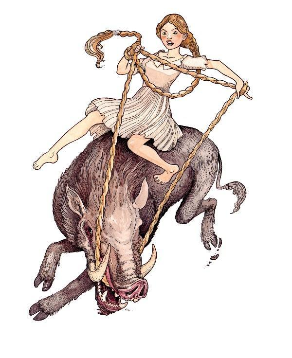

## INFERRING 6

Graphic novels …

The Wonderful Wizard of Oz by L.Frank Baum

Smile by Raina Telgemeier

Purple Smurfs by Peyo/Yvan Delporte

A Wrinkle in Time by Hope Larson

Into the Volcano by Don Wood

Darth Vader and Son by Jeffrey Brown

Vader’s Little princess by Jeffrey Brown

Amulet: The Stonekeeper by Kazu Kabuishi

Artemis Fowl by Eoin Colfer

Babymouse – Queen of the World by Jennifer Holm

Call of the Wild by Jack London

Copper by Kazu Kabuishi

A Couple of Boys Have the Best Week Ever by Marla Frazee

Happiness is a Warm Blanket by Charles Schulz

Little Mouse Gets Ready by Jeff Smith

Moomin by Tove Jansson

Mouse Guard by David Petersen

Zita the Spacegirl by Ben Hatke

Foiled by Jane Yolen (Secondary School)

Curses! Foiled Again by Jane Yolen (Secondary School)

The Boxcar Children adapted by Joeming Dunn

Hoop Rat – Sports Illustrated Kids

Wallace and Gromit by Ian Rimmer

Meanwhile by Jules Feiffer

I Lost My Bear by Jules Feiffer

Maus by Art Spiegelman

The Loudness of Sam by James Proimos

Drama by Raina Telgemeier

The Wolves in the Walls by Neil Gaiman

Alia’s Mission: Saving the Books of Iraq by Mark Stamaty

The Strongest Man in the World by Nicholas Debon

Salt Water Taffy by Matthew Loux

City of Light City of Dark by Avi

Jellaby by Kean Soo

Electric Girl by Mike Brennan

Amelia Rules by Jimmy Gownley

You Can Go Jump by V. McLenighan

The Adventures of Captain Underpants by Dav Pilkey

Usagi Yogimbo: Grasscutter by S. Sakai

***Graphic novels** represent a format, rather than a genre. Comics are
presented in a format defined as sequential art – thus the panels, the
text bubbles, and all of the usual trademarks of your local newspaper’s
comic strips. In terms of genre, remember that while superhero tales
traditionally dominated the comics industry in the U.S., today’s graphic
novels range into every possible genre, from literary fiction to memoir
to fantasy.*

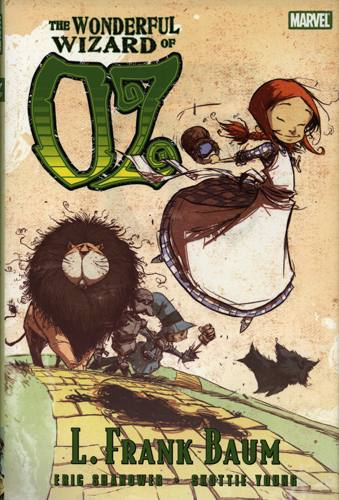

*This is a fantastic rendition of The Wonderful Wizard of Oz! The story
is true to the original and will surprise many folks whose only exposure
to the story is from the old Judy Garland movie. All the wonderful
characters they meet on their journey are here: the Queen of the field
mice, the people made out of China, the Kalidahs, and the rest and then
we have the \*silver\* shoes, the enchanted cap that calls the flying
monkeys to do the bearers bidding, the true, gruesome story of how the
tinman became tin, along with all the killing. My, there really is a lot
of killing in this story. Everything that makes the book such a
wonderful story has been included no matter how small. Now some parts
have been skimmed over, while others got the full treatment which is
only to be expected but I'm very pleased at how true this adaptation
is.*

*The artwork is splendid. The artist has captured the true essence of
the characters in his drawings and brought them to life. Dorothy is pure
farm girl, cute but doesn't take any guff. The scarecrow is perfect. He
is quite a self-involved fellow when it comes down it and he's got the
look of a rather dim-witted know-it-all farmer. The Tinman has been
represented as an actual man made out of tin. His human face complete
with mustache leaves no forgetting that he once was a human being. Then
there is the Cowardly lion; he is a great, big, round puffball who
carries himself with pride. None of Young's illustrations have taken
elements from either Denslow or the movie versions, giving completely
new and wonderful representations of these very well-known characters. A
must read for Oz fans!*

*by Nicola Mansfield*

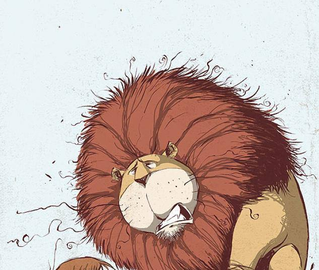

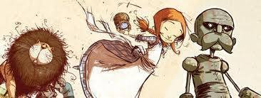

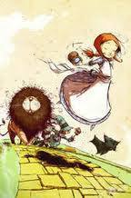

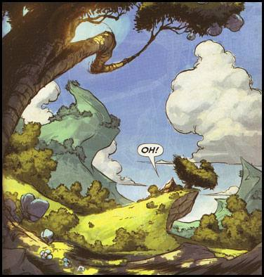

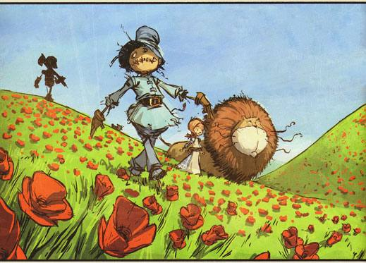

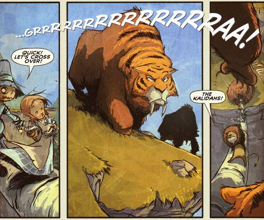

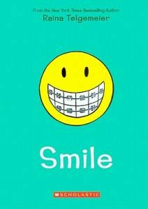

*This is a graphic memoir that follows the author from grade six through
her sophomore year of high school specifically focusing on her dental
problems. In the 6th grade, just shortly before she is scheduled for
braces for an overbite Raina trips and knocks out her 2 front teeth. A
host of other problems follow as we watch Raina's dental nightmare over
the next several years. During this time Raina is going through
adolescence, her normal self-esteem issues at this age are multiplied by
the extensive work she has done which includes a retainer with two false
front teeth attached to it.*

*I loved this book. First the artwork is wonderful. Cartoony but so very
expressive. The characters facial expressions almost tell the story by
themselves. Set in the late eighties, there are lots of fun retro
moments for adult readers in the background as one notices her watching
'Silver Spoons' on TV and they play an original 8-bit Nintendo system.
The dental story is transfixing. I didn't wear braces myself, so that
and all the extra problems of missing teeth and loss of bone, etc. was
fascinating. Raina goes through this experience with pain and complaints
but she is a happy child and can always see the bright side of things,
eventually. Children going through/or about to will identify with Raina
and feel for her while at the same time being thankful they only have to
wear braces. This is also a story about growing up and it very nicely
shows how Raina slowly notices over the years how she has become the
butt of jokes in her group of friends and while no one is mean to her
(on purpose) she's not exactly in healthy relationships friend-wise. As
she grows older she finds new interests, meets new friends, become boy
conscious and starts to feel good about herself on the outside but more
importantly ... on the inside.*

*One notices all the issues being dealt with within this story without
an issue being made out of them and the story is a very enjoyable read.
Both funny and emotional. It isn't until the end that the author spends
a mere two pages waxing eloquently about how in hindsight she realized
she'd moved beyond the child stage and grown-up a bit by the time her
braces were removed. A story that really grabs you from the beginning,
un-put-downable, with a main character who is a joy to meet and get to
know.*

*by Nicola Mansfield*

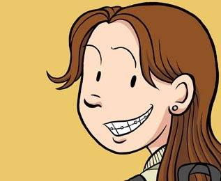

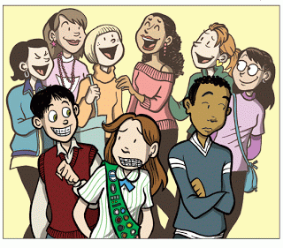

## Before Reading:

Show students the front cover of the book and ask them to make a
prediction, then show them the back cover of the book. Did their
predictions change? Why did they change? What did you notice about the
back of the book? As a class, try to make a general prediction about
what the book will be about.

YouTube: Before reading, this would be a good video to show students to
get them engaged and interested about the book.

## During Reading:

Students will be relating with Raina when it comes to friends,
embarrassment, awkwardness and more. Reading Response Journals -
students write comparing and contrasting how Raina's life is similar to
their life. How does Raina feel in middle school? How is she starting to
feel about her friends? What is she starting to realise about her
friends and about her teeth? How does this relate to your life?

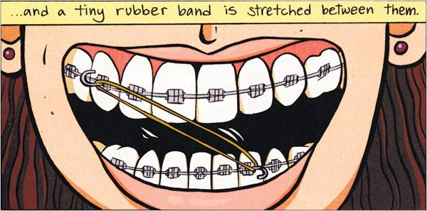

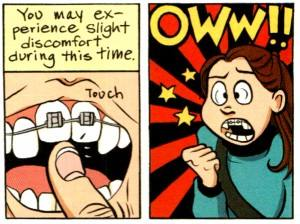

*“This was a story about my life, it was a real personal experience that
I simply told to get out of my system. The incredible thing was once it
was published kids started to read it and kids started to relate to
it.”*

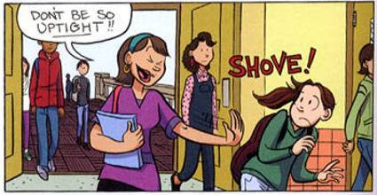

**Writing From Life (The Good and the Bad**)

*I’ve been writing about my life since age 10, when I started keeping a
diary.*

*I’ve been making comics about my life since age 11…when I started
keeping a diary in words and pictures. I put entries into that almost
every day, for about fifteen years.*

*So when it came time to create my first full-length graphic novel,
choosing to write about my own life was a natural decision.*

*Smile is about knocking out my two front teeth just as I was hitting
puberty, as well as entering middle school. I had to go through years of
orthodontic treatment: braces, headgear, false teeth, and lots of
surgeries in order to have a normal-looking smile again. The experience
had an enormous impact on me, and years later, I was still thinking
about it. So I decided to put the whole thing down on paper.*

*Readers are introduced to me, my family members, and my dentists. I
show my house, my family’s car, my dentist’s waiting room as best as I
remember. As the story unfolds, more people and elements from my life
are introduced: teachers, friends, boys, enemies.*

*And of course, these are all based on real people! I changed a few of
their names, and in the case of a couple of my friends, changed or
combined some of their appearances. (By which I mean, the physical
appearance of one friend merged with the personality of another.) It was
a difficult time in my life: my new dental deformities made me terribly
shy and self-conscious, and my so-called friends loved to pick on me. In
the end, their teasing got bad enough that I had to ditch them
altogether, and find new friends to hang out with. It makes for a nice
reading experience, seeing my character grow in confidence enough to
finally stand up for herself…but the people in the story are still real.
The girls who bullied me are real. They are still around, and in some
cases, we are even still internet friends!*

*My readers always want to know if I’ve been contacted by any former
“frienemies.” For a while, if these people realized they were the ones
cast as mean girls in the story, they didn’t say anything. Recently I
have been in touch with some of the people who mistreated me all those
years ago, and in one case, I received an apology. Even though I’ve
‘gotten over’ most of the events in my past, it was a really amazing
moment of closure. I forgave her right away. I got the sense she had
been hanging on to her old baggage as well, and I hope that now the air
is clear.*

*Another person who tracked me down is my old orthodontist, “Dr.
Dragoni” (not too far off from his real name). I drew him the way he
looks, and I drew his office the way it still looks to this day. He’s
still in practice, and I guess his patients (who are all the perfect age
to be reading my books!) discovered Smile on their own, and brought it
to his attention.*

*He was thrilled to see himself in my story, to say the least! He
remembered me well: my orthodontic case was so extreme, he actually once
presented my treatment at a dental conference. I remember him as being
sort of a horrible guy (part of my motivation for the name change), but
when I met up with him again after Smile was published, he couldn’t have
been nicer. Turns out my perception was based on the fact that he was
always sticking painful metal objects in my mouth and making me look
funny! He was probably very nice and caring at the time. I just don’t
remember it that way.*

*So, always take memoirs and real-life stories with a grain of salt. The
author’s memories are their own, and don’t always match up with the
memories of everyone else who was there. Still, I’d argue that emotions
are as true as fact. I remember exactly how I felt when I knocked out my
two front teeth, and if I can relay those emotions as honestly as
possible in my stories, then they are true stories. Even in fiction,
stories can feel completely true!*

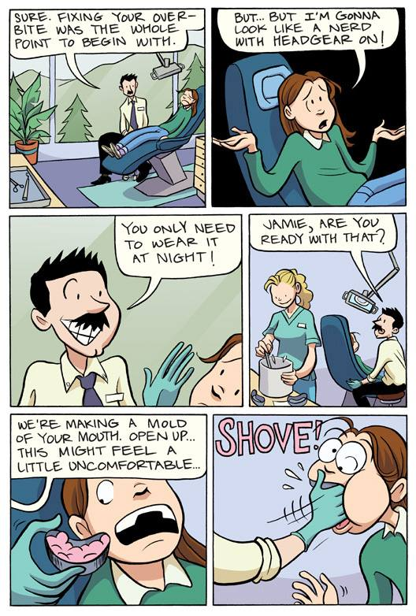

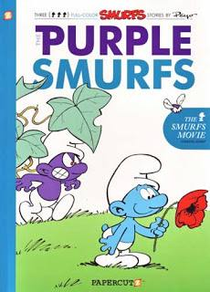

This volume reprints three classic Smurfs stories, the title story for
the first time. "The Purple Smurfs" is reminiscent of a zombie film and
has a frightening undertone. The story recounts what happens when a Buzz
fly bites a Smurf and turns him into a purple menace. Becoming mean and
violent, the purple Smurf spreads a contagion by biting others. Papa
Smurf - who is surprisingly gruff - recalls this happening once before
when he was younger, but after 104 years he's forgotten the remedy. The
other two tales, "The Flying Smurf" and "The Smurf and His Neighbours"
are enjoyable and more fantastical and funny.

The Smurfs have been around since 1958. The creation of Belgian artist
Peyo (Pierre Culliford), Smurfs have appeared in comic books, cartoons,
toy stores, and countless other places. They are an international
phenomenon that have been translated into multiple languages, and they
recently were given big budget Hollywood attention in a new movie
version. Two of the stories here were written by Yvan Delporte,
long-time editor of Spirou magazine, the landmark publication where the
Smurfs first appeared.

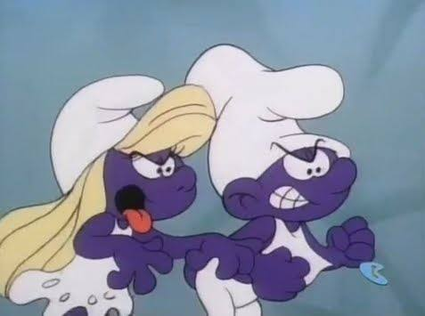

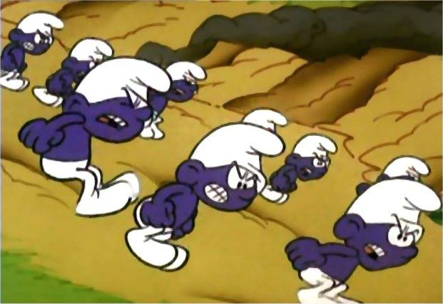

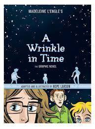

Most of us know this story. It won the Newbery in 1963, and was the
start to Madeleine L’Engle’s incredibly prolific career writing
children’s books. But if you don’t, here goes: Meg Murray is angry. Her
father has been missing for a long time, and even though her mother
insists he’s coming back and she believes it with every fibre of her
being, she misses him. She’s brilliant, but struggling in school because
she doesn’t learn the same way as everyone else (and has something of an
attitude with her teachers and administrators). Her beloved younger
brother Charles Wallace is so smart that most people think he’s stupid.
And her mother seems like the epitome of brilliance and beauty in a way
that Meg doesn’t think she’ll ever achieve. Everything changes on a dark
and stormy night, when a series of events lead Meg, Charles Wallace and
new friend Calvin O’Keefe on an adventure across time and space to
rescue Mr. Murray and save the world as we know it.

It’s a beautiful book, about the lengths we will go to save the people
we love, about accepting yourself for who you are, faults and all, about
science and philosophy and love. It’s a classic. If you haven’t read the
original novel, you should. But if you love this story, or if you’re
seeking a more visually oriented entrance point to L’Engle’s work, you
absolutely need to take a look at this book. Every character is captured
beautifully, and the emotional resonance of small moments is told in
impeccable detail.

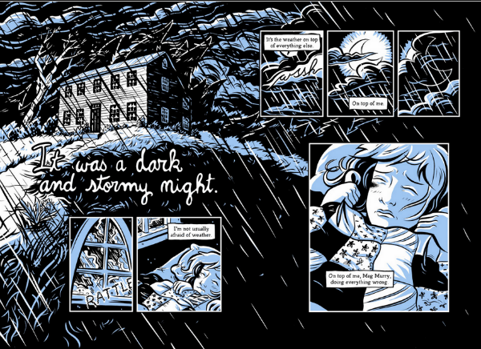

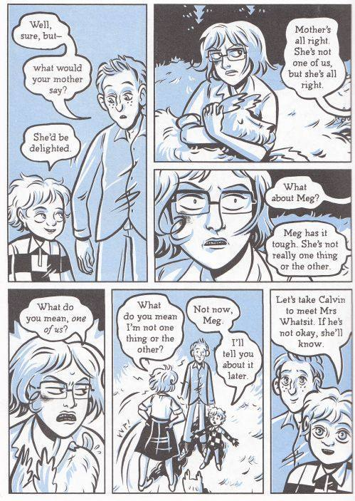

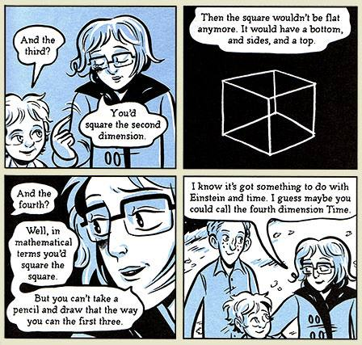

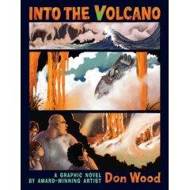

Wood grabs you on the first page as brothers Duffy and Sumo are called
out of their classroom to meet their father who immediately turns them
over to a cousin they have never met before, the burly Come-And-Go.
Before any of us can take a breath, the two boys (who appear to be
between 8 and 12 years of age) are flying off to their just-learnt-bout
mother’s home island of Kocalaha. Once there they and we are thrown into
an extraordinary adventure involving questionable people (are they good
or bad?), an erupting volcano, secrets (of every sort), life and death
circumstances, heart-stopping moments (many of them!), and family ties.
A truly brilliant work.

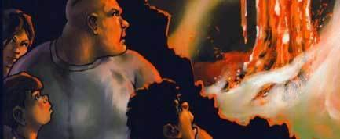

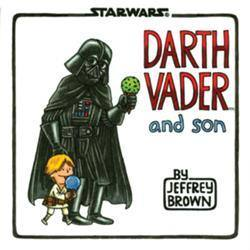

What if Darth Vader and Luke Skywalker had had a normal father/son
relationship? That is the question posed in a new graphic novel called
Darth Vader and Son. Novelist Jeffrey Brown says that Star Wars is a
connection that he can share with his young son – something he didn't
have with his own father.

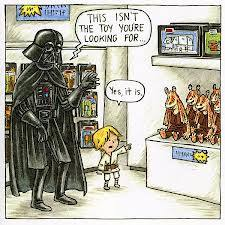

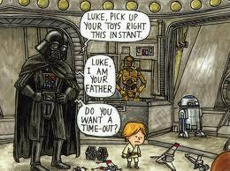

Darth Vader and Son sees Vader desperately trying to be a dad in that
way that many men will recognise, so the obvious question is, does Brown
have children of his own?

"Yeah, I don't think I could have done it before I had a child," he says
from his home in Chicago. Oscar, who is five-and-half, played a big part
in the genesis of the book. "I had a call from a friend who works at
Google as one of its homepage designers – when they have a different
image on the homepage, he is one of the guys who draws that image or
helps to come up with the idea. They were getting ready for Father's Day
and wanted to do something with the idea of how awkward it would be for
Darth Vader and Luke to get together at a holiday dinner."

Oscar was four at the time and Brown says it seemed obvious that he
should make Luke the same age: "You know, to have him frustrating Darth
Vader in the way that four-year-olds generally frustrate fathers …"

Brown did some preliminary sketches for Google, but the company
eventually decided to go with another idea. By now, though, he was
wedded to exploring the concept of Darth Vader taking an active role in
raising his son. Google was fine with him taking off on his own to do
the book – as were the higher-ups at Lucasfilm, the people behind Star
Wars.

Brown threw himself into imagining how staff on the Death Star might
react to a bring-your-child-to-work day, or the practical parenting
applications of the Force. "One of the things that helped to inspire the
book was thinking that, like me, there are so many people who grew up
with Star Wars and they now have kids who are into it too. When I was
growing up, there was nothing my dad was into that had the same
connection.

"It's weird for my wife, because she doesn't know all the Star Wars
stuff, and Oscar and I will be there playing and she's just looking at
us with this look of confusion/amazement/fear on her face."

But you don't have to be a Star Wars fan to appreciate what this tender
little book tells us: you can have all the power in the galaxy, but that
is as nothing compared to the awesome abilities possessed by the average
four-year-old.

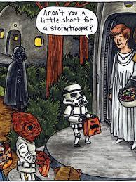

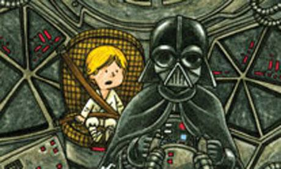

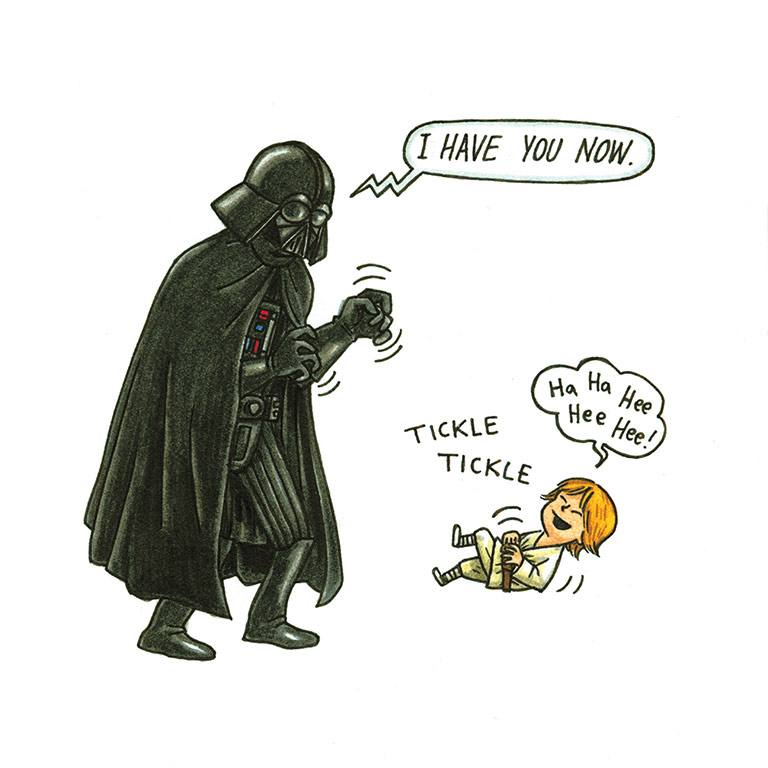

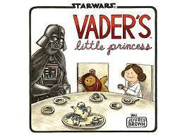

In this irresistibly funny follow-up to the breakout bestseller Darth
Vader™ and Son, Vader—Sith Lord and leader of the Galactic Empire—now
faces the trials, joys, and mood swings of raising his daughter Leia as
she grows from a sweet little girl into a rebellious teenager. Smart and
funny illustrations by artist Jeffrey Brown give classic Star Wars®
moments a twist by bringing these iconic family relations together under
one roof. From tea parties to teaching Leia how to fly a TIE fighter,
regulating the time she spends talking with friends via R2-D2’s
hologram, and making sure Leia doesn’t leave the house wearing only the
a skirted metal bikini, Vader’s parenting skills are put hilariously to
the test.

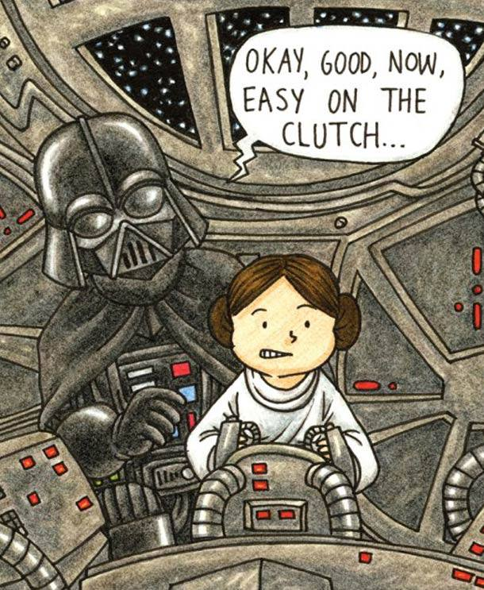

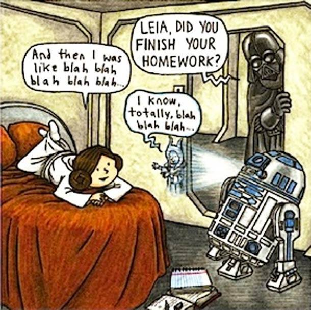

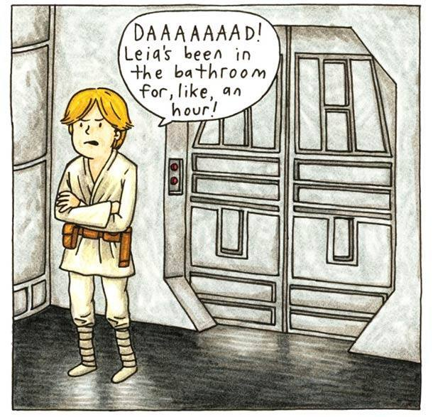

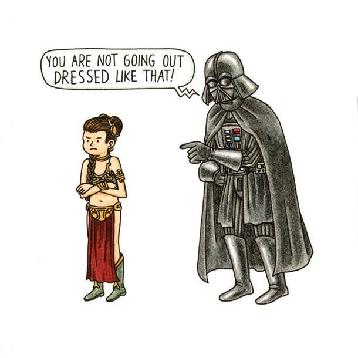

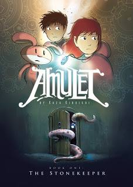

Emily and Navin lost their father in an accident. Their mother takes
them to a new town to start over. The house they move into has been in
their family for years after their great-grandfather went missing. Now
their mom has been taken away too. When Emily finds an amulet necklace,
it starts to help show her the way. What will they uncover deep within
the house, and how do they know that the amulet won't lead them astray.

This was an exciting little tale. I can't believe they killed off the
father within the first ten pages. Terrible. Emily is a very spunky and
brave young girl. She makes for a great heroine for the story. Her
brother, Navin is quite brave too, and maybe a bit more clever than his
sister gives him credit for. The extra characters are fun too. I love
Miskit. I really like the art style, and some of the illustrations are
completely wonderful. If there were puzzles, I would say this book
reminds me a lot of the Professor Layton video games. This has been
labelled middle grade and YA and I think it can easily slip into either
category. I look forward to seeing what lies ahead for these two and the
rest of their family and friends.

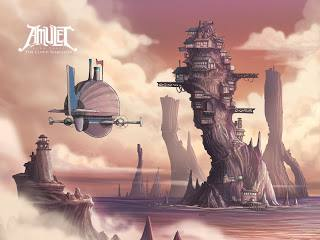

Kibuishi, Kazu (2008) Amulet: The Stonekeeper

Good adventure story. So the short version of book one is that Emily has
inherited this magic stone, and she and her brother Navin have been
transported, along with their sick mother, to a fantasy land where their
companions, including a couple of robots and a pink rabbit are helping
them in hopes that Emily, as stone keeper, will save their world. Also,
they live in a giant walking house. Nice drawing. Persistent theme seems
to be the difficulty of determining who to trust.

Kibuishi, Kazu (2009) Amulet Book 2: The Stonekeeper's Curse.

In volume two, they have to escape a pack of evil elves, aid some
powerful but benevolent trees, rescue their mom, defeat the elf king,
and master the magic stone without letting it take over.

I know that sounds silly.

But here is the thing, a graphic novel is a combination of words and
pictures, and these pictures are awesome. Fourth graders through eighth
graders are going to love this book. It is fun and funny and sometimes
gripping.

This is not the sort of graphic novel with themes in it that will
stretch your consciousness or change your life. But it isn't lightweight
either. It treats the reader as if he or she is intelligent and
perceptive. Good stuff.

Reviews from *Book Commercials*

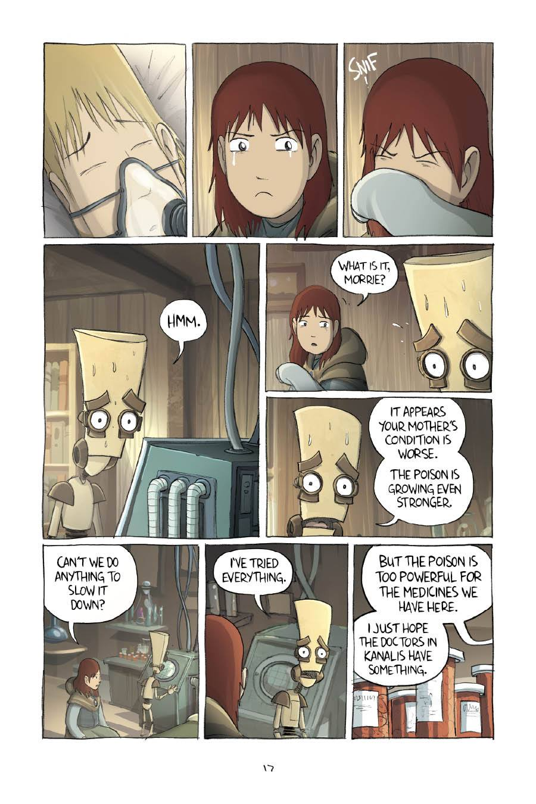

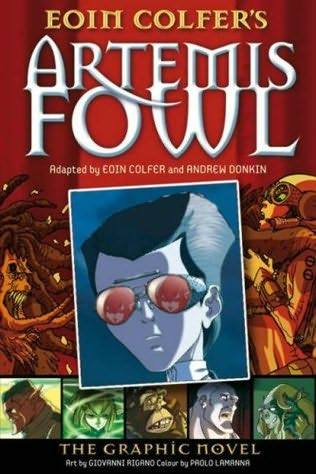

Eoin Colfer has teamed up with established comic writer Andrew Donkin to
adapt the text of his bestselling novels

This is the first novel graphic version and it has the same story as the
first book. Here, Artemis Fowl and his bodyguard, Butler, reveal the
existence of the lower elements, the fairy living underground.

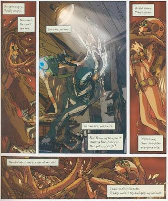

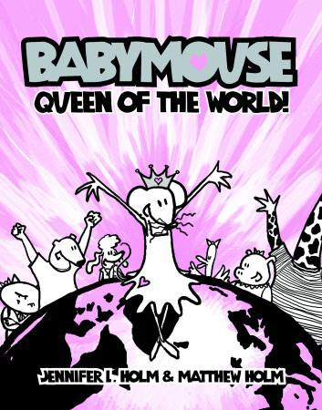

The fun and energy in these books are second to none, and young readers
(and a few older ones) will be happy to see Babymouse's adventures.

Meet Babymouse, a sassy young mouse who dreams of glamour, excitement,
adventure, straight whiskers, being queen of the world, and of course,
being invited to Felicia Furrypaws's oh-so-exclusive party. Readers will
love Babymouse's vivid imagination--an empty locker becomes a black hole
that sucks her into space, boring party becomes a Wild West
adventure--and the clever illustrations and hilarious storyline of
brother-sister team Matthew and Jennifer Holm.

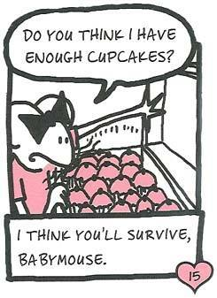

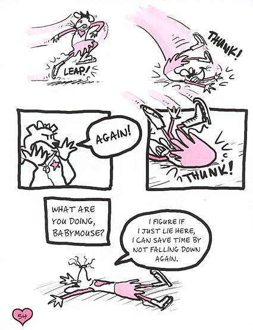

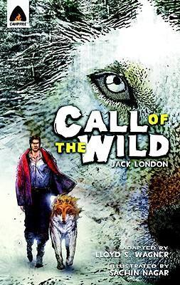

Campfire has managed to carve a wonderful little niche for itself by
adapting some of the world’s most beloved classics to the comics format.
The Call of the Wild is one of the true standouts in that lineup.

Part St. Bernard, part Scotch shepherd, Buck is a sturdy crossbreed
canine accustomed to a comfortable life as a family dog -- until he's
seized from his pampered surroundings and shipped to Alaska to be a sled
dog. There, the forbidding landscape is as harsh as life itself during
the gold rush of the 1890s. Forced to function in a climate where every
day is a savage struggle for survival, Buck adapts quickly. Traces of
his earlier existence are obliterated and he reverts to his dormant
primeval instincts, encountering danger and adventure as he becomes the
leader of a wolf pack and undertakes a journey of nearly mythical
proportions. Superb details, taken from Jack London's firsthand
knowledge of Alaskan frontier life, make this classic tale of endurance
as gripping today as it was over a century ago. One of literature's most
popular and exciting adventure stories, The Call of the Wild will enrich
the reading experience of youngsters, and rekindle fond memories of a
favorite among older generations.

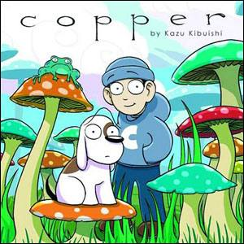

First published as a series of webcomics, Copper expands on the
collection with new stories. All are wild and full of adventure, both of
which give Kibuishi ample room to display his artistic talents.

Copper is curious, Fred is fearful. And together boy and dog are off on
a series of adventures through marvelous worlds, powered by Copper's
limitless enthusiasm and imagination.

Each Copper and Fred story in this graphic novel collection is a
complete vignette, filled with richly detailed settings and told with a
wry sense of humor. These two enormously likable characters build ships
and planes to travel to surprising destinations and have a knack for
getting into all sorts of odd situations.

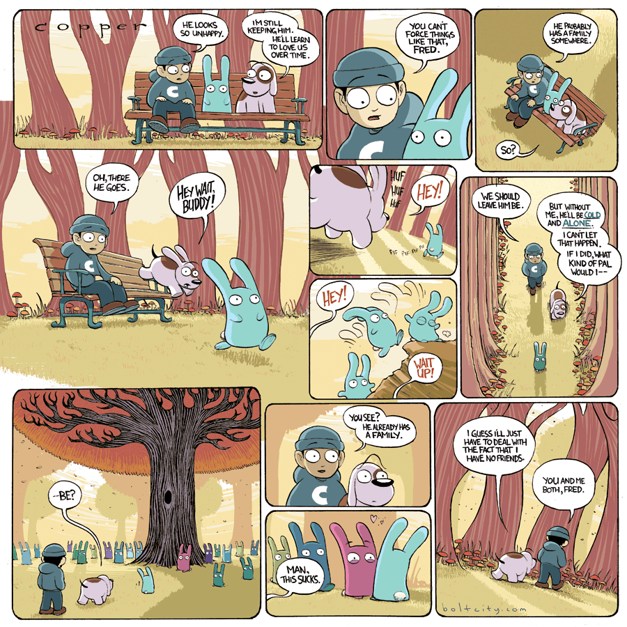

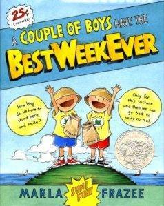

When James and Eamon go to a week of Nature Camp and stay at Eamon's
grandparents' house, it turns out that their free time spent staying
inside, eating waffles, and playing video games is way more interesting
than nature. But sometimes things work out best when they don’t go
exactly as planned.

The words of Marla Frazee's 2009 Caldecott Honor book tell a different
story than the pictures (and the word balloons).

And it's that playful, ironic tug between the two that makes this a
picture book for the ages, one that demonstrates timeless truths
joyously.

The narrator's voice is an adult one, offering a rational, grown-up spin
on events that in reality are driven by a couple of boys being silly.

That narrator tells the story of the two friends, James and Eamon,
staying with Eamon's grandparents (Bill and Pam) so that they can attend
a week-long nature camp.

Nature camp, please note, is Bill's idea.

A lover of the natural world, Bill wants nothing more than to share that
love with the two boys. Nature camp is one part of the gift. Taking the
boys to the penguin exhibit at the natural history museum is the other.

Here's the response he gets:

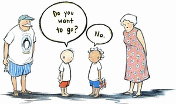

The next line from the narrator is, "They decided to stay home and enjoy
Bill and Pam's company." The image that follows is the boys dashing off
to play, with no regard for Bill and Pam.

… Narration one thing, pictures and dialogue another. Author-illustrator
Frazee is teaching your young ones irony and humour. This simple book is
actually doing something rather sophisticated!

The boys win, but in the end, the grownups, who allow them to win, win
themselves by ceding control.

In fact, you could say this is a book about a win-win. Bill and Pam
model some very instructive win-win parenting (or grandparenting).

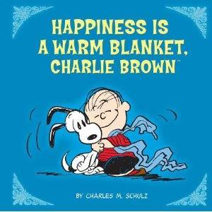

For the first time ever, Charles Schulz’s world-renowned comic strip,
PEANUTS, takes the stage as a graphic novel! Adapted from the brand new
animated special, Happiness is a Warm Blanket, Charlie Brown, this 80
page retelling takes us back to the neighbourhood and features Linus’
insecurities.Charlie Brown’s kite-flying woes, Lucy’s unrequited love
for Schroeder, and everyone’s favourite beagle Snoopy, in a lively and
colourful spin through Charles Schulz’s imagination.

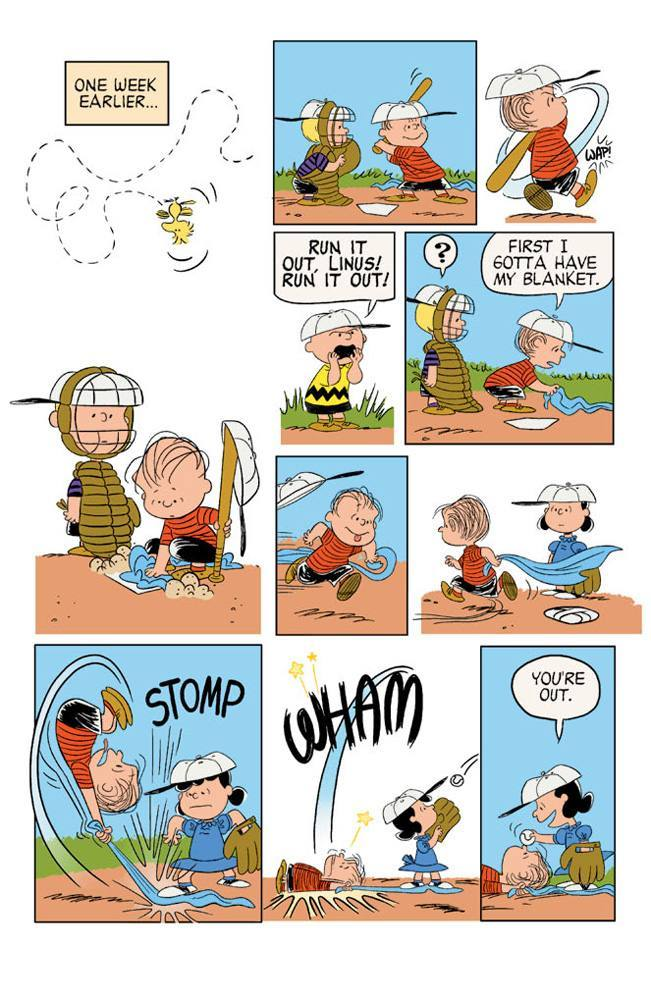

*A Theodor Seuss Geisel Honour Book*

There's lots to do before Little Mouse is ready to go visit the barn.
Will he master all the intricacies of getting dressed, from snaps and
buttons to Velcro and tail holes?

Eisner Award-winning cartoonist Jeff Smith and his determined Little
Mouse reveal all the smallest pleasures of this daily task.

*"Little Mouse is actually a character I created when I was a kid," said
Smith, who also invented his Bone characters as a child. "It's one of
the many characters I made up when I was young. It was just a little
grey mouse with a little red vest.So I thought, ‘Well, maybe he would be
a good character to use in a comic for kids,’ since I used to make up
stories with this character when I was a kid."*

Tove Jansson is revered around the world as one of the foremost
children's authors of the twentieth century for her illustrated chapter
books regarding the magical worlds of her creation the Moomins.

The Moomins saw life in many forms but debuted to its biggest audience
ever on the pages of world’s largest newspaper the London Evening News,
in 1954. The strip was syndicated in newspapers around the world with
millions of readers in 40 countries.

The Moomins are a tight-knit family – hippo-shaped creatures with
easygoing and adventurous outlooks. Jansson's art is pared down and
precise, yet able to compose beautiful portraits of ambling creatures in
fields of flowers or rock-strewn beaches that recall Jansson’s Nordic
roots. The comic strip reached out to adults with its gentle and droll
sense of humor. Whimsical but with biting undertones, Jansson’s
observations of everyday life, including guests who overstay their
welcome, modern art, movie stars, and high society, easily caught the
attention of an international audience and still resonate today.

In the world of Mouse Guard, mice struggle to live safely and prosper
amongst harsh conditions and a host of predators. Thus the Mouse Guard
was formed: more than just soldiers that fight off intruders, they are
guides for common mice looking to journey without confrontation from one
hidden village to another.

Flung across the universe, from star to star, faced with monsters,
magicians, and maybe new friends, an earth girl named Zita must find a
way home.

