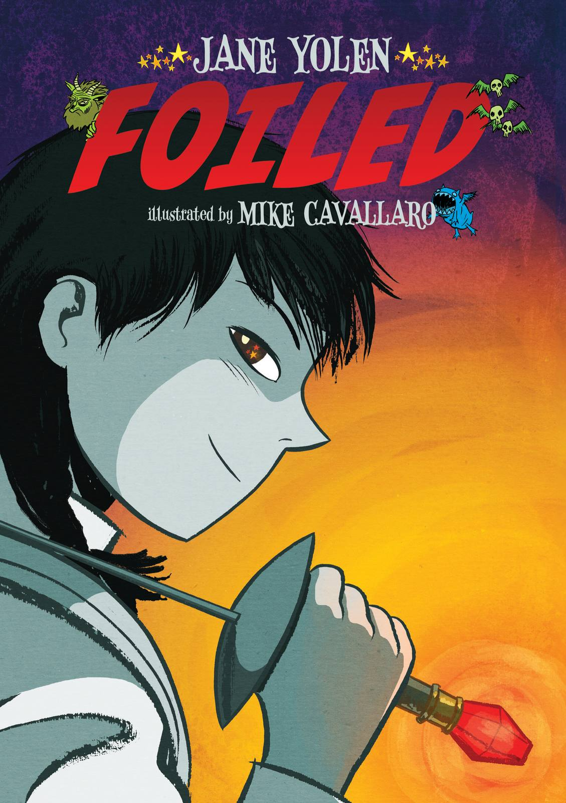

(I recommend Secondary School)

Aliera Carstairs just doesn't fit in. She's always front and centre at
the fencing studio, but at school she's invisible. And she's fine with
that . . . until Avery Carstairs walks into her first period biology
class. Avery may seem perfect now, but will he end up becoming her
Prince Charming or just a toad?

Author Biography:

Jane Yolen is one of the most distinguished and successful authors for
young readers and adults in the country. The author of more than 200
books--including the immensely popular The Devil's Arithmetic, she is
the winner of the Caldecott Award, the World Fantasy Award and two
Christopher Medals. She lives in Hatfield, Massachusetts. Foiled is her
first graphic novel.

Mike Cavallaro is originally from New Jersey. He has worked in the New
York comics and animation industries since the early '90s. Mike is a
member of the web-comics collective, ACT-I-VATE, where he contributes
weekly web comics, including the true-life historic memoir, Parade (With
Fireworks), a 2008 Eisner Award nominee. He lives in Brooklyn.

Review:

Aliera doesn’t really care that she doesn’t have many friends: she has
her cousin, with whom she is close, and she has fencing, which she has
loved and excelled at for years. The arrival of Avery, an impossibly
beautiful boy at her school who challenges all of her barriers and asks
her on her first (horrifically ill-fated) date, ends up distancing her
further from the rest of the world: while waiting for Avery at Grand
Central Station, Aliera discovers a parallel world of fairies, trolls,
and otherworldly beings, a mix of creatures who are all after the
fencing foil that her mother came across at a tag sale. It turns out
that the gaudy fake ruby on the foil is real, the sword is highly valued
and important in the other world, and Aliera is a Defender of the Seelie
court. And since Avery is actually a troll under a glamour, Aliera’s
first date has pretty much hit rock-bottom. In this graphic novel, Yolen
seamlessly integrates fencing terms into the chapter titles, the banter
between Aliera and Avery, and the ways in which a key fairy describes
Aliera’s parallel destiny, emphasizing both how deeply integrated the
sport is in her life and how it is entirely plausible that she could be
a chosen savior, in spite of having been raised as just a typical NY
kid. Color in the illustrations is creatively applied, with much of the
book in near-monochromatic colour schemes of greyed out blues or greens
with black to highlight Aliera’s colourblind view of the world; only the
non-human creatures show up in shocking, vivid hues. The art often
specifically adds to the text, highlighting emotions (positive and
negative) that the deeply private Aliera would never admit to having.
Both fantasy and graphic-novel fans will eagerly anticipate an
inevitable sequel.

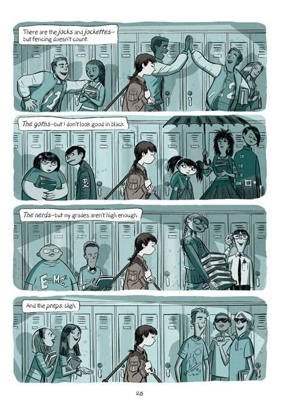

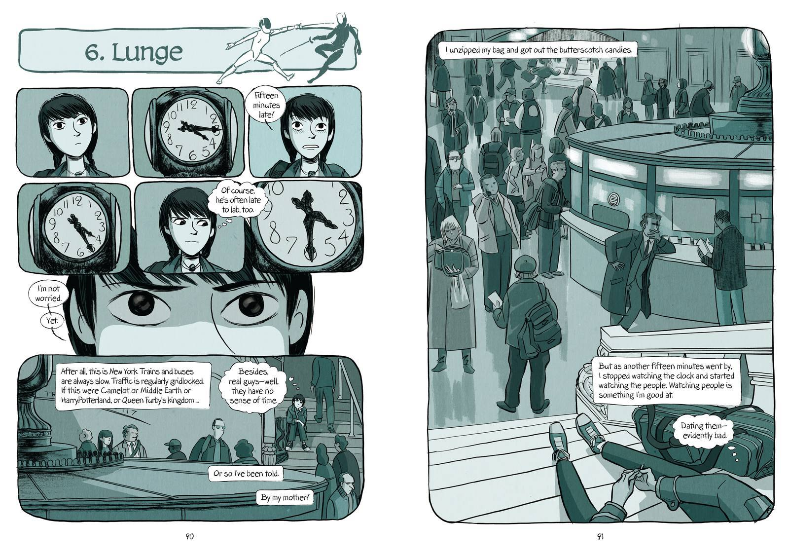

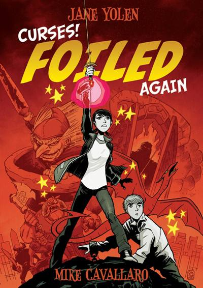

(I recommend Secondary School)

Yolen, Jane. (2013) Curses Foiled Again New York: First Second.

It completes the story begun in Foiled. Aliera Carstairs is a high
school student who works hard, likes to read, and is passionate about
fencing (sword fighting, not chain link and picket fences). She has been
taking lesson for years and is very good with a foil. In the first book
her mom was at a garage sale and bought her a fencing foil with a red
jewel at the end of the hilt. It turned out that the foil was enchanted
and allowed her to see the faerie world all around her. This led to some
odd and otherworldly experiences and the discovery that her lab partner
was a troll. Now in the second book, we are drawn into the real conflict
-- a save-the-world-from-utter-destruction kind of thing with plenty of
close calls, plot twists, narrow escapes, and surprising revelations.
Good stuff. Mike Cavallaro's illustrations are exciting and engaging.
The use of colour to indicate the separation between the mundane world
and the faerie one is well handled. The facial expressions are
particularly well-rendered.

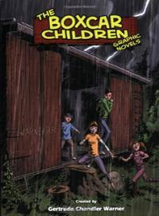

Henry, Jessie, Violet, and Benny Alden are brothers and sisters--and
they're orphans. The only way they can stay together is to make it on
their own. One night, during a storm, the children find an old red
boxcar that keeps them warm and safe. They decide to make it their home.

Gertrude Chandler Warner's classic stories about the Alden children -
Henry, Jessie, Violet, and Benny - have been entertaining young readers
for generations. Now, everyone's favorite easy-to-read mysteries are
graphic novels! The original Boxcar Children stories you know have been
adapted by world-class authors and illustrators to appeal to a whole new
generation.

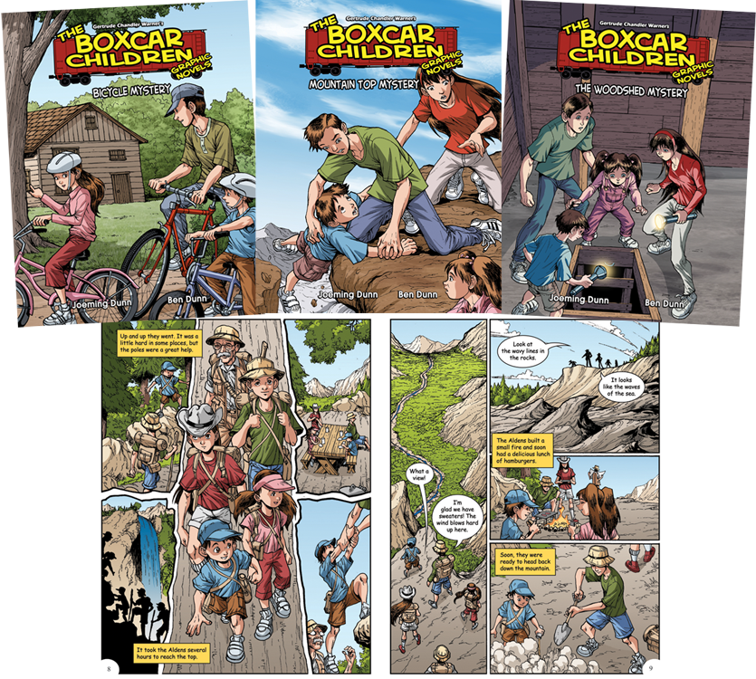

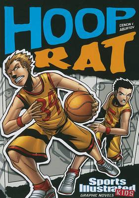

Trey McTiernan, the Spartans' team captain, becomes fast friends with
Griffin Henshaw, the newest member of their squad. The problem is, Griff
used to play for the Spartans' biggest rivals, the Goliaths, and the
rest of the Spartans' think he's a rat. So, Trey's teammates set a trap
for Griff to see where his loyalties lie - and they ask Trey to be the
bait! Trey doesn't know what to do. If his teammates are right, then
betraying his friendship with Griff will save their season. But if
they're wrong, then Trey will end up being the rat . . .

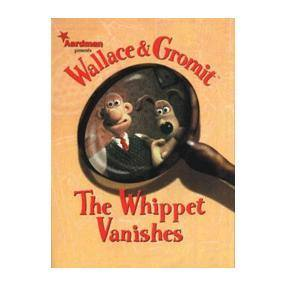

More all-new comic strip adventures featuring Wallace & Gromit and a
host of loveable characters from the multi-Oscar winning Aardman
Animation! In The Whippet Vanishes, Wallace & Gromit turn pet
detectives, on the trail of a missing prize pooch. Dark deeds, dog leads
and garden gnomes...there's nothing elementary about this mystery!
Wallace & Gromit have featured in three films which are adored by all
ages -- A Grand Day Out, The Wrong Trousers and A Close Shave -- and
with their unique British humour and inventive approach to life, they
are now among our best-loved characters, appealing to children and
adults alike.

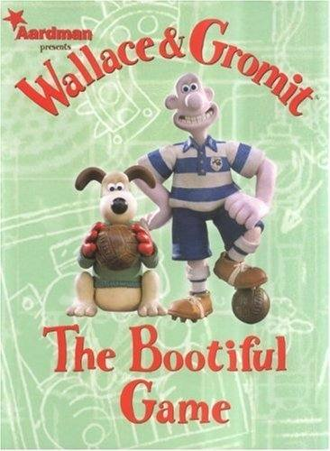

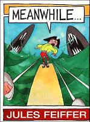

“Raymond, I want you!” Just when Raymond is in the middle of a comic
book, his mother calls him. Not once but five times. “It's not fair!”
Raymond thinks. Then he thinks: “What if I had my own MEANWHILE...?”
Comic books always use MEANWHILE... to change the scene. So Raymond
tries writing it on the wall behind his bed.

To his astonishment, Raymond discovers that he can MEANWHILE...from one
perilous adventure to another'from pirates on the high seas, to Martians
in outer space, to a posse and a mountain lion out West. Then, at the
worst possible moment, Raymond's MEANWHILE... fails him, leaving him in
a spot that spells certain doom! Unless . . .

Review:

This book is the perfect mentor text for teaching students to use
transitions in their writing. The continuous repetition of the word
"Meanwhile..." stands as reminder of the concept of helping your story
flow from one place to another - in a quite literal way.

The pictures are humorously drawn and invite conversation.

After a while, students can predict what is going to happen next, and
this predictability teaches text structure and gives way to critical
thinking. As long as you have no problem with finding creative ways to
repeat a phrase over and over (and over) again, this book can be a real
classroom gem.

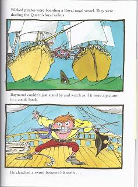

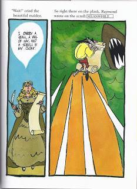

Lesson:

Revise transition words before this lesson.

Read Aloud: Meanwhile by Jules Feiffer.

As you are reading, point out how the author uses the transition word
"meanwhile" in the story.

Does the word help make the story flow?

What other transition words does the author use to start his sentences?

Explain to students that transition words help make the story "flow"
more smoothly and vary sentence beginnings to make the story more
interesting.

Make a list of transition words used in the story.

Students add some of their own transition words to the list. Examples:
however, after, first, then, last, finally, as soon as, until, before,
etc.

Independent Writing:

*Going on an adventure*.

Whole class: brainstorm a list of possible places they could travel to
on their adventure.

Individual planning sheets before writing.

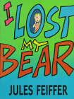

It's not under the bed, or on the chair, or beneath the couch, or behind
the curtains. It's GONE!

What do you do when your favourite toy disappears, and you can't find it
where you left it? What if your family is NO help at all? A determined
little detective heads up the search, and discovers more than she ever
expected.

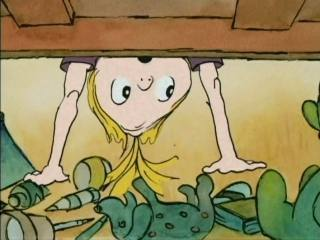

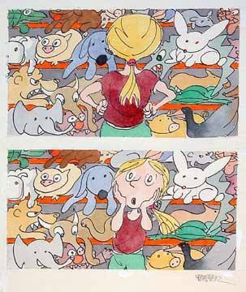

**A Graphic Novel for you to read.**

**Maus by Art Spiegelman**

Review:

A child of Holocaust survivors, Art Spiegelman created a striking
retelling of Nazi Germany in Maus. He took a disturbing quote from
Adolph Hitler (“The Jews are undoubtedly a race, but they are not
human”) and used it as inspiration for turning the Holocaust into a
grisly cat-and-mouse game. Moreover, he laid bare his own troubled
relationship with his father and his guilt over the suicide of his
mother. The result is epic and so simple at the same time; the
combination is ultimately so disarming that the reader is overwhelmed by
the sheer force of it all. You don’t so much read Maus as surrender to
it. The atrocity of the situation is magnified by the storyteller’s
innate gift at bringing out such specific examples of humanity, from its
simple joys to its deep sadnesses. Is there something very telling about
the child of a Holocaust survivor depicting his own people as rodents
and their oppressors as sly cats? Possibly. The question is certainly
worth pondering while reading, especially considering how Spiegelman and
his father interact and the painful way they can’t ever seem to see eye
to eye. But the use of cartoon animal imagery in the book shows off the
fact that this is the most insidious example of the predator and prey
relationship in recent human history. The first Maus won the Pulitzer
Prize in 1992 (its almost equally moving sequel, Maus II, is collected
here as well) and was nominated for a National Book Critics Circle
Award, and deservedly so.

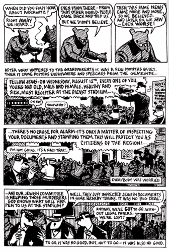

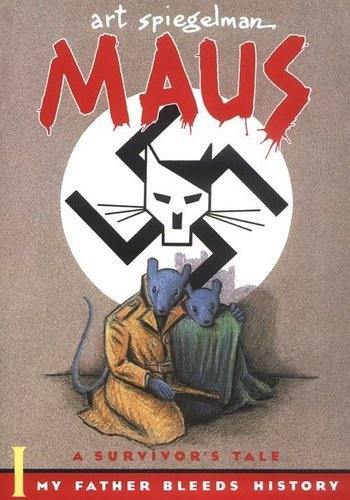

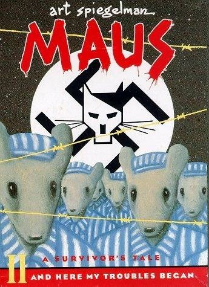

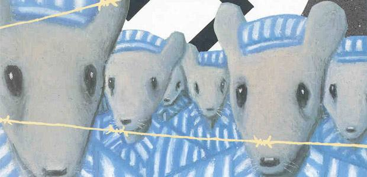

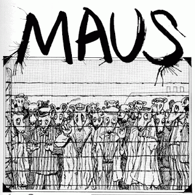

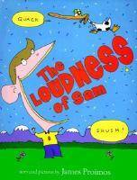

When Sam laughs, Sam laughs loudly. When Sam cries, Sam cries loudly.
But while visiting his aunt Tillie in the city, Sam is surprised to
discover that some people--in fact, many people--hold in their feelings.
Can Sam survive a week with Aunt Tillie, a week when he is often told to
"hush"?

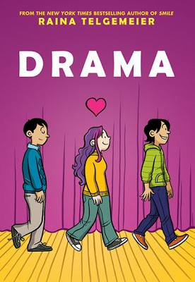

From the BLURB:

PLACES, EVERYONE!

Callie loves theatre. And while she would totally try out for her middle
school's production of Moon Over Mississippi, she can't really sing.
Instead she's the set designer for the drama department stage crew, and
this year she's determined to create a set worthy of Broadway on a
middle-school budget. But how can she, when she doesn't know much about
carpentry, ticket sales are down, and the crew members are having
trouble working together? Not to mention the onstage AND offstage drama
that occurs once the actors are chosen. And when two cute brothers enter
the picture, things get even crazier!

It’s theatre-season at Eucalyptus Middle School, and when it’s announced
that this year’s production will be the wonderfully ambitious ‘Moon Over
Mississippi’ everyone is excited – none more so than set designer,
Callie.

Callie is theatre-obsessed, and has dreams of her set designs making it
to Broadway and beyond one day. For ‘Moon Over Mississippi’ she’s
already envisioning cannon-fire and willow trees.

But amidst her excitement over this year’s musical tour-de-force, Callie
is also grappling wayward crushes and frustrating friends.

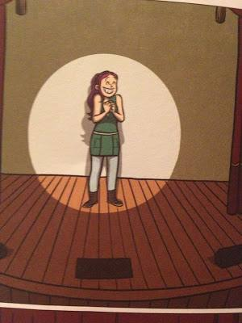

Ever since Callie kissed Greg, brother to her good friend Matt, things
have gone a little bit skewed for Cal … especially since Greg still is
still smitten with bossy Bonnie, and now Matt is acting strange around
her.

But then Cal meets brothers Justin and Jesse – extraordinary singers who
are as theatre-obsessed as she is. Justin has every intention of trying
out for ‘Moon Over Mississippi’, but quieter Jesse refuses to even
audition – although he knows all the songs by heart. Both boys become
good friends to Cal, but when she develops feelings for one of the
brothers, things become even more confusing…

‘Drama’ is the stand-alone, young adult graphic novel by Raina
Telgemeier.

What's so great about 'Drama', is that the backstage creatives are in
the spotlight. And Callie as set-designer and leading lady is really
wonderful - with her shock of purple hair, cool demeanour and heady
broadway ambitions she is one incredible heroine.

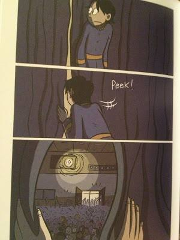

The drawing style is colourful and a little retro – there’s a bit of a
Tintin look to them, which also reminded me of Disney animated series
‘The Weekenders’. There’s a definite cartoon-aspect, which may lead some
people to assume that Telgemeier is writing for a very young audience.
Her books are actually a great crossover – definite appeal for ‘middle
grade’ readers, as well as young adult (I even think these would be
great books for novice adult readers who want to delve into graphic
novels!).

Telgemeier’s artwork is beautiful and clever; like the panels where
Callie is flipping through an enormous photography book of set designs
and costumes – Telgemeier visualises Callie’s obsession for the theatre
and her ambitious dreams by injecting her into the book she’s so
absorbed in.

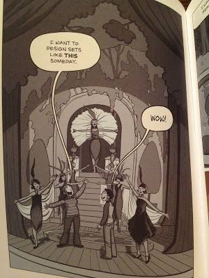

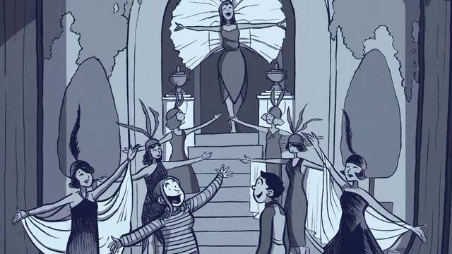

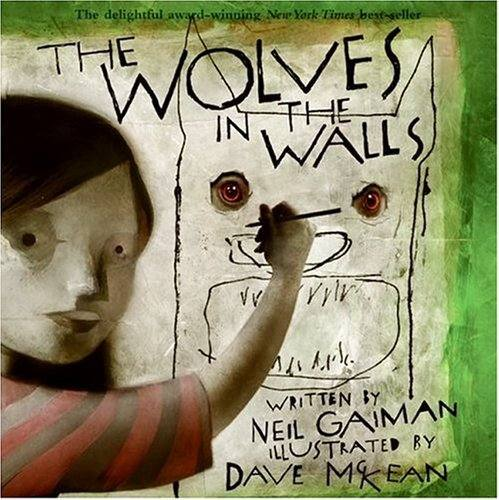

Lucy is sure there are wolves living in the walls of their house—and, as
everybody says, if the wolves come out of the walls, it's all over. Her
family doesn't believe her. Then one day, the wolves come out. But it's
not all over. Instead, Lucy's battle with the wolves is only just
beginning.

The Wolves in the Walls combines an intriguing narrative with dramatic
and original illustrations that will engage children of all ages. This
story opens up the opportunity to easily initiate and engage students in
philosophical discussions about bravery, reality, and morality.
Throughout this book, the overarching philosophical issue is the
conflict between belief and knowledge, and how we as human beings come
to accept certain ‘truths’ as reality. A discussion of these questions
will allow children to approach and view important philosophical issues
in a different way.

*Teaching Children Philosophy*

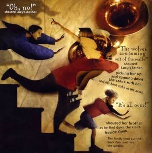

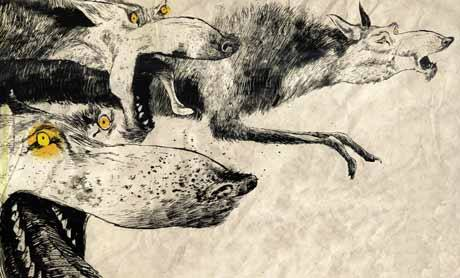

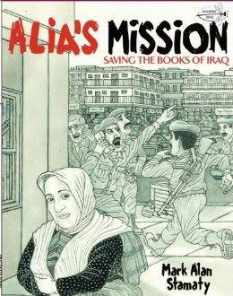

The inspiring story of an Iraqi librarian's courageous fight to save
books from the Basra Central Library before it was destroyed in the war.

It is 2003 and Alia Muhammad Baker, the chief librarian of the Central
Library in Basra, Iraq, has grown worried given the increased likelihood
of war in her country. Determined to preserve the irreplaceable records
of the culture and history of the land on which she lives from the
destruction of the war, Alia undertakes a courageous and extremely
dangerous task of spiriting away 30,000 books from the library to a safe
place.

Told in dramatic graphic-novel panels by acclaimed cartoonist Mark Alan
Stamaty, Alia's Mission celebrates the importance of books and the
freedom to read, while examining the impact of war on a country and its
people.

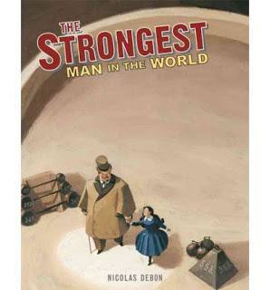

Cyr's feats of strength, like lifting a horse or a platform full of men
are fascinating to young readers. So is the fact that some of his world
records are still held today, over a hundred years later. But Debon
never whitewashes over the hard times, and tells of Cyr's poverty and
struggle to keep his wife and himself healthy and not be scammed by
tricksters in show business.

The two highlights of this book are the afterword which includes
photographs of the huge Louis Cyr and his family, and the the endpapers,
which include other performers of the time like The Bartelli Brothers,
who were bicycle equilibrists (I have no idea what they do but wish I
could see!) and Bergeron who could bend iron nails with his teeth. I
would love to see a story from Debon about any of the other performers
as well.

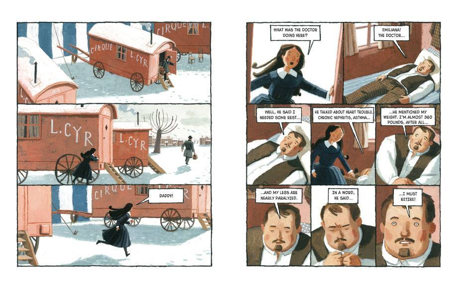

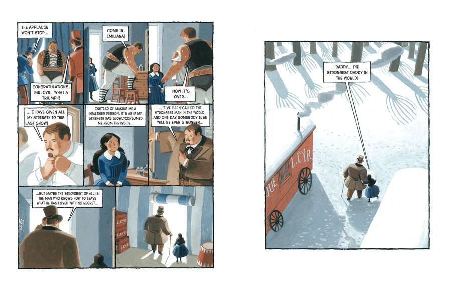

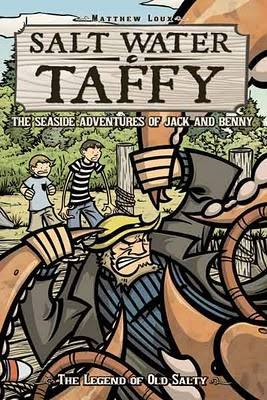

STORY SUMMARY & REVIEW

SALT WATER TAFFY is a delight. It probably helped that I took this
graphic novel with me on our family vacation to Maine because the story
focuses on two brothers –– Jack and Benny –– as their family vacations
in Maine. The older brother is bored out of his head, particularly since
the batteries on his Gameboy have died. What’s he to do now? Explore the
small town in Maine, where they meet with an old fisherman named Angus
who tells them the tall tale of Old Salty, the gigantic lobster who
rules the ocean.

It’s a tall tale, for sure, but the boys can’t help but get drawn in,
particularly when a band of thieving lobsters (you heard that right)
steal salt water taffy from the downtown store (yep, you heard that
right, too) on behalf of Old Salty, who apparently has a bit of a sweet
tooth (yep). The boys help Angus grapple with Old Salty (scenes of Moby
Dick come to mind), spark a revolution of freedom by the little lobsters
and forget all about that Gameboy in lieu of living a real life of
adventure.

There are plenty of moments of comedy, including the “meeting” of the
lobsters and a mysterious visitor to the town which turns out to be a
flock of seagulls in a strange disguise. It’s all great fun in SALT
WATER TAFFY by Matthew Loux. (And I see that Loux has put out at least
two more SALT WATER TAFFY books, which is good news).

ART REVIEW

Drawn in black and white by Loux, the art here is a perfect combination
of energy and curiosity. The bodies of the characters are long, and
lean, and seem almost on the verge of movement. The faces of the
characters, particularly Angus the fisherman, contain just enough of a
look of a smile that you know Loux is putting us, and Jack and Benny, on
the road to a tall tale, and that’s okay.

IN THE CLASSROOM

I could see SALT WATER TAFFY having a place on the book stand for upper
elementary or middle school readers. The character of Jack, in
particular, is interesting, as he is cast first as a typical 11 year old
who would rather be anywhere but with his family but then comes out of
his shell through experiences in the real world (as opposed to that of
his beloved Gameboy). The book also provides a nice entry into the use
of setting, as the flavor of New England is all over this story. How
might the story differ if it was set in the Midwest, for example?

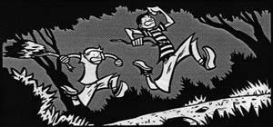

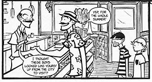

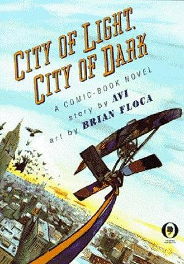

Publishers Weekly (Starred Review):

One of the most versatile YA novelists of the day teams up with
first-time illustrator Floca to produce first-rate science fiction in
comic-book form. After outlining an altered version of New York City's
history, the elaborately plotted saga shows how, through courage and
cunning, two preteens, Carlos and Estella, and Estella's clairvoyant
mother thwart a power-hungry villain and thereby prevent Manhattan from
turning to ice. Against backdrops of neon lights, circling pigeons,
abandoned subway stations and storefronts, Avi and Floca dynamically
convey a timeless tale of good versus evil. Brilliantly parodying the
superhero cartoons of old, this myth conceived in the same spirit as Who
Was That Masked Man Anyway? is sure to be a hit with reluctant and
advanced readers alike.

VOYA (Starred Review):

It’s a great story, full of characters facing Dickensian moral dilemmas
and Vernian grand adventures, a villain one can hiss, and a fantastic
flight over and through the City...an urban fantasy for middle-school
readers who enjoy the 'what ifs' of imagination.

San Francisco Chronicle:

Avi delivers a fast-paced adventure that ably mixes fantasy with urban
reality. Floca’s simple but expressive illustrations capture both the
magic and the grit of New York City.

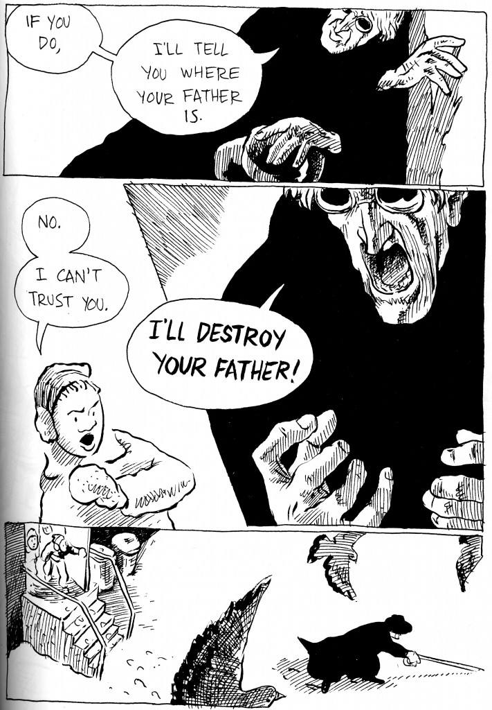

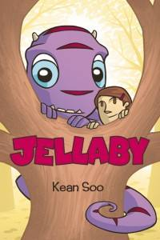

Jellaby enters the life of outcast Portia, a girl who moved to this town
and has never gotten to the point of fitting in. Portia’s father is
absent, perhaps tragically, though the true reason for his absence
remains a mystery in this first installment. Jellaby follows Portia to
school, where he comes into contact with one of Portia’s classmates,
Jason. Jason is also an outcast and seems to be a latch key kid, though
again the nature of his relationship with his parents is not fully
revealed here. The two form a quick friendship over their mutual like of
Jellaby. The story ends with the trio going to the city, because Jellaby
notices something in the newspaper, a door that seems to be a key to
where he might have come from. The adventure continues in Jellaby:
Monster in the City.

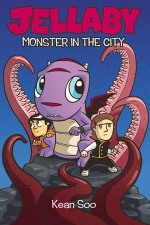

The illustrations are tinged purple, with some exceptions, like Portia’s
barrette and Jason’s shirt. The color is soothing but feels a little
redundant. And the pacing between cells is slow. They show nearly every
action and expression. The gutter space doesn’t rely on the reader
filling in the narrative between panels, which is a great and subtle
pleasure for comics readers. Also, the panels rarely show more than one
character speaking, nor many back-and-forth dialogue within panels. I
think space could have been used more efficiently in this graphic novel.
I am curious to see if Jellaby: Monster in the City is able to wrap
things up.

Kean Soo is a contributor to Kazu Kibuishi’s Flight series, but I think
some of the imagination shown in those books is not coming through here.
This is a pretty typical plot-line for children’s literature, which I’m
sure makes it popular with children, but I’m not sure it translates to
adult readers as well as some other series for kiddies might.

*Hazel Foster*

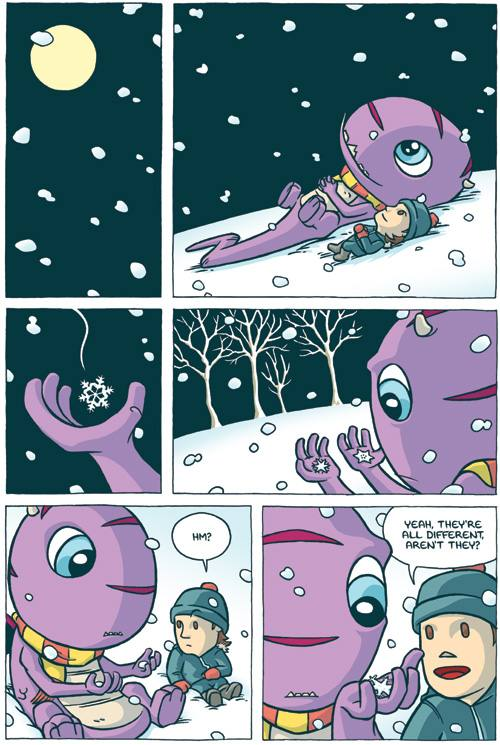

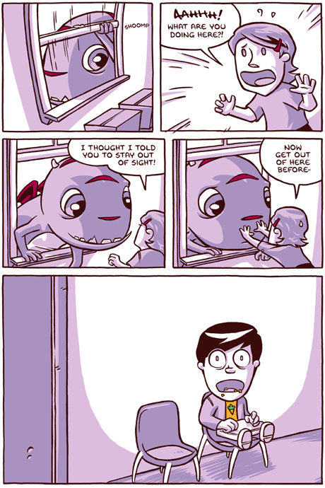

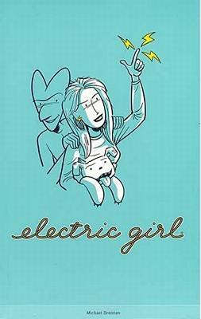

This is a story about a girl and her dog. And her invisible gremlin
friend. And her electricity! Virginia, the electric girl, can release
electricity from her body at will. That's the good news. The bad news is
that her friend is Oogleeoog, an invisible gremlin who's always making
trouble! This book contains the stories from the first four issues of
the "Electric Girl" comic book. Plus, a special bonus story!

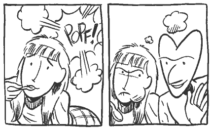

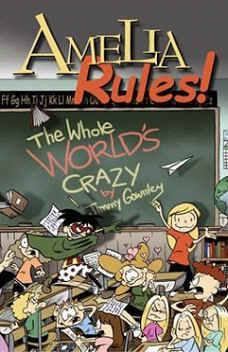

She's nine years old, a former New Yorker who's now living in a small
town after her parents decided to get divorced, and dealing with
everything from being the new kid in school to getting her first kiss.
But you know what? She's got her mom and her aunt Tanner (who happens to
be an ex-rock star) and her friends Reggie, Rhonda, and Pajamaman, and
everything's going to be okay. Except, of course, when it isn't.

In this first book of Amelia's adventures, Amelia and her friends take
on bullies (and Santa!), barely survive gym class, and receive a
disgustingly detailed explanation of the infamous Sneeze Barf.

Review:

The story is serious and funny, and not in the least condescending on
either count. It is intelligently written and drawn, and is
unapologetically opinionated. One criticism, for example: Perhaps
children’s venues too often find themselves along the lines of Amelia’s
new school Joe McCarthy Elementary: “Weeding out the wrong element since
1952.” That Amelia is uncensored is a large part of her appeal. In World
that is Crazy, what does childhood really look like? Amelia is that
creative independent thinker many fear–and long for.

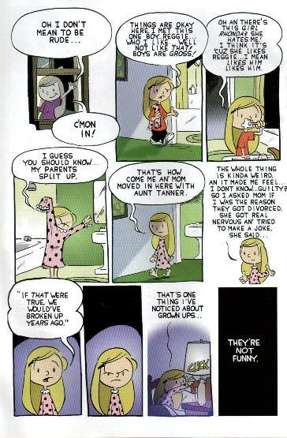

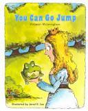 by Valjean McLenighan

An easy-to-read cartoon rendition of "The Frog Prince" which ends with a
new twist.

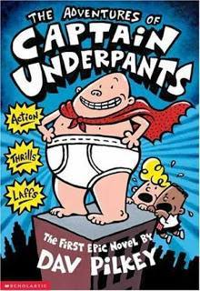

George and Harold are always getting into trouble for pulling pranks,
making jokes, and causing trouble while at school. One day they decide
to make a comic book with the lead character being Captain Underpants.
After being blackmailed by their principle, George and Harold use a
hypnosis ring on him, turning the principle into Captain Underpants!
Captain Underpants fights the crime of the city, namely Dr. Diaper and
his evil robots, before George and Harold can transform their principle
back to his regular form.

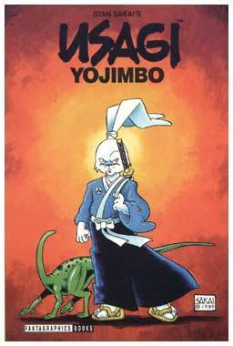

Stan Sakai was born in Tokyo, Japan, grew up on Hawaii and settled in
California. He is the creator, writer and artist of 'Usagi Yojimbo', the
comic book series about a samurai rabbit wandering in an anthropomorphic
17th-century Japan. For this series, and for his drawing style, Sakai
received several awards. The character Usagi proved so popular that he
appeared on the animated 'Teenage Mutant Ninja Turtles' series, as well
as on clothing and toys. Sakai also worked on 'Albedo', 'Critters',
'Donald Duck' and 'Turtle Soup'.

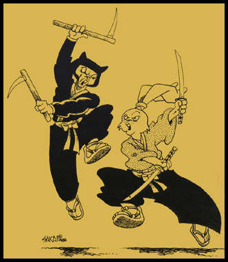