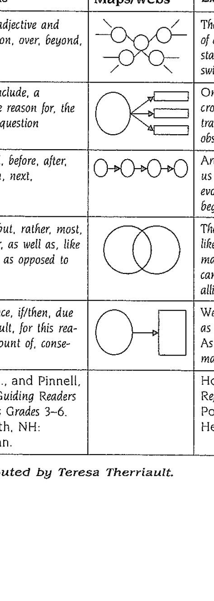

# Information Report

> Reorganised from Jim's 32-page scanned pack. His wording is kept; headings
> and section order are mine. Original page numbers are marked `<!-- p.N -->`.
> (A second scan of the same pack, *Jim K Information Report.pdf*, held
> nothing extra — only this copy is kept. A margin note there pointed to
> mentor texts for informational text structures at
> the-teacher-next-door.com.)

## 1. The genre

**Purpose:** to document, organise, and store factual information on a topic.
Information reports classify and describe the phenomena of our world.

**Text organisation:** opening general statement → facts about various
aspects, grouped into topic areas → ending summary statement.

**Types:** general descriptions (animals, machines, plants, space); specific
descriptions (a specific animal, plant, planet…).

**Language features:** action verbs; usually present tense; linking verbs
(is, are, has, have); descriptive language — factual and precise — used to
define, classify, compare and contrast; technical vocabulary; diagrams,
photos, illustrations, prints; a "captivating" lead; voice — own voice comes
through, and descriptive language allows for visualising.

<!-- p.2 -->

## 2. Teaching approach: KWHL

**K — What we already know.** As students list, categorise. A matrix can be
constructed.
**W — What do we want to find out?** Questions join the matrix, linked to
categories.
**H — How to find information.**

- Me — what I already know.
- Friends, teachers (experts).
- Excursions — with a clear focus.
- Observations.
- Home — relatives, friends (experts).
- Internet; television.
- Research — books, magazines; photos, illustrations, prints; diagrams; CDs,
  tapes.

**Research skills:** notetaking; using memory; key wording (some nonfiction
books use bold print to highlight key words); access features of text.
**L — What we have learnt.** Added to the information list; notes become the
report's basis. Students decide what to use and build a planning sheet with
the report graphic organiser.

Earlier mini-lessons keep the lead in mind. Then the writing process:
planning → drafting → revising → editing/proofreading → publishing.

<!-- p.2–3 -->

## 3. Worked example: echidnas

**Lesson plan.** K — list and categorise under headings, e.g. habitat,
appearance, enemies, defences, food, senses, movement, species,
reproduction, growth, action, communication. W — use the headings. H —
investigate how to find answers; notetaking with key wording. L — what we
have learnt. Keep many nonfiction texts in the classroom library.

*There's an Echidna at the Bottom of My Garden* (Jackie French) is an
excellent read-aloud, read-along or guided-reading text — written in two
genres: the true story of George the echidna who does live in Jackie's
garden, plus informational text about echidnas. Use it to demonstrate
notetaking and the matrix.

<!-- p.4 -->

### The informational text (Jackie French)

Often the best time of year to see echidnas is in spring, when the days are
warm but not too hot — the young males may be searching for new feeding
grounds.

Echidnas are found all over Australia wherever there are ants or termites to
eat, and no dogs and cars to kill them — also in New Guinea, including the
long-beaked echidna, now extinct in Australia.

Echidnas have spines along their backs, but hair as well, along backs,
fronts and legs — black, light brown, sometimes a white chest patch. Spines
protect against goannas, foxes, dingoes. Scared, an echidna rolls up showing
only spines while its feet dig frantically beneath, covering its body with
soil or leaves. They can spread spines to wedge between rocks so they can't
be pulled out.

Messy eaters — you can tell where one has been. Mostly ants and termites; in
late winter, spring and early summer they burrow into large nests or mounds,
often on the warm northern side where fat young queens wait to emerge. Also
earthworms, small beetles, moth or beetle larvae.

With enough food they stay put, but can move fast — trotting nearly half a
kilometre an hour (people walk about four). Young males seeking grounds in
spring may travel four or five kilometres in days; echidnas have been found
fifteen kilometres from one feeding area to another.

They "lick" food with sticky tongues, grinding it to paste between spiny
tongue and mouth pads. Long, flexible tongues — without one, an echidna
couldn't eat. Droppings are long and round, full of dirt and insects, found
where it fed.

Echidnas roam day or night — after hot days, more likely at night. Very
short-sighted but sense movement; they know when to roll into a spiny ball.
Excellent hearing; noses sense ground vibrations.

Long flexible noses with two nostrils — sensitive enough to feel and smell
strange objects, strong enough to nose out ants, worms, grubs.

They hibernate in winter — temperature drops, months without food or water,
though sometimes seen wandering on warm winter days. They shuffle (skirts too
long to walk fast): legs one side, then the other. Shelter under bushes,
digging into dead leaves; hollow logs, under rocks or roots; caves in hot
country.

Echidnas are mammals with a pouch like marsupials, but monotremes — they lay
eggs (platypuses too). Babies hatch in spring; the eggs are soft-shelled, not
hard like hens' eggs. Ever only one egg in the pouch, hatching after about
ten days.

Mothers feed milk; the baby stays in the pouch growing hair and spines,
opening eyes, sucking milk from pores in the mammary glands. After about
three months the mother squeezes the baby out but returns daily while it stays
curled, mostly asleep — nudging it gently till it's lying under her front.
Me then arches up so the upside-down baby can suck for about an hour. (It
sucks so loudly you can sometimes hear it and tiptoe up to look.) The baby
drinks a lot at one feeding — sometimes almost 10% of body weight.

Usually you see one echidna at a time; under a year old is very rare.

<!-- p.5–6 -->

### List poems from the learning

Turn the learnt list into a list poem — Jim's, from what he knew:

> What I knew: Echidnas. Prickles. Short-sighted. Nose twitching, sniffing
> the air. Auger-like snout. Long tongue for licking ants. Sensing ground
> vibrations. Hairy head. Sinks into the ground. Powerful legs scraping dirt.
> Hollowing a pocket. Hides. Curls up into a ball. Burrows to safety.
> Golden-tipped spines. Defense. Hibernates. Soft-shelled egg. Pouch.
> Milk-sucking baby. Tiny button-eyes. Mammal.

Jim's crafted version, **The Echidna** (signed "Mr K"):

> A small bundle of prickles waddling across the paddock. Short-sighted; its
> nose twitching, sniffing the air. An auger-like snout with long tongue
> licking up ants. Hungry after hibernating. Sensing ground vibrations it
> turned — tucked in its hairy head and sank into the ground; powerful legs
> spraying dirt; hollowing a pocket in which to hide. Curled up into a ball
> it burrowed to safety, leaving a mound of golden-tipped spines in defense.
> Perhaps a soft-shelled egg in its pouch will hatch into a milk-sucking
> baby. Looking up from the scrape, the tiny button-eyed mammal shuffled off.

<!-- p.7–8 -->

### Lists in art and comparison

Set out how to make an echidna. Materials: banksia seed cone; sticks, paper,
material or leather (legs); eyes; glue. Procedure: cut out legs; glue legs to
body; glue on eyes. Lists also compare — e.g. monotremes: list echidna and
platypus attributes.

<!-- p.9 -->

## 4. More mentor information texts

### Black-tailed wallabies (Jackie French, *There's a Wallaby at the Bottom of My Garden*)

Black-tailed wallabies — among Australia's most common — eat grass and many
other things, tasting unfamiliar plants and sensing what's good. In the bush:
shoots, new leaves, native fruit — tastes vary per animal. New plants may be
ignored for years, then tried in scarcity and kept if good.

Many wallaby species: from the tiny Nabarlek (~33 mm, northern Arnhem Land)
to the near-metre whiptail (kangaroos one to two metres). Black-tails stand
~800 mm with tails as long again; dark backs, reddish tummies, sometimes
white tail tips or pale face stripes.

Mostly nocturnal, some browse early/late — especially old or blind animals.
Days in sheltered spots — under/behind bushes, fences, long grass, reeds,
usually the same place (find the tracks). Rock wallabies take caves and
overhangs.

Feeding reads like our dinners — grass, young leaves, shoots in combination;
in drought or goat competition, one food exhaustively before moving on.
Black-tails mostly solitary; red-necks form small mobs. Bushy undergrowth;
rock wallabies in hills and caves; tree kangaroos in trees on leaves and
fruit.

Joeys lean from pouches nibbling grass while mothers feed — one joey at a
time: milk from four teats, then leaning out, then exploring, staying close,
ducking back to drink. Blunter, rat-like faces versus kangaroos. Drink at
creeks and "soaks", sundown or dawn (also dew and fruit). Tracks tell the
story: small front prints between long back prints when drinking; only back
prints when hopping — wider spacing means faster, plus tail swish.

Mostly rectangular territories on time-share: afternoon, dawn, strongest at
dusk. Near-silent except hind-leg danger thumps. Adults fall to dogs, cars,
humans; young to foxes, eagles, goshawks. First joey at ~18 months,
independent at ~15 months, up to ten years (drought shortens, good bush
extends). Best viewing at dusk at creeks and soaks. Related to kangaroos but
smaller; common across bush Australia, pests in New Zealand, some species in
New Guinea — nowhere else but zoos.

<!-- p.10–11 -->

### Giant octopus (Karen Wallace, *Gentle Giant Octopus*)

150+ octopus kinds; the Giant's tentacles reached an amazing 4 9/4 metres.
No attacks on humans; north Pacific coastal waters; crabs, clams, sea snails.
Females lay eggs once, eat little or nothing after mating, and die once eggs
hatch.

A gentle Giant jets through shadows — huge like a spaceship, glowing eyes,
ribbon tentacles scattering silver-backed fish. A wandering mother, eggs
inside, seeks a den — a rock crack, a hole under stone. To move fast they jet
backwards, pumping seawater through a funnel siphon. She lands like a huge
rubber flower, muddying sand. Tentacles finger and grip with suckers; eyes
turn front and back. A tentacle finds a crab — nipped, pulled back, the crab
escapes sideways. Sliding over seabed, body stretching like taffy over
stones, skin rippling like seaweed, black as kelp. Colour shifts reddish
brown to dark or pale in seconds.

Under a boulder a wolf eel waits — mottled grey, dagger teeth, ripping a
tentacle (healthy octopuses regrow them). Then it sinks nightmarishly into
its den. Attacked, an octopus inks and jets — she shoots back, pumps and
sucks, and rests quivering on a boulder above a guardable cave. Clever as
cats, curious. She squeezes in, drags pebbles round. Boneless, they fit the
tiniest holes.

Eggs hang like grapes on strings; she guards from crabs and nibbling fish,
never eating or resting. Up to 60,000 tiny eggs; after five months babies jet
out squirming and pumping. Predators take most — two or three per brood reach
adulthood. The mother watches them swim up — a gentle Giant shrinking in
shadows, her life over as theirs begin.

<!-- p.12–13 -->

### Turtles (Jim Arnosky, *All About Turtles*)

Reptiles with shells; can't regulate temperature internally — sun to warm,
shade or water to cool. Northern species hibernate in mud; sea turtles
migrate to warmer areas. 200+ species: freshwater, saltwater, land.

Shells are colourless bone — the hard horn-like skin gives colour and
markings (same for the skull). Sea-turtle shells are thin and light for their
body; big front flippers and muscular necks can't retract; front flippers
paddle, hind flippers rudder. Intelligent, alert, excellent eyesight — often
see you first; keen smell; no visible ears (hearing vs vibration unknown).
Shells are nerve-rich — the largest sensing organ; they feel through feet,
tail, shell.

Young eat insects; adults omnivorous — plants, insects, molluscs, worms,
crustaceans, fish, even carrion. Sea turtles: eel grass, crabs, conches,
clams, oysters, fish, sponges, jellyfish. Snappers catch anything to floating
ducks. Tortoises — least predatory, shy burrowing plant-eaters; US species
are gopher tortoises, sharing burrows with animals including rattlesnakes
("wherever you see a gopher tortoise… watch all around").

All reproduce alike: nest hole, 1–130 eggs by species, covered with loose
soil and abandoned — sun-warmed earth incubates. Predators miss nests; many
hatch and dig out. Hatchlings run for water or woodland cover. From nest to
habitat since the dinosaurs — shells their only protection. Long lives,
100+ years in some species — "but even a day-old turtle knows its way in the
world."

<!-- p.14–15 -->

### Sharks (Jim Arnosky, *Sharks*)

Ancient, little-changed predators in all oceans, most numerous in the
tropics; 250+ species — whale, mako, bull, leopard, great white, hammerhead,
nurse, thresher, tiger among the familiar. Species group into families
(requiem, mackerel, hammerhead, carpet among the largest) with distinct
shapes. Boneless cartilage skeletons — limber enough to bend and bite their
tails. Prey located by sight, smell, lateral-line movement, electrical pores;
blood scent draws dozens into feeding frenzies; snouts "pretaste" by
bumping. No eyelids — but movable nictitating membranes shield eyes when
attacking.

Most attacks happen in shallow shore gullies where fish school — yet given
how often sharks cruise close in, attacks are amazingly rare.

SHARK SAFETY TIPS: 1. Never enter the ocean with an unhealed cut. 2. Wade
only where you can see the floor; avoid murky water. 3. Never swim at night.
4. Never touch a small or injured shark — it can still bite.

40–45 front teeth with up to 7 replacement rows advancing in about a day;
pure white, varying by species. Mostly solitary hunters (some school).
Remoras ride along on scraps. Mating in shallows, internal fertilisation;
some lay leathery egg cases in weeds, others bear live tail-first pups (up to
48) — miniature parents from the first swim. Diets scale with size, great
sharks taking anything; nurse, horn and angel sharks vacuum the floor; whale,
basking and megamouth sharks live on plankton — "we are still learning about
these mammoth sharks… as we overcome our fear."

<!-- p.16–17 -->

## 5. Farm animals unit (Prep)

K — list farm animals (cows, horses, dogs, cats, pigs, hens/roosters,
chickens, turkeys, sheep, goats, ducks, geese, donkeys, rabbits). W — what do
we want to know? H — how: excursion, books, people, internet, television.
L — what we learnt. Report writing via shared writing: opening statement, a
paragraph per animal, closing statement. Single-animal specific reports work
too. List poems — colours, sounds, behaviours, baby names. Mentor texts.

Prep list poems:

> Roosters. Walk on the fence. Cock-a-doodle-do. Wake the farmer up. Wake
> people up so they can do their work. Eat seeds. Tell the hens to lay eggs…
> That's what roosters do. — Nathan, Prep
>
> Peacocks. Show their colours. Eat seeds. Come out in the morning. Live in
> the forest. Show their beautiful, colourful, feathered tails. That's what
> peacocks do. — Simona, Prep

Mentor rhyme — *Moo Moo, Brown Cow* (Jakki Wood): brown cow/green frog,
black sheep/red dog, yellow goat/rainbow trout, white duck/little kitty,
blue goose, orange hen — *"have you any…?" … "Yes kitty, yes kitty…"* —
counting calves to chicks.

<!-- p.18–20 -->

## 6. Sovereign Hill application

Teachers weigh: content, top-level structures, multiple genres, primary vs
secondary sources. Melina's S. T. Gill goldfields prints serve as primary
sources — interrogate organisational patterns through them: *Are two or more
things being compared? List and describe items. Problems and solutions? What
happened — what caused it? Compare your trip with the miners'.* Group prints
so questioning shows three patterns with two elements in the main idea
(cause/effect, problem/solution, compare/contrast): *What is the main idea?
Which pattern links the most important information?* Brainstorm team uses:
compare/contrast (journey, mining methods, flags — Union Jack vs Eureka,
successful vs unsuccessful miners, goldfields vs city life);
problem/solution (working conditions — windsails ventilating shafts);
cause/effect (Eureka Stockade); description (materials lists).

Reading moves: *What structure did the author use? What is the main idea?*
Then supporting details. Four probe questions: comparing? problem+solution?
result of something else? listing/describing? Plan graphically — e.g. the
Eureka Stockade:

Cause → Effect: system of licences → trouble; ex-convict police → brutality;
burnt licences; charged man released; burnt Eureka Hotel; three miners
arrested; pardons refused; built the stockade; attack defeated miners;
charged miners acquitted; later, licence system changed. (*Searching for
Gold.*)

Compare/contrast mining methods:

| Alluvial Gold | Deep Lead Mining | Reef Mining |
|---|---|---|
| Pan used. | Shafts dug. | Poppet head used. |
| Soon ran out. | Tunnels dug off shaft. | Engines hoisted buckets. |
| | Windlass. | Battery crushed rock. |
| | Sluice box. | Water moved debris. |
| | Whim. | |

Then apply structure knowledge to paragraphs — e.g. the windsail paragraph
(deep shafts flood; air fouls; windsail scoops clean air down a canvas tube).
Highlight signal words: "Another problem" = problem/solution.

<!-- p.21–23 -->

## 7. Goldfields articles (unit content)

### Searching for gold

Claims (3.6 m square, worked daily but Sunday) and 30-shilling monthly
licences, payable with or without finds. Alluvial gold: six-times-heavier
gold panning out of creek sand in iron pans — exhausted fast. Deep leads:
metre-square timbered shafts, drives, one man below shovelling to a
windlass-hauled bucket; washing stuff separated in cradles (sieve, riffles)
and sluices. Past 40 m the windlass gave way to whip (pole on forked stick)
and horse-powered variants; past 80 m to the costly whim (drum, pulleys,
counterposed buckets, circling horse). Flooded shafts pumped day and night;
fouled air drawn by windsails. Post-1854 law allowed pooled claims and
machinery. Reef mining: quartz reefs deep-drilled, rock hoisted by poppet
heads and gin wheels, crushed in stamper batteries with water washing debris
away. Ballarat emptied end-1851, then Welsh, Cornish and Scottish miners
restarted a second rush with deep-shaft skill.

<!-- p.24–25 -->

### Life on the Australian goldfields

Thousands walked, rode or barrowed everything in — no roads, shops or houses;
men first, families later, a few women diggers (Bendigo's riches found by a
woman). Claims packed the gullies, camps the ridges: tents, then canvas-wood
bark huts; traders, hotels, calico-lined boarding houses; government camps
with jail, soldiers — even theatres. Few struck it rich; tradesmen,
landowners and service-sellers did best. Ships brought hopefuls worldwide
(seven–eight months, epidemics, arrival weak). Mutton, damper, tea; muddied
creeks, no sanitation, few (sometimes unqualified) doctors — dysentery and
typhoid killed many.

<!-- p.26 -->

### The Eureka Stockade

Under 50 soldiers and a few police in 1851 Victoria; rushed recruitment of
unsatisfactory men, many ex-convicts. Commissioners (£500/year), inspectors,
troopers (mounted, 3 shillings/day), traps (foot, 2/9/day), Aboriginal police
(1 shilling and a halfpenny/day). The 30-shilling monthly licence — payable
found or not, renewable, always carried — consumed policing, leaving crime
(bushrangers, burglary, claim-jumping, violence) unchecked. Burnt licences
and protests changed nothing. In Ballarat, a police-friendly man's dropped
murder charge detonated rage: the Eureka Hotel burnt, three arrested, troops
called. Pardon demands refused 1 December 1854 — 10,000 diggers burnt
licences, elected leaders, built the stockade under the blue Eureka flag
(white cross, five Southern-Cross stars). Before dawn Sunday 3 December, 400
soldiers and police stormed ~150 sleeping miners; Peter Lalor wounded in
hiding; thirteen tried for treason — all acquitted; the licence system
changed.

<!-- p.27 -->

### Chinese at the goldfields

War and famine drove 1853 emigration on trader loans (families staying as
collateral labour); months by cramped ship to Melbourne. Large same-town
teams under head men split mining, cooking, gardening duties; re-worked
abandoned claims rather than deep ground (mountain gods); separate dwellings
and temples, kept apart. Pigtails, bare feet, bamboo-pole loads, unfamiliar
faith — targets of suspicion, resentment, racism; yet hardworking, honest,
law-abiding, with societies guiding newcomers. The 1885 £10 entry tax plus £1
protection fee (no other nationality taxed) failed — they landed in South
Australia and walked hundreds of kilometres. Many stayed: jobs, market
gardens, restaurants, laundries, reunited families — gradually respected.

<!-- p.28 -->

### Women on the Australian goldfields

Few women early — a few diggers and shopkeepers; most home with children on
little money. Later, families joined, men always outnumbering. Women's work:
washing, ironing, cooking; bread, butter, jams, soap, clothes; cramped,
comfortless living; muddied creeks, carted water by the bucket, scarce dear
produce. Childbirth with only neighbours' help; many died; diphtheria,
whooping cough, measles, typhoid, scarlet fever swept all. Margaret Kennedy
found wealthy Bendigo, spotting creek gold September 1851 and washing it in a
breadmaking pan — 20,000 diggers within months. Travelling entertainers
included Lola Montez, showered with nuggets, famed for her Spider dance.

<!-- p.29 -->

## 8. Masters

### On the goldfields — recording findings

Blank worksheet (two columns; student responses beside each heading):
Travelling · Weather · Scenery · Food · Camp Life · Setting up ·
Difficulties · Homes · Other experiences.

<!-- p.30 -->

### Text structures in informational texts

| Text Pattern | Definition | Key Words | Crocodile example | Goose-bumps example |
|---|---|---|---|---|
| Description | Descriptive details (characteristics, actions…) | descriptive adjectives; on, over, beyond, within | *The crocodile is the master of deception… stalks its prey…* | *Goose bumps… little bumps… like sesame seeds.* |
| Problem/Solution | Sets up a problem and its solutions | propose, conclude, a solution, the reason for, the problem/question | *One problem… transportation. How can an observer get close…* | *…disappear as soon as I cover up with a jacket.* |
| Time/Order, Chronological | Information in order of occurrence | first, second, before, after, finally, then, next, earlier | *Archaeologists… the evolution of the crocodile began…* | *First I get cold. Then I shake all over.* |
| Comparison/Contrast | Similarities/differences across items | while, yet, but, rather, most, same, either, as well as, like/unlike, as opposed to | *The power of the crocodile… like a monstrous machine… Compared to the alligator…* | *Some from fear. Others when touched emotionally.* |
| Cause/Effect | Reason/explanation for happening | because, since, if/then, due to, as a result, for this reason, on account of, consequently | *…As a result of the noise we made, the rabbit bolted.* | *When the temperature drops below 45 degrees, my skin crinkles…* |

Sources: Dept. of Education Western Australia, *First Steps* (1995);
Fountas & Pinnell, *Guiding Readers and Writers Grades 3–6* (Heinemann,
2001); Hoyt, *Revisit, Reflect, Retell* (Heinemann, 1999); Harvey,
*Nonfiction Matters* (Stenhouse, 1998). Figure 8-1, contributed by Teresa
Therriault.

Each pattern's graphic organiser (clipped from the scan):

<!-- p.31–32 (blank) -->
