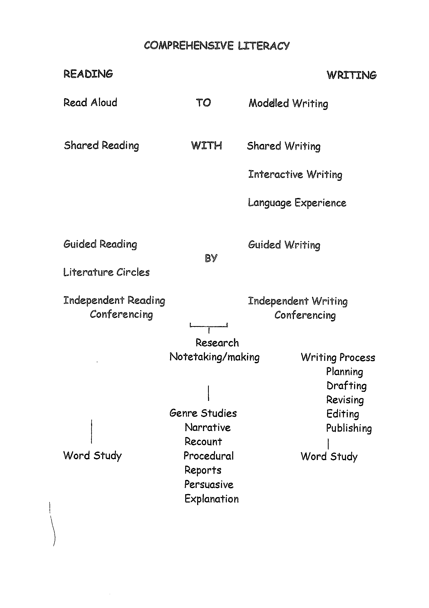
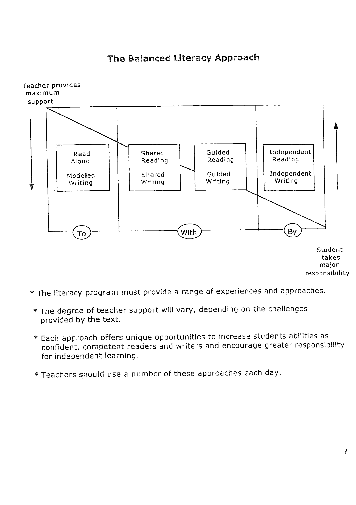

# Literacy Overview

> Reorganised from Jim's 15-page scanned pack: the theoretical base
> (Cambourne), the program map, and the balanced-literacy checklists. His
> wording is kept; headings and section order are mine. Original page numbers
> are marked `<!-- p.N -->`. (Cover p.1 and closing p.15 are blank.)

## 1. Cambourne's conditions of learning

Brian Cambourne: children learn to make meaning using the same language
conventions as the community, and a pedagogy exists that maximises that
probability — built on certain conditions of learning. (*The Whole Story*,
Scholastic, 1988.)

- **Immersion.** From birth we are saturated in the medium to be learnt —
  thousands of examples. What students are immersed in should be whole,
  meaningful, and set in sense-making contexts.
- **Demonstration.** Actions or artifacts — millions of demonstrations of what
  spoken language means, is for, how it functions, how it ties to action.
  Demonstrations are the raw material of nearly all learning. A book is both
  artifact and demonstration: of bookness, print, spelling, text structure.
  Necessary for learning.
- **Engagement.** Before learning, Frank Smith's "engagement" must occur.
  Demonstrations wash over learners until they are convinced: that it is
  do-able/ownable by them; that it serves their life purposes; that failing
  at it brings no penalty.
- **Expectation.** Learners must believe the learning is learnable by them —
  expectations communicated by "significant others" are subtle, powerful
  coercers of behaviour.
- **Responsibility.** Learning to talk, children decide which conventions to
  attend to and internalise; "tutors" expect success, saturate, demonstrate.
  Take responsibility away — isolate a layer — and we decontextualise,
  fragment and trivialise language.
- **Approximation.** Accepting approximations sets the
  hypothesise–test–modify–retest cycle of all natural learning in motion.
  Without it, no cycle, no learning.
- **Use.** Time and opportunity, with others and alone, to practise
  developing skills.
- **Response.** Feedback-like but not mechanistic — an exchange responding to
  the child scaffolds further learning. Parents respond freely, no strings,
  no penalty for unconventional forms. Classrooms must simulate these natural
  speech conditions for reading and writing.

The seven conditions point into central **ENGAGEMENT** ("must be
accompanied by"); engagement probability rises when all are optimally
present.

<!-- p.2–3 -->

## 2. The program map

| | Reading | Writing |
|---|---|---|
| **TO** (teacher does) | Read Aloud | Modelled Writing |
| **WITH** (together) | Shared Reading | Shared Writing, Interactive Writing, Language Experience |
| **BY** (student does) | Guided Reading, Literature Circles, Independent Reading, Conferencing | Guided Writing, Independent Writing, Conferring |

Underpinning all of it: **Research** (notetaking/making); the **Writing
Process** (planning, drafting, revising, editing, publishing); **Genre
Studies** (narrative, recount, procedural, reports, persuasive,
explanation); **Word Study**.

<!-- p.4 -->

## 3. The balanced literacy approach

Teacher provides maximum support → student takes major responsibility:

| Mode | Reading | Writing |
|---|---|---|
| **To** | Read Aloud | Modelled Writing |
| **With** | Shared Reading | Shared Writing |
| | Guided Reading | Guided Writing |
| **By** | Independent Reading | Independent Writing |

- The program must provide a range of experiences and approaches.
- Teacher support varies with the text's challenges.
- Each approach uniquely builds confident, competent readers and writers and
  grows independent-learning responsibility.
- Use several approaches each day.

<!-- p.5 -->

## 4. Components at a glance

| Component | What it is |
|---|---|
| Read-aloud | Discovering meaning through listening and discussion; stimulates the urge to read. Complex language, text structure, vocabulary and concepts from above-level books — via conversation, not interrogation. Breaks chosen carefully and purposefully. Enjoyable first — don't kill it with questions. |
| Shared reading | Whole class or group with enlarged text (book, chart, overhead), joining in with fluency and expression. Teacher models strategies for students' own reading; meaning built together. |
| Guided reading | Small groups, needs-based and assessment-driven, practising independent strategies on increasingly hard texts. Teacher introduces, then observes silent processing. Always for meaning. |
| Independent reading | Below-instructional-level practice of guided-reading strategies; builds stamina and lifelong habits. Teacher confers; students journal. |
| Reading conference | Genuine conversation during independent reading about how it's going — reveals the student's process; powerful, customised instruction. (Fountas & Pinnell, *Guiding Readers and Writers Grades 3–6*, p.12.) |
| Assessment | Last year's records, standardised tests, running records, observations, anecdotes — centred on strategy use; drives shared/guided/read-aloud instruction. |
| Modelled writing | Teacher composes on chart/transparency, thinking aloud so students see the process. Students observe, respond, question. |
| Shared writing | Composing together; teacher contributes, guides construction, holds the pen so students focus on composing. |
| Interactive writing | "Sharing the pen" at strategic points — students write what they can, teacher the rest. The bridge from shared to independent writing. |
| Guided writing | Small-group explicit teaching to identified needs — sometimes whole-class, guiding writers through a genre piece. |
| Independent writing | Daily. Own topics, own purposes, varied audiences. Builds stamina and a writing habit. |
| Writing conference | Like a reading conference — conversational, focused; teaches the writer something about being a writer, not just fixes the piece. |

<!-- p.6 (right edge was cut in the scan; bracketed words completed from context) -->

## 5. Balanced literacy checklists (AUSSIE consultants, 2001)

Blank Yes / On-the-way / No instruments — kept in full as the working tools.

### Classroom environment

**Attractive and interesting?** Student/teacher messages, charts, word work
and texts within reach and readable · rubrics on walls as needed · evidence
of reading towards 25 books · designed, purposeful display including drafts ·
working daily schedule visible · child-generated procedure guidelines ·
organised library (fiction/non-fiction, trade, picture, reference, levelled,
catalogues, magazines, comics, big books, covers facing out) · defined areas
(meeting, writing materials, listening post, computers) · labelled materials
with simple directions · neat usable storage · accessible portfolios ·
furniture matched to teaching style · designated display zones (books,
reviews, author studies, projects, poetry, charts) · organised,
returnable materials · maps displayed · varied equipment (big-book stand,
overhead projector, pocket charts, easel, listening centre).

**Positive tone?** Each student valued as an individual · quiet modulated
teacher voice · caring, respectful, enthusiastic, encouraging, affirming
relationships · visible cooperation · engaged independent work · meaningful
feedback · risk-taking welcomed · challenge-with-success activities ·
positive expectations of every child · skills practised in context.

<!-- p.7 -->

### Independent reading

Engaged independent readers · book routines in place · teacher conferring
(clear purpose, notes taken, clear action to end) · running records at level
· "just right" book choice · genre variety · accessible folios · assessment
(anecdotes, profiles, reading analysis, logs, response journals) · student
record-keeping · organised library · reflection opportunities · opening
mini-lesson (management, analysis, strategies) · partner sharing · whole-class
sharing · student-to-student talk · reading towards 25 books · mostly reading
time · low noise, high engagement.

<!-- p.8 -->

### Shared reading

**Planning/selection:** evidence of planning · purposeful, well-matched text
· challenging yet joinable · favourites re-read · worth re-reading · print
visible to all · joinable · teacher knows it · class-composed shared writing
read. **Reading:** succinct strategy-focused introduction · close together on
enlarged print · active participation · right time frame · vocabulary
discussed · children use strategies · teacher leads with varied voice ·
models fluent expressive reading and needed strategies · checks literal
understanding · cooperative enjoyment · connections made, strategies used.
**Responding:** text-evidenced justifications · opinion/idea/interpretation
sharing · open-ended questioning — on, between and beyond the line ·
strategy exploration · bridges to independent reading · text left accessible
for re-reading (small copies, tape).

<!-- p.9 -->

### Guided reading

Planning evident · text's supports/challenges in the plan · varied levelled
genre stock · needs-based groups · fitting small-group text · usually unseen
text · strategy focus · prior-knowledge and vocabulary activation · thinking
and questioning through the text · purpose per segment · independent (not
round-robin) reading · section-by-section discussion · observed behaviour
with anecdotal notes · meaningful early-finisher work · pursued strategy ·
re-reading chances · pacing · text variety over time · bridges to independent
reading.

<!-- p.10 -->

### Modelled writing

Demonstrating an aspect of writing · need-related purpose, made explicit ·
part of the workshop · public thinking through the process · named audience ·
presented steps · thinking aloud about process *and* content · constructing
the text · support during new learning · entry at own level · students
articulate learning · close to the text · overhead/chart to hand.

<!-- p.11 -->

### Shared writing

Clear need-based purpose · co-constructing, close and comfortable · much
writing talk · shared re-reading during construction · talked-through process
· practised partner discussion · genre evidence in the room · everything to
hand (big-book stand, chart paper, overhead, acetate, screen).

<!-- p.12 -->

### Independent writing

Displayed work including drafts · genre-range responses · accessible
materials · published work for peers to read. **Students:** sustained writing
· audience-and-purpose awareness · self-editing strategies · using the print
environment. **Teacher:** opening mini-lesson (small group or whole class) ·
roving single-focus conferences (content, process, or evaluation) with notes ·
assessment (anecdotes, profiles, writing analysis, portfolios, logs) ·
spelling inside the program · sharing and talking about writing.

<!-- p.13 -->

### Read-aloud

**Introduction:** appropriate · gathered listeners · strategic teacher
position · fitting text (interest, need, curriculum) · engaged focus/purpose
stated · prior knowledge and connections activated · new ideas and vocabulary
introduced · thinking aloud modelled. **Reading:** expressive and engaging ·
strategic stops for discussion and connection · story alive in dramatic voice
· think-alouds continuing. **Close:** joint summary gathering the threads ·
drawn-to-close discussion · text displayed for further use.

<!-- p.14 -->
