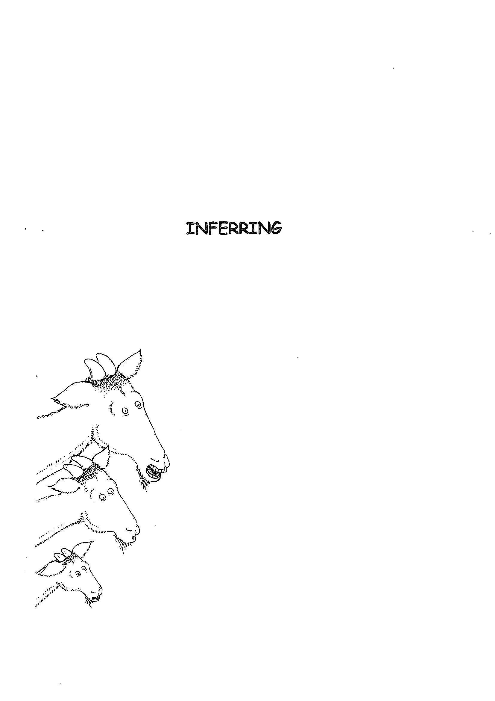
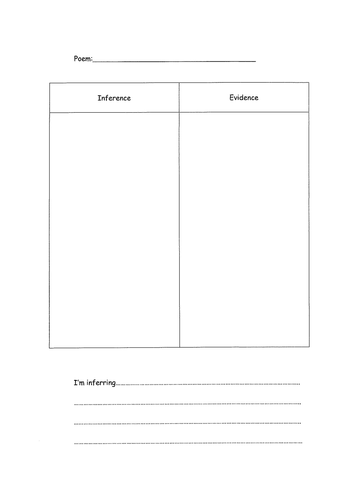
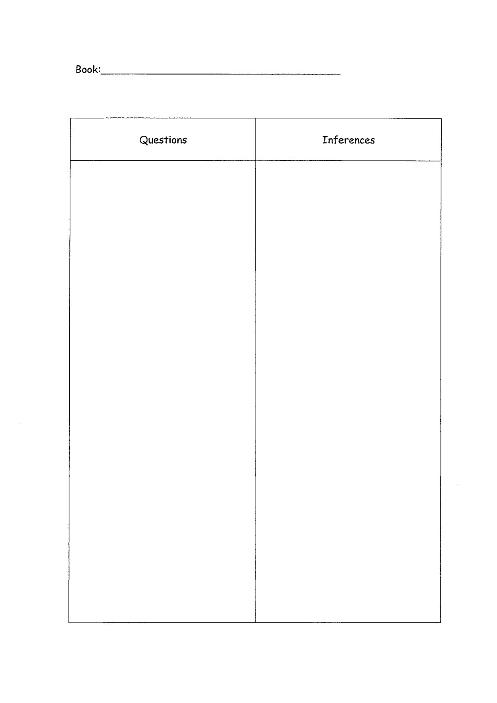
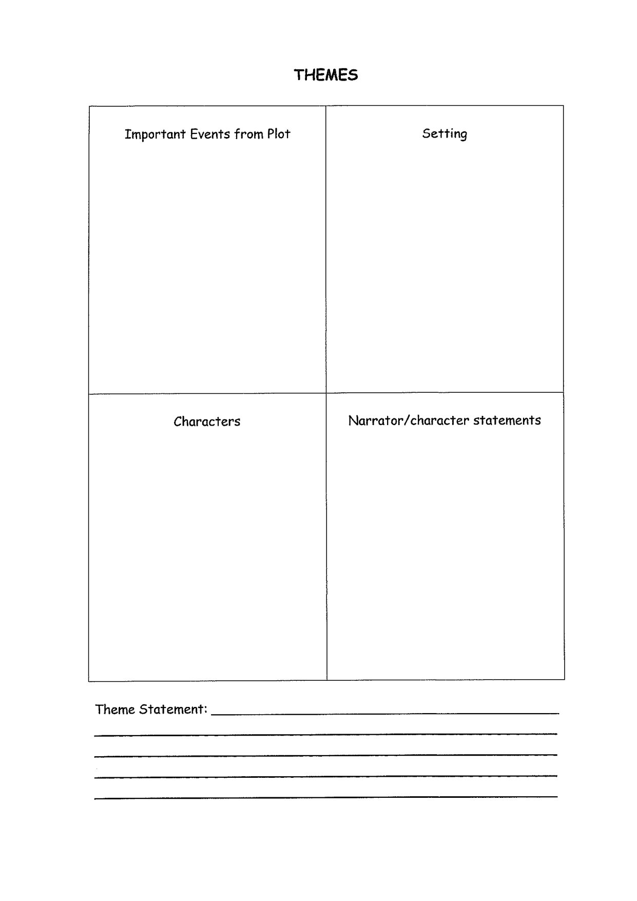
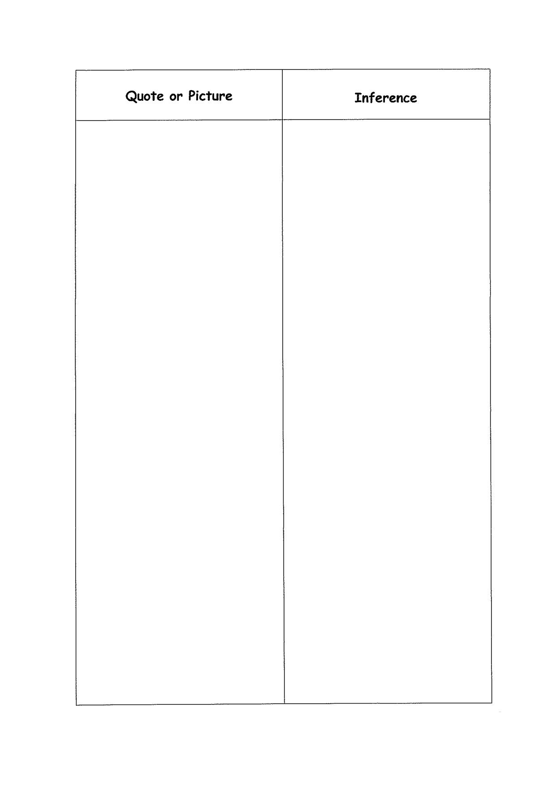
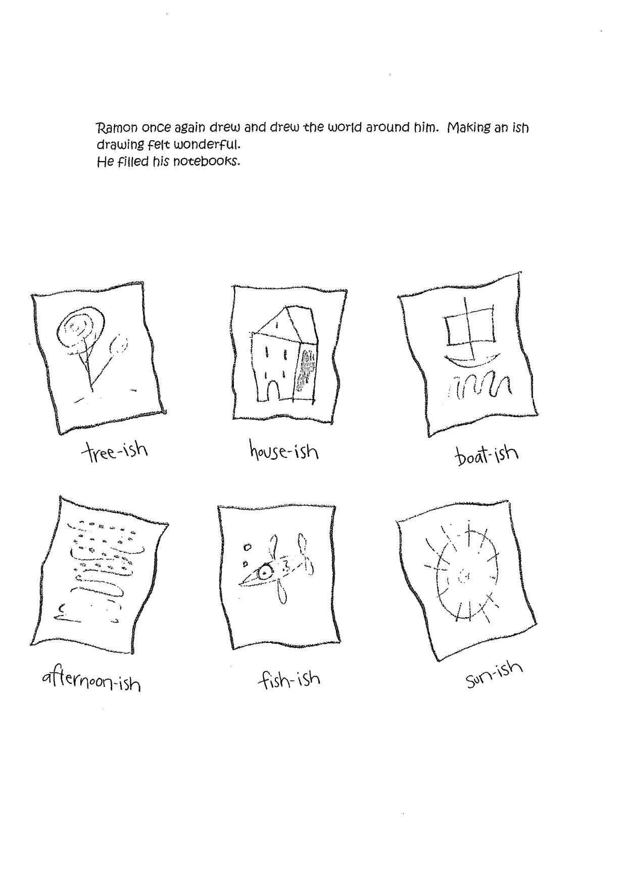
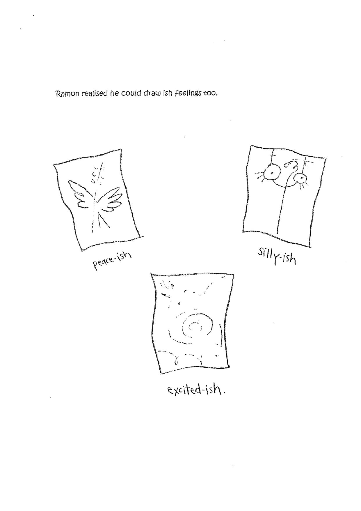
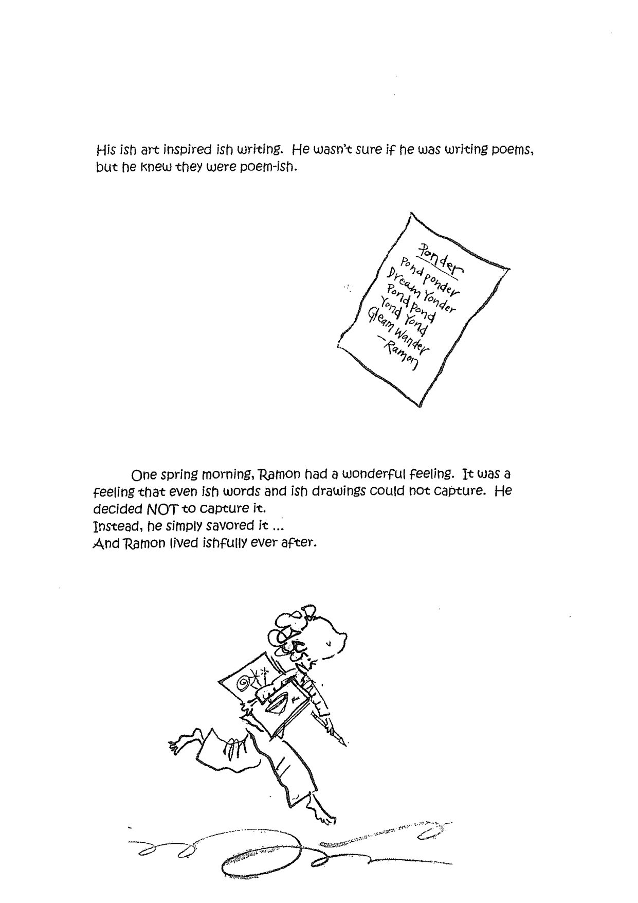

---

title: "Inferring"
source_file: "Reading/Comprehension Strategies/Inferring     1-78.pdf"
pages: 74
conversion: "OCR (tesseract, local)"
converted: "2026-09-07"

tags: [jim-k, reviewed]
reviewed: "2026-09-10"
strand: reading
resource_type: guide
---

# Inferring

<!-- page 1 -->

<!-- Page 1 is a scanned cover/illustration page. Image below. -->

<!-- page break -->
<!-- page 2 -->

INFERRING
“When we read, we stretch the limits of the literal text by folding our
experience and belief into the literal meanings in the text, creating a new
interpretation, an inference.”
Because each person's experiences are different, the art of inferring takes
the reader beyond the text to a place only he or she can go.” —Ellin Keene
Making an inference involves using background knowledge combined with
information from the text and illustrations to draw conclusions about what is
implied but not directly stated. - Pinnell and Scharer
: Inferring is “filling in, in your head, what is not written on the page." -
A.Gear
Many readers’ questions are not explicitly answered by the author but
through inferences made by the readers. Proficient readers create meaning
based on the implicit notions they infer and that readers would not be able
to grasp the deeper meaning of texts without referring.
- Harvey and Goudvis
For example: Goldilocks
We are not explicitly told that Goldilocks doesn't think of the feelings of
others before she acts. We can infer this from the evidence:
Goldilocks goes into the bears’ house uninvited.
She eats their food.
She breaks furniture.
She sleeps in their beds.
These are not the actions of a person who thinks of the feelings of others.
To infer is to go beyond literal interpretation, and to open a world of
meaning deeply connected to our lives. We create an original meaning, which
is revised, enriched, sometimes abandoned.
To infer is to -
- weave it into our own stories
- build meaning
- make text our own
When readers infer, they are personally engaged with the text, are more
aware of the author's purpose, and are processing to deeper meaning. -Zwiers

---

<!-- page 3 -->

Predictions are inferences.
Prediction - based on what has been stated in the text, adding informed
guess.
‘We predict outcomes, events, or actions that are confirmed or contradicted
by the end of the story. Inferences are often more open-ended and may
remain unresolved when the story draws to a close.’ - Harvey
When inferring, background knowledge is important, but not enough. The
text is also needed to support thinking. We therefore need to teach
children how to look for clues in the text.
Proficient readers infer by
e Creating a personal meaning from text. Combining text with
relevant prior knowledge.
e Creating a meaning that is not necessarily stated explicitly.
© Drawing conclusions. Make predictions and revise them.
Interpret text and adapt interpretations. Make connections.
When proficient readers infer they are more likely to
* remember and apply what they have read
® create new background knowledge
e discriminate and critically analyse text and authors
® come up with answers to their questions which are not explicitly
answered in the text
° create interpretations which enrich and deepen their engagement
with a text.
Teaching Ideas:
Inferring Feelings Charades
Good for early years. Tape a feeling word onto the back of a student.
Other students give clues for the student to infer what feeling is on her
back
Role Play Feelings
Act out a feeling. Students to infer how you are feeling.
Sail group work.
During Share Time record the inferences on an Inference/Evidence Chart

---

<!-- page 4 -->

<!-- blank page -->

---

<!-- page 5 -->

Familiar Stories
Because the students are familiar with these stories, inferring is made
easier, In work on themes we have used Little Red Riding Hood and
Cinderella.
Goldilocks was mentioned earlier. The Inference - Evidence Chart can be
used here.
Goldilocks does not think about the | Goldilocks entered the bears’ house
feelings of others before she acts. without asking
She ate their food.
She broke their furniture.
She slept in their beds.
Another graphic organiser that could be used is the Inference Web.
Evidence Evidence
She enters the bears’ house She breaks baby bear’s chair
without being invited, and does not try to fix it,
Main Idea
Goldilocks does not consider the feelings of others before
asking.
Evidence Evidence
She eats the bears’ food She lies down in the bears’
without asking, beds without asking.
Guided Practice following modeling.
e.g. Extend the work with ‘If I Were in Charge of the World.’

---

<!-- page 6 -->

<!-- blank page -->

Inference Web

---

<!-- page 7 -->

Independent Work.

e.g. Nonfiction. Students record their findings on a Facts from the Text-
Inference Chart.

Nonfiction inferences using Text Features.

Independent Reading. Students should realise that they use the reading
strategies whenever they are reading. A specific independent reading time
using post-its would reinforce this.

Inferential Questions:

Some of the questions readers ask themselves while reading will be
inferential questions. E.g.

Song and Dance man by Karen Ackerman

Why does Grandpa sprinkle powder on the attic floor?

The Man Who Had No Dream by Adelaide Holl

Why are the workers in the town able to dream?

---

<!-- page 8 -->

<!-- blank page -->

---

<!-- page 9 -->

Think Aloud

Students hear everything you are thinking while problem solving and using
strategies,

e.g. Poem: If I Were in Charge of the World by Judith Viorst

If I Were In Charge of the World

If I were in charge of the world

I'd cancel oatmeal,

Monday mornings,

Allergy shots, and also Sara Steinberg.

If I were in charge of the world

There'd be brighter night lights,

Healthier hamsters, and

Basketball baskets forty eight inches lower.

If I were in charge of the world

You wouldn't have lonely.

You wouldn't have clean.

You wouldn't have bedtimes.

Or "Don't punch your sister.”

You wouldn't even have sisters.

If I were in charge of the world

A chocolate sundae with whipped cream and nuts would be a vegetable

All 007 movies would be G,

And a person who sometimes forgot to brush,

And sometimes forgot to flush,

Would still be allowed to be

In charge of the world.

Judith Viorst

Think aloud about the person not liking oatmeal because it says that oatmeal
would be cancelled. I'd infer that that if you cancelled something, you didn't
like it.

In the second verse I'd infer that the person was afraid of the dark
because “There'd be brighter night lights."

Inferences could be recorded on the Inference-Evidence Chart.

Think Aloud with Nonfiction

Inferring from text features. E.g. photographs, maps, diagrams, charts.

---

<!-- page 10 -->

If I Were In Charge of the World
If I were in charge of the world

I'd cancel oatmeal,

Monday mornings,

Allergy shots, and also Sara Steinberg.

If I were in charge of the world

There'd be brighter night lights,

Healthier hamsters, and

Basketball baskets forty eight inches lower.
If I were in charge of the world

You wouldn't have lonely.

You wouldn't have clean.

You wouldn't have bedtimes.

Or “Don't punch your sister."

You wouldn't even have sisters.

If I were in charge of the world

A chocolate sundae with whipped cream and nuts would be a vegetable
All 007 movies would be G,

And a person who sometimes forgot to brush,
And sometimes forgot to flush,

Would still be allowed to be

In charge of the world.

Judith Viorst

---

<!-- page 11 -->

<!-- scanned page embedded below -->

Poem:
I'm inferring... scessecssessssseseesussassusanssessnracesnsseseecsecnsussuanusseesssssvussessneseegasansneseecereses

---

<!-- page 12 -->

Inferring through Tone
How does the poet feel about the subject of the poem?
Record using the Inference-Evidence Chart
In Time of Silver Rain
Langston Hughes
In time of silver rain
The earth
Puts forth new life again,
Green grasses grow
And flowers lift their heads,
And over all the plain
The wonder spreads
Of life,
Of life,
Of life!
In time of silver rain
The butterflies
Lift silken wings
To catch a rainbow cry,
And trees put forth
New leaves to sing
In joy beneath the sky
As down the roadway
Passing boys and girls
Go singing, too,
In time of silver rain
When spring
And life
Are new.
Feelings or attitude can be inferred through the words used, which is
defined as tone.
Inference: Happy mood.
Evidence: Words like joy, silken wings, rainbows, new life, singing and
wonder.

---

<!-- page 13 -->

In Time of Silver Rain
Langston Hughes
In time of silver rain
The earth
Puts forth new life again,
Green grasses grow
And flowers lift their heads,
And over all the plain
The wonder spreads
Of life,
Of life,
Of life!
In time of silver rain
The butterflies
Lift silken wings
To catch a rainbow cry,
And trees put forth
New leaves to sing
In joy beneath the sky
As down the roadway
Passing boys and girls
Go singing, too,
In time of silver rain
When spring
And life
Are new.

---

<!-- page 14 -->

Those Winter Sundays
Sundays too my father got up early
and put his clothes on in the blueblack cold,
then with cracked hands that ached
from labor in the weekday weather made
banked fires blaze. No one ever thanked him.
I'd wake and hear the cold splintering, breaking.
When the rooms were warm, he'd call,
and slowly I would rise and dress,
fearing the chronic angers of that house,
Speaking indifferently to him,
who had driven out the cold.
and polished my good shoes as well.
What did I know, what did I know
of love’s austere and lonely offices?

Robert Hayden

---

<!-- page 15 -->

From Question-to-Inference Chart
This graphic organiser allows the students to visualise the steps in making an
inference and therefore will benefit students who learn best in this way.
Choose a text where the question can only be answered by inferring.
Question.
Students find out what the text says.
Add their thinking in their own words.
Combine what the text says with their own thoughts to answer the
question.
This then creates the new meaning - the inference.
e.g. poem - Purchase by Naomi Madgett
Modelling:
Question
What kind of "purchase" does the speaker really make?
What the reading says What I think
"I like the smell of new clothes" I like it too when I get new jeans or
sneakers.
"This dress has no past/ Linked She must have some old clothes that
with regretful memories" remind her of bad times.
"I prefer the new scent/ Of a She wants new clothes, ones that are
garment unworn,/ Untainted" fresh and unused.
My answer to the question—what I infer
She wants her life to feel like the way you feel when you buy new
clothes, fresh and unused.

---

<!-- page 16 -->

What the reading says What I think
My Answer to the question—-what I infer

---

<!-- page 17 -->

Purchase
I like the smell of new clothes,
The novel aroma of challenge.
This dress has no past
Linked with regretful memories
To taint it.
Only a future as hopeful
As my own,
I can say of an old garment
Laid away in the trunk:
“This lace I wore on that day when ...”
But I prefer the new scent
Of a garment unworn, .
Untainted like the new self
That I become
When I first wear it.
Naomi Madgett

---

<!-- page 18 -->

Mentor text: The Secret Place by Tomie dePaola.
The students can make an inference about each stanza.
The Secret Place
Tomie dePaola
It was my secret place -
down at the foot
of my bed -
under the covers.
It was very white.
I went there
with a book, a flashlight,
and the special pencil
that my grandfather gave me.
To read -
and to draw pictures
on all that white.
It was my secret place
for about a week -
Until my mother came
to change the sheets.

---

<!-- page 19 -->

The Secret Place
Tomie dePaola

It was my secret place -
down at the foot
of my bed -
under the covers.
It was very white.
I went there
with a book, a flashlight,
and the special pencil
that my grandfather gave me.
To read -
and to draw pictures
on all that white.
It was my secret place
for about a week -
Until my mother came
to change the sheets.

---

<!-- page 20 -->

Using Books
We ask "What does the author want us to think about after reading this
book?"
Possible Themes. Look at previous work on themes using Teammates.
The Lotus Seed and Encounter are also good for this, In Encounter,
questioning and inferring work together to enhance understanding, as with
The Stranger.
The Stranger by Chris Van Allsburg (see also Questioning)
It is just as the leaves are beginning to change colors that farmer Bailey
accidentally hits a man with his truck, This ‘stranger’ proves to be just that:
He wears odd leather clothing, he can't talk, and he appears to have no
temperature at all when seen by the doctor, who believes his thermometer is
broken as the mercury will not rise. The members of the bailey family grow
to feel real affection for the stranger as he recuperates at their home;
however, they notice strange weather phenomena during the course of his
stay. The trees on the land that skirts the bailey farm have changed colors,
while those nearby are as green as summer.
Before Reading
Based on a picture walk the students could infer the time of year in which
the story takes place.

Inferences from Pictures Evidence from Pictures

---

<!-- page 21 -->

These predictions can be confirmed when the text is read.
During Reading
Establish purpose for reading. Students can use Reading Response Journals
during Read Aloud. They note any unusual things that they hear. Pauses
during reading can be used to formulate questions.
After Reading
"Who was the stranger?"
Students will need to use clues from the illustrations and the text to infer
the stranger's identity.
Individual copies are available for:
Read Along whole class.
Read Along group work.
Independent Reading.
Some students will find using a graphic organiser helpful.
I infer the stranger is:
Questions in my | Evidence from Evidence from My conclusion,
head. illustrations. the text.
Share time.
For work on theme see also:
The Wretched Stone by Chris Van Allsburg
The Widow's Broom by Chris Van Allsburg

---

<!-- page 22 -->

I infer the stranger is:

Evidence from Evidence from My conclusion.
Questions in my _| illustrations. the text.
head.

---

<!-- page 23 -->

<!-- scanned page embedded below -->

<!-- blank page -->

Book: enn ETE

---

<!-- page 24 -->

Owl Moon by Jane Yolen
A father and his young child take a winter walk through the cold woods near
their farm to go owling’, or to find an owl in the forest. Along their walk,
Yolen uses a narrative poem form to beautifully describe all the aspects of
nature the child observes on the evening adventure: the crunching of feet in
the snow, pointy black pine trees, the silver mask face of the moon, and the
icy chill of the evening. When they finally encounter the owl, the poem takes
on an even more reverent, wondrous tone,
Before reading.
Why did Jane Yolen call the book Owl Moon when we do not see an owl on the
front cover?
During reading.
Preparation: Students to explain after reading ‘What does it mean to go
owling’.
Figurative language:

Hyperbole. “For one minute, three minutes, maybe even a hundred
minutes, we stared at each other."

Metaphor. “The moon made his face into a silver mask."

“But I was a shadow as I walked home."
“The kind of hope that flies on silent wings under a

shining Owl Moon."
Students write their own interpretations of each.
p.6 Why does the father imitate the sound of the Great Horned Owl?”
Why is it called an owl moon.
After reading.
Inference formula (Harvey)

Background knowledge+text clues=inference. (BK+TC=I)
Students write various sections of the text they found to be ambiguous -
If necessary guide the students to the figurative language above.
Interpretations of the text can be done while reading. They provide
evidence from the text to support interpretations and inferences. E.g.

---

<!-- page 25 -->

I'm wondering Background Evidence from I infer
what this means | knowledge/what | the book/text
I know clues
p.2 “And when You dream when | p.1 “There was no | It was the middle
their voices you sleep. most | wind" of winter, and
faded away it was | people are very | It seems like this | this night is
as quiet as a quiet when they | is a special night. | special because
dream.” sleep. I think Jane the child gets to
What does it Yolen might be go owling for the
mean to be as exaggerating first time.
quiet as a dream? everything, like Things seem
the trees magical that are
standing still like | ordinary.
statues.
Share time:
Discuss how authors use poetic or figurative language to enrich their
writing.
Text-to-text connection
Stopping by the Woods on a Snowy Evening - poem by Robert Frost.

---

<!-- page 26 -->

I'm wondering Background Evidence from
what this means | knowledge/What | the book/Text I infer
I know clues

---

<!-- page 27 -->

The Mary Celeste, an Unsolved Mystery from History
by Jane Yolen and Heidi Stemple
The story is told by a young girl who is trying to solve the mystery. In 1872,
the crew from the ship Dei Gratia discovered the Mary Celeste floating in
the middle of the Atlantic Ocean. No one - not the captain of the Mary
Celeste and his family or the ship's crew - was found on board.
The students can infer from the evidence a number of possible scenarios,
Read Aloud
Stop - on page 6, after “But as she came closer, he saw that the ship moved
slowly, oddly, running aimlessly before the wind.”
Ask students what they might infer from this sentence. Why?
- after page 8. What might the crew infer from the fact that the
ship wasn't flying a distress flag?
- after page 12. What will the crew find? Why?
- What does the boot on the sign on page 27 signify?
Group work:
The young narrator gives six possible answers at the end of the book:
The Pirate Theory
The Drunken Crew Theory
The Frightened Crew Theory
The Weather Theories
The Sea Monster Theory
The Dei Gratia Conspiracy Theory
Assign each group a theory. Have them answer the questions that are posed.
What can they infer from each answer in regard to the theory?
Independent work:
What is your theory? What evidence did you use from which to draw
the inferences?
Further discussion:
Format of vocabulary notes.

---

<!-- page 28 -->

Erandi’s Braids Antonio Madrigal
Strategy: Making inferences about characters.
The main character is a girl named Erandi, who lives with her mother in a village in
Mexico.
Erandi’s birthday is coming, and her mother doesn’t have much money to buy her a gift.
Read Aloud:
Stop after:
“But she didn’t say anything to Mama.”
What is happening in the story? What makes Erandi think her mother is going to sell her
braids?
Partner Talk.
Reread last sentence on page 16, then read to end of story.
Whole class discussion:
What is this story about?
What is Erandi’s problem in the story? How is her problem solved?
How does the story end? Is that what you expected? Explain your thinking.
Lesson 2.
Today we are going to look at the character of Erandi.
Reread Erandi’s Braids or Read Along.
Chart.
What are some important things that Erandi does in the story?
Partner talk.
Share with class.
Chart left column.
Look at and entry —
What does this tell us about Erandi? How does she feel in this part of the story? How do
you know?
Chart right hand column.

---

<!-- page 29 -->

Erandi’s Braids
What does Erandi do? What does this tell us about
Erandi?

---

<!-- page 30 -->

Further Lessons:
THEMES
Review - the theme is the central message - not the subject of the story.
Themes must be inferred.
This could be explained through building a chart using well known stories.
E.g.
from text.
Little Red Riding | Little girl Be careful of Wolf tricks LRRH
Hood delivering goodies | strangers. in order to eat
to grandma. her.
Cinderella Poor girl going to | Patience Cinderella never
a ball. complains about
her life.

Being good Cinderella
rewarded for her
goodness.

Independent work.
from text
It's Mine Three frogs Reliance The frogs needed
fighting. each other.

Sharing New feeling of
‘It's ours.’

Ish A boy is put down | Creativity He drew what he
about his art. felt.

Identity Realized he could
draw feelings.

Uniqueness Ishness drawings
and writing.
Themes are revealed by the way characters change in the story, conflicts in
the story, and statements made by narrator or characters, They are still
open to interpretation. Understanding the themes therefore comes through
understanding plot, characters, and setting.

---

<!-- page 31 -->

<!-- scanned page embedded below -->

THEMES
-
Narrator/character statements
Theme Statement:

---

<!-- page 32 -->

<!-- blank page -->

THEMES

---

<!-- page 33 -->

Inferring with Folktales - Fables.
Lesson: Read ~ The Boy who cried Wolf. Introduce ‘Parody’. -
Read - The Wolf who cried Boy by Bob Hartman.
Inferences from the story. Reader's Theatre (The Wolf ...)
Extension: Reading: Reader's Theatre with The Boy who cried Wolf.
Make individual books.
Inferences from Fables collection.
Writing: The Boy Who Cried Wolf - writing character
descriptions.
Writing the story from point of view of various
characters.
Original story.
The Wolf Who Cried Boy
Read and Retell
Write a Fractured Fable.
See separate handout.

---

<!-- page 34 -->

Using illustrations
Illustrations help students to infer and therefore enhance meaning.
Mentor Text: Tight Times by Barbara Shook Hazen

A boy desperately wants a dog for a pet, but these are ‘tight times’,
and the family is struggling.
Illustrations by Schart Hyman convey this desperation.
Cover: What can you infer from the picture of the boy with a plate of
beans?

What are ‘tight times?’

Read the story, recording on the way:

Whole class.

Independent. Students have Reading response Journals with them.

Group ~ Guided Reading.
We used Yo! Yes! By Chris Raschka in a punctuation study.
Character inference. Using the illustrations what can we infer about the boy
in the green cardigan? Record this on a Quote or Picture-Inference Chart.
Evidence may include:

Stance.

Facial expression.

Surprise look when the other boy talks to him.

Size of print on first page.
From this evidence I would infer that the boy is shy.

---

<!-- page 35 -->

Tight Times Barbara Shook Hazen

The boy on the cover does not like Look on his face.

lima beans. Many left on his plate.

“Tight Times' means that someone is | Family eats Mr Bulk instead of cereal

in financial difficulties. in little boxes.
Family went to sprinkler instead of
lake.
Dad lost his job.

The little boy does not enjoy She isn't good at games.

spending time with Mrs McIntosh. Doesn't want to watch TV shows he
likes.
Never lets the boy go out and sit on
steps.

Dad is fired. He comes home in the middle of the
day.
Looks mad.
Mentions he lost something.
Looks upset while sitting at the
table.

Mrs McIntosh is fired. Boy's father looks mad when he comes home and sees Mrs McIntosh

watching her TV show.
The father speaks to Mrs McIntosh
and she leaves right away.
Dad lost his job and may not have the
money to pay Mrs McIntosh.

The father seems hopeful about The father is reading the job ads.

getting another job. He looks happy as he is sitting with
his son.

---

<!-- page 36 -->

<!-- scanned page embedded below -->

Quote or Picture

---

<!-- page 37 -->

Wordless Picture Books
Students can develop story lines orally and in writing.
Wordless picture books enhance creativity, vocabulary, and language
development for readers of all ages, at all stages of cognitive development,
and in all content areas.
Instructional Activities.
Modelling. Read a wordless picture book to the whole class, developing a
story line for the pictures.
The book could be reread with the students giving their interpretation of
the story.
Discussion: unique interpretations because we bring different experiences to
the book and infer pictures differently.
Paired Reading. Pairs can read a wordless picture book together. Each
writes their own story and reads it to their partner.
Small Group. Story line developed as a group.
Whole Class Discussion. Discuss different group interpretations of a book.
Reading Response Journal. Respond to whole class discussion. Guiding
questions will help younger readers.
Independent Work. Students read a wordless picture book and develop
their own story.
Instructional strategies could include:

Plot development.

Setting development.

Character description.

Sequencing of events.

Use of dialogue.
Author's Chair

---

<!-- page 38 -->

Flotsam by David Wiesner

Flotsam opens with a young boy on a beach, He finds what appears to be an
antique camera. Intrigued, he takes the camera to have the film developed,
(Children may need to be told what film is), This is when the story takes a
fantastic turn and requires readers to suspend their judgment. The
resulting photos document some amazing unknown underwater happenings.
Like an onion, the story is layered, with each picture revealing new
information, and taking us further and further back in history, until we
reach a sepia photo of the person whom we presume to be the camera's
original owner: a boy at the turn of the twentieth century.

Before reading:

Ask the students to predict the meaning of the word flotsam based on
the first three pages. These three pages precede the story itself.

Read the definition of flotsam provided by the author on the inside cover:

Flotsam: something that floats.

During reading:

Look at the book and infer why David Wiesner called the book
Flotsam.

What pictorial evidence is their for the title inference?

Pages 2-5 What can you tell about the boy's character from the items
he brought to the beach and from his activities? What evidence can you use
to support your inferences?

Discuss confusing elements found in the story - layered aspect.
After reading:

Partner talk - support or refine inferred reason why David Wiesner chose
Flotsam as the title.

What would you call the book?

Look again at the cover. What did you think the circle in the middle was
when you first saw it? What do you think it is now?

Sometimes authors put ‘The End’ in their books. Why or why not would you
put these words in this book?

Look again at the two-page title spread and choose an object - a bit of
flotsam - to create a story about, using either words or a series of
illustrations, as David Wiesner did.

Speculate about the scenes from the ocean floor.

Pages of children holding smaller photos with insets of older photos - group
work: Each group focuses on one transition (from one photograph of a child
to the next, older photograph). Ask the students what they infer from one

---

<!-- page 39 -->

photograph to the next within a single photo. Students should be able to
infer that each smaller photo is older than the larger photo. Why is the
magnifying glass needed to view the photos? Ask for evidence to support
each of these inferences:

Each child is holding a picture that presumably has been taken with
the camera.

The children are different ethnicities and are wearing clothing that
represents different cultures.

Hair and clothing styles are different.

As we move back in time, the photographs are no longer printed in
color.
Ask the students if they believe this is a ‘normal’ camera, Ask them to find
evidence in the illustrations that supports their inference.
Writing ideas:
Focus
The underwater camera captures some very interesting images while
travelling through the ocean. When the students look through some of the
snapshots from the camera, they can create their own story based on that
picture.

Mechanical Fish

Octopus Living Room

Blowfish Hot Air Balloon

Sea Turtle Cities

Underwater Martians

Starfish Islands

Mermaid City
Word Choice/Focus
Using the graphic organiser, the students can list or write about the beach
or ocean using their five senses. The graphic organiser can become the
planner for a story.
Duplicate the “picture within a picture" pages with a digital camera. Begin by
taking a photo of a student. Print that photo out, and then take a picture of
another student holding the original picture. Repeat. Us a magnifying glass
to get a closer look.

---

<!-- page 40 -->

Pretend you found a camera on the beach, When you got the film developed,
there was an interesting photograph of an underwater city. Use this graphic
organizer to help you develop ideas for your story.

Who? What?

Adjectives: Adjectives:

When? Where?

Adjectives: Adjectives:

Why? How?

Adjectives: Adjectives:

Write the first sentence to your story that will “hook” the reader.

---

<!-- page 41 -->

Wordless Picture Books
Anno Anno's Journey
Anno’s Counting Book
Baker, J Home
Window
Bang, M The Grey Lady and the Strawberry Snatcher
Blake, Q Clown
Briggs, R The Snowman
Carle, E Do You Want to be My Friend
Crews, D Freight Train
Day, A Good Dog, Carl
dePaola, T Pancakes for Breakfast
Felix, M The House
Hutchins, P Changes, Changes
Lee, Suzy Wave
Lehman, B The Red Book
Ormerod, J Sunshine
Moonlight
Rogers, G The Boy, The Bear, The Baron, The Bard
Shannon, D No, David
Van Allsburg, C The Mysteries of Harris Burdick
Ben's Dream
Weitzman, You Can't Take a Balloon into the Metropolitan Museum
Wiesner, D Free Fall
Flotsam
Sector 7
Tuesday

---

<!-- page 42 -->

Using inferences to assist Vocabulary
Inferring can help when readers encounter an unknown word. Sometimes we
have to infer the meaning of unknown words using context clues provided in
the text and the illustrations.
This can be demonstrated during Shared Reading using Think Aloud.
It is also done in the Clarifying section of Reciprocal Reading. E.g.
Spiders. Students often have trouble with the word intricate,
Others spin intricate towers.
I refer students to the sentence before this one.
Some spiders spin simple sheets of silk.
We can therefore infer that intricate is the opposite of simple.
Early Years
In Reading with Meaning, Debbie Miller gives us an example of a chart she
used during a Read Aloud, in which the students inferred the meanings of
unknown words
What we infer it means What helped us?

What helped the students could have included:

Pictures

. Rereading
Background knowledge
Paying attention to the word

---

<!-- page 43 -->

Mentor text: Julius, the Baby of the World by Kevin Henkes
This book could be read over a number of days, with a vocabulary lesson
taken during the week.
Questioning:
From front cover: What might the story be about? Who do you think
is Julius? Who is the person in the mask?
Possible questions to assist meaning.
How can Lily do these things before Julius is born? (Revisit front cover for
clarification of before reading question).
How does Lily feel about her little brother? How do you know?
Why do you think Lily's parents do not want to leave her alone with Julius?
Do you think Lily liked being alone with Julius? Why or why not?
Why did Lily’s parents treat her and Julius differently when they did the
same things? (e..g blowing bubbles, gurgling)
What do you think is the uncooperative chair?
Do you think Julius’ invitation really got lost in the mail? How do you know?
Why do you think Lily's parents did nice things for her? Why didn't it work?
Why did Lily get upset when Cousin Garland said Julius was disgusting?
Why do you think Lily liked Julius at the end? Do you think they will stay
friends?
Vocabulary
Words chosen:
insulting chimed constantly clever
doubtful dazzling uncooperative
Reread the sentence for context.
What clues does the story give about the meaning of the word? Discuss
possible meanings. Where could you use the word?
insulting: “She pinched his tail and she yelled insulting comments into his
crib.”
What do we know about how Lily feels about Julius?
If she is yelling the comments, what kind of things do you think she is
saying?
What might ‘insulting’ mean?
Can you think of a time when someone might say something insulting?

---

<!-- page 44 -->

The Stranger Chris Van Allsburg
It was the time of year Farmer Bailey liked best, when summer turned to fall. He
whistled as he drove along. A cool breeze blew across his face through the truck's open
window. Then it happened. There was a loud “thump.” Mr Bailey jammed on his
brakes. “Oh no!” he thought. “I've hit a deer.”
But it wasn't a deer the farmer found lying in the road, it was a man. Mr Bailey
knelt down beside the still figure, fearing the worst. Then, suddenly, the man opened
his eyes. He looked up with terror and jumped to his feet. He tried to run off, lost his
balance, and fell down. He got up again, but this time the farmer took his arm and
helped him to the truck.
Mr Bailey drove home. He helped the stranger inside, where Mrs Bailey made him
comfortable on the parlor sofa. Katy, their daughter, peeked into the room. The man
on the sofa was dressed in odd rough leather clothing. She heard her father whisper
“must be some kind of hermit...sort of fellow who lives alone in the woods.” The
stranger didn't seem to understand the questions Mr Bailey asked him. “I don't
think,” whispered Mr Bailey, “he knows how to talk.”
Mr Bailey called the doctor, who came and listened to the stranger's heart, felt his
bones, looked in his eyes, and took his temperature. He decided the man had lost his
memory. There was a bump on the back of his head. “In a few days,” the doctor said,
“he should remember who he is and where he's from.” Mrs Bailey stopped the doctor as
he left the house. He'd forgotten his thermometer.
“Oh, you can throw that out,” he answered. “It’s broken, the mercury is stuck at the
bottom.”
Mr Bailey lent the stranger some clean clothes. The fellow seemed confused about
buttonholes and buttons. In the evening he joined the Baileys for dinner. The steam
that rose from the hot food fascinated him. He watched Katy take a spoonful of soup
and blow gently across it. Then he ate exactly the same. Mrs Bailey shivered. “Brrr,”
she said. “There's a draft in here tonight.”
The next morning Katy watched the stranger from her bedroom window. He walked
across the yard, toward two rabbits. Instead of running into the woods, the rabbits
took a hop in his direction. He picked one of them up and stroked its ears, then set it
down. The rabbits hopped away, then stopped and looked back, as if they expected the
stranger to follow.
When Katy’s father went into the fields that day, the stranger shyly tagged along.
Mr Bailey gave him a pitchfork and, with a little practice, he learned to use it well.

---

<!-- page 45 -->

They worked hard. Occasionally Mr Bailey would have to stop and rest. But the
stranger never tired. He didn’t even sweat.

That evening Katy sat with the stranger, watching the setting sun. High above them
a flock of geese, in perfect V formation, flew south on the trip that they made every
fall. The stranger could not take his eyes off the birds. He stared at them like a man
who'd been hypnotised.

Two weeks passed and the stranger still could not remember who he was. But the
Baileys didn't mind. They liked having the stranger around. He had become one of
the family. Day by day he'd grown less timid. “He seems so happy to be around us,”
Mr Bailey said to his wife. “It’s hard to believe he's a hermit.”

Another week passed. Farmer Bailey could not help noticing how peculiar the weather
had been. Not long ago it seemed that autumn was just around the corner. But now
it still felt like summer, as if the seasons couldn't change. The warm days made the
pumpkins grow larger than ever. The leaves on the trees were as green as they'd been
three weeks before.

One day the stranger climbed the highest hill on the Bailey farm. He looked to the
north and saw a puzzling sight. The trees in the distance were bright red and orange.
But the trees to the south, like those round the Baileys', were nothing but shades of
green. They seemed so drab and ugly to the stranger. It would be much better, he
thought, if all trees could be red and orange.

The stranger's feelings grew stronger the next day. He couldn't look at a tree’s green
leaves without sensing that something was terribly wrong. The more he thought about
it, the more upset he became, until finally he could think of nothing else. He ran to a
tree and pulled off a leaf. He held it in a trembling hand and, without thinking, blew
on it with all his might.

At dinner that evening the stranger appeared dressed in his old leather clothes. By the
tears in his eyes the Baileys could tell that their friend had decided to leave. He
hugged them all once, then dashed out the door. The Baileys hurried outside to wave
good-bye, but the stranger had disappeared. The air had turned cold, and the leaves on
the trees were no longer green.

Every autumn since the stranger's visit, the same thing happens at the Bailey farm.
The trees that surround it stay green for a week after the trees to the north have
turned. Then overnight they change their color to the brightest of any tree around.
And etched in frost on the farmhouse windows are words that say simply, “See you
next fall.”

---

<!-- page 46 -->

Questioning and inferring
The Stranger
Read the story to us. The students each had a copy, and were asked to
read the story for themselves, and to write any questions on post-its.
They were told that these questions would be used in group
book discussions.
Sample questions from post-its.
Becky
Who's the stranger?
Maybe the mercury wasn’t stuck. Maybe he had no temperature.
why do the rabbits want him. to follow?
Does he know the rabbits? How can that be?
Hannah
I don't think he lost his memory. Who is HE?
why did the rabbits expect him to follow him?
Why did he turn weird when he wore his ola clothes?
why did the leaf turn orange when he blew on it?
why did the trees and wind suddenly change?
Bridget
I think it is a grasp moment, and it feels like a ghost around your
body.
Everything around me in the book feels cold, but not in a nasty way.
He seems to change things to autumn.
I believe the stranger is the fall king.
Alice
Why is the mercury stuck on the bottom?
why is it every time he blows something there's a draft?
Why do the rabbits stop and not run into the forest?
Why didn't he sweat?
Do you think he is a hermit? If not, what do you think he is?
Why was the weather peculiar?
(when he was upset) what was wrong?
why did he leave the Bailey's farm?
Steffany
Does the broken thermometer have anything to do with it?
why did the rabbits not run away?
why didn't the stranger get tired?

---

<!-- page 47 -->

When he went away, did he have something to do with the weather?

How come the weather was normal when he left?

AB

Again I read the story to the class. They then read it for themselves.

They were asked to choose one question from their Literature Response
Journal sheet.

Riley

The stranger is the spirit of all the seasons, and forgets that he is. I

think this because the rabbits don't run away, he never sweats, the trees

in the north were red, and the trees in the south were green.

The stranger went before they could wave goodbye. He just disappeared.

He regained his memory and became a spirit again.

---

<!-- page 48 -->

Encounter Jane Yolen
The moon was well overhead, and our great fire had burned low. A loud clap of
thunder woke me from my dream.
All dreams are not true dreams, my mother says. But in my dream that
night, three great-winged birds with voices like thunder rode wild waves in our bay.
They were not like any birds I had ever seen, for sharp, white teeth filled their mouths.

I left my hammock and walked to the beach. There were my dream birds
again. Only now they were real - three great-sailed canoes floating in the bay. I
stared at them all through the night.

When the sun rose, each great canoe gave birth to many Little ones that swam
awkwardly to our shore.

I ran then and found our chief still sleeping in his hammock.

“Do not welcome them,” I begged him. “My dream is a warning.”

But it is our custom to welcome strangers, to give them tobacco Leaf, to feast
them with the pepper pot, and to trade gifts.

“You are but a child,” our chief said to me. “ALL children have bad dreams.”

The baby canoes spat out many strange creatures, men but not men. We did
not know them as human beings, for they hid their bodies in colors, like parrots.
Their feet were hidden, also.

And many of them had hair growing like bushes on their chins. Three of them
knelt before their chief and pushed sticks into the sand.

Then I was even more afraid.

Our young men left the shelter of the trees. I - who was not yet a man —
followed, crying, “Do not welcome them. Do not call them friends.”

No one listened to me, for I was but a child.

Our chief said, “we must see if they are true men.” So | took one by the hand
and pinched it. The hand felt like flesh and blood, but the skin was moon to my sun.

The stranger made a funny noise with his mouth, not like talking but like the
barking of a yellow dog.

Our chief said to us, “See how pale they are. No one can be that color who comes
from the earth. Surely they come from the sky.”

Then he leaped before them and put his hands up, pointing to the sky, to show
he understood how far they had flown.

“Perhaps they have tails,” said my older brother. “Perhaps they have no feet.”

Our young men smiled, but behind their hands so the guests would not feel
bad. Then they turned around to show that they had no tails.

Our chief gave the strangers balls of cotton thread to bind them to us in
friendship. He gave them spears that they might fish and not starve. He gave them
gum-rubber balls for sport. He gave them parrots, too - which made our young men
laugh behind their hands all over again, knowing it was our chief's little joke, that the
strangers looked like parrots.

---

<!-- page 49 -->

But the strangers behaved almost like human beings, for they Laughed, too,
and gave in return tiny smooth balls, the color of sand and sea and sun, strung upon
a thread. And they gave hollow shells with tongues that sang chunga-chunga. And
they gave woven things that fit upon a man’s head and could cover a boy's ears.

For a while I forgot my dream.

For a while I was not afraid.

So we built a great feasting fire and readied the pepper pot and yams and
cassava bread and fresh fish. For though the strangers were not quite human. beings,
we would still treat them as such.

Our chief rolled tobacco leaves and showed them how to smoke, but they
coughed and snorted and clearly did not know about these simple things.

Then I leaned forward and stared into their chief's eyes. They were blue and
grey like the shifting sea.

Suddenly, I remembered my dream and stared at each of the strangers in
turn. Even those with dark human eyes looked away, like dogs before they are driven
from the fire.

So I drew back from the feast, which is not what one should do, and I watched
how the sky strangers touched our golden nose rings and our golden armbands but
not the flesh of our faces or arms. I watched their chief smile. It was the serpent’s
smile - no lips and all teeth.

I jumped up, crying, “Do not welcome them.”

But the welcome had already been given.

I ran back under the trees, back to the place where my zemis stood. I fed it little
pieces of cassava, and fish and yams from the feast. Then I prayed.

“Let the pale strangers from the sky go away from us.”

My zemis stared back at me with unblinking wood eyes. I gave it the smooth
balls a stranger had dropped in my hand.

“Take these eyes and see into the hearts of the strangers from the sky. If it must be,
let something happen to me to show our people what they should know."

My zemis was silent. It spoke only in dreams. Indeed, it had spoken to me
already.

When I returned to the feast, one of the strangers let me touch his sharp silver
knife. To show I was not afraid, I grasped it firmly, as one would a spear. It bit my

palm so hard the blood cried out. But still no one understood; no one heard.

They did not hear because they did not want to listen. They desired all that
the strangers had brought; the sharp silver spear; round pools to hold in the hand that
gave a man back his face; darts that sprang from sticks with a sound like thunder
that could kill a parrot many paces away.

We were given none of these — only singing shells and tiny balls on strings.
We were patted upon the head as a child pats a yellow dog. We were smiled at with
many white teeth, a serpent’s smile.

The next day the strangers returned to their great canoes. They took five of our
young men and many parrots with them. They took me.

---

<!-- page 50 -->

I knew then it was a sign from my zemis, a sign for my people. So I was
brave and did not cry out. But I was afraid.

That night, while my people slept on shore, the great-sailed canoes left our bay,
going farther and farther than even our strongest men could go. Soon the beach and
trees and everything I knew slipped away, until my world was only a thin, dark line
stretched between sky and sea.

What else was there to do?

In the early morning, another land lay close enough to see. Silently, I let
myself over the side of the great canoe. I fell down and down and down into the cold
water. Then I swam to that strange shore.

Many days I walked, following the sun. Many nights I swam. And many
times the sky was full with the moon and stars.

All along the way I told the people of how I had sailed in the great canoes. I told
of the pale strangers from the sky. I said our blood would cry out in the sand. I spoke
of my dream, of the white teeth.

But even those who saw the great canoes did not listen, for I was a child.

So it was we lost our lands to the strangers from the sky. We gave our souls to
their gods. We took their speech into our mouths, forgetting our own. Our sons and
daughters became their sons and daughters, no longer true humans, no longer ours.

That is why I am an old man now, dream no more dreams. That is why I sit here
wrapped in a stranger's cloak, counting the stranger's bells on a string, telling my
story. May it be a warning to all the children and all the people in every land.

---

<!-- page 51 -->

Boundless Grace Mary Hoffman

Grace lived with her ma and her nana and a cat called Paw-Paw. Next to her family,
what Grace liked best was stories. Some she knew and some she made up. She was
particularly interested in ones about fathers ~ because she didn’t have one.

"You do too have a father,” her ma said when she caught Grace talking that
way. «I must have told you a hundred times about how we split up, and your papa went
back to Africa. He has another family now, but he’s still your father, even though he
doesn’t live with us anymore.”

Well, that wasn't Grace's idea of a father! She wanted one like Beauty’s,
who brought her roses from the Beast’s garden in spite of the dangers. Not one she
hadn’t seen since she was very little and only knew from letters and photographs.

And in her school reading books Grace saw that all the families had a mother
and a father, a boy and a girl, and a dog, and a cat.

“Our family’s not right,” she told Nana. “We need a father and a brother and
a dog,”

“Well” said Nana, “I’m not sure how Paw-Paw would feel about a dog, And
what about me? Are there any nanas in your schoolbooks?”

Grace shook her head.

“Do I have to go then?’ asked Nana.

“Of course not!” Grace said, hugging her.

Nana hugged her back.

“A family with you in it is a real family,” she said.

“Families are what you make of them”

Then one day when Grace got home from school, she saw a letter on the table
with a crocodile stamp on it. Grace knew it must be from Papa, but it wasn’t
Christmas or her birthday.

“Guess what!’ Ma said. “Your papa sent the money for two tickets to visit
him in Africa for your spring vacation. Nana says she'll go with you if you want. What
do you say?” :

But Grace was speechless. She had made up so many fathers for herself,
she had forgotten what the real one was like.

---

<!-- page 52 -->

Grace and Nana left for Africa on a very cold grey day. They arrived in the
Gambia in golden sunshine like the hottest summer back home. It had been a long,
long trip. Grace barely noticed the strange sights and sounds that greeted her. She
was thinking of Papa.

I wonder if Papa will still love me? thought Grace. He has other children now,
and in stories it’s always the youngest that is the favourite. She held on tightly to
Nana.

Outside the airport was a man who looked a little like Papa’s photo. He
swung Grace up in his arms and held her close. Grace buried her nose in his shirt and
thought, I do remember.

In the car she started to notice how different everything seemed. There were
sheep wandering along the roadside and people selling watermelons under the trees.

And when they reached her father’s compound, there was the biggest
difference of all. A pretty young woman with a little girl and a baby boy came to meet
them. Grace said hello, but couldn't manage another word all evening, Everyone
thought she was just tired. Except Nana.

“What's the matter, honey?” she asked when they went to bed. “You've got a
father and a brother now, and they even have a dog?”

But Grace thought, They make a storybook family without me. I'm one girl
too many. Besides, it’s the wrong, Ma.

The next day Grace started to get to know Neneh and Bakary. The
children thought it was wonderful to have a big sister all the way from America. And
Grace couldn't help liking them too. But she had to feel cross with some one. Grace
knew lots of stories about wicked stepmothers _ Cinderella, Snow White, Hansel
and Gretel ~ so she decided to be cross with Jatou. I won't clean the house for her,
thought Grace. I won't eat anything she cooks, and I won’t let her take me into the
forest.

Jatou made a big dish of savory benachin for lunch, but Grace wouldn't eat
any. “I'm not hungry,” she said.

«She's probably still getting over the long flight,” said Jatou.

When Papa came home from work, he found Grace in the backyard. He sat
beside her under the big old jackfruit tree. “This is where my grandma used to tell me
stories when I was a little boy," he said.

“Nana tells me stories too,” said Grace.

---

<!-- page 53 -->

“Did she ever tell you the one about how your ma and | came to split up?”
asked Papa.

«I know that one,” said Grace, “but I don’t want to hear it right now,” and she
covered up her ears.

Papa hugged her. “Would you like the one about the papa who loved his little
girl so much, he saved up all his money to bring her to visit him?”

“Yes, I'd like that one,” said Grace.

“Okay. But I'll tell you that story, will you promise to try to be nice to Jatou?
You're both very important to me,” said Papa.

Grace thought about it. “I'll try,” she said.

The next day they went to the market. It was much more exciting than
shopping at home. Even the money had crocodiles on it! Lots of women carried their
shopping, on their head.

Then they went to a stall that was like stepping inside a rainbow. ‘There was
cloth with crocodiles and elephants on it and cloth with patterns made from pebbles
and shells. And so many colors!

“We can choose cloth for Grace's first African dress,” said Papa. Grace and
Nana spent a long time choosing. No one was in a hurry.

The days of Grace's visit flew by. She played in the ocean with her brother
and sister, and she told them a bedtime story every night. She told all the stories she
knew ~ Beauty and the Beast, Rapunzel, Rumpelstiltskin. It was amazing how many
stories were about fathers who gave their daughters away. But she didn’t tell them
any about wicked stepmothers.

Sometimes Ma called from home and her voice made Grace feel homesick. «
feel like gum, stretched out all thin in a bubble,” she told Nana. “As if there isn’t
enough of me to go around. I can’t manage two families. What if I burst?”

«Seems to me there is enough of you, Grace,” said Nana. “Plenty to go
around. And remember, families are what you make them.”

Soon it was their last evening and there was a big farewell party at the
compound. Grace and Nana wore their African clothes and Grace ate twice as much
benachin as everyone else. “Now you really might burst,” said Nana.

On their last morning Papa took Grace to see some real crocodiles. “This is a
special holy place,” he said. “The crocodiles are so tame, you can stroke them”

“Not like the one in Peter Pan!” said Grace.

---

<!-- page 54 -->

“No. These are so special, you can make a wish on them,” said Papa.

Grace closed her eyes and made a wish, but she wouldn't say what it was.

Later at the compound Grace asked Nana, “Why aren't there ang stories
about families like mine, that don't live together?”

“Well, at least you've stopped thinking it's your family that’s wrong,” said
Nana. “Now, until we get back home and find some books about families like yours,
you'll just have to make up a new story of your own.”

«I'll do that,” said Grace, “and when we're home again, I'll write it down and
send it to Jatou to read to Neneh and Bakary,”

The whole family came to see them off at the airport. Grace was sorry to say
good-bye to her new brother and sister and even to her stepmother. But leaving
Papa was hardest of all.

Waiting for their plane, Nana asked Grace if she had thought anymore about
her story.

“Yes, but | can’t think of the right ending,” said Grace, “because the story’s
still going on.”

“How about they lived happily ever after?” asked Nana.

«Thats a good one,” said Grace. “Or they fived happily ever after, though
not all in the same place?”

«Stories are what you make them,” said Nana.

* Just like families,” said Grace.

---

<!-- page 55 -->

Boundless Grace Mary Hoffman
Inferencing to understand characters,
Synopsis: Grace learns that it is possible to have and love two families.
p.5 She had made up so many fathers for herself, she had forgotten what
the real one was like.
Partner Talk.
Q: — What have you found out about Grace and her family so far?
p.11 “She's probably still getting over the long flight,” said Jatou.
Q: — How do you think Grace feels?
p.19 “And remember, families are what you make them."
Q: What is Grace thinking about her family at this point of the story?
Whole Class Discussion.
Q: What is this story about?
Q: — What problems does Grace have?
Q: How does she solve the problems?
Revisiting Visualising.
Description of setting.
p.16 Then they went to a stall that was like shopping inside a rainbow.
There was cloth with crocodiles and elephants on it and cloth with patterns
made from pebbles and shells. And so many colors."
Description of characters feelings.
“I feel like gum stretched out all thin in a bubble,” she told Nana. “As if
there isn't enough of me to go around.”
Day 2.
Reread story right through.
Students to listen carefully and think about what Grace says, does and
thinks in the story. What does this tell us about Grace.

---

<!-- page 56 -->

Use a Character Web.
Partner work with copy of story.
Q: What do you know about Grace? What does she say, do, or think that
helped you figure that out?
Other questions.
Q: — How are Grace's feelings about her family at the beginning of the
story, different from her feelings at the end of the story?
Explain your thinking.
Double Entry Journal
Grace at the beginning | Grace at the end
Q: What happens that causes Grace to change?
Q: What does Grace's nana mean when she says ‘Families are what you
make them."

---

<!-- page 57 -->

Song and Dance Man
By Karen Ackerman

Grandpa was a song and dance man who once danced on the vaudeville stage.

When we visit, he tells us about a time before people watched TV, back in the good old
days, the song and dance days.

“I wonder if my tap shoes still fit?” Grandpa says with a smile. Then he turns on the light
to the attic, and we follow him up the steep, wooden steps.

Faded posters of Grandpa when he was young hang on the walls. He moves some
cardboard boxes and a rack of Grandma's winter dresses out of the way, and we see a dusty
brown, leather-trimmed trunk in the corner.

As soon as Grandpa opens it, the smell of cedar chips and old things saved fills the attic.
Inside are his shoes with the silver, half-moon taps on the toes and heels, bowler hats and top
hats, and vests with stripes and matching bow ties.

After wiping his shoes with a cloth he calls a shammy, Grandpa puts them on.

He sprinkles a little powder on the floor, and it's show time.

He says “Watch this!” and does a new step that sounds like a woodpecker tapping on a
tree. Suddenly, his shoes move faster, and he begins to sing.

The song and dance man stops and leans forward with a wink.

“Know how to make an elephant float?” he asks. “One scoop of ice cream, two squirts of
soda, and three scoops of elephant!”

We've heard that joke before, but the song and dance man slaps his knee and laughs

until his eyes water.

He tries to wipe them with a red hanky from his vest pocket, but the hanky just gets
longer and longer as he pulls it out. He looks so surprised that we start laughing too, and it feels
like the whole attic is shaking.

Sometimes we laugh so hard, the hiccups start, and Grandpa stops to bring us a glass
of water from the bathroom.

Once our hiccups are gone, he gets a gold-tipped cane and black silk top hat from the
trunk. He lowers his eyes and tips the hat, and he’s standing very still.

All the lights are turned low except one that shines on his polished tap shoes. It's the
grand finale, so the song and dance man takes a deep breath. He lifts the cane and holds it in
both hands.

Slowly, he starts to tap. His shoes move faster and faster, and the sounds coming from
them are too many to make with only two feet.

We stand up together and clap our hands, shouting “Hurray!” and “More!” but Grandpa
only smiles and shakes his head, all out of breath. He takes off his tap shoes, wraps them
gently in the shammy cloth, and puts them back in the leather-trimmed trunk. He carefully folds
his vest and lays the top hat and cane on it, and we follow him to the stairway.

Grandpa holds on to the rail as we go down the steps.

At the bottom he hugs us, and we tell him we wish we could have seen him dance in the
good old days, the song and dance days. He smiles and whispers that he wouldn't trade a

million good old days for the days he spends with us.

But as he turns off the attic light, Grandpa glances back up the stairs, and we wonder
how much he really misses that time on the vaudeville stage, when he was a song and dance
man.

---

<!-- page 58 -->

The Man Who Had No Dream
By Adelaide Holl

Mr. Oliver was the richest man in town.

All day long he sat at his window and watched everyone else work hard for a living. Mr. Oliver
didn’t have to work. He had so much money he could buy anything he wanted.

Every evening Mr. Oliver sat at his window and waited for people to come home from work.
Tired after a busy day, the townsfolk rested and looked out at the stars and the moon and the
night. But not for long. They were too yawny and drowsy and sleepy from working so hard.
Soon they all went to bed and fell fast asleep. After a while, Mr. Oliver went to bed, too. But he
didn’t fall fast asleep. He just lay tossing and turning on his fine bed.

The weary workers quickly drifted off to the land of dreams.
They dreamed happy dreams made of wishes and hopes. They dreamed unhappy dreams
made of fears and tears.

But Mr, Oliver couldn’t sleep because he wasn’t tired. And he couldn't dream because he had
nothing to dream about—no wishes, no hopes, no fears, no tears.

Night after night, he tried sleeping in different beds—each one more beautiful than the last.
Night after night, he walked back and forth, back and forth. Still he couldn't sleep, and he
couldn't dream. He just waited for morning to come so he could go back to his window and
watch everyone else work hard for a living.

One night, when Mr. Oliver was very wide awake and very much alone, he heard a noise at his
window. He went to look. He found a little hurt bird that had fluttered and fallen on his
windowsill.

“Poor little thing,” Mr. Oliver said sadly. “The city is no place for birds.”

He lifted the little bird very gently and carried it inside. He put it to bed on a silk cushion. He fed
it milk from a silver spoon. Carefully he bandaged its hurt wing.

Mr. Oliver worked and worked. At last—tired and yawny and drowsy and sleepy—he fell asleep
with the little bird in his arms. And while Mr. Oliver slept, something quite wonderful happened.
Mr. Oliver began to dream!

He dreamed there was a place in the city meant just for birds. He dreamed about a park for
birds—with flowers and birdbaths and trees.

The next morning, bright and early, Mr. Oliver hurried outdoors, and for the first time in his life,
he began to work. He spaded and raked and planted and watered. He built a beautiful park all
planted with leafy trees and bright flowers. People and laughing children came there to romp
and play and picnic on the grassy hills.

From that day on, Mr. Oliver never had trouble going to sleep. And he never slept without a
dream. Mr. Oliver was a happy, busy man—a man with wishes and hopes and fears and tears.

---

<!-- page 59 -->

Erandi’s Braids
Antonio Madrigal
“Erandi, it’s time to wake up,” Mama whispered. Roosters were crowing as the
orange and crimson colors of dawn spread across the village of Patzcuaro, in the
hills of Mexico.

Erandi got out of bed, washed her face, and put on her huipil and skirt.
Then Mama brushed her hair and wove it into two thick braids that fell to her
waist.

When Mama finished, Erandi helped her prepare the dough for the
tortillas. As she mixed and patted, Erandi heard voices from a loudspeaker in
the street. “Hair! Hair! We will pay the best prices for your hair. Come to
Miguel’s Barber Shop tomorrow.”

“What is that all about, Mama?” Erandi asked.

“It is the hair buyers coming up from the city,” Mama told her.

“Why do they want to buy our hair?” Erandi asked.

“They say it is the longest and most beautiful in Mexico,” Mama explained.
“They use it to make fine wigs, eyelashes, and fancy embroidery.”

Mama looked in the old cracked mirror on the adobe wall. Her own hair
fell just below her shoulders.

“Your hair is much longer and thicker than mine, Erandi. The hair buyers
would pay a fortune for your beautiful braids,” she said with pride.

‘They sat to eat their meal of beans and tortillas. “Do you yemember what
day tomorrow is, Erandi?”

“$i, Mama,” Erandi said, “My birthday!” She would be seven, and Mama
was going to take her to Senora Andrea’s shop to pick out a present. Erandi
hoped she would get a new dress to wear to the village fiesta.

They finished eating and got ready to go to the lake. Mama packed their
fishing net and put it on her back. “Don’t forget the buckets, Erandi,” she said,
starting off down the trail.

When they arrived at the lake, women and men from the village were
already fishing. Erandi’s mama unfolded their net.

“Look, Erandi, more holes. I won’t be able to repair it any more. We need a new
net so badly.” Then she paused. “Soon we will have the money to buy one.”

Erandi was surprised. They had so little money. Before she could ask
Mama where she would get the money, her friend Isabel ran up.

“Buenos dias, Erandi. Can you come and play?” Isabel called.

“Go,” Mama said, “but come back and help me sort the fish.”

Isabel and Erandi ran across the fields of flowers. “Are you going to the
fiesta next Sunday?” Isabel asked.

The fiesta! Erandi remembered her birthday and the new dress she hoped
to wear in the procession. But maybe Mama needed the money for the new net
instead. “I’m not sure,” she said.

Throughout the day Erandi went back and forth, playing with Isabel and
helping her mama separate the small fish from the large fish. Then it was time to
go. Erandi was afraid to ask about her birthday, and mama didn’t say anything
about it or the new net as they walked home.

---

<!-- page 60 -->

But the next morning after making the tortillas, Mama said, “It’s time to
go to Senora Andrea's shop, Erandi.” Erandi smiled. She knew she would have a
new dress for the fiesta after all.

As they entered the shop in the square, Erandi saw a beautiful doll wearing
a finely embroidered yellow dress up on the shelf.

Mama saw Erandi stare at the doll.

“Erandi,” Mama said, “what do you want for your birthday?”

Erandi wanted the doll, but she knew she couldn’t have both the doll and
the dress. She pointed to a yellow dress, the same color as the doll’s.

“Maybe next year we can buy you a doll,” Mama said as she paid for the
dress.

After they left the shop, Mama turned to Erandi and said, “Now we will go
to the barber shop.”

Erandi caught her breath. My hair! So that is how Mama is going to get
the money for a new net. She is going to sell my braids. Erandi shivered at the
thought of the barber cutting off her braids. But she didn’t say anything to
Mama.

They reached Miguel’s Barber Shop and went inside. Erandi looked across
the room crowded with women. She gripped Mama’s hand and huddled in her
skirt. She didn’t look at the barber chair, but she couldn’t help hearing the sharp
snip snip of the scissors.

Will my hair ever grow back? She worried.

The line of women moved slowly, and Erandi’s heart pounded as she and
Mama reached the front.

“Next person!” the barber called out.

Gazing at the enormous scissors in his hand, Erandi felt her knees tremble.
But before she could move, Mama walked to the chair and sat down.

I should have known Mama would never sell my hair, Erandi thought as
she watched the barber wrap a white apron around her mama’s shoulders and
measure her hair.

“Your hair is not long enough,” she heard the barber say.

Her mama’s face reddened with embarrassment. Without a word, she got
out of the chair and took Erandi’s hand. As they turned to leave, the barber
noticed Erandi’s braids. “Wait,” he called out. “We will buy your daughter's
hair.”

Mama whirled around. “My daughter’s hair is not for sale,” she said
proudly. Then she felt the pull of Erandi’s hand and looked down.

“Si, Mama, we will sell my braids,” Erandi whispered.

“No, mi hija,” Mama said. “You don’t have to sell your hair.”

But Erandi let go of her hand and walked towards the chair. The women
stared as she climbed up onto the seat.

The barber measured her braids and picked up his scissors. Erandi closed
her eyes. Her hands turned cold when she felt the metal scissors rub against her
face and neck and she heard the sharp snip snip.

The barber moved to the second braid and Erandi’s eyes filled with tears.
But she dared not cry. Instead she asked the barber, “Senor, will my hair grow
back?”

---

<!-- page 61 -->

“Of course! It will grow just as long and pretty as before,” he told her.

Erandi kept her eyes shut until the barber had finished. Then she opened
them slowly and looked in the mirror. Her hair reached just below the bottom of
her ears.

Out in the street, the air was cold on the back of her neck. How strange it
felt without her hair. Mama walked beside her, not saying a word. Only the
hollow clapping of their huaraches broke the silence of the cobblestone streets.

Why didn’t Mama speak? Was she angry with her for cutting her hair? Or
maybe the haircutter had not paid enough for her braids?

Finally Erandi peeked at her mama’s face and saw she was crying. ‘Forgive
me, Erandi, I shouldn’t have let you sell your hair,” Mama sobbed, wiping her
face with an old handkerchief.

Now Erandi understood that her mama was not angry with her. She had
only been thinking of Erandi’s hair. “Don’t worry, Mama. My braids will grow
back as long and pretty as before.”

“Your hair was the longest and most beautiful of all,” her mama said.

Erandi paused for a moment, then asked shyly, “Mama, did they pay you
enough to buy a new net?”

“Si, mi hija! They paid us more than I expected. We can buy a new net
and the doll you wanted.” She gave Erandi a big smile, and Erandi had never felt
happier.

Then Mama took Erandi’s hand in hers, and as the last ray of sun lit up the
rooftops, they turned and went back to the square to buy Erandi’s doll.

---

<!-- page 62 -->

Teammates
Peter Golenbock
Once upon a time in America, when automobiles were black and looked like tanks
and laundry was white and hung on clotheslines to dry, there were two wonderful
baseball leagues that no longer exist. They were called the Negro Leagues.

The Negro leagues had extraordinary players, and adoring fans came to see
them wherever they played. They were heroes, but players in the Negro Leagues
didn’t make much money and their lives on the road were hard.

Laws against segregation didn’t exist in the 1940's. in many places in this
country, black people were not allowed to go to the same schools and churches as
white people. They couldn’t sit in the front of a bus or trolley car. They couldn't
drink from the same drinking fountains that white people drank from.

Back then, many hotels didn’t rent rooms to black people, so the Negro
League players slept in their cars. Many towns had no restaurants that would serve
them, so they often had to eat meals that they could buy and carry with them.

Life was very different for the players in the Major Leagues. They were the
leagues for white players. Compared to the Negro League players, white players were
very well paid. They stayed in good hotels and ate in fine restaurants. Their pictures
were put on baseball cards and the best players became famous all over the world.

Many Americans knew that racial prejudice was wrong, but few dared to
challenge openly the way things were. And many people were apathetic about racial
problems. Some feared that it could be dangerous to object. Vigilante groups, like
the Ku Klux Klan, reacted violently against those who tried to change the way blacks
were treated.

The general manager of the Brooklyn Dodgers baseball team was a man by the
name of Branch Rickey. He was not afraid of change. He wanted to treat the Dodger
fans to the best players he could find, regardless of the color of their skin. He thought
segregation was unfair and wanted to give everyone, regardless of race or creed, an
opportunity to compete equally on ballfields across America.

To do this, the Dodgers needed one special man.

Branch Rickey launched a search for him. He was looking for a star player in
the Negro Leagues who would be able to compete successfully despite threats on his
life or attempts to injure him. He would have to possess the self-control not to fight
back when opposing players tried to intimidate or hurt him. If this man disgraced
himself on the field, Rickey knew, his opponents would use it as an excuse to keep
blacks out of major League baseball for many more years.

Rickey thought Jackie Robinson might be just the man.

---

<!-- page 63 -->

Jackie rode the train to Brooklyn to meet Mr Rickey. When Mr Rickey told
him, “I want a man with the courage not to fight back,” Jackie Robinson replied, “If
you take this gamble, I will do my best to perform.” They shook hands. Branch
Rickey and Jackie Robinson were starting on what would be known in history as “the
great experiment.”

At spring training with the Dodgers, Jackie was mobbed by blacks, young and
old, as if he were a saviour. He was the first black player to try out for a Major League
team. If he succeeded, they knew, others would follow.

Initially, life with the Dodgers was for Jackie a series of humiliations. The
players on his team who came from the South, men who had been taught to avoid
black people since childhood, moved to another table whenever he sat down next to
them. Many opposing players were cruel to him, calling him nasty names from their
dugouts. A few tried to hurt him with their spiked shoes. Pitchers aimed at his head.
And he received threats on his life, both from individuals and from organisations like
the Ku Klux Klan.

Despite all the difficulties, Jackie Robinson didn’t give up. He made the
Brooklyn Dodgers team.

But making the Dodgers was only the beginning. Jackie had to face abuse and
hostility throughout the season, from April through September. His worst pain was
inside. Often he felt very alone. On the road he had to live by himself, because only
the white players were allowed in the hotels in towns where the team played.

The whole time Pee Wee Reese, the Dodger shortstop, was growing up in
Louisville, Kentucky, he had rarely even seen a black person, unless it was in the back
of a bus. Most of his friends and relatives hated the idea of his playing on the same
field as a black man. In addition, Pee Wee Reese had more to lose than the other
players when Jackie joined the team.

Jackie had been a shortstop, and everyone thought that Jackie would take Pee
Wee's job. Lesser men might have felt anger toward Jackie, but Pee Wee was
different. He told himself, “If he’s good enough to take my job, he deserves it.”

When his Southern teammates circulated a petition to throw Jackie off the
team and asked him to sign it, Pee Wee responded, “I don’t care if this man is black,
blue, or striped” - and refused to sign. “He can play and he can help us win.” He told
the others. “That's what counts.”

Very early in the season, the Dodgers travelled west to Ohio to play the
Cincinnati Reds. Cincinnati is near Pee Wee's hometown of Louisville.

The Reds played in a small ballpark where the fans sat close to the field. The
players could almost feel the breath of the fans on the backs of their necks. Many
who came that day screamed terrible, hateful things at Jackie when the Dodgers were
on the field.

---

<!-- page 64 -->

More than anything else, Pee Wee Reese believed in doing what was right.
When he heard the fans yelling at Jackie, Pee Wee decided to take a stand.

With his head high, Pee Wee walked directly from his shortstop position to
where Jackie was playing first base. The taunts and shouting of the fans were ringing
in Pee Wee's ears. It saddened him, because he knew it could have been his friends
and neighbours. Pee Wee's legs felt heavy, but he knew what he had to do.

As he walked toward Jackie wearing the grey Dodger uniform, he looked into
his teammate's bold, pained eyes. The first baseman had done nothing to provoke the
hostility except that he sought to be treated as an equal. Jackie was grim with anger.
Pee Wee smiled broadly as he reached Jackie. Jackie smiled back.

Stopping beside Jackie, Pee Wee put his arm around Jackie’s shoulders. An
audible gasp rose up from the crowd when they saw what Pee Wee had done. Then
there was silence.

Outlined on a sea of green grass stood these two great athletes, one black, one
white, both wearing the same team uniform.

‘I am standing by him,” Pee Wee Reese said to the world. “This man is my
teammate.”

---

<!-- page 65 -->

It’s Mine! Leo Lionni

In the middle of rainbow pond there was a small island. Smooth pebbles
lined its beaches, and it was covered with ferns and leafy weeds. On the island
lived three quarrelsome frogs named Milton, Rupert, and Lydia. They quarrelled
and quibbled from dawn to dusk.

“Stay out of the pond!” yelled Milton. “The water is mine.”

“Get off the island!” shouted Rupert. “The earth is mine.”

“The air is mine!” screamed Lydia as she leapt to catch a butterfly. And so
it went.

One day a large toad appeared before them.

“I live on the other side of the island,” he said, “but I can hear you shouting
‘It’s mine! It’s mine! It’s mine!’ all day long. There is no peace because of your
endless bickering. You can’t go on like this!” With that the toad slowly turned
around and hopped away through the weeds.

Suddenly the sky darkened and a rumble of distant thunder circled the
island. Rain filled the air, and the water turned to mud. The island grew smaller
and smaller as it was swallowed up by the rising flood. The frogs were scared.

Desperately they clung to the few slippery stones that still rose above the
wild, dark water. But soon these too began to disappear. There was only one
rock left and there the frogs huddled, trembling from cold and fright. But they
felt better now that they were together, sharing the same fears and hopes. Little
by little the flood subsided. The rain fell gently and then stopped altogether.

The next morning the water had cleared. Sunrays chased silver minnows
on the sandy bottom of the pond. Joyfully the frogs jumped in, and side by side
they swam all around the island. Together they leapt after the swarms of
butterflies that filled the air. And later, when they rested in the weeds, they felt
happy in a way they had never been before.

“Isn’t it peaceful,” said Milton.

“and isn’t it beautiful,” said Rupert.

“And do you know what else?” said Lydia.

“No, what?” the others asked.

“It’s ours!” she said.

---

<!-- page 66 -->

: ish Peter Reynolds 3K

‘Ramon loved to draw.

Anytime.

Anything.

Anywhere. @>
One day, Ramon was drawing a vase of Flowers. ~he
His brother, Leon, leant over his shoulder. “Hi \
Leon burst out laughing. \ -
“WHAT is THAT?” he asked. ne
Ramon could not even answer.

He just crumpled up the drawing and threw it across the room.

Leon’s laughter haunted Ramon.

He kept trying to make his drawings look “right”, but they never did.
After many months and many crumpled sheets of paper, Ramon put his
pencil down.

“I'm done.”

Marisol, his sister, was watching him.

“What do YOU want?” he snapped.

“I was watching you draw,” she said.

‘Ramon sneered. “I'm NOT drawing! Go away!”

Marisol ran away, but not before picking up a Crumpled sheet of paper.
“Hey! Come back here with that!”

‘Ramon raced after Marisol, up the hall and into her room.

He was about to yell but fell silent when he saw his sister’s walls ...

He stared at the crumpled gallery.

“This is one of my favorites,” Marisol said, pointing.

“That was SUPPOSED to be a vase of flowers,” Ramon said, “but it
doesn’t look like one.”

“Well, it looks vase-ISH!” she exclaimed.

“Vase-ISH?”

Ramon looked closer. Then he studied all the drawings on Marisol’s walls
and began to see them in a whole new way.

“They do look .., ish,” he said.
Ramon felt light and energized. Thinking ish-ly allowed his ideas to flow
freely.

He began to draw what he felt — loose lines.

Quickly springing out.

Without worry.

---

<!-- page 67 -->

<!-- illustration page from Ish by Peter Reynolds - scanned page embedded below -->

<!-- page 68 -->

<!-- illustration page from Ish by Peter Reynolds - scanned page embedded below -->

<!-- page 69 -->

<!-- illustration page from Ish by Peter Reynolds - scanned page embedded below -->

<!-- page 70 -->

Owl Moon
BY JANE YOLEN

It was late one winter night, long past my bedtime, when Pa and I went owling. There was not

wind. The trees stood still as giant statues. And the moon was so bright the sky seemed to

shine. Somewhere behind us a train whistle blew, long and low, like a sad, sad song.

I could hear it through the woolen cap Pa had pulled down over my ears. A farm dog
answered the train, and then a second dog joined in. They sang out, trains and dogs, for a real
long time. And when their voices faded away it was as quiet as a dream. We walked on toward
the woods, Pa and I

Our feet crunched over the crisp snow and little gray footprints followed us. Pa made a long
shadow, but mine was short and round. I had to run after him every now and then to keep up,
and my short, round shadow bumped after me.

But I never called out. If you go owling you have to be quiet, that’s what Pa always says.

I had been wanting to go owling with Pa for a long, long time.

We reached the line of pine trees, black and pointy against the sky, and Pa held up his hand. I
stopped right where I was and waited. He looked up, as if searching the stars, as if reading a map
up there. The moon made his face into a silver mask. Then he called: “Whoo-whoo-who-who-
who-whoooo00,” the sound of a Great Horned Owl. “Whoo-whoo-who-who-who-whooc000.”

Again he called out. And then again. After each call he was silent and for a moment we both
listened. But there was no answer. Pa shrugged and I shrugged. I was not disappointed. My
brothers all said sometimes there’s an owl and sometimes there isn’t.

We walked on. I could feel the cold, as if someone’s icy hand was palm-down on my back.
And my nose and the tops of my cheeks felt cold and hot at the same time. But I never said a
word. If you go owling you have to be quiet and make your own heat.

We went into the woods. The shadows were the blackest things I had ever seen. They stained
the white snow. My mouth felt furry, for the scarf over it was wet and warm. I didn’t ask what
kinds of things hide behind black trees in the middle of the night. When you go owling you have
to be brave.

Then we came to a clearing in the dark woods. The moon was high above us. It seemed to fit
exactly over the center of the clearing and the snow below it was whiter than the milk in a cereal
bowl.

I sighed and Pa held up his hand at the sound. I put my mittens over the scarf over my mouth
and listened hard. And then Pa called: “Whoo-whoo-who-who-who-whoooace. Whoo-whoo-
who-who-who-whooooco. “I listened and looked so hard my ears hurt and my eyes got cloudy
with the cold. Pa raised his face to call out again, but before he could open his mouth an echo
came threading its way through the trees. “Whoo-whoo-who-who-who-whoocc00.”

Pa almost smiled. Then he called back: “Whoo-whoo-who-who-who-whooo0c0” just if he and
the owl] were talking about supper or about the woods or the moon or the cold. I took my mitten
off the scarf off my mouth, and I almost smiled, too.

---

<!-- page 71 -->

“Owl Moon” (continued)

The owl's call came Closer, from high up in the trees on the edge of the meadow. Nothing in
the meadow moved. All of a sudden an owl shadow, part of the big tree shadow, lifted off and
flew right over us. We watched silently with heat in our mouths, the heat of all those words we
had not spoken. The shadow hooted again.

Pa turned on his big flashlight and caught the owl just as it was landing on a branch.

For one minute, three minutes, maybe even a hundred minutes, we stared at one another.

Then the owl pumped his great wings and lifted off the branch like a shadow without sound.
It flew back into the forest. “Time to go home,” Pa said to me. I knew then I could talk I could
even laugh out loud. But I was a shadow as we walked home.

When you go owling you don’t need words or warm or anything but hope. That’s what Pa
says. The kind of hope that flies on silent wings under a shining Owl Moon.

---

<!-- page 72 -->

Tight Times Barbara Shook Hazen

This morning I asked Mum, Why can’t I have a dog?
Not now, she said. Not again.

And not to bother her when she’s busy.

So I asked Daddy, Why can’t I have a dog? Last year you said I could have
one when I was bigger. And I’m a lot bigger, see? So why not now?

Because of tight times, said daddy. He said I was too little to understand.
I'm not too little, I said.

Daddy said he’d give me a shoulder ride and tell me all about it at breakfast.

He said tight times are when everything keeps going up. I had a balloon
that did that once. Daddy said tight times are why we all eat Mr Bulk instead of
cereals in little boxes. I like little boxes better. Daddy said tight times are why we
went to the sprinkler last summer instead of the lake. I like the lake better.

Daddy said tight times are why we don’t have a roast beef on Sunday. Instead we
have soupy things with lima beans. I hate lima beans. If I had a dog, I’d make
him eat mine.

Daddy said tight times are why Mrs McIntosh picks me up after school instead of
Mummy, because of Mummy’s job. Mummy was more fun.

Mrs McIntosh isn’t good at games and she never wants to watch what I want on
TV. I’d trade her for a dog any day.

This afternoon something funny happened. Daddy came home in the
middle of the day. I was making up a new game and Mrs McIntosh was watching
her program.

Daddy looked mad. He said something to Mrs McIntosh and she left.

Then Daddy fixed us both special drinks. He said he wasn’t mad at me. He
said he was mad because he’d lost something.

: I said look behind the radiator because that’s where I found my lost puzzle
piece.

Daddy said it wasn’t that simple. What he’d lost was his job.

Then Mummy came home. She gave me a candy bar and said she wanted
to talk to Daddy.

She said I could go outside and sit on the front steps. But not to go near
the street, no matter what.

Mrs McIntosh never let me do that!

I was just sitting on the steps when I heard something. It sounded like it
was coming from the trash can. It sounded like someone was crying. It kept on
crying. So I walked over and looked under the lid.

There was something in there. it was a cat. I don’t know how it got in but
a nice lady helped me get it out. I never saw such a skinny little cat!

I gave it some of my candy bar, but it wouldn't eat. The nice lady said to
give it a saucer of milk.

I asked the lady if it was her cat. She said no. She said I could keep it if I
wanted.

Wow, what a nice lady!

I ran all the way up the stairs.

---

<!-- page 73 -->

I tiptoed into the kitchen. I tried to be quiet. But the milk was up too
high. It tipped and made a terrible mess.

Mummy and daddy ran out of their room. Daddy looked funny. He
looked at the cat. Then he looked at me.

What’s that? he asked.

It’s a cat, I told him. A nice lady said I could keep it. and I didn’t go near
the street.

Then something sort of scary happened. Daddy started to cry. So did
Mummy.

I didn’t know daddies cried. I didn’t know what to do.

Then they both made a sandwich hug with me in the middle. So I started
to cry.

Then Daddy said, Okay, okay, you can keep it. only one thing — I never
want to hear another word about your wanting a dog, ever!

Okay, I said.

After dinner Daddy asked me what I was going to call my cat.

Dog, I said, because I always wanted one, even if I don’t any more.

Dog’s a great cat. She’s good at games and she likes to tickle me with her
chin whiskers.

I sure hope Dog like lima beans.

---

<!-- page 74 -->

<!-- blank page -->

