---

title: "Reader's Theatre"
source_file: "Reading/Reader's Theatre/Reader's Theatre    1-76.pdf"
pages: 74
conversion: "OCR (tesseract, local)"
converted: "2026-09-07"

tags: [jim-k, reviewed]
reviewed: "2026-09-10"
---

# Reader's Theatre

<!-- page 1 -->

<!-- Page 1 is a scanned cover/illustration page. Image below. -->

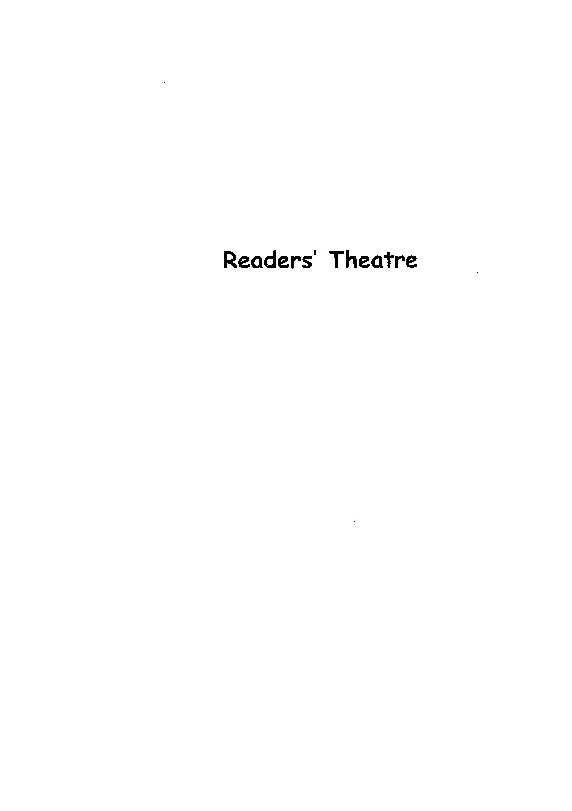

<!-- page break -->
<!-- page 2 -->

READERS’ THEATRE

° Enjoying and appreciating literature through oral reading.

° Through Readers’ Theatre students also gain an understanding of
punctuation as they turn a text (novel, poetry, picture book etc)
into a play script.

® Students can turn indirect speech into direct speech.

e There are many ways of conducting Readers’ Theatre. E.g.

- A group of students (depending on the number of
characters plus narrator) meet to prepare a text for an
oral performance,

- Having allocated characters, each student highlights the
necessary speech for his/her character. Through whole
class shared reading and discussion, they know not to
highlight ‘he said’ etc. (Except where some poetry needs
it).

- The group practises, assisting each other with any
adjustments,

- Depending on the experience of the group, they may
decide to leave out some of the text - e.g. the narrator
may have too much to say, and they can abbreviate this.

- The group knows that they only have their voices. In
front of the class they ‘perform’ their script.

e Students can write their own scripts from stories they know.

° Adaptations of stories can be written and performed.

- Little Red Riding Hood

- Cinderella

- The Three Little Pigs

° Consolidate students’ knowledge of genres
- Anansi the Spider

---

<!-- page 3 -->

° All classes can use a variety of resources for Reader's Theatre
- Shared Reading (all levels)
- Novels being read during Read Aloud time.
- Class Poetry
- Novels being read in groups.
e Literature Groups
° Literature Circles
° Free choice activity
Folders available with copies of various texts. Character list on
outside of folder. Students can form their own group and
organise themselves (characters).
Readers’ Theatre with Younger Readers
e Shared Reading can be turned into Readers’ Theatre in many ways.
- Two parts. Divide the class into two.
Alternate lines or a number of lines.
Somewhere by Jane Baskwill
Ina Dark, Dark Wood - Traditional
Listen to the Rain by Bill Martin Jr.
The Wonderful Happens by Cynthia Rylant.
- Whole class plus individual characters/lines.
Brown Bear, Brown Bear, What Do You See?
by Bill Martin Jr.
Hairy Maclary from Donaldson's Dairy by
Lynley Dodd
Goednight Moon by Margaret Wise Brown.
Who's in the Shed? by Brenda Parkes.
- Questions and response.
Did You Feed My Cow? By M.T.Burrows.
- Characters named for readers to follow.
The King’s Breakfast by A.A.Milne

---

<!-- page 4 -->

. Small group creating script.
Pierre by Maurice Sendak.
Red Riding Hood by Brenda Parkes
Wolf by Becky Bloom
Rooster's Off to See the World by Eric
Carle.
- Poems for 2 voices.
Frog Serenade by Georgia Heard
Honeybees by Paul Fleischman.
Cicadas by Paul Fleischman.
What makes a text suitable for Readers’ Theatre?
- Lots of dialogue
- Good story line
- ‘Striking’ language
- Repetition or cumulative text for younger readers.
Stories to Use
These are books I have at home. Please let me know of others.
The Giving Tree by Shel Silverstein
The Witches by Roald Dahl
Revolting Rhymes by Roald Dahl
Fantastic Mr Fox by Roald Dahl (Just about all Roald Dahl books)
The Paw Thing by Paul Jennings
Harry Potter and the Sorcerer's Stone by J.K.Rowling
Charlotte's Web by E.B.White
Wilfred Gordon McDonald Partridge by Mem Fox
Rooster's Off to See the World by Eric Carle
Wolf by Becky Bloom
Monster for Hire
The Frog Who Would be King

---

<!-- page 5 -->

<!-- blank page -->

---

<!-- page 6 -->

Cinderella by B.Karlin
The Turnip
Character Lists
Wolf! by B.Bloom 5 Readers
Narrator
The Wolf
The Duck
The Pig
The Cow
Fantastic Mr Fox byR.Dahl 6 Readers
Boggis
Bunce
Bean
Narrator
Mr Fox
Mrs Fox
The Paw Thing by P.Jennings 3 Readers
Narrator
Mac
The boy
The Giving Tree by S.Silverstein 3 Readers
Narrator
The Boy
The Tree
The Turnip 4 Readers
Narrator
The Soldier
The King
The Rich Brother

---

<!-- page 7 -->

Charlotte's Web by E.B.White
Chapter 1. Before Breakfast 6 Readers
Narrator
Fern
Mrs Arable
Mr Arable
Avery
Teacher (one line)
Chapter XII A Meeting 9 Readers
Narrator
Charlotte (spider)
Wilbur (pig)
Gander
Goose
Sheep
Templeton (rat)
Goslings*
Lambs* *2 children could take these parts with different voices
Chapter XXI Last Day 4 readers
Narrator
Wilbur
Charlotte
Templeton
The Witches by R.Dahl 2 main readers + audience
Chapter - Formula 86 Delayed Action Mouse-Maker
A good chapter for lead reader with audience response.
Narrator
The Grand High Witch
English Witches
Foolish Witch (also reads with English Witches)

---

<!-- page 8 -->

Anansi the Spider 8 Readers
Narrators 1 & 2
Anansi
Tiger
Animals (2-3)
Snake
Harry Potter and the Sorcerer's Stone J.K.Rowling 5 Readers
Ron
Harry
Hermione
Narrator
Hagrid
Monster For Hire 7 Readers
Narrator
The Monster
The Giant
Wagon Driver
The Prince
The King
The Sorcerer
The Frog Who Would be King 6 Readers
Narrator
The Frog
Lil
The King
The Witch
Court Magician
Cinderella by B.Karlin 6 Readers
Narrator
2 Stepsisters
Cinderella
Fairy Godmother
The Prince

---

<!-- page 9 -->

Little Red Riding Hood by R.Dahl 4 Readers
Narrator
Wolf
Grandma (one line)
Little Red Riding Hood
The Three Little Pigs byR.Dahl 5 Readers
Narrator
Wolf
Pigs 1 &2 (3 lines)
Pig 3
Red Riding Hood

---

<!-- page 10 -->

Reader's Theatre List for Younger Readers (texts included)
Listen to the Rain by Bill Martin Jr
Somewhere by J.Baskwill
The Wonderful Happens by C.Rylant
There was an Old Lady Who Swallowed a Fly
The Very Blue Thingamajig by N.Oliver
Hairy Maclary from Donaldson's Dairy by L.Dodd
Brown Bear, Brown Bear, What do You See? by Bill Martin
Oh, Look! by Patricia Polacco
Did You Feed My Cow? by M.T.Burrows
Pierre by M.Sendak 5 Readers
Narrator
Pierre
Mother
Father
Lion
Who's in the Shed? by Brenda Parkes 7 Readers
Narrator
Sheep
Cows
Old grey mare
Little red hen
Pig
Circus Bear
Rooster's Off to See the World by E.Carle 19 Readers
Narrator
Rooster
Cats (2)
Frogs (3)
Turtles (4)
Fish (5)

---

<!-- page 11 -->

Who’s in the Shed?

By Brenda Parkes
Down at the farm one Saturday night,
the animals woke with a terrible fright
There was howling and growling and roaring and clawing,
as something was led
from a truck to the shed.
“Who's in the shed?” everyone said.
“Who's in the shed?”
“Let me have a peep,” baaed a big white sheep.
“Let me have a peep.”
So the sheep had a peep through a hole in the shed.
What did she see?
“My turn now,” mooed the sleek brown cow.
“My turn now.”
So the cow had a peep through a hole in the shed.
What did she see?
“Let me see in there,” neighed the old grey mare.
“Let me see in there.”
So the mare had a peep through a hole in the shed.
What did she see?
“What is it then?” clucked the little red hen.
“What is it then?”
So the hen had a peep through a hole in the shed.
What did she see?
“It's something big,” grunted the fat pink pig.
“It's something big.”
So the pig had a peep through a hole in the shed.
What did she see?
“HOW DARE YOU STARE!” roared the circus bear.
And everyone ran away from there.

---

<!-- page 12 -->

Listen to the Rain
by Bill Martin Jr. & John Archambault
Listen to the rain,
the whisper of the rain,
the slow soft sprinkle,
the drip-drop tinkle,
the first wet whisper of the rain.
Listen to the rain,
the singing of the rain,
the tiptoe pitter-patter,
the splish and splash and splatter,
the steady sound,
the singing of the rain.
Listen to the rain,
the roaring pouring rain,
the hurly-burly
topsy-turvy
lashing gnashing teeth of rain,
the lightning-flashing
thunder-crashing
sounding pounding roaring rain,
leaving all outdoors a muddle,
a mishy mushy muddy puddle.
Listen to the quietude,
the silence and the solitude
of after-rain,
the ripping, dripping, dropping,
the slowly, slowly stopping
the fresh
wet
silent
after-time
of rain.

---

<!-- page 13 -->

The Wonderful Happens
by Cynthia Rylant

each day...
the wonderful happens
in a little kitchen
someone butters bread,
wonderful bread.
the earth grew wheat,
the wheat made flour,
and the wonderful happened: bread.
in a wide blue sky
flies a tiny bird,
a wonderful bird.
it was an egg,
then it hatched,
and the wonderful happened: a bird!
up a white fence
climbs a red red rose,
a wonderful rose.
someone loved flowers
and asked a seed to grow
and the wonderful happened: a rose.
the wonderful happens every day:

peaches grow,

bees buzz,

and it rains.

---

<!-- page 14 -->

water makes tea,

apples make pie,

and it snows.

dogs sit, clouds glide,

new spiders

spin their very first webs.

Cats look out windows,

stars glow,

and squirrels sleep

in treetop beds.

there is ivy,

there are worms,

there are clocks that keep time.

there’s a moon lighting up a night sky.
and most of all and best of all,
it all never ends,
for the wonderful happens
and happens again:

pie

cats

apples

Clocks

tea

dogs

ivy

birds

wheat

and
peaches
and

you.

yes: YOU.

---

<!-- page 15 -->

did you know
there was a time
when you Weren't anywhere?
but you happened

like bread,

like a bird,

like rain,
you happened
like peaches and snow.
the wonderful happened,
the wonderful is you.
growing like a red red rose.

---

<!-- page 16 -->

SOMEWHERE

by Jane Baskwill
Somewhere in the raindrop,
A rainbow forms from light;
Somewhere in the darkness,
A star lights up the night;
Somewhere in the forest,
A leaf falls to the ground;
Somewhere in the ocean,
A whale echoes a sound;
Somewhere in the treetop,
A black crow sits alone;
Somewhere in the meadow,
Ahare is still as stone;
Somewhere in the desert,
Asun burns up the sky;
Somewhere in the Arctic,
Awolf starts up a cry;
Somewhere on the planet,
Every minute day or night,
Something marvellous happens,
Bringing wonder and delight.

---

<!-- page 17 -->

Rooster's Off to See the World by Eric Carle

One fine morning, a rooster decided that he wanted to travel. So, right then and there, he set out
to see the world. He hadn't walked very far when he began to feel lonely.

Just then, he met two cats. The rooster said to them, “Come along with me to see the world.”

The cats liked the idea of a trip very much.

“We would love to,” they purred and set off down the road with the rooster.

As they wandered on, the rooster and the cats met three frogs.

“How would you like to come with us to see the world?” asked the rooster, eager for more
company.

“Why not?” answered the frogs. “We're not busy now.”

So the frogs jumped along behind the rooster and the cats.

After a while, the rooster, the cats, and the frogs saw four turtles crawling slowly down the road.
“Hey,” said the rooster, “How would you like to see the world?”

‘It might be fun,’ snapped one of the turtles, and they joined the others.

As the rooster, the cats, the frogs, and the turtles walked along, they came to five fish swimming in
the brook.

“Where are you going?’ asked the fish.

“We ve off to see the world, answered the rooster.

‘May we come along?’ pleaded the fish.

‘Delighted to have you,’ the rooster replied.

And so the fish came along to see the world.

The sun went down. It began to get dark. The moon came up over the horizon.

“Where's our dinner?” asked the cats.

“Where are we supposed to sleep?” asked the frogs.

“We're cold,” complained the turtles.

Just then, some fireflies flew overhead.

“We're afraid,” cried the fish.

Now, the rooster really had not made any plans for the trip around the world. He had not
remembered to think about food and shelter, so he didn't know how to answer his friends. After a
few minutes of silence, the fish suddenly decided that it might be best if they headed for home.
They wished the others a happy trip and swam away.

Then, the turtles began to think about their warm house. They turned and crawled back down the
road without so much as a good-bye.

The frogs weren't too happy with the trip anymore, either. First one and then the other and finally
the last one jumped away. They were polite enough, though, to wish the rooster a good evening as
they disappeared into the night.

The cats then remembered an unfinished meal they had left behind. They kindly wished the
rooster a happy journey and they, too, headed for home.

Now the rooster was all alone - and he hadn't seen anything of the world. He thought for a minute
and then said to the moon, “To tell you the truth, I am not only hungry and cold, but I'm homesick
as well.”

The moon did not answer. It, too, had disappeared.

The rooster knew what he had to do. He turned around and went back home again. He enjoyed a
good meal of grain and then sat on his very own perch.

After a while he went to sleep and had a wonderful happy dream — all about a trip around the
world,

---

<!-- page 18 -->

The Giving Tree
by Shel Silverstein
Once there was a tree ...
and she loved a little boy.
And every day the boy would come
and he would gather her leaves
and make them into crowns
and play king of the forest.
He would climb up her trunk
and swing from her branches
and eat apples.
And they would play hide-and-go-seek.
And when he was tired,
he would sleep in her shade.
And the boy loved the tree ...
very much,
And the tree was happy.
But time went by.
And the boy grew older.
And the tree was often alone.
Then one day the boy came to the tree and the tree said,
“Come, Boy, come and climb up my trunk and swing from my branches
and eat apples and play in my shade and be happy.”
“I am too big to climb and play,” said the boy.
“I want to buy things and have fun. I want some money?
Can you give me some money?”
“I’m sorry,” said the tree, “but I have no money. I have only leaves and
apples. Take my apples, Boy, and sell them in the city. Then you will have
money and you will be happy.”
And so the boy climbed up the tree and gathered her apples and carried
them away.
And the tree was happy.
But the boy stayed away for a long time ...
and the tree was sad.
And then one day the boy came back and the tree shook with joy and she
said, “ Come, Boy, climb up my trunk and swing from my branches and be
happy.”
“I am too busy to climb trees,” said the boy.
“I want a house to keep me warm,” he said.
“I want a wife and I want children, and so I need a house. Can you give me
a house?”
“I have no house,” said the tree.

---

<!-- page 19 -->

“The forest is my house, but you may cut off my branches and build a
house. Then you will be happy.”

And so the boy cut off her branches and carried them away to build his
house.

And the tree was happy.

But the boy stayed away for a long time.

And when he came back, the tree was so happy she could hardly speak.
“Come. Boy,” she whispered, “come and play.”

“I am too old and sad to play,” said the boy.

“I want a boat that will take me far away from here. Can you give me a
boat?”

“Cut down my trunk and make a boat,” said the tree.

“Then you can sail away ... and be happy.”

And so the boy cut down her trunk and made a boat and sailed away.
And the tree was happy ... but not really.

After a long time the boy came back again.

“I am sorry, Boy,” said the tree, “but I have nothing left to give you —
My apples are gone.”

“My teeth are too weak for apples,” said the boy.

“My branches are gone,” said the tree. “You cannot swing on them —*
“I am too old to swing on branches,” said the boy.

“My trunk is gone,” said the tree. “You cannot climb —”

“I am too tired to climb,” said the boy.

“I am sorry,” sighed the tree.

“I wish that I could give you something ...

but I have nothing left. I am just an old stump.

I am sorry ....”

“I don’t need very much now,” said the boy,

“Just a quiet place to sit and rest. I am very tired.”

“Well,” said the tree, straightening herself up

as much as she could, “Well, an old stump is good

for sitting and resting. Come, Boy, sit down.

Sit down and rest.”

And the boy did.

And the tree was happy.

---

<!-- page 20 -->

The Very Blue Thingamajig Narelle Oliver
Once there was an egg with more spots than you could count.
Creak ... crunch ... crack!

Before long, out popped a very blue thingamaijig.

This thingamajig was different from other thingamajigs.
“How plain!” scoffed one.

“How boring!” snorted another.

“How drearily different,’ they all muttered.

The very blue thingamajig was mostly left alone.

Then ...

One Sunday morning, without any warning, the very blue thingamajig woke up
with ...

one twisty twirly tail.

On Monday the very blue thingamajig woke up with one twisty twirly tail and ...
a pair of yellow waxy wings.

On Tuesday the very blue thingamajig woke up with

one twisty twirly tail,

a pair of yellow waxy wings, and ...

an odd number of red hideously hard horns.

On Wednesday the very blue thingamajig woke up with
one twisty twirly tail,

a pair of yellow waxy wings,

an odd number of red hideously hard horns, and ...

two lots of two ferocious fangs.

On Thursday the very blue thingamajig woke up with
one twisty twirly tail,

a pair of yellow waxy wings,

an odd number of red hideously hard horns,

two lots of two ferocious fangs, and ...

five skinny pink stripes.

On Friday the very blue thingamajig woke up with

one twisty twirly tail.

a pair of yellow waxy wings,

an odd number of red hideously hard horns,

two lots of two ferocious fangs,

five skinny pink stripes, and ...

an even number of curly whirly hairs.

---

<!-- page 21 -->

On Saturday the very blue thingamajig woke up with

One twisty twirly tail,

a pair of yellow waxy wings,

an odd number of red hideously hard horns,

two lots of two ferocious fangs,

five skinny pink stripes,

an even number of curly whirly hairs, and ...

seven tangerine tail spikes.

And on the following Sunday the very blue thingamajig woke up with

one twisty twirly tail,

a pair of yellow waxy wings,

an odd number of red hideously hard horns,

two lots of two ferocious fangs,

five skinny pink stripes,

an even number of curly whirly hairs,

seven tangerine tail spikes, and ...

four lots of two green clicky clacky claws.

The very blue thingamajig was not so plain any more. Other thingamajigs stared.
“What a show-off!” scowled one.

“Ridiculous!” snapped another.

"How dreadfully different,’ they all muttered.

But as the very blue thingamajig began to wander away, he stopped in his tracks.
There, before him, was another thingamajig, all alone.

She did not scoff or snort or scowl or snap.

“How delightfully different you are,” she said, smiling her toothiest thingamajig
smile,

The pair of thingamajigs stretched their four waxy wings. Then they flapped and
flipped and flew about as high and low as numbers go.

---

<!-- page 22 -->

There was an Old Lady Who Swallowed a Fly
There was an old lady who swallowed a fly.

I don’t know why she swallowed the fly.
Perhaps she'll die.

There was an old lady who swallowed a spider
That wiggled and jiggled and tickled inside her.
She swallowed the spider to catch the fly.

I don't know why she swallowed the fly.
Perhaps she'll die.

There was an old lady who swallowed a bird.
How absurd! She swallowed a bird.

She swallowed the bird to catch the spider.
She swallowed the spider to catch the fly.

I don’t know why she swallowed the fly.
Perhaps she'll die.

There was an old lady who swallowed a cat.
Imagine that! She swallowed a cat.

She swallowed the cat to catch the bird.

She swallowed the bird to catch the spider.
She swallowed the spider to catch the fly.

I don’t know why she swallowed the fly.
Perhaps she'll die.

There was an old lady who swallowed a dog.
She went whole hog to swallow the dog.

She swallowed the dog to catch the cat.

She swallowed the cat to catch the bird.

She swallowed the bird to catch the spider.
She swallowed the spider to catch the fly.

I don’t know why she swallowed the fly.
Perhaps she'll die.

---

<!-- page 23 -->

There was an old lady who swallowed a cow.
I don’t know how she swallowed the cow.
She swallowed the cow to catch the dog.

She swallowed the dog to catch the cat.

She swallowed the cat to catch the bird.

She swallowed the bird to catch the spider.
She swallowed the spider to catch the fly.

I don’t know why she swallowed the fly.
Perhaps she'll die.

There was an old lady who swallowed a horse.
She died, of course!

---

<!-- page 24 -->

Pierre by Maurice Sendak

Prologue

There once was a bog named Pierre who only would say,
“I don’t care?”

Read his story my friend, for you'll find at the end that a suitable moral lies there.
Chapter t

One day his mother said when Pierre climbed out of bed,
“Good morming, darling boy, you are my only joy.”
Pierre said, “| don’t care!”

“What would you like to eat?”

“I don’t care!”

"Don’t sit backwards on gour chair.”

“I don’t care?”

“Or pour syrup on your hair”

“I don’t care?”

"You are acting like a clown”

“I don’t care!”

“And we have to go to town.”

“I don’t care!”

“Don't you want to come, my dear?”

“I don’t care?”

“Would you rather stay right here?”

“I don’t care!”

So his mother left him there.

Chapter 2.

His father said, Get off your head, or | will march you of f to bed.”
Pierre said, "| don’t care!”

| would think that you could see ~"

“I don’t care!”

“Your head is where your feet should be”

“I don’t care!”

---

<!-- page 25 -->

lf you keep standing upside down-"
“I don’t care?”

Weill never ever get to town.”

“I don’t care!”

«lf only you would say | CARE?

“I don’t care?”

“bd let you fold the folding chair”

“I don’t care!”

So his parents left him there.

They didn’t take him anywhere.
Chapter 3.

Now, as the night began to fall, a hungry lion paid acall.
He looked Pierre right in the eye, and asked him if he’d like to die.
Pierre said, “| don’t care!”

«| can eat you, dont you see?”

“I don’t care?”

“And you will be inside of me.”

“I don’t care?”

“Then you'll never have to bother —*
“I don’t care?”

“With a mother and a father.”

“I don’t care?”

ls that all you have to say?”

“I don’t care?”

“Then [Heat you, if | may.”

4 don't care!”

Soe the lion ate Pierre.

---

<!-- page 26 -->

Chapter 4.

Arriving, home at six o'clock, his parents had a dreadful shock!
They found the lion sick in bed and cried,

“Pierre is surely dead?

They pulled the lion by the hair.

They hit him with the Folding chair.

His mother asked, “Where is Pierre?”

The lion answered, «| don’t care!”

His father said, “Pierre’s in there!”

Chapter 5

They rushed the lion into town.

The doctor shook him up and down.

And when the lion gave a roar — Pierre fell out upon the floor.
He rubbed his eyes and scratched his head,

and laughed because he wasn’t dead.

His mother cried and held him tight.

His father asked, “Are you all right?”

Pierre said, «| am feeling fine, please take me home

it’s half pastnine.”

The lion said, “IF you would care to climb on me, pill take you there.”
Then everyone looked at Pierre who shouted, “Yes, indeed | care!”
The lion took them home to rest,

and stayed onasa weekend guest.

The moral of Pierre is:

CARL! ;

---

<!-- page 27 -->

FROG SERENADE
Georgia Heard
Poem for two voices.
Ga-lank
Ga-lunk
Ga-lunk
Ihear your
Ga-lunk
deep-voiced songs
Ga-lunk
Ga-lunk
Ga-lunk
by the pond
Ga-lunk
this warm
summer
night.
Ga-lunk
Ga-lunk
Ga-lunk
Thear your
Ga-lunk
chorus of
Ga-lunk
Ga-lunk
Ga-lunk
banjo songs
Ga-lunk
under the shining stars
tonight.

---

<!-- page 28 -->

Red Riding Hood
by Brenda Parkes
Once upon a time, a little girl called Red Riding Hood lived with her mother in a cottage near the woods. On the
other side of the woods lived her grandmother, and somewhere in the woods lived a BIG BAD WOLF.
One day, Red Riding Hood and her mother made some apple pies. When the pies were cool, her mother packed
them into a basket
"Take these pies to your grandmother, Red Riding Hood," she said. "She loves apple pies. And remember now,
keep on the path, and DON'T GO INTO THE WOODS."
Red Riding Hood set off on her skateboard. Near a big tree, she met a forest ranger
"Where are you going, Red Riding Hood?" he asked.
“I'm going to visit my grandma. She lives by the church,” she said.
“Keep on the path,” said the forest ranger, "AND DON'T GO INTO THE WOODS.”
But just over the bridge, Red Riding Hood saw some beautiful flowers growing near the path. She hopped off her
skateboard and began to pick them. Further and further into the woods she went. The wolf watched.
“Now I have time to get to Grandma's house first,” he thought, and away he ran.
When the big bad wolf got to Grandma's house he knocked on the door.
RAT-A-TAT-TAT
RAT-A-TAT-TAT
Grandma was resting in bed,
"Who is it?" she called.
“It's Red Riding Hood,” replied the wolf in a soft voice,
“Lift up the latch and come in," called Grandma.
In came the wolf... With a scream Grandma jumped out of bed and hid in the wardrobe,
“I'll get you later,” snarled the big bad wolf.
Quickly he put on her dressing gown and scarf and climbed into the bed. Just as he pulled up the bedclothes, he
heard a knock at the door.
"Who is it?" called the wolf in a soft little voice.
“This is Red Riding Hood.”
“Lift up the latch and come in,” replied the wolf,
Red Riding Hood came into the bedroom and stood by the bed.
"Oh Grandma, what big ears you have!" she said.
“All the better to hear you with, my dear!” said the wolf.
Red Riding Hood came close,
"Oh Grandma, what big eyes you have!" she said.
“All the better to see you with, my dear!” said the wolf.
Red Riding Hood sat on the bed.
"Oh Grandma, what big teeth you have!" she said.
"All the better to eat you with, my dear!" snarled the wolf.

---

<!-- page 29 -->

He leapt at Red Riding Hood. Red Riding Hood hit the wolf in the face with an apple pie. The wolf couldn't see
where he was going, and he trod on Red Riding Hood's skateboard.

The skateboard hit the wall, and the wolf hurtled out the window just as the forest ranger came by, on his way home
from work,

“Hey! What are you doing, Wolf?” shouted the forest ranger,

The wolf ran off deep, deep into the woods, and the forest ranger chased him, shouting and waving.

Grandma came out of the wardrobe and hugged Red Riding Hood.

"Well done, Red Riding Hood," she said, “you saved our lives.”

Grandma and Red Riding Hood called to the forest ranger to come back, and they all had apple pie for supper.
And so did the wolf.

---

<!-- page 30 -->

Hairy Maclary from Donaldson’s Dairy
by Lynley Dodd

Out of the gate

and off for a walk

went Hairy Maclary

from Donaldson’s Dairy

and Hercules Morse

as big as a horse

with Hairy Maclary

from Donaldson’s Dairy.

Bottomley Potts

covered in spots,

Hercules Morse

as big as a horse

and Hairy Maclary

from Donaldson's Dairy.

Muffin Mclay

like a bundle of hay,

Bottomley Potts

covered in spots,

Hercules Morse

as big as a horse

and Hairy Maclary

from Donaldson’s Dairy,

Bitzer Maloney

all skinny and bony,

Muffin McLay

like a bundle of hay,

Bottomley Potts

covered in spots,

Hercules Morse

as big as a horse

and Hairy Maclary

from Donaldson's Dairy. :

Schnitzel von Krumm

---

<!-- page 31 -->

with a very low tum,

Bitzer Maloney

all skinny and bony,

‘Muffin McLay

like a bundle of hay,
Bottomley Potts

covered in spots,

Hercules Morse

as big as 4 horse

and Hairy Maclary

from Donaldson's Dairy.

With tails in the air

they trotted on down

past the shops and the park

to the far end of town.

They sniffed at the smells

and they snooped at each door,
when suddenly,

out of the shadows

they saw ...

SCARFACE CLAW

the toughest Tom in town.
“EEEEEOWWWFFTZ"" said Scarface Claw,
Off with a yowl

a wail and a howl, ;
a scatter of paws

and a clatter of claws,

went Schnitzel von Krumm
with a very low tum,

Bitzer Maloney

all skinny and bony,

Muffin McLay

like a bundle of hay,
Bottomley Potts

covered in spots,

Hercules Morse

as big as. a horse

and Hairy Maclary :
from Donaldson's Dairy.
Straight back home to bed.

---

<!-- page 32 -->

Cinderella
Retold by Barbara Karlin

Once there was a widower with a kind and beautiful daughter. Life
was sweet in their simple cottage, unti] the widower decided to
remarry. Not knowing the ways of the world, he married a vain and
horrid woman, whose two daughters were as vain and horrid as she.
“What a stupid little house!” they said.

The widower’s daughter was made to work like a servant in her own
house. She was soon run ragged ~ washing, ironing, scrubbing,
dusting, and cooking heaps of food. The poor girl no longer had a bed
of her own and had to sleep among the ashes and cinders. And from
that time on, they called her Cinderella,

Now it happened that the king of the land had a handsome son. The
king‘s greatest desire was to see his son married. He decided to give
a ball and invite all the fair maidens of the reaim.

When the king’s messenger delivered the royal invitation, the dreadful
stepsisters were overjoyed. Each was convinced that she would win
the prince’s favor.

On the day of the ball, Cinderella was exhausted from trying to make
her stepsisters look beautiful.

“Wouldn’t you like to go to the ball?” they said, teasing her cruelly.
“Oh, yes!” said Cinderella.

“Don’t be ridiculous!” cried the stepsisters.

“What would a wretched mouse like you do at a fancy ball?”

And they shrieked with laughter.

Thinking themselves beautiful beyond words, the stepsisters left for
the ball. “Don’t be a lazybones while we’re away,” they said to
Cinderella. “And think about all the fun we'll be having.”

After her stepsisters had gone, Cinderella went about her chores. As
she worked, she wept bitterly.

“You look so miserable, child,” said a kind voice.

“Who are you?” said Cinderella.

“L,” replied the plump little woman, “am your fairy godmother. Please
tell me why you are crying.”

“T want so much to go to the ball,” said Cinderella.

“That should not be too difficult to arrange,” said the fairy godmother.
“But you must do as I say. First, fetch me a nice, big pumpkin from
the garden.” Cinderella brought the biggest pumpkin she could find.
“Now,” said the fairy godmother, “I will require six white mice and a
fine, fat rat.” Cinderella brought them, live from the trap.

“And finally,” said the fairy godmother, “I must have two lizards. You
might look behind the watering pail.”

Cinderella did as she was told. With a touch of her wand, the fairy
godmother changed the pumpkin into a magnificent golden coach, the

---

<!-- page 33 -->

mice into six white horses, the rat into a jolly coachman, and the
lizards into two sleek footmen.

“Lovely,” the fairy godmother exclaimed. “Off you go!”

“Am I to go in rags?” said Cinderella.

‘Silly me,” said the fairy godmother.

And she transformed Cinderella’s filthy rags into an elegant gown, and
on her feet placed a pair of sparkling glass slippers.

“Now you are ready,” said the fairy godmother. “But remember this -
you must return home before the stroke of midnight, for then all your
finery will change back to what it was.”

Cinderella promised to obey and then she was off to the ball.

At the palace, the prince learned that an enchanting maiden had
arrived, and he greeted her himself. The other guests were puzzled.
Who was this beautiful stranger?

Completely smitten, the prince had eyes only for Cinderella. They
danced every dance. Cinderella found herself deeply in love. She was
so happy that she took no notice of the hour. Suddenly the clock
began to strike twelve! Remembering the warning, Cinderella ran
from the prince’s arms, out of the ballroom, and down the steps of the
palace. In her haste, she lost one of the glass slippers.

“Wait! Wait!” cried the prince. “I don’t know your name!”
Cinderella’s golden coach sped away from the palace. But at the
stroke of twelve the fairy godmother’s warning came true - the coach
was changed back into a pumpkin, the horses back into mice, the
coachman back into a rat, and the footmen back into lizards.
Cinderella was once again dressed in rags.

Discovering the tiny glass slipper, the prince vowed to find and marry
the beautiful stranger. He travelled the kingdom far and wide, trying
the slipper on every maiden’s foot. But it fitted no one. Finally he
arrived at Cinderella’s house.

“Me first!” cried the elder stepsister, extending her long, skinny foot.
But she could manage to get only her toes into the slipper.

“My turn!” cried the younger stepsister, thrusting her pudgy foot at the
prince. She pushed and shoved, grunted and groaned, but the slipper
would not fit.

“May I try it on? said Cinderella, stepping out of the shadows.

The glass slipper fitted perfectly on Cinderella’s tiny foot.

“I have found my princess!” cried the prince. “We shall wed
tomorrow!”

On that festive day, the kingdom rejoiced. Generous and forgiving,
Cinderella moved her family into the palace and found a lord of the
court for each of her stepsisters to marry. Cinderella’s fairy
godmother moved in too, just to make sure everyone lived happily
ever after.

---

<!-- page 34 -->

Brown Bear, Brown Bear, What Do You See?
by Bill Martin Jr.
Brown bear, brown bear, what do you see?
I see a red bird looking at me.
Red bird, red bird, what do you see?
I see a yellow duck looking at me.
Yellow duck, yellow duck, what do you see?
I see a blue horse looking at me.
Blue horse, blue horse, what do you see?
I see a green frog looking at me.
Green frog, green frog, what do you see?
I see a purple cat looking at me.
Purple cat, purple cat, what do you see?
I see a white dog looking at me.
White dog, white dog, what do you see?
I see a black sheep looking at me.
Black sheep, black sheep, what do you see?
I see a goldfish looking at me.
Goldfish, goldfish, what do you see?
I see a monkey looking at me.
Monkey, monkey, what do you see?
I see children looking at me.
Children, children, what do you see?
We see a brown bear, a red bird, a yellow duck, a blue horse, a
green frog, a purple cat, a white dog, a black sheep, a
goldfish and a monkey looking at us. That's what we see.

---

<!-- page 35 -->

Oh, Look!
by Patricia Polacco
Oh, look, we see a fence. It’s always there, keeping us in ... safe and sound.
Can't go over it,
can’t go under it,
can’t go around it ...
But there’s the gate and it’s unlocked.
Let's go through it!
Squeak, squeak, squeak it goes as we go through it.
Oh, look, we see a bridge. A nice wide bridge.
Can't jump over it,
can’t go under it,
can’t go around it ...
Let's go across it!
Click, click, click our little hooves go as we go across it.
Oh, look, we see a hill. High and green.
Can't go over it,
can’t go under it,
can’t go around it ...
Let's climb up it!
Puff, puff, puff we go as we climb up it.
Oh, look, we see water. A deep blue pond.
Can't go over it,
can’t go under it,
can’t go around it...
Let's swim in it!
Swish, swish, swish we go as we swim in it.
Oh, look, we see some mud. Soft and gooey, slippery and slick.
Can’t go over it,
can’t go under it,
can’t go around it...
Let’s play with it!
Squish, squish, squish it goes as we play with it.
Oh, look, we see a fair. With big striped tents and flags all aflutter.
Can't go over them,
can’t go under them,
can’t go around them ...
Let’s run between them!
Flap, flap, flap go the flags as we run between them.

---

<!-- page 36 -->

Oh, look, we see a carousel with merry, merry music, going round and round.
Can't go over it,
can’t go under it,
can’t go around it...
Let’s get on it!
Um-pah-pah, um-pah-pah, um-pah-pah it goes as we climb on.
Oh, look, we see a mirror. It wiggles and wobbles.
Can't go over it,
can’t go under it,
cart go around it ...
How does it do that? Let’s look behind it!
Oh, look! We see something ...
with great big eyes and sharp green claws.
It's an ogre, and he looks mean. Now we're scared!
Let's run home as fast as we can.
Past the mirror that wiggles and wobbies,
on the carousel that um-pah-pahs!
Between the tents that flap, flap, flap!
Into the water with a swish, swish, swish,
and gooey mud with a squish, squish, squish!
Up the hill with a puff, puff, puff,
across the bridge with a click, click, click!
Through the gate with a long, loud squeak ...
right back home, safe and sound!
Ahhhhhhhhhh.

---

<!-- page 37 -->

Wolf!

by Becky Bloom
After walking for many days, a wolf wandered into a quiet little town. He was tired
and hungry, his feet ached, and he had only a little money that he kept for
emergencies.
The he remembered. There’s a farm outside this village, he thought. I'll find some food
there ....
As he peered over the farm fence, he saw a pig, a duck, and a cow reading in the sun.
The wolf had never seen animals read before.
“Pm so hungry that my eyes are playing tricks on me,” he said to himself. But he really
was very hungry and didn’t stop to think abaut it for too long.
The wolf stood up tall, took a deep breath ...
« and leaped at the animals with a howl —
“Aaad0000c0!”
Chickens and rabbits ran for their lives, but the duck, the pig, and the cow didn’t
budge.
“What is that awful noise?” complained the cow. “I can’t concentrate on my book.”
“Just ignore it,” said the duck.
The wolf did not like to be ignored.
“What's wrong with you?” growled the wolf. “Can't you see I'm a big and dangerous
wolf?”
“Pm sure you are,” replied the pig. “But couldn’t you be big and dangerous
somewhere else? We're trying to read. This is a farm for educated animals. Now be a
good wolf and go away,” said the pig, giving him a push.
The wolf had never been treated like this before.
“Educated animals ... educated animals!” the wolf repeated to himself. “This is
something new. Well then! !'ll learn how to read too.”
And off he went to school.
The children found it strange to have a wolf in their class, but since he didn’t try to eat
anyone, they soon got used to him. The wolf was serious and hardworking, and after
much effort he learned to read and write. Soon he became the best in the class.
Feeling quite satisfied, the wolf went back to the farm and jurnped over the fence. I'll
show, he thought. He opened his book and began to read,
“Run, wolf! Run!
See wolf run.”
“You've got a long way to go,” said the duck, without even bothering to look up. And
the pig, the duck, and the cow went on reading their own books, not the least
impressed,
The wolf jumped back over the fence and ran straight to the public library. He studied
long and hard, reading lots of dusty old books, and he practiced and practiced until he
could read without stopping.
“They'll be impressed with my reading now,” he said to himself.
The wolf walked up to the farm gate and knocked. He opened The Three Little Pigs
and began to read:
“Onceuponatimetherewerethreelittlepigsonedaytheirmothercalledthemandtoldthem—*
“Stop that racket,” interrupted the duck.

---

<!-- page 38 -->

“You have improved,” remarked the pig, “but you still need to work on your style.”
The wolf tucked his tail between his legs and stunk away.
But the wolf wasn’t about to give up. He counted the little money he hac! left, went to
the bookshop, and bought a splendid new storybook. His first very own book!
He was going to read it day and night, every letter and every line. He would read so
well that the farm animals would admire him.
Ding-dong, rang the wolf at the farm gate.
He lay down on the grass, made himself comfortable, took out his new book, and
began to read. He read with confidence and passion, and the pig, the cow, and the
duck all listened and said not one word. Each time he finished a story, the pig, the
duck, and the cow asked if would please read them another.
So the wolf read on, story after story.
One minute he was Little Red Riding Hood,
the next a genie emerging from a lamp,
and then a swashbuckling pirate.
“This is so much fun!” said the duck.
“He's a master,” said the pig.
“Why don’t you join us on our picnic today,” offered the cow.
And so they all had a picnic - the pig, the duck, the cow, ond
the wolf. They lay in the tall grass ond told stories all the
afternoon long.
“(Ne should all become storytellers,” said the cow suddenly.
“We could travel around the world,” added the duck.
“We can start tomorrow morning,” said the pig.
The wolf stretched in the grass. He wos happy to have such
wonderful friends.
_— a LB al 7 _
Slee | eas oo pe fe
7 Eee ee ge see eid. ot ve 4 i é
| ee
ed! ie an
1 i a a

---

<!-- page 39 -->

The Paw Thing by Paul Jennings (extract)

Mac pointed a long skinny finger at Singenpoo. “You're the one. You're the one that
gave them the recipe.”

Singenpoo crouched down in the corner. She was frightened by all the yelling.

Mac had flipped his lid. He thought the cat had torn the page out of the book with its
mouth.

“Don’t be silly,” I said. “Cats can’t read. It wouldn’t know which page to take.”
“Look at this,” shouted Mac. He thrust the book under my nose and pointed at a
smudge on the corner of the first page. “A paw print. A paw print. The cat has been
at my book.”

“So?” I said. “Singenpoo probably jumped up on the table and stepped on the book.
That doesn’t mean that she read it.”

By now Mac was so angry that he was spitting as he spoke.

“I tell you, Singenpoo has been reading the recipe book. I have suspected it for
weeks. One night I saw her looking at it. And not just looking at it: she turned over
the page with her paw.”

I started to laugh. I just couldn’t help it. The whole idea was crazy.

“Singenpoo has to go,” said Mac. “I’m not having the mangy thing here for one more
minute.”

He took twenty dollars out of his wallet.

“Take her down to the vet’s and have her put down.”

“Put down? What do you mean, put down? Put down where?”

“Put down. Put to sleep. Killed,” grunted Mac.

T couldn’t believe it.

“She’s innocent,” I said. “Cats can’t read. Someone else stole your secret recipe. It
wasn’t Singenpoo. Don’t have her put down. Please.”

I picked up the frightened cat and held her in my arms.

Mac pointed to the door.

“Even if she didn’t read the book,” he said, “she can’t catch mice. She’s no good to
us. Go, or you are sacked.”

I took the twenty dollars and walked out of the door with Singenpoo still in my arms.
She was shivering with fear. Cats can tell when something is wrong.

---

<!-- page 40 -->

Fantastic Mr Fox by Roald Dahi

“Dang and blast that lousy beast!” cried Boggis.

“T’d like to rip his guts out!” said Bunce.

“He must be killed!” cried Bean.

“But how?” said Boggis. “How on earth can we catch the blighter?”

Bean picked his nose delicately with a long finger.

“I have a plan,” he said.

“You’ve never had a decent plan yet,” said Bunce.

“Shut up and listen,” said Bean. “Tomorrow night we will hide just outside the hole
where the fox lives. We will wait there until he comes out. Then... Bang! Bang-
bang-bang.”

“Very clever,” said Bunce. “But first we shall have to find the hole.”

“My dear Bunce, I’ve already found it,” said the crafty Bean. “{t’s up in the wood on
the hill. It’s under a huge tree...”

“Well, my darling,” said Mr Fox. “What shall it be tonight?”

“J think we'll have duck tonight,” said Mrs Fox. “Bring us two fat ducks, if you
please. One for you and me, and one for the children.”

“Ducks it shall be!” said Mr Fox. “Bunce’s best!”

“Now do be careful,” said Mrs Fox.

“My darling,” said Mr Fox, “I can smell those goons a mile away. I can even smell
one from the other. Boggis gives off a filthy stink of rotten chicken-skins. Bunce
reeks of goose-livers, and as for Bean, the fumes of apple cider hang around him like
poisonous gases.”

“Yes, but just don’t get careless, “said Mrs Fox. “You'll know they'll be waiting for
you, all three of them.”

“Don’t you worry about me,” said Mr Fox. “I'l see you later.”

But Mz Fox would not have been quite so cocky had he known where the three
farmers were waiting at that moment. ...

He crept a little further out of the hole...then further still. ...

Just then, his sharp night-eyes caught a glint of something bright behind a tree not
far away. ...

Great heavens! It was the barrel of a gun! ...

Bang-bang! Bang-bang! Bang-bang!

“Did we get him?” said Bean.

One of them shone s flashlight on the hole, and there on the ground, in the circle of
light, half in and half out of the hole, lay the poor tattered bleodstained remains of ...
a fox’s tail. Bean picked it up.

“We got the tail but we missed the fox,” he said, tossing the thing away.

“Dang and blast!” said Boggis “We shot too late. We should have let fly the moment
he poked his head out.”

“He won’t be poking it out again in a hurry,” Bunce said.

---

<!-- page 41 -->

<!-- Harry Potter and the Sorcerer's Stone extract - scanned page embedded below -->

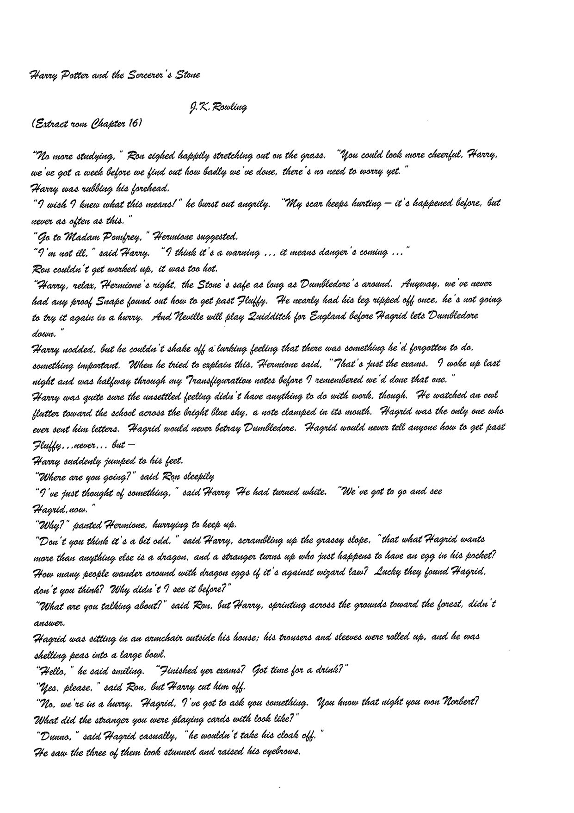

<!-- page 42 -->

<!-- Harry Potter extract continued - scanned page embedded below -->

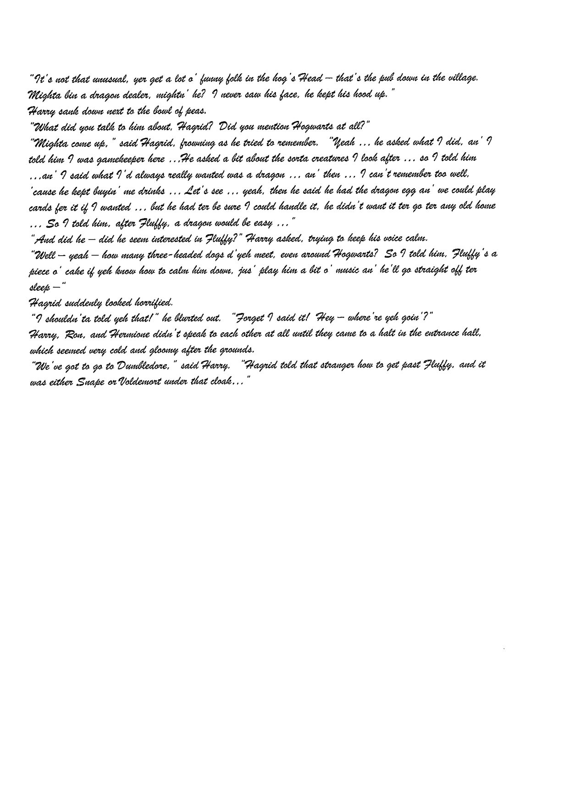

<!-- page 43 -->

Did You Feed My Cow?
by Margaret Taylor Burrows
Did you feed my cow?
Yes, ma’am!
Will you tell me how?
Yes, ma’am!
Oh, what did you give her?
Corn and hay.
Oh, what did you give her?
Corn and hay.
Did you milk her good?
Yes, ma’am!
Did you do like you should?
Yes, ma’am!
Oh, how did you milk her?
Swish! Swish! Swish!
Oh, how did you milk her?
Swish! Swish! Swish!
Did my cow die?
Yes, ma’am!
Did my cow die?
Yes, ma’am!
Oh, how did she die?
Ugh! Ugh! Ugh!
Oh, how did she die?
Ugh! Ugh! Ugh!
Did the buzzards come?
Yes, ma’am.
For to pick her bones?
Yes, ma’am.
Oh, how did they come?
Flop! Flop! Flop!
Oh, how did they come?
Flop! Flop! Flop!

---

<!-- page 44 -->

The Turnip

A German Folk Tale
A poor soldier came back from the wars and found that his rich brother would
have nothing to do with him, and shut the door in his face.

So the soldier took off his uniform and turned farmer. He dug and
hoed his bit of land and sowed it with turnip seed. The seed came up. One of
the turnips was larger and stronger than the rest. It grew and grew, and
seemed as if it would never stop growing. Never was such a turnip seen
before and never will such a one be seen again.

At last it was so enormous, it filled a cart and two oxen were required
to pull it.

“This must be the king of turnips!” said the soldier. “Whatever
shall I do with it? No one will want to buy it, for small turnips taste better
than large ones. I’d better take it to the King and make him a present of it.”

The soldier took his turnip in a cart, drawn by two oxen, to the palace
and presented it to the king.

“Well, well!” said the king. “I’ve seen many wonderful things, but
never, never have I seen such a monster as this turnip. How did you grow it?
What is your secret?”

“Pve no secret,” said the soldier. “I planted turnip seeds in the usual
way, and one turnip grew to this size.”

“Then you must be favorite of good fortune!” said the King.

“I am not,” said the soldier, and he went on to tell the king how he had
returned from the wars, and how his rich brother had shut the door in his‘
face.

“You shall be as rich as your brother,” said the King, and he ordered
gold and silver to be loaded on to the soldier’s cart until it could hold no more.
Altogether it was a fortune.

When the rich brother heard about this fortune his brother had gained
with one turnip, he was filled with envy, and wondered how he could add to
his wealth by pleasing the King.

“My brother gave the King the best he had. IfI do the same, he'll
surely reward me with real treasure.”

So he ordered his servants to load his best gold plates and his wife’s
richest jewels on to the backs of six of his finest horses, and rode with them to
the palace.

The King said he was amazed at the splendor of the gifts, and he’d like
to show his appreciation of such generosity.

“You shall have the most marvelous thing I possess,” said he. “This
wonderful turnip!”

The rich brother had to accept the turnip, there was nothing else he
could do. It was all he got in exchange for the gold and rich jewels he had
given the King. And it was all he deserved.

---

<!-- page 45 -->

<!-- OCR could not reliably read this page. See original scan. -->

<!-- OCR artifact -->

a3 842 3

te a5 Su Bes a

3S =) 2eles Ha .

3 2 aad garage Be 438

5 oal0 Pace he "5b. =z 2

ge 2 ey Sea es er. coe ray eas ”

oo = be peg SZ oo gs 4 £8 ys EUR

BR as Byers ao ga sé “ee 5 6 ¢2 3 Lbs
3 aie S852 2.8 & Lae o Se go ae
ao Seo ESS 37 ia Ga § 3 a ict 2 Se sk SB £8
868 Sag se gS ang £3 28 SCxeB fg ca ak 2 a &
S23 ZEB ~Bele Be Os S s8e = g 85 3 HEL 28
3.6 334 See ay S8 of g Eg £ 6 os fae eS BA
45 go? Ber og cc e808 & e = Bag Bs a
BR BEE Shu s Bs ee gEegess ~ eR geeeeee

Gag ae] 3] 38 8 s 2 8 Og! Sr &

a rs) oS oe Oo oe 279 + oc Bogs
5 on 8 DER EP. oe Be Say ESSE 225 Crees:
22 ESs £25e53%0 FS SESC TSE Bee caaeeees
2. 3 .o8 5k ( io 3
=. BSE gee ebeee a8 PES o EEE Bae 2268 2283
8 : Zz od = 9 i I . s vo gt « o's
ab Oo BORS Bos 2 Ss 2.8: = Beet Bes % B*,.2
ES ESE. Gaye PEs SiS es2Ee8 = & tay eies

Sawee i 1 20'e Beas S2EB83 3) Ba Zan8 7
358 eos 2885 BB. 3 Swe see g Reds SHES oes

Gms So 98 B oS 3) oS ~g8tse 358 a-Gc 8 22s
aug: sene5 88 ¢ E. 2bs3E532 5 BGSSE LS ga 2S
EUSLSEzoEES 2 2 533 Zeecgss Si 2gepesit
SSR ep REE ES F583 eg peg cseeee 2 = 32922222
Hea aa gos keeet yey 8

. 2: 2 BP Se
SEG AP ERs eggs c8 |
at gon” oS? Ba, a. wo am 5
aE aria: er ectty pos? s6 25 Fes
nS aediulus SOE eee bese
¥g- B Give
BEB gets Ure
a 58 gla ese as : ode BBE 8
3 Se 5° eS eee absyer sé
GO8e Br Bogs SESS o
- & oR BOSSE aS
5 0 7 98
® q
<!-- OCR artifact -->
gE »
& ger gs 2 ¢ 3B bo
ted Oog 5.8 BR Pa = o
Q gee ge 8 a © Pe E ee 8
< ao. fb a3 38 € & bh £82538,
sab bes seig 48 Rg 82g goede
Vv go 8 a 8 gs 8 8 s £ BUS a 5 38
OY Bae ye 5 § & Be 8 Sue 4 2s
Ps ge. $e Bog. 9 3 gt Reo bE yong
Ww feo SE : DS Be] } o e oH eES
a seo > Be . _ dak a
aS 36% g2 2 ey 8 8 g 58 Bah Suck
ON g,2 6s ay 2 s24 3 og 8 wd Se gers
= = Os oD 4 7
an Begees = 323 3 728 eez Bee feds
a gis s28 ~ - 32 3 wiz PER gee Rees
\o 5 Om 2s o 2. g's og % BS S08 8 Pian
CO say rg a 9 g Bo ong [oy $28 S258
© reeees = 33s g BERS Bee 5 427 g
ow oy SEO 8 ae Oost B'S ao Bot te
= eSee8§ Babee . Beeb eee Se ions
3 Hes 20 8 Bore uninit eens
g. gee as fo gse BES esau ke Hoes
asc S_ Bae? 20 Sasa ga88 o4'3
Seeeee: 8 jee Ses SEEGSEEEE = gs
5 ride Ge AMEE
2 8 Ser > 4 a sekage = oo 8
fly eescs GSt push ons) aREUR Cees
Po ee ae ed fase. § ales
Orge eee Subs
= ment Bat Ss ge sO 2 a8 3ben53 gS fau
as ay gs rPOg Pegeses SUS
6 FG es g& 8h 3 ae ¥ o 5
ft o : 2 SF Pe ofS
© eee fz 5
o e Beet a8 Bs
SB. ES gs om
zo So
<!-- OCR artifact -->

---

*[Pages 45-55 were too garbled by OCR to reliably correct (the scan appears to have captured an illustration or densely formatted page rather than plain text) and have been left as scanned.]*

os

a3 842 3

te a5 Su Bes a

3S =) 2eles Ha .

3 2 aad garage Be 438

5 oal0 Pace he "5b. =z 2

ge 2 ey Sea es er. coe ray eas ”

oo = be peg SZ oo gs 4 £8 ys EUR

BR as Byers ao ga sé “ee 5 6 ¢2 3 Lbs
3 aie S852 2.8 & Lae o Se go ae
ao Seo ESS 37 ia Ga § 3 a ict 2 Se sk SB £8
868 Sag se gS ang £3 28 SCxeB fg ca ak 2 a &
S23 ZEB ~Bele Be Os S s8e = g 85 3 HEL 28
3.6 334 See ay S8 of g Eg £ 6 os fae eS BA
45 go? Ber og cc e808 & e = Bag Bs a
BR BEE Shu s Bs ee gEegess ~ eR geeeeee

Gag ae] 3] 38 8 s 2 8 Og! Sr &

a rs) oS oe Oo oe 279 + oc Bogs
5 on 8 DER EP. oe Be Say ESSE 225 Crees:
22 ESs £25e53%0 FS SESC TSE Bee caaeeees
2. 3 .o8 5k ( io 3
=. BSE gee ebeee a8 PES o EEE Bae 2268 2283
8 : Zz od = 9 i I . s vo gt « o's
ab Oo BORS Bos 2 Ss 2.8: = Beet Bes % B*,.2
ES ESE. Gaye PEs SiS es2Ee8 = & tay eies

Sawee i 1 20'e Beas S2EB83 3) Ba Zan8 7
358 eos 2885 BB. 3 Swe see g Reds SHES oes

Gms So 98 B oS 3) oS ~g8tse 358 a-Gc 8 22s
aug: sene5 88 ¢ E. 2bs3E532 5 BGSSE LS ga 2S
EUSLSEzoEES 2 2 533 Zeecgss Si 2gepesit
SSR ep REE ES F583 eg peg cseeee 2 = 32922222
Hea aa gos keeet yey 8

. 2: 2 BP Se
SEG AP ERs eggs c8 |
at gon” oS? Ba, a. wo am 5
aE aria: er ectty pos? s6 25 Fes
nS aediulus SOE eee bese
¥g- B Give
BEB gets Ure
a 58 gla ese as : ode BBE 8
3 Se 5° eS eee absyer sé
GO8e Br Bogs SESS o
- & oR BOSSE aS
5 0 7 98
® q
moe
gE »
& ger gs 2 ¢ 3B bo
ted Oog 5.8 BR Pa = o
Q gee ge 8 a © Pe E ee 8
< ao. fb a3 38 € & bh £82538,
sab bes seig 48 Rg 82g goede
Vv go 8 a 8 gs 8 8 s £ BUS a 5 38
OY Bae ye 5 § & Be 8 Sue 4 2s
Ps ge. $e Bog. 9 3 gt Reo bE yong
Ww feo SE : DS Be] } o e oH eES
a seo > Be . _ dak a
aS 36% g2 2 ey 8 8 g 58 Bah Suck
ON g,2 6s ay 2 s24 3 og 8 wd Se gers
= = Os oD 4 7
an Begees = 323 3 728 eez Bee feds
a gis s28 ~ - 32 3 wiz PER gee Rees
\o 5 Om 2s o 2. g's og % BS S08 8 Pian
CO say rg a 9 g Bo ong [oy $28 S258
© reeees = 33s g BERS Bee 5 427 g
ow oy SEO 8 ae Oost B'S ao Bot te
= eSee8§ Babee . Beeb eee Se ions
3 Hes 20 8 Bore uninit eens
g. gee as fo gse BES esau ke Hoes
asc S_ Bae? 20 Sasa ga88 o4'3
Seeeee: 8 jee Ses SEEGSEEEE = gs
5 ride Ge AMEE
2 8 Ser > 4 a sekage = oo 8
fly eescs GSt push ons) aREUR Cees
Po ee ae ed fase. § ales
Orge eee Subs
= ment Bat Ss ge sO 2 a8 3ben53 gS fau
as ay gs rPOg Pegeses SUS
6 FG es g& 8h 3 ae ¥ o 5
ft o : 2 SF Pe ofS
© eee fz 5
o e Beet a8 Bs
SB. ES gs om
zo So
B

---

<!-- page 46 -->

<!-- scanned page embedded below -->

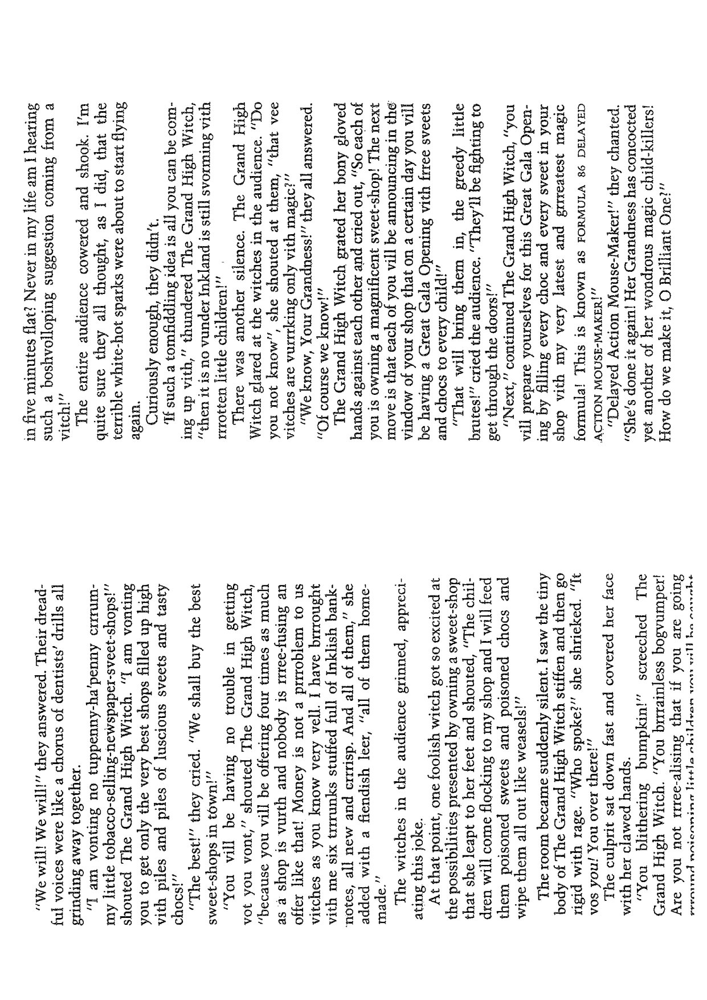

Los oe te es » Ly an
go SP g92 883 ¥ Beast g Hf fe288 YEE
Fel ee Sar ERS =| eo = Pans Ben
. os ev 8 geoe gq os ae ¢
Sf 4ge ofP Tsk B BSSEhSE “EF LOLs 88s
ow SE Cgeh 2S 2 esheets 8 Baie 8 oes
wet BG q sgt 8 84H Q REO B o =
4 18 £9 Yu.5 ee eq tal gv sg pO
£5 Gy So Gee am EF Bese OD SORE Pe Yas
Sg as = § BESS Cees aD 38 <4 8g:
gus B78 3 HESS SS a? FSS
eS Bre au geen gesgog me DE. k se Pees
Bo 8-G Ras eibS gofast ge PSeae ieee
= 5 —~ a's 4 eel  o8ak Se Has 5 HESS
>S web eke Gogh ~wBRa5 3 og’ 2 be
§ BIg eGR  Tsekr BEeS8e (8 wesy 5 LES
ES $50 $252 $a uvie BS28e8 gr FSl8* BESS
$8 £82 S382 Ge258 Sggge2 2, Gab, 2 Fess
5 8 8 “ager a see 5 633 2055
3 s ao Ta 6 bo 6? 2O8,7 eofot gq &
So on Qa m: 89 Soe Spon sk wea a= BS 5S
2% g Se MRED SSSR. RSE SEsESe: Sols Ft. FSS
2» G3 “Bote RL ESRC SE epee Set slhsn go
S$ §22 @s8 3p Pele POSS SL 005 wos Boe 3 aFR
pe Sa gees eces elt Torse PSSSGpeEL ALE LS
ee awqis 2 Poses eaey s Shae Pa Geng o 3 |
: Oo F oO a Oa 0a
Sa Bek sGese sy ES kee cee sSsBRVeEss  aseheg
Paral & OS ee oO Se By o Sa 5 VSS, yy To My
BE gte SSiicoezgys es tyes. Sl cages hws Bate eg
. 5 sae © ¢ Satan Se eo Ow, mPuUe ho
6 Bet Gee eet eheey see gon, his Fs geese
g BES 2eF 85" eg gek Ss CPS LO PESES WSR SS FR
Be a8 S07 ee ote FM GOME DR, SRaes SP ans yeas eS
~ . : On : w >. xO °
PLeeee esse geile secevsasesez kes aac ks
ot Ss Sau 25 OS os SEUAg Mere RES
HGkR ee SOF eg Ck RB BST SRE SE BOS 2S wo Se 5
a 2 O 4 how QO wo
BEE BSP BFE EGE OU SSES LE ES ERE SO SRL
aos Q Vy we
Lo eae 2 i
: 7 > ‘ A : a Bot & Sos g fa ge
Sa g4285 g Fegasgage 9 SEER" ER g Feet
ba gees 2 gkepetko 8 & bos, 248 bys
wR ii Sm x & = “po & OO c's Me D Do ¢
g 56 ba) mo 2 Bo Big & S Ron RS g's q
By O8F SE aZ8ES See RS Pen y Bess
g 2 s oo.208 ; BY ed 5 B DVOrL
&y #FBG32 5 SS¢hS0982 B ge el 288 § B25
2 gees SB ypteeskeus € Sess TEo & 528!
Be BE5G8 3 SgeEESGSs § SESSE BEE 8 PELY
eo qt i as § BEy Am OS SHOR S Ba ~~ : BU
Q a sy! tal o Gems 7 = L.'s
2G EeGe, @ S825 2as3 3 geeks bas & BER)
ao ae oe o “age a gt ae =] bes) $4 » Qeort
Go HSE2S EB guwseeaa Ey Peabo S des 3 Bat
cl i= RO F Sees?’ pte = ge Rees SSA. 8 2B ony
oo ‘fy S$ ae Oo. tas ° = Bn of
a5 Bee SZ + FR ECL peas F Spies e_ei Feet
2a & So's p= Bp woe vs Qe 3 S28 ww BODO FT 4 BP 2
Cuter Ss EL ESC ESL Fag g BSL Es2 SES ese S St
loa . a} ee) or vo Pens
Beefs geg ,FS82553403 S PEEBEE EES Scares:
e as 8 oe Fl . OMoe a Sa -S BQH EE
SH Saks BS  @pe¢288e5 F nae) Ski RSVR ES
op 288g apo Sees SSa 58 SS gesE85285 86 oe See of
Sees Taey : Ss ear sb be0 BZREBESE RE SE eo Sbseass
= SSS8258 Zen kseushn 2. SQRRIE Re Soar Sos wae
pa POR we ood 23.8 ‘Ree B™ 5 on ea oy
% as n ro > Do : . ot oo - 5 mo
Foose OS. oo 22822 ete. GESZZE RE CSF Soe St
PESSSLOAG SL SORE F CE yoy Bwc a? tee SeohS ape:
Oa mes nS a Rg oO “ wae BU he ksS Soe
SSu_=5 Oe Re Woe eS es euakh eae oh 8S oO MSM aS REE
e Sr Uesgor er .d oo oO G ‘st os :
Foy AE Of Bees S 6g Has F Ott
BR ESSER &£ SP eSSERee & SScse

---

<!-- page 47 -->

<!-- scanned page embedded below -->

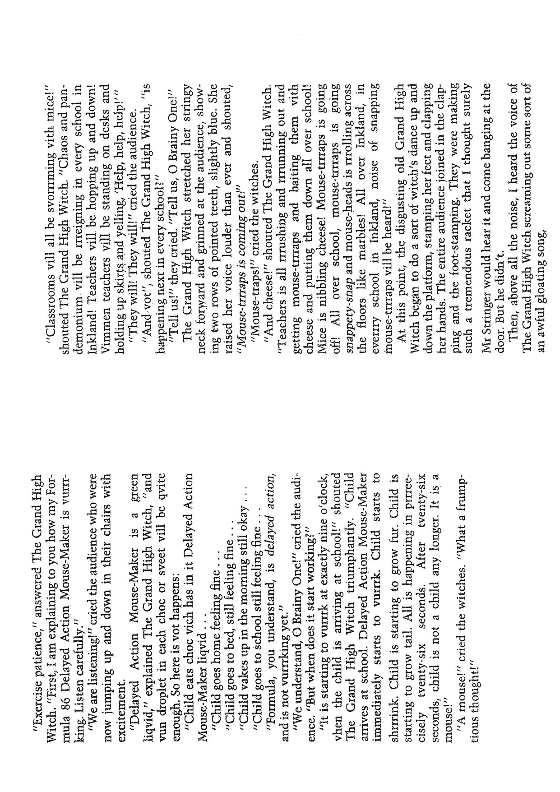

2 ‘Ss
wh Pb @
5 SESE EPSS2 SEPeRs 2 gs
 Beae gebeegete 3 eoe2 ® 38
SSSEE: 8 3 B28 By SSS50e giSeee = 8s
Shaw ze O stag 2 Feed y wos o S850 08 8 of
eo SS ob ad Oa" 38 Bey 8 Bo & Regses g a5
ages ebete Beebe Sel Cesuree So:
SS ee3 26 Bod > ra” 6s26 o8.3 5 56
BS pe Lees SUee EERGHEES» S2eeer 8 Se
a5 @6.0 97 ROSS. gReRaSSES 3 Gy eo a
we oS ~ ot S820 8s Es BP O'S PH @ohe 8 “Eg
$0 2 wae Og Fae SOR8g350°8 fe 2 Gog >
gr oO peean. PE2°S_ 86 22 ade pe yo os
3 goo mu SB FOR SM gy Ss a5 ss BOR ob DO
Pera ky 38
qo ee oa ee io] DH Ge DOS fa] ao x
Se wos BOSD S845 y we ey los S2kg S ood
BE goo PoC seat Bs Spe tho Ze Qeorks ks x eo e
Se -o At ae Zou y PSR. egersaae 508% § 26
steer della hh ae
ER Psy oertaes BEES oS S ee S885 Sag
Brass tey ov beSSseaes eye sa@ sg See Bet a8
x ae
Thess SB He eQsig Bs a3 ate &u Sz ots
SHE REDS Ob A BS B be Car eolums Rit s
~~ SOB g Obey B2ehagee & S58 2S eee Tears
feeNe GH oce ie
Heda & ~SSua eS S88 08 moh Gs oo 6., & SS Sex
ESP Sega SS ees Hoo St CBSE eo Pogo H SePqghs
pepe l Zee Sy see ee ltbet yo Seneees ga g5E
f 3) ea Ow Eo es 5 =
os “PF owes ekg sy gy S288 pgs 3 wee
eREges Pesg Cte eos RS akg 2S no. sn 2
ia — ¢ D> od i) Sag Pe g Bangs Oo ia Ge
BD 8 oo Od RS Sa sey 4 Q Qo ex yg is} ie
Hoag do oo oO SS segs Ss bes S8e82 8
SOR g Bos RE e2SSS Sess. § 3. BUABS
CZ gS RSS Er Ex Ces FESSSESSE
© 25426 a Rea eS
Bones
. BS f2omK7 2
« go gEee° fabs E
Y og a a
S55 82 G82 8 : 8 8 SBUSERESL 3
ond 2
Bee SE BSE. 3 e:8 g $4 g20g8e 's
= pe eae ae Soin 9: a8 He & 8
Bae. 28 soe og :ee8 Bi. fasten 8 g
BA =o 2, 1oao BR BwREC ESS ees
585 93 age & 2gG5 BEEES 6 28S, &
OEee 8 : g so a8 2 2Poae Cade ~.
Bow . oO Seed ° 7)
od a sS3 0 16 ral GEHOOa Bo han & a
B82 22 B83 4 Fog" Eo ceee Bes é
S , § a :
gee @2 Ze Qe Pca Byers Sage :
oma oo eO oe Go Sous Ges y 3 2. 83
Sao » oS o5a ei gis s Aa Oo 4g ey
Oo oD 2S oa Bs. OM ORS ZO ss
g aa Beka gm eee gee Z8o uso
ae 3é g0 2 ee ‘BbSge sec eeege 848 - ia
B88 ¢8 $54 BOL ESSE ho aes fg 38 F
S86. 5 SES oy aS G08 22828 F
5 BE Sg ebg Sboug. eaoee tack alas 5.
SSS25,8 6 SasbcSésees ic8as 2.3. 25;
Baye es specs’ go Rp sear es 2 Bis pe
2 so o's 8 Boek 58928 oe ae 23 8
oe =f a Oo. og UO 3 go
BN RES SEE 25 2 aoges So ELE Cc e
ou § S op Becey ses og Sy ees ,r ob. 8
Vie gee 38S
pegeeel eS eowesesses'22 ee ee
“ye Q > Sd oA ASe Se aye =O 3
a g
5 As BY EYL OT EGE Sg £6 Seo508 e
Ogg ak sgl Es eo g00% & § SeRE
7S 28* 62° & a
BER 85 3

---

<!-- page 48 -->

<!-- scanned page embedded below -->

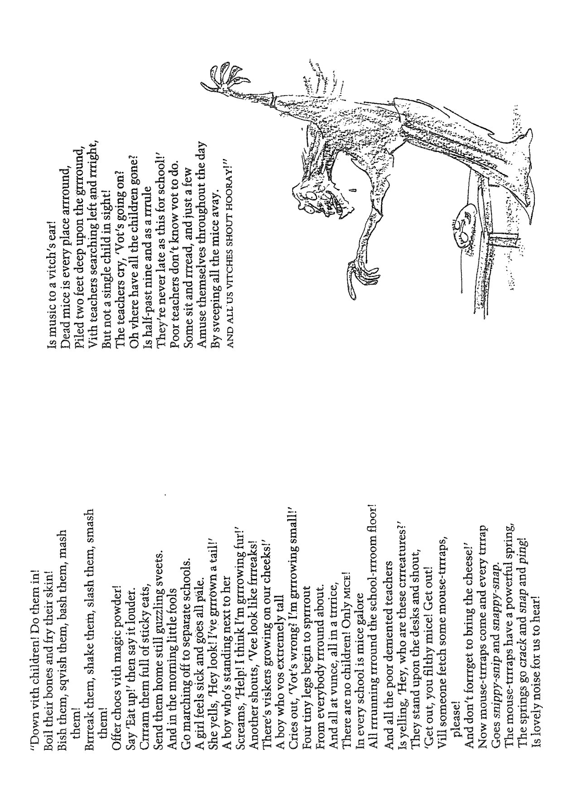

Aan ‘a
if ,
© ge By
ER “PEN:
s AEs al fl
Zs goede ~
ro 5 = nw “ Se ce 3
gE 3 OF 5 eS
os Spee eo igs Sian
3 && 8g : Dp eeeerrese get Bees
2RE. © % 23 Ee] q, ve, ere age Sane tenes z
a3 Zu pss 398 BI Lay ee red ee Paetieen om
p2eeeS gets 3 ye Mates eens eB
338 g2ss 5 wt Bs i nee Sie, &
Bama Qa AG BZ 8e8 HPS es rasta Z
Qo ws = Bee Ee gi Sige a oo)
Bae259%3 a 3 5 € She on ete - «|
x geec ae bE ees fers ae i ma
geesge2e See38 a Gf ee
S5Sas, gu gt SHa2 “ ‘ te ti pees as
ee o33 SE Seg gE i ee
> ov Gas 225 a a Al Lees
ogee S825 ge er VN SES
ee par
sEeGEERE EERE & j oy: as
qebebares BaP /3 oN
=I pEeREESEEY: iE : fe
THe E ie ‘FN ay
era ZN f | eee
Se eHiE se i | REE
EEES spel bs oO 4 = eres
Esl se ege eee eo
Babess ere Bi f
ESAZRS as 3
as BF 2
= .
Ei
wal
E a
—. £ | . ca _
aa a > a pa i] ra
FES 4 g4 3 Bay 3 g
go 5 ot Q 4 s spr a of
eee ae g 4
sag 3 Hn 8 8S se Pa
88 4 yyebetgete & 3 go . a
ose € zeseess Bees $§ Ey & a
And | SESER LEE now g - isi a5 & =H &
Ope s saree wove Bess s Ho Ee
aa eg Ss seg <a bbe OF sues ESEguS a ac
fee 4 ee ee brane
wed a gb ea8 FEE BigHi hy BShez
aes s gq BSS SS= oS pert HE Seas Ss
a2 3 ogy feus ees” Boo 3 3 oe ae
84% cy) SSG POEs SE: oe apn wt aon Ge an 6
eae g pee 2aage
5 As 238 —
fue _ 4 Tees ee eess
38.2 SSE ESee Ea? 5 BER SES 52 sa Bee ag
ibuaedees: seradeceieis 38 8 REGS &
= “ESSE oats Sb Bags
Lid a eee cre
iy Bo e ot . ee an) ~B=a 0 aD
ae Pl agi gee 88 5
= nuda ae BEE eos
Hint iady BE LESS
ae eae
S258 Be ER saislvaiiias
Ow geo 5 ve 2548 S35 5
mm fa oe g8 q esl
JeSBepsaae a be 2
gibietasiale
ahs B688 2
Bo 3223
RE 2

---

<!-- page 49 -->

<!-- scanned page embedded below -->

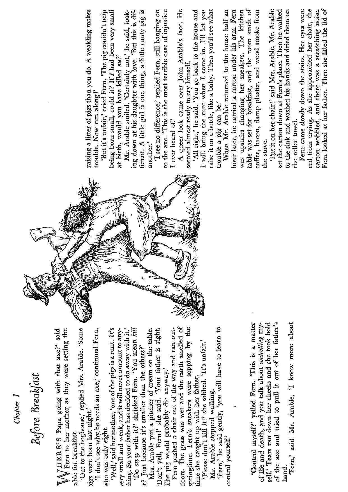

8 BS 2
$4 497 < o yse
g§ 24 492 88 2 232 28555 2E5 B49
g 28 2228 FEB 5g get cbae.s B25 bags
be &E 248 22 &§ 238 a.2c 7 a3 § 2.83
& 28 ‘she 8a & g-3 Sg462 32 gH ED
m 3 ae eo | of. 4S 1 & 92'S wo &
on SE oo SH#a Sele 82 aa PS
§ S& 88 =o 3 oS OB eek Sty oo.g
2h #82 B33 2 $23 22° 8 “ge syss
< aries 2S ‘a om 83 LSS mead
2s fe 4 ok ; &
5 giles 2 fuské 25e28 ESE eee
gpm . ge oO 8 ofa ayo 8 “a
Ra Be fy 88cm e558 “oe aah
3 a eb Eg 5 5 3 = 9 ao 8a
re) gages ws SB BHC ae ees 484 %8a8
a Ba. Sea SL THE, 8 yeegs ois oes
geceekes BS Sos 8s Beek Soh Shoe
Pye EP ES Be Fs ode e827¢2 988 eee.
acekeages $s como. BS wae a8 fees
2 B8se2% Ss $2 Be eee eee Lay gages
a--,Se5E 3-8 g Us S2eohla OS
tue yea Pe Te oa SUae gy Big gen pases
6 Ee Bo OB ae 2 cy a AE a g
& Sse fee Beuytogesesgss SEs gi ay
ppcigste GASg;s2ec<oceo Eeeie iy:
= . = - . 5 oO
Bea gigts oy & Sv ws BEES 8 2ebecess
we 8 peg . £8 Shane Qs ag 2 § SSSR Ree
Mrmer-r-| Say, Fee Se wE Ss B8a8ySh4 Boo%
PoSiel ECE eds eggecass i) i sige):t
ame ~8 Bre
Pea pagsisadbcbeg pees 2 ece22 252 Fs
BSE $2 8&8 oe 8” 2.2 Buse Eset oes
AL eg Se B 2938 ge oh Se mae E
SE £Fs8s B8e5 28s
Wy
WS \ x
es) a RE - f
PZ a a = fo os b,
RS OEY : \ 3, Ee” Sr
ess b} aN a Se
ie abl \ ie iS
vena 4 i R= es
BA, 5)
OS FEE ESE ay
G ZES SRS... ey
Ef Zar Wy, He) ) :
= ~ RE if Z
. ad = Se. — i
NORV eg Oe
AS Baas SSS, x
BNA ES PGS.
RO WH) hg Sc
Y WS el Gs
NO LGR
Ly Dies ,
gO eo = nm bom
3 ge ¢ Rog oe ‘
g2 £ ¢ Sexe £2 388 2 Bie¢ 3
Ow A wm 3 Ss Br Oy shes 2
ae * eosg, S'5 by - ist €
3-2 . om §2 3 Sa ele ue & Ewug ‘3
» 6 28 Es Ue en ao mR 4 Ss 6k
£2 £ 2 FEeEgS, she & 5 o2S, 8
. 8 8 S28 5809 gah € fo zens 8
ae 223588 e.8 5s = BZRon
5 <« &8 Bee 0508 das Sa E
+ 4 & 8 om as a » Saw
BS +? ¢ Sf Bs ot veS aad s x & Bene 2
S gn 8 Bes ee. EEF EE & BBEs 4
Sp 2 ¢ Z3ck bet tzeis = “BSe &
~~ G 2m & Heusen Beegee 5 ge 2
~ "S wg £ ¢ S8eqe°- g2= $a2 oF fees om
Ss & 8 GB oo 2 eee Lee ss n O.8 2 eas
gS SO ke Re 62845 8-5 a20 70 9 oD S
§ mS 23 Se8es ages les ear ue? &
= S ye8 gy CER Se DESH SEE Bes 4
S 2 22 B25 PEPE T Part pets Bees &
oom BE 2F2tanye 73225 2 bE tay *
9 Bene eee egeses trae ES AS e-R yw
eQ nee OSE ™ Bog a aor Bo sae
oe & g2aa 9 88 ayhot® Smo sgt |
gene hoes SEES Ey Eee 8 272 oo
4 VeSRRR Es ata BO Re bee 2B Fesg
Magee e sss sa ao 28208 gEhSs 'g
& S26 ga tag ig eee she a3 ate 2 §
moes2 heen des BDGt ee e° ea 8 SEE
SLB Ree ek Sy thw Be gd Bsa vs
gos SSG eR ee he Be bu SE Bore. §
at ar ge pPAms Be Se eases 58-.eue
qos 82% Ege SEEM aE Raw gh
Sf 4 AR obs 8 SSSS

---

<!-- page 50 -->

<!-- scanned page embedded below -->

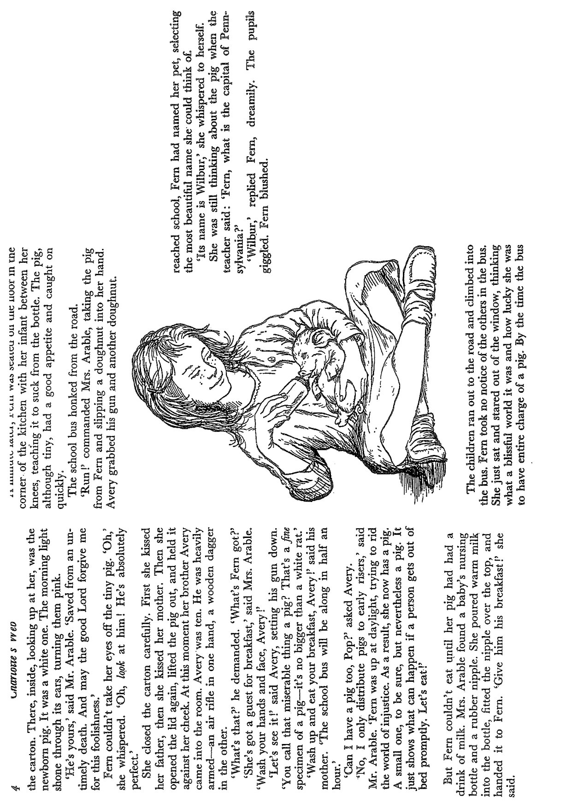

en 9
é 2
i=
2 gig &
g Ogee o
&
oO een
gente B
ou 2 wd
as
see a a
Q & Oo GO *
eRe, E
Beaea 8
=]
e533 °
ay :
a2 oe. ¢
a2
Zotws §
go, oS fa
ceyae My
§ 823 ¢ 34
ag855 23
wa 2
Saag... &
eae m oe
4 rer =~ f4egs
gee sda j nodes
bt - . cay
Sa egesse <x Bees
25 A By s2°° 83 2 Wy , Be ee
segs ae 23 ~ s Wass Eases
x en. rA Wiss O25 Eo
Baod 2+, \ WAN gSa
cal bo ue ™ ‘ y
ggee See \ vS Beeee
2658 ,fe8 oa NY c~h Beers
< g RS NANT 4
FLEE See (PE y Ff OIC AW pacar ey
eS = oe if PRS) fe = WY AS ft eos ee
8" o eos yg Lage Wy fy i go
3s8e08 Sa838 SHAS EY, at. PON Ce B8sks
geek S8ee (( waa y \ 235 Fe
B At , \ EES Dh \\ h
sEee 8< 23 A Ae SONU a) fp er
ggey SAU NWA ‘Dp SL) su) Vy i f\ ese e
Pak zeck WA “ laa RG fa EES
FSO bp Y tw SSNS 7/5 Sy AN, BRS Rog
7,57 goes Nl SESS FO g2 Ese
e794 So 2h. Eb S27 GB Meh \ Za 3 sae
ig, 2368 Wee Sy a sG.38
7328 game | 7 SS SerEELAc ie
ae = | Aaa} i
gw SE gay SA ‘eSivac) 48a
‘gif 382 {Yo Ws TN dbs e
oa oo xy <y He
2° 6:5 = Era AS : Hey Boe eg
2682 8288 SS EN al Sat 2
iggeesa=e SSS
Seow
2egeger eb
oD Qh >
TEgEERe E
“5a dat zt es weg wo
Bae & b 3g g8e22 FFSSE cveee
‘> BREESE Ag gas uw 2 2 3 OB gg ns.
ea e282 We ZS—y 8S bs 5 a 4 Boa me See ee
ar ae SE 273258 ge telee gpPeeg LEaSs
2 eo YB gace Sues 2 80 SOS ot
Sn 8S woh ef Gets ES eae gi bs B SPF ed
PE gb 2 Sh Ea ss Ss "ears a," 588 pe gee
GEuss a BROS 2 Bug es Geos sé Bao,
fggee Fs Ese ,ee Rx wisi BEBSEE B45 8.58
2 BG EB fan} ms oO gm GAs BRS on po bs oe
Segoe 4 Eeatgs = fans] $28 Sees a eee
Ze yt + 8 be 5p * pbSap ae ~ SS au Ba ae
ae 8 R Sg SARo8. HSEsgeg & 20D Be Ou 8
BR ogg af a, eerd eZ 8 weg Be yn ge eS
8 wy ~e O'S Se2288 ogc via Ee SAS EE sedge,
> Ps 3 6 © ame} Bae peste a = Baek
RB3ssweh © aus SS Ses og Bit 22 he eS
2 268 Ps Se Suu ese gage 242 «28 gy8 £25 5
Sea eu 8 3B ee SEs yu 8 6 8 8s fess 38
2 SRES§ & Bend § pee eRe ee g ga2 ea?
gge<= ox ggegse Sapo ee es wees ees Snake
$ c§s 25 ty 5 fiaal S39], es B2ebO 8% Beoe
Roo* . r sedges eS g.2 18 mee we Bs8eas
Szadsé GS S8sage “8g 58 wig sO 5 B's 2 3 se
acu ~.4 “G23e 38g! oY Se es SBS
5 “8 em oy ds » ad BE & bee. F EI o bE Ig see Say Zo
_ a > > Seq hao bs
geese ge sess Ba BR ga € y S8 es ere ga S38
Bee oa ga”. S2ege04 8 Seah 8Su g Flue
oa. ac Sg Sey 98 a6 Sues & a
ES! e2952 3 Soe Bee7 . SU BEs és SLES
Mp peaess PSE 0 koe HB gaa. 2632 o eas
aoe BO BR StE89 Sys aa 228 Soa ate Ly gre
SERS SSE S g | os. Bless. 8 Eames aye eg
¢ BAG e og Sygin Sues A ggo2 Ff bo abe oad
Hanh Be E3289
So ee Fe & BY y EEE < = ao 8
gesP Esa? ghee Ge °:
: |
wo ag ae

---

<!-- page 51 -->

<!-- scanned page embedded below -->

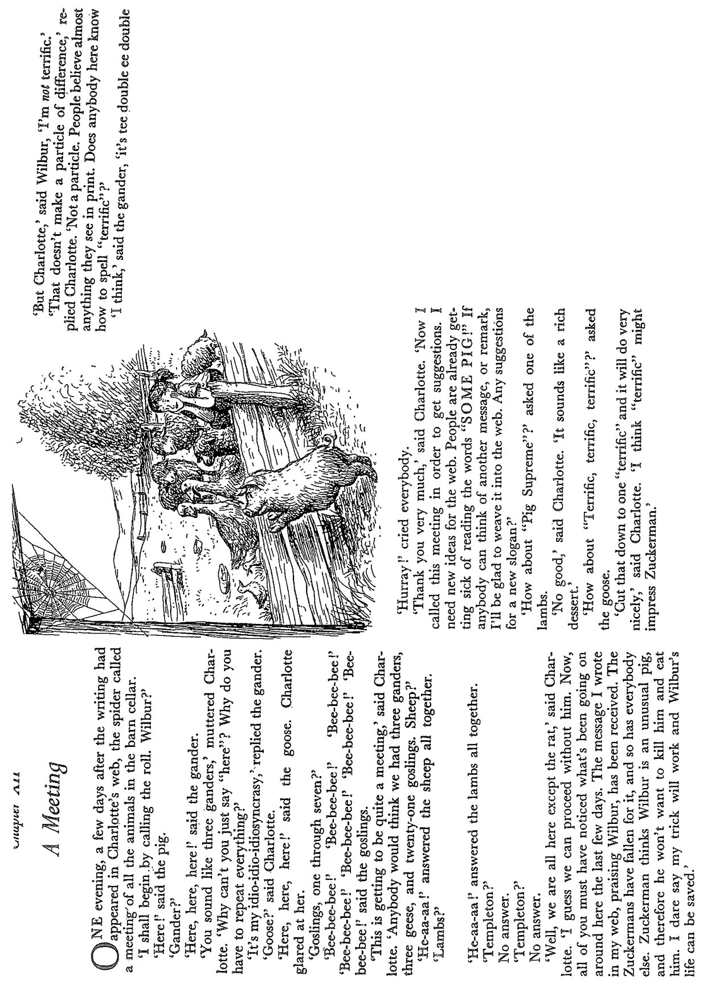

Lo
oe E ®
=e OO 3
7.88 #2
goad ie}
ee rt) ued
EEE s a
oO sy
ogc o
StS > &
3.0 8 es
g 28 3
he is}
geSae ©
Ey QO8 2
Bees 8
weg 2
BELO 2B
Leis a
geo eg
a S vu
2.3
wo SES
mS RA, Ss
Sas.ago
- ay
s Z2oES
eo gEgs
a as
6g8 rm
2ezpLs
$2237
aoe es on.
GS LA wad
286.8 of
zég2 22
BE ob Ro
a2
ag Meas pe »
a 4
os KN N Bg bos a6 sg z Pe
fs 7 2, 33
* — ais FF \ Shae Sanka 3 2p
neo 8 oll Be We Fsgors 3 os 8 OE
EPA SS Rs tae. ASS ts 8 goa. Y 2 2 a 3,
AG EAS SN . gBe yo? © 2 oF gk
RGSS i NA Beane 2 gE 5
a) ES NSS Be as ANN ce 5 & 2085 8 5 8 us
SSS Sey ea \ eta (aj 1% an og 8 ge
TS Sy, See S@ag)\'\\ \\ es (l og ot & a > &
RECS NS Se \t RESPEC ba mas ga . F 24
BREEN ese VN \ 7 ee eee & & “y's
Sew al es A. i Sone ' 2B ye gs » “ cf Goa
te eet 5 eee EN SES Ses 6 g gE 3
NBC cesar 2. Sere Beeetee & SF = oa
Hite toe: See AAS ne Te: a2 35 £"
q Hy s ree SREESS se 2 £ € 8g
Jo. Eee Ke 2 pe Bay g a EF 8#
if Bye. ORR ae \ SEN aees ese wo G 8 3s-
SS \7 ere Ne PRHSSESLE wo F sae
WEES RS NAVs a gecesue 3 + gse
REFESR. Pee WHS) ge SE ea. 8 , ZOE
ers SON SR” cave WW tS Ee g2o a. 2 5
AS | INR Ghee WAG Fa8 COR x 8 tz
>: aN eee MNS PeSieske 8.0 923s
Nara WM eae & INS 22% B2ShRE Pug st
| ee eee fre HES Dh Ov 22 S408 5 85
SS Mes sees opis ge ogee
——————— mt wot 8S
eoiee] —=—— Sah se § Ss go" ee g 2
eo ’ as S bo S ‘BE
a4 BB xu yg . s 'dB
2. _
wes 2825 42 38 Loeee
2 4 *
Best “8 £8 8 ¢. Av. BES SAB S54
Ego 8 ep 26 Sy ghee Barer eras
ar gs 3” 38 gers 4 zeeneesae
gede sF 9 ¢g ga "842 8 Seo S82 8s
£4 ges Bg #8 BE%_ & fag betes
yond ge BR & S #7 43 2 cei Se 58 8
+ PP age gps 4 yee F qgaghai=8
2 8 3Fa age 2 2 258 S88a & Penh So kke
and Peae:| ge =O a oR 888 PA BRR odo” We
~ ae ge Bae a a 2 ooo Q SS a g004 is]
g S cfey SER. 8 = 88% cea eee gay fe
3
- = res Ze gma Ss 88¢ 2428 6 SB ES Bek
5 Ges, eg2285- BeEg28os 8 goy eee 2?
on . 22s m8 e.. 59 mn:
~S sGe 58 St See ee BSso208E Fs Meter tLaa:
oH og go Rbeas 5° eres £ Bess gauge
gan gs B82 BSC8 s Beis te 8 ge sas?
94-5 Ce Oe ar-e a sesh £2
BESeE, eEsEseey Fs geiug & By ea PSSrE
BeOS ga. gg Sshhxyo St ees & Sa. 4 oF eee ak care
go Pas. 5 Spee, Aa gg 88 88 a wees -82386 ce
BREESE SIE CER ees oa” 28 8 3. gg 88086 5. oe
Q Hoe Oo eee BAe & 30 I we Bw S
SEE LTR LETT DEE: ee AEE
peeSee yeide tSS348 yea Sea adr 255 beens
@ B38 OR EOR 83h gs ebe ee otos (OBR ENS a
‘aD BS 34 Doses e SORES y 23
Saf SEU Ew
Saaand sss

---

<!-- page 52 -->

<!-- scanned page embedded below -->

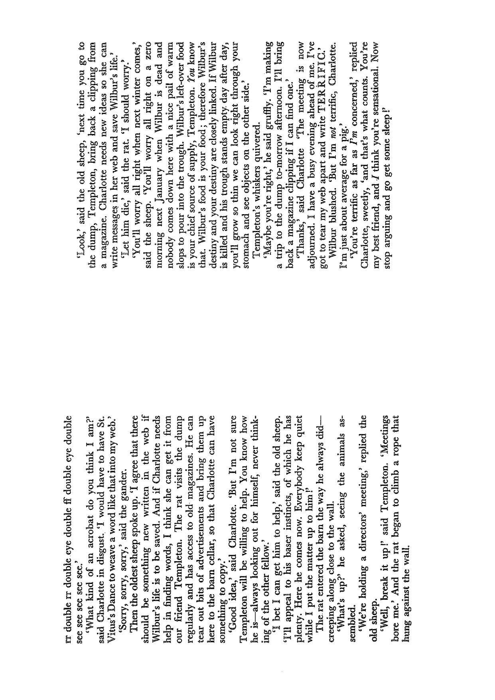

5 Bee
be Be. og Bee
woo $..8 z
GREESetese Pz Beye 38
asf: peagéiget% 95 aie eg Bm
Bg ow. E S5RBS ga fa age 3 | g
gS Eos Fe 8322’ En. ap G geB§
g¥ee be aises aS es. Eg Pee eggs
Boh SHES on § megeece.. 8
E93 § 88 So csuras mg beck s AE
go ghe but As geE sey gizlire bei.
Fea) was :
ES Brey USbEae sy e “E 8
gived ingests eee aéceeet fd
Papas 138 Sopra Series i
Bey s Sau oa f- t 2 y
286 Sm a g28g5g25 Pee
Fag Se.8 s8 ESE SES ake aiue
a Gs 8 Sea Re = Po] pags gks £48
piiggeds yes toases ue ii beda
SRO e2F Fe gees egeuenee ies 22%
ier
sg Ba i ‘BG vp a : *
et icin as
E 3 : 8 =i oO on
Ae ae G £8 pe eee bas Seok 8g
gia 24 S25Syn8y SEaES FES
SiS cy Re BS oy OR B SBE ES wo
Sai cheltea el ga 8» Ho go @ mag oS 2 8 w
Ogeibe a > Beoe gm 8 ne Ss
3 Oo eos bess etul es BP y 5 gas Ae
eR be aOR SESSERESE So dye n te ge
Piece eet kegs ay iaiess:
EEE Seeviicdasésege gosceas
SS MRL BEE Ban Sage es :
Pye grihy £8 eb gga 5 Es Sgr BaF at a8
a: BSE SS 2 3.8 RB
Sak Shad
, £ BE
0 n
Pee d@es | 2 3 BE
gy UPL ig bean
aD igliiila stb le a 42 ie
Q ‘oO aI & 3 e 3
o gat se ee 2 i o3
3 “aS ge? ek Hes 285 Sef f EG FE
= - . g 4 2
ro) = Seseegue ge 8 eo. @ ~, gs.
& Hes Br eagdee fee a3e 333 i
= Set gbsd genes eS ssa. ~~ 8 Bs
2B gages 08 ans “lake g33.5 ,i#
s Eleites2 fag eal agbaele 2 Fs
3 "Eee. 2tes p22 3 S8fa9 | 2
x a2 faa ¢ ; BEE, fs
te SBHo FEES S28 $55 Gee g rl
3 Om zm fo} S25 agp ese § Zs
: ne ;28 05° < ead is) 25
2 325 errr Bey ctbotsy § 3a
2 er 3a28 go? g.28. Ba iotot = os
8 pea e eee 2 ge Geevaebegted a
3s Bga bw Sed BER Ewes eases ie
ES eee pevedsyss gr egeaes g2 2 5
5 EI oa 3B Bsa, 8 a5 8 28
g., 88 § See se SLRS R6e 8 oo. ¢ vt
ov USS e8 9 Shae ae oT & 2 5 ak 3 aye
Ree Fans BSu o. ae Bgiwk =
oss & SSE S-.F ge geug 2 2's 2 223
geese gba PESOS G3 ed 228s 6 BS,
EEESE ES ese gas FF Se gekete fetoe
eae E82 22 gidgicey stat eius dees
m BS oS Shp. ERSGS pe WE Psy goes
2 3.84 st Bade ses ea lle eay seeks 3°
gge0g Fez Pees: on BRE TET OT RE
2c iseize. tgp is eto Eas 2 go’ BS
2 ° aS 3 S$ Bae §&
Teepe BE 829885
a 8 aS BS262

---

<!-- page 53 -->

<!-- scanned page embedded below -->

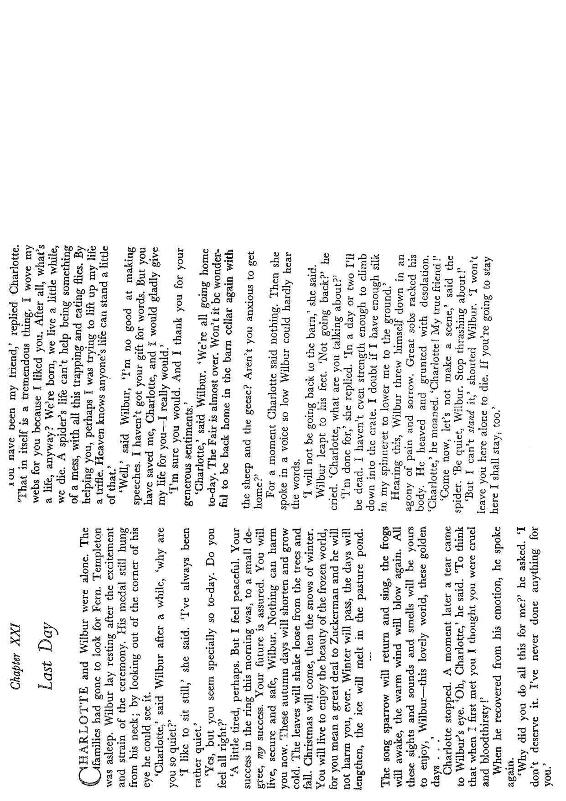

sree
ey
s eeeeee
£983 g 2 782 8
ae 3g 25 a 5 8s
geoiidis dae 5 268 B 2
Ss Be
On8g 2 pei as & BE2 9 28 g =
3 ed bo- g e238 & ° . =.
Bods Fess tg 2 weg § go FE Beg ef¢:
aos eB So 8 375 5 228 3 e dora. ou 8428 24
og 2 2s goog * Bas 2 BD BRS 2°85 Sys a
2 32 a8 we 378 me 8 q yyiletzadalls
2 8eS oe m5 § 4 328 a ws yiseeyuic:
2.2 £8 we S oe g aa & g ° S52 SEiEle*s 2
g0U a> =. 2 e 8 Bape > ® Bs SBS 8am y
. Son's mm RS a! vo © 2 pa Py Ee Bekus at
Ege Es B58 Sos SEq 3 82 Pewee y be 5. bo
eS sas rot 2g Pegs = & ES £83 gizaee basi t22 6
~ gabe S252 ea ot perpbedge ise:
ess gos “Boke PES g may 238 PPeeEt eres.
BD ee ete ggF< wee & $8 56 gr ces anes k
sages 2 re 8 gos < gs 9” pe Sc ek Sye ie
Oo See $seas 2B we 2 is] an g gag 3
$8205 ESnss ae? . 25 ase) BLS fu 2
B:" mm SB 2g 2°85 % 3 ad BeBe Bo 2
2 yee BSE Sey F8 e o 3 4eo8d g2 2o8a8
flee kg Bcd-fezak 7 2, BfSs8 Ep estes
eg Pee oe 8. | fu. 8 & £7 Eepley' feof 238
ghee regs weehee sy 2 US sup cdeiabagldes
oe] rc} 6 So. “S 4 a) a ERS Ee EES
oie ao ot foe ar = Ss peeal aes Pedy:
peta levee tga Z gg berpectiyills
oe & sBas Baek a 6 B58 5 3 Ro o4 ge§
BS 3 SEES ge fey a FS gst gBefa re
go eg? [88 bere 5 a gtag gbfsse x ao
Sita S See Ss Bo @ Setesbes Se228 8225 a
° a3 2 gog* on ges 208 © uy Fo “ses
aid & oY ft moo Ba bOue eee Seog ge
& 33 Be See Fs Su bead g os an
mm ee fyi Beuzlieles 3 3
See wy Sa Re getsEirssé ™ 5g
esses o oa c © SEskeszeon
Bez iad g 3 9 gg Peots bet
mh ae s 8 @ bono Bs. PS Osa
seine & a > BSHEEZ ES SEG" gs
5's S Bs] > FRSEESESS S 22
Sig 5 Ss & 2 x SgS23E8 ao a
faehee ~ £4 Te a 2gbe Ba ea
S288 § ase eee 8 £< 33 sa3 2
eeagcg & : gif glass “23 825 § ae
_ B5-22 2 eg S 85% soSRECE gees bas & 3.
= a Lee ad 2 g sSeyieee ida So 9 go 8 3 wp
gS gags f & 2 see3e ghaea 9.35 geo 2 33
< Q 832 ss 8 geieedtSeds 2,25 «se 8 ss
oe Bese & 3 2 Pig24 25558 weak eee 8 38
= 2 zolte he & .s ers eee ges Sox 5 f
8 8 ZTenge 5 o 8 Bass B_,Rsis mgs see 6 ¢8
SS sess Bog & foe ae® ene 8 Bs
as tsa Ft 2 eee a7 ue £24 2 oR?
fi 8 2 &§ a2 ead 2es, 224s ges a
Bee a 6s ghcecaeege® ce oe &
Bees es ao faa h™ aes 07 a3 g 2
6 see 8? a * at ee Bete Es &£ 28
ie sf Fo = 2 gig 282535 BERS 262 & S
we o Bese 57 2. vegies Sree 527 ~P =
bag kseges a. e ga28 Shes 2 £3 | gid 3 BS
< a ee oyezesece 38 °e 1 89 2 .
Bebe ics 254 ae Suga oud BOE & Oo
SElre tg og one SE 5k8s eo > ove ae 8 3
geet eg ee ee iis R26 Re E8 :
fle als as E8aes gH
gseee so fees g P8283 2 os ore Sa
ga poet at 8 SRS c op oS. . ge ts v
es S &€ oe Pee Sette a &
ee sigeea 2 ee e525 Eee 8 38
SESeegSese e obese 28 2
Sa ESS 2s 3 halos as)
f& 42 te 20 . ae
= BEses | »
c=! sere
Pas] esag So ad
Se a3
i} o
oH

---

<!-- page 54 -->

<!-- scanned page embedded below -->

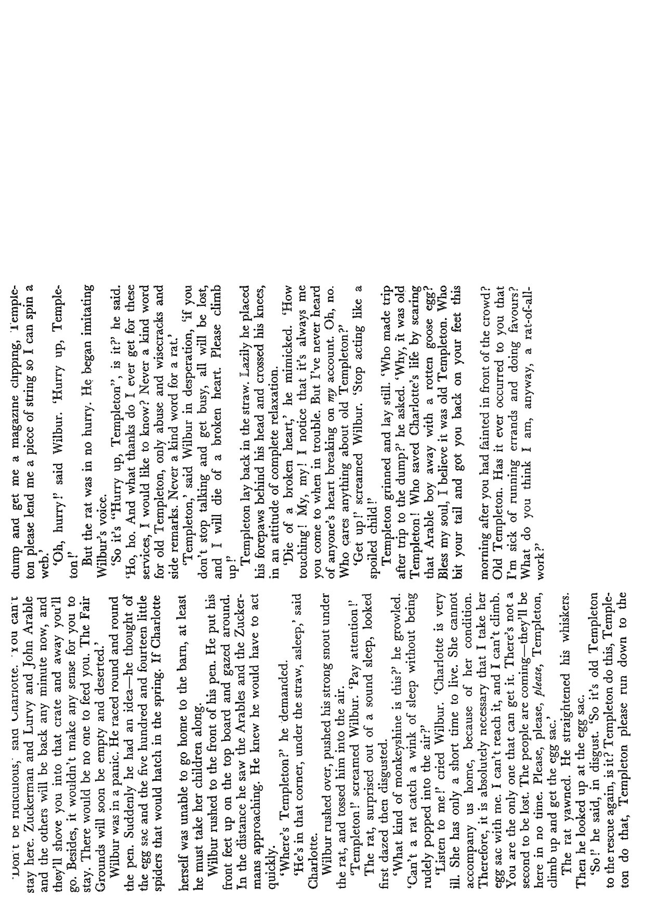

. urd OO OB SBS
. . Bs BYVG 8 eS 6 oc oS a
é% 6 BP gePy 823 88 s8ke 4 Sop pEs sise
2c 6 & 2858 Sea s<2 fe SB ogi Pre £496
PR FS S330 aye 28 feos wm Beegeh F325
sg me £ 28¢¢ [23 23 Seizes supses gr Tk
a= 88. cL 3 BZu 8: & 5
“3a art BLESS ao SSEESS Qe o SBR Ge ew
S$. § § 2ELSESES 2z Eoese* £28eES Fy5°
q~ os gs # : S BS 39a = "Ee SEs
I © 24 Babe | 6 SRP 8 Ba, re Sec fat
ae p & Aggtssde Abeer nse ageing? Save
Sow GF "4. sO SEs 2.8 BoE, Se ane? Bde S% goad
og 2 BLAS 50 ES BERZSAEL BSS « g woos
ef x » Bet ok s Bas egs65 +» BRR SA Bute
an Sk Sgzggkag over,885CRB & ass feag
Rs og & Bee a aed Siohsewse Gestes £Sas
2 2
weg B 5 Fe asvs bs guest sees G2 Be
ag s BRSopde 4 Sees S42 SALES e g
£.2 = Q fg =3 “A g eu 3 2366 ig By
3. e Seg Sat ew ER Toe Sy geeag sf
8 eg & 6 suge pS PE RE s ees
os 3 & 238 ob™ os OOS EG LES STL as 3.85
$2 ‘a 3 £58388 pe PRS e go Bet Sa & Ss
Fe = @ bsggshsy SB ot SR be. VESTS PSE
. . 23 58° . 50S du
SE £ affgeeg ee? EGES* oe eB sousee gasF
oo = al “=
Sy 2 gfe tn ees ad BRS*EEERPES eee. Sb xs
7 yw im EEE 6 Seca A
g f gets. gas O83 2 SSeu PER gs ge 8.
as SEP ese SEP FE gS Shag ey >» & gx
S62 288 eee cen eS aA7 edd sey gy 25853
As, > c 2. £ 8: é
geo S9S° So eo Eee ge 8Seo Gases g6aS 8
B82 8 = BSSB sas . bo Sk S 6 84H
- BB 8 PP FSSESEBS G BAB
g22 2 4943 3% Ge Be S88hesis § a
ESEE22 ECZS | BES & 2 3 33 2 Pegs eee 3 gis
ai 3 Beto 8 eGo ~ 3B 88 fs} 2 OS a & a Be
ge8S5um 348 3552 . Be Fg. §Sruge S BR,
Cara Se Bad 3s &@5O5 & 3 8. bs QBeSr ERB s ess
~ oS o Sa ony g “
Babesti esis G avse Fg bg 83 20 2 béet a oes
We oe ae sts § Bea is BP ee LE Bye ssnh Py y 8.6
ereseseged 8 ghuz ye £62 20 2.2228 B ots
g aUEesSs Pe BUF Ds gh ..a Ss :s OM=ape see Pact
252 2 of oe 8S £ Soe S 5 8 Lor sg
Seee*gselee Sage 23 fog 28 giget’es Be ode
= oO a . = e @ 3 ot . ae
PPeeSCEgege Sages bs 228% 22 AESSR loys ee ES
Pasa so 2 oe i Bree SG ame es °2agqgeaRPss
Ieahk SP aes ks S2daz 8 Bos mB4eGEFPSRFS LARS EOS
BIB © Rgee gles as geo ,BEES SSS eB gbhe
om» = a 8 o As Ga 34 ees PQ pk a > BO
gHoy wg eas S24 8 SAoes ef 2eo5ed 28's eM Be AS Bod ha. §
<4 Caer Sek ag . BR BYLees wos Se ae Pee PSS
SysSEoang E28 eo Be HR RGSS HS ays EE 8 apa 8
“goer eo RSG Soa BEES ze BB. Mee BeaSeHags see Sy x 2B
a) eave" oo oer er 85 g3e0 35 Sg ESSS BStdoacs
Fv o% aw mY oS 38 PROB ° soa OM mS a8 oe
gglegsescs seyees ss Sy eee cee. 2347 aes E ES ES
Stats BEEZ Qlorree 5S gph P RS EROS ees 8s e2gd
BES TBs ea 2Bsz Bbouat. € 4-58 °S 388 y2 88 8: saga.
Ssezegsagctars eet od 8a a6 3 8 BAcs BURBS So
ou 2 Bon Bus aeakogg 3 G8 ekeyl8 Haeue 3s 38
Hee osaese? Eyaeie &E PES eguk Soke ygeee tse eee
» ady z gs ; & mo" 8
BNSegebtage gst Peg pe SESER Sesh ec ks Sef shar ee
~g eee e588 = gts ig2ceeistcesd sei setaes3 is
re yay bo Sse" ee (Sie ea = BB4 5525s we og
825287 28 owe eet oe eure ee 28
Apo Re eE os Bo Sage 3 4 & PE BSR o> bes
g8aG80 S82 22 &

---

<!-- page 55 -->

<!-- scanned page embedded below -->

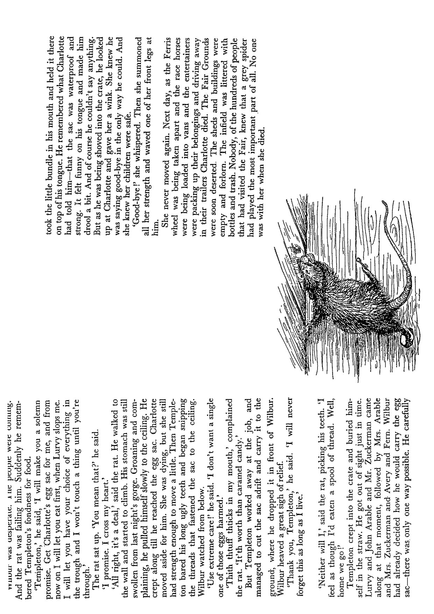

2 SITE yD Y
YP ao] ee
SSgEPese ES Ege regsgee
= at 5 4
SEC ESEt 38 SEES ESE SSS
RSSGeCEG ES fe Sg * 5 SBS
eOLSEYPHE Ee oy & Me SESLZ
$2 Ge Sus BE B88 sO Pose
Beer ae eS 88 Teer gk 2 mi
Sesusthey ot gi SEge eg bs
gear hus Bou oy Smee Sg
a wa OM uy i oa ms 3
proses gt FPSB Labs
* »
geggsgi £5 Syuse greed
S88 eeeahe 28GB 8s a,
Ef Seen essts F Poeye ee
Gg, veBGoaso Zee PPES Ss
ob aged Bs BG bs SGa 8
tao 33 eras a8 Sees ess
ao 8 e855 oD ASS So BRN Ss
soga eS Rrt rhe 4 BeyooRe as
ppt ee Sg et ske see
2. eo 2 we faye 8
ag geo = ae a a
EES Et PeSe 23 Bey say cesis
EPL eus ogee Beg oP egur aes
wife dys Bens ggeSebegpes
3 wats meow 2,8 ee sig
Beet 555 Peas gon we GS bos
— . @ op m a
Seuss ee Pas Sepes Eve pe \xf
5 AO REGS moO Be o fl
Sas ,eeC sees FF RRS * 8 Bes \ AN ‘
we as ®e"SRk 29 Ve 8yy SAE Wat val
Stas e a OG SH Do og FY as iN i
Ce RES Sake” BEM esa 5 EES AN i
Sedgsdede Se? Seb eeezze \WWN
SH2GS5.8 3 AWE t i
eM NY
WeEG A. | a EN
Ne Fete NY S es
eRe ABAD mk
NA 4. eae: CA ioe ‘c,
NWN is Ssaee i  C
COW [hNS ee
AW TRNAS ea zu
\ N PL See
ERT ees Sica:
\ we Eel A nue AS ESE RN
yee inant
. 4 t i age Hh Mal
\ TNUUAG i
+ Me dl
oe FHe8L conte Eee a wen 2 .
PE BsoetS SaeReee Pe 2 8 E28 8 Ma bg OB DOD
£8 gHigee ges oe eae & a= 3B 3 ‘3 e282 8 BS
B38 Sa Bi 285 PEgere a os es & AS eéssa ce
e335 . 3 paint 25 3 G&G & o Se
eg S83 3 ge aegoree, 2 £ eae # 85 Begttss
QD soo “a 3 o .3 sd on s 'f Sa5.°
Bo ae Re S gs Pogtag~ s Sor ° 26 Baegs °
2 ESS my & E28 bo 2 Sebo m £ S253 5
peggedss = eae we BS ~ weve ¢ vo ae gam
BSP2SRCR 5 BUS SRE S ~ Sa.° § Pe weteces
PSEECSe= | SecEPSEEE = soepG.% 9% seSF Ess
RAL SEE. §-.20 3 8 sa? go>e sh? Sm 9B ase
Pind te) St, ; 3 a = ga ial) ASO Sake o8
yp , @te ae SS SG BGR a wo rary 8 = z g
yeoZ meso god bot Sese.u BESE Sen FF BCS S578
Eg. 82.3 S252 S28 25252 5- S28 yeu, be orerr.
: 4 g-. .
Sw oo ge Ps tektatsissdsety 2282 gl soses5y5
geePZorn BEDSE oms ne BO - 5 ° Pa-ne)
CEOs 5 § 8 geBav gs Kees s& Sug S eo fe vk es
pam alee ema e g TP eet Re £2 ae on 3 Pans
SS CRB Re MBC E Sa BES aS ote BS Be BLSEenS
2 g28 247 el eegettrlej22i et 2tts os Bag EES
eres cisidsssitiyebe2se ese 22 BEE E SS
$25 =e 867 e wraegos 2g evr sof = Sz 8-25 5
~B“ho os ao i. O) ee! o Bee a
PE PEOF SS See is wigs ag igen es sa3 BEY gESEE TS
5 2 m. ep 7 Be 3
eee eer Be te ee F242 gS esepe Ne
2 BXc_ Shekn PSecusS Ss eek ¥ Bpkee stoke sa Kb s
Bu DRE moss ashe pes esse tee fees Bas cS
PyBREs ger =.cebsge ver eh yaa Eh & B82 bs be se
. fas _
@5 Gan 85 S2esessse § £2 € bE S fea Gea Guy
° oe Be 833888
$

---

<!-- page 56 -->

LITTLE RED RIDING HOOD AND THE WOLF
As soon as Wolf began to feel
That he would like a decent meal,
He went and knocked on Grandma’s door.

When Grandma opened it, she saw

The sharp white teeth, the horrid grin,

And Wolfie said, ‘“May I come in?”

Poor Grandmamma was terrified,

“He’s going to eat me up!” she cried.

And she was absolutely right.

He ate her up in one big bite.

But Grandmamma was small and tough,

And Wolfie wailed, “That’s not enough!

“I haven’t yet begun to feel

“That I have had a decent meal!”

He ran around the kitchen yelping,

“I’ve got to have a second helping!”

Then added with a frightful leer,

“I’m therefore going to wait right here

“Till Little Miss Red Riding Hood

“Comes home from walking in the wood.”

He quickly put on Grandma’s clothes,

(Of course he hadn’t eaten those.)

<!-- OCR could not reliably read this page. See original scan. -->

cr ’ Tp
: (AN O be By
: rN ~& ee 4 ¢
6S ao Nea EN AD
x gM . LSE ted ~ |
Qe ZY dy & SS Iss
SL UI OTS
Al ess

---

LITTLE RED RIDING HOOD AND THE WOLF
As soon as Wolf began to feel
That he would like a decent meal,
He went and knocked on Grandma’s door.

When Grandma opened it, she saw

The sharp white teeth, the horrid grin,

And Wolfie said, ‘“May I come in?”

Poor Grandmamma was terrified,

“He’s going to eat me up!” she cried.

And she was absolutely right.

He ate her up in one big bite.

But Grandmamma was small and tough,

And Wolfie wailed, “That’s not enough!

“I haven’t yet begun to feel

“That I have had a decent meal!”

He ran around the kitchen yelping,

“I’ve got to have a second helping!”

Then added with a frightful leer,

“I’m therefore going to wait right here

“Till Little Miss Red Riding Hood

“Comes home from walking in the wood.”

He quickly put on Grandma’s clothes,

(Of course he hadn’t eaten those.)

*[A small illustration on this page was too garbled by OCR to reliably transcribe and has been left as scanned.]*

cr ’ Tp
: (AN O be By
: rN ~& ee 4 ¢
6S ao Nea EN AD
x gM . LSE ted ~ |
Qe ZY dy & SS Iss
SL UI OTS
Al ess

---

<!-- page 57 -->

LITTLE RED RIDING HOOD AND THE WOLF
He dressed himself in coat and hat.
He put on shoes and after that
He even brushed and curled his hair,
Then sat himself in Grandma’s chair.
In came the little girl in red.
She stopped. She stared. And then she said,
“What great big ears you have, Grandma.”
“All the better to hear you with,” the Wolf replied.
“What great big eyes you have, Grandma,”
said Little Red Riding Hood.
“All the better to see you with,” the Wolf replied.
He sat there watching her and smiled.
He thought, I’m going to eat this child.
Compared with her old Grandmamma
She’s going to taste like caviare.
Then Little Red Riding Hood said, “But Grandma,
what a lovely great big furry coat you have on.”
“That’s wrong!” cried Wolf. “Have you forgot
“To tell me what BIG TEETH I’ve got?
“Ah well, no matter what you say,
“I’m going to eat you anyway.”
The small girl smiles. One eyelid flickers.
She whips a pistol from her knickers.
She aims it at the creature’s head
And bang bang bang, she shoots him dead.
A few weeks later, in the wood,
I came across Miss Riding Hood.
But what a change! No cloak of red,
No silly hood upon her head.
She said, ‘“‘Hello, and do please note
“My lovely furry WOLFSKIN COAT.”

---

<!-- page 58 -->

THE THREE LITTLE PIGS
THE ANIMAL I really dig
Above all others is the pig.
Pigs are noble. Pigs are clever,
Pigs are courteous. However, hi =a.
Now and then, to break this rule, a
One meets a pig who is a fool.
What, for example, would you say ° °
If strolling through the woods one day, 3
Right there in front of you you saw a d _
A pig who’d built his house of STRAW? eo
The Wolf who saw it licked his lips, OM
And said, ‘“That pig has had his chips.” tee ee
“Little pig, little pig, let me come in!” Ee
“No, no, by the hairs on my chinny-chin-chin!”’
“Then I’ll huff and I’ll puff and I’ll blow your house in!”
The little pig began to pray,
But Wolfie blew his house away. é Pimp
He shouted, ‘“‘Bacon, pork and ham! i Sony ;
“Oh, what a lucky Wolf Iam!” fe f wv?
And though he ate the pig quite fast, as A / ar
He carefully kept the tail till last. x We
Wolf wandered on, a trifle bloated. xh eS if
Surprise, surprise, for soon he noted 4 fps ee "apes
Another little house for pigs, if Vig eA
And this one had been built of TWIGS! gE SE EGET EP
“Little pig, little pig, let me come in!’
“No, no, by the hairs on my chinny-chin-chin!”
“Then I’ll huff and I’ll puff and I’ll blow your house in!”
The Wolf said, “Okay, here we go!”’
He then began to blow and blow.
The little pig began to squeal.
He cried, “Oh Wolf, you’ve had one meal!
“Why can’t we talk and make a deal?”
The Wolf replied, “Not on your nelly!”
And soon the pig was in his belly.
“Two juicy little pigs!” Wolf cried,
“But still I am not satisfied!
“I know full well my tummy’s bulging,
“But oh, how I adore indulging.”
So creeping quietly as a mouse,
The wolf approached another house,
A house which also had inside
A little piggy trying to hide.
But this one, Piggy Number Three,
Was bright and brainy as could be.
No straw for him, no twigs or sticks.
This pig had built his house of BRICKS.
“You'll not get me!’ the Piggy cried.
“I’ll blow you down!” the Wolf replied.

---

<!-- page 59 -->

“You'll need’”’, Pig said, ‘“‘a lot of puff,
“And I don’t think you’ve got enough.”
Wolf huffed and puffed and blew and blew.
The house stayed up as good as new.
“Tf I can’t blow it down,” Wolf said,
“T’ll have to blow it up instead.
“T'll come back in the dead of night
‘ “And blow it up with dynamite!”
; \ Pig cried, “You brute! I might have known!’
. . Then, picking up the telephone,
KM ’ He dialled as quickly as he could
LEK : The number of Red Riding Hood.
ag ae (o) “Hello,” she said. ““Who’s speaking? Who?
WV pa a “Oh, hello Piggy, how d’you do?”
ee Ted Pig cried, “I need your help, Miss Hood!
ae Ae ° Ly | “Oh help me, please! D’you think you could?”
YA AA a “Tl try, of course,” Miss Hood replied.
f “What's on your mind?” ...‘‘A Wolf!” Pig cried.
“T know you’ve dealt with wolves before,
“And now I’ve got one at my door!”
“My darling Pig,”’ she said, “my sweet,
“'That’s something really up my street.
“Tye just begun to wash my hair.
“But when it’s dry, ll be right there.”
A short while later, through the wood,
Came striding brave Miss Riding Hood.
The Wolf stood there, his eyes ablaze
And yellowish, like mayonnaise.
His teeth were sharp, his gums were raw,
And spit was dripping from his jaw.
Once more the maiden’s eyelid flickers.
She draws the pistol from her knickers.
Once more, she hits the vital spot,
And kills him with a single shot.
Pig, peeping through the window, stood
And yelled, ‘“Well done, Miss Riding Hood!”’
Ah, Piglet, you must never trust
Young ladies from the upper crust.
For now, Miss Riding Hood, one notes, ‘
Not only has two wolfskin coats, .
But when she goes from place to place, SS \
She has a PIGSKIN TRAVELLING CASE. Se . uy
Tose |. AG a
y typ GN oo
a. WF

---

<!-- page 60 -->

<!-- Anansi the Spider story page - scanned page embedded below -->

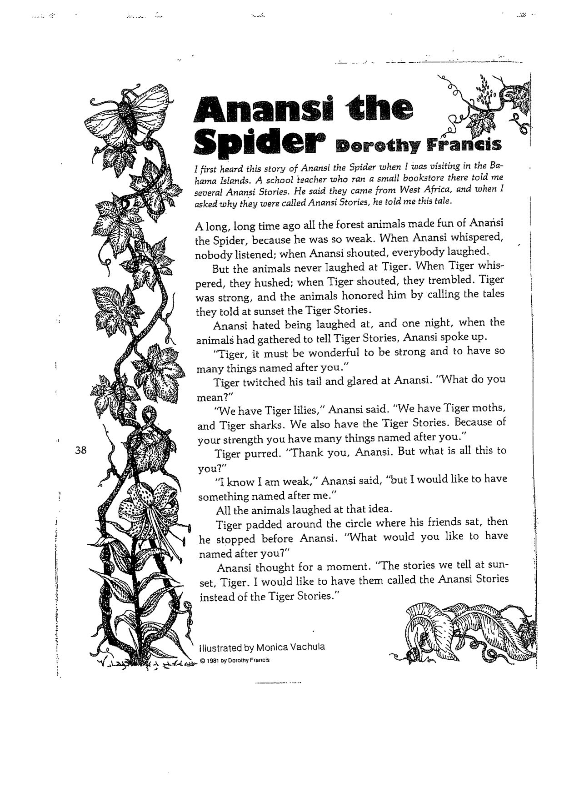

<!-- page 61 -->

<!-- Anansi the Spider story page continued - scanned page embedded below -->

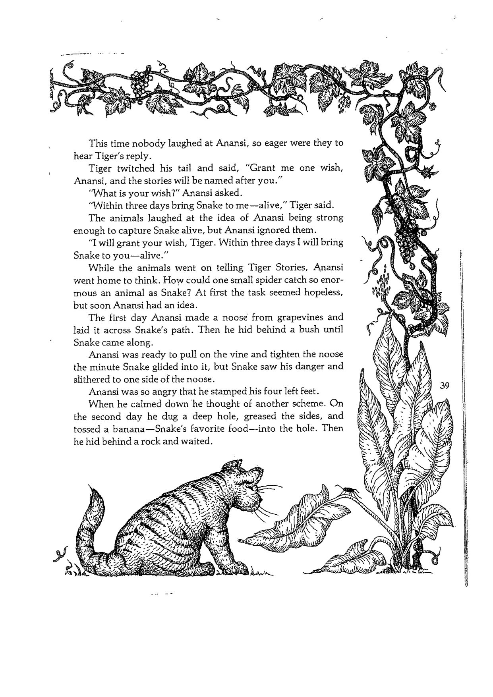

<!-- page 62 -->

<!-- Anansi the Spider story page continued - scanned page embedded below -->

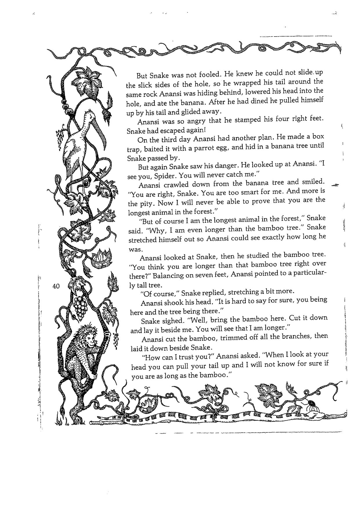

<!-- page 63 -->

<!-- Anansi the Spider story page continued - scanned page embedded below -->

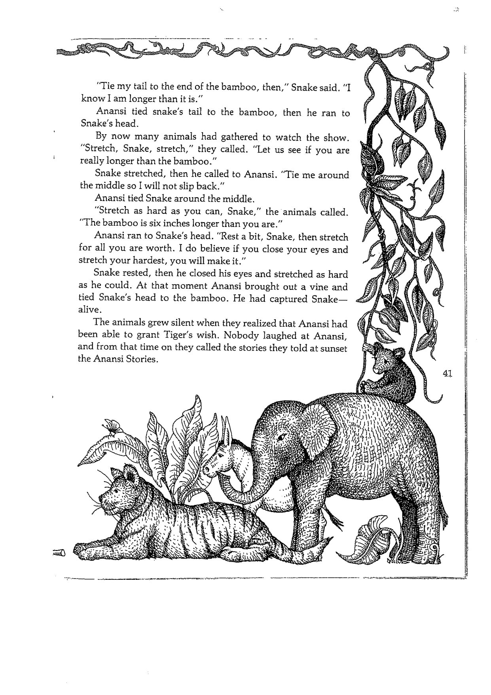

<!-- page 64 -->

Monster for Hire
On a stony hill between two towns lived a giant. Because he was often
away the giant decided to hire a monster to guard his castle. So he put a
sign on the castle wail.

WANTED TO HIRE

ONE MONSTER

MUST BE FIERCE
Along came a monster, “I’m looking for work,” he said. “Try me.”
“Are you fierce?” asked the giant.
“Very!” the monster assured him. He screwed up his face and growled his
fiercest growl.
“Hmmph.” grunted the giant, not impressed. “That looked more like a
toothache to me, but I’ll suppose you'll do.”
The next morning the giant showed the monster to a cave by the castle gate.
“Now, listen carefully. I have a pantry full of cakes and pies,” said the
giant, patting his stomach. “When I get back I’ll be starving, so let no one
in while I’m away. If a single morsel of food is missing, it will be the
worse for you.”
That afternoon a wagon lumbered up the hill and stopped at the castle gate.
Out came the monster baring his teeth. “YOW-EE-OO-AW! No one goes
in!” he bellowed.
“Well, that’s too bad,” said the man in the wagon. “I was told the giant’s
drawbridge was out of order. I came to fix it.”
“Oh!” said the monster, scratching his head. “In that case you’d better go
in.”
A little while later the man came out of the castle, climbed onto his wagon,
and drove away.
When the giant returned he flew into a terrible rage. “Fool!” he thundered.
“All of my food has been stolen. Who went into the castle?”
“Only the man to fix your drawbridge,” protested the monster. “He said it
was out of order.”
“Fool again!” roared the giant. “Can’t you use your eyes? I haven’t got a
drawbridge. You’re fired.”
So the giant put another sign on the castle wall.

FOR HIRE
ONE MONSTER
VERY BIG AND FIERCE

Along rode a prince. “Just what my father needs to guard his gold,” he
said to the giant. “Are you quite sure he’s fierce?”
“Very!” the giant assured him. “Too fierce for me. No one will come near
my castle and he’s ruining my trade.”
“Hmmm,” said the prince, stroking his beard as he eyed the monster. “He
looks a bit clumsy, but I suppose he’ll do.”

---

<!-- page 65 -->

The king was mean and he loved gold so much that he taxed the whole
kingdom to provide more and more for himself. He kept his gold in a
dungeon underneath the palace. The prince took the monster to a small
room beside the door of the dungeon.
“Listen carefully. Let no one in. If a single speck of gold is missing,” the
prince warned, “it will be the worse for you.”
“you can rely on me,” said the monster.
A few days later footsteps sounded on the stone staircase. The monster
jumped out baring his teeth. “YOW-EE-OO-AW!”
His face pale, the king did a double take.
“Goodness gracious! I forgot about you!” he gasped. “Very good indeed.
My gold is safe while you’re here. Now step back while I unlock the

door.”
“No one goes in,” said the monster firmly. “And don’t think that fancy
dress can fool me.”
““Wh-what!” sputtered the king. “How dare you! I’m the King!”
“Ho! Ho!” laughed the monster. “Get your bowed legs moving before I
tear you to pieces.”
Purple with rage, the king turned and stormed back up the staircase. Soon
afterwards the prince hurried down. He was in a fine temper.
“Fool! Dolt! Imbecile!” he cried. “You have insulted the king. You’ll
have to go.”
So a sign was hung on the palace wall.

FOR HIRE
RELIABLE MONSTER
GUARANTEED
FIERCE

A sorcerer came by. After reading the sign, the sorcerer knocked on the
palace gate.
“Just what I’m looking for,” the sorcerer said when the prince came to the
gate. “I need a monster to guard my den while I’m out casting spells. But
tell me, is he really fierce?”
“Very!” said the prince. “He nearly tore the king to pieces.”
The sorcerer eyed the monster. Then, taking the prince aside, the sorcerer
whispered, “What I’m really looking for is a stupid monster.”
“You can rely on this one,” said the prince. “He’s so stupid he doesn’t
know his left foot from his right.”
“I’ll try him then. Follow me,” the sorcerer snapped at the monster.
Finally they reached the sorcerer’s den, deep in the dark and gloomy
woods.
“Stay in that corner,” ordered the sorcerer, “and don’t bother me.”
For the next two days the sorcerer mixed a special potion, muttering loudly
and consulting an old potion book from time to time. At last the potion
was done. The sorcerer poured it into a bottle, chuckling wickedly all the
while.
“Beware,” the sorcerer warned the monster while preparing to go out. “Let
no one in, and touch nothing yourself, or it will be the worse for you.”
Soon the monster was rather bored with sitting around. He wandered
through the den looking at this and that, being careful not to touch

---

<!-- page 66 -->

anything. Then on a high shelf covered with dust and cobwebs he spied
some jars of potions already mixed. The monster could just make out the
labels. One said,’Special Potion,” and underneath, in small black print,
“Turns all who drink it into toads.”
“Aaah!” the monster said gleefully as he emptied the potion into the
sorcerer’s teapot. Then he went back to his corner to rest.
Upon returning, the sorcerer stared around the den suspiciously. Then,
satisfied that all was well, the sorcerer made a pot of tea. After two nice
sweet cups, the sorcerer poked the monster.
“Stir yourself, lazybones. I’ve a lot of work ... for ... you ... to ..” The
sorcerer sat down. “Goodness, I’m feeling qu-quite strange. And s-
something is happening to my voice. It-it’s going all hoarse.”
And without further ado the sorcerer changed into a very odd-looking
creature indeed, “Arrk! Arrk! croaked the creature as it hopped off to the
nearest pond.
Since the sorcerer didn’t seem to want the den any longer, the monster
made it his own home. He cleaned out all the spells and potions and
brightened the place up until it was quite nice, just like any other country
cottage. And he put a sign on the cottage door.

MONSTER

FOR HIRE

SATISFACTION
GUARANTEED

---

<!-- page 67 -->

The Frog Who Would Be King
There was once a frog who dreamed of being someone special, someone
brave and noble. He wanted to be a king, but he knew that such a thing
could never happen to him while he lived in a lily pond. So he ventured
forth: into the world to find a princess. For, like all frogs, he had heard the
Story of the princess whose kiss of love had changed a frog into a
handsome prince.
It was a dewy morning when he finally hopped up to a castle and stationed
himself on a princess’s balcony. Feeling rather nervous, he took a deep
breath and croaked,”Knee-deep, knee-deep.”
The princess came rushing from her chamber, and it was love at first sight
for both of them. The frog had never seen anyone so beautiful. Even
though he was only a little frog and she was a tall princess, he thought her
the loveliest, daintiest creature he had ever seen.
Her name was Lil and she thought this frog was the most perfect in all the
world - so sweet and shiny and green. She gave him the noblest name she
could think of - Reginald. Their romance blossomed like a well-watered
buttercup. and finally Reginald decided to propose.
“Dear Lil,” he began, holding her Httle finger with his sucker pad, “could
you possibly overlook my frogginess and be my wife?”
Lil swooned with emotion and fainted on the spot. Reginald hopped back
and forth from the goldfish pond with water to splash on her face: back and
forth, back and forth, trying to wake her up so she could give her answer.
His efforts were rewarded. Her answer was “yes.” She would marry him,
frog or not.
“Marry a frog?” her father roared when she told him. “You can’t be
serious. Don’t you know that the man you marry will one day become king
in my place?”
“Yes, Father.” she said. “I know, and I think Reginald would make a
wonderful king. He’s wise and courageous and kind.”
“I don’t care if his blankets are made from boy scout badges,” cried the
king. “He’s still a frog, and he’s not going to sit on my throne!”
Lil came away broken-hearted, for she must have been the only person in
the world who had not heard the story of the frog and the princess.
Reginald soon told her.
“You see, my dear,” he said, “one kiss is all it takes. I’ll turn into a prince
and our problems will be over. So, pucker up.”

---

<!-- page 68 -->

“But Reginald,” she said, “you'll give me warts!”
“Lil dear, toads, not frogs, give you warts.”
“Sorry dearest.” She raised him to her lips, closed her eyes, and ...
Smoooooch!
“Oh,.no!” she cried, “You're still a frog!”
He looked glumly at his greenness. “I can’t understand it. Our ingredients
are right. I’m a frog, you’re a princess, and we love each other enough to
turn a dozen tadpoles into a ready-made family.”
“I’ll marry you anyway,” said Lil. “I wouldn’t care if you were an ugly
old toad.”
But Reginald did care. It was his dream to become king. He had come a
long way from the lily pond, and he was not going to turn back now,
“I’ll go and see the local witch,” he said. “She should be able to tell us
what’s gone wrong.”
“And I’ll have a chat with the court magician,” said Lil, “and see what he
says.” :
So Reginald told the witch what had happened, or rather what had not
happened. She nodded her head and said, “Frog, whoever told you that
story got it mixed up. That wasn’t a frog that the princess kissed and
turned into a prince. It was a toad, Why, anyone can change a toad with a
little smack on the lips. But frogs are different. You can kiss frogs till the
cows come home and they’ll still be frogs.”
Reginald turned away dragging his flippers in despair.
“Of course.” said the witch, “what we could do is turn you into a toad
first, and then into a prince.”
Reginald came bouncing back. “Could you really do that?”
“Sure could.” she said, giving a toothless smile. “In fact, it’s a long time
since I’ve kissed a handsome prince.”
Slowly the witch brewed the murky potion. Reginald tried to hurry her,
but she would not be rushed.
“These are one-way spells,” she warned him, “and we wouldn’t want any
mistakes to be made because there’s no coming back for seconds.”
When the potion was ready, Reginald took one sip from the spoon and
immediately puffed up into a big, brown toad. The witch bent down to
him.

---

<!-- page 69 -->

“All right, sweetie,” she said, “give us a kiss and let’s see how handsome
you are.”

“I’m terribly sorry, Madame,” replied Reginald, “but I am engaged to Lil,
and it wouldn’t be right for me to kiss another.”

Reginald bounded back to the castle for the kiss of love that would turn
him into a prince at last. His lily pad dreams were about to come true.
When Reginald came to the princess’s chamber, the court magician opened
the door. Being very tall, he looked down on Reginald from a great height.
“What have we here?” he said.

“I’m Reginald, the princess’s frog,” he answered, “only I had the witch
turn me into a toad.”

“And I must say, she’s done a fine job too,” said the magician, picking
Reginald up to examine his warts. “Yes, very fine work. Almost as good
as my own efforts, wouldn’t you agree?”

Saying that, he placed Reginald on a lotus leaf in the goldfish pond, right
next to a little green frog.

“Oh Reginald,” the frog cried in a sweet voice, “all our problems are
solved. We’re not different anymore.”

The frog was Lil.

“But we are,” he croaked. “You’re a beautiful frog and I’m an ugly old
toad.”

“I don’t care,” she said. And she put her little sucker foot on his big warty
flipper and gave him a kiss.

In an instant. a handsome young man appeared in the water beside her.
“Oh Lil”

“Oh Reginald!”

Lil’s kiss had changed Reginald into a tall and dashing prince, but she was
still a green and shiny frog. However, after the initial shock, they both
decided that it didn’t matter if one of them was a frog. Nothing had really
changed. Their love was the same. They had just swapped places, that
was all.

The king changed his mind, though. He was only too happy to have
Reginald marry his daughter now. Who else would, now that she was a
frog?

So Reginald married his princess, and in time became king, while all the
other frogs still sat on their lily pads catching tasteless flies and not daring
to dream of all the greater things they could be.

---

<!-- page 70 -->

<!-- Cicadas poem (Paul Fleischman) two-voice page - scanned page embedded below -->

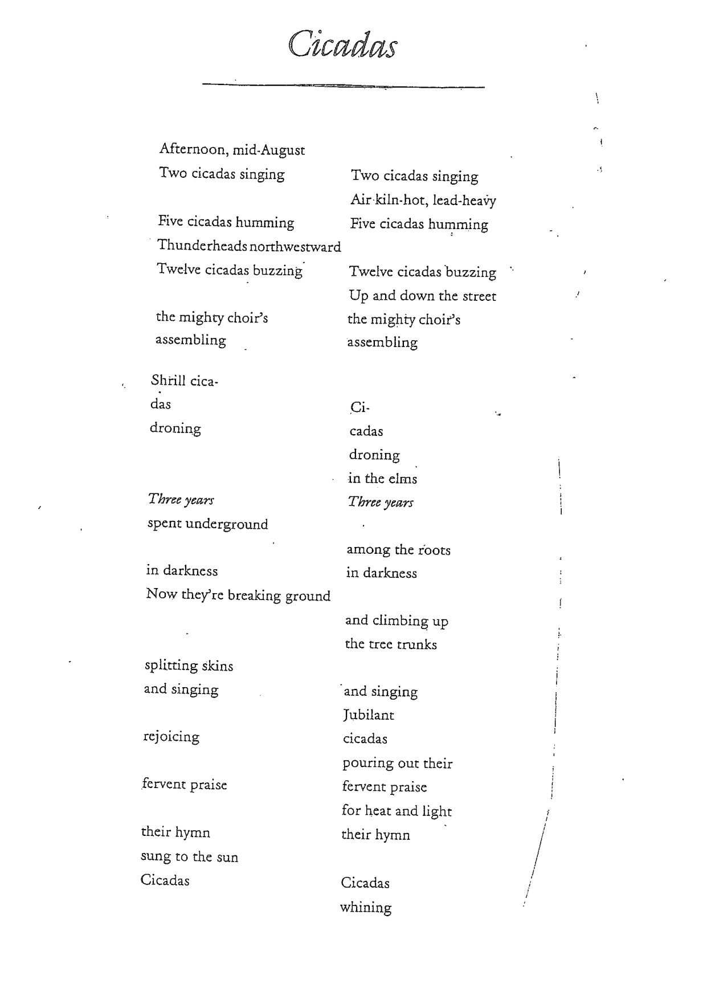

<!-- page 71 -->

<!-- Cicadas poem continued - scanned page embedded below -->

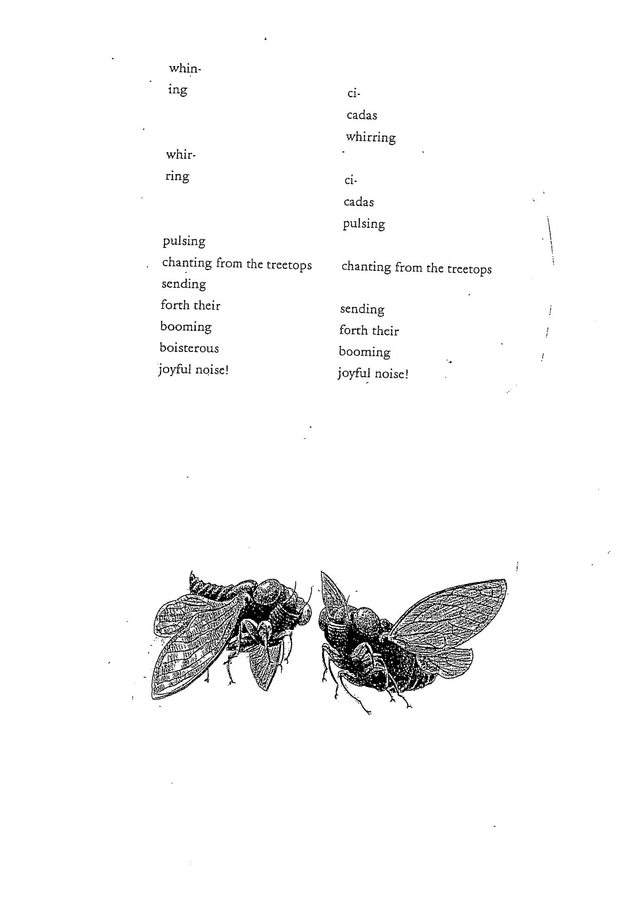

<!-- page 72 -->

<!-- Cicadas poem page continued - scanned page embedded below -->

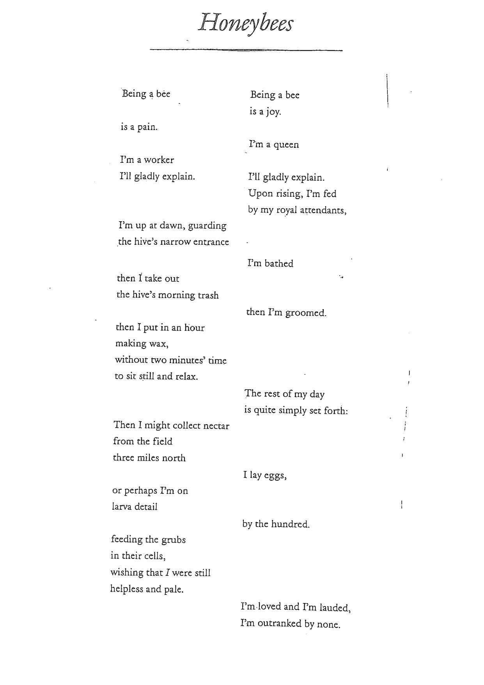
