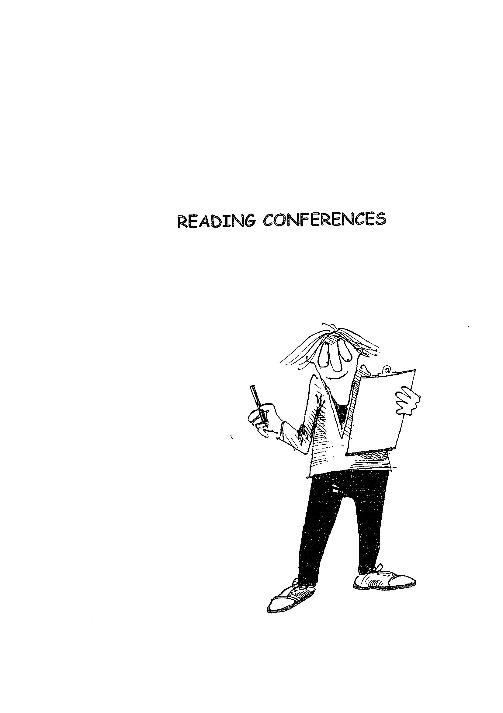
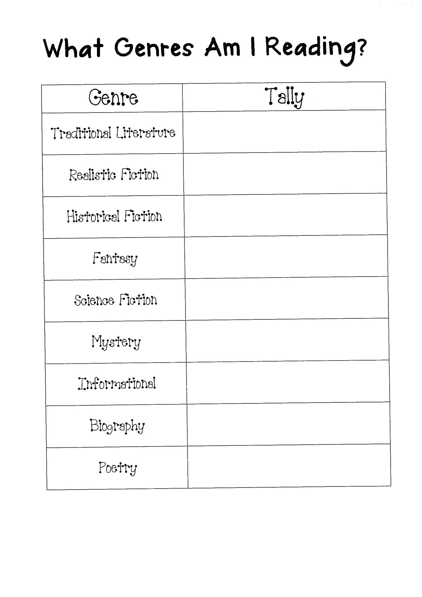
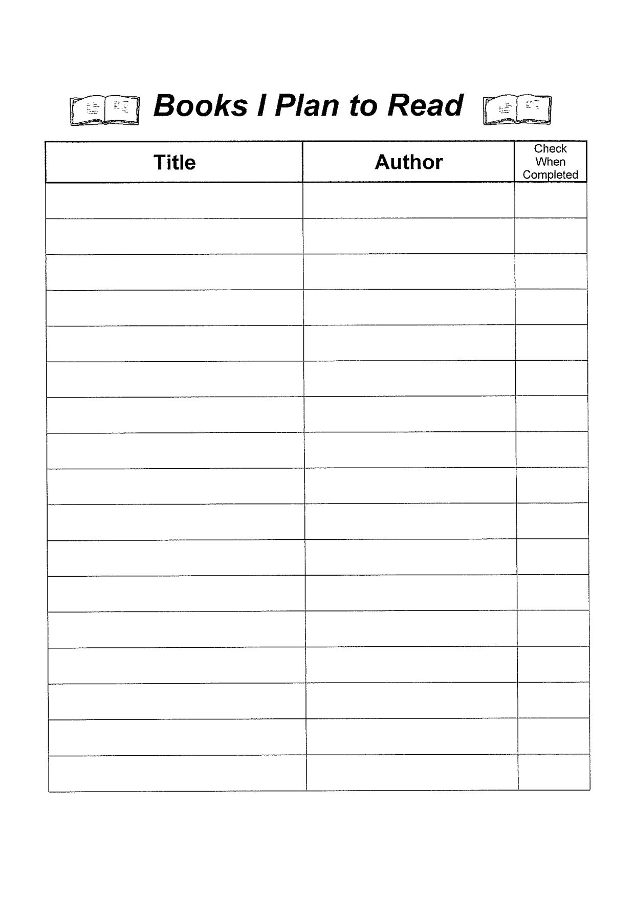
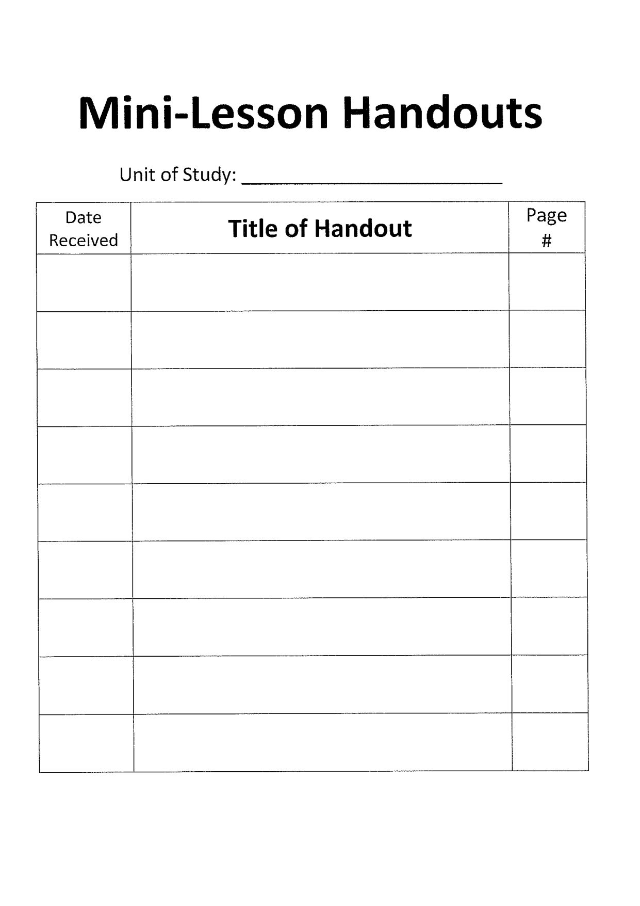
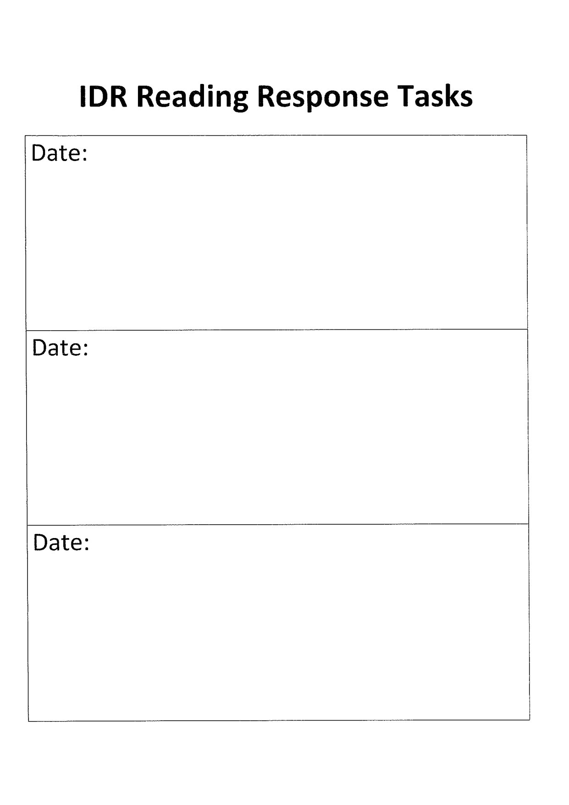
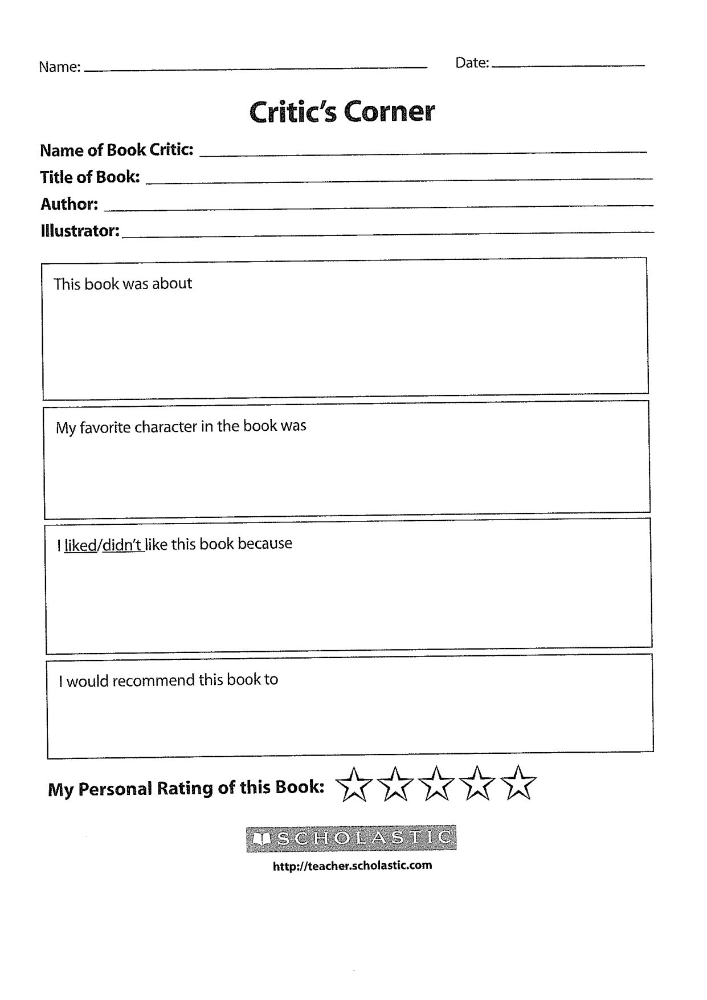
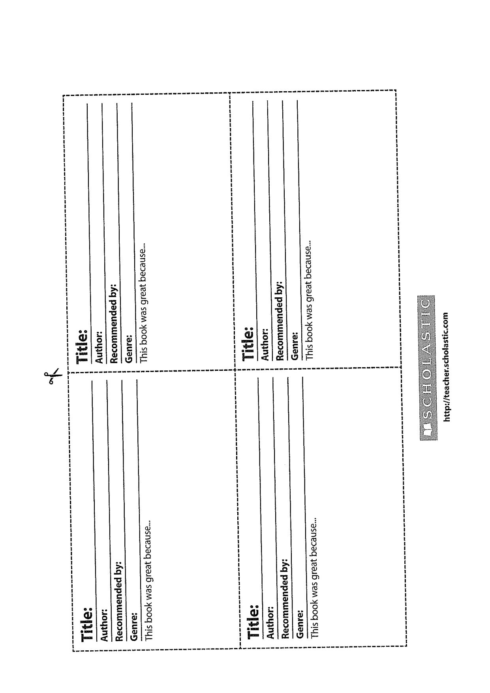

---

title: "Reading Conferences 1-46"
source_file: "Reading/Reading Conferences 1-46.pdf"
pages: 46
conversion: "OCR (tesseract, local)"
converted: "2026-09-07"

tags: [jim-k, reviewed]
reviewed: "2026-09-10"
---

# Reading Conferences 1-46

<!-- page 1 -->

<!-- Page 1 is a scanned cover/illustration page. Image below. -->

<!-- page break -->
<!-- page 2 -->

CONFERRING
Parallel Conferences
Content Focus is on subject. Focus is about the book.
Respond and ask
questions.
Students explain how Most frequent conf.
they went about writing.
Explain methods in: Students can explain:
topic choice; how they selected book;
problem-solving, how reading is going:
planning: comparisons between
techniques used; books:
gathering information; | how author knowledge
revising. affects reading of book.
Evaluation Onus on writer: Running Records.
“How do you feel about | Miscue Analysis.
it?" Use of Reading
Questions can be asked | Strategies.
about strengths and Reading Response
weaknesses of work. Journals.
“Is there one part you
especially like?"
“What is it about your
writing that you feel
great about?"
Form.
Publishing

---

<!-- page 3 -->

Process Conferences
The notes began ‘Reading is always about meaning."
Therefore, in the process conference strategies associated with making
sense of the text are paramount:
Comprehension: See separate handouts on -
Prior Knowledge
Determining Important Ideas and Themes
Questioning
Inferring
Visualising
Synthesising
Summarising
Think Aloud
Interpretation
Critique
Personal Response
Connections: T-T, T-S, T-W.
Opinion
Croft
Examples of Questions:
What new things have you tried in your reading lately?
What do you think is going to happen next?
Can you compare this book to any other you have read?
What have you noticed about the writing craft the author has used?
Evaluation Conference
Note student's progress.
Knowledge of student's use of reading strategies.
Running Records. (including retelling)
Miscue Analysis.
Examples of Questions:
What has happened in the story so far?
Tell me about the plot of the story.
What are your thoughts about the characters in the story?
Have any of them developed as the story progressed?
How have you used the reading strategy we have as our focus? E.g.
questioning.
What progress have you made towards achieving your reading goals?
What problems have you encountered in reading this text?

---

<!-- page 4 -->

My Reading Goals
These goals have been negotiated with my teacher to help me become a
better reader.

---

<!-- page 5 -->

Strategies. See separate handouts for each strategy with mentor texts.
Activating relevant prior knowledge (schema) before, during and after
reading the text.

Determining the most important ideas and themes in a text.

Asking questions of themselves, the author, and the texts they read.
Creating visual and other sensory images from the text during and
after reading.

Drawing inferences from the text.

Retelling or synthesising what they have read.

Utilising a variety of fix-up strategies to repair comprehension when
it breaks down.

---

<!-- page 6 -->

Getting to Know You Conference
Beginning of Year.
Get to know students’ strengths, needs, interests and weaknesses.
The students learn the routines of a reading conference.
Sharon Taberski (On Solid Ground) schedules reading conferences every day
for 50 minutes at the beginning of the year to:
assess each child's stage of reading
identify some skills and strategies to focus on
find books best suited to independent reading
"I teach not a class of twenty-six, but twenty-six individuals.”
During months 2 and 3 she schedules reading conferences three days a week
and guided reading groups two days a week.
From month 4 on she holds reading conferences two days per week and
guided reading groups two days a week. Compare this to our schedule.
However you do it I agree with Taberski that “Reading conferences are at
the centre of my teaching.”
Give a Survey eg.
In what ways do you consider yourself to be a good reader? A not so
good reader?
How many books have you read in the last month?
Do you have a favourite author?
In Preps, where there will be pre-emergent readers, ‘How print works’ is
observed in Shared Reading, Read Aloud, and Conferences (e.g. how they
handle books).
Through conferences you get to know the children better, and to plan
instruction to meet their needs.
You need to know which strategies the students use at the word and text
level. Taking running records will show whether the students are
Integrating the three cueing system MSV.
Monitoring their reading.
Self-correcting.
More fluent readers retell stories to show comprehension.

---

<!-- page 7 -->

Conferences provide the opportunity to reinforce strategies taught in whole
and small group sessions. The reinforcement depends on needs. E.g.
Figuring out unknown words: Some strategies would include -
Look closely at the initial letter/s.
Look at the pictures.
Consider what makes sense and sounds right.
Look through the word to the end.
Reread the sentence, getting their mouths ready to say the word.
Look for spelling patterns they recognise.
Look for smaller words within the word,
Skip the word and return.
Take the ending (e.g. ‘ing’ or ‘ed’) off and say the word.
Learning Strategies to better Understand the Text
Reminders might include:
Stop to think about what they're reading.
Reread the confusing parts.
Think about how the characters, setting, problem, main events, and
resolution work together to ‘create’ the story.
Think about how the character's ‘way of acting’ can help to predict
what might happen.
‘Create a picture’ in their mind of what they're reading.
Read on a little and then come back to think about the part that
confuses them.
Write about what happened at the end of each chapter.
Preview the book by examining the table of contents, section titles,
charts, illustrations, and captions.
(S.Taberski)
Building a Reading Life Conference
Teaching students how reading is a part of their daily lives.
Set Reading Goals. E.g.
Reading for longer.
Reading different genres.
Reading several books by a favourite author.
Create book discussion groups for students talking about books.
Questions around reading topics and authors.

---

<!-- page 8 -->

Conference Structure
During writing conferences we established the structure of:
Research, Decide, Teach, Record.
The same is true in the reading conference.
Research: Find out about how the student's reading is going.
Explain the purpose of the conference, or, “so, how is it going?”
Show the student what he/she is doing well and which practices
need improvement.
Decide: What would be best to teach the student?
What does this reader need to know?
Teach: Teach only one thing/session.
Explicitly tell the students what they are to do.
What Happens in a Conference e.g.
Listen to a student read aloud to determine accuracy and fluency.
Ask questions regarding what the student is reading to determine
comprehension.
Demonstrate the strategies of proficient readers.
Explain the value of using reading strategies regularly.
Reinforce student instruction done in whole class sessions. E.g. how to use
the Response Journal correctly.
Talk about any problems you have noticed or that the student has identified.
Make recommendations regarding books the students might enjoy.
Discuss what the student needs to do next.
Evaluate students’ reading accuracy and comprehension by taking a running
record,

---

<!-- page 9 -->

The Teacher Need To:
Give the students time to think.
Listen carefully.
Maintain a conversational tone.
Set goals.
Keep records.
Keep the students’ needs driving the conferences.
Monitor independent reading levels. We often see 92-95% quoted. I believe
it should be 97%. (Perhaps the five-finger test should be a three-finger
test.)
Students Need:
This can vary with teachers, so it would be good to share ideas. It could be:
Literature Response Journal.
Reading Folder - a space for Mentor Texts.
Books.
Literature/Reading Response Journal
What can go in these?
Responses.
Record Keeping.
Post-Its
We encourage students to use post-its as they read. The post-its can be put
into the Journals. The teacher can then see the student's thinking as it took
place before, during, and after reading, and can then use it during reading
conferences. See My Ideas About sheet.

---

<!-- page 10 -->

READING CONFERENCE

---

<!-- page 11 -->

READING CONFERENCE
Name:

---

<!-- page 12 -->

READING LOG
Keep a record of your reading. After you complete the book, record the
genre and date. If you gave up reading the book enter (A) (Abandoned) in
the date column. Note whether the book was easy (E), just right (JR) or
challenging (C).
E
Title Author Genre | Date IR
Code | completed c

---

<!-- page 13 -->

READING CONFERENCE
Name:
What does he/she What does he/she How can we go about
know? need to know? this?

---

<!-- page 14 -->

LITERATURE RESPONSE JOURNAL
The purpose of this journal is for you to record your developing
responses to the book. This will help you to understand the novel.
It is YOUR record of YOUR thoughts, and therefore different from
anyone else's,
Suggestions:
e Tell about the story.
- Where and when does it take place?
- Would the story’ be different if it happened in another time
or place?
e How do you think the story might develop?
e Reflect on personal reactions.
- Compare what has happened with your own experiences.
> Write about things that have happened to you, which you're
reminded of by events in the book.
e Describe the characters,
» What are your reactions to the characters and what they
do?
- Give your opinion of a character, What kind of person is
the character? How do you know?
- Do any of the characters remind you of characters in
other stories? ‘
- Is there a character who changes as the story progresses?
How?
- If you were one of the characters, what would you do and
why?
® Comment on how the author is telling the story.
- How has the author drawn you into the story?
- How does the author make you want to keep reading the
book?
- Make notes on words, phrases, lines, passages that you like
or think are memorable.

---

<!-- page 15 -->

- Does the story convey a particular mood or feeling? What
is that mood? How does the author create this?
@ Think of a different ending to the story. How would other parts
of the story have to change to fit this ending?
e Is this story like any other you have read? How?
e Is there anything that puzzles you?
What questions do you have?
e What is your overall reaction to this book?

---

<!-- page 16 -->

~ LITERATURE RESPONSE DIALOGUE (JOURNAL)
Purpose: To maintain a literary relationship with each Student.
Opportunities to discuss books are crucial, Depending on the number of
the students and the time available, the teacher may decide to have a
written response, which becomes a dialogue between Student and teacher,
Students can include in their writing - genre, theme, character, how they
read, authors, connections with their own experiences/writing.
Teachers can affirm, challenge, joke, argue, recommend, and provide
information, Through the dialogue teachers can focus on one good
Thoughtful question,
Procedure:
Students are invited to write about:
> what they've read
- what they noticed
> what they thought, felt and why
- what the book said and meant to them
Also: :
- ask questions
- relate to themselves

---

<!-- page 17 -->

Suggestions for Reading
ee
Response Topics

> Write about your favorite part of the book and why
it was important to the story.

> Explore how the main character changed throughout
the story.

> Write about something that surprised you or that you
found interesting.

> Describe an interesting or important character in
your book.

> Describe parts of the book that puzzled you or made
you ask questions.

> Write about an important lesson that was learned in
the story.

> Tell your thoughts or feelings about the theme of
the story.

> Write your predictions about the story and tell
whether or not they were right.

> Explain how the book reminds you of yourself, people
you know, or of something that happened in your life
(T-S Connections).

> Explain how the book reminds you of other books,
especially the characters, events, or setting (T-T
Connections) .

>» Describe how this book is like other books by the
same author, on the same topic, or in the same
genre.

> Retell the ending of the story AND write your
feelings about it.

> Describe the author's craft: What was good about the
author's writing? What things might you try to do

---

<!-- page 18 -->

in your own writing that you learned from this
author?

> Explain why you think that your book is popular with
students in the class (if it is popular with other
readers in the class).

> Would you recommend the book to another reader?
Explain why or why not.

> Describe what you would change about the book if you
could rewrite it.

> Describe in details the setting of your book and how
it fits into the story.

> Write a letter to a character in the book or a
letter from one character to another.

> Write a diary entry in the voice of a character in
your book.

> Compare two characters in the book to each other by
describing their similarities and their differences.

> Compare a character in your book to a character in
another book you have read.

> Make a list of “lingering questions” you have after
finishing the book.

---

<!-- page 19 -->

READER RESPONSE QUESTIONS
You are not limited to these options.
What were your feelings after reading the opening chapter of this book?
Does this book make you laugh? Cry? Cringe? Smile? Cheer? Explain.
What connections are there between the book and your life? Explain.
What is the most important word in the book? The most important passage?
The most important event or feeling? Explain.
Who should or shouldn't read this book? Why?
What are the best parts of the book? Why? What are the worst parts?
Why?
Do you like the ending of the book? Why or why not? Do you think there is
more to tell? What do you think might happen next?
What came as a surprise in the book? Why?
What parts of the book seem most believable or unbelievable? Why?
What makes you wonder in this book? What confuses you? In what ways
are you like any of the characters? Explain.
Do any of the characters remind you of friends, family members, or
classmates? Explain.
Which character would you like to be in this book? Why?
What would you and your favourite character talk about in a conversation?
Begin the conversation.
Do you think the title fits the book? Why or why not?
What was the author saying life and living through this book?
Has the book helped you in any way? Explain.

---

<!-- page 20 -->

How have you changed after reading this book? Explain.

What do you know now that you didn't know before?

What questions in this book would you like answered?

What do you think will happen next?

What are some words I don't know or questions I have?

What does the author's purpose seem to be?

What do you notice about characters, setting, and point of view?

If the book were set 50 years in the future or the past, how would the
conflict change?

Which character would you choose as a friend, brother/sister,
boyfriend/girlfriend, mother/father?

Discuss how. (character) shows his/her personality through the
dialogue in the story.

Discuss how (character) shows his/her personality through the
dialogue in the story.

Discuss how (character) shows his/her personality by the
actions he/she takes.

Discuss how (character) shows his/her personality by how other
characters react/act towards this character.

Discuss a portion of the book that was too predictable.

Discuss a conflict in the book that is “timeless” and “universal”.

---

<!-- page 21 -->

Reading Response Prompts for Fiction

© Describe how one of the characters in this book reminds you of someone you know, have met, seen, or
read about. How does this connection help you to understand the text better?

e Draw a picture of your favorite character. On the side of the paper, list the things you like about the
character and why he or she is your favorite.

¢ If you could change the setting of the story to your neighborhood, how would the story change? Do you
think the story would be better if it were set in your neighborhood? Why or why not?

* Write an explanation of what you think will happen next in your novel.

¢ Sometimes we wish our lives were like the lives of the characters in the books we read. How would you
change your life to be more like one of the characters in your book?

e If you could ask the author two questions about the novel, what would they be and why?

¢ Sometimes when we read, something confuses us. Write about something in the text that confuses you.
Explain why it doesn’t make sense to you.

© Describe something that you read that was surprising. Explain why it surprised you.

e Find a website for the author of your book. Read about the author and write down any information
that might explain why the author chose to write this book the way he or she did.

© Now that you have finished this book, what would you have happen next in the series? Why?

° Sometimes when we read, we wonder why the author made the choices they did when writing the
book. Is there anything in this story that you would have written differently? Why?

© Who would you recommend this book to? Why?

e Rate the book on a1 - 10 scale, 10 being “a home run” book. Support your rating.

Reading Response Prompts for Nonfiction

© What did you learn as you read this book that you did not already know?

« What questions did you have as you read? Were they answered? Do you expect that they will be
answered as you read on?

«Explain something you read that I might find interesting.

« Sometimes when we read, something confuses us. Write about something in the text that confuses you.
Explain why it doesn’t make sense to you.

e Describe something that you read that was surprising. Explain why it surprised you.

¢ What are some important vocabulary words that you have learned as you read? Why is each of these
words important?

* Go online and find out more information about something you read. Write down the website address
you find and write a paragraph explaining what information I might find there.

¢ Who would you recommend this book to? Why?

e Rate the book on a 1-10 scale, 10 being “a home run” book. Support your rating.

e Now that you have finished the book, do you still have questions that have not been answered? If so,
what are they and where could you go to find the answers?

---

<!-- page 22 -->

TELL ME
This list of literature question is intended for the teacher's own convenience.
‘It is provided only as an aid to memory.’
Aiden Chambers Tell Me - Children, Reading and Talk
THE BASIC QUESTIONS
Was there anything you liked about this book?
What especially caught your attention?
What would you have liked more of?
Was there anything you disliked?
Were there parts that bored you?
Did you skip parts? Which ones?
If you gave up, where did you stop and what stopped you?
Was there anything that puzzled you?
Was there anything you thought strange?
Was there anything that you'd never found in a book before?
Was there anything that took you completely by surprise?
Did you notice any apparent inconsistencies?
Were there any patterns - any connections - that you noticed?
THE GENERAL QUESTIONS
When you first saw the book, even before you read it, what kind of book did you
think it was going to be?
What made you think this?
Now you've read it, is it as you expected?
Have you read other books like this one?
How is this one the same?
How is it different?
Have you read this book before? (If so) Was it different this time?
Did you notice anything this time that you didn't notice the first time?
Did you enjoy it more or less?
Because of what happened to you when reading it again, would you
recommend other people to read it more than once, or isn't it worth it?

---

<!-- page 23 -->

While you were reading, or now when you think about it, were there words or

phrases or other things to do with the language that you like? Or didn’t like?
Have you noticed anything special about the way language is used in this
book?

If the writer asked you what could be improved in the book, what would you say?
(Alternatively) If you had written this book, how would you have made it
better?

Has anything that happens in this book, ever happened to you?

In what ways was it the same or different for you?
Which parts in the book seems to you to be most true-to-life?
Did the book make you think differently about your own similar experience?

When you were reading, did you ‘see’ the story happening in your imagination?
Which details - which passages - helped you ‘see’ it best?

Which passages stay in your mind most vividly?
How many different stories (kinds of story) can you find in this story? Was this a
book you read quickly, or slowly? In one go, or in separate sessions?

Would you like to read it again?

What will you tell your friends about this book?

What won't you tell them because it might spoil the book for them?

Or might mislead them about what it is like?

Do you know people who you think would especially like it?

What would you suggest I tell other people about it that will help them

decide whether they want to read it or not?

Which people would be the ones who should read it? Older than you?
Younger?

Is it a good thing to talk about it after we've all read it?

We've listened to each other's thoughts and heard all sorts of things that each of

us has noticed. Are you surprised by anything someone else said?

Has anyone said anything that has changed your mind in any way about this
book? Or helped you understand it better?
Tell me about the things people said that struck you the most?
When you think about the book now, after all we've said, what is the most
important thing about it for you?

Does anyone know anything about the writer? Or about how the story came to be

written? Or where? Or when? Would you like to find out?

---

<!-- page 24 -->

THE SPECIAL QUESTIONS
How long did it take the story to happen?
Did we find out about the story in the order in which the events actually
happened?
When you talk about things that happen to you, do you always tell your story in the
order in which they happened? Or are there sometimes reasons why you don't?
What are the reasons?
Are there parts of the story that took a long time to happen but were told about
quickly or ina few words? And are there parts that happened very quickly but
took a lot of space to tell about?
Were there parts that took the same time to tell as they would have taken
to happen?
Where did the story happen?
Did it matter where it was set? Could it just as well have been set
anywhere? Or could it have been better set somewhere else?
Did you think about the place as you were reading?
Are there passages in the book that are especially about the place where
the story is set? What did you like, or dislike, about them?
Was the setting interesting in itself? Would you like to know more about it?
Which character interested you the most?
Is that character the most important in the story? Or is it really about
someone else?
Which character(s) didn't you like?
Did any of the characters remind you of people you know?
Or remind you of characters in other books?
Who was telling - who was narrating ~ the story? Do we know? And how do we
know?
Is the story told in the first person (and if so, who is this person?) Or the third
person? By someone we know about in the story, or by someone we know or don't
know about outside the story?
What does the person telling the story - the narrator - think or feel about
the characters? Does he/she like or dislike them? How do you know?
Does the narrator approve or disapprove of the things that happen and that
the characters do? Do you approve or disapprove of them?

---

<!-- page 25 -->

Think of yourself as a spectator. With whose eyes did you see the story? Did you
only see what one character in the story saw, or did you see things sometimes as
one character saw them, and sometimes as another, and so on?
Were you, as it were, inside the head of one of the characters, only knowing
what he/she knew, or did the story take you inside a number of characters?
Did we ever get to know what the characters were thinking about? Were we ever
told what they were feeling? Or was the story told all the time from outside the
characters, watching what they did and hearing what they said, but never really
knowing what they were thinking or feeling?
When you were reading the story, did you feel it was happening now? Or did
you feel it was happening in the past and being remembered? Can you tell me
anything in the writing that made you feel like that?
Did you feel as if everything was happening to you, as if you were one of the
characters? Or did you feel as if you were an observer, watching what was
happening but not part of the action? If you were an observer, where were
you watching from? Did you seem to watch from different places -
sometimes, perhaps, from beside the characters, sometimes from above
them as if you were in a helicopter? Can you tell me places in the book
where you felt like that?
More and more the children will frame the questions themselves and the
framework is used less.

---

<!-- page 26 -->

° . / .
Questions To Ask During ‘Reading
Conferences’
A good reading conference should be a discussion between teacher and child, Well thought out questions
will provide a clear focus or structure for the different aspects of the conference, Questions should vary
according to the focus you have determined in advance. The questions below are examples and should
only be used as a guide. They are broadly categorized according to their function within the conference.
These questions presume the child is reading a story, not non-fiction. The questions are very general: the
more familiar you are with the text, the more focused your questions will be.
Comprehension
e What are the main events in the story so far?
e Who are the main characters and what can you tell me about them?
, @ Did any of the characters have a problem/ how did they try to solve it? Did it work? Why /
Why not?
° Where is the story set? How do you know?
@ In what time is it set (present, past or future}? How do you know?
@ Do you think there was a lesson to be learned from the story? What might that be?
Opinions and response
2 Why did you choose this book?
a What did you do when deciding to choose the book?
3 How does it fit in with the kind of stories you like?
& How does it make you feel? Why?
a What is the most exciting/interesting part of the story so far? Why?
= Why is the least interesting part so far? Why?
8 Why do you think the author might have chosen to write this book?
8 Are there any parts of the book that remind you of other books or films or TV show?
® What would it be like to be a character in the story?
® Does the book remind you of other things happening in the world? Such as ....
Adapted from Pen 85 ‘Reading Conferences that Work’

---

<!-- page 27 -->

Reading strategies
® Did you find this book too hard or too easy or just right?
8 What do you do when you come to words that you didn’t know?
Imagining that you are the author, how would You rewrite this part in your own words?
(Draw the student's attention to a Specific part of the text).
Conducting the Reading Conference
The suggested format for a one to one conference is adapted from the work of Don Holdaway
(1980), who was a pioneer of the notion of individualized reading programs. Remember that
individual reading may take 15 - 20 minutes, so it’s important to be well prepared, to have a
clear focus and keep on track.
Establishing rapport
Make the child feel comfortable about the situation. Show your interest and ensure that she or
. he knows your attention is given undividedly.
Sharing
Provide and opportunity for the student to share with you his or her thoughts and feelings about
the chosen text. Invite sharing of any activity undertaken in relation to it, and discuss this. Share
the child’s recent reading by looking together at his or her reading log.
Discussion
Through careful questioning (and your own knowledge of the book), probe the child’s
understanding of the meaning of the text and of the way it’s put together. Encourage the child to
make critical and evaluative comments, and to relate the content to his or her own experience.
Oral reading
Listen to the child read aloud his or her chosen passage from the text.
Recording
Enter your observations, briefly outlining trends in reading interests, Progress that’s been made,
and development of reading and comprehension strategies. Make a note of areas to be focused
on in future conferences, If possible, include the student in the process.
Planning and guiding
Negotiate follow-up activities and discuss possible further reading choices. Provide
encouragement by discussing the child’s progress. After a well-conducted conference, children
should feel more positive about their learning and refreshed in their enthusiasm for reading. i
_—____]
Adapted from Pen 85 ‘Reading Conferences that Work’

---

<!-- page 28 -->

a
RESPONDING TO LITERATURE

Teacher modeling of good questioning techniques is important. Below are some

suggested questions designed to support good conversation and help structure

written responses. Ultimately, the goal is to have children generate their own
questions, but these should help get you started.

Before Beginning the Book

e How do the blurb, pictures on the cover, comments by book reviewers,
dedications connect to the story?

e How do your previous experiences with the author or genre help to support
early reading?

e How will the way the text is structured help you to plan your reading?

Questions to Use Near the Beginning of the Book

e How does the author get you interested in the beginning chapters of the book?

e How does the author introduce you to the setting (i.e. time and place)? Could
this story have happened in a different place? Do I have enough background
information to really understand this place and its importance in the story? Do
I need to expand my knowledge — do a quick read for more information.

° How does the author introduce you to the characters? What have you found
out about the characters so far?

e Do you feel like you already know what the main problem is? Tell what it is.
How did you know?

o What does the author use to get the story started? What do you think will
happen now?

° Is this author's style and type of writing familiar? What other books have I
read that are like this?

Questions to Think About as the Story Develops .

e What are you noticing about the author's craft? Is there language, images that
the author seems to keep referring to? Why?

o Were your early prediction, hunches accurate. Explain why or why not.

e What are the most important events that have happened in the story so far?

e How is time moving in the story? Quickly, slowly? Are the “times” changing?
How is the affecting the place? The Characters?

e How do you think the author will resolve the problem? How will the author end
the story?

e What words would you use to describe the main character? How do you learn
about him or her? Is it through what he or she does, what he or she says ( and
how it's said), or does the author just tell you? Give examples from the story
that made you think this way. :

e Have any of the characters changed since the beginning of the book? In what
ways? What has changed them? Did the change seem believable?

---

<!-- page 29 -->

oe

e Look at the secondary characters in the book? What's their story? What are
those characters’ roles in the life of the main character?

° Think about the characters in the story. Do they remind you of other
characters you have met in other stories? Who do they remind you of? Why
is this character important in the story? Could we tell the story without her?

e Does this character remind you of yourself in any way? In what way?

° If you could talk to one of the characters, what would you tell him or her?

2 What is the main problem in the story? Is there a subplot? How do they affect
each other?

e What questions are lingering in you mind throughout the book?

e Has the meaning of the title become clear?

Questions to Use at the End of the Book

e Did the story end the way you expected it to, or was it a surprise? Why?

° What if the story ended a different way? How else could it have ended?
Would anything else in the story have to change to fit your new ending?

® Did this story remind you of any other story you have read or watched? What
do you think is the “big idea” in this story? What makes you think that?

e Why do you think the author wrote this book? What did he or she want you to
think about? What did you notice about his or her style of writing?

e Did you have any really strong feelings as you read this story? What were
they, and why do you think the book made you feel that way?

® Is there anything that's happened in your own life that reminds you of what
happened to the character in this book?

e Can you imagine what will happen to the character after the story ended?

e If this character went to our school, do you think you could be friends with him
or her? ‘

e Compare this character to one from another book. What do you think would
happen if they met?

e Can you imagine how this story would be different if it were told by one of the
other characters?

e Compare this book to others you've read by this author. What's similar about
them? What is unique about each?

° Are there “loaded” statements that the author has laid down for your personal
interpretation? Try to figure out what they really mean in the sense of the real
world. :

° What is the story/piece really saying about the world?

2° What is the author saying about fairness, justice? Put yourself on the “other
side of the fence” Do you feel a sense of fairness?

e How would other people (races, gender, socio-economic, handicapped) feel
about the ideas in the story?

° Where were the places you laughed the story. Was it really funny in the life of — -
another person?

Adapted from New York State English Language Arts Standards Resource Guide

---

<!-- page 30 -->

SOME POSSIBLE READING CONFERENCE QUESTIONS
From: Readers & Writers With a Difference
Rhodes & Marling
0 What would you like to tell me about what you’ve read?
fa) Do you have any confusion about what you’ve read?
o What have you been wondering about as you read this?
fy) How did you decide to read this?
° What kinds of things have you been wrestling with as you read this? How
have you solved the problem(s)
0 If you had a chance to talk with this author, what would you talk with him/her
about?
0 ‘What do you plan to read next? Why?
0 Does this make you think of anything else you've read?
© Why do you suppose the author gave this (book, article, etc.) this title?
o What parts of this have you especially liked? (disliked)
° Do you like this more or less than the last thing you read? Why?
0 Is there anybody else in our class who you think would enjoy reading this?
Why?
° Did you skip any parts of what you have read? What? Why?
° What is the main thing that the author is saying to you?
a) Why do you suppose the author began this the way s/he did?
° Would you like to be one of the people in this? Who? Why?
0 What other texts by this author have you read? Are the other texts similar in
any way to this one?
0 Does this text remind you of others you have read? movies? TV shows?
Which? Why? Think about those together.
f) Does this text leave you feeling the need to read other texts to find out more
about anything or anyone?
° From what you have been saying, it sounds like you might be grappling with
issues of fairness or justice, say more about that.

---

<!-- page 31 -->

a
Active Reading ee eee
Here is a list of Active Reading Strategies that good readers
use everyday:
. 1. Underline important passages (if the book is yours)
2, Circle words you don't know
3. Visualize characters or setting
4, Reread parts that are confusing or interesting
5. Write notes in the margin or use post-its
~ What kind of notes can I write in the margin/ post-it notes?
1, Summarize: Tell what the story is about, . ~
2. Predict: What will happen next? -
3. Personal Connections: Can you relate to this character or story?
Why?
4. Reaction: How does reading this make you feel?
5. Qpinion: What do you think about the writing, character, plot,
etc?
6. Question: Do you have any questions about what you are reading?
7, Language: Do you notice any beautiful or interesting language?
8. Noticing Details: What important details do you notice?
9. Character Analysis: What do you notice or know about the
character so far?
10. Facts: Are there important facts (historical details, dates,
people) that you notice?
11. WE WILL DISCUSS MANY OTHER TYPES OF MARGIN
RESPONSES THAT YOU CAN MAKE!

---

<!-- page 32 -->

My Ideas about
(Title of Book)

---

<!-- page 33 -->

<!-- blank page -->

---

<!-- page 34 -->

<!-- photocopiable form page - scanned page embedded below -->

<!-- page 35 -->

Code Genre Definition
eas Stories that are passed down from one group to
Traditional another in history, This includes folktales, legends:
TL Literature fables, Fairy tales: tall tales, and myths from
different cultures.
A story including elements that are impossible such as
F Fantasy talking animals or magical powers. Make-believe is
what this genre is all about.
. «ah A type of fantasy that uses science and technology
SF Science Fiction (robots, time machines, etc.)
ted : A story using made-up characters that could happen in
RF Realistic Fiction eat ife
. . a A fictional story that fakes place in a particular time
HF | Historical Fiction | period in the past. Often the setting is real but the
characters are made up from the author’s imagination.
P
A suspenseful story about a puzzling event that is not
M Mystery solved until the end of the story.
Code Genre Definition
Texts that provide facts about a variety of topics
T Informational (sports, animals, science, history, careers, travel,
geography, space, weather, etc.)
A The story of a real person's life written by another
“eo  Biagaehy
person.
; The story of a real person's life that is written by
AB Autobiography that person.
Other Genre
Code Genre Definition
Poetry is verse written to create a response of thought
Poetry and feeling from the reader. It often uses rhythm and
rhyme to help convey its meaning.

---

<!-- page 36 -->

Genre Overview
Code| Genre __| Definition
A story including elements that are impossible
Fantasy such as talking animals or magical powers. Make-
believe is what this genre is all about.
tat ae A story using made-up characters that could
[| RF Realistic Fiction happen in real life.
A suspenseful story about a puzzling event that is
uM Mystery not solved until the end of the story.
age Stories that are passed down from one group to
TL Traditional another in history. This includes folktales,
Literature legends, fables, fairy tales, tall tales, and myths
from different cultures.
A fictional story that takes place in a particular time
. . ttt period in the past. Often the setting is real, but the
Historical Fiction characters are made up from the author’s
imagination.
. at A type of fantasy that uses science and technology
| SF Science Fiction (robots, time machines, etc.)
Nonfiction
Code| Genre __| Definition
Texts that provide facts about a variety of topics
Informational (sports, animals, science, history, careers, travel,
geography, space, weather, etc.
. The story of a real person’s life written by another
__B_|__ Biography
. The story of a real person’s life that is written by
| AB | Autobiography that person.
Other Genre
Code Genre Definition
Poetry is verse written to create a response of
Poetry thought and feeling from the reader. It often uses
rhythm and rhyme to help convey its meaning.

---

<!-- page 37 -->

<!-- photocopiable Books I Plan to Read form page - scanned page embedded below -->

<!-- page 38 -->

<!-- photocopiable Mini-Lesson Handouts form page - scanned page embedded below -->

<!-- page 39 -->

<!-- scanned page embedded below -->

IDR Reading Response Tasks

---

<!-- page 40 -->

<!-- blank page -->

---

<!-- page 41 -->

Name: ___ a Date:
Reading Interest Survey
My Favorite Genres are: (Circle 3)
Fairy Tales Folk Tales & Legends
My favorite topics to read about are: (List at least 4)
Do you prefer to read books in a series or books that are not
part of a series? (Circle one)
Series Non-Series Both

What book are you reading right now?
Title: # of Pages:
Author;
Is it a chapter book? Genre:
What are some of your favorite chapter book series?
What do you think you are best at as a reader?

hittp://teacher.scholastic.com

---

<!-- page 42 -->

<!-- photocopiable Critic Corner reading response form page - scanned page embedded below -->

<!-- page 43 -->

+ You couldn't put the book down!
*The characters in the book are interesting and entertaining.
* The problem in the story is exciting and unpredictable.
«The author uses descriptive language that is fun to read.
* The book is part of a series, and you want to get your friends
interested in the series.
* The illustrations are unique or memorable.
+The story is very funny and makes you laugh while you are reading.
* The story teaches you a lesson that you think other students
should learn, too.
4
+The story reminded you of something \
we are learning about in class. KA
[MES COT AS tic
http://teacher.scholastic.com

---

<!-- page 44 -->

<!-- photocopiable form page - scanned page embedded below -->

<!-- page 45 -->

How to Advertise
1.Goal: / a
-To get readers excited about a book, author, series, or genre.
——
2. Getting Ready:
~ Make sure you've read the entire book.
- Choose a book or series you think your classmates
will enjoy.
- Think about what makes your book interesting.
-Think about how you will capture the interest of the other readers in your class.
- Write down page numbers or mark pages you plan to show the
class with a sticky note before you make your presentation.
~ Practice your commercial before presenting it to the class.
3. During the Commercial:
- Show the cover of the book to the class.
- Start with a good lead. (Sometimes a question gets the audience interested.
Have you ever wanted to eat chocolate for breakfast? If so, this book is for you!)
-Tell the author, title, genre, library location, series, etc.
- Explain why you chose to share the book.
-Tell a little about the book, but don’t give away the secrets.
- If possible, mention other books by the same author or other
books in the same series.
4. Tips:
- Look at your classmates.
- Speak loud and clearly.
- Show your enthusiasm.
- Keep it short!
aS CHOI AS TIC
http://teacher.scholastic.com

---

<!-- page 46 -->

’ book Rubri
Reader’s Notebook Rubric
Reader’s Name: Date:
[| Outstanding Satisfactory Unsatisfactory
Student records all books
read on his/her reading log.
Student's reading log reflects
an appropriate amount of
books completed based on the
student's reading level.
Student accurately identifies
the genre for each book
recorded.
Student is reading a
variety of genres.
Student sets reading goals
that will help him/her
become a better reader.
Student accurately records all
handout titles on his/her
Mini-Lesson Handout
Table of Contents
Student's IDR tasks are
thoughtfully written and reflect
good comprehension of the text.
Student’s notebook is
organized and in good
condition.
Comments: