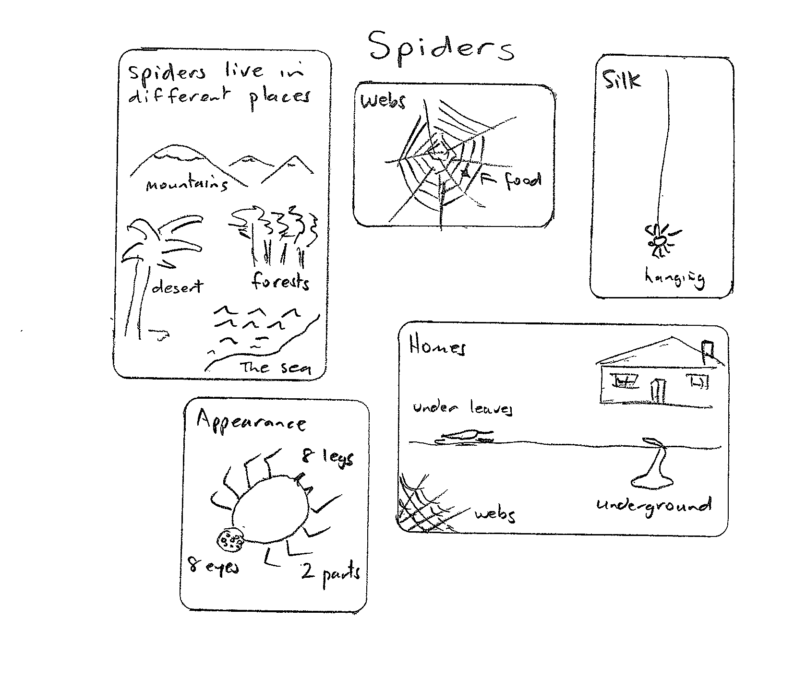
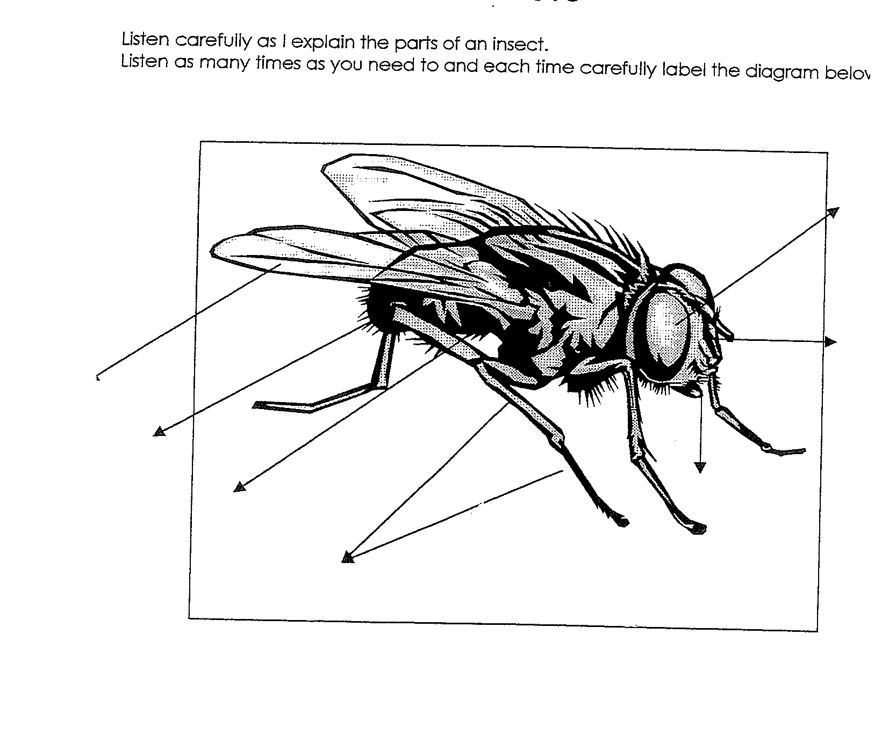

# Using Non-fiction Texts

> Reorganised from Jim's 38-page scanned pack: a strategy bank for
> note-taking and notemaking, question frames, purpose–form lists, genre
> cards, and photocopy masters. His wording is kept; headings and section
> order are mine. Original page numbers are marked `<!-- p.N -->`.
> (Cover p.1 is a title page with a horses illustration; p.38 is blank.)

## 1. Bundling (co-operative concept mapping)

**Purpose:** a logical framework for learning or topic selection; define
context, topics, sub-topics; link ideas; organise, analyse and synthesise
existing ideas; boost confidence and participation; model the research
procedure.

**Procedure:** give students 8–10 slips of paper each. Individually they write
words related to the research topic (one per slip). In small groups they read,
compare and sort the slips into groups of related ideas (bundles). Each
bundle gets a title — identifying sub-topics and relationships. Bundles are
arranged as a concept map under sub-headings on a large chart, added to
through the unit.

Notes: bundling also synthesises *after* research, and the word lists make a
good introductory vocabulary list for other language work.

<!-- p.2 -->

## 2. Unit planning templates

Two blank variants from the pack, kept in their original layout:

**Variant A.**

UNIT:

FOCUS QUESTION:

Other Questions:

LANGUAGE FOCUS: (Text Type)

INITIAL UNDERSTANDINGS: (What we already know)

EXPANDING KNOWLEDGE: What we would like to know.

Excursions:

Reading: To
&emsp;&emsp;&emsp;&emsp;With (Shared Reading)
&emsp;&emsp;&emsp;&emsp;By (Guided Reading / Independent Reading)

EXPLICIT TEACHING:
&emsp;Text Demonstration:
&emsp;&emsp;- Format of Text Type
&emsp;&emsp;- Book format (Title page, Table of Contents, Glossary, Index)
&emsp;&emsp;- Diagrams
&emsp;Shared Reading
&emsp;Modelled Writing
&emsp;Charts (discuss purpose)

JOINT TEXT CONSTRUCTION:
&emsp;Shared Writing (Shared book can be used as model)

INDEPENDENT TEXT CONSTRUCTION: (Writing Process)

**Variant B** (shorter).

UNIT:

FOCUS QUESTION:

Other Questions:

LANGUAGE FOCUS:

INITIAL UNDERSTANDINGS:

EXPANDING KNOWLEDGE:

EXPLICIT TEACHING:

JOINT TEXT CONSTRUCTION:

INDEPENDENT TEXT CONSTRUCTION:

<!-- p.3–4 -->

## 3. Strategy bank

### Memory writing

**Aims:** memory as a note-taking aid; reading for meaning; rewriting in own
words. **Procedure:** with younger students use a big book for shared reading
— read, cover, remember, rewrite in own words (shared writing works too).
Read aloud; discuss main points and clarify meaning; students try to remember
as much as possible; cover; write in own words; compare with the original and
discuss what was remembered, what was left out, and which language came from
or beyond the original.

<!-- p.5 -->

### Note-taking / key-wording

**Aims:** locating key words; using them to rewrite in own words.
**Procedure:** choose a topical text (student copies, large copy,
highlighters). Discuss key words, modelling on the first sentence; pairs or
individuals find key words sentence by sentence. Demonstrate rewriting from
the key words, referring back for meaning. Pairs/individuals rewrite
paragraphs or the whole text. **Assessment:** selects key words; paraphrases
from them; works cooperatively.

<!-- p.6 -->

### Paraphrasing

**Aims:** successful engagement with topical texts; peer tutoring; purposeful
speaking and listening; rehearsing key-wording; rewriting in own words.
**Procedure:** choose a topical text. In pairs, students alternate reading
sections aloud (partner follows silently); readers explain their
interpretation; listeners help clarify. Once oral paraphrasing is competent,
students note key words, phrases and ideas, then rewrite individually or in
pairs. **Assessment:** retells information texts in own words; comments and
questions with a partner; recognises headings, paragraphs and other
organisational features; understands texts are constructed for real and
imaginary purposes; uses context and self-correction; records key words and
writes summaries from them.

<!-- p.7 -->

### Possible sentences

**Aim:** reading and writing expository text — topic words, predicting
content, purpose, cooperative work. Whole class or small groups; all levels
and content areas. **Preparation:** a short text at students' reading level
(copies or overhead) plus a key-word list. **Procedure:** discuss genre;
write key words on the board and discuss meanings; students write sentences
with the words; discuss in pairs/groups, then as a class; read the text
(shared or independent); compare sentences with the original.

<!-- p.8 -->

### Think, pair, share

**Aims:** focus questions and terminology; higher-level thinking;
pair/group communication; articulating thoughts and beliefs; listening.
**Procedure:** pose a key question (e.g. *How can we make our school more
environmentally friendly?*). Students write individual thoughts; pair up and
share (*anything similar/different? tell your partner one idea of theirs you
liked*); pairs join to four with a reporter; groups share with the class.
**Assessment:** communicates in pairs/groups; listens and responds; uses
appropriate spoken structures; notes own ideas; cooperates.

<!-- p.9 -->

### Talking drawings

**Aims:** prior knowledge; oral language; synthesising through visualising.
**Procedure:** draw the topic from prior knowledge → share in threes, noting
similarities and differences → whole-class reflection (what was known, how
known) → list features, add other prior knowledge, build a concept map for
ongoing discussion → read the text (shared or independent); discuss → second
sketch, changed by new information → discuss reasons for change against the
text → extend with more research, oral/written reports.

<!-- p.10 -->

## 4. Data charts

A method of developing note-taking skills.

### Worked example: frogs

| Sources | What are they? | What do they eat? | Where do they live? | Different kinds |
|---|---|---|---|---|
| What we know | Reptiles? | Flies, insects | Ponds, trees | Toads |
| *Frogs* | Amphibians | Insects, snails, worms, spiders | Water, fresh water, underground, trees | Tree frogs, toads, bullfrogs |

Why charts work: usable at any level; identify key points; discourage copying
slabs of text; push own words; organise information; compare sources
including audiovisual; build the bibliography; open teacher–student
communication; extendable; draw on children's own knowledge; a secure
starting framework; make paragraphing easy; adjustable teacher control.

<!-- p.11 -->

### Blank research template (landscape worksheet, transcribed)

**Name:** _______________

| Questions | References | What I already know | Book title | Book title |
|---|---|---|---|---|
| | | | | |
| | | | | |
| | | | | |

<!-- p.12 -->

### Data charts for younger students

**Aims:** recording key facts from varied resources; note-taking and
key-wording; rewriting in own words. **Procedure:** when modelling, prepare a
chart — headings can come from the KWHL process. Note-take with pictures
and/or writing; use the chart as a rewriting guide if appropriate.

Worked example — Jim's hand-drawn "Spiders" chart (clipped from the scan;
labels transcribed beneath for search):

Boxes, clockwise from top left: **Spiders live in different places**
(mountains, desert, forests, the sea) · **Webs** (a web labelled "food") ·
**Silk** (a spider hanging, labelled "hanging") · **Homes** (a house; "under
leaves", "webs", "underground") · **Appearance** (a spider; "8 legs",
"8 eyes", "2 parts").

<!-- p.13 -->

### Develop notemaking skills (six steps)

1. **From a picture.** Discuss a spider sketch labelled SPIDER. Write one
   word about it, then one sentence containing the key word.
2. **Extend.** Discuss; write 4–5 key words (word cards: SPIDER, HAIRY,
   8 LEGS, BIG EYES). Remove the picture; put each word in a sentence.
3. **Extend to writing.** All read a short familiar passage. Circle key
   words, list them, write them into sentences without the original. (Key
   words differ per child but are mainly nouns or verbs.)
4. **Answering own questions.** *What do I want to know?* Skim, note key
   words, write a sentence answering the question.
5. **Short answer / long answer.** Topic: spiders. Question: *What do
   spiders look like?* Rule the page into two columns:

   | Short answer | Long answer |
   |---|---|
   | many types, 2 body parts, 8 legs, compound eyes | There are many types of spiders. They vary in colour, size and shape. Spiders have two body parts… |

   Read, write short-answer notes, remove the text, compose long answers.
6. **Evaluate.** Small groups share and compare summaries.

<!-- p.14 -->

### Worked example: spiders, Grade 1

**What we already know:** spiders make webs; crawl on walls; some drink
flies' blood; eight legs; different colours; some bite. **Questions:** why
eight legs? Why eat flies and mosquitoes? Do spiders poison? Why don't they
talk? Why walk slowly? Why curl flies in webs? Why bite people?

**Notetaking — Appearance:** different colours, some striped; two body parts;
eight legs; most have eight eyes. **Homes:** deserts, rainforests, mountains,
near the sea; underground; on leaves; in webs; in our houses. **Silk:** webs
catch food; hanging down to get food; wrapping eggs; spiderlings ballooning
on the wind. **Food:** most eat bugs — poison, stiffen, wrap, save for
tomorrow; spit to liquefy and drink; good because they eat flies; beware
bites.

<!-- p.15–16 -->

## 5. Double-sided entry for note-taking

Model on chart paper with a familiar passage: think through what the "big
ideas" are and what you wonder about them.

| Big Ideas | What I think or wonder |
|---|---|
| 4,000 different species of frogs in the world | Are there many in New York? |
| Tree frogs are found in many different countries | Where would they be in the US? |

Students try the technique on their own study topics. Conferring: generate
enough entries to have something to make into a finished piece. Share: quick
meeting-area discussion — was it challenging? A successful student explains
their process.

**Blank master** (p.18, a ruled two-column worksheet): Big Ideas | What I
think or wonder.

**Related master** (p.19): Name / Title / Author lines, heading *"I read a
non-fiction book that taught me something!!"*, a centre circle *"I learned
about:"* with four *"A detail:"* boxes around it.

<!-- p.17–19 -->

## 6. Listening: insects

**Aims:** listening to a taped description; labelling for spelling and
writing. **Procedure:** prepare tape and diagram; students listen, label, and
re-listen as needed; check; use the diagram for writing. Script frame:
*"Listen carefully as I explain the parts of an insect…"* Students label the
diagram with pointer lines to the body parts:

<!-- p.20 -->

## 7. Question frames

**Fluency** (many ideas, fast): *Who can think of the most…? Think of all
the ways…? How many ways…?* **Flexibility** (different answers): *In what
other ways…? What different kinds…? What else…?* **Originality** (new ideas):
*Can you think of something new / completely different / that no one else
will think of?* **Elaboration** (build on others): *Can you add something to
that? How can you change…? Can you make this better…?*

**Multi-level thinking:** literal — *Tell me what you know about…? Name
the…? Find the…? Which…? What…?* · translation (restructure) — *Retell…?
Rewrite…? Draw / make a diagram? What picture do you have in your mind?* ·
interpretation (connections) — *Why / what do you think…?* · application —
*Solve the problem. Show how you would…?* · analysis — *Compare…? Contrast…?
What is the evidence…? Do the conclusions make sense?* · synthesis —
*Invent a new…? Predict what would happen if…? Compose a new…?* ·
evaluation — *Was the character right or wrong to…? Was a solution fair…?*

<!-- p.21–22 -->

## 8. Purposes and forms of writing

| Purpose | Forms |
|---|---|
| Record feelings, observations, thoughts | Personal letters, science reports, poems, diaries, journals, sensory jottings |
| Describe | Character portraits, event sequences, labels, captions, advertisements |
| Inform or advise | Posters, news scripts, minutes, invitations, programs |
| Persuade | Advertisements, commercials, letters to the editor, debate notes, cartoons |
| Clarify thinking | Research notes, graph/science explanations, diagrams, jottings |
| Explore and maintain relationships | Letters, requests, greeting cards, questionnaires |
| Predict or hypothesise | Speculations (health, science, social studies), story endings, research/interview questions |
| Make comparisons | Charts, note-making, diagrams, graphs, descriptions |
| Command or direct | Recipes, instructions, stage directions, rules |
| Amuse or entertain | Jokes, riddles, puzzles, drama scripts, stories, poems, anecdotes |

<!-- p.23–24 -->

## 9. Genre cards

### Recount

Features: past tense; verbs; personal comment; personal pronouns; time-link
words (build the chart with students — say "words" instead of "then").
Types: **personal** (publish children's own) · **factual** (find recounts in
newspapers; students write an article as a recount) · **imaginative** (link
to reading, e.g. *Alexander and the Terrible, Horrible, No Good, Very Bad
Day* — write a recount as a character) · biography · historical recount ·
autobiography. **Purpose:** retell an experience or event. **Structure:**
introduction (who, where, when, why) → events in sequence → personal comment.

<!-- p.25–26 -->

### Explanation

Features: reasons stated; cause and effect; signal words (because, so,
consequently); diagrams, illustrations, labels; present tense.
**Purpose:** explain how or why things happen. **Structure:** what is being
explained → events in sequence → concluding statement.

<!-- p.27–28 -->

### Report

Planning: decide topic → "what I already know" → "what I want to know" →
list questions (teaches paragraphing; chart as in *There's an Echidna at the
Bottom of My Garden*) → note-taking → draft. Features: present tense;
concise; technical/scientific terms; accurate information; bibliography.
**Purpose:** classify and describe a class of things factually.
**Structure:** general statement or classification → description of important
features → concluding statement.

<!-- p.29–30 -->

### Procedure

Features: action verbs starting sentences; timeless present tense; headings
and sub-headings; diagrams; concise instructions; labels; photographs;
illustrations. Contexts: recipes, maths games, classroom procedures,
experiments, phys. ed., art/craft. **Purpose:** tell how to do something.
**Structure:** title → aim/summary → what you need → steps in order.

<!-- p.31–32 -->

### Argument

**Purpose:** persuade by stating your point of view with reasons.
**Structure:** issue (what, plus your opinion) → supporting reasons →
conclusion with recommended solution.

<!-- p.33 -->

### Discussion

**Purpose:** present both sides. **Structure:** issue → argument for →
argument against → conclusion after considering both sides.

<!-- p.34 -->

### Description

**Purpose:** tell what a particular thing is like. **Structure:** opening
statement introducing the object → characteristic features.

<!-- p.35 -->

## 10. Writing Analysis (photocopy master)

The pack ends with two copies of this form (p.37 is the blank for copying).
Structured here as the original lays it out:

**Name:** _______________ &emsp; **Text:** _______________ &emsp; **Date:** _______________

**Meaning**
- Audience (recognition)
- Purpose (knows purpose)
- Clear main idea
- Information (quantity & accuracy)
- Clarity
- Sense
- Revision (evidence)
- Personal style/voice

**Structure**
- Planning
- Genre-specific structure
- Sequence of ideas
- Effective lead/ending
- Cohesion (does it hang together?)
- Use of diagrams

**Processes**
- Planning (method)
- Drafting/Revising
- Editing (see Editing Guide & Meaning)
- Proofreading (see Proofreading Guide & Conventions)
- Publishing

**Conventions**
- Punctuation
- Grammar
  - tense (consistency)
  - sentence structure
  - sentence beginnings
- Vocabulary
- Spelling

*Strategies used:*

**Additional information**
- Development
- Understandings
- Attitude

**Observed needs**

*Implications for further learning*

<!-- p.36–37 -->
