**Writer's Notebook**

**(9)**

**Quick-Writes**

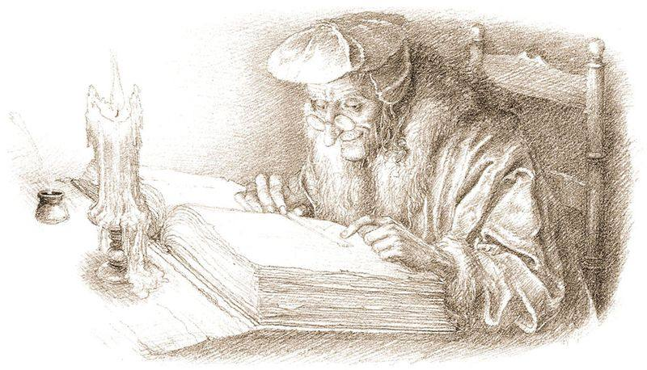{width="6.268055555555556in"
height="3.5884612860892386in"}

**Fantasy**

**\**

{width="3.5116458880139985in"
height="2.0104166666666665in"}

**Writer's Notebook 9 Fantasy**

**Pictures**

**Literature: Portels into Other World**

A Ring The Hobbit

Platform 9 ¾ Harry Potter

A Wardrobe The Lion, the Witch, and the Wardrobe

A Painting The Voyage of the Dawn Treader

A Locked Door Coraline

Flying Peter Pan

A Storyteller Haroun and the Sea of Stories

A Reader Inkheart

A Tesseract A Wrinkle in Time

Dreams Where the Wild Things Are

**Literature:**

Cloudy with a Chance of Meatballs

Charlotte's Web

Alice in Wonderland

My First Kafka

The Gruffalo

How to Train Your Dragon

Frozen

Matilda

The BFG

The Witches

Boy

Charlie and the Chocolate Factory

Danny the Champion of the World

Skellig

A Wizard of Earthsea

**The Fantasy Genre**

- Events occur outside the ordinary laws that operate within the
  universe.

- Magic is central to the fantasy genre.

- Fantasy stories often involve journeys and quests.

## Types of fantasy

- There are 3 different ways that fantasy writers set up their worlds.

  - Some novels begin and end in a fantasy world (for example *The
    Hobbit* or *A Wizard of Earthsea*).

  - Others start in the real world and move into a fantasy world (for
    example *Alice in Wonderland* or *Peter Pan*).

  - A third type of fantasy is set in the real world but elements of
    magic intrude upon it (for example *Mary Poppins* or David
    Almond's *Skellig*).

<!-- -->

- Realistic settings are often called primary worlds; fantasy settings,
  secondary worlds.

## Portals between Worlds 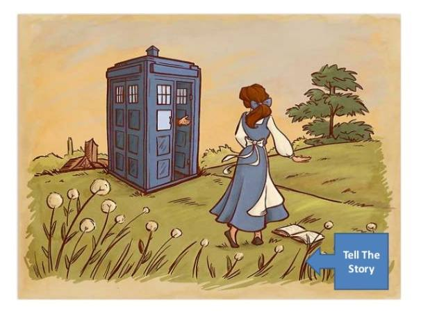{width="2.75in" height="2.066023622047244in"}

- Protagonists usually cross some kind of opening or "portal" between
  the two worlds

- Examples of portals:

  - *The Lion, the Witch and the Wardrobe: a wardrobe*

  - *The Voyage of the Dawn Treader*: a painting

  - *Haroun and the Sea of Stories: sleep*

  - *Harry Potter books*: platform 9 and ¾

  - *Coraline*: a door in a flat

  - *Peter Pan*: magical flight

  - *The Golden Compass*: windows cut between worlds

  - *Inkheart*: a gifted storyteller reads aloud 

{width="6.268055555555556in"
height="9.830272309711287in"}

{width="4.041666666666667in"
height="6.25in"}

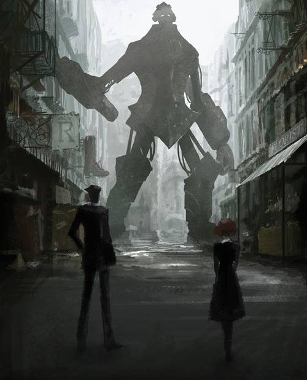{width="5.208333333333333in"
height="6.447916666666667in"}

{width="6.268055555555556in"
height="4.289700349956256in"}

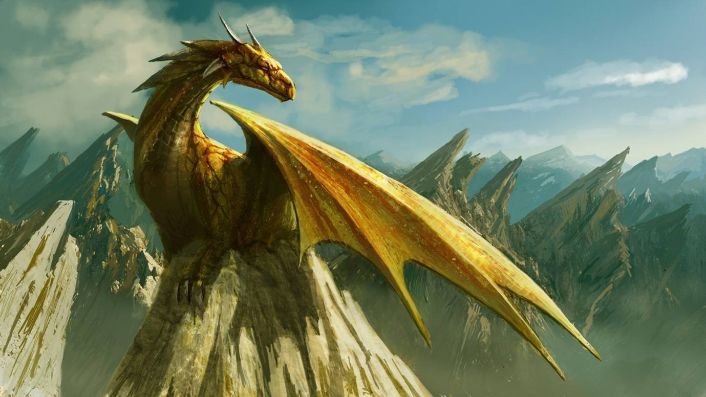{width="6.268055555555556in"
height="3.5257808398950132in"}

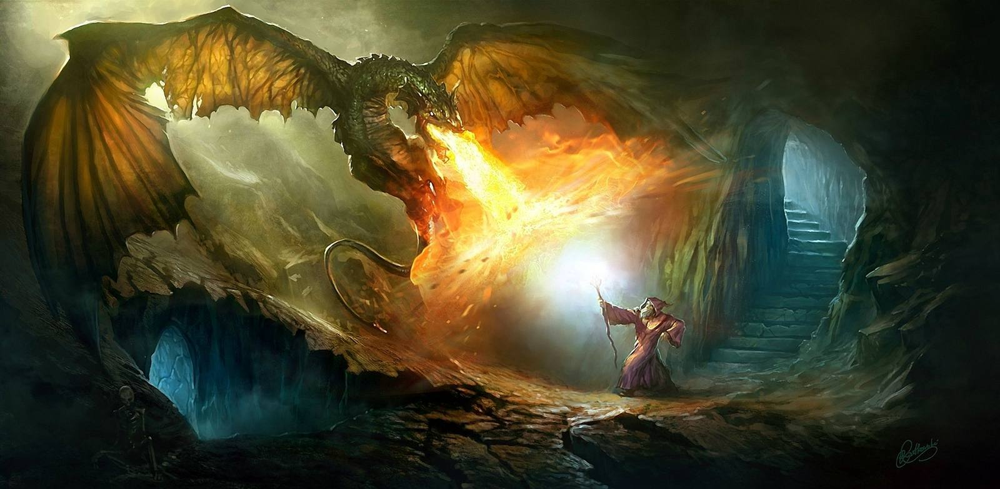{width="6.268055555555556in"
height="3.0686767279090112in"}

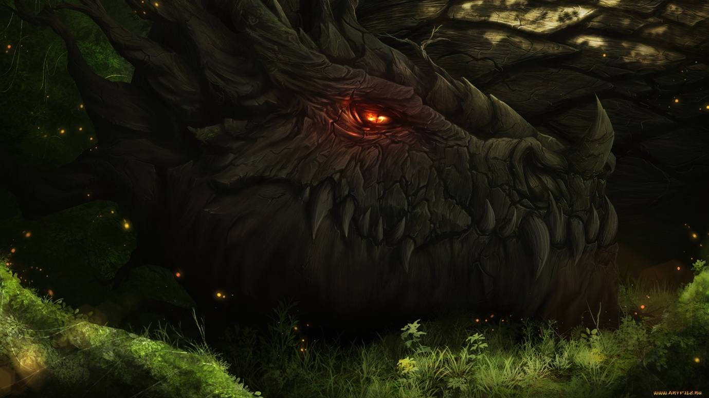{width="6.268055555555556in"
height="3.5257808398950132in"}

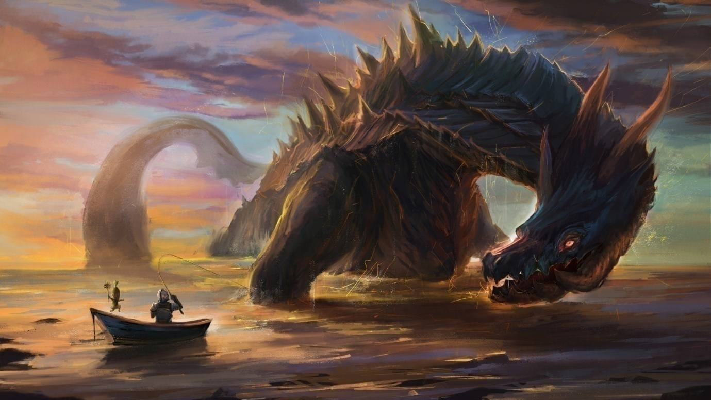{width="6.268055555555556in"
height="3.5257808398950132in"}

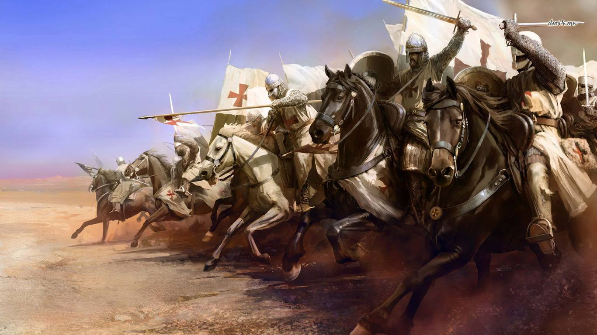{width="6.268055555555556in"
height="3.524060586176728in"}

{width="6.268055555555556in"
height="3.9175349956255467in"}

{width="6.268055555555556in"
height="3.5257808398950132in"}

{width="6.268055555555556in"
height="3.9175349956255467in"}

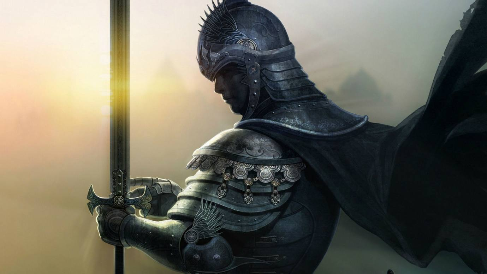{width="6.268055555555556in"
height="3.5257808398950132in"}

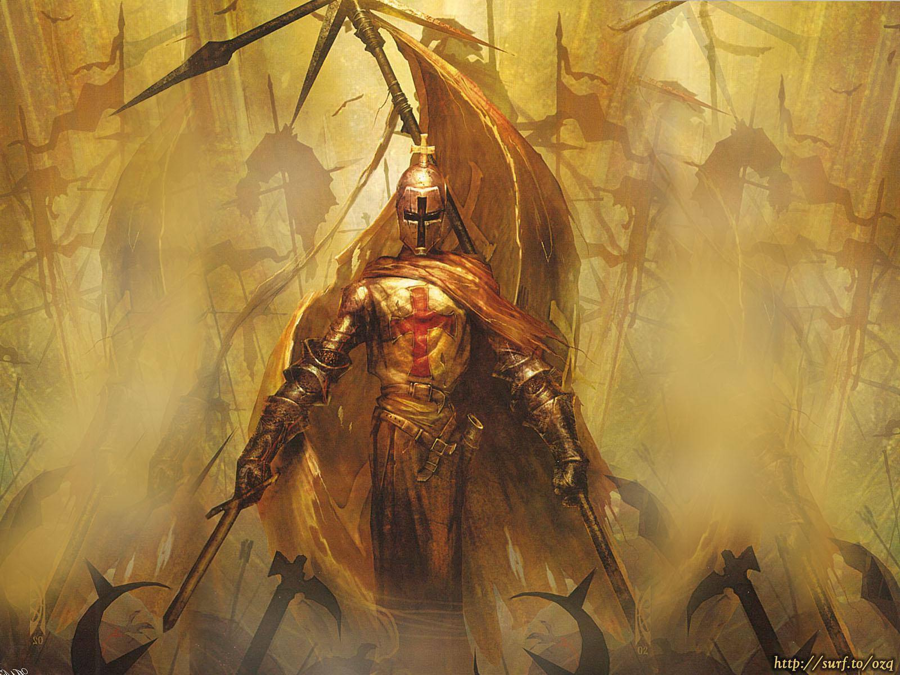{width="6.268055555555556in"
height="4.701042213473316in"}

{width="6.268055555555556in"
height="4.258099300087489in"}

{width="6.268055555555556in"
height="3.5257808398950132in"}

{width="6.268055555555556in"
height="5.847004593175853in"}

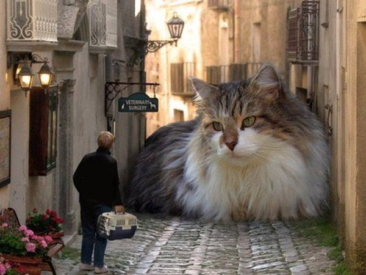{width="6.25in"
height="4.6875in"}\
{width="6.268055555555556in"
height="10.24226924759405in"}

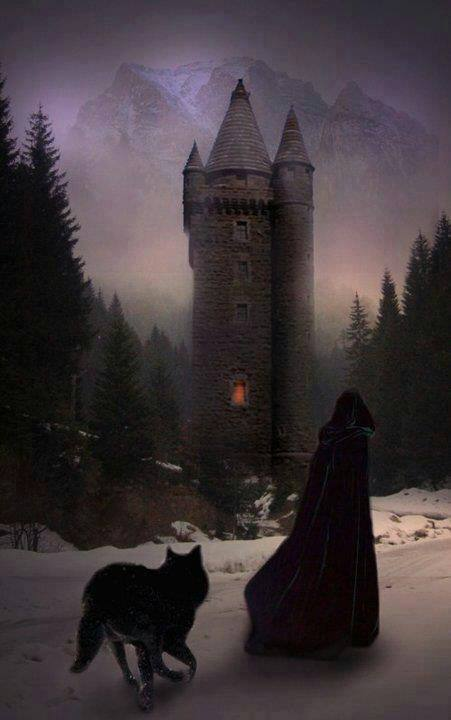{width="4.697916666666667in"
height="7.5in"}

**The Hobbit J.R.R.Tolkien**

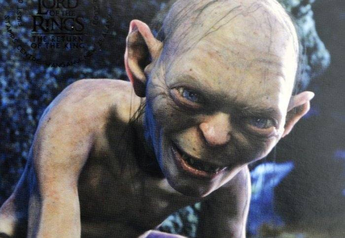{width="6.268055555555556in"
height="4.338275371828521in"}

The story starts with the words \'In a hole in the ground there lived a
hobbit.\' Could you use this as the starting point for your own story?

Imagine that you had a magic ring. What would its power be and how would
you use it?

Imagine that you had the ring and it allowed to you become invisible.
What would you do? Write a story about an adventure that you might have.

Bilbo and Gollum competed against each other to win a riddle-game.
Riddle-games were sacred; if an agreement was reached, the contestants
had to abide by the terms. The terms of this one were that if Bilbo won,
Gollum would show him the way out of the goblins\' cave, but if Gollum
won, he got to eat Bilbo. You will notice that some of the riddles asked
by Bilbo and Gollum as part of the riddle-game were very old, such as
the egg riddle:

A box without hinges, key, or lid,

Yet golden treasure inside is hid.

Some were very difficult, such as the one about the dark. And one Bilbo
made up. It was not, strictly speaking, a riddle at all, but a question.
Gollum, however, accepted it and, as bound by the rules of the game,
lost, although he certainly didn\'t intend to follow the rules.

Asking riddles and reading riddle books are still popular. Students can
create their own riddlegames, using either familiar riddles or ones made
up by the student.

**Harry Potter**

{width="6.268055555555556in"
height="3.5273042432195973in"}

Freewrite about Harry Potter.

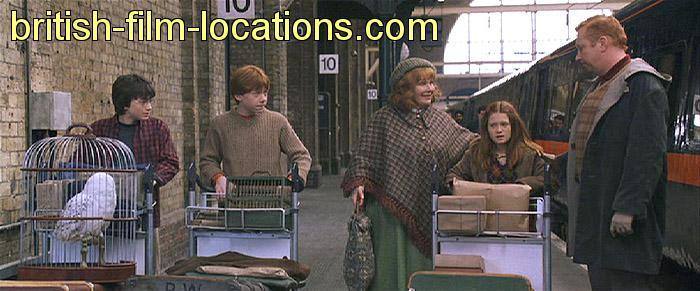{width="6.268055555555556in"
height="2.6057206911636044in"}

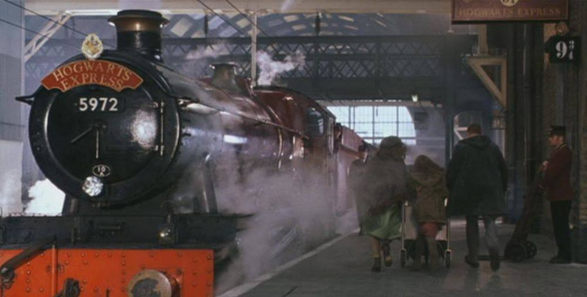{width="6.268055555555556in"
height="3.171636045494313in"}

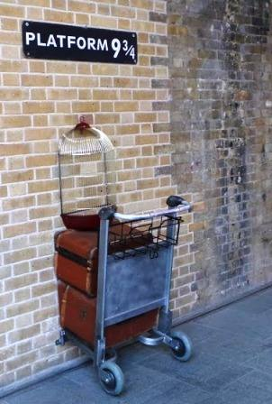{width="3.1458333333333335in"
height="4.666666666666667in"}

Where will Platform 9 ¾ take you?

**The Lion the Witch and the Wardrobe C.S.Lewis**

Through the wardrobe to Narnia.

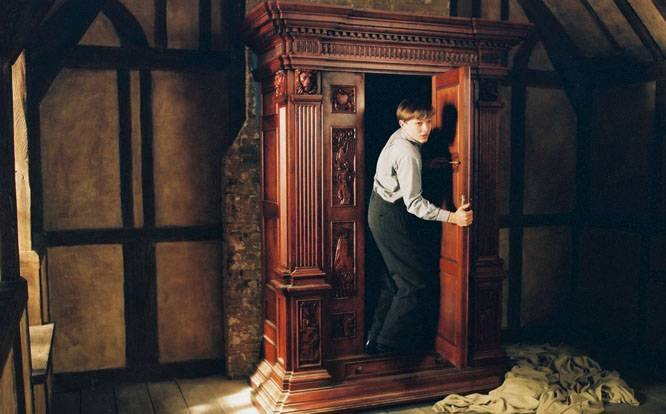{width="6.268055555555556in"
height="3.896359361329834in"}

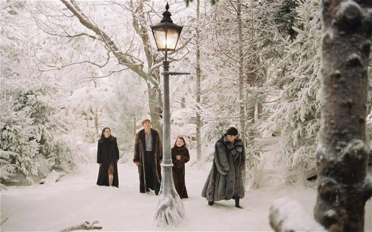{width="6.268055555555556in"
height="3.91248031496063in"}

**The Voyage of the Dawn Treader C.S.Lewis**

Unpleasant, know-it-all bully Eustace Scrubb is transported, along with
his cousins Edmund and Lucy Pevensie, to the magical world of Narnia
through a painting of a ship. Swallowed up by the picture, the three
children find themselves falling into the water beside the Dawn Treader,
a sailing ship built by King Caspian of Narnia for the purpose of
travelling east to find seven missing lords exiled by his evil Uncle
Miraz. Caspian is also searching for the eastern edge of the world
(Narnia is apparently flat) and has brought with him Reepicheep the
Talking Mouse, who, according to a prophecy, will find what he seeks in
the \"utter East.\"

{width="4.0625in"
height="4.0625in"}

Travel into a painting.\
**Coraline Neil Gaiman**

Coraline\'s often wondered what\'s behind the locked door in the drawing
room. It reveals only a brick wall when she finally opens it, but when
she tries again later, a passageway mysteriously appears. Coraline is
surprised to find a flat decorated exactly like her own, but strangely
different. And when she finds her \"other\" parents in this alternate
world, they are much more interesting despite their creepy black button
eyes. When they make it clear, however, that they want to make her
theirs forever, Coraline begins a nightmarish game to rescue her real
parents and three children imprisoned in a mirror. With only a
bored-through stone and an aloof cat to help, Coraline confronts this
harrowing task of escaping these monstrous creatures.

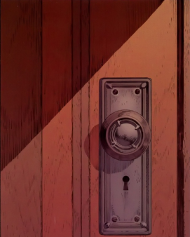{width="2.8229166666666665in"
height="3.5208333333333335in"}

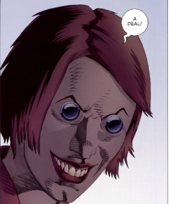{width="2.9583333333333335in"
height="3.5729166666666665in"}

Coraline considered this carefully, then she took the paper and pen and
went off to explore the inside of the flat.

She discovered the hot-water tank (it was in a cupboard in the kitchen).

She counted everything blue (153).

She counted the windows (21).

She counted the doors (14).

Of the doors that she found, thirteen opened and closed. The other, the
big, carved, brown wooden door at the far corner of the drawing room,
was locked.

She said to her mother, \"Where does that door go?\"

\"Nowhere, dear.\"

\"It has to go somewhere.\"

Her mother shook her head. \"Look,\" she told Coraline.

She reached up, and took a string of keys from the top of the kitchen
doorframe. She sorted through them carefully and selected the oldest,
biggest, blackest, rustiest key. They went into the drawing room. She
unlocked the door with the key.

The door swung open.

Her mother was right. The door didn\'t go anywhere. It opened on to a
brick wall.

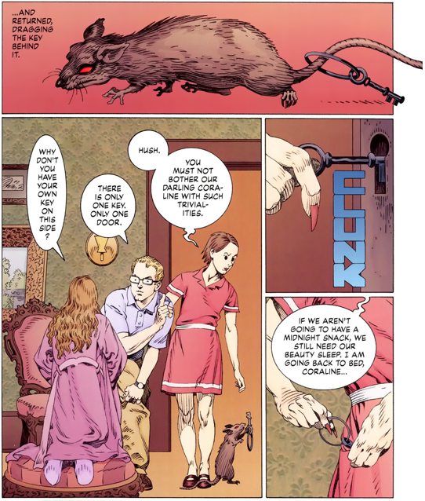{width="5.645833333333333in"
height="6.645833333333333in"}

**Peter Pan**

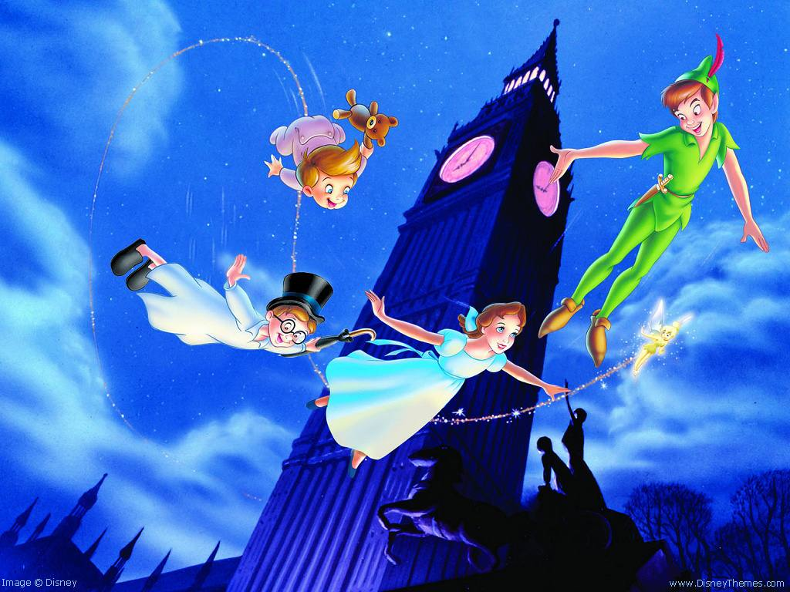{width="6.268055555555556in"
height="4.701042213473316in"}

"The moment you doubt whether you can fly, you cease for ever to be able
to do it."

"So come with me, where dreams are born, and time is never planned. Just
think of happy things, and your heart will fly on wings, forever, in
Never Never Land!"

"She asked where he lived.

Second to the right,\' said Peter, \'and then straight on till morning."

"Tink was not all bad: or, rather, she was all bad just now, but, on the
other hand, sometimes she was all good. Fairies have to be one thing or
the other, because being so small they unfortunately have room for one
feeling only at a time. They are, however, allowed to change, only it
must be a complete change."

"Of all the delectable islands the Neverland is the snuggest and most
compact, not large and sprawly, you know, with tedious distances between
one adventure and another, but nicely crammed. When you play at it by
day with the chairs and table-cloth, it is not in the least alarming,
but in the two minutes before you go to sleep it becomes very nearly
real. That is why there are night-lights. "

"Mrs. Darling loved to have everything just so, and Mr. Darling had a
passion for being exactly like his neighbours; so, of course, they had a
nurse. As they were poor, owing to the amount of milk the children
drank, this nurse was a prim Newfoundland dog, called Nana, who had
belonged to no one in particular until the Darlings engaged her. She had
always thought children important, however, and the Darlings had become
acquainted with her in Kensington Gardens, where she spent most of her
spare time peeping into perambulators, and was much hated by careless
nursemaids, whom she followed to their homes and complained of to their
mistresses. She proved to be quite a treasure of a nurse."

"It was not really Saturday night, at least it may have been, for they
had long lost count of the days; but always if they wanted to do
anything special they said this was Saturday night, and then they did
it."

"All the world is made of faith, and trust, and pixie dust."

"Dreams do come true, if only we wish hard enough. You can have anything
in life if you will sacrifice everything else for it."

"You know that place between sleep and awake, the place where you can
still remember dreaming? That's where I'll always love you. That's where
I'll be waiting."

{width="4.166666666666667in"
height="2.7916666666666665in"}

**Haroun and the Sea of Stories Salman Rushdie**

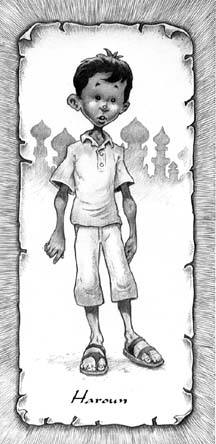{width="1.5833333333333333in"
height="3.2546303587051617in"}

**Quotes**

"Nothing comes from nothing, Thieflet; no story comes from nowhere; new
stories are born from old\--it is the new combinations that make them
new."

"He knew what he knew: that the real world was full of magic, so magical
worlds could easily be real."

"What\'s the use of stories that aren\'t even true?" 

"Peace broke out."

"I always thought storytelling was like juggling \[\...\] You keep a lot
of different tales in the air, and juggle them up and down, and if
you\'re good you don\'t drop any."

"Believe in your own eyes and you\'ll get into a lot of trouble, hot
water, a mess."

"All names mean something."

"Any story worth its salt can handle a little shaking up."

"The black ice of that dark fortress received the sunlight like a mortal
wound."

The source and power of inspiration.

*So Iff the water genie told Haroun about the Ocean of the Stream of
Stories, and even though he was full of a sense of hopelessness and
failure the magic of the Ocean began to have an effect on Haroun. He
looked into the water and saw that it was made up of a thousand thousand
thousand and one different currents, each one a different colour,
weaving in and out of one another like a liquid tapestry of breathtaking
complexity; and Iff explained that these were the Streams of Story, that
each coloured strand represented and contained a single tale. Different
parts of the Ocean contained different sorts of stories, and as all the
stories that had ever been told and many that were still in the process
of being invented could be found here, the Ocean of the Streams of Story
was in fact the biggest library in the universe. And because the stories
were held here in fluid form, they retained the ability to change, to
become new versions of themselves, to join up with other stories and so
become yet other stories; so that unlike a library of books, the Ocean
of the Streams of Story was much more than a storeroom of yarns. It was
not dead, but alive.*

*\"And if you are very, very careful, or very, very highly skilled, you
can dip a cup into the Ocean,\" Iff told Haroun, \"like so,\" and here
he produced a little golden cup from another of his waistcoat pockets,
\"and you can fill it with water from a single, pure Stream of Story,
like so,\" as he did precisely that.*

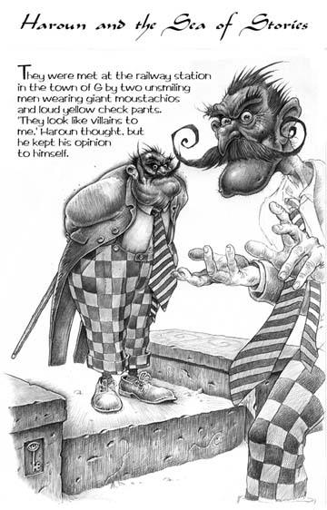{width="2.3887904636920383in"
height="3.7291666666666665in"}

**Inkheart Cornelia Funke**

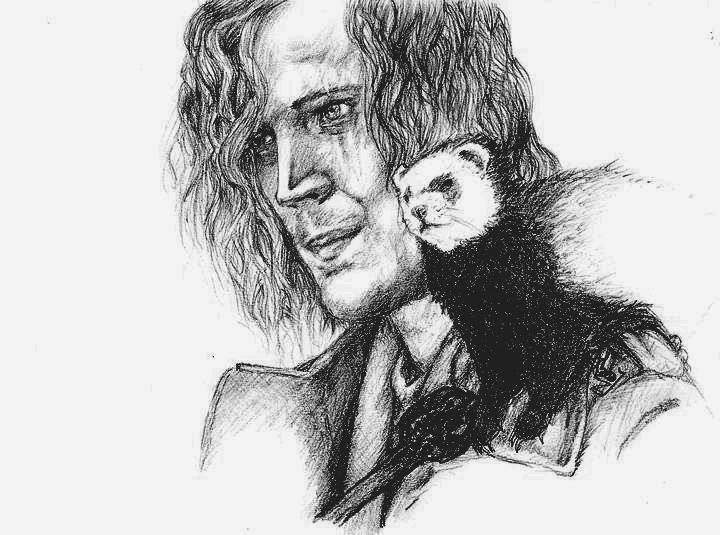{width="5.397197069116361in"
height="4.010416666666667in"}

Mortimer \"Mo\" Folchart raises his thirteen year old daughter Meggie
alone after the disappearance of his wife Resa. He restores books for a
living and travels with Meggie to find an old book called \"Inkheart\"
in antique bookshops in Europe. When he is approached by a weird man
called Dustfinger, she overhears him calling her father
\'Silvertongue\'. Meggie discovers later that he has the ability of
bringing characters out of the books to the real world. They escape from
Dustfinger heading to Italy to Meggie\'s aunt Elinor Loredan\'s manor,
where the men of the evil Capricorn abduct them with the intention of
forcing Mo to bring the powerful Shadow to Earth.

What if you had the power to bring a book to life just by reading it
aloud?

**Quotes from Inkheart**

"Books have to be heavy because the whole world\'s inside them."

"If you take a book with you on a journey,\" Mo had said when he put the
first one in her box, \"an odd thing happens: The book begins collecting
your memories. And forever after you have only to open that book to be
back where you first read it. It will all come into your mind with the
very first words: the sights you saw in that place, what it smelled
like, the ice cream you ate while you were reading it\... yes, books are
like flypaper---memories cling to the printed page better than anything
else."

"Because fear kills everything,\" Mo had once told her. \"Your mind,
your heart, your imagination."

"Books loved anyone who opened them, they gave you secruity and
friendship and didn\'t ask for anything in return; they never went away,
never, not even when you treated them badly. "

"It\'s a good idea to have your own books with you in a strange place"

"Sometimes, when you're sad you don't know what to do, it helps to be
angry. But then the tears come back again all the same, and you fall
asleep with the salty taste of them on your lips."

"The sea always filled her with longing, though for what she was never
sure."

"You know a great many things in dreams, often despite the evidence of
your eyes. You just know them."

"Writing stories is a kind of magic, too."

"Sometimes it\'s a good thing we don\'t remember things half as well as
books do."

"There was another reason \[she\] took her books whenever they went
away. They were her home when she was somewhere strange. They were
familiar voices, friends that never quarrelled with her, clever,
powerful friends \-- daring and knowledgeable, tried and tested
adventurers who had travelled far and wide. Her books cheered her up
when she was sad and kept her from being bored."

"Her curiosity was too much for her. She felt almost as if she could
hear the books whispering on the other side of the half-open door. They
were promising her a thousand unknown stories, a thousand doors into
worlds she had never seen before."

"Nothing is more frightening than a fear you cannot name."

"You know, it\'s a funny thing about writers. Most people don\'t stop to
think of books being written by people much like themselves. They think
that writers are all dead long ago\--they don\'t expect to meet them in
the street or out shopping. They know their stories but not their names,
and certainly not their faces. And most writers like it that way."

"The books in Mo and Meggie\'s house were stacked under tables, on
chairs, in the corners of the rooms. There where books in the kitchen
and books in the lavatory. Books on the TV set and in the closet, small
piles of books, tall piles of books, books thick and thin, books old and
new. They welcomed Meggie down to breakfast with invitingly opened
pages; they kept boredom at bay when the weather was bad. And sometimes
you fall over them."

"Perhaps there\'s another, much larger story behind the printed one, a
story that changes just as our own world does. And the letters on the
page tell us only as much as we\'d see peering through a keyhole.
Perhaps the story in the book is just the lid on a pan: It always stays
the same, but underneath there\'s a whole world that goes on -
developing and changing like our own world."

"Mo could paint pictures in the empty air with his voice alone."

"You know what they say: When people start burning books they\'ll soon
burn human beings."

"Books are like flypaper, memories cling to the printed pages better
than anything else."

"It \[the book\] was spinning a magic spell around her heart, sticky as
a spider\'s web and enchantingly beautiful.."

"The book she had been reading was under her pillow, pressing its cover
against her ear as if to lure her back into its printed pages."

"The night swallowed him up like a thieving fox."

**Quotes from Inkspell**

"Stories never really end\...even if the books like to pretend they do.
Stories always go on. They don\'t end on the last page, any more than
they begin on the first page."

"Isn\'t it odd how much fatter a book gets when you\'ve read it several
times?\" Mo had said\...\"As if something were left between the pages
every time you read it. Feelings, thoughts, sounds, smells\...and then,
when you look at the book again many years later, you find yourself
there, too, a slightly younger self, slightly different, as if the book
had preserved you like a pressed flower\...both strange and familiar."

"So what? All writers are lunatics!"

"This book taught me, once and for all, how easily you can escape this
world with the help of words! You can find friends between the pages of
a book, wonderful friends."

"a book always keeps something of its owner between its pages."

"If you keep pretending you\'re in that book, it will make you not want
to live in the life you\'re in."

"believe me. Sometimes when life looks to be at its grimmest, there\'s a
light hidden at the heart of things. Clive Barker, Abarat"

"What are stories for if we don\'t learn from them?"

**Quotes from Inkdeath**

"Hope. Nothing is more intoxicating."

"you can not fully read a book without being alone. But through this
very solitude you become intimately involved with people whom you might
never have met otherwise, either because they have been dead for
centuries or because they spoke languages you cannot understand. And,
nonetheless, they have become your closest friends, your wisest
advisors, the wizards that hypnotize you, the lovers you have always
dreamed of.

-Antonio munoz molinas, \"the power of the pen"

"A reader doesn\'t really see the characters in a story; he feels them."

"Nothing is more terrifying than fearlessness."

**Others from Cornelia Funke**

"Which of us has not felt that the character we are reading in the
printed page is more real than the person standing beside us?"

"When you open a book it\'s like going to the theatre first you see the
curtain then it is pulled aside and the show begins."

"Read -- and be curious. And if somebody says to you: \'Things are this
way. You can\'t change it\' - don\'t believe a word."

"I pledge to set out to live a thousand lives between printed pages.

I pledge to use books as doors to other minds, old and young, girl and
boy, man and animal.

I pledge to use books to open windows to a thousand different worlds and
to the thousand different faces of my own world.

I pledge to use books to make my universe spread much wider than the
world I live in every day.

I pledge to treat my books like friends, visiting them all from time to
time and keeping them close."

"Reality is a fragile thing."

"Believe, believe, believe"

"Words,words filled the night like the fragrance of invisible flowers."

**A Wrinkle in Time**

In the story, Mrs Who and Charles Wallace explain to Meg that they will
be travelling by \"wrinkling time\" through a tesseract.

In the novel, the tesseract functions more or less like what in modern
science-fiction is called a space warp or a wormhole, a portal from one
area of space to another which is possible through the bending of the
structure of the space-time continuum.

Tesseract into another world.

{width="6.268055555555556in"
height="3.528244750656168in"}\
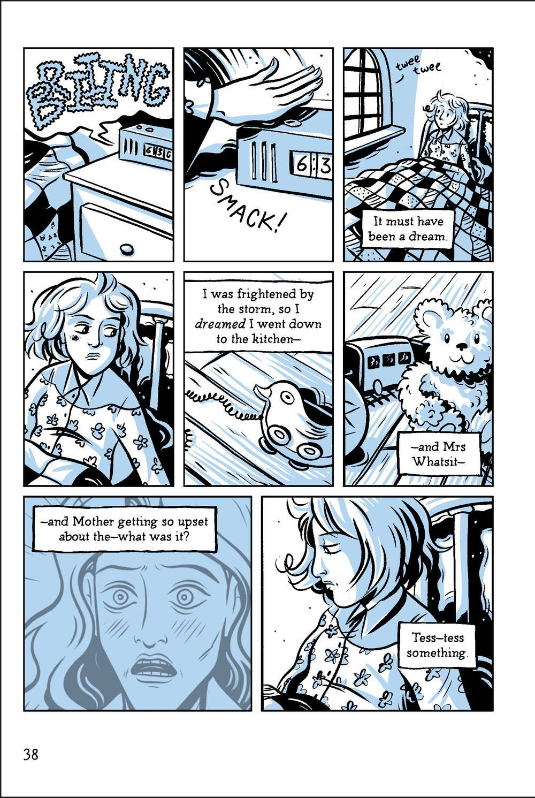{width="6.268055555555556in"
height="9.34567038495188in"}

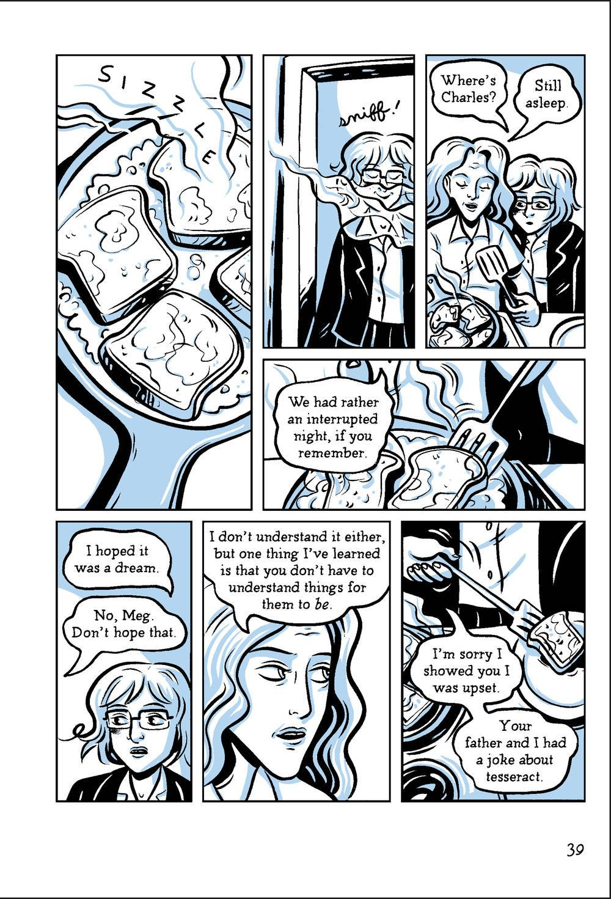{width="6.268055555555556in"
height="9.22030949256343in"}

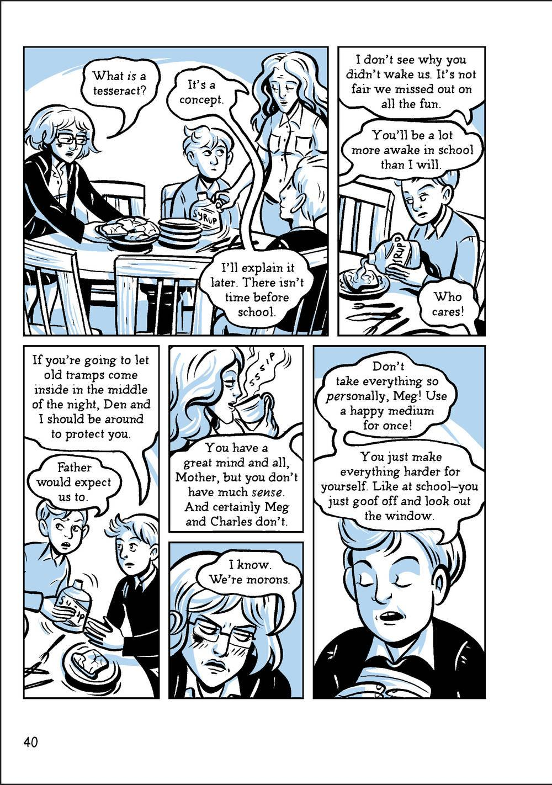{width="6.268055555555556in"
height="8.913174759405074in"}

**A Wrinkle in Time Madeleine L'Engle**

The Man with Red Eyes Chapter 7

We knew we were going to be in danger," Charles Wallace said. "Mrs
Whatsit told us that."

"Yes, and she told us that it was going to be worse for you than for Meg
and me, and that you must be careful. You stay right here with Meg, old
sport, and let me go in and case the joint and then report to you."

"No," Charles Wallace said firmly. "She told us to stay together. She
told us not to go off by ourselves."

"She told you not to go off by yourself. I'm the oldest and I should go
in first."

"No," Meg's voice was flat. "Charles is right, Cal. We have to stay
together. Suppose you didn't come out and we had to go in after you?
Unh-unh. Come on. But let's hold hands if you don't mind."

Holding hands, they crossed the square. The huge CENTRAL Central
Intelligence Building had only one door, but it was an enormous one, at
least two storeys high and wider than a room, made of a dull, bronzelike
material.

"Do we just knock?" Meg giggled.

Calvin studied the door. "There isn't any handle or knob or latch or
anything. Maybe there's another way to get in."

"Let's try knocking anyway," Charles said. He raised his hand, but
before he touched the door it slid up from the top and to each side,
splitting into three sections that had been completely invisible a
moment before. The startled children looked into a great entrance hall
of dull, greeny marble. Marble benches lined three of the walls. People
were sitting there like statues. The green of the marble reflecting on
their faces made them look bilious. They turned their heads as the door
opened, saw the children, looked away again.

"Come on," Charles said, and, still holding hands, they stepped in. as
they crossed the threshold the door shut silently behind them. Meg
looked at Calvin and Charles and they, like the waiting people, were a
sickly green.

The children went up to the blank fourth wall. It seemed unsubstantial,
as though one might almost be able to walk through it. Charles put out
his hand. "It's solid, and icy cold."

Calvin touched it, too. "Ugh."

Meg's left hand was held by Charles, her right by Calvin, and she had no
desire to let go either of them to touch the wall.

"Let's ask somebody something." Charles led them over to one of the
benches. "Er, could you tell us what's the procedure around here?" he
asked one of the men. The men all wore nondescript business suits, and
though their features were as different one from the other as the
features of men on earth, there was also a sameness to them.

-Like the sameness of people riding in a subway, Meg thought -- Only on
a subway every once in a while there's somebody different and here there
isn't.

The man looked at the children warily. "The procedure for what?"

"How do we see whoever's in authority?" Charles asked.

"You present your papers to the A machine. You ought to know that," the
man said severely.

"Where is the A machine?" Calvin asked.

The man pointed to the blank wall.

"But there isn't a door or anything," Calvin said. "How do we get in?"

"You put you S papers in the B slot," the man said. "Why do you ask me
these stupid questions? Do you think I don't know the answers? You'd
better not play any games around here or you'll have to go through the
Process machine again and you don't want to do that."

"We're strangers here," Calvin said. "That's why we don't know about
things. Please tell us, sir, who you are and what you do."

"I run a number-one spelling machine on the second-grade level."

"But what are you doing here now?" Charles Wallace asked.

"I am here to report that one of my letters is jamming, and until it can
be properly oiled by an F Grade oiler there is danger of jammed minds."

"Strawberry jam or raspberry?" Charles Wallace murmured. Calvin looked
down at Charles and shook his head warningly. Meg gave the little boy's
hand a slight, understanding pressure. Charles Wallace, she was quite
sure, was not trying to be rude or funny, it was his way of whistling in
the dark.

The man looked at Charles sharply. "I think I shall have to report you.
I'm fond of children, due to the nature of my work and I don't like to
get them in trouble, but rather than run the risk myself of reprocessing
I must report you."

"Maybe that's a good idea," Charles said. "Who do you report us to?"

"To whom to I report you?"

"Well. To whom, then. I'm not on the second-grade level yet."

-I wish he wouldn't act so sure of himself, Meg thought, looking
anxiously at Charles and holding his hand more and more tightly until he
wriggled his fingers in protest. That's what Mrs Whatsit said he had to
watch, being proud -- Don't, please don't, she thought hard at Charles
Wallace. She wondered if Calvin realised that a lot of the arrogance was
bravado.

The man stood up, moving jerkily as though he had been sitting for a
long time. "I hope he isn't to hard on you," he murmured as he led the
children towards the empty fourth wall. "But I've been reprocessed once
and that was more than enough. And I don't want to get sent to IT. I've
never been sent to IT and I can't risk having that happen."

There was IT again. What was this IT?

The man took from his pocket a folder filled with papers of every
colour. He shuffled through them carefully, finally withdrawing one.
"I've had several reports to make lately. I shall have to ask for a
requisition for more A-21 cards."' He took the card and put it against
the wall. It slid through the marble, as though it were being sucked in,
and disappeared. "You may be detained for a few days," the man said,
"but I'm sure they won't be too hard on you because of your youth. Just
relax and don't fight and it will be much easier for you." he went back
to his seat, leaving the children standing and staring at the blank
wall.

And suddenly the wall was no longer there and they were looking into an
enormous room lined with machines. They were not unlike the great
computing machines Meg had seen in her science books and that she knew
her father sometimes worked with. Some did not seem to be in use; in
others lights were flickering on and off. In one machine a long tape was
being eaten; in another a series of dot-dashes were being punched.
Several white-robed attendants were moving about, tending the machines.
If they saw the children they gave no sign.

Calvin muttered something.

"What?" Meg asked him.

"There is nothing to fear except fear itself," Calvin said. "I'm
quoting. Like Mrs Who. Meg, I'm scared stiff."

"So 'm I." Meg held his hand more tightly.

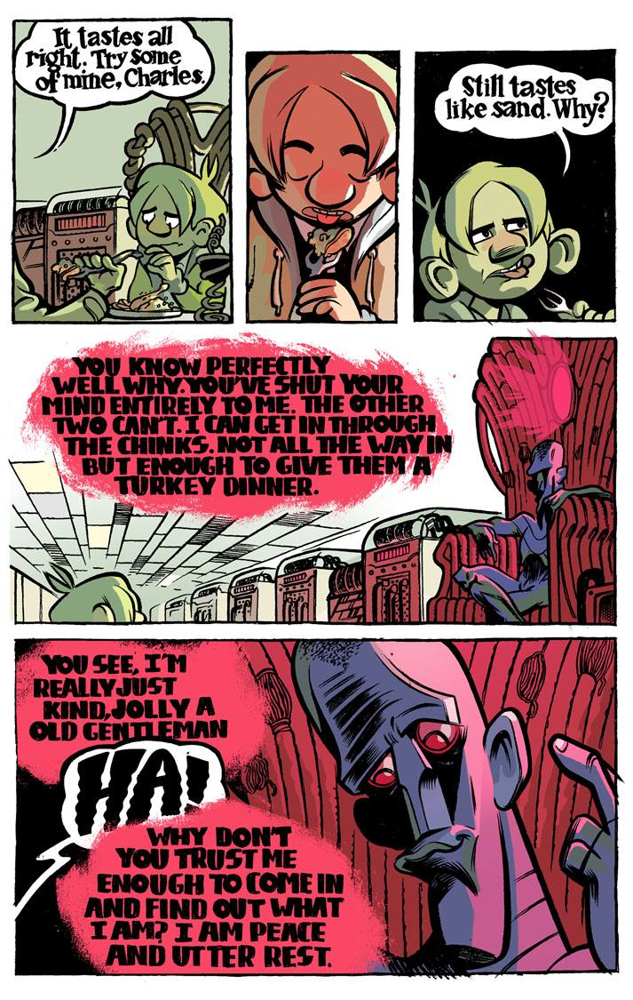{width="6.268055555555556in"
height="9.889989063867016in"}\
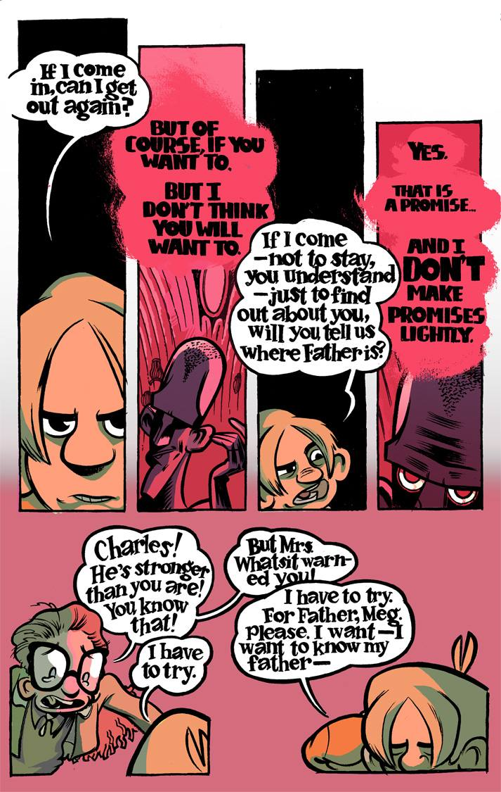{width="6.268055555555556in"
height="9.889989063867016in"}

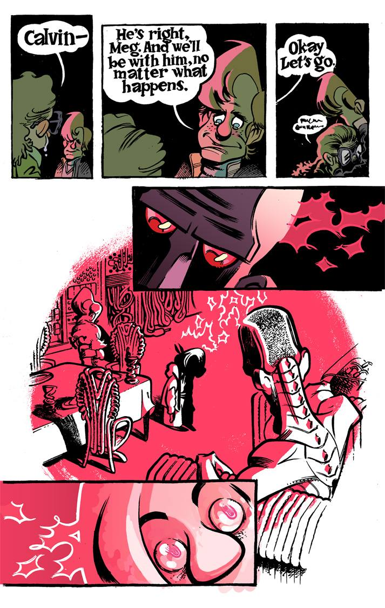{width="6.268055555555556in"
height="9.889989063867016in"}

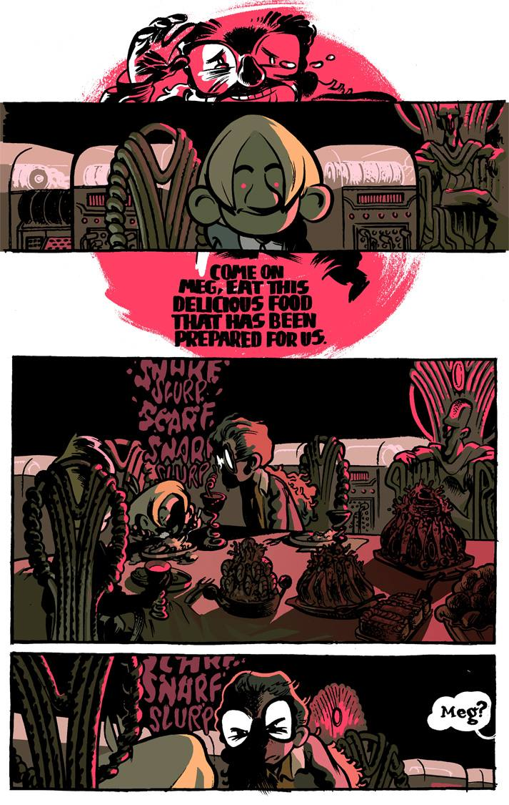{width="6.268055555555556in"
height="9.889989063867016in"}

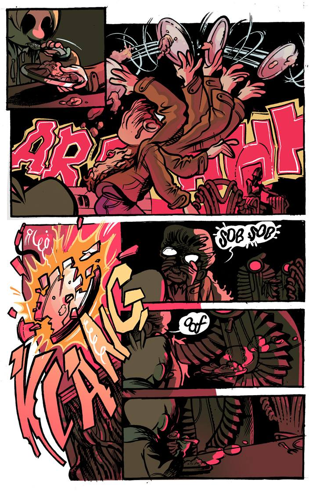{width="6.268055555555556in"
height="9.889989063867016in"}

**The Golden Compass Philip Pullman**

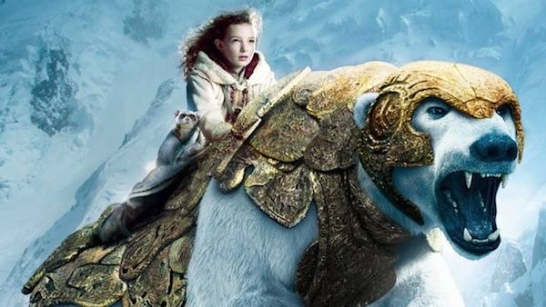{width="6.25in"
height="3.5208333333333335in"}

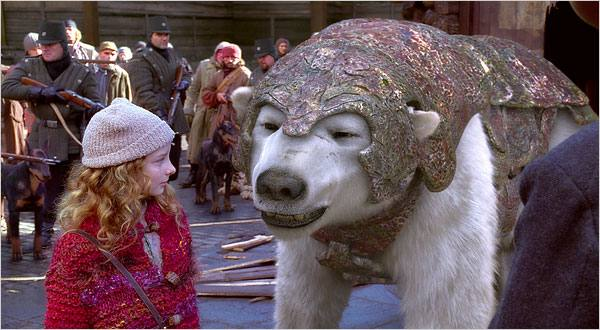{width="6.25in"
height="3.4375in"}

**\**

{width="4.791666666666667in"
height="2.875in"}

Here lives an orphaned ward named Lyra Belacqua, whose carefree life
among the scholars at Oxford\'s Jordan College is shattered by the
arrival of two powerful visitors. First, her fearsome uncle, Lord
Asriel, appears with evidence of mystery and danger in the far North,
including photographs of a mysterious celestial phenomenon called Dust
and the dim outline of a city suspended in the Aurora Borealis that he
suspects is part of an alternate universe. He leaves Lyra in the care of
Mrs. Coulter, an enigmatic scholar and explorer who offers to give Lyra
the attention her uncle has long refused her. In this multilayered
narrative, however, nothing is as it seems. Lyra sets out for the top of
the world in search of her kidnapped playmate, Roger, bearing a rare
truth-telling instrument, the compass of the title. All around her
children are disappearing---victims of so-called \"Gobblers\"---and
being used as subjects in terrible experiments that separate humans from
their daemons, creatures that reflect each person\'s inner being. And
somehow, both Lord Asriel and Mrs. Coulter are involved.

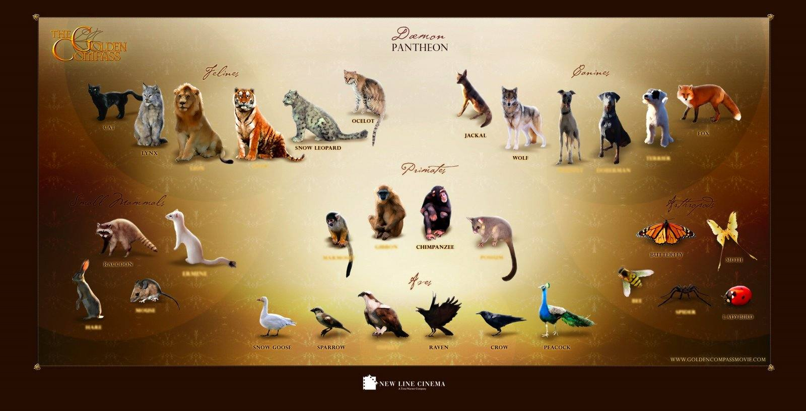{width="6.552705599300087in"
height="3.3541666666666665in"}

In The Golden Compass, daemons are more or less your soul worn on your
sleeve. They appear as talking animal friends that accompany you
wherever you go. As Philip Pullman once said, characters are \"able to
talk to their daemons, much like talking to yourself \[...\] Like having
a conversation with your conscience or your memory\"

Everyone has a daemon, but children\'s daemons can shape-shift to be any
animal. When a child goes through puberty, his or her daemon settles
into one permanent shape. This seems to symbolise how, as we get older,
our personality solidifies and settles. We gain a more distinct identity
than we had as a kid.

Daemons are one of the most striking, charming, and powerful images in
The Golden Compass.

*What sort of dæmons might your friends, relatives, or classmates, or
have? Describe your own dæmon.\*

**Where the Wild Things Are**

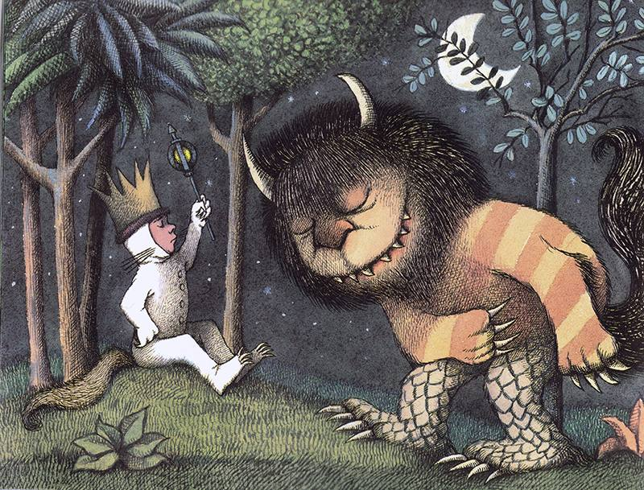{width="6.268055555555556in"
height="4.777726377952756in"}

**Retell** using the following guide:

- Max is playing

- Max is sent to his room

- Max begins his journey

- Max arrives at the Land of the Wild Things

- Max stands up to the Wild Things

- Max is made King

- Max organises the Wild Rumpus

- Max sends everyone to bed

- Max decides to return home

- Max is back in his bedroom

**Explore the following Themes:**

- Parental love

- The nature of our emotions

- Power and control

- Resolving conflict

- Empathy for others' feelings

- Taking responsibility for our actions

Maurice Sendak has left four pages of Wild Rumpus-ing without text. Have
students write dialogue and story for these four pages.

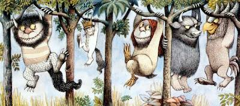{width="4.166666666666667in"
height="1.84375in"}

**Where The Wild Things Are Maurice Sendak**

The night wore his wolf suit and made mischief of one kind and another

his mother called him "WILD THING!" and Max said "I'LL EAT YOU UP!"

so he was sent to bed without eating anything.

That very night in Max's room a forest grew and grew and grew until his
ceiling hung with vines and the walls became the world all around and an
ocean tumbled by with a private boat for Max and he sailed off through
night and day and in and out of weeks

and almost over a year to where the wild things are.

And when he came to the place where the wild things are they roared
their terrible roars and gnashed their terrible teeth and rolled their
terrible eyes and showed their terrible claws till Max said "BE STILL!"
and tamed with the magic trick of staring into all their yellow eyes
without blinking once and they were frightened and called him the most
wild thing of all and made him king of all wild things.

"And now," cried Max, "let the wild rumpus start!"

"Now stop!" Max said and sent the wild things off to bed without their
supper.

And Max the king of all wild things was lonely and wanted to be where

someone loved him best of all.

Then all around from far away across the world he smelled good things to
eat

so he gave up being king of where the wild things are.

But the wild things cried, "Oh please don't go we'll eat you up-we love
you so!"

And Max said, "No!"

The wild things roared their terrible roars and gnashed their terrible
teeth and rolled their terrible eyes and showed their terrible claws but
Max stepped into his private boat and waved good-bye and sailed back
over a year and in and out of weeks and through a day and into the night
of his very own room where he found his supper waiting for him

and it was still hot.

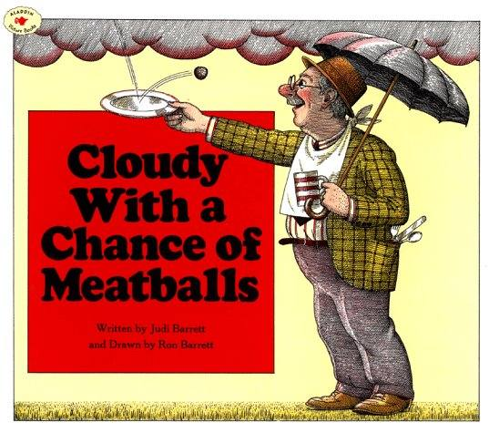{width="5.59375in"
height="4.947916666666667in"}

Would you like to live in a place where it rains food and juice? Explain
your

answer.

\"The Worst Weather I Ever Experienced\"---

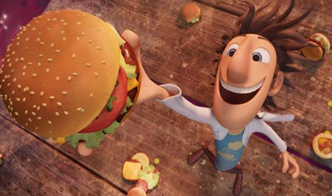{width="5.829861111111111in"
height="3.4340277777777777in"}

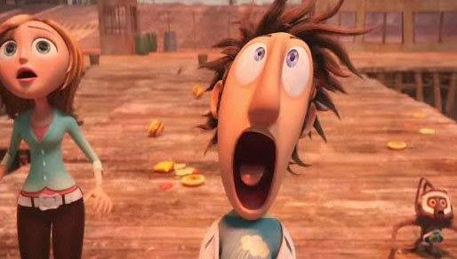{width="5.861111111111111in"
height="3.3182556867891515in"}

**Cloudy With a Chance of Meatballs** **Judi Barrett**

We were all sitting around the big kitchen table. It was Saturday
morning. Pancake morning. Mum was squeezing oranges for juice. Henry and
I were betting on how many pancakes we each could eat. And Grandpa was
doing the flipping.

Seconds later, something flew through the air headed toward the kitchen
ceiling... and landed right on Henry.

After we realised that the flying object was only a pancake, we all
laughed, even Grandpa. Breakfast continued quite uneventfully. All the
other pancakes landed in the pan. And all them were eaten, even the one
that landed on Henry.

That night, touched off by the pancake incident at breakfast, Grandpa
told us the best tall-tale bedtime story he'd ever told.

"Across an ocean, over lots of huge bumpy mountains, across three hot
deserts, and one smaller ocean...there lay the tiny town of
Chewandswallow. In most ways, it was very much like any other tiny town.
It had a Main Street lined with stores, houses with trees and gardens
around them, a schoolhouse, about three hundred people, and some
assorted cats and dogs. But there were no food stores in the town of

Chewandswallow. They didn't need any. The sky supplied all the food they
could possibly want. The only thing that was really different about

Chewandswallow was its weather. It came three times a day, at breakfast,
lunch and dinner. Everything that everyone ate came from the sky.
Whatever the weather served, that was what they ate. But it never rained
rain. It never snowed snow.

And it never blew just wind. It rained things like soup and juice. It
snowed mashed potatoes and green peas. And sometimes the wind blew in
storms of hamburgers.

The people could watch the weather report on television in the morning
and they would even hear a prediction for the next day's food. When the
townspeople went outside, they carried their plates, cups, glasses,
forks, spoons, knives and

napkins with them. That way they would always be prepared for any kind
of weather.

If there were leftovers, and there usually were, the people took them
home and put them in their refrigerators in case they got hungry between
meals.

The menu varied.

By the time they woke up in the morning, breakfast was coming down.
After a brief shower of orange juice, low clouds of sunny-side up eggs
moved in followed by pieces

of toast. Butter and jelly sprinkled down for the toast. And most of the
time it rained milk afterwards. For lunch one day, frankfurters, already
in their rolls, blew in from the northwest at about five miles an hour.
There were mustard clouds nearby. Then the wind shifted to the east and
brought in baked beans. A drizzle of soda finished off the meal.

Dinner one night consisted of lamb chops, becoming heavy at times, with
occasional ketchup. Periods of peas and baked potatoes were followed by
gradual clearing, with a wonderful Jell-O setting in the west.

The Sanitation Department of Chewandswallow had a rather unusual job for
a sanitation department. It had to remove the food that fell on the
houses and

sidewalks and lawns. The workers cleaned things up after every meal and
fed all the dogs and cats. Then they emptied some of it into the
surrounding oceans for the fish and turtles and whales to eat. The rest
of the food was put back into the earth so that the soil would be richer
for the people's flower gardens.

Life for the townspeople was delicious until the weather took a turn for
the worse.

One day there was nothing but Gorgonzola cheese all day long.

The next day there was only broccoli, all overcooked.

And the next day there were brussel sprouts and peanut butter with
mayonnaise.

Another day there was a pea soup fog. People could not see where they
were going and they could barely find the rest of the meal that got
stuck in the fog.

The food was getting larger and larger, and so were the portions. The
people were getting frightened. Violent storms blew up frequently. Awful
things were happening.

One Tuesday there was a hurricane of bread and rolls all day long and
into the night. There were soft rolls and hard rolls, some with seeds
and some without. There was white bread and rye and whole wheat toast.
Most of it was larger than they had ever

seen bread and rolls before. It was a terrible day. Everyone had to stay
indoors. Roofs were damaged, and the Sanitation Department was beside
itself. The

mess took the workers four days to clean up, and the sea was full of
floating rolls.

To help out, the people piled up as much bread as they could in their
backyards. The birds picked at it a bit, but it just stayed there and
got staler and staler.

There was a storm of pancakes one morning and a downpour of maple syrup
that nearly flooded the town. A huge pancake covered the school. No one
could get it off because of its weight, so they had to close the school.

Lunch one day brought fifteen-inch drifts of cream cheese and jelly
sandwiches. People ate themselves sick and the day ended with a
stomachache.

There was an awful salt and pepper wind accompanied by an even worse
tomato tornado. People were sneezing themselves silly and running to
avoid the tomatoes. The town was a mess. There were seeds and pulp
everywhere.

The Sanitation Department gave up. The job was too big.

People feared for their lives. They couldn't go outside most of the
time. Many houses had been badly damaged by giant meatballs, stores were
boarded up and there was no more school for the children.

So a decision was made to abandon the town of Chewandswallow.

It was a matter of survival. The people glued together the giant pieces
of stale bread sandwich-style with peanut butter, took the absolute
necessities with them, and set sail on their rafts for a new land.

After being afloat for a week, they finally reached a small coastal
town, which welcomed them. The bread had held up surprisingly well, well
enough for them to build temporary houses for themselves out of it.

The children began school again, and the adults all tried to find places
for themselves in the new land.

The biggest change they had to make was getting used to buying food at a
supermarket. They found it odd that the food was kept on the shelves,
packaged

in boxes, cans and bottles. Meat that had to be cooked was kept in large
refrigerators. Nothing came down from the sky except rain and snow. The
clouds above their heads were not made of fried eggs. No one ever got
hit by a hamburger again. And nobody dared to go back to Chewandswallow
to find out what had happened to it.

They were too afraid."

Henry and I were awake until the very end of Grandpa's story. I remember
his goodnight kiss.

The next morning we woke up to see snow falling outside our window. We
ran downstairs for breakfast and ate it a little faster than usual so we
could go sledding with Grandpa.

It's funny, but even as we were sliding down the hill we thought we saw
a giant pat of butter at the top, and we could almost smell mashed
potatoes.

**Mary Poppins P.L.Travers**

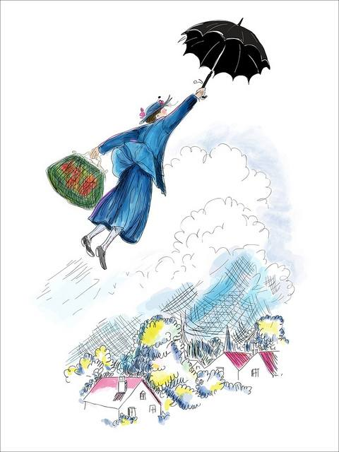{width="3.6875in"
height="4.916666666666667in"}

**Mary Poppins Quotes**

"Don\'t you know that everybody\'s got a Fairyland of their own?"

"There was something strange and extraordinary about her -- something
that was frightening and at the same time most exciting."

"He knew, the moment he opened his eyes, that something was wrong but he
was not quite sure what it was."

"And all the time he was enjoying his badness, hugging it to him as
though it were a friend, and not caring a bit."

"Michael, \"I never expected the wish to come true.\"

\"How funny! I\'ve never seen that happen before,\" said Michael.

In every job that must be done, there is an element of fun. You find the
fun, and - SNAP - the job\'s a game!

**Charlotte's Web**

Text-to-Self:

Making new friends

Making a new friend can be difficult and a little scary, but it is
something we all experience. Remember a time when you were in a new
situation surrounded by people you did not know. Reflect on the
situation.

Think about:

• How did you feel?

• Were the people around you kind and welcoming or mean and unfriendly?

• How did that affect your attitude?

• Why can it be scary to meet new people and make new friends?

• Why is it important to welcome others when they are in a new
situation?

Read Aloud

Charlotte stood quietly over the fly, preparing to eat it. Wilbur lay
down and closed his eyes. He was tired from his wakeful night and from
the excitement of meeting someone for the first time. A breeze brought
him the smell of clover---the sweet-smelling world beyond his fence.

"Well," he thought, "I've got a new friend, all right! But what a gamble
friendship is! Charlotte is fierce, brutal, scheming,
bloodthirsty---everything I don't like. How can I learn to like her,
even though she is pretty and, of course, clever?"

Wilbur was merely suffering the doubts and fears that often go with
finding a new friend. In good time he was to discover that he was
mistaken about Charlotte. Underneath her rather bold and cruel exterior,
she had a kind heart, and she was to prove loyal and true to the very
end.

Did you ever have an experience like this, in which you thought of a
person as

mean or strange or scary at first, but later found out that he or she
was very nice?

• Can you learn to like someone you originally disliked? How?

• What do you think the speaker means by "What a gamble friendship is!"
(p. 41)? How can friendship be a gamble?

• What happens when people draw conclusions based on first impressions?

**Quote:**

"Friendship is one of the most satisfying things in the world." (page
115)

Respond with your thoughts.

• How can a friendship be satisfying?

• What makes a friendship so enjoyable?

• Is friendship always easy? Does it make a friendship better or worse
when friends face difficulties?

• There are many types of friendships. List different types (for
example,

friendships in the neighbourhood, school friends, friendships between
siblings,

friends from different out-of-school activities). How are these types of

friendships different from each other?

• In your experience, what is the most satisfying type of friendship?
Does that

mean all the other types are not important?

**The power of helping others:**

Before Charlotte dies, she and Wilbur have one last important
conversation. They discuss their friendship and why Charlotte spent so
much time and effort helping Wilbur. At one point, Charlotte tells her
friend. "By helping you, perhaps I was trying to lift up my life a
little. Heaven knows anyone's life can stand a little of that" (p. 164).
What does Charlotte mean by this statement? How can helping a friend
"lift up" the helper's life?

Templeton is a character who would not understand Charlotte's statement
at all. "The rat had no morals, no conscience, no scruples, no
consideration, no decency, no milk of rodent kindness, no compunctions,
no higher feeling, no friendliness, no anything" (p. 46). What would the
barn be like if all the animals were like Templeton?

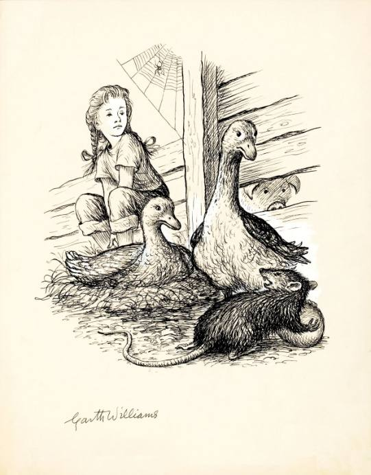{width="2.4602077865266843in"
height="3.144034339457568in"}

**Write about one of the illustrations**

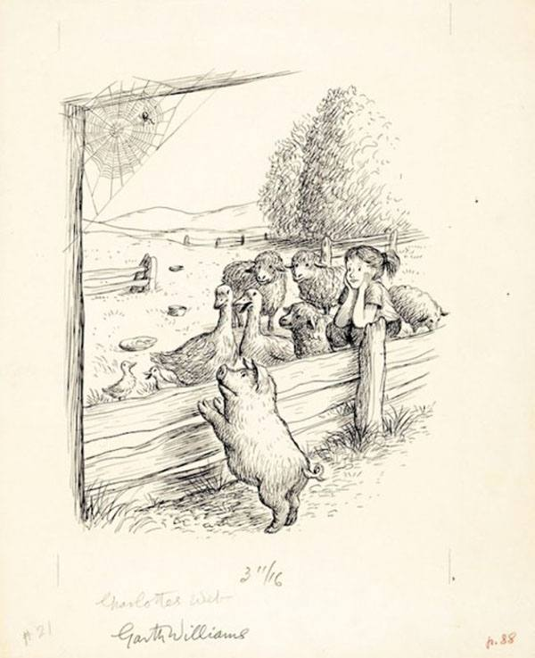{width="6.25in"
height="7.677083333333333in"}

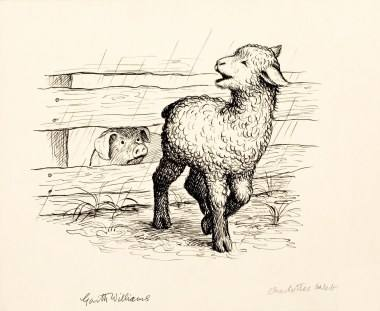{width="3.9583333333333335in"
height="3.2395833333333335in"}

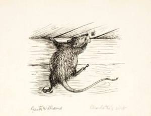{width="3.125in"
height="2.40625in"}

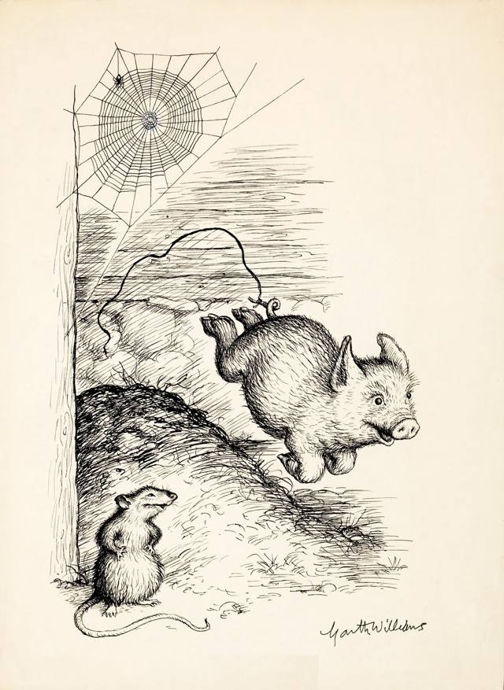{width="6.268055555555556in"
height="8.581461067366579in"}

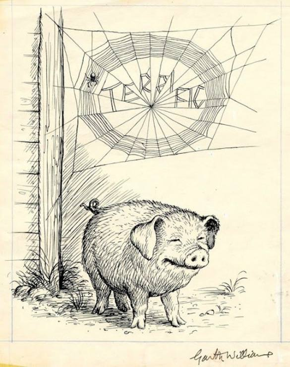{width="6.094444444444444in"
height="7.716666666666667in"}

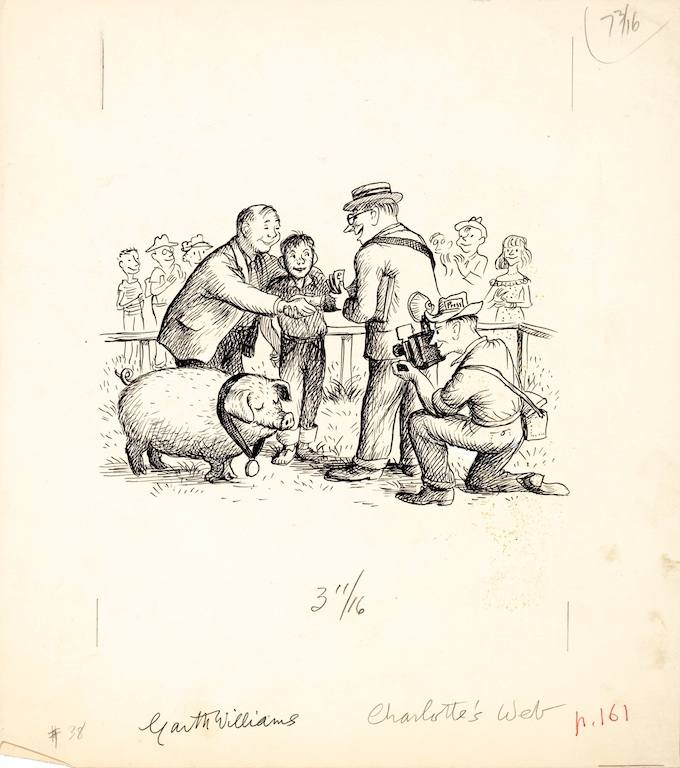{width="6.268055555555556in"
height="7.079215879265091in"}

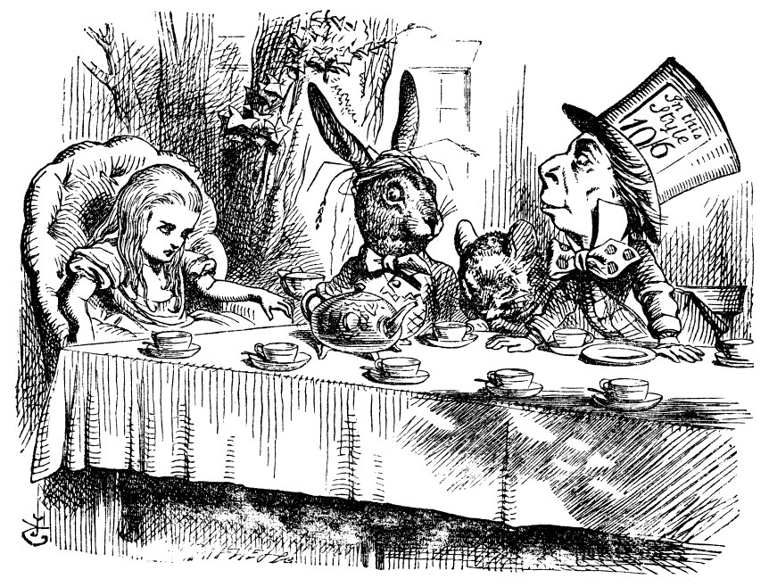{width="6.268055555555556in"
height="4.786462160979878in"}

**The Mad Hatter's Tea Party**

What was the strangest thing that ever happened to you? What made it
strange?

Imagine the most "curious party" you can. Who would you invite? What
would you do? What would make it curious?

What can you do with time? (Think of all the terms we use: waste it,
spend it, kill it, etc.). Are there better or worse things to do with
it?

The Mad Hatter personifies Time. How would you personify time?

Is the Hatter being rude? What is rudeness?

# Chapter VII

## A Mad Tea Party

There was a table set out under a tree in front of the house, and the
March Hare and the Hatter were having tea at it: a Dormouse was sitting
between them, fast asleep, and the other two were using it as a cushion,
resting their elbows on it, and the talking over its head. \`Very
uncomfortable for the Dormouse,\' thought Alice; \`only, as it\'s
asleep, I suppose it doesn\'t mind.\'

The table was a large one, but the three were all crowded together at
one corner of it: \`No room! No room!\' they cried out when they saw
Alice coming. \`There\'s **PLENTY** of room!\' said Alice indignantly,
and she sat down in a large arm-chair at one end of the table.

\`Have some wine,\' the March Hare said in an encouraging tone.

Alice looked all round the table, but there was nothing on it but tea.
\`I don\'t see any wine,\' she remarked.

\`There isn\'t any,\' said the March Hare.

\`Then it wasn\'t very civil of you to offer it,\' said Alice angrily.

\`It wasn\'t very civil of you to sit down without being invited,\' said
the March Hare.

\`I didn\'t know it was *YOUR* table,\' said Alice; \`it\'s laid for a
great many more than three.\'

\`Your hair wants cutting,\' said the Hatter. He had been looking at
Alice for some time with great curiosity, and this was his first speech.

\`You should learn not to make personal remarks,\' Alice said with some
severity; \`it\'s very rude.\'

The Hatter opened his eyes very wide on hearing this; but all
he *SAID* was, \`Why is a raven like a writing-desk?\'

\`Come, we shall have some fun now!\' thought Alice. \`I\'m glad
they\'ve begun asking riddles.\--I believe I can guess that,\' she added
aloud.

\`Do you mean that you think you can find out the answer to it?\' said
the March Hare.

\`Exactly so,\' said Alice.

\`Then you should say what you mean,\' the March Hare went on.

\`I do,\' Alice hastily replied; \`at least\--at least I mean what I
say\--that\'s the same thing, you know.\'

\`Not the same thing a bit!\' said the Hatter. \`You might just as well
say that \"I see what I eat\" is the same thing as \"I eat what I
see\"!\'

\`You might just as well say,\' added the March Hare, \`that \"I like
what I get\" is the same thing as \"I get what I like\"!\'

\`You might just as well say,\' added the Dormouse, who seemed to be
talking in his sleep, \`that \"I breathe when I sleep\" is the same
thing as \"I sleep when I breathe\"!\'

\`It *IS* the same thing with you,\' said the Hatter, and here the
conversation dropped, and the party sat silent for a minute, while Alice
thought over all she could remember about ravens and writing-desks,
which wasn\'t much.

The Hatter was the first to break the silence. \`What day of the month
is it?\' he said, turning to Alice: he had taken his watch out of his
pocket, and was looking at it uneasily, shaking it every now and then,
and holding it to his ear.

Alice considered a little, and then said \`The fourth.\'

\`Two days wrong!\' sighed the Hatter. \`I told you butter wouldn\'t
suit the works!\' he added looking angrily at the March Hare.

\`It was the *BEST* butter,\' the March Hare meekly replied.

\`Yes, but some crumbs must have got in as well,\' the Hatter grumbled:
\`you shouldn\'t have put it in with the bread-knife.\'

The March Hare took the watch and looked at it gloomily: then he dipped
it into his cup of tea, and looked at it again: but he could think of
nothing better to say than his first remark, \`It was the *BEST* butter,
you know.\'

Alice had been looking over his shoulder with some curiosity. \`What a
funny watch!\' she remarked. \`It tells the day of the month, and
doesn\'t tell what o\'clock it is!\'

\`Why should it?\' muttered the Hatter. \`Does *YOUR* watch tell you
what year it is?\'

\`Of course not,\' Alice replied very readily: \`but that\'s because it
stays the same year for such a long time together.\'

\`Which is just the case with *MINE*,\' said the Hatter.

Alice felt dreadfully puzzled. The Hatter\'s remark seemed to have no
sort of meaning in it, and yet it was certainly English. \`I don\'t
quite understand you,\' she said, as politely as she could.

\`The Dormouse is asleep again,\' said the Hatter, and he poured a
little hot tea upon its nose.

The Dormouse shook its head impatiently, and said, without opening its
eyes, \`Of course, of course; just what I was going to remark myself.\'

\`Have you guessed the riddle yet?\' the Hatter said, turning to Alice
again.

\`No, I give it up,\' Alice replied: \`that\'s the answer?\'

\`I haven\'t the slightest idea,\' said the Hatter.

\`Nor I,\' said the March Hare.

Alice sighed wearily. \`I think you might do something better with the
time,\' she said, \`than waste it in asking riddles that have no
answers.\'

\`If you knew Time as well as I do,\' said the Hatter, \`you wouldn\'t
talk about wasting *IT*. It\'s **HIM**.\'

\`I don\'t know what you mean,\' said Alice.

\`Of course you don\'t!\' the Hatter said, tossing his head
contemptuously. \`I dare say you never even spoke to Time!\'

\`Perhaps not,\' Alice cautiously replied: \`but I know I have to beat
time when I learn music.\'

\`Ah! that accounts for it,\' said the Hatter. \`He won\'t stand
beating. Now, if you only kept on good terms with him, he\'d do almost
anything you liked with the clock. For instance, suppose it were nine
o\'clock in the morning, just time to begin lessons: you\'d only have to
whisper a hint to Time, and round goes the clock in a twinkling!
Half-past one, time for dinner!\'

(\`I only wish it was,\' the March Hare said to itself in a whisper.)

\`That would be grand, certainly,\' said Alice thoughtfully: \`but
then\--I shouldn\'t be hungry for it, you know.\'

\`Not at first, perhaps,\' said the Hatter: \`but you could keep it to
half-past one as long as you liked.\'

\`Is that the way *YOU* manage?\' Alice asked.

The Hatter shook his head mournfully. \`Not I!\' he replied. \`We
quarrelled last March\--just before *HE* went mad, you know\--\'
(pointing with his tea spoon at the March Hare,) \`\--it was at the
great concert given by the Queen of Hearts, and I had to sing

\"Twinkle, twinkle, little bat!

How I wonder what you\'re at!\"

You know the song, perhaps?\'

\`I\'ve heard something like it,\' said Alice.

\`It goes on, you know,\' the Hatter continued, \`in this way:\--

\"Up above the world you fly,

Like a tea-tray in the sky.

Twinkle, twinkle\--\"\'

Here the Dormouse shook itself, and began singing in its sleep
\`Twinkle, twinkle, twinkle, twinkle\--\' and went on so long that they
had to pinch it to make it stop.

\`Well, I\'d hardly finished the first verse,\' said the Hatter, \`when
the Queen jumped up and bawled out, \"He\'s murdering the time! Off with
his head!\"\'

\`How dreadfully savage!\' exclaimed Alice.

\`And ever since that,\' the Hatter went on in a mournful tone, \`he
won\'t do a thing I ask! It\'s always six o\'clock now.\'

A bright idea came into Alice\'s head. \`Is that the reason so many
tea-things are put out here?\' she asked.

\`Yes, that\'s it,\' said the Hatter with a sigh: \`it\'s always
tea-time, and we\'ve no time to wash the things between whiles.\'

\`Then you keep moving round, I suppose?\' said Alice.

\`Exactly so,\' said the Hatter: \`as the things get used up.\'

\`But what happens when you come to the beginning again?\' Alice
ventured to ask.

\`Suppose we change the subject,\' the March Hare interrupted, yawning.
\`I\'m getting tired of this. I vote the young lady tells us a story.\'

\`I\'m afraid I don\'t know one,\' said Alice, rather alarmed at the
proposal.

\`Then the Dormouse shall!\' they both cried. \`Wake up, Dormouse!\' And
they pinched it on both sides at once.

The Dormouse slowly opened his eyes. \`I wasn\'t asleep,\' he said in a
hoarse, feeble voice: \`I heard every word you fellows were saying.\'

\`Tell us a story!\' said the March Hare.

\`Yes, please do!\' pleaded Alice.

\`And be quick about it,\' added the Hatter, \`or you\'ll be asleep
again before it\'s done.\'

\`Once upon a time there were three little sisters,\' the Dormouse began
in a great hurry; \`and their names were Elsie, Lacie, and Tillie; and
they lived at the bottom of a well\--\'

\`What did they live on?\' said Alice, who always took a great interest
in questions of eating and drinking.

\`They lived on treacle,\' said the Dormouse, after thinking a minute or
two.

\`They couldn\'t have done that, you know,\' Alice gently remarked;
\`they\'d have been ill.\'

\`So they were,\' said the Dormouse; \`*VERY* ill.\'

Alice tried to fancy to herself what such an extraordinary ways of
living would be like, but it puzzled her too much, so she went on: \`But
why did they live at the bottom of a well?\'

\`Take some more tea,\' the March Hare said to Alice, very earnestly.

\`I\'ve had nothing yet,\' Alice replied in an offended tone, \`so I
can\'t take more.\'

\`You mean you can\'t take *LESS*,\' said the Hatter: \`it\'s very easy
to take *MORE* than nothing.\'

\`Nobody asked *YOUR* opinion,\' said Alice.

\`Who\'s making personal remarks now?\' the Hatter asked triumphantly.

Alice did not quite know what to say to this: so she helped herself to
some tea and bread-and-butter, and then turned to the Dormouse, and
repeated her question. \`Why did they live at the bottom of a well?\'

The Dormouse again took a minute or two to think about it, and then
said, \`It was a treacle-well.\'

\`There\'s no such thing!\' Alice was beginning very angrily, but the
Hatter and the March Hare went \`Sh! sh!\' and the Dormouse sulkily
remarked, \`If you can\'t be civil, you\'d better finish the story for
yourself.\'

\`No, please go on!\' Alice said very humbly; \`I won\'t interrupt
again. I dare say there may be *ONE*.\'

\`One, indeed!\' said the Dormouse indignantly. However, he consented to
go on. \`And so these three little sisters\--they were learning to draw,
you know\--\'

\`What did they draw?\' said Alice, quite forgetting her promise.

\`Treacle,\' said the Dormouse, without considering at all this time.

\`I want a clean cup,\' interrupted the Hatter: \`let\'s all move one
place on.\'

He moved on as he spoke, and the Dormouse followed him: the March Hare
moved into the Dormouse\'s place, and Alice rather unwillingly took the
place of the March Hare. The Hatter was the only one who got any
advantage from the change: and Alice was a good deal worse off than
before, as the March Hare had just upset the milk-jug into his plate.

Alice did not wish to offend the Dormouse again, so she began very
cautiously: \`But I don\'t understand. Where did they draw the treacle
from?\'

\`You can draw water out of a water-well,\' said the Hatter; \`so I
should think you could draw treacle out of a treacle-well\--eh,
stupid?\'

\`But they were *IN* the well,\' Alice said to the Dormouse, not
choosing to notice this last remark.

\`Of course they were\', said the Dormouse; \`\--well in.\'

This answer so confused poor Alice, that she let the Dormouse go on for
some time without interrupting it.

\`They were learning to draw,\' the Dormouse went on, yawning and
rubbing its eyes, for it was getting very sleepy; \`and they drew all
manner of things\--everything that begins with an M\--\'

\`Why with an M?\' said Alice.

\`Why not?\' said the March Hare.

Alice was silent.

The Dormouse had closed its eyes by this time, and was going off into a
doze; but, on being pinched by the Hatter, it woke up again with a
little shriek, and went on: \`\--that begins with an M, such as
mouse-traps, and the moon, and memory, and muchness\-- you know you say
things are \"much of a muchness\"\--did you ever see such a thing as a
drawing of a muchness?\'

\`Really, now you ask me,\' said Alice, very much confused, \`I don\'t
think\--\'

\`Then you shouldn\'t talk,\' said the Hatter.

This piece of rudeness was more than Alice could bear: she got up in
great disgust, and walked off; the Dormouse fell asleep instantly, and
neither of the others took the least notice of her going, though she
looked back once or twice, half hoping that they would call after her:
the last time she saw them, they were trying to put the Dormouse into
the teapot.

\`At any rate I\'ll never go **THERE** again!\' said Alice as she picked
her way through the wood. \`It\'s the stupidest tea-party I ever was at
in all my life!\'

Just as she said this, she noticed that one of the trees had a door
leading right into it. \`That\'s very curious!\' she thought. \`But
everything\'s curious today. I think I may as well go in at once.\' And
in she went.

Once more she found herself in the long hall, and close to the little
glass table. \`Now, I\'ll manage better this time,\' she said to
herself, and began by taking the little golden key, and unlocking the
door that led into the garden. Then she went to work nibbling at the
mushroom (she had kept a piece of it in her pocket) till she was about a
foot high: then she walked down the little passage: and *THEN*\--she
found herself at last in the beautiful garden, among the bright
flower-beds and the cool fountains.

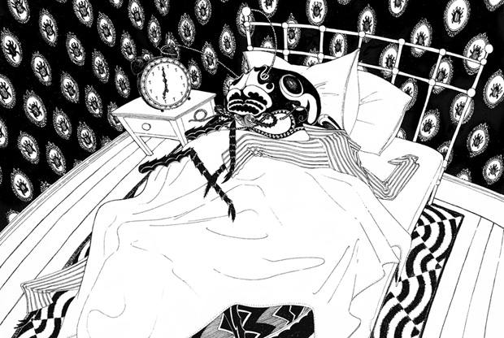{width="6.268055555555556in"
height="4.199583333333333in"}

Gregor Samsa, in a detail of illustration from My First Kafka: Runaways,
Rodents, & Giant Bugs, written by Matthue Roth and illustrated by Rohan
Daniel Eason

**My First Kafka**

Read Aloud -- The Metamorphosis

Like Gregor you have metamorphosed into a giant bug.

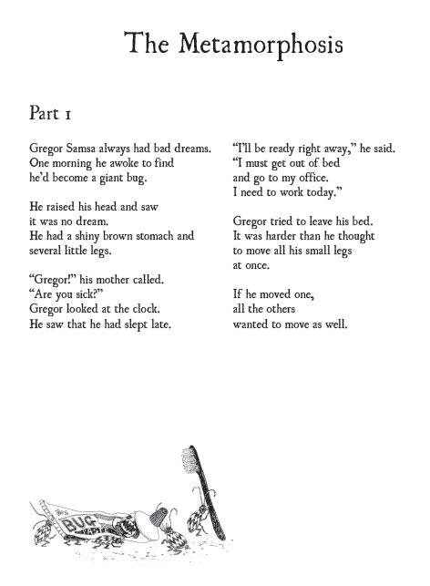{width="4.916666666666667in"
height="6.697916666666667in"}

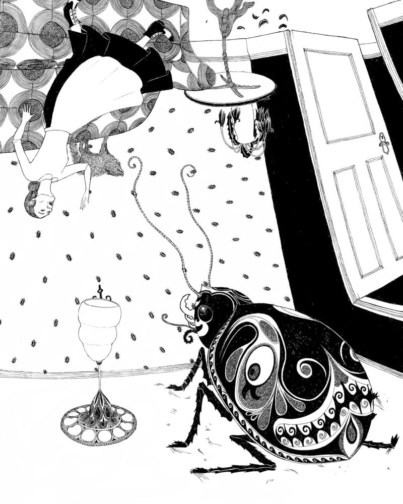{width="6.268055555555556in"
height="7.8350699912510935in"}

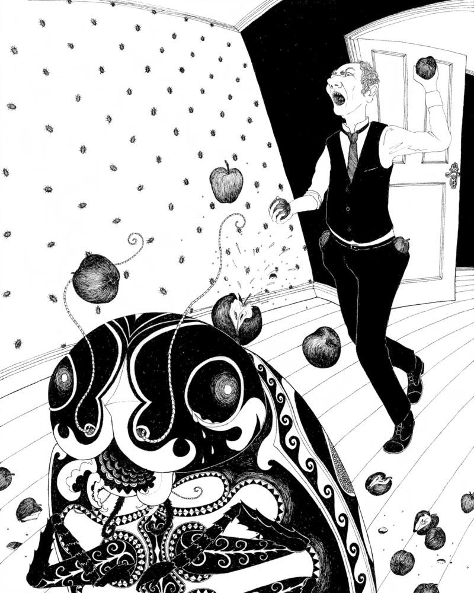{width="6.268055555555556in"
height="7.8350699912510935in"}

**The Gruffalo Julia Donaldson**

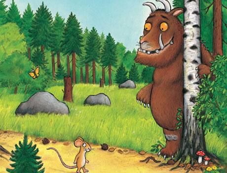{width="4.792361111111111in"
height="3.6416666666666666in"}

Write a description of a monster like Gruffalo using descriptive
language. Provide some prompts:

What is your monster's mouth like?

What colour is he?

What colour are his eyes?

Does he have claws? Teeth? etc.

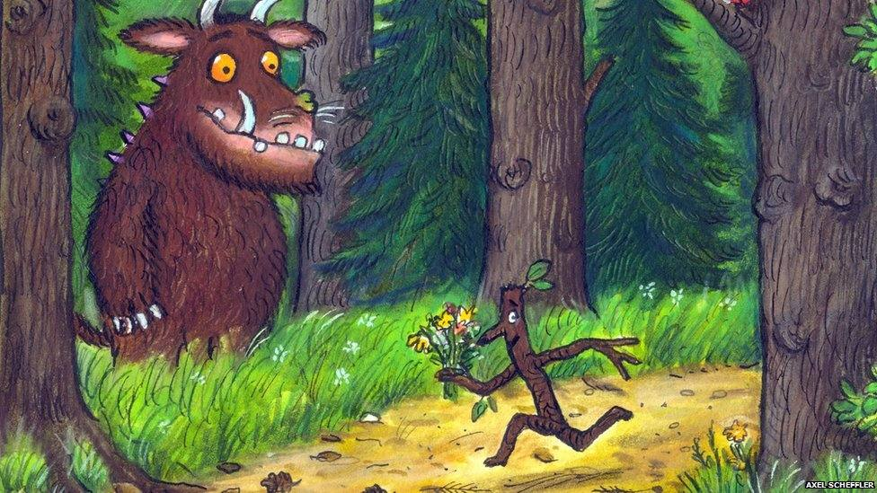{width="4.703965441819773in"
height="2.6441119860017497in"}

**How to Train Your Dragon Cressida Cowell**

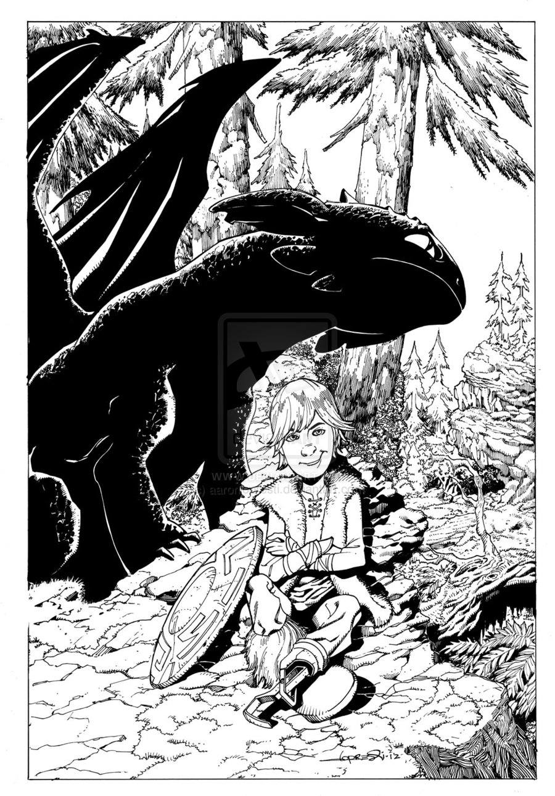{width="6.0in"
height="8.604166666666666in"}

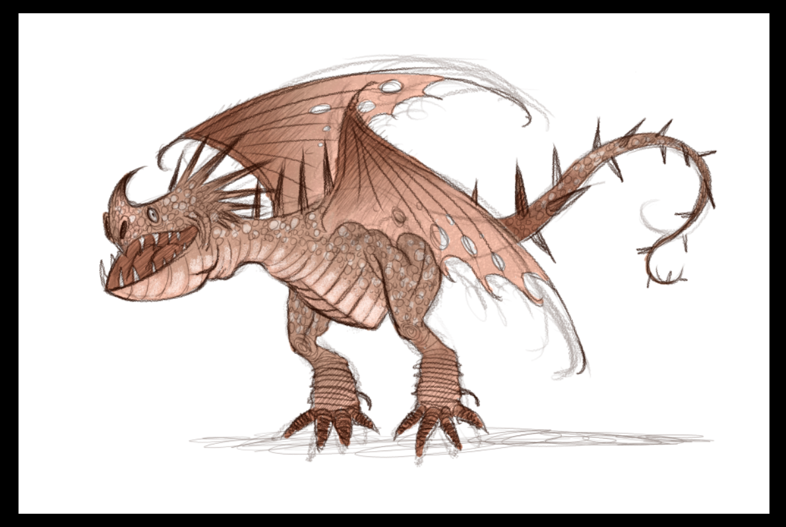{width="6.268055555555556in"
height="4.201490594925635in"}

Hiccup Horrendous Haddock III was an awesome sword-fighter, a
dragon-whisperer and the greatest Viking Hero who ever lived. But it
wasn\'t always like that.

In fact, in the beginning, Hiccup Horrendous Haddock III was the most
put upon Viking you\'d ever seen. Not loud enough to make himself heard
at dinner with his father, Stoick the Vast; not hard enough to beat his
chief rival, Snotlout, at Bashyball, the number one school sport and
CERTAINLY not stupid enough to go into a cave full of dragons to find a
pet\... It\'s time for Hiccup to learn how to be a Hero.

**Frozen**

Fearless optimist Anna sets off on an epic journey-teaming up with
rugged mountain man Kristoff and his loyal reindeer Sven-to find her
sister Elsa, whose icy powers have trapped the kingdom of Arendelle in
eternal winter. Encountering Everest-like conditions, mystical trolls,
and a hilarious snowman named Olaf, Anna and Kristoff battle the
elements in a race to save the kingdom. Based on the Disney film,
Frozen.

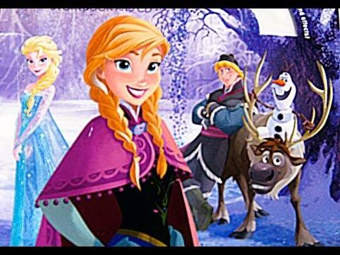{width="5.0in"
height="3.75in"}

Freewrite about Frozen.

See i-Tunes Read Along

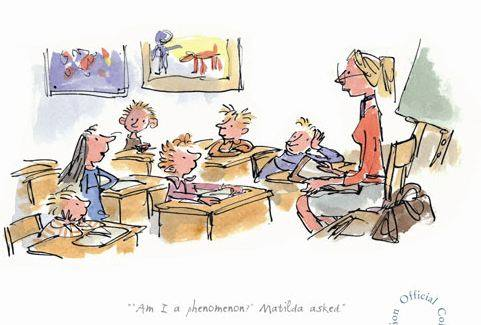{width="5.009722222222222in"
height="3.3868055555555556in"}

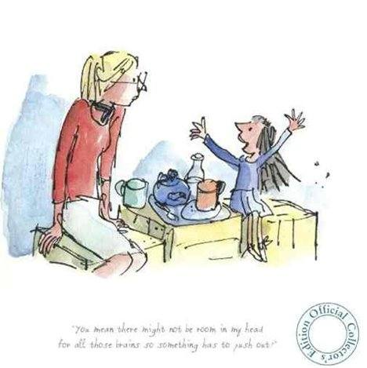{width="4.877083333333333in"
height="4.886805555555555in"}

**Matilda**

**Chapter 8 The Trunchbull**

Imagine how it would feel if Miss Trunchbull was your teacher.

Think of a new situation at school in which Miss Trunchbull intimidates
the students. This time, perhaps the children get their own back!

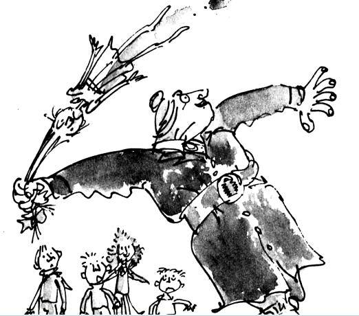{width="5.4430555555555555in"
height="4.792361111111111in"}

{width="4.679166666666666in"
height="3.0284722222222222in"}

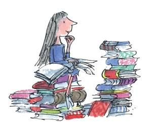{width="3.2736111111111112in"
height="2.783333333333333in"}

**The BFG**

{width="6.268055555555556in"
height="3.5332666229221346in"}

'I would dearly love to have an elefunt to ride on,' the BFG said
dreamily 'I would so much love to have a jumbly big elefunt and go
riding through green forests picking peachy fruits off the trees all day
long. This is a sizzling-hot muckfrumping country we is living in.
Nothing grows in it except snozzcumbers. I would love to go somewhere
else and pick peachy fruits in the early morning from the back of an
elefunt.'

\- What is your dream for the future?

\- Where would you be?

\- What would you eat?

\- Who would be there?

\- What would you do or be able to do?

Extension from the seed.

Write a new chapter of The BFG in which the dream of one of the
characters comes true.

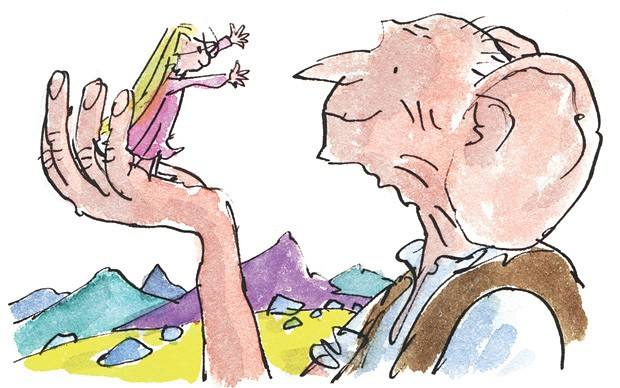{width="5.15625in"
height="3.2268143044619424in"}

**The Witches**

'What is a witchophile, Grandmamma?'

'A person who studies witches and knows a lot about them.'

• Read Aloud - How to Recognise a Witch.

• Youare now going to become witchophiles.

• As witchophiles, it is your job to tell the world about witches.

{width="5.657235345581802in"
height="3.1875in"}

{width="7.635416666666667in"
height="4.302083333333333in"}

**Boy**

• Think about an event you would include in your autobiography - a
birthday party, a discovery, meeting a new brother or sister for the
first time, getting in trouble at school.

• Exaggerate a part of your story to make it sound more interesting like
Roald Dahl does.

• It still needs to be something that could happen and is believable!

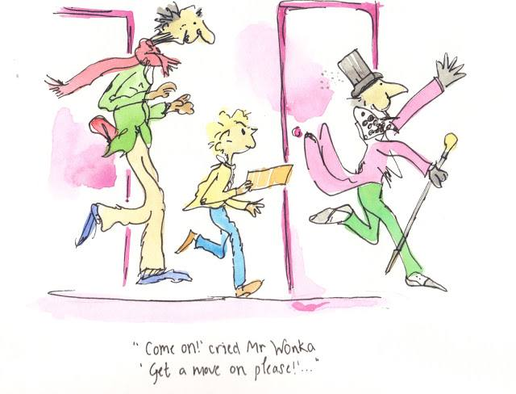{width="3.450865048118985in"
height="2.6306332020997374in"}

**Charlie and the Chocolate Factory**

Choose from:

**Chaper 3. Willie Wonka and the Indian Prince**

'Prince Pondicherry wrote a letter to Mr Willy Wonka,' said Grandpa Joe,
'and asked him to come all the way to India and build him a colossal
palace entirely out of chocolate.'

'Did Mr Wonka do it, Grandpa?'

'He did, indeed. And what a palace it was! It had one hundred rooms, and
everything was made of either dark or light chocolate! The bricks were
chocolate, and the cement holding them together was chocolate, and the
windows were chocolate, and all the walls and ceilings were made of
chocolate, so were the carpets and the pictures and the furniture and
the beds; and when you turned on the taps in the bathroom, hot chocolate
came pouring out.

'When it was all finished, Mr Wonka said to Prince Pondicherry, "I warn
you, though, it won't last very long, so you'd better start eating it
right away."

'"Nonsense!" shouted the Prince. "I'm not going to eat my palace! I'm
not even going to nibble the staircase or lick the walls! I'm going to
live in it!"

'But Mr Wonka was right, of course, because soon after this, there came
a very hot day with a boiling sun, and the whole palace began to melt,
and then it sank slowly to the ground, and the crazy prince, who was
dozing in the living room at the time, woke up to find himself swimming
around in a huge brown sticky lake of chocolate.'

• Write a letter to Prince Pondicherry explaining why his house was
poorly designed, giving recommendations for the design of his next
palace.

• Write a news report about the Great Melting Disaster of Prince
Pondicherry's palace, including a special interview with a Scientist who
explains why the

disaster happened.

**Chapter 9 Grandpa Joe takes a Gamble**

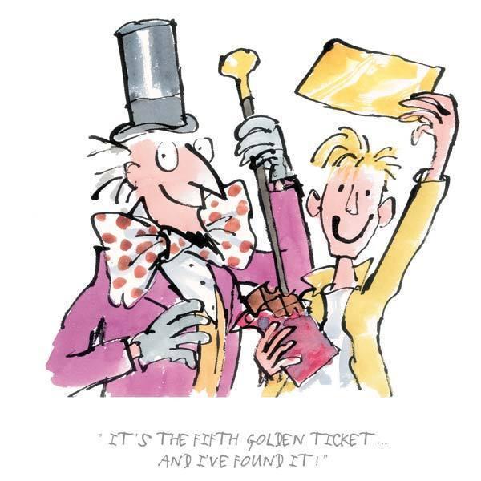{width="3.1678455818022746in"
height="3.1678455818022746in"}

**Developing Suspense**

'Have you got it?' whispered Grandpa Joe, his eyes shining with
excitement.

Charlie nodded and held out the bar of chocolate. WONKA'S NUTTY CRUNCH
SURPRISE, it said on the wrapper.

'Good!' the old man whispered, sitting up in the bed and rubbing his
hands. 'Now -- come over here and sit close by to and we'll open it
together. Are you ready?'

'Yes,' Charlie said, 'I'm ready.'

'All right. You tear off the first bit.'

'No,' Charlie said, 'you paid for it. You do it all.'

The old man's fingers were trembling most terribly as they fumbled with
the wrapper. 'We don't have a hope, really,' he whispered, giggling a
bit. 'You do know we don't have a hope, don't you?'

'Yes,' Charlie said. 'I know that.'

They looked at each other, and both started giggling nervously.

'Mind you,' said Grandpa Joe, 'there is just that tiny chance that it
might be the one, don't you agree?'

'Yes,' Charlie said. 'Of course. Why don't you open it, Grandpa?'

'All in good time, my boy, all in good time. Which end do you think I
ought to open first?'

'That corner. The one furthest from you. Just tear off a tiny bit, but
not quite enough for us to see anything.'

'Like that?' said the old man.

'Yes. Now a little bit more.'

'You finish it,' said Grandpa Joe. 'I'm too nervous.'

'No, Grandpa. You must do it yourself.'

'Very well, then. Here goes.' He tore off the wrapper.

They both stared at what lay underneath. It was a bar of chocolate --
nothing more.

All at once, they both saw the funny side of the whole thing, and they
burst into peals of laughter.

**Writing**

- Describe a chocolate bar using sensory language (see, hear, smell,
  taste, touch).

- Imagine you have just bought one of Willy Wonka's Whipple-scrumptious
  Fudgemallow Delights. Develop your writing into a short descriptive
  piece in which the chocolate bar either has a golden ticket within it
  or does not.

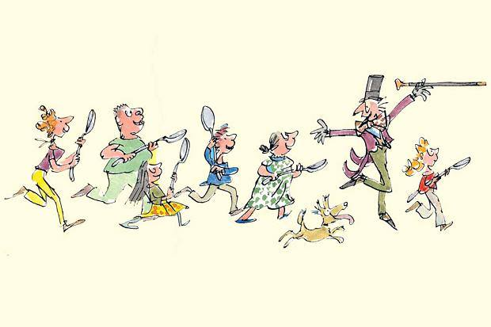{width="6.268055555555556in"
height="4.172642169728784in"}

**Chapter 18 Down the Chocolate River**

Read Aloud.

Writing:

Draft a poem about your own imaginative experience down the chocolate
river perhaps using similes, metaphors and personification.

Down the Chocolate River

Down the chocolate river, I see
\...\...\...\...\...\...\...\...\...\...\...\...\...\...\...\...\...\.....

Down the chocolate river, I hear
\...\...\...\...\...\...\...\...\...\...\...\...\...\...\...\...\...\...

Down the chocolate river, I hear
\...\...\...\...\...\...\...\...\...\...\...\...\...\...\...\...\...\...

Down the chocolate river, I
touch\...\...\...\...\...\...\...\...\...\...\...\...\...\...\...\...\.....

Down the chocolate river, I
taste\...\...\...\...\...\...\...\...\...\...\...\...\...\...\...\...\...\...

Down the chocolate river, I feel
\...\...\...\...\...\...\...\...\...\...\...\...\...\...\...\...\...\....

Down the chocolate river, life
is\...\...\...\...\...\...\...\...\...\...\...\...\...\...\...\...\...\....

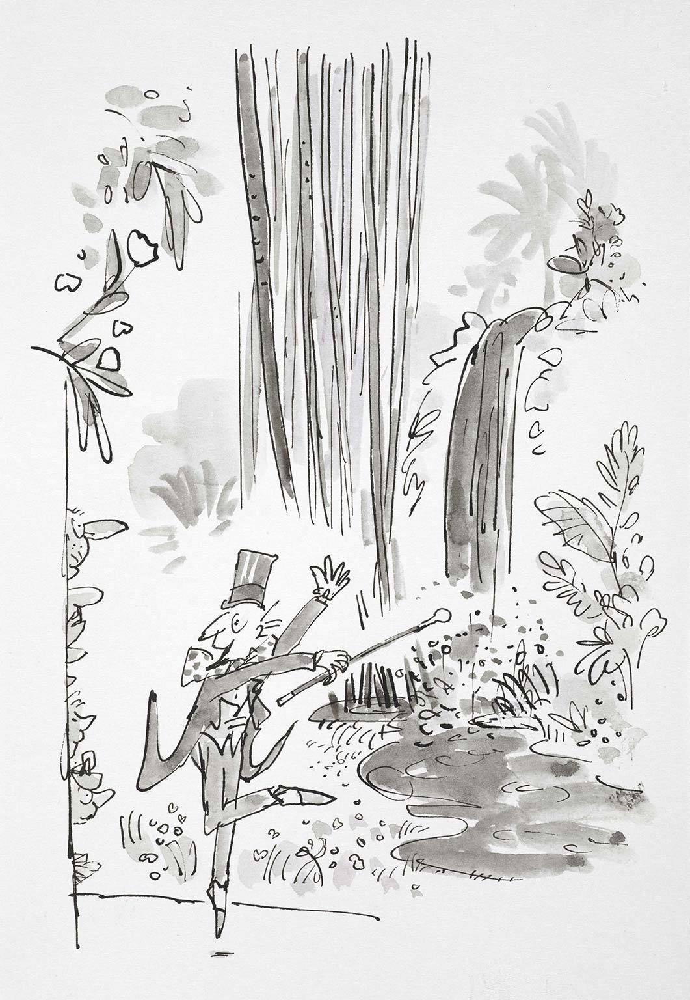{width="3.5310345581802274in"
height="5.109599737532808in"}

**Chapter 19 The Inventing Room**

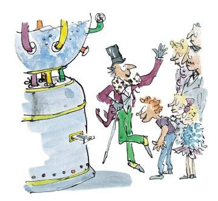{width="3.754861111111111in"
height="3.4715277777777778in"}

Charlie Bucket stared around the gigantic room in which he now found
himself. The place was like a witch's kitchen! All about him black metal
pots were boiling and bubbling on huge stoves, and kettles were hissing
and pans were sizzling, and strange iron machines were clanking and
spluttering, and there were pipes running all over the ceiling and
walls, and the whole place was filled with smoke and steam and delicious
rich smells. Mr Wonka himself had suddenly become even more excited than
usual, and anyone could see that this was the room he loved best of all.
He was hopping about among the saucepans and the machines like a child
among his Christmas presents, not knowing which thing to look at first.
He lifted the lid from a huge pot and took a sniff; then he rushed over
and dipped a finger into a barrel of sticky yellow stuff and had a
taste; then he skipped across to one of the machines and

turned half a dozen knobs this way and that; then he peered anxiously
through the glass door of a gigantic oven, rubbing his hands and
cackling with delight at what he saw inside. Then he ran over to another
machine, a small shiny affair that kept going phut-phut-phut-phut-phut,
and every time it went phut, a large green marble dropped out of it into
a basket on the floor.

- Identify and make a list of all the different objects in the Inventing
  Room ('black metal pots,' 'kettles,' 'pans,' 'strange iron machines,'
  'pipes,' 'saucepans,' 'huge pot,' 'barrel'; 'knobs'; 'gigantic oven').

- In pairs discuss what marvellous ingredients and concoctions might be
  inside each pot, and then independently describe these using

> adjectives and sensory descriptions in your Writer's Notebook.

**Chapter 23 Veruca in the Nut Room**

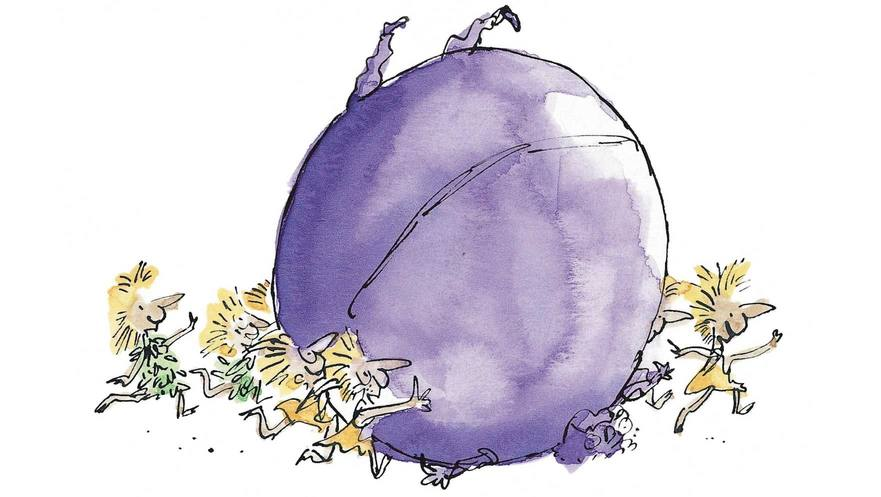{width="6.268055555555556in"
height="3.536628390201225in"}

The class makes a list of the minor characters in the story: the

Oompa-Loompas, the squirrels, the cows that give chocolate

milk, and so on.

• Pairs discuss the following questions, answering as if they

were the characters above:

\- How do you feel about working in the factory?

\- What do you think of the golden ticket winners?

\- Who do you think should run the factory after Willy Wonka?

The children take on roles of the minor characters. In role, the

children write:

\- What it's like to have Willy Wonka as a boss.

\- What to make of the golden ticket winners.

\- Who should win the factory at the end of the visit.

\- The best thing about working in the factory.

\- The worst thing about working in the factory.

\- Their favourite room in the factory.

or write an exclusive news report in which a reporter goes undercover

at the factory and carries out secret interviews with the OompaLoompas,

squirrels, cows, etc, and so on.

**Dream Chocolate Bar**

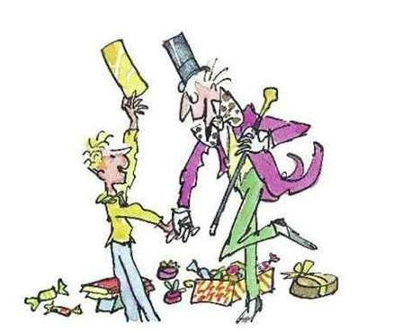{width="4.133827646544182in"
height="3.331768372703412in"}

• Look at some of the fantabulous inventions from Charlie and the
Chocolate Factory. For example, use this quote from Chapter 2:

Mr Willy Wonka can make marshmallows that taste of violets, and rich
caramels that

change colour every ten seconds as you suck them, and little feathery
sweets that melt away deliciously the moment you put them between your
lips. He can make chewing-gum that never loses its taste, and sugar
balloons that you can blow up to enormous sizes before you pop them with
a pin and gobble them up. And, by a most secret method, he can make
lovely blue birds' eggs with black spots on them, and when you put one
of these in your mouth, it gradually gets smaller and smaller until
suddenly there is nothing left except a tiny little pink sugary baby
bird sitting on the tip of your tongue.

Students design their own chocolate or sweet, using these guidelines:

\- Who is it for? A goodie, a baddie, your friend, your teacher?

\- What happens when it is eaten?

\- What ingredients does it contain?

\- What is the name? (the name should reflect the above

information and should therefore be created at the end).

Extension:

• Write a new chapter for Charlie and the Chocolate Factory

showing what happens to a character eating the product.

-Write a poem about the product.

\- Write a newspaper report on the incident of the character

eating the product.

**Danny, the Champion of the World**

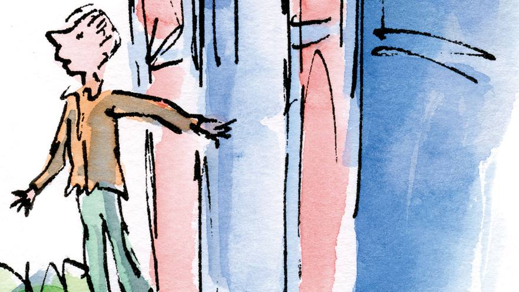{width="4.262185039370078in"
height="2.4048556430446193in"}

He was watching me now as I opened the first packet of raisins.

'Hey!' he cried, grabbing my left wrist. 'What's happened to your hand?'

'It's nothing,' I said, clenching the fist.

He made me open it up. The long scarlet mark lay across my palm like a
burn.

'Who did it?' he shouted. 'Was it Captain Lancaster?'

'Yes, Dad, but it's nothing.'

'What happened?' He was gripping my wrist so hard it almost hurt. 'Tell
me exactly what happened!'

I told him everything. He stood there holding my wrist, his face going
whiter and whiter, and I could see the fury beginning to boil up
dangerously inside him.

'I'll kill him!' he softly whispered when I had finished. 'I swear I'll
kill him!' His eyes were blazing, and all the colour had gone from his
face. I had never seen him look like that before.

'Forget it, Dad.'

'I will not forget it!' he said. 'You did nothing wrong and he had
absolutely no right to do this to you. So he called you a cheat, did
he?'

I nodded. He had taken his jacket from a peg on the wall and was putting
it on.

'Where are you going?' I asked.

'I am going straight to Captain Lancaster's house and I'm going to beat
the living daylights out of him.'

'No!' I cried, catching hold of his arm. 'Don't do it, Dad, please! It
won't do any good! Please don't do it!'

'I've got to,' he said.

'No!' I cried, tugging at his arm. 'It'll ruin everything! It'll only
make it worse! Please forget it!'

In pairs, the children imagine that Danny's dad did actually go to see
Captain Lancaster about Danny's wrist. They discuss the possible things
that could happen during the scene.

Pairs write a script showing a scene between Danny's dad and Captain
Lancaster.

• Turn scripts into a piece of creative writing showing the scene.
Explore use of adjectives and similes ("The long scarlet mark lay across
my palm like a bur"), verbs (clenching, grabbing, tugging), metaphorical
language ("the fury beginning to boil up dangerously inside him"), use
of italics ("I'll kill him!"). Use these techniques in the piece of
creative writing.

**Skellig David Almond**

"Books. They are lined up on shelves or stacked on a table. There they
are wrapped up in their jackets, lines of neat print on nicely bound
pages. They look like such orderly, static things. Then you, the reader
come along. You open the book jacket, and it can be like opening the
gates to an unknown city, or opening the lid of a treasure chest. You
read the first word and you\'re off on a journey of exploration and
discovery."

― David Almond

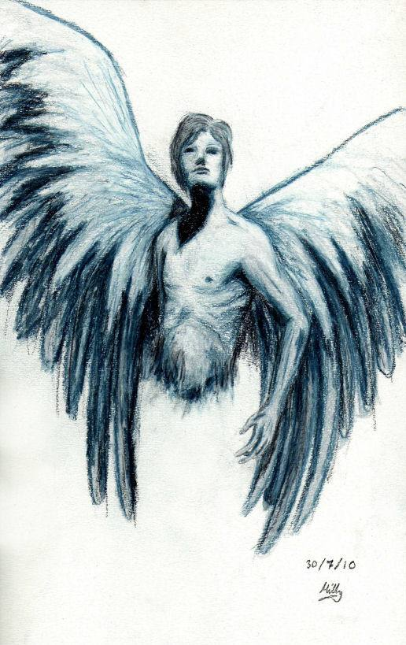{width="4.1871183289588805in"
height="6.645833333333333in"}

**\**

**Skellig Quotes**

"Sometimes we think we should be able to know everything. But we can't.
We have to allow ourselves to see what there is to see, and we have to
imagine."

"What is it?'

'I don't know. I don't even know if it's true or if it's a dream.'

'That's alright. Truth and Dreams are always getting muddled."

"Drawing makes you look at the world more closely. It helps you see what
you're looking at more clearly. Did you know that?"

"Can love help a person to get better?' I asked."

"I thought how you could never tell just by looking at them what they
were thinking or what was happening in their lives. Even when you got
crazy people or drunk people on buses, people that went on stupidly, and
shouted rubbish or tried to tell you all about themselves, you could
never realy tell about them, either."

"It was great to see the owls,\" I said.

She smiled.

\"Yes. They\'re wild things, of course. Killers, savages. They\'re
wonderful."

"She told us about the goddess called Persephone, who was forced to
spend half a year in the darkness deep underground. Winter happened when
she was trapped inside the earth. The days shrank, they became cold and
short and dark. Living things hid themselves away. Spring came when she
was released and made her slow way up to the world again. The world
became brighter and bolder in order to welcome her back. It began to be
filled with warmth and light. The animals dared to wake, they dared to
have their young. Plants dared to send out buds and shoots. Life dared
to come back."

"Look at all the life in this,\" she said. \"Every pip could become a
tree, and every tree could bear another hundred fruits and every fruit
could bear another hundred trees. And so on to infinity.\"

"What are you?\" I whispered.

He shrugged again.

\"Something,\" he said. \"Something like you, something like a beast,
something like a bird, something like an angel.\" He laughed.
\"Something like that."

**A Wizard of Earthsea Ursula Le Guin**

{width="3.4922222222222223in"
height="4.760416666666667in"}

Ged, the greatest sorcerer in all Earthsea, was called Sparrowhawk in
his reckless youth.

Hungry for power and knowledge, Sparrowhawk tampered with long-held
secrets and loosed a terrible shadow upon the world. This is the tale of
his testing, how he mastered the mighty words of power, tamed an ancient
dragon, and crossed death\'s threshold to restore the balance.

**Using Quotes from A Wizard of Earthsea**

*He grew wild, a thriving weed, a tall, quick boy, loud and proud and
full of temper.*

Describe yourself or a friend imitating the style of Ursula. I.e. use
adjectives and a metaphor in a sentence. Expand your description in a
quick write.

*It might seem strange that on an island fifty miles wide, in a village
under cliffs that stare out forever on the sea, a child may grow to
manhood never having stepped in a boat or dipped his finger in salt
water, but so it is.*

Ged doesn't know much about the world. Write your thoughts about going
through life gaining knowledge through experiences.

*For he hungered to learn, to gain power.*

How does learning lead to gaining power\>

*For magic consists in this, the true naming of a thing.*

What words contain magic for you? Expand on them. Write off them in a
quick write.

*\"Have you never thought how danger must surround power as shadow does
light? This sorcery is not a game we play for pleasure or for praise.
Think of this: that every word, every act of our Art is said and is done
either for good, or for evil. Before you speak or do you must know the
price that is to pay!\"*

Write about the consequences of words spoken or written.

*\"Good,\" said the boy, for he had no wish to tell the secret to his
playmates, liking to know and do what they knew not and could not.*

Keeping secrets.

*Yet a greater, unlearned skill he possessed, which was the art of
kindness. That night, and always from then on, he offered and gave Ged
friendship, a sure and open friendship which Ged could not help but
return.*

Friendship *\*

