**Writer's Notebook**

**(13)**

**Quick-Writes**

{width="6.268055555555556in"
height="4.700936132983377in"}

**National Geographic**

**Photo of the Day\**

{width="2.2767804024496936in"
height="1.7075470253718286in"}

**Writer's Notebook 13**

**National Geographic Photo of the Day**

See other volumes on using photographs for Quick Writes:

Writer's Notebook 3

Writer's Notebook 10

Writer's Notebook 11

**Look at the Photo:**

Make: 3-5 Observations

3-5 Inferences

3-5 Predictions

Write

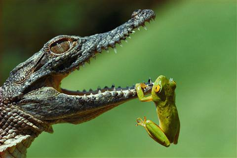{width="5.0in"
height="3.329861111111111in"}

{width="6.268055555555556in"
height="4.692258311461067in"}

{width="6.268055555555556in"
height="4.692258311461067in"}

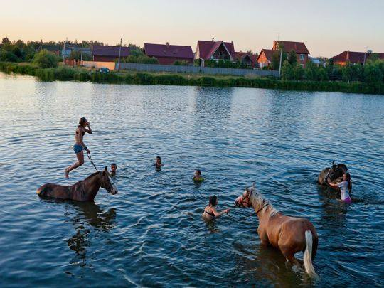{width="5.622916666666667in"
height="4.216666666666667in"}

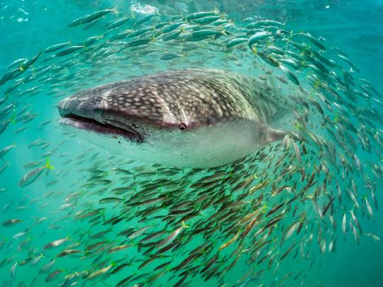{width="5.622916666666667in"
height="4.216666666666667in"}

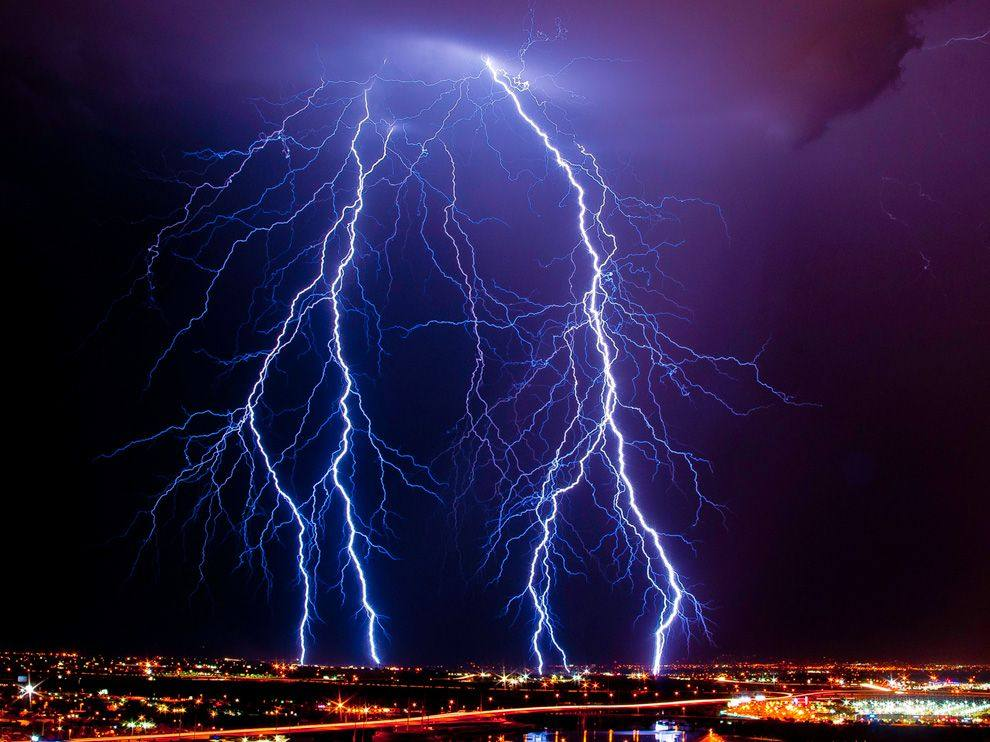{width="6.268055555555556in"
height="4.696819772528434in"}

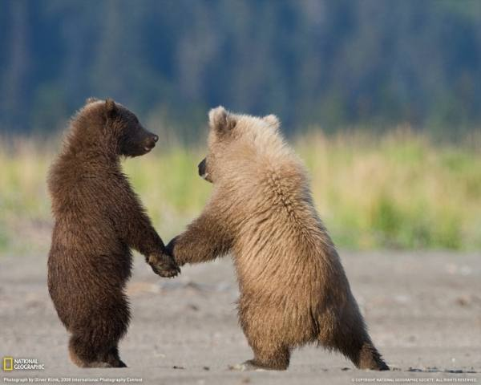{width="6.245138888888889in"
height="5.0in"}

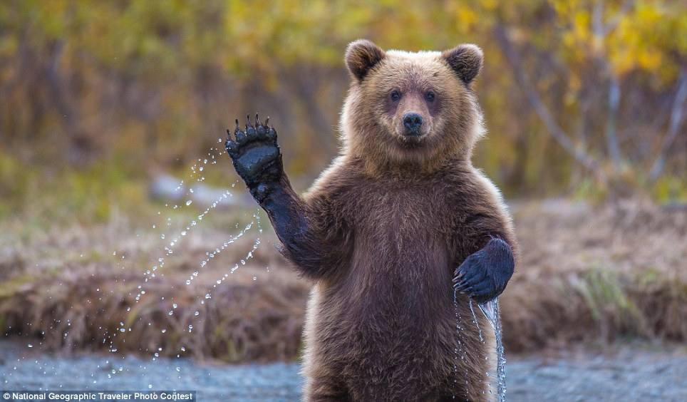{width="6.268055555555556in"
height="3.6700262467191602in"}

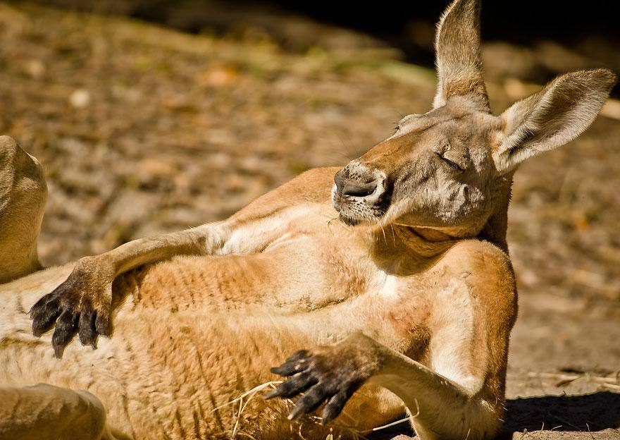{width="6.268055555555556in"
height="4.4429385389326335in"}

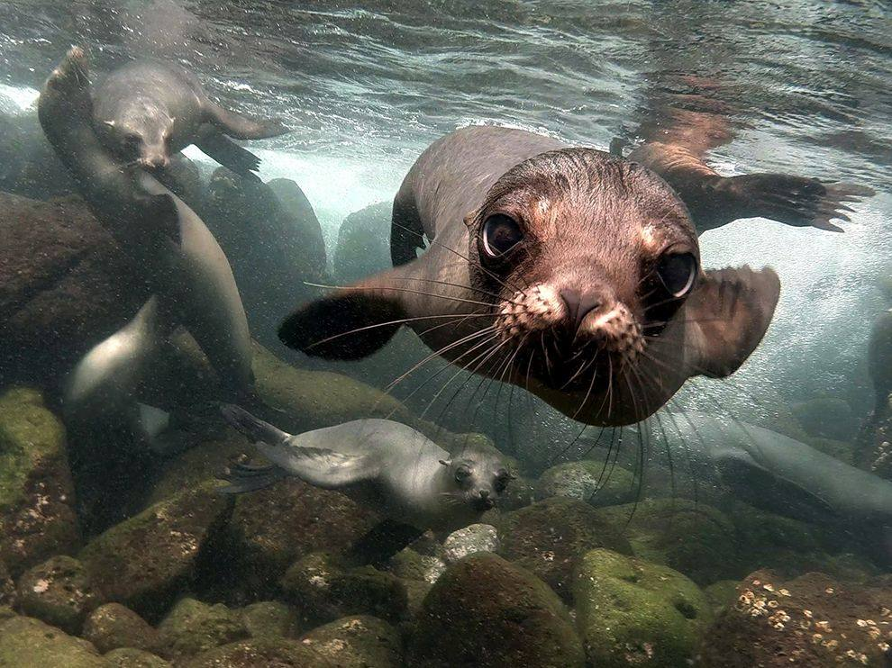{width="6.268055555555556in"
height="4.696819772528434in"}

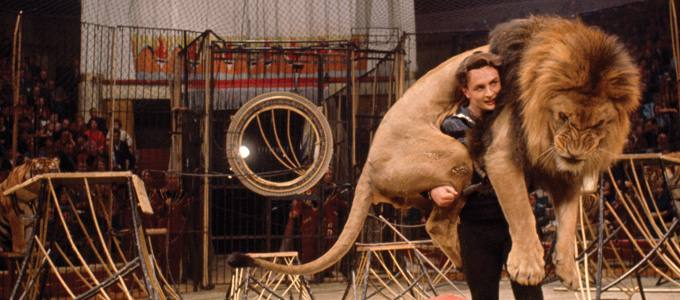{width="6.268055555555556in"
height="2.7629330708661417in"}

{width="6.268055555555556in"
height="4.17870406824147in"}

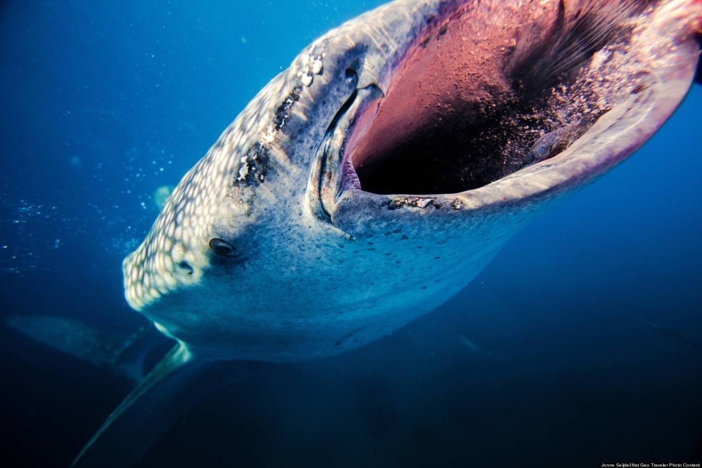{width="6.268055555555556in"
height="4.1800634295713035in"}

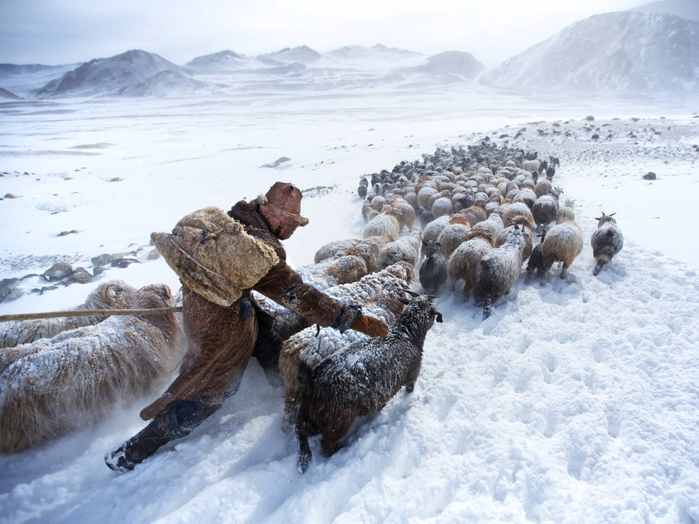{width="6.268055555555556in"
height="4.701806649168854in"}

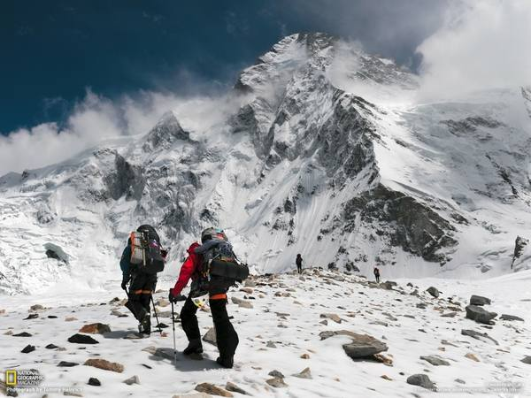{width="6.245138888888889in"
height="4.688888888888889in"}

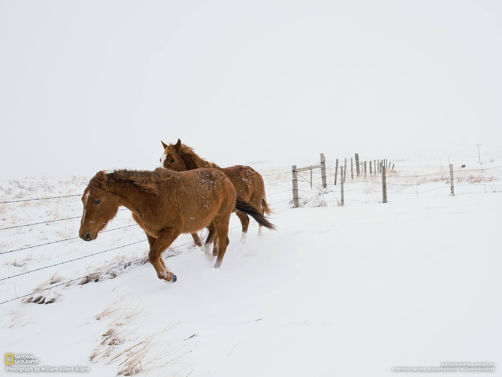{width="6.268055555555556in"
height="4.700062335958005in"}

{width="4.438382545931758in"
height="3.309150262467192in"}

{width="5.622916666666667in"
height="4.216666666666667in"}

{width="5.622916666666667in"
height="4.207638888888889in"}

{width="5.622916666666667in"
height="4.207638888888889in"}

{width="5.622916666666667in"
height="4.207638888888889in"}

{width="5.622916666666667in"
height="4.207638888888889in"}

{width="5.622916666666667in"
height="4.207638888888889in"}

{width="5.622916666666667in"
height="4.207638888888889in"}

{width="5.622916666666667in"
height="4.207638888888889in"}

{width="5.622916666666667in"
height="4.207638888888889in"}

{width="6.268055555555556in"
height="4.696819772528434in"}

{width="6.268055555555556in"
height="4.696819772528434in"}

{width="5.622916666666667in"
height="4.216666666666667in"}

{width="5.622916666666667in"
height="4.216666666666667in"}

{width="5.622916666666667in"
height="4.216666666666667in"}

{width="6.268055555555556in"
height="4.699512248468942in"}

{width="5.622916666666667in"
height="4.207638888888889in"}

{width="5.622916666666667in"
height="4.207638888888889in"}

{width="5.622916666666667in"
height="4.207638888888889in"}

{width="5.622916666666667in"
height="4.207638888888889in"}

{width="5.622916666666667in"
height="4.207638888888889in"}

{width="5.622916666666667in"
height="4.207638888888889in"}

{width="5.622916666666667in"
height="4.207638888888889in"}

{width="5.622916666666667in"
height="4.207638888888889in"}

{width="5.622916666666667in"
height="4.207638888888889in"}

{width="5.622916666666667in"
height="4.207638888888889in"}

{width="5.622916666666667in"
height="4.207638888888889in"}

{width="5.622916666666667in"
height="4.207638888888889in"}

{width="5.622916666666667in"
height="4.207638888888889in"}

{width="5.622916666666667in"
height="4.207638888888889in"}

{width="5.622916666666667in"
height="4.207638888888889in"}

{width="5.622916666666667in"
height="4.216666666666667in"}

{width="5.934027777777778in"
height="6.1506944444444445in"}

{width="5.622916666666667in"
height="4.216666666666667in"}

{width="5.622916666666667in"
height="4.207638888888889in"}

{width="6.0375in"
height="4.528472222222222in"}

{width="5.622916666666667in"
height="4.216666666666667in"}

{width="5.622916666666667in"
height="4.216666666666667in"}

{width="5.622916666666667in"
height="4.216666666666667in"}

{width="5.622916666666667in"
height="4.216666666666667in"}

{width="5.622916666666667in"
height="4.216666666666667in"}

{width="5.622916666666667in"
height="4.216666666666667in"}

{width="5.622916666666667in"
height="4.216666666666667in"}

{width="5.622916666666667in"
height="4.216666666666667in"}

{width="5.622916666666667in"
height="4.216666666666667in"}

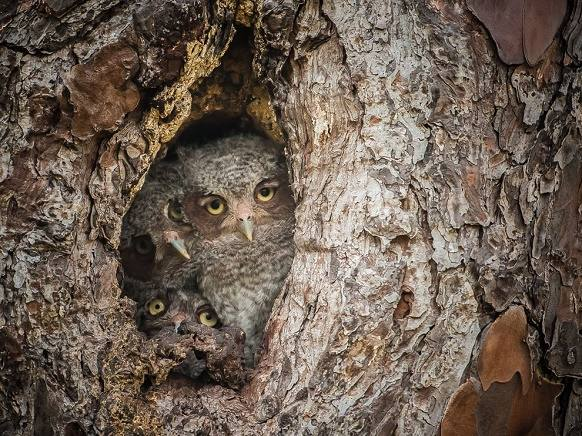{width="6.065972222222222in"
height="4.5375in"}

{width="5.622916666666667in"
height="4.207638888888889in"}

{width="6.268055555555556in"
height="4.698594706911636in"}

{width="5.934027777777778in"
height="3.952777777777778in"}

{width="6.268055555555556in"
height="4.696819772528434in"}

{width="6.268055555555556in"
height="4.696819772528434in"}

{width="6.268055555555556in"
height="4.696819772528434in"}

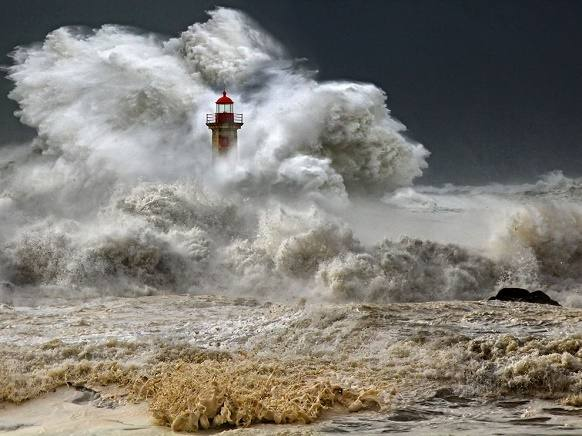{width="6.065972222222222in"
height="4.5375in"}

{width="5.987688101487314in"
height="4.490566491688539in"}

{width="6.268055555555556in"
height="4.696819772528434in"}

{width="6.268055555555556in"
height="4.696819772528434in"}

{width="6.268055555555556in"
height="4.696819772528434in"}

{width="6.268055555555556in"
height="4.696819772528434in"}

{width="6.268055555555556in"
height="4.696819772528434in"}

{width="6.268055555555556in"
height="4.696819772528434in"}

{width="6.268055555555556in"
height="4.696819772528434in"}

{width="6.268055555555556in"
height="4.696819772528434in"}

{width="6.268055555555556in"
height="4.696819772528434in"}

{width="6.268055555555556in"
height="4.696819772528434in"}

{width="6.268055555555556in"
height="4.696819772528434in"}

{width="6.268055555555556in"
height="4.696819772528434in"}

{width="6.268055555555556in"
height="4.696819772528434in"}

{width="6.268055555555556in"
height="4.696819772528434in"}

{width="6.268055555555556in"
height="4.696819772528434in"}

{width="6.268055555555556in"
height="4.696819772528434in"}

{width="6.268055555555556in"
height="4.696819772528434in"}

{width="6.268055555555556in"
height="4.696819772528434in"}

{width="6.268055555555556in"
height="4.696819772528434in"}

{width="6.268055555555556in"
height="4.696819772528434in"}

{width="6.268055555555556in"
height="4.700936132983377in"}

{width="6.268055555555556in"
height="4.700936132983377in"}

{width="6.268055555555556in"
height="4.700936132983377in"}

{width="6.268055555555556in"
height="4.700936132983377in"}

{width="6.268055555555556in"
height="4.700936132983377in"}

{width="6.268055555555556in"
height="4.700936132983377in"}

{width="6.268055555555556in"
height="4.696819772528434in"}

{width="6.268055555555556in"
height="4.700936132983377in"}

