**Writer's Notebook**

**(8)**

**Quick-Writes**

**Writer's Notebook 8**

**From the News**

**Response:** Students write 2 or more responses that show a good
understanding of the topic and deeper thinking.

Students write a news report based on the picture and headline provided.

Students must find a link between the headline and the photograph that
could be used as an event for a report that would appear in a newspaper.

A news report usually answers the questions who, what, where, when, why
and how.

**Candid Moments -- Photographs**

**The Best Person in the World**

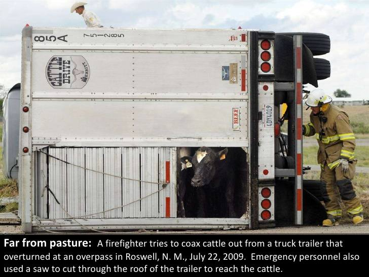

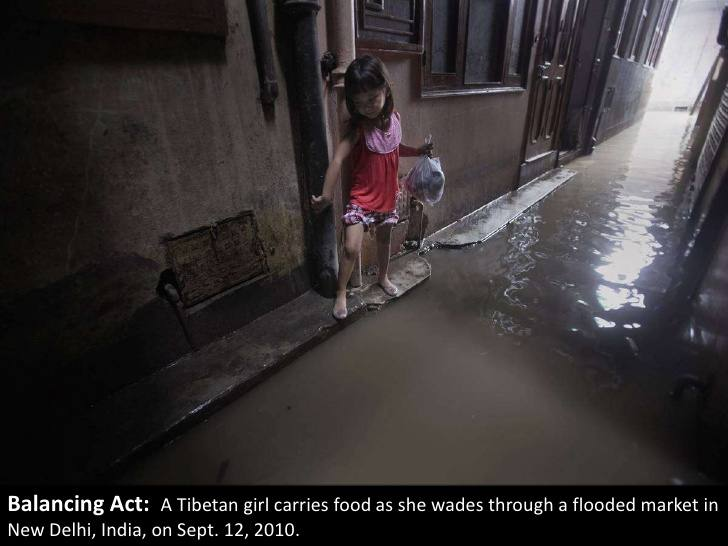

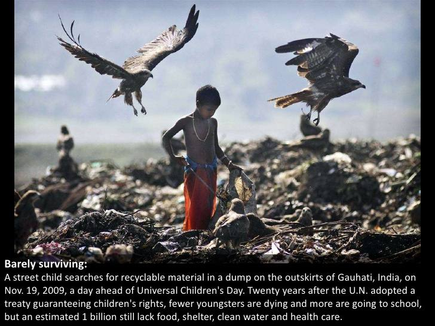

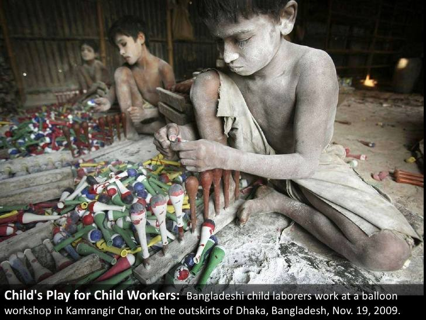

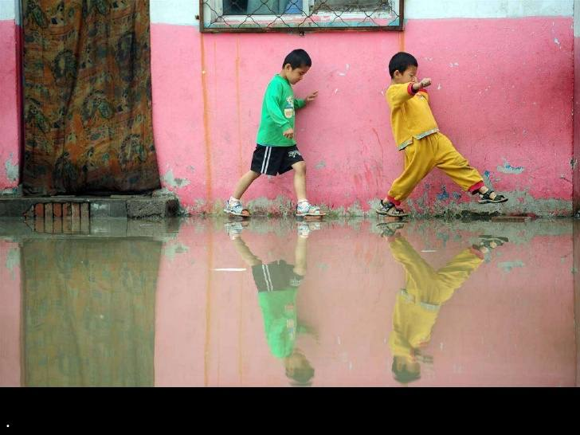

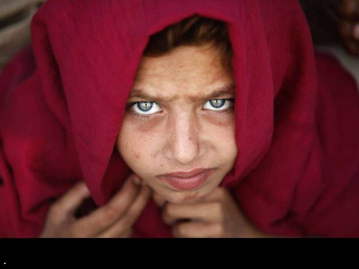

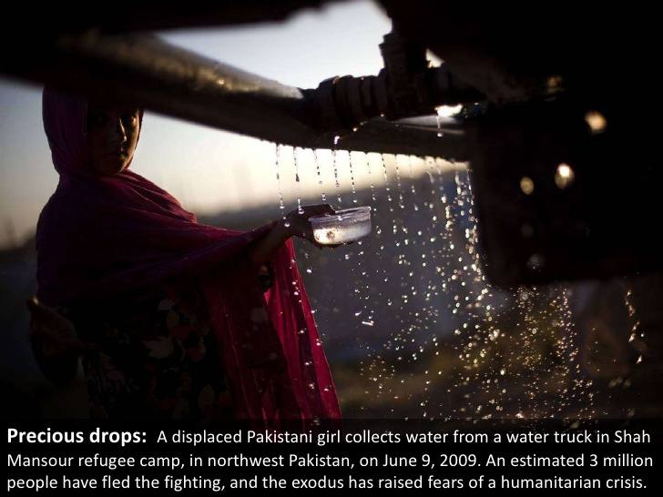

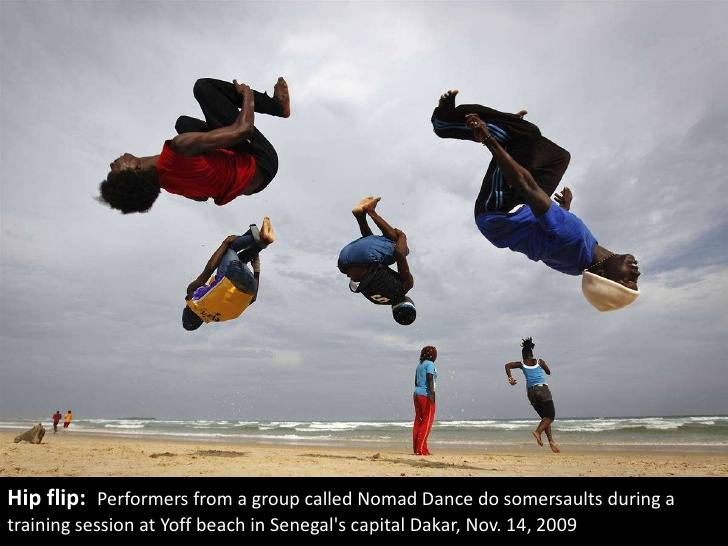

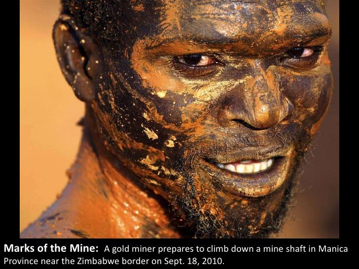

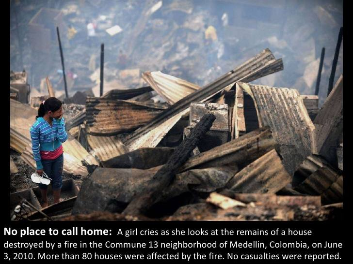

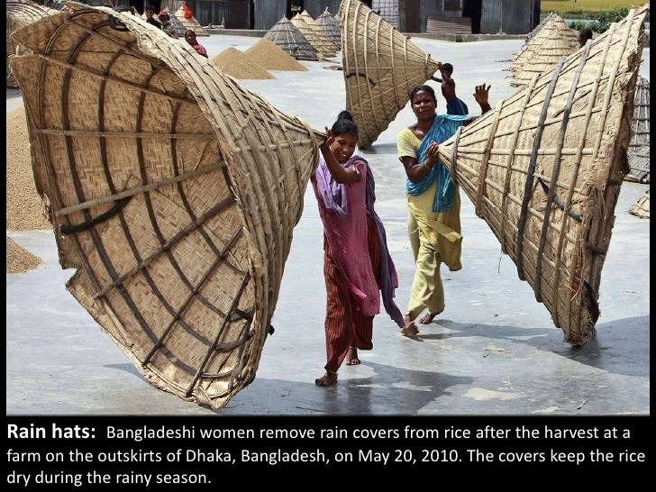

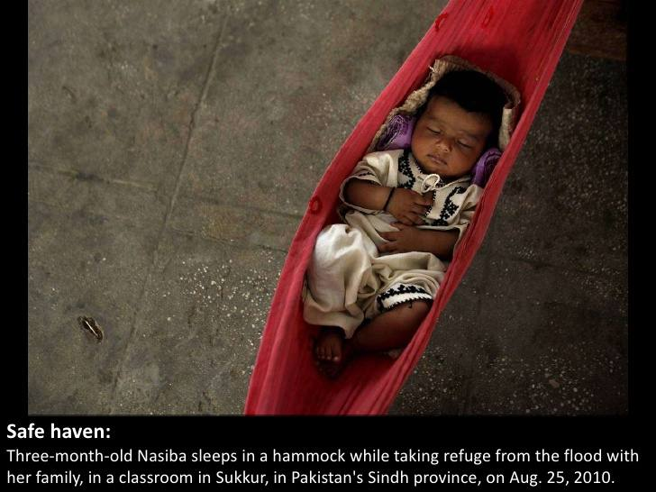

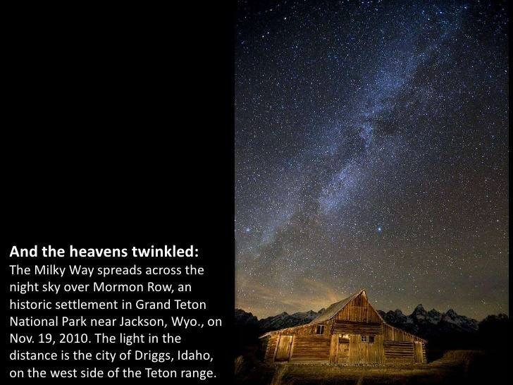

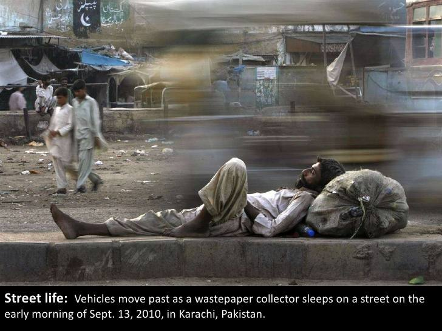

These shipbreakers claim to be fourteen, the minimum legal age to work
in the yards.

Managers favour young workers because they are cheap and know led about
the dangers; and their small bodies enable them to access a ship's
tightest corners.

Destiny Buck of the Wanapum Tribe rides her mare, Daisy, in the yearly
Indian princess competition in Pendleton, Oregon.

Embraced first for war, hunting, and transportation, horses became
partners in pageantry and a way to show tribal pride.

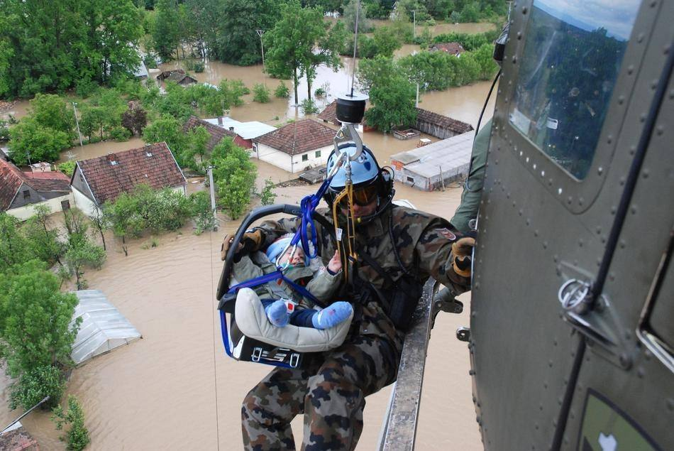

A Slovenian army helicopter team rescues a small baby by winching the
baby carrier into the helicopter over the village of Tisina in northern
Bosnia-Herzegovina. Hundreds of thousands of people were forced from
their homes in Bosnia and Serbia following the worst flooding since
record keeping began 120 years ago.

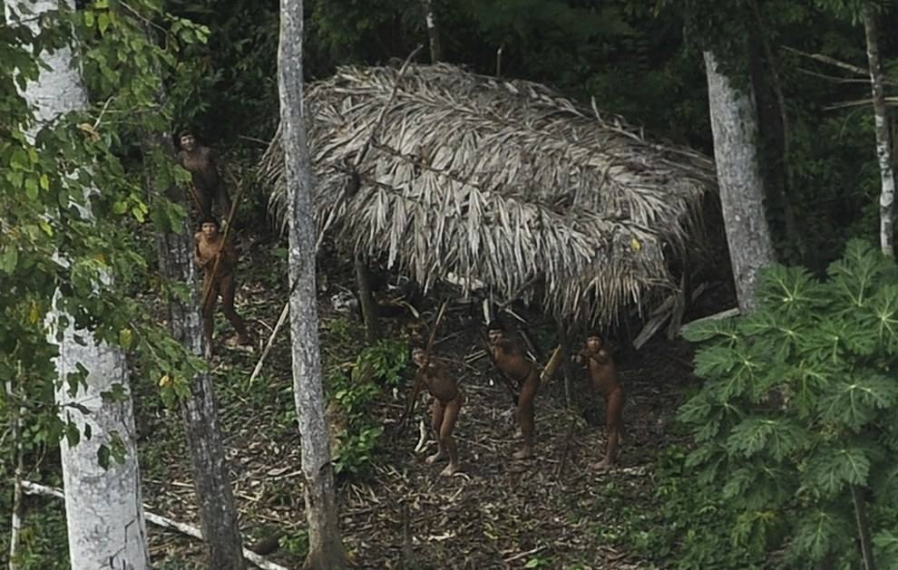

Indians who are considered uncontacted by anthropologists react to a
plane flying over their community in the Amazon basin near the Xinane
river in Brazil's Acre State, near the border with Peru.

A Doctors Without Borders health worker in protective clothing holds a
child suspected of having Ebola in the MSF treatment centre in
Paynesville, Liberia.

**Meet the Skater Girls of Afghanistan**

When Madina Khsrawy was 13, she saw some boys skateboarding and asked
them where she could learn.

It's not an unusual pastime --- unless you live in Afghanistan, and
you're a girl.

They took her to a program called Skateistan, a nonprofit organisation
that teaches skateboarding to children in Afghanistan to segue into an
education program.

Learning to skateboard was hard at first, she said by phone from Kabul.
"All sports are hard in the beginning. But I liked it and was interested
in it, so I learned it fast."

It's still a challenge to skateboard outside the Skateistan facility in
Kabul. Medina said when she did venture out on the street, "people would
look at me and were shocked." They would ask her why --- as a girl ---
she had a skateboard.

At Skateistan, "I feel I am free and I can do sports here, but not on
the outside."

That's the idea, said Skateistan founder and executive director Oliver
Percovich: providing a safe place where girls and boys can interact and
learn new skills. The program provides additional education for "street
children," or those who sell items on the street such as chewing gum and
cigarettes and don't get to go to school. The condensed curriculum helps
catch them up to their peers.

About 1,200 students ages 5-17 attend the Skateistan program per week in
Afghanistan's two sites, in the capital Kabul and the northern city of
Mazar-i-Sharif. Skateistan has opened skate parks in two other places:
Phnom Penh, Cambodia, and Johannesburg, South Africa, where another 300
students go.

About 47 percent of the Skateistan students in Afghanistan are female
--- quite an undertaking in a country where girls usually don't play
sports, let alone skateboard. The female students require more of
Skateistan's resources, Percovich said, because organizers must pick up
and drop off the girls at their homes. The organisers also conduct home
visits to ensure their families' support.

"That's really important in a society where girls going to school is a
very special thing, and doing a sport is not the norm at all," he said.
But it's worth it.

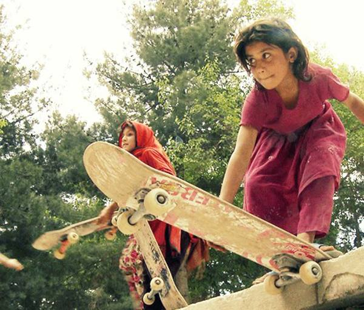

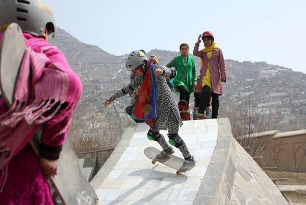

Australia\'s Nathan Hedge rides a wave at Teahupoo, on the French
Polynesian island Tahiti during the Billabong Pro Tahiti surf event,
part of the ASP (Association of Surfing Professionals) world tour.

Mount Slamet spews lava and gas during an eruption as seen from
Pandansari village in Brebes, Central Java, Indonesia.

A giraffe watches Maikel Melero of Spain warm up in the South African
savanna prior to the fifth stage of the Red Bull X-Fighters World Tour.

This is the hair-raising moment a huge great white shark took a bite out
of a GoPro camera rig worth more than £7,000 before sending it to the
bottom of the sea. The footage was captured from the relative safety of
a shark cage off the coast of New Zealand.

Dozens of Australians tilted a train to free a commuter whose leg was
trapped between a carriage and a platform, with authorities praising
their efforts as an example of \"people power\"

Russian cosmonaut Oleg Artemyev\'s photo of the full moon taken from the
International Space Station

Picture: ‏@OlegMKS

![GENESIS REGIONAL PHOTOGRAPHER OF THE YEAR FINALIST Competitors came
from all over Northern Ireland as well as the Republic of Ireland,
England, Scotland and Germany and the US to compete in the wacky race at
Foymore Lodge, Portadown. Professional athletes, casual joggers and
people who are just a bit bonkers made their way across four and half
miles of bogs and ponds, under cargo nets, across monkey bars and over
inflatable obstacles all in aid of charity partner Marie Curie Cancer
Care on April 13,
2014.](assets/News - Writer's Notebook 8 Quick Writes/media/media/image45.jpeg)

GENESIS REGIONAL PHOTOGRAPHER OF THE YEAR FINALIST

Competitors came from all over Northern Ireland as well as the Republic
of Ireland, England, Scotland and Germany and the US to compete in the
wacky race at Foymore Lodge, Portadown. Professional athletes as well as
casual joggers made their way across four and half miles of bogs and
ponds, tackling cargo nets, monkey bars and inflatable obstacles all in
aid of charity partner Marie Curie Cancer Care on April 13, 2014.

Picture: Charles Mcquillan

UKPEG NEWS PHOTOGRAPHER OF THE YEAR FINALIST

A horse of the Kings troop Royal artillery rears up during their annual
inspection parade in London\'s Regent Park. The Troop were inspected by
Col Hugh Bodington Chief of staff of Head quarters London District who
announced that they were \"Fit to represent the nation\".

Picture: Richard Pohle

![Eve Grayson, a Reindeer herder of the Cairgorm Reindeer Herd, feeds
the deer on December 23, 2013 in Aviemore, Scotland. Reindeer were
introduced to Scotland in 1952 by Swedish Sami reindeer herder, Mikel
Utsi. Starting with just a few reindeer, the herd has now grown in
numbers over the years and is currently at about 130 by controlling the
breeding. The herd rages on 2,500 hectares of hill ground between 450
and 1,309 meters and stay above the tree line all year round regardless
of the weather
conditions.](assets/News - Writer's Notebook 8 Quick Writes/media/media/image47.jpeg)

UKPEG NEWS PHOTOGRAPHER OF THE YEAR FINALIST

Eve Grayson, a Reindeer herder of the Cairgorm Reindeer Herd, feeds the
deer on December 23, 2013 in Aviemore, Scotland. Reindeer were
introduced to Scotland in 1952 by Swedish Sami reindeer herder, Mikel
Utsi. Starting with just a few reindeer, the herd has now grown in
numbers over the years and is currently at about 130 by controlling the
breeding. The herd rages on 2,500 hectares of hill ground between 450
and 1,309 meters and stay above the tree line all year round regardless
of the weather conditions.

Picture: Jeff J Mitchell/Getty Images

Gigantic waves hit the sea wall at Porthcawl in South Wales on February
8, 2014.

Picture: Henry Nicholls

GENESIS REGIONAL PHOTOGRAPHER OF THE YEAR FINALIST

The Leeds Museum Discovery Centre opened their doors to the exhibition
\'The Joy of Small Things - the smallest things in the store!\', a
collection showcasing the likes of tiny fig wasps, a squid's eyeball and
rusty Roman hobnails. Pictured: Laura Bradbeer who is on an archaeology
placement from Bradford University looking at some of the collection.

Picture: James Hardisty/Yorkshire Post Newspapers

A man smears the face of a woman with coloured powder during
celebrations marking Holi, the Hindu festival of colours, in Mumbai,
India

Picture: AP

Heavy fog shrouds New York\'s iconic Brooklyn Bridge

Picture: BEBETO MATTHEWS/AP

A fierce storm whipped these monster waves into a frenzy of whitewater
which subsequently froze in sub-zero temperatures in Senj, Croatia

Picture: MARKO KOROSEC/SOLENT

An Afghan child holds his boots in a camp for the internally displaced
on the outskirts of Mazar-e Sharif, north of Kabul, Afghanistan. Mazar-e
Sharif has been experiencing below freezing weather and snow

Picture: MUSTAFA NAJAFIZADA/AP

The U.S. side of the Niagara Falls is pictured from Ontario, Canada. The
frigid air and \"polar vortex\" that affected about 240 million people
in the United States and southern Canada will depart during the second
half of this week, and a far-reaching January thaw will begin, according
to AccuWeather.com.

Picture: AARON HARRIS/REUTERS

Canada\'s Sarah Reid speeds down the track during the women\'s skeleton
event at the 2014 Sochi Winter Olympics

Picture: MURAD SEZER/REUTERS

British yachtsman Alex Thompson climbs to the top of the 100ft mast of
his yacht Hugo Boss as it heels up off the coast of Spain.

Picture: Hugo Boss

A massive storm cloud looms over Sydney, Australia. A severe
thunderstorm warning was issued on Wednesday for the city\'s
metropolitan area with heavy rainfall due to cause flash flooding in
areas

Picture: CASSIE TROTTER/GETTY IMAGES

Alban the teddy bear has travelled where no bear has travelled before.
The mascot of St Alban\'s primary school in Cambridge was attached to a
balloon and lifted up into the stratosphere to a dizzying height of
120,000ft - nearly 23 miles high. A camera attached to the balloon took
a stunning picture of him as he soared through space at 174km an hour. A
remotely-controlled charge was then triggered at \'mission control\' in
the school to bring Alban and the balloon back. His four-hour flight
ended when he landed safely in a field at Crewe, Cheshire around 125
miles away

Picture: SWNS

Tourists view the Iguazu Falls from an observation platform at the
Iguazu National Park near the southern Brazilian city of Foz do Iguacu.
Forming a border between Argentina and Brazil, the Iguazu Falls, South
America\'s largest falls, attract more than 1 million visitors a year.

Picture: REUTERS/Jorge Adorno

![Avon and Somerset police are using a 350bhp Ariel Atom as part of a
campaign to encourage motorcyclists to curb their speed. Based on the
latest Atom 3.5R, the car is fitted with police livery, the latest
aerodynamic Hella pursuit lights and emergency equipment. The car can go
from 0-62mph in just 2.5 seconds and a variant of the model holds the
lap record at the Top Gear test track. That makes it faster than the
Lamborghini Gallardo LP560-4 Polizia used by Italian cops, the Audi R8
GTR driven by officers in Germany, and a Ferrari FF used in
Dubai](assets/News - Writer's Notebook 8 Quick Writes/media/media/image60.jpeg)

Avon and Somerset police are using a 350bhp Ariel Atom as part of a
campaign to encourage motorcyclists to curb their speed. Based on the
latest Atom 3.5R, the car is fitted with police livery, the latest
aerodynamic Hella pursuit lights and emergency equipment. The car can go
from 0-62mph in just 2.5 seconds and a variant of the model holds the
lap record at the Top Gear test track. That makes it faster than the
Lamborghini Gallardo LP560-4 Polizia used by Italian cops, the Audi R8
GTR driven by officers in Germany, and a Ferrari FF used in Dubai

Picture: SWNS

Two waterspouts twist together during a storm off the coast of San
Bartolomeo al Mare, Italy. The footage was captured by Nicola Ferrarese,
who spotted the phenomena while working in his hotel in San Bartolomeo
al Mare, Italy. Waterspouts are tornadoes which form over water during
severe storm weather.

Picture: Nicola Ferrarese/Barcroft Media

Lava and clouds of smoke and gases are emitted from a volcano on the
island of Fogo, near Cha das Caldeiras, Cape Verde

Picture: EPA/JOAO RELVAS

Katy Perry performs at the Allphones Arena in Sydney, Australia

Picture: Mark Metcalfe/Getty Images

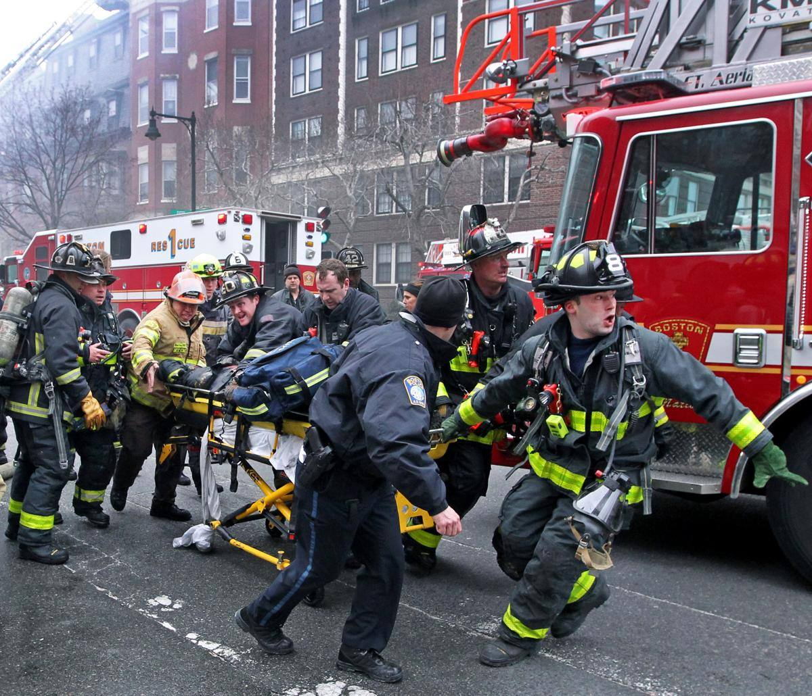

March 26 / Boston \-- It was a cold and very windy day. I was on my way
to another assignment. I had just got out of the car and was about to
put quarters in the parking meter when I got a call from the assignment
desk about a fire on Beacon Street. I was only a quarter mile away, but
by the time I got there the fire had been going on for a while, and
there was a lot of smoke. I was there for maybe a half hour when all of
a sudden there was a lot of commotion. There were a bunch of
firefighters running down the street pushing and pulling a stretcher,
working to revive one of their brothers. As they got closer, they were
screaming for an ambulance, which was about a block away. I found out
later two firefighters died in the blaze. (Jim Davis/globe staff)

July 15 / Off the Massachusetts coast \-- I'm on board the Charles W.
Morgan, the oldest commercial ship still sailing. It's a restored
whaling ship --- basically a floating museum --- that they were sailing
around the New England coast. I had to be in Provincetown at like 3 in
the morning. I drove there, left my car, and sailed back to Boston. It
was incredibly foggy --- of course, my luck. Fog is very difficult to
show in a photograph. It's a long sail, seven or eight hours. You're
looking for anything that can keep your brain alive. Then suddenly this
other antique vessel appeared in the background. In the end the fog made
it more evocative than it would have been without it. (David L.
Ryan/Globe Staff)

The orangutan named Sandra sits in her enclosure at Buenos Aires\' Zoo
in Buenos Aires, Argentina, Monday, Dec. 22, 2014. An Argentine court
has ruled that Sandra, who has spent 20 years at the zoo, should be
recognised as a person with a right to freedom. The ruling would free
Sandra from captivity and have her transferred to a sanctuary in Brazil
after a court recognized the primate as a \"non-human person\" which has
some basic human rights. (Natacha Pisarenko/AP)

Seventeen-year-old Nobel Peace Prize winner Malala Yousafzai said she
was \"honoured\" to be the first Pakistani and the youngest person to be
given the award and dedicated the award to the \"voiceless\". \"This
award is for all those children who are voiceless, whose voices need to
be heard,\" she said in Birmingham, central England on Oct. 10. (Oli
Scarff/AFP/Getty Images)

**Quick-thinking dad saves boy from snake bite near Toowoomba**

**Article:**

**A FATHER'S quick action has saved a young boy from a potentially
deadly snake bite.**

Lawson Goodall, 4, was playing on his farm 40 minutes from the nearest
hospital near Toowoomba. when his father, Scott, received the shocking
news.

"He just jumped to his feet and said 'Daddy I've been bitten by a
snake'," Mr Goodall told 7 News.

A Lady Cilento Children's Hospital spokesman confirmed Lawson had been
bitten by a king brown or red belly black, snakes whose venom has a
one-third fatality rate if the antivenom is not given in time.

Rushing to hospital, Mr Goodall bandaged his son's arm and kept him calm
to minimise blood flow -- first aid he learnt at work.

"In this case, Lawson's dad did the exact right thing," a hospital
spokeswoman said.

Lawson will have sore muscles for a few weeks while samples of his blood
will help researchers improve the antivenom that saved him.

In October a young boy was bitten by a snake he described as a brown
snake north of Toowoomba.

The snake retaliated when the boy accidentally stepped on it when he
opened a screen door to walk outside.

CareFlight chief medical officer Allan MacKillop had some first-aid
advice as the risk of snakebite rose in the warmer months.

"Immobilise the patient and the limb, wrap a crepe bandage right down
the limb and immediately call triple-0," he said.

# Winds expected to fan bushfire

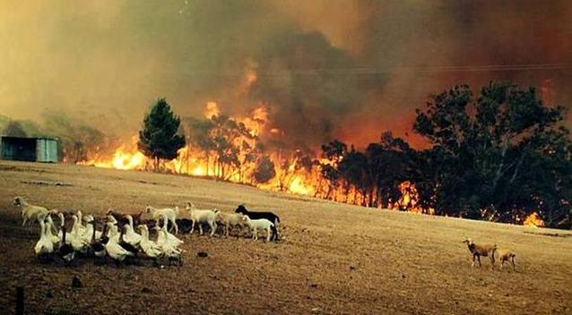

**Article:**

**Strong winds are expected to fan South Australia\'s worst bushfire in
30 years as the Adelaide Hills brace for a third day of devastation.**

Although temperatures are forecast to be lower on Sunday, winds will
keep fire crews and residents fighting desperately to save lives and
property.

Dozens of homes are likely to have been destroyed and seven firefighters
have been injured as South Australia\'s worst bushfire since the 1983
Ash Wednesday blaze continues to threaten lives.

More than 11,000 hectares have been ravaged by fire in the Adelaide
Hills area, with 500 firefighters fighting the out-of-control blaze.

Seven homes have been confirmed destroyed in South Australia and one in
Moyston, Victoria, as fire warnings for Hastings, Bittern and Crib Point
in Victoria were issued during the day.

\"Your life is at risk,\" South Australian Premier Jay Weatherill told
residents of the Mount Lofty Ranges east of Adelaide, urging them to
leave as the \"incredibly dangerous fire\" raged in rugged scrub.

\"If you\'ve decided to stay, you need to be aware that the fire will
become incredibly scary and could lead you to change your mind at some
point. It could be a catastrophic decision for you to leave late,\" he
said.

In western Victoria, three watch and act messages are current. More than
300 fires have started in the state over the past two days.

# British nurse with Ebola in critical condition: hospital

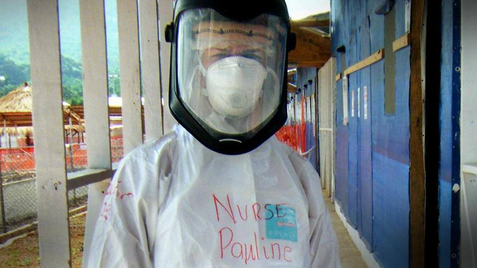

**Article:**

LONDON (Reuters) - A British nurse being treated for Ebola in London is
in critical condition after deteriorating over the last two days, her
hospital said on Saturday.

The Royal Free Hospital has been treating Pauline Cafferkey, 39, with
blood plasma from an Ebola survivor and an experimental anti-viral drug.

She was diagnosed with Ebola on Monday after returning to Britain late
on Sunday from Sierra Leone, where she had been working for the charity
Save the Children at a treatment centre outside the capital, Freetown.

Cafferkey is the first person to have been diagnosed with Ebola on
British soil.

The West African Ebola outbreak was first identified in Guinea\'s remote
southeast in early 2014. Guinea, Sierra Leone and Liberia have borne the
brunt of the 20,000 infections and nearly 8,000 dead.

The Royal Free, Britain\'s main centre for Ebola cases, successfully
treated British aid worker William Pooley with the experimental drug
ZMapp after he was flown back to Britain in August.

The hospital has not specified which drug Cafferkey is being treated
with, but said no supplies of ZMapp were available.

On Wednesday, the hospital had said Cafferkey was sitting up in bed,
talking and reading. But a doctor treating her warned at the time that
the course of the disease could be unpredictable.

Ebola is transmitted through bodily fluids, and the hospital said it was
treating Cafferkey inside a specially designed tent around her bed with
controlled ventilation to reduce the risk of further infections.

# Homeless residents make lives in Madrid\'s airport

Homeless Bulgarian, Valentin Giorgiev, leans on luggage trolleys at
Madrid Barajas Adolfo Suarez Airport\'s terminal 4 on December 30, 2014
(AFP Photo/Pierre-Philippe Marcou)

**Article:**

Madrid (AFP) - In Madrid airport\'s bustling fourth terminal, Edu\'s
trolley is loaded with suitcases, but he won\'t be checking them in.
Unlike the thousands of Christmas travellers, he is not flying anywhere.

For him the terminal is his destination \-- the closest thing he has to
a home.

Nearly two years ago, the 49-year-old unemployed builder wandered into
the airport while trying to hike up the highway to another town.

\"I came in here because I needed to sleep. And here I stayed,\" Edu,
who would not give his surname, told AFP.

He is one of dozens who have made their home in the terminal, with its
bright lights and huge glass windows overlooking the passenger planes on
the runway.

Like other hubs such as London Heathrow and Paris Charles de Gaulle, the
airport\'s warmth, security and free bathrooms, open round the clock,
draw desperate down-and-outs who blend into the crowds of travellers.

Madrid Barajas Adolfo Suarez Airport \-- Europe\'s fifth-busiest with 40
million passengers a year \-- is a public space, so authorities let the
homeless sleep there as long as they cause no trouble.

Police say there are at least 30 people sleeping permanently in terminal
four but the number goes up in the winter. Two days before Christmas,
officers said they counted 42.

Poverty grew in Spain after a construction crash in 2008 threw millions
out of work. Now the recession is officially over but the unemployment
rate is still close to 24 percent.

Among the homeless at Madrid\'s Adolfo Suarez Barajas airport is
Valentin Giorgiev, a 60-year-old ...

The latest official statistics count 23,000 homeless people in the
country, but charities estimate the real figure is closer to 40,000.

Having spent more than half his life in jail for a series of armed
robberies, Gines Rubio, 52, landed in the street after being released
two years ago, separated from his wife and two sons.

In the airport he can get up to 15 euros (18 dollars) a day by begging.
Like others, he eats at a soup kitchen in the suburbs in the day and
comes back to the terminal in the evening.

Like most of the airport\'s residents, he chose the biggest and
brightest terminal, with plenty of floor space and quiet corners to curl
up in.

\"People come to sleep in terminal four because it is the best,\" said
Rubio, a Madrid native with sunken features and a greying beard.

\"I am less cold here. There are bathrooms where you can wash your
hair.\"

Sleeping on the floor there without a blanket, he gets a few hours\'
sleep before the early crowds arrive for the morning flights to London,
Paris, the United States and Latin America.

\"I\'d like to rob half a million euros and get out of here. But I
don\'t resent the other people I see here leaving. They have earned
it.\"

A miniature community has sprung up among the terminal\'s residents,
virtually all of them men.

Edu charges a euro a bag to keep an eye on the others\' belongings. Some
earn tips by pushing passengers\' luggage on trolleys and helping them
find the right check-in desk.

Among them is Valentin Giorgiev, a 60-year-old former school sports
teacher from Bulgaria.

Long separated from his wife and two children, he came to Spain a decade
ago and worked at odd jobs until four years ago when he was diagnosed
with cirrhosis of the liver.

Pushing his trolley around or drinking Coca Cola in the cafes, taking
his medicine and washing in the airport toilets, he blends in with the
crowds of passengers who scarcely notice him until he offers to lug
their bags.

At Christmas time he can earn up to 20 euros a day.

His whole body aches from sleeping on the floor. \"But this is the only
place where you can earn a bit of money,\" he said.

\"You see a lot of people in the street begging, but I would never do
that.\"

He has friends in the terminal, most of them fellow Bulgarians. But
there are also unseen adversaries, he says.

\"I have had lots of my clothes stolen. I feel bad,\" he says, wiping
away tears. \"I have nothing.\"

# 3 men see snout, free moose buried in avalanche

**Article:**

ANCHORAGE, Alaska (AP) --- There\'s an extra moose alive in southcentral
Alaska thanks to three snowmobilers who freed it from an avalanche.

Marty Mobley, Rob Uphus and Avery Vucinich, residents of the
Matanuska-Susitna Borough, on Sunday went riding on the west side of
Hatcher Pass about 55 miles northeast of Anchorage, Alaska Dispatch News
(http://bit.ly/1AinLEQ ) reported. With Alaska\'s unseasonably warm
weather, they were wary of avalanches, Mobley said.

The came upon a hillside that had both moose tracks and ski tracks. The
latter stood out because they don\'t see many skiers in the area.

About an hour later, they returned and saw that an avalanche had come
down, wiping out the tracks. The three friends were concerned that a
skier might have been trapped but also knew more snow might fall.

\"We had about 2,500 feet of mountain above us still,\" Mobley said.
\"Half slid, half didn\'t, so we didn\'t want to screw around a bunch
there.\"

Mobley spotted something brown moving in the hard-packed snow of the
debris field.

\"It looked like a guy\'s arm at first because we were expecting to see
a skier,\" Mobley said. \"But it was moaning and groaning and moving and
we realized it was a moose, even though only his ears and some of its
snout was sticking out of the snow.\"

The men grabbed shovels. Two men dug while the other looked for signs of
another avalanche. When the animal\'s head was cleared, Vucinich took a
picture. The moose didn\'t struggle and appeared calmer as they cleared
snow.

\"It didn\'t even fight us,\" Mobley said. \"It was like, \'Help me.
Help me.\' It was totally docile and let us touch it. It just (lay)
there,\" Mobley said.

After about 10 minutes, Mobley said, three-quarters of the animal was
free. The men were not sure if the moose was injured. One poked the
moose\'s rump with a shovel.

\"It stood right up and towered over us, because we were in kind of a
hole from the digging,\" Mobley said. \"It looked like the abominable
snowman because its fur was so packed with snow and it looked at us,
shook the snow off it, and off it went.\"

The moose was \"at full steam\" when it ran down the mountain. It
appeared to be uninjured, which was a surprise.

\"It slid at least 1,500 to 2,000 feet down the mountain when it got
caught in the avalanche,\" Mobley said.

Mobley said the men couldn\'t leave the moose to die.

\"Besides, we deal with a lot of avalanches and a lot of snow,\" he
said. \"That kind of karma is something we don\'t pass up.\"

# Dog not gone: Rescue in the Columbia Gorge

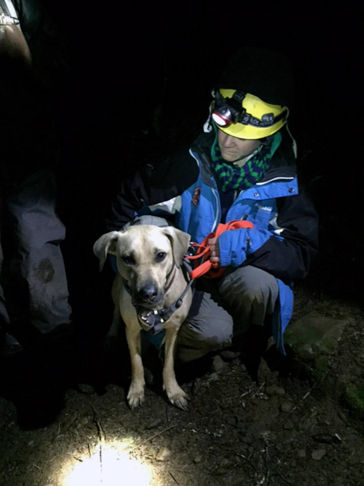

**Article:**

PORTLAND, Ore. (AP) --- A yellow Labrador that got spooked on a
Christmas Day hike in the Columbia Gorge, snapping her leash and
plunging 150 feet down a cliff, was rescued in the dark by a climber who
rappelled to a narrow ledge where the dog was trapped.

David Schelske of West Linn told the Oregon Humane Society that when
3-year-old Sandy bounded around a bend and disappeared he figured her
for a goner.

He hiked to the bottom of the cliff and saw her stranded on a narrow
ledge 70 feet above.

About 7 p.m., an eight-person crew helped Humane Society volunteer John
Thoeni (TAY\'-nee) descend.

He fitted a rescue harness on the frightened dog, and the two were
hoisted to safety. Sandy suffered minor injuries but walked out to the
trailhead.

**\**

In this photograph taken on April 16, 2014, a veterinary staff member of
the Sumatran Orangutan Conservation Programme Centre conducts medical
examinations on a 14-year-old male orangutan.

**\**

Orchid the Arab-Thoroughbred cross enjoys a roll in her paddock in
Brentwood, Essex. The 49-year-old is thought to be the world\'s oldest
horse

Picture: Caters

**\**

Primates wrap up in freezing conditions after the boiler at the Wales
Ape and Monkey Sanctuary broke down.

Picture: WALES NEWS SERVICE

**Candid Moments**

**\**

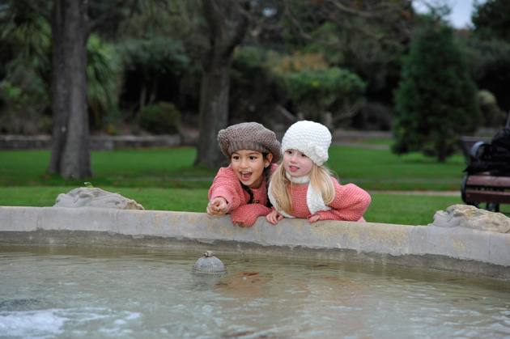

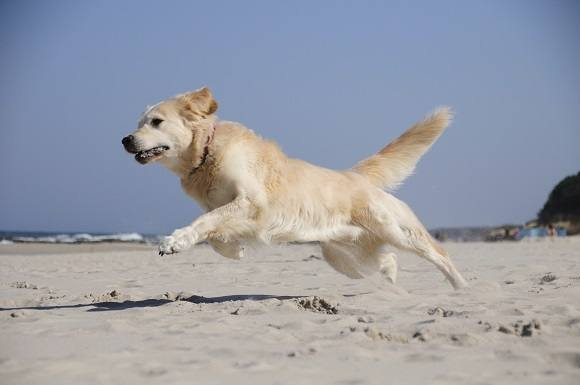

**\**

**\**

**\**
**\**

**\**

**\**

**\**

**\
The Best Person in the World**

### [More Than Just Jewellery - The Akola Project](http://news.yahoo.com/blogs/best-person-in-the-world/more-than-just-jewelry---the-akola-project-135853844.html)

[ABC News Best
Person](http://news.yahoo.com/author/abc-news-best-person) at Best
Person In The World10 days ago

10\. That's the average number of children a typical woman in Uganda
must care for. Often with little or no education, dim prospects for
finding healthcare, jobs or husbands to help, Ugandan women frequently
struggle to support their families on their own.

Enter The Akola Project. Started by Brittany Merrill Underwood in 2007,
the non-profit trains Ugandan women to make delicate jewellery pieces
and sells the items in more than 300 stores across the U.S.    

Women who work with Akola can earn an average of four times the local
wage, according to the Project. And this income can stretch far,
Underwood says, to not only support the women and their own children,
but for some, it can change the lives of generations to come.  

"These are symbols of hope and transformation," she says of the
jewellery.

Akola currently employs about 250 women in Uganda and Underwood expects
to nearly double that number in 2015. She estimates their work has
impacted the lives of thousands of children.

### [Matching Gardeners to Pantries Brings A Harvest of Caring](http://news.yahoo.com/blogs/best-person-in-the-world/matching-gardeners-to-pantries-brings-a-harvest-of-caring-134446389.html)

[ABC News Best
Person](http://news.yahoo.com/author/abc-news-best-person) at Best
Person In The World17 days ago

In his bountiful garden in New Jersey, Gary Oppenheimer was producing
more than he could eat. Rather than let his yield go to waste, he found
a local food pantry that provides food to victims of domestic abuse.
This idea grew into AmpleHarvest.org, a service that pairs gardeners
with food pantries.

"Most gardeners grow more than they can use, preserve or give to
friends.  The idea is that if there's food that you can't use... get it
to somebody else who needs it."

With the motto "no food left behind" Oppenheimer has taken the food
donation world by storm - signing up more than 7,000 food pantries
across the country.

Roberta Cevasco, director of the St. Joseph Food Pantry in West Milford,
New Jersey, estimates during peak growing season, nearly one-third of
the food she distributes is fresh fruits and vegetables.

"People wouldn't be able to afford this to go out to stores to buy it.
 So they do very much appreciate getting it," says Cevasco.

Gary Oppenheimer lives in Northwestern New Jersey with his wife and dog,
where he continues to expand AmpleHarvest.org.

### [After a Death, Helping Children Heal](http://news.yahoo.com/blogs/best-person-in-the-world/after-a-death--helping-children-heal-153811782.html)

ABC News Best Person at Best Person In The World24 days ago

Leslie Delp will tell you she has three children - two alive and one in
heaven. A grief counsellor, she developed a unique form of therapy to
help others through the mourning process.

 In 2003, with the help of community volunteers, the first Olivia's
House opened, the non-profit that is a realization of Leslie's vision to
support children through times of loss.   

 Through dynamic therapy sessions including art therapy and equine
therapy, Olivia's House has helped more than 1400 children of all ages
through the process of grieving - at no cost to families. 

 Emily and Shannon Francis attended Delp's program after the suicide of
their father.  Emily says, "there's always going to be a hole in your
heart...but it gets smaller and smaller."

 "Most people think about death in a negative way... at Olivia's house
we embrace it. We think about death as an opportunity to think about
life," says Delp.

  Leslie Delp operates Olivia's House locations in York and Hanover,
Pennsylvania.  Her dream is to have grief centres in communities
throughout the country.  

### [Ivan Owen Gives the World a (3D-Printed) Hand](http://news.yahoo.com/blogs/best-person-in-the-world/ivan-owen-gives-the-world-a--3d-printed--hand-145713712.html)

[ABC News Best
Person](http://news.yahoo.com/author/abc-news-best-person) at Best
Person In The World29 days ago

When Ivan Owen posted a video of his homebuilt mechanical hand on
Youtube in 2011, he never could have predicted how far it would reach.

A South African man who was missing fingers saw the video, contacted
Ivan and they collaborated to develop a style of prosthesis that was
cheap and customizable. Following this success, a mother of a boy born
without fingers on his right hand contacted Ivan to make a full
prosthetic hand.

This grew into the e-NABLE Community, founded by R.I.T.\'s Jon Schull,
which provides downloadable plans online for affordable 3-D Printed
Mechanical Prosthetics that anyone can try building on their own.

Today e-NABLE has grown to include over 1500 designers and engineers,
successfully provided mechanical hands to over 400 recipients\--and
that's just the beginning. "With a grassroots dynamic global
organization you never really know what's going to happen and that's
exciting" says Owen.

Ivan Owen is a propmaker and self-taught engineer who lives in
Bellingham, WA and assists with teaching 3D printing and mechanical
design at the University of Washington Bothell campus.

### [Dan Austin Gives Bikes to Survivors of Human Trafficking](http://news.yahoo.com/blogs/best-person-in-the-world/dan-austin-gives-bikes-to-survivors-of-human-trafficking-163623204.html)

[ABC News](http://news.yahoo.com/author/abc-news) at Best Person In The
World 1 mth ago

Dan Austin endows bikes to girls in need around the world, mostly
survivors of human trafficking, through 88bikes, the non-profit he
founded in 2006.

In addition to bike donation, 88bikes has also launched Seamless
Possibilities, a week-long dressmaking workshop that builds vocational
skills and community.

In what Austin calls Joy-Based Philanthropy©, 88bikes connects donors
with recipients on a one-to-one basis so they can be an active
participant in the joy they are giving.

For the girls, "The happiness they so deserve is now within reach", says
Austin.

Today, over 2000 bikes have been donated. The organization offers bike
maintenance training, group rides and bike-based job skills in Cambodia,
Uganda, Peru, Vietnam, Nepal, India, Ghana, Mongolia and Tanzania, among
others. For donors, 88 dollars is what it takes to gift a girl with a
bicycle.

Dan Austin, living in Seattle, WA. is the director of seven
documentaries and author of three books. His 1999 documentary True Fans
tells the story of the bike ride he took across America with his brother
and best friend.

