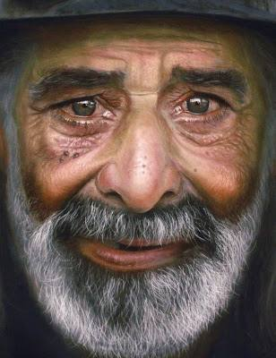

**Writer's Notebook**

**(11)**

**Quick-Writes**

**Photographs - People**

**Writer's Notebook 11**

**Photographs -- People**

**Emotions**

**Using Photos**

**Specific Craft** E.g.

Dialogue

Description

Write about a photo applying the craft.

**Different Genre**

Write off the genre in a specific genre. E.g.

Narrative

Poetry

Newspaper Report

Persuasive Text

Explanation

Procedure

Discussion

Report

Recount

Review

**Genre Switch**

Switch genres while writing. E.g. every 3-4 minutes.

**Narrowing the focus**

Some photos present several possibilities which enable the writer to
write just about one thing.

Am I going to write about: \...

**Whose Perspective?**

Whose perspective are you going to write from?

- The photographer

- The subject in the photo

- An onlooker

<!-- -->

- An observer of the photo not present

**Whose Perspective?**

Will I write from the perspective of the \... or the \... **?**

**Point of View**

Students in pairs.

Use photos showing two or more children.

Discuss interpretation

> Each student chooses one of the characters in the photo and writes
> about what is happening, assuming that character's point of view.
>
> The same thing can be done writing dialogue between the two
> characters.

**Character Sketch**

Students write a character sketch.

> Provide a scenario and students describe how their characters would
> react and why.

**Stories about Children**

Photos of children doing something.

Who is the child?

What is his/her name?

What is the person's family like?

How old is the child\>

What is he/she feeling?

Students also write a full description of the setting, including some
sense impressions.

Possible plot. Write a story placing the child/children in the setting.

**\**

![magictransistor: Inuit Woman and Child (Unknown) 'Madonna of the
North', c 1912. \[Library of Congress Prints and
Photographs\]](assets/People Photos - Writer's Notebook 11 Quick Writes/media/media/image8.jpeg)

**\**

**\**

**\**

**\**

**\**

**\**

**\**

**\**

**\**

**\**

**\**

**\**

