**Writer's Notebook**

**(3)**

**Quick-Writes**

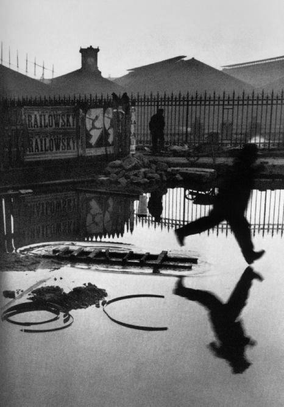

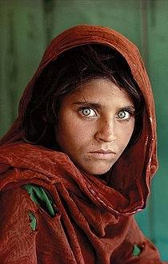 **Photographs**

**Writer's Notebook 3**

**Quick Write photo exercise**

Overview: Look at the photo. You can write fiction or non-fiction,
reflection or persuasive essay, poetry or prose. Reflect on what the
picture means to you or imagine that you are inside the picture or,
even, imagine you are observing the scene as it happens. You can take
the viewpoint of anyone or anything in the picture, someone just outside
the view of the image, or, even, the photographer.

**Does the photo tell a story?** 

In strong photos, the story is revealed at first glance, and it is
self-contained. In the best images, the story evokes an emotional
response from the viewer. It\'s that emotional response that ultimately
makes the image memorable. Try asking these questions as you evaluate
images to decide if the image tells a story.

- At a minimum, does the photo make a statement that you can articulate?

- Does the photo elicit an emotion? In other words, can you relate to
  the subject or the situation?

As far as possible I've chosen photos that disclose more about the
subject or show it in unexpected ways. Of course it's been my judgement
as to whether each photo relates visual elements in unusual and
intriguing ways. In most cases I think the selection has been because of
an emotional response to the image. That response will differ with
everyone that views the image, and I continue to be amazed at the
responses our students create.

Let their imaginations run wild and have fun!

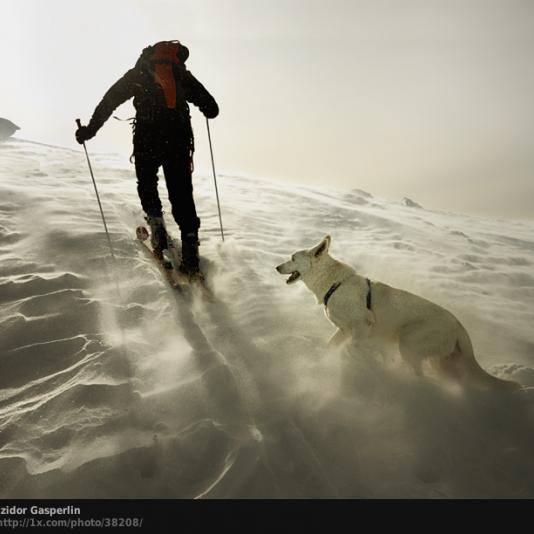

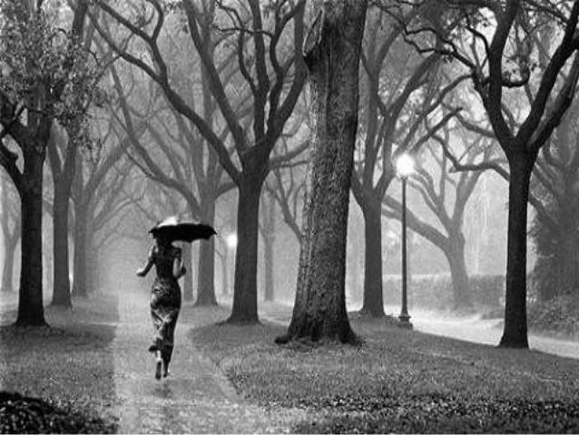

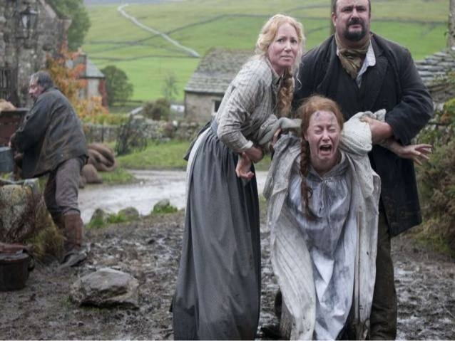

**\**

**\**

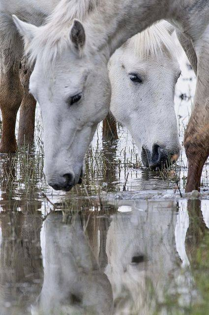

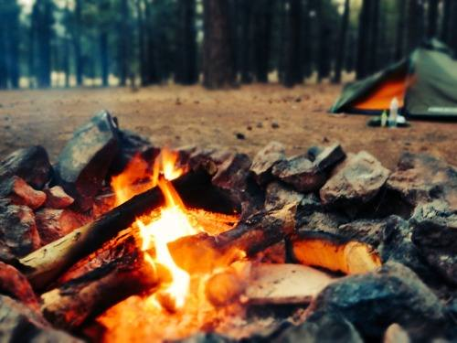

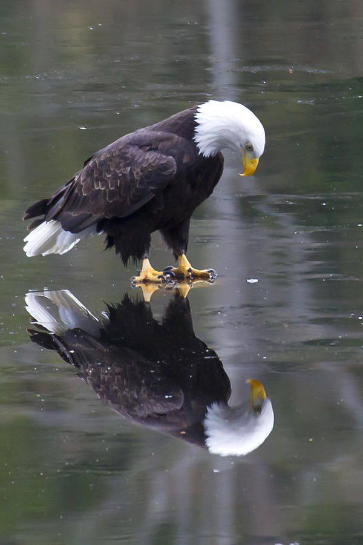

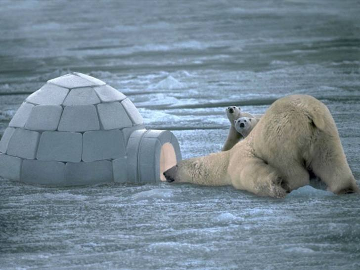

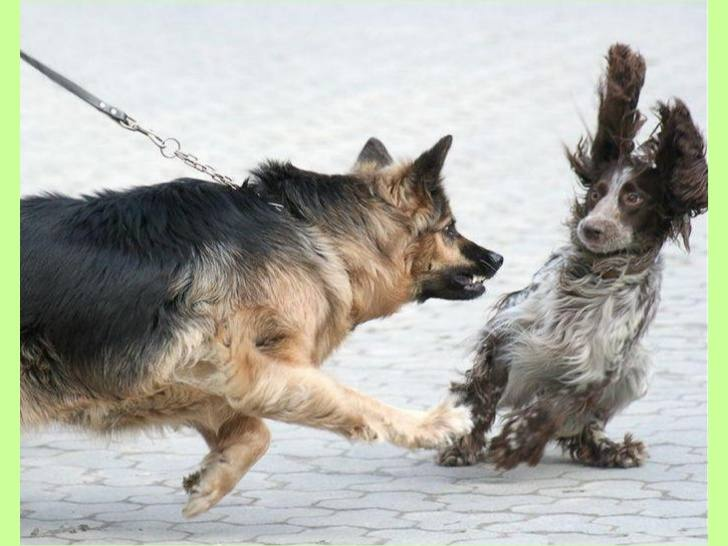

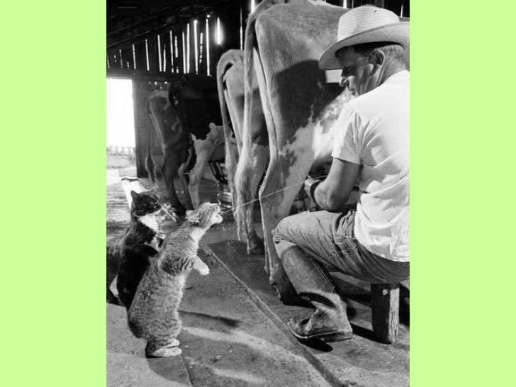

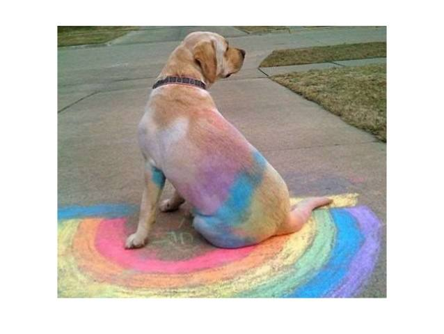

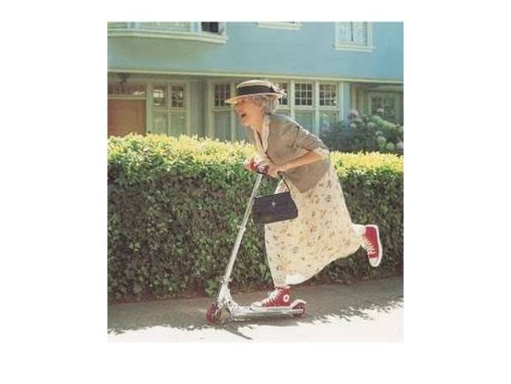

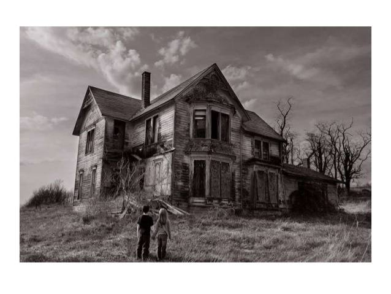

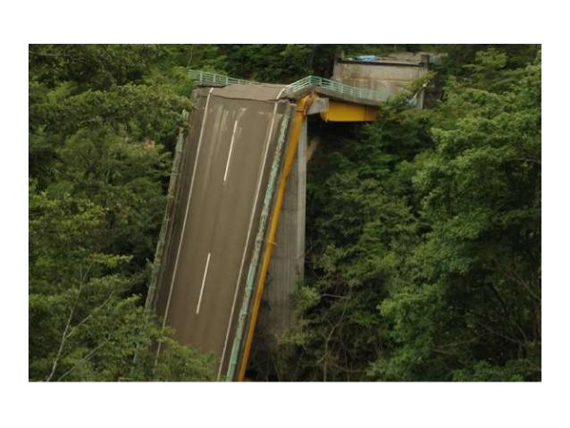

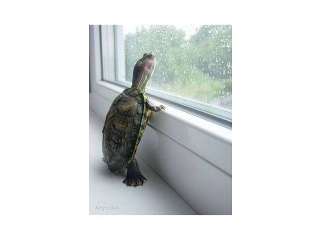

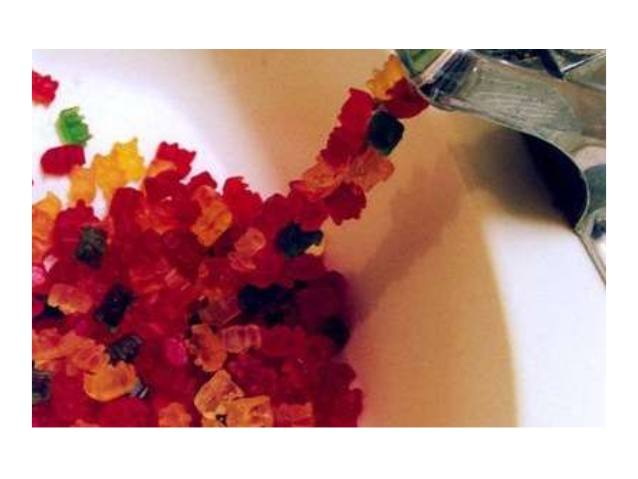

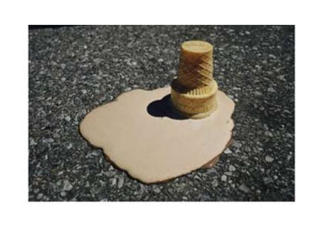

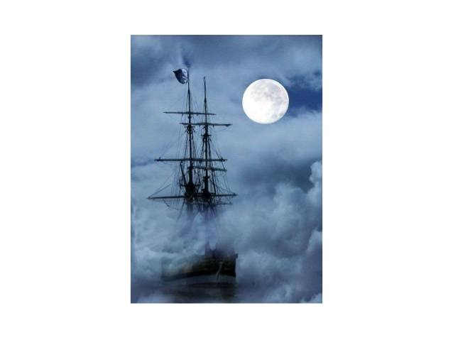

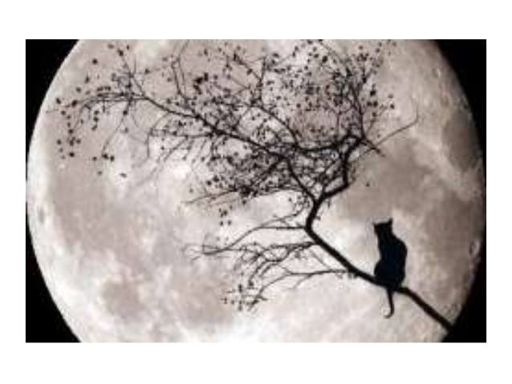

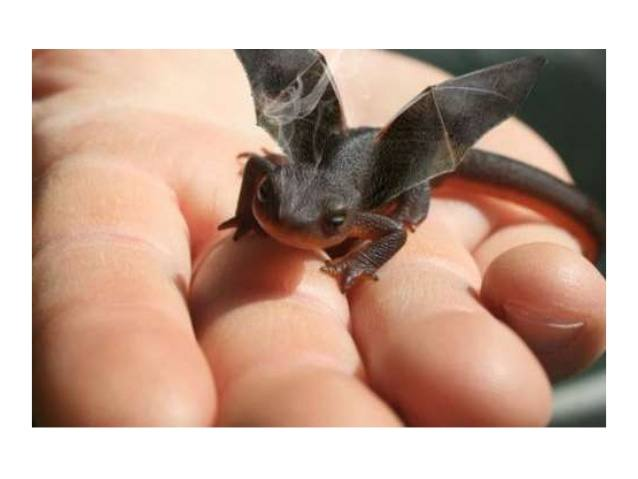

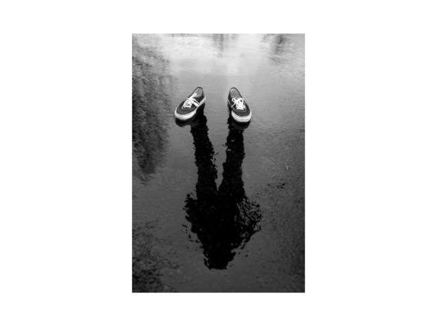

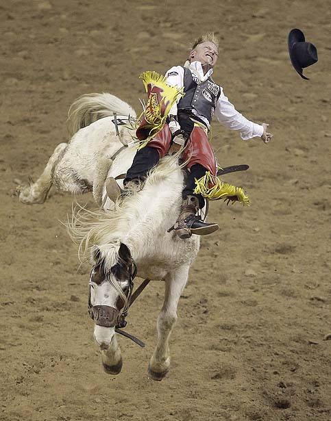

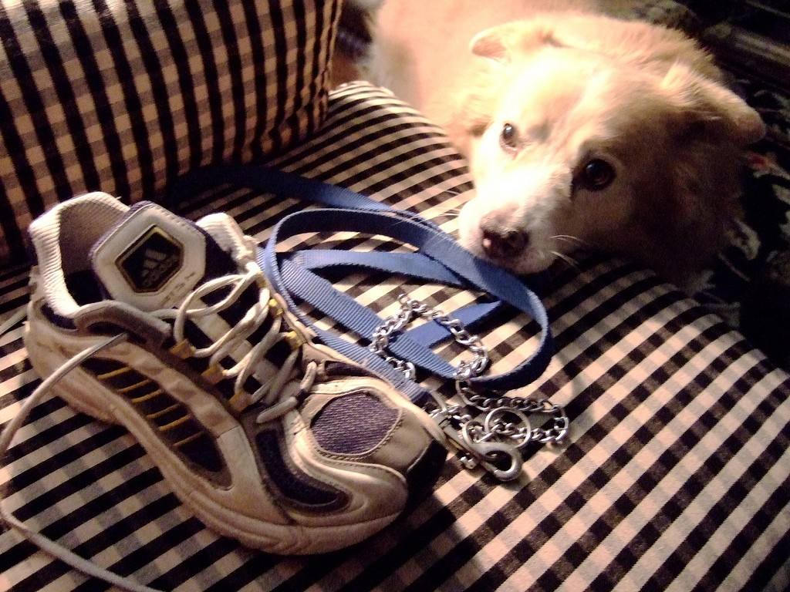

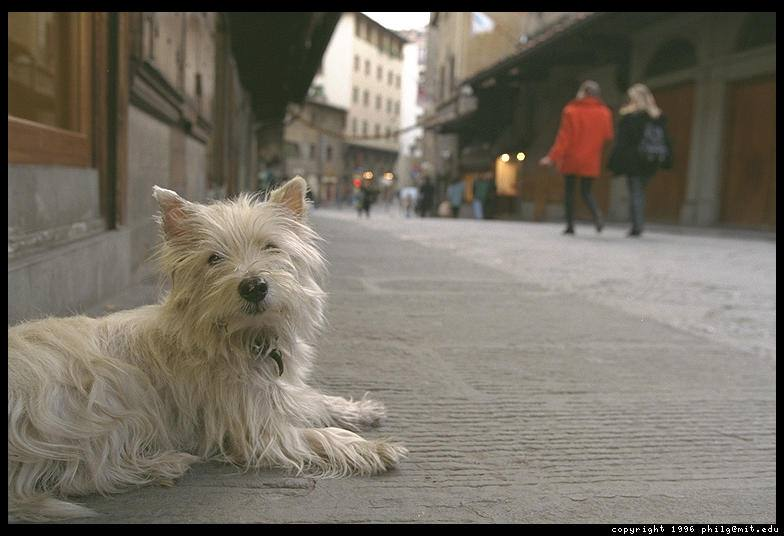

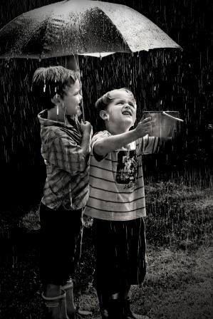

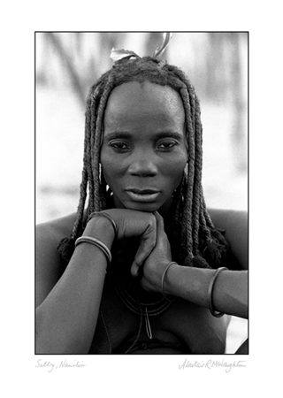

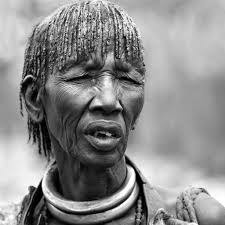

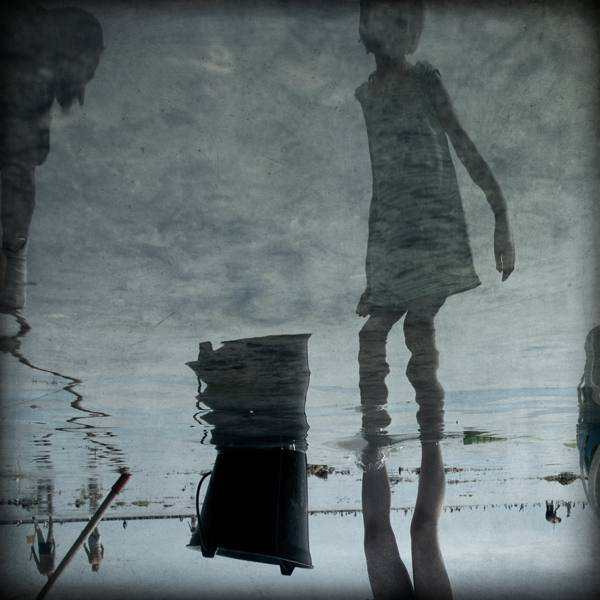

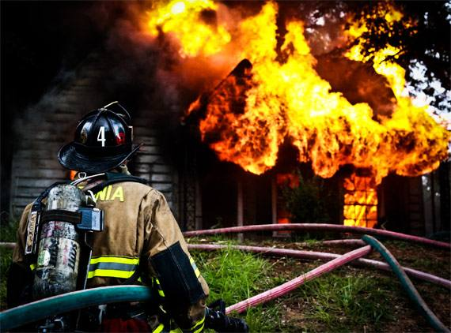

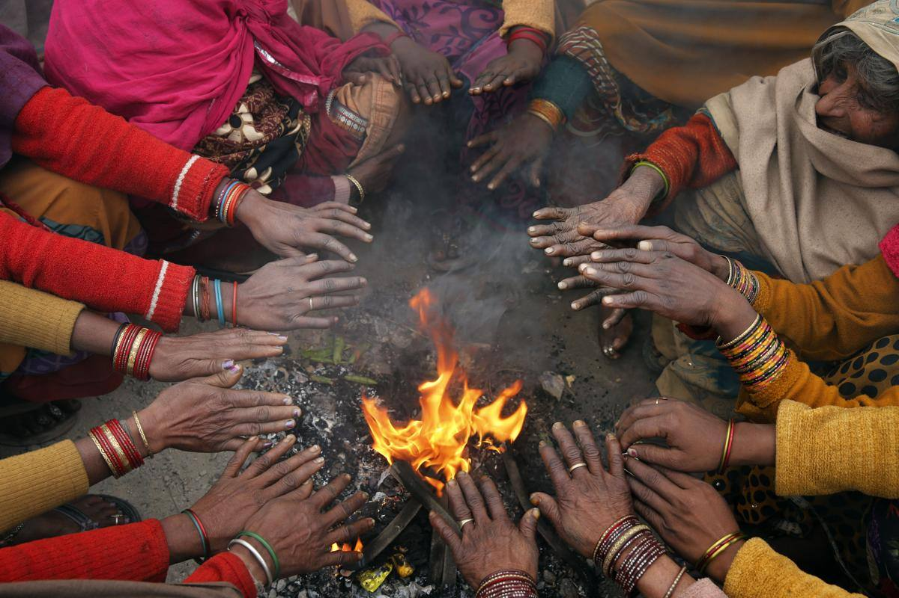

