**Writer's Notebook**

**(7)**

**Quick-Writes**

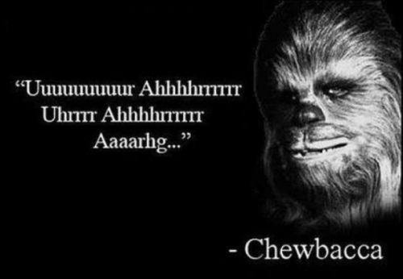

**Quotes**

**\**

**Writer's Notebook 7**

Quotes

**Helen Keller** 1880-1968

The best and most beautiful things in the world cannot be seen or even
touched - they must be felt with the heart.

Your success and happiness lies in you. Resolve to keep happy, and your
joy and you shall form an invincible host against difficulties.

Walking with a friend in the dark is better than walking alone in the
light.

Keep your face to the sunshine and you cannot see a shadow.

Optimism is the faith that leads to achievement. Nothing can be done
without hope and confidence.

Alone we can do so little; together we can do so much.

The only thing worse than being blind is having sight but no vision.

Once I knew only darkness and stillness\... my life was without past or
future\... but a little word from the fingers of another fell into my
hand that clutched at emptiness, and my heart leaped to the rapture of
living.

So long as the memory of certain beloved friends lives in my heart, I
shall say that life is good.

All the world is full of suffering. It is also full of overcoming.

The highest result of education is tolerance.

Life is a succession of lessons which must be lived to be understood.

Never bend your head. Always hold it high. Look the world straight in
the eye.

No pessimist ever discovered the secret of the stars, or sailed to an
uncharted land, or opened a new doorway for the human spirit.

Literature is my Utopia. Here I am not disenfranchised. No barrier of
the senses shuts me out from the sweet, gracious discourses of my book
friends. They talk to me without embarrassment or awkwardness.

What I am looking for is not out there, it is in me.

When we do the best that we can, we never know what miracle is wrought
in our life, or in the life of another.

My share of the work may be limited, but the fact that it is work makes
it precious.

One can never consent to creep when one feels an impulse to soar.

We can do anything we want to if we stick to it long enough.

I long to accomplish a great and noble task, but it is my chief duty to
accomplish small tasks as if they were great and noble.

Instead of comparing our lot with that of those who are more fortunate
than we are, we should compare it with the lot of the great majority of
our fellow men. It then appears that we are among the privileged.

Smell is a potent wizard that transports you across thousands of miles
and all the years you have lived.

Toleration is the greatest gift of the mind; it requires the same effort
of the brain that it takes to balance oneself on a bicycle.

The world is moved along, not only by the mighty shoves of its heroes,
but also by the aggregate of tiny pushes of each honest worker.

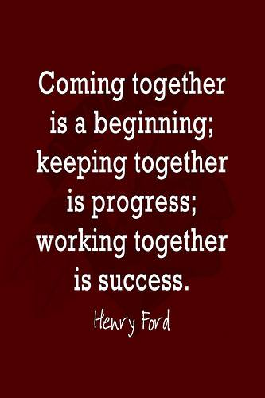

[I woke up one morning thinking about wolves and realised that wolf
packs function as families. Everyone has a role, and if you act within
the parameters of your role, the whole pack succeeds, and when that
falls apart, so does the
pack.](http://www.brainyquote.com/quotes/quotes/j/jodipicoul429302.html)

[**Jodi
Picoult**](http://www.brainyquote.com/quotes/quotes/j/jodipicoul429302.html)

**\**

Wherever I go, I\'m watching. Even on vacation, when I\'m in an airport
or a railroad station, I look around, snap pictures, and find out how
people do things.

Richard Scarry 1919-1994

I want kids to think that reading can be just as much fun and more so
than TV or video games or whatever else they do. I think any other kind
of message or morals that I might teach is secondary to first just
enjoying a book.

Louis Sachar 1954 --

Write what you care about. If you do that, you stand the best chance of
doing your best writing.

Jerry Spinelli 1941 -

Don\'t get it right, just get it written.

James Thurber 1894-1961

Strength is the capacity to break a chocolate bar into four pieces with
your bare hands - and then eat just one of the pieces.

Judith Viorst 1932 --

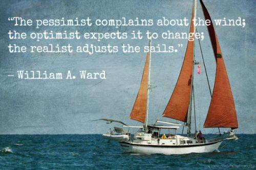

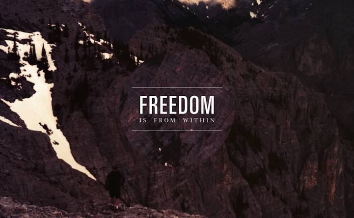

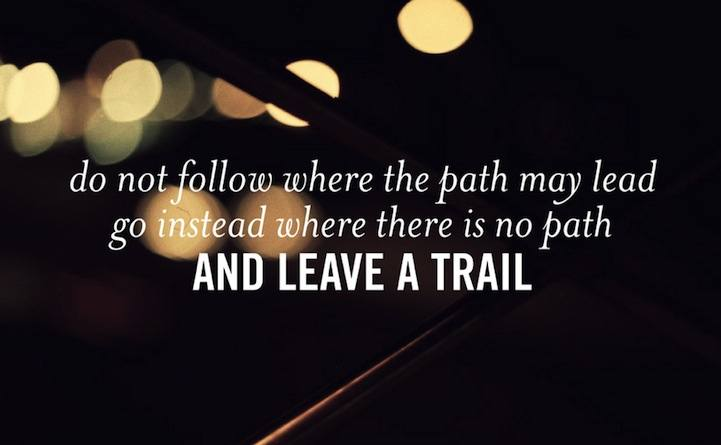

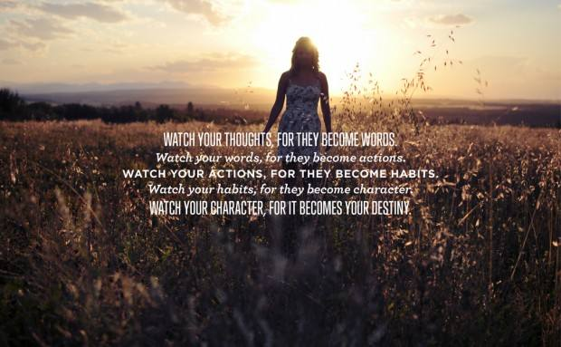

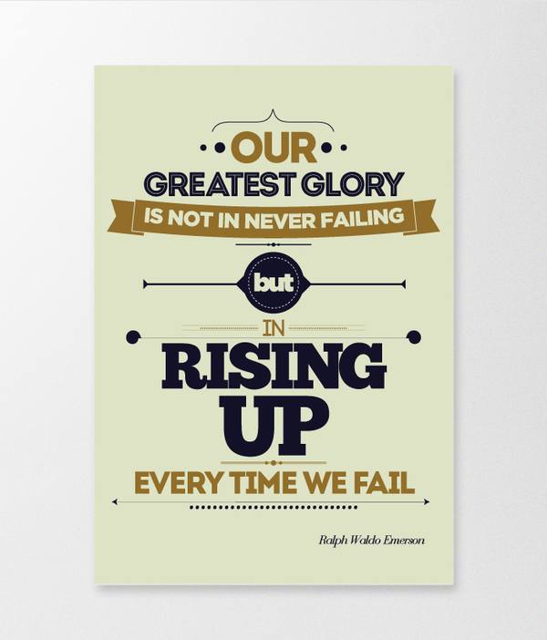

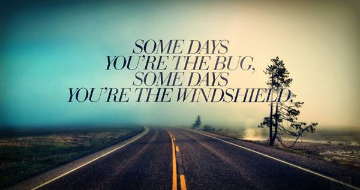

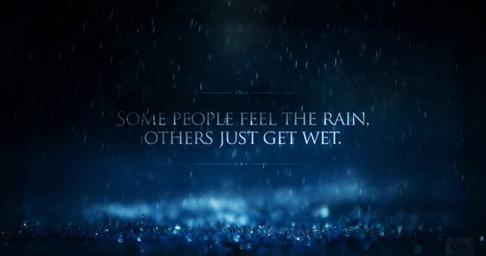

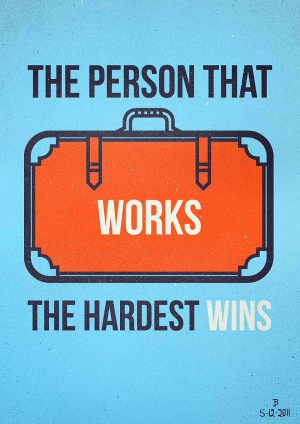

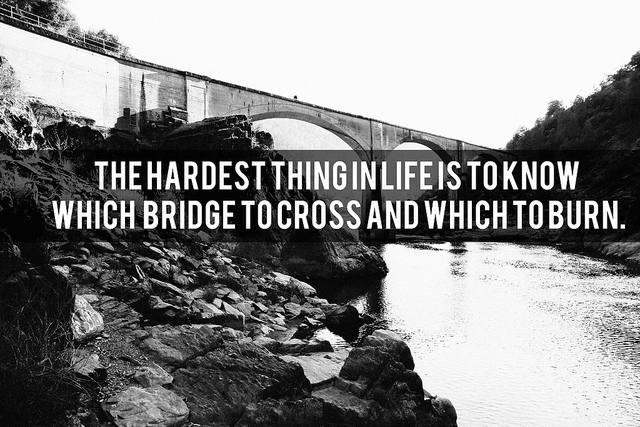

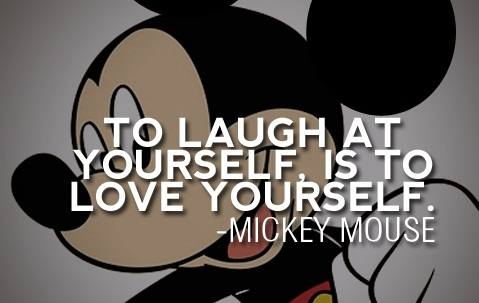

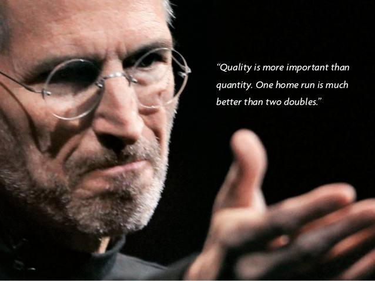

Steve Jobs

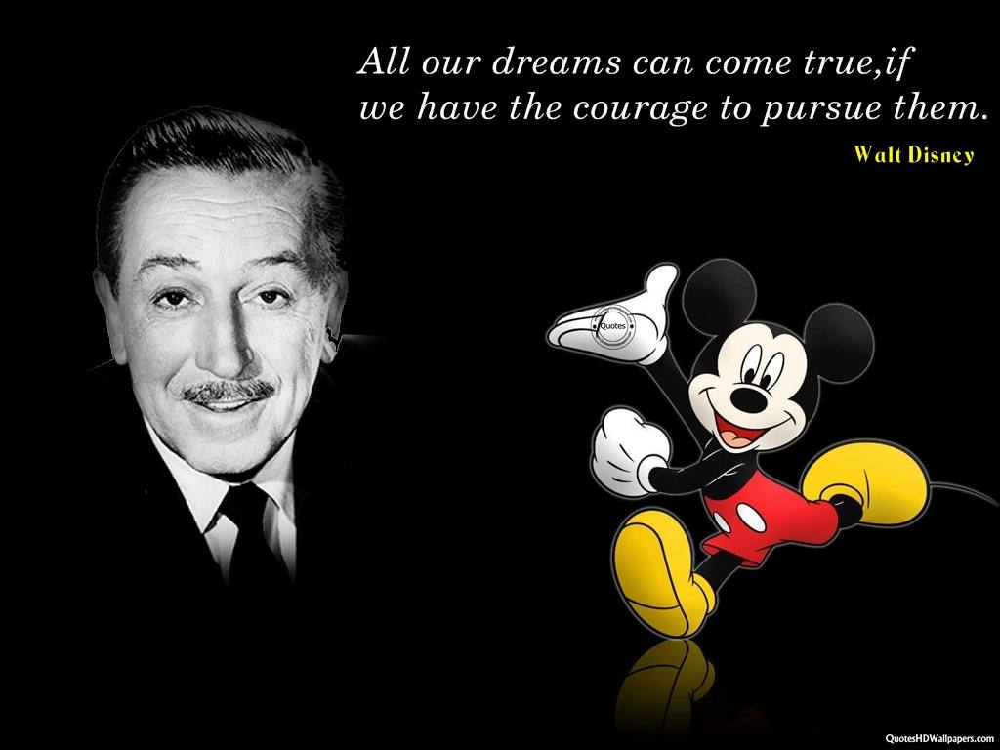

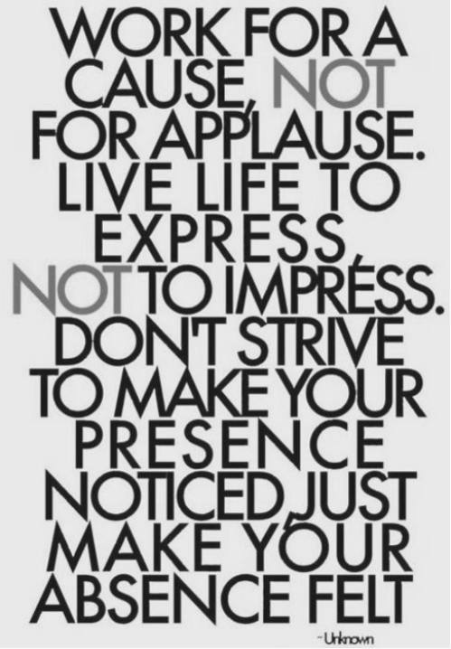

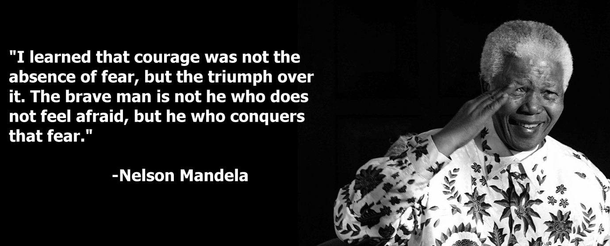

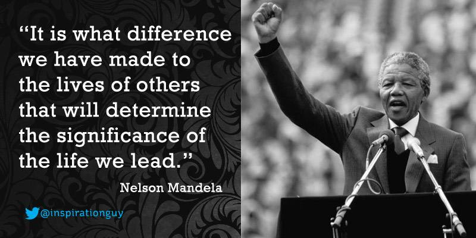

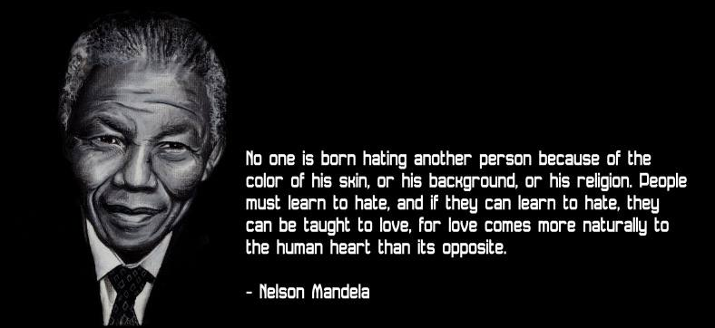

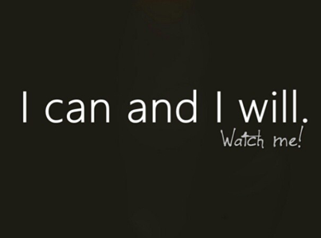

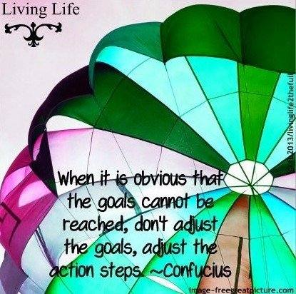

