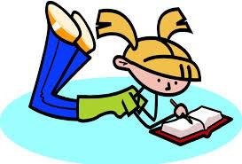
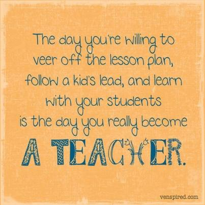
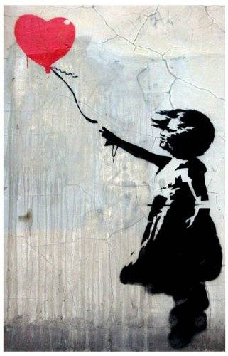
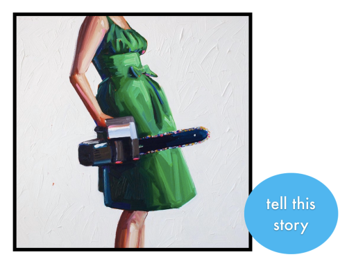
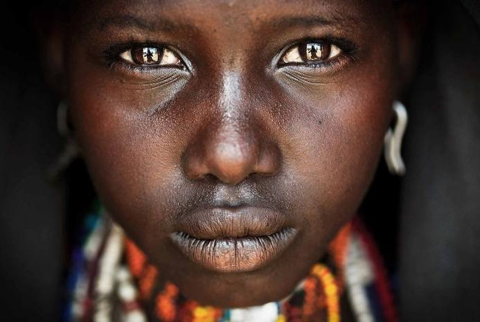
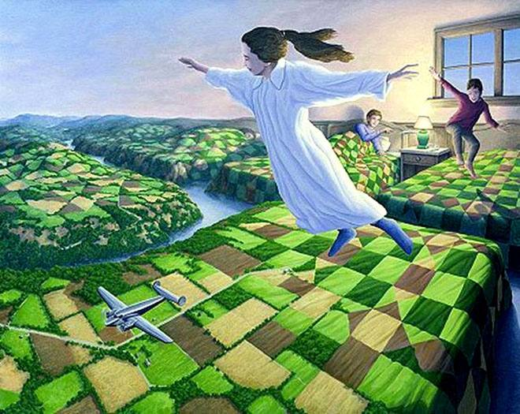

**Writer's Notebook**

{width="5.208333333333333in"
height="3.8333333333333335in"}

**Contents**

{width="2.3229166666666665in"
height="1.5729166666666667in"}

**Writer's Notebook**

Why Notebooks?

Writer's Notebook

Launching

Collecting

Finding a Seed

Nurturing the Seed

From the Notebook

More Ideas for Writer's Notebook

The Name Project

My Name by Sandra Cisneros

More Ideas for Writer's Notebook (Handout for Student's Notebooks)

Reading Like Writers and Writer's Notebook

Five Kinds of Leads

Possible Narrative Leads

Leads and Mentor Texts

Non-fiction Leads

Non-fiction Conclusions

Mapping the Text

Author Style

Notebooks and Genre

Genre Switch

Narrative

Story map

Endings

Mentor Texts

Twilight Comes Twice Ralph Fletcher

Chrysanthemum Kevin Henkes

Slower than the Rest Cynthis Rylant

John Henry Julius lester

Don't let the Pigeon Stay up Late Mo Willems

The Pain and the Great One Judith Viorst

Nothing Ever happens on 90^th^ Street Ronni Schotter

Don't Be Nervous Kate Skinner Gr. 6 W.P.S.

When I was Little Jamie Lee Curtis

Wilfred Gordon McDonald Partridge Mem Fox

Hey World, Here I Am Jean Little

About Notebooks Jean Little

Keeping Journals Jean Little

Even More Ideas for Writer's Notebook

Make Art Like You're Working Carol Mittal

**Writer's Notebook 2**

{width="1.8333333333333333in"
height="1.8333333333333333in"}

**QUICK WRITES**

Through the Door

Random Word Quick Writes

Active Verbs and Colour Adjectives

Writing Prompts

Graphic/Text Prompt

Quotes

Story Starters

Complex Sentences with Three Subordinate Conjunctions

Thoughtshots

Show-don't-tell elaboration strategy

Sensory Descriptions using Settings

Point of View

Assume the identity of a character

Literature Extracts

{width="0.96875in"
height="1.5208333333333333in"}

**Writer's Notebook 3 Photographs - varied**

**Quick Write photo exercise**

Overview: Look at the photo. You can write fiction or non-fiction,
reflection or persuasive essay, poetry or prose. Reflect on what the
picture means to you or imagine that you are inside the picture or,
even, imagine you are observing the scene as it happens. You can take
the viewpoint of anyone or anything in the picture, someone just outside
the view of the image, or, even, the photographer.

**Does the photo tell a story?** 

In strong photos, the story is revealed at first glance, and it is
self-contained. In the best images, the story evokes an emotional
response from the viewer. It\'s that emotional response that ultimately
makes the image memorable. Try asking these questions as you evaluate
images to decide if the image tells a story.

- At a minimum, does the photo make a statement that you can articulate?

- Does the photo elicit an emotion? In other words, can you relate to
  the subject or the situation?

As far as possible I've chosen photos that disclose more about the
subject or show it in unexpected ways. Of course it's been my judgement
as to whether each photo relates visual elements in unusual and
intriguing ways. In most cases I think the selection has been because of
an emotional response to the image. That response will differ with
everyone that views the image, and I continue to be amazed at the
responses our students create.

Let their imaginations run wild and have fun!

**Using Photos**

**Specific Craft** E.g.

Dialogue

Description

Write about a photo applying the craft.

**Different Genre**

Write off the photo in a specific genre. E.g.

Narrative

Poetry

Newspaper Report

Persuasive Text

Explanation

Procedure

Discussion

Report

Recount

Review

**Genre Switch**

Switch genres while writing. E.g. every 3-4 minutes.

**Narrowing the focus**

Some photos present several possibilities which enable the writer to
write just about one thing.

Am I going to write about: \...

**Whose Perspective?**

Whose perspective are you going to write from?

- The photographer

- The subject in the photo

- An onlooker

<!-- -->

- An observer of the photo not present

**Whose Perspective?**

Will I write from the perspective of the \... or the \... **?**

**Point of View**

Students in pairs.

Use photos showing two or more children.

Discuss interpretation

> Each student chooses one of the characters in the photo and writes
> about what is happening, assuming that character's point of view.
>
> The same thing can be done writing dialogue between the two
> characters.

**Character Sketch**

Students write a character sketch.

> Provide a scenario and students describe how their characters would
> react and why.

**Stories about Children**

Photos of children doing something.

Who is the child?

What is his/her name?

What is the person's family like?

How old is the child\>

What is he/she feeling?

Students also write a full description of the setting, including some
sense impressions.

Possible plot. Write a story placing the child/children in the setting.

Where are you in the photo?

Who do you identify with and why?

**In Writing:**

- Expand the captured moment.

- Narrate the story.

- Explain the context.

- Develop its purpose

- Interpret the images.

- Note what isn't there.

**Write in Various Genres** (See Genre revision at end)

- Who is in the photo?

- What is happening?

- What happened before?

- What happened after?

- Why was the subject photographed/painted?

- Who isn't there? Why?

- Who or what is just beyond the frame?

- What was the photographer's/artist's purpose?

- What was the purpose or thinking of those in the picture?

**Active Voice**

Encourage active voice to make the students' work concise and strong.
e.g.

Active: Mary kicked the ball.

Passive: The ball was kicked by Mary.

> Passive construction relies on helping verbs, making sentences less
> powerful and more confusing than active construction.

**Look at the Photo:**

Make: 3-5 Observations

3-5 Inferences

3-5 Predictions

Write

See also **Writing from Photographs** in our Writing Course (Ref.
Literature 2)

(Repeated below)

**WRITING FROM PHOTOGRAPHS**

**Photo Journals.**

Telling our stories through photos and writing. Students bring a series
of photos from home. Get them to find their 'storytelling voice'.

*..."I was my mother's first child. Now I have a little brother. We'll
get to that later; although I have to tell you, I wished for a baby
sister...*

*Some people said that my cousin and I had a resemblance on our first
birthdays. That means we looked alike. I didn't see it one bit! I think
that's because I see him too much. We had our birthdays on the same day
because we were born in the same month. But we had different birthday
cakes! By the way, his name is Jermaine Cameron..."*

Jhannel Gr 5 (The Bronx)

...*My mum doesn't ask for much. All she asks for is respect, good
grades, to keep the house tidy, and to love one another. She is never
usually mean to anybody. The reason for this is because my mum grew up
with many things that people did to her that she disliked. So whatever
she hated when she was a child, she doesn't do to us. She thinks like an
adult and a child..."*

Nickiesha Gr 5 (The Bronx)

**Giving Life to Objects**

I photographed all the sculptures in a sculpture garden. Split into two
subject areas -- realistic and mythological -- I displayed the realistic
photos to Nick's grade 6, and the mythological sculptures to Vassie's
grade 5. The students chose a photo and wrote off it. To assist their
planning the mini-lesson was a discussion around the following
questions:

Who are the people?

What are they doing?

Why?

Where are they?

What is the background to the photo we can't see?

What is happening now outside of the photo?

What is going to happen?

***Whispers of the Summer Breeze***

*My hand on my heart,*

*My hand held out.*

*I'm waiting for you to fill me up*

*With your strong powerful heart.*

*I will not rest,*

*I will not blink*

*Until things are back*

*To how they used to be.*

*But the summer breeze*

*Has long gone.*

*And the darkness*

*Has become one*

*In all of us.*

*I close my eyes*

*And hope you come.*

*Rebecca Dent 5a (Wembley)*

***The Last Breath***

*A hospital in the distance.*

*A woman with a terribly sick baby*

*In her arms.*

*But she is dying as well.*

*The baby coughs and wheezes.*

*She staggers towards the hospital.*

*Nurses rush out to help her*

*For she is pregnant.*

*The woman stands still.*

*The baby coughs for the last time,*

*And the woman breathes her last breath.*

*The last breath of a brave woman.*

*Samantha Radford 6c (Wembley)*

**Bringing Life to the Past**

We can get inside the characters in a photograph in several ways. An
article on Harold Cazneaux, (dominant photographer in Australia, first
half of 20^th^ century) appeared recently in the Good Weekend. I
downloaded his photography. Once again the students chose a photograph
to write off. This writing brings life to the past as well as the
characters. Through writing the students can give 'voice' to the people.
Students react to the photos in different ways. Writing in the third
person they can sound as though they know the characters. They put
themselves in a position to imagine and understand the characters'
thoughts and feelings. Or the photo might trigger a memory, or raise
questions. Questions drive our writing.

Can you connect to the photo?

Talk to your partner about the connection.

Look at the photo:

What are the living conditions?

What are the people wondering about?

Is there --

A touch of sadness

Terror

A sense of their dreams

Solitude

Celebration? Etc.

Write a real story the photo may not show -- think about the voice you
will use. (Students are free to choose whatever genre they wish.)

Possible Mini-lessons

**Writing in the Third Person**

You are outside the photo, but not outside their lives. You understand
their hopes and dreams.

Look at the photo.

List phrases with the word he/she.

Pick something from the list and write off it.

- What is the essence of what you are feeling?

**I Remember**

Photos can tell more than one story.

I remember...

Think of other memories.

I remember...

I remember...

Continue, keeping in mind the use of repetition in books like 'When I
was Young in the Mountains' by Cynthia Rylant.

**Word Sketches**

Look closely at **all** of the photo.

Write short word sketches of what you see. (3-6 word image).

Write off images.

**Zooming In**

Zoom in close on some part of the photo that seems interesting.

This may be:

Facial feature

Object

Action

Attitude

What do I notice?

What is this making me think, wonder about?

What surprises me here?

***Her Eyes***

*Her startling sea-green eyes*

*Flecked with gold.*

*Haunted and*

*Haunting.*

*Piercing.*

*Belonging to a nameless face.*

*Staring at me*

*From the page --*

*A refugee camp.*

*How horrible*

*Her life must be. Tanya Gr 5 (The Bronx)*

**Entering a Photograph**

Become part of the environment, the mood, the energy of what's
happening.

What's going on?

What do I see, feel?

What does this make me think, wonder ask?

What does this make me want to say?

See Charts

Ref: A Note Slipped Under the Door. N.Flynn S.McPhillips

**BRINGING LIFE TO THE PAST**

**Can you connect to the photo?**

**Talk to your partner about the connection.**

**Look at the photo:**

**What are the living conditions?**

**What are the people wondering about?**

**Is there-**

**A touch of sadness?**

**Terror?**

**A sense of their dreams?**

**Solitude?**

**Celebration?**

**Write the real story the photo may not show -- think about the voice
you will use.**

**(Choose any genre.)**

**WRITING IN THE THIRD PERSON**

**You understand the characters lives; their hopes and dreams.**

**Look at the photo.**

**List phrases, beginning with the word he/she.**

**Pick something from the phrase list and write off it.**

**What is the essence of what you are feeling?**

**I REMEMBER**

**Photos can tell more than one story.**

**I remember...**

**Think of other memories.**

**I remember...**

**I remember...**

**I remember...**

**Continue, keeping in mind the use of repetition in books like**

**'When I Was Young in the Mountains."**

**WORD SKETCHES**

**Look closely at ALL of the photo.**

**Write short word sketches of what you see. (Use 3 to 6 words for each
image.)**

**Write off one of the images.**

**ZOOMING IN**

**Zoom in close on some part of the photo that seems interesting.**

**This may be:**

**Facial feature.**

**Object.**

**Action.**

**Attitude.**

**What do I notice?**

**What is this making me think, wonder about?**

**What surprises me here?**

**ENTERING A PHOTOGRAPH**

**Become part of the environment, the mood, the energy of what's
happening.**

**What's going on?**

**What do I see, feel?**

**What does this make me think, wonder, ask?**

**What does this make me want to say?**

{width="2.248967629046369in"
height="1.6875in"}

**Writer's Notebook 4**

**Quick Writes**

**Story Starters**

Images from around the internet and a few lines to get students thinking
creatively.

{width="1.913176946631671in"
height="3.40625in"}

**Writer's Notebook 5**

**Quick Writes**

260 Writing prompts

Fairy Tale prompts

40 Descriptive Writing Prompts

Descriptive Writing from Photographs

{width="2.53125in"
height="1.3060170603674541in"}

**Writer's Notebook 6**

**Quick Writes**

**Story Starters**

Images from around the internet and a few lines to get students thinking
creatively.

**Suggest a tag and write.**

{width="2.699472878390201in"
height="1.867924321959755in"}

**Writer's Notebook 7**

**Quick Writes**

Quotes

{width="2.15625in"
height="1.6166010498687664in"}

**Writer's Notebook 8**

**Quick Writes**

**From the News**

{width="1.773611111111111in"
height="1.48125in"}

**Response:** Students write 2 or more responses that show a good
understanding of the topic and deeper thinking.

Students write a news report based on the picture and headline provided.

Students must find a link between the headline and the photograph that
could be used as an event for a report that would appear in a newspaper.

A news report usually answers the questions who, what, where, when, why
and how.

**Candid Moments -- Photographs**

**The Best Person in the World**

{width="3.5116458880139985in"
height="2.0104166666666665in"}

**Writer's Notebook 9 Fantasy**

**Pictures**

**Literature: Portels into Other World**

A Ring The Hobbit

Platform 9 ¾ Harry Potter

A Wardrobe The Lion, the Witch, and the Wardrobe

A Painting The Voyage of the Dawn Treader

A Locked Door Coraline

Flying Peter Pan

A Storyteller Haroun and the Sea of Stories

A Reader Inkheart

A Tesseract A Wrinkle in Time

Dreams Where the Wild Things Are

**Literature:**

Cloudy with a Chance of Meatballs

Charlotte's Web

Alice in Wonderland

My First Kafka

The Gruffalo

How to Train Your Dragon

Frozen

Matilda

The BFG

The Witches

Boy

Charlie and the Chocolate Factory

Danny the Champion of the World

Skellig

A Wizard of Earthsea

{width="1.6961482939632546in"
height="2.299699256342957in"}

**Writer's Notebook 10 Quick Writes**

**Photographs - Animals**

{width="3.6085892388451444in"
height="2.03125in"}

**Writer's Notebook 11 Quick Writes**

**Photographs -- People**

**Emotions**

{width="2.1458333333333335in"
height="2.1354166666666665in"}

**Writer's Notebook 12 Quick Writes**

**Narrative Art**

**Paintings that tell a Story**

Paintings

Art in Children's Literature

{width="2.2767804024496936in"
height="1.7075470253718286in"}

**Writer's Notebook 13**

**Quick Writes**

**National Geographic Photo of the Day**

See other volumes on using photographs for Quick Writes:

Writer's Notebook 3

Writer's Notebook 10

Writer's Notebook 11

**Look at the Photo:**

Make: 3-5 Observations

3-5 Inferences

3-5 Predictions

Write

{width="1.5169028871391077in"
height="2.3627766841644795in"}

**Writer's Notebook 14**

**Quick Writes**

**Street Art**

Banksy

Swoon

{width="2.3333333333333335in"
height="1.7471380139982502in"}

**Writer's Notebook 15**

**Quick Writes - Writing Prompts**

Visual + Text Prompt

{width="2.9620056867891513in"
height="2.2291666666666665in"}

**Writer's Notebook 16**

**Quick Writes - Writing Prompts**

Visual + Text Prompt

{width="1.5208333333333333in"
height="2.0277777777777777in"}

**Writer's Notebook 17**

**Quick Writes**

**Children's Literature Prompts**

{width="3.1483792650918634in"
height="2.1145833333333335in"}

**Writer's Notebook 18**

**Quick Writes**

**Smithsonian Photos**

**Narrowing the focus**

Some photos present several possibilities which enable the writer to
write just about one thing.

Am I going to write about: \...

**Whose Perspective?**

Whose perspective are you going to write from?

- The photographer

- The subject in the photo

- An onlooker

<!-- -->

- An observer of the photo not present

**Whose Perspective?**

Will I write from the perspective of the \... or the \... **?**

{width="3.0380949256342955in"
height="2.4166666666666665in"}

**Writer's Notebook 19**

**Quick Writes**

**Imagine a Place**

The Art of Rob Gonsalves

{width="2.0625in"
height="3.1884055118110237in"}

**Writer's Notebook 20**

**Quick Writes**

**Thinking about Genre**

**Different Genre**

Write off the prompt in a specific genre. E.g.

Narrative

Poetry

Newspaper Report

Persuasive Text

Explanation

Procedure

Discussion

Report

Recount

Review

**Genre Switch**

Switch genres while writing. E.g. every 3-4 minutes.

**Genres -** Revise Genres

Examples from South Australian government.

{width="1.7916666666666667in"
height="1.7916666666666667in"}

**Writer's Notebook 21**

**Quick Writes**

**Quotes**

{width="1.9305555555555556in"
height="2.8958333333333335in"}

**Writer's Notebook 22**

**Quick Writes**

**BBC Animal Photos**

{width="2.4375in"
height="2.4375in"}

**Writer's Notebook 23**

**Photographs**

**Kids at Play**

**\**

**MORE IDEAS**

**Where to get more ideas for writing:**

- Listen to a piece of music and write about the images that it brings
  into your mind.

- People-watch, eavesdrop, and write about your observations and
  imaginings.

- Sit in a park and close your eyes. Notice all of the sounds and
  smells. Write about them afterward.

- Keep a notebook next to your bed and write down your dreams at night
  to turn them into poems later.

- Make a list of words you think are unusual, then try to use them in
  poems.

- Watch an animal and write a poem about what it looks like and what it
  does.

- Smell different spices in your kitchen and write about the memories
  that they inspire.

- Look through old family photographs and choose some to write about.

- Go on an excursion \-- a museum, the zoo, a greenhouse \-- to hunt for
  ideas.

- Get inspiration from books on an area of science or history that
  interests you.

**Poem starters - Write a poem about:**

- Three wishes

- Travelling to an unknown place

- Getting a haircut

- A scientific fact (real or invented)

- An insect that got into your home

- The sound of a specific language

- Death

- The number 3

- The ocean

- Missing someone

- Something that makes you angry

- The feeling of writing, why you want to be a writer

- The view out your window

- City lights at night

- A particular work of art

- Having a superpower

- Being in an aeroplane

- Playing a sport

**Poetry prompts - Write a poem about:**

- An animal you think is beautiful or strange

- Your parents

- The house where you were born

- Being a teenager, becoming an adult, middle age, old age

- The moon

- Getting lost

- The hottest, coldest, or most exhausted you have ever felt

- Having a fever

- A new version of a fairy-tale

- The shapes you see in clouds

**More Writing Ideas**

- A person whose life you\'re curious about

- Falling asleep or waking up

- A ghost

- An important life choice you\'ve made

- Something most people see as ugly but which you see as beautiful

- An event that changed you

- A place you visited \-- how you imagined it beforehand, and what it
  was actually like

- The ocean

- A voodoo doll

- A newspaper headline

- A favourite food and a specific memory of eating it

- Life in an aquarium

- Dancing

- Walking with your eyes closed

- What a computer might daydream about

- Brothers or sisters

- Your jobs around the house, or a jobs you\'ve had

- Weddings

- Camping

- An historical event from the perspective of someone who saw it
  firsthand (You will have to do some research for this).

- Holding your breath

- Privacy

- A time you were tempted to do something you feel is wrong

- A superstition you have

- Someone you admire

**Using your Senses**

- Write about the taste of: an egg, an orange, medicine, cinnamon

- Write about the smell of: burning food, melting snow, the ocean, your
  grandparents\' home, the inside of a bus, pavement after the rain

- Write about the sound of: a radio changing channels, a dog howling, a
  football or baseball game, your parents talking in another room

- Write about the sight of: lit windows in a house when you\'re standing
  outside at night, a dying plant, shadows on snow

- Write about the feeling of: grass under bare feet, the headrush when
  you stand up too fast, sore muscles, falling asleep in the back seat
  of a moving car.

- Make up your own 'sense' piece.

**Genre Revision** (Ref: South Australian government)

**Recount**: To recount significant events

- Personal recount (eg anecdote, diary entry)

- Factual recount (eg newspaper article, police report, biography,

> historical event)

- Imaginative recount (eg a day in the life of; I thought things like

> that only happened in nightmares\...)

**Narrative**: To entertain

- adventure

- fairy tale

- horror story

- epic

- science fiction

**Procedure**: To instruct how a task is to be accomplished

- recipes

- procedures in science experiments

- instructions

- operation manuals

- rules in games/sports

**Information Report:** To describe and/or classify our living and
non-living world

**Explanation**: To account for why things are as they are or how/why
something occurs

- Explaining how something works or was formed

- Explaining why something occurs or is as it is.

**Persuasive Text (Argument):** To put forward a point of view or
justify a position being taken by the author

- persuading that - arguing that a position/interpretation is the most
  valid

- persuading to - arguing that certain action should be taken.

**Discussion:** To present the case for more than one point of view
about an issue

**Review**: To assess the appeal and value of a work/performance and
make a

recommendation.

- Variations are dependent on the work or performance being reviewed eg.
  artwork, drama performance, book, film.

Brief extracts from students' writing which illustrate some of the
language features.

(Source: South Australian Gov.)

**Narrative:**

1.Once upon a time in Australia there was a worm who lived in a house
near the sea. The worm's name was Henry. Henry was a brown worm and
loved to slither in the green grass.

2\. I sat on the park bench in the chill wind, gnawing at a tasteless
cookie. It was really huge, the way they always make them in those fast
food stores - tasteless, greasy and doughy-and I couldn't seem to get to
the end of it. The

polystyrene-coated coffee on the bench beside me slipped sideways and
the brown-beige puddle crept ever closer to my coat. And then I could
feel the tears welling up...

3\. A lion roared in the darkness, so near at hand it could reach out,
great thrilling and moaning roars that made Nzoumi shiver. No matter how
often she heard the sound, it always had that effect - the savage voice
of death in

Africa. And then she made out the massive shadow in the bush at the edge
of her vision, down by the river\'s edge. It had a stately arrogance in
its walk and it tossed its mane and claimed its place to drink.

4\. In the laboratory, in the dead of night, Professor Pug mixed up a
special brew, a venomous liqueur of poisons as yet unknown to
toxicologists that would scald and scour through its victims until their
eyeballs burst and their toes turned black and their stomachs swelled
like balloons.

**Procedure**

1.Place the lemon peel in a saucepan with sugar and cover with boiling
water. Simmer for 15 minutes. Then strain and allow to cool on a wire
rack.

2\. To copy an image from a Web Page, you need to place the mouse over
the image and then click inside its boundaries. Once the message box
comes up on the screen, select SAVE IMAGE AS... and then choose the file
type (.gif or .jpeg) and select the folder where you want to store the
file. Alternatively, select COPY IMAGE to paste the image straight into
a document.

3\. All you need is some scrap material, some cotton and a sewing
machine. Cut squares all the same size and lay them out on the table in
a nice pattern. Then pin them to each other and sew the patchwork
together.

**Information Report**

1\. To assist in studying fruits, biologists group or classify fruits as
follows:

- Succulent or juicy fruits are fruits where part of the ovary becomes
  juicy or fleshy. Some examples are apricot, plum, tomato, banana,
  melons and cucumber.

- Dry fruits are those that ripen without pulp or flesh. They are
  usually hard and brown.

2\. Frogs have developed special characteristics to adapt to their
environment. For example, some frogs climb trees while others burrow
into the earth. Usually though, frogs live in damp undergrowth near
fresh water. Frogs move by jumping from place to place. They eat worms,
insects, slugs and snails. Frogs catch insects in mid-air with a flick
of their tongue. Before eating worms, they scrub off the dirt with their
fingers.

3\. The State Government is responsible for the police force and
emergency services, health services including hospitals and the supply
of water. Other services include transport, education, agriculture and
national parks and wildlife. Areas of responsibility within the
Government are run by their own Minister. The Premier ensures that
Ministers are running these services efficiently.

**Explanation**

1.Three main parts of the ear are the outer ear, the middle ear and the
inner ear. Sound is formed by a vibration from the air which goes to the
outer ear. The noise then goes to your auditory canal and keeps
travelling to your eardrum.

2\. In searching for a startup disk, the operating system scans the
available disk drives in a specified order. First it looks in the
internal floppy disk drive. If it finds none there, it searches in any
floppy disk drives connected through the external port. Then it looks
for SCSI drives.

3\. Erosion takes place when materials in the landscape are moved from
one location to another. This might happen as dust is blown off the side
of a cliff face by wind, or as silt is carried downstream by a river.

**Persuasive text (Argument)**

1\. There are many compelling reasons why sporting heroes should not
promote alcohol and tobacco products. Young people should not be
encouraged to use these products by sporting personalities they admire.
Also, these ads make it appear that athletes are not showing respect for
their own bodies.

2\. Children should join athletics clubs because they provide
interesting activities and keep them away from wasting time watching TV
and eating unhealthy snacks that make them fat. For example, aerobics
makes your

muscles strong and helps you to be better coordinated, and team games
like soccer and netball teach you how to cooperate with other people.

**Discussion**

1\. While trail bikes are tremendous fun for those who use them, it has
to be accepted that they cause tremendous damage to bush trails. Is the
only option to ban this activity within our national parks? This
discussion will explore a range of potential solutions to this conflict
situation and recommend some courses of action that may prove acceptable
to both sides.

2\. There is increasing debate as to whether logging and woodchipping
should continue at current levels in Queensland. Both conservationists
and industry representatives have put forward powerful arguments to
support their own case. It can be argued that no other raw material is
as important as timber...

In summary, while the timber industry produces a valuable commodity and
provides considerable rural employment, the costs to the environment are
too great. We have to conclude, therefore, that it is essential for
rainforests to be protected from further logging before it is too late.

**Review**

1.The key to the success of this novel is suspense. This is created
through solving one part of the mystery while at the same time adding a
further complication. As a result of the suspense, the reader is drawn
into the book

which makes it hard to put down.

2\. Smithville primary school students recently starred in a drama
performance written and directed by the Year 6 students. The play is
suitable for any primary school group and I would recommend it as an
engaging and entertaining performance.

CINDERELLA

Once upon a time, there was a young girl named Cinderella. She lived
with her step mother and two step sisters. The step mother and sisters
were conceited and bad tempered. They treated Cinderella very badly. Her
step mother made Cinderella do the hardest work in the house; such as
scrubbing the floor, cleaning the pots and pans and preparing the food
for the family. The two step sisters, on the other hand, did not work
about the house. Their mother gave them many handsome dresses to wear.

One day, the two step sisters received an invitation to the ball that
the king's son was going to give at the palace. They were excited about
this and spent so much time choosing the dresses they would wear. At
last, the day of the ball came, and away went the sisters. Cinderella
could not help crying after they had left.

"Why are you crying, Cinderella?" a voice asked. She looked up and saw
her fairy godmother standing beside her.

"Because I want so much to go to the ball," said Cinderella.

"Well," said the godmother, "you've been such a cheerful, hardworking,
uncomplaining girl that I am going to see that you do go to the ball".

Magically, the fairy godmother changed a pumpkin into a fine coach and
mice into a coachman and two footmen. Her godmother tapped Cinderella's
ragged dress with her wand, and it became a beautiful ball gown. Then
she gave her a pair of pretty glass slippers. "Now, Cinderella", she
said, "you must leave

before midnight." Then away she drove in her beautiful coach.

Cinderella was having a wonderfully good time. She danced again and
again with the king's son. Suddenly the clock began to strike twelve,
she ran towards the door as quickly as she could. In her hurry, one of
her glass slippers was left behind.

A few days later, the king's son proclaimed that he would marry the girl
whose feet fitted the glass slipper. Her step sisters tried on the
slipper but it was too small for them, no matter how hard they squeezed
their toes into it. In the end, the king's page let Cinderella try on
the slipper. She stuck out her foot and the page slipped the slipper on.
It fitted perfectly.

Finally, she was driven to the palace. The king's son was overjoyed to
see her again. They were married and lived happily ever after.

**Explanation**

**How Bread is Made**

We buy bread everyday but where does it come from?

First of all, farmers grow the crops of wheat or rye needed to make

the bread. The crops are harvested by farmers and the grain is

stored in grain silos. The grain is then transported to flour mills

where it is ground into flour.

Next, the flour is sold to bakeries. At the bakeries, bakers use

machines to mix the flour with water, salt, and yeast to form bread

dough.

Next, the bakers put the dough into metal pans. The pans are

placed in hot ovens oven where the temperature is about 180°.

The dough rises and cooks in the ovens before being taken out to

cool.

Some loaves of bread are sliced in a machine and then placed in a

plastic bag. A "use by" date is usually attached to the package.

Finally, the bread is sent to a supermarket where it is bought. At

small bakeries the bread is sold straight from the baker's shop.

{width="3.7083333333333335in"
height="2.570773184601925in"}

**Procedure**

**Super Bubble Mix**

What do you need to make super bubbles?

 1 cup dishwashing liquid

 1-3 tsp. glycerine (a clear liquid available in any pharmacy
department, often in

the first aid section. It\'s inexpensive and makes the bubbles
stronger.)

 A large plastic jug (or icecream bucket) to mix it in.

 3 cups water

Method

1\. Pour all the detergent into the jug.

2\. Add 3 cups of water

3\. Add 1-3 teaspoons of glycerine.

Then pour the mixture into individual containers suitable for the type
of 'bubble-wand' you want to use. Shallow plastic food containers are
useful.

Bubble wands can be created by using anything circular with holes in it,
for example, tea strainers, biscuit cutters or a vegetable strainer.

Dip the bubble-wand in the mixture, then wave it through the air and
watch the bubbles float and blow away in the wind.

{width="3.3854166666666665in"
height="3.3854166666666665in"}

**Recount**

Today in maths, our teacher read the story of the hungry caterpillar.

Then she gave the class a problem to solve. We had to find out how

many items of food the hungry caterpillar ate before he built a cocoon

around himself. We could work it out using any method and materials

we wanted.

Some groups decided to just count the days but that wasn't enough

because the caterpillar ate different amounts each day. Others used

paddle pop sticks or grid paper. Katherine and I read the story again

and put out a counter for each item of food. Then we added the

counters.

Katherine counted them first. She put the counters in piles of ten. She

had three piles and one counter left over. That meant the total was
thirty-one.

I counted thirty-two. Most other groups also got a total of thirty-two

so we thought it was probably correct. Then our teacher asked each

group to report back and explain how they got the answer.

**Report**

**The Aardvark**

The aardvark is a native of Africa and is an odd‐looking animal with
large ears

and a long snout. Its name means 'earth‐pig' but it is not related to
the pig. 

 

Not a lot is known about the aardvark because it is a nocturnal animal.
During

the day it hides in its large sleeping burrow from predators such as
lions,

cheetahs and leopards.

The diet of the aardvark consists of ants and termites which it licks up
with its

long sticky tongue. It finds their nests by sniffing their scent with
its snout. It

has short, stout legs and webbed feet with long claws which it uses to
dig for

food and to tear apart ant and termite mounds.

The aardvark has a keen sense of smell and excellent hearing due to its
large

rabbit‐like ears. It is a very timid, defenseless animal, but if
attacked will lie on

its back and fight with its claws. 

{width="4.833333333333333in"
height="3.3333333333333335in"}

**Pet dogs −**

**what do you think?**

May 21

Dear Editor,

Dogs are working animals, not pets. They belong out on the farm,
rounding up sheep and cattle. In the city they are just a smelly, noisy
nuisance. They leave their mess all over the streets, and some of them
never stop barking.

Where are their owners? Why are these supposedly wonderful friends left
alone to pine and whine and dig up the garden, or to bark at anyone who
dares to walk past 'their' house?

If we must have dogs in the city, they need to be trained properly.
Aside from

the street-poopers and the barkers, there are the chasers and the
bounders. These dreadful creatures rush up and almost knock you flat
before you have time to decide if they are greeting you or attacking
you.

Farm dogs earn their keep, but these city slickers consume far more than
their fair share of the world's resources. And of course, it's not just
scraps. It's gourmet cuisine, individually tinned or freeze-dried, which
the pampered darlings can eat at their leisure from personalised doggy
bowls, before having a home-visit haircut and shampoo or retiring to
their fur-lined baskets.

Sarah Williston

**Discussion**

**Is Homework Beneficial?**

There is a lot of debate as to whether children should be given homework
or not. Does school day provide enough study time for children to learn
or do children need to spend more time studying after school?

Some people argue that children do enough work during school hours.

They claim that children should focus on other activities after school,
such as sport or music. These out of school activities are just as
important as formal learning and should not be crowded out by homework.
A further point often made is that a lot of homework is pointless 'busy'
work and does not always help the children in their school learning.

On the other hand, there are strong arguments to support the tradition
of

homework. Some parents state that it is important to help children work
on their own without support from the teacher or their peers. They say
that the evening is a good time for children to sit quietly and revise
what they have learned in school during the day. Also, it is an
opportunity for parents to be involved with their child's learning.

Furthermore, many teachers claim that the school day is too short to get

everything done because there is so much to cover in the curriculum.

Homework helps to complete tasks like independent reading or writing

practice, which do not need teacher support.

On balance, my position is that homework does help children learn but it

should not take up the time needed for other activities and hobbies.

Therefore, homework should be limited and only be given at the

weekend when children have more time.

**Review**

**The Man in the Bush Hut by J. Marshall**

The Man in the Bush Hut is Jim Marshall's first novel. It is an exciting
mystery,

full of action and adventure. Surprisingly, it is also funny at times,
but not too

much to spoil the mystery.

The key to the success of this novel is suspense. This is created
through solving

one part of the mystery while at the same time adding a further
complication. As a result of the suspense the reader is drawn into the
book which makes it hard to put down. I had to stop myself going to the
end of the book to find out how it ends.

The developing relationship between the three main characters is the
other key

to the success of the story. When they find themselves isolated and in
danger

they learn to trust and depend on each other. Each of the characters
contributes different skills to solve the mystery and survive the
situation. Emma, the only female character, is a problem solver who
carefully thinks through problems but also brings humour to the
situation. Harry has good bush skills which he uses to find food, make
shelters and create rope from bush plants to enable them to escape the
hut. Archie, quiet and reserved, knew how to sail the little boat which
took them to their freedom. Most importantly, the characters were all
extremely brave, even though they were constantly facing danger.

What about the fourth character, the man in the bush hut? That would
give away too much of the mystery so you will need to read the novel
yourself to find the answer to that question.

My only criticism of the book was that it was just a bit too long,
having one too

many complications near the end. However it is easy to read, appropriate
for

young adult readers and, overall, I would recommend this as an engaging
and

entertaining mystery.

