**Writer's Notebook**

**(5)**

**Quick-Writes**

**Writing Prompts**

**Writer's Notebook 5**

**Quick Writes Writing Prompts**

260 Writing prompts

Fairy Tale prompts

40 Descriptive Writing Prompts

Descriptive Writing from Photographs

**Writing Prompts**

1\. Make one New Year's resolution. How will you establish a routine to
keep it?

2\. In the new year, what school subject will you promise yourself to
improve? How will you do that?

3\. Make a list of three people who need encouragement. How will you
make their lives brighter and easier?

4\. Bears and foxes hibernate for a portion of the winter. If human
beings hibernated, how would your city or community be different than it
is? Let your imagination run!

5\. A package arrives in the mail. There is no return address, and you
do not recognise the handwriting. Inside you find...

6\. If you could talk to animals, with which animal would you have the
most interesting conversation? What would you talk about? Why?

7\. You have a friend who has never seen an ocean, a beach, or sand.
Instruct this friend on how to build a sandcastle.

8\. What's your favourite colour? Why? Where would you like to see it
used in your house?

9\. Persuade your community why it's important to plant more trees and
flowers and to keep the neighbourhood clean.

10\. Define the word "hero." What qualities make a person a hero to you?
Give examples.

11.What's the funniest thing that ever happened to you?

12.What is your favourite type of book to read and why? Give examples.

13.Would you take a hot-air balloon ride? Would you do it if balloons
were newly invented and you were one of the first people to go up?

14.What might countries do to avoid war?

15.If you could say "Thank you" to anyone, past or present, who would it
be? What would you tell them?

16.What's your favourite fairy tale? Why? If you rewrote it, how

would you change it?

17.Describe what your classroom would look like if all the desks were
only cleaned once a year. Use your imagination!

18.Describe the coldest day you can remember.

19.If you were a teacher, what three things would you most like your
students to do to make your job easier?

20.It was the discovery of a lifetime. And it all started on a rainy,
dreary afternoon...

21.What is your favourite sport to play and why? What is your favourite
sport to watch and why?

22.Choose your favourite season and create a festival or celebration for
it. Explain how and where you would celebrate this season.

23.What is your favourite pie? Describe it in such a way that everyone
in class would want a piece.

24.If the kangaroo were not our national symbol, what other symbols
might you suggest and why?

25.A snowman has mysteriously appeared on your front step...

26.Imagine that you have swapped lives and personalities with your best
friend. What would it be like to live in your friend's world? What would
it feel like?

27.If you had a million dollars, how would you spend it and why?

28.If you were Prime Minister for six months, what decisions would you
make and why?

29.If you won a round-the-world-trip, where would you go and why?

30\. Choose a celebrity-any celebrity. Daydream yourself into their
world. Summarise your daydream in rich details and actions.

31 Invent a brand-new gadget. What problem does it solve?

How does it work?

32\. If you could learn a new skill, what would it be? Explain why you
made this choice and describe exactly what you would do.

33\. Describe a quality you really like about yourself.

34\. What quality about yourself needs changing? How would you change
this quality?

35\. What's the hardest thing you've ever had to wait for? Describe it
in detail.

36\. Describe three kindnesses you can do TODAY for others, before the
school day ends.

37\. Have you started a project you didn't finish? Does it ever bother
you NOT to finish things? Explain your thoughts.

38\. Thomas Edison said, "Genius is 1 percent inspiration and 99 percent
perspiration." What do you think he meant, and do you agree?

39\. If you could choose a different name for yourself, what would it
be? Explain your reasons.

40\. What are the three most important things you have learnt in school
and why?

41\. What three inventions do you think are most important and why?

42\. What qualities do you look for in a friend? What two things can you
do this week to show appreciation to your best friend?

43\. The sky grows with an unusual light. This is no ordinary winter
sunset. Behind you, you hear...

44\. Summarise the most vivid dream you ever had.

45\. Discuss the hardest thing you've ever done. What made it so
difficult? How did you feel afterward?

46\. Describe your favourite part of a typical weekend. Why do you like
this part?

47\. Describe an ordinary day from the viewpoint of your desk. What does
your desk see, feel, and experience on a daily basis?

48\. What's the silliest thing you've ever done? Why did you do it?

49\. Analyse three ways life would be different if the telephone had
never been invented?

50\. If you could celebrate the wonderful qualities of any animal for an
entire day, which animal would you choose and why? How would you design
a holiday that featured this animal?

51\. If you could interview any famous explorer in world history, who
would you choose and why? Describe the conversation.

52\. What's the worst storm you ever experienced? Share as many details
as possible.

53\. Do have any collections as a hobby? What do you enjoy most about
your collection? If you don't have collections, what might it be fun to
collect?

54\. You are given the job of planning a new museum. Where will it be
located? What kinds of items and exhibits will you include? What rules
will you make for museum visitors?

55\. What activity do you enjoy doing so much that you would never give
it up? Explain your reasons?

56\. If you could keep only one of the following- car, computer,
refrigerator, or television- which one would you keep and why?

57\. Dream up a new flavour of ice cream. It must be truly new, one
never marketed before, delicious, and popular.

58\. You are a junk-artist, an artist who creates sculptures from junk
and found objects. What do you create? What do you do with it?

59\. Imagine that you are a tree. What kind of tree are you? Why are you
important to the earth? Give specific reasons.

60\. You are an ant. Describe your adventures on the ground.

61\. You are a bird. What kind of bird are you? Discuss your adventures
in the air.

62\. What makes an object useful? In your opinion, what is the world's
most useful object? Why do you think so? Give specific reasons.

63\. Why are rules and laws necessary? Give examples.

64\. Who knows you better than anyone else? Why? Describe this person.

65\. Should weekends be longer or shorter? Provide specific reasons.

66\. What is happiness to you? Illustrate in detail.

67\. How would our lives be different if no one had invented the car or
"motorised transportation?" Analyse in detail.

68\. What is your favourite children's book? Give a summary of the plot
and list reasons why others might enjoy it also.

69\. What qualities make a good role model for kids? In your opinion,
who is the best role model today? Why do you think so?

70\. What three things would you advise people to do in order to lead
healthier lives and why?

71\. Explorer Ponce de Leon searched for the fountain of youth. What
would life be like today, if such a fountain truly existed and he'd
found it?

72\. If you could break any sports record, what would it be?

Describe in detail the moment you break this record.

73\. You are allowed to time travel to any era of past history. Where
will you go? During which centuries? Describe your adventures once you
get there.

74\. What's your favourite board game and why?

75\. What things in your community or city need to be fixed or improved?

76\. In your opinion, what is the most serious environmental problem we
face? Why do you think so? What can people do to correct this problem?

77\. What qualities make a good role model for kids? In your opinion,
who is the best role model today? Why do you think so?

78\. What three things would you advise people to do in order to lead
healthier lives and why?

79\. You are an alien from another universe. Your spacecraft is hovering
above your school. You have highly advanced eyeglasses that allow you to
see through buildings. You are completely unfamiliar with humans and
human activities.

Describe what you see as you look down into the school buildings.

80\. As Gwen stepped into the time machine to travel into the distant
past, she remembered the three steps the professor gave her: to dial her
destination, to \_\_\_\_\_\_\_\_\_\_\_\_, and to \_\_\_\_\_\_\_\_\_.

81\. What kind of young child were you? What did you like and dislike?
How is your younger self similar and different to the person you are
now?

82\. What will you be doing ten years from now? What will you have
accomplished? How will the future you be similar to the person you are
now? How will you be different?

83\. You are living in your dream house. What's it like?

84\. You have studied to be a teacher. What subjects do you teach and
why? What do you want your students to learn?

85\. What are the most special things to you about each of the four
seasons? Describe in detail.

86\. Who has influenced your life the most? State in specific details
how this is so?

87\. Would you like to be famous? Why or why not? If so, what would
bring the fame you seek?

88\. What might happen if kids ruled the world?

89\. If you could sponsor a fund-raiser for a worthy cause of choice,
what would it be and why? What activities would you plan for this
fund-raiser?

90\. In your opinion, what is the most interesting type of weather? Why?
Have you ever experienced this type of weather? If so, review in detail.

91\. Describe the most important day of your life so far.

92\. Remember an important "first" in your life ( the first time you
rode a bike, etc.). How did you feel? Explain.

93\. Describe your earliest memories as a young child.

94\. Describe the best party you ever attended.

95\. Most people have a favourite place in all the world. What's yours?

Describe it. Explain how it makes you feel.

96\. Why is volunteering important? What might you volunteer forand why?
What would you do?

97\. What's the most important life lesson you've ever learnt? Explain.

98\. Who is the most interesting person you know? Tell why.

99\. Think of five accomplishments of which you are most proud.

What are they? Why do you feel the way you do about them?

100\. What fears have you overcome? How did you face your fears?

Describe your experiences

101\. What decisions have you made recently? Why did you make

them? What happened as a result of these decisions?

102\. What do you dream of doing one day? Explain.

103\. Choose a letter of the alphabet. Pen a quick story using as

many words as you can that begin with your chosen letter

104\. What's the best school excursion you ever took?

105\. Describe the best family vacation you ever had.

106\. Completely describe a room in your house. Use rich details and
images.

107\. What's your most treasured possession? Explain its significance to
you.

108\. Finish this story: "Promptly at six o'clock, the doorbell rang."

109\. Finish this story: "I was quite nervous as I pushed open the door
and entered the room."

110\. Finish this story: "William was a tiny black ant."

111\. Finish this story: "The air was heavy and full of haze."

112\. Answer this question: How did the elephant get its wrinkles?

(Yes, you may make it up!)

113\. Describe your ideal, one-of-a-kind hideaway. What would it

look like? Where would it be located? How big would it be?

Would you allow anyone else to visit?

114\. Picture your favourite food. Use sensory details to create such a

delicious description that your reader will HAVE to sample the dish!.

115\. Create a summary and review of the worst movie you've ever seen or
the worst book you've ever read. What made it so terrible to you?

116\. What's the best daydream you've ever had? Use rich details and
actions.

117\. What's the strangest dream you've ever had? Use as varied images
as possible.

118\. You are the key to a lock. What do you open? Describe your

adventures from your point of view.

119\. Persuade lawmakers to make your birthday an official holiday.

Be convincing!

120\. You want your parents to raise your allowance. How will you

convince them to do this? What specific reasons will you give?

121\. The doctor prescribes a bottle of vocabulary vitamins to pep up

your language. How does writing and speaking change for you?

What interesting episodes happen in your life?

122\. You own a magic shop and need to sell the following merchandise:
the goose that laid the golden eggs, a singing goat, an evil computer, a
doghouse that's really a mansion on the inside, a treasure map, and a
talking teapot. Create classified ads that fully describe each item,
including the price, and list any

special "selling" features.

123\. A Martian visitor to Earth sends a note to her teacher back on
Mars. What does she say?

124\. You are offered your own television show because you are an
expert. On what topic are you an expert? How did you become an expert?
How have you used your expertise? Discuss your new television show.

125\. The genie ran out of wishes! Explain how this happened and how he
gets his wish-granting powers back!

126\. Describe the top five party ideas.

127\. Describe the top five vacation spots.

128\. Describe the top ten excuses (for anything!).

129\. You are the neighbourhood mad scientist. Describe your latest

monster, project, or experiment.

130\. What do you do to relax? Discuss several ways that work for

you. What do members of your family do to relax?

131\. What are your greatest dreams for your country?

132\. You supervising an archaeological dig for a major research museum.
One sweltering afternoon, you uncover the greatest scientific find of
the century! What is it? What happens?

133\. On a mountain hiking top, you encounter boulders, logs, rickety
bridges, and gullies on the trail to the campsite. At the end of the
path, you discover something truly wonderful and remarkable! What is it?
Explain!

134\. Describe an exciting championship game.

135\. What was the silliest thing you ever did? Were you embarrassed?

136\. You've created the latest fashion trend! How has it made you
famous?

137\. Imagine that someone in your family is living a secret life and is
really a famous movie star! Who would it be? How would life be different
once you've discovered your relative's secret?

138\. You are a copywriter for the newspaper. Your assignment:

Create convincing ads for these items: mail-order snowballs, apple
cores, shoes for cats, mismatched socks, skunk cologne, and used
matches. Include prices and any "selling" points.

139\. "News Flash! Radio Messages Received from Pluto!" Make up an
article to go with this headline.

140\. In your opinion, what is the most useless object? Give reasons as
to why you think so.

141\. Tell a midnight adventure. Include these details: a long dark
hall, a creaking door, a flickering light, strange tapping, a ticking
clock, and a shrill scream.

142\. You are a possum in the park. You find an unattended picnic
basket. What do you do? What escapades result from your decision?

143\. You entered the Fabulous Cake Contest. However, you do not notice
the misprint in your recipe! Into the ingredients, you put
\_\_\_\_\_\_\_\_\_\_\_\_\_\_\_. What happens as a result of the mistake?

144\. You have a friend who has never seen nor put together a jigsaw
puzzle. Create a specific definition of the term "jigsaw puzzle." Then
outline step-by-step instructions for how to put one together.

145\. Who is your favourite character from fiction? What do you think

will happen to this character five years after the end of the novel?
What do you predict this character will be doing in ten years? Fifteen
years? Based upon your knowledge of this character, give reasons for
your thoughts.

146\. You are allowed to place five items into a time capsule which will
be opened one hundred years from now? What five items will you choose
and why? What do you want future generations to know about you?

147\. Describe the setting of your room. What is shoved under the

bed, hidden in the closet, hung on the walls, and stuffed into drawers?

148\. Jot down a detailed paragraph about the place that makes you the
happiest.

149\. Describe the place that makes you really nervous!

150\. Picture yourself in the place that makes you most relaxed.

Illustrate it in rich details.

151\. Make up a suspenseful tale set in a dark forest.

152 . Create an eerie story set in a school at midnight.

153\. As an inventor, your job is to improve the bicycle as we know it.
How would you change it?

154\. You are auditioning to be a circus performer. Which role are you

choosing? What might your life be like if you get this job?

155\. Describe the most difficult or challenging weather you've ever

experienced.

156\. What are your happiest memories? Explain.

157\. Have you ever lost something of great value to you? Explain.

158\. If you could help people become more committed to saving any

endangered species, which one would it be? Why? Outline how

you would encourage its conservation.

159\. You are an explorer with unlimited funding. What part of the

land, sea, or skies will you explore? Discuss your findings.

160\. In your opinion, what's the most important job in the world?

Why do you think so?

161\. What's the best advice you'd give to a writer?

162\. What kinds of jobs can kids do to earn spending money? What

do you do to earn extra cash?

163\. You are voyaging to a distant world and can only pack five items
in your bag. What are they? Why did you choose these things?

164\. You are in charge of the school wide clean-up day. What needs to
be done? How would you organise everything?

165\. 12. What are three things you can do to encourage people to read

more books?

166\. What athlete from the past or present inspires you to be your
best? Explain.

167\. You are the leader of a new country. What are the first three

laws you will put into place, and why are these laws necessary?

168\. You are a circus clown. Describe your make-up, your costumes, and
your circus acts.

169\. What are the advantages and disadvantages of each form of

transportation that we use in modern life?

170\. Describe your favourite pet. Include details of good memories with
this animal.

171\. In your opinion, which of the planets in our solar system is the
most interesting? Why do you think so?

172\. What does it mean to be polite? What was the last polite thing

you did or said? How do you think it made the other person feel?

173\. You are editor-in-chief of a local newspaper. What will be today's
front-page headline and story?

174\. Create a folktale explaining why leaves change colour.

175\. You enter a downtown hat shop and try on a \_\_\_\_\_\_\_\_\_.

Immediately, you are transported to \_\_\_\_\_\_\_\_\_\_\_\_\_\_. What

adventures do you have?

176\. What's your favourite dessert? Invent a new one!

177\. What would life be like without numbers? Describe a day in

such a world.

178\. Invent a new kind of shoe. Who should buy it?

179\. If you were to recommend a certain form of physical exercise

to kids and adults, what would you choose and why? What are the health
benefits of your choice?

180\. There are twelve months in a calendar year. Imagine adding a

thirteenth month! Where should this new month be placed?

What should be its name? What is special about this new

month? What holidays are in the month?

181\. On a dark library shelf, you discover a curious-looking map.

What happens next?

182\. You've written the latest best-selling novel. What's it about?

Discuss the characters and plot.

183\. What was your most frightening experience? How did everything
eventually work out? Did you learn anything from the experience?

184\. You are an animal preparing for winter. What kind of animal are

you, and how do you prepare?

185\. You are a migratory bird. What is your flight plan? Where will

you spend the winter? What parts of the country will you fly

over to get to your winter destination? What adventures do you

have along the way?

186\. You are a human giant. How tall are you? What is an ordinary

day like for you?

187\. You are a one-inch-tall human being. Describe your typical day.

188\. Design the world's best playground.

189\. Design the world's best Halloween costume.

190\. Design a new board game. Include details: the look of the board,

what pieces are needed, the rules of play, and the object of the game.
How will you market or sell your new game? And why should anyone buy or
play your game?

191\. You want to take an expedition to an unknown land or world, and
you need to convince your investors to give you the millions of dollars
necessary to finance the voyage. What reasons will you give your
investors that this trip is worth your time and effort and worth their
money? What will they get in return?

192\. Organise a festival around an insect. Which bug do you choose? For
what reasons? What activities do you include in your celebration?

193\. If you were to own a successful business, what kind of business
would it be? Describe a typical day in your life as a business owner.

194\. What does it mean to be a good citizen? Give examples.

195 . If you had the power to grant three wishes that would solve three
of the world's most pressing problems, what would they be? Why is it
most important to solve those three problems?

196\. In your opinion, what are the three most important rules of good
manners? What might happen if no one ever followed these three
considerations?

197\. You are a world-famous magician. You need to develop a new feat of
magic that will astound audiences everywhere! What will that trick be?
How will you do it?

198\. What five things do you enjoy most in life and why?

199\. What five things do you dislike most and why?

200\. What five things do you most want to accomplish in your lifetime?

201\. Who are the five happiest people you know? What makes each person
happy?

202\. Who are the five unhappiest people you know? Why do you suppose
each one is so miserable?

203\. Invite ten guests to a dinner party! These guests may be people
you know or people you've read about. They may be people living now or
people who lived in the past. Explain why you would invite each
particular person.

204\. You are the copy-writer for the Chinese fortune cookie factory.
What ten new fortunes will you type out today to be inserted into the
cookies?

205\. When you hear people arguing, what do they argue about?

What ten things do you think folks -- kids or adults- argue about the
most?

206\. Design the perfect shopping centre. What stores and attractions

will you include?

207\. Design the perfect robot. What does it do?

208\. Design a new restaurant. What is the name and slogan? What's on
the menu? What is your specialty? How is the building designed?

209\. Finish this story: Strange things are happening with this full
moon...

210\. You are the front porch Jack-o'-lantern. What weird and wonderful
things do you see, gazing each night onto your neighbourhood streets?

211\. If you could change one thing about the world, what would it be,

and why?

212\. Describe five things you are thankful for.

213\. What do you enjoy reading in your free time and why?

214\. Explain how to do a great job of cleaning your room.

215\. Explain how to do a great job of cleaning your house!

216\. You are running for mayor of your city or town. What three things
do you promise to do as mayor?

217\. What's the weirdest fashion trend you've ever seen? What do you
prefer to wear everyday?

218\. If you were wealthy, would you give away a portion of your money?
In what three ways would you share your wealth with others?

219\. What are three things you appreciate about your country and why?

210\. Invent the next great technological gadget! What is it? What do
you call it? How does it work? How will it improve society?

211\. What do you believe is your best talent? How do you use your
talent in everyday life?

212\. What was the best gift you ever received? What was the best

gift you ever gave to anyone? Explain.

213\. 13. Finish this story: "I knew I was in trouble the moment my
teacher reassigned seats. Oh, great! Now I was seated next to the
chattiest person in the room!"

214\. Finish this story: "The play opens tomorrow night. My friends and
family will be in the front row..."

215\. Create a folktale explaining why the raccoon wears a mask.

216\. Create a folktale explaining why bats sleep upside down.

217\. Did you ever have a day when everything went wrong?

Describe that day from beginning to end.

218\. You have been asked to plan three new after school clubs.

What are your choices and why? How do you think that students

will benefit from these clubs?

219\. If you could add one extra subject to your school day, what

would it be and why?

220\. Have you ever wished for something, only to regret it later?

Describe the experience.

221\. You can magically enter any novel you choose and interact with the
characters and their world. Which novel do you choose? What adventures
do you have?

222\. Do you own anything that you would never sell for any price?

What is it? Why do you feel that way about it?

223\. You have been asked to teach a class on study skills and how to be
a better student. Outline the points you plan to make in this class. Are
you a good student? Do you take your own advice?

224\. Suppose that an alien from another planet arrived on Earth during
a holiday celebration (such as Halloween, Christmas, the Chinese New
Year, etc.). What parts of the festivities might appear most strange to
the alien?

225\. Describe the funniest experience you've ever had.

226\. You can transform any three people into animals. Who would

you change into which animals? Why?

227\. If you could transform yourself into any object you wished, at

any time, which object would you become? Explain your reasons.

228\. What kind of weather best expresses your personality? Are you

sunshine, snow, or a thunder storm? Describe your reasons.

229\. 1. What's your favourite holiday? Include details about what makes

it special to you.

230\. Would you enjoy being a modern day prince or princess?

Explain your reasons.

231\. What's the bravest thing you've ever done? Describe the

experience in detail.

232\. What is your favourite holiday story and why?

233\. Throughout the world, all clocks and watches suddenly stop,

and, just as suddenly, begin ticking backwards! What happens next?

234\. You discover an unusual trunk in your grandmother's spare

bedroom. Gently, you lift the lid, and ...

235\. Explain the hardest decision you've ever made.

236\. In which of these climates would you prefer to live year round:

always winter, always summer, or four distinct seasons. What are the
reasons for your choice?

237\. What is the wildest, most thrilling, most exciting experience

you've ever had? Retell your experience with as much detail as possible.

238\. You are your best friend's fairy godmother (or godfather!).

What will you do for him or her? Why?

239\. What's your favourite family tradition? Describe in detail.

240\. What household chore do you enjoy the least? What household

chore do you not mind doing? Create a household robot! How will it help
everyone at home?

241\. With which explorer in world history would you have liked to
travel? Explain your choice. Describe your adventures.

242\. You are a world-renowned artist. You are commissioned to paint a
masterpiece for the National Gallery of Art in Canberra. What wonderful
picture will you paint and why? Describe this masterpiece.

243\. Create a story about the adventures of a flea at the dog show.

244\. Make up a story about the cowboy who was afraid of cows.

245\. Your job is to time-travel to the prehistoric era and rescue

dinosaurs so they will not become extinct. Describe your harrowing
journeys!

246\. You live on Mars in the year 3000 AD. What is your day like?

247\. Create a tale about your life as a Christmas tree.

248\. Finish this story: "What? A bath? At this time of year?"

249\. Add a chapter to your favourite book.

250\. You are appearing in the talent show! What will you do?

Describe your plans and feelings.

251\. Tired, you leave the party early. As you arrive home, a

mysterious shadow waits near your driveway. What happens next?

252\. A dolphin takes you on an ocean journey. Recount your adventures.

253\. Finish this story: "I can still remember the chill tingling down

my spine when..."

254\. Other than your own, what country do you most admire? What

is it about this country do you find most interesting? Would you

enjoy living there?

255\. Decorate a fantasy home or castle for holiday celebrations.

What does everything look and smell like? Use rich and varied

details.

256 . It's the countdown to a new year. But time stops...What

happens next?

257\. On the ocean floor, decorator crabs cover themselves with

pieces of moss, seaweed, and sponge. These disguises hide the

crabs from predators. What inventive disguises might you create, and for
what reasons?

258\. A bat hunts by echolocation, bouncing the sound waves of its
squeaks off its prey. If you had the bat's ability to echolocate, how
would you use it? How would your life change?

259\. Dragonflies can fly at about 30 mph; imagine you journeyed with
the dragonflies for a day. Describe your adventures above the pond's
surface.

260\. A wolf's ears can hear a watch ticking from thirty-three feet

away. How would your life change if your sense of hearing was as sharp
as a wolf's? Explain.

**Fairy Tale Prompts**

1\. While locked in the tower, suppose Rapunzel always kept her

hair styled in the latest fashion, instead of allowing it to grow?

2\. Instead of a house made of gingerbread, Hansel and Gretel discover a
house made of what else? Instead of a witch living inside the house, who
lives there?

3\. What if Cinderella refused to marry the prince?

4\. What if Little Red Riding Hood became a close friend to the wolf?

5.Instead of living at the woodland cottage after frightening away the
robbers, what might happen if the "Bremen Town Musicians" actually moved
to Bremen Town and got a recording contract?

6\. Suppose the elves refused to make shoes for the shoemaker?

7\. Imagine that Sleeping Beauty awoke early, without a prince's kiss...

8\. Snow White accidentally breaks the magic mirror. What happens next?

9.The queen never guesses Rumpelstiltskin's name. How does she
ultimately foil his plans?

10\. Suppose no one ever told the emperor about his lack of clothing...

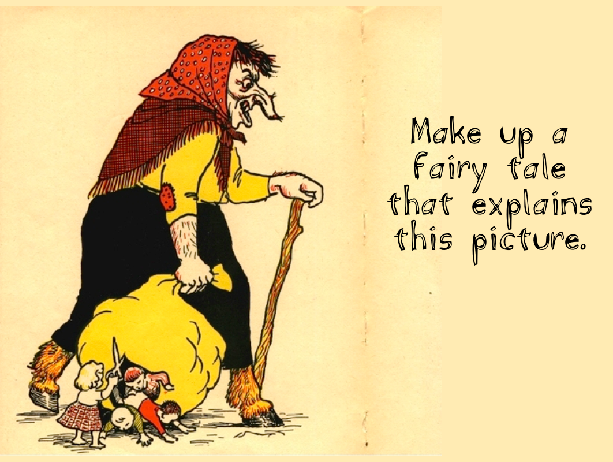

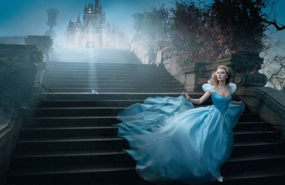

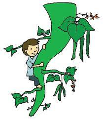

If I climbed a beanstalk
\_\_\_\_\_\_\_\_\_\_\_\_\_\_\_\_\_\_\_\_\_\_\_\_\_\_\_\_\_\_\_\_\_\_\_\_\_\_

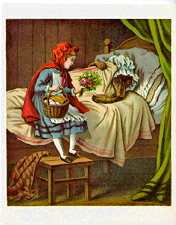

Choose a fairy tale you like and rewrite it by changing one important
element.

E.g.Little Red Riding Hood.

- **Change the point of view / perspective.\**
  Fairy tales are invariably told in 3rd person. What about trying 1st
  person? And whose perspective will you use--Little Red? The wolf?  Or
  will you try bringing the perspectives of both characters?

<!-- -->

- **Change the time period.** How would you revise the story to place it
  in modern life? Perhaps you can try placing the plot essentials in
  another time period, e.g., 1920s Sydney, frontier USA in the 1800s.

<!-- -->

- **Change the relationship.** Revise the kind of relationships Little
  Red has. E.g., with her grandmother, her mother, the wolf, or the
  woodsman who saves her. How does this affect the story and
  particularly the ending?

<!-- -->

- **Change the genre.** Move the story from the genre of fairy tale to
  another genre. Ensure your writing style matches your choice.

<!-- -->

- **Change the 'place'. **Place can be physical, cultural or
  socio-economic.

  - **Physical**: Move the story from the woods to somewhere else. Will
    you set the story on a beach? In a shopping mall? On a cruise ship?
    At a skate park? In a coffee shop? How does this change the
    ingredients?

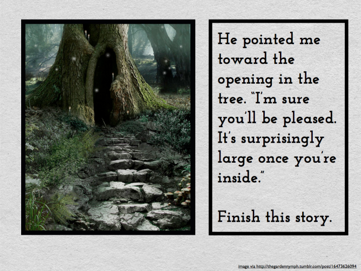

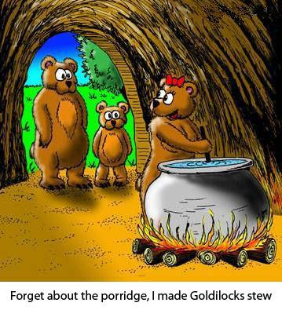

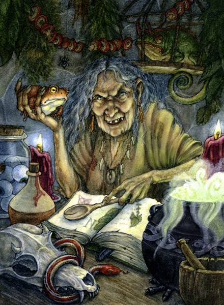

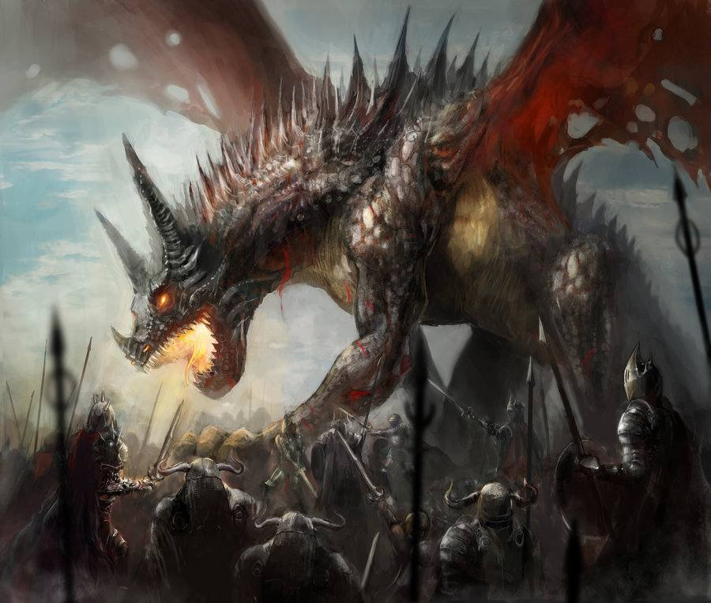

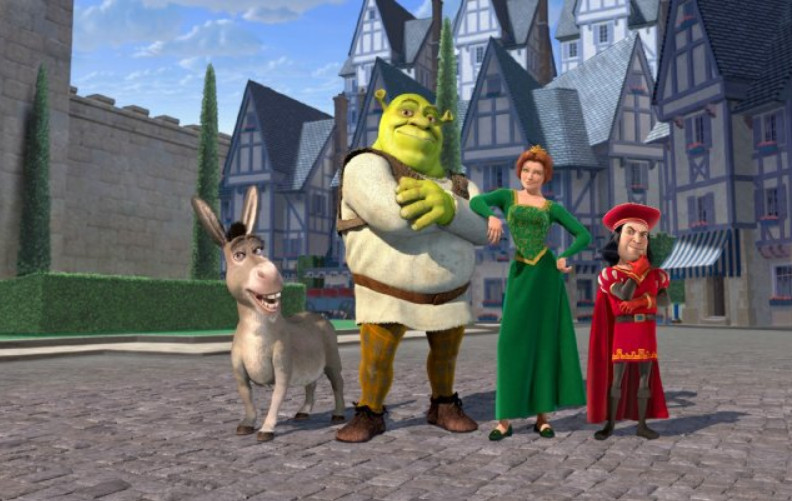

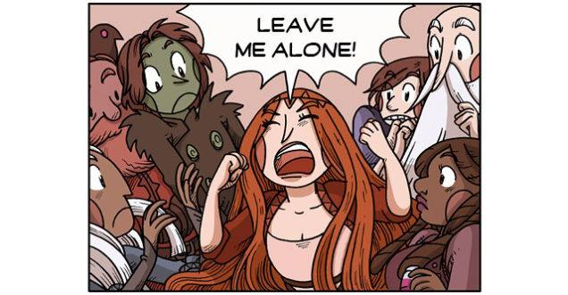

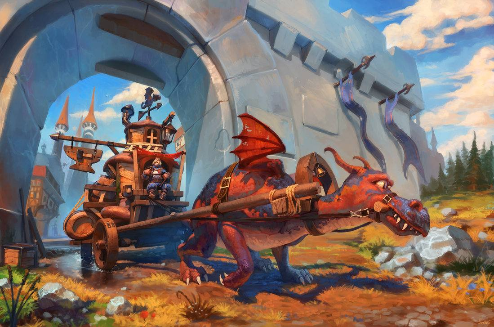

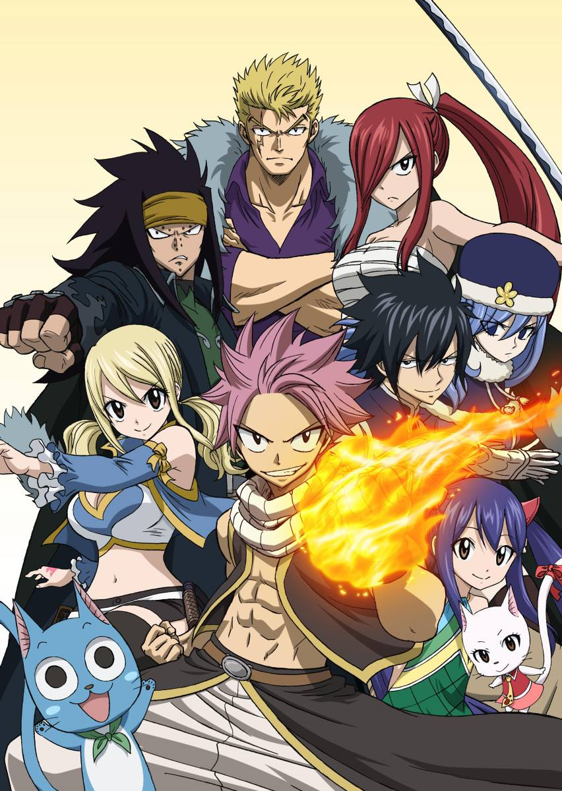

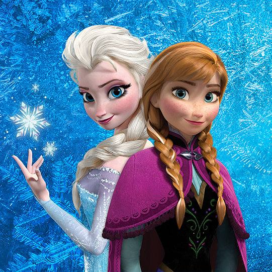

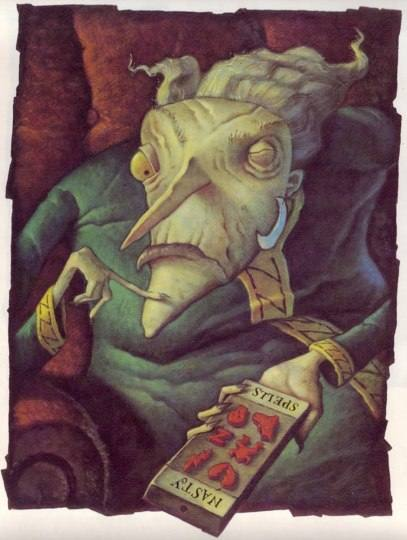

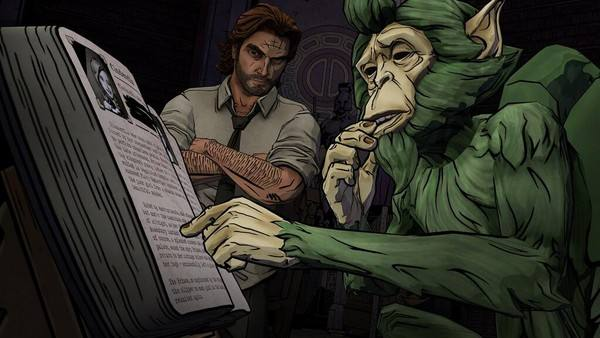

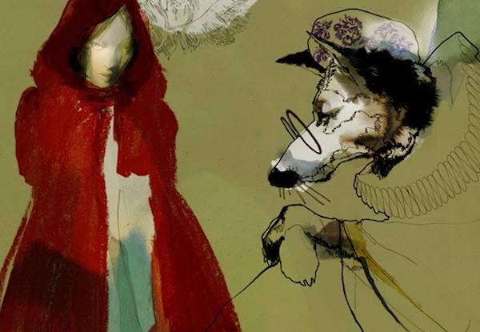

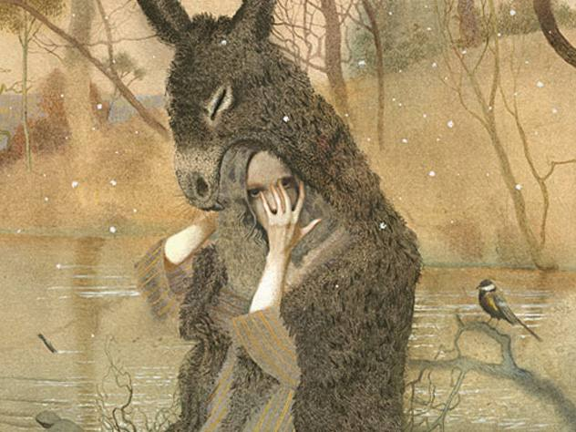

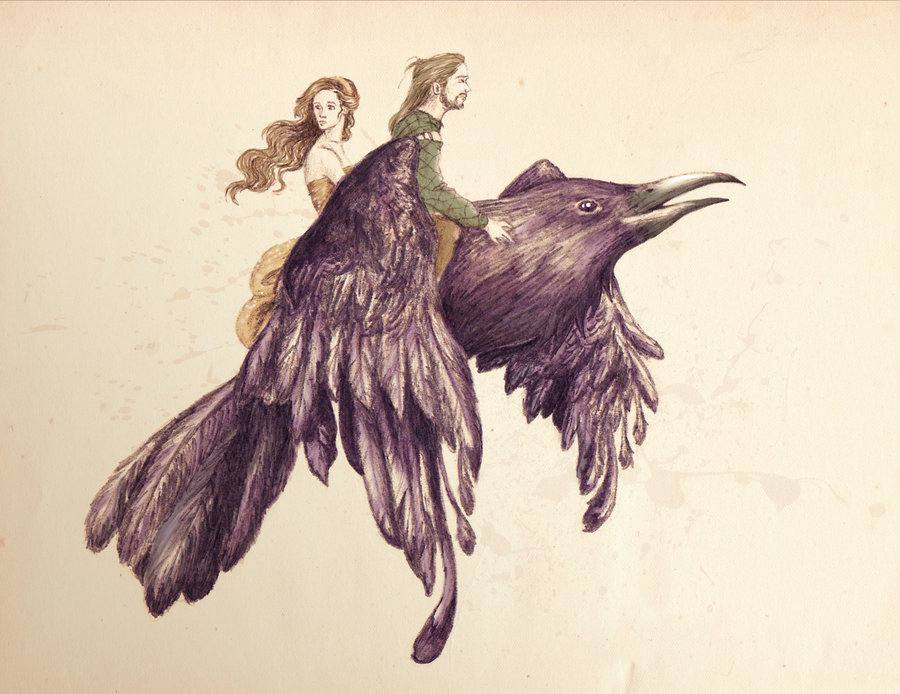

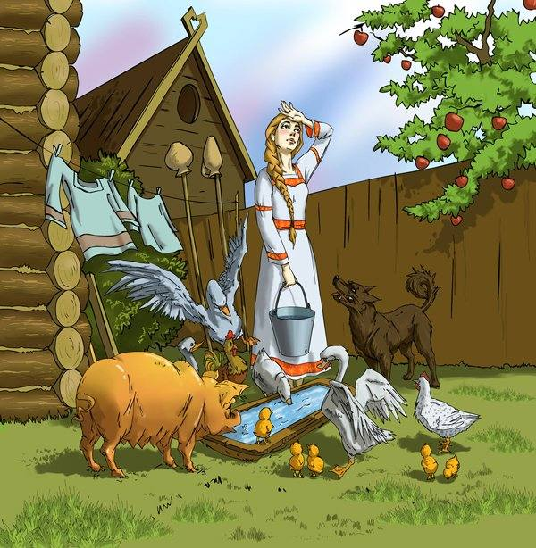

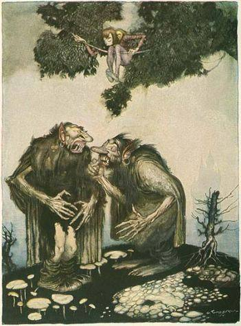

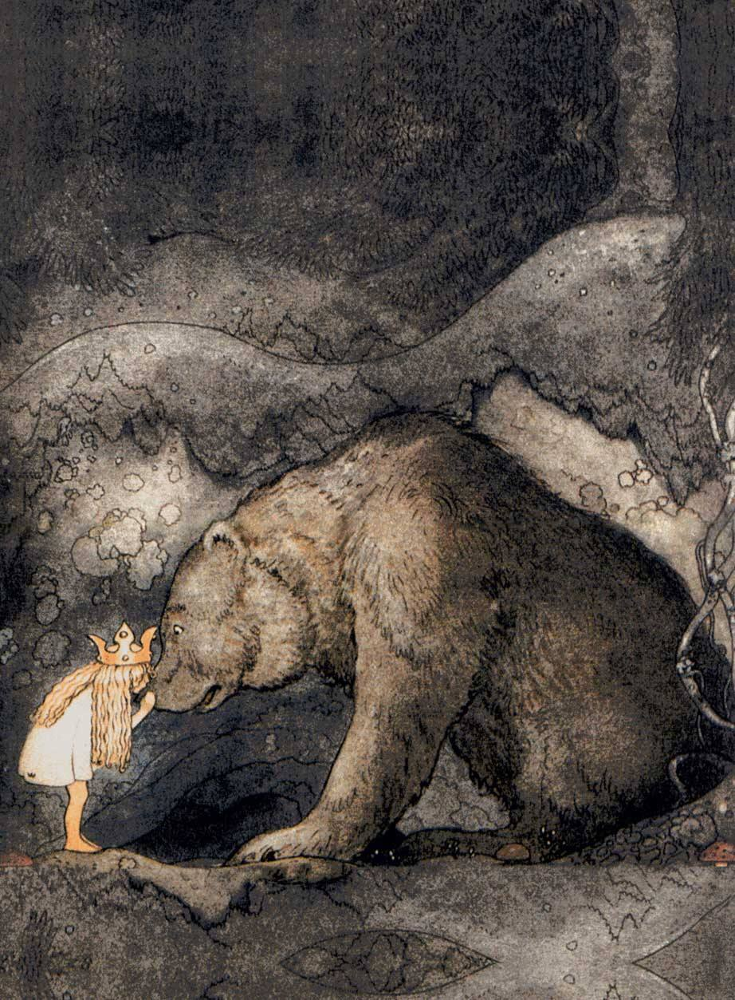

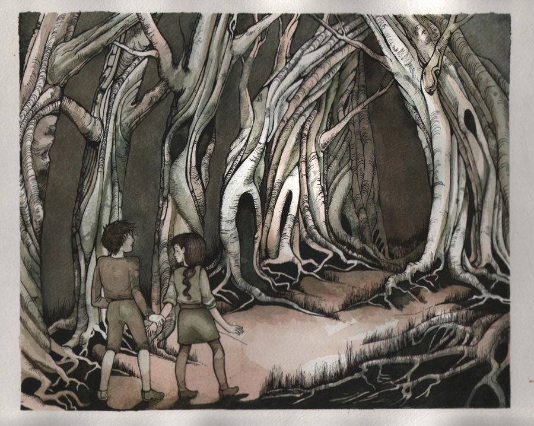

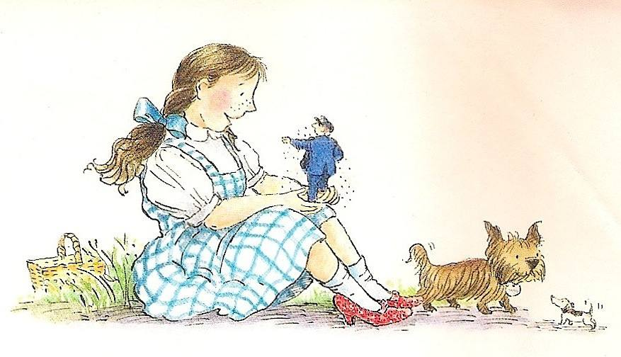

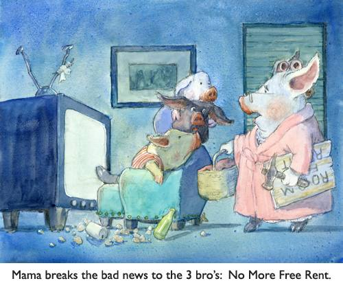

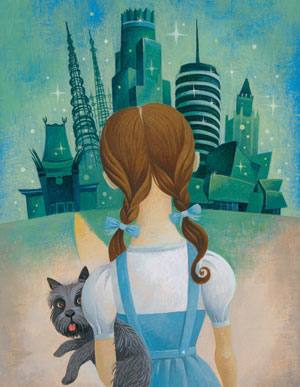

**Descriptive Writing Prompts**

1\. Describe a place you always wanted to visit.

2\. Describe the most beautiful scene in nature that you can imagine.

3\. Describe a kitchen that you have seen or would love to see.

4\. Describe the ocean. Think about what it looks like on and below the
surface.

5\. Describe a storm. This could be a thunder storm, a snow storm, a
hurricane, a tornado, a hail storm, a rain storm, or any type of storm.

6\. Describe a place where you feel safe and protected.

7\. Describe a toy you love(d). Think of all its good points.

8\. Describe your ideal playground.

9\. Describe the perfect shopping mall.

10\. Describe a place where people congregate (like a zoo, a church, a
circus, etc.)

11\. Describe your bedroom the way you want it to be.

12\. Describe your favourite dessert (or food).

13\. Describe a beach (a desert, a mountain, a city, or a plain).

14\. Think of your favourite animal and describe that animal.

15\. Describe your best friend so that the reader can picture him or
her.

16\. Think of your favourite place. What do you like about this place?
What do you do there? How does it look, smell, and feel? Now write an
essay describing your favourite place so that your reader will be able
to picture it.

17\. Some people prefer dogs as pets, some like cats, and others prefer
birds, snakes, fish, rabbits, pigs, horses, and other animals. What is
your perfect pet? What does it look like? Is it soft or hard? Does it
make any sounds? Now describe your idea of a perfect pet so that your
reader can picture it.

18\. Different teachers decorate their classes in different manners.
Think of your idea of the perfect classroom. Is it colourful? Does it
have desks or tables? What does it look like? How does it smell? Are
there any sounds in it? Write an essay describing your idea of the
perfect classroom.

19\. Each season of the year is beautiful in some way. Think of which
season is your favourite: winter, summer, spring or fall. Think of what
your town looks like during that season. What does it feel like? Is
there a smell or taste to it? Now write an essay describing an outdoor
scene during your favourite season of the year.

20\. Everyone has a favourite object that they treasure. Think of some
object in your room that you really like. It could be a toy, or a doll,
a game, a stuffed animal, or a book, but whatever it is, it is special
to you. What does it look, feel, smell, and sound like? Now, describe
this object to your reader so that he or she will be able to picture it
clearly.

21\. Every person has a favourite place to play. Think of your favourite
place to play. It may be your backyard, or a playground, or a nearby
woods, or an open field. What does this place look like? What are the
sounds you hear there? What does it feel and smell like? Describe your
favourite place to play so that your reader can see it without being
there.

22\. Almost all houses have kitchens. Some are big and some are tiny.
Think of the kitchen at your home. Think of how you might change it to
make it even better. What is in it? What does it smell like? Now,
describe this perfect kitchen to your reader so that he or she can see
it clearly.

23\. There are trees everywhere, even in the middle of big cities. Think
of a tree you have seen. What does it look, feel, and sound like?
Describe that tree so that your reader can picture it too.

24\. People gather at places like malls, fairgrounds, schools,
gymnasiums, sports fields and swimming pools. Think of a place in your
town where there are lots of people. How does it look, sound, smell, and
feel to be there? Now, describe that crowded place so that your reader
can feel as if he or she is there.

25\. Every child enjoys playing on a playground. Think of the
playgrounds you have played in. Think of what makes them better. Maybe
you've already seen it, but think of what makes the perfect playground.
Think of how it looks, sounds, feels, and smells. Now, describe your
idea of a perfect playground so that your reader can see it clearly.

26\. Even in the desert it rains sometimes. Think of what the world
looks like outside your window when it rains. Think about how it looks,
smells, and feels. What sounds do you hear? What does rain taste like?
Describe what the world looks like outside a window when it rains.

27\. Flowers always make a yard or a room look very pretty. Think of a
garden or a bunch of flowers you have seen. Make it even better and
prettier in your mind. What does it look and feel like? Does it smell?
Describe the garden or a bunch of flowers so that your reader can see it
and smell it in his or her mind.

28\. Cities and towns have lots of things going on in them, lots of
stores, traffic, people, churches, schools, parks, and maybe even a zoo.
Think of your city or a city you have visited. As you walk down the
sidewalk in the middle of that city, what do you see, hear, smell,
taste, and feel? Describe that city for your reader and what it is like
to be there.

29\. Even in big cities, there are parks where there are woods (or
forest). There are woods everywhere in this big country of ours. Think
of a forest you have been in or played in. What does it look like? Now
describe this forest so that the reader can see it.

30\. Alice visits Wonderland in Alice in Wonderland. Wonderland is the
land of her dreams. What is the ideal place for you? What place do you
dream about? What does it look like? Does it have a smell? How does it
feel? Do you hear sounds there? Describe the ideal place of your dreams
in such a way that the reader can picture it, too.

31\. We all eat to stay alive, but everyone has a favourite food. What
is your favourite food in the world? What does it look like? How does it
smell and taste in your mouth? Describe your favourite food so that your
reader can see it and almost taste it as well.

32\. Many people love the beach and others love the mountains for a
vacation. Which do you like better; the beach or the mountains? Even if
you have never been to either, you have seen pictures. Choose one---
either a beach or the mountains. What does the place look like? Does the
place have a feel to it? What smells are there? What sounds do you hear?
Describe your beach or mountains so that your reader can picture the
scene you see in your mind.

33\. Everyone has a favourite game, dominoes, checkers, cards, Clue,
Chutes and Ladders, Monopoly, and so on. What is your favourite game?
What does it look like when you play? What sounds do you hear as you
play? Describe your favourite game so that the reader can see it and
hear the action as you play.

34\. Everyone has to shop for food or clothes sometime. Think of a store
to which you like to go. What does it look like inside the store? Are
there sounds? What do things feel like there? Does the store have a
smell? Write a description of a store you like to visit so that your
reader can feel as if he or she were there.

35\. People live in houses, apartments, tents, cabins, trailers, and
other buildings. Where do you live? Think of your ideal living place.
Perhaps it's where you live now. What does it look like? Does it have a
smell? Describe your ideal living place or the place where you live so
that your reader can picture it clearly.

36\. Imagine that you were on a ship in the middle of the ocean. What
does your ship look like? How does the ocean look? What does the sky
look like above you? What do you see, hear, feel, smell, and taste as
you look about? Describe your ship in the middle of an ocean of water.

37\. Everyone has been in a thunder storm. Think back to when you last
experienced a thunder storm. What was it like? What were the sights,
sounds, smells, tastes, and feelings during the storm? Describe a
thunder storm so that your reader can experience and picture it.

38\. Imagine that someone gave you a very special ring. What does this
ring look like as it sits on your finger? How does it feel? Is it heavy?
Is there a taste to it? How does it sound if you rap it on the desk?
Does it smell? Describe this ring down to the last detail so that your
reader can picture it on your hand.

39\. Our country has a flag with the Southern Cross and the Union Jack.
Your state has a flag, too, with things that represent important
historical events and items of your state. Imagine that you had a flag
which represented you. What would it look like? How does it feel? Does
it have a smell? Does it make a sound as it waves in the breeze? Think
of some images it would have on it to represent you to the world. Now,
describe your personal flag so that your reader can see it clearly.

40\. Almost everyone has had an encounter with a spider, has read the
book Charlotte's Web and has seen pictures of spiders in their webs.
Think of a spider and web you have seen. It could have been real, in a
book, or in your imagination. What do this spider and web look like? Do
they make a sound? What do they feel like if you touch them? Do they
have a smell? Now, describe your spider and its web so vividly that your
reader can see it as if it were right in front of him or her.

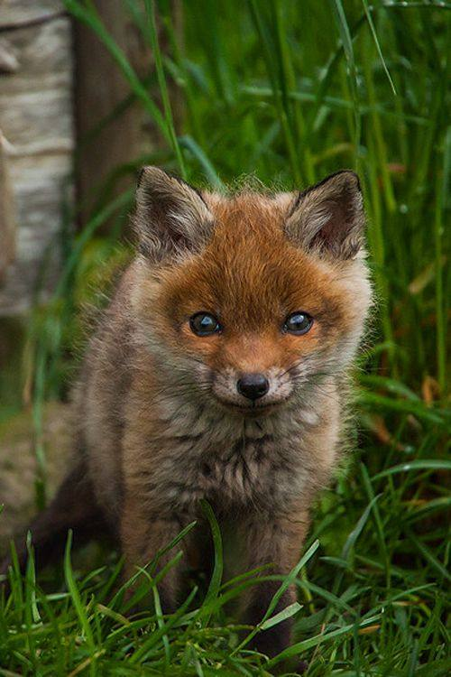

ALIEN DESCRIPTION

The assignment is to describe a place on planet Earth from the
perspective of a visiting alien from outer space. Imagine you are an
alien who arrives and writes a report to your commander on your home
planet about the place you observe.

Think about the kind of alien you are --- are you friendly or are you
planning an invasion? It's up to you. This will make a difference in the
way you will describe what you observe.

Choose one of the following specific places for your alien to describe.
You obviously can't describe the whole planet, so limit yourself to one
location.

- **A busy city street**

- **A shopping mall**

- **A high school football game**

- **A school cafeteria**

- **A rush hour traffic jam**

- **A wedding or a church service**

- **A bowling alley**

- **A playground**

- **A farm**

- **Your own idea**

Be sure to describe not only what you see but also what you hear. If
you'd like, you can include tastes, smells and textures too.

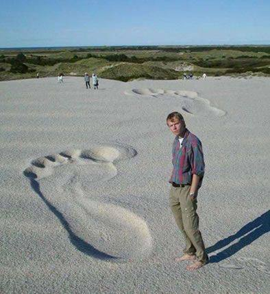

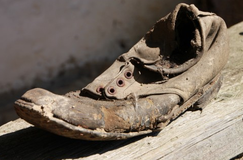

