> **Voice**
>
> **(1)**
>
> 

**\**

**Voice - 1**

What is Voice?

Teach ...

Today you are you ...

Voice: A Definition for Primary Students

Show Don't Tell

Voice -- Teaching

The Best Story Eileen Spinelli

Voices in the Park Anthony Browne

A Walk in the Park Anthony Browne

Once Upon a Cool Motorcycle Dude Kevin O'Malley

Some Things Are Scary Florence Heide

Owl Moon Jane Yolen

Romeow & Drooliet Nina Laden

Larf Ashley Spires

The Prince of Butterflies Bruce Coville

The Bird House Cynthia Rylant

**What is Voice?**

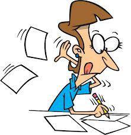

- It's pizzazz!

- It's flavour and charm!

- Voice is individuality!

- It's new, different, full of adventurous spirit!

- It's your personality!

**Voice**

- Shows the writer\'s personality

- Sounds different from everyone else\'s

- Contains feelings and emotions

- Has words coming to life

- Comes from the heart

**Therefore a writer should do the following:**

+----+----------------------------------------------------------------------+
| -  | - Write honestly and from the heart                                  |
+====+======================================================================+
| -  | - Share his/her feelings about the topic                             |
+----+----------------------------------------------------------------------+
| -  | - Speak directly to the reader                                       |
+----+----------------------------------------------------------------------+
| -  | - Use language that brings the topic to life for the reader          |
+----+----------------------------------------------------------------------+
| -  | - Care about what he/she has written                                 |
+----+----------------------------------------------------------------------+
| -  | - Write to be read                                                   |
+----+----------------------------------------------------------------------+
| -  | - Use more expression than what is in an encyclopaedia article       |
+----+----------------------------------------------------------------------+
| -  | - Give the reader a sense of the person behind the words             |
+----+----------------------------------------------------------------------+
| -  | - Connect with the reader                                            |
+----+----------------------------------------------------------------------+

**Teach**

- Each writer has a distinct personality.

- Each writer has passions, opinions, prejudices, and information.

- Words should capture the writer\'s personality.

- Writers with strong voice capture the reader\'s attention with
  individuality, liveliness, and energy.

- Strong voice makes the writer\'s purpose clear.

- Strong voice helps readers experience the emotions of the writer and
  understand the writer\'s ideas.

- Careful word choice, punctuation, paragraphing, and fluency help
  strengthen a writer\'s voice.

\"Tone is a particular way of expressing feelings or attitudes that will
influence how the reader feels about the characters, events, and
outcomes. Speakers show tone more easily than writers because they can
use voice tone, gesture, and facial expressions. A writer must use words
alone.\"

Susan Geye, *Mini Lessons For Revision*, a true inspiration:

Just be yourself. Otherwise the voice won\'t be your own.

Think of your audience. Your voice changes as your audience changes.

Think of your topic. How do you feel about it? Put those feelings into
your writing. Get emotional, but don\'t tell your reader how you feel,
show him/her how you feel.

Opinions give us our voice. If you truly believe in something, prove to
the reader that you're right. Support your opinions with specific
details and reasons. 

Look at your topic from different angles, and choose the one you are
most comfortable with presenting. Humour, seriousness, sarcasm, and
mysteriousness are just a few of the angles you can use.

**\**

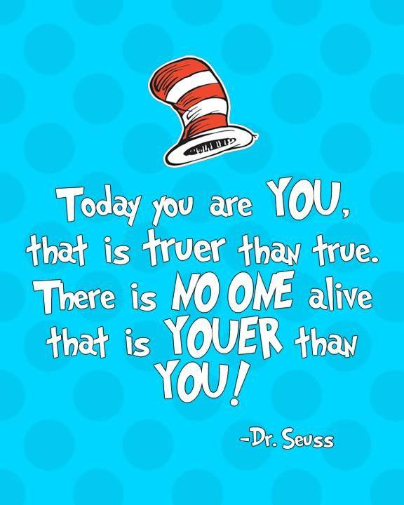

**\**

*The best way to develop your writer's voice is to read a lot. And write
a lot. There's really no other way to do it.*

*Stephen King*

**Voice: A Definition for Primary Students**

Sparkling, confident, unquestionably individual. These are words that
describe a piece of writing with voice. Voice is the writer\'s passion
for the topic coming through loud and clear. It\'s what keeps us turning
the pages of a story long after bedtime. It\'s what makes an essay about
camels fascinating, even though we didn\'t think we cared all that much
about camels. Voice is what primary writers use to assert their own way
of looking at an idea. You\'ll find it in scribbles, in their letter
strings, in their sentences, and in their continuous text. Voice can
permeate writing, regardless of where the writer falls on the
developmental continuum. Primary writers are well on their way to
applying voice when they exhibit the following:

- have something important to say

- create drawings that are expressive

- find new ways of expressing familiar ideas

- capture a range of emotions, from gleeful to poignant to afraid

- offer sincere thoughts

- are confident that what they say matters

- demonstrate awareness of an audience

- are willing to take a risk and try something that no classmate

> has tried before

- apply original thinking

<!-- -->

- Scholastic

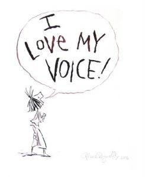

**Show Don't Tell**

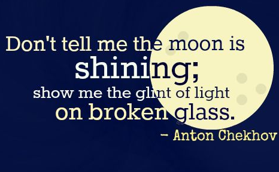

*The children played in the backyard. There were a lot of them. They
were loud. It was a hot day. By noon, they got tired.*

*A pack of laughing, squealing neighborhood kids frolicked in the
Johnsons' backyard. Some chased each other in wide circles. Some scaled
the wooden play structure, and some hung upside down from the parallel
bars. It was joyful madness! By noon, the boys and girls were sweaty,
exhausted, and ravenous.*

- The writer includes detailed ideas about the scene and characters that
  will be interesting to readers.

  - neighbourhood

  - Johnson's

  - *Some chased each other in wide circles.* *Some scaled the wooden
    play structure, and some hung upside down from the parallel bars.*

- The writer reveals attitudes and feelings about the topic by carefully
  choosing just the right words.

  - laughing, squealing

  - frolicked

  - joyful madness

  - sweaty, exhausted, and ravenous

- The writer improves the rhythm and flow of the writing by varying the
  sentence lengths. This makes the writer sound more interested in his
  topic.

- The writer uses punctuation to help build voice. Notice how this
  exclamation mark shows excitement.

**Voice**

**Author's Voice**

This is how you write uniquely and tell the story. It is individual,
original; it's **you.** If you write with a strong voice we can sense
your thoughts, feelings, humour and tone.

Students need to constantly work on voice and treat it as a work in
progress.

**Character's Voice**

This is created by how the character speaks, acts, and their attitude.

During a text there are distinct character's voices. Whereas these
change, the writer's voice is consistent.

**Nurturing Voice:**

**Read Read Read**

Reading is how you tune your ear, how you learn *what makes a
book.* It's also how you'll learn, over time, the styles and voices that
speak to you. It's how you begin homing in on *your* voice.

*"If you don't have time to read, you don't have the time (or the tools)
to write. Simple as that." \~Stephen King *

**Write Write Write**

Every day!

**Craft**

Learn the craft from Mentor Texts.

When writing yourself, creating your own words and sentences, those
craft will be infused into your creative mind. That's why we do Choral
Reading and Found Poetry. We can borrow language in Read and Retell, and
read striking language in Readers' Theatre.

**Read Poetry**

*In a poem, there are no wasted words. Every word is there because it
was specifically selected to play a role. Through reading poetry, you
see the beauty in economic word choice. You feel the rhythm of words,
and the sound of words.*

**Stimulate your creativity through Quick Writes** (see Course)

**Learn from others**

Teachers, peers, parents. Share time and Writing Conferences are
important learning times.

*Soak up as much advice as you can, absorb the feedback, and stuff
yourself full of craft. Then try it out yourself and see what works.*

**Assisting "Voice"**

**Point of View**

By writing in multiple voices students will understand the power of
other perspectives. E.g. Rewrite a mentor text in two or three
characters' voices and points of view. Discuss the versions told from
multiple points of view.

**Write Letters**

Sharing examples of strong letters. Students write their own letter to a
friend, celebrity, or relative. Discussion re how closely their writing
matches their speaking style. Did the writing feel natural? Does the
letter sound like something unique to them? If not, how could they
change it? E.g.

**Roald Dahl: Thank you for the dream**

In 1989 a seven-year-old girl called Amy sent Roald Dahl \'one of her
dreams\' in a bottle filled with oil, coloured water and glitter -
inspired by her favourite book, The BFG.

He responded in the most heartwarming way, saying: \"Thank you for the
dream in the bottle\... Tonight I shall go down to the village and blow
it through the bedroom window of some sleeping child and see if it
works.\"

**Barack Obama:** Thank you for the lovely book

In 2010 US President Barack Obama sent a thank you note from the
Whitehouse. The recipient was Yann Martel, the Canadian author of
award-winning novel Life of Pi. President Obama, who had just finished
reading the book with his daughter, thanked Martel and labelled the
novel an \'elegant proof of God and the power of storytelling\'.

Audrey Hepburn: Thank you for the music

When actress Audrey Hepburn watched back Breakfast at Tiffany\'s with
music written by composer Henry Mancini, she loved it so much that she
sent him this beautiful letter.

She said: \"Your music has lifted us all up and sent us soaring.
Everything we cannot say with words or show with action you have
expressed for us.

\"You have done this with so much imagination, fun and beauty. You are
the hippest of cats -- and the most sensitive of composers!

\"Thank you, dear Hank.\"

**Dialogue**

"Dialogue is more than words. It's imagining the relationship between
two people."

Acting out a short scene can demonstrate that people use more than words
when interacting. Discuss how body language and tone of voice are used
in communication. Brainstorm ways students might convey the tone of the
conversation in writing by adding the unspoken dynamics of dialogue.

**Word Choice**

Advice from author Cynthia Levinson:

"Voice can be tricky in nonfiction writing, because authors can't make
anything up." That said, there are several ways young writers can spice
up their writing and still keep it true."

Cynthia's Tip: Verbs convey voice. When Levinson describes the moment
the children of Birmingham defeated the segregationists, she could have
written, "The children cheered." Instead, after interviewing her
subjects and hearing their jubilance 45 years later, she wrote, "Kids
pumped their arms, shimmied their legs, wagged their bottoms." Whether
your students are writing about civil rights, spiders, or King Henry
VIII, have them try this: Circle the verbs in their first draft, then
substitute verbs that convey emotion or mood and see how that affects
the overall tone of their piece. Start a word wall of strong verbs.

**Free Writing**

"Voice is the foundation of everything I write," says Newbery Medal
winner Christopher Paul Curtis. "I start by sitting down, imagining my
characters sitting next to me, and listening to what they say." Curtis
carves out time each morning to sit down and free-write. "I don't try to
structure it, I just go where I want it to go, and leave the editing for
another time."

Curtis's Tip: Allow students to write in a stream-of-consciousness style
until they can hear their characters talking to them. Give them 10--15
minutes each day to write in a journal format or in the voice of the
characters they've created. Forget about plot, mechanics, and grammar,
at least for this exercise, and invite students to write solely to
explore and uncover voice.

**Interview Characters**

"Interview your characters!" says Kathryn Erskine, a National Book Award
winner. "Sit down with paper or a laptop and talk to the people in your
story. 'Interviewing' is a way of tapping into your subconscious and
releasing the story that you need to share."

Erskine's Tip: Have students ask their characters: Why are you acting
this way? What is making you angry or afraid? What do you really want?
"That last question is the key," says Erskine, "not only to your
character but to your entire story." Don't forget those "evil"
characters, too---challenge your students to find out what motivates
these characters to behave the way they do. You might create an
interview recording sheet where students can write the answers to their
questions. Keep completed interview sheets in a binder for students to
peruse for inspiration.

**Put a Character in Trouble**

Have students write for five minutes about a character who is "in
trouble"---students can define that however they'd like. Now tell them
to pretend they are that character, and that the trouble they wrote
about is happening to them. Give them another five minutes to write a
new paragraph, reminding them that it's okay to change to first-person
point of view if they prefer. Then have students analyse the difference
between the two paragraphs. If they were able to get a real feel for the
character, chances are their second writing experience will have a
stronger and more authentic voice.

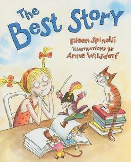

The perfect read-aloud to teach the importance of VOICE!

The best story is one that comes from the heart. The library is having a
contest for the best story, and the quirky narrator of this story just
has to win that rollercoaster ride with her favourite author! But what
makes a story the best?\
Her brother Tim says the best stories have lots of action. Her father
thinks the best stories are the funniest. And Aunt Jane tells her the
best stories have to make people cry. A story that does all these things
doesn't seem quite right, though, and the one thing the whole family can
agree on is that the best story has to be your own.\
\
Anne Wilsdorf's hilarious illustrations perfectly capture this colourful
family and their outrageous stories in Eileen Spinelli's heartfelt tale
about creativity and finding your own voice.

**The Best Story Eileen Spinelli**

The Red Brick Library was having a contest: Write the best story. Win
first prize.

First prize was a ride on the Sooper Dooper Looper roller coaster with
my favourite author, Anne Miles, who wrote *The Runaway Roller Coaster.*

Wow! First prizes don't get any better than that.

I ran home. Went to my room. Shut the door. I sharpened five pencils.
Opened my notebook to a brand-new page. And thought. And thought. And
thought. And all I could think was this writing stuff was hard and
lonely. Maybe I needed help.

I told my brother Tim about the contest. "The best stories," said my
brother Tim, "have lots of action."

So I wrote a lot of action into my story. I wrote about a bus hurtling
down the highway with no one at the wheel. I added a tornado. And a
pirate. And a great white shark. But the story didn't seem quite right,

So I asked my dad and he said, "The best stories have plenty of humour."

So I changed the great white shark to a monkey. And I put the monkey at
the wheel of the bus. And I turned the tornado into turnips. And I
dressed the pirate in polka-dotted pyjamas.

Dad laughed so hard he popped a shirt button. Even so, this story didn't
feel quite right either.

Along came Aunt Jane. "What are you doing?" she asked.

"I'm writing a story. The *best* story. For a contest at the library. I
can win a roller coaster ride with my favourite author!"

"Oh, well then," said Aunt Jane. "Here's all you need to know -- the
best stories are the ones that make people cry."

So I gave the bus a flat tyre. I sent the monkey to the funeral of his
pet goldfish. I turned the turnips into onions. And I made the pirate
chop every one. There were lots of tears. But the story still wasn't
right.

My teenage cousin Anika said, "I have news for you -- if it's not
romantic, it's a loser.

So the pirate introduced the monkey to his sister Grace. And they fell
in love. And I turned the onions into wedding invitations. And everyone
lived happily ever after.

Finally my story was ready, so I read it to my family.

"Not enough action," said my brother Tim.

"Maybe the monkey can fall into the wedding cake," said Dad. "That would
really be funny."

"It's hard to cry at a wedding when the groom is a monkey," said Aunt

Jane.

Anika said it would be perfect if I added a kiss.

In all this time my mother hadn't said a word. So I asked her: "What do
you think is the best story?"

She gave me a hug. "I think the best story is one that comes from the
heart. Your own heart."

That night, after supper, I looked into my own heart. And rewrote my
story.

No more monkey. No more pirate. No more wedding invitations. No more
"happily ever after."

My new best story is about my family. And my two best friends Tara and
Josh. It's about my cat Ollie, who sleeps on his back. And snow days.
And toast with strawberry jam. It's about fireworks. And rainbows. And
bike rides.

My biggest problem was keeping my story short. Once I started pulling
things out of my heart it was hard to stop.

When my story was finished, I turned it in to the judges. Maybe I'll win
that roller coaster ride with Anne Miles and maybe I won't. Either way,
I'll be happy. I'll be a winner. Because the story I wrote is my own.
Not somebody else's. And that makes it the best.

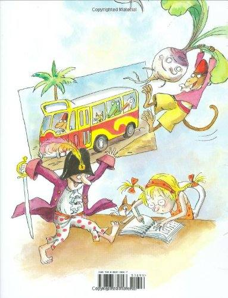

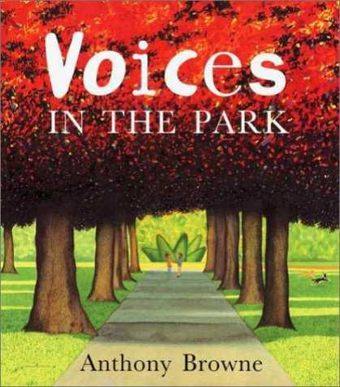

Four different voices tell their own versions of the same walk in the
park. The radically different perspectives give a fascinating depth to
this simple story which explores many of the author's key themes, such
as alienation, friendship and the bizarre amid the mundane.

Voices in the Park needs to be read several times over a number of
lessons, with a different focus, enabling students to gain a deeper
knowledge of the story and begin to grapple with more difficult,
thoughtful discussion.

**Learning objectives:**

- Explore characters.

- Identify the point of view from which a story is told and how this
  affects the reader's response.

- Change point of view, describe a situation from the point of view of
  another character or perspective.

- Write from another character's point of view.

- Write in the style of the author, writing a new chapter/version.

- Consider how visual images add to mood in a story and how seasons are
  used as imagery in the book.

For an interactive talking book version go to *researchkingsdtonbooks
alive.*

- Create a character profile for each of the four \'voices\' in the
  story.

> Questioning: Group Work --
>
> Each group takes a different voice.
>
> They reread and suggest questions they could ask / answer about the
> text.
>
> (Questions below if needed)
>
> 1\. Do we learn anything about the background of this character?
>
> 2\. How is this character feeling at the beginning of his/her account?
> How do we know?
>
> 3\. How does the character feel at the end of his/her account? How do
> we know?
>
> 4\. What has happened to make the character feel differently at the
> end?
>
> 5\. How does this character treat others?
>
> 6\. How do you feel about this character? Why?
>
> 7\. Would you like to meet this character in a park? Why/ why not?
>
> Any further comments about the character:

- Turn the story into a radio play with different children playing the
  role of each voice in the story.

- Create your own story, in which different people have different points
  of view about the same event.

- Use the story as a starting point for learning about the first / third
  person and how they are written.

Writing in the First Person

Write the opening passage from \'Voices in the Park\' in the third
person and display it next to the actual text. 'One day, Mrs Smyth
decided to take her dog and her son for a walk. They went to the park
and when they got there, Mrs Smythe let her dog, Victoria, off the lead.
Another dog came up to Victoria and started to play. Mrs Smythe shoed it
away but it didn't work. The dogs were happy playing with each other.'
(Note: although the mother is not given a name in this version of the
story, in the earlier book \'A Walk in the Park\' she was called Mrs
Smythe and the father was called Mr Smith. If you have a copy of
\'A\'Walk in the Park\' you can use this text instead of writing your
own version).

Read both passages aloud.

What are the differences in the way these passages are written? Guide
the children towards identifying the difference between first and third
person writing.

Review the features of writing in the first person and consider why a
writer might choose to write in the first person. You might want to
offer writers 'opinions on the advantages and disadvantages of writing
in the first and third person.

- Rewrite the story in the third person to explain what happened.

- Think about the hopes and dreams of the different voices who are
  speaking. Describe these to a partner.

- Identify the different nouns / adjectives / verbs / adverbs /
  connectives / punctuation used in the story. Why have these been used
  in particular places?

**Critical Literacy**

Students will think of their own questions. If guidance is needed, the
following may be useful:

- What do we know about the four characters? Key words: wealth,
  language, appearance, mood, home, the way they treat others

- Why don't the adults talk to each other?

- Why do the children talk to each other?

- What experiences have these four people had before their day in the
  park? Would the two groups of people meet if they didn't go to the
  park?

- Are these people part of the same community?

- What is a community -- where does it begin and end?

- How do the pictures tell the story?

- How do the surreal objects link to the story?

- Why does the world look different through each person's 'eyes'?

**Visual Literacy**

Group or independent work: Use Reading Response Journals.

*Look carefully at the illustrations and the text. Discuss what you
notice.*

Whole class discussion.

Areas to consider:

• What do the colours and images suggest about the characters?

• The use of colour in different sections

• The use of shadow

• The use of space on the pages -- eg where a strong vertical line has
been used to split up the characters (lamp post) or bring characters
together (eg slide)

• Different fonts

• References to famous paintings (Mona Lisa, Laughing Cavalier, the
Scream

• Which pictorial ideas are playful and which suggest something
meaningful that adds to the reader's understanding

Art -- *Represent yourself or someone you know through colour.*

For teacher background refer to the article **Visual Literacy -- Voices
in the Park by Kylie Johnson**

**Visual Literacy -- Voices in the Park by Kylie Johnson**

Visual literacy is 'the ability to analyse the *power of the image* and
the *how* of its meaning in its particular context' (Johnston, as cited
in Winch, Johnston, March, Ljungdahl & Holliday, 2010, p.620). Voices in
the park, written and illustrated by Anthony Browne (1998), is an
excellent example of powerful visual literacy. The story is told from
four different perspectives; a mother and her son, and a father and his
daughter. The characters are presented as gorillas but are in human
form, perhaps to prevent bias from readers. Presenting different
perspectives intensifies personal responses (Giorgis, Johnson, Bonomo,
Colbert, Conner, Kauffman, Kulesza, 1999). The visual elements add a
great depth to this story and allow the reader insight into the four
characters and their perceptions of each other as they cross paths in a
park.

Font types are an important element and link directly to the personality
of each character. The font used for Charles' mother is a classic style
and is a hint that she sees herself as a proper and traditional figure.
The font used for Smudge's father is thick and bold and indicates his
depressed nature. The font for Charles is thin and delicate as he is
lonely and unsure of himself. The font in Smudge's story is fun and
childish, matching her cheerful persona.

Each perspective is shown through a different season, even though the
scenes unfold at the same point in time. There are links from each
season to personalities and how the park is viewed by each character.
The seasons are evident through the use of appropriate light, colour and
clues in the scenery. Autumn colours reflect the demeanour of Charles'
mother with a mix of warm and cool colour tones, while dark winter
colours suit the mood of Smudge's father. Spring pastels represent new
growth and change for Charles, although his seasons change from spring
as he has fun with Smudge, to winter as he is alone with his mother
again. Bright summertime colours signify Smudge's nature.

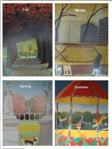

Line can be used to draw the eye to what the illustrator feels is
important or to suggest movement or establish a mood (Giorgis et al.,
1999). Browne (1998) uses lines to create moods and to deepen
understanding. For example, illustrations of the mother are framed by
neat, straight lines and edges, in comparison to the father whose
illustrations are either framed with rough, torn looking borders or no
borders at all. Lines also portray the divide between social-class such
as in one image of the mother and father on a park bench divided by the
line of a lamppost. On the father's side there is litter and a dirty
path; on the side of the mother there is no litter and the path is
clean.

In one significant image Charles' mother's shadow is cast over him and
the shape of her hat reappears in the form of lampposts, the shape of a
tree and the outline of clouds. This suggests the overbearing influence
of his mother on his life.

There are many more visual elements within this text representing class
structure, friendship and assumptions people make about each other which
are shown through the appearance of each character, surroundings and
other images not immediately obvious to the eye.

**Voices in the Park**

> **Anthony Browne**
>
> First Voice

It was time to take Victoria, our pedigree Labrador, and Charles, our
son, for a walk.

When we arrived at the park, I let Victoria off her leash. Immediately
some scruffy mongrel appeared and started bothering her. I shooed it
off, but the horrible thing chased her all over the park. I ordered it
to go away, but it took no notice of me whatsoever. "Sit," I said to
Charles. "Here." I was just planning what we should have to eat that
evening when I saw Charles had disappeared. Oh dear! Where had he gone?
You get some frightful types in the park these days! I called his name
for what seemed like ages. Then I saw him talking to a very
rough-looking child. "Charles, come here. At once!" I said. "And come
here please, Victoria."

We walked home in silence.

Second Voice

I needed to get out of the house, so me and Smudge took the dog to the
park.

He loves it there. I wish I had half the energy he's got. I settled on a
bench and looked through the paper for a job. I know it's a waste of
time but you've got to have some hope, haven't you? Then it was time to
go. Smudge cheered me up. She chattered happily to me all the way home.

Third Voice

I was at home on my own again. It's so boring. Then my mother said that
it was time for our walk.

There was a very friendly dog in the park, and Victoria was having a
great time. I wished I was.

"D'you wanna come on the slide?" a voice asked. It was a girl,
unfortunately, but I went anyway. She was great on the slide -- she went
really fast. I was amazed.

The two dogs raced around like old friends. The girl took off her coat
and swung on the climbing bars, so I did the same.

I'm good at climbing trees, so I showed her how to do it. She told me
her name was Smudge -- a funny name, I know, but she's nice. Then my
mother caught us talking together, and I had to go home.

Maybe Smudge will be there next time?

> **Fourth Voice**

**Dad had been really fed up, so I was happy when he said we could take
Albert to the park.**

**Albert's always in such a hurry to be let off his leash. He went
straight up to this nice dog and sniffed its backside (he always does
that). Of course, the other dog didn't mind, but its owner was really
angry, the silly twit.**

**I got talking to this boy. I thought he was kind of a wimp at first,
but he's okay. We played on the seesaw and he didn't say much, but later
on he was more friendly.**

**We both burst out laughing when we saw Albert taking a swim. Then we
played on the bandstand, and I felt really, really happy.**

**Charlie picked a flower and gave it to me. Then his mum called him and
he had to go.**

**He looked sad.**

**When I got home I put the flower in some water, and made Dad a nice
cup of cocoa.**

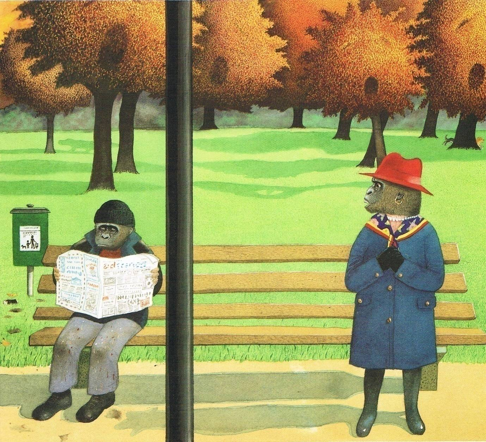

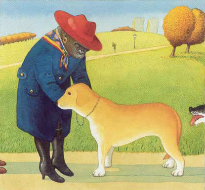

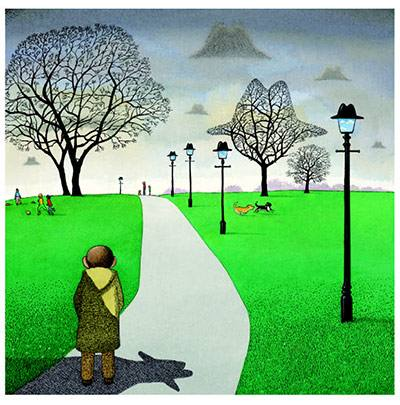

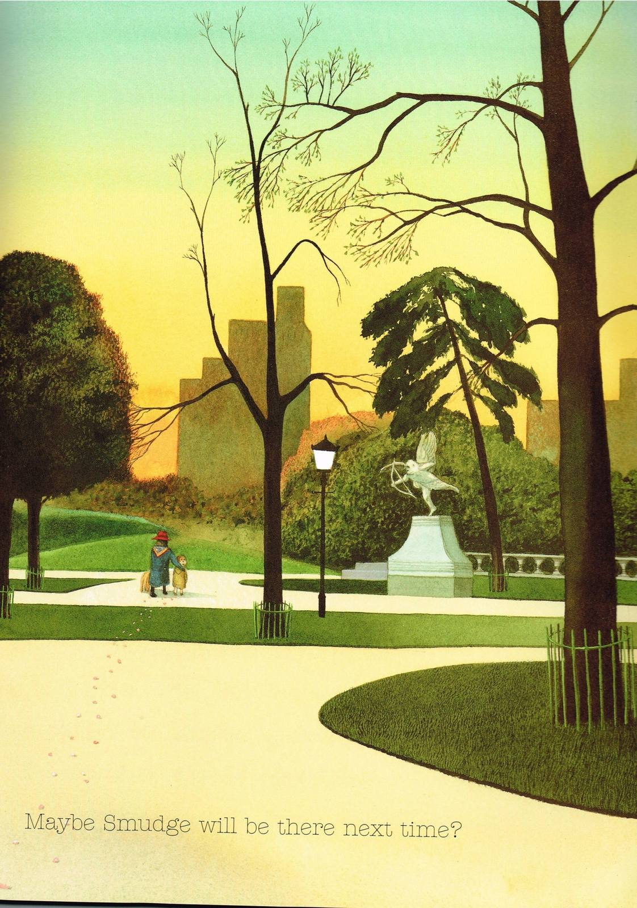

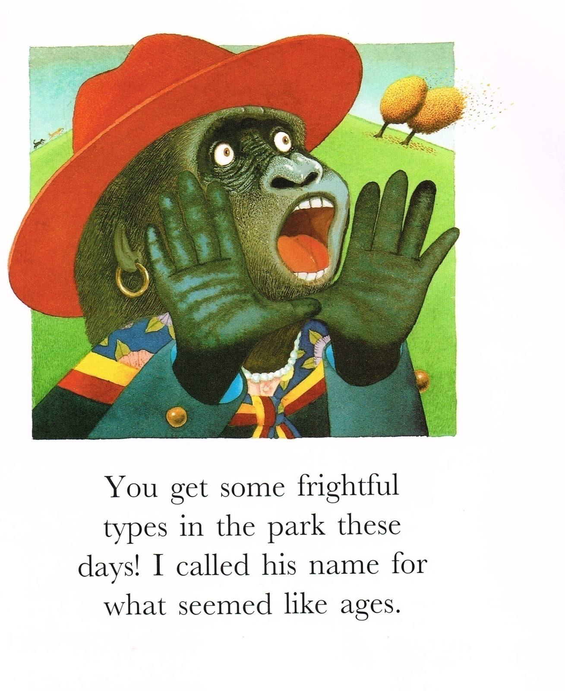

**Anthony Brown on Voices in the Park**

Voices in the Park was a book where I went back 20 years to revisit a
book called A Walk in the Park \-- a very simple story.

In Voices in the Park, I decided to tell the story in four different
ways with four different styles of painting, four different typefaces,
four different color schemes, four different ways of creating images.

It seemed an interesting way to do a book.

One of the things that Voices in the Park does is to encourage children
to see things from other people\'s point of view. To see the world
through other people\'s eyes \-- to imagine what it\'s like to be
somebody else.

There\'s a picture in Voices in the Park where two dogs are racing
around like old friends.

Children notice more than adults do that I\'ve painted the mongrel dog
with the pedigree dog\'s tail and vice versa. They\'ve almost become
each other.

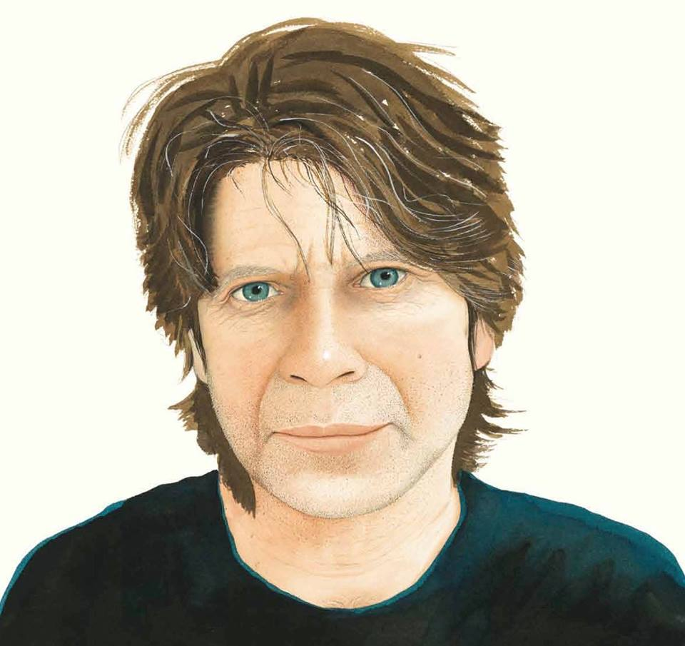

It was time to take Victoria,our pedigree \
Labrador, and Charles, our son, for a walk.

When we arrived at the park, I let Victoria off her lead. Immediately
some scruffy mongrel appeared and started bothering her.

I shooed it off, but the horrible thing chased her all over the park. I
ordered it to go away, but it took no notice of me whatsoever. \"Sit,\"
I said to Charles. \"Here.\"

I was just planning what we should have to eat that evening when I saw
Charles had disappeared. Oh dear! Where had he gone?

You get some frightful types in the park these days!\
I called his name for what seemed like an age.

Then I saw him talking to a very rough-looking child. \"Charles, come
here. At once!\" I said. \"And come here please, Victoria.\"

We walked home in silence.

**I needed to get out of the house,**

**so me and Smudge took the dog to the park.**

**He loves it there.**

**I wish I had half the energy he\'s got.**

**I settled on a bench and looked through the paper for a job.\
I know it\'s a waste of time really, but you\'ve got to have a bit of
hope, haven\'t you?**

**Then it was time to go. Smudge cheered me up. She chatted happily to
me all the way home.**

I was at home on my own again. It\'s so boring. Then Mummy said that it
was time for our walk.

There was a very friendly dog in the park and Victoria was having a
great time. \
I wished I was.

\"D\'you wanna come on the slide?\" a voice asked. \
It was a girl, unfortunately, but I went anyway.

She was brilliant on the slide, she went really fast. \
I was amazed.

The two dogs raced round like old friends.

The girl took off her coat and swung on the climbing frame, so I did the
same.

I\'m good at climbing trees, so I showed her how to do it. She told me
her name was Smudge - a funny name, I know, but she\'s quite nice.

Then Mummy caught us talking together and I had to go home.

Maybe Smudge will be there next time?

Dad had been really fed up, so I was pleased when he said we could take
Albert to the park.

Albert\'s always in such a hurry to be let off his lead.

He went straight up to this lovely dog and sniffed its bum (he always
does that). Of course, the other dog didn\'t mind, but its owner was
really angry, the silly twit.

I got talking to this boy. I thought he was a bit of a wimp at first,
but he\'s okay.

We played on the see-saw and he didn\'t say much, but later on he was a
bit more friendly.

We both burst out laughing when we saw Albert having a swim.

Then we all played on the bandstand, and I felt really, really happy.

Charlie picked a flower, and gave it to me.

Then his mum called him and he had to go.\
He looked sad.

When I got home I put the flower in some water, and made Dad a nice cup
of tea.

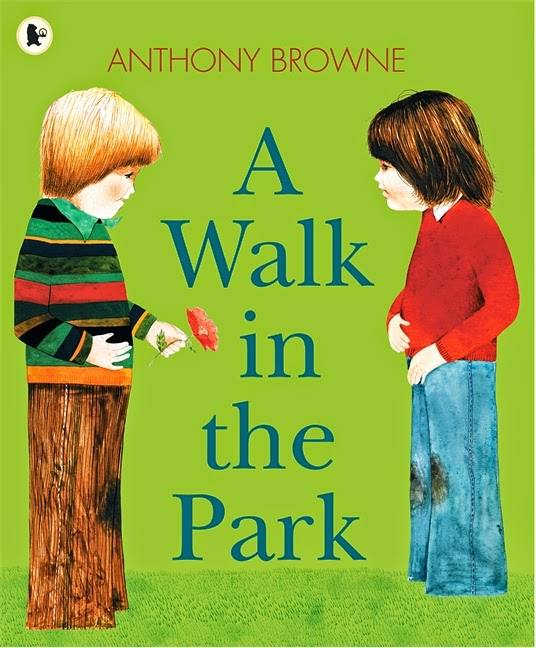

Although Voices in the Park (2000) is one of the most well known picture

books by Anthony Browne, many educators are unaware that it is a second
version (not exactly a sequel, but more like a retelling in a different
format) of A Walk in the Park (1977) which has recently been
re-released. In the original version, we learn the names of the
parents - Mrs. Smythe and Mr. Smith - who go nameless in Voices in the
Park. The variations among SES and class distinctions are equally
pronounced in both versions, though A Walk in the Park is not told in
four separate voices. Both versions are highly recommended.

**A Walk in the Park Anthony Browne**

One morning Mr Smith and his little girl, Smudge, took their dog,
Albert, for a walk.

On that same morning Mrs Smythe and her son, Charles, were taking their
dog, Victoria, for a walk.

Smudge, Mr Smith and Albert went into the park.

Mrs Smythe, Charles and Victoria arrived soon afterwards.

Albert was impatient to be let off his lead.

Victoria waited patiently until Mrs Smythe had detached the lead from
her collar.

Both dogs were free. They chased each other all over the park.

Mr Smith went to sit at one end of a bench and Smudge sat with him.

Mrs Smythe sat at the other end with Charles. Smudge and Charles looked
at each other.

Albert and Victoria raced along the paths, dodging round trees, leaping
over flower beds. First Albert chased Victoria, then Victoria chased
Albert, then Albert chased Victoria again, so quickly that sometimes it
was difficult to tell them apart.

While the dogs played, Smudge and Charles edged nearer and nearer to
each other. Mr Smith and Mrs Smythe looked the other way.

Smudge went on the swings, swinging higher and higher, as high as she
dared. Charles was not so sure.

Meanwhile an angry gardener chased the dogs off the flower beds.

They took off their coats and Smudge swung like a monkey on the climbing
frame.

Albert felt too hot, so to cool himself he plunged into the fountain/

Smudge and Charles climbed a tree.

They all played on the bandstand. The whole world seemed happy.

But Mr Smith read his newspaper at one end of the bench and Mrs Smythe
looked ther other way.

Charles picked a flower and gave it to Smudge.

"'Ere Albert, 'ere Smudge," yelled Mr Smith. "Time for 'ome!"

"Come here Victoria, come along Charles," called Mrs Smythe. "Time for
lunch."

Mrs Smythe took Charles and Victoria home.

Mr Smith took home Smudge and Albert.

And Smudge kept the flower.

Anthony Browne talks about \"Voices In The Park\"

A Walk in the Park was the second book I published, twenty years ago,
and while I have always liked the story, I felt that the illustrations
look rushed and clumsy.

I've often wished that I could revisit the book. I've also wanted for
some time to write a book from the point of view of different characters
in a story. I like the idea of showing that the world looks very
different from inside someone else's head. At some stage I must have
brought these two ideas together, and out of them came Voices in the
Park.

The original, A Walk in the Park, is a very simple story of Mrs. Smythe
and her son, Charles, who take their dog, Victoria, to the park. At the
same time, Mr. Smith and his daughter, Smudge, take their dog, Albert,
to the park. The dogs immediately play together and weave their way
through the pages of the book. Mrs. Smythe and Charles sit at one end of
a bench, Mr. Smith and Smudge sit at the other end, all ignoring one
another. As they see the dogs playing happily together, Charles and
Smudge gradually edge toward each other and slowly start to play.

They take off their coats and finally dance on the bandstand along with
the dogs. Charles picks a flower and gives it to Smudge, and at that
moment they are abruptly separated by their parents and taken home.

I divided the new book into four parts, starting with the woman's voice.
She speaks to her dog with much more tenderness than to her son. I set
this section in the autumn; as they walk home in silence, a trail of
leaves is left in their wake.

The second voice is that of the man, and this section is shown in
winter. He also is so wrapped up in his own problems that he doesn't
really notice what his child is doing. On their way home they pass the
same dreary place and figures we had seen earlier, but this time his
daughter is chatting merrily to him and lighting up the scene. In the
background we see some early signs of spring.

For the third voice we hear and see the boy's world. At the beginning of
this section I've used a tight, crosshatched style. Gradually we see
spring develop as he meets the girl, the pen line disappears, and the
colors become warmer and brighter.

Finally we hear from the girl, and now it seems to be perpetually
summer. Her world is bright and lively and imaginative --very bizarre
things happen here.

Something wasn't quite right, however. One day I found myself painting
over one of the faces, and it turned into a gorilla. I had a mixture of
feelings-I didn't want to do another gorilla book, it didn't seem
necessary or relevant to the story to make them gorillas. But it worked.
I changed the other characters and it worked for them, too. In a
peculiar kind of way it made them more real, more human. And it made the
whole book funnier. I still haven't worked out why it works, and in a
way I don't want to, but it does show that quite often the best
decisions I make have more to do with instinct than intellect.

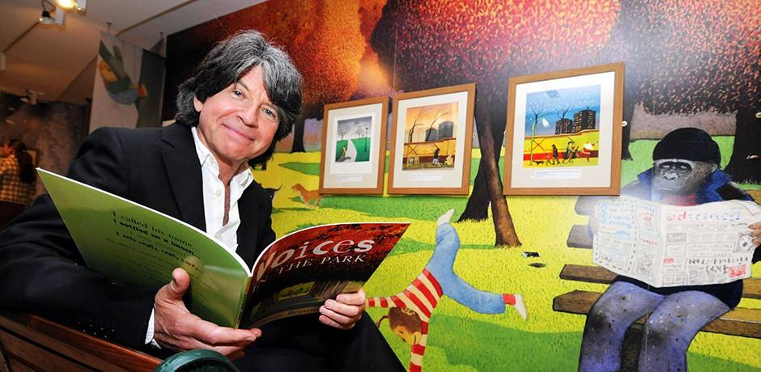

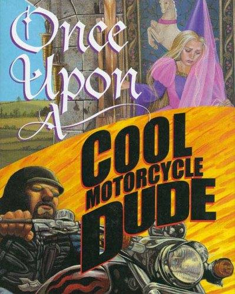

Once upon a time there was a boy and a girl who had to tell a fairy tale
to the class, but they couldn't agree on the story.

Could be read as partners reading orally, and then used as a springboard
for a story written by two.

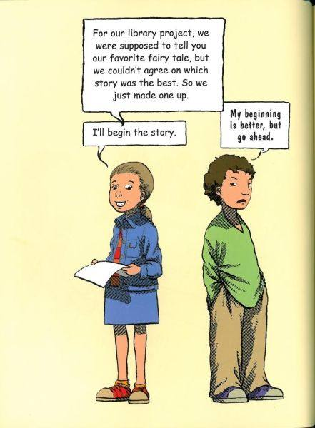

**Once Upon a Cool Motorcycle Dude Kevin O'Malley**

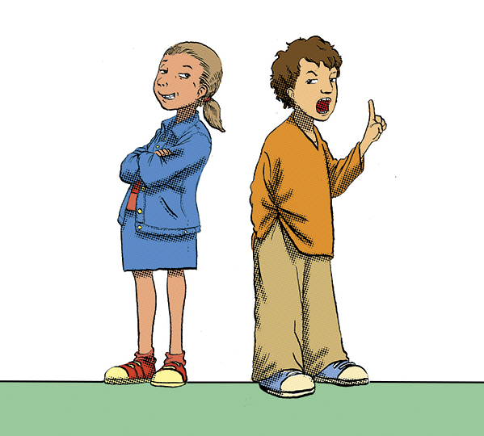

For our library project, we were supposed to tell you our favourite
fairy tale, but we couldn't agree on which story was the best. So we
just made one up. I'll begin the story.

My beginning is better, but go ahead,

Once upon a time in a castle on a hill there lived a beautiful princess
named princess Tenderheart.

Every day Princess Tenderheart would play with her eight beautiful
ponies. She named them Jasmie, Nimble, Sophie, and Polly. And Penny and
Sunny and Monica ...

Her favourite pony of all was called Buttercup.

Please ... don't call him Buttercup. Call him Ralph or something.

One night a terrible thing happened. A giant came and stole away poor
little Jasmie. All the other ponies cried and cried, but Princess
tenderheart cried hardest of all.

It was very sad.

The very next night the giant came and took Nimble and Sophie. Princess
Tenderheart cried all day and refused to eat.

Oh please ... get a grip, Princess!

Her father, the king, hired all the princes he could find to protect the
ponies, but night after night another pony was stolen away.

The poor princess just sat in her room and turned straw into gold
thread. She cried and cried and cried. When only Buttercup was left,
Princess Tenderheart thought her heart would break.

Oh, who would protect Buttercup?

That's it ... I can't take it anymore. I'll tell the story from here.

Dudes ...

One day this really cool muscle dude rides up to the castle on his
motorcycle. He says he'll guard the last pony if the king gives him all
the gold thread that the princess makes. The king says okay, and the
dude sits and waits for the giant.

As if ... He's not even cute or anything.

So that night the giant heads up to the castle. Man, this giant was an
ugly dude. He was big and mean and he had four teeth in his mouth that
were all rotten and yellow and black ...

... and his breath smelt like rotten, mouldy, stinky wet feet.

He needs eight ponies to make a tasty pony stew and he only has seven.
So that night he goes to steal the last horsey.

That's just gross!

The muscle dude has this really big sword. The giant and the dude
battled all over the place. The Earth was shaking and there was
lightning and thunder and volcanoes were exploding.

It was HUGE!

Volcanoes? Where'd the volcanoes come from?

Night after night the giant comes back, but the dude beats him. Night
after night the princess makes gold thread and gives it to the dude. He
gets really RICH ...

THE END!

That's it? The Princess just sits around making thread?

Yep!

I don't think so ... I'll tell you what happened, bubba!

Princess Tenderheart goes to the gym and pumps iron. She becomes
Princess Warrior.

VERY COOL!

She tells the dude to make his own thread.

So that night the princess has this huge and tremendous battle. The
giant runs back to his cave.

The End.

And the dude just sits there making gold thread,

Nuh-uh! See, this is what really happened ...

The dude makes this really cool blanket out of the gold thread, and when
he puts it over his head he turns INVISIBLE. Then he goes to rescue the
ponies.

"You can't see me." 'You can't see me!"

"You can't see us!" The princess goes with him.

Fine!

The dude and the princess get into this big fight over who gets to free
the ponies.

The giant hears voices and gets so scared he jumps off the cliff.

COOL!

COOL!

So the princess and the prince fall in love --

Who said he was a prince? And what's this stuff about love?

They get married on a beautiful spring day and then they have a baby. it
was the most beautiful baby girl!

NUH-UH ... It was a BOY!

It was a girl.

**\**

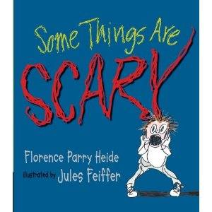

You're skating downhill, but you don't know how to stop. You're having
your hair cut, and you suddenly realise . . . they're cutting it too
short. There's no question about it: some things are scary. And never
have common bugaboos been exposed with more comic urgency than in this
masterful mix of things horrible and humiliating, monstrous or merely
unsettling. Florence Parry Heide's witty text and Jules Feiffer's
over-the-top illustrations will get even the most anxious recipients
laughing, while reassuring them (no matter how old they are) that
they're not alone in their fears.

**Turn and talk:**

*Focus on one scary thing that has happened to you.*

Use the talk as a rehearsal for writing with voice.

**Show don't Tell**

If you *show* a character\'s fear through his reactions, there\'s no
need to then *tell* the reader that he\'s feeling scared.

**Some Things Are Scary Florence Heide**

Getting hugged by someone you don't like is scary.

Seeing something on your plate you know you're not going to like is
scary.

Stepping on something squishy when you're in your bare feet is scary.

Holding onto someone's hand that isn't your mother's when you thought it
was is scary.

Seeing a big warning sign and you can't understand what it's saying is
scary.

Skating downhill when you haven't learnt how to stop is scary.

Waiting to jump out and say BOO! At someone is scary.

Knowing that someone is waiting to jump out and say BOO! At you is
scary.

Thinking you're not going to be picked for either side is scary.

Being on a swing when someone is pushing you too high is scary.

Getting a shot is scary.

Telling a lie is scary.

Stepping down from something that is higher than you thought it was is
scary.

Smelling a flower and finding a bee was smelling it first is scary.

Being with your mother when she can't remember where she parked the car
is scary.

Discovering that your hamster's cage is empty is scary.

Getting scolded is scary.

Thinking what if you'd been born a hippopotamus is scary.

Finding out your best friend has a best friend who isn't you is scary.

Playing hide-and-seek when you're it and you can't find anyone is scary.

Having your best friend move away is scary.

Thinking about a big bird with big teeth who might swoop down and carry
you away is scary.

Brushing your teeth with something you thought was toothpaste but it
isn't is scary.

Reaching under your bed for your shoes and grabbing something -- you
don't know what -- is scary.

Looking in the mirror while you're having a haircut and they're cutting
it too short is scary.

Thinking you're not going to get any taller than you are right now is
scary.

Having to tell someone your name and they can't understand you and you
have to spell it

Is scary.

Knowing your parents are talking about you and you can't hear what
they're saying is scary.

Having people looking at you and laughing and you don't know why is
scary.

Climbing a tree when you don't remember how to get down is scary.

Being with your parents in an art museum and thinking you're never going
to see the exit sign is scary.

Knowing you're going to grow up to be a grown-up is scary.

**\**

**Owl Moon Jane Yolen**

On a cold winter\'s night a young girl and her father walk through the
woods hoping to see a Great Horned Owl. The girl knows she must be quiet
and patient if she hopes to see an owl, and that there\'s even a chance
that no matter how quiet she is or how long she waits, she and her
father might not see any owls at all. Then, after a long, cold search,
the girl\'s patience is rewarded.

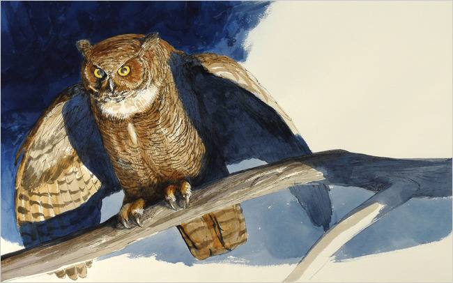

Illustrated by John Schoenherr

Collect descriptive phrases Jane Yolen used to help readers paint
pictures in their mind.

What similes and metaphors are in the story?

What words and phrases give sensory details?

How did the author create a quiet tone for the story?

What techniques did she use to make it sound like a poem as well as a
story?

Imagine a Great Horned Owl perched high on a tree branch during a frigid
moonlit night. Write the events of Jane Yolen's story from the owl's
point of view. What sounds would the owl hear? How will you describe the
owl when he hears the family crunching through the snow?

In Owl Moon the story is written from a young girl's point of view.
Imagine that the little girl snuggled into bed after her wintry walk in
the woods. Before going to sleep, she writes about her adventure in a
journal. Write the diary entry the young girl may have written after her
night of owling.

Special things done with a family member or friend.

What did you like most about spending time alone with this person?

What kinds of things did you talk about?

Was there a time where you did something that required quietness, and
you didn't need to talk. (See next idea )

In Owl Moon, the characters never speak to each other with words.
Students describe times they had to be quiet?

Why was being quiet was hard or easy to do?

Miming can communicate a variety of feelings (happiness, sadness, fear,
shock, anger, frustration, tenderness, etc.). and is a good lead in the
Show don't Tell.

+-----------------+--------------------------------------+----------------------+
| Craft           | Example                              | Reason               |
+=================+======================================+======================+
| Poetic format   | Whole text                           | Determines reading   |
|                 |                                      | style                |
+-----------------+--------------------------------------+----------------------+
| Descriptive     | *...the snow below it was whiter     | Mental picture       |
| language        | than the milk in a cereal bowl*      |                      |
| sensory images  |                                      |                      |
+-----------------+--------------------------------------+----------------------+
| Effective       | *The kind of hope that flies on      | Echoes book title    |
| ending          | silent wings under a shining Owl     |                      |
|                 | Moon*                                |                      |
+-----------------+--------------------------------------+----------------------+
| 'And' sentence  | *And the moon was so bright*         |                      |
| beginning       |                                      |                      |
|                 | *the sky seemed to shine*.           |                      |
+-----------------+--------------------------------------+----------------------+
| Alliteration    | *long and low*                       |                      |
|                 |                                      |                      |
|                 | *like a sad, sad song*               |                      |
|                 |                                      |                      |
|                 | *wet and warm*                       |                      |
+-----------------+--------------------------------------+----------------------+
| Hyperbole       | *For one minute, three minutes,      | Time stands still    |
|                 | maybe even a hundred minutes, we     |                      |
|                 | stared at one another*               |                      |
+-----------------+--------------------------------------+----------------------+
| Onomatopoeia    | *"Whoo-whoo-who-who-who-whooooooo,"* | Repeated adds mood.  |
+-----------------+--------------------------------------+----------------------+
| Metaphor        | *The shadow hooted again.*           |                      |
|                 |                                      |                      |
|                 | *But I was a shadow.*                |                      |
|                 |                                      |                      |
|                 | *The moon made his face into a       |                      |
|                 | silver mask.*                        |                      |
+-----------------+--------------------------------------+----------------------+
| Personification | *..an echo came threading its way    |                      |
|                 | through the trees; and little grey   |                      |
|                 | footprints followed us.*             |                      |
+-----------------+--------------------------------------+----------------------+

**Owl Moon Jane Yolen**

It was late one winter night,

long past my bedtime,

when Pa and I went owling.

There was no wind.

The tress stood still

as giant statues.

And the moon was so bright

the sky seemed to shine.

Somewhere behind us

a train whistle blew,

long and low,

like a sad, sad song.

I could heat it

through the woollen cap

Pa had pulled down

over my ears.

A farm dog answered the train,

and then a second dog

joined in.

they sang out,

trains and dogs,

for a real long time.

And when their voices

faded away

it was as quiet as a dream.

We walked on towards the woods,

Pa and I.

Our feet crunched

over the crisp snow

and little grey footprints

followed us.

Pa made a long shadow,

but mine was short and round.

I had to run after him

every now and then

to keep up,

and my short, round shadow

bumped after me.

But I never called out.

If you go owling

you have to be quiet,

that's what Pa always says.

I had been waiting

to go owling with Pa

for a long, long time.

We reached the line

of pine trees,

black and pointy

against the sky,

and Pa held up his hand.

I stopped right where I was

and waited.

He looked up,

as if searching the stars,

as if reading a map up there.

The moon made his face

into a silver mask.

Then he called:

*"Whoo-whoo-who-who-who-whooooooo,"*

The sound of a Great Horned Owl.

*"Wh00-whoo-who-who-who-whooooooo."*

Again he called out.

And then again.

After each call

he was silent

and for a moment we both listened.

But there was no answer.

Pa shrugged

and I shrugged.

I was not disappointed.

My brothers all said

sometimes an owl

and sometimes there isn't.

We walked on.

I could feel the cold,

as if someone's icy hand

was palm-down on my back.

And my nose

and the tops of my cheeks

felt cold and hot

at the same time.

But I never said a word.

If you go owling

you have to be quiet

and make your own heat.

We went into the woods.

The shadows

were the blackest things

I had ever seen.

They stained the white snow.

My mouth felt furry,

for the scarf over it

was wet and warm.

I didn't ask

what kinds of things

hide behind black trees

in the middle of the night.

When you go owling

you have to be brave.

Then we came to a clearing

in the dark woods.

The moon was high above us.

It seemed to fit

exactly

over the centre of the clearing

and the snow below it

was whiter than the milk

in the cereal bowl.

I sighed

and Pa held up his hand

at the sound.

I put my mittens

over the scarf

over my mouth

and listened hard.

And then Pa called:

*"Whoo-whoo-who-who-who-whooooooo,"*

*"Whoo-whoo-who-who-who-whoooooooo."*

I listened

and looked so hard

my ears hurt

and my eyes got cloudy

with the cold.

Pa raised his face

to call out again,

but before he could

open his mouth

an echo

came threading its way

through the trees.

*"Whoo-whoo-who-who-who-whooooooo,"*

Pa smiled.

Then he called back:

*"Whoo-whoo-who-who-who-whoooooooo,"*

just as if he

and the owl

were talking about supper

or about the woods

or the moon

or the cold.

I took my mitten

off the scarf

off my mouth,

and I almost smiled, too.

The owl's call came closer,

from high up in the trees

on the edge of the meadow.

Nothing in the meadow moved.

All of a sudden

an owl shadow,

part of the big tree shadow,

lifted off

and flew right over us.

We watched silently

with heat in our mouths,

the heat of all those words

we had not spoken.

The shadow hooted again.

Pa turned on

his big flashlight

and caught the owl

just as it was landing

on a branch.

For one minute,

three minutes,

maybe even a hundred minutes,

we stared at on another.

Then the owl

pumped its great wings

and lifted off the branch

like a shadow

without a sound.

It flew back into the forest.

"Time to go home,"

Pa said to me.

I knew then I could talk,

I could even laugh out loud.

But I was a shadow

as we walked home.

When you go owling

you don't need words

or warm

or anything but hope.

That's what Pa says.

The kind of hope

that flies

on silent wings

under a shining

Owl Moon.

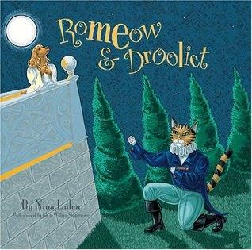 Author-artist Nina Laden has taken her
trademark wit and applied it to one of Shakespeare\'s best-loved plays.
Adults familiar with the classic love story will delight in the many
references to the original play, all of which make this a rarity: a
children\'s book they want to read again and again. And young children
who know nothing of the Bard will be riveted by this funny yet touching
tale about Romeow the cat and Drooliet the dog, two star-crossed lovers
who meet by chance, marry in secret, and are kept apart by a snarling
rottweiler, appalled owners, and the animal control warden. The clever
details throughout the book belie the careful research behind this
homage to true love won and lost and in the case of this book won again
proving once and for all that dogs and cats can be friends.

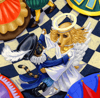

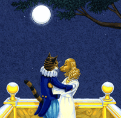

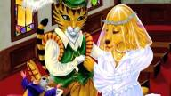

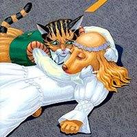

**Romeow & Drooliet**

**Nina Laden**

**The Characters**

The Felinis .................................... A cat-loving family

The Barkers .................................\... A family of dog lovers

Romeow ....................................\... The Felinis' favourite
cat

Drooliet ....................................\.... The Barkers' cuddly
canine

Benny .......................................\... A Felini cat,

brother and friend of Romeow

Marky .......................................\... A Felini cat,

brother and friend of Romeow

Turbo .......................................... The Barkers' guard dog

Mousignor ..................................... A church mouse

Officer Prince .................................. Animal control warden

Other people, cats and dogs

Narrator ....................................... The one telling the
story

In the fair and sometimes not fair city, there lived two nearby feuding
families. The Felinis were cat people, it's true. They could not stand
dogs or what those dogs do. The dog-loving Barkers hated all cats.
Normally we would just leave it at that. But we have a tale to tell of
their pets. A story of love. A tale of regret. A story that has not
quite started yet. Now here is "Romeow and Drooliet."

Benny, Marky and Romeow were brothers, and the best of friends. One fine
morning, they were taking a break from their naps.

"I'm bored," said Benny with a yawn.

"Let's go to the park," said Marky.

"What for?" asked Benny.

"To look for trouble," replied Marky.

"No," said Romeow, dreamily, "to look for love."

"Yuck," said Benny and Marky, "go back to sleep."

But Romeow was already on his way out the door with his tail held high.

The park was a great place for adventure. There were trees to climb,
birds to chase and dogs to watch.

"Let's head to the off-leash area," Marky suggested.

"Can't catch me," he caterwauled to a large husky trapped behind the
fence. "What do you think,: he asked Romeow, "should we play Dodge Dog?"

Just as Romeow was about to reply, a carnivorous canine charged the
cats. The hotheaded dog barked, snapped and nearly jumped the fence.

"Here, Turbo," some one called. "Come on, boy."

Turbp reluctantly left, and the cats decided that they should, too.

"That was a close one," said Benny.

"Marky, one of these days you're going to get us into trouble," Romeow
said, scowling.

"Come on, guys!" Marky replied. "There's a costume party in the
neighbourhood tonight. I hear they are having barbequed salmon and
grilled shrimp. Shall we groom ourselves? What do you say?"

"I say we go home and get ready," Benny cheered.

"Okay, Marky, but no tricks," Romeow warned.

Back at the feline house, the cats dug through bags and drawers. When
they were done, the room was as messy as a litter box. Dressed in their
flashy finery, they streaked out the door like lightning and bolted in
to the night.

It was easy to find the party. Throngs of revellers, sounds of laughter
and music and delicious smells spilled into the street.

"But that's the house of the cat-hating Barkers," Romeow protested.

"The sign says All Welcome," said Marky. "Besides, we're disguised."

"And I smell fish," Benny purred.

"I smell trouble," Romeow mumbled, looking at Marky.

But the Felini felines followed their noses. At least Benny and Marky
did. Romeow followed his eyes. Gazing across the room, he thought he saw
an angel. As he got closer, he felt warm all over. She was the most
beautiful sight he had ever seen.

"May I have this dance?" Romeow nervously asked. He was delighted when
she gave him her paw. As they danced, Romeow smiled. She smiled back.
They twirled and dipped. The room spun. Romeow had never felt so happy.
He looked at her collar.

"Drooliet, now there's a name that I'd drool over anytime," he said.

"And what shall I call you?" Drooliet panted.

But before Romeow could answer, Turbo, the terror from the park, growled
from out of nowhere. "You can call him a freeloading Felini cat! Now
scram before this party turns into a kitty catastrophe."

"My name is Romeow," Romeow called as he escaped. "We shall meet again,
dear Drooliet."

"Not if I can help it," Turbo barked.

"Good boy," said the Barkers.

Romeow drifted through the Barkers' yard in a dreamy fog. He couldn't
get Drooliet out of his mind. Then suddenly he heard her voice coming
from a balcony above.

"Oh, Romeow, where is that fur-faced Romeow? I do not care that you are
a cat or a Felini. If you were a creature of any other name, it would
still make my tail wag."

With a running start, Romeow jumped onto the balcony and landed next to
Drooliet.

"Call me any name you want," Romeow purred, "just call me yours."

That moonlit night, cat and dog fell in love.

They had no cares, just the stars up above.

Romeow licked Drooliet on her face.

His whiskers tickled but she smiled with grace.

"We shall be married," said young Romeow.

"I'll be with you forever, starting now.

Meet me at the church. Sneak out of your house.

There we will be wed by Mousignor Mouse."

But will the world accept what happened next

To our dear Romeow and Drooliet.

They met the next day in front of the church. Romeow took Drooliet to a
small chamber in the back. Mousignor Mouse entered, his robes flowing,
his tail trailing.

"Are you ready to be joined together as husband and wife?" he squeaked.

"I will love you and fetch you anything you desire," Drooliet promised
Romeow.

"I will love you and groom you even if I get hairballs," Romeow promised
Drooliet.

"You may lick the bride," pronounced Mousignor Mouse.

Happilt married, Romeow and Drooliet went for a walk in the park. The
sky seemed bluer, the sun seemed brighter. Suddenly a large dark shadow
ran towards them it was Turbo!

"Drooliet, we've been looking for you. What are you doing with that
cat?" he howled. "And you, Felini cat, will soon be puppy chow."

"Let's not fight," Romeow pleaded with Turbo, "we are family."

"No cat is kin to me," Turbo bellowed.

A crowd started to form. The Barkers arrived out of breath. Benny and
Marky ran to Romeow's side.

"This is foolish," Benny told Romeow, "she's a dog. She's not worth it."

Marky hissed at Turbo. "Roll over and play dead, fleabag."

Turbo exploded and attacked Marky.

"Stop," cried Romeow, "it's me that you want."

Romeow drew his claws as Marky crawled away to lick his wounds. With all
his might, Romeow swiped at Turbo's snarling, snapping, massive muzzle.
In seconds, Turbo sank to the ground with barely a whimper.

"Cat got your tongue?" Benny taunted.

Romeow wanted to run to Drooliet, but all of a sudden he was grabbed
from above.

"Okay, stray, you're coming with me," said Officer Prince, the animal
control warden. "And get that dog on a leash," he yelled at the Barkers.

Romeow turned to see what was happening to Turbo, but it wasn't Turbo he
was talking about. Turbo was sitting quietly with his tail between his
legs. It was Drooliet! Before the Barkers could collar her, Drooliet
took off running.

As the animal control truck sped off with Romeow held prisoner inside,
everyone scrambled out of the park. The Felinis pursued the van. The
Barkers chased after Drooliet. And Benny and Marky took shortcuts
through back alleys.

The truck skidded to a stop at its dreaded destination. There was a huge
commotion as people, cats and dog arrived. Officer Prince opened the
door to Romeow's cage. A split second later Romeow spied Drooliet across
the street. She didn't even look for traffic before she crossed. Before
Romeow could call out to her, he heard the worst sounds of his life.
First there was the screeching, then a dull thud and last a silence as
big as the universe. Everyone looked on in disbelief. Drooliet lay
motionless in the middle of the street. No one moved. Then Romeow ran
towards her.

"Drooliet," Romeow cried, "my love, my wife."

"His wife?" the crowd on the sidewalk gasped.

"We haven't even been married a day," he sobbed as he rubbed her head
with his. "I still have to give you your wedding present."

Then Romeow licked Drooliet. He licked her face. He licked her ears. He
licked her paws. Slowly, Drooliet opened her eyes. She whimpered. "Oh,
Romeow, it's you."

"Were you expecting a cat in a hat?" Romeow teased.

The crowd cheered. The Barkers hugged the Felinis. The Felinis hugged
the Barkers. Turbo, Benny and Marky even high-fived. Officer Prince said
it was a miracle and the charges were dropped. A celebration was planned
for that evening.

And this time all really *were* welcome.

So how is it that our heroine lived?

From a gift only her true love could give.

This cat gave his dog one of his nine lives.

They shared all the rest at each others' sides.

Felinis and Barkers became fast friends,

And cats and dogs played together again.

Now stories will come and stories will go.

Some wither and die. Some blossom and grow.

Some live in your heart. So don't you forget

The tale of Romeow and Drooliet.

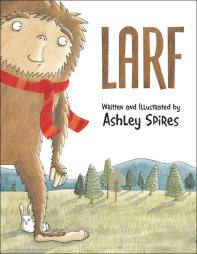

**Larf Ashley Spires**

No one believes Larf exists, and he likes it that way. Larf, you see, is
a sasquatch, the only sasquatch in the world (or so it seems). He has a
very pleasant, and very private, life in the woods, where on any given
day he might be found jogging, gardening or walking Eric, his pet bunny.
But everything changes one morning when Larf discovers that another
sasquatch is scheduled to make an appearance in the nearby city of
Hunderfitz. What?! That must mean he\'s not the only sasquatch in the
world!

Excited by the prospect of having a friend to share hair grooming tips
with (and let\'s face it, teeter-tottering alone is no fun), Larf
disguises himself as a city slicker and heads for Hunderfitz --- where
he\'s in for a couple enormous surprises.

Ashley Spires once again shows her chops for creating irresistible,
quirky characters and laugh-aloud stories and illustrations. Readers
with little feet and big feet will fall head over heels for Larf.

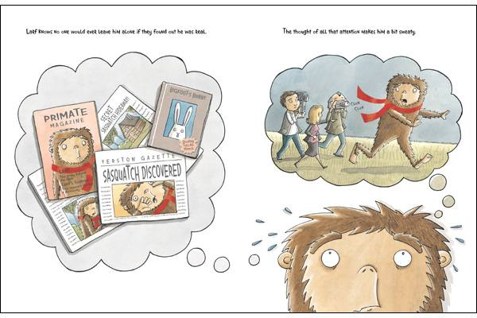

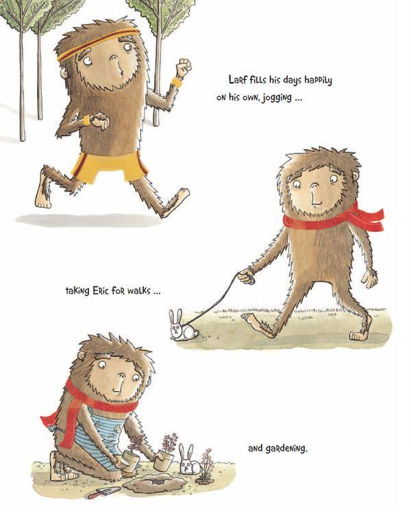

**Larf Ashley Spires**

Have you ever felt like nobody knows you even exist? That's exactly how
Larf feels. And he likes it that way.

Larf is a sasquatch. The only sasquatch, it seems. He lives a quiet life
in the woods with his bunny, Eric.

He was almost discovered once or twice. A hairy, seven-foot-tall,
scarf-sporting manbeast is pretty hard to miss.

"It's a guy in a gorilla suit."

"An escaped circus bear."

"Aunt Mildred?"

"A computer-generated fake."

But luckily for him, people rarely believe in anything new and strange.
And Larf is definitely strange.

Larf knows no one would ever leave him alone if they ever found out he
was real. The thought of all that attention makes him a bit sweaty.

Larf fills his days happily on his own, jogging ...

taking Eric for walks ... and gardening.

Until one morning, he notices an odd article in the newspaper. It claims
that a sasquatch is scheduled to make an appearance today in the nearby
city of Hunderfitz.

How can that be? He's not planning a trip to Hunderfitz. And even if he
was, he certainly wouldn't be going on a Wednesday -- it's laundry day!

Larf realises this can only mean one thing: he is NOT the only Sasquatch
in the world!

This could change everything. Larf isn't sure he wants a change. But
having another Sasquatch around opens up so many possibilities ...

Teeter-tottering would no longer be impossible. He could share hair
grooming tips. And his witty commentary on cheesy movies would no longer
go to waste. That settles it: Larf has to meet this other sasquatch!

Travelling to Hunderfitz is generally something that he avoids, but this
is a once-in-a-lifetime opportunity. Besides, Larf is a master of
camouflage. He is sure to go unnoticed.

"Billy, don't stare."

> "What is that?"\
> "Aunt Mildred?"

On the way, Larf starts to wonder what the other sasquatch will be like.
If this guy is making appearances, then he could be a bit of a showboat.
Larf isn't sure he wants to be around someone like that.

What if they don't get along? What is he doesn't like him and wants to
move in. What if he doesn't pick up his laundry? What if he eats meat?
What if he's allergic to Eric? Or, worst yet, what if HE is a SHE? Larf
really isn't ready to meet a girl. He hasn't had a bath in ... ever!

By the time he arrives, Larf is having second thoughts. He really does
enjoy being on his own.

All the activity, all the people and all the noise are making things
worse. Larf can hardly see straight, let alone think straight, in all
this hubbub! Does the other sasquatch actually like being around so many
people? Will life with someone else always be this loud?

Suddenly, Larf spots the other sasquatch! But something doesn't seem
quite right. Why are its eyeballs not moving? Is that a zipper down its
belly? And since when could a sasquatch wear perfectly normal-sized
running shoes?!

"You aren't a real sasquatch," Larf realises aloud.

The other sasquatch removes its head. "Of course I'm not. Sasquatches
aren't real," the guy underneath replies.

Larf is disappointed, but at least he can return to his quiet life in
the woods.

Then, while Larf is waiting for the bus back home, a voice says, "Your
bunny is super cute."

Larf looks up, and this time, what he sees seems exactly right. It looks
him right in the eyes and blinks! It's covered in hair but has no
zipper! And its feet are ENORMOUS!

My name is Shurl, and this is Patricia," the other sasquatch says,
smiling. Like Larf, she had come to meet the "real sasquatch." Now, it
seems, she has.

Larf invites her over for supper next Wednesday. (They are the only two
of their kind in the whole world, after all. It's just the polite thing
to do.) Shurl agrees. "But I should tell you, neither Patricia nor I eat
meat."

Larf decides that just as soon as he gets home, he's going to have a
bath. After he does his laundry, of course.

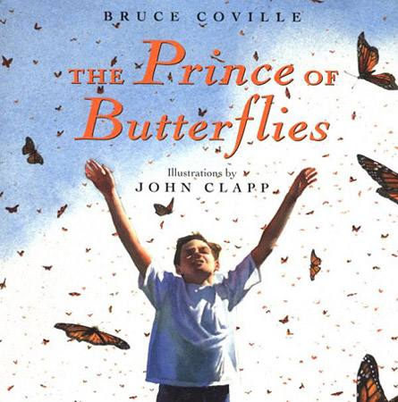

**The Prince of Butterflies Bruce Coville**

About the Story:

Two days after John Farrington\'s eleventh birthday, a migration of
monarch butterflies landed on his house.

They are light as air, soft as feathers, fragile as a dream. They are
lost and need a guide to lead them to safety-someone like
eleven-year-old John Farrington. They will change his life forever.

Passionate, moving, and inspiring, this flight of fantasy from master
storyteller Bruce Coville is a timely fable about the difficulties---and
the rewards---of staying true to one\'s heart.

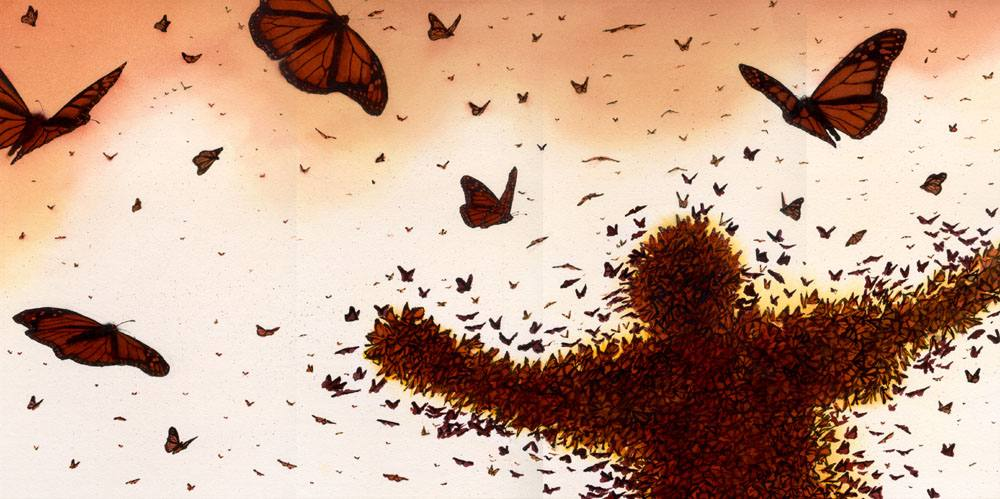

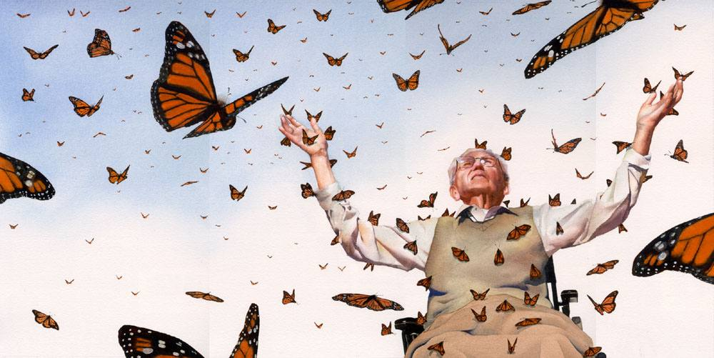

**\**

> **The Prince of Butterflies Bruce Coville**
>
> Two days after John Farrington's eleventh birthday, a migration of
> monarch butterflies landed on his house.
>
> When John came out the front door that morning the monarchs covered
> the side of his home like some living carpet, their orange wings
> folding and unfolding so that the pattern never stayed the same from
> one moment to the next. Clusters of the butterflies decorated the
> porch railing, the lawn chairs, the family car, and patches of the
> side yard.
>
> It was the most amazing, the most beautiful thing he had ever seen.
>
> John made not a sound, for fear of frightening the flock away. And
> though his hands fairly itched to catch one, he worried that if he
> tried the whole flock would take wing. Barely daring to breath, he
> walked a few feet from the house then sank gently to the ground, where
> he held as still as he could.
>
> This sitting still was not easy for John. He was rambunctious by
> nature, and preferred running and shouting to being quiet. But in this
> case he was willing to make an exception.
>
> His self-control was rewarded when one of the butterflies landed on
> the tow of his sneaker. It opened and closed its wings once, then
> began to walk up his leg.
>
> More butterflies started in John's direction, some simply turning so
> they were facing him, others fluttering towards him in short hops.
> Three landed on his left shoulder. One, particularly bold, came
> feather soft to his hand,
>
> John swallowed nervously, trying to fight down a moment of fear. What
> could be more harmless than a butterfly? Yet he sensed something
> uncanny moving about him, something unnatural -- or at least not
> *natural* as he understood the word. And then \...
>
> The butterflies spoke to him, a thousand voices whispering in his mind
> as delicately as a wing brushing his cheek. What they said -- not in
> words but quite clearly nevertheless -- was *Help!*
>
> Panic shivered down John's spine, and it was all he could do to keep
> from leaping up and running away. Forcing himself to hold still, he
> closed his eyes and thought, *How? Why?*
>
> More butterflies landed on his unmoving body, butterflies on his arms
> and legs, on his shoulders. Delicate creatures, fragile and \...
> frightened. As they came to him, the image of a meadow, green and
> quiet, filled his mind.
>
> *We've lost the path,* they whispered.
>
> *What path?* thought John.
>
> *The butterfly road that we follow home.* *We have a green place near
> here where we stop to feed and rest. But we can't find it. Once there
> was so much green. Where does it go?*
>
> John recognised the meadow, for he had often played there himself,
> until a construction company began turning it into a mini-mall last
> September. Without intending to, he formed an image of the meadow as
> it looked now.
>
> Their despair washed over him like a wave.
>
> *What shall we do? That was the last haven we knew of on this part of
> the path. Where can we go now?*
>
> The question was asked by thousands of the butterflies. Under it
> drifted the sad thoughts of others who simply sighed with a sense of
> doom. Above it, clear and strong, rose a single bright voice that
> said, *Help us!*
>
> Fear and wonder fought for control of John's soul. *What can I do?*
>
> *Is there another green place? Somewhere not too far away?*
>
> John remembered a day earlier that month when he had gone out to sell
> magazines for the school's playground fund. He had ridden his bike too
> far and got lost. He'd seen a meadow then that might do, an island of
> green still untouched by bulldozers.
>
> When he formed an image of it in his mind, the butterflies rustled
> with excitement and relief. *Take us there!*
>
> *How?*
>
> Their answer came not in words, or pictures, or feelings, but
> something stronger. The butterflies surrounded John, brushing him with
> their wings, dropping their tiny scales on his eyes, his arms, his
> legs \... his two legs, four legs, six legs.
>
> Stretching the unexpected wings that arched from his sides, John took
> flight.
>
> His heart nearly burst with the joy of gliding though the warm air.
> Floating on the caress of soft breezes while ten thousand of his kind,
> flickering bright, flashing orange and black, fluttered all about him,
> he felt *not* alone in a way he never had before.
>
> *Lead us to the meadow,* pleaded the flock.
>
> Flapping his delicate wings, John flew up and away from his home until
> he could see the road he needed to follow. He fluttered along the side
> of it, guiding the monarchs above the houses.
>
> They journeyed through the morning, settling now on a hedge, now on a
> tree. *Just a little farther,* he kept promising. *Just a little
> farther.*
>
> When at last they reached the meadow, the butterflies settled to its
> weedy wilderness with a sense of joyous relief that lifted him as if
> it were a warm wind.
>
> John spent the morning with the butterflies, crawling along slender
> green stems, unrolling his long tube of a tongue to sip sweet nectar,
> luxuriating in the feel of the sun on his wings.
>
> Then, at noon, with the sun straight overhead, he suddenly realised he
> was in trouble.
>
> *Can you turn me back?* he asked frantically. *My mother is going to
> be furious with me for not telling her where I was going.*
>
> *Stay,* whispered the butterflies. *Stay with us.*
>
> John felt the sun on his wings, wings that could lift him to the sky,
> carry him free and far, and he longed to remain a butterfly. But he
> thought of his parents, and how they would fear for him, would miss
> him.
>
> He thought of how he would miss them.
>
> *I can't,* he told the butterflies sadly. *I have to go home.*
>
> They gathered above him, and in a moment it was finished. Like a
> butterfly turning back to a caterpillar, he lost his wings and was a
> boy once more, blinking in the sunlight.
>
> His feet were blistered by the time he got home, and he was indeed in
> trouble. But he didn't really mind; he would trade a week of being
> grounded for a day with wings anytime.
>
> John watched for the butterflies every spring after that, and every
> spring, for a while, they came.
>
> Twice more they asked for his help.
>
> Twice more he was ready, and became a butterfly, and led them to
> safety.
>
> Then, the year John turned seventeen, the flock stopped coming. His
> heart ached with questions. Had he grown too old? Had they simply
> forgotten him?
>
> Or had something worse happened?

Whatever the reason, it was the most painful time of John's life. But he
could never explain to his mother why he was so filled with despair, why
he wept in his bed at night.

The next year John went to college, where he specialised in butterfly
studies. Though his professors thought he was brilliant, he had a hard
time in school -- mostly because he could not bring himself to collect
butterflies in the wild. In fact, the very sight of collections made him
shudder.

> Finally, he was thrown out of the problem.
>
> He continued his work on his own.
>
> Thirty years later it was John Farrington who persuaded the United
> States Congress to pass "The Butterfly Road" bill -- a law setting
> aside a string of places to be kept forever wild and free so the
> monarchs could make their yearly migration in peace. Most researchers
> agreed it was John Farrington's law that saved the monarchs from
> extinction.
>
> One day, when John was a very old man, and his legs no longer worked,
> and he had not long left to live, the woman who cared for him pushed
> his wheelchair into the spring sunshine.
>
> "Will you be all right here?" she asked, tucking a blanket around his
> legs. When John nodded, she returned to the house, leaving him to
> enjoy the warmth and the silence.
>
> A few minutes after the nurse left, a cloud of butterflies settled
> around him. A thousand wings brushed his face, and the tiny scales
> fell all about him, fell on his eyes, his arms, his legs -- his two
> legs, four legs, six legs \...
>
> His heart lifting with joy, John Farrington stretched his
> orange-and-black wings \... and flew away forever.

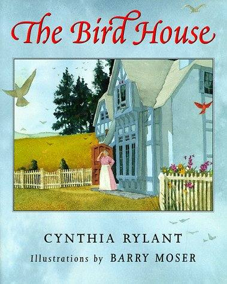

Through gentle prose and exquisite paintings, this modern-day fairy tale
about an orphan girl and a mysterious house adored by birds delivers a
touching message about loneliness and the wisdom and power of nature.

*A feeling, a tone, a special sense envelops you from the first page of
this magical text. A young girl living alone, depressed and scared, is
drawn into the light by the beauty of the birds living around her. As
she watches them, they lift her spirits -- except for the great barred
owl who just sits and watches her. However, one day, that changes and,
in turn, transforms the young girl's life forever. As you read this
book, let its voice take you away to a natural world where birds can
heal and help a girl discover a whole new life.*

*Ruth Culham*

**The Bird House Cynthia Rylant**

Once a bright blue house stood beside a river.

Birds loved this house. They were always flying by. Sparrows sat on
windowsills. Swallows slept in the chimney. Wrens flew in and out. And a
great barred owl roosted above the front door.

A young girl who was walking along the river one day saw this house. She
was a girl without a home or a family, and she had not been happy for a
very long time.

But when she saw all the birds around the bright house, her face lit up,
and she stayed, hidden in the trees, to watch.

Presently the front door opened, and an old woman stepped outside. The
birds all scattered and flew when the old woman appeared. All except the
great barred owl. He never moved.

But the scattering birds quickly came back. Nuthatchers ran down the
roof. Hummingbirds looked in through the windows. And a sweet cooing
dove followed the old woman everywhere she went.

The young girl, hidden in the trees, was amazed.

The next day the birds were back at the bright blue house, and so was
the girl. She watched as goldfinches hopped up and down the front steps,
purple martins lined up on the eaves, and a large blue heron walked
among the sunflowers.

Again, she watched as the old woman stepped outside and the birds
scattered. All except the great barred owl. He never moved.

On the third day the girl came yet again to the house, and there were
woodpeckers on the mailbox, blue jays on the shutters, and a pheasant on
the welcome mat.

And again, as the girl watched, the old woman appeared.

But, surprisingly, the birds did not scatter. This day, instead, they
rose as one into the sky. The birds flew first east, then west, north,
then south. They flew and formed perfectly a word: GIRL.

The young girl saw this word in the sky, and she ran away as fast as she
could. But the old woman stood still, watching the birds and trying to
understand what they were telling her.

For many days the young girl was afraid to return to the bright blue
house, afraid of being found out by the old woman.

But the girl loved the birds so much that finally she could not stay
away. She had to see them again. She returned and hid among the trees.

She saw thrushes on the clothesline, starlings in the wheelbarrow, and
cardinals all over the picket fence.

But as soon as the door opened and the old woman stepped out, the girl
jumped up to run away. She did not want the birds to write anything in
the sky again.

This time, however, the birds did not move at all when the old woman
appeared. They did not scatter. They did not fly. They did not write
anything in the sky. They stayed on the clothesline, in the wheelbarrow,
on the picket fence, perfectly still.

Then one lone bird raised its wings to fly.

The great barred owl, who never moved, suddenly lifted up. He lifted his
enormous, silent wings and swiftly, surely, he swooped into the trees.
And before she could get away, the young girl was caught in the owl's
talons. He calmly held on to her shirt, until the old woman -- hearing
the girl's cries -- found them.

The old woman was not really that surprised to see a girl. She took the
child into the bright blue house, and she washed the dirt from the
girl's face and fed her bread and beans. Then the old woman talked with
her, all through the night.

And since that time, the girl has always lived with the old woman. each
day they step outside to tend the flowers or the pumpkins or perhaps
just to take a walk . The birds are always there, and, of course, they
always scatter when the door opens and the woman and girl appear.

All except one: The great barred owl.

He never moves.

But he always nods his head to the girl whenever she walks past. And the
girl always smiles back.

