**Voice**

> **(10)**

![\[optional image
description\]](assets/Writing - Voice 10/media/media/image1.jpeg){width="6.268055555555556in"
height="2.9149004811898513in"}

**Narrative Voice**

**Perspective**

![\[optional image
description\]](assets/Writing - Voice 10/media/media/image1.jpeg){width="2.930533683289589in"
height="1.3628171478565179in"}

**Voice 10**

**Narrative Voice**

Voice

Narrative Voice

First Person

The Summer My Father Was Ten Pat Brisson

Up North at the Cabin Marsha Chall

Shortcut Donald Crews

Painting the Wind Patricia MacLachlan

I Am an Artist Pat Collins

Night Tree Eve Bunting

My Papa Leslie Jones Little

The Teacher from the Black Lagoon Mike Thaler

Not Norman Kelly Bennett

Yesterday I had the Blues Jeron Frame

The Day I Lost my Superpowers Michael Escoffier

Tough Cookie David Wisniewski

Third Person

David Gets in Trouble David Shannon

\"The Frog Prince\" The Brothers Grimm

The Frog Who Would Be King Kate Walker

The Frog Prince Continued Jon Scieszka

The Frog Principal Stephanie Calmenson

The Duck and the Darklings Glenda Millard

{width="5.208333333333333in"
height="3.71875in"}**\**

**Voice**

*Voice... is the sense of the author's personality that comes through
the words on the paper. Writing with voice sounds honest and authentic.
It has conviction and integrity. It has the quirks and rhythms of human
speech. Writing with voice makes us feel as if we're listening to a real
person."*

Ralph Fletcher -- *Live Writing*

Writers write with the most voice when they are writing about something
they care about. Voice should be evident both in narrative and factual
writing.

In stories, the characters should sound authentic.

Mentor Texts:

*Mick Harte was Here --* Barbara Park

In this book, Phoebe's voice sounds real.

*Just let me say right off the bat, it was a bike accident.*

*It was about as 'accidental' as you can get, too.*

*Like Mike wasn't riding crazy. Or dodging in and out of traffic. And
both* his hands were on the handlebars and all like that.

His tyre just hit a rock. And he skidded into the back of a passing
truck. And that was that. There wasn't a scratch on him. It was a head
injury. Period.

*Slam! --* Walter Dean Myers

*Basketball is my thing. I can hoop. Case closed. I'm six four and I got
the moves, the eye, and the heart. You can take my game to the bank and
wait around for the interest. With me it's not like playing a game. It's
like the only time I'm being real. Bringing the ball down the court
makes me feel*

*like a bird that just learnt to fly. I see guys moving down in front of
me and everything feels and looks right. Patterns come up and a small
buzz comes into my head that starts to build up and I know it won't end
until the ball swishes through the net. If somebody starts messing with
my game it's like they're getting into my head. But if I've got the ball
it's okay, because I can take care of the situation. That's the word and
I know it the same way I know my tag, Slam. Yeah, that's it. Slam. But
without the ball, without the floorboards under my feet, without the
mid-court line that takes me halfway home, you can get to me.*

As we read our mentor texts we can highlight ways in which authors
achieve voice. E.g.

Use of parenthesis in

*An Angel for Solomon Singer --* Cynthia Rylant

*The Great Gracie Chase! Stop That Dog! --* Cynthia Rylant

Note a different use of parenthesis in *The Other Dog --* Madeleine
L'Engle. (It's as if words are being said under the breath).

Jim Arnosky's environmentalist' voice comes through in his books *All
About \_\_\_\_\_.*

Varying the sentence structure and length.

*In November --* Cynthia Rylant

*Without their leaves, how lovely they are, spreading their arms like
dancers.*

Rylant's prose often sounds like poetry.

*Sarah, Plain and Tall --* Patricia MacLachlan

*I looked at the long dirt road that crawled across the plains,
remembering the morning that Mama had died, cruel and sunny.*

*She came through green grass fields that bloomed with Indian
paintbrush, red and orange, and blue-eyes grass.*

In these examples we see the author placing the adjectives after the
noun, as she does in the title of the book.

Repetition of words to draw out a moment in time.

*Fever 1793 --* L.H.Anderson

*It was going to be another hot August day. Another long, hot August
day. Another long, hot, boring, wretched August day.*

Writing in the persona of somebody else.

*Diary of a Worm --* D.Cronin

**\**

**Narrative Voice**

Works of literature use what's called "narrative voice." The technique
is the perspective used to relate the events of the story.

**First-Person Narration**

- First-person narration, or "I" narration, is from the point of view of
  a single character who relates the events of the story as if he were
  speaking to the reader directly. In most cases, the narrator is
  himself a character in the story.

**Second-Person Narration**

- Second-person narration, or "you" narration, essentially places the
  reader in the role of one of the characters. The writer describes the
  character's actions as he would if directing him in a play; for
  example, "you walk down the street and into the bar, where you order a
  drink." The effect creates an intimacy between the reader and one of
  the characters, bringing them closer together.

**Third-Person Narration**

- Third-person narration is the most flexible form of literary
  narration. The writer refers to all of the characters as "he," "she"
  or "it," divorcing himself from the story completely but able to shift
  and comment as the story dictates. In omniscient third-person
  narration, the narrator knows everything about the story and can
  present any details as the flow and pacing suggest. In limited
  third-person narration, the writer keeps his perspective limited,
  usually to a single character: He may know everything about that
  character \-- including his past, personality and thoughts as they
  occur \-- but he doesn't allow the narration to expand beyond those
  limits. Limited third-person narration sometimes is used in mystery
  stories in which the writer wants you to know everything about the
  detective hero but nothing at all about the rest of the story, thus
  preserving the surprises of the mystery.

**Alternating Narration**

- In some books, the narration shifts narrative voice depending on the
  needs of the plot. For example, one chapter appears in first-person
  narration, while a later chapter switches to third-person narration.
  Or a book could start with first-person narration from one character's
  perspective, then shift to another character's perspective while still
  remaining in first person.

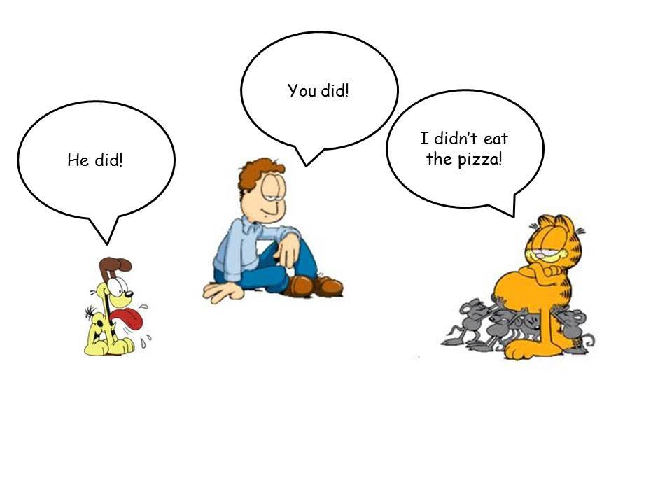{width="5.513888888888889in"
height="4.135416666666667in"}**\**

**First Person**

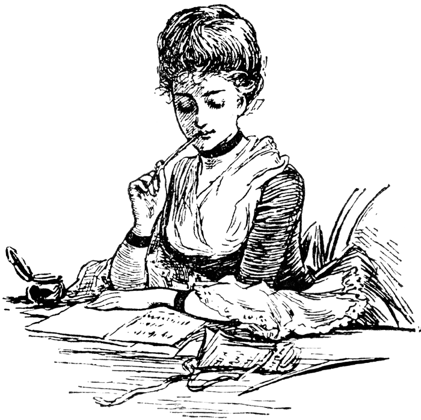{width="6.370138888888889in"
height="6.361038932633421in"}

**I Me We\**

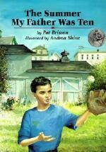{width="1.5625in"
height="2.2395833333333335in"}

**The Summer My Father Was Ten Pat Brisson**

In *The Summer My Father Was Ten*, a group of boys thoughtlessly
destroys an old man\'s garden. One boy (who grows up to be the
\"Father\" of the title) is wracked with remorse and offers to help the
man replant the garden. He and the old man become friends and the
wrecked garden becomes a memory; a valuable, unforgettable memory that
the boy -- when he has reached adulthood -- recounts to his daughter
every year, as they\'re planting their own garden.

A stray baseball was the cause of the trouble; it flew into the garden
of Mr. Bellavista, the old neighbour the kids called \"Spaghetti Man.\"
When the boy who would become Dad went to retrieve it, he couldn\'t
resist throwing back a tomato instead. His friends responded, and soon
the kids were having a glorious time, rampaging through the carefully
tended garden, throwing every tomato, onion, and pepper they could get
their hands on. But Dad heard the old man\'s one-word question ---
\"Why?\" --- and watched him silently clear away the wreckage. The
following year, when Mr. Bellavista showed no sign of planting anything
new, the boy apologised and offered to help. They cleared, dug, planted,
grew, and harvested the garden, and from that year on it became their
shared endeavor --- the memory of which continues in the framing story.

Personal responsibility is the main theme of The Summer My Father Was
Ten. The message in the book is how to handle a mistake. It does not
"preach" or lecture but gently presents a story that conveys the emotion
the boy felt when he and his friends thoughtlessly destroyed his
neighbour's

garden.

The Summer My Father Was Ten tells a personal story that the author had
heard her father tell many times. Have students think about a story that
they have heard a parent, grandparent, or other older person tell about
their childhood.

Read the book to your students. Then have them share some experiences
they may have had when they made some regrettable choices. Ask them to
share what happened afterward. Did they try to rectify the situation, or
did they try to "hide the evidence"? It would also be a very good
connection

for your students if you shared a story about a time when you did
something as a child that you were immediately sorry for. They love
hearing about personal experiences of their teacher! Next, have students
write about a time when they did something foolish, what they did and
what they did about

it, and what the outcome was. Allow them time to write, and then allow
them time to share.

You clearly hear the writer's voice throughout this story. Talk with
students about what makes the writer's voice come through in a story
like this. Look for the emotion in the story as well as for the details
and word choices that make the point of the story clear to the reader.
The event was obviously

one that meant a great deal to the author's father since he told it
again every year. It had a strong effect on him. Have students think
about stories that their parents, grandparents, or other adult might
tell over and over again. (Now and then, even teachers have been known
to repeat stories!) Have students speculate as to why the person retells
a story many times. Emphasise the importance of telling their own
stories. Lead them to see that even the everyday stories can be of
interest to others.

Lessons:

Read Aloud/Read Along

Discuss the father's actions and consequences.

Partner talk -- Text-to-Self connection. Caught up in a moment and acted
impulsively.

Independent Writing:

Write about a time when you got caught up in a moment and acted without
thinking of the consequences. Write small, and show don't tell as you
describe how you were feeling.

Craft:

Show not Tell.

> Although we tell the students to 'show not tell', in all writing,
> whether narrative or poetry, writers use a combination of showing and
> telling. When a writer 'shows', he/she tends to slow down and develop
> the moment. This engages the reader, enabling any connections to be
> made.

Writing Small.

> The students at Wembley all use a Writer's Notebook. Part of using
> this has been to write important little details they observe or hear
> about.

Read *The Summer My Father Was Ten (Read Along or Independent Reading)*
to discover the important little details.

Students write using all their senses. This was done when using *Home
Place* in this unit. By doing this, noticing details about the things
around them, the students will write small.

In other work we have used Georgia Heard's notion of 'cracking open'
words.

> ...'*writers "crack open" their first words and drafts to get to the
> "crystal part" of their writing... Words like fun, nice, pretty,
> wonderful, and scary are all generic words that don't describe
> anything specific for the reader or give the reader any particular
> picture in her mind.'*

When they have these words, the students close their eyes and re- vision
by describing what they see in their minds using words. Once again they
use all their senses, and the end product is writing small.

These words might be:

Vague, abstract words.

Words with no images.

Clichés.

Words that the student uses too many times.

Obvious words.

> Doing this will breathe life into the students' writing. It will also
> help to produce Voice.

**Caught Up in the Moment**

  ---------------------------------------------------------------------
  **Action**                         **Consequences**
  ---------------------------------- ----------------------------------
                                     

  ---------------------------------------------------------------------

**Show don't Tell**

**Telling Showing**

  -----------------------------------------------------------------------
  **Emotion**       **Looks like      **Sounds like     **Feels like
                    ...**             ...**             ...**
  ----------------- ----------------- ----------------- -----------------
                                                        

  -----------------------------------------------------------------------

**\
The Summer My Father was Ten Pat Brisson**

Every year my father and I plant a garden. Tomatoes, peppers, onions,
marigolds, and zinnias grow in neat, straight rows. We pull the weeds
that pop up, and we water, mulch, and tend it all through the summer --
cutting the flowers to make bouquets for the kitchen table or to give to
Mrs Murowski, our neighbour who broke her hip last winter and has to
walk with a cane.

And every spring my father tells me about Mr Bellavista and the summer
my father was ten.

Mr Bellavista lived alone in the third floor apartment above my father
and my grandmother. Plants grew all winter on his windowsill, and in the
spring he trudged with rake, garden fork, and trowel to the vacant lot
next door to plant a garden. Some years he had to drag away old tyres,
broken bottles, and other trash before he could even start.

Then one August afternoon when my father was ten, he and his friends
were playing baseball near Mr Bellavista's garden. My father's friend,
Nicky, hit a ball over my father's head, and it landed in the middle of
the garden. My father ran to get it and found it under a big, leafy
tomato plant. The tomatoes were round and red and ripe -- just about the
size of a baseball. And my father thought, *Boy, I'd like to see Nicky's
face if I threw a tomato instead of the ball, and he hit it and it
splattered all over him!*

And so, that's what he did -- and Nicky *did* hit it and got splattered,
just like my father thought he would. My father laughed and laughed, and
Nicky chased him back into the garden and grabbed a tomato off the vine
and threw it at my father. Then my father threw one at Nicky, and then
Joe threw one at Kevin.

Before long, they were all throwing tomatoes and peppers at each other
or batting them against the side of the building -- the hollow peppers
thumping against the bricks and showering thin, white seeds and pulp on
the wall and ground, the tomatoes hitting with a *splat* and bursting
into messy globs. They even pulled up onions and uprooted the flowers,
swinging them around and around over their heads before letting them
fly.

They were shouting and laughing so much that they never heard Mr
Bellavista coming. But when Nicky stopped laughing and suddenly stood
still, eyes wide and staring, my father turned and saw his neighbour.

He was shaking his head and saying something in Italian. He looked at
the walls, splattered with tomatoes and peppers, and at my father and
his friends, and he just said one word -- "Why?"

My father looked at the garden, trampled and ruined, and it was only
then that he realised what they had done. He looked back at Mr
Bellavista, but the old man had gone to his plants and was tenderly
picking up the broken pieces and setting them in a pile at his feet.

My father's friends all went away, leaving my father and Mr Bellavista
alone in the lot. My father wanted to go over and tell his neighbour he
was sorry, but his feet were like heavy stones holding him there. He
watched for a few more minutes and then dragged himself home.

The next morning the mess had been cleared away, the ground raked
smooth. There was no way to know that a garden had ever been there. But
my father knew.

My father's friends seemed to forget all about what they had done, but
my father couldn't forget. Every time he saw Mr Bellavista, he
remembered and wanted to tell him he was sorry, but he just couldn't
make the words come out.

Autumn and winter came. My father went to school, played with his
friends, and almost forgot about what had happened. But when April came
again, he remembered.

He watched for signs of his neighbour getting his garden ready, but
nothing happened. May came. the sun was warmer, the days brighter, but
still Mr Bellavista made no move to plant.

Finally one day when my father was going up the stairs on his way home
from school, he met his neighbour coming down.

"Mr Bellavista?" my father began. "Are you going to plant a garden this
year?"

Mr Bellavista's eyes looked straight into my father's. "So you can
destroy again?" he asked.

"No," my father stammered. "I wouldn't do that. I mean ... I'm sorry
about last year, and I thought maybe I could help."

Mr Bellavista didn't say anything at first. He studied my father for a
few minutes, then rubbed his jaw with the back of his hand.

"Tomorrow," he said. "Tomorrow we'll make a garden."

The next day was Saturday. My father and the old man worked all day
together. When they were finished, they had a patch of ground carefully
raked and planted with tomato and pepper plants, teeny tiny onions, and
seeds for marigolds and zinnias. Now when my father looked at the
garden, he didn't get a hard knot in his stomach.

Summer came, and every morning my father and Mr Bellavista checked their
plants. My father carried water from his apartment during dry spells and
learnt to tell what was a weed and what wasn't.

When the flowers bloomed, the old man gave my father bouquets to take to
my grandmother. And when the tomatoes were red and ripe (and a little
bit bigger than baseballs) and the peppers and onions were ready, my
father helped Mr Bellavista make spaghetti sauce. Then they all ate
dinner together in Mr Bellavista's apartment and listened to opera on
the radio.

Every year after that my father helped his neighbour in the garden,
until the spring when my father was sixteen and Mr Bellavista got sick
and went to live in a nursing home. Then my father planted the garden
himself, and when the flowers bloomed, my father carried bouquets on the
bus to his old friend. And when the tomatoes, peppers, and onions were
ready, he made spaghetti saice and put some in the freezer and told Mr
Bellavista that thet would have a spaghetti dinner when he came home.

But Mr Bellavista never did come home.

And now every year my father and I plant a garden -- tomatoes, peppers,
onions, marigolds, and zinnias in neat, straight rows -- and every year
I hear the

story ...

... of the summer my father was ten.

**\**

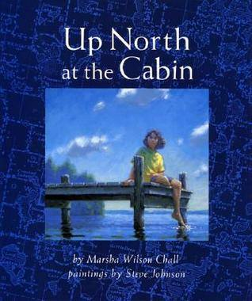{width="3.3125in"
height="3.9583333333333335in"}

*Up north at the cabin,*

*I am a great grey dolphin.*

*The lake is my ocean\...*

*Up north at the cabin,*

*I am a fearless voyageur,*

*guiding our canoe through the wilderness\...*

*Up north at the cabin*

*I am always brave \--*

*even in the dark woods,*

*when blood thumps through my head*

*like old Ojiway drums.*

Happy summer days in Minnesota\'s north woods are evoked in a generously
large book with full-bleed paintings whose lush colours are echoed in
the ground of the opposing text to make harmonious double spreads.
Johnson (The Frog Prince Continued, 1991) breaks new ground here with
glowing colours, beautifully observed light, and artfully spare
compositions; you can almost feel the sun\'s last rays or hear the
water\'s lap. Meanwhile, Chall\'s simple, nicely honed text (her first)
recounts the summer\'s pleasures\-- the sunshine that \`\`sits in my lap
all morning\'\' on the journey north; everyone sitting on the same side
of the table \`\`so we can all watch the loons\'\'; swimming underwater;
hearing a moose bellow a warning; water skiing; remembering an Ojibway
legend while walking in the dark.

- Kirkus

Summary: This is a story about a young girl's summer vacations up north
at the cabin. She describes what she does up at the cabin with all of
her family and how it makes her feel.

Share a personal story or ask the children to share stories.

• Notice the patterned language in the story. "Up north at the cabin I
am a \_\_\_\_\_\_" is followed a page or two later with descriptive
examples of what made her feel like a dolphin or voyageur, etc.

• Read the story all the way through and then go back and reread one or
more of

these sections to point out the description.

Questions before reading:

• How do you spend your summer vacations?

• Have you ever gone to a cabin on a lake? Or camped?

• What were some of your favourite things to do there?

• Close your eyes and pretend you\'re at the lake. What do you see? What
do you

hear?

Questions After Reading:

• Is there anything in the girl's descriptions that sounds like your
experience?

• Why does the illustration show only the girl in the car and not images
like the Big Walleye statue?

• The water-skiing illustration shows only part of the full picture.
What effect does this create?

• What brought this writing to life? How did the author paint a picture
with words?

Writing:

• Create a pattern book using the idea of Up North at the Cabin.

• Refer to the first illustration in the book. Talk about the cabin and
why people spend time there. Discuss where people from other cultures go
on vacation.

• Walk through the book again after an initial reading. Look at the
illustrations. Have children describe what they see in the pictures.
Make a list of new words to help children expand their descriptions
(leeches, angler, Northern Pike, etc). Text-to-Text Connection: Letter
to the Lake by Susan Marie Swanson, illustrated by Peter Catalanotto.

*I write my best when I write to find myself, my true fears and dreams.*

*-Martha Chall*

**\**

**Up North at the Cabin Marsha Chall**

On the way up north to the cabin, the sunshine sits in my lap all
morning. I know the way by heart: past the big walleye statue on Lake
Mille Lacs, a few more miles to the Live Deer Park, till all the trees
are birch and pine and houses are made from logs that look like shiny
pretzels.

Up north at the cabin, I am a smart angler. Grandpa tries pink spinners,
leeches, and dragonflies -- but I know what fish like. I bait my hook
with peanut-butter-and-worm sandwiches, then jig my line and wait.
Grandpa serves my sunnies with fried potatoes and corn-on-the-cob. We
eat at the long table on the screen porch, sitting next to one another
on the same side so we can all watch the loons dance down the sun.

Up north at the cabin, I am a great grey dolphin. The lake is my ocean.
From the dock I dive headfirst, skimming over sand that swirls behind
me. I am an acrobat in a perfect handstand. Then rising in a sea of
air-bubble balloons, I float on a carpet of waves.

Up north at the cabin, I am a fearless voyageur guiding our canoe
through the wilderness. The river spills over rocks and whispers to me
-- Kawishiwee...Kawishiwee -- and rushes on to anywhere. Like a house on
stilts, a bull moose stands in the shallows. His chest heaves and
rumbles, mighty as a diesel engine. He shakes his great head, rocking
branches of bone as he bellows a warning. "Ahead to the beaver dam!" the
voyageur commands. On the portage trail, we sling the canoe over our
heads. Its backbone to the sky, we trudge along -- an armored beetle
homeward bound.

Up north at the cabin, I am a daredevil. "Keep your knees bent," calls
Uncle Roy. I clutch the tow rope, bobbing up and down in my yellow life
vest. The motor sputters softly, waiting. My legs stiffen in the skis.

"Hit it!" I yell. The boat roars forward, the tow line snaps tight. I
leap from the water, riding the waves.

"Lean back!" they scream.

How much? I think, then smack the water like an angry northern pike. I
fall three times -- a flip -- a somersault, the splits.

"Want to try again?" they ask. Papa skims the silver water on only one
ski.

"Yes!" I shout.

Up north at the cabin, I am always brave -- even in the dark woods, when
blood thumps through my head like old Ojibway drums. It's said they beat
for two full moons when Chief Ma-kwa's son rode to the sugar bush but
never came home. I stand and listen and think I hear them still.

Up north at the cabin, we are almost ready to go. I check under my bed,
take down our clothesline, pack my snorkel and fins. Then one last
thing: I look all around me -- at the screen porch, at the creaky branch
I hear at night, at the chipmunk hole under the stoop, at the tufted
island in the bay, at the spot in the sky where the North Star shines. I
shut my eyes tight and fix them in my mind. So when I'm far away from
summer, when frosted windows cloud the sun, I close my eyes and once
again I am up north at the cabin.

**\**

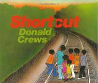{width="2.0833333333333335in"
height="1.7708333333333333in"}

The train tracks ran right by Bigmama\'s house in Cottondale, and the
children were warned to stay off the tracks. But one night they were
late, and the tracks were a shortcut, so they started off. And when
there was no turning back, they heard the train coming

**Lead**

*We looked . . . .*

*We listened . . . .*

*We decided to take*

*the shortcut home.*

*We should have taken the road.*

*But it was late, and it was*

*getting dark, so we*

*started down the track.*

Donald Crews begins his story with a scene, one in which the children
make a decision to walk along the railroad tracks to get home. This
scene shows how the kids get on the train tracks, which is important
because they get themselves into a dangerous situation later in the
story and nearly get hit by a train. The scene helps us understand the
message Crews wants us to think about:

to think twice before we decide to do something dangerous. In this first
scene, the kids don't think twice, and we learn what happens because of
that.

Crews could have chosen to start his book with a scene that was earlier
that day---perhaps the kids were visiting friends, perhaps they were
picking berries. He didn't start with a scene earlier in the day,
though, because whatever the kids did then isn't important to the story.
Whatever they might have been doing---visiting friends, picking
berries---it wouldn't help us understand his message. (C.Anderson)

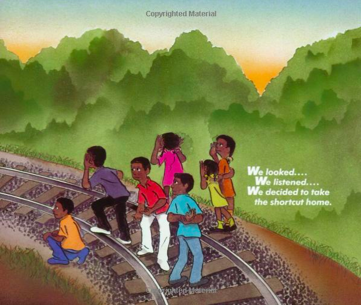{width="6.208333333333333in"
height="5.260416666666667in"}

Writing: Personal narrative

Read Aloud:

Discuss how the small moment allowed Donald Crews to incorporate more
details, sound effects, and suspense into his writing.

Discuss the differences between writing about big ideas (the whole
summer) and small moments.

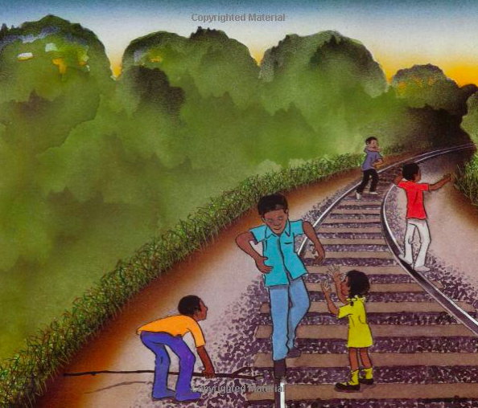{width="6.1875in"
height="5.291666666666667in"}

**Shortcut Donald Crews**

We looked....

We listened....

We decided to take the shortcut home.

We should have taken the road. But it was late, and it was getting dark,
so we started down the track.

WHOO

We knew when the passenger trains passed. But the freight trains didn't
run on schedule. They might come at any time. We should have taken the
road.

WHOO-WHOO

The track ran along a mound. Its steep sloped were covered with briers.
There was water at the bottom, surely full of snakes. We laughed. We
shouted. We sang. We tussled. We threw stones. We passed the cut-off
that led back to the road.

WHOO-WHOO

"I HEAR A TRAIN!"

Everybody stopped. Everybody listened. We all heard the train whistle.
Should we run ahead to the path home or back to the cut-off?

WHOO

The train whistle was much louder.

"Back to the cut-off!" "RUN"

WHOO

"THE TRAIN! THE TRAIN!"

"GET OFF! GET OFF!"

"GET OFF THE TRACKS!"

WHOO-WHOO

We jumped off the tracks onto the steep slope. We didn't think about the
briars or the snakes.

KLAKITY-KLAK-KLAK-KLAK-KLAKITY-KLAKITY-KLAKITY-KLAKITY-KLAK-KLAK-KLAKITY-KLAK-KLAKITY-KLAKITY-KLAKITY-KLAK-KLAK

The train passed. We were all fine. We climbed back onto the tracks. We
hurried to the cut-off and onto the road.

WHOO-WHOO

We walked home without a word. We didn't tell Bigmama. We didn't tell
anyone. We didn't talk about what happened for a very long time. And we
didn't take the shortcut again.

**\**

**Painting the Wind Patricia MacLachlan**

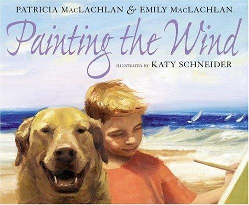{width="5.208333333333333in"
height="4.28125in"}

A moving and beautifully illustrated book about summer on one special
island.

Bestselling author Patricia MacLachlan teams up with her daughter Emily
to create this evocative story of a boy and his dog, waiting for summer,
waiting to learn from the artists who come to his island. With beautiful
paintings by Katy Schneider, this book captures those perfect moments
that only summer in a place that you love can offer.

**\**

**Painting the Wind Patricia & Emily MacLachlan**

I PAINT ALL WINTER LONG. And I wait.

On my island, surrounded by water and light, I paint the places where
the water meets the land. I paint the deep ponds. I paint the clouds.
But I cannot paint the wind. As hard as I try, I cannot paint the wind.

Then the days grow warmer. The harbor seals leave for cool waters. The
marsh grasses turn green. What I have waited for all year happens.

Summer is here. And the painters come back to the island. They come on
the mail boat with their paints and easels and bags of books and
favorite pots and pans. Some bring their children. All of them bring
their dogs.

The painters paint different things. They paint with different paint,
with water color, acrylics, or oil. They paint at different times; some
in the morning, some at night, some all day long. But there is one thing
they all paint. They all paint my island.

The painter of flowers wakes at dawn when the island light first comes.
He feeds his dog, Tess, and together they go out into the garden. Tess
lifts her nose and smells the air.

What's there?

What has been there?

I set up my easel beside a clump of iris blooms gone by. The painter of
flowers takes out his oil paints. He paints flowers with names like
cosmos, foxglove, larkspur, poppy.

He loves the names of flowers.

Today the painter begins to paint a poppy.

He rummages through his tubes of reds.

"Alizarin crimson," he says. "Terracotta, Scarlet Lake."

He loves the names of his paints, too.

He begins with the color called Cadmium Red, brushing the red across his
canvas with his big brush.

The painter works for a long time, and when the sun is overhead he is
surprised. We walk to the beach to eat lunch. Tess sits next to some
yellow hawkweed in the sunlight. The painter smiles.

"Tomorrow I paint the flowers in sunlight," he says.

To morrow he will paint his coffee-colored dog, Tess, next to the yellow
hawkweed in sunlight.

"Good dog, Tess," he whispers to her. "Sweet girl."

Happy, Tess lies down and closes her eyes.

The painter of faces is late to wake.

"I sleep all night with faces in my dreams," she tells me. "And I wake
with them on my walls."

Young faces, thoughtful ones, sad faces, wise faces, laughing faces;
watching, wary faces. Eyes look at the painter. They seem to follow her
as she coaxes her dark-eyed dogs, Emmet and Charlie, out from under the
bedcovers.

The painter puts on her running shoes.

"Let's go," she says.

Charlie does not like to run. But Emmet will run anywhere anytime. Emmet
is eager.

Together we run down the island road. We pass people whose faces the
painter has already painted, and some faces she may one day paint.

Charlie sits, tired of running. So we walk. We walk to the only store on
the island, where the painter will paint the storekeeper, Sasha, with
her sweet, lined face. A sign near the cake mixes reads: PLEASE DO NOT
EAT FROSTING FROM THE CAN.

Sasha is shy about being painted, so the painter puts Charlie on her
lap, Emmer at her feet. Sasha pets them. Emmet begins to lick her feet,
making her laugh so that she isn't shy anymore.

I paint a red kite hanging from the ceiling. The painter begins to paint
a picture of a sweet-faced woman and two happy dogs.

The painter of still lifes has not slept all night. She painted until
dawn -- the peppermint plant in the window, the glass bowl of tulips,
their green stems crisscrossing in water.

She is finishing painting the fireplace mantel crowded with

dried crabs

angel wings

a moon snail

jingle shells

smooth good-luck stones with white rings around them

a jar full of sea glass.

She yawns and stretches.

"I'll sleep soon," she says to me.

But she does not sleep. The sun comes into the room, and she begins to
paint the sunlight on the old wooden floors. She paints the sparkles the
dust makes after she shakes her dog Owen's blanket.

I paint a picture of a smooth grey stone.

She paints the shadows and the light, and then, when Owen rests his head
on the windowsill, she paints his sad look.

"My pal," she says to him, and he looks sideways at her, the whites of
his eyes showing.

"He looks embarrassed because I am talking to him."

As she paints, Owen makes a small sound.

"He's hungry," she says, still painting.

Owen sighs -- a little like a snuffle -- and lies down on the rag rug,
waiting. He is patient. But not too patient. In a minute he will get his
red bowl and bang it on the floor. The painter will laugh, and stop
painting.

The painter of landscapes moves away from what he paints. He takes his
dog, Meatball, in his truck with him. He has children, but he doesn't
take them painting. They smudge the paintings and want to go the store
and buy things. Sometimes they whine. Meatball is quiet and good
company.

The painter of landscapes paints the sky, the beach, the blue of the
ocean, the black of storms. Beside him Meatball looks out at the water
-- two more eyes watching the world.

When it is warm the landscape painter takes water and food and Meatball,
and they go out in his boat. Meatball likes the boat. He sleeps, belly
up, in the sun. Sometimes he howls at herring gulls until the painter
tells him to stop.

At night the landscape painter paints the moon. He loves the moon.

"So far away, so near," he says to me. When the landscape painter paints
the moon he forgets who he is, he forgets his wife and children. He even
forgets Meatball.

Today the landscape painter paints the beach. I set up my easel next to
his. The painter begins to paint the waves crashing on the shore.
Meatball runs from a wave and is caught, smiling, his ears flying in the
wind, and the white of a wave blowing behind him. And that is the way
the painter paints the scene: the sand, a wave, and a little rainbow of
water above a running dog.

I feel the wind against my face, and I see the trees, all bent over. I
pick up my paintbrush and begin to paint.

At summer's end the painters open up the doors to a barn. The dogs are
outside, lying in the sun. One striped cat walks, tail up, unafraid,
past them all.

The paintings are on the walls, the faces, young and old, the bowl of
tulips, the full moon over a quiet sea, a red poppy that fills a canvas.
The dogs are on the walls, too, caught forever by their painters. Caught
forever in one single moment.

I look at the painting of Meatball running from the wave, his ears
flying.

"You have painted the wind," I say to the landscape painter.

He points to my painting hung next to his, my painting of bent trees.

"You have, too," he says.

I smile. He is right. On my island, surrounded by water and light, I
have done what I could not do before.

I have painted the wind.

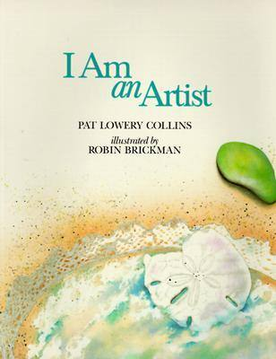{width="2.686979440069991in"
height="3.4895833333333335in"}

**I Am an Artist Pat Collins**

Are you an artist? Do you see the world around you in a special way? I
Am an Artist shows you how, by simply observing the delights of nature,
you can be inspired to create. Can you name the colours inside a
seashell? You\'re an artist!

\`\`I am an artist when I follow a line where it leads me,\'\' begins
this exploration of the many kinds of response to the world that may
lead to an aesthetic experience, if not to creating a work of art:
noticing patterns, putting names to colours, touching a rough surface,
observing natural phenomena, and more. While suggesting the delight in
precisely observed detail, Brickman\'s carefully wrought accompanying
images leave scope for the imagination in their ample white space and
with colourful points of focus that fade into black and white in their
peripheral surroundings.

*\"Through visual and spoken imagery, this book attempts to show how the
process of making art is as important as the product or artwork itself.
We are all artists engaged in truly creative activity when we use all
our senses to explore the world around us. Every writer or artist draws
upon deeply felt experiences both real and imagined. Each of us can
learn to recognise his or her own creative instincts and abilities by
tuning into the thoughts and feelings any experience generates. An
artist takes the time to make discoveries.\" \~ Pat Lowry Collins,*

**Writing:** I am an artist when \...\.... (Use book as Idea mentor
text)

**I Am an Artist Pat Collins**

I am an artist when I follow a line where it leads me.

I am an artist when I find a face in a cloud, or watch the light change
the shape of a hill.

I am an artist when I discover shadows made by the moon, or trace
patterns in the sand, or when I name the colours inside a shell.

I am an artist when I look through a sun shower for a rainbow.

I am an artist when I find one.

I am an artist when I notice that the sea is a mirror for the sky, and
when I make something from the things that I collect.

I am an artist when I shoot water loops in the air with the hose, or
discover pictures in drops of rain.

I am an artist when I cut an apple to see the star inside, or when I
watch sunlight turn dust to glitter.

I am an artist when I crunch through crusted snow and stop to gather
winter's hush around me.

I am an artist when I look at a bird until I feel feathery too, and at
an orange until I know what it is to be perfectly round.

I am an artist when I run my fingers over a shiny pod, or across the
rough bark of a tree, or when I blow on a full-blown milkweed and it
splinters into tiny white puffs, or when I pick up a maple-tree seed and
send it spinning back to earth by its own propellers.

I am an artist when I see that the sun comes up in a soft haze and goes
down in a fiery blaze.

I am an artist when I wait for a star to streak through the night sky,
or when I sit very still in the woods and listen.

I am an artist whenever I look closely at the world around me.

And whenever *you* listen and search and see, you are an artist too.

**\**

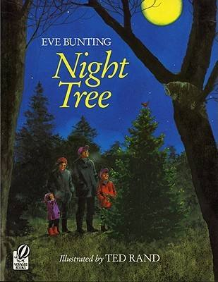{width="2.438203193350831in"
height="3.15625in"}

**Night Tree Eve Bunting**

By moonlight in the quiet forest, a young boy and his family decorate
their favourite tree with popcorn, apples, tangerines, and
sunflower-seed balls as a gift for the animals of the woods. "Sure to
become a Christmas favourite, this beautifully illustrated story of a
family's unusual tradition brings to life the true spirit of
Christmas."\--*American Bookseller*

Night Tree recounts a family\'s annual Christmas Eve outing to a nearby
wood from a young boy\'s perspective. Each year they decorate a special
tree with fruit, seeds, and strings of popcorn for the animals,
returning home with a deep appreciation for the secrets of the great
outdoors.

  ----------------------------------------------------------------------
  Craft             Evidence                     Reason
  ----------------- ---------------------------- -----------------------
  Small moment      Memories connected to a      Focus
                    holiday tradition            

  Ending            "Maybe a fox has come,       Denotes what the
                    stepping high on its thin,   character is thinking.
                    sharp paws, and they're all  
                    there together, singing      
                    their own Christmas songs on 
                    Christmas Day around our     
                    tree."                       

  Topic selection                                Writing about personal
                                                 experiences in first
                                                 voice.
  ----------------------------------------------------------------------

**Night Tree Eve Bunting**

**On the night before Christmas we always go to find our tree.**

**We bundle up so we're warm. Nina is already wearing her boots that are
too big for her. She has been wearing them all day.**

**Dad sets our box in the back of the truck with the rest of his stuff
and the four of us squish into the front seat.**

**We drive through the bright Christmas streets to where the dark and
quiet begin.**

**Nina is almost asleep in Mum's lap when we stop**

**"Are we there?" I ask, and Dad says "Yes" and rolls down the windows
so we can smell the tree smell.**

**We scramble out.**

**There are oaks growing here and alder and maples that are bare now and
white in the moonshine. The pines and the spruces and the firs are
green.**

**This is called Luke's Forest, but Dad says it's not really a forest,
just a nice forgotten place where our town ends.**

**Dad goes first on the path between the trees, carrying our box and the
big red lantern. Mum and Nina go next, holding hands. I come last, with
the blanket.**

**It hasn't snowed yet. It's so cold my breath hurts. The sky is
spattered with stars, and the moon, big as a basketball, slides in and
out between the treetops.**

**Dad's lantern sweeps ahead.**

**"Look," he whispers.**

**We stop. A deer is watching us. I see the brightness of its eyes; then
it turns and it's gone.**

**"Here's our tree," Dad says.**

**It has been our tree forever and ever. We walk around it, touching
it.**

**"It's grown since last year," I say.**

**Mum puts her hand on my shoulder. "So have you."**

**"So have I," Nina says. Nina hates to be left out.**

**An owl hoots in the darkness. There are secrets all around us.**

**"Can I put on the popcorn chain?" Nina asks. She hops up and down and
right out of one of her boots. Mum helps her get it back on.**

**Nina takes one end of the chain and I take the other and we wind it
around our tree. We've brought apples and tangerines with strings on
them, and we hang them from the branches. It's hard to hang string loops
when you have gloves on, but it's too cold to take them off.**

**For weeks we've been making balls of sunflower seeds and pressed
millet and honey. We hang those, too.**

**We scatter shelled nuts and breadcrumbs and pieces of apple underneath
for the little creatures who can't climb very well.**

**Our tree looks so pretty.**

**Mum says I should spread the blanket so we can sit and admire our
tree. She has brought a thermos of hot chocolate. I take off my gloves
and toast my hands around my warm cup.**

**Dad turns off the lantern and we stay quiet, hoping some of the little
animals will come while we're here, hoping the deer will come back. But
it doesn't.**

> **"It's shy," Dad says.**

**"I'm shy, too," says Nina.**

**Before we leave she and I get to choose a Christmas carol to sing. I
choose "Oh Come, all ye Faithful."**

**Nina chooses "Old MacDonald Had a Farm."**

**"That's not a Christmas song, silly," I tell her, but Mum says it's
fine and a very nice song, too.**

**We sing fast because there are a lot of verses and it's getting
colder.**

**After the last "E-I-O" we gather up our things and head for the
truck.**

**I look back once.**

**Our tree has folded itself into the darkness, but I think I can see it
still, stars caught in its branches and the moon swinging lopsided on
top.**

**Nina gets tired and dad has to wrap her in the blanket and carry her.
I carry her boots.**

**Later, in bed, I think about our tree, and sometimes, next day, when
the aunts and the uncles and the cousins are at our house and it's noisy
and happy, I let my mind go back to Luke's Forest.**

**I think of the birds having Christmas dinner and the squirrels and the
opossums and the raccoons and the skunks. There might even be a bear
because Dad says bears don't really sleep all winter and if one's going
to wake up I just bet it would wake up for Christmas.**

**Maybe a fox has come, stepping high on its thin, sharp paws, and
they're all there together, singing their own Christmas songs on
Christmas Day around our tree.**

**\**

**My Papa Leslie Jones Little**

Papa was a quiet man. He liked to read a lot, study his Bible and his
Sunday School book and the newspaper. We took the Raleigh News and
Observer. It came in every day on the train with the rest of the mail,
and Papa would walk to the post office to get it. He walked with a
slight limp because one leg was shorter than the other. The older he
got, the shorter the leg seemed to get, and later in life he walked with
a deep limp like his papa, but when I was growing up, it wasn't too bad.

Every winter morning Papa would get up early and build a fire in the
heater in his and Mama's room, and he'd set a large pot of water on it
so Mama could get bathed when she got up. Then he'd make a fire in the
kitchen stove for cooking.

Those were the only two rooms with heat. The rest of the house was so
cold. We hated so bad to get out of our warm beds when Mama called us,
but finally we would jump up and snatch our clothes and run barefoot
through the hall to Mama and Papa's room. Papa would say, "Come on in
here, little duckies. Great day in the morning, I got a good fire going
for you!"

When Papa got home in the evening, he's get the fire in the bedroom
going real good again, and after dinner we'd all go back to that warm
room. Sometimes the heater was so hot, it glowed red. Mama and Papa
would just sit and talk while we did our homework and enjoyed Papa's
fire.

Papa sang bass in the church choir. He had a beautiful voice, such a
beautiful voice. Everybody in his family could sing, and I think he
could have been a professional singer if he had been born at a later
time when there were more opportunities for black people. And he had the
prettiest whistle I've ever heard. Everybody in Parmele knew Papa's
whistle. Some notes he'd whistle in the regular way, but other notes
he'd whistle in harmony -- soprano, alto, tenor, one after the other
real fast, almost like a tremble. Sometimes at night we'd hear it way,
way down the road, and we'd be so glad because we knew it was Papa,
coming home from work, whistling a hymn.

It was hard for Papa to find work. Not long after Sis Clara died, we
moved to Mount Herman, a black section of Portsmouth, Virginia. Papa
worked on the docks there, and even though he didn't make much money,
the work was steady. But when we moved back to Parmele, it was hard for
him to find any work at all.

Sometimes he worked on the railroad, cutting the grass that grew between
the ties of the tracks. Sometimes he worked on white people's farms, but
when they tried to treat him like a child, he told them that he was a
man, and they fired him. For about two years he rented a small piece of
land and grew corn and cotton and a little molasses cane. Some of it we
used, and some of it Papa sold, but he didn't really have enough land to
make much money, and by the time he got through paying the people he
rented the land from and buying things from their store to farm with, he
hardly had any money left.

I guess most of the time I was growing up, Papa worked at the train
station, taking luggage off one train and putting it on another, and
unloading crates of fruit, things like that. He worried a lot about not
being able to buy us things. I remember one time Mama bought some new
shoes for my sister Roland. Mama had gone to a bigger town to get them
because the store in Parmele had clothes that were so old-fashioned it
wasn't funny.

Anyway, Mama bought Roland these pretty pumps. They were dark brown and
had a square throat, and they were really pretty. When Mama got home,
Papa said, "Why didn't you get some shoes for Lessie, too?" Mama told
him she didn't have enough money, she'd have to save for a while, then
it would be my turn.

But Papa wasn't satisfied. He went to the store in Parmele, and he came
home and he said, "Daughter, Papa bought you some new shoes, too." I was
so happy -- until I saw the shoes. They were so ugly. They were real
light tan, and nobody had worn any shoes that colour in I don't know
when! And they were turned up at the toe, kind of like an elf's shoes.
But I said, "Thank you, Papa, thank you very much." Then I went off and
cried and cried because those were just about the ugliest shoes I had
ever seen.

Papa didn't get mad too often. Usually when I did something wrong, he
would just say, "Now daughter, you know you shouldn't have done that,"
and I'd be so ashamed. But once in a while, he would get really mad. One
time I talked back to Mama, and what did I do that for! Papa heard me
and he yelled at me so loud it made my stomach hurt. He said, "What did
you say?" I told him what I'd said, but he kept on asking me. And my
answer kept getting softer and softer. Finally Papa said, "your Mama
borned you into this world! Don't you ever talk to her like that again!"
I said, "Yes, sir."

Another time he got mad was when he came home and there was a white man
there selling insurance. We were sitting in the hall, all of us children
and Mama, while this man tried to talk her into buying some insurance.
Papa came home and he said, "My wife doesn't want any insurance, she
doesn't want to buy anything!" The man got his hat and left in a hurry.
Then Papa said, "He wouldn't want me to come to his front door, he
wouldn't want me to talk to his wife. I don't want him in my house, and
I don't want him to talk to my wife."

Papa could really get mad sometimes. But mostly, he was a quiet man. He
gave us a lot of love.

**\**

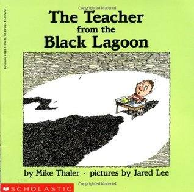{width="3.3125in"
height="3.28125in"}

On the first day of school, a boy falls asleep and dreams that he is
assigned to Mrs. Green\'s class. In his nightmare, Mrs. Green is a
monster with a tail and smoke coming out of her nostrils. He is so happy
when he awakes to see the real Mrs. Green that he gives her a hug.

{width="1.96875in"
height="0.96875in"}

Review the story by asking children to recall what they thought were the
funniest moments. Have them identify the clues that show the monster
teacher was imaginary. Discuss the differences between the imaginary
teacher and the real Mrs. Green. Ask children to share why the boy might
have imagined such a horrible teacher. Lead children to recognise that
many of the things we fear most are nowhere near as bad as we imagine
them to be.

Connect this story to writing by asking children to remember and write
about their first day of school.

Write your own version or sequel about The Teacher from the Black
Lagoon.

{width="1.9375in"
height="1.09375in"}

**Questions & Answers**

{width="1.84375in"
height="2.0833333333333335in"}

What were like as a kid?

Small. I was a lot smaller than I am now, but I was always creative. I
loved modelling clay, drawing pictures, and writing. I loved school and
got good grades. School was fun. I played all the sports, starred in the
school play (which I wrote) and was class president a few times. I was
also the class clown all the time.

I had a red and cream Schwinn bicycle which I paid for by working on a
paper route. I had a dog named \"Lady\" who grew up with me. I also had
a monkey named \"Socko\" and a motorcycle named \"Triumph.\" I drew
cartoons for the school annual and for the school paper at college. I
made lots of model race cars and hot rods. I wrote poems and songs. Like
I said\-- I always loved creating. It has been the main force in my
life. In fact, it IS my life!

Why do you write children\'s books?

I love language. Words are great. I love to use my imagination and make
people laugh. That\'s why I am a writer.

What is your favourite colour?

Yellow, Yellow, and Yellow.

What is your favourite food?

Edible food.

Are you rich?

I am doing what I love to do, and people seem to like it. I have a
beautiful family and I know God. I feel like I am the richest man in the
world.

Are you married?

I am married to a beautiful woman named Patty.

Where do you live?

Patty and I live in an apartment in West Linn, Oregon.

Are Mrs. Green and Mr. Green Married?

Yes, and very happily.

Why is Teacher crossed out on the cover of The Principal from the Black
Lagoon? Is it a mistake?

No, Mrs. Green became a principal. Many principals are former classroom
teachers.

How old are you?

I was born on October 8th, 1936. You figure it out.

Do you drive a limousine?

No, I think limousines are ugly, and forget about parking. I have a 2005
Saturn Vue Redline. It is black with yellow seats and a yellow racing
stripe. I love it.

What is your favourite book?

The Bible is my favourite book. I read it every morning and every night.
I learn something new each time.

What was your favourite book when you were a kid?

My favourite book was The Little Engine that Could. It taught me that
you can accomplish great things if you don\'t give up. I still say, \"I
think I can, I think I can, I knew I could.\" Magic Boy

When was your first book published?

My first book Magic Boy was published in 1961 by Ursula Nordstrom, my
very first editor. She called me one day and asked me to write a
children\'s book. I said, \"I think I can.\" I sat down and wrote Magic
Boy and sold it the next day. Since then I have had over 220 books
published.

How long are you going to keep writing books?

As long as God wants me to.

Do you write on a computer?

I don\'t even know how to turn one on. I write with a pencil, piece of
paper, and my imagination. Fortunately, Patty helps me type manuscripts
and letters.

Where do your ideas come from?

I believe all creativity comes from God. You just have to learn how to
listen.

How did you think of the title The Teacher From the Black Lagoon?

There is an old movie called The Creature From the Black Lagoon. I
changed Creature to Teacher and I was on my way.

How many Black Lagoon books are you going to write?

I don\'t know. There are now 20 picture books and 25 chapter books. I
have written many more still yet to be published. The Karate Teacher,
The School Psychologist, The Reading Teacher, The Crossing Guard, etc,
etc, etc. We could go on forever. The Black Lagoon is very deep! And we
haven\'t even gone out of school yet.

What do you do when you are not writing?

Sleep - Eat - Pray - Read - Travel - Enjoy family and friends - Visit
museums - Collect Japanese art - Visit schools - Watch football - Swim.

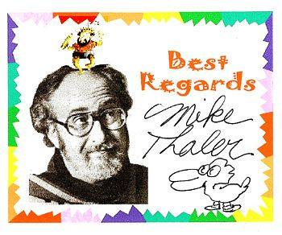{width="3.6458333333333335in"
height="3.0416666666666665in"}

{width="3.125in"
height="3.375in"}

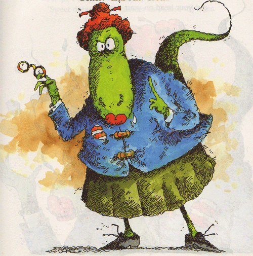{width="5.208333333333333in"
height="5.260416666666667in"}

**The Teacher from the Black Lagoon Mike Thaler**

It's the first day of school. I wonder who my teacher is.

I hear Mr Smith has dandruff and warts, and Mrs Jones has a whip and a
wig.

But Mrs Green is supposed to be a *real* monster.

Oh, my. I have *her!* Mrs Green \... room 109. What a bummer!

I sit at my desk.

I fold my hands.

I close my eyes.

I'm too young to die.

Suddenly a shadow covers the door. It opens \...

In slithers Mrs Green. She's *really* green! She has a tail. She
scratches her name on the blackboard -- with her claws!

Freddy Jones throws a spitball. She curls up her lip and breathes fire
at him. Freddy's gone. There is just a little pile of ashes on his desk.

"Talk about bad breath," giggles Eric Porter.

She slithers over, unscrews his head, and puts it on a globe stand.

I bet she gives homework on the first day of school.

"Your homework for today," grins Mrs Green, smoke rising from her
nostrils, "is pages 1 to 200 in your maths book -- *all the fraction
problems."*

"We've never had fractions," shouts Derek Bloom.

"Come up here," she beckons with her claw. Derek stands by her desk.

"This is a whole boy," she smirks. She takes a big bite. "This is half a
boy. Now you've had fractions."

Doris Foodle cracks her gum.

Mrs Green swallows her in one gulp! "No chewing in class," she smiles.

Mr Bender, the principal, sticks his head in.

"Keep up the good work," he nods and closes the door. I wish I could
sent to the principal's office.

"Let's call the roll," cackles Mrs Green. "Freddy Jones is absent. Derek
Bloom is half here. Eric Porter is here and there. Doris Foodle is
digesting."

"What about spelling?" shouts Randy Potts.

"Spelling can be *fun!"* beams Mrs Green, wiggling her fingers at him.

"Abracadabra Kazam!"

"That's tough to spell," says Randy. Suddenly there's a flsh of light, a
puff of smoke, and Randy's a frog.

Penny Weber raises her hand. "Can I go to the nurse?" she whines.

"What's wrong?" asks Mrs Green.

"I have a huge headache." says Penny.

Mrs Green wriggles her fingers. There's another flash of light, and
Penny's head is the size of a pin.

"Better?" asks Mrs Green.

"Now it's naptime. Everyone who still has one, put your head on your
desk."

I hope I make it to recess.

"Sweet dreams," she cackles as I close my eyes.

Suddenly the bell rings. I wake up. There's a pretty woman writing her
name on the blackboard. She has real skin and no tail.

"I'm Mrs Green, your teacher," she smiles.

I jump out of my chair, run up, and hug her.

"Well, thank you," she says. "I'm glad to be here."

Not as glad as I am!

**\**

{width="3.120820209973753in"
height="3.5416666666666665in"}

**Not Norman Kelly Bennett**

Norman the goldfish isn't what this little boy had in mind. He wanted a
different kind of pet \-- one that could run and catch, or chase string
and climb trees, a soft furry pet to sleep on his bed at night.
Definitely not Norman. But when he tries to trade Norman for a \"good
pet,\" things don't go as he planned. Could it be that Norman is a
better pet than he thought? With wry humour and light-hearted affection,
author Kelly Bennett and illustrator Noah Z. Jones tell an unexpected
\-- and positively fishy \-- tale about finding the good in something
you didn't know

you wanted.

\"A sweet story that could be used as a springboard to discussion of the
pitfalls of making snap judgments about pets \-- or people.\"

> \-- SCHOOL LIBRARY JOURNAL

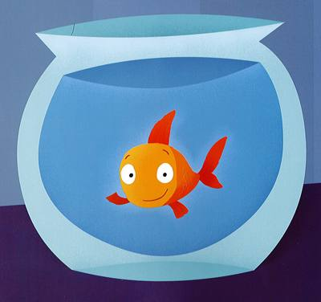{width="2.5820034995625547in"
height="2.4270833333333335in"}

Before Reading:

If you could have any pet you wanted what would it be? What would you
and your pet do together? What kind of care would your pet need?

Questions to consider:

Describe the kind of pet the boy would like to have.

Why does Norman need more water for his bowl?

Explain what happened during show and tell.

Why does the boy have to stay for extra music practice?

What happens during the night?

What's the best part of having a pet? What's the hardest part?

Which part of the book is your favourite? Why?

Have you ever changed your mind about something or someone? When? Why?

Norman listens when others don't. When you're scared who do you talk to?

What do pets do for us? What do we do for our pets?

Spelling: -ing words (13)

Writing:

Describe your pet. Use as many of your senses as you can. For example:
Do not tell us what type of pet you have.

Write the story of how you came to own your pet (real or imaginary).

**Not Norman Kelly Bennett**

When I got Norman, I didn't want to keep him. I wanted a different type
of pet.

**Not Norman.**

I wanted a pet who could run and catch. Or one who could climb trees and
chase strings. A soft, furry pet to sleep on my bed at night. Not
Norman.

All Norman does is swim around and around and around and around and
around and around and around and around \...

"This is it," I decide. "I'm trading you for a good pet."

Norman doesn't move. Not even a fin twitches. How can I trade him like
this? No one will want a sorry-looking fish in a gunky bowl.

When I drop Norman into his nice, clean bowl, he starts dipping and
flipping, flapping his fins around. He looks so goofy I have to laugh.

"Don't think that just because you made me laugh, I'm going to keep
you," I tell him. "Tomorrow, you're outta here."

Norman blows a stream of bubbles.

The next day, I take Norman to school with me. If I talk him up real
good during Show-and-Tell, maybe someone will want him.

On the way there, we see my friend Austin. Austin has a real cool dog --
and seven puppies.

"Wanna swap one of your pups for Norman?" I ask.

"Who's Norman?" asks Austin.

"My goldfish," I say.

By the time I rescue Norman, half his water is gone!

"I'm sorry," I tell Norman when we get to school. "I'm really sorry." He
just stares at me all googly-eyed.

Finally it's my turn to Show-and-Tell. Just as I start to talk about
goldfish, Emily shouts, "Jenny's gone! Who let my snake loose?"

Does anyone hear the story of how I got Norman? Does anyone even ask to
hold his bowl? No. They're all jumping and screaming and chasing the
snake. Not Norman. He's looking right at me. "Thanks for listening," I
tell him.

That afternoon, we go to my music lesson. as soon as it's over, I'm
taking Norman back to the pet store. I take out my tuba and begin to
play.

*Bom bom bom baaaa Bab a ba Bo bo bo beeee.*

I glance at Norman. He's swaying back and forth.

*Glu glu glu glu,* he mouths.

"Look! Norman's singing," I say.

"Pay attention!" snaps Maestro. "And try to play the proper notes."

Maestro makes me stay for extra practice. By the time my lesson is over,
it's too late to go to the pet store.

"Don't think that just because you like my music, I'm going to keep
you," I tell Norman. He glugs.

That night, I'm sound asleep when \...

SCREECH, SCREECH, SCREECH!

What's that noise?

SCRATCH SCRITCH SCREEEECH!

Yikes, there's something at the window! Then, out of the corner of my
eye, I spot ,,.

**Norman!**

He isn't scared. he isn't swimming around in circles either. He glugs
and gives me a little wave. I'm not alone. Together, Norman and I slide
open the curtains. It was just a broken tree branch.

"Thanks for watching out for me, Norman."

On Saturday, I take Norman to the pet store, just like I said I would.
Ii look at the cats and dogs and snakes and birds. I look at the
hamsters and mice and lizards, too.

They all look like good pets, but they are \...

**Not Norman.**

When I got Norman, I wasn't sure I wanted to keep him. But now, even if
I could pick any pet in the whole world, I wouldn't trade him.

**Not Norman.**

**\**

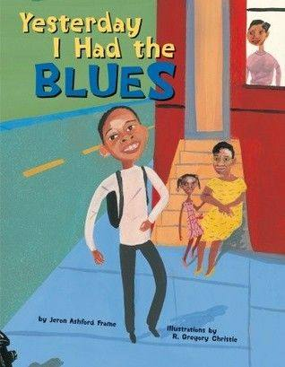{width="3.3125in"
height="4.260416666666667in"}

**Yesterday I had the Blues Jeron Frame**

In this upbeat tale, moods may colour the way people look at the world,
but family togetherness trumps all. Debut author Frame and the
consistently masterful Christie (Only Passing Through) riff on the range
of human emotions with the agility of long-time collaborators, and the
result is a book that truly sings. \"Yesterday I had the blues,\" begins
the African-American boy narrator. \"Those deep down in my shoes blues,/
the go away, Mr. Sun, quit smilin\' at me blues.\" But today is
definitely looking up. \"I got the greens./ The runnin\' my hand along
the hedges greens./ \.../ The kind of greens make you want to be
Somebody.\" Jaunty, irregular typography acts as tempo and dynamic
markings, underscoring the musicality of Frame\'s text. The boy then
muses on the states of mind of everyone in his family, a subject well
suited to Christie\'s visual finesse. The artist\'s off-kilter
perspectives and playfully skewed proportions reinforce the intensity
and fluidity of mood swings, while the array of saturated, textured hues
infuse each spread with emotional depth. Christie attributes Daddy\'s
case of \"the greys\" to a parking ticket, older sister Tania performs
her \"indigo\" funk to the hilt. Other moods will be all too
recognisable to readers (when Mama spots her younger children bouncing
on the bed, she gets the reds---\"Look out!\"). It\'s clear that in this
family, even when moods are mercurial, love endures---and that, says the
boy, makes life \"all golden.\"

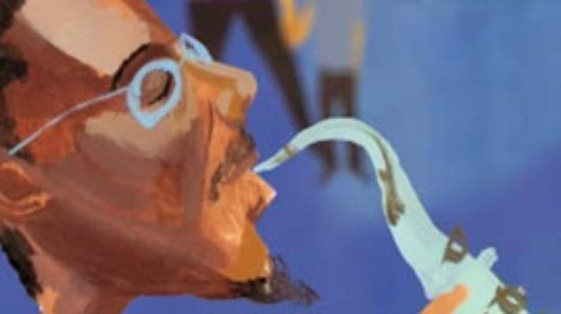{width="6.268055555555556in"
height="3.513642825896763in"}

**Lesson:**

Read Aloud

Read Along

Writing:

Organisation.

Discuss the format e.g.

Yesterday I had \_\_\_\_\_\_\_\_\_\_\_\_\_\_\_\_\_\_\_\_\_

Not the\_\_\_\_\_\_\_\_\_\_\_\_\_\_\_\_\_\_\_\_\_\_\_\_

or the \_\_\_\_\_\_\_\_\_\_\_\_\_\_\_\_\_\_\_\_\_\_\_\_\_\_\_\_

Not even \_\_\_\_\_\_\_\_\_\_\_\_\_\_\_\_\_\_\_\_\_\_\_\_\_\_\_\_

I had \_\_\_\_\_\_\_\_\_\_\_\_\_\_\_\_\_\_\_\_\_\_\_\_\_\_\_\_\_\_\_

The \_\_\_\_\_\_\_\_\_\_\_\_\_\_\_\_\_\_\_\_\_\_\_\_\_\_\_\_\_\_\_\_\_

The kind of \_\_\_\_\_\_\_\_\_\_\_\_\_\_\_\_\_\_\_\_\_\_\_\_\_\_\_\_\_\_

But today I
got\_\_\_\_\_\_\_\_\_\_\_\_\_\_\_\_\_\_\_\_\_\_\_\_\_\_\_\_\_\_\_

The
\_\_\_\_\_\_\_\_\_\_\_\_\_\_\_\_\_\_\_\_\_\_\_\_\_\_\_\_\_\_\_\_\_\_\_\_

The
\_\_\_\_\_\_\_\_\_\_\_\_\_\_\_\_\_\_\_\_\_\_\_\_\_\_\_\_\_\_\_\_\_\_\_

The kind of
\_\_\_\_\_\_\_\_\_\_\_\_\_\_\_\_\_\_\_\_\_\_\_\_\_\_\_\_\_\_\_\_

(Extend to family/friends)

**Yesterday I had the Blues Jeron Frame**

Yesterday I had the **blues.**

Not the rain on the sidewalk blues,

or the broken skateboard blues, or the

outgrew my favourite football jersey blues.

Not even the Monday mornin'

cold cereal instead of pancakes blues.

Uh-uh.

I had those deep down in my shoes blues,

the go away, Mr Sun, quit smilin' at me blues.

The hold a pillow,

wish it was tomorrow blues.

The kind of blues

make you wanna just

turn down the volume.

But today I got the **greens.**

The runnin' my hand along the hedges greens.

the down to the drugstore

and beyond,

dirt in my socks

greens.

The kind of

greens make you

want to be Somebody.

Daddy says he got the

**greys.**

the straight shoelaces,

coffee in the car greys.

The lines

bwteen his eyes,

lookin' at his watch

greys.

The don't ask for a new skateboard

till tomorrow greys.

Poor Daddy.

Sasha says she got the **pinks.**

the shiny tights,

ballet after school,

glitter on her cheeks pinks.

The where's my butterfly

hair clip? pinks.

The kind of pinks

make me

want to catch the next bus.

Talia says she got the

**indigos.**

I said, indigo's the same as blue.

Talia says, uh-uh,

she got the saxophone

in the subway

indigoes.

the hair hangin' loose,

write a poem that don't rhyme indigos.

The kind of indigos

make her act

like the drapes.

Gram's got the

**yellows,**

I can tell.

The hummin' that parade song

flower house slipper yellows.

The mix up some

oatmeal raisin cookies

(I hope)

yellows.

Mama says she got the

**reds.**

Look out!

Yeah, yesterday I had the

**blues.**

Today I got the

**greens.**

Tomorrow maybe it'll be the

**silvers.**

The rocket-powered skateboard silvers!

And around here, that's okay.

'Cause together we got somethin'

that'll never change.

We got a family --

the kind of family makes you feel

like it's

all

**golden.**

**\**

{width="1.875in"
height="2.6770833333333335in"}

**The Day I Lost My Superpowers Michael Escoffier**

KIRKUS REVIEW

In an import that is high on zest, a child and her blithe conviction
that she has superpowers both take an abrupt tumble.

Sporting a black mask throughout in the simple crayon drawings, the
self-confident young narrator describes how she learned to fly by
launching herself from the bed. She can also make things (well, cupcakes
at least) disappear and breathe under water---in a tub scene featuring a
rib-tickling bit of mooning---as well as like special "powers." But
despite previous spills aplenty, she declares with a childlike sense of
permanence that her abilities are "Gone! Finished!" after some swooping
on the end of a rope in the yard one day ends with a SPLAT! They don't
vanish for long though, as when Mom rushes out with a "magic kiss" that
makes most of the hurt go away, the child concludes that she "has
superpowers too!" The illustrations will clue young readers in
immediately that any powers here (aside, of course, from Mom's) are
strictly in her head, creating a tension between text and subtext that,
oddly, both celebrates and undercuts this kind of imaginary play.
Executed on spacious expanses of white or rich tan, they depict the
ebullient child engaged in all sorts of delicious mayhem.

The narrator's buoyancy and quick recovery save this from turning into a
dreary life lesson.

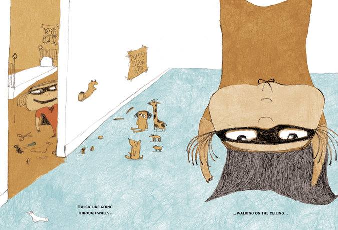{width="6.268055555555556in"
height="4.280849737532808in"}

**The Day I Lost my Superpowers Michael Escoffier**

The day I discovered I could fly,

I knew that I was special.

So I started practising nonstop

to develop my superpowers.

I had a few setbacks at the start ,,,

But I worked hard

and got better and better.

My favourite superpower is making things disappear.

All I have to do is concentrate \...

And poof! Gone!

Sadly, it doesn't always work.

I also like going through walls \...

\... walking on the ceiling \...

\... and becoming invisible.

When I get bored I try new things,

like communicating with animals.

go fetch!

sit!

et up!

So far, I've been most successful with plants.

Freeze!

Sometimes I think I'm probably

not even human and I must come from

another planet.

How else can you explain

that I can breathe underwater \...

\... move objects

without touching them ..

\... and go back in time?

I always wondered if my parents

could tell -- if they knew about

my superpowers.

Until one day when \...

I was happily flying around

in the backyard,

and suddenly

SPLAT!

No more superpowers!

Gone! Finished!

And then my knee started to hurt

and I began to cry.

Mum came running.

She gave me a magic kiss,

and then you know what happened?

I felt all better (even if my knee still

hurt a little.)

So now, you know what I think?

I think my mum has superpowers too.

**\**

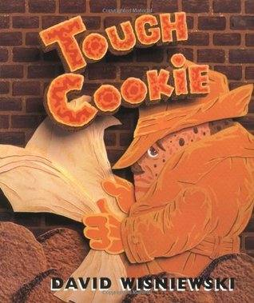{width="2.9270833333333335in"
height="3.4885673665791774in"}

**Tough Cookie David Wisniewski**

Sam Spade, move over! In his years on the force, Tough Cookie Busted the
Ginger Snaps and broke up the Macaroons. Now living as a private eye at
the bottom of the cookie jar, he learns that Fingers has got his old
partner, Chips. With his best girl, Pecan Sandy, at his side, Tough
Cookie sets out to put Fingers away, for keeps! This hilarious spoof
will have readers rolling in the aisles. 00-01 Keystone to Reading Book
Award Masterlist

Pre-reading strategies:

Discuss the genre of the story- which is mystery. What is contained in

a mystery? (problem/solution, bad guy, good guy, suspense, unknown,

clues)

Discuss what it means if someone is a "tough cookie."

Take a Picture walk: Ask the students what they notice about the

character on the cover. (He is a cookie; He is in a trench coat. He
looks like

private investigator.) Other things they might notice; all of the
characters

are cookies, the fingers on some of the pages, the crumbs at the bottom
of

the cookie jar.

Before reading the story, it is important to understand the setting.
Discuss

what the setting of the story is: It describes the time and place in
which

a story takes place, and the setting often influences the thoughts and

actions of the characters and the line of the plot.

Building Prior Knowledge: The setting of the story is the cookie jar.
Before looking at the first two pages of the book, discuss what the kids
know about a cookie jar. (It is a place to put cookies, Cookies that
stay in it a long time get stale, crumbs are in the bottom, or broken
cookies. etc.) It is important to understand the way the jar is laid out
and the workings of the jar before reading. Use elements that one uses
to read non- fiction texts to identify the parts of the cookie jar.
Discuss labelling and the bolded words that describe each layer of the
jar and then read each layer.

Ideas to discuss before reading: sell-by date, wanted poster, play on
words: Crocker observatory, Pillsbury expressway, what it means when it
says this at the bottom of the jar: "Visitors to the area should travel
in groups." Set the purpose for reading: Tell the students that they
need to be prepared to talk about why the setting is important to the
story and how the setting affects the characters' actions.

During Reading: Using Context Clues: The vocabulary words that may give
them trouble are hijack, lousy, sidles, and fracas. As they are reading
they are to listen for the words in the context of the story. Fill out
this form for two of the words.

WORD \_\_\_\_\_\_\_\_\_\_\_\_\_\_\_\_\_\_\_\_

What do you think this word
means?\_\_\_\_\_\_\_\_\_\_\_\_\_\_\_\_\_\_\_\_\_\_\_\_
\_\_\_\_\_\_\_\_\_\_\_\_\_\_\_\_\_\_\_\_\_\_\_\_\_\_\_\_\_\_\_\_\_\_\_\_\_\_\_\_\_\_\_\_\_\_\_\_\_\_\_\_\_\_\_

What clues in the story help you figure out this word?
\_\_\_\_\_\_\_\_\_\_\_\_\_\_\_\_\_\_\_\_\_\_\_\_\_\_\_\_\_\_\_\_\_\_\_\_\_\_\_\_\_\_\_\_\_\_\_\_\_\_\_\_\_\_\_
Dictionary Definition:
\_\_\_\_\_\_\_\_\_\_\_\_\_\_\_\_\_\_\_\_\_\_\_\_\_\_\_\_\_\_\_\_\_\_\_\_\_\_\_\_\_\_\_\_\_\_\_\_\_\_\_\_\_\_\_

What type of context clue is given: \_\_\_\_

Example \_\_\_\_

Compare/Contrast \_\_\_\_

Definition within text\_\_\_\_\_\_\_\_\_

Play on Words and Figurative Language:

To understand figurative language students must see beyond the literal
meaning of the words so that they read the text at a deeper level. There
are many instances where the author uses figurative language. There are
parts where he uses a play on words to add humour. Listen and look at
the following and have the students figure out what they mean and how
they are used to make the story funny.

*They call me tough cookie. I guess I am. Came from a regular batch.
Lots of dough. Lived the high life. Top of the Jar. Then I hit bottom
and stayed here. It was rough. Still is. But you get used to it. Life's
still sweet. Just a little stale.*

His friends' names are Chips and Pecan Sandy. Why is that funny?

Knocking back a cup of coffee (Idiom)

Pecan sandy is described as being "Store bought."

Easy on the eyes. (idiom)

This cookie don't crumble.

Chips is described like this: "He's chewed up pretty bad."

A slap stings my cheek, just like a velvet bee. (simile)

They talk tough, but they are marshmallows. (metaphor)

I'm a nutbar! (metaphor)

Darkness covers me like a damp sponge. (simile)

Fingers gives them the brush-off and makes another grab.

You're a smart cookie.

After Reading Strategies:

Discussing the Purpose for reading: How does the setting affect the

character's actions in the story? (Discuss the different levels in the
cookie

jar and how the main character uses the jar to help him successfully
beat

fingers. )

Point of View:

The evil villain, Fingers, is the cookies' greatest enemy. But how would
the

story be different if it were told by Fingers?

After reading, students ponder this point-of view question. Then draw a
T chart on the board. Label the first column "Cookies." Ask students to
recall story events and associated feelings from the cookies' points of
view. Label the second column "Fingers." Ask students to infer Fingers'
perspective and feelings

about each event. Write students' responses in the corresponding section
of

the chart.

Cookies' points of view Fingers' point of view

  -----------------------------------------------------------------------
  Cookies' points of view             Finger's point of view
  ----------------------------------- -----------------------------------
                                      

  -----------------------------------------------------------------------

This book also makes an interesting literature connection as an addition
to the study of mystery and humour genres.

1\. Show students the cover and ask them whether they have read other
books by David Wisniewski. Ask students to predict what this book is
about.

2\. Read the first two pages of the book Welcome to the Jar, or ask the
students to look at the pages to establish the setting of the story.

3\. As the book is read, ask students what they notice about the
language used (short, choppy sentences) and the artwork. Ask students
for ideas about how the illustrations were done.

4\. Explain to students that personification is a literary device that
authors use to create interest in their stories. What inanimate objects
does Wisniewski personify in Tough Cookie?

5\. Direct students to conduct a text scavenger hunt and to list the
many types of cookies mentioned.

6\. Ask students to locate examples of humour throughout the book.

7\. Direct students to complete a story map including setting,
characters (hero and villain), plot, and theme. Ask students to share
their story maps with the whole class or in small groups.

8\. Literature responses:

a\. How did the author get you interested in the story? Give examples.

b\. Write a letter to David Wisniewski telling him what you like most
about Tough Cookie.

9\. Do you agree or disagree that Tough Cookie is a munchable mystery?

{width="1.5833333333333333in"
height="0.23958333333333334in"}

September 21, 2002

David Wisniewski, 49, Artist And Children\'s Book Author

By EDEN ROSS LIPSON

David Wisniewski, an artist who worked as a clown and shadow puppeteer
before turning to cut paper and children\'s books, died on Sept. 11 at a
nursing home in Alexandria, Va., after a brief illness. He was 49 and
lived in Monrovia, Md.

He used his layered cut-paper technique to great effect in many books,
including \'\'Golem\'\' (Clarion), a version of the cabalist tale about
the clay creature brought to life in 16th-century Prague, which won the
1997 Caldecott Medal for illustration.

Mr. Wisniewski (pronounced wiz-NESS-key) was born in England, where his
father, a master sergeant in the Air Force, was stationed, and the
family moved across Europe and the United States during his childhood. A
self-taught cartoonist, he was really interested in theater. After one
semester of college, he enrolled in the Ringling Brothers and Barnum &
Bailey Circus Clown College.

After three years as a circus clown, he applied for a job in the
puppetry department of the Maryland National Capital Park and Planning
Commission in Prince George\'s County. Six months later, he married
Donna Harris, who had hired him, and they formed the Clarion Shadow
Theater, a touring company that used puppets along with overhead
projectors and cinematic techniques.

When their children, Ariana and Alexander, were born, they stopped
touring, and Mr. Wisniewski began doing freelance illustration, first in
black silhouette, like the puppets, then adding color and depth. His
first book, \'\'The Warrior and the Wise Man,\'\' was in that style.

Most of his early books dealt with epic and myth, like \'\'Sundiata:
Lion King of Mali\'\' (1992) and \'\'The Wave of the Sea Wolf\'\'
(1994). His work was translated and published in many other countries.

Using an X-Acto knife, double-stick foam tape and, he said in an
interview, \'\'a lot of No. 11 blades,\'\' he made, by his estimate,
from 800 to 1,000 cuts to do the 16 illustrations in one of his books.
Given the mess the work made, he referred to the vacuum cleaner in his
studio as \'\'Jaws.\'\'

After \'\'Golem,\'\' his work grew lighthearted, first with \'\'The
Secret Knowledge of Grown-Ups\'\' (Lothrop, Lee & Shepard, 1998) and
then with \'\'Tough Cookie\'\' (Lothrop, Lee & Shepard, 1999), a sendup
of a detective mystery. In a review of \'\'Tough Cookie\'\' in The New
York Times, Larry Gelbart said the illustrations had an \'\'undeniable
sense of animation, offering the reader-viewer a feeling of action
through close-ups, crowd scenes, flashbacks, overhead shots and,
occasionally, through some sort of cut-and-paste wizardry, the distinct
illusion of 3-D.\'\'

Mrs. Wisniewski, who survives him along with their children and his
mother, Jacqueline, said that after winning the Caldecott Medal, Mr.
Wisniewski visited as many as 80 schools a year, giving presentations
that drew on clowning and puppetry.

Two of his books are to be published this fall: \'\'Halloweenies\'\'
(HarperCollins), and \'\'Sumo Mouse\'\' (Chronicle).

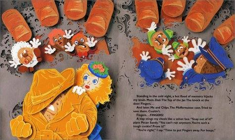{width="4.947916666666667in"
height="2.9375in"}

**Tough Cookie David Wisniewski**

They call me a tough cookie. I guess I am. Came from a regular batch.
Lots of dough. Lived the high life. Top of the Jar. Then I hit bottom
and stayed here. It was rough. Still is. but you get used to it.

Life's still sweet. Just a little stale.

The bottom's loaded with nice folks. Some call them crumbs. I call them
friends. I like helping them out. Anybody makes trouble, I step in.

That's my job. I'm a tough cookie.

I'm knocking back a cup of java when this classy blond calls up.
Store-bought. Easy on the eyes. "pecan Sandy," I say. "Long time."

"Better that way," she says.

We used to be an item. Didn't work. Still hurts.

"So what's up?" I mutter.

She chokes back a sob. "Your partner \..."

My raisins turned to ice. "Chips!"

She's crying now. "Fingers got him."

I grab her arm. "Where?"

"Crossjar," she says, getting a grip. This cookie don't crumble. "Cab's
outside."

Chips and I go way back. Entered the Jar the same time. Joined the force
together. Became partners. We were good. Busted the Ginger Snaps. Broke
up the Macaroons. But then \...

They're loading him when we get there. He's chewed up pretty bad. I take
his hand. "Chips," I say.

He opens his eyes. Gasps. "Fingers \... looking for you."

Shock jolts my gut, but I don't let it show. "Fingers don't come this
far down."

"Did this time," groans Chips.

I squeeze his hand. "You're a tough cookie. You'll make it."

He closes his eyes. "Yeah," he mumbles. "I'll make it."

They take him away.

Standing in the cold night, a hot flood of memory hijacks my brain. Mum.
Dad. The Top of the Jar. The knock at the door. Fingers \...

And later, Me and Chips. The Pfeffernuesse case. Tried to save them.
Couldn't.

Fingers \... FINGERS!

A slap stings my cheek like a velvet bee. "Snap out of it!" pipes Pecan
Sandy. "You can't run anymore. You're such a tough cookie? Prove it!"

"You're right," I say. "Time to put Fingers away. For keeps."

At the police station, the chief offers nothing but lousy coffee and bad
advice. "Forget about it, son," he says. "You can't stop Fingers."

Other cops gather around. They look big. They talk tough. But inside,
they're marshmallows. "That's right," they mumble. "Nobody stops
Fingers."

"We'll see about that," I say.

Crumbs are waiting outside. Word travels fast.

"We owe you big-time," says one. "Let us help."

The others nod.

Their faces blur. It gets hard to talk. I look away. "Thanks," I say,
"but no thanks. This is between Fingers and me."

It's a long ride to the Top of the Jar. I begin to think maybe I'm a
nutbar to do this. Then I think of Chips \...

The doors open. Everything's fresh and warm. I grab the first guy I see.
"Hey, Gumdrop," I say. "Where's Fingers?"

The guy can't take the pressure. Starts to snap. "I don't know!" he
squeals.

That's when the trouble starts. The Jar shakes. The sky opens.

**FINGERS!**

Gumdrop's the first to go. A couple of shortbreads get it next. Then
Fingers heads towards yours truly. Darkness covers me like a damp
sponge. Can't move. Can't breathe. It's the end \...

Then the doors open. Pecan Sandy strides in. followed by every crumb in
the Jar,. they lay on Fingers by the hundreds, the thousands!

Fingers gives them the brush-off and makes another grab, but more crumbs
join the fracas. Again and again, Fingers gets nothing but crumbs.

Finally, it's over.

Pecan Sandy sidles over and helps me up. "I figured Fingers was only
after cookies," she says. "All he got was crumbs."

I kiss her. "You're a smart cookie," I say. "Maybe being a tough cookie
isn't enough."

She kisses me. "You don't learn quick," she says, "but you learn."

**Third Person**

{width="3.4272451881014874in"
height="2.6458333333333335in"}

**They She He**

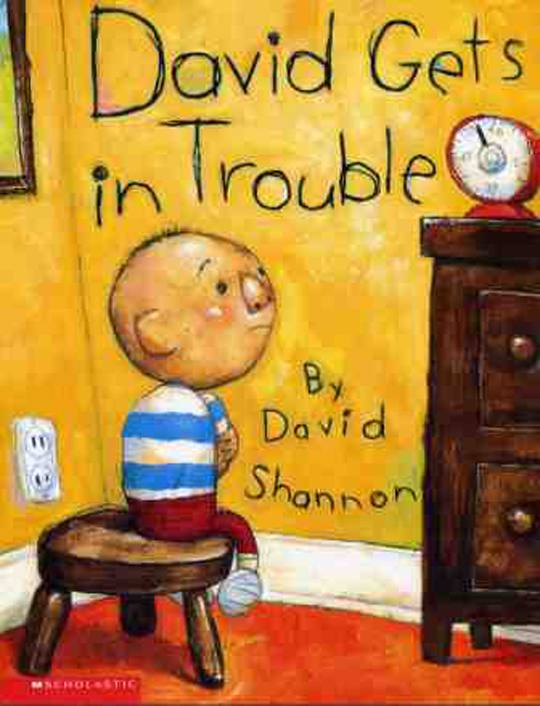{width="3.0520833333333335in"
height="3.9903160542432197in"}

Plot Summary

David Gets in Trouble, written and illustrated by David Shannon is an
extraordinary picture book. The book is about a young boy, David, whose
actions cause him to get into trouble; however he manages to come up
with numerous excuses for his mistakes. Throughout the story David uses
excuses such as he didn\'t mean to, when he was skate boarding through
the house. When he hit a baseball through the window it was obviously an
accident. He refused to eat his eggs. He even \"forgot\" to wear pants
to school. David attempts to say his dog ate his homework and makes a
silly face for his school picture. Everywhere David seems to go and
everything he does he tends to get in trouble for, but he just doesn\'t
want to admit his wrongdoings. When he does get in trouble he either
thinks it\'s funny or doesn\'t understand why he is getting in trouble
for it. Finally, at the end of the story, when it looks like David is
waking up from a bad dream or is laying in bed alone, he admits it was
him! He then apologizes for all of his wrongdoings. He is apologizing to
who the reader would assume to be his mother. Lastly, the book ends with
David in bed telling his mom he loves her. It is a happy ending to a
book with such a mischievous child.

Textual Elements

Genre:The genre of this picture book is Contemporary Realistic Fiction,
because the storyline of the book is current and rational. Many children
and even adults can relate to the events David goes through. They too
have done the things David has done or has known someone who has eaten
dog food, broken a window with a baseball, etc.

Setting:The setting of the story is David's community, which includes
his house, neighbourhood and school.

Characters:

David is the main character of the story. He is the playful young boy
who causes all of the trouble. He is of elementary school age. David
seems like he has quite an interesting, fun, and naughty personality.

While David's mother is not really shown throughout the book. Her body
is shown, but never her face. She does play the significant role of
disciplinarian though.

David\'s classmates, dog, and cat also make minor appearances. David\'s
classmates are seen throughout the story laughing or looking at David.
His dog is blamed for eating his homework and his dog watches him eat
what are supposed to be his snacks. Lastly, David\'s cat is shown when
David is pulling her tail insisting she likes it.

Point of View: David Gets in Trouble by David Shannon is finally told
from David\'s point of view. In the Author\'s Note, Shannon explains
that this is his third book about David. Shannon\'s first book in the
series, No, David! was told from his mom\'s perspective. The second
book, David Goes to School was told from David\'s teachers perspective,
and finally David gets to tell his own side of the story in David Gets
in Trouble. After the first page, the rest of the story is in first
person with David talking.

Theme:There are multiple themes to this story. One being, children make
a lot of mistakes and will say just about anything to keep from getting
into trouble. At first they deny it because they don\'t want to get in
trouble, but then they actually feel bad so they admit their wrongdoings
and apologise, but it\'s a process that takes time. Also, David just
wants his mom and even though he does all of these bad things he still
wants her there and loves her. This is showing that no matter what you
do or what excuses you make your parents will always love you. In the
end, this book is a lesson of honesty.

Text/ Font Choices: I think Shannon\'s font choice is what makes this
book so unique. The book is told from David\'s perspective and his font
actually makes it look like David wrote the book. The letters are big
and crooked. They are black and look like they have been re-traced a few
times to get the bold look. There are only a few words per page. In a
few pages there are colours mixed in with the words, such as the page
where David says\" But Dad says it!\" there is yellow on the D and a in
Dad. The s in says also looks like a beginner writer wrote it, with the
first hump bigger than the second hump. The words are placed in no
particular order from page to page. They are always in the opening gap
of the picture. At times they are on top, bottom, or either side, it
just depends on where they fit best. Shannon\'s font stays the same
throughout the book, except on the first page when the book is
explaining what David says when he gets in trouble. I believe this font
choice helps readers, especially young children connect even more with
the story because it looks as if a child wrote it themselves.

Artistic Elements

The illustrations are created using acrylic paint. The technique is a
combination of acrylic paint strokes inside black coloured pencil or pen
sketches. At first glance, the pictures look like they could have been
drawn by a child. The style used is cartoon art. Shannon uses bright
bold colours in each of his illustrations. The pictures span and cover
both pages.

Analysis and Critique

Overall, David Gets in Trouble is a good book that teaches a lesson
about honesty while involving humour. The literary elements of the book
are effective because the plot is easily understood and the theme is
relevant. The artistic elements enhance the text and give a humorous
interpretation of David's character. The book is socially relevant due
to the issue it deals with about creating excuses to stay out of
trouble. The hidden message is that it is better to admit to one's
mistakes than come up with excuses.

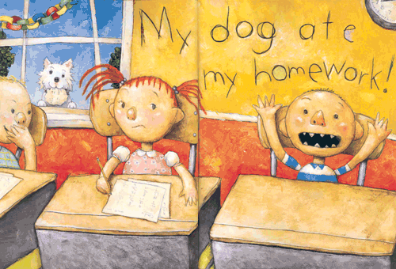{width="5.208333333333333in"
height="3.5416666666666665in"}

Also used for inferring -from Inferring course:

Four column organiser. Samples here. Use the pages that you think are
relevant to your students. E.g.

+----------------+-----------------+----------------+----------------+
| **Quote or     | **Observation** | **Background   | **Inference**  |
| Picture**      |                 | knowledge**    |                |
+================+=================+================+================+
| Front cover    | The fishbowl is | Things that    | The fishbowl   |
|                | tipping.        | tip, fall.     | will smash.    |
+----------------+-----------------+----------------+----------------+
| Title page     | Lady: hands on  | Those actions  | Mum is getting |
|                | hips/foot       | show           | impatient.     |
|                | tapping         | impatience     |                |
+----------------+-----------------+----------------+----------------+
| Cookie jar on  | David on edge   | People fall    | David will     |
| shelf.         | of chair        | off chairs     | fall.          |
+----------------+-----------------+----------------+----------------+
| *Go to your    | David is angry. | I get sent to  | Missing his    |
| room!*         |                 | my room as a   | favourite show |
|                | His show is on. | punishment.    | is David's     |
|                |                 |                | punishment.    |
+----------------+-----------------+----------------+----------------+
| *SETTLE DOWN!* | David jumping   | Jumping on bed | Mum is getting |
|                | on bed.         | not allowed.   | angrier.       |
|                |                 |                |                |
|                | Words in        |                |                |
|                | capitals        |                |                |
+----------------+-----------------+----------------+----------------+
| *Yes, David    | Mum hugging     | Mums give hugs | Mum loves      |
| ...*           | David.          | and love their | David. She was |
|                |                 | kids.          | mad with his   |
| *I love you!*  | David smiling.  |                | behaviour.     |
+----------------+-----------------+----------------+----------------+

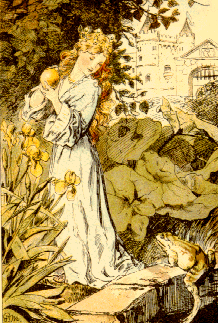{width="2.2708333333333335in"
height="3.3645833333333335in"}

The Frog Prince by Paul Friedrich Meyerheim (1889)

**The Frog Prince**

In the tale, a spoiled princess reluctantly befriends the Frog Prince
(meeting him after dropping a gold ball into a pond), who magically
transforms into a handsome prince. Although in modern versions the
transformation is invariably triggered by the princess kissing the frog,
in the original Grimm version of the story the frog\'s spell was broken
when the princess threw it against a wall in disgust.

In other early versions it was sufficient for the frog to spend the
night on the princess\'s pillow.

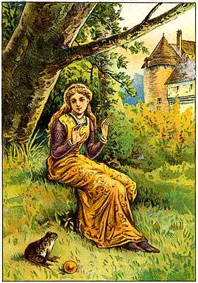{width="1.905158573928259in"
height="2.71875in"}

{width="4.416666666666667in"
height="5.208333333333333in"}

The frog asks to enter the castle

Illustration by Walter Crane 1874**\**

**\"The Frog Prince\" by The Brothers Grimm**

One fine evening, a young princess went out for a walk in the woods near
her home. She never went anywhere without her favourite toy, a bright
golden ball. Wherever she walked, she would throw the ball in the air,
then catch it.

This evening was no exception. She walked far into the woods, throwing
the ball and catching it as she went. In time, she became tired.

In the middle of the woods was a deep, dirty pond. On this evening,
though, the pond had a wonderful glow in the moonlight. The princess sat
down on a bench beside the pond.

While she rested on the bench, she continued playing with her ball,
throwing it up and catching it. Up, and catch. Up, and catch.

Just as she tossed the ball especially high in the air, a cloud moved
across the moon and cut out its light. In the darkness, the princess
missed catching the ball on its way down.

It bounced off her arm, off the seat of the bench and onto the ground.
It rolled along the ground, picking up speed. Faster and faster the ball
rolled, faster than the princess could run after it, until " plop! " it
splashed into the pond.

\"Oh, dear,\" the princess cried. \"It is so dark, and the pond is so
deep and dirty. Now I will never be able to get my ball back. If only I
had been more careful with it. I would give all my jewels and fancy
clothes, everything I own in this world, if I could undo my foolish
mistake.\"

At that moment, a frog, who had been listening to her from just below
the surface of the pond, popped his head out of the water. \"Hello,
princess,\" the frog asked, \"why all the tears?\"

\"What business is it of yours?\" the princess replied. \"You can\'t
possibly help me.\"

\"Think again, princess. I can get your ball back for you and " here\'s
the zinger " I don\'t want all your worldly possessions for doing it. I
don\'t want your jewellery, not one pearl.\" The frog clicked his
fingers and did a sloppy tap-dance with his webbed feet. \"Not a single
penny.\"

\"I don\'t understand.\"

\"All I ask, princess, is that you show me some kindness. Accompany me
to the opera, say. Or, better yet, invite me to dinner at your palace.
Let me lay my tired head on your silk-covered pillows.\"

\"What nonsense is this?\" the princess thought to herself. \"How can a
frog come to the palace? He won\'t be able to travel ten yards from this
pond.\"

But she realised that the frog MIGHT be able to find her precious ball,
so she did not want to upset him. \"All right. Bring me my ball and you
can visit me whenever you want.\"

\"We could get to become good friends,\" the frog said.

\"Who can tell?\" the princess said in order to encourage him to search
for her ball.

But as the frog dived back into the pond, the princess laughed at his
stupidity.

Of course he DID rescue her ball from the bottom of the pond. When he
placed it in the palm of her hand, she was delighted, so delighted she
couldn\'t help but give him a kiss on his wet, bony forehead before
running all the way home.

She was so delighted, she was soon playing with the ball again, throwing
it up and catching it. She quickly forgot all about that silly old frog.

The next evening, as the princess sat down to dinner with her father,
the king, there was a strange noise â€" tap, tap, plash, plash â€" on
the marble stair. A moment later, a soft knock sounded on the
dining-room door. A tiny voice sang out:

\"Open the door, my princess dear!

Open the door, for your true love is here.\"

The princess couldn\'t believe it. She ran to the door and there was the
frog. She was amused, but more than that she was alarmed and frightened.
So she slammed the door closed in the frog\'s face and went back to the
dinner table.

Sensing her fear, the king asked what the matter was. \"There is a
horrible slimy frog at the door,\" she explained. \"Yesterday, when I
dropped my ball in the pond in the woods, he got it back for me. In
return, I promised he could come to dinner at the palace. But, of
course, I didn\'t mean it. I never in my wildest dreams imagined he
would be able to hop all the way here.\"

\"Open the door, my princess dear! Open the door, for your true love is
here.\"

Came the tiny voice again.

The king rested both his hands on the young princess\'s shoulders. \"If
you\'ve made a promise, daughter, you must keep it. This family keeps
its promises. Let the frog in.\"

The princess did so. The frog hopped in. He hopped from one end of the
long dining-room to the other, where the table was. He hopped all the
way from one end of the long table to the other, where the princess sat.

\"Hey, princess, do me a favor,\" he said. \"Help me up. Lay a place for
me next to you.\"

She didn\'t want to, but the king threw her a stern, fatherly glance.

\"Push that plate over this a-way,\" the frog said after he had gotten
good and comfortable on the table beside the princess.

Once he had eaten his fill from the princess\'s own plate, the frog
asked to be taken up to her bedroom for a nap. In no time at all, he was
fast asleep.

He spent the whole night beside the princess. But he left in the
morning, at first light, while she was still sleeping.

\"Thank goodness,\" the princess thought when she awoke. \"I don\'t
suppose he\'ll ever bother us again.\"

But she was wrong. The very next night, a soft knock sounded on her
bedroom door. That same voice, not quite so tiny this time, sang:

\"Open the door, my princess dear! Open the door, for your true love is
here.\"

Remembering what her father had said about promises, she had no choice
but to open the door. In hopped the frog. UP hopped the frog, onto her
pillow, this time needing no help. Again, he was gone before dawn.

This also happened on the third night, and on the fourth. But on the
fourth morning, when she awoke, the princess was astonished to find a
handsome prince standing at the head of her bed. He was gazing at her
with the widest, bluest eyes she had ever seen.

He told her that a spiteful witch had long ago cast a spell, turning him
into a frog. The witch had commanded that he stay a frog for all
eternity, living in that deep, dirty pond, unless by chance he met a
princess and could persuade her to invite him to her palace, feed him
from her very own plate, and let him rest beside her in her very own bed
for three nights.

\"That cruel spell has been broken,\" the prince said. \"You have broken
it. All that remains is for you to allow me to take you to the opera. To
take your hand, once in a while, for walks in the woods. All that
remains is for you to do me the honour of being my friend.\"

\"And perhaps to fall in love with you?\" the young princess asked.

The prince smiled shyly. \"Who can tell?\"

**The Frog Who Would Be King Kate Walker**

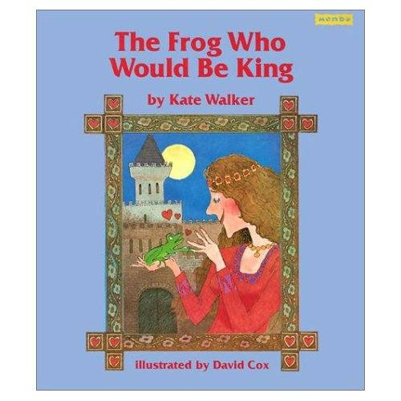{width="2.875in"
height="2.875in"}

6 Readers

Narrator

The Frog

Lil

The King

The Witch

Court Magician

**The Frog Who Would Be King Kate Walker**

There was once a frog who dreamt of being someone special, someone brave
and noble. He wanted to be a king, but he knew that such a thing could
never happen to him while he lived in a lily pond. So he ventured forth
into the world to find a princess. For, like all frogs, he had heard the
story of the princess whose kiss of love had changed a frog into a
handsome prince.

It was a dewy morning when he finally hopped up to a castle and
stationed himself on a princess's balcony. Feeling rather nervous, he
took a deep breath and croaked, "Knee-deep, knee-deep."

The princess came rushing from her chamber, and it was love at first
sight for both of them. The frog had never seen anyone so beautiful.
Even though he was only a little frog and she was a tell princess, he
thought her the loveliest, daintiest creature he had ever seen.

Her name was Lil and she thought this frog was the most perfect in all
the world -- so sweet and shiny and green, She gave him the noblest name
she could think of -- Reginald. Their romance blossomed like a
well-watered buttercup, and finally Reginald decided to propose.

"Dear Lil," he began, holding her little finger with his sucker pad,
"could you possibly overlook my frogginess and be my wife?"

Lil swooned with emotion and fainted on the spot. Reginald hopped back
and forth from the goldfish pond with water to splash on her face: back
and forth, back and forth, trying to wake her up so she could give her
answer.

His efforts were rewarded. Her answer was "yes." She would marry him,
frog or not.

"Marry a frog?" her father roared when she told him. "You can't be
serious. Don't you know that the man you marry will one day become king
in my place?"

"Yes, Father," she said. "I know, and I think Reginald would make a
wonderful king. He's wise and courageous and kind."

"I don't care if his blankets are made from boy scout badges," cried the
ling. "He's still a frog, and he's not going to sit on my throne!"

Lil came away broken-hearted, for she must have been the only person in
the world who had not heard the story of the frog and the princess.
Reginald soon told her.

"You see, my dear," he said, "one kiss is all it takes. I'll turn into a
prince and our problems will be over. So, pucker up."

"But Reginald" she said, "you'll give me warts!"

"Lil dear, toads, not frogs, give you warts."

"Sorry dearest." She raised him to her lips, closed her eyes, and ...

*Smoooooch!*

"Oh, no!" she cried. "You're still a frog!"

He looked glumly at his greenness. "I can't understand it. Our
ingredients are right. I'm a frog, you're a princess, and we love each
other enough to turn a dozen tadpoles into as ready-made family."

"I'll marry you anyway," said Lil. "I wouldn't care if you were an ugly
old toad."

But Reginald did care. It was his dream to become king. He had come a
long way from the lily pond, and he was not going to turn back now.

"I'll go and see the local witch," he said. "She should be able to tell
us what's gone wrong."

"And I'll have a chat with the court magician," said Lil, "and see what
he says."

So Reginald told the witch what had happened, or rather what had *not*
happened. She nodded her head and said, "Frog, whoever told you that
story got it mixed up. That wasn't a frog that the princess kissed and
turned into a prince. It was a toad. Why, anyone can change a toad with
a little smack on the lips. But frogs are different. You can kiss frogs
till the cows come home and they'll still be frogs."

Reginald turned away dragging his flippers in despair.

"Of course." said the witch, "what we could do is turn you into a toad
first, and then into a prince."

Reginald came bouncing back. "Could you really do that?"

"Sure could," she said, giving a toothless smile. "In fact, it's a long
time since I've kissed a handsome prince."

Slowly the witch brewed the murky potion. Reginald tried to hurry her,
but she would not be rushed.

"These are one-way spells," she warned him, "and we wouldn't want any
mistakes to be made because there's no coming back for seconds."

When the potion was ready, Reginald took one sip from the spoon and
immediately puffed up into a big, brown toad. The witch bent down to
him.

"All right, sweetie," she said, "give us a kiss and let's see how
handsome you are."

"I'm terribly sorry, Madame," replied Reginald, "but I am engaged to
Lil, and it wouldn't be right for me to kiss another."

Reginald bounded back to the castle for the kiss of love that would turn
him into a prince at last. His lily pad dreams were about to come true.

When Reginald came to the princess's chamber, the court magician opened
the door. Being very tall, he looked down on Reginald from a great
height.

"What have we here?" he said.

"I'm Reginald, the princess's frog," he answered, "only I had the witch
turn me into a toad."

"And I must say, she's done a fine job too," said the magician, picking
Reginald up to examine his warts. "Yes, very fine work. Almost as good
as my own efforts, wouldn't you agree?"

Saying that, he placed Reginald on a lotus leaf in the goldfish pond,
right next to a little green frog.

"Oh, Reginald," the frog cried in a sweet voice, "all our problems are
solved. We're not different anymore." The frog was Lil.

"But we are," he croaked. "You're a beautiful frog and I'm an ugly old
toad."

"I don't care," she said. And she put her little sucker foot on his big
warty flipper and gave him a kiss.

In an instant, a handsome young man appeared in the water beside her.

"Oh Lil!"

"Oh Reginald!"

Lil's kiss had changed Reginald into a tall and dashing prince, but she
was still a green and shiny frog. However, after the initial shock, they
both decided that it didn't matter if one of them was a frog. Nothing
had really changed. Their love was the same. They had just swapped
places, that was all.

The king changed his mind, though. He was only too happy to have
Reginald marry his daughter now. Who else would, now that she was a
frog?

So Reginald married his princess, and in time became king, while all the
other frogs still sat on their lily pads catching tasteless flies and
not daring to dream of all the greater things they could be.

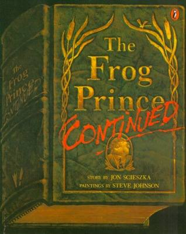{width="3.0208333333333335in"
height="3.7807917760279963in"}

After the Princess kissed the frog, he turned into a handsome prince and
they lived happily ever after\... or did they? The Princess can\'t stand
the Prince\'s froggy habits - the way he hops around on the furniture,
or sneaks off to the lily pond. The Prince is unhappy, too, and decides
that it would be best if he were changed back to a frog. But finding a
witch who will do the job is harder than he expects. They all seem to
have other spells in mind\...

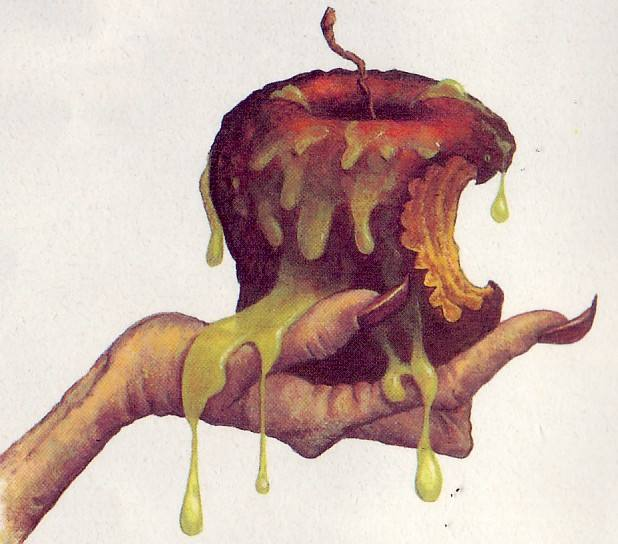{width="2.7291666666666665in"
height="2.4023731408573927in"}

This is the story of what happened after \"They lived happily ever
after.\" What happens is: a witch, a spell, a poison apple, another
witch, a gingerbread house with an extra large oven, dragonfly
wallpaper, a Fairy Godmother, a pumpkin, a carriage, another spell, a
clock striking midnight, a kiss, frogs, and true love.

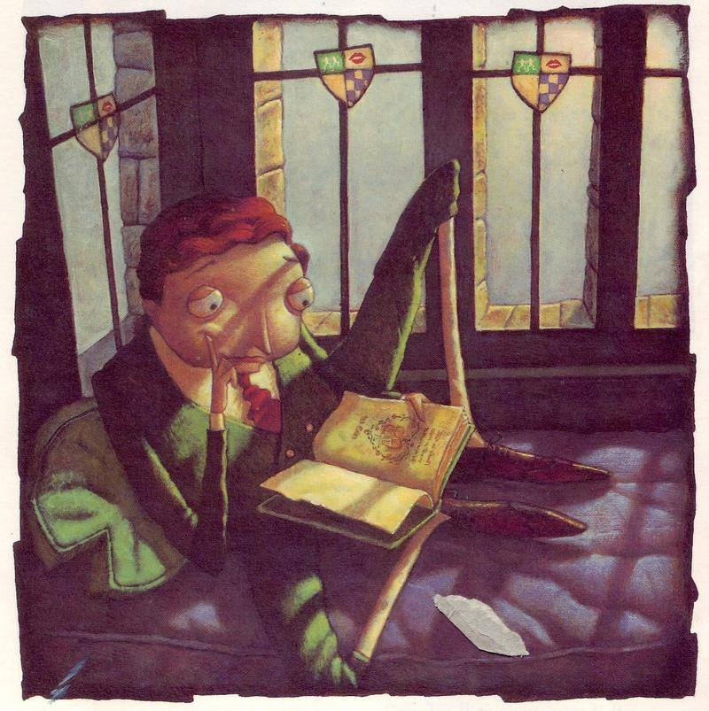{width="6.268055555555556in"
height="6.291560586176728in"}

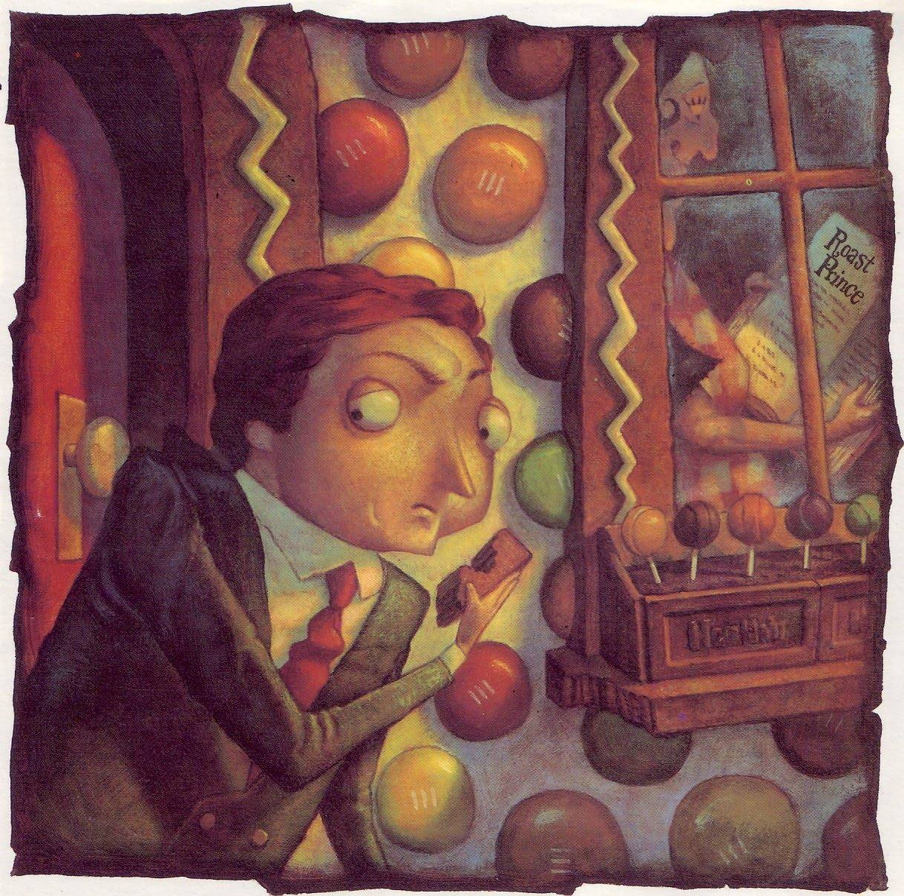{width="6.268055555555556in"
height="6.216593394575678in"}

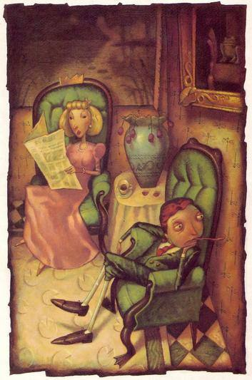{width="3.6770833333333335in"
height="5.552083333333333in"}

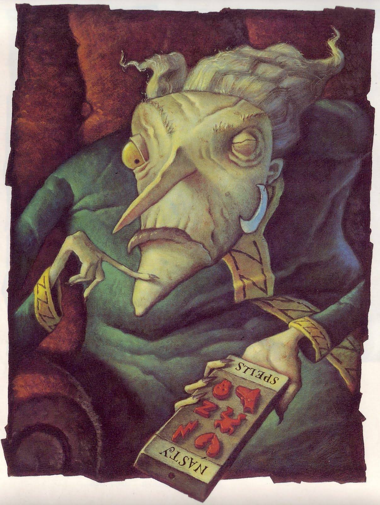{width="6.268055555555556in"
height="8.315827865266842in"}

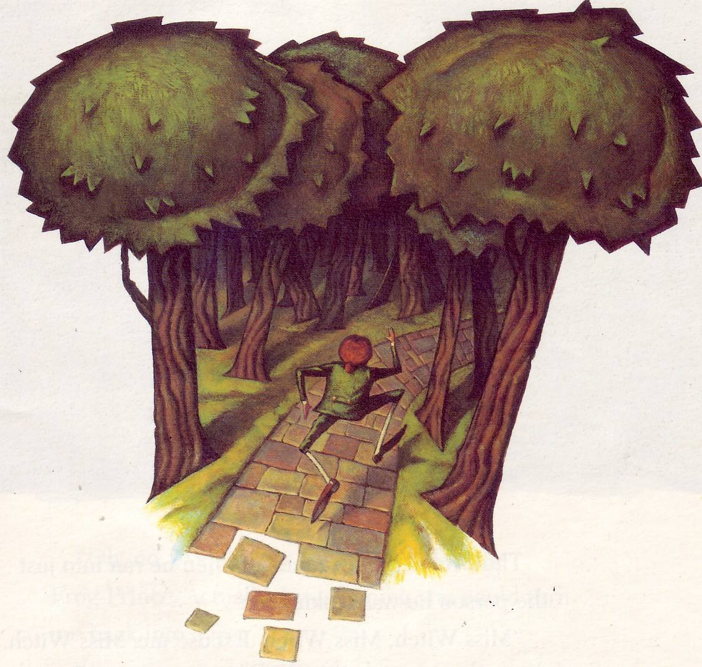{width="6.268055555555556in"
height="5.956045494313211in"}

**The Frog Prince Continued Jon Scieszka**

*The princess kissed the frog. He turned into a prince. And they lived
happily ever after.*

Well, let's just say they lived sort of happily for a long time. Okay,
so they weren't happy. In fact, they were miserable.

"Stop sticking your tongue out like that," nagged the princess.

"How come you never want to go down to the pond anymore?" whined the
Prince.

The Prince and the Princess were so unhappy. They didn't know what to
do.

"I would prefer that you not hop around on the furniture," said the
Princess. "And it might be nice if you got out of the castle once in a
while to slay a dragon or giant or whatever."

The Prince didn't feel like going out and slaying anything. He just felt
like running away. But then he reread his book. And it said right there
at the end of his story: "They lived happily ever after. The End." So he
stayed in the castle and drove the Princess crazy.

Then one day, the Princess threw a perfectly awful fit.

"First you keep me awake all night with your horrible, croaking snore.
Now I find a lily pad in your pocket. I can't believe I actually kissed
your slimy frog lips. Sometimes I think we would both be better off if
you were still a frog."

That's when the idea hit him.

The Prince thought. "Still a frog \... Yes! That's it! And he ran off
into the forest looking for a witch who could turn him back into a frog.

The Prince hadn't gone far when he ran into just the person he was
looking for.

"Miss Witch, Miss Witch. Excuse me, Miss Witch. I wonder if you could
help me?"

"Say, you're not looking for a princess to kiss are you?" asked the
witch.

"Oh, no. I've already been kissed. I'm the Frog Prince. Actually, I was
hoping you could turn me back into a frog."

"Are you sure you're not looking for a beautiful sleeping princess to
kiss and wake up?"

"No, no -- I'm the Frog Prince."

"That's funny. You don't look like a frog. Well, no matter. If you're a
prince, you're a prince. And I'll have to cast a nasty spell on you. I
can't have any princes waking up Sleeping Beauty before the hundred
years are up."

The Prince didn't stick around to see which nasty spell the witch had in
mind. He ran deeper into the forest until he came to a tiny cottage
where he saw another lady who might help him.

"Miss Witch, Miss Witch. Excuse me, Miss Witch. I wonder if you could
help me. I'm a prince and --"

"Eh? What did you say? Prince?" croaked the witch.

"No. I mean, yes. I mean, no, I'm not the prince looking for Sleeping
Beauty. But, yes, I'm the Frog Prince. And I'm looking for a member of
your profession who can turn me back into a frog so I can live happily
ever after."

"Frog Prince, you say? That's funny. I thought frogs were little green
guys with webbed feet. Well, no matter. If you're a prince. you're a
prince. And I can't have any princes rescuing Snow White. Here -- eat
the rest of this apple."

The prince, who knew his fairy tales (and knew a poisoned apple when he
saw one), didn't even stay to say, "No, thank you." He turned and ran
deeper into the forest. Soon he came to a strange-looking house with a
witch outside.

"Ahem. Miss Witch, Miss Witch. Excuse me, Miss Witch. I wonder if you
could help me. I'm the Frog -- "

"If you're a frog, I'm the King of France," said the witch.

"No, I'm not a frog. I'm the Frog Prince. But I need a witch a turn me
back into a frog so I can live happily ever after can you do it?" said
the Prince in one long breath.

The witch eyed the Prince and licked her rather plump lips.

"Why, of course, dearie. Come right in. Maybe I can fit you in for
lunch."

The Prince stopped on the slightly gummy steps. Something about this
house seemed very familiar. He broke off a corner of the windowsill and
tasted it. Gingerbread.

"I hope you don't mind me asking, Miss Witch. But do you happen top know
any children by the names of Hansel and Gretel?"

"Why yes, Prince darling. I do. I'm expecting them for dinner."

The Prince, who, as we said before, knew his fairy tales, ran as fast as
he could deeper into the forest.

Soon he was completely lost.

He saw someone standing next to a tree. The Prince walked up to her,
hoping she wasn't a witch, for he'd quite had his fill of witches.

"Madam. I am the Frog Prince. Could you help me?"

"Gosh, do you need it," said the Fairy Godmother. "You are the
worst-looking frog I've ever seen."

"I am not a frog. I am the Frog Prince," said the Prince, getting a
little annoyed. "And I need someone to turn me back into a frog so I can
live happily ever after."

"Well, I'm on my way to see a girl in the village about going to a ball,
but I suppose I could give it a try. I've never done frogs before, you
know."

And with that the Fairy Godmother waved her magic wand, and turned the
Prince into a beautiful \... carriage.

The Prince couldn't believe his rotten luck. The sun went down. The
forest got spookier. And the Prince became more and more frightened.

Oh, what an idiot I've been. I could be sitting at home with the
Princess, living happily ever after. But instead, I'm stuck here in the
middle of this stupid forest, turned into a stupid carriage. Now I'll
probably just rot and fall apart and live unhappily ever after."

The Prince thought these terrible, frightening kinds of thoughts (and a
few worse -- too awful to tell), until far away in the village, the
clock struck midnight.

The Carriage instantly turned back into his former Prince self, and ran
by the light of the moon until he was safe inside his own castle.

"Where have you been? I've been worried sick. You're seven hours late.
Your dinner is cold. Your clothes are a mess."

The Prince looked at the Princess who had believed him when no one else
in the world had, the princess who had actually kissed his slimy frog
lips. The Princess who loved him.

*The Prince kissed the princess. They both turned into frogs. And they
hopped off happily ever after.*

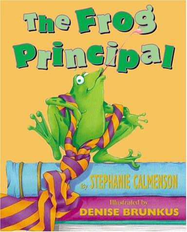{width="2.6218482064741906in"
height="3.25in"}

Mr. Bundy is the principal of PS 88. He\'s popular and trendy, and the
kids think he\'s the best principal in town. But when Marty Q. Marvel,
the Marvellous magician, can\'t undo his new magic spell: \"He lives in
a wood, in a pond, or a bog. He used to be a principal but now he\'s a .
. \". Well, poor Mr. Bundy is a frog! It\'s not always easy having a
slimy, green-skinned amphibian for a principal. He plays leap-frog,
swims in the kindergarten sink, and eats students\' fly collections.
Will Mr. Bundy ever be his old self again? Inspired by \"The Frog
Prince\", as told by the Brothers Grimm, here is a riotously funny story
brimming with giggles, charming illustrations, and an identity crisis
that will leave readers Marvelling!

**The Frog Principal Stephanie Calmenson**

Mr Bundy is the principal; of P.S. 88. His students and teachers think
he's the best principal in town.

One day, Mr Bundy was at school late planning the next assembly program.
He was looking for a special visitor when an ad in the phone book caught
his eye. It said:

**MARTY Q. MARVEL, MAGICIAN**

**My MARVEL-ous magic**

**will amaze you!**

"The kids would love a magic show!" thought Mr Bundy. He called Marty Q.
Marvel and asked to see some of his tricks.

In no time, a man wearing a black cape and a magician's hat tripped into
Mr Bundy's office.

"Whoops! Marty Q. Marvel here! Allow me to amaze, amuse, and confuse
you!" he said.

"May I see some educational tricks, please?" asked Mr Bundy. "I like my
students to learn from our visitors."

"Sure! One maths lesson coming right up!" said Marty Q. Marvel. "Watch
my hat and tell me how many birds come out."

He began to recite. "And a-one! And a-two, three! Come out, birds! Fly
to me!"

Marty tapped his hat once, twice, three times. No birds.

He turned his hat upside down and shook it hard. Not a feather.

"What kind of maths lesson was that?" asked Mr Bundy.

"Um. I guess that was my lesson on zero. Let me try my science lesson.
It's on amphibians."

Before Mr Bundy could tell the magician he'd seen enough, Marty was
waving his magic wand in Mr Bundy's direction, saying, "He lives in a
wood, in a pond, or a bog. He used to be a principal, but now he's a
\...

\...FROG!"

"POOF!!! Mr Bundy suddenly felt small, strange, and slimy.

"*Ribbit! Ribbit!"* he said.

He cleared his throat, then tried again. Thank goodness real words came
out.

"Wh-what have you done to me?" croaked Mr Bundy.

"Whoops! It looks as though I turned you into a frog," said Marty Q.
Marvel. "It's amazing. That trick never worked before."

"Kindly *un-*work it," said Mr Bundy. He was hopping mad.

"I'll check my instruction book," said Marty.

He pulled a rabbit, some flowers, a deck of cards, and a small book out
of his bag. He flipped through the book.

"*Buenos dias. Muchos gracias. Que pasa? Whoops!* This is my Spanish
dictionary. My instruction book must be at home. I'll be right back,"
said the magician, tripping out the door.

It was a long night for Mr Bundy. The sun went down. The sun came up.
There was no sign of Marty Q. Marvel.

Finally, Mr Bundy heard footsteps outside his office. His heart leapt in
his little green chest.

"Good morning, Mr Bundy!" called a voice.

Oh, no! It was Ms. Moore, the vice principal.

"I can't let her see me this way!" thought Mr Bundy. He scrawled a note
that said:

Family emergency! BE BACK SOON.

Then he hopped from his chair to his desk to the window and out across
the school yard.

As he watched his beloved students and teachers go by, Mr Bundy
considered his life as a frog.

"Even though I'm small, green, and slimy, I can still be a good
principal, can't I?" he wondered.

He hopped over to a pond to think.

Mr Bundy's skin was dry, and the water looked awfully good. SPLASH! Mr
Bundy dived in for a swim.

"Wow! These frog legs are amazing!" he thought, kicking around the pond.

A fly whizzed by. Without thinking, Mr Bundy flicked out his tongue.
ZAP! He caught the fly.

"Hmm, not bad," he thought.

At recess, a group of kids came outside to play softball. A girl named
Keesha hit the ball, and it went flying!

Roger, Hector, and Nancy all ran after it.

"Uh-oh. I think the ball landed in the pond," said Roger.

"What will we do now?" asked Nancy.

A voice called, "I can help you!"

"Who said that?" asked hector.

They all thought the voice was coming from the water.

But the next instant a frog jumped out from behind the cattails and
said, "It was me!"

"Huh?" said Roger. "A talking frog?"

"You may consider me an exception to the rule," said Mr Bundy. "I am a
frog. I can talk. And I can get you your ball."

The kids could hardly believe their eyes and ears. Things like this only
happened in fairy tales.

"I want one thing in return," continued the frog. "I want to be your
principal."

"B-b-but we already have one," said Hector.

"That's right. He's the best!" said Nancy.

That made Mr Bundy proud. He wanted to continue being their principal --
even if he was a frog.

"It's up to you," said Mr Bundy. "I will get the ball, but only if I can
be your principal."

The kids went off to talk it over.

"He can't be our principal," said Roger. "He's a frog."

"We can tell him he can be our principal, but we don't have to mean it,"
said Nancy.

"I guess it's the only way to get our ball back," said Hector.

So the kids told the frog it would be okay.

"Do you promise\>" asked Mr Bundy.

"We promise," said the kids, crossing their fingers behind them.

Mr Bundy hopped into the pond and got the ball. He tossed it to the
kids.

"Thanks, frog!" they called, running back to school.

"Wait for me!" cried Mr Bundy. "I can't go that fast!"

But the kids were already too far away to hear him.

That afternoon. Ms. Moore held a special assembly.

"Mr Bundy has been called away," she told the students. "While he's
gone, we must work together to \..."

*Knock, knock.*

"Roger, please see who that is," said Ms. Moore.

Roger was pretty sure he knew who it was. He walked to the door and
opened it a crack.

"Let me in!" croaked a voice.

Roger slammed the door and returned to his seat.

"Who was there, Roger?" asked Ms. Moore. "You look as though you've seen
a ghost."

"It's not a ghost, it's a frog!" called Alice, a kindergarten student.
By now, half the school had heard about the talking frog, and Alice had
a habit of telling the truth, no matter what.

"Will someone please tell me what's going on?" asked Ms. Moore.

The kids told her the whole story.

"We promised the frog he could be our principal," said Roger.

Ms. Moore thought her students were joking. She couldn't wait to see
what they were up to.

"A promise is a promise," she said. "If you promised the frog he could
be your principal, you have to let him in."

Roger opened the door. Mr Bundy, the frog principal, walked down the
aisle and up to the stage.

Poor Ms. Moore almost fainted.

"*Ribbit \...* er \... good afternoon," croaked the frog. "I've heard
that Mr Bundy is a very good principal. I will do my best to fill his
shoes while he is gone. Of course, they may be a little large for me.
Ha, ha!"

No one else laughed. They were too stunned.

"It must be a computer trick," whispered one of the teachers.

"It will be business a s usual until Mr Bundy returns," continued the
frog principal. "In fact, you may call me Mr B."

After the assembly, Mr B made school rounds, hopping up and down the
halls. He was almost trampled by two students racing by.

"No running in the halls, please!" called Mr Bundy.

The students, Keesha and Max, stopped and looked around.

"I'm down here!"Mr B reminded them.

Max looked down. "This is so weird," he whispered to Keesha.

"No kidding," said Keesha. "We almost squished our principal!"

In the gym, the kids were playing leapfrog. Mr Bundy couldn't resist. He
hopped in, leapt over Hector's shoulders, then hopped back out.

"Please tell me that didn't happen," said Hector, rolling his eyes.

The kindergarten class was learning about water when Mr B showed up.

"Hello, Mr B!" called the students.

"Hi, everyone!" answered Mr Bundy.

The next thing they knew -- SPLASH! -- their principal was swimming laps
in the sink. They tried their best not to giggle.

"Very refreshing," said Mr Bundy.

"Here, Mr B," said Alice. She handed him a paper towel to dry off with.

"Thank you very much,' said Mr Bundy. He went out, leaving a trail of
small puddles behind him.

Mr Bundy went to Ms. brown's science class next. Nancy had a shoe box
with holes in the top.

"What have you got there?" asked Mr Bundy.

Nancy opened the box to show him. ZAP! ZAP! ZAP! Mr Bundy swallowed
Nancy's bug collection.

"The principal ate my homework!" cried Nancy.

"Ms. Brown, please give this student a gold star!" said Mr Bundy. "Her
collection of bugs was delicious \... I mean, excellent." As the weeks
passed, Mr Bundy tried to be the best frog principal he could be. The
students tried their best to accept him. But it was hard. They were
sorry they had lied.

"We shouldn't have made a promise if we didn't mean it," said Roger.

"It's embarrassing having a frog for a principal," said Hector. "But I
guess we deserve it."

"I want Mr Bundy back!" said Nancy.

Mr Bundy heard his students and his heart sank. He kept calling Marty Q.
Marvel, but there was no answer. He prayed the magician would come back.

"If not, I'll be a frog forever and ever," he thought.

Then one day at recess, Mr B was watching a softball game from his
office. He was wondering how long he could go on being a frog principal
when suddenly \...

\... a ball came flying through the window. It landed with a thump on Mr
B's little green head. Stars were spinning in his eyes.

Out of nowhere, Mr Bundy started reciting a magic spell. "And a-one! And
a-two! And a-one, two, three! Look who's back! Hooray! It's \...

\... ME!"

POOF! Mr Bundy was his old self again.

Ms. Moore heard the commotion and came running.

"Mr Bundy! Welcome back!" she cried. "I was so worried about you. Is
everything all right?"

Mr Bundy looked down. He saw his own two hands. He saw his own two legs.

"Everything's great!" he said.

"You wouldn't believe who our substitute principal was," said Ms. Moore.
"I'll let the children tell you all about him."

Mr Bundy went to the window and waved. The students cheered wildly and
were so excited to have their principal back that no one even noticed
when \...

\... ZAP!

Mr Bundy swallowed a fly.

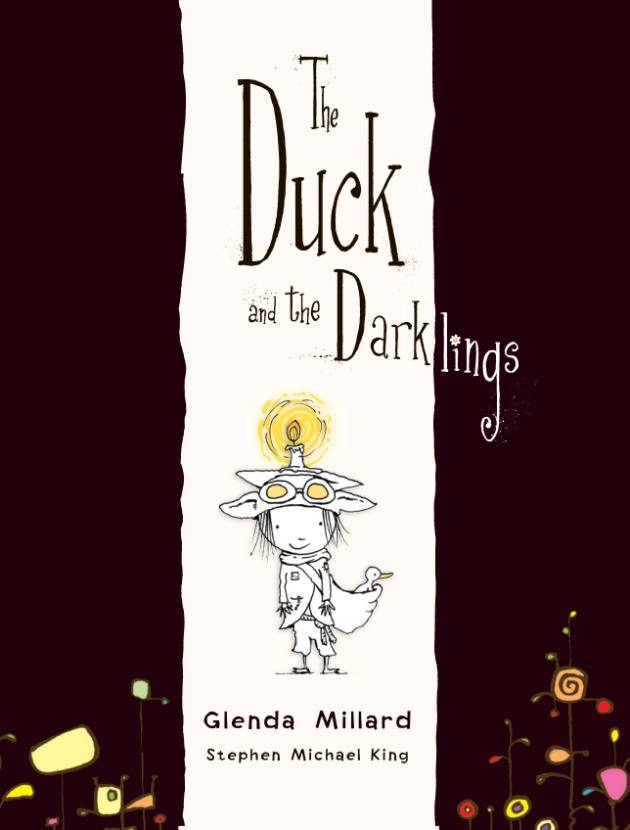{width="2.8631627296587925in"
height="3.7708333333333335in"}

**The Duck and the Darklings Glenda Millard**

Peterboy and Grandpapa live in a hole in the land of Dark. Although Dark
is a sorry, spoilt place, their home is built with care and lit by love.
All memories of the brighter better place that came before have been
'disremembered' except by Grandpapa. When Peterboy returns from his
nightly excursions to the finding fields with tales of mysteries he has
seen outside, he sees the light of memories past shining in his
Grandpapa's eyes. Searching for a scrap of wonderfulness to keep the
light alive, Peterboy finds Idaduck, a broken thing. Grandpapa mends her
from top to tail: quack, waddle and wing. She brings much joy until the
wind changes, bringing with it wanderlust. Wanting to give the duck a
marvellous send-off, the Darklings feast and dance and sing until the
dawn reveals a renewed world full of hope for the future.

The rich text is to be savoured and read aloud. Evocative imagery is
conjured by Millard's whimsical words. The illustrations create an
otherworld that is dark but not too scary. The smudgy splattered
landscape contrasts with the cartoon-like black and white figures. Later
the page is lit by warm yellow, symbolising the warmth and happiness
that Idaduck brings, and again when Grandpapa begins to remember.
Colourful memories are framed like windows on the past. The new dawn
brings blocks of bright colour that shine like stained glass. **.**

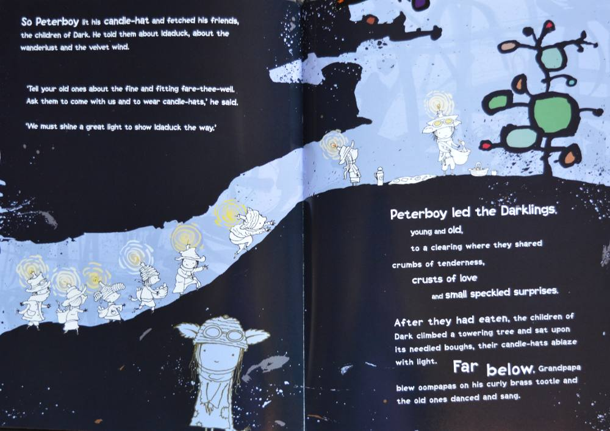{width="6.268055555555556in"
height="4.431515748031496in"}

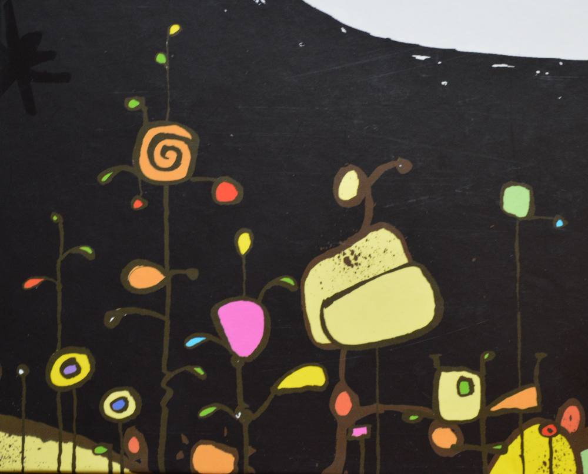{width="6.268055555555556in"
height="5.05205271216098in"}

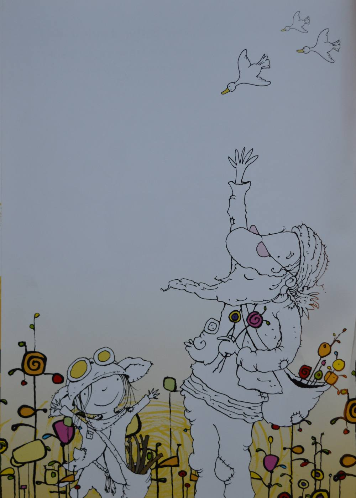{width="6.268055555555556in"
height="8.750205599300088in"}

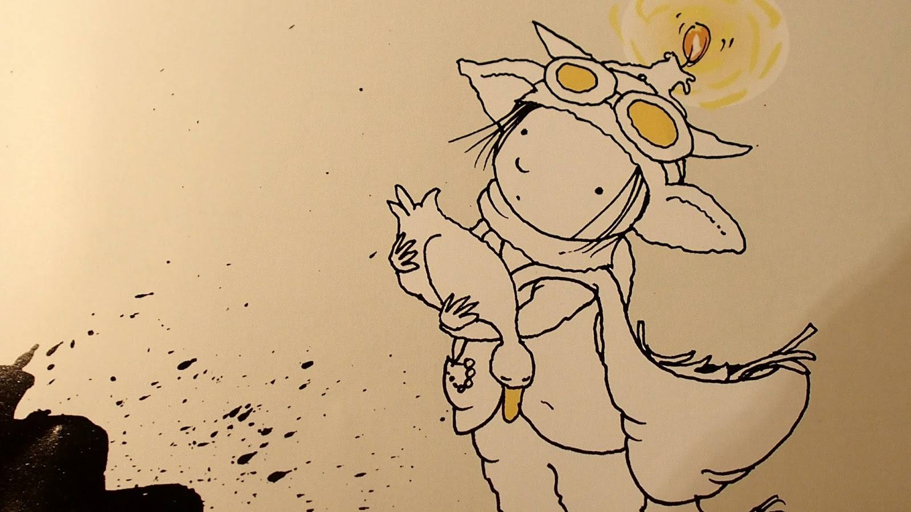{width="6.268055555555556in"
height="3.5257808398950132in"}

This book can be used on many levels, depending on the age of the
students.

**Themes**:

• Hope

• Friendship

**Discussion Points and Activities:**

• When you look at the front cover and title of the book, what do you
think the story might be about? After you have read it, have your
thoughts changed?

• Glenda Millard has a wonderful way with words. When reading the story,
are there any that you haven't heard of? If so, which ones?

• Are all of her words 'real' words? If you think they aren't look them
up in a

dictionary, along with the meaning of any words that you hadn\'t heard
of.

• Students analyse the following: 'Dark was a sorry place; a broken and
battered place. It had been that way for so long that sunups and
sundowns, yesterdays and tomorrows and almost everything in them had
been disremembered by each and by all... except Grandpapa.' What does it
mean?

• Why did the older people not want to venture out? What do you think
might have happened to the world? Why were the 'Darkling' children the
only ones who went out to the finding fields?

• What does finding Idaduck mean to Peterboy and Grandpapa? How does she
change their lives?

• How have light and colour been used in the illustrations to convey
what is happening?

• Stephen Michael King has a very unique drawing style. Draw your
favourite scene from the book, in a similar style.

• At the end of the book, the world has healed and the light appears. Do
you think that this was the first time the world was light? Or do you
think the older people were too scared to venture out in the light
because they were scared of seeing what had happened to the world? If
so, why do you think that they might have felt this way? What do you
think might have happened to the world?

Are there any clues in the story?

• Time had soothed the world's wounds. Can you think of other things
that time might help to heal?

• Darkness and light are common metaphors used in stories. Is darkness
being used a metaphor in this story? If so, what do you think it could
be a metaphor for?

**The Duck and the Darklings Glenda Millard**

In the land of Dark grew a child called Peterboy. Home was ahole built
with care, lit with love, where he and Grandpapa shared everything.

Dark was a sorry, spoiled place; a broken and battered place. It had
been that way for so long that sunups and sundowns, yesterdays and
tomorrows and almost everything in them had been disremembered by each
and by all ...

except Grandpapa.

The old ones never brightened their gloomy burrows with tales of the
long-ago, when all was bright and beautiful. They dared look at their
ruined world.

Only when the heavenlies were deepest indigo and earth was darkest
Violet were Peterboy and the other Darkling childs sent up and out to
the finding fields.

Over heaps and hummocks of lost and lonely things they clambered,
gathering fiddlesticks for firewood, filling billies with trickle and
seeking crumbs and crusts of comfort to take home.

When he returned to Grandpapa, Peterboy painted word pictures of the
mysteries he had seen outside.

"There are holes in the dark, Grandpapa, and light leaks through! It
slides down the steeps, puddles in the deeps and glimmers on the
trickle."

While Peterboy talked, he saw light as dazzling as a falling star in
Grandpapa's eyes. When he asked what it was, the old man answered,
"Memories of things past, child, thoughts of things lost and longed
for."

The light put longing into Peterboy's heart.

When he returned to the finding fields, his spiderling fingers crept
into cracks and crevices, corners and crannies. He wished for more than
crumbs and crusts. He wished for a scrap of wonderfulness. Something to
bring light to Grandpapa's eyes and keep it there.

Instead Peterboy found Idaduck. He put his ear to the downy heart of her
and heard hope beating there, and although he knew Grandpapa would
grumble, Peterboy laid the broken duck gently in his glory bag and
carried her home.

"There's little enough to eat without feeding someone else's child,"
said Grandpapa gruffly.

"Please let her stay," begged Peterboy. "She can share with me."

"Only until she's cured then," said Grandpapa. "But don't get too fond
of her; ducks are born with wanderlust in them. They live for the feel
of wind in their wings."

So Idaduck stayed. With cobwebs and cotton reels, tenderness and
thistledown, Grandpapa darned and cobbled until the duck was mended from
top to tail; quack, waddle and wing.

In return she cosied his toes and squeezed and speckled surprises into
his slippers.

Sometimes she and Peterboy danced in the firelight while Grandpapa
played oompapas on his curly brass tootle. Other times when Peterboy
returned from the finding fields, he would find Grandpapa nursing
Idaduck, his eyes a-glimmer and aglow with forbidden fondness. Peterboy
couldn't remember a time when Grandpapa was happier.

But the earth turned, the air cooled and wistful was the look in
Idaduck's eyes. Peterboy remembered Grandpapa's warning about wanderlust
and the wind. Worried by the great emptiness that would be left by a
duck so small, Peterboy said, "We must give Idaduck something that will
make her want to stay."

"We've given all that is ours to give," answered Grandpapa.

"It isn't enough," said Peterboy. "Tell her about the long-ago,
Grandpapa."

"What good is there in telling tales of lost and longed-for things?" the
old man asked.

"When you think about the long-ago, I see starlight in your eyes," said
Peterboy. "Please, Grandpapa, fill our darkness with light ,warm our
wintery hearts with your stories."

So Grandpapa turned the rusty latchkey of his magnificent remember and
set free a symphony of stories.+

"Yellowly, yellowy, shone the sun, when I was young and wee," he began.

Peterboy listened, his mind awash with bright imaginings as Grandpapa's
shining, shimmering words painted windows on the walls. He told of
rainbows and rivers, fields and flowers and trees in tens of thousands.

"Greenly, greenly breathed the forests," he said, "and sweetly ripened
the fruit. Merrily winged the birdlets through the periwinkle sky and
daisily, daisily bloomed the fields where children played in peace."

Grandpapa knew many tales and when at last they all were told, he and
the boy and the duck dozed. But the wind whispered Idaduck's name and
she woke and waddled upstairs.

When Peterboy woke he too climbed the stairs and sat bedside Idaduck.
Sorrydrops fell from their eyes.

The sky was darkest indigo. The earth was deepest violet and the wind
was soft as velvet. But there was no star, no fingernail of moon to
light the way for Idaduck.

Grandpapa woke and saw the boy and the duck. And because he knew almost
all there was to know, even the longings of the duck and the kindness of
the boy, he said, "Wait, Peterboy! You must give the duck such a
fare-thee-well that it will never be disremembered. So fine and fitting
that when people speak of it the stars will shine."

So Peterboy lit his candle-hat and fetched his friends, the children of
Dark. He told them about Idaduck, about the wanderlust and the velvet
wind.

"Tell your old ones about the fine and fitting fare-thee-well. Ask them
to come with us and to wear candle-hats," he said. "We must shine a
great light to show Idaduck the way."

Peterboy led the Darklings, young and old, to a clearing where they
shared crumbs of tenderness, crusts of love and small speckled
surprises.

After they had eaten, the children of Dark climbed a towering tree and
sat upon its needled boughs, their candle-hats ablaze with light.

Far below, Grandpapa blew oompapas on his curly brass tootle and the old
ones danced and sang.

Courage gave Peterboy a voice. he cried out from his lofty perch. "One
day I found a scrap of wonderfulness. Her wings were wounded but in her
heart there was hope. So I took her home. Idaduck made stars shine in
Grandpapa's eyes. But now she is mended and we must say good-bye."

The Darklings stood still. They had danced night to its end. The candles
on their hats had burnt down to wicks and wax but all around them earth
remained strangely bright and beautiful.

The old ones looked in shame for the wounds man had made. But time had
soothed earth's hurts. She was dressed anew in flowers and forests.

The velvet wind whispered, Idaduck spread her wings and the Darklings
watched with hope in their hearts as she flew out of sight.

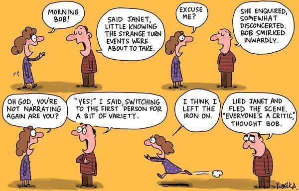{width="6.25in"
height="4.0in"}

