**Voice**

> **(11)**
>
> 

**Narrative Voice**

**Perspective 2**

**Voice 11**

**Narrative Voice -- Perspective 2**

Second Person Point of View

Eat Like a Bear April Sayre

The Iridescence of Birds Patricia MacLachlan

If You Find a Rock Peggy Christian

Instructions Neil Gaiman

Have I Got a Book for You Melanie Watt

A Pig Parade is a Terrible Idea Michael Black

How to Babysit a Grandpa Jean Reagan

Stars Beneath Your Bed April Sayre

The Book That Eats People John Perry

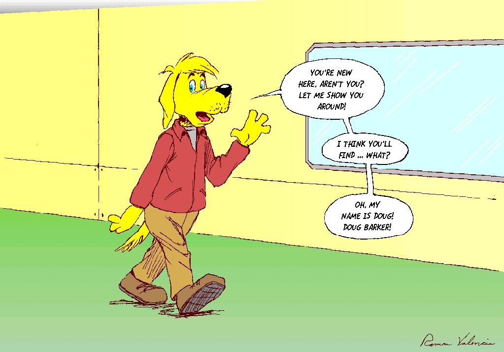

**Second Person**

**You Your Yours**

**Second Person Point of View**

A variety of books are written in the second person: E.g.

Nonfiction:

Eat Like a Bear April Sayre

If You Find a Rock Peggy Christian

The Iridescence of Birds Patricia MacLachlan

Persuasive:

Have I Got a Book for You Melanie Watt

A Pig Parade is a Terrible Idea Michael Black

How To:

Dragons Love Tacos Adam Rubin

How to Babysit a Grandpa Jean Reagan

Beginner's Guide to Running Away Jennifer Huget

Interactive:

Don't Let the Pigeon series Mo Willems

Do Not Open this Book! Michaela Muntean

"You" are a character in the book

If You give a Moose a Muffin Laura Numeroff

- series

> Imagine a Day Sarah Thomson

- series

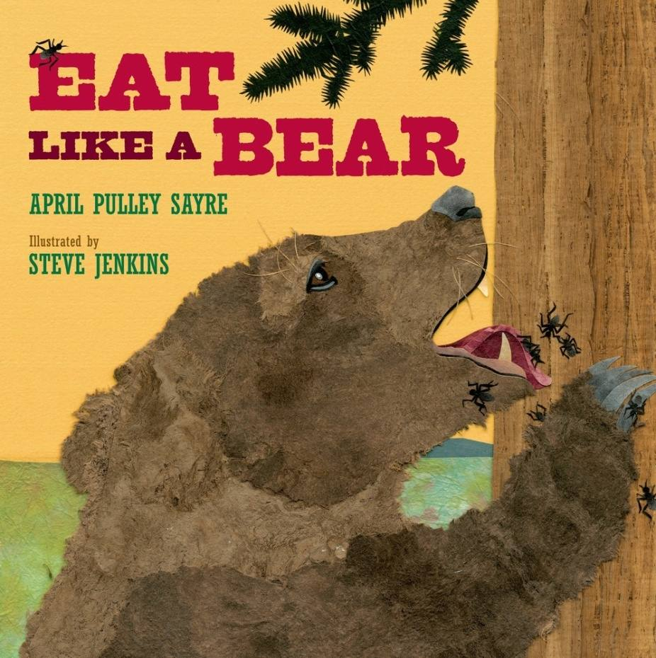

**Eat Like a Bear April Sayre**

Can you eat like a bear?

A sleepy bear awakes in spring and goes to find food. But what is there
to eat in April? In May? Follow along and eat like a bear throughout the
year: fish from a stream, ants from a tree, and delicious huckleberries
from a bush. Fill up your belly and prepare for the long winter ahead,
when you\'ll snuggle into your warm den and snore like a bear once
again.

\"The lilting text hovers between poetry and prose, avoiding metrically
structured lines but drawing on gentle internal and end rhymes and
repetition to provide shape and rhythm. The present tense second person
(second bear?) narration is swift and conversational . . .\" -Starred
Review, BCCB

**Eat Like a Bear**

Synopsis

The book follows a grizzly bear's eating habits throughout the year. It
starts in spring asking a question that is repeated throughout the
story, "Find food. But where?" The bear finds a variety of food from
bison to berries. She uses different techniques to hunt or gather each
of the different food types. As the book comes to an end the bear is
preparing for the snow and to live through winter.

Read Aloud:

Read aloud the entire book with minimal interruptions. Stop to provide
word meanings or clarify only when you know the majority of your
students will be confused.

The goal here is for students to enjoy the book, both writing and
pictures, and to experience it as a whole. This will give them some
context and sense of completion before they dive into examining the
parts of the book more carefully.

+------------------------------+----------------------------------------+
| **SECOND READING:**          | The bear is looking for trout and      |
|                              | berries. The author says,              |
| **Read page 3**              |                                        |
|                              | "None about. Bushes? Bare. No berries  |
| What two things is the bear  | there."                                |
| looking for near the stream? |                                        |
| How do we know both of those | bear: an animal                        |
| things are not there?        |                                        |
|                              | bare: not covered                      |
| We hear the word "bear"      |                                        |
| twice, but it is spelled     | Four months ago in fall                |
| differently and has          |                                        |
| different meanings. What are | In the ground                          |
| the two meanings of          |                                        |
| "bear/bare"?                 | It is the end of winter. There is      |
|                              | still snow on the ground. The snow is  |
| When was the last time the   | gone, plants are blooming, and the     |
| bear had food?               | bear is eating plants.                 |
|                              |                                        |
| **Read page 4&5**            | The bear will go find more food.       |
|                              |                                        |
| Where did the bear find the  | Scratch, shuffle, dig, paw, claw,      |
| bison?                       | pull, find, chew, and lick.            |
|                              |                                        |
| What weather conditions are  | If there are actions you still believe |
| preventing the bear from     | the students are unsure of act them    |
| finding food?                | out as a class.                        |
|                              |                                        |
| **Reread and draw attention  | The elk calf has strayed from the      |
| to the illustrations on      | herd. The calf doesn't have any        |
| pages 6&7**                  | protection.                            |
|                              |                                        |
| Using the illustrations,     | No, the bear was left behind.          |
| list at least 2 differences  |                                        |
| from the previous pages.     | No, it was not easy for the bear to    |
|                              | catch. The fish thrashes and bashes    |
| **Page 7**                   | while the bear catches it.             |
|                              |                                        |
| What can we infer the bear   | The author says the bear tilts her     |
| will do when the author      | head and uses her ears.                |
| says,                        |                                        |
|                              | The bear is getting ready for winter.  |
| "Their yellow fluff is not   | She is choosing a site, gathering      |
| enough".                     | branches and leaves, and hollowing out |
|                              | a den. She                             |
| **Pages 8&9**                |                                        |
|                              | **Living creatures:** frozen Bison,    |
| The bear uses many movements | ground squirrel, trout, ants, cutworm  |
| to find food. With a         | moths                                  |
| partner, name and act out 2  |                                        |
| movements on pages 8&9.      | **Plants:** horsetails, sedges,        |
|                              | parsnips stems, dandelions, roots,     |
| **Pages 10&11**              | huckleberries, pinecone                |
|                              |                                        |
| What has the elk calf done   | The bear is getting ready for winter.  |
| that has made it easier for  | She is choosing a site, gathering      |
| the bear to hunt?            | branches and leaves, and hollowing out |
|                              | a den. She has eaten throughout the    |
| **Page 12**                  | seasons, spring, summer, and fall.     |
|                              |                                        |
| On page 11 the bear was      | The bear needed to get fat to help her |
| chasing the elk calf. Was    | live through winter.                   |
| the bear successful with the |                                        |
| hunt?                        |   ------------------------------------ |
|                              |   Pages   When   Where   How    What   |
| **Page 14**                  |   ------- ------ ------- ------ ------ |
|                              |                                        |
| Was the fish easy for the    |                                        |
| bear to catch? What words    |   ------------------------------------ |
| does the author use to help  |                                        |
| us understand this was a     |                                        |
| challenging task?            |                                        |
|                              |                                        |
| **Page 15&16**               |                                        |
|                              |                                        |
| On page 15 the bear unearths |                                        |
| roots. This means she digs   |                                        |
| away the earth to find and   |                                        |
| eat roots. On page 16 she    |                                        |
| finds something different in |                                        |
| the ground. How did she know |                                        |
| there was something in the   |                                        |
| ground?                      |                                        |
|                              |                                        |
| Have students pretend they   |                                        |
| are listening for something  |                                        |
| in the ground. Ask them what |                                        |
| they did?                    |                                        |
|                              |                                        |
| Ask students to identify the |                                        |
| words used to describe how   |                                        |
| the bear listened for the    |                                        |
| ground squirrel.             |                                        |
|                              |                                        |
| **Activity- Small group      |                                        |
| Picture sort**               |                                        |
|                              |                                        |
| After reading page 21        |                                        |
| explain the sorting          |                                        |
| activity. Students will sort |                                        |
| the types of food the bear   |                                        |
| has eaten. Introduce the     |                                        |
| food choices and two         |                                        |
| categories. Have students    |                                        |
| work in small groups of 4-5. |                                        |
| After activity discuss       |                                        |
| choices whole group.         |                                        |
|                              |                                        |
| Categories:                  |                                        |
|                              |                                        |
| Creatures and Plants         |                                        |
|                              |                                        |
| Page 23                      |                                        |
|                              |                                        |
| Preparing means getting      |                                        |
| ready for something. What is |                                        |
| the bear getting ready for?  |                                        |
| How has she prepared?        |                                        |
|                              |                                        |
| Why was it important for the |                                        |
| bear to eat from April       |                                        |
| through November?            |                                        |
|                              |                                        |
| THIRD READ:                  |                                        |
|                              |                                        |
| During the third read create |                                        |
| a chart with headings that   |                                        |
| include, when, where, how,   |                                        |
| and what. Stop throughout    |                                        |
| the reading to fill in chart |                                        |
| (Ex. When --April, Where-    |                                        |
| melting snow, How- dug,      |                                        |
| What- frozen bison).         |                                        |
| Continue this process        |                                        |
| throughout the entire book.  |                                        |
+==============================+========================================+

+---------------------------------------------------------------------+
| *SAMPLE OF RELATED WORDS GATHERED FROM THE TEXT- linking these with |
| each other and the bear's main activities will help students to     |
| understand and remember them. Include familiar words to anchor each |
| set.*                                                               |
|                                                                     |
| What words does the author use to describe what the bear DOES?      |
| (verbs)                                                             |
+==============+==============+==============+========================+
| Verbs or     | Verbs about  | Verbs about  | Verbs about            |
| "Action      | Foraging     | Eating       | Hibernating            |
| Words" about |              |              |                        |
|              |              |              |                        |
| Hunting      |              |              |                        |
+--------------+--------------+--------------+------------------------+
| chase        | dig          | eat          | prepare                |
|              |              |              |                        |
| bounding     | find         | clip         | gather                 |
|              |              |              |                        |
| race         | paw          | snip         | hollow                 |
|              |              |              |                        |
| bashes       | claw         | gnaw         | winter (over)          |
|              |              |              |                        |
| thrashes     | pull         | chomp        | settle                 |
|              |              |              |                        |
| follow       | tear         | rake         | cuddle                 |
|              |              |              |                        |
| wade         | scratch      | nibble       | curl                   |
|              |              |              |                        |
|              | scan         | shred        |                        |
|              |              |              |                        |
|              | shuffle      | crunch       |                        |
|              |              |              |                        |
|              | pause        | thrash       |                        |
|              |              |              |                        |
|              | check        | chew         |                        |
|              |              |              |                        |
|              | unearth      | swallow      |                        |
|              |              |              |                        |
|              | grab         | crunch       |                        |
|              |              |              |                        |
|              |              | mash         |                        |
+--------------+--------------+--------------+------------------------+

**Eat Like a Bear April Sayre**

Can you eat like a bear?

Awake in April. Find food.

But where?

Drink like a bear -- from a stream.

Leaping trout? None about.

Bushes? Bare. No berries there.

It's been four long months since fall,

when you were full.

Search the melting snows.

What barely shows?

Horsetails! Clip and snip. Eat sandy stems.

Dig in. Dig down.

Paw and claw and pull,

Find \...

\... a hide,

a starving bison that died in winter's cold.

Gnaw the frozen meat from its bones.

Can you search like a bear?

It's May. Find food.

But where?

Tear at sedges.

Chomp cow parsnip stems.

Eat dandelions.

Their yellow fluff

is not enough.

Sniff the air.

What smells?

A spruce, a slug, an early skunk.

Can you scratch like a bear? Find a tree.

Shuffle. Pause.

With long, strong claws,

dig in. Dig down.

Paw and claw and pull.

Find \...

\... ants!

Chew them,

sour and squirming.

Lick your lips.

Can you hunt like a bear?

It's June. Find food.

But where?

An elk calf has strayed from its herd.

Press paws. Give chase! Body bounding, race!

Find \...

\... you are left behind.

Hunting's over. Time for clover \...

and for meeting another bear.

Can you bathe like a bear?

Ospreys and eagles

fight mid-air.

A cold stream awaits.

Wade in. Wade down.

Paw and claw and splash!

Find \...

\... a fish.

It thrashes. It bashes.

Swallow firm, fresh trout.

Can you forage like a bear?

It's July. Find food.

But where?

Search mountain meadows. Unearth roots.

Crisp, they crack.

A brown bear snack.

Wait. What was that?

Tilt your head.

Use your ears.

Dig in. Dig down.

Paw and claw and pull!

Find \...

\... a ground squirrel.

Grab and crunch

a meaty lunch.

Settle and snooze

as bumblebees buzz past.

Can you climb like a bear?

It's August. Find food.

But where?

Check the talus slopes.

Dig in. Dig down.

Paw and claw and flip!

Rocks tumble,

crumble,

crash and bounce!

Find \...

\... cutworm moths.

Mash them in your mouth.

Can you gather like a bear?

It's September. Find food.

But where?

Look for colours.

Is it time?

Are they ripe?

Scan up. Scan down.

Paw and claw and pull.

Find \...

\... huckleberries.

Rake them with

your teeth.

Purple your snout.

Can you eat like a bear?

It's October. Find food.

But where?

Follow tiny tracks.

Dig in. Dig down.

Paw and claw and pull.

Find \...

\... a squirrel's pinecone stash.

Nibble, shred, crunch, and smash.

Can you prepare like a bear?

Choose a site.

Here? Or there?

Gather branches and leaves.

Dig in. Dig down.

Paw and claw and pull.

Hollow out a den --

the home you need.

Can you winter like a bear?

It's November.

The fat you wear

will help you live through winter.

Snows will come.

Settle in. Settle down.

Paw and cuddle and curl.

Find \...

\... midwinter, you have

two more mouths to feed.

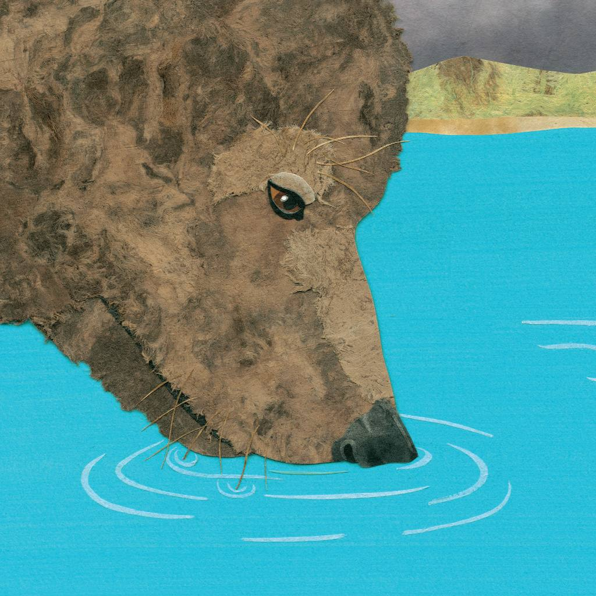

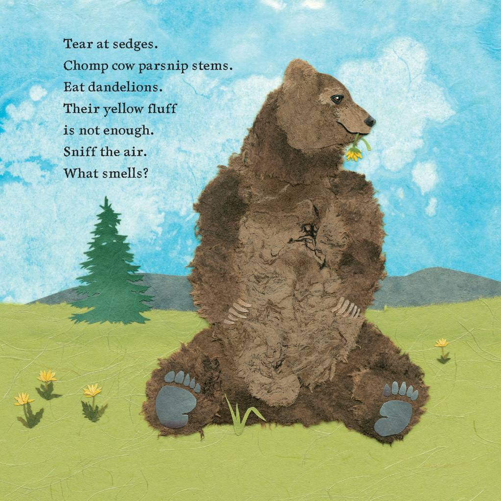

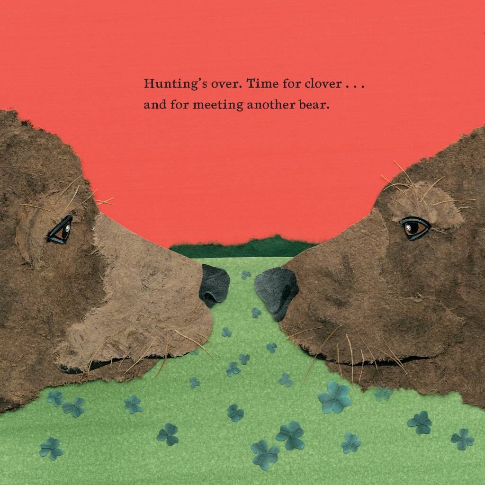

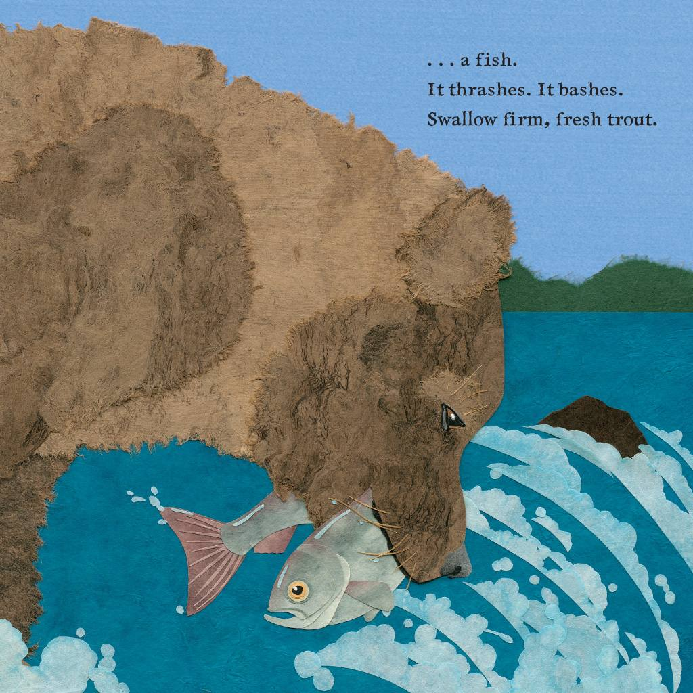

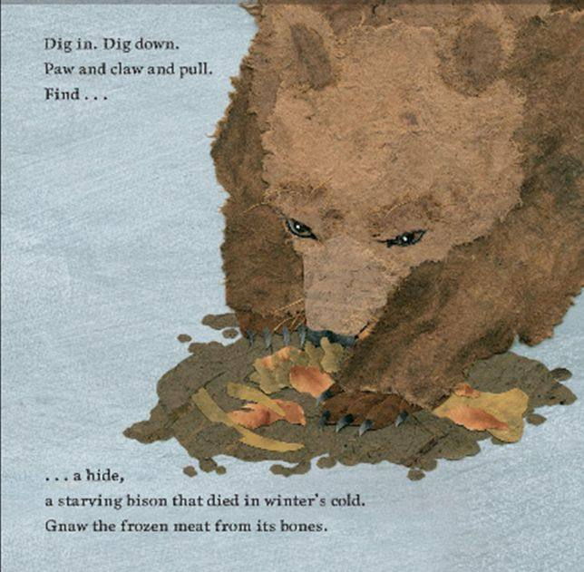

**\**

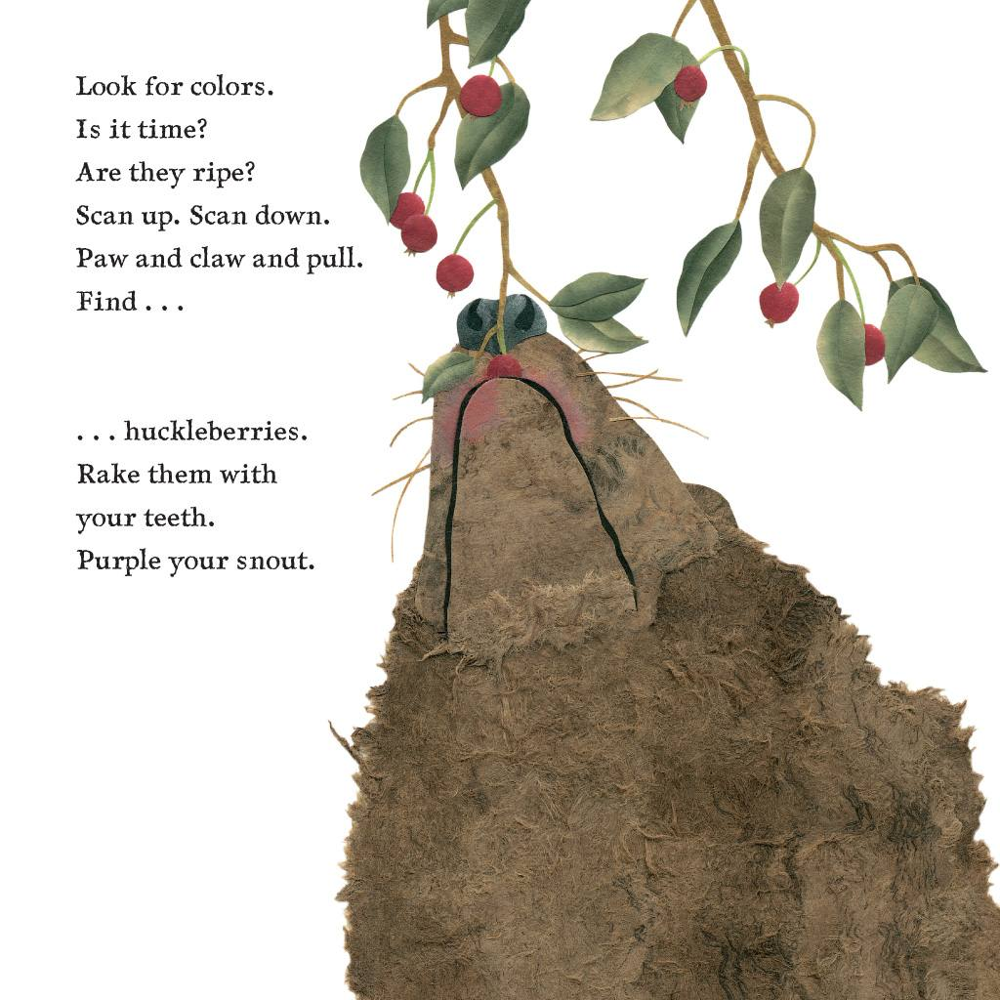

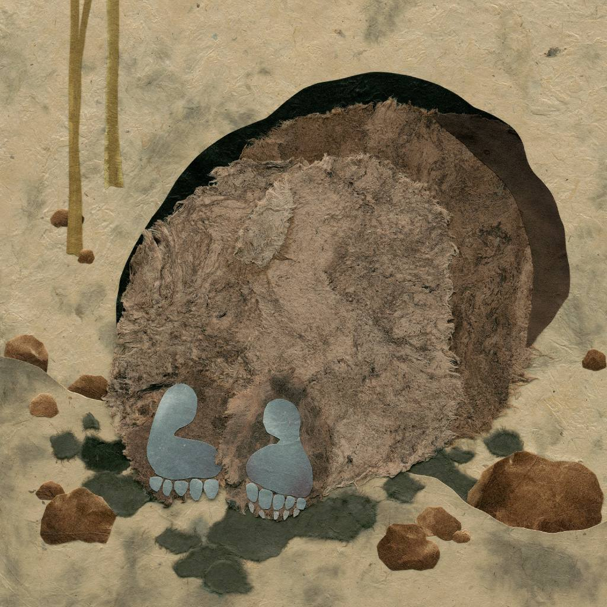

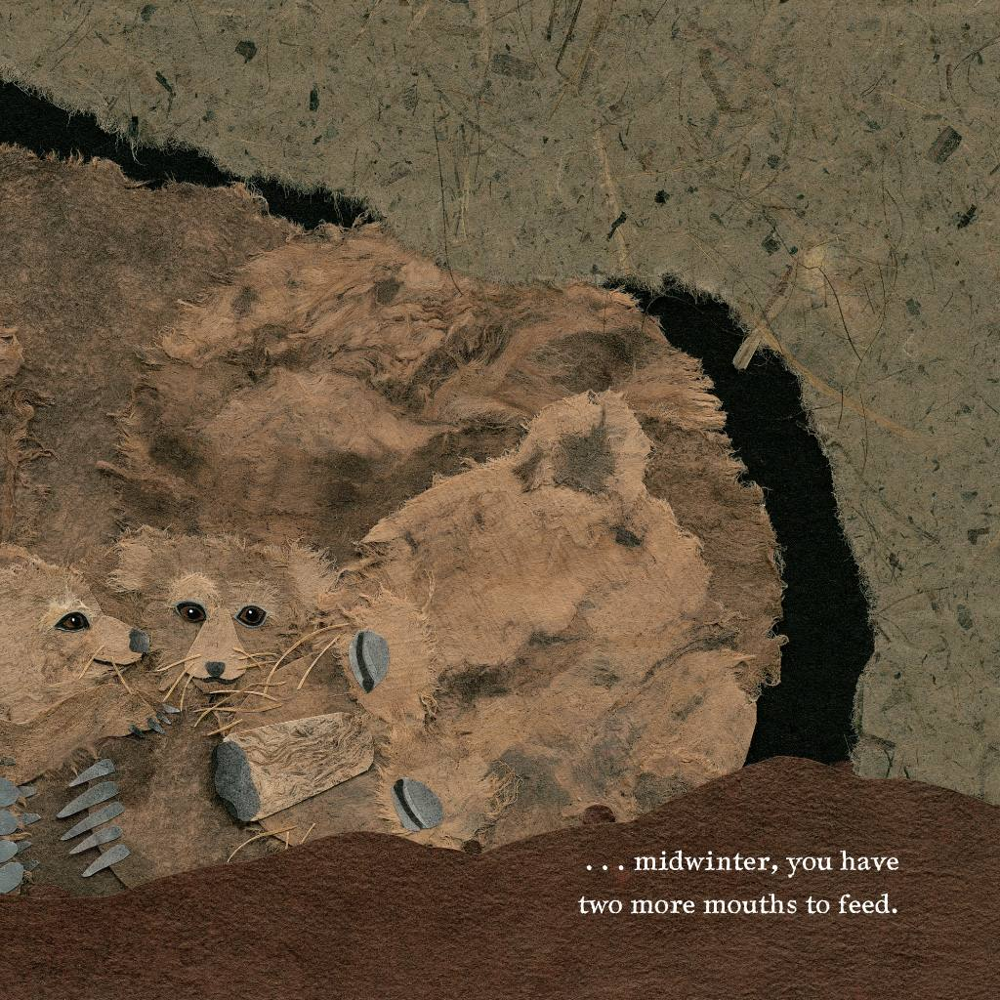

**About Me**

April Pulley Sayre is an award-winning children's book author of over 55
natural history books for children and adults. Her read-aloud nonfiction
books, known for their lyricism and scientific precision, have been
translated into French, Dutch, Japanese, and Korean. She is best known
for pioneering literary ways to immerse young readers in natural events
via creative storytelling and unusual perspectives.

In 2008 Sayre accepted the Theodor "Seuss" Geisel Honour Award given by
the American Library Association for her book, Vulture View. It was also
named a finalist for the 2008 AAAS/Subaru SB&F Prize for Excellence in
Science Books.

Stars Beneath Your Bed: The Surprising Story of Dust, won the 2006
AAAS/Subaru SB&F Prize for Excellence in Science Books and was named an
2006 ALA Notable Children's Book. One Is a Snail, Ten Is a Crab was a
2004 ALA Notable Children's Book, a 2003 Bulletin of the Centre for
Children's Books Blue Ribbon Book, and received Britain's highest
literacy award. Dig, Wait, Listen: A Desert Toad's Tale received a
Riverbank Review Children's Book of Distinction, 2001 ALA Booklist
Editors' Choice, and starred reviews. The Bumblebee Queen marked her
third win of the John Burroughs Award.

Sayre has followed lemurs in Madagascar, pursued army ants in Panama,
and eaten piranha in the Peruvian Amazon. She and her husband, native
plants expert Jeff Sayre, love science and adventure.

Sayre is an expert speaker in the fields of writing, science education,
children's literature, and wildlife gardening. Each year she speaks to
over 15,000 students nationwide, introducing them to the writing
process, the joy of words, the diversity of rain forests, and wacky
things scientists do to find, follow, and study animals. Sayre writes
in-depth about scientists in books such as Secrets of Sound: Studying
the Calls and Songs of Whales, Elephants, and Birds, a starred
review/ALA Editor's choice book which was also honoured as one of the
all-time best children's books about the scientific process. Sayre holds
a B.A. in biology from Duke University and an M.F.A. in Creative Writing
from Vermont College.

**The Iridescence of Birds** **: A Book About Henri Matisse**

**Patricia MacLachlan**

As a young boy, Henri lived in a grey mill town in northern France.
Although there was little colour outside his home, his mother made sure
that the inside was ablaze with colour. She covered the hard-packed
earthen floor with red rugs and painted colourful plates to hang on the
walls. And she let Henri help. He mixed her paints, and made fruit and
flowers arrangements. When Henri admired the shimmering feathers of the
pigeons he raised, his mother called the effect, "iridescence." From
this colourful, supportive background, the great artist, Henri Matisse,
emerged.

The simple, clear text is told in the second person, which is
under-utilised in children's books but has great, almost magical, appeal
for the young, such as: "And she let you arrange the fruit and flowers
she brought from the market."

With the text running across the bottom of beautifully designed
double-pages spreads, a smiling, appealing Henri is stylistically
depicted throughout the book within broad grey outlines. Sometimes the
young Henri pensively stares into the future at the adult artist. His
pigeons have no outlines, which would have detracted from their implied
iridescence. The lovely muted colours of the relief printed
illustrations, predominately blues and greens, are enhanced by the
quality of the paper and printing.

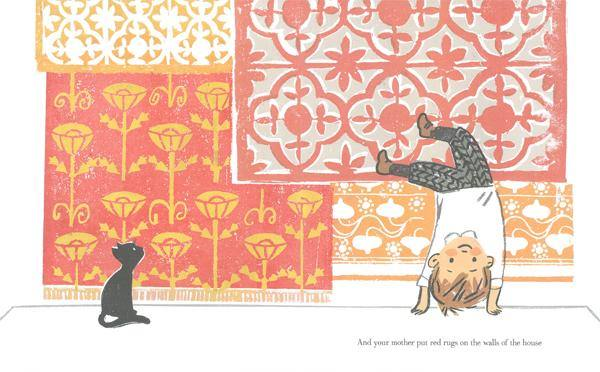

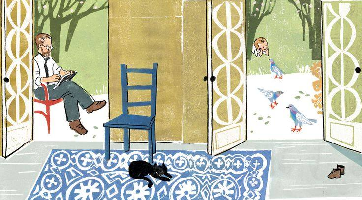

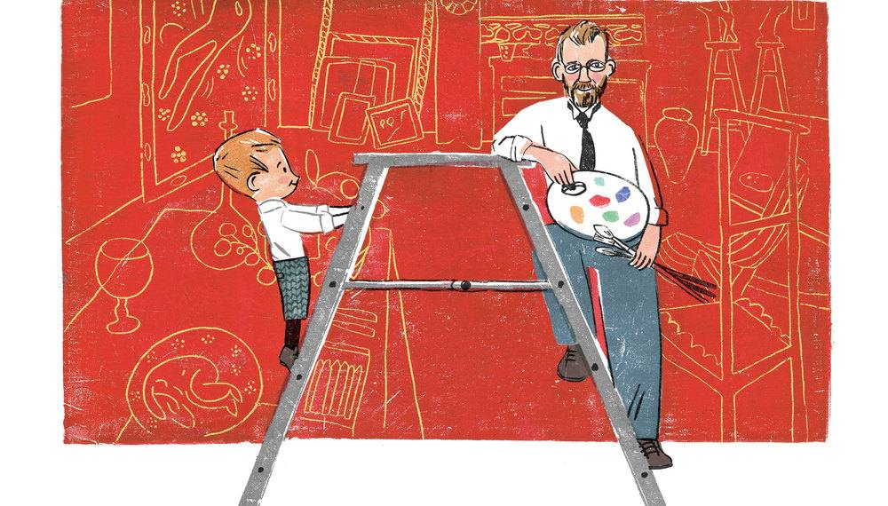

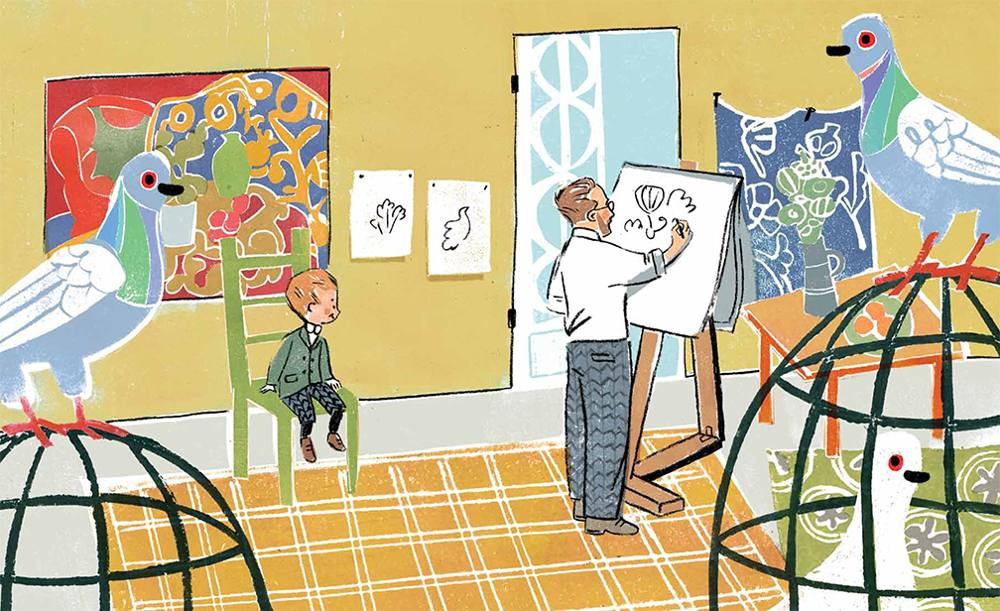

[**The Nature and Nurture of Genius: The Sweet Illustrated Story of How
Henri Matisse's Childhood Shaped His Creative
Legacy**](http://www.brainpickings.org/2015/02/10/the-iridescence-of-birds-henri-matisse/)

**by [Maria Popova](http://www.brainpickings.org/author/mpopova/)**

> *A heartening testament to the nourishing power of parental love in
> the cultivation of greatness.*

[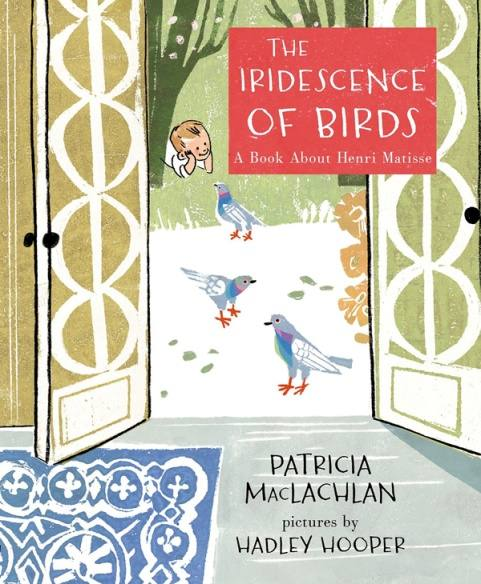](http://www.amazon.com/exec/obidos/ASIN/1596439483/braipick-20)At
8PM on the last day of 1869, a little boy named Henri entered the world
in a grey textile-mill town in the north of France, in a rundown
two-room cottage with a leaky roof. He didn't have much materially, but
he was blessed with perhaps the greatest gift a child could have --- an
unconditionally loving, relentlessly supportive mother. Like many
creative icons whose destinies were [shaped by the unflinching
encouragement of loved
ones](http://www.brainpickings.org/2014/10/22/who-what-when-rothman-book/),
little Henri became the great **Henri Matisse** thanks to his mother's
staunch support, which began with an unusual ignition spark: At the age
of twenty, Henri was hospitalised for appendicitis and his mother
brought him a set of art supplies with which to occupy his
recovery. *"From the moment I held the box of colours in my
hands,"*Matisse [recounted](http://www.amazon.com/exec/obidos/ASIN/0375711333/braipick-20), *"I
knew this was my life. I threw myself into it like a beast that plunges
towards the thing it loves."* And that thing flowed from love, too ---
it was Matisse's mother who encouraged her son, like E.E.
Cummings [encouraged all aspiring
artists](http://www.brainpickings.org/2015/02/09/e-e-cummings-miscellany-agony-of-the-artist),
to disregard the formal rules of art and instead paint from the
heart. *"My mother loved everything I
did,"* he [asserted](http://www.amazon.com/exec/obidos/ASIN/0375711333/braipick-20).
Decades later, thanks to [Gertrude Stein's
patronage](http://www.brainpickings.org/2015/02/03/gertrude-stein-ada-nobrow-atak/),
which catalysed his career and sparked [his friendship with
Picasso](http://www.brainpickings.org/2014/06/24/picasso-brassai-ideas-creativity/),
the world too would come to love what Matisse did.

**The Iridescence of Birds Patricia MacLachlan**

If you were a boy named Henri Matisse who lived in a dreary town in
northern France where the skies were grey

And the days were cold

And you wanted colour and light

And sun,

And your mother, to brighten your days,

Painted plates to hang on the walls

With pictures of meadows and trees,

Rivers and birds,

And she let you mix the colours of paint --

Yellow and red,

Red and blue,

Blue and yellow --

And let you arrange the fruit and flowers

She brought from the market --

Pears and oranges in a bowl

On a tablecloth,

And flowers in a blue vase --

And in the town people wove silks

With colours

All tangled,

One colour

Next to the other

Next to the other,

And your mother put red rugs on the walls of the house

And on the dirt parlour floor

So all the world looked red,

And you raised pigeons,

Watching their sharp eyes

And red feet,

And their colours that changed with the light

As they moved

That your mother called iridescence,

Would it be a surprise that you

grew up to be a fine painter

Who painted red rooms

And flowers that danced on green stems

And fruit in a bowl

On a blue and white tablecloth?

Would it be a surprise that you became

A fine painter who painted

Light

and

Movement

And the iridescence of birds?

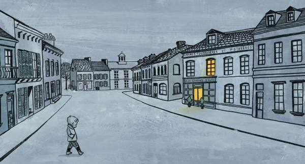

In [***The Iridescence of Birds: A Book About Henri
Matisse***](http://www.amazon.com/exec/obidos/ASIN/1596439483/braipick-20) 
writer **Patricia MacLachlan** and illustrator [Hadley
Hooper](http://www.hadleyhooper.com/) tell the heartening story of young
Henri's childhood and how it shaped his artistic path long before he
began painting --- how his mother, in an attempt to brighten the drab
and sunless days, put bright red rugs on the floors and painted
colourful plates to hang on the walls, letting little Henri mix the
paints; how his father gave him pigeons, whose iridescent plumage the
boy observed with endless fascination; how the beautiful silks woven by
the townspeople beguiled him with their bright patterns.

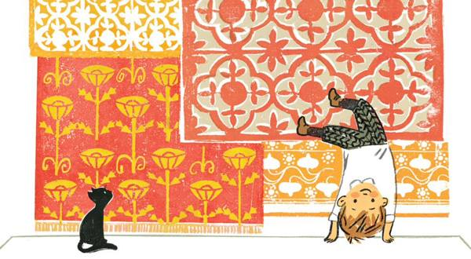

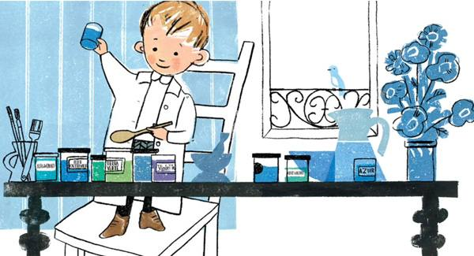

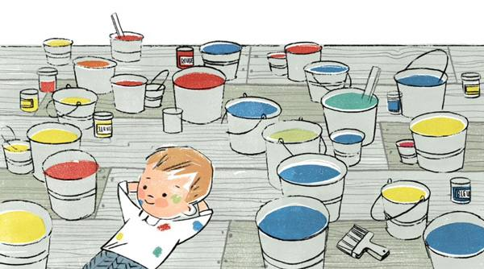

With a gentle sidewise gleam, the story offers a nuanced answer to the
eternal nature-versus-nurture question of whether genius is born or
made. Embedded in it is a wonderful testament to the idea
that [attentive presence rather than praise is the key to great
parenting](http://www.brainpickings.org/2013/05/23/stephen-grosz-examined-life/),
especially when it comes to nurturing young talent. (Indeed, such
maternal presence is what legendary editor Ursula Nordstrom provided for
many of the young authors and artists --- including, [most
notably](http://www.brainpickings.org/2013/06/10/ursula-nordstrom-letter-maurice-sendak/),
Maurice Sendak --- whom she nurtured over the course of her reign
as [the twentieth century's greatest patron
saint](http://www.brainpickings.org/2015/02/02/ursula-nordstrom-letters-integrity/) of
children's books.)

For a delightful touch of empathy via a twist of perspective, MacLachlan
places the reader in little Henri's shoes:

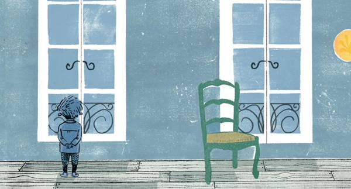

If you were a boy named Henri Matisse who lived in a dreary town in
northern France where the skies were grey

And the days were cold

And you wanted colour and light

And sun,

And your mother, to brighten your days,

Painted plates to hang on the walls

With pictures of meadows and trees,

Rivers and birds,

And she let you mix the colours of paint...

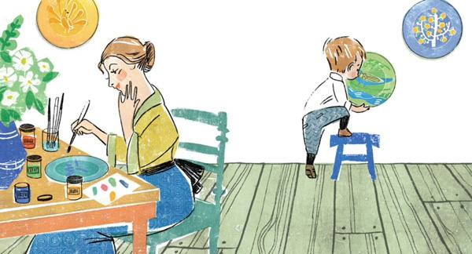

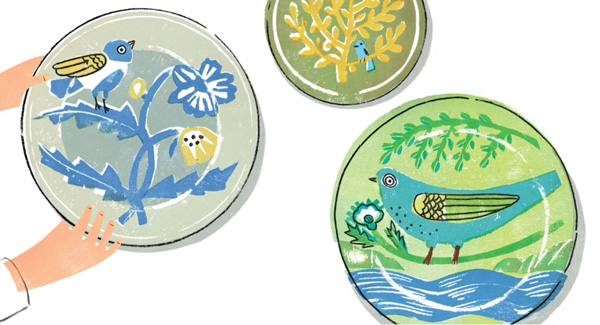

... And you raised Pigeons

Watching their sharp eyes\
And red feet,

And their colours that changed with the light\
As they moved...

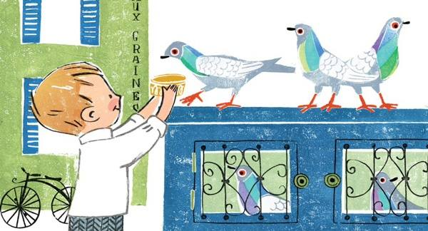

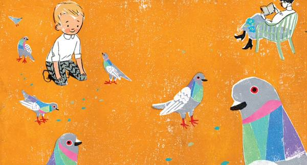

... Would it be a surprise that you became\
A fine painter who painted\
Light\
and\
Movement

And the iridescence of birds?

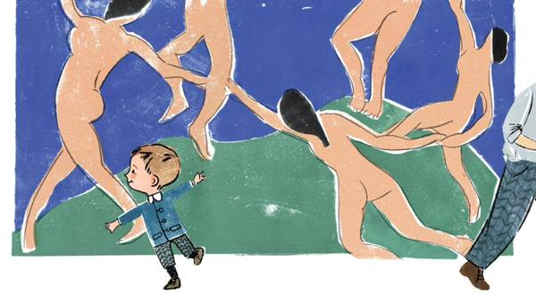

Beneath the biographical particulars of the story itself is MacLachlan's
larger inquiry into the enduring question of whether artists draw what
they see or what they feel and remember --- Matisse's life, she writes
in the afterword, attests to the fact that the two are inextricably
entwined: *"He painted his feelings and he painted his childhood."*

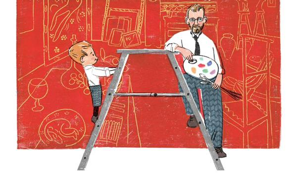

Hooper's illustrations are themselves a masterwork of artistry,
scholarship, and creative ingenuity. She spent considerable time
studying Matisse's sensibility and colours in reproductions of his
drawings, cut-outs, and paintings, then researched textile patterns from
the era of his childhood and even used Google Maps to picture the actual
streets that he walked as a little boy. The result is not imitation but
dimensional celebration. Hooper reflects on the unusual and inventive
technique she chose:

I decided to try relief printing, which forced me to simplify my shapes
and allowed me to focus on the colour and composition. I cut the
characters and backgrounds out of stiff foam and cardboard, inked them
up, made prints, and scanned the results into Photoshop. The approach
felt right.

[***The Iridescence of
Birds***](http://www.amazon.com/exec/obidos/ASIN/1596439483/braipick-20) is
absolutely wonderful, in a way to which the screen does a great
injustice. Complement it with other excellent picture-book biographies
of luminaries, including those of [Jane
Goodall](http://www.brainpickings.org/2015/01/19/me-jane-patrick-mcdonnell/), [Henri
Rousseau](http://www.brainpickings.org/2014/12/09/the-fantastic-jungles-of-henri-rousseau/),[Pablo
Neruda](http://www.brainpickings.org/2014/11/04/pablo-neruda-poet-of-the-people-book/), [Julia
Child](http://www.brainpickings.org/2013/08/15/bon-appetit-julia-child-jessie-hartland/), [Albert
Einstein](http://www.brainpickings.org/2013/12/30/on-a-beam-of-light-albert-einstein-radunsky/),
and [Maria
Merian](http://www.brainpickings.org/2014/11/25/summer-birds-maria-merian-butterflies/).

What kind of manuscript would a publisher not want from you?

Well, I wrote a picture book on Henri Matisse. I wanted to do it in one
long sentence, but I couldn't. Anyway, I called it The Iridescence of
Birds because Matisse's father gave him pigeons and he liked the
iridescence of their feathers. It was very dreary where he grew up. In
his home, his mother put red rugs on the dirt floors and on the walls so
it was beautiful and colourful. She brought in fruit and flowers. He
didn't paint until he was 19, but those were the things he grew up with
and later became his themes. He said his mother loved everything he ever
painted; I just thought that was interesting.

I was at a conference in California when I saw a favourite editor---not
one of mine; one I'd like to work with. I asked what he talked about in
his session, and he said that he had talked about what he buys and why
he buys it. He asked what I talked about. I told him that I read all my
stuff that doesn't work and won't sell. He asked what I meant, and I
told him about my picture book on Matisse. I said that nobody wants a
book on Matisse. And he leaned forward and said, "I do."

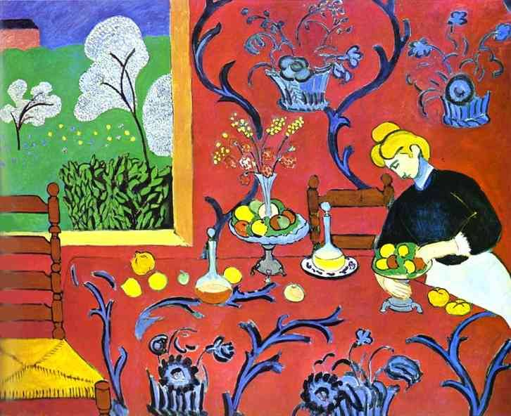

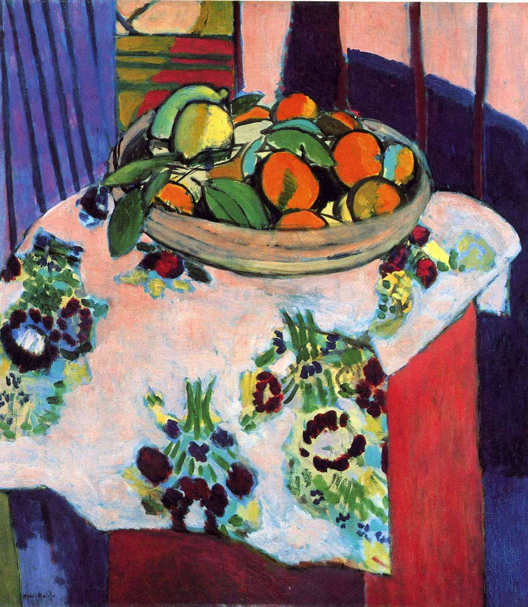

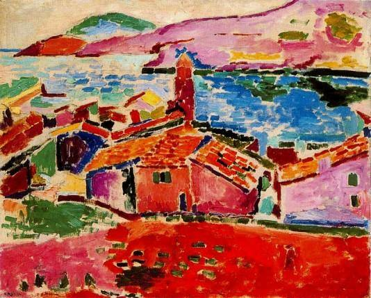

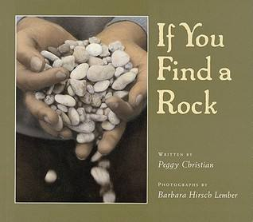

Think of all the rocks there are: the skipping rocks, the splashing
rocks, and the chalk rocks. Whether the found treasures are climbing
rocks or wishing rocks, children can\'t help collecting them. With
joyful text and luminous photographs, If You Find a Rock celebrates
rocks everywhere\--as well as the mysterious and wonderful places they
are found.

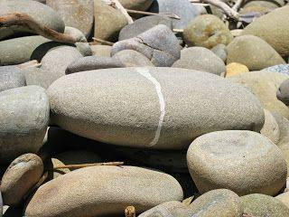

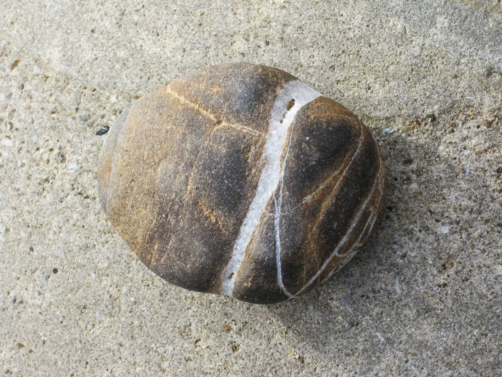

If You Find a Rock Peggy Christian

If you find a rock, with your finger -

a nice flat, rounded rock it must circle all the way.

that sits just right You have

in the crook of your finger, a wishing rock,

then you have and you whisper

a skipping rock. what you want

You toss it out before you throw it.

in the water just so

and see it trip If you find a rock -

across the surface, a big rock -

making a chain by the edge of the water,

of spreading rings. then you have found

a splashing rock.

Maybe you find When it hits the surface,

a soft white rock -- the water jumps

a rock that feels dusty out of the way,

in your fingers. raining back down

Then you have on your outstretched hands.

a chalk rock, The bigger the rock,

and you use it the wetter you get.

to make pictures

on the pavement. Maybe you find

a pile of small,

Or you might find rounded pebbles.

a big mossy rock Then you have found

by the side of sifting rocks,

a long, steep trail. and you can scoop up

Then you have a handful

a resting rock, and let them slide

and as you sit down slowly through

you feel your fingers.

the cool moss

squash beneath you.

Then again,

you might find a rock

with a stripe running

all the way round it.

Trace the line

Or you might find a rock Then you have found

whose water-smoothed surface crossing rocks,

catches your eye. which wait

If it feels easy to meet your feet

in your hand as you pass over

when you rub it, the water rushing away

then you have found all around you.

a worry rock.

You rub it between Or you might find

your fingers a rock with a print

and your troubles of something else -

are smoothed away. a leaf or a shell.

Then you have found

Then again, a fossil rock,

you might find a rock and you feel

sitting in a grassy field. the shape of something

Push it over. that lived long, long ago

You have found when the rock was young.

a hiding rock, and

in the cool, dark Then again,

underside live you could find

all kinds of things a small, rounded rock

that creep and crawl and hide right in front

out of sight. of your toe

as you go down

If you find a rock -- the sidewalk.

a great rock -- You have found

that towers over you, a walking rock,

then you have found and you kick it

a climbing rock. ahead of you

Hold on with your toes and fingers, and let it

grip hard as you lead you home.

stretch up and pull

until you reach the top,

where you feel

much grander than you did

on the ground.

Maybe you will find

a twisting line of rocks

sticking up out of a creek.

If you find a rock --

a rock that's not

a skipping rock,

or a chalk rock,

or a resting rock,

or a wishing rock --

that's not

a splashing rock,

or a sifting rock,

or a worry rock,

or a hiding rock --

that's not even

a climbing rock,

or a crossing rock,

or a fossil rock,

or a walking rock,

but you like it anyway,

because it reminds you

of a place,

or a feeling,

or someone important --

then you have found

a memory rock,

and sometimes

those are the best

rocks of all.

If You Find a Rock

If you find a rock

With a stripe

Running right through

The middle,

All the way round;

You have found

A wishing rock.

Run your finger

Around the ring

And make

A precious wish.

You might

Find a rock

Cracked open,

With a beautiful centre

Making patterns

Of different colors.

You have found a thunderbird.

Cut the rock open

Very carefully,

And stare

At the beautiful patterns

Inside.

Then again,

You might find a rock

As flat as a pancake,

And as smooth

As your face.

You have found

A skipping rock.

Pick the rock up

And throw it

Across the river.

Watch it

Make rings

In the water.

But.

In my opinion,

I think a rock

That reminds you

Of a special time

Is the best rock of all...

A memory rock.

Hold it in your hand

Tightly,

And,

Cast your memory

Into the rock.

Alana Meehan Gr 5. Wembley

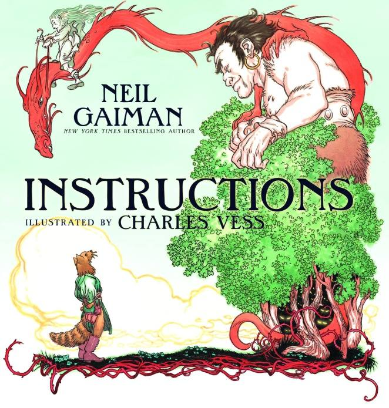

**Instructions Neil Gaiman**

This is a magical poetic guide for any child who has dreamed of
travelling into fairyland. Although one might encounter dangers there,
they are not serious, especially if you follow the simple instructions.

The illustrations by Charles Vess evoke the settings of fairy tales
past, with recognizable characters and settings.

The words by Gaiman harken back to A.A. Milne and Lewis Carroll, both of
whom also issued exhortations to help children avoid getting eaten by
bears and such. Gaiman advises:

*Remember your name.\
Do not lose hope -- what you seek will be found.\
Trust ghosts.\
Trust those that you have helped to help you in their turn.\
Trust dreams.\
Trust your heart, and trust your story.\
Do not forget your manners.\
Do not look back.\
Ride the wise eagle (you shall not fall).\
Ride the silver fish (you will not drown)."*

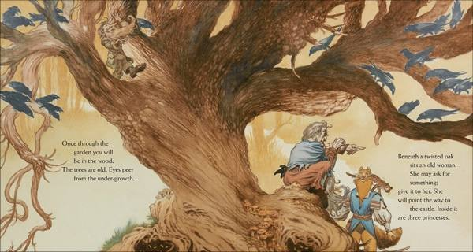

**Discussion:** Gaiman's instructions are a bit more mystical than A.A.
Milne's, but still, I think you can see the parallels in [[this
excerpt]{.underline}](http://www.winniethepooh.co.uk/storiesandpoems.html) from
the poem "Lines and Squares":

*Whenever I walk in a London street,\
I'm ever so careful to watch my feet;\
And I keep in the squares,\
And the masses of bears,\
Who wait at the corners all ready to eat\
The sillies who tread on the lines of the street,\
Go back to their lairs,\
And I say to them, "Bears,\
just look how I'm walking in all the squares!"*

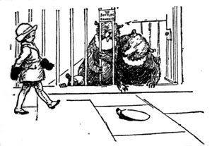

Similarly, Gaiman's words remind me of the wonderful exhortations by
Lewis Carroll in "[[Rules and
Regulations]{.underline}](http://www.poemhunter.com/poem/rules-and-regulations/),"
as is shown in this excerpt:

*Drink tea, not coffee;
\
Never eat toffy. 
\
Eat bread with butter. 
\
Once more, don't stutter. 

\
Don't waste your money, 
Abstain from honey. 
\
Shut doors behind you, 
(Don't slam them, mind you.) 
\
Drink beer, not porter. 
\
Don't enter the water 
Till to swim you are able. 
\
Sit close to the table. 
\
Take care of a candle. 
\
Shut a door by the handle, 
\
Don't push with your shoulder 
Until you are older. 
\
Lose not a button. 
\
Refuse cold mutton. 
\
Starve your canaries. 
\
Believe in fairies. 
\
If you are able, 
Don't have a stable 
With any mangers. 
\
Be rude to strangers."*





> Instructions from "Instructions"

**Evaluation:** If you have a child that dreams of other worlds, this
might prove to be the perfect little guidebook.

**"Instructions" Neil Gaiman**

Touch the wooden gate in the wall you never saw before,

Say 'please' before you open the latch,

go through,

walk down the path.

A red metal imp hangs from the green-painted front door,

as a knocker,

do not touch it; it will bite your fingers.

Walk through the house. Take nothing. Eat nothing.

However,

if any creature tells you that it hungers,

feed it.

If it tells you that it is dirty,

clean it.

If it cries to you that it hurts,

if you can,

ease its pain.

From the back garden you will be able to see the wild wood.

The deep well you walk past leads down to Winter's realm;

There is another land at the bottom of it.

If you turn around here,

you can walk back, safely;

you will lose no face. I will think no less of you.

Once through the garden you will be in the wood.

The trees are old. Eyes peer from the undergrowth.

Beneath a twisted oak sits an old woman. She may ask for something;

give it to her. She

will point the way to the castle. Inside it

are three princesses.

Do not trust the youngest. Walk on.

In the clearing beyond the castle the twelve months sit about a fire,

warming their feet, exchanging tales.

They may do favours for you, if you are polite.

You may pick strawberries in December's frost.

Trust the wolves, but do not tell them where you are going.

The river can be crossed by the ferry. The ferryman will take you.

(The answer to his question is this:

If he hands the oar to his passenger, he will be free to leave the boat.

Only tell him this from a safe distance.)

If an eagle gives you a feather, keep it safe.

Remember: that giants sleep too soundly; that

witches are often betrayed by their appetites;

dragons have one soft spot, somewhere, always;

hearts can be well hidden,

and you betray them with your tongue.

Do not be jealous of your sister:

know that diamonds and roses

are as uncomfortable when they tumble from one's lips as toads and
frogs:

colder, too, and sharper, and they cut.

Remember your name.

Do not lose hope -- what you seek will be found.

Trust ghosts. Trust those that you have helped to help you in their
turn.

Trust dreams.

Trust your heart, and trust your story.

When you come back, return the way you came.

Favours will be returned, debts be repaid.

Do not forget your manners.

Do not look back.

Ride the wise eagle (you shall not fall).

Ride the silver fish (you will not drown).

Ride the grey wolf (hold tightly to his fur).

There is a worm at the heart of the tower; that is why it will not
stand.

When you reach the little house, the place your journey started,

you will recognise it, although it will seem much smaller than you
remember.

Walk up the path, and through the garden gate you never saw before but
once.

And then go home. Or make a home.

Or rest.

**Review**

How many times can you use the word \'beautiful\' to describe a book?
Beautiful language, beautiful imagery, beautiful message, and beautiful
illustrations, all beautifully published into a gorgeous little package,
designed to delight!

There are several different levels at which you can experience
Instructions. On one plane it is just a simple tale, where you travel
into a new and fantastical land (and this is enough). Then, as is usual
with fables and fairy tales, the journey is a metaphor for our own
lives, encouraging us to follow our dreams and instructing us how we can
live our lives heroically. Instructions shows us how we can help others,
and how we can allow ourselves to be helped. Or how we can choose our
own paths - taking risks or choosing not to (and not be ashamed).

Beyond this? With discrete reference to many classical tales,
Instructions is also an introduction to a rich cultural heritage of
literature. An astute young reader might ask (for instance) \'What does
it mean by There is a worm at the heart of the tower; that is why it
will not stand\'? For those already in the

know, this same statement can only elicit pure delight as you realise
that there is a message inside the message, inside the message!

The illustrations, too, tell their own tale, adding to the lyrical text
with their own layer of story. Even without the text, these are a
pleasure to behold, containing their own history. Beautiful!

In the classroom Instructions could be used at all these levels.
Perhaps, though, it is enough to simply read it to the children. Read it
slowly, and savour every word, every page. Leave them to bask in the
warmth of the story and draw their own conclusions.

With an older group, it could be used to launch into a discussion of
metaphor and allegory. Able or interested students could research the
origins of some of the references, or analyse the importance of story.

Instructions is a story that you will want to read again and again, and
to which children will love listening, for so many reasons.

Cate Whittle, ACT

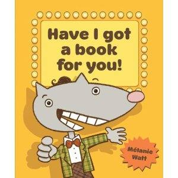

Meet Al Foxword, salesman, who has just the book for you. He will
present testimonials from some of his satisfied customers, including
Penguin who finally feels cool thanks to the Icebox 2000 Al sold him,
and Fish, who's life has been changed by the Aqua Umbrella, and then
tell you about his #1 bestseller. Forget storybooks that put you to
sleep such as Sleeping Beauty, and the dictionary, in Al's words, "a
book so boring even words can't describe it," what you need is Al's new
book, and he's prepared to make you an offer you can't refuse. After
all, Al likes you, and he likes the way that outfit you are wearing
brings out the colour of your eyes. If you buy his book in the next 10
seconds, he'll throw in a bookmark, and he's got lots of research that
shows customers who buy his book experience a dramatic increase in
happiness. The only thing better than buying a copy of Al's book is
buying two books, or, better yet, 742 of them, enough to build your very
own book fort! Step up and have a closer look, but remember, if you
break it, you buy it!

Written and illustrated by the incomparable Mélanie Watt, author of
Scaredy Squirrel and Chester, Have I got a book for you! is a sly and
funny poke at advertising, and celebrates a consumer item you simply
won't want to do without. After all, as Al will tell you, READING IS
SWELL! A terrific book for children from 4 to 144!

> FernFolio Editor

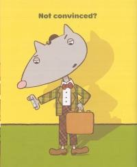

Pre-Reading:

• What does a salesperson do?

• What is a commercial? What is an ad?

• Explain that in this book, Al is trying to get us to buy the book, and
that you wanted them to pay close attention to HOW he tries to convince,
or trick us into doing that.

• YouTube has a number of videos on commercials that can be used to show
examples

During Reading:

• Stop often, questioning students to get them to look at the book
critically. Why is Al complimenting us? Why is he saying bad things
about other books? Why would this make us want to buy the book?

• Sequence the different types of tactics the fox uses to sell the book
such as

introducing it, complimenting the buyer, sharing the uses, offering
bonus items.

Post Reading:

• What makes an effective commercial/sales pitch (class discussion)

• Grade 1 & 2: In small groups students will create short skits trying
to to sell a product to the class

• The students can explore what an ad is, create

their own ad, be an ad detective.

Create a product e.g. cereal box,

**Have I Got a Book for You Melanie Watt**

Now that I have your attention, let me introduce myself.

+---------------------------------+
| **Mr AL FOXWORD**               |
|                                 |
| **SALESMAN**                    |
|                                 |
| **Tel.: (222) BUY-1 NOW Ext.4** |
|                                 |
| **CALL ME AL**                  |
+=================================+

I can sell anything!

See for yourself \...

**AL'S SATISFIED CUSTOMERS**

"AL's a genius! I'm finally cool thanks to the ICEBOX 2000 he sold me!"

- Penguin

"AL's the best! The AQUA UMBRELLA changed my life!"

- Fish

"AL rocks! Now I see the light with my DELUXE DIRT VACUUM!"

- Mole

We could go on and on.

But I know what you're thinking:

"Al, I don't need all this incredible stuff. I just need a GREAT BOOK!"

**WELL, THIS IS YOUR LUCKY DAY, MY FRIEND!!!**

Have I got a book for you!

My #1 BESTSELLER!

Say GOOD-BYE to boring books! You know the ones I'm talking about \...

Storybooks that put you to sleep!

Schoolbooks that add up to ZERO fun!

Cookbooks that leave a bad taste in your mouth!

And the dictionary -- a book so boring even words can't describe it!

Let me take a moment to compliment you.

The outfir you're wearing is simply breathtaking! It really brings out
the colour of your eyes!

Now, my friends, let's talk business.

I LIKE YOU. So I'll make you an offer you can't refuse.

If you buy my book in the next 10 seconds, I will throw in your very
own, top-of-the-line \...

**BOOK MARK!**

I know what you're thinking:

"AL, this is just TOO GOOD TO BE TRUE!"

Not convinced?

Research shows that 100% of my customers noticed a dramatic increase in
happiness after buying my book.

AMAZING transformation!!!

This small print is here to inform you that the frog above is a paid
professional actor. Results and smiles may vary.

And speaking of amazing.

The AMAZING AL (Licenced Fortune Teller)

"I see geat things in your future \... Something you truly desire \...
More precisely, something orange and rectangular.

You're still not convinced.

Okay, I admit it. I wasn't totally honest with you.

There is something WAY better than this book.

**2 BOOKS!!!**

"But AL, what are we going to do with not 1, but 2 of your awesome
books?"

Now that's an excellent question, little fellow!

Just use your second copy as a handy \...

gift for a loved one

unique hat

Hassle-free door stopper

decorative coaster

mat that will make you look inches taller

or really cool thing to hide behind

The possibilities are endless, my friend!!!

Now just imagine what you can do with **742 books!**

**YES,** it's the **Book Fort** you've always wanted!

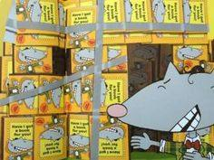

Oh. You're still not convinced.

I'm warning you, my books are in high demand!

They're flying off the shelves!

Buy now! Quantities are limited \...

**OKAY.**

**WELL \...**

I guess you'll think about it.

Would you look at the time. Gotta go.

But just one last thing \...

**You break it, you buy it!**

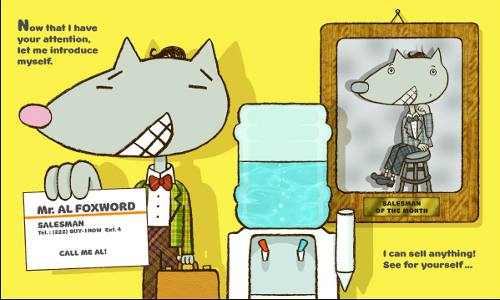

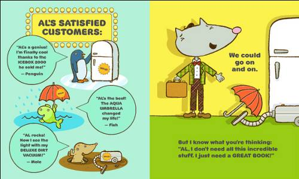

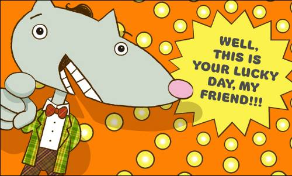

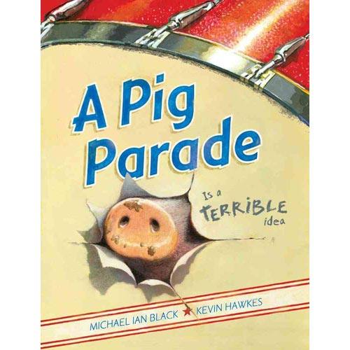

Could anything possibly be more fun than a pig parade!? You wouldn\'t
think so. But you\'d be wrong. A pig parade is a terrible idea. Pigs
hate to march, refuse to wear the uniforms, don\'t care about floats,
and insist on playing country music ballads. Those are just some of the
reasons. And trust me, this hysterical book has plenty more!

Mentor text to teach persuasive writing.

Read aloud. Discuss the techniques the author uses to persuade the
reader that the idea of a pig parade is a bad one. The author also
utilises great sequencing words and a surprise ending which could be
used as a starter for students to write their own persuasive piece.

This tongue-in-cheek book by Michael Ian Black follows a pretty
straightforward persuasive structure:

- The introduction acknowledges opposing viewpoints (a pig parade seems
  like a great idea, right?), then states a thesis (which students
  immediately noticed was the same as the title of the book)

- Pages after that present five reasons why a pig parade is a terrible
  idea, with plenty of supporting details and examples

- A conclusion summarises the reasons, then suggests an alternative (A
  panda parade would be fantastic!)

The reasons the author provides are actually quite logical--pigs can't
march, they don't wear uniforms, they wouldn't play parade music, they
don't care about floats, and they are unable to hold giant balloons.

Writing:

Students choose an animal and use the persuasive structure from the
mentor text.

Planning -- list the reasons.

Descriptive writing -- refer to text.

*Even if you were able to find enough majorette uniforms for all of your
pigs (which is a very difficult job in and of itself), just try getting
those hundreds of pigs to put them on. They will not do it.*

*...while pig hooves are good for digging up wild mushrooms, when it
comes to holding giant parade balloons, they are simply not up to the
job.*

DISCUSSION QUESTIONS:

1\. Do you think a pig parade is a bad idea?

2\. Did you learn anything new about pigs from this book?

3\. Why do you think the author wrote this book?

4\. What type of writing is this piece of work?

5\. Why else would it not be good to have a pig parade?

6\. Why would it be a good idea for a panda parade?

7\. How many of you have seen a real parade before? Where? When?

8\. What kind of things are at/in parades?

9\. In the story, the author says that a pig parade would have floats
from different stories about pigs. What other pig stories can you think
of?

10\. Would any animals do well in their own parade?

11\. If you planned an animal parade, what animal(s) would you have?

12\. There are two different kinds of pigs shown in this book. What is
the difference?

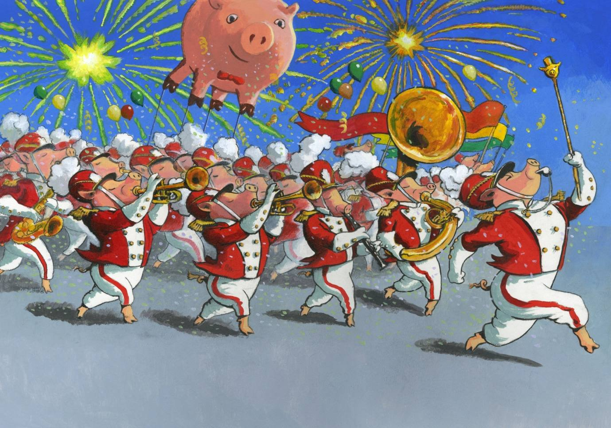

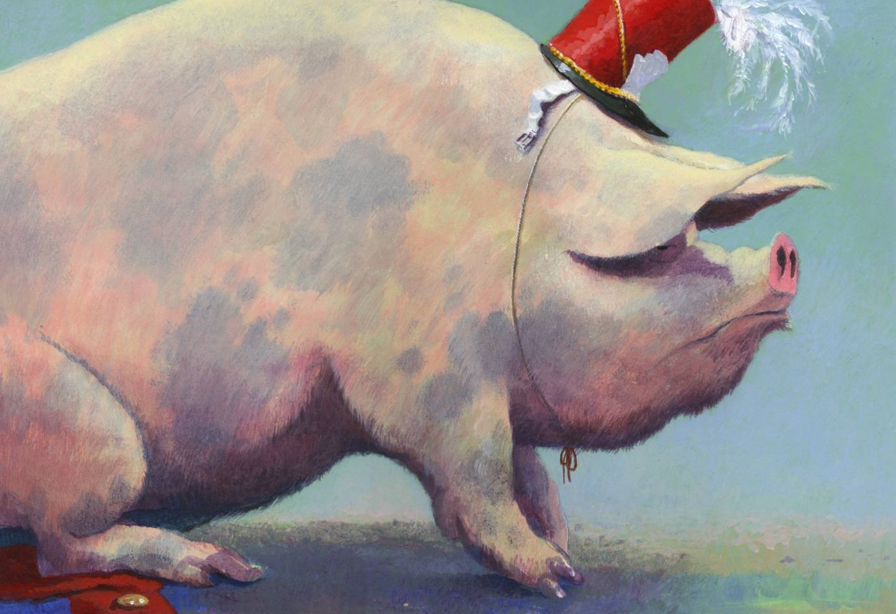

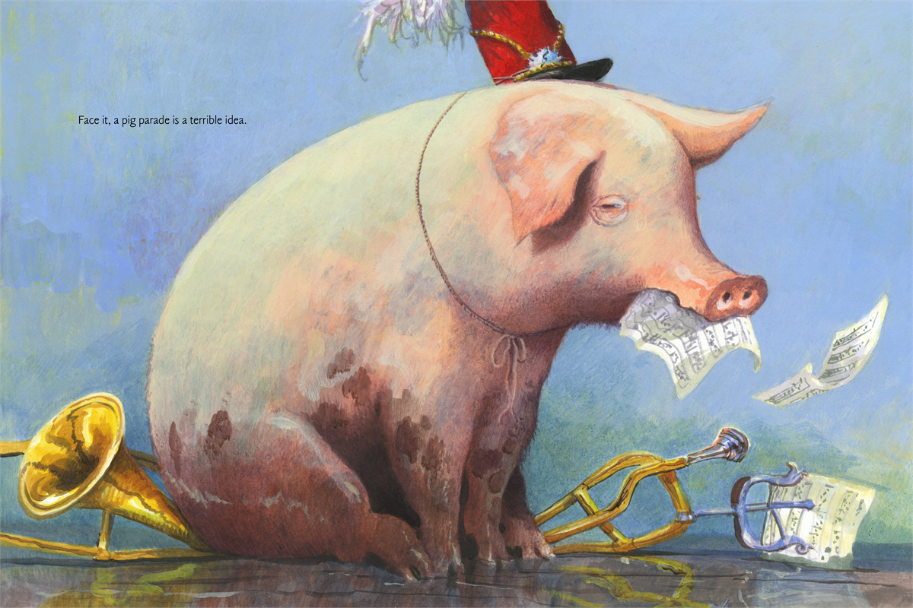

**A Pig Parade is a Terrible Idea Michael Black**

Like most children, you have probably thought to yourself at one time or
another, *I bet a pig parade would be a lot of fun.* And yes, a pig
parade certainly sounds like fun. It's even fun to say. Go ahead -- say
"pig parade" a couple times.

Fun, right?

After all, what could be more fun than gathering a few hundred pigs
together for a grand parade, and then watching them proudly march
together in perfect formation down the finest boulevard of your
hometown?

The only problem is, a pig parade is a terrible idea.

For one thing, pigs hate to march. They prefer to snuffle, which is kind
of like walking with your nose. Snuffling is fine when trying to find
leftover apple skins and acorns around the barnyard. But snuffling is
simply an inappropriate way to conduct yourself along a parade route.

That's just one reason why a pig parade is a terrible idea.

Also, pigs absolutely refuse to wear majorette uniforms. Even if you are
able to find enough majorette uniforms for all of your pigs (which is a
very difficult job in and of itself), just try getting those hundreds of
pigs to put them on.

They will not do it.

Perhaps they consider majorette uniforms unflattering.

Nonsense.

Everybody looks sharp in a majorette uniform, even pigs (especially
pigs!). But when you try explaining that to them, they just look at you
as if you are speaking a language they do not understand.

Again, a pig parade is a terrible idea.

You cannot have a parade without floats, right?

Well, forget it. Pigs don't care about floats. Pigs don't care about all
the time and energy you spent creating a "Three Little Pigs" float or a
"Wilbur the Pig from Charlotte's Web" float. In fact, the only float
pigs care about are root beer floats, which they love.

Then there is the matter of music. Pigs have horrible taste in music! If
you give a group of pigs marching-band instruments to play, do you think
they will play good, spirited marching-band music?

No, they will not.

They will play sad, sad country music ballads with titles like "My Tears
Are Wet 'Cause My Mud's Gone Dry" and "I Just Wanna Plop into This
Bucket of Slop." That kind of music is fine for slow dancing at
hoedowns, but it is not appropriate for a parade.

Face it, a pig parade is a terrible idea.

Finally, there are the giant balloons to consider. Everybody knows that
giant balloons are the best part of any parade. Well, who do you think
is going to hold all those balloons to keep them from flying away? The
pigs, right? Wrong! Even if pigs wanted to hold the balloons instead of
finding filthy puddles on the street to lie in, they couldn't do it.
Because while pig hooves are good for digging up wild mushrooms, when it
comes to holding giant parade balloons, they are simply not up to the
job.

And what happens when balloons go unattended?

They bump into buildings or simply drift off into outer space, which
would be fine for Martians but awful for those of us trying to enjoy a
pig parade here on Earth.

So, when you consider the constant snuffling, the refusal to wear
majorette uniforms, the disinterest in pig-themed literary floats, pigs'
preference for weepy country ballads, and their utter lack of discipline
regarding proper balloon handling, it should be absolutely, completely,
and totally clear that a pig parade is a terrible idea.

A panda bear parade, on the other hand, would be fantastic!

**A Pig Parade is a Terrible Idea**

Lead:

Reasons: Marching

Uniforms

Floats

Music

Balloons

Conclusion:

Ending:

**A \_\_\_\_\_\_\_\_\_\_\_\_\_\_\_\_\_\_\_\_\_\_\_ Parade is a
Terrible/Good idea**

Lead:

Reasons:
\_\_\_\_\_\_\_\_\_\_\_\_\_\_\_\_\_\_\_\_\_\_\_\_\_\_\_\_\_\_\_\_\_\_\_\_\_\_\_\_\_\_\_

\_\_\_\_\_\_\_\_\_\_\_\_\_\_\_\_\_\_\_\_\_\_\_\_\_\_\_\_\_\_\_\_\_\_\_\_\_\_\_\_\_\_\_

\_\_\_\_\_\_\_\_\_\_\_\_\_\_\_\_\_\_\_\_\_\_\_\_\_\_\_\_\_\_\_\_\_\_\_\_\_\_\_\_\_\_\_

\_\_\_\_\_\_\_\_\_\_\_\_\_\_\_\_\_\_\_\_\_\_\_\_\_\_\_\_\_\_\_\_\_\_\_\_\_\_\_\_\_\_\_

\_\_\_\_\_\_\_\_\_\_\_\_\_\_\_\_\_\_\_\_\_\_\_\_\_\_\_\_\_\_\_\_\_\_\_\_\_\_\_\_\_\_\_\_

Conclusion:

Ending:

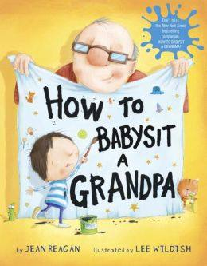

**How to Babysit a Grandpa Jean Reagan**

Babysitting a grandpa is fun---if you know how!

Within the pages of this book, you will find essential tips for being a
good grandpa-sitter, including:

- how to play with a grandpa

- things to do on a walk

- snacks grandpas like to eat

So the next time your grandpa rings the doorbell, you\'ll know exactly
what to do. (Be sure to have the crayons, shark toys, and ketchup
ready!)

BEHIND THE STORY

My book is dedicated to my two children, John and Jane and their Grandpa
John and Grandma Janice.

\"What do you enjoy doing with your grandpa?\" I asked this question to
many kids, grandkids, and adults who used to be kids and grandkids. And
I watched my own kids as they played with their grandpa. I also asked
specific questions to generate a variety of answers:

- What do you do on a walk?

- What do you do if it rains? When it\'s cold?

- What snacks do you share?

- What games do you play?

- What\'s the best way to wake up a grandpa?

- How do you greet him when he arrives?

- How do you say goodbye?

This \"research\" generated a long, long list to include in the book. Of
course, there wasn\'t room for everything, so I chose my favourites and
then created a story about these shared activities.

Oh, and there were some fun activities I wanted to include, but they
just didn\'t work for the story. One grandpa and grandson always
fancy-up their burritos by lighting candles and singing \"Happy
Birthday,\" even when no one has a birthday. Fun, huh? But I just
couldn\'t fit this into the story.

I then consulted actual How to Babysit guidebooks at the library to see
if I\'d left anything out. Yes, I had. I added a scene about what to do
as the parents leave and a scene about tidying up before they come home.

After Knopf Books for Young Readers bought the manuscript, I worked with
my fabulous editor, Allison Wortche, to strengthen the story. Then Knopf
found the perfect illustrator, Lee Wildish. He brought the story to life
by creating two delightful characters that are bursting with humour and
heart. Thank you, Lee!

I\'m so pleased that this grandpa book has morphed into a HOW-TO series,
with a total of six books contracted, so far.

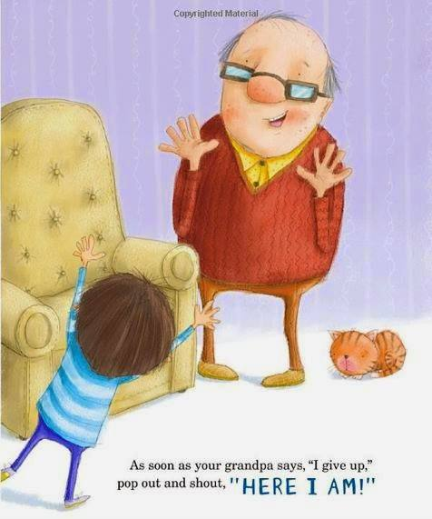

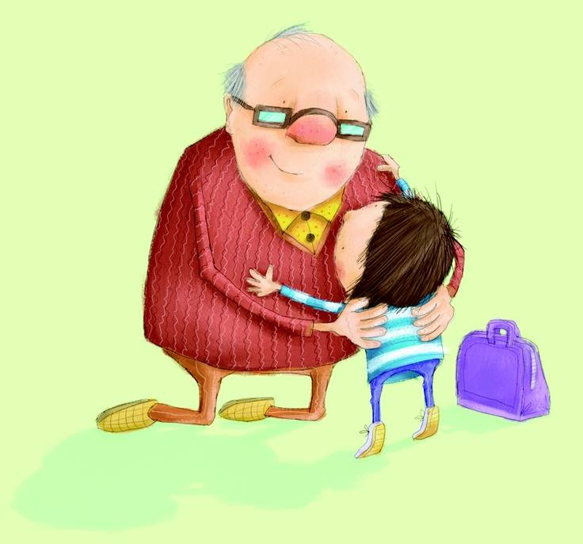

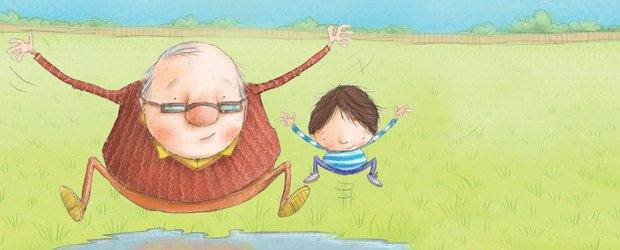

**How to Babysit a Grandpa Jean Reagan**

Babysitting a grandpa is fun -- if you know how.

When your grandpa rings the doorbell, what should you do?

Hide!

You might wiggle and want to giggle.

But don't yell, "Grandpa!" Not yet. Shhhhh \...

HOW TO STAY QUIET:

- Pretend you're a shark waiting for lunch.

- Act like a pirate spy.

- Be as still as a lion statue.

As soon as your grandpa says, "I give up," pop out and shout, "HERE I
AM!"

When your mum and dad leave, pat your grandpa's hand and say, "Don't
worry. They always come back."

Then right away ask him if he's hungry.

SNACKS FOR GRANDPA:

- Ice cream topped with cookies.

- Olives served on fingertips.

- Anything dipped in ketchup.

- Cookies topped with ice cream.

After snacks, it's time to take your grandpa for a walk.

When it's cold, bundle up.

When it's sunny, sunscreen up -- especially the top of his head.

Remember to grab his hand when you cross the street, and remind him to
look both ways.

WHAT TO DO ON A WALK:

- Step over sidewalk cracks.

- Look for lizards, cool rocks, and dandelion puffs.

- If there's a puddle or a sprinkler, show him what to do.

When you're back at home, have him shut his eyes while you get ready.
And then \...

HOW TO ENTERTAIN A GRANDPA:

- Somersault across the room.

- Put on a scary play.

- Show off your muscles.

You may want to have some extra tricks -- grandpas always clap for more.

Pretty soon he'll want to join the fun, so play *with* your grandpa,
too.

HOW TO PLAY WITH A GRANDPA:

- March with your drum. (Give him a kazoo.)

- Build a pirate cave. (Make sure you can both fit.)

- Watch out for sharks in the water! (Don't let your feet touch the
  floor!)

When your grandpa says, "Naptime," it's time for his nap. The best way
to put him to sleep is to have him read a *looooooooooong* book, over
and over and over and

\... zzzzzzz.

Even if you're sleepy, too, babysitters have to stay awake. While he
naps, draw a picture for his fridge.

WHAT TO DRAW FOR A GRANDPA

- A pirate -- shark battle

- Your favourite dinosaur

- You and your grandpa splashing in a puddle

Then \...

\... wake up your grandpa!

YOU MIGHT WANT TO TRY

- Lifting him with your muscles.

- Tickling his nose and his toes.

- Singing "On Top of Old Smokey" softly, then LOUDER and LOUDER.

Now ask, "Will Mum and Dad be home soon?"

Your grandpa will look at the clock and say, "Yikes! Soon! VERY soon!"

Good babysitters can't leave messes, so turn on some bouncy music and
get to work.

When you hear your mum and dad, grab your grandpa's hand and pull him
behind the couch. Show him how to be quiet (check How to Stay Quiet) and
whisper, "See, Grandpa. They always come back."

Now comes the hardest part: good-bye time.

HOW TO SAY GOOD-BYE TO GRANDPA

- Surprise him with the picture.

- Give him a hug and a kiss, a hug and a kiss, a hug and a kiss.

- And ask, "When can I babysit you again?"

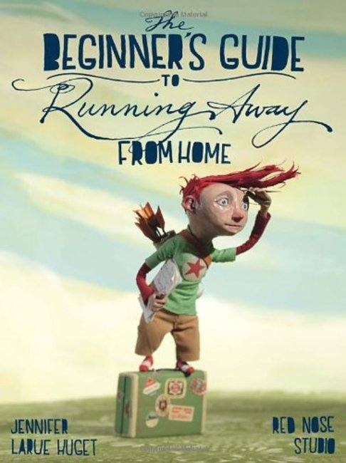

Big brother being a pain? Baby sister getting all the attention? Mom
making you eat your vegetables? Whatever your reason is, there's only
one thing to do. Run away! Huget's knowing text blends perfectly with
Red Nose Studio's inventive art to provide the perfect plan:

1\. You need a really good reason: ―Like maybe your parents are going
gaga over your little sister and practically ignoring you.

2\. Next, you need to pack. ―Forget about tying a bandana to a stick.
That's so old school. Plus, you'll need something way bigger.

3\. Say goodbye to your pets. ―It's not their fault your family's so
mean.

4\. Leave a note. ―Try to imagine your parents' faces when they read it.
. . . If they look really sad, you'll know your note is perfect.

5\. Make a big exit. ―Stomp your feet and make lots of noise.

And so the journey begins, and our red-haired hero finds himself on the
run, with a world of decisions to make. Ultimately, though, readers will
see that there really is no place like home. Coming to a close with a
heartfelt reunion between mother and son, this tale presents an engaging
journey inside a creative kid's imagination.

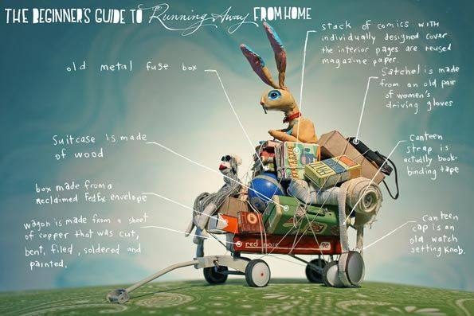

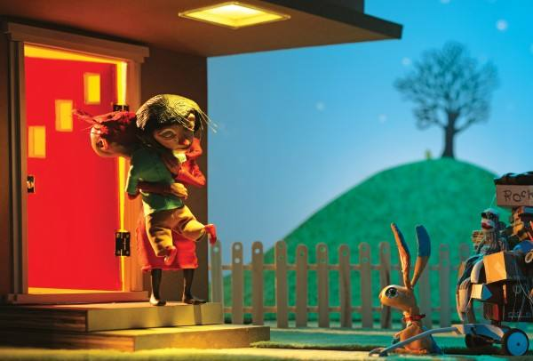

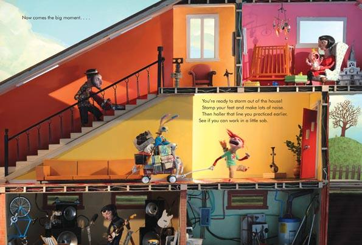

New York Times Best Illustrated artist Chris Sickels spent 15 months
creating the art for Jennifer LaRue's Huget ode to childhood adventure.
His clever use of found objects like candy wrappers, erasers, magazines,
spoon handles, and fuse boxes are the perfect match for this
protagonist's elaborate scheming and creative spirit. Each spread of art
is a photograph of an elaborately handcrafted set, making for a truly
one-of-a-kind look for this offbeat guide to running away and,
ultimately, coming home.

Jules: What is your usual medium?

Chris: I build small puppets and sets out of various materials, both new
and reclaimed. I create everything from small props to fully tailored
clothing for the characters. Everything is built to fit the approved
sketch and then photographed here in my studio/garage and sent to the
publisher.

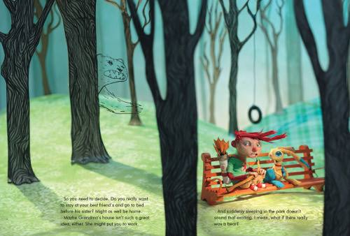

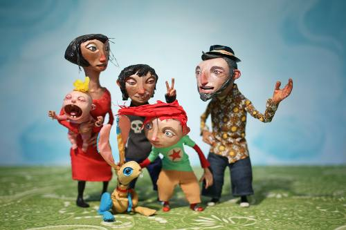

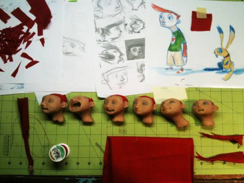

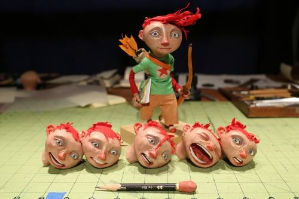

Mentor Text:

Ideas. Use as a model for 'A Guide for Running away from Home.'

Set out a story map to use as a planning guide. e.g. (See Planning
Guide)

Perspective:

Explain writing in the second person.

**A Beginner's Guide for Running Away from Home.**

Introduction: Lead.

Reasons: \_\_\_\_\_\_\_\_\_\_\_\_\_\_\_\_\_\_\_\_\_\_\_\_\_\_\_

\_\_\_\_\_\_\_\_\_\_\_\_\_\_\_\_\_\_\_\_\_\_\_\_\_\_\_

\_\_\_\_\_\_\_\_\_\_\_\_\_\_\_\_\_\_\_\_\_\_\_\_\_\_\_

Pack: (Advice)

Say good-bye to pets.

Write a note:

Leave:

Decide where to go:

\_\_\_\_\_\_\_\_\_\_\_\_\_\_\_\_\_\_\_\_\_\_\_\_\_\_\_\_\_\_\_\_

\_\_\_\_\_\_\_\_\_\_\_\_\_\_\_\_\_\_\_\_\_\_\_\_\_\_\_\_\_\_\_\_

\_\_\_\_\_\_\_\_\_\_\_\_\_\_\_\_\_\_\_\_\_\_\_\_\_\_\_\_\_\_\_\_

DO NOT - Think about the benefits of home.

Decide:

List disadvantages of the places you thought about.

Ending:

Back home

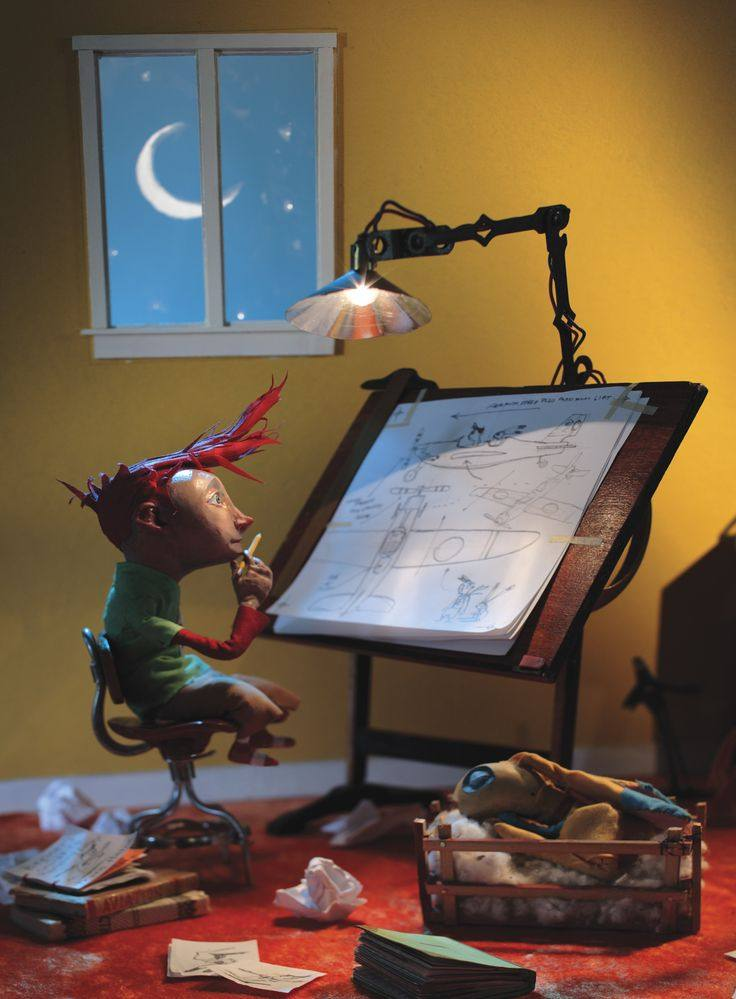

**The Beginner's Guide to Running Away from Home Jennifer Huget**

If you're planning to run away, the first thing you need is a reason.

Like maybe your parents are going gaga over your little sister and
ignoring you. So what if she's a baby? You were here first.

Not fair!

Or maybe your brother gets to stay up late a whole hour later even
though he's a big warty slug. Your mum says it's because he's older. But
you know it's because she likes him better.

Or it might be that your mother threw away your *entire* collection of
candy wrappers that you'd been saving forever and planned to wall paper
your bedroom with.

If you're not sure your reason's good enough, try it out loud.

"I'm running away and never coming back because you threw out all my
candy wrappers and ruined my whole life!"

Did it sound okay? Keep practising until it does.

Now you have to pack.

Forget about tying a bandana to a stick. You'll need something way
bigger. A backpack, at least. Or better yet, a wagon. Because remember:
You're never ever coming home.

You'll also need snacks: graham crackers and gummy worms and packets of
hot chocolate. Oh, and gum. So you don't need a toothbrush.

You're too grown up for a stuffed animal, but take your favourite one
anyway. That will show your parents you mean business.

And you'll need a pillow and a blanket. But no pyjamas. Out on your own,
you get to sleep in your clothes.

Save room for a bow and arrow. In case there are bears.

Time to say good-bye to your pets. Bury your face in their fur and tell
them how sorry you are to leave them. It's not their fault your family's
so mean. (You can just wave at the fish.)

If there's room in your wagon, pick one pet to take along. Hint: Choose
one that won't eat your snacks.

And now for the most important part.

+--------------------------+
| Why I ran away           |
|                          |
| (like anyone cares)      |
|                          |
| It's never my turn to    |
|                          |
| pick the TV show.        |
|                          |
| That dumb baby.          |
|                          |
| Not allowed to keep      |
|                          |
| pet squirrel. Have       |
|                          |
| to wear sweater vests    |
|                          |
| to Grandma's.            |
|                          |
| Peas. Peas. PEAS.        |
+==========================+

Imagine your parents' faces when they read it. If they look like they're
about to burst into tears, you'll know your note is perfect.

Tape the note where your parents can't miss it.

Now comes the big moment \...

You're ready to storm out of the house!

Stamp your feet and make lots of noise.

Then holler that line you practised earlier. See if you can work in a
little sob.

Once you're outside, decide where you're going.

Your best friend's house? His big sister gets to stay up late, too, so
he'll know just how you feel.

Or how about Grandma's house? She still likes you, even if you're not as
cute as the baby.

Or maybe the park. There's a slide and tyre swing and enough other kids
to keep you busy all day. And when everyone goes home, you can hide
behind a trash can.

At night you can sleep on a bench. Thank goodness for your blanket and
pillow!

Wherever you're headed, DO NOT LOOK BACK.

Do not -- I repeat, do NOT -- think about how your dad taught you to
swim.

Or the time your brother helped you find rocks for your collection.

Or your mum's spaghetti.

Or how silly your baby sister looks when she laughs.

Or how cosy it is in your nice warm bed.

When you can't see your house anymore, stop for a snack. But don't
dawdle, because your folks might come looking for you. And you don't
want them to find you.

Because they're the worst family in the world.

Here's where things get tricky. The truth is, they probably won't come
looking. Even if you sit on the sidewalk and wait in broad daylight.

So you need to decide. Do you really want to stay at your best friend's
and go to bed before his sister? Might as well be home.

Maybe Grandma's house isn't such a great idea, either. She might put you
to work.

And suddenly sleeping in the park doesn't sound that exciting. I mean,
what if there really was a bear?

Maybe you'll give your folks one last chance -- even though they don't
deserve it.

Once you're home, things might not seem as bad as you remembered. You
can always collect more candy wrappers, right?

But don't let you r family know you feel that way.

Because they'd better start treating you right.

And if they don't \...

\... you might just run away from home again.

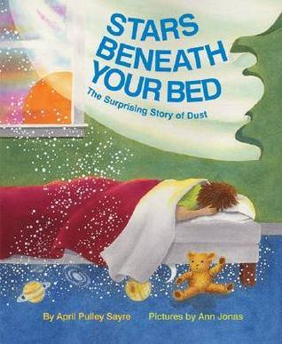

**Stars Beneath Your Bed April Sayre**

**What is dust?**

**More than you think.**

What can it do?

You will be surprised.

Dust may seem small,

dark, dirty, and dull.

But it\'s the secret

behind one of the

largest, most colourful

sights on earth.

Read Aloud:

Read Stars Beneath Your Bed

• Mesh reading with discussion on where students see dust and where they
think it comes from.

**Science:**

With Stars Beneath Your Bed, students listen to the book and learn what
dust is, that dust scatters light and "paints" the sky at sunrise and
sunset, what makes dust, and that dust is around for a very long time.

Patterns.

Questions about relationships and the factors that influence them.

Cause and Effect

Dust and sunsets...all the things that create dust...waves that splash
salt, and so on. Lots of way to go with this one!

Scale:

Going from the scale of dust to the scale of sunsets certainly gets kids
thinking about that. Dust being pieces of so many things mentioned in
the book certainly works here.

Energy/Matter/Flows/Cycles/Conservation

Even conservation if you consider the lines about dust from long ago
still being around.

Stability and change

Although no rates of change are mentioned, certainly the cycles of
dust/sunsets/and change are well illustrated by the book.

**Writing**

Found poetry from Dust and sunsets.

Own free verse poetry.

**Stars beneath Your Bed The Surprising Story of Dust**

> **April Sayre**

At sunrise,

the sun, low in the sky,

peeks through dusty air.

Dust from us and dirt and dinosaurs

scatter light, painting the sky like fire.

Dust is made everywhere, every day.

A flower drops pollen.

A dog shakes dirt from its fur.

A butterfly flutters,

and scales fall off its wings.

That's dust. Dust is little bits of things.

You and I make dust.

Your bike wheels scatter dust.

Skin, old and dry, flakes from our arems.

Cotton rubs off jeans as we

cartwheel through the grass.

That's dust.

So is dirt from farmers' ploughs.

Dust is made in nature

when meerkats dig,

when zebras roll,

when cheetahs chase gazelles across the land.

Wind picks up dirt and

swirls it in whirlwinds --

dust storms that sweep the savannah.

Dust can be bits of unexpected things --

a crumbling leaf, the eyelash of a seal,

the scales of a snake,

the smoke of burning toast,

ash from an erupting volcano.

Dust can come from the ocean.

An ocean wave breaks.

Slap! It splashes salt into the air.

Wind carries salt dust up and up =

smell the salty ocean spray!

Old dust stays around.

Dust that made King Tut sneeze is still on Earth.

It might be on your floor.

That dusty film on your computer screen

might have muddied a dinosaur.

Some dust comes from outer space.

The dust beneath your bed might be from mars.

It could be part of a comet,

or a bit of the moon.

Cosmic dust sifts down from asteroids.

Wind spreads dust,

floating,

swirling,

sprinkling,

bits of you and me

and soil

and stars.

Afternoon light,

shining through trees,

shows us dust is there.

All the dust of our day

will scatter light this evening.

Sunset pink. Sunset orange. Sunset red.

The dust of our day

will colour the sunset we see.

And tonight will paint

the sunrise of tomorrow.

**Dust and Sunsets**

Anything smaller than one-sixteenth of a millimetre in diameter is
considered dust. Dust is smaller than the full stop at the end of this
sentence. It is smaller than the width of a human hair. Dust can be made
up of many things -- desert dirt, bark bits, pollen grains, tyre rubber,
and even bacteria. It can be salt, skin flakes, or little pieces of just
about any material you can imagine. Dust may be small, but its impact is
large. When the sun is low in the sky, its rays hit dust particles at an
angle. This creates the sunset colours we see. The sky colours change as
the sun moves, striking the particles at new angles. The same thing
occurs at sunrise, because the sun is low in the sky then as well.

The more dust, the more colourful the sunsets and sunrises. When
volcanoes erupt or forest fires burn, they send a lot of ash and soot
into the air. This ash dust makes sunsets particularly colourful for
weeks and even months, until the dust settles. These unusually colourful
sunsets can occur hundreds, even thousands of miles from the fires or
eruptions. That is because dust travels. Dust from Africa's Sahara
Desert floats all the way to Florida. Some say Sahara dust turns Miami
rain slightly pink. Sahara dust also lands in Brazil's Amazon rain
forest, where it adds nutrients that help the forest grow. Dust from a
volcanic eruption, such as that of Mount Sanit Helens in Washington
State, can circle the entire globe.

Dust not only helps create beautiful sunsets, it helps create rain.
water that evaporates from lakes, streams, oceans, and leaf surfaces
rises up into the sky as water vapour. It condenses -- becomes liquid
again -- by attaching to dust particles. Each raindrop needs a piece of
dust to form.

Every day, all over the world, dust mixes as air circulates. Because of
this mixing, it's likely the dust in your house is made up of all sorts
of things -- not just skin, hair, dirt, and food from inside your house,
but also outdoor things: soil, plants, animal fur, bits of planets, or
particles of the Moon. This dust from outer space is called space dust
or cosmic dust. Astronomers can detect lots of cosmic dust out in the
universe. Our planet travels in a vast cloud of dust specks that orbit
the sun. Asteroids -- rocky bodies that bump into one another out in
space -- create some of this dust. When asteroids hit moons, moon dust
spreads as well. Dust comes from comets, which are made of ice and dust
and create a dusty trail as they travel through the universe. Some dust
is made of stars. When a star goes "supernova," it explodes, sending
small particles of dust far out into space.

Every day, this cosmic dust, from many sources, falls on Earth. Some of
this dust is swept up in our atmosphere and slowly sifts down towards
the ground. Larger pieces of comets hit the atmosphere at high speeds
and burn up, creating streaks of light we call shooting stars/ The
melted, miniscule remains of these shooting stars are dust. This dust
floats in our atmosphere, too. Cosmic dust has probably landed on your
head without you even knowing it.

Dust not only travels. It can stay in the air for hundreds and thousands
of years. Inside your house, you may find powder that Cleopatra put on
her feet, or dust that a dinosaur stirred up when it rolled. On your
shelf could be the every same dust that martin Luther King, Jr., brushed
off his coat.

This evening some of this dust, from today and years past, will colour
the sunset we see. Tomorrow, dust from all that has come before will
make a sunrise to start your day. And because dust is constantly being
created and mixed, no two sunsets -- or sunrises -- will ever be the
same.

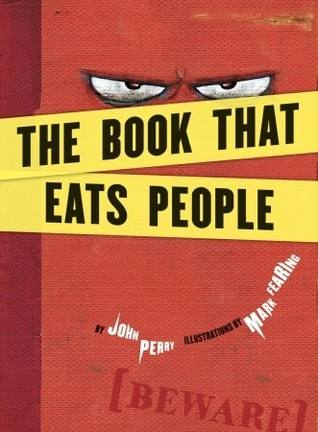

**The Book That Eats People John Perry**

WARNING! THIS IS NOT A BEDTIME STORY

Legend has it there exists a book that eats people.

This is that book!

Many readers have been unable to escape its perilous pages.

But this isn\'t that book.

Yes it is!

This is simply a story about that book.

Really. I mean, how could a book eat people?

So if you\'re just dying to know the history of this literary monster,
all you have to do is turn the page\...

Don\'t do it!
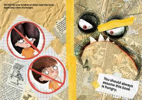

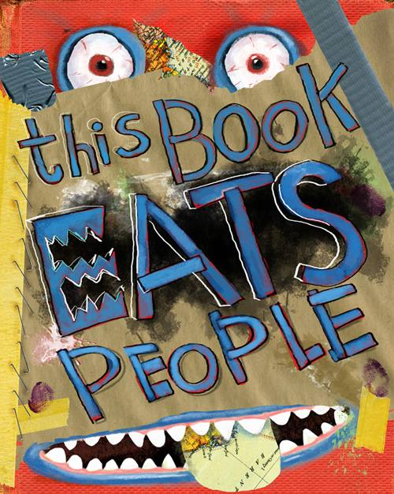

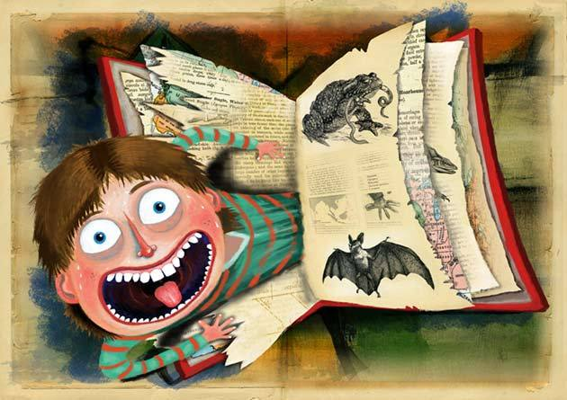

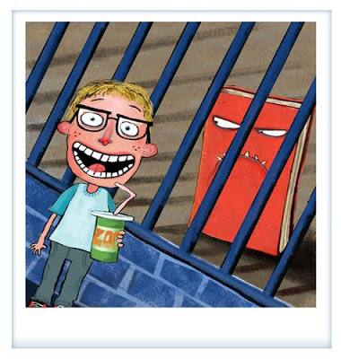

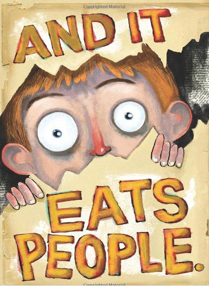

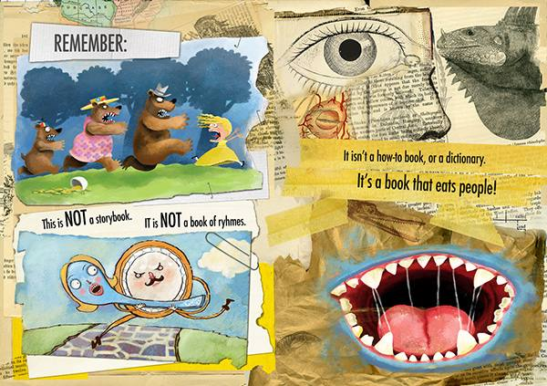

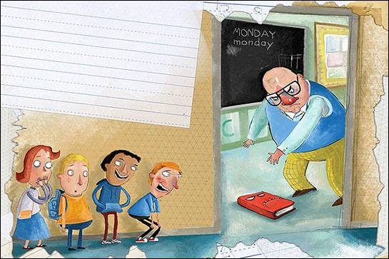

**The Book That Eats People**

**Artist: Mark Fearing**

Every once in awhile I pull out one of my old books and talk about it.
At bus stops. Restaurants. The grocery store. Here on my blog...

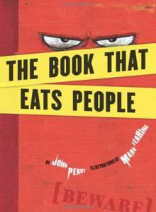

The Book That Eats People was my first real, grown-up, kids book. (and
of course it was the 2012 picture book of the year in North Carolina via
the [Children's Book
Awards](http://www.cmlibrary.org/bookhive/NCCBA/2012winners.asp)) It was
also the oddest manuscript I had been offered, so of course, I took it!
I had just turned down two picture books in the previous months because
I didn't take to their stories and was pretty sure I would never
actually be hired to illustrate a book, when this came in. I can never
thank Abigail Samon, who was at Tricycle Press at the time, enough for
the opportunity for my first book to be such a cool one. And a
controversial one at times. It's an odd book and as happens when you
have a book that eats people, it scares some people. But as long as you
run fast you don't have much to worry about.

Below are some samples from early art in the book.

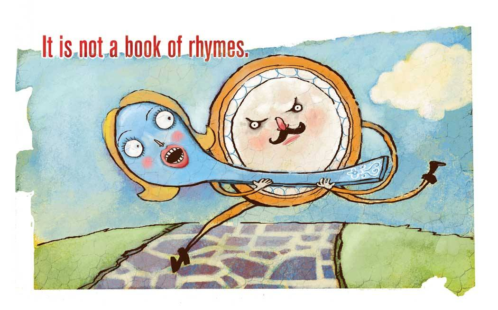

This is a close-up of a fairytale image that is used on the page that
explains what the book isn't!

This is a development painting that was an early attempt to understand
how to make an ongoing collage style work. This image is not in the
final book.

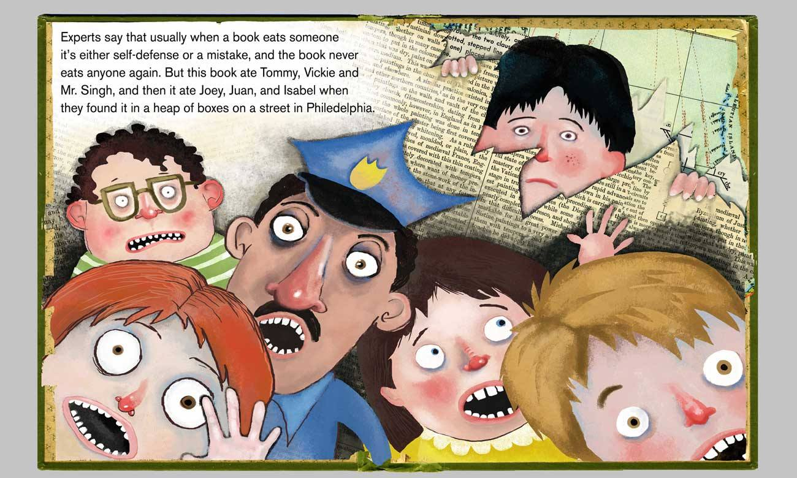

**The Book That Eats People John Perry**

CAUTION!

This is a book that eats people.

If you hear growling while you're reading it, stop reading, close the
cover, and put something heavy on top of it.

DO NOT let your little brother or sister read this book -- especially
when it's hungry. You should always assume this book is hungry.

Remember:

This is NOT a storybook. It is NOT a book of rhymes.

It isn't a how-to book or a dictionary.

**It's a book that eats people.**

One day in Little Rock, Arkansas, Sammy Ruskin forgot to wash his hands
after lunch, and the book tasted peanut butter on his fingers.

So the book -- this book -- went SNAP! And took a bite! And then another
and another. Sammy squirmed and wriggled. Sammy squealed and yelled.
Sammy pulled as hard as he could, but the book ate him. Then it coughed
up his bones and they clattered across the floor like wooden blocks.

**That was the first person this book ate.**

If you hear pages rustling, it's probably because the book smells
something yummy. But if you hear a sound like an octopus in a tub of
yoghurt, that is the book's empty stomach and the book is RAVENOUS. If
you hear THAT, find someone nearby -- FAST -- who might taste delicious
to a book.

After this book ate Sammy Ruskin, his parents gave it to a library,
where it sat trapped and mad, tightly shelved between The Complete Guide
to the Saints and Sandwiches Through the Ages. Its stomach growled and
growled for weeks until late one evening, someone left the guide to the
saints on a table in the reference section.

That night, while the moon shone, the book devoured Famous Americans,
Who's Who in American Business, and Mr Singh the security guard, who
yelled like crazy.

When the librarians came in, it was swallowing the last pages of How
Things Work. Titles like What happened to Sam Ruskin? keep some library
books shelved forever. So, while the librarians wept, this book traded
covers with All About Dolphins. And that very same day, right about the
time when everybody likes a chocolate-chip cookie, Victoria Glassford
checked it out.

She put the book on her nightstand, but before she could finish brushing
her teeth, it jumped up, thumped her on the head, and gobbled her down,
beginning with her polished pink toenails.

Have you ever heard a book burp?

This is a bad book. A book with teeth and claws. It's a monster that
eats people. You should throw it in the fireplace on the coldest
February day. You should grind it page by page in your daddy's coffee
grinder.

Experts say that when a book eats someone it's either self-defence or a
mistake, and the book never eats anyone again.

But this book ate Sammy, Victoria, and Mr Singh, and then it ate Joey,
Juan, and Isabel when they found it in a heap of boxes on a street in
Philadelphia.

Of course, someone from the Neighbourhood Watch saw the book eat those
three kids and called the police.

They took it and locked it in a jail cell, where it ate Chuck Anderson,
who deserved it.

Some people think it's cruel to chain a book, The guards did it anyway.

Judge Cox, who loved all books, sent it to the zoo where zookeepers
tried to reform it. they fed it fried chicken, pickles, hot dogs, ice
cream, noodles, and toast, but nothing worked because this book craves
people. When it chewed through a zookeeper's shoe, they finally gave up
and put a label on it that says

THE BOOK THAT EATS PEOPLE in big, bold letters.

So now everyone knows what kind of book this is. Who knows where YOU
found it. But be careful.

Never read this book with syrupy fingers.

Never read it with cookies in your pocket.

Never turn your back on it.

Never NEVER EVER read this book alone.

Because this is

ALWAYS hungry.

**AND IT**

**EATS**

**PEOPLE.**

