**Voice**

> **(12)**
>
> {width="4.25in"
> height="4.25in"}

**Narrative Voice**

**Perspective 3**

**\**

{width="2.3541666666666665in"
height="2.3541666666666665in"}

**Voice 12**

**Narrative Voice -- Perspective 3**

**Writing using 2^nd^ Person**

The Narrative Voice that Tells the Story

Sky Boys How They Built the Empire State Building

> Deborah Hopkinson

The Westgate Bridge

So You Want to be a Rock Star Audrey Vernick

Is Your Buffalo Ready for Kindergarten? Audrey Vernick

Teach Your Buffalo to Play Drums Audrey Vernick

DO NOT OPEN THIS BOOK! Michaela Muntean

Cat Secrets Jef Czekaj

Dragons Love Tacos Adam Rubin

No Bears Meg McKinlay

Time of Wonder Robert McCloskey

The Good-bye Walk Joanne Ryder

You're Finally Here Melanie Watt

What to do if an Elephant Stands on Your Foot Michelle Robinson

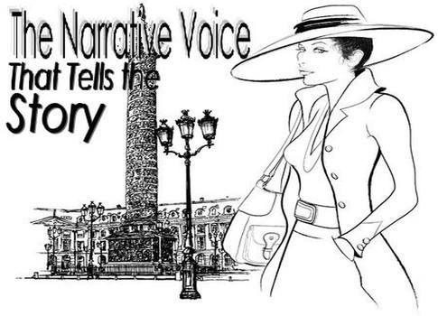{width="5.052083333333333in"
height="3.6458333333333335in"}

\"On whose authority does the story get told?\", is the question
novelist Henry James recommended as a prerequisite in the writing and
start of a story. When writing Literature, authors aim for grabbing the
reader immediately, by determining the voice or point of view narrative
they will write the story in. This is key.

Point of view narrative is the way the writer let\'s the reader know
what\'s going on. It\'s the perspective where the writer shows the
emotions and behaviours of the characters, the locale or setting, time
frame, and the occurrences. This is done by writing the story in first
person, second person, or third person. Also whether it will be told in
present or past tense.

First person-point of view is in use when a character narrates the story
with I, me, my, and mine in his or her dialogue. The advantage of this
point of view is that you get to hear the thoughts of the narrator and
see the world depicted in the story through his or her eyes. Second
person-point of view is in use when the narrator uses you and your.
Rarely is second person used in fiction writing, because it speaks
directly to the reader. However, when second-person point of view is
used, it puts the reader into the story, almost making the reader an
active part of the action. Third person-point of view is that of an
outsider looking at the action. The narrator uses he, she, and they.

- Examiner.com

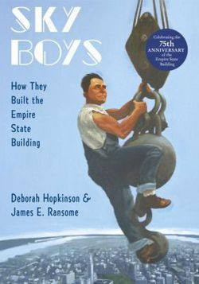{width="2.6041666666666665in"
height="3.71875in"}

Description

This Boston Globe--Horn Book Honour Book and ALA-ALSC Notable
Children\'s Book provides a riveting brick-by-brick account of how one
of the most amazing accomplishments in American architecture came to be.
It's 1930 and times are tough for Pop and his son. But look! On the
corner of 34th Street and 5th Avenue, a building straight and simple as
a pencil is being built in record time. Hundreds of men are levelling,
shovelling, hauling. They're hoisting 60,000 tons of steal, stacking 10
million bricks, eating lunch in the clouds. And when they cut ribbon and
the crowds rush in, the boy and his father will be among the first to
zoom up to the top of the tallest building in the world and see all of
Manhattan spread at their feet.

This interesting picture book tells the story of the building of the
Empire State Building in New York through free verse. While poetry and
rhyme is not unusual in picture books, in this one, it creates a
different feel as it shifts from 3rd person (omniscient) to 2nd person
focus (through the eyes of a young boy). The illustrations use vivid
colour with blurred details to create a sense of the immensity of the
building, from its incarnation to its completion. The focus on the "Sky
Boys," those men who actually walked around on the girders, provides the
tension and the adventure of the story, but the author nicely balances
this with the more challenging issue of out-of-work men who were willing
to put their lives on the line--literally--to get a job. A final "Note
about the Story" provides additional details that avid readers will
certainly want to know after reading this book.

{width="5.0in"
height="3.65625in"}

{width="5.0in"
height="3.65625in"}

{width="5.0in"
height="3.65625in"}

{width="5.0in"
height="3.65625in"}

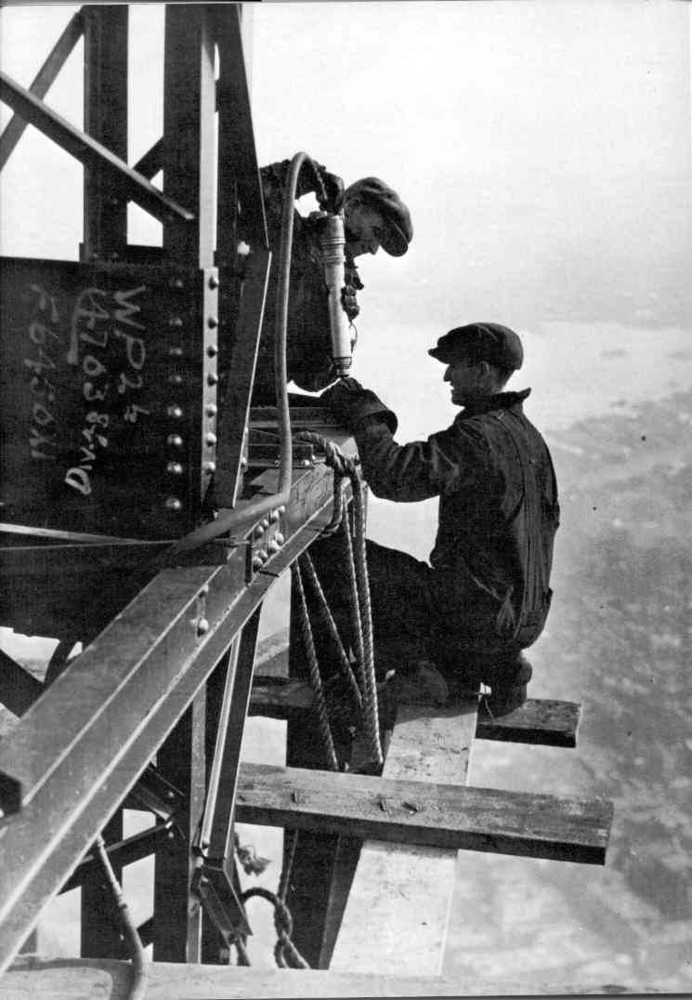{width="6.268055555555556in"
height="9.052923228346456in"}

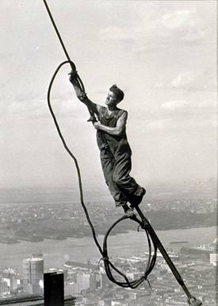{width="2.8645833333333335in"
height="4.010416666666667in"}

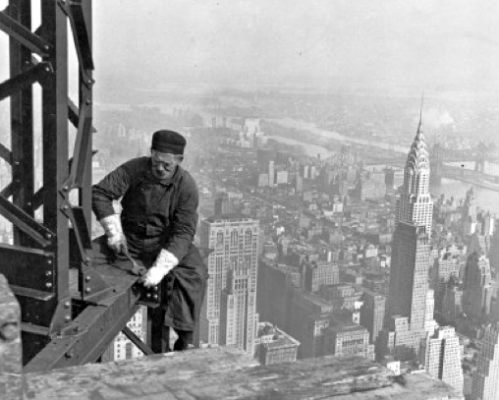{width="5.197916666666667in"
height="4.166666666666667in"}

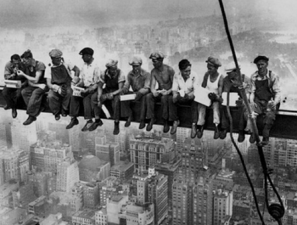{width="5.197916666666667in"
height="3.9375in"}

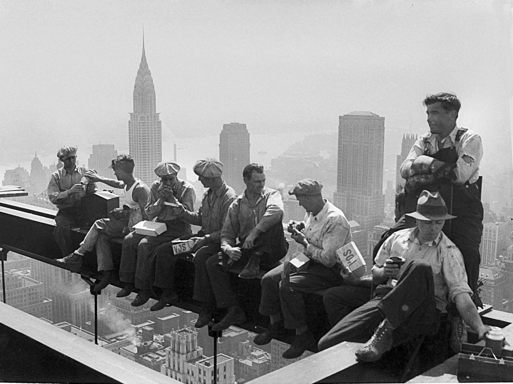{width="6.268055555555556in"
height="4.699379921259842in"}

{width="3.6041666666666665in"
height="5.197916666666667in"}

{width="3.6145833333333335in"
height="6.239583333333333in"}

**Sky Boys** **How They Built the Empire State Building**

**Deborah Hopkinson**

It's the end of winter,

and your pop's lost his job.

So every morning before school

you scour the streets for firewood,

hunched down in an icy wind.

But look!

Here's a pile of wood,

free for the taking --

all carted off

from that old hotel

they tore down at

Thirty-fourth and Fifth.

Six hundred men

are working there --

levelling, shovelling, hauling,

clearing the rubble away.

They're getting ready to make

something new.

**bold,**

SOARING.

A symbol of hope

in the darkest of times.

A building,

clean and simple

and straight as a pencil.

And tall.

so tall it will scrape the sky.

You drag your pop along to see, and

tell him what you've heard on the street.

"Mr Raskob wants to build

the tallest skyscraper in the world," you say,

"taller even than Mr Chrysler's building!

They say it'll be done by next May.

Think they can build it that fast, Pop?"

"Things are so bad, it seems

foolish to even try," he replies.

Then he sees your face and adds,

"Course, you never know \..."

So let the race begin!

First come rumbling flatbed trucks,

bundles of steel on their backs,

like a gleaming, endless river

surging through

the concrete canyons of Manhattan.

This steel is strong and new,

only eighty hours old,

barely cooled

from the fiery furnaces of Pittsburgh.

Before your eyes a steel forest appears.

Two hundred and ten massive columns,

lifted by derricks

and set onto concrete piers

sunk fifty-five feet down

to hard-rock bottom.

Columns so firm and strong,

they can bear the full weight

of this giant-to-be

365,000 tons.

Then it's the sky boys' show.

Derrick men

hoisting, swinging,

easing each beam into place.

High overhead they crawl

like spiders on steel,

spinning their giant web in the sky.

*Watch out, sky boys --*

*don't slip in the rain*

*or let the wind whisk you away.*

Wouldn't you love to be one of them,

the breeze in your face,

and your muscles as strong

as the girder you ride?

Or you could be a water boy,

climbing high with your bucket

to bring the sky boys a drink.

They'd laugh and call out,

*"Keep your eyes on the beam, water boy,*

*and don't look down!"*

As each beam is placed,

the riveting gang is there

to fasten the frame together.

Four men work as one.

**First man,**

the Heater,

gets the rivet

red-hot in the forge

and tosses it up quick.

(A throw of fifty feet

is nothing to him.)

**Second man,**

the Catcher,

snares the rivet in his funnelled tin can,

fishes it out with tongs,

and sticks it in the hole.

**Third man,**

the Bucker-up,

keeps the rivet

nice and steady

with his bar.

**Fourth man,**

the Gunman,

hammers it into the steel,

good and hard.

*Toss-catch-steady-pound.*

*Toss-catch-steady-pound.*

One or two rivets per minute,

five hundred rivets a day.

At the same time

other workers use six hoists

to carry eight-thousand-pound loads

of wood and steel

right to where they're needed.

And on each floor

hand-powered railcars on tracks

move limestone, pipes, and wires around.

To make the work easier

there are temporary elevators,

water tanks, and, yes, toilets,

five lunch stands, and even a restaurant.

*No need to leave the job.*

*Get hot beef stew and coffee here,*

*on the unfinished forty-seventh floor!*

In this new, ingenious,

assembly-line construction

each man works as fast as he can,

knowing that down below

a hundred jobless men are ready

to take over his spot in a flash.

Yet knowing, too,

that the quicker he finishes,'

the sooner he'll be back in line himself,

waiting and desperate for work.

From your spot on the sidewalk

you watch the building take shape,

bit by bit, piece by piece,

like a giant, real-life puzzle.

rising four and a half

storeys each week.

In November the sky boys give a cheer.

The skeleton has a skin --

all one hundred and two storeys are done!

And by March the mast on top makes

this the tallest building in the world.

**5:42pm MARCH 18, 1931**

Like a general launching an attack,

the builder sends in more men --

bricklayers, masons, carpenters,

electricians, plumbers,

all hammering, nailing,

wiring, and cutting

morning till night,

week after week,

month after month.

May 1, 1931: opening day.

Finished in record time!

Sixty thousand tons of steel,

ten million bricks,

two thousand tons of marble,

sixty-five hundred windows,

seventy miles of water pipes,

eighteen hundred and sixty stairs.

One year and forty-five days,

seven million man-hours,

more than three thousand men --

a triumph of speed, safety, and efficiency,

and something else, too: beauty.

The ribbon is cut, the crowds swarm in.

*"Amazing! Spectacular!"*

*"Now the world can see*

*what New York City's all about!"*

Outside, Pop has a big surprise,

"Let's go on up," he suggests with a grin.

"I been puttin' our pennies aside."

The crowd sweeps you into

the marbled lobby, a tall, grand lady,

clothed head to toe in rich, glowing colours.

On the centre wall

a silhouette glitters like a jewel:

the Empire State Building,

pride of New York City!

To go to the top,

it's a buck for adults, two bits for kids.

Hop on board for the longest elevator ride of your life.

Just swallow if your ears start to hurt.

In no time you're there,

but even on tiptoe you can't see a thing.

Then *whoosh!* You're up on Pop's back.

"Gee whiz!" you shout.

"We're on top of the world,"

Pop shakes his head, disbelieving.

"If we can do this, we can do anything," he says.

Itching to see it all,

you jump down and race round the deck.

North and south and east and west,

all Manhattan lies at your feet.

"Say, Pop," you call,

"do you think there's a kid just like me

way down there,

looking at us up here?"

After a while the sun slips away;

tiny lights and stars flicker on.

Bright threads of taxis

lace the darkness below;

the great city shimmers and hums.

All around, folks are starting to leave.

You beg, "Please, Pop, a few minutes more?"

But it's time. So, with one last look,

you head down to earth.

On the long walk home

you're fuzzy with sleep,

holding tight to your father's rough hand.

But then at the corner you turn

and stop short in surprise,

"Look, Pop, we can still see it from here!"

Oh, how it lights up the night.

**Wembley Primary School**

School Song

We at Wembley Primary are proud of our

school

A place that we'll always recall

It aims to prepare us for our life ahead

To work hard, be honest, and stand tall

Four, Seven, Double Eight is our number

Come by and you'll really see

That Wembley is a school that cares for us

And that makes it a good place to be

We live in the shadow of the Westgate Bridge

A feature of our great land

It reminds us to link all the nations in our school

And hold out the friendship hand

Four, Seven, Double Eight is our number

Come by and you'll really see

That Wembley is a school that cares for us

And that makes it a good place to be

{width="1.0416666666666667in"
height="1.2708333333333333in"}

**The Westgate Bridge**

{width="3.8125in"
height="4.947916666666667in"}

The construction of the West Gate Bridge on 12 November 1969, as seen
from Douglas Parade and Hyde Street, Spotswood and looking towards Port
Melbourne. The main bridge span is being raised to be positioned between
its two piers.

The West Gate Bridge is a steel box girder cable-stayed bridge in
Melbourne, Victoria, Australia. It spans the Yarra River, just north of
its mouth into Port Phillip, and is a vital link between the inner city
(CBD) and Melbourne\'s western suburbs; with the industrial suburbs in
the west and with the city of Geelong, 80 kilometres (50 mi) to the
south-west. It is one of the busiest road corridors in Australia.

The main river span is 336 metres (1,102 ft) in length, and the height
above the water is 58 metres. The total length of the bridge is 2,582.6
metres (8,473.1 ft). It is the third longest in Australia behind the 3.2
kilometre Macleay River Bridge and the Houghton Highway along with its
twin the Ted Smout Memorial Bridge, and is twice as long as the Sydney
Harbour Bridge. It is one of the highest bridges in Australia, most
notably trailing the more iconic Sydney Harbour Bridge.

The bridge passes over Westgate Park, a large environmental and
recreational reserve created during the bridge\'s construction. The
bridge carries up to 200,000 vehicles per day. -- Wikipedia

{width="5.208333333333333in"
height="3.5in"}

{width="5.208333333333333in"
height="4.84375in"}

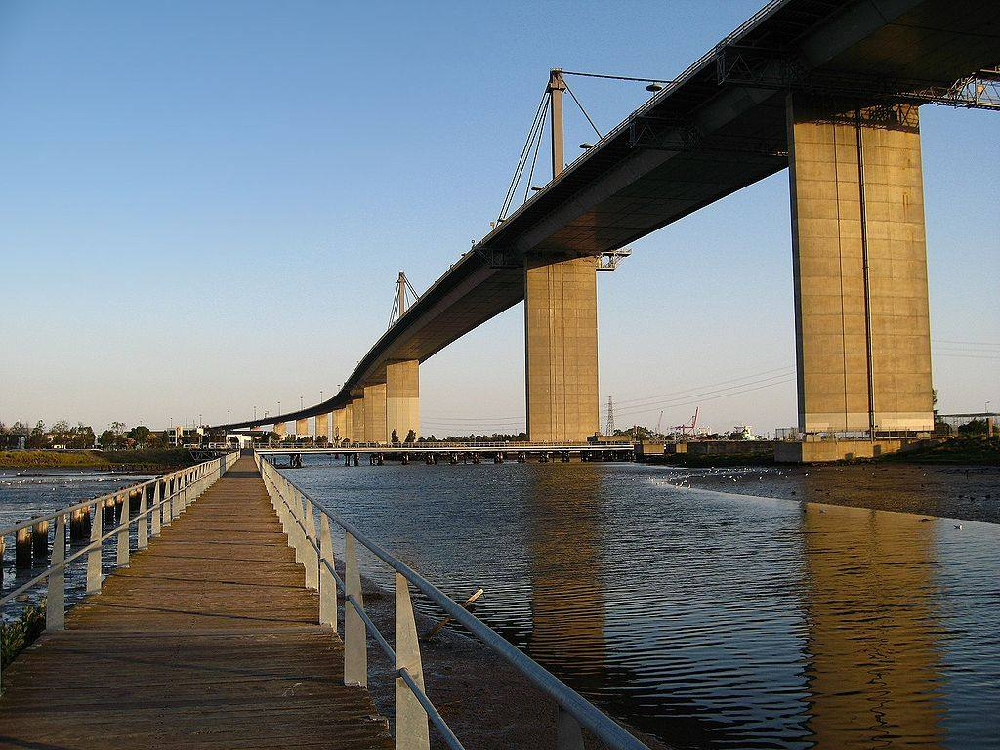{width="6.268055555555556in"
height="4.701042213473316in"}

{width="6.268055555555556in"
height="3.948140857392826in"}

**Melbourne's West Gate Bridge collapse left scene of carnage and 35
dead in 1970 horror**

> **PAUL ANDERSON**
>
> **HERALD SUN**
>
> **MAY 15, 2014 11:00AM**

[**3**](http://www.heraldsun.com.au/news/law-order/melbournes-west-gate-bridge-collapse-left-scene-of-carnage-and-35-dead-in-1970-horror/story-fni0fee2-1226917858522#social-comments)

{width="6.770833333333333in"
height="3.8125in"}

A lucky worker who survived the West Gate Bridge collapse is carried
clear of the disaster zone.

**IT WAS the morning the world fell from under their feet as they worked
atop the West Gate Bridge.**

Workers, from the supervisors to the riggers and the welders, heard
bolts pop from their sockets like exploding light globes. Steel groaned
in a futile effort to resist and maintain its integrity as gravity
pulled hard.

The section of bridge span in question was 128 metres of concrete and
steel.

The steel changed colour as it tried to hold on.

The concrete cracked and exploded.

The bridge's skeleton shook and trembled.

Then, in the blink of an eye, span 10-11 of the construction phase,
weighing in at 2000 tons, broke away and dropped 50 metres.

{width="6.770833333333333in"
height="10.416666666666666in"}

An aerial view of span 10-11 of the West Gate Bridge that broke away and
fell to the ground on October 15, 1970. 35 men died in the construction
disaster. Picture: Coroners Court of Victoria

The span crashed to the work yard below, and in to the Yarra River and
the surrounding mud. The West Gate Bridge, with all its promised glory,
had been under construction for some two years by that stage. A proposed
grand gateway, it was to connect the west with the east; link the
industries, docks and fruit and vegetable markets with the city and the
wealthier suburbs.

Eyewitness George Bastecky, a factory clerk, was watching through his
office window when the span gave way. "I was sitting at my office window
one storey above the street looking across the water at the bridge," he
said soon after the disaster. "I was thinking I would not like to be
working up there on such a windy day. Then I saw a crack appear two
thirds down the support column. It widened. I saw daylight. The support
column tumbled with a massive bang that shook the whole area.

"The bridge section was left dangling at a crazy angle. It was like slow
motion. Then it collapsed in a heap of rubble. The bang was monstrous.
It shook me out of my chair. I saw flames burst into the air."

{width="6.770833333333333in"
height="3.8125in"}

A diesel fire erupts atop the fallen span. Picture supplied: Coroners
Court of Victoria

{width="6.770833333333333in"
height="3.8125in"}

An aerial view of the fallen span, cracked down the middle. Picture:
Photo library News Corp Australia

Emergency services, priests, Salvation Army personnel and journalists
flocked to the area.

It was chaos.

Mayhem.

Like a war zone.

The state's worst industrial disaster.

A technical committee comprising City Coroner Harry Pascoe, three
professors and two doctors with expertise in civil engineering and
building construction also arrived on site. Their aim was to preserve
and record as much information as possible.

"The Salvation Army and clergymen from various denominations were there
to give aid to the injured," Mr Pascoe would later state in his finding.

"Rescuers worked all afternoon, in horrifying conditions and often in
peril of death or injury themselves."

{width="6.770833333333333in"
height="3.8125in"}

Rescuers clamber through the twisted debris in a desperate search for
survivors. Picture supplied: Coroner's Court of Victoria

{width="6.770833333333333in"
height="3.8125in"}

Other rescuers amid the desperate search not long after the collapse.
Picture supplied: Coroners' Court of Victoria

Many of the injured were rushed to Royal Melbourne Hospital.

"What the hell has happened?" one orderly asked as the victims began to
arrive.

"Is it a train crash?"

A *Herald *newspaper report stated: "Some of the victims were heavily
coated with oil ... Members of the hospital staff were bewildered by the
activity. Most of them had never seen anything like it.

"Six of the first seven were too sick to talk. The other one told an
ambulance driver: 'I was on top of the span.' Apparently he rode the
wreckage to the ground. He broke an arm and a leg --- he was one of the
lucky ones.

"In a room just inside the casualty entrance, doctors and nurses were
treating a man with head, arm and leg injuries. They were massaging his
heart and giving him oxygen. But an orderly said: "I think we are going
to lose him.'

"One man was in a critical condition. He was taken to the operating
theatre."

Many ambulances were redirected to other hospitals.

{width="6.770833333333333in"
height="3.8125in"}

A surviving victim is stretchered to an ambulance.

{width="6.770833333333333in"
height="3.8125in"}

An oil-covered survivor is carried clear of the carnage.

A total 35 men, most of them migrants, died that morning on October 15,
1970.

Some of the dead were eating lunch in construction huts below the span
when it dropped.

Others were crushed after falling while trapped inside the concrete
girders.

Some died after riding the concrete and steel to the ground.

Many lucky workers who rode the span to the ground survived the impact:
an impact heard and felt as far as 20km away.

{width="6.770833333333333in"
height="3.8125in"}

Priests and police mill around some of the dead and injured.

Their vivid recollections, told to journalists from their hospital beds,
were amazing.

Vincent Rosewarne, a 24-year-old crane operator, suffered broken arms
and a fractured leg after riding the broken span to the ground.

According to witnesses, he "struck a wire mesh at ground level which
bounced him back in the air like a trampoline while tons of steel
crashed around him".

"Two feet either way and I would have been dead," he told *The Herald*.

"There was this big rumbling and everything was flying towards the
centre of the bridge. I thought hell! She's giving way.

"I grabbed a big piece of steel and just held on while everything slid
down around me. After that I can't remember a thing until I woke up in
the ambulance."

John Thwaites, 42, said he felt like he'd "just gone 10 rounds with
Lionel Rose".

The bridge had opened beneath him, he said. "I found myself with nothing
to walk on so I grabbed a cross girder and held on right the way down. I
don't remember hitting the deck.

"I went out just before it happened and woke up in the mud where the
rescuers were pulling me out."

Peter Merola, 41, told the newspaper: "One minute I was standing on the
span. Then there was a great cracking sound and everything was falling.

"All the way down I kept thinking I could end up in hundreds of pieces.
Then I opened my eyes. "I was in great pain but still alive and I
started to scream for help."

A workman named in a newspaper as Mr E Halsall was under the bridge at
the time.

"I heard the bolts snapping and then I knew the structure was falling,"
he said.

"I ran for my life. The bridge was coming down and I thought I had no
hope. Then suddenly a gust a wind from the falling structure picked me
up and blew me 20 yards through the air.

"This blew me clear and it saved my life."

{width="6.770833333333333in"
height="5.083333333333333in"}

The fallen span sits atop workers' huts and partly submerged in the
Yarra.

A works supervisor described the collapse as like "an earthquake".

"Hundreds of tons of metal fell on eight wooden huts below," he said.

"A lot of blokes had just taken their lunches into the huts. The huts
were crushed."

Local man Ray Melroy was about a half a kilometre away when he heard "a
rumble".

"Then I heard five explosions in succession. I thought, 'God, the bridge
is going.'"

He rushed to the scene.

"I found three men lying dead in the wreckage. There was smoke
everywhere. It was a shambles. There was nothing I could do for the dead
men. Dozens of men were screaming. It was horrible."

Nick Grosso was on the span when it fell.

"I was welding when I felt the bridge start to shake," he said from his
hospital bed.

"Then she went. I went down with the span. It was an awful few seconds
... There were men lying all around me. Some of my mates were dead.
Others were moaning, 'Help, help, help.'"

George Stassoulakos told of the death of a Scottish workmate he knew
only as George.

"He'd been thrown clear of the wreckage but I could hardly recognise
him," Mr Stassoulakos recalled.

"I've never seen such a sight. George had been working with us near the
bridge trying to put copper plates into the wooden beams. When the span
came down a huge piece of steel landed right on top of him.

"I just had to leave him. There was nothing anybody could do for him."

It will be 44 years ago this year when the bridge collapsed.

{width="6.770833333333333in"
height="5.083333333333333in"}

The fallen West Gate Bridge span hit the ground with such force it
sprayed mud and debris, and shook the ground up to twenty kilometres
away. Picture: Coroners Court of Victoria

EVER since 1912 there'd been talk of carving a tunnel under the Yarra,
until the Victorian Public Works Department provided an estimated cost.

In 1965, the then Victorian State Government passed legislation giving
the Lower Yarra Crossing Authority, a private consortium of west bank
businessmen, the power to build and operate a toll bridge over the
river.

Construction began in 1968. Several companies were awarded contracts to
sink the foundations and supply and erect the central spans.

Australia's John Holland Construction Co was awarded the contract to
build the bridge and its approaches on both sides. Joint consulting
engineers for the project were the Melbourne-based firm of Maunsell and
Partners, for the concrete work, and Freeman Fox and Partners of London,
for the steelwork.

The Freeman Fox firm had been joint designers on the Milford Haven
Bridge in Wales, which had collapsed on June 2, 1970, killing four
workers.

{width="6.770833333333333in"
height="5.083333333333333in"}

Workers dig in for a rescue effort after the West Gate Bridge collapsed
during construction on October 15, 1970. Picture: Coroners Court of
Victoria

The cost of the West Gate project was first estimated at \$44 million,
but that figure would blow out to a staggering \$200 million by the time
the fiasco-plagued job was to be finished.

During construction, management had fought with unions, and rival unions
had squabbled among themselves. Despite demanding inquiries and answers
as the dust settled, the unions would much later be found to have
contributed to the collapse.

*Herald* journalist John Sorrell flew over the disaster zone not long
after the collapse. He described the "great tangled mass of fallen steel
scaffolding" as like "a collapsed deck of cards".

"It appeared as if the sky-blue scaffolding, ready to be cased in
concrete, had fallen on to a large flat top barge," he wrote.

"The force of the fall cut the barge in two, forcing its bow high up
into the air. The falling steel, the nucleus of one of the giant bridge
pylons, also appeared to have sliced through workmen's huts on the
barge.

"From the air I counted six ambulances. A police cordon controlled the
river. There appeared to be figures in the water."

Then Premier, Sir Henry Bolte, announced a Royal Commission.

{width="3.8125in"
height="5.083333333333333in"}

Sir Henry Bolte was quick to set up a Royal Commission to determine the
cause of the bridge collapse.

According to a *Sunday Review* piece, citizens and workers alike had
harboured doubts about the bridge's strength and design.

"A thousand Melbourne people muttered 'I knew it would never stand up,'"
the *Sunday Review *piece said.

"To some degree the concern shown by citizens also was shared by workmen
on the site. Steel workers working on the bridge's main span had not
been happy for months about the way things were going --- about 'bends'
in the 80 ton steel boxes that were being bolted together to cross the
Yarra, about the carrying capacity of the deck, about working in high
winds on the spans themselves."

There were also concerns from those working the concrete.

The article continued: "Much of this worrying on site can be simply
dismissed as scuttlebutt gossip. Workers on all jobs that are big and
new worry and gossip about construction methods. "And this bridge was
going to be the biggest and best in the southern hemisphere --- bigger
than Sydney's, longer than Sydney's, higher than Sydney's.

"The site engineers did not share the qualms ... but all the gossip,
speculation, care and pride ended at 11.50am when a 384-foot steel
section of the bridge weighing 2000 tons fell down, putting at least a
temporary end to Melbourne's dream of being biggest and best in at least
one thing.

"Did it fall down just because of rotten bad luck, faulty construction
method, construction haste following delays or design fault? Let us hope
that the Royal Commission gives a rapid answer."

After the tragedy, two British bridge experts --- Sir Ralph Freeman and
Dr Oleg Kerensky --- arrived to survey the carnage.

{width="6.770833333333333in"
height="5.083333333333333in"}

*The fallen West Gate Bridge span sits partly submerged in the Yarra
River after it broke away and fell, killing 35 men, during construction
on October 15, 1970. Picture: Coroners Court of Victoria*

Both were senior partners with Freeman Fox and Partners.

"The design is in no way related to the cause of the tragic collapse,"
Sir Freeman was quoted as saying.

Dr Kerensky said: "The design of the bridge was modern but not radical
--- it was based on tried and tested ideas."

During a lengthy hearing, the Royal Commission was told the genesis of
the collapse could be traced back to eleven months before the tragedy
--- when span 10 buckled. Bolts were removed to realign two girders with
the span.

"They should have taken down the already erected part and realigned them
on the ground and re-erected it," one witness told the Commission
hearing.

In a 293-page report released in August 1971, the Royal Commission found
that the project was riddled with errors, infighting and poor
management.

"Error begat error and the events which led to the disaster moved with
the inevitability of a Greek tragedy," the report stated.

It said the disaster was "utterly unnecessary" and "inexcusable".

"The reasons for the collapse of span 10-11 are to be found in the acts
and omissions of those entrusted with building a bridge of a new and
highly-sophisticated design," the commissioners said.

"The various companies who supplied the materials used were not shown to
be in any way at fault and must be held blameless. However, among those
engaged upon the design and construction of the steel spans there were
mistakes, miscalculations, errors of judgment, failure of communication
and sheer inefficiency.

"In greater or less degree, the Authority itself, the designers, the
contractors, even the labour engaged in the work must all take some part
of the blame."

Freeman Fox and Partners' "extraordinarily high reputation" was the
source of "some trouble" during construction, the report said.

"It seems to us that some, at least, of the other parties were dazzled
by the firm's reputation to the point of uncritical acceptance of its
design and advice," the commissioners said.

They went on: "Throughout the construction and erection of the steel
spans there was an extraordinary amount of industrial trouble ... For
their behaviour on the contract, which inevitably led to the quite
unnecessary weakness of the span at the relevant time, the unions and
men must bear their share of responsibility for the tragedy that
ensued."

{width="6.770833333333333in"
height="3.8125in"}

Workers' huts lie crushed and smashed in the aftermath of the collapse.

In a later coronial finding, Coroner Pascoe laid a portion of the blame
on Freeman Fox and Partners for its failure to "give proper and careful
evaluations to design" and a "failure to check the safety of the system
of erection proposed by World Services and Construction Pty Ltd."

"(This) meant in the end, that the safety margins were inadequate," the
coroner stated.

He also apportioned some blame to what he described as "a type of
industrial blackmail" that happened throughout construction.

Mr Pascoe found that 33 men died at the site and two passed away in
hospital.

He listed the deaths of 33 men as the result of misadventure.

He said the deaths of two men, engineers Peter Crossley and Jack
Hindshaw who contributed to the collapse, were caused by accident and
misadventure.

Independent consultants needed to "thoroughly re-examine" the design to
assure the future safety of the structure, the Royal Commission had
decided.

{width="6.770833333333333in"
height="5.083333333333333in"}

*The last section of the rebuilt West Gate Bridge is slowly lifted into
place in May 1978, finally providing a fast road link between Melbourne
and the west. Picture: HWT book Moments In Time*

A completed West Gate Bridge was opened in November 1978.

Despite the recent discovery of cracks in the road surface, it still
stands strong as a gateway connecting our east and west.

{width="6.268055555555556in"
height="4.183927165354331in"}

{width="6.268055555555556in"
height="4.701042213473316in"}

{width="6.268055555555556in"
height="4.16522419072616in"}

West Gate Bridge crosses the mouth of the Yarra River in Melbourne,
Australia. Its 2.6km overall length comprises two concrete box girder
high level approach viaducts either side of an 850m long, 5-span cable
stayed steel box girder bridge with a 336m main span. The bridge forms a
vital link in Melbourne's main East -- West transport corridor.

{width="6.268055555555556in"
height="2.4799693788276467in"}

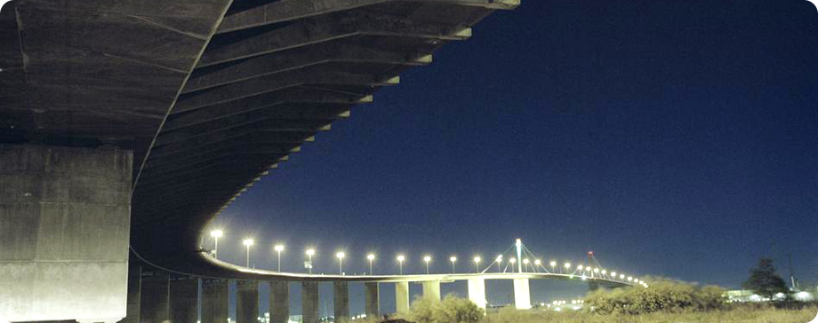{width="6.268055555555556in"
height="2.4799693788276467in"}

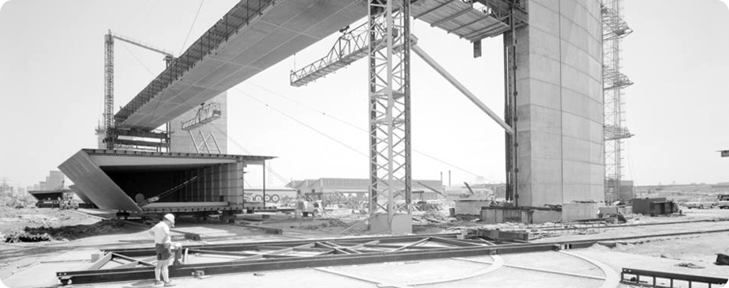{width="6.268055555555556in"
height="2.4799693788276467in"}

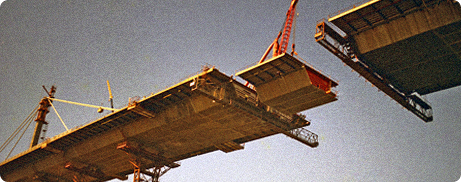{width="6.268055555555556in"
height="2.4799693788276467in"}

**The Westgate Bridge -** Text from the articles used.

The West Gate Bridge is a steel box girder cable-stayed bridge in
Melbourne, Victoria, Australia. It spans the Yarra River, just north of
its mouth into Port Phillip, and is a vital link between the inner city
(CBD) and Melbourne\'s western suburbs; with the industrial suburbs in
the west and with the city of Geelong, 80 kilometres (50 mi) to the
south-west. It is one of the busiest road corridors in Australia.

The main river span is 336 metres (1,102 ft) in length, and the height
above the water is 58 metres. The total length of the bridge is 2,582.6
metres (8,473.1 ft). It is the third longest in Australia behind the 3.2
kilometre Macleay River Bridge and the Houghton Highway along with its
twin the Ted Smout Memorial Bridge, and is twice as long as the Sydney
Harbour Bridge. It is one of the highest bridges in Australia, most
notably trailing the more iconic Sydney Harbour Bridge.

The bridge passes over Westgate Park, a large environmental and
recreational reserve created during the bridge\'s construction. The
bridge carries up to 200,000 vehicles per day. -- Wikipedia

**Melbourne's West Gate Bridge collapse left scene of carnage and 35
dead in 1970 horror**

> **PAUL ANDERSON**
>
> **HERALD SUN**
>
> **MAY 15, 2014 11:00AM**

**IT WAS the morning the world fell from under their feet as they worked
atop the West Gate Bridge.**

Workers, from the supervisors to the riggers and the welders, heard
bolts pop from their sockets like exploding light globes. Steel groaned
in a futile effort to resist and maintain its integrity as gravity
pulled hard.

The section of bridge span in question was 128 metres of concrete and
steel.

The steel changed colour as it tried to hold on.

The concrete cracked and exploded.

The bridge's skeleton shook and trembled.

Then, in the blink of an eye, span 10-11 of the construction phase,
weighing in at 2000 tons, broke away and dropped 50 metres.

The span crashed to the work yard below, and in to the Yarra River and
the surrounding mud. The West Gate Bridge, with all its promised glory,
had been under construction for some two years by that stage. A proposed
grand gateway, it was to connect the west with the east; link the
industries, docks and fruit and vegetable markets with the city and the
wealthier suburbs.

Eyewitness George Bastecky, a factory clerk, was watching through his
office window when the span gave way. "I was sitting at my office window
one storey above the street looking across the water at the bridge," he
said soon after the disaster. "I was thinking I would not like to be
working up there on such a windy day. Then I saw a crack appear two
thirds down the support column. It widened. I saw daylight. The support
column tumbled with a massive bang that shook the whole area.

"The bridge section was left dangling at a crazy angle. It was like slow
motion. Then it collapsed in a heap of rubble. The bang was monstrous.
It shook me out of my chair. I saw flames burst into the air."

Emergency services, priests, Salvation Army personnel and journalists
flocked to the area.

It was chaos.

Mayhem.

Like a war zone.

The state's worst industrial disaster.

A technical committee comprising City Coroner Harry Pascoe, three
professors and two doctors with expertise in civil engineering and
building construction also arrived on site. Their aim was to preserve
and record as much information as possible.

"The Salvation Army and clergymen from various denominations were there
to give aid to the injured," Mr Pascoe would later state in his finding.

"Rescuers worked all afternoon, in horrifying conditions and often in
peril of death or injury themselves."

Many of the injured were rushed to Royal Melbourne Hospital.

"What the hell has happened?" one orderly asked as the victims began to
arrive.

"Is it a train crash?"

A *Herald *newspaper report stated: "Some of the victims were heavily
coated with oil ... Members of the hospital staff were bewildered by the
activity. Most of them had never seen anything like it.

"Six of the first seven were too sick to talk. The other one told an
ambulance driver: 'I was on top of the span.' Apparently he rode the
wreckage to the ground. He broke an arm and a leg --- he was one of the
lucky ones.

"In a room just inside the casualty entrance, doctors and nurses were
treating a man with head, arm and leg injuries. They were massaging his
heart and giving him oxygen. But an orderly said: "I think we are going
to lose him.'

"One man was in a critical condition. He was taken to the operating
theatre."

Many ambulances were redirected to other hospitals.

A total 35 men, most of them migrants, died that morning on October 15,
1970.

Some of the dead were eating lunch in construction huts below the span
when it dropped.

Others were crushed after falling while trapped inside the concrete
girders.

Some died after riding the concrete and steel to the ground.

Many lucky workers who rode the span to the ground survived the impact:
an impact heard and felt as far as 20km away.

Priests and police mill around some of the dead and injured.

Their vivid recollections, told to journalists from their hospital beds,
were amazing.

Vincent Rosewarne, a 24-year-old crane operator, suffered broken arms
and a fractured leg after riding the broken span to the ground.

According to witnesses, he "struck a wire mesh at ground level which
bounced him back in the air like a trampoline while tons of steel
crashed around him".

"Two feet either way and I would have been dead," he told *The Herald*.

"There was this big rumbling and everything was flying towards the
centre of the bridge. I thought hell! She's giving way.

"I grabbed a big piece of steel and just held on while everything slid
down around me. After that I can't remember a thing until I woke up in
the ambulance."

John Thwaites, 42, said he felt like he'd "just gone 10 rounds with
Lionel Rose".

The bridge had opened beneath him, he said. "I found myself with nothing
to walk on so I grabbed a cross girder and held on right the way down. I
don't remember hitting the deck.

"I went out just before it happened and woke up in the mud where the
rescuers were pulling me out."

Peter Merola, 41, told the newspaper: "One minute I was standing on the
span. Then there was a great cracking sound and everything was falling.

"All the way down I kept thinking I could end up in hundreds of pieces.
Then I opened my eyes. "I was in great pain but still alive and I
started to scream for help."

A workman named in a newspaper as Mr E Halsall was under the bridge at
the time.

"I heard the bolts snapping and then I knew the structure was falling,"
he said.

"I ran for my life. The bridge was coming down and I thought I had no
hope. Then suddenly a gust a wind from the falling structure picked me
up and blew me 20 yards through the air.

"This blew me clear and it saved my life."

The fallen span sits atop workers' huts and partly submerged in the
Yarra.

A works supervisor described the collapse as like "an earthquake".

"Hundreds of tons of metal fell on eight wooden huts below," he said.

"A lot of blokes had just taken their lunches into the huts. The huts
were crushed."

Local man Ray Melroy was about a half a kilometre away when he heard "a
rumble".

"Then I heard five explosions in succession. I thought, 'God, the bridge
is going.'"

He rushed to the scene.

"I found three men lying dead in the wreckage. There was smoke
everywhere. It was a shambles. There was nothing I could do for the dead
men. Dozens of men were screaming. It was horrible."

Nick Grosso was on the span when it fell.

"I was welding when I felt the bridge start to shake," he said from his
hospital bed.

"Then she went. I went down with the span. It was an awful few seconds
... There were men lying all around me. Some of my mates were dead.
Others were moaning, 'Help, help, help.'"

George Stassoulakos told of the death of a Scottish workmate he knew
only as George.

"He'd been thrown clear of the wreckage but I could hardly recognise
him," Mr Stassoulakos recalled.

"I've never seen such a sight. George had been working with us near the
bridge trying to put copper plates into the wooden beams. When the span
came down a huge piece of steel landed right on top of him.

"I just had to leave him. There was nothing anybody could do for him."

It will be 44 years ago this year when the bridge collapsed.

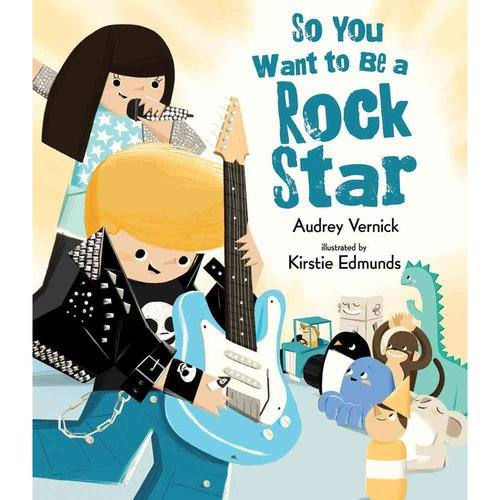{width="5.208333333333333in"
height="5.208333333333333in"}

Want to learn to play air guitar? Wear the coolest rock-star clothes?
Sign your autograph for tons of fans? Then this is the book for you!
Perfect for young fans of Rock Band or the Disney pop stars, So You Want
to Be a Rock Star is the essential primer on everything rock 'n' roll.
With a hilarious interactive text that encourages young readers to get
up and move and perfectly retro illustrations that balance fantasies of
stardom with real-world rocking out, this book has something for
everyone---budding singers, musicians, and their parents,

**So You Want to be a Rock Star Audrey Vernick**

You want to be a rock star?

Let's see if you have what it takes.

Do you have an awesome sound system with cordless microphones?

**Oh.**

Well. can you make your hand into a fist and sing into that?

Terrific!

Do you have a really cool electric guitar?

That's okay.

Can you hold your left hand out to the side and strum your stomach with
your right hand?

**Give it a try.**

**You rock!**

This is very important: while you're strumming your stomach, can you
also close your eyes and make the kind of faces you make when your
stomach really hurts? And move your head slowly from side to side?

Try it now.

Check you out! You're so good at this.

Oh, wait.

Are you a great singer?

**Hmm.**

When you open your mouth and try to sing, does a song come out?

Your voice doesn't need to be perfect. Just really loud.

Do you know what a sneer is?

It's like a real tough-like smile.

Can you sneer?

Look in the mirror.

You might be the **Next Big Thing.**

Now we're getting to advanced techniques.

Can you act like a rock star in one spot, then run across the stage and
act like a rock star over there?

Maybe even stand next to another person who's acting like a rock star
too?

Get someone to try it with you. How hot are you?

One thing rock stars like to do is yell to the audience.

Shout the name of your town, and then say, "Are you ready to **rock**?"

Imagine the crowd roaring back at you. Fun right?

Rock stars need to stand out from the crowd.

Do you have awesome-crazy clothes?

Can you borrow some?

Do you have awesome-crazy hair? Can you borrow some?

You need to make some decisions about your concerts and music videos.

Are you the kind of rock star who has dancers on stage?

If you are, hire some.

Or teach everyone in your family how to dance. **Start now.**

Do you have a website? And a huge fan club?

How about a limousine? No? That's okay. Do you ahve a driver?

Wow. Who's cooler than you?

You may end up with your own TV show.

You should probably start thinking about your theme song. One snappy
idea is to sing your first and last name four times, starting quietly
and getting louder each time.

**Let's hear it!**

Make sure your theme song rocks. Because if there's a you-movie, you'll
be hearing it a lot.

And if amusement parks add you-rides, well, WOW.

Of course, whenever you leave your home, you'll be mobbed by fans.

Come up with a fast way to sign your name, because all those fans will
want your autograph.

**Try it!**

**What?**

Oh well, I'm sure you'll master cursive soon.

And then you'll be the

**biggest**

**rock star**

**ever.**

(Until then, a fancy squiggle might be just the thing.)

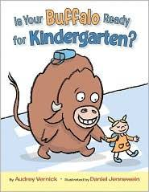{width="1.9270833333333333in"
height="2.4895833333333335in"}

\"Audrey Vernick\'s witty, conversational text reads like a pep talk as
she transfers typical first-day anxieties from child to buffalo with
hilarious consequences \... The diversity of the students in buffalo\'s
classroom is also a nice touch in this book that celebrates the
differences among us \... Provides a welcome reprieve from the standard
back-to-school, easing-the-jitters books. Two hooves up.\"

> \~The Tampa Tribune

Story Summary

Your buffalo is growing up. He plays with friends. He shares his toys.
He\'s smart! But is he ready for kindergarten? (And is kindergarten
ready for him?) An hilarious look at first-day-of-school jitters.

Words of Wisdom

Do your students remember their first day of school? What was exciting?

Surprising? Scary? Compose a group letter to next year's class offering
advice

for success.

Discussion Starters

1\. Where is the buffalo going? (knowledge)

2\. How does the buffalo feel on his first day of Kindergarten?
(comprehension)

3\. If a nervous buffalo came into your classroom on the first day of
school, what would you say and do to make him feel better? (application)

4\. Look at the illustration on the title page. What are the people in
the bus

thinking? What is the buffalo thinking? What could happen next? Now look
at the illustration on the last page. How will the girl convince the
buffalo to come home? (analysis)

5\. Sometimes the buffalo feels shy because he's so different from
everyone else. In the end, he discovers that "Everyone's special in his
or her own way." What makes you special? Draw a self-portrait and add
"\_\_\_\_\_\_\_\_\_ is special because

\_\_\_\_\_\_\_\_\_\_\_\_\_\_\_\_\_\_\_\_\_\_\_\_\_\_\_\_." (synthesis)

6\. The book begins with: "Some people say Kindergarten is no place for
a buffalo. How crazy is that?"

Do you think Kindergarten/Prep is a good place for a buffalo? Why or why
not?

Brainstorm ideas for good and bad places for buffaloes. (evaluation)

Good places for a buffalo: Bad places for a buffalo:

**Is Your Buffalo Ready for Kindergarten? Audrey Vernick**

Some people say kindergarten is no place for a buffalo.

How crazy is that?

Does your buffalo have a backpack?

Well, then. He's definitely ready for kindergarten.

Is he feeling shy? That's okay. It can be hard to start something new.

Especially when your buffalo will be the only one with horns.

And a mane. Okay, and a hump.

But who can resist that furry face?

Is he worried about being the only one who's not good with scissors?

Or the only one afraid of scissors? Begin simply.

Have your buffalo hold the scissors.

Okay, maybe your buffalo can't cut -- yet!

But maybe most kids aren't the state animal of Oklahoma. Or pictured on
old nickels.

Everyone's special in his or her own way.

That's the kind of thing you learn in kindergarten

Won't your buffalo just love recess? He may need time to get used to the
No Grazing rule. And swings may not be for everyone.

But school-yard games are! Some kids are great hiders. Others are good
seekers.

And your buffalo is the very best hiding spot ever.

Finger painting is such fun! Remind your buffalo: It's okay to get
messy. No true artist stays clean. And you never know what kind of
masterpiece those hooves might create.

Cooperating and taking turns are both Very Big Deals in kindergarten.

But your buffalo may sometimes get frustrated. Like when someone takes
his building blocks. Or calls him Fluppalo.

Another buffalo might be tempted to nudge those kids.

But not your buffalo. He'll stop, take a deep breath, and remember the
Rules for Sharing and Caring.

That's why kindergarten's so great. You learn to get along without using
your horns.

Snack time!

Your buffalo is probably looking forward to sharing treats with a
classmate. But he may be the only one who eats grass, then throws it up
in his mouth and eats it again.

Remember: Everyone's special in his or her own way.

Your buffalo will want to look sharp on school picture day. Does he have
a favourite shirt? Suit? Tie?

It's not always easy for a well-dressed buffalo to stay spiffy.

That's okay, as long as he smiles that mighty buffalo smile.

Can your buffalo balance ona tightrope?

Kidding! He doesn't need to do that. Unless he's going to clown
kindergarten.

Sometimes it's hard to decide who to play with. Or to sit next to at
story time. This will not be a problem for your buffalo. True, he might
be the tiniest bit smelly.

But he's so cheerful and friendly. Not to mention warm and cuddly.

Anyone who sees kindergarten is no place for a buffalo has definitely
not met yours. He belongs there. He loves it! In fact, he may not ever
leave.

Good luck with that.

{width="6.268055555555556in"
height="8.35740704286964in"}

**Audrey Vernick**

How did you get the idea for Is Your Buffalo ready for Kindergarten?

Before writing Is Your Buffalo Ready for Kindergarten, I wrote what will
be its sequel, Teach Your Buffalo to Play Drums (to be released in
2011). I was sitting with my son, waiting for the school bus. He had to
bring pumpkin muffins to school for a consumer science class. Our dog
was sniffing around those muffins. I said something along the lines of,
\"He\'s going to follow you to school. You\'re going to have to teach
your dog to bake.\" And then I said, \"A smarter writer than I would
take that idea and run with it. Teach your dog to bake. Teach your cat
to surf. Teach your buffalo to play drums\...\" When I was walking the
dog, later that morning, at least half the text of Teach Your Buffalo To
Play Drums came to me. When HarperCollins acquired the book, they
offered me a two-book deal and we all agreed that a kindergarten book (I
had been working on another, about an abominable snowman attending
kindergarten) would be a good way to introduce the buffalo character.

2\. Once the idea came to you, what happened next? Did you jot it down
right away? Let it simmer?

Teach Your Buffalo to Play Drums was the fastest book I ever wrote. I
had a first draft that day. The kindergarten book took a bit longer to
get right.

3\. What was the hardest part about writing this book? The most
rewarding?

I learned a lot in the revision process on this book. My editor and I
found a way to balance each other. I tended to write in a snarkier tone,
and she worked to balance in more encouragement and sweetness. In the
end, I think we found a really nice balance.

4\. How did the illustrations come about?

The art director of HarperCollins had met a new illustrator, Daniel
Jennewein, when attending the Bologna Children\'s Book Fair. She thought
he might be just right for this project. She sent Daniel the text and
asked him to create some sketches. What he sent back impressed us all so
much. The humour in Daniel\'s artwork just blows me away. I\'m still
trying to figure out how his fairly simple buffalo eyes and eyebrows
convey so much emotion. Writers always hope that the illustrator the
editor chooses will bring something special to the project\--something
the writer herself can\'t even envision. Daniel did all that and more.

5\. How did you know you wanted to become a writer?

In college, writing classes were the only ones that came easily to me. I
was very surprised when my professors responded well to what I wrote. I
am so grateful to them for treating me like I was a writer, because I
think it gave me an inkling that I could be one.

6\. Do you have a writing routine?

I am not a writer with daily discipline. I have two children and though
they\'re not young anymore (the younger one is 11) I\'m very mindful of
the fact that they will only live in my home for a finite amount of
time. College is only four years away for the oldest. When I\'m working
on longer works, novels, I try to find large, uninterrupted blocks of
time for my work. But for my picture books, especially once a first
draft is completed, I find it easy to work in whatever little bits of
time I have.

7\. What advice do you have for young writers?

I have advice that no one wants to hear. I wouldn\'t have wanted to hear
it when I was a young writer. But here it is: publication does not have
to be your immediate goal. Publication is not the only way to mark the
success of a writer. If your writing entertains, or helps you understand
a problem, or makes you happy, then that\'s successful writing, too.
There are two things you need to do to become a good writer: read and
write a lot. The other \"secret\" that I didn\'t know when I was young
is that first drafts are only the very beginning. Excellent writing
emerges when you keep working on the same text over and over\--through
the revision process.

8\. When you aren't writing, what are some of your favourite things to
do?

I\'m an avid baseball fan. I can\'t play! But whenever the Yankees are
playing, I\'m watching or listening. I read a lot. I enjoy hanging out
with my family. I take very long walks with my dog, Rookie, every day;
almost all my writing ideas come to me on those walks or in the shower.
I love the beach, and am so happy to live a short drive away.

9\. What do you remember most about Kindergarten? My teacher, Miss
Katinas, was a first-year teacher. I thought she was the most wonderful
person alive. I adored playing in the kitchen area, which is kind of
funny to me now because I\'m not a very good cook. I only remember one
bad day in kindergarten. Miss Katinas asked each of us to think of a
word that rhymed with our names. Each child, one at a time, went up to
tell her the rhyming word. I remember Lisa rhymed her name with
\"pizza.\" I was outraged, as I didn\'t think that was a true rhyme. And
I was in a panic, as I didn\'t know any words that rhymed with Audrey.
(I also wondered what Gregory was going to say.) When it was my turn, I
asked, meekly, \"Does it have to be a real word?\" I could see the
empathy in Miss Katinas\' face as she assured me that made-up words were
just fine. I invited Miss Katinas and her fiancée to attend my dance
recital. They did! And they invited me, and the class, to attend their
wedding at the United Nations.

10\. Most importantly, have you ever gone to school with a buffalo?

Not yet. I\'m pretty sure, though, that on one of my school visits,
there will be one waiting to meet me. And I have so much to tell him!

**An Interview with Illustrator Daniel Jennewein**

{width="1.8333333333333333in"
height="2.1770833333333335in"}

1.  When did you begin to think of yourself as an artist?

I've been drawing since I was a young child. In kindergarten, my
favourite thing to draw was skulls, though I also drew a lot of animal
scenes. When I went to art school, I chose design over illustration
because I was more drawn to design at the time. I worked as a designer
for many years, but the whole time, I continued drawing. Last year I
decided to become a fulltime illustrator.

2.What type of media do you like working with the most?

I use black fine liner pens or thick black pencil to draw. Then I
usually scan my work in and colour it using Photoshop. I also like to
experiment with watercolours and other techniques, trying out different
things to find what serves the subject matter best.

3.How did you break into the children\'s book illustrating profession?

Children's books are a great platform for humorous illustration, which
I've always been interested in. I started working on some ideas for
books and joined the Society of Children's Book Writers and Illustrators
to learn about the craft. In 2008, I attended a SCBWI conference at the
Bologna Children's Book Fair in Italy and had the opportunity to show
some of my work to art directors from major publishing houses. That's
how I got the opportunity to do this book.

4\. Did you collaborate with the author as you did the illustrations?

An art director who saw my work in Bologna contacted me and told me she
had a story that she thought fit my style. The author and I have never
even met, but I hope we can someday.

5\. How long did it take to illustrate IS YOUR BUFFALO READY FOR
KINDERGARTEN?

About three months altogether. Once I got the finished manuscript, I did
first sketches and character design which took me a couple of weeks.
Then the publisher decided to revamp the story, so after a lot of
waiting, I got the manuscript again and did a second round of sketches.
Once these were approved, I spent a few weeks on final artwork.

6\. How did you decide on an illustration style for the book?

The tone of the story determines the style. Because this story is so
quirky and fun, I envisioned a bold look with strong black outlines and
fresh slightly muted colours. The outlines are done with a black caran
d'ache pencil on watercolour paper. The colouring I did in Photoshop.

7\. Are any of the characters or the setting modelled on real-life
people and places?

Although I did get very close to real buffaloes on my trip to South
Dakota, I didn't model this buffalo after them because they were much
too serious. A few of the kids are in fact modelled after friends and
family. The boy who wears glasses is reminiscent of my father, while the
red haired boy and Asian girl look a lot like best friends of mine.

8\. Pablo Picasso once said, \"All children are artists. The problem is
how to remain an artist once he grows up.\" Do you agree?

I agree. As a child, you have no inhibitions and draw whatever you feel
like. Later, the more you are criticized and the more you are taught
what is acceptable and what is "good", the more you become
self-conscious. Maybe you stop drawing because you think others are
better than you or at least you stop drawing whatever comes into your
head. It's more thought out and based on being accepted by teachers and
peers. To remain an artist, you have to learn how to lose the
inhibitions you built up and you have to be brave enough to define your
own style instead of just doing what is expected.

9\. What do you like to do in your spare time?

Even though illustration is my profession, I still do a lot of drawing
in my spare time too. I try to do at least one drawing every day. I also
enjoy travelling (I've been to over 40 countries), hiking and biking in
nature, bikram yoga, escrima (stick fighting), going to the cinema,
reading and hanging out with my wife, family and friends.

10\. What advice do you wish someone had given you on first day of
Kindergarten?

Don't eat the glue.

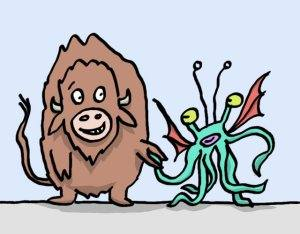{width="3.125in"
height="2.4375in"}

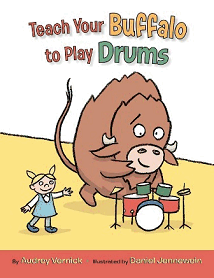{width="2.2291666666666665in"
height="2.8958333333333335in"}

**Teach Your Buffalo to Play the Drums Audrey Vernick**

Does your buffalo pound on pots and pans?

Tap out rhythms at the dinner table?

It's not as unusual as you might think.

He's simply at the start of an exciting new journey.

A very loud musical journey that begins by teaching your buffalo to play
drums.

(Did we mention it might be loud?)

From the author and illustrator of Is Your Buffalo Ready for
Kindergarten? comes this hilarious musical romp about encouraging your
buffalo to find his inner rock star.

**Teach Your Buffalo to Play Drums Audrey Vernick**

**BOOOOOOOOM!**

I think your buffalo is trying to tell you something. He was born to
play drums. You have to teach him how.

People may think that's silly. But you must be used to that. Did anyone
say, "Hey, that's a really great idea!" when you brought a baby buffalo
home?

But once they got to know your buffalo \... that changed. Everyone loves
your buffalo! He's so sweet. And fun. And fantastically shaggy! He's
probably really, really talented, too.

Has your buffalo always loved music? Does he hum when he's cleaning his
room? Sing in the shower? Has he written a symphony? (Joking! Most
buffaloes don't write their first symphonies until middle school.)

How's his rhythm? Did he dance to the beat at Baby Rocks! music class?

Does he clap along when he hears his favourite song?

No? Don't worry. Clapping is so tricky with hooves. But that's okay.
Drumming *teaches* rhythm!

But wait. You're unsure. You're thinking about his closet. Look inside.
Four ice skates. A surfboard. That magic kit. How-to-speak-Chinese CDs.
Scuba gear.

"It's different this time," your buffalo whines in his buffalo way.

(Tell your buffalo not to whine,) Why not give it a try?!

Are you worried about all the time he'll spend drumming? The lessons?
The practicing? And how once he gets good, and maybe joins a band, he
won't have time to skateboard? Go to the library? Graze? Stop worrying.
This is going to be great.

Set up your buffalo's drum set. Does he have a good stool to sit on?
This can be a challenge. be creative. (Your buffalo is so lucky! All
those extra body parts to help him balance!)

Ready? Okay, hand him two drumsticks. He may have trouble holding them
at first.

Don't let your buffalo get frustrated! Cheer him on! Encourage him! Of
course, you can also try yarn. Now, let's get that buffalo drumming! You
might not know this, but drums can be kind of loud. And when a buffalo's
involved, well, that's loud times twelve! You'll want to find a room
that has been soundproofed.

If you can't, just give earplugs and earmuffs to everyone in your house.
And on your block.

Wow! Look at him go! He's a natural! What big sound! He has mighty
power! Buffalo power! That kind of talent is meant to be shared. He
should join the school band! Your buffalo will get to perform with other
musicians as talented as he is. He'll discover the magic of a band. The
way all those different sounds

**TOOT!** combine to create one amazing sound. **BANG! TWEET! STRUM!
SWEE! SCASH!** (If the magic's not happening, those earmuffs might come
in handy.)

Some people think that being the loudest isn't the most important part
of being a good bandmate.

Your buffalo isn't one of those people.

He puts his heart and soul and massive buffalo body into every
rehearsal.

They'll be ready for the big show in no time! And what's more thrilling
than a school band concert?

Shhhhh! They're getting ready to perform. What a big moment!

Look at your buffalo! Look at the audience! This is so exciting! Get
your camera!

Um.

I think your buffalo's trying to tell you something.

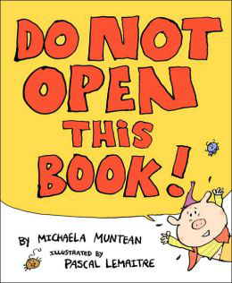{width="2.7083333333333335in"
height="3.2916666666666665in"}

How DO NOT OPEN THIS BOOK! came to be

Like many writers, I'm frequently asked where the inspiration for a
story comes from. As you can see from Stay, it came from a chance
encounter. In the case of Do Not Open This Book!, the idea originated
with a drawing sent to me by Pascal Lemaitre. It was the sketch of a dog
furiously binding together the pages of a book. I asked Pascal what the
book was about and he said he didn't know. The dog doesn't know either,
he added, "I think he's getting the pages ready so he can start
writing."

I jotted "an unwritten book" below the drawing and tacked in on the wall
of my office. It stayed there for months and every time I glanced at it,
it made me smile. I began to think about the idea of building a book. I
thought about what that meant---blank pages and piles of words. I also
thought about the care with which a writer must choose words. So I set
to work writing a story about writing a story. Eventually, the dog
became a pig, and Do Not Open This Book! was born.

So...where do ideas come from? They can come from anywhere; it's where
you take them that can make it interesting. If you'd like to be a
writer, my most important advice is to pay attention. There are ideas
all around you. Say yes to opportunities, to things you seemingly know
nothing about. Take paths you never thought you'd travel. See where they
lead you.

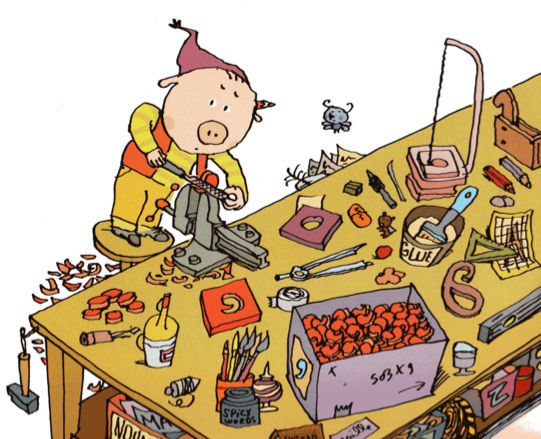{width="5.635416666666667in"
height="4.572916666666667in"}

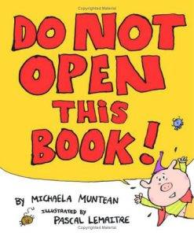{width="1.7708333333333333in"
height="2.15080927384077in"}In

Michaela Muntean's hilarious book, *Do Not Open This Book,*gives kids
free reign to disobey. A rather disgruntled pig is attempting to write a
book, but can't seem to get any work done since kids keep turning the
pages on him. And while he becomes more and more agitated, your kids
will become more and more delighted by the idea of driving this poor pig
to absolute insanity. The fantasy elements of the pig nailing words to
the wall to keep them from falling off the page and the subtext of
having to choose one's words carefully when telling a successful story
are all part of what make this little book so entertaining. That, and
Pascal Lamaitre's cartoon-like illustrations bring the pig and his
ever-growing frustrations to life. (For those of you old enough to
remember the Sesame Street book *Please Do Not Open This Book*,
featuring Grover and a bevy of furry monsters, the premise will seem
similar...and yet it's nice to see a new and different version done so
well...) I dare you not to open this book. And I double dog dare you not
to love it.th spirit of Mo Willem's Don't Let the Pigeon -like
illustrations bring the pig and his ever-growing the pig and his
ever-growing frustrations to life. (For those of you old enough to
remember the Sesame Street boo k Please DODDDDD NOT OPEN THIS Not Open
This featuring Grover and a bevy of furry monsters, the premise will
seem

One could say Michaela Muntean's prologue is the book's cover and title
page. **DO NOT OPEN THIS BOOK!** is presented as a dialogue balloon on
the cover. Naturally, we open the book.  It's a book. Pages two and
three depict the surprised expression of the character we saw on the
cover. Then BOOM we enter the narrative hip-deep in tension.

{width="1.5625in"
height="1.2604166666666667in"}

***Excuse me**, but who do you think you are, opening this book when the
cover clearly says **DO NOT OPEN THIS BOOK!?** If a sign on a door
reads [DO NOT ENTER]{.underline}, do you enter? Of course you don't. The
least you would do is **KNOCK FIRST**!*

In this case we (as reader) are not only pulled into the story's
tension, we ARE the cause of tension.  Each reader is the antagonist.
One can't get more involved that that.

These approaches (A Visitor for Bear) won't work for all picture books,
but there is no reason not to explore such options. Play is the name of
the game. Free play is our source of fresh ideas.

**DO NOT OPEN THIS BOOK! Michaela Muntean**

"Excuse me, but who do you think you are, opening this book when the
cover clearly says DO NOT OPEN THIS BOOK!?

If a sign on a door reads DO NOT ENTER, do you enter?

Of course you don't. The least you would do is KNOCK FIRST.

The reason you weren't supposed to open this book is because it is not
yet written.

LOOK AT THIS BLANK PAGE.

LOOK AT THIS JUMBLE OF WORDS.

You think it's easy to put words together? HAH! Now go away. I need time
to think.

Now what? Can't you see I'm busy? I am trying to decide what type of
story to write.

Perhaps I will write a scary story \...

\... or maybe a bedtime story.

After you go to sleep, I will be able to get to work. Even if you are
snoring, it will be better than having you \...

STARE AT ME.

AAAARGH. Why are you still here? Okay, I have an idea.

If you sit very still, and are very quiet, I will try to work while you
are watching me. But please, no matter what you do, [do not turn pages
while I am working.]{.underline}

Page-turning during story-writing can cause words to blow around and
they might end up in the wrong order.

Okay? Here I go. I am starting my story."

A ferocious storm swept through the forest. A tiny mouse hid beneath a
pink flower. A tiger paced and flashed its big, sharp teeth, trying to
take a bite of the roaring wind.

Remember, do not turn the page.

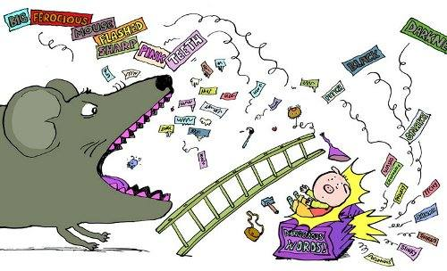{width="5.208333333333333in"
height="3.1666666666666665in"}

"Oof!"

\... pitch black darkness.

"I warned you about what might happen if you turned the pages.

Now you see how careful you have to be with words!

This time I am going to make sure you do not turn the page."

Vroom Vroom

"Do I have to tell you again, do not turn the page!"

VERY HEAVY ROCK

"Oh, you are very strong. Do you work out at a gym?

Okay, I give up. Since you won't go away, I will make this story about
you.

What's your name? Oh, I cannot spell that!

Hmmm \...

I'll tell you what. I will leave a blank like this :
\_\_\_\_\_\_\_\_\_\_\_\_\_\_\_\_\_\_\_\_\_\_\_\_

so whenever you see a \_\_\_\_\_\_\_\_\_\_\_\_\_\_\_\_\_\_\_\_\_\_\_

in the story, say your name.

Ready?

Okay, now you can turn the page.

There once was a giant pest named
\_\_\_\_\_\_\_\_\_\_\_\_\_\_\_\_\_\_\_\_\_.

\_\_\_\_\_\_\_\_\_\_\_\_\_\_\_\_\_\_ had huge eyes, humongous ears, and
too many teeth.

Also, a big nose. It did not matter how many times
\_\_\_\_\_\_\_\_\_\_\_\_\_\_\_\_\_

was asked to go away, \_\_\_\_\_\_\_\_\_\_\_\_\_\_\_\_\_\_\_\_\_ would
not go.

Finally, I had to call the Giant Pest Control Company.

"Hello," I said. "I am on page twenty-nine of an unwritten book and a
giant pest named \_\_\_\_\_\_\_\_\_\_\_\_\_\_\_\_\_\_\_\_\_\_ will not
stop bothering me. I cannot work and I cannot stand this for another
second, so please send someone right away to help me get rid of
\_\_\_\_\_\_\_\_\_\_\_\_\_\_\_\_\_\_\_\_\_\_\_."

"ACK, ACK, ACK! You are still here. I thought my story would make you so
mad you would slam this book shut and go away.

Don't you have anything better to do?

Maybe you could go bother someone else.

Maybe you could go watch your toenails grow.

Oh, look -- I am almost out of pages. Wow, I wrote a whole book!

It was pretty good, too, wasn't it?

The part with the big, ferocious mouse was scary, so in a way, it was a
scary story.

It was a bedtime story, too, because I am certainly very tired.

I am going to sleep now.

Good-bye, and \...

oh \...

um\...

thank you for helping me write this book. I couldn't have done it
without you.

**NOW GO AWAY!**

Good night!"

{width="6.0in"
height="3.75in"}

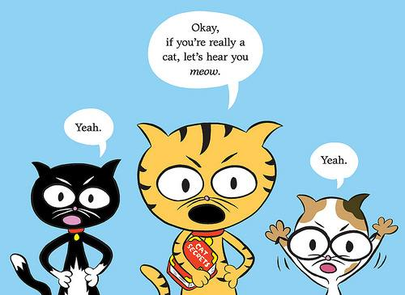{width="5.208333333333333in"
height="3.8020833333333335in"}

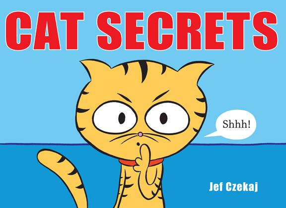{width="3.6770833333333335in"
height="2.6812062554680667in"}

\"Czekaj's cartoons done in a palette of primary colours and with
expressive use of speech bubbles and eyebrows make this a comedic gem.
The book has obvious appeal as a read-aloud, with its instructions and
large-format cartoons, but it has the intimacy of a story to be read
independently.\" -School Library Journal

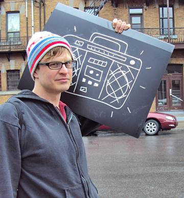{width="3.75in"
height="4.041666666666667in"}

JEF DRAWS PICTURES AND WRITES STORIES.

Jef Czekaj is a cartoonist, children\'s book author and illustrator, and
musician.

He has illustrated 4 books, and written and illustrated 5 picture books
and one graphic novel. His books, Hip and Hop, Don\'t Stop!, Cat
Secrets, The Circulatory Story, and Yes, Yes, Yaul!, were all chosen as
Junior Library Guild selections. Cat Secrets was a finalist in GoodReads
Best Books of 2011 and A Call for a New Alphabet was named a
\"Must-Read\" book by the Massachusetts Centre for the Book.

His comic, Grampa and Julie: Shark Hunters, ran in Nickelodeon Magazine
for more than 10 years. A collection of the first three years of the
comic was published with the help of a Xeric Foundation Grant and
distributed byTop Shelf.

He DJs for an award-winning hip-hop group under an assumed name.

Jef lives and works in Somerville, MA.

BTW, Czekaj is pronounced \"check-eye\"!

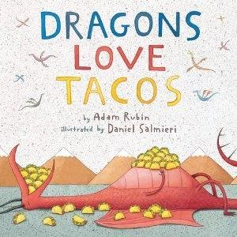{width="3.125in"
height="3.125in"}

Dragons love tacos. They love chicken tacos, beef tacos, great big
tacos, and teeny tiny tacos. So if you want to lure a bunch of dragons
to your party, you should definitely serve tacos. Buckets and buckets of
tacos. Unfortunately, where there are tacos, there is also salsa. And if
a dragon accidentally eats spicy salsa . . . oh, boy. You\'re in red-hot
trouble.

Dragons Love Tacos is written as if it\'s talking to the reader but then
there are parts when the author talks to the dragon. There are lots of
literary elements you can point out to kids or highlight as you read
depending on which element you want to focus on. The book is great for
making predictions. It does take a while to get to what you pretty much
know is going to happen but students will enjoy the build up of
excitement towards the end.

**Reading Strategies to Practice: **Activating Background Knowledge,
Making Connection, Making Predictions, Making Inferences\
**Writing Strategies to Practice: **Descriptive, Alliteration,
Repetition, Anaphora, Point of View, Onomatopoeia,** **Expository\
**Writing Prompts: **Write about favourite food. Write a how-to piece
that describes how to make custom taco,

**Dragons Love Tacos Adam Rubin**

Hey, kid!

Did you know that dragons love tacos? They love beef tacos and chicken
tacos. They love really big gigantic tacos and tiny little baby tacos as
well.

Why do dragons love tacos?

Maybe it's the smell from the sizzling pan. Maybe it's the crunch of the
crispy tortillas. Maybe it's a secret.

Either way, if you want to make friends with dragons, tacos are key.

Hey dragon, why do you guys love tacos so much?

But wait!

As much as dragons love tacos, they hate spicy salsa even more. They
hate spicy green salsa and spicy red salsa. They hate spicy chunky salsa
and spicy smooth salsa. If the salsa is spicy at all, dragons can't
stand it.

Why do dragons hate spicy salsa?

Well, just one drop of hot sauce makes a dragon's ears smoke. Just one
single speck of hot pepper makes a dragon snort sparks. Spicy salsa
gives dragons the tummy troubles, and when dragons get the tummy
troubles -- oh boy \...

If you want to make tacos for dragons, keep the topping mild. Tomatoes,
lettuce, cheese, these are all good toppings for tacos for dragons.

Hey dragon, how do you feel about spicy taco toppings?

Dragons love parties. They like costume parties and pool parties. They
like big gigantic parties with accordions and tiny little parties with
charades.

Why do dragons love parties? Maybe it's the conversation. Maybe it's the
dancing. Maybe it's the comforting sound of a good friend's laughter.

The only thing dragons love more than parties or tacos, is taco parties
(taco parties are parties with lots of tacos).

If you want to have some dragons over for a taco party, you'll need
buckets of tacos. Pantloads of tacos. The best way to judge is to get a
boat and fill the boat with tacos. That's about how many tacos dragons
need for a taco party. After all, dragons love tacos.

Hey dragon, are you excited for the big taco party?

Just remember. Dragons hate spicy salsa. Before you host your taco party
with dragons, get rid of all the spicy salsa. In fact, bury the spicy
salsa in the backyard so the dragons can't find it.

These dragons love your taco party! They love the music. They love the
decorations. They especially love the tacos.

**Congratulations!**

It's a good thing you got rid of all that spicy \...

Wait a second --

What are those little green things in the salsa? You didn't read the
fine print?

Dragons, listen to me. Do not eat those tacos. Those little green specks
in the salsa? Those are jalapeno peppers -- they are super-spicy! I know
you love tacos, dragons, but you are not gonna love those tacos.

**DO NOT LET THOSE DRAGONS EAT THOSE TACOS!!!**

Crunch, crunch, crunch \...

Too late \...

Why would dragons help you rebuild your house?

Maybe they're good Samaritans. Maybe they feel bad for wrecking it.
Maybe they're just in it for the taco breaks.

After all, dragons love tacos.

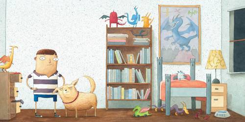{width="5.208333333333333in"
height="2.6041666666666665in"}

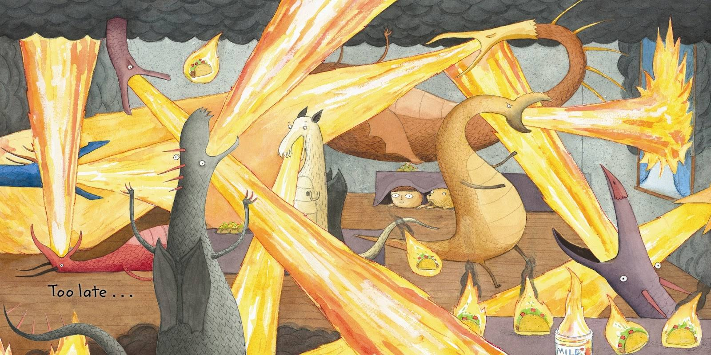{width="6.268055555555556in"
height="3.134027777777778in"}

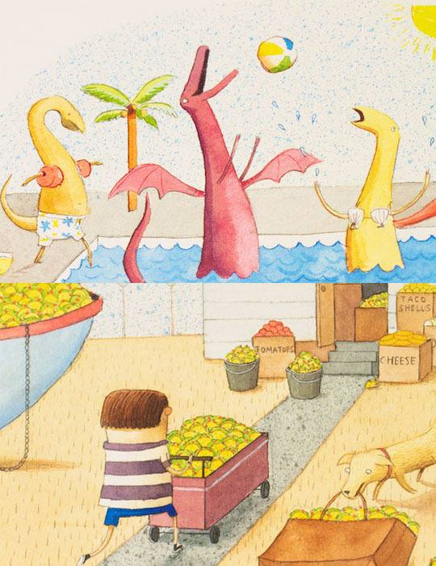{width="5.625in"
height="7.291666666666667in"}

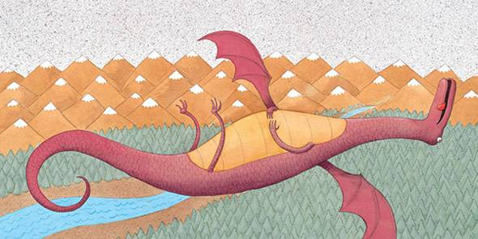{width="6.145833333333333in"
height="3.0729166666666665in"}

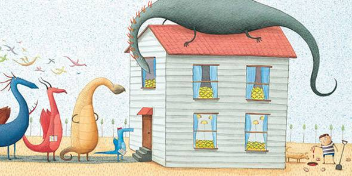{width="6.145833333333333in"
height="3.0729166666666665in"}

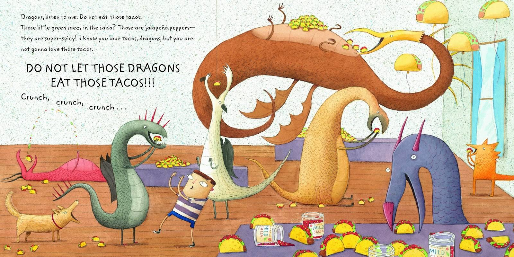{width="6.268055555555556in"
height="3.134027777777778in"}

{width="5.208333333333333in"
height="2.6041666666666665in"}

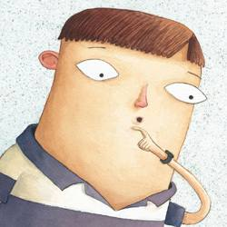{width="2.6041666666666665in"
height="2.6041666666666665in"}

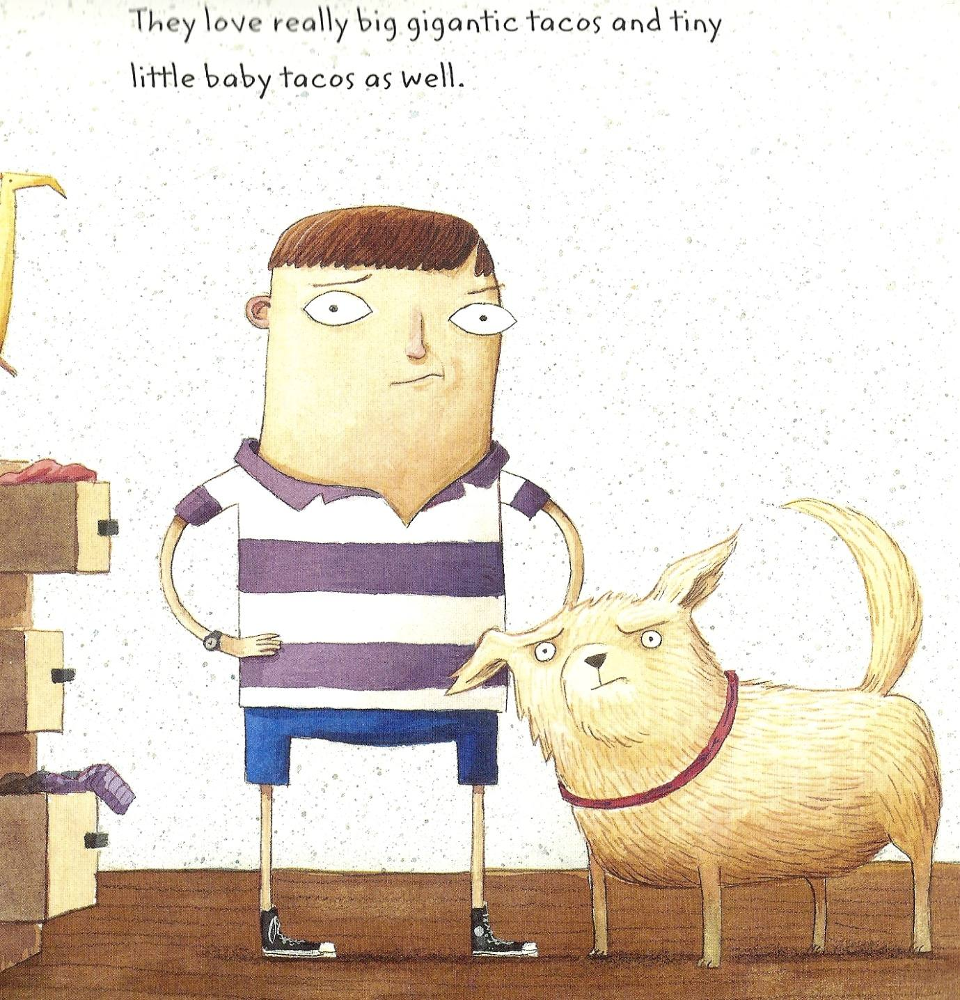{width="6.268055555555556in"
height="6.528305993000875in"}

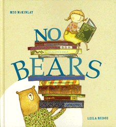{width="2.3645833333333335in"
height="2.6041666666666665in"}

**No Bears Meg McKinlay**

Ruby wants to tell you a story. A story with absolutely no bears. You
don't

need bears for a book. You need pretty things like fairies and
princesses and

castles. And maybe funny things and exciting things -- but definitely no
bears!

However, despite Ruby's determination to banish all bears from her
story,

one clever bear still manages to wheedle himself into the book, hiding
around

the edges of the illustrations and eventually taking on a starring role!

This hilarious picture book skilfully appropriates fairytale
conventions,

containing a range of allusions to well-known fairytale characters,
events and

settings. The illustrations gradually construct a parallel narrative,
playfully

reminding the reader to question the "truths" they receive as there is
always

more than one way of looking at a story.

Meg McKinlay on writing No Bears:

"Curiously, the story that became No Bears grew out of my obsession with
ducks. I had been writing another book about a duck called Max and every
time I sat down to work, he would pop up in my head - QUACK! - and
demand attention. It got to the point where everything I wrote seemed to
involve a duck. One day, out of frustration, I typed the line THERE ARE
NO DUCKS IN THIS STORY! And then I went "ooh" because that had given me
an idea. It sounded like the voice of a little girl. A little girl
confidently telling a story, thinking she was in charge of it and knew
everything about it, but all the while in the background, there were
other things going on. Things that only the reader could see. Ducks, in
fact. Doing duckish things, and actually driving the story forward. The
idea evolved in fits and starts over a couple of years, and by the time
I had a draft to send to my editor, the first duck book, Duck for a Day,
was already scheduled for publication. I talked it over with my editor
and we decided it was best not to do two books about ducks so close
together, so we decided to go with bears, which work equally well for
the purposes of the story. Since I know all this background, I can't
help smiling to myself over the fact that in the end there really are no
ducks in this story. And of course, there are no bears either.
Honestly."

Leila Rudge on illustrating No Bears:

"My illustrations always begin with rough sketches that eventually get
traced onto watercolour paper using a light box. I add shading with
pencil and colour the drawings with watercolour inks. All the elements
of an image are then scanned individually into Photoshop where I fiddle
around with the composition and add additional textures. I had lots of
fun illustrating No Bears and have always loved the idea of images
revealing an alternative story to the text. I enjoyed adding funny
little details and extra layers within each page so the book will
hopefully appeal to a variety of ages - the king's newspaper that
depicts the scene from the previous page still makes me smile, not to
mention the sneaky godmother! In addition to this, the familiar
fairytale references/characters provide a great platform to lead into
other stories."

**Possible Lessons:**

The way a character's personality drives the voice. Ella is a little
girl who is in-charge and strong-willed. There's no way people are going
to tell her what to do. This is apparent in the first few pages of the
book. Take these pages and study them in a minilesson, digging into the
way voice comes alive and is driven by personality. It makes the
abstract concept of voice a little more concrete when connected to
character personality.

It's also an interesting text to use to study humour. The nuances of the
what Ella thinks and what actually happens crafts the humour. I think
humour is tough to accomplish in writing...this text gives shoulders to
stand on for young writers to try humour in their own writing.

Embark on a genre conversation using this text. It's a fairy tale, but
with a little bit of a twist from the traditional.

The illustrations of No Bears contain references to well-known
fairytales, novels and nursery rhymes. Discuss the following stories and
nursery rhymes as a class, then try and locate references to them in the
book:

\- The Owl and the Pussycat

\- Little Red Riding Hood

\- The Three Little Pigs

\- Hansel and Gretel

\- Cinderella

\- Sing a Song of Sixpence

\- Alice in Wonderland

\- The Queen of Hearts

\- The Gingerbread Man

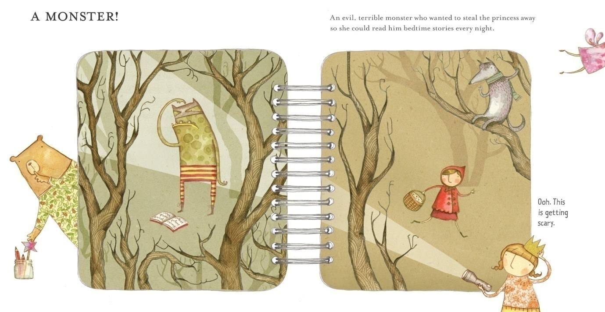{width="6.268055555555556in"
height="3.2358836395450568in"}

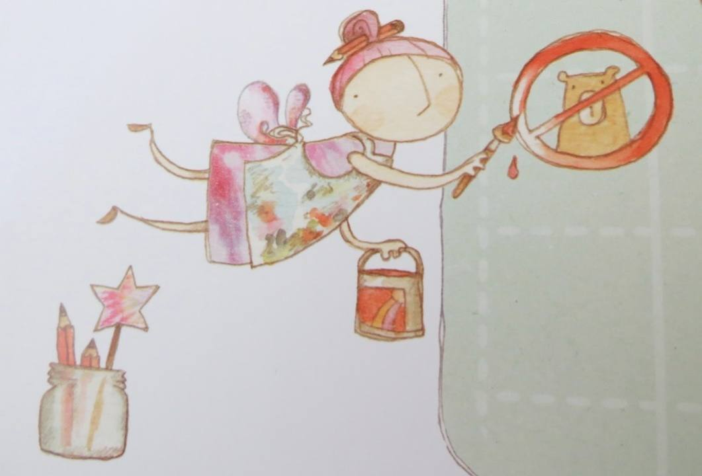{width="4.822916666666667in"
height="3.2708333333333335in"}

**No Bears Meg McKinlay**

Hi! I'm Ella, and this is my book. You can tell it's a book because
there are words everywhere. Words like Once upon a time and Happily ever
after and The END.

I'm in charge of this book, so I know everything about it -- including
the most important thing, which is that there are NO BEARS in it. I'm
tired of bears. Every time you read a book, it's just BEARS BEARS BEARS
-- horrible furry bears slurping honey in awful little caves.

You don't need bears for a book. You need pretty things. You need
fairies and princesses and castles. You need funny things, exciting
things, and scary things -- maybe a monster or a giant or something.

Hmm, yes, I like the sound of that. So, how about this?

Once upon a time there was a beautiful princess. The princess lived in a
faraway castle with her father, the king, and her mother, the queen, and
her fairy godmother, the fairy godmother. But NO BEARS. NOT EVEN ONE.

Yes, perfect! This is my kind of story. So \...

There were NO BEARS in the castle, and there were NO BEARS in the
village. There were NO BEARS in the whole entire kingdom or the next one
or the next one. There were NO BEARS in the deep, dark forest in the
faraway lands.

But what there WAS in the deep, dark forest in the faraway lands was
\...

A MONSTER! An evil, terrible monster who wanted to steal the princess
away so she could read him bedtime stories every night.

Ooh. This is getting scary.

One day, the monster set out from the faraway lands. He climbed a
mountain. He crossed a river. He stomped through one kingdom and the
next one and the next one. He crept through the village and up the
stairs and into the castle \...

and he stole the princess away.

"OH, NO!" cried the princess. "SOMEBODY SAVE ME!"

And SOMEBODY did. UP went the princess into the air. CRASH! went the
monster down the stairs. DOWN! came the princess, safe in the tree.
SPLASH! went the monster into the sea.

Phew! That was close.

"Hooray!" cried the princess. "I'm saved."

Then her father, the king, and her mother, the queen, threw a party for
the fairy godmother. Because everyone knew she was the one who had saved
the princess with her fantastical magic powers.

Wow! This turned out to be a pretty good book, don't you think? In fact,
I think this has been the prettiest. most exciting, scariest, and
funniest book ever.

And I know why!

Because there were NO BEARS in it.

NOT ONE!

So now there's only one thing left to do. And I think you know what it
is. It's to say that everyone lived happily ever after.

The END

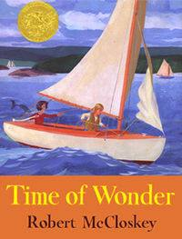{width="2.0833333333333335in"
height="2.7395833333333335in"}

**Time of Wonder Robert McCloskey**

\"Out on the islands that poke their rocky shores above the waters of
Penobscot Bay, you can watch the time of the world go by, from minute to
minute, hour to hour, from day to day\...\" So begins McCloskey\'s
classic story of one summer on a Maine island. The spell of rain, the
gulls and a foggy morning, the excitement of sailing, the quiet of the
night, the sudden terror of a hurricane, and, in the end, the peace of
the island as the family packs up to leave are shown in poetic language
and vibrant, evocative pictures.

Narrate what happened during the storm.

Use to refine Personal Narrative.

Students can:

• Using mentor text to generate ideas

• Use notebook to generate and develop ideas to include mentor craft
techniques in personal writing

• Analyse mentor text for crafting techniques

• Focus on small moments and elaborating

**Time of Wonder Robert McCloskey**

Out on the islands that poke their rocky shores above the waters of
Penobscot Bay, you can watch the time of the world go by, from minute to
minute, hour to hour, from day to day, season to season.

You can watch a cloud peep over the Camden Hills, thirty miles away
across the bay -- see it slowly grow and grow as it comes nearer and
nearer; see it darken the hills with its shadow, and then, see it
darken, one after the other, Islesboro, Western Island, Pond Island, Hog
Island, Spectacle Island, Two Bush Island -- darken all the islands in
between, until you, on your island, are standing in the shadow, watching
the rain begin to spill down way across the bay.

The rain comes closer and closer. Now you hear a million splashes. Now
you even see the drops on the water \... on the age-old rocky point \...
on the bayberry .. on the grass \.... Now take a breath --

IT'S RAINING ON YOU!

At the water's edge on a foggy morning in the early spring you feel as
though you were standing alone on the edge of nowhere.

You hear a snorting sound from out of the nowhere and you know that no,
you are not alone. A family of porpoises is nearby, rolling over and
over, having an acrobatic breakfast of herring under the bay.

Then through the fog you hear Harry Smith over at Blastow's Cove start
the engine of his lobster boat and go out to pull his traps.

Suddenly there is a ripple and a splash along the shore that makes you
jump! It is the wake from Harry Smith's lobster boat, and you smile
because you almost got wet feet that time!

The ripple disappears into the fog, and though you cannot see it you
know that it is silently gliding, gliding on its way. Then another
distant, unseen splash -- and the gulls and cormorants on Two Bush
Ledge, with their seabird sense of humour, start giggling and laughing
because they too were suddenly surprised by the wake.

Back from the shore the trees look like ghosts. The forest is so quiet
that you can hear an insect boring a tunnel deep inside a log. And that
other sound -- not the beating of your heart, but the one like half a
whisper -- is the sound of growing ferns, pushing aside dead leaves,
unrolling their fiddle-heads, slowly unfurling, slowly stretching.

Now the fog turns yellow. The bees begin to buzz, and a humming bird
hums by. Then all the birds begin to sing, and suddenly the fog has
lifted! And suddenly you find that you are singing too,

With the blue water sparkling all around, all around,

With the blue water sparkling all around, all around.

At the height of the summer season the bay is spotted with boats -- with
racing sailboats, with cruising schooners, with busy fishing boats, and
with buzzing outboards.

In the afternoon you sail among the islands, pushed by gentle breezes.
You sail close by Swain's Cove Ledges, where a mother seal is nursing
her baby.

And then at sunset, with porpoises puffing and playing around your boat,
you come about and set a course for the island that is home.

The rock on the point of the island is very old. it was fiery hot when
the world was new. It was icy cold when a glacier covered it with
grinding weight.

This morning the rock is warm in the sun, and loud with happy noise of
children who have come to spend the day.

They dive off the rock and swim, then stretch out, dripping, in the sun,
making salty young silhouettes on the old scars made by the glacier.

noon, when the tide is out, they build a castle out of rocks and
driftwood below the spot where they had belly-whoppered and dog-paddled
during the morning.

In the evening, when the tide is high again, and all your guests have
gone, you row around to the point, feeling lonely, until an owl asks a
question. A heron croaks an answer.

A seal sniffs softly as he recognises you, and eider ducks and fishhawks
-- all are listening, all are watching as you row. by the rock, you
shine a light down into the water. There is a crab on the bottom where
you were playing this afternoon.

He tiptoes sideways through the castle gate and disappears into its
watery keep.

You snap off the light and row towards the dock as the stars are gazing
down, their reflections gazing up. In the quiet of the night one hundred
pairs of eyes are watching you, while one pair of eyes is watching over
all.

As the days grow shorter and shorter there are fewer and fewer boats on
the bay, until at last only the fishing boats are left. The wind blows
brisk from the northwest, rustling the birch leaves.

The ferns change from green to yellow to brown. The robins are gone from
the lawn and the garden. The swallows have flown from their nests in the
boathouse.

To take their places, migrating birds from the north stop off to rest on
their way south. The crows and the gulls fly over, fussing and feuding.
And the hummingbirds visit the petunia patch.

Mr Billings flies over, looking for schools of herring. When he sees you
waving on the beach, he dips the seaplane's wings in greeting.

On some days the wind is so strong that not even the sturdy fishing
boats are out on the bay.

Now is the time for being watchful.

Over in Blastow's Cove, harry Smith looks at the sky and says, "We're
going to have some weather."

On Eggamoggin Reach, Clyde Snowman listens to the loons and says, "It's
a comin'!" On Cape Rosier, Ferd Clifford listens to the sound of the
bell off Spectacle island and says, "She's gonna blow."

On your island you feel the light crisp feeling go out of the air and a
heavy stillness takes its place. It's time to make a quick trip to the
mainland for food and gasoline.

It's time to get ready.

*We're going to have some weather.*

*It's a comin',*

*She's gonna blow.*

In Bucks Harbour are the cruise schooners -- the *Alice Wentworth,* the
*Stephen Taber,* and the *Victory Chimes --* riding at anchor to spend
the winter. men are busy putting out extra anchors, pulling up skiffs
and rowboats, checking moorings, checking xhains, checking pennants,
getting ready.

Take aboard groceries. Take aboard gasoline. All of the talk is of
hundred-pound anchors, two-inch rope, one-inch chain, and will it hold?
And the weather \... and when? Mr Gray strokes his chin and says, "With
the next shift of the tide."

Hurry for home, for there's much to be done before the tide is too low,

The ledges behind Pumpkin Island are covered with gulls, all sitting
solemnly faced in the same direction. There is no giggling and cackling
as your wake splashes the ledge today. This is not time for seabird
sense of humour.

*We're going to have some weather.*

*It's a comin',*

*She's gonna blow.*

*With the next shift of the tide.*

Home on the island, you pull in the sailboat, chain the motorboat fast
to its mooring, pull the rowboats high off the beach.

Mr Smith hurries by with a boatload of lobster traps that he has been
taking up.

Over in Swain's Cove, Mr Billings puts extra lines on the wings of his
seaplane.

fishermen put extra lines on herring boats and scalloping boats.

At Franky Day's boat yard up Benjamin River, and at Hal Vaughn's boat
yard up Horseshoe Creek, men are working with the tide pulling up sloops
and yawls, ketches and motorboats; shackling chains, tying ropes, making
things fast, battening down, getting ready.

Stack the groceries on kitchen shelves. Bring in wood to build a fire.
Fill the generator with gas. Then take one last careful look, while the
calm seas pauses at dead low water. a mouse nibbles off one last stalk
from the garden and drags it into his mouse hole. A spider scurries
across his web and disappears into a knothole. all living things wait,
while the first surge of the incoming tide ripples past Eagle Island,
ripples past Dirigo, past Pickering, past Two Bush Island. The bell-buoy
off Spectacle Island sways slightly with the ripple, tolling \...
tolling \... tolling the shift of the tide.

Gently at first the wind begins to blow. Gently at first the rain begins
to fall.

Suddenly the wind whips the water into sharp, choppy waves. It tears off
the sharp tops and slashes them into ribbons of smoky spray. And the
rain comes slamming down. The wind comes in stronger and stronger gusts.
A branch snaps from a tree. A gull flies over, flying backwards, hoping
for a chance to drop into the lee of the island. Out in the channel a
tardy fishing boat wallows in the waves, seeking the shelter of Bucks
Harbour.

A tree snaps. Above the roar of the hurricane you see and feel but do
not hear it fall. A latch gives way. People and papers and parcheesi
games are puffed hair-over-eyes across the floor, while Father pushes
and strains to close and bolt out the storm.

Mother reads a story, and the words are spoken and lost in the scream of
the wind. You are glad it is a story you have often heard before. Then
you all sing together, shouting "*eyes have seen the glory"* just as
loud as you can SHOUT. With dishtowels tucked by doorsills just to keep
the salt spray out.

The moon comes out, making a rainbow in the salt spray, a promise that
the storm will soon be over. Now the wind is lessening, singing loud
chords in the treetops. lessening, it hums as you go up to bed.

And the great swells coming in from the open sea say SH-h-h-h \...
SH-h-h-h \... SH-h-h-h as they foam over the old rock on the point.
lessening, the wind whispers a lullaby in the spruce branches as you
fall asleep in the bright moonlight.

The next morning you awaken to an unaccustomed light made by a frosty
coating of salt on all the windows. And out-of-doors in the gentle
morning lie reminders of yesterday's hurricane. Fallen and broken trees
are everywhere -- on the terrace, on the path -- blocking your way at
every turn. You cannot walk on familiar paths and trails, but you can
explore the tops of giant fallen trees, and walk on trunks and limbs
where no one ever walked before.

Then, seeking out still more places where no one ever walked before, you
explore the jagged holes left by roots of fallen trees. Under an old
tree by the house you discover an Indian shell heap, and, poking in the
thousands of snow-white clam shells, so old they crumble at a touch, you
realise that you are standing on a place where Indian children stood
before the coming of white men.

Now it is time for one last chore of hauling seaweed from the beach to
fertilise the garden. Spreading the seaweed with its iodine smell, you
are pleased to see that the storm-flattened sunflowers are once more
lifting faces to the sun. And here are the hummingbirds, humming a hymn
to the morning, making a final round to the last of the petunias. It is
time for the hummingbirds to leave the island.

It is the end of another summer. It is time for you to leave the island
too. Good-bye to clams and mussels and barnacles, to crows and swallows,
gulls and owls, to sea-urchins, seals, and porpoises.

It is time to reset the clock from the rise and fall of the tide, to the
come and go of the school bus. Pack your bag and put in a few treasures
-- some gull feathers, a few shells, a book of pressed leaves, a piece
of quartz that came from a crack in the old rock on the point.

And, children, don't forget your toothbrushes.

Then "All aboard!" and around Deer Island, past Birch Island, past
Pumpkin Island, and across Eggamoggin Reach, for the last time this
year.

Take a farewell look at the waves and sky. Take a farewell sniff of the
salty sea. A little bit sad about the place you are leaving, a little
bit glad about the place you are going. It is a time of quiet wonder --
for wondering, for instance: Where do hummingbirds go in a hurricane?

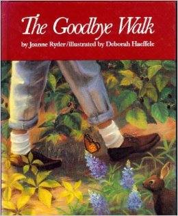{width="2.7083333333333335in"
height="3.2916666666666665in"}

A sensitive, nature-loving girl bids an end-of-summer farewell to all of
the special places that she would visit, observing once again the hill
where she watched eagles, the bridge beneath which the fish would hide,
and much more.

Writing:

Saying good-bye to a special place.

Read Aloud

Genre: Poetry or narrative

**The Good-bye Walk Joanne Ryder**

It takes time

to get to know

a special place,

time to explore

new paths

and see new things.

And then one day

it's time to

say good-bye.

When you take

a good-bye walk,

you know

just where

you want to go,

which paths

will lead you there.

Along your way

are landmarks

you remember:

a row of tall pines

pointing to the sky,

a shady wall of ferns \...

And an old sign

leaning towards the sea.

You smile

and watch

your landmarks

passing by

as you walk

past them

one more time.

You are busy

on a good-bye walk

looking here and there,

gathering memories

as you go.

You see things

as they are today,

and also

as they were

on other days

when summer

was long and new.

Then a flag-tailed dog

ran up the hill,

leaping high to greet you.

A thousand berries

tinged the bushes black,

and you stopped

to eat the them

sun-warmed and sweet.

Today

someone may wave,

glads to see you.

You pause

to say good-bye,

to play a game,

to run together

one last time

through grass

grown thick and tall.

On a good-bye walk

you can stop

as you please --

on the bridge

where young fish

hide below,

waiting for you

and your bread \...

on the hill

where eagles

soar above you

like dark kites

without strings \...

on a pebbly beach

where a cool wind

catches you at last.

You wrap

yourself up

and feel summer

blowing away.

On a good-bye walk

you may even see

something new,

someone you

have never seen before.

Bend down and greet

a sea star glowing brightly

in a rocky pool,

a bold crab

creeping sideways,

its claws stretched wide

to fight your shadow

dancing on the water.

Gaze out and greet

a tall bird standing still,

hunting for fish

an island away.

Meeting someone new

makes you smile.

And you say,

"Hello,"

not "Good-bye."

Somewhere

along your path

a secret place

you know by heart

will call you.

Your feet follow footsteps

you've made before

to a cave snug and dry

atg the edge of the sea.

Water, calm and blue,

sparkles and dances,

sliding closer to you

as the tide rises

touching rocks and sand.

This place is

as good as the first

time you saw it.

Even better.

And when

it's time to leave,

you call, "Good-bye."

You wish

this spot well

and hope

you'll return one day

to find it

just as special

as it is today.

On the way back

you run down the hill

and feel the world

tilting beneath you again.

You wade

through the stream

that once tickled your knees

and tickles your ankles

as you splash,

a cool fish in the sun.

You pick

the last berries,

tasting them

and this day

as sweet as

all the rest.

At the end

of a good-bye walk

your aerms

may be empty,

but you are full

of things

to take

with you --

feelings

and sights

tucked deep

inside you,

memories

to keep

forever

and ever.

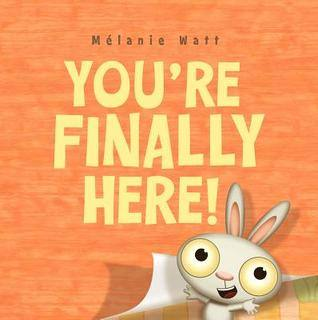{width="3.3125in"
height="3.3333333333333335in"}

Hooray! You\'re finally here! But where were you? A bunny bounces
through a range of emotions in this funny picture book about how
difficult it is to wait. At first he\'s ecstatic that you, the reader,
has arrived. But then he can\'t help letting you know that waiting for
you took too long, was way too boring, and even became insulting. The
bunny is ready to forgive everything if you will promise to stay. But
hold on\--he has to take a phone call. Wait! Come back !Where are you
going? Underneath this book\'s silly, in-your-face humour are feelings
true to every child who has had to wait for someone\'s attention.

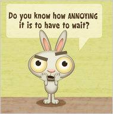{width="1.9791666666666667in"
height="1.9895833333333333in"}

The changes in font size, use of speech bubbles, and double page
spreads, in which rabbit explains how keeping him waiting has made him
feel, are all worthwhile.

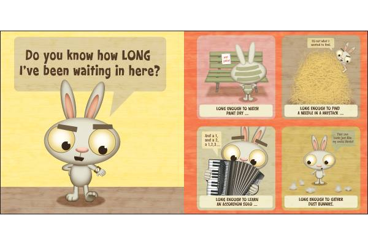{width="6.25in"
height="4.166666666666667in"}

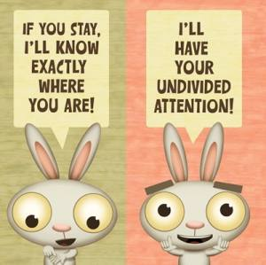{width="3.125in"
height="3.1145833333333335in"}

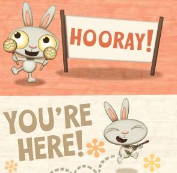{width="3.0625in"
height="3.0in"}

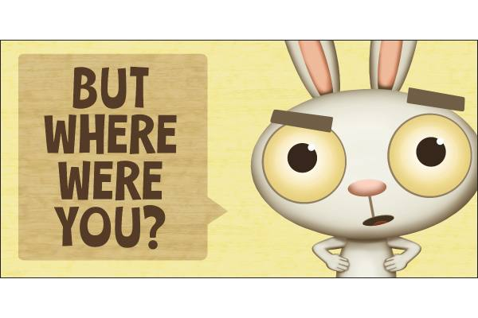{width="6.25in"
height="4.166666666666667in"}

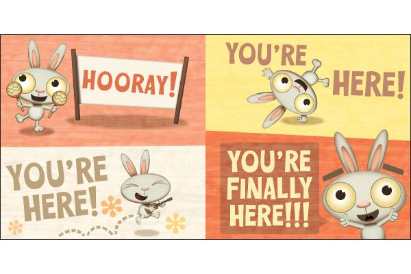{width="6.25in"
height="4.166666666666667in"}
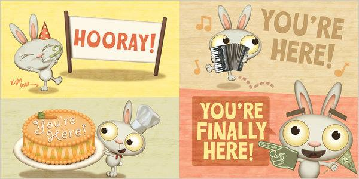{width="6.25in"
height="3.125in"}

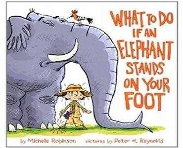{width="3.8541666666666665in"
height="3.125in"}

**What to do if an Elephant Stands on Your Foot**

**Michelle Robinson**

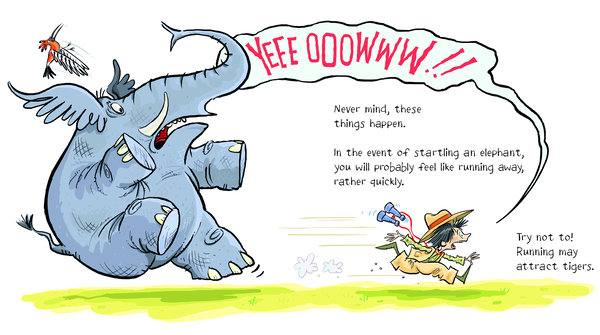{width="6.25in"
height="3.4895833333333335in"}

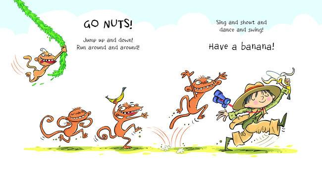{width="6.268055555555556in"
height="3.317247375328084in"}

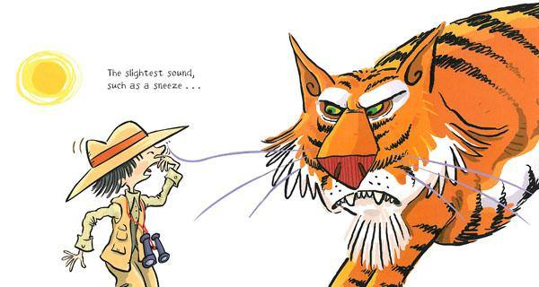{width="6.25in"
height="3.3333333333333335in"}

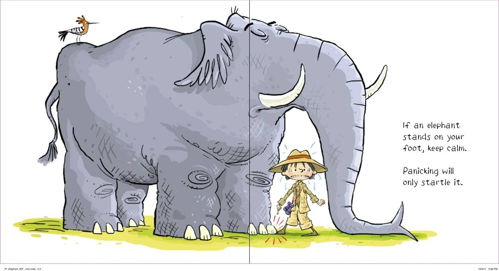{width="6.268055555555556in"
height="3.4117891513560803in"}

Safari etiquette can be tricky. Fortunately, our trusty narrator can
help. Sort of. From what to do if an elephant stands on your foot
(\"Keep calm. Panicking will only startle it!\") to how to escape the
attentions of a crocodile (\"Well? What are you waiting for? Wave your
arms around and shout for help!\"), our plucky guide leads our unlucky
hero on a jungle adventure, barely avoiding tigers, a rhino, snakes,
and\--uh-oh. What's that? Well thank heavens the monkeys are friendly at
least!

Debut author Michelle Robinson teams with bestseller Peter H. Reynolds
for a Monster at the End of This Book-style romp, culminating in a
hilarious finish that will send readers\--and our hapless hero\--right
back to the beginning for more.

**What to do if an Elephant Stands on Your Foot**

**Michelle Robinson**

If an elephant stands on your foot, keep calm.

Panicking will only startle it.

"YEEEOOOWWW!!"

Never mind, these things happen.

In the event of startling an elephant, you will probably feel like
running away, rather quickly.

Try not to!

Running may attract tigers.

Told you so.

SHHH! Once a tiger has spotted you, you MUST stay silent!

The slightest sound, such as a sneeze \...

"AAHCHOO!"

Oh dear.

As I was saying, make the slightest sound and rhinoceroses will hear
you.

If a rhinoceros has heard you, whatever you do \...

DO NOT BE TEMPTED TO CLIMB A TREE.

Oh, for goodness sake! Go ahead, then, if you must -- but don't say I
didn't warn you!

See? Snakes live in trees, and they do NOT take kindly to visitors.

Having found yourself in a snakes' tree, take a few deep breaths and
steady yourself.

That's it. Now, sit tight and try not to make any sudden movements.

Like that one. You ninny!

Sudden movements do NOT go unnoticed by crocodiles! Everyone knows that!

Honestly, your hopeless!

If you've been noticed by a crocodile, don't expect me to help you.

"Pleeeease?!"

Oh, all right then, since you asked so nicely.

Wave your arms around and shout for help!

"HELP!"

Is it working?

Yes!

Here come the monkeys!

Of course, now that the monkeys have arrived, there's only one thing to
do \...

GO NUTS!

Jump up and down! Run around and around.

Sing and shout and dance and swing! Have a banana!

And finally, before you return to your nice, safe home \...

\... remember your manners! Thank the monkeys for rescuing you,

and don't forget to apologise to the elephant.

Just be careful not to \...

"HEY, SORRY!"

\... startle it.

{width="1.875in"
height="2.40625in"}

About this author

When I\'m not up to my knees in nappies, I write children\'s books. I
also spend a fair amount of time eating chocolate. I try to write funny,
read-aloud books that parents will enjoy as much as children - after
all, if you have to share the same stories umpteen times, you may as
well enjoy them.

I hope you like my books enough to read them umpteen times.

Thank you - Michelle.

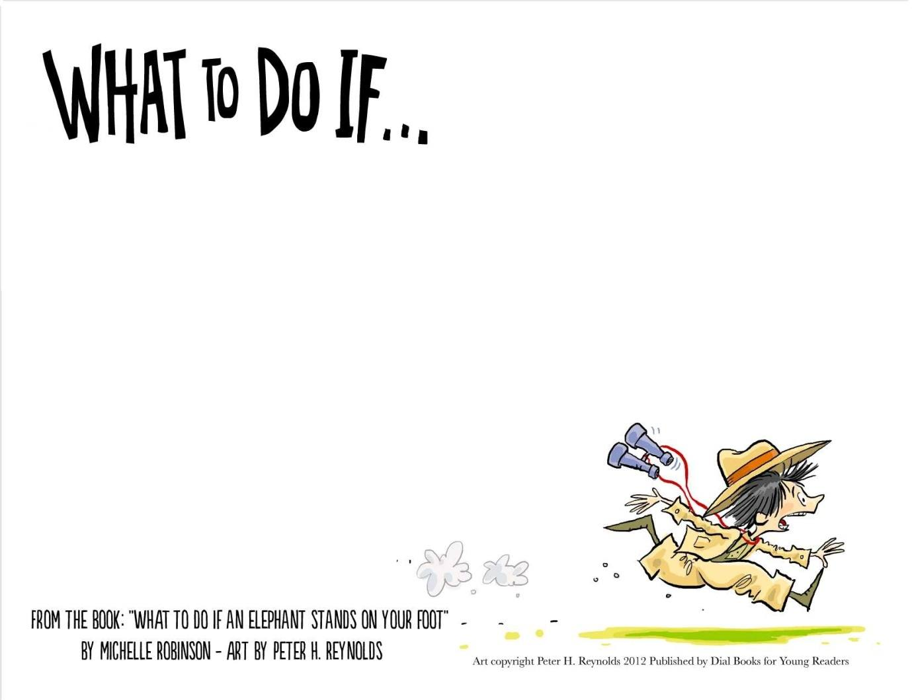{width="6.268055555555556in"
height="4.815470253718285in"}

