**Voice**

> **(13)**
>
> 

**Narrative Voice**

**Perspective 4**

**Voice 13**

**Narrative Voice**

**Perspective 4 Second Person**

The Secret Knowledge of Grown-Ups David Wisniewski

The Purple Kangaroo Michael Black

How to Lose All Your Friends Nancy Carlson

If You Want to See a Caribou Phyllis Root

If You Give a Mouse a Cookie Laura Numeroff

If You Give a Moose a Muffin Laura Numeroff

If You Give a Cat a Cupcake Laura Numeroff

If You Give a Pig a Pancake Laura Numeroff

If You Give a Pig a Party Laura Numeroff

If You Give a Dog a Donut Laura Numeroff

If You Take a Mouse to School Laura Numeroff

If You Take a Mouse to the Movies Laura Numeroff

If You Give a Mouse an iPhone Ann Droyd

Imagine a Day Sarah Thomson

Your Moon, My Moon Patricia MacLachlan

Always wear Clean Underwear Marc Gellman

Earthdance Joanne Ryder

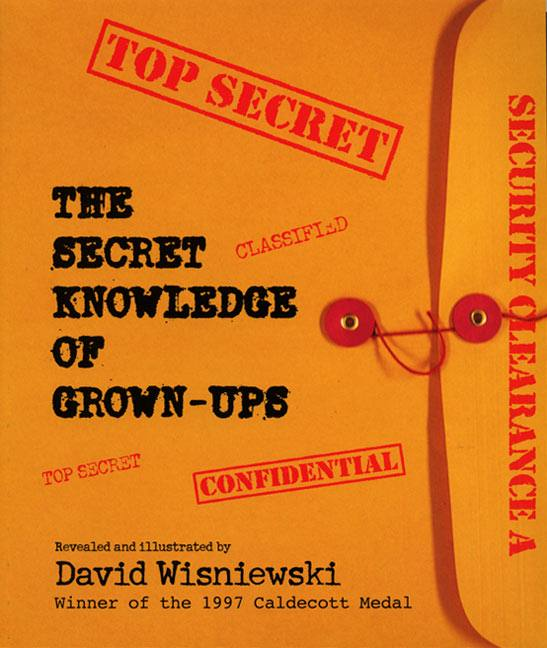

**The Secret Knowledge of Grown-Ups David Wisniewski**

Parents are always spouting these rules. Do they really care about
nutrients and mattresses, or are they hiding something? Luckily, one
fearless grown-up will risk his neck and his dignity to find out.
Disguised as everything from a chocolate milk scuba diver to a giant
nose, this counterspy uncovers the disturbing truth. And what he learns
will shock you like nothing before. Startling suckface emergencies!
Dangerous digit gangs! Powerful sumo cells! Those are just some of the
secrets revealed in this book by Caldecott medallist David Wisniewski.
But don′t let anyone catch you reading it-especially grown-ups. Who
knows what could happen if they knew that you knew?

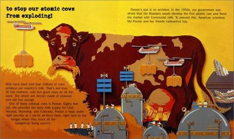

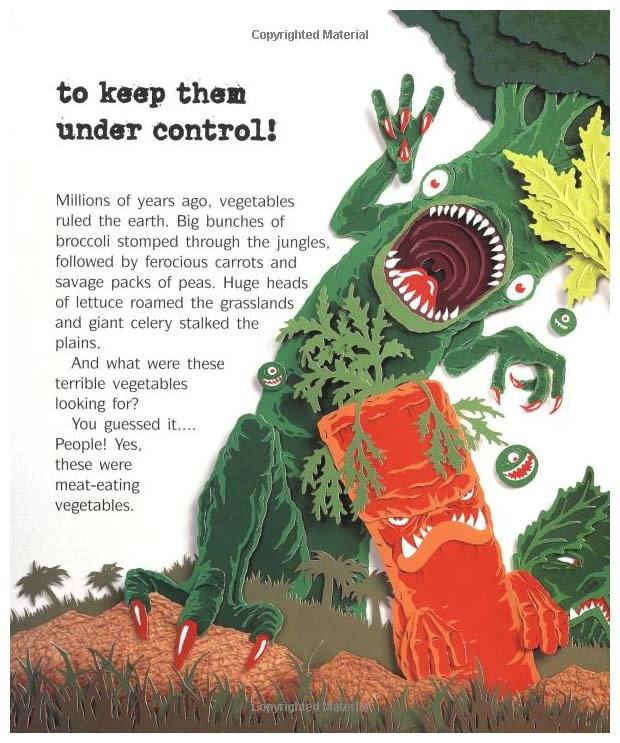

**Lesson:**

Rules can be a child's worst nightmare, so it\'s no surprise that The
Secret Knowledge of Grown-Ups by David Wisniewski is a book that all
actual children (as well as children at heart) enjoy. This is a book
full of rules! And then it spoofs those rules. The author splits the
book up into eight sections; each section is devoted to one grown-up
rule we all remember.

While reading The Secret Knowledge of Grown-Ups by David Wisniewski
point out NOT ONLY the great descriptions used throughout the book BUT
ALSO the three-part pattern used by the author. Make a chart listing the
rules from the book, the \"real\" reasons for those rules, and favourite
descriptions the author used.

Students can write over several days choosing Rules from school or home.

**The Secret Knowledge of Grown-Ups David Wisniewski**

**(Extract)**

The truth must be told to kids!

For too long, for centuries in fact, it's been covered over, hidden,
impossible to find. A conspiracy, an organised silence by generations of
grown-ups, has kept the truth from millions of children throughout
history.

"And what is this truth\>" you ask.

Simply this: The reasons grown-ups tell you to do things are not true!

"Eat your vegetables," they say.

"Why?" you ask.

"They're good for you," they reply.

NONSENSE!

"Comb your hair," they say.

"Why?" you ask.

"It keeps it neat," they reply.

POPPYCOCK!

there are far more sinister, truly macabre reasons for these seemingly
innocent requests. As a parent, I went along with it all at first: going
to secret meetings, memorising huge volumes of lies and falsehoods,
preparing for the day when my kids would want to know why this and why
that.

*But not anymore!*

Over the last three years, I've gathered as much information as I could:
crisscrossing the country in clever, impenetrable disguises, breaking
into secret files kept by hundreds of grown-ups, assembling the
evidence. And now It's here, in your hands.

It's the truth. It's real. It's \...

I must go. They're coming. I can hear them. Quickly! Take this book!
Read it! LEARN THE TRUTH!!!

  ----------------------------------
  **TOP SECRET**
  ----------------------------------

  ----------------------------------

LOCATION:

American Produce Council

Aurora, Illinois

DATE AND TIME: July 22, 1997 1:30 P.M.

LOG: Enter A.P.C. compound in vegetable truck, posing as large eggplant.
Break ito file room during lunch. Discover GROWN-UP RULE #31! Escape
through crowded cafeteria, claiming to be leftover moussaka.

GROWN-UP RULE #31:

Eat your vegetables.

OFFICIAL REASON:

They're good for you.

THE TRUTH:

You don't eat vegetables because they're good for you.

You eat vegetables

**to keep them under control!**

Millions of years ago, vegetables ruled the earth. Big bunches of
broccoli stomped through the jungles, followed by ferocious carrots and
savage packs of peas. Huge heads of lettuce roamed the grasslands and
giant celery stalked the plains.

And what were these terrible looking for?

You guessed it \... People! Yes, these were meat-eating vegetables.

They terrorised the early humans, attacking without warning. Our
ancestors put up with this for centuries, living in drafty caves and
getting nasty head colds. But then they discovered sticks and stones.

With these new weapons, humans began to defend themselves. At first,
lone hunters would take on a single radish or green bean. Eventually,
groups of hunters tackled bigger game, like the sabre-toothed asparagus
and woolly cucumber. By mixing these vanquished vegetables, primitive
chefs invented salad.

The real turning point, however, was the discovery of fire. With it,
hunters could frighten the less intelligent vegetables into ambushes and
traps.

Thousands of butternut squash, frightened by hunters' fiery torches,
plunge over a cliff in what is now France. Scientists believe this
incident gave squash its name.

Courageous humans confront a fully grown cornasaur, using their torches
to fatally overheat the beast's vital kernels.

More important, fire allowed humans to cook their leafy foes. As this
fossil from Montana shows, predatory potatoes and man-eating mushrooms
were turned into Stone Age casseroles.

This brought the Age of vegetables to a close. As the human race grew in
size and intelligence, vegetables became smaller and dumber, devolving
into the pathetic produce of gardens and grocery stores.

To prevent vegetables from ever regaining power, grown-ups eat them.
They don't like the flavour any more than you do, but it keeps the
little horrors fearful and demoralised. It's a simple way to protect
modern civilisation.

Besides, which would you rather do: eat vegetables or be eaten by
vegetables?

  ----------------------------------
  **TOP SECRET**
  ----------------------------------

  ----------------------------------

LOCATION: United Dairies Corporation Des Moines, Iowa

DATE & TIME: July 31, 1997, 11:30 P.M.

LOG: Disguised as Polled Guernsey, lead herd of cows into high-security
area. During melee, locate GROWN-UP RULE #37!

Abandon disguise, disappointing bull. Close call.

GROWN-UP RULE #37:

Drink plenty of milk.

OFFICIAL REASON:

it's good for you.

THE TRUTH:

Yes, milk is packed with vitamins and protein, but that's not why
parents want uou to drink it. The real reason is

**to stop our atomic cows from exploding!**

Kids have been told that millions of cows produce our country's milk.
That's not true. At this moment, only five giant cows do all the work.
The others are decoys made of plywood and old box springs.

One of these colossal cows is Flossie. Eighty feet tall, she provides
the daily milk supply for Utah, Nevada, Wyoming, and Colorado. Flossie
is kept under tight security at a secret air-force base, right next to
the hangar where they stack all the banged-up flying saucers.

Flossie's size is no accident. In the 1950s, our government was afraid
the Russians would develop the first atomic cow and flood the market
with Communist milk. To prevent this, American scientists fed Flossie
and her friends radioactive hay.

The experiment worked great, and government officials are very happy
that all this milk is available. But they worry about one thing: Flossie
can't be turned off. The milk just keeps coming.

For this reason, all atomic cow sites are equipped with extra milking
machines. For backup, glass cases on the wall contain emergency farmers
with really big hands.

However there is one crisis the government can't prepare for: kids *not*
drinking milk. If that happened, Flossie would have to hold it, getting
bigger and bigger until -- *nuclear milkdown.*

Such a catastrophe forever scars the landscape between the Arizona towns
of Flagstaff and Winslow. A huge crater is all that remains of Doris,
the only atomic cow that ever exploded.

When kids felt the ground shake and saw the curdled cloud of dairy
products form over the desert back in 12962. They were told that a
meteor had hit the local taste Freeze.

Now you know better. So drink your milk.

  ----------------------------------
  **TOP SECRET**
  ----------------------------------

  ----------------------------------

**Grown-Up Rule #62:**

Don't Jump on your bed.

Official reason: You'll break it. You might get hurt.

The Truth: Yes, it's possible to break you bed if you jump on it. And
it's possible you might get hurt if you fall off. But you'll definitely
get hurt

**if you wake up the mattress!**

You see, mattresses aren't just big lifeless rectangles crammed with
stuffing. They are active woolly creatures raised on farms in Scotland.
There, the mattress herders (or mattherds) sing a lovely ballad as their
frisky mattdogs guide the beasts to pasture.

*mattresses are bonny things,*

*born of stuffing, cloth and springs.*

*Gaily now they graze the meadow,*

*Growing soon to be my bed. Oh!*

*Single, double, queen, and king.*

*A flock like this doth make me sing!*

*Methinks my joy shall nevcr wilt!*

*By gar! The beasties just ate my kilt!*

After growing to adulthood, the mattresses start a long period of
hibernation. Undisturbed by noise and handling, they are rounded up,
sorted by size, and sold to stores. Then they end up in your bedroom,
where they snooze peacefully year after year. Unless you jump on them.
Fortunately, today's mattresses are very difficult to wake up. That
wasn't the case with their hardy ancestors.

When the first Scots arrived in Scotland by parcel post more than six
thousand years ago, they saw wild mountain mattresses jumping from peak
to peak. By imitating the creature's mating call with bagpipes, the
Scots tried to capture one. But none succeeded.

Then one night, about A.D. 1040, the Scottish king Malcolm the Upset
wandered the moors, trying to get over eating haggis\*, a real humdinger
of a national dish. He stumbled upon a hibernating mattress, upon which
he slept soundly for the first time in many years. When he woke, Malcolm
realised that the wild mattress was more comfortable than the boulder he
usually slept on.

\**Haggis, a pudding eaten in Scotland made from the heart, lungs and
liver of a sheep, chopped up and mixed with suet, oatmeal, onions, and
spices, and boiled in the stomach of the animal. No, I am not making
this up!*

King Malcolm brought the mattress home and began breeding it. Soon he
was giving mattresses as gifts to other kings and queens. Unfortunately,
these feral mattresses woke up and started slinging royalty around, an
event immortalised on canvas by court artist Red Harry McLegs, who was
five years old at the time.

This was very bad for King Malcolm, who spent the rest of his life in
prison, eating haggis. But, it was very good for us -- we now the modern
domestic mattress with its mild disposition and long hibernation period.

Still, it's not a good idea to jump on your bed. That mattress might be
hard to wake up, but it's not impossible.

And, for goodness' sake, don't play the bagpipes near it!

  ----------------------------------
  **TOP SECRET**
  ----------------------------------

  ----------------------------------

**Grown-Up Rule #73:**

Don't bite your fingernails.

Official Reason: It makes your fingernails look terrible.

The Truth:

Although bitten fingernails really do look pretty terrible, that's not
the real reason parents want you to stop. The real reason is the scraps
of fingernail you leave behind. Why? Because

**they grow!**

Just like carrot seeds become carrots and bean seeds become beans,
fingernail scraps, become fingers. After growing under your bed or
between the sofa pillows for about three months, the new fingers leave
their nests and go crawling around the house.

At first, this isn't too much of a problem. With their dimpled knuckles
and sunny dispositions, the baby fingers are actually kind of cute. But
as they get older, the fingers start behaving badly.

They ring your doorbell and run. They dial long-distance to order
anchovy and onion pizza delivered to people you don't know. They swipe
the icing off cakes and poke chocolates to find out what the fillings
are.

Psychologists think that the fingers act this way because they grow up
alone without ever belonging to a hand. Upon adolescence, the fingers
form groups to make up for it. And that's the most important reason not
to bite your fingernails.

**to stop the spread of teenage finger gangs!**

These gangs are based on physical characteristics. They are:

1.  *The Stubby Creeps.* This band of disturbed thumbs travels by
    hitchhiking. They get a kick out of making sudden jerky movements
    and yelling, "Take a hike!" Gang leaders wear black T-shirts with
    *I'm Opposable!* scrawled on them.

2.  *The Pointing Punks.* These rebellious forefingers pointlessly scold
    and accuse people. They are often busted for picking noses that
    don't belong to them. For laughs, they'll poke you in the eye.

3.  *The Dirty Digits.* This bunch of middle fingers just stands around.
    That's bad enough.

4.  *The Ring Leaders.* These boisterous ring fingers spend most of
    their time showing off flashy jewellery. Unlike members of other
    gangs, many are engaged or even married.

5.  *Hell's Pinkies.* This pathetic group of little fingers tries to
    imitate the Ring Leaders by wearing jewellery. Psychologists think
    they do it because they're self-conscious about their height and
    have rotten jobs cleaning ears.

So do society a favour. Stop biting your fingernails. If you can't break
the habit, dispose of the scraps properly by sending them to an
accordion factory. They use lone fingers to test accordions because most
normal people don't want to listen to them.

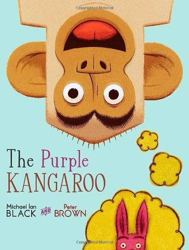

Overview

The monkey narrator in this humorous picture book guarantees that he can
READ YOUR MIND. What begins as a simple request to imagine the most
spectacular thing in history turns into the story of a roller-skating,
bubble-blowing purple kangaroo searching for his dear friend Ernesto on
the moon. So by the time you finish this book, there\'s no chance you
will be thinking of anything BUT the purple kangaroo.

**The Purple Kangaroo Michael Black**

"Hey, kid. Guess what? I've got a supersecret, highly unusual,
incredible, and amazing magical power.

**I can read minds.**

It's true. In fact, I can read YOUR mind.

I want you to close your eyes and think of something. What kind of
something?

Something spectacular. I want you to think of something so spectacular
that nobody

has ever thought of it in the entire history of thinking about things.

Got it?

Great. Now say what it is out loud. Don't worry -- I can't hear you. I'm
just a picture in a book.

And now \... (Drumroll please.)

And now I will use my super secret, highly unusual, incredible, amazing,
and slightly alarming magical powers \...

look into my eyes. look deeeeep into my eyes. Concentrate \... wait! I
see something. It's becoming clearer \... clearer \...

GOT IT!

You were thinking about a purple kangaroo!

No? You weren't thinking about a purple kangaroo? That's strange.

Do you mean to tell me that you weren't thinking about a purple kangaroo
looking for his best friend, a wild eyed chinchilla named Senor Ernesto
de Pantalones?

While wearing roller skates?

So, in the course of his search, this purple kangaroo (WHOSE NAME I
WOULD NOW LIKE YOU TO PROVIDE) didn't find five fragrant bananas?'

Which he then juggled? While blowing an enormous rainbow bubble gum
bubble out of his nose?

And that a crowd of excited onlookers, upon seeing this astounding
trick, didn't shower (INSERT NAME OF PURPLE KANGAROO HERE) with gold
coins?

Which he then used to hire a giant paisley blimp, thus furthering his
search for his very best friend, the wild-eyed chinchilla Senor Ernesto
de Pantalones?

And that, while aboard this blimp, he didn't entertain the pilot,
admiral margarita Flowerpuffer, with feats of hula-hooping derring-do?

On the moon?

Are you really going to sit there and tell me that you weren't thinking
about a banana juggling roller-skating, hula-hooping,
rainbow-bubble-gum-nose-blowing, paisley-patterned-blimp-floating,
wild-eyed chinchilla Senor Ernesto de Pantalones -- searching purple
kangaroo?

On the moon?

Really?

Well, guess what?

YOU'RE THINKING OF ONE NOW!!!

See, I told you I could read your mind. In fact, I'm so good, I bet if
you go back to the start of the book, I could do it again.

**How to Lose All Your Friends Nancy Carlson**

With exuberant pictures and a tongue-in-cheek sense of humour, the
author of I Like Me! takes a light-hearted look at bratty behaviour that
will have children laughing in recognition while learning exactly how
not to behave. Coloured-pencil illustrations throughout.

**How to Lose All Your Friends Nancy Carlson**

If you don't want to have any friends, follow these simple instructions:

1.  Never smile.

Be gloomy. Be cranky. Frown a lot.

Being gloomy and cranky, and frowning will scare off any friends!

2.  Never share.

> If you are eating cookies, hide them when your friends come over. You
> could also stuff them all in your mouth, or you could just run away.
> When you're playing with toys, grab all the good ones for yourself.
> Then throw a tantrum if somebody else plays with one of them. You can
> also just lock everyone out of your bedroom.

3.  Be a bully.

Pick on little kids. Push in front of the lunch line.

Play mean tricks on kids.

4.  Be a poor sport.

When you play tag and someone tags you, lie, and say they missed.

Cheat at cards; if you're losing a board game, knock off all the pieces.

5.  Tattle

Tell on kids when they run in the hall.

When your brother makes a face at you, tell your mum. If your brother is
in Time Out, make sure he stays there.

Now if you still have friends after all that, I have one more lesson.

6.  Whine!

Whine when it's too hot outside.

Whine when it's too cold outside.

Whine for treats. That will irritate everyone.

If you follow these instructions you'll be able to eat all the cookies
you want.

And you will have no friends to bother you.

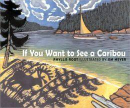

**If You Want to see a Caribou Phyllis Root**

If you really want to see a woodland caribou, you might try going to a
place forgotten by time. It should be a hushed place, with perhaps rocky
green hills and blue water, home to loons and beaver, lichen and yellow
buttercups. With every step, this gentle journey brings us to a deeper
and more unique connection with nature. Phyllis Root's mesmerizing text,
together with Jim Meyer's outstanding woodblock prints, makes the very
heart of the forest come alive and reveals that if you are patient and
quiet, sometimes what you are seeking will, in the end, find you.

-Amazon Review

This is a story of what readers might see and hear while looking for
caribou on an island in Lake Superior.

Tips for Reading:

• Point to the shadow of the caribou on the cover and ask the children
to look for the caribou throughout the book.

• Read slowly. The compact text does not rhyme, but it sounds like
music.

Questions before reading:

• Do you know what a caribou is or what it looks like?

• Have you ever seen deer in the woods or by the road? What surprised
you about them?

• Have you been on a sailboat? If yes, what was it like? If no, what do
you think it would be like?

Introduction:

Do you see the shadow of the caribou on the cover of this book? This is
a story about being in the woods on an island in Lake Superior, looking
for caribou and seeing a lot of other things along the way. Let's see
what those things might be. Keep your eyes open for the caribou!
Questions

After Reading:

• Were you surprised to see the caribou at the end?

• List as many things as you can remember seeing in the woods.

• Can you think of something else we wait to see when we're in the
woods? Possible answers: birds, full moon. What do these things have in
common? • What season do you think the book is set in? What clues can
you find?

- Minnesota Storytime Reading Guide

Writing:

If You Want to See a \_\_\_\_\_\_\_\_\_\_\_\_\_\_\_\_\_\_

Discuss:

Writing in 2^nd^ person.

Free verse poetry

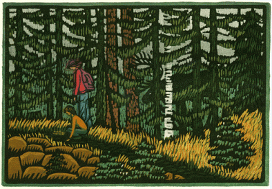

**If You Want to See a Caribou Phyllis Root**

If you want to see a caribou,

you must go to a place where the caribou live.

You might go by boat on a good sailing day

to an island in lake Superior,

the wind curving your sails,'

the waves rushing, *rooosh, rooosh.*

You might sail into a bay

cupped by rocky green hills

and drop anchor in quiet water.

Somewhere a loon calls, high and wild.

If you want to see a caribou,

you might go ashore and follow the trails

churned black by caribou hooves.

Spruce trees tower over you.

You stoop under brances

draped with old-man's-beard lichen,

wade through tiny meadows of pearly everlasting.

Yellow buttercups nod, *hello, hello.*

You might step over birch logs,

bark peeling, green with pixie cups.

If a log is pointed like a pencil,

you will know that a beaver gnawed down a tree

too huge to haul away.

If you want to see a caribou, you might follow those trails.

soft with rain,

through stands of balsams.

Needles brush you with their scent.

You might come to the heart of the woods,

the light falling green,

the ground spongy with feather moss.

Pale Indian pipes poke up

by the moss-edged bones of a caribou long dead.

Then you will know that you are close.

Or perhaps you come to a clearing

with stripped, stubby pines

where caribou have rubbed the velvet off their antlers

and the air has a faint, acrid odour.

Under fallen maple branches,

where caribou cannot reach,

big-leaf asters and thimbleberries grow.

You might find a yellow flicker feather at your feet.

Caribou eyes may be watching you,

but you might not see a caribou.

So you follow the trail on,

down to the water's edge again,

down to a shelf of rock where you sit,

quiet as an old spruce is quiet,

quiet as a red cupped mushroom,

quiet as a caribou who scents danger on the wind.

Quiet enough that two beavers swim nearby in silver vees,

diving for waterweed to stuff in their mouths.

If you are quiet,

and if you wait,

the caribou may come.

Cow and calf,

long-legged, white-ankled, gangly,

wading with awkward grace,

the young calf gawking behind,

then splashing ahead.

And if you are silent, watching still,

the caribou may browse

so close that when you whisper your name,

the caribou calf flicks his ears

before he follows his mother into the forest

and is gone.

Evening may be coming on,

so you make your way back to your sailboat home,

walking quiet as a caribou walks,

knowing

you have seen a caribou.

And a caribou knows your name.

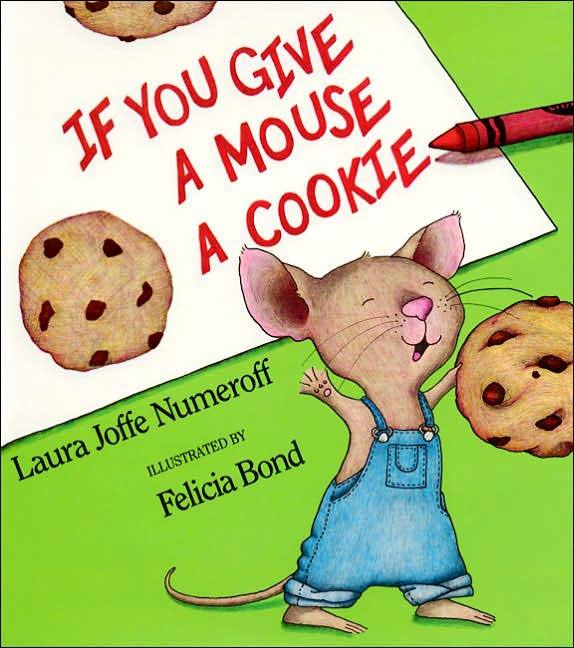

**If You Give a Mouse a Cookie Laura Numeroff**

Its plot deals with a boy who gives a cookie to a mouse. After eating a
cookie, the mouse has some milk. Then he decides to clean his face. This
starts simply enough, but the mouse keeps getting distracted and is
constantly moving on to other projects, leaving unfinished ones behind.
In the end, this leads back around to the mouse wanting another cookie
and the boy being so exhausted that he falls asleep on his desk. The
book features two characters, a mouse and a boy. Neither character
speaks, but their dialogue is reported indirectly by a narrator.

**If You Give a Mouse a Cookie**

**Laura Numeroff**

If you give a mouse a cookie, he's going to ask for a glass of milk.

When you give him the milk, he'll probably ask you for a straw.

When he's finished, he'll ask for a napkin.

Then he'll want to look in a mirror to make sure he doesn't have a milk
moustache.

When he looks into the mirror, he might notice his hair needs a trim.

So he'll probably ask for a pair of nail scissors.

When he's finished giving himself a trim, he'll want a broom to sweep
up.

He'll start sweeping.

He might get carried away and sweep every room in the house.

He may even end up washing the floors as well!

When he's done, he'll probably want to take a nap.

You'll have to fix up a little box for him with a blanket and a pillow.

He'll crawl in, make himself comfortable and fluff the pillow a few
times.

He'll probably ask you to read him a story.

So you'll read to him from one of your books, and he'll ask to see the
pictures.

When he looks at the pictures, he'll get so excited he'll want to draw
one of his own. He'll ask for paper and crayons.

He'll draw a picture.

When the picture is finished, he'll want to sign his name with a pen.

Then he'll want to hang his picture on your refrigerator.

Which means he'll need Scotch tape.

He'll hang up his drawing and stand back to look at it.

Looking at the refrigerator will remind him that he's thirsty.

So...

he'll ask for a glass of milk.

And chances are if he asks for a glass of milk,

he's going to want a cookie to go with it.

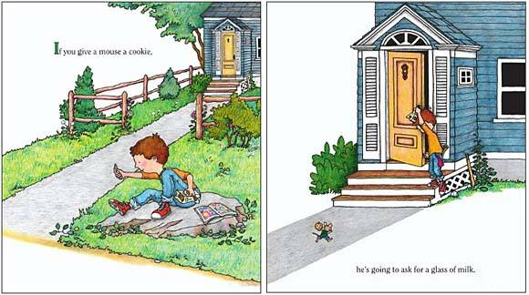

**\**

Lesson: comprehension, sequencing, circular story format

Objectives:

1\. Students will demonstrate understanding of the circular story format
by creating a circular, sequential graphic organiser for the story If
You Give a Mouse a Cookie by Laura Joffe Numeroff.

2\. Students will write their own circle stories using the prompt "If
you give a \_\_\_\_\_\_ a \_\_\_\_\_\_."

Initiation: Begin by drawing a circle on a large piece of paper. Ask,
"Does anyone know what I am drawing?" Most students will see that it is
a circle. "How do you know?" Discuss the difference between a line and a
circle and make the point that a circle ends at the same place it began.
Relate this point to different types of stories. Some stories begin with
one event and end with a different one, but others begin with one event
and work their way back to the same place. Ask the students to think of
examples of linear and circular stories or have them try to categorise
stories they have read in class. Tell them that they will be hearing a
circle story, a story that ends in the same place it begins.

Procedures:

1\. Read the first page of If You Give a Mouse a Cookie. Ask, "Where
does this story begin?" Have students predict where it will end.
Continue with the story, pausing to have students predict what might
happen next. For example, what might happen when the mouse asks to hear
a story?

2\. Briefly discuss why we call this a "circle story." Point out that
each event leads to the next until we return to the starting point.

3\. Students write their own circle story. Give them the prompt,

"If you give a \_\_\_\_\_ a \_\_\_\_\_..."

Have them supply an animal and food and work from there, adding at least
five events and working back to the original prompt.

**\**

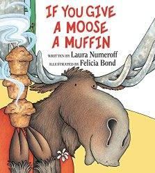

**If You Give a Moose a Muffin Laura Numeroff**

If a big hungry moose comes to visit, you might give him a muffin to
make him feel at home. If you give him a muffin, he\'ll want some jam to
go with it. When he\'s eaten all your muffins, he\'ll want to go to the
store to get some more muffin mix.

In this hilarious sequel to If You Give a Mouse a Cookie, the young host
is again run ragged by a surprise guest. Young readers will delight in
the comic complications that follow when a little boy entertains a
gregarious moose**.**

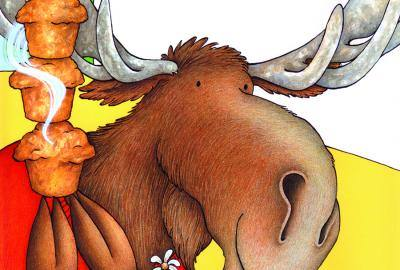

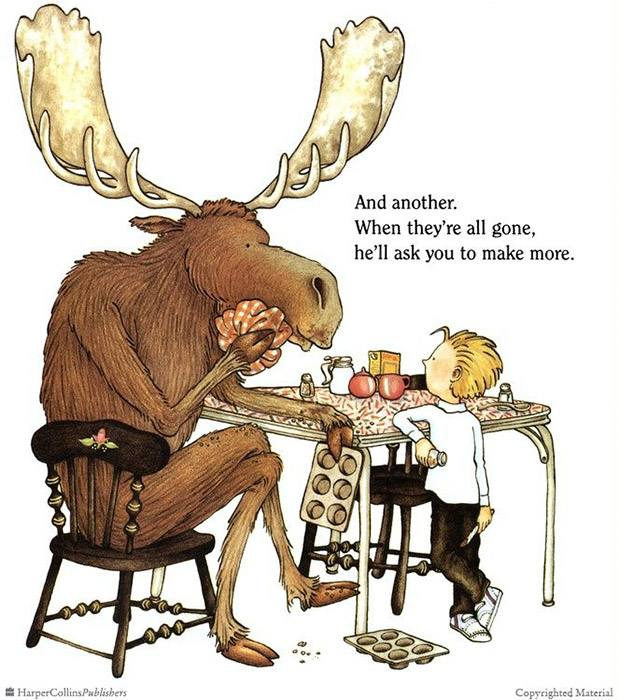

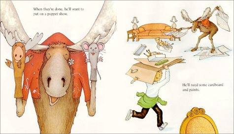

**If You Give a Moose a Muffin Laura Numeroff**

If you give a moose a muffin, he'll want some jam to go with it.

So you'll bring out some of your mother's homemade blackberry jam.

When he's finished eating the muffin, he'll want another. And another.

And another.

When they're all gone, he'll ask you to make more.

You'll have to go to the store to get some muffin mix.

He'll want to go with you.

When he opens the door and feels how chilly it is, he'll ask to borrow a
sweater.

When he puts the sweater on, he'll notice one of the buttons is loose.

He'll ask for a needle and thread.

He'll start sewing.

The button will remind him of the puppets his grandmother used to make.

So he'll ask for some old socks.

He'll make sock puppets.

When they're done. he'll want to put on a puppet show.

He'll need some cardboard and paints.

Then he'll ask you to help make the scenery.

When the scenery is finished, he'll get behind the couch.

But his antlers will stick out.

So he'll ask for something to cover them up.

You'll bring him a sheet from your bed.

When he sees the sheet, he'll remember he wants to be a ghost for
Halloween.

He'll try it on and shout, "BOO!"

It'll scare him so much, he'll knock over the paints.

So he'll use the sheet to clean up the mess.

Then he'll ask for some soap to wash it out.

He'll probably want to hang the sheet up to dry.

He'll go outside to put it on the clothesline.

When he's out in the yard, he'll see your mother's blackberry bushes.

Seeing the blackberries will remind him of her jam.

He'll probably ask you for some.

And chances are \... if you give him the jam,

He'll want a muffin to go with it.

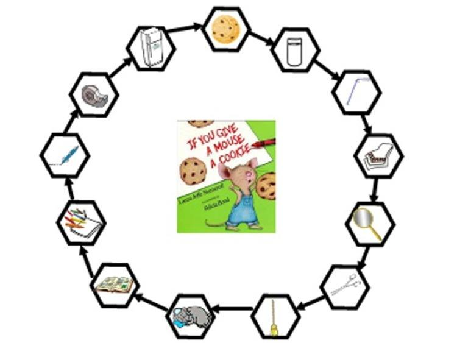**\**

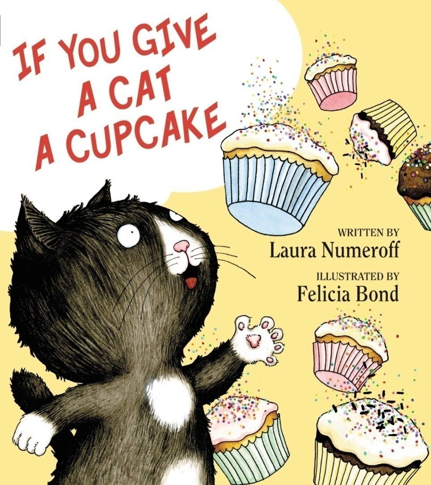

**If You Give a Cat a Cupcake Laura Numeroff**

If you give a cat a cupcake, he\'ll ask for some sprinkles to go with
it. When you give him the sprinkles, he might spill some on the floor.
Cleaning up will make him hot, so you\'ll give him a bathing suit . . .
and that\'s just the beginning!

The lovable cat who first appeared in If You Give a Pig a Party now has
his very own book! Written in the tradition of the bestselling If You
Give a Mouse a Cookie, Laura Numeroff and Felicia Bond\'s newest story
will show everyone that Cat is where it\'s at!

**If You Give a Cat a Cupcake Laura Nuneroff**

If you give a cat a cupcake, he'll ask for some sprinkles to go with it.

When you give him the sprinkles, he might spill some on the floor.

Cleaning up will make him hot, so you'll give him a bathing suit, and
take him to the beach.

He'll want to go in the water and build a sand castle, too.

Then he'll look for seashells.

He'll find a few other things as well.

He'll put them in his pail and try to pick it up, but it'll be too
heavy.

He'll decide he needs to work out at the gym.

First he'll warm up on the treadmill.

Then he'll lift a weight or two.

He might even try a karate class.

After the gym, he'll want to go to the park. When you get there, he'll
see the rocks. He'll climb as far as he can go. At the top, he'll see
the lake. He'll want you to take him rowing.

He'll be the captain, and you'll have to row.

Then he'll notice the merry-go-round and want to go for a ride.

He'll want you to go for a ride, too.

You'll choose the horse with the purple mane, and he'll get on the
whale.

the whale will remind him of the science museum. He'll ask you to take
him there.

First he'll find the dinosaurs.

Then he'll visit the Hall of Apes.

When the museum closes, you'll be the last to leave.

On the way home, you'll pass by the beach.

You'll help him gather all of his things.

Then he'll want to race you.

When you get home, he'll empty the sand from his shoes.

He might spill some on the floor.

Seeing the sand on the floor will remind him of the sprinkles.

He'll probably ask you for some.

And chances are, if you give him some sprinkles,

he'll want a cupcake to go with them.

**\**

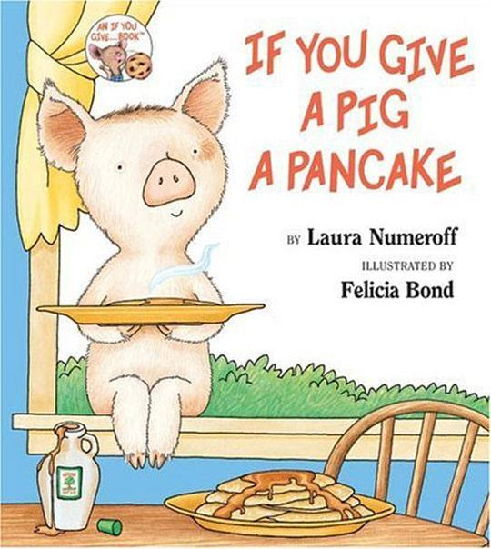

**If You Give a Pig a Pancake Laura Numeroff**

One thing that author Laura Numeroff and illustrator Felicia Bond have
managed to do is to engage and delight children for a number of years
with their "If You Give A..." books. These stories are all about how one
thing can lead to another, showing children, in a silly way, that
everything in the world is connected. But these children's books are
more than just stories to read to teach children about the world --
they're tales to read that are fun for both parents and children! And
that's something that you don't see every day.

In If You Give a Pig a Pancake, the time has come to tell the tale of
the pig! Ever wonder what a pig would do with a pancake? What would you
want with a pancake? Of course she wants some syrup to put on her
pancake. But then, what happens when you put syrup on a pancake? You get
all sticky! So does the title character, and then she wants to get
cleaned up. A bath leads to wanting to have bubbles, and bubbles lead to
ducks, and of course ducks lead to her missing her home on the farm. The
next thing you know you'll be building a tree house in the backyard for
your pig and letting her decorate it!

As with any great comedian, Numeroff starts If You Give a Pig a Pancake
with one thing and even though the trail is long and windy, brings it
back to the very same place, which definitely takes talent.

There are many messages that this tale can give to children, including
to appreciate what you have, that everything interconnects and one thing
leads to another, and, of course, that you should always have a bit of
silliness in your life. With If You Give a Pig a Pancake, children and
parents can giggle together and the fun tale of this pink porker and all
of the things that she makes you do while you're reading the story. For
fun bedtime reading, or really for any time reading, Numeroff and Bond
deliver.

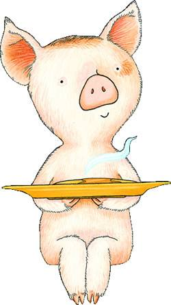

**\**

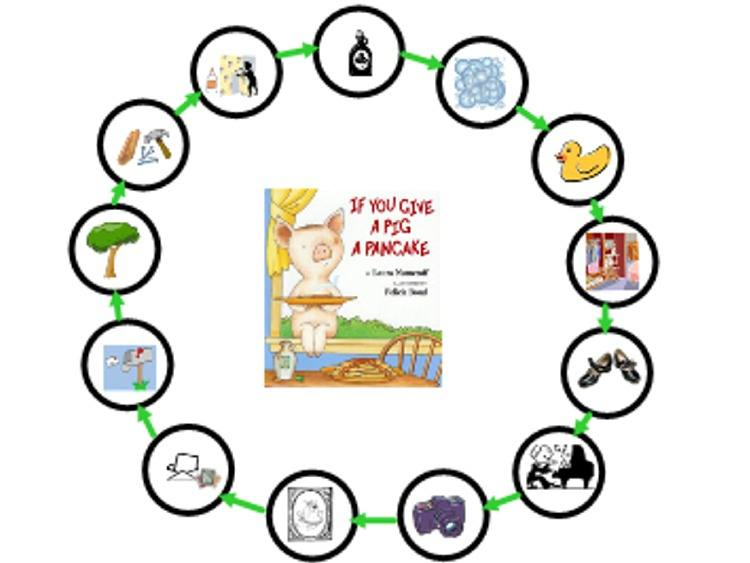

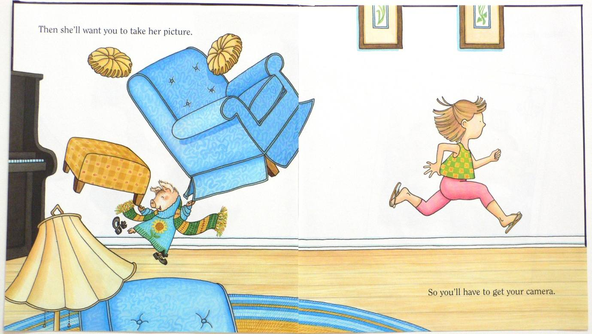

**\**

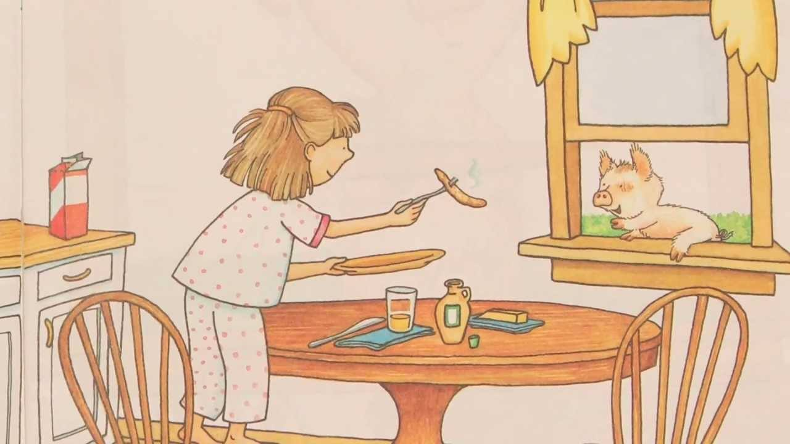

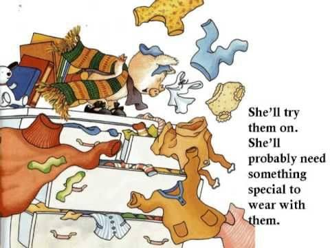

**\**

**If You Give a Pig a Pancake Laura Numeroff**

If you give a pig a pancake, she'll want some syrup to go with it.

You'll give her some of your favourite maple syrup.

She'll probably get all sticky, so she'll want to take a bath.

She'll ask you for some bubbles.

When you give her the bubbles, she'll probably ask you for a toy. You'll
have to find your rubber duck.

The duck will remind her of the farm where she was born.

She might feel homesick and want to visit her family.

She'll want you to come too. She'll look through your closet for a
suitcase.

Then she'll look under your bed.

When she's under the bed, she'll find your old tap shoes.

She'll try them on. She'll probably need something special to wear with
them.

When she's all dressed, she'll ask for some music.

You'll play your very best piano piece, and she'll start dancing.

Then she'll want you to take her picture. So you'll have to get your
camera.

When she sees the picture, she'll ask you to take more.

Then she'll want to send one to each of her friends.

You'll have to give her some envelopes and stamps, and take her to the
mailbox.

On the way, she'll see the tree in your backyard.

She'll want to build a tree house.

So you'll have to get her some wood, a hammer, and some nails.

When the tree house is finished, she'll want to decorate it.

She'll ask for wallpaper and glue.

When she hangs the wallpaper, she'll get all sticky.

Feeling sticky will remind her of your favourite maple syrup.

She'll probably ask you for some.

And chances are, if she asks you for some syrup,

she'll want a pancake to go with it.

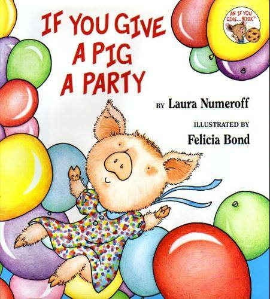

**If You Give a Pig a Party Laura Numeroff**

If you give a pig a party, she\'s going to ask for some balloons. When
you give her the balloons, she\'ll want to decorate the house. When
she\'s finished, she\'ll put on her favourite dress. Then she\'ll call
all her friends \-- Mouse, Moose, and more.

The little pig from If You Give a Pig a Pancake is back, and this time
she wants to throw a great big party! Laura Numeroff and Felicia Bond
have created another winning story for this beloved character in the
tradition of the best-selling If You Give a Mouse a Cookie.

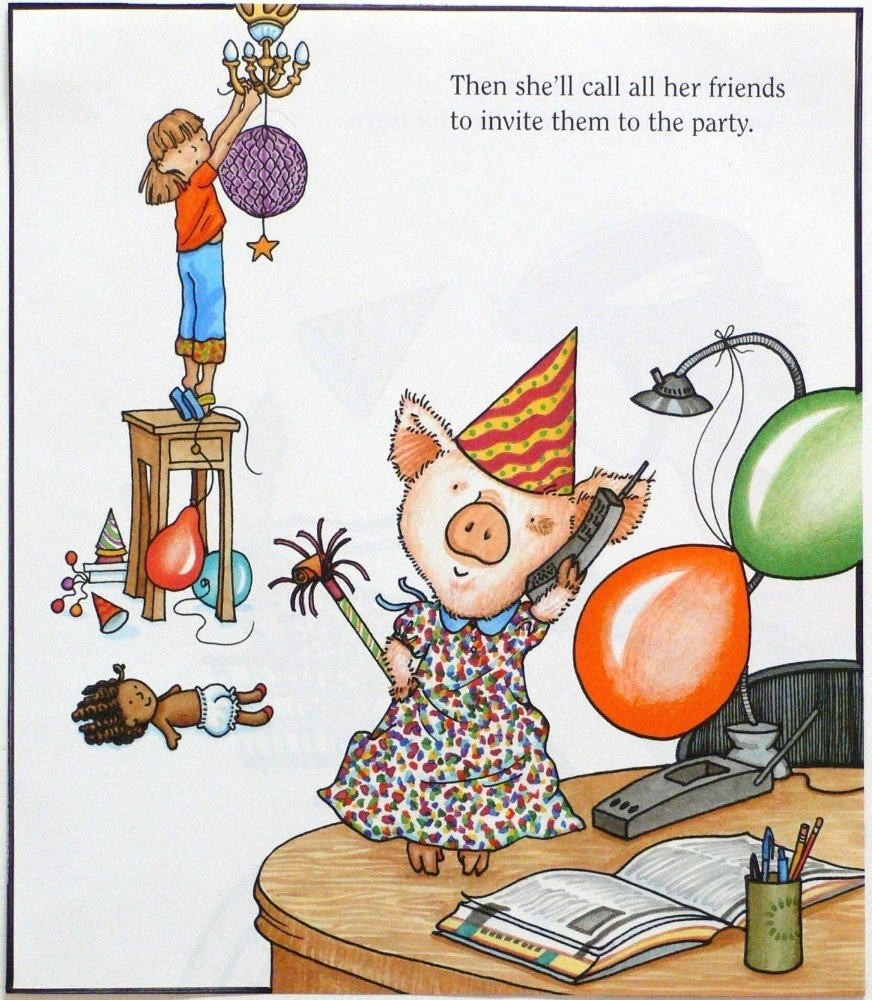

**If You Give a Pig a Party Laura Numeroff**

If you give a pig a party, she's going to ask for some balloons.

When you give her the balloons, she'll want to decorate the house.

When sh's finished, she'll put on her favourite dress.

Then she'll call all her friends to invite them to the party.

Her friends won't be home, so you'll go with her to look for them.

On the way, she'll see a street fair.

She'll want you to take her on the bumper cars.

All her friends will be there.

Then you'll have to take her on all the rides.

She'll want to play all the games, too.

When she's done, she'll ask you for some ice cream.

When she's finished eating the ice cream, she'll need to change her
clothes. You'll have to take her home.

She'll ask her friends to come along.

On the way, she'll start a game of hide-and-seek.

When you finally get home, you'll have to make dinner.

Then she'll want to have a sleepover.

You'll have to find pyjamas, and blankets and pillows for everyone.

When she sees the pillows, she'll probably start a pillow fight.

Then she'll make a fortress out of the blankets.

Of course, when she's finished, she'll want to decorate it.

So she'll ask for some balloons.

And chancves are, if you give her some balloons,

she's going to ask you for a party.

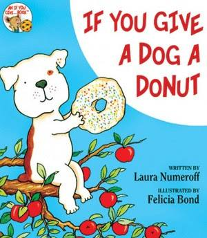

**If You Give a Dog a Donut Laura Numeroff**

If you give a dog a donut, he'll ask for some apple juice to go with
it.\
\
When you give him the juice, he'll drink it all up.\
\
Then, before you can say "Woof" . . . Dog is off on a backyard
adventure!\
\
The exuberant dog who first appeared in if you give a pig a party is now
the star of his very own book. Written in the irresistible "If You
Give..." tradition, if you give a dog a donut is another home run from
the beloved team of Laura Numeroff and Felicia Bond. 

**\**

**If You Give a Dog a Donut Laura Numeroff**

If you give a dog a donut, he'll ask for some apple juice to go with it.

When you give him the juice, he'll drink it all up.

There won't be any left, so he'll want to make his own.

He'll go outside to pick apples.

When he's up in the tree, he'll toss you one.

Throwing the apple will make him think of baseball. He'll want to play.

You'll have to get a ball and a glove.

Of course, he'll also need a bat.

He'll ask you to pitch.

He'll hit a home run!

Then he'll do a happy dance to celebrate.

Dancing will make him hot and dusty, so he'll need some water.

He'll probably start a water fight.

You'll have to dry him off with your bandana.

He'll wrap it around his head and pretend that he's a pirate.

Then he'll want to go on a treasure hunt.

He'll find an old kite and want to make one himself.

You'll have to get him some sticks, paper, and string.

When the kite is finished, he'll want to fly it.

It will go higher and higher, until it gets tangled in the apple tree.

The tree will remind him of apple juice, so he'll probably ask you for
some.

And chances are, if he asks for some apple juice,

he'll want a donut to go with it.

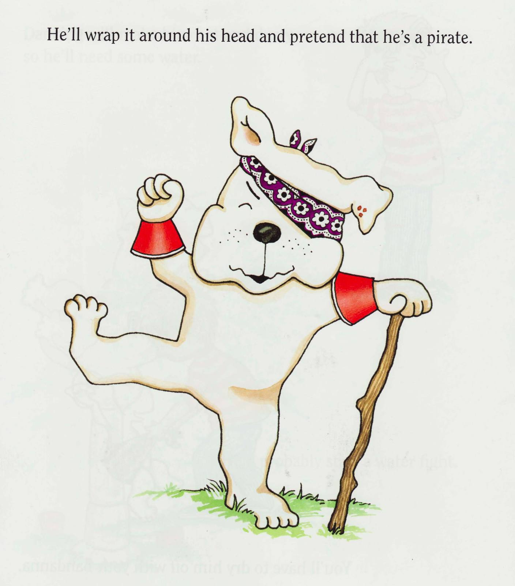

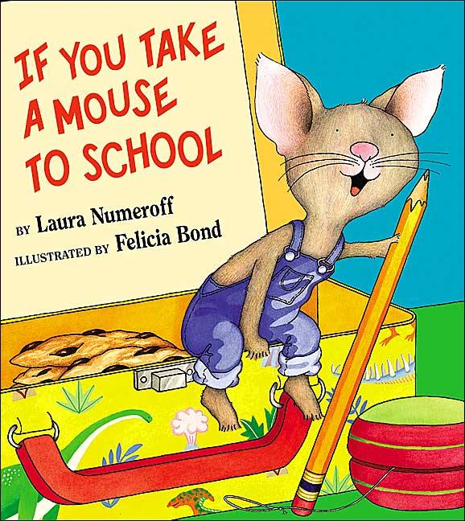

**If You Take a Mouse to School Laura Numeroff**

Summary: This is about a mouse and a young boy. They are friends. The
boy is going to bring the mouse to school, but the mouse has a lot of
requests. Once he asks for one thing, he will need something to go a
long with it. There are a series of chain events that take place. If you
take a mouse to school, he\'ll ask for your lunchbox. When you give him
your lunchbox, he\'ll want a sandwich and so on.

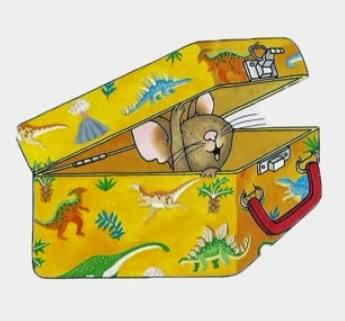**\**
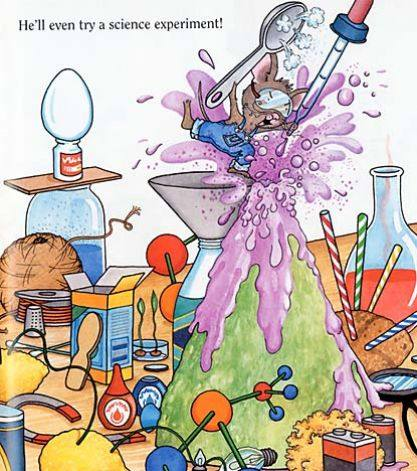

**\**

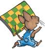 **If You Take a Mouse to School**

**Laura Numeroff**

If you take a mouse to school, he'll ask you for your lunchbox.

When you give him your lunchbox, he want a sandwich --

and a snack for later.

Then he'll need a notebook and some pencils.

He'll probably want to share your backpack, too.

He might do a little maths, and spell a word or two.

He'll even try a science experiment!

Then he'll need to wash up.

You'll have to take him to the bathroom.

Once he's nice and clean, he'll be ready for his lunch.

On the way to the lunchroom, he'll see some building blocks.

He'll build a little mouse house, and make some furniture out of clay.

Then he'll need some books for his bookshelf. He'll start by writing one
of his own,

so he'll need a lot of paper.

He'll probably use up all your pencils.

When he's finished, he'll want to read his book to you.

Then he'll want to take it home. So he'll put it in your lunchbox, and
tuck it in a

safe place.

When the bell rings, he'll run out to wait for the bus.

While he's waiting, he'll play a quick game of soccer.

Then he'll ask you to shoot a few baskets, and do a little
skateboarding.

When he stops to catch his breath, he'll want to eat is snack.

So he'll ask you for your \...

lunchbox. And chances are, if he asks you for your lunchbox,

you'll have to take him back to school.

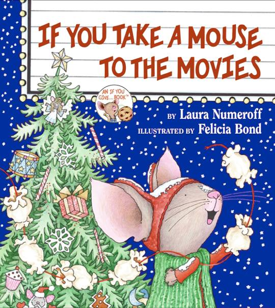

**If You Take a Mouse to the Movies Laura Numeroff**

Children love to go to the movies. They love the popcorn, they love
being able to sit in the chair and to watch a movie on the big screen,
and they love spending special time with their family members there. But
did you know that mice love movies? Well, one mouse does anyway. Only
this mouse is a bit different. He is a little exuberant and when you
bring him to the movies in If You Take a Mouse to the Movies, things
start to get a little strange.

What's the first thing that you want when you go to the movies? Author
Laura Numeroff and Illustrator Felicia Bond reminds us that the most
important thing at the movies is to have some popcorn, and that's
exactly what this little mouse wants. But when he gets the popcorn, it
reminds him of something else that you can use popcorn for -- decorating
a tree! And if you are going to decorate a tree in the snow, you might
as well build a snow mouse! The tale goes on and on as this mouse shows
children, in a fun way, that everything has an impact on everything else
in the world.

Numeroff and Bond are well-known for their childrens books, but most
especially for their "If You Give A..." books, where fun creatures find
that one thing leads to another which leads to another for over thirty
pages! In this tale they've brought back their first creation -- the
mouse -- and have him going to the movies for his first ever holiday
adventure.

If You Take a Mouse to the Movies is a perfect book for the holiday
season, because it is lighthearted and it is different than all of the
other holiday tales that you can read. This one can also be read when
it's not the holiday time, as its fun and engaging for the whole family!
If You Take a Mouse to the Movies is exactly what you'd expect from
these two well-known authors -- fun, silly, and something that the whole
family will enjoy.

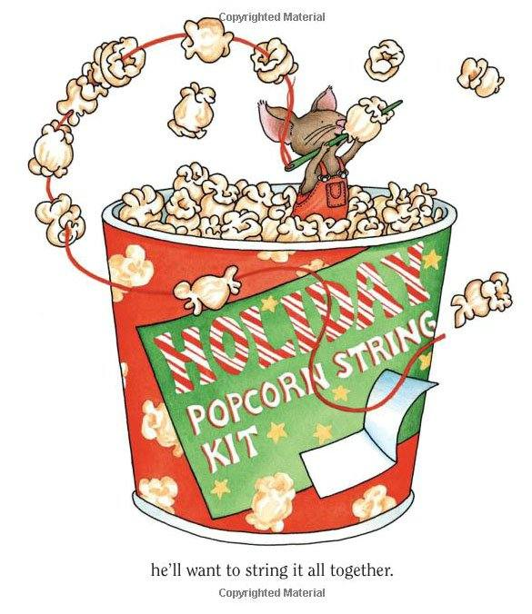

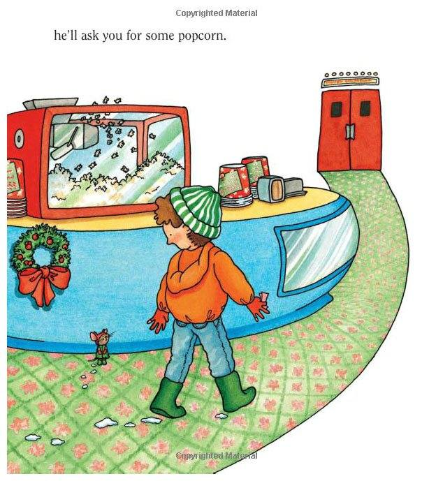

**If You Take a Mouse to the Movies Laura Numeroff**

If you take a mouse to the movies, he'll ask you for some popcorn.

When you give him the popcorn, he'll want to string it all together.

Then he'll want to hang it on a Christmas tree.

You'll have to buy him one.

On the way home, he'll see a snowman in your neighbour's yard.

He'll want to make one of his own.

Then he'll need a carrot for a nose.

When he's all finished, he'llk decide to build a fort. He'll ask you to
help him.

Then he'll want to make some snowballs and have a snowball fight.

Playing outside will make him cold. He'll want to go inside and curl up
on the couch.

He'll ask you for a blanket.

Once he's nice and cosy, he'll want to listen to Christmas carols.

You'll have to find some on the radio.

He'll probably sing along.

The carols will remind him of his Christmas tree, so he'll want to make
ornaments.

You'll get him some paper and glue.

He'll ask you for glitter.

When the ornaments are done, he'll hang them all up.

Then he'll stand back to look at the tree.

He'll notice his popcorn string is missing!

So he'll want to make another one.

he'll ask you for some popcorn.

And chances are, when you give him the popcorn,

he'll want you to take him to the movies.

Laura Numeroff

CHILDHOOD

GROWING UP IN BROOKLYN, NEW YORK I was born in 1953, in Brooklyn, New
York. I was surrounded by art, music, and books. My father, William,
worked on the art staff of the World Telegram & Sun, one of New York\'s
major newspapers. My mother, Florence, was a junior high school home
economics teacher. They both enriched my life with the love of reading,
playing the piano, singing, dancing, science and stamp collecting. I was
the youngest of three girls. My favourite possessions were my
microscope, a box of 64 crayons and my library card. I loved being a
Girl Scout. I was a Brownie all the way through Cadets. I enjoyed it so
much, especially selling Girl Scout cookies. The Thin Mints were and
still are my favourites. My best friend, Pat, and I would work on badges
together.

MY LOVE OF READING BEGINS

I also loved to draw, read and make up stories. I started writing my own
stories and drew pictures to go with them. I would make a book cover for
them and write down the name of a publisher. I also spent a great deal
of time reading. The public library was about 5 blocks from my house and
I went every week. At that time you were only allowed six books at a
time. I gobbled up all of the books by Beverly Cleary, Marguerite Henry,
the DR. DOOLITTLE series and books about animals. When I read ELOISE, by
Kay Thompson, illustrated by Hilary Knight, it became one of my
favourites. I also loved, STUART LITTLE, by E.B. White, illustrated by
Garth Williams. (Most people are big CHARLOTTE\'S WEB fans, but Stuart
won my heart!) And of course, I adored THE CAT IN THE HAT, by Dr. Seuss!
I\'m honoured to be able to say that the three publishers of those 3
titles, are also the same publishers of my books! HarperCollins, who
published STUART LITTLE, did IF YOU GIVE A MOUSE A COOKIE, IF YOU GIVE A
MOOSE A MUFFIN, IF YOU GIVE A PIG A PANCAKE and THE CHICKEN SISTERS!
Simon & Schuster, who published ELOISE, did WHAT MOMMIES DO BEST, TWO
FOR STEW, WHY A DISGUISE?, SOMETIMES I WONDER IF POODLES LIKE NOODLES,
DOGS DON\'T WEAR SNEAKERS and CHIMPS DON\'T WEAR GLASSES! And Random
House put my book MONSTER MUNCHIES in the Dr. Seuss Beginner Reader
Series, along with THE CAT IN THE HAT! What a thrill!

GOING TO COLLEGE

THE START OF MY LIFE AS AN AUTHOR

When I was 15, I had a change of heart. Instead of being a writer, I
decided to follow in my sister Emily\'s footsteps. She was a fashion
designer and I thought it sounded like a great job. When the time came
to go to college, I only applied to Pratt Institute, in Brooklyn, where
Emily had gone! Unfortunately, I hated everything about the fashion
department and I couldn\'t sew to save my life! I ended up taking
classes in things I enjoyed, photography, animation and radio
broadcasting. By my last semester, I was still unsure of what I would do
once I graduated. I ended up taking a class in writing and illustrating
books for children because it sounded like a great class. We had an
assignment to write and illustrate a children\'s book. Mine was about
the tallest girl in the third grade. (No, I wasn\'t the tallest but I
have an imagination!)I made several attempts to get it published and
after only 4 rejections, Macmillan bought it! I graduated from college
with a degree AND a contract for my first book!

My first nine books are now out of print. One of them (my favourite),
BEATRICE DOESN\'T WANT TO, is a story about a girl who hates books!!!
This one is coming back with all new illustrations by Lynn Munsinger who
did the art for WHAT MOMMIES DO BEST/WHAT DADDIES DO BEST! I can\'t
wait! I\'m hoping to make the other titles available so keep an eye open
for those!

THE REST OF MY FAMILY.

I\'m the youngest of three girls! Emily, the middle sister, was a
fashion designer and now owns her own company that helps other fashion
designers find new jobs! She and her husband, Larry, collect antiques (I
was inspired by them!). Their collections range from old posters and
cookie jars to advertising signs. Then there\'s Alice. She is a junior
high school English teacher, she\'s married, to Jerry, who sells
commercial real estate. She and I co-authored 2 of my out of print
books, EMILY\'S BUNCH and YOU CAN\'T PUT BRACES ON SPACES. I have a
niece, Nancy, who lives in London with her husband Andrew and their son,
Charlie. I also have a nephew, Douglas who lives in Los Angeles, with
his wife, Jennifer. I have great memories of laughing with Alice and
Emily, doing silly things, travelling with them and feeling so lucky to
have two great sisters.

# Meet the Illustrator

## Felicia Bond

Felicia Bond grew up in New York and Texas. As a child, nearly every
kind of children\'s book art was exciting to her, from the paintings in
**Madeline** to Charles Schulz\'s **Peanuts**. \"I loved it all,\" she
says. \"I couldn\'t wait to grow up and be an artist.\"

Bond puts a lot of thought into the characters she draws. When she drew
the moose in **If You Give a Moose a Muffin**, she says: \"I imagined
what it would be like to be very VERY tall, with knobby knees and bony
elbows and something like a coat-rack on my head.\"

As for the pig in If You Give a Pig a Pancake, Bond says, \"I didn\'t
want her to be a typical chunky pink pig.... I added some fuzz and a few
spots.\" She also decided that the pig would not write four or forty
letters to her relatives, but four hundred! \"So I had to put her in a
wheelbarrow,\" she explains.

Felicia Bond\'s Bio:

Felicia Bond, illustrator, was born to American parents in Yokohama,
Japan, where she lived for two years. Bond grew up in Bronxville, New
York and Houston, Texas with her four brothers and two sisters. It was
while living in New York that she observed a beam of light coming in her
bedroom window at age five and knew that art was her calling. Bond cites
numerous inspirations as a child, among them the covers of The New
Yorker, the drawings in her Girl Scout Handbook, the sketches her mother
drew for her and her siblings, and the art in children\'s books. Bond
was especially drawn to the painterly, expressive style of Ludwig
Bemelmans in his Madeline books and the sensitive ink drawings by Garth
Williams in Charlotte\'s Web and Stuart Little. For many years she
closely examined the work of Charles Schulz, renowned for his Peanuts
comic strip, and credits him as making a lasting impression on her.

At age twenty-two Bond moved to New York City with nine hundred dollars
and worked several jobs, including illustrating botanical books, working
as a freelance scene painter in a children\'s museum, and being an art
director for Margaret K. McElderry Books. During this time Bond took
classes at The School of Visual Arts and put together a portfolio of
work intended for children\'s books. Bond was offered five contracts in
short order and left behind her original idea of pursuing her painting.
By the time Felicia Bond was twenty-six the first book Bond both wrote
and illustrated, Poinsetta and Her Family, had been published. Four more
books of Bond\'s own quickly followed before Bond illustrated If You
Give a Mouse a Cookie in 1985. Bond has also illustrated, among other
works, Big Red Barn, written by Margaret Wise Brown, The Big Green
Pocketbook, written by Candice Ransom, Little Porcupine\'s Christmas,
written by Joseph Slate and The Right Number of Elephants, written by
Jeff Sheppard. Felicia Bond is both author and illustrator of numerous
other works, including Poinsettia and her Family, Poinsettia and the
Firefighters, The Day It Rained Hearts, The Halloween Play, Tumble
Bumble, and Big Hugs, Little Hugs.

If You Give a Mouse a Cookie, the first collaborative work written by
Laura Numeroff and illustrated by Felicia Bond, quickly became
established as a popular favorite and is today considered a contemporary
classic, with over four million copies sold. A series of seventeen
titles followed, with sales exceeding sixteen million. They have been
translated into more than thirteen languages. The If You Give\... Book™
series has garnered numerous awards, and their popularity is witnessed
by their consistent presence on The New York Times Best Seller List.
Many of the books were the #1 best-sellers in the picture book category.
The If You Give\... Book™ series has become so embedded in our culture
that If You Give a Mouse a Cookie was mentioned in the movie Airforce
One and Oprah Winfrey chose If You Give a Pig a Pancake as one of her
favorite things in 2000. Winfrey also included it on her list Oprah's
Favorite Things from A-Z in that same year. If You Give a Moose a Muffin
was the answer to a question on Jeopardy!. Many of the books in the If
You Give\... Book™ series have been adapted into plays for children\'s
theaters across the country, The Bronx Zoo in New York featured Felicia
Bond\'s art in their Children\'s Zoo for one year and Bond\'s artwork
has been used to create murals in the wings of children\'s hospitals.
The If You Give\... Book™ series has fans of all ages from all over the
world including Japan, where an entire Tokyo city bus was painted with
Bond\'s images of Mouse. Mouse also made it to the White House; in Laura
Bush\'s Celebration of American Authors at the 2001 Presidential
Inauguration Felicia Bond and Laura Numeroff were among those honored
for their If You Give\... Book™ series, and the former First Lady writes
that the Bush family cat India\'s favorite book was If You Take a Mouse
to the Movies. A bronze sculpture of her sleeping on the book is
included in the George W. Bush Presidential Library. First Lady Michele
Obama read If You Give a Mouse a Cookie on The White house lawn during
the 2009 Easter Egg Roll. The website mousecookiebooks.com, posted by
its publisher, HarperCollins, is an interactive site for children,
parents, teachers, and librarians alike.

Felicia Bond continues to write as well as illustrate, and is currently
scheduled to create the art for an upcoming book with HarperCollins, A
Mother\'s Goodnight, written by Margaret Wise Brown. A new book in the
If You Give\... Book™ series (If You Give a Mouse a Brownie) is due to
be published in 2014.

In her illustrations Felicia Bond\'s signature style is characterized by
rich, vibrant watercolor, often with a black line used for graphic
effect. Bond\'s use of white space is often similarly applied,
especially in her distinctive design of the books in the If You Give\...
Book™ series. Bond\'s book Big Hugs, Little Hugs uses mixed media
collage, which reflects her painting style from her early twenties.

Bond personalises many of her illustrations by discreetly writing the
names of family, friends, and pets in the art. Felicia Bond has said she
started doing this years ago, inspired by the cross-hatched ink artwork
in The New York Times by Al Hirschfeld, who hid his daughter\'s name,
Nina, at least once in almost every drawing.

Bond\'s writing style varies in content but is often narrative and
character based. Poinsettia and Her Family and Poinsettia and the
Firefighters came about from her own childhood. Other stories began as
an aimless doodle, such as the whimsical The Day It Rained Hearts and
the playful Tumble Bumble. Her book Big Hugs, Little Hugs is more
conceptual in nature and evolved from a dream that she merged with a
comforting story her father told her when she was a child and couldn\'t
fall asleep. In interviews she has said her ideas come from an
\"impulsive and intuitive place\", that she \"lives a story\" instead of
tells it. She works to keep the \"mysterious third thing\" alive in a
book while she hones the narrative ark and pacing of the words and
design. She often compares the making of a book to cooking, a musical
score, or a dance.

Felicia Bond currently lives in Santa Fe, New Mexico.

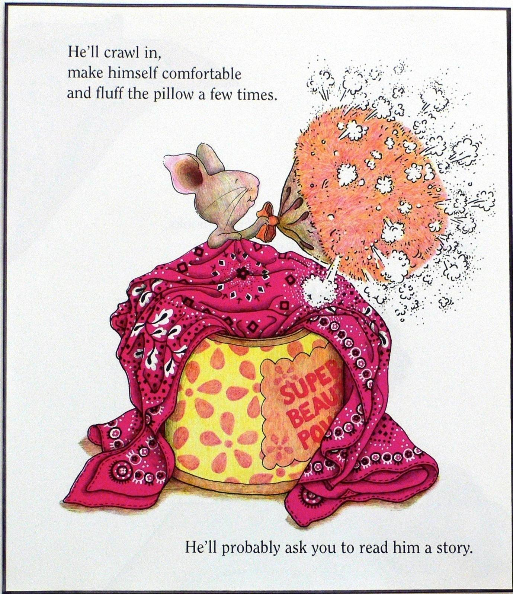

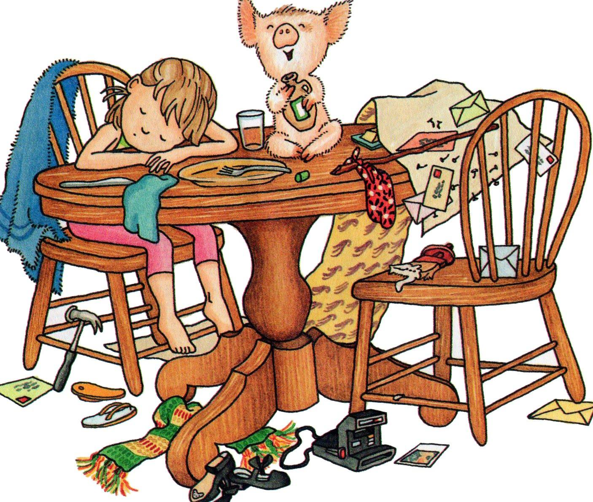

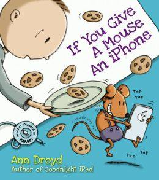

**If You Give a Mouse an iPhone Ann Droyd**

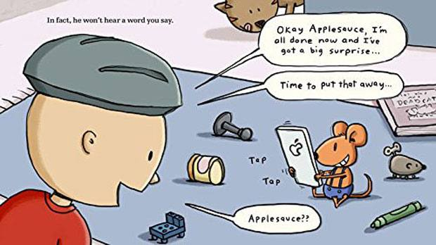

If you give in to temptation and give a bored little mouse your iPhone,
even for ten minutes, he's probably going to beam to some faraway place
beyond time, space, and the sound of your pleading voice. And if he's
that far gone, he won't have any idea what's going on around him, and he
might end up missing out on all the real fun.

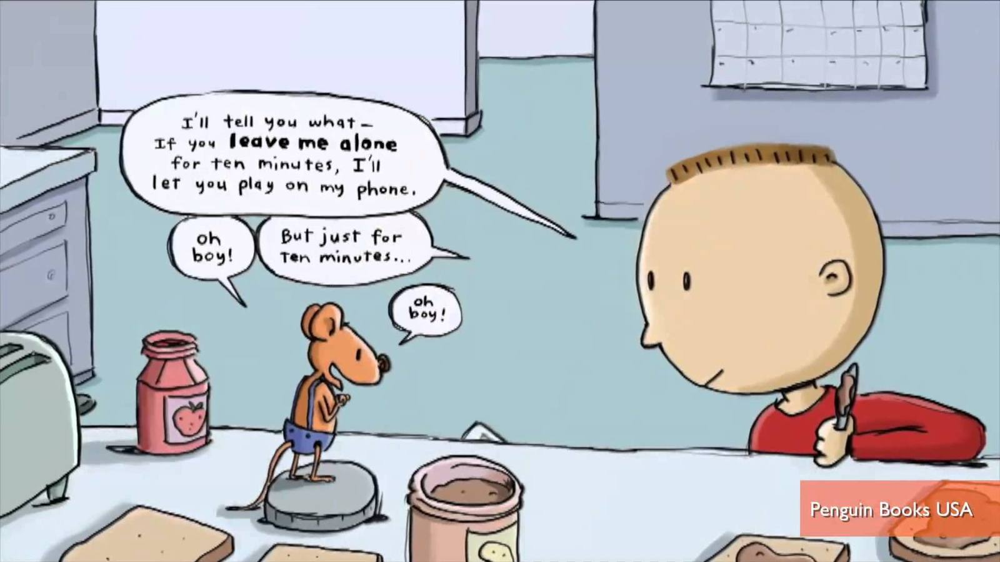

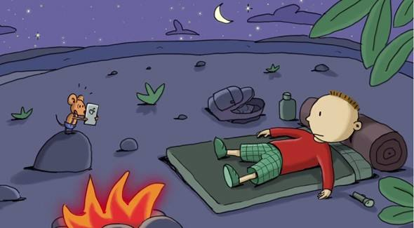

People check their phones all the time. They're addicted to Facebook,
their email, you know the story. But (apparently) there's an even more
vulnerable population than humans: mice.

In If You Give a Mouse an iPhone by Ann Droyd (a pseudonym, sadly),
Applesauce the mouse won't stop bothering his human friend. So the kid
offers him 10 minutes of iPhone time. Applesauce is elated. But then
something more sinister happens. Not really, but Applesauce does become
completely enthralled by the phone and doesn't realize that his friend
is taking him on a special adventure to an amusement park.

He misses out on lots of fun stuff because he's on his phone,
accidentally sets a bunch of animals loose at the amusement park, walks
out unaware, walks straight into the ocean, makes his way to a deserted
island, eventually loses battery and needs to charge the iPhone,
discovers he can't because he's on the remote island, and---well, I
don't want to completely spoil it for you. Fred Armisen's narration in
the video above is impassioned and generally awesome.

Suffice it to say that our obsession with screen time has become enough
of a problem that we need to start talking to kids about it while
they\'r'e young. If You Give a Mouse an iPhone is more troubling than
the beloved classic If You Give a Mouse a Cookie, but it's also driving
at some deeper real talk. Go play outside, kids.

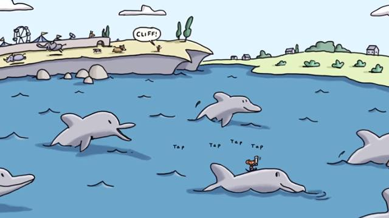

**If You Give a Mouse an iPhone Ann Droyd**

"Can I have some nail scissors and a mirror and a broom and a bucket and
a mop \..."

"Not right now -- Look -- do you see how busy I am?"

"\... and some crayons and a pen and some paper and tape and a
refrigerator and \..."

If you give an mouse an iPhone,

"I'll tell you what -- If you leave me alone for ten minutes, I'll let
you play onmy phone."

"Oh boy!"

"But just for ten minutes \..."

"Oh boy!"

He's not going to ask for a cookie. Or a glass of milk. Or anything at
all.

In fact, he won't hear a word you say.

"Okay Applesauce, I'm all done now and I've got a big surprise \...

Time to put that away."

*Tap Tap.*

"Applesauce??"

And if he doesn't hear a word you say, he won't know you are taking him
on a special trip!

"Isn't this the greatest surprise ever?? Applesauce?"

He'll miss out on all the kettle korn and funnel cake and ice cream and
corn dogs and cheese fries and \...

"OMG! These are the best nachos ever!"

*Tap Tap Tap Tap*

He won't even realise he's on the Katmandu Koaster.

"Isn't this the most fun ever?? Applesauce?"

*Tap Tap Tap Tap*

And if he doesn't realise he's on the Katmandu Koaster, he won't
remember to buckle his seat belt, and he'll probably take a little ride
of his own.

And chances are, if he takes a little ride of his own.

He'll accidentally open all the cages.

But he won't have the slightest idea what's happeneing.

"Applesauce??"

*Tap Tap Tap*

And if he doesn't know what's happening, he won't watch where he's
going.

"Look out!"

*Tap Tap Tap*

And he'll probably march right out of the wild animal amusement park.

And straight into the sea.

"Watch out for the \..."

*Tap Tap*

"Cliff!"

And if he falls into the sea \...

*Tap Tap Tap Tap*

Chances are, he'll end up on some distant island.

"Is that Minecraft?"

"Can i try?" (Dolphins)

*Tap Tap Tap*

So you'll have to get a boat. And you'll probably have to camp out for
the night since it will be too late to paddle home.

"You do know that this much screen time can't be good for you, right?"

*Tap Tap Tap*

Then, about the time you run out of energy, the phone battery will too.

"AUGHHHH!"

And when the battery runs out, He'll totally freak.

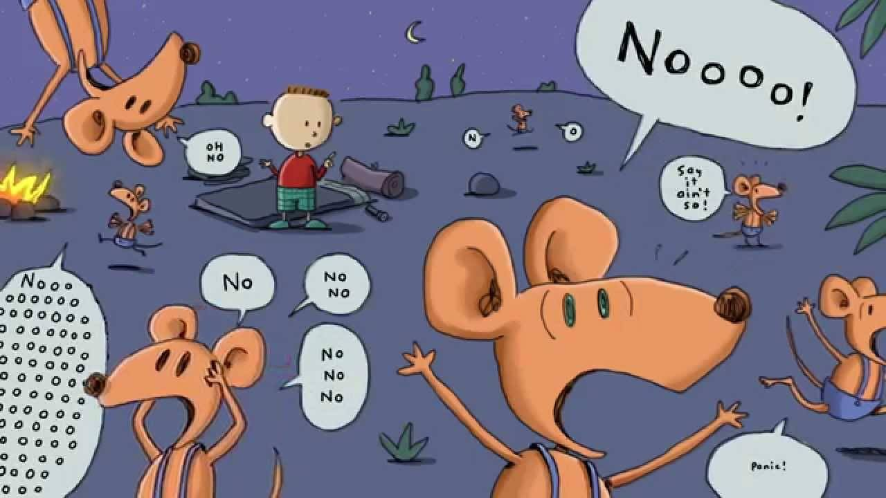

And when he totally freaks, he'll probably beg you for a charger.

"Please? Please? Please? Please, Please, Please? Please? Please?"

And chances are, if he begs you for a charger,

You'll point out that you are on a remote island without any outlets
\...

"See?"

"Oh yeah. Cool \..."

And pretty soon he'll forget all about the charger.

"Got any graham crackers?"

And the iPhone to go with it.

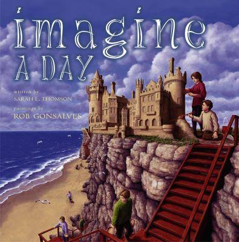

**Imagine a Day Sarah Thomson**

These are the most magical children\'s books. The pictures are
unbelievable optical illusions. Not 3D illusions, but really great
fairytalish type of illusions. My kids love them. I wish there were
more, but there are only three so far. Imagine a Day, Imagine a Night
and Imagine a Place by Sarah L. Thomson and Rob Gonsalves.

**\**

**Imagine a Day Sarah Thomson**

imagine a day \...

\...when you can dive

down through branches

or swim up

to the sun.

imagine a day \...

\... when grace and daring

are all we need

to build a bridge.

imagine a day \...

\... when your house enfolds you

like a nest,

rocking gently

in the autumn wind.

imagine a day \...

\... when you forget

how to fall.

imagine a day \...

,,,when we build a moat,

not to keep strangers out,

but to welcome them in.

imagine a day \...

\...when you don't

need wings

to soar.

imagine a day \...

\... when autumn is

a yellow canopy above you,

a burnt orange carpet underneath,

a road you have never

ridden on before.

imagine a day \...

\... when everything you build

touches the sky.

imagine a day \...

\... when roots drink up rivers,

twigs tangle in clouds,

and a tree is a ladder

between earth and air.

imagine a day \...

\... when you build the world

around you

piece by piece

imagine a day \...

\... when the edge of the map

is only the beginning

of what we can explore.

imagine a day \...

\... when your sand castle

can withstand

even the highest waves.

imagine a day \...

\... when the peace of a forest

and the strength of a mountain

become a cathedral

for your heart.

imagine a day \...

\... when a book swings open

on silent hinges,

and a place you've never seen before

welcomes you home.

Imagine \... today.**\**

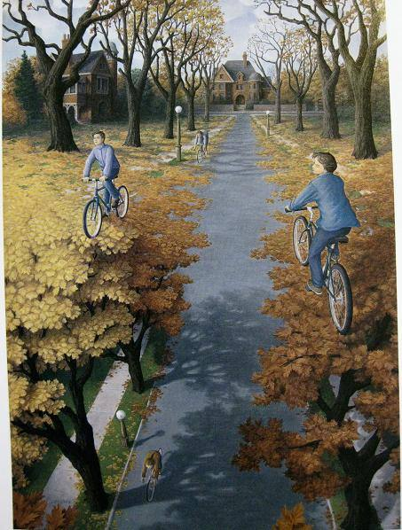

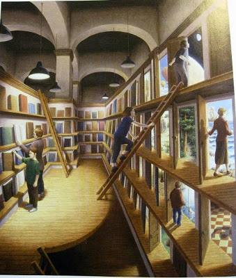

Imagine a day\....

when a book swings open

on silent hinges,

and a place you\'ve never seen before,

welcomes you home.

Imagine today\...\....

In a world where children\'s imaginations are not used to their fullest
extent, these books will help encourage the use of imagination!

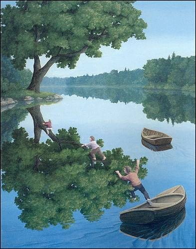

imagine a day\... when you can dive down through branches or swim up to
the sun.

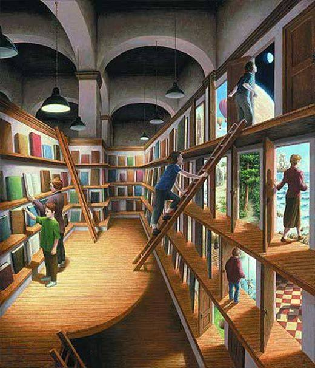

Imagine a day\... a book swings open on silent hinges, and a place
you\'ve never seen before welcomes you home.

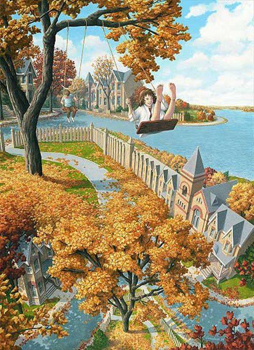

Imagine a day\... when you don\'t need wings to soar.

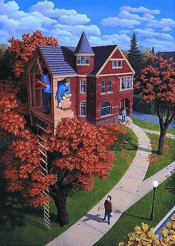

Imagine a day\... when your house enfolds you like a nest, rocking
gently in the autumn wind.

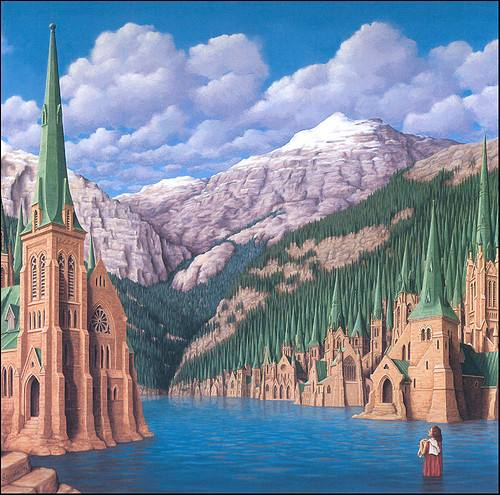

imagine a day\... when the peace of a forest and the strength of a
mountain become a cathedral for your heart.

**See also IMAGINE A PLACE and IMAGINE A NIGHT**

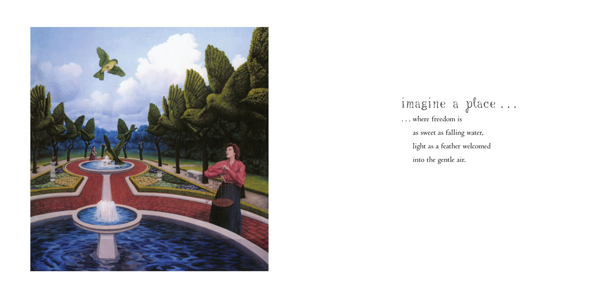

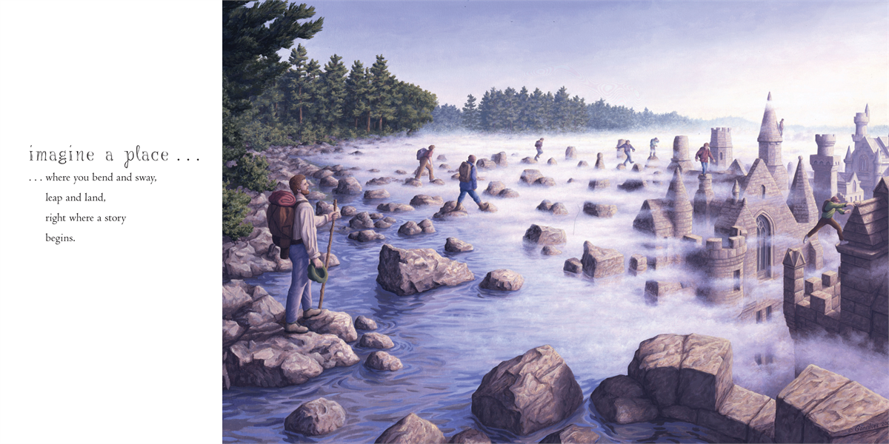

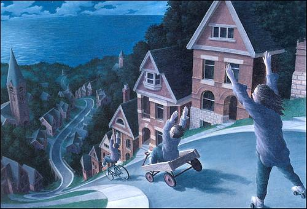

Imagine a night when you can ride your bike right up the stairs to your
bed.

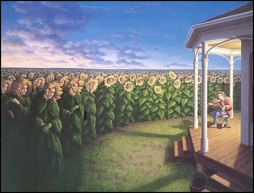

Imagine a night\... when a farmer plays a lullaby on his fiddle, and his
field of sunflowers begins to dip and sway to the rhythm.

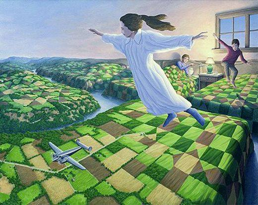

imagine a night\... when you can\'t sleep, and so you jump high enough
to soar over a quilt of fields and forests

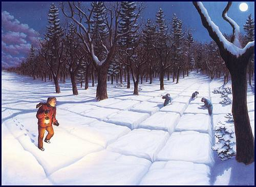

 imagine a night\... when snow white sheets grow crisp and cold, and
someone whispers, \"Follow me.\"

**Sarah Thomson**

*"One does not write for children. One writes so that children can
understand. Which means writing as clearly, vividly, and truthfully as
possible." -- Leon Garfield*\
\
I grew up in St. Louis, Missouri, and Madison, Wisconsin...but only
partly. Sometime around the age of six or seven, I plunged into a book
and never really came up for air. Oh, I went to school, walked my dog,
loved my family...but I grew up as much in J.R.R. Tolkien's Middle Earth
and Lloyd Alexander's Prydain, Charlotte Bronte's stormy moors and Jane
Austen's elegant drawing rooms, as I did in the Midwest suburbs.

I went off to college in Oberlin, Ohio, where I read as much medieval
literature as they would let me. I also spent my junior year at Oxford,
learned to read Old English, and was allowed to touch a twelfth century
manuscript with my (GULP!) bare hands. After I graduated, I headed for
New York and a job in publishing. 
I spent ten years there, finally
becoming a senior editor at HarperCollins Children's Books. A little
while after my first book, ***The Dragon's Son***, was published, I made
the painful decision to leave editing, which I loved, to concentrate
full time on writing. And I left New York as well, to settle in
Portland, Maine.

I'm still living as much in books as in the real world. The only
difference now is that some of the imaginary worlds I get to spend time
in are my own. This is my entirely unearned good fortune, and I only
hope it will last the rest of my life.

Author Sarah L. Thomson at the site of her novel MERCY

 

**\**

**Rob Gonsalves**

Although Rob Gonsalves' work is often categorized as Surrealism, it
differs due to the fact that each painting, each illusion is
deliberately planned and result from conscious thought. Ideas are
largely generated by the external world and involve recognizable human
activities, using carefully planned illusionist devices. Artist Rob
Gonsalves was born in Toronto, Canada in 1959. During his childhood
Gonsalves began to express his artistic ability. Drawing strictly from
his imagination using various types of media he began to develop his
artistic talent. By age twelve, his awareness of architecture grew as he
learned perspective techniques and drew his first paintings and
renderings of imagined buildings.

After an introduction to Artists Dali and Tanguy, Gonsalves began his
first surrealist paintings. The "Magic Realism" approach of Magritte
along with the precise perspective illusions of MC Escher came to be
influences in his future work. In his post college years, Gonsalves
worked full time as an architect; while painting trompe l'oeil murals
and theatre sets. After an enthusiastic response in 1990 at the Toronto
Outdoor Art Exhibition, Gonsalves devoted himself to painting full time.

Rob Gonsalves injects a sense of magic into realistic scenes. As a
result, the term "Magical Realism" describes his work accurately. His
work is an attempt to represent human beings' desire to believe in the
impossible.

**Your Moon, My Moon** by Patricia MacLachlan, illustrated by Brian
Collier

In her signature poetic text, MacLachlan has created a picture book that
celebrates the continued connection between family members who are
apart. Here, a grandmother lives in a cold area of the world, while her
grandchild lives far away in Africa. She watches the snow start to fall
while he is in the hot sun. She wishes they were together to ice skate
or together to swim in the lake where he lives. There are many things
that connect them, from the dogs in both places to the sun, but
especially the moon, which shines on them both.

MacLachlan weaves two very different places together into one story
filled with a poignancy and longing but also a story of love and
connection. For both settings, she pulls the best out of them,
celebrating their differences and their similarities at the same time
with great skill. She invites us into memories, special moments, and
also into the day-to-day of lives.

Collier's illustrations elevate this book further. Their watercolour and
collage use the colour of the light to great effect as it moves from
African gold to the cool of a northern winter. People of all colours
fill the pages, making it feel all the more inclusive and global.
Collier also uses lines to great effect, sometimes swirling and creating
colour or intensity changes in the illustrations, otherwise showing
currents, mountains or forest.

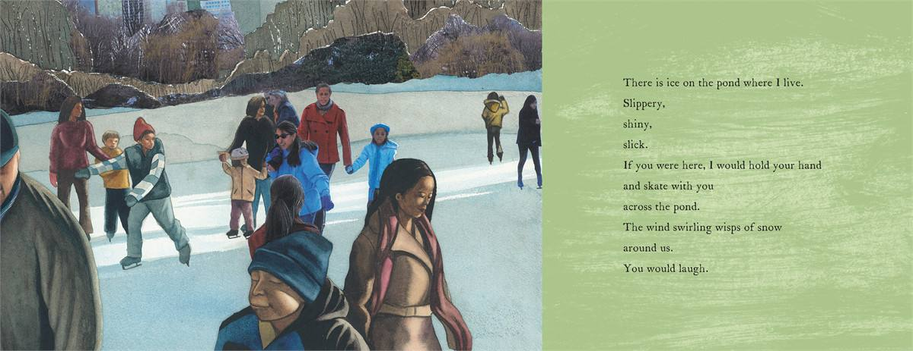

Another picture book that touches on the relationship between
grandparents and grandchildren is *[Your Moon, My
Moon](http://www.amazon.com/Your-Moon-My-Grandmothers-Faraway/dp/1416979506) *by
Newbery Award Winner, [Patricia
Maclachlan](http://www.eduplace.com/kids/hmr/mtai/maclachlan.html), and
illustrated by Caldecott honour recipient, [Bryan
Collier](http://www.bryancollier.com/bio.php).

This story is told through the grandmother's voice.  The grandmother
lives in New England while the grandchild resides in Africa. The
descriptive narrative takes the reader back and forth between the two
locations while simultaneously showing the bond between the two family
members. The illustrations provide hints that the grandmother is
planning to visit her grandchild. The ability to see the moon in both
places is another element that ties the two together. It is a source of
comfort for both.

Many children can relate to the theme of separation from a loved one.
The tender prose and the realistic pictures allow children to easily
connect to this universal theme of not seeing family members on a daily
basis. The descriptions of life in North America and Africa can also be
compared and contrasted using a Venn diagram. The moon plays a prominent
spot as a common feature to both places.

Patricia MacLachlan is the author of *Sarah, Plain and Tall*, the winner
of the Newbery Medal. Other books authored by Patricia
include *Skylark* and *Caleb's Story*, *Edward's Eyes*, *The True
Gift,* *Waiting for the Magic*, and *White Fur Flying. *In this
particular story Patricia is able to use her personal life as a
resource. Her granddaughter lives in Africa.

Bryan Collier  is an accomplished author and illustrator.  He was the
author and illustrator of the Coretta Scott King Award-winning
book, *Uptown*. He also was awarded Caldecott Honors for the
books *Martin's Big Words* by Doreen Rappaport, which was also a Coretta
Scott King Illustrator Honor book; *Rosa* by Nikki Giovanni, which
received the Coretta Scott King Illustrator Award, and *Dave the
Potter* by Laban Carrick Hill.

Like most well written multicultural picture, *Your Moon, My Moon* can
be used as starting point for numerous discussions and activities.

**Discussion Topic:**

- relationship between relatives- grandparents and grandchildren

- being separated from loved ones

- travelling to visit relatives

- geography- different continents and different climates

- background information- New England and Africa

- moon

- character perspective- adult vs. child

- illustrations and their effect on the text

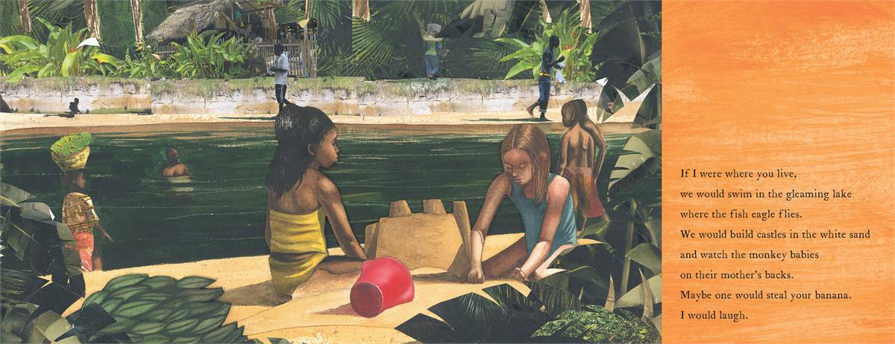

**Your Moon, My Moon Patricia MacLachlan**

A snowflake falls

where I live.

Then another.

Silent,

soft.

light as your breath.

One,

two,

three.

The sun is hot

where you live.

So far away.

Fire finches fly up in the tree

hoping for shade.

You can count them.

Four,

five,

six.

When you were little, I visited you and we read books.

All the books,

one after the other after the other.

You loved the freight train book

even though you had never seen one in your life.

Now you like every single book about the moon --

you love the moon.

There is ice on the pond where I live.

Slippery,

shiny,

slick.

If you were here, I would hold your hand

and skate with you

across the pond.

The wind swirling wisps of snow

around us.

You would laugh.

If I were where you live,

we would swim in the gleaming lake

where the fish eagle flies.

We would build castles in the white sand

and watch the monkey babies

on their mother's backs.

Maybe one would steal your banana.

I would laugh.

Where you live the dogs love you --

Bossi and Wups,

who want the food you drop,

and big old Tanga with the sweet face,

who lets you lean against him

and comb his hair

and kiss him.

He protects you from all things.

When you came to see me,

my dogs loved you too.

They followed you everywhere you went.

Now when they walk up my mountain road,

their noses to the ground,

they look for grouse

and rabbits

and deer.

Mostly, they look for you

because they miss you.

In the morning where I live

the sun rises above the mountains,

a shining

red

ball

that changes to yellow as I watch

On your hilltop

above the lake,

the sun drops at night

and paints the sky and water

and the dogs and your mama

and papa

red and pink and orange.

And then you see your moon.

Where I live we sleep under

quilts

and wear woolly socks

when it is cold.

When I sleep, I dream about you:

how you laugh when your mama sings,

how you like to walk everywhere in your

rubber boots,

how you check the chicken house for eggs --

Broody is your favourite hen.

Where you live you sleep under a netting

like a royal child,

safe from buzzing mosquitoes.\
Do you dream about me?

Walking with my dogs?

Do you remember the books I read you, the words

falling around us both like a blanket?

Do you hear the songs I sang you when you were

a baby?

I sing the songs I sang to you every night.

I sing them

so I will remember you,

hoping that you will remember me too,

even though I am here

and you are there.

Every night you look for your moon.

Every night I look for mine.

Your moon is my moon too.

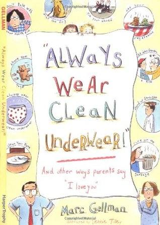

**Always Wear Clean Underwear Marc Gellman**

Clean your plate. Stand up straight. Call if you\'re going to be late.
Part of being a kid is having grown-ups make you do things you
hate\--like eating your vegetables, taking out the garbage, and walking
the dog. Then, to make matters worse, they say you can\'t do things that
are no big deal-like talking with your mouth full or wearing dirty
underwear. And worst of all? You have to listen to them say it not once,
not twice, but a zillion times.

When Marc Gellman put together a list of your parents\' favourite do\'s
and don\'ts, he made a big discovery: Each thing on The List has a
hidden meaning that helps you get through life. And love is the reason
for everything on The List. So if you already wear clean underwear, here
are thirty-one more tips to help you understand some of the crazy ways
that parents try to say, \"I love you.\"

Extract from the author:

*In each chapter, I take one thing on The List and try to explain to you
its little and its big meaning. I did this so that you won't hate The
List or hate your folks for nagging you all the time. i did this so you
will see how hard and how important it is to learn to be good. I did
this because someday you may have to explain The List to your own kids
and you may need some help. I did this because your parents have lots of
ways to show you that they love you, and The List is one of the biggest
ways.*

*Marc Gellam*

The Table of Contents might give you other ideas. Some may provide ideas
for Quick Writes.

**Always Wear Clean Underwear Marc Gellman (extracts)**

Why do your parents care about your underwear? Nobody sees your
underwear, and yet parents always tell kids to wear clean underwear.
What gives?

If you ever ask your parents this question, they will give you answer
#1: "Dirty underwear is full of germs, and we don't want those germs
jumping off your underwear and onto you."

If you tell your folks that you can wear underwear for a month before it
gets *really* dirty, they will give you answer #2. This answer is so
goofy that lots of kids just fall down laughing when they first hear it,
but it's one of the most famous answers on The List:

"You should always wear clean underwear because *if* you ever get into
an accident on the way to school or on the way home from school and an
ambulance has to take you to the hospital and the doctors in the
emergency room have to take your pants off, if they see that you're
wearing dirty underwear *then* they'll think that we're bad parents
because we don't wash your underwear.

I don't know how these answers got started. Like most things on The
List, they seem to have been around forever. I never heard of people
getting sick from wearing dirty underwear. Maybe you could get sick from
wearing somebody else's dirty underwear, but I just don't think you
could get that sick from wearing your own. And I never heard of doctors
in an emergency room saying, "Well, we'd like to help this kid, but we
just can't -- he's wearing dirty underwear."

So, there must be some big deep reason hiding behind why your folks care
so much about clean underwear. I think I figured it out. The big reason
for wearing clean underwear is to teach you this:

*What people don't see about you should be just as good as what people
do see about you.*

We all try to look good outside. The hard part is to look good inside.

If you pretend to be somebody's friend but say bad things about him or
her to other people, then it's a lot like wearing dirty underwear. If
you look at your own test when the teacher is looking at you but as soon
as the teacher leaves the room look at your neighbour's test, then
you're wearing dirty underwear. If you act nice to your brothers or
sisters when your parents are around but hit them and make them
miserable when your parents are gone, then you're wearing dirty
underwear.

The hardest thing in life is to be the same way deep down as you are on
top. If you're always pretending to be something you aren't, if you
never say what you mean, if you never do what you say, then you'll be
unhappy, and people will stay away from you because they don't want to
have a friend who is clean only on the outside.

Of course, nobody's perfect. One of the differences between good people
and bad people is that good people don't try to hide their bad parts and
try to make their bad parts smaller. They take their bad parts to the
laundry so that when they go out into the world, their inside and their
outsides will both be clean.

And you know what? Wearing clean underwear isn't so bad after all. Once
you get used to the feeling of being the same on the inside as you are
on the outside, you won't want to lie about anything anymore. Once you
get used to really being nice to people and not just acting nice to
people, you'll get used to the feeling of having real friends. And once
you get used to the feeling soft clean underwear next to your skin, you
won't want to go scrounging around under the bed looking for the
cootie-coated underwear you wore last Tuesday!

**Don't Pee in the Pool**

You don't need to know how everything works, but you do need to know how
*you* work. After you eat a hot dog, drink a soda, and dive into a
swimming pool, this is how you work: Your body sends a message to your
brain. This is the message: PEE NOW!

Your body does not care if you are having a good time swimming. Your
body does not care if the bathroom is a long way from the pool. Your
body does not care if you will get the shivers running there. Your body
only cares about one thing, and that one thing is pee! So you have to
decide right then and right there, right in that pool, to climb out of
the pool, dry off, and go to the bathroom to take care of the pee
message from your body, or \... you can just pee in the pool.

You remember your parents telling you over and over again, "Don't pee in
the pool!" Maybe they said it this way, "Listen! People don't swim in
our toilet, so don't pee in their pool!" However they said it, they said
it. So there you are, standing in the pool trying to decide whether to
listen to your body or your folks, and you don't have much time to
decide.

What makes the decision so hard is that nobody is ever going to catch
you peeing in the pool. When you see pee in a pool, there is no alarm
that goes off, no sign that goes up saying, "Pee alert! Somebody just
peed in the pool!" There are no pee police looking for yellow water in
the pool. Peeing in the pool is one of those disgusting things you know
you can do without ever getting caught. If you rob a bank, you will
probably get caught. If you try to hide an elephant in your room, you
will probably get caught. But if you pee in the pool, nobody is going to
catch you, and this is the big meaning of "Don't pee in the pool!"

*Don't do bad stuff, even if there is no chance that you will get
caught.*

Your life will be full of chances to pee in the pool. There will lots of
times when you will be able to do some little disgusting thing that
nobody will catch you doing. You probably won't get caught if you stick
gum under a chair, kick a cat, write your name on a wall, or call a ball
out when it is really in, but all these things are bad, and you should
not do them if you want to be a good person and .. it has *nothing* to
do with getting caught.

Getting caught is one way to learn how to do the right thing, but it's
not the best way. The best way is for you to catch yourself. You
shouldn't do bad things just because they're bad, not because you might
get caught. And you should do good things just because they're good, not
because somebody will reward you.

Anyway, there are not enough pee police to catch all the people peeing
in all the pools. In fact, there are no pee police, so we need people to
stop all that peeing in all those pools all by themselves. And we have
to stop all the other little disgusting things we all do because we can
get away with them. So the next time you have a soda and a hot dog with
some chips and gummy bears, remember to head for the bathroom *before*
you head for the pool. The world, and the pool, will be just a little
bit better, and just a little bit less yellow, all because of you.

**The List**

*Always wear clean underwear*

*Don't pee in the pool*

*Eat your vegetables*

*Take out the garbage*

*Look both ways before you cross the street*

*Keep your shoes off the couch*

*Don't talk with your mouth full*

*Money doesn't grow on trees you know*

*Share your toys*

*Walk the dog*

*Always say please and thank you*

*Don't go swimming right after you eat*

*If you can't say anything nice, don't say anything at all*

*I'm gonna count to three and then \...*

*Don't talk to your father/mother like that*

*Clean your plate*

*Do your homework*

*Cover your mouth when you sneeze*

*stand up straight*

*Say you're sorry*

*Don't judge a book by its cover*

*Don't hit*

*Don't copy off your neighbour*

*I hope that when you grow up, you'll have a kid just like you*

*Go give Grandma a kiss*

*Call if you're going to be late*

*Do as I say, not as I do*

*Because I say so*

*It's time for bed*

*Say your prayers*

*I love you*

*I couldn't help adding this cartoon -- Jim*

**Earthdance Joanne Ryder**

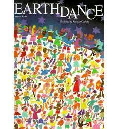

Earthdance is written entirely in metaphor.

In dynamic words and dramatic pictures Joanne Ryder invites the readers
to become not just part of the earth, but Earth itself.

+----------------------+---------------------------------------------+
| Craft                | Example                                     |
+======================+=============================================+
| Metaphor             | Whole text                                  |
+----------------------+---------------------------------------------+
| Lead -- imagine.     | Imagine you are standing tall in an empty   |
|                      | space.                                      |
+----------------------+---------------------------------------------+
| Verbs                | icebergs cracking                           |
|                      |                                             |
|                      | waterfalls tumbling                         |
|                      |                                             |
|                      | tickle, stretch.                            |
+----------------------+---------------------------------------------+
| Repetition           | Use of imagine.                             |
|                      |                                             |
|                      | bringing summer,                            |
|                      |                                             |
|                      | bringing winter                             |
+----------------------+---------------------------------------------+
| Word pairs           | You are streaked with roads and bridges,    |
|                      |                                             |
|                      | spotted with farms and factories.           |
|                      |                                             |
|                      | ants and lizards,                           |
|                      |                                             |
|                      | fish and dragonflies,                       |
|                      |                                             |
|                      | roses and redwoods.                         |
+----------------------+---------------------------------------------+

**Earthdance Joanne Ryder**

Imagine you are standing tall in an empty space.

Stretch your arms out wide and slowly spin around.

Imagine you are growing taller than the trees,

taller than the hills,

head high in the sky.

You are growing so large, so tall

no one can see all of you now.

Imagine you are dancing in space,

even larger than the moon.

Spinning around, you are round

wrapped in a quilt of bright colours --

blue flowing seas, dark green woods,

and deserts of golden sand.

You are twirling

so gracefully, carefully,

not even the sand

moves as you spin.

You are large and grand,

and your voice is the proud roar of

icebergs cracking,

waterfalls tumbling.

Your whisper is a breeze murmuring through the reeds,

a tiny wave lapping land.

Wiggle your shoulders

and mountains tremble and quake.

Shake your hair and feel windswept grasses tickle your face.

You are streaked with roads and bridges,

spotted with farms and factories.

Up your hills and down your rovers,

cars and ships carry people from one place to another,

all places on you.

You are where

crickets leap,

rabbits hop,

and children run and run.

Imagine them leaping and dancing with you as you spin.

You are where people meet,

talking and singing and laughing aloud.

Imagine hearing them all, their voices humming as you twirl.

Turn your face to the bright sun,

and cities wake up,

yawning to morning.

Behind you,

cities in darkness

turn on their lights,

go to sleep and dream.

As you spin,

you bring day

then night

to everyone

who calls you home.

You spin around

and also dance

around the sun,

bringing summer,

bringing winter,

when snowflakes

touch and cover you,

and people leave soft footprints

on your snowy fields.

You are every place

people rest

and the place

everyone knows best.

You are older

than anyone.

Yet each day

you are where

new life grows,

flowers bud,

and babies are born.

You are home

to ants and lizards,

fish and dragonflies,

roses and redwoods.

You are shelter

for people who

may never meet

but share one thing --

you are their

home.

Dance slowly,

spin gently,

and carry them

through space.

May they hear

your whispers,

feel your strength

under their feet,

and treasure you.

