> **Voice**
>
> **(14)**
>
> 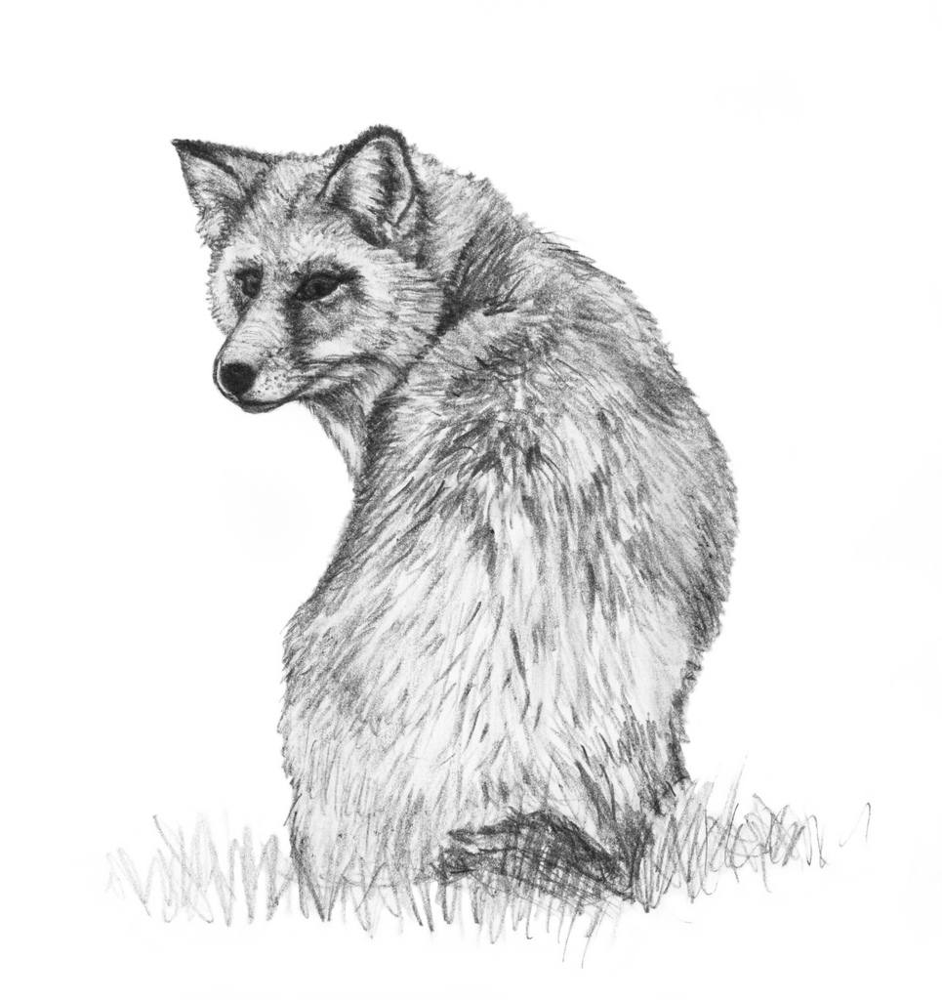{width="6.268055555555556in"
> height="6.651283902012248in"}
>
> **Voice in Non-Fiction**
>
> {width="1.894582239720035in"
> height="2.0104166666666665in"}

**Voice 14**

> **Voice in Non-Fiction**

Voice

Voice in Informational Text

Worm

Oh, Rats!

The Story of Rats and People Albert Marrin

This is Your Life Cycle Heather Miller

In November Cynthia Rylant

Bat Loves the Night Nicola Davies

Ice Bear Nicola Davies

White Owl, Barn Owl Nicola Davies

One Tiny Turtle Nicola Davies

What's Eating You? Parasites

---The Inside Story Nicola Davies

Chameleons are Cool Steve Jenkins

Chameleon, Chameleon Joy Cowley

Zipping, Zapping, Zooming Bats Ann Earle

Red-Eyed Tree Frog Joy Cowley & Nic Bishop

Why We Must Save the Frogs! Save the Frog website

Red-Eyed Tree Frog National Geographic

Frogs Nic Bishop

Frogs Euclid Public Library

Gentle Giant Octopus Karen Wallace

Ape Steve Jenkins

The Circulatory Story Mary Corcoran

The Quest to Digest Mary Corcoran

**VOICE**

See other writing course handouts.

"Sound like yourself." - K.Vennegut

"When I talk about voice I mean written words that carry with them the
sense that someone has actually written them." - R.Fletcher

Voice is as important in nonfiction as it is in fiction or memoir. Voice
gives life to writing. Children can hear voice as we read our Read
Alouds. Mentor texts like *Slam --* Walter Dean Myers.

*Slam! --* Walter Dean Myers

> *Basketball is my thing. I can hoop. Case closed. I'm six four and I
> got the moves, the eye, and the heart. You can take my game to the
> bank and wait around for the interest. With me it's not like playing a
> game. It's like the only time I'm being real. Bringing the ball down
> the court makes me feel like a bird that just learnt to fly. I see
> guys moving down in front of me and everything feels and looks right.
> Patterns come up and a small buzz comes into my head that starts to
> build up and I know it won't end until the ball swishes through the
> net. If somebody starts messing with my game it's like they're getting
> into my head. But if I've got the ball it's okay, because I can take
> care of the situation. That's the word and I know it the same way I
> know my tag, Slam. Yeah, that's it. Slam. But without the ball,
> without the floorboards under my feet, without the mid-court line that
> takes me halfway home, you can get to me.*

Students could listen to the mentor text and identify the type of voice
being used. E.g. humorous, poignant, impassioned, angry.

Jim Arnosky's environmentalist voice comes out in his *All About
...*series.

I have *All About Lizards, All About Turtles* and *All About Sharks.*

*I have found lizards on stone walls, on fence rails, in swamps, by the
sea, on tropical islands, at the edges of canyon cliffs, and on the
rocky desert floor. And every lizard I have seen has seen me first.*

*Many lizards live among us. They scoot across our footpaths and
driveways. Lively and fun to watch, lizards make good neighbours.*

Nicola Davies writes in a very personal way. In *Bat Loves the Night*
she refers to bat as if it is her name, making a personal connection.

*Bat is waking, upside down as usual, hanging by her toenails. Her beady
eyes open. Her pixie ears twitch. She shakes her thistledown fur. She
unfurls her wings, made of skin so fine the finger bones inside show
through.*

As with other books, Nicola Davies combines several genres in the one
story. See Mentor texts.

Writers write with the most voice when they are writing about something
they care about.

Brainstorm -- "What I care about."

Now write your piece so that you make us feel as if we're listening to a
real person.

Or:

Helping students write in their own voice:

- Read widely.

- Take specific notes

- Reread notes.

- Add your thinking and feeling about the notes -- synthesising.

- Partner talk.

- Write piece.

Encourage the students to write in a **conversational** tone.

Techniques for achieving this:

\- Ask the reader questions.

*River of Life* by D.Miller

*Beneath the surface, a rainbow trout chases salmon fry. The trout
catches a glimpse of something shiny. Will it take a bite?*

*-* Giving advice.

*Think about living in dark places. But imagine lots of company --
sisters, brothers, a family. Living and working together because an ant
can't live alone.*

*Thinking About Ants --* Barbara Brenner

*-* Humour.

I was working in America at the time of the 200th anniversary of the
expedition of Lewis and Clark. I had the students keep a diary as one of
the members of the corps. Nicoleen kept her diary as Seaman, the dog
Lewis took on the trip.

*July 16-17, 1804*

*On the trail we got to see the Great Plains -- not a tree in sight!*

*-* Whispering parentheses. The students have studied these before in
fiction. E.g. Cynthia Rylant in *An Angel for Solomon Singer.* They
appear in many nonfiction books, used for the same purpose -- to
communicate directly to the reader in a conversational manner (like you
are talking directly to them in an aside).

\- Varying the sentence structure and sentence length. E.g. *In
November* by Cynthia Rylant.

The Poetic Voice -- see Poetry course.

Persona -- Writing in other voices.

See Mentor Texts. E.g.

*Diary of a Worm* by Doreen Cronin

*My Light* by Molly Bang. This book is written by the sun.

Students can decide in which point of view they wish to write.

First person. Using "I" as narrator. The tone is very personal, speaking
directly to the reader.

Second person. Using "you". this can be explained as a kind of letter
spoken to someone who isn't in the room -- a way of trying to understand
a person who isn't directly there by speaking directly to him/her.

Third person. Describes everyone as "he" or "she".

Students need to not only notice what authors do, they need to think
about why writers use a particular craft, and try it out for themselves.

**Listening**

Partner talk. Five minutes talking to a partner about a favourite
subject. Talk about what you find most interesting or surprising.
Partner can ask questions.

When writing they could think about writing the facts in the same voice
as if talking to a friend.

*When students write with voice, they put the indelible stamp of their
own personalities on the information - they make it their own.*
R.Fletcher

**Voice in Informational Text**

*Voice is the most important, the most magical and powerful element of
writing.*

*Voice makes the reader trust the writer, makes the reader feel an
individual relationship with the writer.*

*Ralph Fletcher*

Voice therefore is reflected in the writer's strong sense of the person
behind the writing, and their attitude towards the topic. It is
appropriate for the topic, genre, and audience. The reader has the
impression that the author is talking directly to him/her. This is
achieved by creating a point of view that the reader can relate to. The
students therefore need to predict what the audience will find
interesting. The tone, or attitude a writer expresses towards the reader
and subject is established through word choice and the details included.

While keeping the audience in mind, the writer can include:

Descriptive details.

Figurative language -- imagery, similes, metaphor etc.

Authoritative voice.

Technical vocabulary.

Humour.

Personal anecdotes.

The writer, creating a strong voice therefore:

Establishes a tone.

Cares about the topic.

Writing is expressive and compelling.

Conveys conviction, authority, and integrity.

Conveys the purpose:

Appropriate point of view.

Creates audience connection:

Anticipates interest.

Takes risks:

Ideas expressed in a new way.

**Achieving informational voice:**

- Choose a topic you love

- Do your research

- Don't be afraid to get excited over a special detail

- Teach the reader something new

- Don't tell *everything*---tell what's unforgettable

- Don't just list facts---make a point

- Write clearly enough to reach even beginning readers

- Create pictures in readers' minds

Donald Graves called voice the "driving force" of writing and the
"imprint of ourselves" on the page. 

**As well as personality on the page:**

- Tone through Honesty 

- Curiosity about the topic driving research 

- Confidence about knowledge of the topic 

- Effective use of detail 

- Clear, effective word choice

- Avoidance of repetition 

- Audience consciousness

- An outstanding lead that brings readers in 

- A thoughtful conclusion that wraps up text

Details: Ice Bear:In the Steps of the Polar Bear by Nicola Davies

Dust by April Sauer

I highly recommend Hudson Talbott\'s book as a mentor text for
information writing because he does such an amazing job of including
information with humour, voice, figurative language, and text features.

*\*

**Voice in Non-Fiction**

The difference between an encyclopaedia and National Geographic

**Turtles**

*World Book Encyclopaedia (1996)*

There are at least seven species of sea turtles. Six of them -- the
green turtle, the flatback, the hawksbill, the loggerhead, the Atlantic
ridley and the Pacific ridley -- have bony scut-covered shells...

Female turtles do not normally leave the water, except to lay their
eggs. The females often migrate thousands of kilometres to reach their
breeding beaches. They drag themselves onto a sandy beach, bury their
eggs, and then return to the sea.

*National Geographic*

Turtles poured out of the surf in wave after wave through the darkness.
Heaving, huffing, gasping, turtles ploughed the coarse black sand with
their noses, labouring onto shore. On this rain-soaked October night,
possibly 30,000 olive ridley sea turtles were converging on a half mile
of Pacific beach at Ostional, costa Rica, in a biological extravaganza
called *la arribada,* the arrival.

Following instincts that scientists have not begun to understand, the
turtles had gathered offshore for mating, and now hordes of females were
swimming to this particular beach to lay eggs. By 2 A.M. the beach
looked like a cobblestone street where the cobblestones had come to
life. And still more turtles were coming. All night, they advanced and
retreated. They collided and piled up in jams. They filled the air with
the soft sound of flippers hollowing nests in the sand, and a rhythmic
thump, thump, thump as turtles that had finished laying, rocked their 80
pound bodies to pack sand over their eggs.

*Rudloe and Rudloe 1994, 97*

**WORM**

Everyone knows earthworms. An earthworm may very well have been the
first animal you picked up and played with. When you pull one out of the
soil, or pick one up off the wet footpath, the soft, slimy creature
wriggles all over the palm of your hand.

Worms are soft and slimy, all right. But if you had X-ray vision to
watch them in their natural habitat -- under rocks or leaves or deep in
their damp underground burrows -- they would not be wriggly. Instead,
they would be crawling slowly along. First, by stretching the front of
its body forward, a worm becomes long and skinny. Then, by pulling the
back of its body up to the front, it becomes short and fat. A moving
worm looks a little like an accordion being played very slowly.

An earthworm wriggles when it is exposed to the sun and dry air. It
can't stand being dry! An earthworm breathes through its skin, and its
skin must be moist to breathe. After a few minutes out of the ground, it
has trouble breathing and it also starts to lose the water in its body.
It wriggles to reach the safety of the moist, dark earth.

There's no way an earthworm could win a mucus-making contest against a
slug or an eel. But mucus is very important for earthworms. Mucus makes
it easier for earthworms to slide through rough soil and under sharp
rocks. It protects earthworms against infection.

One kind of mucus smells awful and may scare away enemies. Another is
applied to the walls of burrows, where it dries like concrete and keeps
them from caving in.

The earthworm just might win a contest of numbers and size, however.
Earthworms are found all over the earth -- anywhere green plants and
moist soil exist. The only places they can't live are deserts, which are
too dry, and polar regions, which are too cold. But in many soils, as
many as *seven million* worms may live in an area the size of a football
field. And in Australia, one kind of earthworm grows to a length of
nearly four metres.

Earthworms are good news to plants -- and to the many, many animals that
eat earthworms. They are rich in protein, helping to nourish birds,
frogs, snakes, and many others. Earthworm burrows are beneficial, too.
Crisscrossing every which way and going as deep as two and a half
metres, they serve as expressways for water and air to reach plant
roots, fungi, bacteria, and ants.

Earthworms also make our world a better place to live -- by eating it.
Worms feed on rotten leaves and other parts of decaying plants. They
also eat tiny organisms such as bacteria that live on the surface of
sand and bits of clay.

To an earthworm, decaying materials are nuggets of nutrition. Some of
this food turns into energy or makes the earthworm grow bigger. The rest
of it, along with the extra soil, passes through the worm and becomes
waste. You probably have seen these wastes, but didn't know it. They are
the little wriggly piles of damp soil in gardens and under grass leaves.
Called *castings*, they are rich in fertiliser because the earthworm has
changed its food into nutrients that plants can use. You might say that
an earthworm is a living fertiliser factory.

***Oh, Rats! The Story of Rats and People*  Albert Marrin.**

> 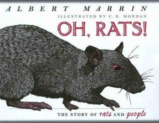{width="3.3125in"
> height="2.5625in"}

Able to claw straight up a brick wall, squeeze through a pipe the width
of a quarter, and gnaw through iron and concrete, rats are also revealed
in this fascinating book to be incredibly intelligent and capable of
great compassion. Weaving science, history, culture, and folklore, award
winning writer Albert Marrin offers a look at rats that goes from
curious to repulsive, horrifying to comic, fearsome to inspiring.
Arresting black-and-white scratchboard illustrations with bold red
accents add visual punch to this study of a creature that has annoyed,
disgusted, nourished, and intrigued its human neighbours throughout the
centuries.

*A rat can collapse its skeleton, allowing it to wriggle through a hole
as narrow as three-quarters of an inch. An adult rat's jaws are hundreds
of times more powerful than a person's. Large muscles allow it to bite
down with a force of 7,000 pounds per square inch, about the same force
as a crocodile's jaws* (page 10).

Read Aloud

Chart the two sides of rats

Text Structures

**Oh, Rats The Story of Rats and People Albert Marrin**

**Extract**

**Rats and Their Ratty Ways**

Everything about the rat makes it a champion at survival. Of all the
mammals, only humans have been more successful -- at least so far. Just
think about what a rat can do. It can:

- *squeeze through a pipe the width of a quarter*

- *scale a brick wall, straight up*

- *fall off a five-storey building and land safely on its feet*

- *rear up on its hind legs and box with its front paws*

- *get flushed down a toilet and live*

- *climb up a drainpipe into a toilet bowl*

There are two main types of rats. The Norway rat, or *Rattus
norvegicus*, originated in Siberia, a part of eastern Russia. Over the
centuries it got other names, based on its appearance and lifestyle:
brown rat, grey rat, wharf rat, water rat, sewer rat, alley rat, house
rat. Scientists call its smaller cousin *Rattus rattus.* Also known as
the black rat, ship rat, and roof rat, its homeland is southern China.

No matter what we call the rat, its body is built for survival. A rat
can collapse its skeleton, allowing it to wriggle through a hole as
narrow as three-quarters of an inch. An adult rat's jaws are hundreds of
times more powerful than a person's. Large muscles allow it to bite down
with a force of 7,000 pounds per square inch, about the same force as a
crocodile's jaws. Its teeth are stronger than copper and lead.

Gnawing through bone and wood is no problem -- for a rat. A sheet of
iron a half inch thick or a slab of concrete four inches thick is no
problem, either. Rats gnew through iron cabinets to get at food, and
concrete to get various minerals they need to build bones and teeth.
Rats have even gnawed through dam walls, starting floods that wash away
entire villages. Mostly, rats gnaw to wear down their incisors. Since
these grow five inches a year, rats must keep gnawing or die.

Rats have keen senses, also vital aids to survival. Their hearing is
excellent, and they can "speak" over distances of forty to fifty feet.
They do this by making high-pitched sounds impossible for the human ear
to detect. These signals, apparently, alert family members to the
presence of food or warn of danger. Elephants make similar sounds that
carry for miles. Only the most sensitive electronic devices can detect
such sounds.

Rats are nighttime creatures. If you see them running around during the
day, it is because food is scarce and they are desperate to find a meal.
Although unable to see well in daylight, they have excellent night
vision. An adult rat can detect motion thirty feet away in nearly total
darkness.

Yest, to find its way, the rat relies less on its eyes than on its hair.
Scientists call it a thigmophilic, or touch-loving, animal. Long
whiskers on its face and fine hairs in its coat allow it to feel its way
around in the dark.

This explains why rats like to stay in contact with walls while
searching for food and not cross open spaces. After a few times on the
same runway, rats develop "muscle memory," allowing them to take every
twist and turn automatically. Even if you pulled down the walls, muscle
memory would guide them along the familiar runway. Similarly, tying your
shoe or always driving a car on the same route develops your muscle
memory.

A natural acrobat, the rat has a marvellous sense of balance. It can
scurry along telephone wires without missing a step.

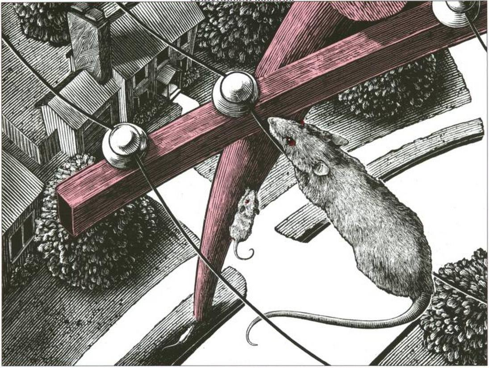{width="6.268055555555556in"
height="4.728231627296588in"}

It uses its tail for balance, in much the same way that a circus
tightrope walker uses a wooden pole. Rat experts believe it likes
overhead wires because they resemble vines and plant stalks. The tail
also helps the rat balance, and sharp claws help it grasp, while
climbing straight up a wall.

A rat is not finicky about its food; if necessary, it will eat anything
that will not eat it first. This ability to get nourishment from many
sources is a great survival advantage, especially when food is scarce. A
rat can eat one-tenth of its body weight every day. If that held true
for people, the average adult would need about sixteen pounds of food a
day. Now imagine eating sixty-four quarter-pounder hamburgers or
thirty-two pizzas. You would burst!

Favourite foods are grains such as wheat and rice, fruits, meats, and
fish. Birds' eggs are a huge treat for rats. They like them so much that
this yen has become a problem worldwide. Not only do rats raid farmers'
chicken coops, in the wild they attack nesting birds. So far, rats have
wiped out eighteen species of birds and put forty more on the endangered
list. In the past, most of their victims lived on small Pacific islands
without native rats. Over the years, however, ships arrived with
stowaway rats in their holds. When the ships anchored, the rats swam
ashore, ready to meet whatever challenges awaited them.

The ability to survive long journeys and then settle in strange places
has helped rats survive through the ages. *Rattus rattus,* the black
rat, led the way. About 1,500 years ago, merchants led camel caravans
laden with silk and spices westward from China along the "Silk Road."
The road ended in the Crimea, a part of Russia bordering the Black Sea.
From there, Italian ships took these precious goods to Europe.

We do not know when the first rat scurried aboard a ship. Most likely,
it happened about 3,000 years ago, when our distant ancestors built and
sailed ships. Being fast learners, rats found that life was good aboard
ship. The damp, dark storage areas belowdecks held everything they
needed for a healthy, ratty existence. They drank from the barrels of
fresh water kept for the crew. They feasted on sacks of grain and other
foods meant for the crew and for sale in distant markets. Ships' cargo,
particularly cloth, made for warm, cosy nests.

Oddly enough, despite sailor's hatred of rats, their presence aboard
seagoing vessels gave the crews a feeling of security -- that everything
was "normal." Yet seeing rats swarming on deck, much less rats leaping
overboard, was a sure sign of trouble. This made sense, for if a ship
sprang a bad leak, the rats knew about it before the crew, since their
hiding places belowdecks filled with water. To avoid being trapped, they
scurries topside and then leapt overboard. When sailors saw them do so,
they knew their ship was doomed. Then the cry went up: "Lower the
lifeboats!" We still say that people fleeing danger in panic are "like
rats leaving a sinking ship." Even when a ship was moored at dockside,
sailors kept an eye on rats. If they noticed rats leaving their ship,
crewmen would refuse to go aboard, because rats sensed trouble even when
humans saw nothing to fear.

The brown rat began its travels much later than its cousin. *Rattus
norvegicus*

made its way overland, across the plains of Russia to Scandinavia, in
the early 1700s. From there, it branched out across Western Europe.
Within fifty years, it arrived by ship in the New World. The first brown
rats reached New York City about 1776, the year of the Declaration of
Independence. Today both black and brown rats live wherever people do.
Eventually, the Norway rat pushed the black rat out of the cities. Now
it lives mostly in rural areas -- in the ground, houses, barns, and
silos.

One thing is certain: If you see one rat, other are nearby. The reason
is that rats are social animals, meaning they live in family groups.
Some groups become so large they form colonies of hundreds of members. A
tunnel in the ground or a hole in a floorboard or a wall leads to a
nest. In cities, the nest is lined with soft materials like gnawed
plastic shopping bags, and stuffing from dolls. In the countryside, rats
line nests with gnawed grass, plant fibres, and wood particles.

Family members enjoy each other's company. They cuddle up together. They
crawl over and under each other. Nuzzle each other. Sniff each other.
Sleep in warm, cosy jumbles.

In most animal species, the weak and the sick are usually killed or left
to die. For example, should a shark get hurt, others, smelling its
blood, will eat it instantly. Rats are unusual because family members
show" pity" to the unfortunate. Finding a family member with its tail
caught in a trap, they may bite through the tail to free its owner.
Sometimes able-bodied rats lead blind rats. They do this by allowing the
blind rat to hold onto the tail of another or by each holding one end of
a stick in its mouth. Families may feed crippled members all their
lives.

To survive in a dangerous world, rats must constantly replace those lost
to disease, other animals, and people. Thus, female rats have large
litters. The arithmetic is awesome. Mama rat carried her litter of six
to twenty-two young for three weeks. The young are called pups. After
giving birth, she can mate again at once, producing a total of 381 pups
a year. Meanwhile, these in turn amte and have their own pups.
Laboratory findings suggest that a single pair of rats could have an
astonishing 359 million descendants in three years.

Yet they do not. Diseases and enemies kill many pups. So do rats
themselves. Every rat family has its own special scent, another aid in
self-defence. Families look after their own, but only their own. Their
males defend their territory against outsiders. Should a stranger,
whether an adult or a pup, wander into their territory, they will
surround it, sniff it, and then eat it. If a nest is disturbed in any
way, the mother may also eat her pups. Nobody knows why she does this.

A mother rat nurses her pups for a month. As they grow, they follow her
for short distances. They learn by imitating her actions and through
their own experiences. Each pup can mate after only two months. It has
no time to lose. Unlike a person, a rat is old after nine months. The
oldest rat on record lived in captivity for five years and eight months,
equal to over two hundred years for a person.

Rats are highly intelligent and have good memories. Should one eat
poisoned bait and die, the rest of its family group will avoid similar
bait in the future. Moreover, the first rat to find unfamiliar food may
become suspicious and leave it alone. "If a few animals of the pack pass
the food without eating any," a researcher notes, "no other pack member
will eat any either. If the first rats will not eat poisoned bait, they
will sprinkle it with urine or faeces."

Apparently, rats can pass food knowledge from generation to generation.
Perhaps some chemical in mother's milk teaches pups what she has eaten,
alerting them to poisoned bait.

Fast learners, rats can solve problems through trial and error. For
example, the sixth-grade students of the Artondale School at Gig
Harbour, Washington, wanted to see how their pets rats would do on
various tests. They were amazed to find how quickly some learnt to get
out of mazes. The class's genius, a rat named Squeaks, figured out how
to push a ball up a ramp. climb inside a stovepipe, and pull down a
tethered balloon to get at a peanut-butter sandwich in a plastic cup.

Classical music, we know, helps develop certain skills, such as
mathematics and logic, in the human brain. A controversial study
suggested that a rat's brain may be influenced in the same way, helping
them learn to get out of mazes faster than other rats.

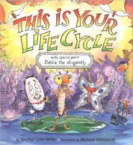{width="2.7083333333333335in"
height="2.9479166666666665in"}

**This is Your Life Cycle**

**Heather Miller**

Blurb:

It's time for every insect's favourite show:

THIS IS YOUR LIFE CYCLE!

On tonight's all-new episode, you'll get to know Dahlia, a delightful
dragonfly on the brink of full adulthood. And you'll find out the
answers to riveting questions, such as:

Does she actually have 800 siblings?

How did she survive attacks by pond-dwelling predators?

What's *really* the best part of being a nymph?

You'll also meet three mystery guests, who'll share their personal
stories about Dahlia. And who knows what else might happen, because, as
always, we'll be coming to you live! So join our host, Bob Beetle, and
our studio audience for an evening filled with laughter, thrills, and
the thorax-warming memories that make every life cycle its own
fascinating story.

Ascertain the grade's background knowledge of the TV show 'This is Your
Life'. Discuss.

Talk about authors trying something different and taking risks.
Introduce This is Your Life Cycle which combines information about the
life cycle of a dragonfly with a game-show format.

Read Aloud.

Read Along.

Reader's Theatre.

Questions:

Is the author's writing interesting, fresh, and original?

Does the writing sound like her own?

Has she tried something different?

Is the word choice interesting and appropriate?

Partner talk: What risks did the author take?

Whole class: Brainstorm and list risks. E.g.

First person narrative.

Game-show format.

Dialogue.

Use of commercials.

Personifying insects.

Discuss how this combination works to create voice.

Independent Work:

Introduce This is Your Life Cycle -- a collection of life cycle
information texts I have downloaded and put together.

Life cycle of a Turtle.

Life cycle of a Cricket.

Bugs - Life Cycles.

Life Cycle -- frog Metamorphosis.

Life cycle of a Frog.

Life cycle of a Butterfly.

Ladybird Life Cycle.

Paying mantis Facts.

Praying mantis Life Cycle.

The Blow Fly.

Fleas.

Dragonfly life cycle.

Comprehension: What information did you gain from the game-show?

Reformat the information. Was the game-show format successful as an
information text?

Reader's Theatre:

Bob Beetle

*Dahlia the Dragonfly*

**Audience**

Fly Guy

Dahlia's mother

Box Turtle

Flash

**This is Your Life Cycle Heather Miller**

Good evening, larvae, nymphs, and insects! This is Bob Beetle, welcoming
you to another episode of THIS IS YOUR LIFE CYCLE, the show that follows
the life cycle of everybody's favourite class of animals, the insects!

Brought to you by Heather Lynn Miller and illustrated by Michael
Chesworth with special thanks to our sponsor, Clarion Books, New York.

Each week we take our cameras to the hot spots of the bug world to
follow insects as they begin their lives as eggs, hatch as nymphs or
larvae, and moult into fully developed adults.

**Ooooo...**

Tonight we're coming to you live from a swamp, hidden by darkness, under
the branch of a weeping willow. It may look peaceful from here, but
beneath the surface of the water, our special guest, Dahlia, has spent
the past two years fighting for her life.

That's right, folks -- Dahlia has slipped through the jaws of hungry
predators like:

Frogs. Fish. Turtles. Ducks.

**Gasp! Hooray!**

Breathe easy, my friends. Dahlia is one tough little nymph and has
managed to escape death by living under the cover of rotting leaves,
dead logs, and thick swamp grasses.

Word from the pond says she's become quite a fierce little predator
herself. Why, just last week, The Daily Buzz reported seeing Dahlia
chomp away at an unsuspecting tadpole.

**Give me a G! Give me an O! Give me a GO! GO! GO! GO, Dahlia!**

Ladies and gentlemen, I've just been told that Fly Guy is standing by
with exciting news. Guy, what do you see?

*Bob, I'm doing a flyby of the water's surface now. I get the strong
sense that something amazing is about to happen ...*

*Hold on -- the water is beginning to ripple! I think Dahlia may be
ready to emerge.*

*I'm going to land on a nearby twig for a closer look.*

Can you see anything, Guy?

*Bob, I see something! She's pulling herself out of the water with her
strong front legs. We should see her head any moment now.*

Remember, audience -- we need complete silence. We don't want to
frighten Dahlia. Shhhhhhhhh ...

Males and females, please welcome Dahlia the dragonfly!

**WILD APPLAUSE**

*Who are you? Where am I? Did I reach the surface?*

Yes, you did, Dahlia. And today is your lucky day! You're the first
dragonfly to emerge on every insect's favourite show ...

THIS IS YOUR LIFE CYCLE

You're just in time to hear a message from our first mystery guest.
Dahlia, do you remember this voice?

I'm so glad you made it to the surface without being eaten by some nasty
bass. I remember the day I deposited you and your brothers and sisters.
You were all such sweet, tiny eggs.

*Mum, is that you?*

That's right, Dahlia. It's your mother! Audience, take a look at this
photo of young Dahlia. Have you ever seen such a cute egg?

**Awwww ...**

I found a perfect patch of swamp grass with tall, tender shoots. It was
such a beautiful spot. I whipped out my ovipositor and went to work
poking tiny holes in the blades of grass. I knew that laying eggs inside
would help keep you safe from hungry fish. By the end of the day, I had
laid over 800 eggs. I was so exhausted when I finished, I just sat down
and died.

We all know how that goes -- right, audience? It's the story of an
insect's life. We hatch, we grow, we mate, we die!

Dahlia, you stayed tucked inside that blade of swamp grass for several
weeks. Then one day, your egg casing split, and you --

*Chuckle, chuckle.*

a white wiggling nymph -- slipped into the open water of the pond.

**Ooooo ...**

And that's where our next mystery guest found you.

When I saw you, Dahlia, you looked so tasty. I was young, taking my
first dive out of the nest, and I was starving. You would have made a
perfect snack.

*I know this one, Bob. I'll never forget Box Turtle, the most
frightening beast I've ever met. He slid down from a lily pad and tried
to eat me alive!*

Poor Dahlia. What did you do?

*The only thing I knew how to do -- wiggle!*

You wiggled, all right. You wiggled your rear end into the muck at the
bottom of the pond. Before I had a chance to gobble you up, you
disappeared under a pile of dead leaves.

**Box Turtle stinks! Hooray! High six!**

On the day you became a nymph, Dahlia, you also became a hungry
predator. And you found a new way to travel. Your water jet system
helped you zip through the water at rocket speed. Can you tell us how it
worked?

*I'd love to, Bob. My water jet was the best thing about being a nymph.
You see, while I lived underwater, I needed gills to breathe. My gills
are a little different from the ones you see on fish. Mine are stuck
inside my rear end. Lucky thing, too. When I learnt to pump water with
them, I shot through the water like a torpedo. I was one of the fastest
creatures in the pond. No one could catch me!*

**Shhhh .. No one?**

Are you sure about that? Remember the day I beat you to that patch of
mosquito larvae? Ha, ha, ha! I ate half the swarm before you caught up
with me.

*Flash, is that you?*

Yes, Dahlia, that's right. It's your little brother, Flash.

*Flash! I'm so excited, I popped my exoskeleton!*

It appears that Dahlia is splitting before our eyes. Flash, do you mind
staying with us while she crawls out of that cumbersome exoskeleton?

Not at all, Bob. I can't wait to see the size of her wings.

**Split Dahlia. Go for broke.**

Dahlia, are you okay? You look a bit pale and soft.

*I'll be fine, Bob. I just need some fresh air.*

Certainly, Dahlia. Take your time. I remember the day I moulted into
adulthood. My skin felt so tight. Then it began to split. I crawled out
of my exoskeleton feeling a bit soft and dizzy. But after a few hours in
the sun, I felt just fine.

Folks, while we wait for the blood to pump through Dahlia's wings, let's
take a moment to hear from our WBUG network sponsor, Bird-B-Gone.

**Are you tired of being pecked and poked by killer birds?**

**Wish you could finish a meal without losing a body part?**

**If so, try new Bird-B-Gone!**

**Produced by king crickets, this super-stinky spray could save your
life.**

**Just a few squirts of Bird-B-Gone across your abdomen, and birds
literally hit the sky.**

**Imagine stepping out of the cover of darkness and chomping your next
leaf under the summer sun!**

**Get Bird-B-Gone, and get on with your life!**

(Not recommended for insects with sensitivity to fecal matter.)

Welcome back to THIS IS YOUR LIFE CYCLE. Dahlia, how are you feeling?

*I feel like a new insect!*

Queens and grubs, take a look at those wings!

*Dahlia, is it true that your wings allow you to fly over 50 miles per
hour?*

*Yes, Fly Guy, it's true. I'm one of the fastest insects on earth. And
because I have four wings, I can fly forwards, backwards, and sideways.
I can hover, dart, and flip through the air.*

**Ooooo ... Ahhhh ...**

That's quite impressive, Dahlia. But why do you need such fancy flying
skills?

*Well, Bob, I'm a hunter. I can catch and eat just about any type of
insect I please.*

I hate to say it, folks, but we're running out of time. It appears that
Dahlia is about to flutter away to watch her brothers and sisters
emerge. And when that happens, we're all in danger of becoming their
first meal.

**Gulp! Gasp!**

*I'm sorry to chase you off like this, but you know how dragonflies are:
Dash, dive, and destroy. Once we emerge, the only thing we want to do is
eat, eat, eat. I must say, some of your audience members look absolutely
delicious.*

You heard her, everyone. It's time for us to buzz off!

As the sun rises, a young dragonfly takes flight. Soon new dragonfly
nymphs will wiggle through dangerous waters, where they will grow and
moult into fast-flying adults. Thank you all for joining us for this
fabulous event.

**Good-bye Dahlia!**

Until next time, this is Bob Beetle, saying: When the last egg is laid
and it's your turn to sit down and die, just remember ...

THIS IS YOUR LIFE CYCLE!

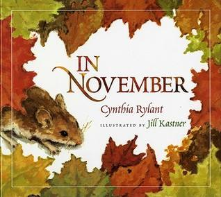{width="3.3125in"
height="2.9583333333333335in"}

In November, the air grows cold and the earth and all of its creatures
prepare for winter. Animals seek food and shelter. And people gather
together to celebrate their blessings with family and friends.

Cynthia Rylant\'s lyrical language and Jill Kastner\'s rich, cosy
paintings capture the cherished moments of this autumn month\--the
moments we spend together and the ones we witness in the world around
us.

In November is a picture book with a spare, lyrical text. It's not a
storybook. It's a book-length prose poem that speaks to the essence of a
month when the colourful beauty and fruitful bounty of the fall season
is part of the past. In the book, Rylant talks about trees that have
lost their leaves, birds moving away for winter, snow blanketing the
ground, animals sleeping more, food having an "orange smell" and tasting
better, and people gathering together to share a special holiday with
each other. Rylant repeats the phrase "In November" several times in her
text. Rylant's use of repetition throughout the book is one of the
author's writing techniques---along with the rhythm and flow of her
evocative language---that helps her text read like poetry.

Discuss the times of the seasons in the different hemispheres.

*What would our book be called for autumn in Australia?*

Possible Strategy Instruction:

- Use prior knowledge to connect with text.

- Make a picture or mental image.

- Ask questions throughout the reading process.

- Use the picture\...Do the words and pictures match?

- Adjust and apply different reading rates to match text.

- Tune into interesting words and use new vocabulary in speaking and
  writing.

Read Aloud

Students recall the images that the author and illustrator described as
happening \"In November.\" This can be done in the Reading response
Journal.

Discuss pattern found -- "In November."

Discussed the meaning of the word \"pattern\" and apply it to the fact
that a poem that starts the same way, repeatedly, is called a pattern
poem.

Modelled Writing

Independent Writing

Writing Craft:

Sometimes sentences work like items in a series -- they form a list of
elements that go together. When this is the case, the last one in the
list can effectively start with and. E.g.

"In November, at winter's gate, the stars are brittle. The sun is a
sometime friend. And the world has tucked her children in, with a kiss
on their heads, till spring."

**IN NOVEMBER Cynthia Rylant**

In November, the earth is growing quiet. It is making its bed, a winter
bed for flowers and small creatures. The bed is white and silent, and
much life can hide beneath its blankets.

In November, the trees are standing all sticks and bones. Without their
leaves, how lovely they are, spreading their arms like dancers. They
know it is time to be still.

In November, some birds move away and some birds stay. The air is full
of good-byes and well-wishes. The birds who are leaving look very
serious. No silly spring chirping now. They have long journeys and must
watch where they are going.

The staying birds are serious, too, for cold times lie ahead. Hard
times. All berries will be treasures.

In November, animals sleep more. The air is chilly and they shiver.

Cats pile up in the corners of barns.

Mice pile up under logs. Bees pile up in deep, earthy holes.

And dogs lie before the fire.

In November, the smell of food is different. It is an orange smell. A
squash and a pumpkin smell. It tastes like cinnamon and can fill up a
house in the morning, can pull everyone from bed in a fog. Food is
better in November than any other time of the year.

In November, people are good to each other. They carry pies to each
other's homes and talk by crackling woodstoves, sipping mellow cider.

They travel very far on a special November day just to share a meal with
one another and to give thanks for their many blessings -- for the food
on their tables and the babies in their arms. And then they travel back
home.

In November, at winter's gate, the stars are brittle. The sun is a
sometime friend. And the world has tucked her children in, with a kiss
on their heads, till spring.

**Bats are the only mammals that can really fly, and flight has made
them very successful. There are more than nine hundred species, living
in almost every habitat from subarctic tundra to tropical forests and
deserts. Birds may rule the air by day, but bats are the monarchs of the
night.**

**This book is about one of the pipistrelle bats. Pipistrelles are found
around the world, from North America to Africa, Europe, Asia and
Australia.**

**BAT LOVES THE NIGHT**

Nicola Davies

Bat is waking, upside down as usual, hanging by her toenails. Her beady
eyes open. Her pixie ears twitch. She shakes her thistledown fur. She
unfurls her wings, made of skin so fine the finger bones inside show
through.

This pipistrelle bat is no bigger than your thumb.

A bat's wing is its arm and hand. Four extra-long fingers support the
skin of its wing.

Bats' toes are shaped like hooks, so it's no effort for a bat to hang
upside down.

Now she unhooks her toes and drops into black space. With a sound like a
tiny umbrella opening, she flaps her wings. Bat is flying.

Out! Out under the broken tile into the night-time garden.

Over bushes, under trees, between fence posts, through the tangled hedge
she swoops untouched. Bat is at home in the darkness, as a fish is in
the water. She doesn't need to see -- she can hear where she is going.

Bats can see. But in the dark, good ears are more useful than eyes.

Bat shouts as she flies, louder than a hammer blow, higher than a
squeak. She beams her voice around her like a torch, and the echoes come
singing back. They carry a sound-picture of all her voice has touched.
Bat can hear every detail, the smallest twigs, the shape of leaves.

Using sound to find your way like this is called echolocation.

Some bats shout through their mouth, and some shout through their nose.

Gliding and fluttering back and forth, she shouts her torch of sound
amongst the tree, listening for her supper.

All is still...

Then a fat moth takes flight below her. Bat plunges, fast as blinking,
and grabs it in her open mouth. But the moth's pearly scales are
moon-dust slippery. It slithers from between her teeth. Bat dives, nets
it with a wing tip, scoops it to her mouth.

This time she bites hard. Its wings fall away, like the wrapper from a
toffee. In a moment the moth is eaten. Bat sneezes. The dusty scales got
up her nose.

Hunting time has run out. The dark will soon be gone. In the east the
sky is getting light. It's past Bat's bedtime.

The place where bats sleep in the day is called a roost. It can be in a
building, a cave, or a tree, so long as it's dry and safe.

She flies to the roof in the last shadows, and swoops in under the
broken tile. Inside there are squeakings. Fifty hungry batlings hang in
a huddle, hooked to a rafter by outsized feet. Bat lands and pushes in
amongst them, toes first, upside down again.

Baby bats can't fly. Sometimes mother bats carry their babies when they
go out, but mostly the babies stay behind in the roost and crowd
together to keep warm.

Bat knows her baby's voice, and calls to it. The velvet scrap battling
climbs aboard and clings to her fur by its coat-hanger feet. Wrapped in
her leather wings, it suckles Bat's milk.

Baby bats drink mother's milk until they learn to fly at a few weeks
old. Then they can leave the roost at night to find their own food.

Outside the birds are singing. The flowers turn their faces to the sun.
But inside the roof hole. The darkness stays. Bat dozes with her
battling, waiting.

Bats are nocturnal. That means they rest by day and come out at night to
search for food.

When the tide of night rises again Bat will wake, and plunge into the
blackness, shouting.

Bat loves the night.

**Echidnas**

**Prickles**

**Short-sighted**

**Nose twitching, sniffing the air**

**Auger-like snout**

**Long tongue for licking ants**

**Sensing ground vibrations**

**Hairy head**

**Sinks into the ground**

**Powerful legs scraping dirt**

**Hollowing a pocket**

**Hides**

**Curls up into a ball**

**Burrows to safety**

**Golden-tipped spines**

**Defense**

**Hibernates**

**Soft-shelled egg**

**Pouch**

**Milk-sucking baby**

**Tiny button-eyes**

**Mammal**

**The Echidna**

**A small bundle of prickles**

**Waddling across the paddock.**

**Short-sighted;**

**Its nose twitching,**

**Sniffing the air.**

**An auger-like snout**

**With long tongue**

**Licking up ants.**

**Hungry after hibernating.**

**Sensing ground vibrations**

**It turned --**

**Tucked in its hairy head**

**And sank into the ground;**

**Powerful legs**

**Spraying dirt;**

**Hollowing a pocket**

**In which to hide.**

**Curled up into a ball**

**It burrowed to safety,**

**Leaving a mound of golden-tipped**

**Spines in defense.**

**Perhaps a soft-shelled egg**

**In its pouch**

**Will hatch into**

**A milk-sucking baby.**

**Looking up from the scrape,**

**The tiny button-eyed mammal**

**Shuffled off.**

**Mr K**

{width="3.7916666666666665in"
height="4.166666666666667in"}

**Ice Bear Nicola Davies**

**\**
No creature is better prepared for the cold than the polar bear. Did you
know, for instance, that polar bears stay warm in temperatures of 40
degrees below zero? That\'s just one of the astonishing facts in Ice
Bear: In the Steps of the Polar Bear, written by Nicola Davies and
illustrated by Gary Blythe. Written in vivid, poetic language
interspersed with fascinating facts about these amazing creatures, Ice
Bear is a wonderful introduction to polar bears and their habitat.
Blythe\'s evocative oil and pencil illustrations show the bears both as
fierce seal hunters and devoted mothers. Mother Polar Bear, in her
winter snow den, tends her newborn cubs. She lifts their tiny bodies in
her great paws and suckles them. The book includes a short author\'s
note with information about how global warming may affect polar bears,
as well as an index.

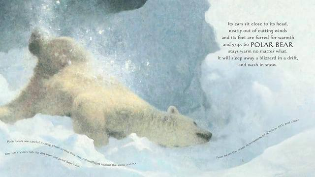{width="6.268055555555556in"
height="3.5257808398950132in"}

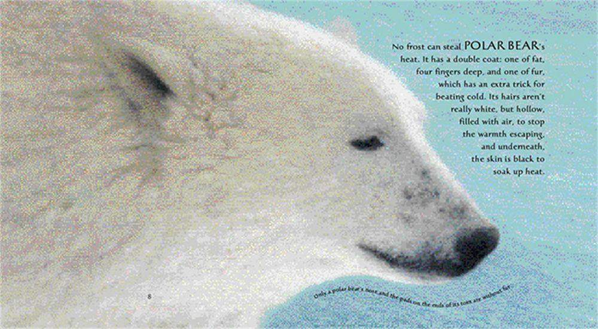{width="6.268055555555556in"
height="3.4536986001749783in"}

**Ice Bear Nicola Davies**

Polar Bears have longer necks legs than their closest relatives, brown
or grizzly bears.

Our people, the Inuit, call it NANUK. White bear, ice bear, sea bear,
others say. It's a bear all right, but not like any other! A POLAR BEAR,
made for our frozen world!

No frost can steal POLAR BEAR's heat -- it has a double coat. One of
fat, four fingers deep, and one of fur which has an extra trick for
beating cold: its hairs aren't really white, but hollow, filled with
air, to stop the warmth escaping, and underneath, the skin is black to
soak up heat.

Only a polar bear's nose and the pads on the ends of its toes are
without fur.

Polar bears are careful to keep clean so that they stay camouflaged
against the snow and ice. Tiny ice crystals rub the dirt from the polar
bear's fur.

Its ears sit close to its head, neatly out of cutting winds and its feet
are furred for warmth and grip. So POLAR BEAR stays warm no matter what.
It will sleep away a blizzard in a drift, and wash in snow.

Polar bears stay warm in temperatures of minus 40 c and lower.

POLAR BEAR is a great hunter. It outweighs two lions, makes a tiger look
too small\...

Polar bears are the biggest hunters on land. Male bears can be three
metres long and weigh as much as ten men.

A single paw would fill this page and shred the paper with its claws.

It can run as fast as a snow buggy or walk and walk for days on end. It
can swim a hundred miles without a rest to cross the sea between the ice
floes, then shake the water from its fur and walk again.

Polar bears' fat keeps them warm in the sea. Webbed feet help them to
swim and water-shedding fur helps them to dry off quickly afterwards.

Nothing stops POLAR BEAR.

Seals are its prey. It hunts them far out on the frozen sea, waiting at
a breathing hole or stalking them as they sleep.

POLAR BEAR is a white shape in a white world, invisible until it's too
late. A lightning paw strike, a crushing bite and the seal is gone.

But POLARE BEAR is gentle too. Mother Polar in her winter snow den tends
her newborn cubs. She lifts the tiny bodies in her great paws and
suckles them.

Newborn polar bears are tiny. They weigh just 600g -- about the same as
a guinea-pig!

In spring, she'll take them hunting, and for two years she'll protect
and feed them, until they've learnt, like her, to hunt \... alone.

Polar bear mums usually have two cubs at a time, but sometimes they have
one or, very rarely, triplets.

ALONE \... through summers when the sun tracks up and down the sky and
one day passes to another with no night between.

In the Arctic it's light all the time in summer and dark all the time in
winter.

When the sea ice melts in summer, polar bears can't catch seals. They'll
eat almost anything instead: fish, dead birds, berries, even grass.

ALONE \... through winters when the sun never rises and the stars of the
Great Bear sparkle in the darkness.

ALONE \... until the paths of two lone hunters cross. They'll wave their
heads in greeting, clasp jaws so tenderly, they wouldn't break an egg.
Cautiously they'll try each other's strength.

Then? **Play!**

Giants flowing in the whiteness, tumbling, beautiful as snowflakes \...

Real fighting is very dangerous for polar bears! So males play-fight to
find out who's the strongest without either bear risking getting hurt.

Scientists that when humans came to the Arctic, about 40,000 years ago,
they learnt how to survive by watching polar bears.

until they part and slowly go their separate ways.

We Inuit, we watch NANUK, as we first watched when the Earth seemed new
and POLAR BEAR showed us how to love the Arctic -- how to hide from
blizzards in a house of snow, how to hunt for seals with patience and
with speed, how to live in starlit day and sunlit night.

Many polar bears and Inuit have passed since then and still we share our
world with gratitude and pride.

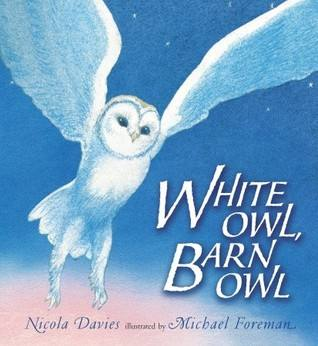{width="3.3125in"
height="3.6041666666666665in"}

The gentle quietness of the barn owl pervades the pages of this lovely
story. The creature is the centre attraction for a girl and her
grandfather who construct a nest box in the hopes of setting their
sights on this rather elusive bird. Davies (Extreme Animals) serves as
an authority on all things avian, peppering her tale with various
factoids about owls set in a typeface that resembles handwritten notes
to the reader (\"\"Owls swallow their prey whole; that\'s why they need
to spit out the bones and fur\"\"). The girl\'s voice, characterized by
both amazement and anticipation, balances out the authoritative
information (\"\" \'We\'ll have to be patient,\' said Grandpa. We were
patient lots of times!\"\"). Equally effective are Foreman\'s
(Shakespeare Stories) lush paintings of the night landscape, awash in a
palette of cool blues and muted whites cast a luminescent glow on the
owl. When the patient duo finally spots the mysterious bird, he is not
unlike an angel spreading his wings across the heavens. This story will
resonate with nature lovers and introduce new enthusiasts to a wondrous
bird.

**White Owl, Barn Owl**

**Nicola Davies**

One frosty winter day, I helped my grandpa make a big wooden box.

"What's it for, Grandpa?"

"It's for the barn owls to nest in," he said.

"What barn owls?" I asked.

But Grandpa just smiled. "Wait and see," he said.

We carried the box across the tussocky field.

**Barn owls like to nest in old farm buildings or hollow tree trunks.
Where there aren't any, they will use a nest-box instead.**

Grandpa put it high in the old oak tree.

"How do you know there are barn owls here?" I asked.

"I've seen one sitting on that branch at night," Grandpa said. "Look,
it's left something behind..."

Under the branch was a pile of little sausage-shaped blobs. They looked
like dried poos, but Grandpa said they were pellets.

**Barn owls have favorite perches that they come back to again and
again.**

"The owls spit them out," Grandpa said, "to get rid of the fur and bones
they can't eat."

He pulled a pellet to bits and showed me the tiny bones and skulls
inside.

**Owls swallow their prey whole and don't have teeth to chew with.
That's why they need to spit out the bones and fur.**

"Will the owl come to our box tonight?"

"Maybe," said Grandpa, "maybe not. Owls are wild birds, you can't be
sure what they'll do."

**In winter, barn owls have to fly miles every night to find enough
food, so they can be hard to spot.**

When the sun went down, we kept a lookout just in case...but we didn't
see anything.

"We'll have to be patient," said Grandpa.

We were patient lots of times! I thought we'd never see an owl.

And then, one spring night, just as the sky went pink, a pale face
looked out of our box...

An owl!

A white owl!

A barn owl!

**In spring and summer, owls stay quite close to their nests.**

And then Grandpa did a strange thing. He put his hand over his mouth and
made a loud squeaky sound.

Straight away the owl took off and flew towards us.

"He thinks I'm a vole or mouse in the grass," Grandpa whispered. "He's
coming to see if he can catch his dinner!"

I just held my breath. The owl's whiteness gleamed and its face was like
a pearly heart.

**A barn owl's huge eyes can see when it's too dark for human eyes to
work. The heart-shaped ruff around its face helps to guide sound to its
super-sharp ears -- just holes under the feathers on its head.**

**Under their feathers, owls are quite slim. Their bones are hollow to
keep their bodies light and make flying easy.**

The owl came closer and closer, then landed in the tree -- right by our
hiding place! It was so light, it hardly bent the twig it perched on.

I could see the tiny ruff of feathers round its face, like stiff lace. I
could see the speckled browns on its back. I could see the shine of its
big dark eyes. I could have reached out to touch its velvety softness.

And then it raised its wings like an angel and took off. It was so
quiet, all I heard was my own heart beating.

**Owl wing feathers are especially soft so they can move through the air
silently and fly up to their prey without being heard.**

**Barn owls catch their prey by pouncing with their long legs and
needle-sharp talons.**

The owl flew back and forth over the field. Then another owl came to
join in.

"That's its mate," Grandpa whispered.

One owl dropped to the ground and cam up again. "Look! Look, Grandpa!
It's caught something!" I said.

The owl flew straight to the box and went inside.

"*Hisssssss, snorrre, twitter, twitter, hisss. Snoorrrrreeee."*

The weird noises came from Grandpa's box.

**Barn owls lay up to six eggs that hatch one after another. The first
chicks to hatch a re the biggest and the last to hatch are the
smallest.**

"They've got a family!" Grandpa whispered. "That's the baby owls
squabbling over their dinner."

I held Grandpa's hand and we walked home as the moon came up.

"Will the barn owls always nest in our box now, Grandpa?" I said.

Grandpa smiled. "You know," he said. "I think they might."

**Barn owls will come back to the same nest-site year after year if it
stays safe and there is enough to eat.**

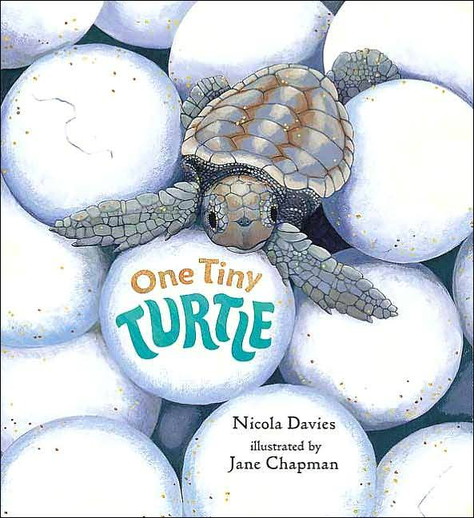{width="2.8025656167979003in"
height="3.0625in"}

**One Tiny Turtle Nicola Davies**

Far, far out at sea lives one of the world\'s most mysterious creatures,
the loggerhead turtle. For thirty years she swims the oceans, wandering
thousands of miles as she searches for food. Then, one summer night, she
lands on a beach to lay her eggs --- the very same beach where she
herself was born. Nicola Davies\'s lyrical text offers fascinating
information about the journey of the tiny, endangered loggerhead, while
charming paintings by Jane Chapman vividly illustrate one turtle\'s
odyssey.

KWHL Chart

+---------------------+
| **Questions We Have |
| About Sea turtles** |
+=====================+
| ***Survival         |
| Needs:***           |
|                     |
| ***Environment      |
| (Living and         |
| Non-living          |
| Things):***         |
|                     |
| ***Behaviours:***   |
+---------------------+

Collect and chart questions that students have about sea turtles...
especially in these categories:

Post-Reading

1\. Guide student discussion - add/change their initial ideas; answer
their questions:

• "What did the story add to what we know about sea turtles?"

• "Which of our questions got answered?"

2\. Collect and chart new questions that students have about sea
turtles...same 3 categories as before.

3\. Use online research to address student questions:

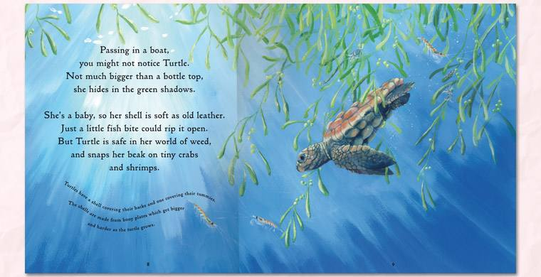{width="6.268055555555556in"
height="3.216502624671916in"}

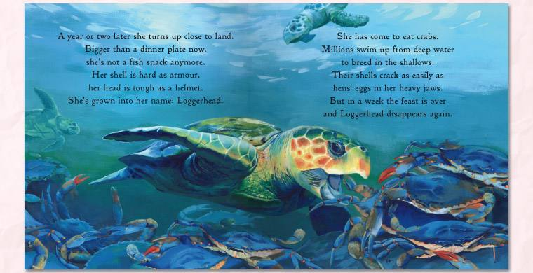{width="6.268055555555556in"
height="3.216502624671916in"}

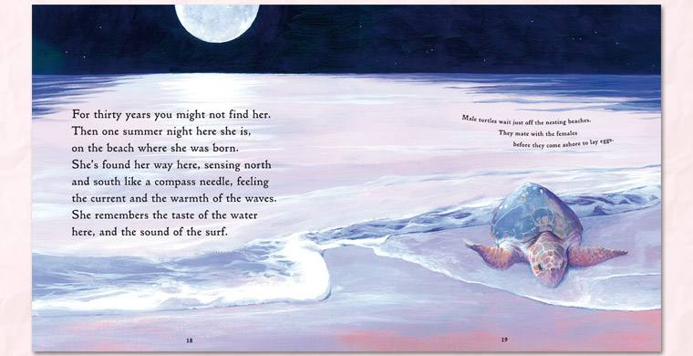{width="6.268055555555556in"
height="3.216502624671916in"}

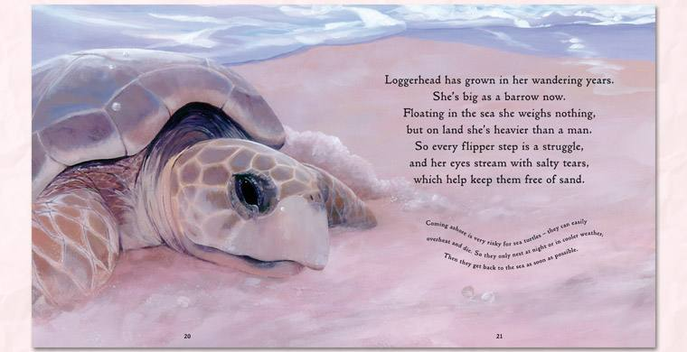{width="6.268055555555556in"
height="3.216502624671916in"}

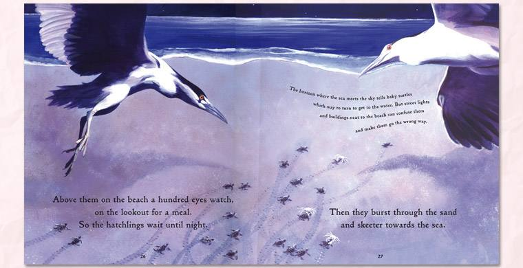{width="6.268055555555556in"
height="3.216502624671916in"}

**About Turtles**

Sea turtles are related to tortoises and terrapins. They are all
reptiles. Sea turtles are great wanderers, travelling thousands of miles
each year, often far from land. This makes them difficult to study. So
scientists are only just beginning to find out about their mysterious
lives.

There are seven species of sea turtle. This book is about the Loggerhead
turtle. Loggerheads live in seas all over the world.

**One Tiny Turtle Nicola Davies**

Far, far out to sea, land is only a memory, and empty sky touches the
water. Just beneath the surface is a tangle of weed and driftwood where
tiny creatures cling. This is the nursery of a sea turtle.

Passing in a boat, you might not notice Turtle. Not much bigger than a
bottle top, she hides in the green shallows.

She's a baby, so her shell is soft as old leather. Just a little fish
bite could rip it open. But Turtle is safe in her world of weed, and
snaps her beak on tiny crabs and shrimps.

*Turtle have a shell covering their backs and one covering their
tummies. The shells are made from bony plates which get bigger and
harder as the turtle grows.*

Turtle swims about, flapping her long front flippers like wings: she is
underwater flying.

She pokes her pin-prick nostrils through the silver surface to take a
swift breath -- so fast, blink and you'd miss it!

*Fish breathe underwater, but turtles are reptiles and need to come up
to the surface for air. They do this every four to five minutes when
they are active. When they are asleep, they can stay underwater for
hours.*

Then she's gone, diving down into her secret life again.

For three or four years, maybe more, Turtle rides out the storms, and
floats through the hot calms. Steadily she outgrows her nursery. Nobody
sees her leave, but when you look for her, she has vanished all the
same.

A year or two later she turns up close to land. Bigger than a dinner
plate now, she's not a fish snack any more. Her shell is hard as armour,
her head is tough as a helmet. She's grown into her name: Loggerhead.

She has come to eat crabs. Millions swim up from deep water to breed in
the shallows. Their shells crack as easily as hen's eggs in her heavy
jaws. But in a week the feast is over and Loggerhead disappears again.

Loggerhead wanders far and wide in search of food: in summer, to cool
seaweed jungles, where she finds juicy clams and shoals of shrimps. And
in winter, to turquoise lagoons, warm as a bath, where she can munch
among corals. Loggerhead may travel thousands of miles, but she leaves
no trace or track for you to follow. Only good luck will catch you a
glimpse of her.

For thirty years you might not find her. Then one summer night here she
is, on the beach where she was born. She's found her way here, sensing
north and south like a compass needle, feeling the current and the
warmth of the waves. She remembers the taste of the water here, and the
sound of the surf.

*Male turtle wait just off the nesting beaches. They mate with the
females before they come ashore to lay eggs.*

Loggerhead has grown in her wandering years. She's big as a barrow now.
Floating in the sea she weighs nothing, but on land she's heavier than a
man. So every flipper step is a struggle, and her eyes stream with salty
tears, which help keep them free of sand.

*Coming ashore is very risky for sea turtles -- they can easily overheat
and die. So they only nest at night or in cooler weather. Then they get
back to the sea as soon as possible.*

Loggerhead makes her nest where the sea won't reach. Scooping carefully
with her hind flippers ... she makes a steep, deep hole. Inside she lays
her eggs, like a hundred squidgy ping-pong balls. Afterwards she covers
them with sand to hide her nest from hungry mouths.

Then Loggerhead is gone again, back to her secret life. Left behind,
under the sand, her eggs stay deep and safe. Baby turtles grow inside.

*Females stay close to their nesting beach for several months. In that
time they usually make at least four nests, and sometimes as many as
ten.*

And before the summer's over they wriggle from their shells.

*Turtle eggs in warm sand can be ready to hatch in six weeks. If the
sand is cool, they can take three weeks longer.*

Above them on the beach a hundred eyes watch, on the lookout for a meal.
So the hatchlings wait until night. Then they burst through the sand and
skeeter towards the sea.

*The horizon where the sea meets the sky tells baby turtles which way to
turn to get to the water. But street lights and buildings next to the
beach can confuse them and make them go the wrong way.*

In the dark, claws and beaks and grabbing paws miss just one young
turtle. One day, she'll remember this beach and come back. But now she
dives under the waves and swims. Swims and swims! Out into the arms of
the ocean. Far, far out to sea, land becomes a memory waiting to wake in
the head of the little turtle.

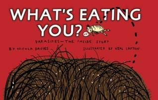{width="3.3125in"
height="2.1041666666666665in"}

***What's Eating You? Parasites---The Inside Story* by Nicola Davies**

Mites and lice, fleas, ticks, and tapeworms --- most living creatures
that have a habitat also are a habitat, including you (are you itchy
yet?). Unwelcome guests --- parasites --- are everywhere, from the
barnacles hitching a ride on a humpback whale's head to the tiny flies
that control a bee's brain and make it literally dig its own grave. Now
an expert team returns for an in-depth look at how these insidious
critters do it, whether it's leaping aboard moving targets or morphing
their body shapes, and what their unwitting hosts have learned to do to
fight back and reclaim their space.

*Tapeworms can live in your intestine and grow to 60 feet long! Their
bodies are shaped like a tape measure and are made of hundreds of little
flattened segments. Instead of a head, they have a thing called a
scolex, a knob with a series of hooks and suckers on it that holds on to
the inside of the intestine. They don't have eyes because there's no
light to see with inside an intestine, and they don't have legs because
they don't go anywhere *(page 27).

Summary

In her inimitable style (good research + irresistible voice), zoologist
and writer Nicola Davies takes us into the world of parasites--many of
which do or can reside on us! No! Can it be? It can. We learn about
ectoparasites, those that live on the surface--in eyebrows or hair, for
example. (No--shampooing does NOT help.) And we learn about
endoparasites, those that live in eyes, intestines, legs, muscles,
lungs, and elsewhere. We humans are not the only hosts--fortunately!
Virtually every creature on earth provides parasites with a place to
call home. In this fascinating (and yes, sometimes grotesquely
worrisome) little book, we learn how parasites hitch rides on moving
hosts, how they breed and live out their life cycles, and how they
evolve to use ingenious little tricks, such as turning a secondary host
fish bright orange so it will appeal to a primary host heron. We also
discover how some parasites can be helpful, and learn ways of managing
them or preventing them from invading our space in the first place. The
remarkable and zany drawings of illustrator Neal Layton add tremendously
to the voice of this intriguing little book that will have your students
wanting you to read another page--and yet another. If only textbooks
were more like this!

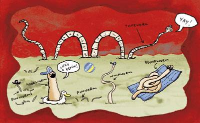{width="3.7291666666666665in"
height="2.302760279965004in"}

1.You might begin by just talking about parasites. What are they? Where
do they live? Are they all around us? Are they visible--or invisible? Or
both? Are they dangerous? See what questions you can answer--or think
you can answer--prior to reading, then compare your early responses with
how you feel/think by the end of the book.

2\. This is a long book to read aloud in its entirety--but at the same
time, you don't want to break it into too many segments or you'll lose
the continuity. Preview it and make a plan. It runs about 60 pages, but
they're short. You might consider dividing it into three or four
readings of 15 to 20 pages each, allowing time for discussion after each
reading. Also make sure you have time to enjoy Neal Layton's
illustrations, and the text that accompanies them, as you go along. Do
read the book aloud so your students can hear the voice.

3\. Talk genre. What genre is this? It's nonfiction, yes--but do the
writer and illustrator also weave in some narrative? This book also has
an extraordinary number of illustrations--and quite a lot of humour!
Does this change the genre, or only modify it?

4\. Talk about presentation. How different would this book be if it did
not have any illustrations? Do this writer and illustrator make a good
team? How do they complement each other's work? Consider asking students
to work with partners in this same way--on a shorter piece, of course.
Have one be the main writer, one the main illustrator for any nonfiction
piece. When students have finished their work, talk about the
effectiveness of working in this way, and how writer and illustrator can
coach each other. How do illustrations enrich the information that can
be shared with the reader? Because of the number of illustrations, some
people might call this a picture book. Is it? Why or why not?

5\. This book opens in an unusual way. When you finish reading the book,
see if anyone can recall the lead. Is it effective? Why? Is it
memorable?

6\. Are the paragraphs on page 57 the true ending of the book--or does
it really end with the segment on "Parasite Champions," pages 58 and 59?
Why do you think so? How should a good informational piece end?

7\. Have students compare Davies' book to a research paper one might
write about parasites for a school assignment. How are the two alike?
How are they different? What do we as readers learn from this book that
we could use in writing better informational pieces?

8\. Talk about the informational value of this book. What do we learn?
Which facts are most interesting? Most startling? Make a list. Would we
expect--should we expect--to make similar discoveries when reading a
research paper written for school? Why?

9\. If we could wipe out ALL parasites, should we do it? Have students
draft a short persuasive paragraph on this, and read several aloud. If
you get opposing views, take a survey to find out what percentage of
students would favour this drastic approach.

10\. Take time to notice the special features of this informational
text: an outstanding index and glossary. How many of your students have
included either of these in their informational writing? Encourage them
to add one or both to the next informational or persuasive writing they
do.

11\. Would this book make a good basis for a film? If so, how should it
open? How should it end? Would it be a good idea, in making such a film,
to terrify the audience about parasites--or reassure them? Or something
in between?

12\. Based on this book plus some additional research you do on your
own, see if you can identify the three or four most important things a
person can do to prevent any ill effects from parasites. Then present
this information in a report, speech, PowerPoint, film--or any form you
wish. Talk about how presentation can be as important as ideas when it
comes to getting the message across! - Six Trait Gurus

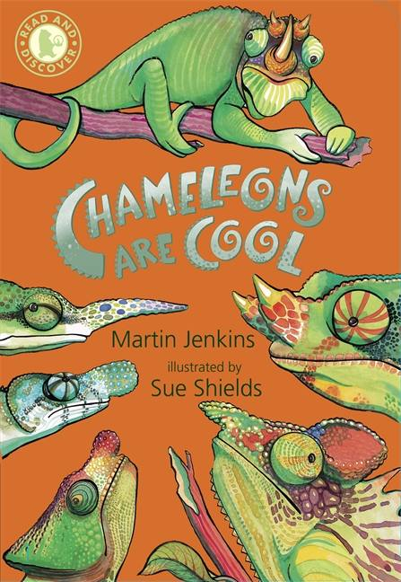{width="2.8742279090113736in"
height="4.166666666666667in"}

**Inquiry Approach**

The essential questions for this unit include:

How do chameleons\' physical traits help them survive?

How are chameleons alike or different from other lizards?

Students will use a model for gathering information by accessing prior
knowledge, reading for new information, and taking notes.

\"What We Think We Know\". Discuss the importance of their prior
knowledge and also the importance of verifying their prior knowledge
during the information gathering process in case some of their prior
knowledge may be

incorrect (misconceptions).

Ask the students about any wonderings they have about chameleons,
recording those on individual sticky notes if done as a whole class and
placed under \"Questions,\" or on individual organisers.

Questions may be added any time during the reading of the book.

Read Aloud with students raising a hand when they identify a new
learning about chameleons or verify or refute something they thought
they knew. The new learning is recorded on a sticky note and placed
under \"What We Learnt.\" Sticky notes of prior knowledge that has been
verified are moved to \"What We Learnt\" or \"Misconceptions.\" New
learnings that answer questions are recorded and placed on the question
that they answered in the \"Questions\" area.

Independent practice:

To demonstrate their learning, students are asked to identify new
information

and share how they would note the information as the teacher continues
to read the nonnfiction book about chameleons, verify or refute prior
knowledge by moving a sticky note from \"What We Think We Know\" on the
chart paper to \"What We Learnt\" or \"Misconceptions\", or acknowledge
a question that had been answered by adding a new learning sticky note
to the \"Questions\" area of the chart paper.

Sharing and reflecting: Students turn and talk with a partner about the
model used for gathering information and why each part of the model is
important.

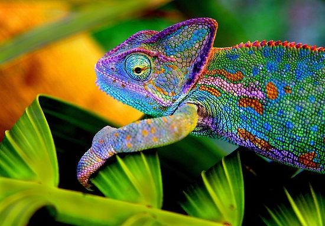{width="5.729166666666667in"
height="3.9895833333333335in"}

**Cameleons are Cool Steve Jenkins**

  --------------------------------------------------------------------------
  **What we think   **What we         **Questions**     **Misconceptions**
  we know**         learnt**                            
  ----------------- ----------------- ----------------- --------------------
                                                        

  --------------------------------------------------------------------------

**Chameleons are Cool Martin Jenkins**

Some lizards eat bananas -- chameleons don't.

Some lizards walk upside down on the ceiling -- chameleons can't.

There's even a lizard that glides from tree to tree -- a chameleon
certainly wouldn't do that!

But of all the different kinds of lizard, I still think chameleons are
the best. Chameleons are cool.

It's not that they're all that big. The biggest is only about the size
of a rather small cat. It's called Oustalet's chameleon and it lives in
Madagascar.

They can be really really small, though. The smallest one could balance
happily on your little finger. It's called the Dwarf Brookesia, and it
lives in Madagascar, too.

And I suppose you wouldn't exactly call many of them beautiful. Their
skin is wrinkly and bumpy, and they've got big, bulgy eyes, while lots
of them have the most ridiculous...

**noses!**

(I think it's their noses I like best.)

Their mouths are pretty odd, too. They turn down at the corners, which
is why chameleons always look grumpy. Actually they don't just look
grumpy ...

they **are** grumpy. So if two chameleons bump into each other, things
can get pretty lively. There's a lot of puffing and hissing -- and
sometimes, there's a real fight.

And that's when chameleons do what they're most famous for -- they
change colour. Lots of people think chameleons change color to match
their surroundings. They don't! They change colour when they're angry,
or when they're too cold or too hot, or when they're sick. And there are
some sorts of chameleon that hardly change colour at all.

As a rule, though, chameleons don't bump into each other all that often.
I suppose it wouldn't be fair to call them lazy, but they certainly
don't move any more than they have to. And when they do, it's almost
always incredibly slowly. Sometimes they stop completely, in mid-step,
as if they've quite forgotten what they're supposed to be doing.

But if you look closely you'll see that they're actually carefully
peering about. now, peering about is something chameleons are rather
good at. That's because their eyes can move separately from each other,
unlike our eyes which always move together. So while one eye is looking
back over the chameleon's shoulder, the other one is scanning the
branches ahead.

As soon as it spots something tasty, the chameleon fixes both eyes on
its prey and begins to creep forwards -- even more slowly than usual.
Then it opens its mouth just a crack, and ... out shoots this amazingly
long tongue, with a sticky bit at the end, like a piece of well-chewed
chewing gum

**thwap!**

Then the tongue flies back, and there's a lot of chomping and chewing,
and perhaps a few bits of insect leg fluttering to the ground.

And after that the chameleon just sits there for an hour or two, doing
nothing very much at all, looking quite exhausted (and still grumpy)
after all that hard work.

And there you have it. how could you possibly resist a pocket-sized,
bad-tempered, color-changing, swivel-eyed, snail-paced, long-tongued
sharp-shooter? And if chameleons aren't cool, then I don't know what is!

**More about chameleons and other lizards**

Chameleons are lizards, and lizards are reptiles, like snakes,
crocodiles and tortoises. There are about 4,000 kinds of lizard
altogether, including around 120 different chameleons.

Just over half of all the kinds of chameleons come from Madagascar, a
big island off the east coast of Africa. Most of the others live in
mainland Africa.

Most of the chameleon's eye is covered in skin. There's a tiny peep-hole
in the middle that the chameleon sees through.

A chameleon's feet are shaped like pincers for holding on tightly to
branches.

A chameleon will only fight with the same kind of chameleon as itself.

Most lizards gulp their food down without chewing it, but chameleons
grind everything up thoroughly! Chameleons feed on all sorts of
creepy-crawlies. The big ones also eat small birds, mice, and even other
chameleons.

Iguanas don't just eat bananas. They love all sorts of fruit.

Chameleons don't make good pets -- they usually get sick and die!

The flying lizard glides on wing-like flaps of skin.

A gecko's toes are as sticky as Velcro.

**Chameleons Are Cool**

**Written by Martin Jenkins Illustrated by Sue Shields**

Preface

Chameleons are lizards, and lizards are reptiles, like snakes,
crocodiles, and tortoises. There are about 4,000 kinds of lizards
altogether, including around 120 different chameleons. Just over half of
all the types of chameleons come from Madagascar, a big island off the
east coast of Africa. Most of the others live in mainland Africa.

+---------------------------------------------+------------------------+
|                                             |                        |
+=============================================+========================+
| Some lizards eat bananas -- chameleons      | Geckos' toes are as    |
| don't. Some lizards walk upside down on the | sticky as Velcro.      |
| ceiling -- chameleons can't. There's even a |                        |
| lizard that glides from tree to tree- a     | The flying lizard      |
| chameleon certainly wouldn't do that!       | glides on winglike     |
|                                             | flaps of skin.         |
| But of all the different kinds of lizards,  |                        |
| I still think chameleons are the best.      | Iguanas don't just eat |
| Chameleons are cool.                        | bananas. They love all |
|                                             | sorts of fruit.        |
| It's not that they're all that big. The     |                        |
| biggest is only about the size of a small   | Whatever their size,   |
| cat. It's called Oustalet's chameleon and   | chameleons usually get |
| it lives in Madagascar.                     | sick and die if kept   |
|                                             | as pets. They're much  |
| They can be really, really small, though.   | better off in the      |
| The smallest one could balance happily on   | wild.                  |
| your little finger. It's called the Dwarf   |                        |
| Brookesia, and it lives in Madagascar too.  | A chameleon will fight |
|                                             | only with the same     |
| And I suppose you wouldn't exactly call     | kind of chameleon as   |
| many of them beautiful. Their skin is       | itself.                |
| wrinkly and bumpy, and they've got big      |                        |
| bulgy eyes, while lots of them have the     | A chameleon's feet are |
| most ridiculous. . .                        | shaped like pincers    |
|                                             | for holding onto       |
| noses! (I think it's their noses I like     | branches tightly.      |
| best.)                                      |                        |
|                                             | Most of a chameleon's  |
| Their mouths are pretty odd, too. They turn | eye is covered in      |
| down at the corners, which is why           | skin, like the rest of |
| chameleons always look grumpy.              | its body.              |
|                                             |                        |
| Actually, they don't just look grumpy.      | There's a tiny         |
|                                             | peephole in the middle |
| They are grumpy. So if two chameleons bump  | that the chameleon     |
| into each other, things can get pretty      | sees through.          |
| lively. There's                             |                        |
|                                             | Chameleons feed on all |
| lots of puffing and hissing -- and          | sorts of creepy        |
| sometimes, there's a real fight. And that's | crawlies. The big ones |
| when chameleons do what they're famous for  | also eat small birds,  |
| -- they change colour.                      | mice, and even other   |
|                                             | chameleons.            |
| Lots of people think chameleons change      |                        |
| colour to match their surroundings. They    | Most lizards gulp      |
| don't! They change colour when they're      | their food down        |
| angry, or when they're too cold or too hot, | without chewing it,    |
| or when they're sick. And there are some    | but chameleons grind   |
| sorts of chameleons that hardly change      | everything up          |
| colour at all.                              | thoroughly             |
|                                             |                        |
| As a rule, though, chameleons don't bump    |                        |
| into one another all that often. I suppose  |                        |
| it wouldn't be fair to call them lazy, but  |                        |
| they certainly don't move any more than     |                        |
| they have to. And when they do, it's almost |                        |
|                                             |                        |
| always incredibly slowly. Sometimes they    |                        |
| stop completely in midstep, as if they've   |                        |
| forgotten what they're supposed to be       |                        |
| doing. But if you look closely, you'll see  |                        |
| that they're actually carefully peering     |                        |
| about.                                      |                        |
|                                             |                        |
| Now, peering about is something chameleons  |                        |
| are rather good at. That's because their    |                        |
| eyes can move separately from each other,   |                        |
| unlike our eyes, which always move          |                        |
| together. So while one eye is looking       |                        |
|                                             |                        |
| back over the chameleon's shoulder, the     |                        |
| other one is scanning the branches ahead.   |                        |
| As soon as it spots something tasty, the    |                        |
| chameleon fixes both eyes on its prey and   |                        |
| begins to creep forward -- even more        |                        |
|                                             |                        |
| slowly than usual. Then it opens its mouth  |                        |
| just a crack, and . . .                     |                        |
|                                             |                        |
| Out shoots this amazingly long tongue with  |                        |
| a sticky tip at the end, like a piece of    |                        |
| well-chewed chewing gum. **thwap!**         |                        |
|                                             |                        |
| Then the tongue flies back, and there's a   |                        |
| lot of chomping and chewing, and perhaps a  |                        |
| few bits of insect leg fluttering to the    |                        |
| ground. And after that the chameleon just   |                        |
| sits there for an hour or two, doing        |                        |
|                                             |                        |
| nothing at all, looking quite exhausted (   |                        |
| and still grumpy) after all that hard work. |                        |
|                                             |                        |
| And there you have it. How could you        |                        |
| possibly resist a pocket-sized, bad         |                        |
| tempered, colour-changing, swivel eyed,     |                        |
| snail paced, long-tongued sharpshooter? If  |                        |
| chameleons aren't cool, then I don't know   |                        |
| what is!                                    |                        |
+---------------------------------------------+------------------------+

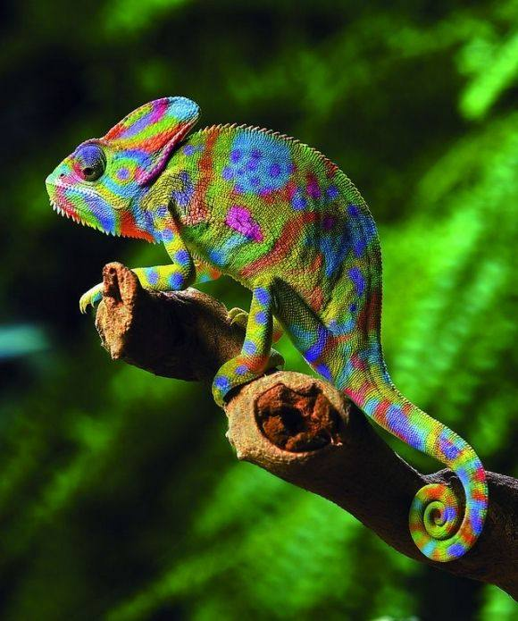{width="6.041666666666667in"
height="7.239583333333333in"}

**\**

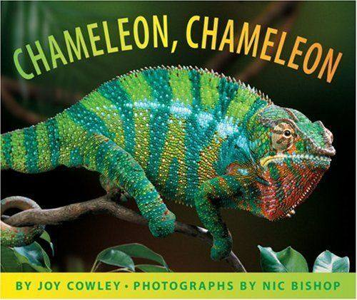{width="5.208333333333333in"
height="4.385416666666667in"}

The author craftily unites the simple and informative text with numerous
vivid photographs (by Nic Bishop) of a chameleon's daily life. His
activities include encounters with prey, a predator, a mate, and other
lizards. Children will be delighted to take a colourful journey with
this often misunderstood amphibian. In the "Did you know" section at the
back of the book, further information is provided.

KWHL Chart

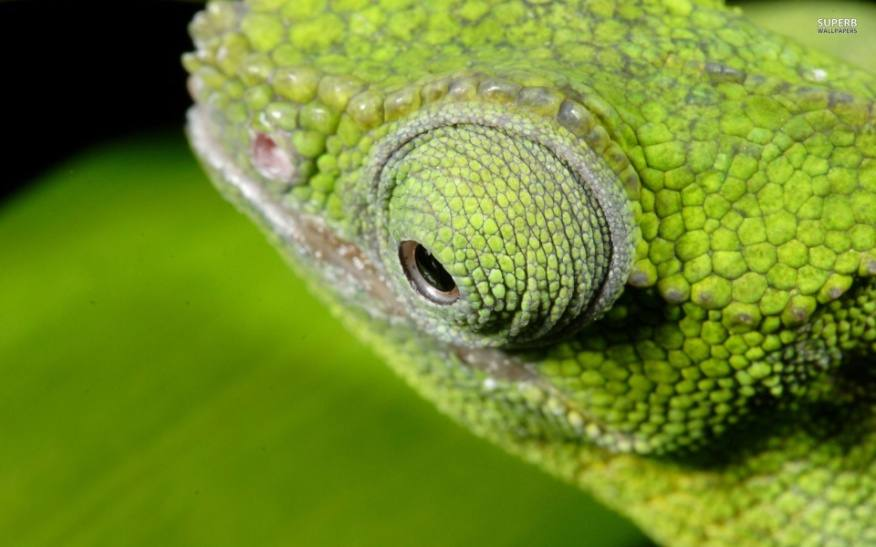{width="3.9791666666666665in"
height="2.4869794400699914in"}

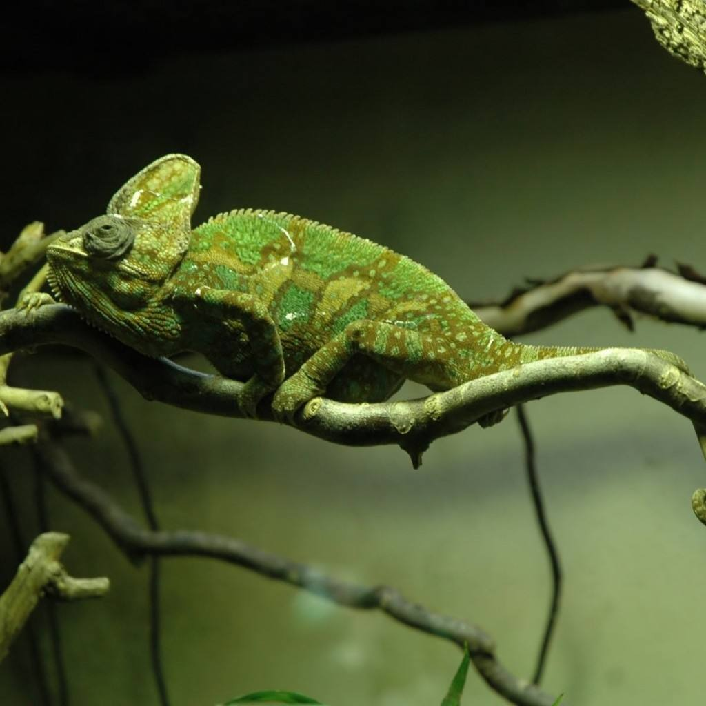{width="6.59375in"
height="6.59375in"}

**\**

**Chameleon, Chameleon Joy Cowley**

The chameleon rests in his tree. His skin has peaceful colours.

He wakes up hungry for a juicy insect. He looks this way \...

\... and that way.

No food! No food!

He must find a new tree home.

Slowly, the chameleon climbs down the tree, step \...

by step \...

\... by step.

He stops. Is there something hiding there?

A gecko!

The gecko looks scary, but it will not hurt the chameleon.

Step by step, the chameleon creeps to the ground.

He looks this way \...

\... and that way, watching for danger.

What is this? It is a tiny chameleon. It is not dangerous.

What is that?

It is a tiny frog. The frog will not harm him, either.

Something hangs from a low branch. Suddenly, it jumps!

Another gecko!

The gecko will not hurt the chameleon.

The chameleon moves on.

What's this? A scorpion!

Watch out, chameleon! The scorpion's stinger is poisonous.

Carefully, the chameleon creeps past.

At last, the chameleon finds a new tree.

He is safe again. He climbs up slowly,

step \... by step \... by step.

Is there food in this tree? Yes!

The chameleon sees a big caterpillar.

ZAP!

Chew, chew, gulp!

Something is watching. Another chameleon lives in this tree.

Her skin is dark with angry colours.

*Go away!*

But the chameleon greets her with bright colours.

She sees that he is friendly. She welcomes him with pale colours.

Two chameleon friends \...

\... have happy colours.

**Did You Know?**

The two chameleons featured in this book are panther chameleons from the
island of Madagascar, which is rich with strange and wonderful animals.
There are geckos that look like moss growing on tree trunks, and others
that look like dead leaves on the forest floor. There are tiny poisonous
frogs with bright colours to warn other animals not to eat them.

Chameleons come in many sizes, from as large as a big squirrel to as
tiny as a matchstick. Male panther chameleons are about fifteen inches
long, while females are about eight inches long. Most chameleons live in
trees, where they hide among the leaves. They are always very cautious
and move slowly, taking one careful step at a time.

When a chameleon spots its favourite food, such as a fly, a grasshopper,
or a caterpillar, it creeps close, then suddenly spits out its long
tongue. Muscles at the tip of the tongue grab the insect as it is zipped
back into the chameleon's mouth.

A chameleon always likes to stay safe and it usually avoids others of
its kind. But sometimes it will climb down from its tree to look for one
with more insects to eat, or to look for a mate. On the ground, it is no
longer well hidden, so it stays on the lookout for forest floor animals.
Some, like snakes and scorpions, could be dangerous. Others, like
geckos, are harmless. It might even meet a leaf chameleon, one of the
smallest chameleons, which is less than three inches long and lives on
the leaf litter.

Chameleons are most well-known for being able to change colour. people
once thought they did this to match their surroundings. But only a few
types of chameleons clearly change colour, and they do it depending on
their mood. For example, a chameleon's colour might darken when it is
cold or upset, or they might brighten when it goes to sleep.

Mostly, chameleons change colour when they see each other. males turn
bright colours to impress females or scare off other males. Females have
their own colours to tell males if they are friendly or would rather be
left alone. Chameleons cannot hear sounds very well. So they use colour
as a way to "talk" to each other.**\**

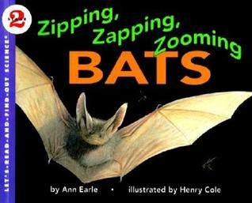{width="3.3125in"
height="2.6770833333333335in"}

Bats hunt insects. They eat mosquitoes, moths, beetles, and
grasshoppers. Bats

catch insects by using sound waves. Bats' wings are like hands. They can
use

their wings to scoop insects. Bats hang upside down when they sleep or
clean

themselves. They hibernate in caves in the winter. People have to be
careful

about exploring bat caves. If the bats get scared they may leave their
pups. Some kinds of bats are dying out. You can help them by building a
bat house.

Bats fly into the spotlight in this exploration of such basics as where
the live, how mothers raise their pups, and how they hunt for food.
Included as well is a simple plan for building a backyard bat house.

Possible lesson:

Focus -- Clarifying through inferring.

Vocabulary is learnt from context and writing supports deeper
understanding of what is read.

Read Aloud

Discussion/Language Task: Through the use of a series of text dependent
questions, the students will be guided to engage in thinking that will
deepen their understanding of key ideas and structure.

Writing Task: As a culminating activity, students synthesise their
understanding in a brief writing piece. Students will utilise the notes
they took during the Read Aloud and the text to assist them in writing
from sources.

**Preparing for Teaching**

1.  Read the Big Ideas and Key Understandings and the Synopsis. Please
    do not read this to the students. This is a description for teachers
    about the big ideas and key understanding that students should take
    away after completing this task.

**Big Ideas and Key Understandings**

Every animal serves a purpose and man should share the earth with them.

**Synopsis**

Bats are mammals that live in caves and hunt for food at night. They
have the ability to make high beeping sounds which help them to hunt for
insects.

2\. Read the entire selection, keeping in mind the Big Ideas and Key
Understandings.

3\. Re-read the text while noting the stopping points for the Text
Dependent Questions and teaching Tier II/academic vocabulary.

**During Teaching**

1\. Students read the entire selection independently.

2\. Read Along. Depending on the text length and student need, the
teacher may choose to read the full text or a passage aloud. For a
particularly complex text, the teacher may choose to reverse the order
of steps 1 and 2.

3\. Students and teacher re-read the text while stopping to respond to
and discuss the questions, continually returning to the text. A variety
of methods can be used to structure the reading and discussion (i.e.,
whole class discussion, think-pair-share, independent written response,
group work, etc.)

Culminating Writing Task:

Using evidence from the text explain why bats are very important in
nature and to man.

Answer:

Bats are useful to man since they help to remove insects that bite
people. They eat moths, beetles, and grasshoppers which eat farmers'
crops. In this way they reduce the number of insect pests that attack
the crops which are the foods that people eat. In some places there are
not enough bats to keep down the insects.

**[Text Dependent Questions]{.underline}**

+------------------------------+---------------------------------------+
| **Text-dependent Questions** | **Evidence-based Answers**            |
+==============================+=======================================+
| What do bats eat? (Page 7)   | They eat a lot of insects.            |
+------------------------------+---------------------------------------+
| Why shouldn't you be scared  | It won't get in your head since it's  |
| if a bat flies past your     | probably trying to catch a juicy      |
| head? (Page 7)               | mosquito.                             |
+------------------------------+---------------------------------------+
| How do bats protect farmer's | They help get rid of insects that     |
| crops and people? (Page 8)   | bite people. They zap moths, beetles  |
|                              | and grasshoppers that eat farmer's    |
|                              | crops.                                |
+------------------------------+---------------------------------------+
| Why does the author write    | A brown bat can catch 150 mosquitoes  |
| that bats are "terrific      | in 15 minutes. A gray bat can eat     |
| hunters"? (Page 8 and Page   | 3000 insects in one night. They are   |
| 15)                          | also expert fliers.                   |
+------------------------------+---------------------------------------+
| How can bats tell when       | Bats can hear things that people      |
| insects are near? (Page 11)  | can't. Bounced sound waves come back  |
|                              | to bats as echoes. The echoes help    |
| How does a bat use           | bats know the kind of insect that is  |
| echolocation to catch        | near and exactly where it is.         |
| insects?                     |                                       |
+------------------------------+---------------------------------------+
| How does a bat use its wings | A flying bat can move its wings in    |
| to catch an insect? (Page    | the same way that people can move     |
| 16)                          | their fingers. Since a bat can        |
|                              | quickly change the shape of its       |
|                              | wings, it can zigzag fast and catch a |
|                              | bug that is trying to escape.         |
+------------------------------+---------------------------------------+
| Why do bats hang upside      | Bats hang upside down when they sleep |
| down? (Page 19)              | or clean themselves.                  |
+------------------------------+---------------------------------------+
| "In winter, many bats        | It means that they sleep deeply       |
| hibernate." Explain in your  | through the winter.                   |
| own words what the word      |                                       |
| hibernate means. (Page 22)   |                                       |
+------------------------------+---------------------------------------+
| Why is it important not to   | You would wake them up and they would |
| disturb bats while they are  | fly to another part of the cave.      |
| hibernating in caves? (Page  | Every time the bats are disturbed     |
| 23)                          | they use up a month's supply of fat.  |
|                              | If they use up too much stored food,  |
|                              | they will starve before spring.       |
+------------------------------+---------------------------------------+
| Alliteration means repeating | The title of the book Zipping,        |
| the first letter of words.   | Zapping, Zooming Bats is an example   |
| Find an example where the    | of alliteration since each word       |
| author uses this in the      | begins with the same letter(s).       |
| text. (Page 3)               |                                       |
+------------------------------+---------------------------------------+
| List some ways in which      | People harm bats when they visit      |
| people harm bats. (Page 26)  | caves where they are hibernating,     |
|                              | bother baby bats when they destroy    |
|                              | old barns and cut down forests        |
+------------------------------+---------------------------------------+
| How can people help bats?    | Some people have bat houses in their  |
|                              | yards. Parks and nature centers may   |
| (Page 26-27)                 | have houses for large group of bats.  |
|                              | Some caves have gates at the entrance |
|                              | so bats can zip easily through them.  |
+------------------------------+---------------------------------------+

**[Tier II/ Academic Vocabulary]{.underline}**

+--------------+----------------------------+-----------------------------+
|              | > **KEY WORDS ESSENTIAL TO | > **WORDS WORTH KNOWING**   |
|              | > UNDERSTANDING**          | >                           |
|              |                            | > General teaching          |
|              | Words addressed with a     | > suggestions are provided  |
|              | question or task           | > in the Introduction       |
+:============:+============================+=============================+
| **TEACHER    | Page 7 -- probably         | Page 21 -- clover           |
| PROVIDES     |                            |                             |
| DEFINITION** | Page 10 -- echoes          | Page 26 -- feast            |
|              |                            |                             |
| > not enough | Page 11 -- bounce          | Page 28 -- flutter          |
| > contextual |                            |                             |
| > clues      | Page 11 -- echolocation    |                             |
| > provided   |                            |                             |
| > in the     | Page 15 -- expert          |                             |
| > text       |                            |                             |
|              | Page 15 -- membrane        |                             |
|              |                            |                             |
|              | Page 25 -- mammals         |                             |
+--------------+----------------------------+-----------------------------+
| **STUDENTS   | Page 8 -- crops            | Page 7 -- juicy             |
| FIGURE OUT   |                            |                             |
| THE          | Page 8 -- munch            | Page 7 -- chomp             |
| MEANING**    |                            |                             |
|              | Page16 -- dodges           | Page 8 -- gobble            |
| > sufficient |                            |                             |
| > context    | Page 16 -- zigzag          | Page 16 -- scoop            |
| > clues are  |                            |                             |
| > provided   | Page 22 -- hibernate       | Page 23 -- starve           |
| > in the     |                            |                             |
| > text       |                            | Page 25 -- nurseries        |
+--------------+----------------------------+-----------------------------+

**\**
**Zipping, Zapping, Zooming BATS**

**Ann Earle**

When the sun goes down, bats come out to hunt. You have to look quickly
to see a bat before it's gone.

Many bats hunt insects. They eat lots of insects. Each night a bat
chomps half its own weight in bugs. If you weigh 24 kilograms, that's
like eating 125 peanut-butter sandwiches every day.

Don't be scared if a bat flies past your head. It won't get into your
hair. It's probably catching a juicy mosquito.

Bats are terrific hunters. A little brown bat can catch 150 mosquitoes
in 15 minutes. The grey bat can gobble 3000 insects in one night.

Bats help get rid of insects that bite people. Bats also zap moths,
beetles, and grasshoppers. These insects eat farmers' crops, the food
that you and I need.

Bats are good hunters because they have a special way of using sound.
Bats make high beeping sounds. These sounds are too high-pitched for our
ears, but bat ears can hear things ours can't. The beeps go out from the
bat in waves. The sound waves hit objects around the bat. When sound
waves hit an object, they bounce back. The bounced sound waves come back
to the bat as echoes. The bat can tell by the echoes what kind of insect
is near, and exactly where it is. Then the bat can catch it. We call
this echolocation.

The echoes that bounce off a tree sound different from the echoes that
bounce off a bug. Bats use echolocation to "hear" things that are in
their way. They can zoom fast through dark forests and black cave
tunnels. If a bat gets into your house, open a door or window. The bat
will echolocate, and "hear" the opening it can use to fly out.

Bats are also good hunters because they are expert fliers. Their wings
are different from bird wings. Bat wings have long arm bones with
extra-long finger bones. A thin skin called a membrane stretches between
the bones. The membrane connects the wing bones to the bat's legs and
body. It may also join the tail to the legs.

Bat wings are like webbed hands. A flying bat can move its wings much
the way you can move your fingers. This means a bat can quickly change
the shape of its wings. If a bug dodges away, the bat can zigzag fast
and chase it. a bat can catch a flying insect in its wing, flip it into
its tail membrane, and then scoop it into its mouth.

Bats have hooked claws on their toes and thumbs. When bats sleep or
clean themselves, they hang upside down by their toe claws. They use
their claws to move around on their roosts, to comb their fur, and to
clean their ears. Bats keep themselves as clean as cats, using both
their tongues and claws.

Because bats fly at night, many people are scared of them. Sometimes
people tell scary stories about vampires that can change into bats.
Dracula and other vampires are not real. Bats fly at night because
that's when they can find their favorite meals. Bats are very gentle.

In winter, many bats hibernate. This means the bats sleep deeply. While
bats are hibernating, their breathing slows down and their heart rate
drops from 900 to 20 beats a minute. Hibernating bats need less energy
to stay alive.

Bats get ready for hibernation by stuffing themselves full of food,
especially in the last weeks of warm weather. Their bodies store the
extra food as fat. This fat will be their food through the winter.

Sometimes when people explore caves, they kill bats by accident. If you
went into a cave where bats were hibernating, you would wake them up.
Then they would fly to another part of the cave. Each time that happens,
the bats use up about a month's supply of fat. If they use up too much
stored food, they will starve before spring, when they can hunt again.

If you go into a cave in summer, be sure to look for baby bats. If you
do see pups, never touch or bother them. Leave quickly and quietly.

Bats are mammals. They are the only flying animals that nurse. This
means that the mothers' bodies make milk to feed their babies. Bat pups
hang together in large groups called nurseries. Each mother returns to
feed her pup at least twice a night. The pups need their mothers' milk
to survive. If you disturb a nursery cave, the frightened mothers may
leave, and the pups will starve.

Besides disturbing their caves, people harm bats by destroying their
homes. People close off their attics and tear down old barns. They seal
off empty mines and cut down forests, where bats like to live.

Several kinds of bats are now in danger of dying out. In some places
there aren't enough bats left to keep down the number of insect pests.
People could use poisons to kill bugs, but poisons can be dangerous to
humans, other animals, and plants.

There are many ways people can help bats.

Some people put bat houses in their yards. Public parks and nature
centres may have houses for large groups of bats.

Groups who care about wild animals are putting gates on cave entrances.
Bats can zip easily through the gates, but people can't.

In Midfield, Alabama, primary school children can join the B.A.T (Bats
Are Terrific) Club. Members help spread the word that bats are not
scary.

If a bat flies past you in the dark, listen closely. Maybe you can hear
the soft fast flutter of its wings before it's gone. Even if you can't,
you can be sure that the bat heard you.

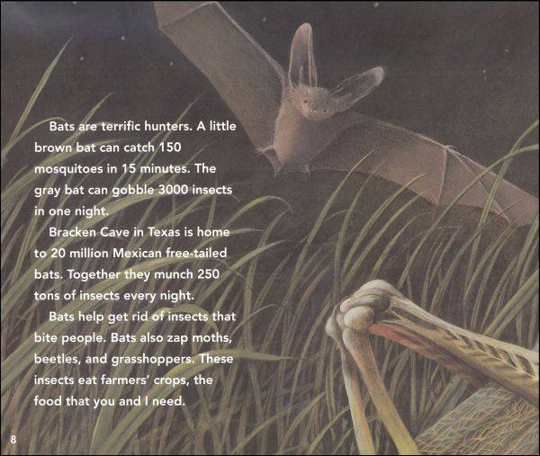{width="6.25in"
height="5.28125in"}

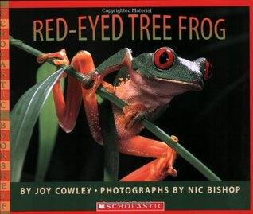{width="3.3125in"
height="2.8020833333333335in"}

**Boston Globe--Horn Book Award Acceptance**

I would like to thank Joy Cowley for her wonderful gift of putting words
to pictures in a way that has made this book work so well. In many ways,
the task for her was not straightforward. In choosing words and
developing a plot, Joy did not have unlimited freedom. Her story had to
fit within the constraints of what it was possible to photograph. The
star of our book, the red-eyed tree frog, could not read a script ---
never mind perform on demand. There were only a limited number of
actions and events that could be constructed before the camera.

Although many of the photographs in this book --- the landscapes and
some of the animals --- were photographed in the rainforest, the frog
had to be photographed in a studio. To realise why, one has only to try
to observe red-eyed tree frogs in the wild. On one of several visits to
the rainforest of Costa Rica, I went with a biologist to study these
animals in their natural habitat. We travelled to an area of swamp
forest, about five miles from camp. It was after midnight and a misty
rain drenched everything --- the type of conditions only a frog fully
appreciates. I remember standing knee deep in the swamp and peering up
at the canopy, staring hard into the pencil-beam of light cast by my
headlamp.

Then I spotted a frog about thirty feet up, clinging to the tip of a
branch with impossible thin spidery limbs. For a second I gazed into its
eyes, then it leapt out of my light beam and vanished. That night we saw
several animals, and even eventually caught one for a closer look. But
it was clearly not a situation for photography. The constant rainfall
and clouds of mosquitoes were considerable obstacles, never mind the
snakes and alligators, or the fact that I would need a very long ladder
to reach my subject.

The type of pictures I needed for this book required a slow and
deliberate studio approach. This involved a lot of preliminary setting
up, with attention to strobe lighting and other details. So the frog I
photographed was a captive-bred animal that came from a pet store.

After I had photographed a number of portraits and actions I sent them
to Joy who, in her supportive way, was full of praise, while politely
suggesting we needed some point of tension in the book to spike the
readers interest. Perhaps, even, the frog could be in some mortal
danger?

Snakes are the main predators of red-eyed tree frogs in the rainforest.
Could I, I thought, re-create a scene in the studio in which a snake
nearly ate the frog? I have to admit I instantly had misgivings. By this
stage, Frog had become like a family member, and minor celebrity among
our friends. I had come to appreciate his personality, to enjoy the
sound of his calls in the depths of the night, from the large tank where
he lived in my study. Without a mate to serenade, the frog had even
taken to singing back to the sound of the fax machine, as it whistled
and whirred with an incoming message from the far side of the globe ---
sometimes from Joy herself. How could I risk any harm to this delightful
animal?

But we did need that snake picture. So the frog was placed on a palm
frond in my studio in front of the camera. The strobes were set up all
around, ready to go. My right hand was on the shutter, and my left hand
held a snake, carefully moving it closer and closer. These situations
are never easy. It is unpredictable working with one live animal. With
two, almost anything can happen---and I was thoughtful of the worst
possible outcome.

Suddenly, as if reading my mind, the snake made a quick movement toward
the frog. There was no time for conscious decisions. I instinctively
pulled the snake away as my frog leapt for his life --- then I cursed
myself for being so stupid and selfish. "That's it," I thought, "no
more. I'm not going to risk this animal for the sake of a book."

But a small miracle happened. When I later processed the film in my
camera, there was this single perfect shot --- of the snake flicking its
tongue and the frog scrabbling for safety. Even though I was barely
aware of it at the time, I had pressed the shutter at that crucial
instant. Normally action shots like this are so fraught by variables I
have to repeat them dozens of times to get the right one. For example,
the speed of a snake's tongue-flick is so fast that you cannot possibly
hope to see it and press the shutter in time. There have been instances
when I have taken more than two hundred shots of an action subject, just
to get that one perfect picture. Yet here it was in my hands, at one
take --- and I was barely aware of having done it.

After that story, you will understand that I should also thank the frog
for all he put up with during the creation of this book. If he were with
us I am sure he would bask in the spotlight. But I have to tell you with
sadness that Frog passed away, after a very long life in amphibian
years.

When I reached back into my own childhood, I remembered that my
bookshelf was filled only with nonfiction titles. As a young boy, I was
always more enchanted by the natural world than the imagined. At school
I would rarely read past page three of a fiction story before I was
glancing out of the window, my mind drifting to the world outside.
Certainly, I was one of those children who didn't respond to reading
fiction.

That is why this honour is special to me. I know that many picture books
deserving equal credit and none of them should be considered the best.
The awards this book has received are, I believe, largely because it
fills that particular niche of being a nonfiction picture book with
photographs. Red-Eyed Tree Frog is one of those books I wish I had as a
child.

Finally I would like to thank the production team at Scholastic, whose
efforts have made this such a good book. In particular my editor, Lauren
Thompson, and book designers Dave Caplan and David Saylor. As a
photographer I am usually wary about the impact that design and layout
can have on a book's visual appeal. But I have to tell you that this is
the most thoughtfully designed book I have ever been associated with.
Scholastic too can take credit for the honour today.

- Nic Bishop

Let's face it. Red-Eyed Tree Frog is about pictures, stunning
photographs that give personality to a little frog and bring it close to
the hearts of children. All that a text can do is help the young reader
rejoice in the visuals.

I have worked with Nic Bishop before, and I know his passion for the
natural world, especially the small creatures with whom we share this
planet. He combines knowledge and fine technical skill with love of his
subject matter and a deep understanding of the heart of a child. This
means that his illustrations are authentic, beautiful, and perfect for
young readers.

When Nic first suggested a collaboration on this book, we did what we
have done before. He sent me a lot of photographs of the tree frog and I
searched through them for a story. A day in the night of a red-eyed tree
frog? Okay. Now, what interest would be shared by a tree frog and a
young child? Eating? Food! Okay again. But wait! We didn't have any
tension in the story, which meant we didn't have a plot. I faxed Nic:
What can threaten a tree frog? Back came the reply: A snake! To get the
essential drama, Nic took more photos with a boa snake, and we had an
eater narrowly escaping being eaten. That, we thought, was a plot that
could be vicariously thrilling to a young child.

Finally we had a text and a series of photos that seemed to work
together, but we still didn't have a book. Credit for that goes to our
editor, Lauren Thompson, and her team at Scholastic, who arranged the
collection of photographs and words to make a very beautiful production
that honours the children who are growing in the love of books.

Joy Cowley

**Article**

There are, of course, a plethora a great books on conservation and
ecology for children. For young children ages two through eight I would
begin with a book published in 1999: Joy Cowley's Red-Eyed Tree Frog
with photographs by Nic Bishop. In the simplest of language, the author
brings us into the text, "Evening comes to the rain forest." Then we are
treated to brilliant photos of rain forest birds like the macaw and
toucan before we meet the hero of the book, the sleepy red-eyed tree
frog. Set against a red leaf that really make his eyes pop, the tree
frog looks like a movie star, so brilliant are his colours and features.
As he hunts for food, he encounters other fascinating creatures of the
rain forest---the iguana, katydid, poisonous caterpillar, and boa
constrictor. All have been displayed in breathtaking colour photographs
that show their markings and movements. Readers watch the snake's tongue
flick out of its mouth as our hero leaps away. Finally, landing on a
leaf with a moth, the red-eyed tree frog enjoys his dinner and shuts his
eyes, "as morning comes to the rain forest."

With endnotes that round out the story, the book presents an ecological
community to the youngest of viewers in simple words and images. The
red-eyed tree frog jumps, leaps, and hops through the story. Cowley's
text, spare and simple, leaves room for Nic Bishop to employ all his
strengths as a photographer. Bishop roamed the rain forests with a
camera and lots of high-speed film to record the inhabitants in all
their glory.

Winner of a Boston Globe--Horn Book Award, this book works well with
readers of all ages and those speak English as a second language because
the story is perfectly told through the pictures. If you have a
hankering for cute stuffed toys, you can find several varieties of
red-eyed tree frogs! After reading and rereading this book, I, as well
as many others, would be willing to go any length to save this frog.
That, of course, is what truly great books about the natural world
do---they make children and adults care about the diverse creatures on
this planet.

-Anita Silvey

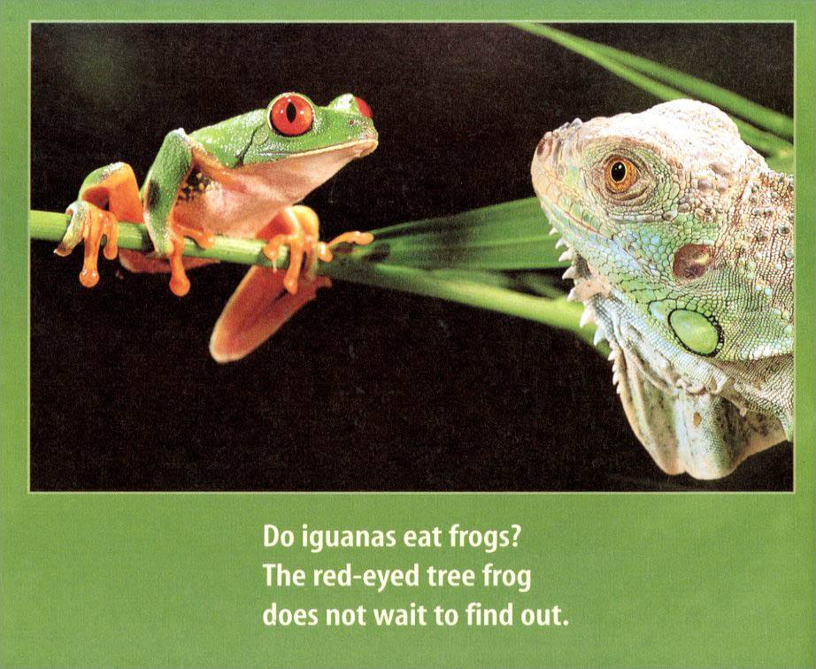{width="6.268055555555556in"
height="5.139534120734909in"}

**Use main idea and supporting details to determine importance.**

Nonfiction books are sometimes intended to be read out of linear order
--- for example, reading the Did You Know section at the end of the book
first won't spoil the story like it would if a fiction book were being
read.

**Red-Eyed Tree Frog**

**Joy Cowley & Nic Bishop**

Evening comes to the rain forest.

The macaw and toucan will soon go to sleep.

But the red-eyed tree frog has been asleep all day.

It wakes up hungry What will it eat?

Here is an iguana. Frogs do not eat iguanas.

Do iguanas eat frogs? The red-eyed tree frog does not wait to find out.

It hops onto another branch.

The frog is hungry but it will not eat the ant.

It will not eat the katydid.

Will it eat the caterpillar? No! The caterpillar is poisonous.

Something moves near the frog.

Something slips and slithers along a branch. It is a hungry boa snake.

The snake flicks its tongue. It tastes frog in the air. Look out, frog!

JUMP!

The frog lands on a leaf, far away from the boa.

What does the frog see on the leaf?

A moth!

*Crunch, crunch, crunch!*

The tree frog is no longer hungry.

It climbs onto a leaf.

The red-eyed tree frog shuts its eyes \...

and goes to sleep \...

as morning comes to the rain forest.

**Did You Know?**

Red-eyed tree frogs live in the swampy parts of rain forests in Central
America. They wake up just as the sun is going down and sit in the
branches calling to one another. Their call sounds like, *"Gluck. Gluck.
Gluck."*

In many pictures in this book, the red-eyed tree frog looks quite big.
Really it is very small, its body only about two inches long.

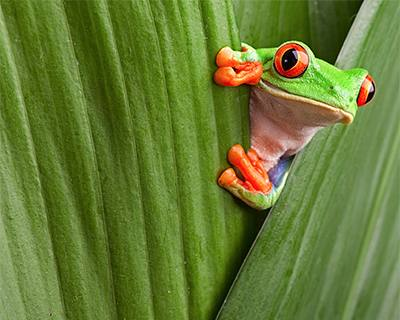{width="3.3020833333333335in"
height="2.6416666666666666in"}

Tree frogs spend most of their lives in trees. They even lay their eggs
in the trees. The female frog glues her eggs onto the underside of
leaves that hang over water. Here the eggs are safe from other animals.
When the tadpoles hatch, they drop into the water, where they feed and
grow until they turn into baby frogs. Then they are ready to leave the
water and climb up nearby plants.

Special suckers on the tree frog's toes help it climb and cling to
leaves. the red-eyed tree frog also has large eyes to help it see in the
dark and look for food. It likes to eat insects, but it has to be evry
careful. Many insects in the rain forest can defend themselves against
hungry animals like frogs. Ants can bite, so they are best left alone.
Katydids are often big and have lots of spines, so they are hard to
swallow. many caterpillars defend themselves by being poisonous. Moths,
flies, spiders, and small grasshoppers are the tree frog's favourite
foods.

Of course, the red-eyed tree frog also has to watch out that it doesn't
become dinner for some other animal. A hungry bat might swoop down and
snatch it from its perch. Or a snake like the baby boa in this book
might sneak up on it. The tree frog's green colour helps it blend in
with its background, making it harder to find. A red-eyed tree frog will
darken its colour when it is frightened.

Before daylight returns, the red-eyed tree frog finds a hiding place
among the leaves of the trees. It tucks its toes under its chin and
belly, and flattens its body against a leaf. When it closes its eyes to
sleep, only its green back is left showing. It stays hidden until it is
ready to wake up again the next evening.

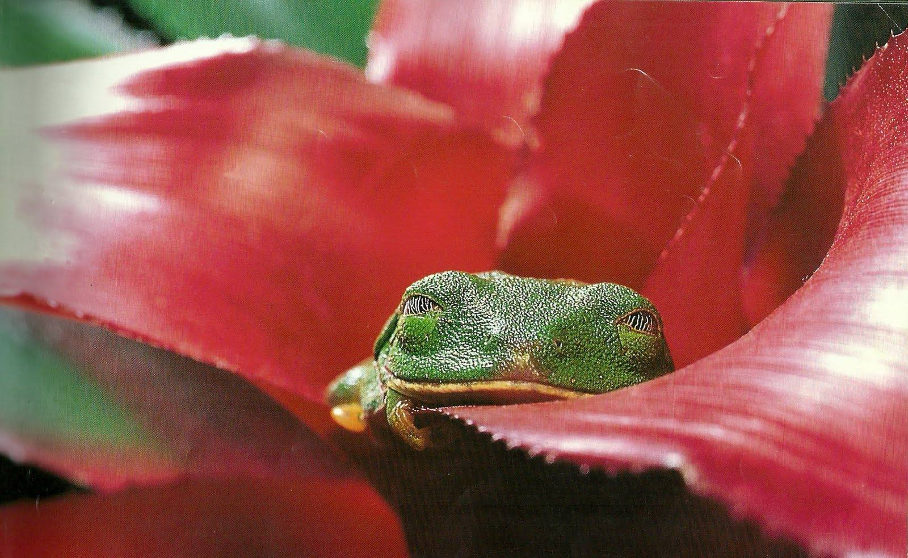{width="6.268055555555556in"
height="3.850936132983377in"}

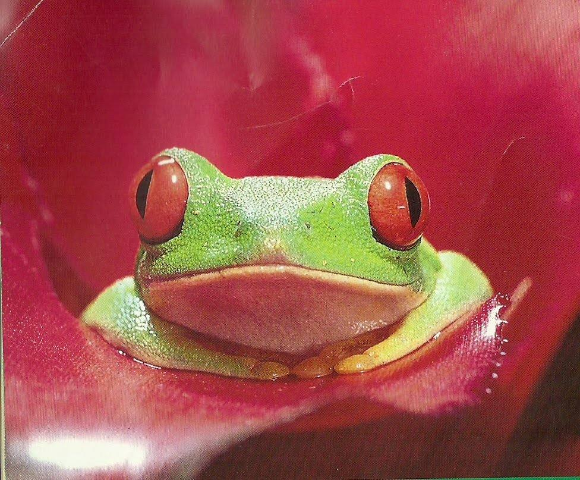{width="6.268055555555556in"
height="5.182705599300087in"}

**Why We Must SAVE THE FROGS!**

**Save the Frog website**

**Introduction**

Frog populations have been declining worldwide at unprecedented rates,
and nearly one-third of the world's amphibian species are threatened
with extinction. Up to 200 species have completely disappeared since
1980, and this is NOT normal: amphibians naturally go extinct at a rate
of only about one species every 500 years!!! Amphibian populations are
faced with an array of environmental problems, including pollution,
infectious diseases, habitat loss, invasive species, climate change, and
over-harvesting for the pet and food trades. Unless we act quickly,
amphibian species will continue to disappear, resulting in irreversible
consequences to the planet's ecosystems and to humans. Frogs eat
mosquitoes; provide us with medical advances; serve as food for birds,
fish and monkeys; and their tadpoles filter our drinking water. Plus
frogs look and sound cool, and kids love them \-- so there are lots of
reasons to save the frogs!

**Frogs are an integral part of the food web**

Tadpoles keep waterways clean by feeding on algae. Adult frogs eat large
quantities of insects, including disease vectors that can transmit fatal
illnesses to humans (i.e. mosquitoes/malaria). Frogs also serve as an
important food source to a diverse array of predators, including
dragonflies, fish, snakes, birds, beetles, centipedes and even monkeys.
Thus, the disappearance of frog populations disturbs an intricate food
web, and results in negative impacts that cascade through the ecosystem.

**Frogs are bioindicators**

Most frogs require suitable habitat in both the terrestrial and aquatic
environments, and have permeable skin that can easily absorb toxic
chemicals. These traits make frogs especially susceptible to
environmental disturbances, and thus frogs are considered accurate
indicators of environmental stress: the health of frogs is thought to be
indicative of the health of the biosphere as a whole. Frogs have
survived in more or less their current form for 250 million years,
having survived countless ice ages, asteroid crashes, and other
environmental disturbances, yet now one-third of amphibian species are
on the verge of extinction. This should serve as an alarm call to humans
that something is drastically wrong in the environment.

**Frogs are important in medical research that benefits humans**

Frogs produce a wide array of skin secretions, many of which have
significant potential to improve human health through their use as
pharmaceuticals. Approximately 10% of Nobel Prizes in Physiology and
Medicine have resulted from investigations that used frogs. When a frog
species disappears, so does any promise it holds for improving human
health.

A group of Russian researchers found over 76 different antimicrobial
peptides on the skin of the European Common Brown Frog (Rana
temporaria). \"These peptides could be potentially useful for the
prevention of both pathogenic and antibiotic resistant bacterial
strains\" the scientists concluded.

The Northern Gastric Brooding Frog (Rheobatrachus vitellinus) lived
exclusively in the Eungella Range in Queensland, Australia. These
amazing frogs could actually shut down their gastric juices while
rearing their young inside their stomachs! They therefore held great
promise for advances in human medicine, as research on these frogs may
have resulted in a cure for peptic ulcers, which affect 25 million
people in the United States alone. Unfortunately, the gastric-brooding
frogs vanished within a few years of being discovered by scientists. The
health of humans and frogs is clearly intertwined.

{width="5.208333333333333in"
height="4.114583333333333in"}

**Ethics**

Frogs are an integral part of our existence on this planet and have
every bit as much right to exist as do we. Moreover, if we allow
one-third of the world\'s amphibians to disappear, we set a bad
precedent: perhaps future generations will use our irresponsible actions
to justify allowing another third of amphibians or a third of the birds
or reptiles to disappear. We caused the problem, so it\'s our
responsibility and moral duty to make the necessary sacrifices and
changes to SAVE THE FROGS!

**Red-Eyed Tree Frog** Agalychnis callidryas

**National Geographic**

{width="6.25in"
height="4.6875in"}

**The red-eyed tree frog flashes its brightly coloured body parts when
startled. It sleeps by day with its eyes closed and body markings
covered, stuck to leaf-bottoms.**

Many scientists believe the red-eyed tree frog developed its vivid
scarlet peepers to shock predators into at least briefly questioning
their meal choice.

These iconic rain-forest amphibians sleep by day stuck to leaf-bottoms
with their eyes closed and body markings covered. When disturbed, they
flash their bulging red eyes and reveal their huge, webbed orange feet
and bright blue-and-yellow flanks. This technique, called startle
coloration, may give a bird or snake pause, offering a precious instant
for the frog to spring to safety.

Their neon-green bodies may play a similar role in thwarting predators.
Many of the animals that eat red-eyed tree frogs are nocturnal hunters
that use keen eyesight to find prey. The shocking colours of this frog
may over-stimulate a predator\'s eyes, creating a confusing ghost image
that remains behind as the frog jumps away.

Red-eyed tree frogs, despite their conspicuous coloration, are not
venomous. They are found in tropical lowlands from southern Mexico,
throughout Central America, and in northern South America. Nocturnal
carnivores, they hide in the rain forest canopy and ambush crickets,
flies, and moths with their long, sticky tongues.

Red-eyed tree frogs are not endangered. But their habitat is shrinking
at an alarming rate, and their highly recognizable image is often used
to promote the cause of saving the world\'s rain forests.

{width="2.4583333333333335in"
height="1.84375in"}

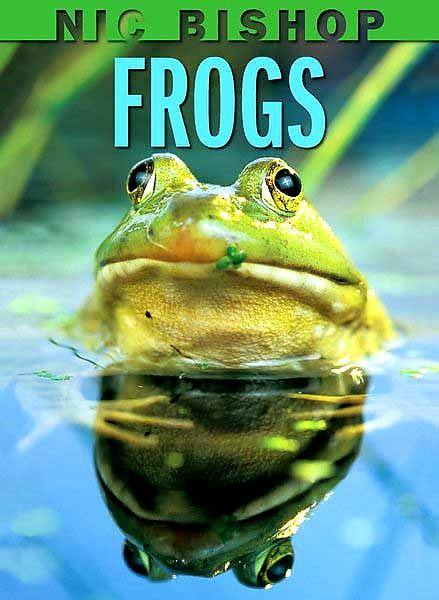{width="3.612603893263342in"
height="4.9375in"}

KIRKUS REVIEW

Gliding frogs, glass frogs, growling grass frogs---who knew there were
so many frogs in the world? Stupendous photographs combine with a
genuinely enthusiastic text to open readers' eyes to this lowly
amphibian like nothing has before. Gorgeous full-bleed photos present
ordinary garden toads and wood frogs with as much affection and
admiration as their more exotic counterparts, golden eyes, glistening
skin and all captured with incredible clarity. The text is a series of
happy factlets that, when finished, provide a surprisingly thorough
overview of frog physiology and behaviour. In their detail, these
tidbits go straight to kids' interests---one African bullfrog downed 17
young cobras! A gliding frog can soar for 50 feet! Tadpoles absorb their
tails as food! The beautiful design picks up on the frogs' colours, a
boldly indigo text box complementing a dart poison frog and a
comfortable brown one, the spadefoot toad. A chatty author's note gives
insight into both Bishop's enthusiasm and the painstaking techniques
behind the spectacular images; a glossary and index complete the
superlative whole.

**Frogs Nic Bishop**

**Frogs are found on every continent except Antarctica.**

They live in ponds, rivers, forests, and fields. Some even live in sand
dunes.

The biggest, the Goliath frog from Africa, is as heavy as a newborn
baby. One of the smallest, the gold frog from South America, could sit
on the tip of your little finger. But, big or small, frogs are always
easy to recognise. Almost all have long back legs, a large head, big
eyes, damp stretchy skin, and no tails.

Some people are confused about the difference between a frog and a toad,
but you do not have to be. A toad is just a kind of frog. It usually has
drier skin than other frogs and can live farther from water. It also has
shorter legs, so it hops rather than jumps.

**Toads can live a long time.**

A pet toad in England was famous for living for thirty-six years. A
bullfrog, by comparison, may live for about twenty years in captivity.

**Most frogs are found near ponds, swamps, and other wet places.**

They need water, but they do not drink it. Instead, they absorb it
through their skin, even just when sitting on damp ground.

And that's not all. Although frogs have lungs, they breathe through
their skin, too. A frog can breathe more than half of the oxygen it
needs through its skin, but only if the skin is damp. A frog must never
dry out or it will suffocate. naturally, frogs like to look after their
special skin. To do this, they shed it every so often. They wriggle and
arch their backs to split the old skin and roll it off. Then they
usually eat it!

**Frog skin comes in every colour, and can even be see-through.**

Look at the insides of the glass frog in this photograph. You can see
the heart that pumps blood, as well as the stomach and intestines that
digest food. Frogs have organs similar to yours.

Frogs have bones like you, too, but not as many. While adult humans have
206 bones, frogs have about 159. So they are missing some. Frogs, for
example, do not have rib bones. That is one reason they are so good at
squeezing through small gaps, like between your fingers when you are
trying to hold them.

About half of a frog's bones are in its feet, which can wiggle and grip
things almost like hands. These feet help their owners in wonderful
ways. Frogs that live near water often have webbed hind feet for
swimming. Frogs that burrow in the ground, such as spadefoot toads, can
have clawlike spades on their hind feet for digging.

**Tree frogs have feet for climbing.**

Each toe has a sucker at the tip which holds fast to leaves and
branches. Red-eyed tree frogs can even hang upside down by their toes.

Frogs are always alert to their surroundings. They have good senses of
taste and touch. They can hear well, too, although you have to look hard
to see their ears. Each is a circle of skin, called a tympanum, just
behind the eye. The tympanum vibrates like a drum skin when sound hits
it, and this sends a signal to the brain.

A frog's eyes are large and quick to spot movement. Anything that
wriggles is inspected. If it looks tasty, the frog gets ready to pounce.

Most frogs use their tongues to catch prey.

**The tongue is coated with sticky mucus and shoots forward with deadly
aim to snatch prey and toss it back into the mouth.**

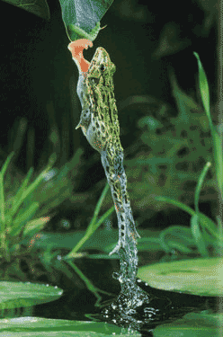{width="2.5833333333333335in"
height="3.90625in"} Then the frog may use its eyes again, and this time
to swallow the prey whole. It blinks both eyeballs down towards its
mouth where they help push the prey into its stomach.

**A frog's life is all about eating.**

Frogs eat almost anything that moves and can fit inside their mouths.
Once, an African bullfrog ate seventeen young cobras, one after another.

Some frogs seek out their food. A toad hops around after dark, snapping
up moths, beetles, and crickets. It may eat more than 5,000 insects
during a single summer. Other frogs ambush their prey. A horned frog
hides among leaves on the rain forest floor in South America. It stays
absolutely still, day after day. When an animals comes by, the frog
watches attentively, waiting until it moves closer. Thenm it seizes the
prey with a loud snap of its huge mouth. The horned frog is not a fussy
eater. It gulps down cockroaches, lizards, mice, and even other horned
frogs.

Frogs are prey, too. Birds, snakes, raccoons, and many other animals eat
them.

**That is why many frogs are wonderfully camouflaged in colours of green
or brown.**

When a predator wanders near, a frog will often crouch into its
surroundings. It will stay very still and quiet, hoping not to be
spotted. Even if a frog is discovered, it still has an escape plan. It
can jump. A big bullfrog can jump more than six feet.

**As it takes off, powerful muscles straighten the long legs folded
under its body.**

Its eyes sink into its head for protection, and special see-through
"eyelids," called nictitating membranes, cover them like safety goggles.
After a good leap, the bullfrog splashes into a pond and hides under
some waterweeds.

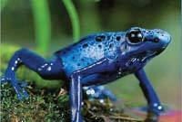{width="2.0833333333333335in"
height="1.40625in"} Some frogs have other ways to foil predators. If the
common toad sees a snake, it can puff up its body like a ball so that it
looks too big to swallow. Dart poison frogs, as their name tells you,
are poisonous. They hop around the rain forest floor, showing off their
beautiful colours that warn other animals to stay away. Just one lick
can put off a predator for life.

**The skin of some dart frogs contains enough poison to kill ten
people.**

The gliding frogs of Southeast Asia make the most spectacular escape
from predators. The first scientists to discover this frog could hardly
believe their eyes.

**A gliding frog can leap from the top of a rain forest tree and glide
for fifty feet using large webbed feet.**

It steers its body through the air to grab the branch of a nearby tree.

Scientists have discovered more than 5,000 types of frogs. many, like
the gliding frog, live in the rain forest. It is always warm and wet
there, so it is a perfect environment for them. But some frogs live in
dry deserts. How do they manage that?

**Spadefoot toads survive in dry places by digging underground to where
the soil is moist.**

The toads can sleep for weeks until they feel the sound of raindrops
falling on the ground above. Then they dig back to the surface at night.
It is an amazing event. Hundreds pop out of the earth almost at once,
splashing in puddles left by the storm.

The Australian water-holding frog fills its body with water before it
burrows into the desert. It sheds layers of old skin to make a
protective case called a cocoon. This keeps the frog moist so it can
survive for months and perhaps even years -- if it isn't dug up first.
The indigenous people of Australia found a way to use these frogs to
quench their thirst. They squeezed them gently for a drink and then let
them go.

Other survival tricks help some kinds of frogs live in very cold places.
In winter, these frogs dive to the bottom pf ponds and bury themselves
in the mud. Some crawl under logs or find burrows for shelter. As it
gets colder, they stop moving. Their heartbeats and breathing slow.
Sometimes their hearts may stop altogether.

**A few frogs, such as wood frogs and spring peepers, will even freeze
partly solid.** They have a sort of antifreeze in their blood that lets
them survive.

When spring sunshine warms the ground, a frog's heartbeat and breathing
slowly get faster. Then the frog wakes up. Next it is ready for a big
event. It joins hundreds of frogs on the move, hopping, leaping, or
swimming towards lakes, ponds, or large puddles where they breed. Some
frogs may travel more than eight miles to their breeding places.

As soon as they arrive, the male frogs start singing.

**Each type of frog has a special call.** It might be a grunt, a croak,
or a snort. Some frogs sound like quacking ducks, others like tinkling
bells. But they are all saying the same thing. To a female frog, the
singing means, "Pick me! Pick me!" To another male frog, the singing
usually means, "Keep away! Keep away!"

Each males ings to attract a female mate. If she likes his singing, the
female may let him fertilise the eggs she lays. For a bullfrog, that
could be as many as 20,000 eggs. Other frogs may lay only a handful.

Each egg is surrounded by clear jelly for protection. **The egg hatches
into a tadpole, which looks more like a fish than a frog.** It has a
head, a tail, and gills for breathing underwater. At first the tadpole
may feed on small plants, called algae. It has tiny teeth to scrape the
algae from rocks and logs.

When it gets bigger, the tadpole may also eat small animals. It feeds
most of the time, and its body starts to change. **Tiny back legs and
front legs appear and slowly get bigger.** The tadpole's gills get
smaller as lungs develop inside the body. Then it spends more time at
the surface, taking gulps of air. Eventually the tadpole disappears. Now
it looks more like a frog than a tadpole.

A bullfrog tadpole make take two years to turn into a small frog. **Then
it crawls out of the water, ready to explore its new surroundings.** The
young frog will spend most of its life near big lakes and ponds.
Bullfrogs love to hide in the waterweeds and wait to snatch insects.

Other kinds of tadpoles may turn into frogs in just a month or two. Wood
frogs, toads, and spring peepers often breed in small ponds and pools
that can dry out. So their tadpoles have to grow up and leave their home
before it disappears. When they are ready, they hop away to live in
nearby fields and forests.

Tadpoles and small frogs are always in danger. Water beetles, fish,
birds, and even other frogs eat them. So it is no surprise that some
frogs look after their young. **The African bullfrog fiercely defends
its eggs and tadpoles.** It will try to scare away people, and even
lions, that get too close.

Other frogs are even more amazing parents. The marsupial frog from South
America protects its eggs and tadpoles inside a special pouch, like a
kangaroo. The gastric brooding frog pf Australia swallows her eggs. The
tadpoles grow in the safety of her stomach for about two months. Then
with a hiccup, they hop out.

**Strawberry dart poison frogs are probably the hardest-working parents
of all.**

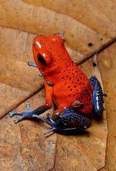{width="2.1458333333333335in"
height="3.1641951006124236in"} The female lays her eggs on the damp rain
forest floor instead of in a pond. When a tadpole hatches, it wriggles
onto the mother's back and she carries it up into a tree. There, she
looks for a plant called a bromeliad, which holds pools of water between
its leaves, and that is where she puts her tadpole. Then she goes down
to fetch her other tadpoles and puts each in a different bromeliad pool.

She will climb back every few days to see each tadpole. If one is
hungry, the tadpole does a special wriggle dance. That tells the mother
to lay an egg nearby. It is not a fertile egg, so it will not hatch. It
is food for her young. She cares for her treetop nurseries for several
weeks, until each tadpole has turned into a small frog.

**By the time a tadpole has become a frog it is ready to begin a new
life.**

Young strawberry dart poison frogs will have bright colours just like
their parents to protect them from enemies. Young re-eyed tree frogs
will have suckers on their toes, like their parents, to climb into
trees. They will have large eyes to spot insects, and sticky tongues to
catch them. And they will soon know how to hunt for prey and hide from
predators.

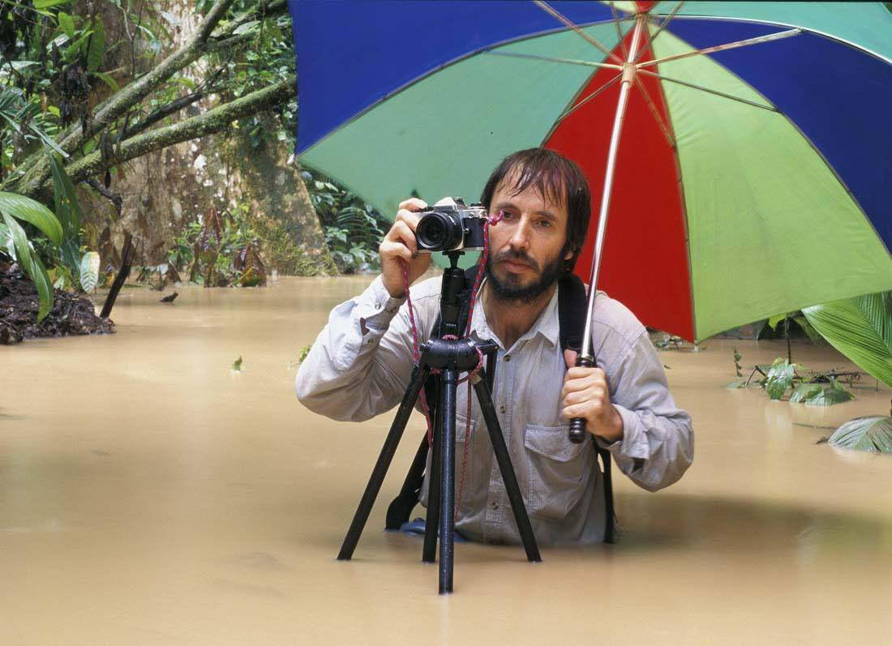{width="6.268055555555556in"
height="4.541491688538932in"}

** Frogs Euclid Public Library**

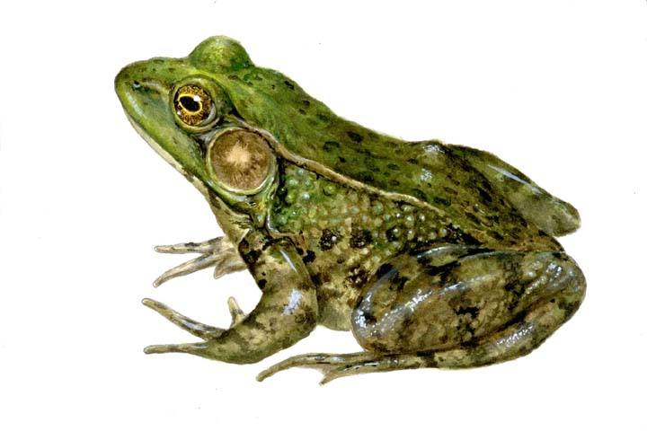{width="6.268055555555556in"
height="4.17870406824147in"}

Frogs are small jumping animals with bulging eyes. They are amphibians:
cold-blooded animals that live in water during the first part of their
lives and on land as adults. There are over 4,000 different kinds of
frogs in the world. They can be any colour - red, green, blue, yellow,
orange, even see-through and some are poisonous! \
\
Frogs begin as eggs that hatch into tadpoles. A tadpole has gills and a
long tail, like a fish. As the tadpole grows, it changes (metamorphosis)
into a frog, with lungs instead of gills and legs but no tail.\
 

**Did You Know?**

- Most frogs have eyes on top of their heads, so they can see all around
  to watch for predators.

- If you could hop like a frog, you would be able to cross a football
  field in just four jumps.

- A frog's tongue is attached to the front of its mouth, not the back,
  so it can reach farther for yummy bugs.

- Toads are a type of frog. Typically, toads are chubbier and have
  shorter hind legs than frogs. Frogs have webbed feet; toads do not.
  Frogs skin is smooth and slick; a toad's skin is dry and bumpy.

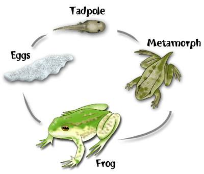{width="4.166666666666667in"
height="3.5520833333333335in"}

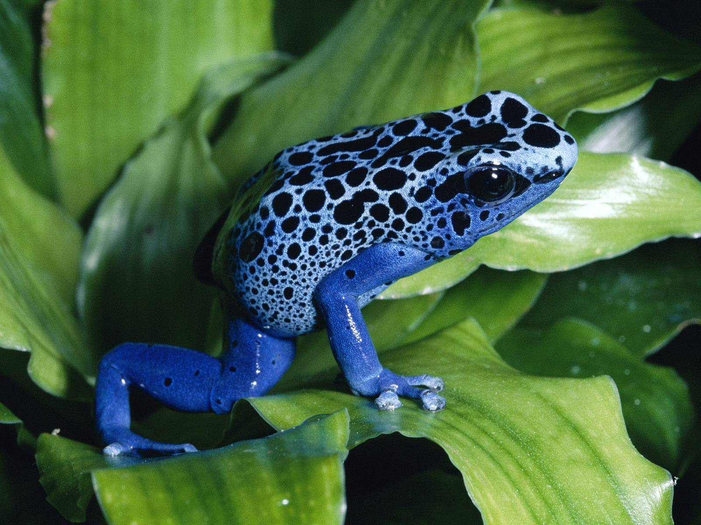{width="6.268055555555556in"
height="4.701042213473316in"}

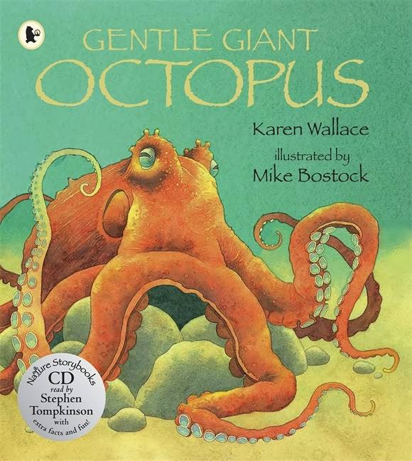{width="3.71077646544182in"
height="4.145833333333333in"}

Follow a goggle-eyed octopus as she jets through the shadows, tentacles
flying behind her. Finally she finds a well-hidden den in which to lay
her eggs, which will dangle from the roof like grapes on a string. In
silky verse, Karen Wallace explores the mysterious world of the octopus,
while Mike Bostock's flowing illustrations bring that world vividly to
life.

**Writing Craft**

Mentor Text: Gentle Giant Octopus is a story that explores the life of
an octopus. It is a very descriptive book that has been poetically
written. The story is give in small chunks so that children learn the
most. The book also is informative. Students learn that Octopus have no
bones, and they have 60,000 babies at a time. When a fish bites off a
tentacle, the tentacle grows back. It can fit in really small places.
Octopi squirt ink to get away from predators. Students will not only
learn many true facts about the octopus, but this book does a great job
of modelling descriptive and creative writing.

Format

Word Choice

Ending

**Reading Strategies:** Inferring/ Visualising

There are more than 150 different kinds of octopuses, and the Giant
octopus is the biggest -- the tentacles of the largest one ever found
were an amazing 4 ¾ metres long!

Even though they are so huge, Giant octopuses do not attack humans. They
live in coastal waters in the north Pacific Ocean, and feed mainly on
crabs, clams, and sea snails.

Female Giant octopuses lay eggs only once in their lives. They are
believed to eat little or nothing after mating. Once their eggs have
hatched, female octopuses die.

**Gentle Giant Octopus**

**Karen Wallace**

A gentle Giant octopus jets through the shadows. She's huge like a
spaceship. Her eyes glow in the water. Long tentacles fly like ribbons
behind her. Silver-backed fish scatter before her.

A wandering mother octopus moves through the water. Inside her body, she
carries her eggs. She looks for a den that is safe and well hidden, for
a crack in a rock face or a hole under a stone.

*When octopuses need to move quickly, they jet backwards by sucking in
seawater and pumping it out through a funnel-like siphon.*

An octopus sinks like a huge rubber flower. Sand muddies the water as
she lands on the seabed.

*Octopuses use their tentacles like fingers to sense things. They use
the suckers on their tentacles to grip things.*

Octopus eyes turn frontwards and backwards. Her tentacles sense a crab
in the water. A tentacle searches and touches .... **Unlucky octopus!**

Crab claws have sharp edges. They nip at the tentacle. The octopus pulls
back. The crab scuttles sideways and escapes in the sand.

A mother Giant octopus slides over the seabed. Her body stretches like
taffy over the stones. Her skin ripples like seaweed. She's black as the
sea kelp. The goggle-eyed octopus feels her way forward.

*Usually, the Giant octopus is reddish brown, but when it's hunting or
hiding, it can change to become very dark or very pale within seconds.*

But under a boulder, a Wolf eel is waiting. His mottled grey face darts
from the shadows. His teeth strike like daggers. He rips off a tentacle.

*Octopuses have eight tentacles. A healthy octopus can regrow its
tentacles if they are damaged.*

Then sinks like a nightmare deep into his den.

*If an octopus is attacked, it will squirt out a cloud of inky liquid to
hide its escape.*

A frightened Giant octopus squirts ink at the Wolf eel. She shoots back
from the boulder, back over the seabed. She's pumping and sucking the
sea from her body. A quivering Giant octopus rests on a boulder.
Underneath is a cave that is easily guarded.

*Octopuses are about as clever as cats -- and like cats, they're very
curious.*

She squeezes inside. She drags pebbles around her. Her search for a home
is over at last.

*Octopuses don't have any bones, and they can squeeze through the
tiniest of holes.*

A mother Giant octopus lays eggs in her cave den. They hang from the
roof like grapes on a string. She guards them from crabs and nibbling
fishes. While her babies are growing, she never eats and never rests.

*A female giant octopus will lay as many as 60,000 tiny eggs.*

After five months, her babies swim from their egg sacs. They squirm and
they wiggle. They jet through the shadows. They're sucking and pumping
the sea from their bodies.

*Lots of other animals like to eat baby octopuses, so only two or three
out of every brood live to become adults.*

A mother octopus rests in her cave den. She watches her babies swim up
through the water. a gentle Giant octopus shrinks in the shadows. Her
life is over as their lives begin.

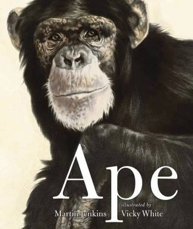{width="2.61836832895888in"
height="3.1041666666666665in"}

White\'s illustrations are a loving tribute to the four non-human
species of great apes: chimpanzees, orangutans, bonobos and gorillas. On
each spread a single individual is rendered in color with transparent
washes over the drawing while the rest of the individuals and the
background are left as rougher cross hatch drawings.

The technique helps to create an arresting focus on each ape, especially
their faces, which is furthered by White\'s attention to detail. This
would be a heartfelt addition to any unit on apes, primates, mammals or
animals even though the amount of information provided on each species
is quite limited. I also think this book is a nice source of inspiration
for any drawing project \-- especially when introducing the technique of
cross-hatching.

A world map on the last page showing the population size and
distribution of each animal is a nice tie-in to wildlife protection and
geography. Orangutans are found in Borneo and Sumatra in Indonesia.
Chimps live across western and central Africa. Bonobos live in the Congo
basin and gorillas can be found in central Africa.

There are some earnest comments at the end about the fifth great ape,
humans, and their impact on the others as well as current efforts to
protect the remaining populations.

**Ape Martin Jenkins**

There are five kinds of great apes in the world. each of them is
different from the others \... but not so very different. They're all
part of the same family.

Four of them are very rare: Orangutan, Chimp, Bonobo, Gorilla.

Here they are \...

**Orangutan**

Orangutan swings with her baby. She has long hairy arms, with strong
hands for clutching at branches, and feet that can grasp the trunk of a
gtree.

That fruit's out of reach \...

*Orangutans live in the rain forest of Borneo and Sumatra in Southeast
Asia. They spend almost all their time in trees.*

but not for long. It's a durian. Smelly, spiky, delicious!

*Orangutans are mostly vegetarians. They eat a lot of different kinds of
fruit but are especially fond of durians.*

Orangutan looks after her baby alone. She keeps to herself, high up in
the treetops. Each night she builds a nest out of branches to sleep on,
then pulls down a palm frond to keep off the rain.

**Chimp**

Chimp lives in a gang with his brothers and sisters and uncles and
cousins.

They squabble and play and go roaming the hillsides, hunting down
monkeys and digging up roots.

*Chimpanzees live in forests and savannahs in central and west Africa.*

Here's a termite nest. Chimp pokes down a hole with a long blade of
grass, then pulls out the grass and licks of the termites.

*Chimpanzees spend a lot of time on the ground. they eat lots of
different things and are very good at making and using tools.*

Chimp's gang sometimes gets into fights with other chimp gangs -- nasty
fights, with lots of biting and hitting. Sometimes someone gets hurt.

**Bonobo**

Bonobo chatters and hoots and calls to her friends, while feasting on
figs high off the ground.

*Bonobos live in the rain forest of the Congo basin in central Africa.
They mostly eat different kinds of fruit.*

She drops from the tree and moves quickly and quietly, watching and
listening -- there may be hunters or leopards nearby.

*Bonobos spend a lot of time feeding in the trees but often travel on
the ground from one feeding place to another.*

Back in the treetops, Bonobo plays with her friends, safe again.

**Gorilla**

Gorilla lounges, chewing on bamboo stems and chomping on leaves. The
silver hair on his back shows that he's old.

*Gorillas live in the forests of central Africa. They can get to be
forty or fifty years old.*

Gorilla grunts to his family, then snoozes. He wakes up, plays with his
baby, then snoozes some more.

*Gorillas live in small family groups of one male with a few females and
their young. they are vegetarians and spend a lot of their time eating
and sleeping.*

He wakes up again, chews on some bamboo, builds a nest for the night,
and lies down to sleep.

And the fifth kind of great ape is \... do you know who?

**You \...** and me.

We humans are part of the great ape family, too. We're not rare like the
rest of them though -- there are lots and lots of us. But we do have
other things in common. We look like them (especially our faces). We
live long lives, like they do, and usually have only one baby at a time,
who takes years to grow up. we're all smart, too, probably smarter than
any other animals.

We're *too* smart, sometimes -- at least we humans are. we just can't
stop changing things. We've changed the world so much, we haven't left
enough room for the other great apes. And we've hunted them -- for food
or to keep as pets.

In some places, though, we're trying to protect them now. We've set
aside pieces of wild land where they can live their lives in peace --
swinging and stomping, chattering and playing, eating and sleeping, and
doing all the other great things we apes love to do!

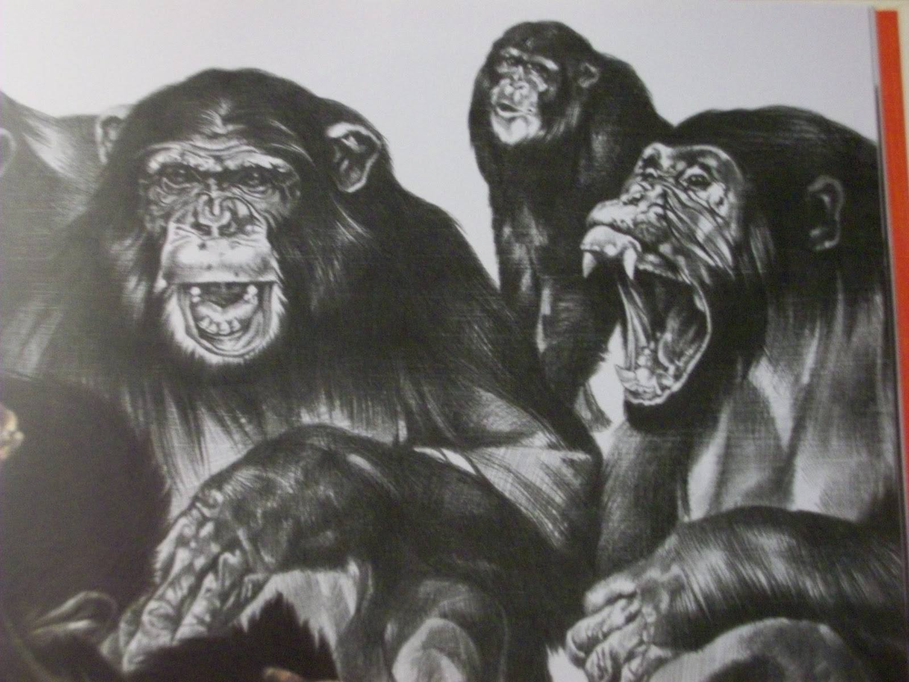{width="6.268055555555556in"
height="4.701042213473316in"}

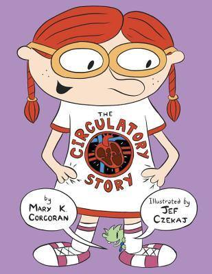{width="3.21875in"
height="4.166666666666667in"}

**The Circulatory Story Mary Corcoran**

Simple, humorous text and comic illustrations explain the basics of the
circulatory system\--the systemic, pulmonary, and coronary circuits.
Readers follow a red blood cell on its journey through the body, and in
the process learn how the body combats disease, performs gas exchanges,
and fights plaque.

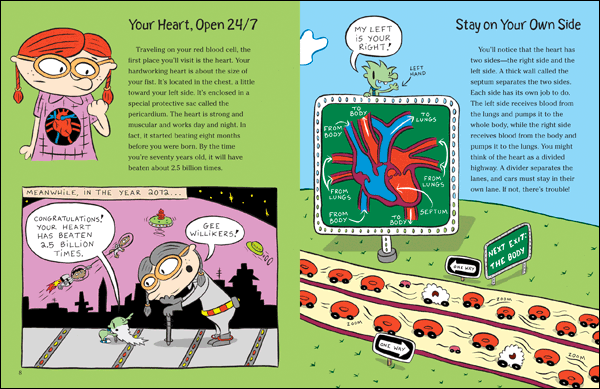{width="6.25in"
height="4.052083333333333in"}

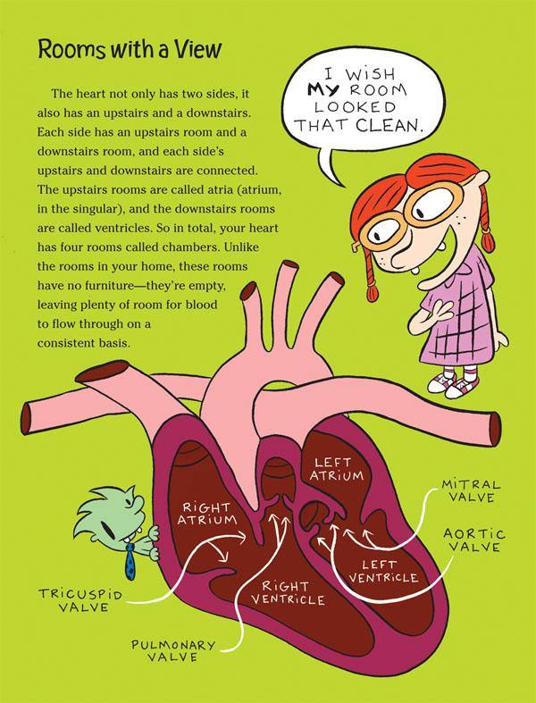{width="6.25in"
height="8.197916666666666in"}

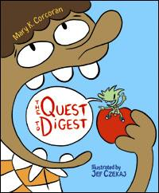{width="2.0833333333333335in"
height="2.5208333333333335in"}

**The Quest to Digest Mary Corcoran**

Humorous text and illustrations follow an apple\'s journey through the
human digestive system. Discover why mucus is so important to your body
and how food particles are absorbed by the small intestine and turned
into energy. Readers also learn why we burp, vomit, and pass gas.

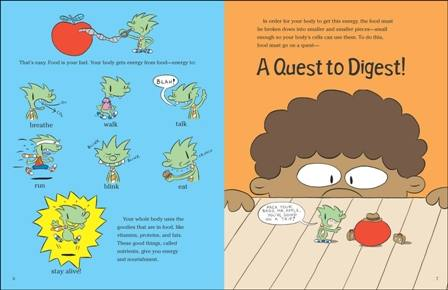{width="4.666666666666667in"
height="3.0208333333333335in"}

