> **Voice**
>
> **(15)**

{width="5.916666666666667in"
height="4.822916666666667in"}

Secondary

{width="2.6452482502187227in"
height="2.15625in"}

**Voice 15**

**Secondary**

Voice

There's a Hair in My Dirt Gary Larson

Forest Sonya Hartnett

Monkeyman in 145th Street Short Stories

Walter Dean Myers

To This Day Shane Koyczan

Let the Celebrations BEGIN! Margaret Wild

Rose Blanche Ian McEwan

The Harmonica Tony Johnston

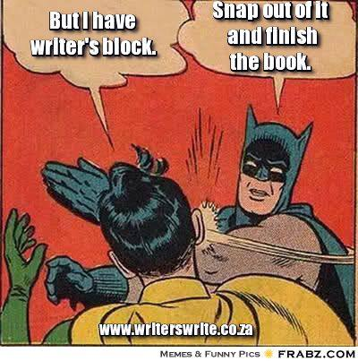{width="3.856492782152231in"
height="3.8854166666666665in"}

**VOICE**

VOICE shows the writer\'s personality. The writing has a sound different
from everyone else\'s. It contains feelings and emotions so that it does
not sound like an encyclopaedia article. The reader should be able to
sense the sincerity and honesty of the writer. The writer should be
writing from the heart. The language should bring the topic to life for
the reader. The voice should be appropriate for the topic, purpose, and
audience of the paper.

Voice is determined by the personality traits, likes and dislikes,
attitudes, beliefs, age, gender, experience of the main character. A
good check system to put in place is for the student to read their
writing, checking vocabulary, word choice, phrasing, sentence style
against their character's traits, to ensure that every word best
reflects that character's voice and point of view.

- **Voice** conveys the mood and tone of the writing.

- **Voice** supports the writer's purpose and is

appropriate for the audience.

- **Voice** can be revealed and supported by

  - including detailed **ideas** that add interest.

  - using clear, precise **word choice** that shows feeling.

  - improving **sentence fluency** to make the writing flow.

  - using **conventions** to help show interest or

excitement.

Don't
confuse [tone](http://writerswrite.co.za/155-words-to-describe-an-authors-tone) with
voice. Voice can be explained as the author's personality expressed in
writing, while tone refers to the attitude of the writer in a piece of
writing. 

You already have your voice. The only way to find it or improve it, is
by writing. This is not something you do quickly. You will have
to [write many
words](http://writerswrite.co.za/10-things-successful-authors-do) before
you are comfortable enough for your voice to shine through naturally. 

**Strong Voice vs Weak Voice**

STRONG VOICE Writing is compelling, authentic, and engaging; tone is
interesting; you hear the writer's conviction. Writer connects with
audience. Writer's devotion comes through in the text. Expository
writing is committed, persuasive. Narrative writing is honest, engaging,
personal.

WEAK VOICE Writing is plain; writer is indifferent, distanced from topic
and/or audience. Writer sounds flat, bored, unaware of audience; reader
loses interest. Expository writing lacks commitment. Narrative writing
shows no attempt at voice. Understandably, the concept of voice
intimidates young writers. Some students require help adding voice to
their writing. Once they know what voice means, it becomes easier to
grasp.

As you write, let your author's voice shine. How do your words sound?
Look at:

• tone: Is it friendly, formal, chatty, or distant?

• word choice: Do you use everyday words or high-brow language?

• sentence patterns: Are they varied, or do they repeat?

• personality: What do you show about yourself?

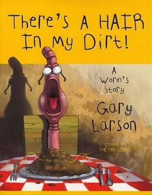{width="3.2604166666666665in"
height="4.166666666666667in"}

Once upon a time in a place far away, lived a man named Gary Larson who
used to draw cartoons. It was a cartoon that appeared for many years in
daily newspapers and was loved by millions. (And was confusing to
millions more.) But one day he stopped.

Gary went into hiding. He made a couple short films. He played his
guitar. He threw sticks for his dogs. They threw some back.

Yet Gary was restless. He couldn\'t sleep nights. Something haunted him.
(Besides Gramps.) Something that would return him to his roots in
biology, drawing and dementia\--a tale called There\'s a Hair in My
Dirt! A Worm\'s Story.

It begins a few inches underground, when a young worm, during a typical
family dinner, discovers there\'s a hair in his plate of dirt. He
becomes rather upset, not just about his tainted meal but about his
entire miserable, wormy life. This, in turn, spurs his father to tell
him a story\--a story to inspire the children of invertebrates
everywhere.

And so Father Worm describes the saga of a fair young maiden and her
adventuresome stroll through her favorite forest, a perambulator\'s
paradise. It is a journey filled with mystery and magic. Or so she
thinks.

Which is all we\'ll say for now.

What exactly does the maiden encounter?

Does Son Worm learn a lesson?

More important, does he eat his plate of fresh dirt?

Well, you\'ll have to read to find out, but let\'s just say the answers
are right under your feet.

Written and illustrated in a children\'s storybook style, There\'s a
Hair in My Dirt! A Worm\'s Story is a twisted take on the difference
between our idealized view of Nature and the sometimes cold, hard
reality of life for the birds and the bees and the worms (not to mention
our own species).

Told with his trademark off-kilter humor, this first original non\--Far
Side book is the unique work of a comic master.

Now Larson can finally sleep at night.

Question is, will you?

(from the back cover)

**An Ecocentric Tale**

{width="4.135416666666667in"
height="5.208333333333333in"}

*Dirt* represents a rather subversive take on modern sanitised fairy
tales from the beginning. The title itself foreshadows a shift in
perspective -- it is the hair that is the impurity, not the dirt. This
is the world from the lowly worm's perspective, but the narrative
of *Dirt* emphasises that this world is no less vital to the continued
functioning of the world than the one we inhabit. In his cranky speech,
Father Worm describes the critical role earthworms have in ecosystems:

Father Worm sat back, stretching himself out to his full, glorious three
and a half inches. "Take us worms, for example. We till, aerate, and
enrich the earth's soil, making it suitable for plants. No worms, no
plants; and no plants, no so-called higher animals running around with
their oh-so-precious backbones!"

He was really getting into it now. "Heck, we're invertebrates, my boy!
As a whole, we're the movers and shakers on this planet! Spineless
superheroes, that's what we are!"

Even the conclusion is unexpected: Junior Worm expects an ending in
which Harriet lives happily ever after. But Father Worm ends the story
with Harriet dying due to a viral infection, with the worm family
rejoicing. Once again, the reader is asked to view the world from a
different perspective. Harriet's death is, in reality, a great boon to
the worms, who excel at breaking down dead organic matter, including the
hair that was on Junior's plate. It is indeed a happy ending -- just not
for Harriet.

{width="5.208333333333333in"
height="3.5729166666666665in"}

## **Truly Understanding Nature**

## 

"Nature is to be loved, cherished, admired, and yes poetically
celebrated (Why not? We've depended on it for millions of years), but,
above all, understood."

*-- [E.O. Wilson](http://en.wikipedia.org/wiki/E._O._Wilson), p. 1
foreword*

*Dirt*'s central message to the reader is that it is not enough to
simply appreciate and love nature; we must have the passion, curiosity,
and wisdom to attempt to understand it. Simply admiring nature and
dwelling on its beauty can lead to an overly romantic perception of the
natural world. Larson demonstrates an understanding that nature also
includes ugliness, chaos, death, decay, and destruction. In reality,
nature is neither kind nor cruel, but rather indifferent. This can be an
unsettling realisation for many. Thinking upon this subject, I am
reminded of a quote by [Stanley
Kubrick](http://www.rottentomatoes.com/celebrity/stanley_kubrick),
celebrated filmmaker, attempting to address the issue of how to cope in
an uncaring, inhumane universe:

"The most terrifying fact about the universe is not that it is hostile,
but that it is indifferent. If we can come to terms with this
indifference and accept the challenges of life within the boundaries of
death, our existence as a species can have genuine meaning and
fulfilment. However vast the darkness, we must supply our own light."
*-- From [Wikipedia](http://en.wikiquote.org/wiki/Stanley_Kubrick) --
Stanley Kubrick: Interviews, 2001*

One source of light is scientific understanding. Harriet in the story is
depicted as a naive individual ignorant of biology and ecology, unable
to understand the connections and relationships between her and her
surrounding environment. She unwittingly feeds the large and aggressive
grey squirrels, thinking them cute and cuddly, not realising that they
are an invasive species that is out-competing the native red squirrels.
She praises the Amazon ants for being caring parents, when they are in
reality raiding eggs from another colony. Harriet dooms a tortoise by
dropping it into the pond, not recognising the different morphologies
and adaptive traits of tortoises and turtles. She condemns a forest fire
as something ugly and undesirable, not understanding the vital role that
fire plays in the renewal of forest ecosystems. (To be fair, the role of
fire in forest ecosystems has only been realised in recent decades, so
I'll cut her some slack.)

{width="5.208333333333333in"
height="3.3541666666666665in"}

In the conclusion of the fable, Harriet acts unwisely out of her
misguided perception of what is good and what is bad, killing a snake
that was about to eat a mouse. Unfortunately, the disease-riddled mouse
turns around to infect Harriet with a virus, causing her ultimate
demise.  This tragic result was due to Harriet's ignorance and lack of
knowledge about the biology and ecology of her surrounding environment.
Father Worm summarises the problem with Harriet at the end of the story:

"You see," Father Worm began, "Harriet loved Nature. But loving Nature
is not the same as understanding it. And Harriet not only misunderstood
the things she saw -- vilifying some creatures while romanticising
others but also her own connection to them." Father Worm paused, his
eyes narrowing. "Ah, connections, Son. That's the fateful key that
Harriet missed, the key to understanding the natural world."

*Dirt *reminds the reader to be mindful and appreciative of the natural
world while cautioning us against projecting our own biases out towards
nature without a solid understanding of how it works. What we perceive
as cruelty, aggression and suffering are all elements in nature as
well.  As Pollan stated in *Second Nature*, "nature is probably a poor
place to try to find values". Meaning is derived from culture and in our
relationship with nature, but not nature itself.

## **Humour to Connect and Educate**

## 

"There's a Hair in My dirt! Is hysterical... more entertaining than any
science class I remember and the foreword by biologist E.O. Wilson
proves it's legit."

*-- Washington Post Review from the back cover of Dirt*

Many of the illustrated pages of *Dirt* have both subtle and not so
subtle messages of biology and ecology embedded in them. Larson's
passion for biology is evident in *Dirt* and in his *Far Side* comics;
he is a master at utilising humour to connect and educate people about
biology and the natural world. There is something about his delivery
that is so distinctive, bizarre, and self-aware that it resonates with
people from a wide range of backgrounds.  I constantly see *Far
Side* comics taped to office doors, work cubicles, and used at the
beginning of presentations and conferences.

{width="3.2916666666666665in"
height="4.166666666666667in"}

What I find most fascinating in Larson's work is that he draws
inspiration from both culture and nature, delighting in placing animals
and other creatures in surreal human situations. Organisms ranging from
cows to spiders to amoeba are routinely portrayed anthropomorphically.
By contrast, human beings are often depicted as dim-witted creatures. In
one sense, Larson's work often attempts to even out the differences
between nature and culture, making animals more like humans and humans
more like animals. This approach makes it easier to relate and
appreciate the non-human world. He reminds me that human beings are at
their core animals too, with biological urges no different from the
spider or the cow or the amoeba. This is a refreshing and sorely needed
reminder in today's society, lest we forget and become too detached and
disconnected from nature. We are still beings of biology, connected to
the ecological world, as E.O. Wilson writes in the foreword of Dirt:

"The point is that we, too, are organisms. We are subject to the same
physical laws, still tied to the planet, totally enmeshed in food webs,
energy flows, nutrient cycles, predator-prey cycles, territorial
imperatives."-- Dirt, Foreword,Dirt presents an accessible and
non-threatening approach for getting people of all ages to think more
deeply about the natural world. The use of humour in stories to convey
the essence of the alien, the non-human, and the incomprehensible can
provide perspective, create resonance, and stimulate the imagination,
all elements crucial to the formation of environmental awareness. That's
why I think There's a Hair in my Dirt! is a great Ekostory.

**BOOK REVIEW**

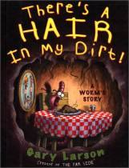{width="1.6770833333333333in"
height="2.1875in"}

Genre/Subject: Humour/Science

Reader's Annotation: A family of worms eats dinner, the son complains
about how awful life is as a worm. Father Worm uses this opportunity to
teach his son an important lesson.

Plot Summary: From the creator of The Far Side comes an exploration of
humans' interactions with nature. Father Worm informs his son that
humans are often uninformed and misguided when it comes to the
biological entities they encounter on a daily basis. The story tells the
difference between human's view of Nature and the reality of life.

Critical Evaluation: This book is geared towards young adults, because
of the language, and violent death implications, such as Harriet
unknowingly drowning a tortoise, who does not swim, because she thinks
he's a turtle out of water. The violent scenes of animals dying or being
tortured are drawn in a comical way, using cartoon images that appear to
be computer illustrated. Each double page spread is full of colour, and
the story presents a great educational lesson about elements, animals,
and insects in the natural world. This is an excellent spin on a science
lesson. Older readers will enjoy the story and at the same time learn
facts about animals. The humorous parts of the story is the
obliviousness of Harriet, who bases her knowledge of natural world by
the cuteness of each animal, without truly understanding how each animal
and insect contribute to the earth. Through the characterisation of
earthworms, the author presents the facts of each animal and insect's
daily routine and physical characteristics. I can defiantly see this
book used in a biology classroom. The story is great for older readers
because it presents scientific facts, and a moral in a crude way. The
ending was morbid, but that it was meant to be funny.

Genre: Humour

Curriculum Ties: This book is perfect for a high school biology class.
Each of the main (human) character's encounters with nature is a jumping
off point for great class discussion.

About the Writer: Gary Larson is the creator of the successful cartoon:
The Far Side. As a child Larson loved to draw and he loved learning
about biology. Biology is a frequent topic in his cartoons.

Booktalking Ideas: Morals, Ecology,

Interest Age: 16 and up

Challenge Issues: Violence, Profanity

Challenge defense ideas: Humour and illustrations to present a story
about morals, and biology

Selection: I included this book because it is told from the point of
view of an earthworm, who tells a funny story. Older teens can learn
about science without feeling like they are being lectured. This is a
funny way to learn facts about biology.

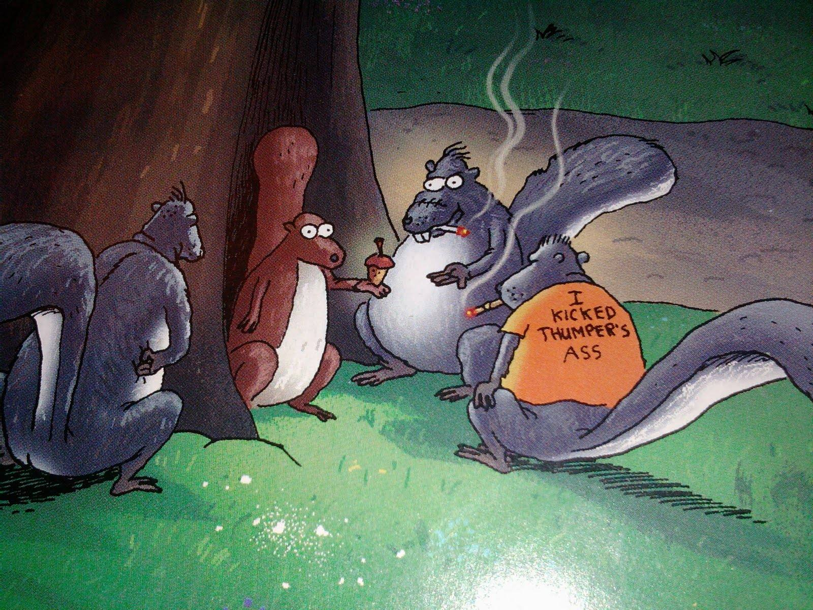{width="6.268055555555556in"
height="4.701042213473316in"}

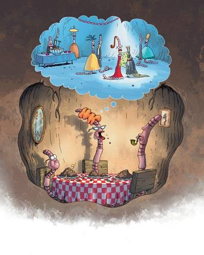{width="4.15625in"
height="5.208333333333333in"}

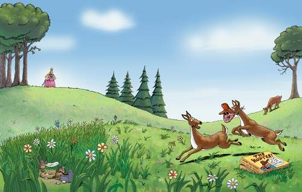{width="5.208333333333333in"
height="3.3125in"}

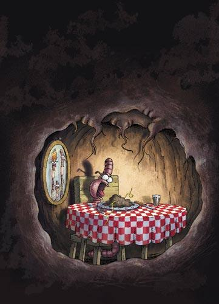{width="3.7604166666666665in"
height="5.208333333333333in"}

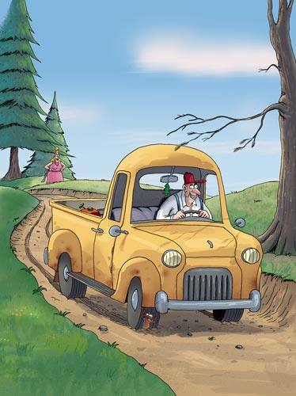{width="3.8958333333333335in"
height="5.208333333333333in"}

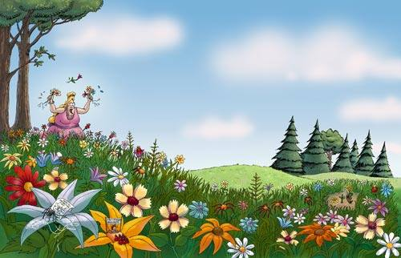{width="5.208333333333333in"
height="3.3541666666666665in"}

{width="6.268055555555556in"
height="8.465281058617673in"}

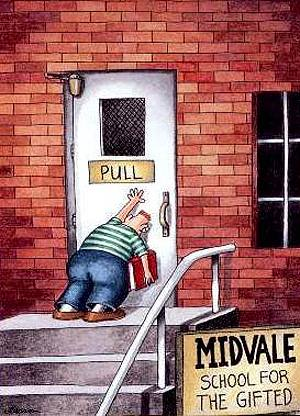{width="3.125in"
height="4.333333333333333in"}

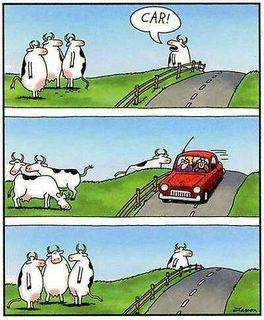{width="2.75in"
height="3.3333333333333335in"}

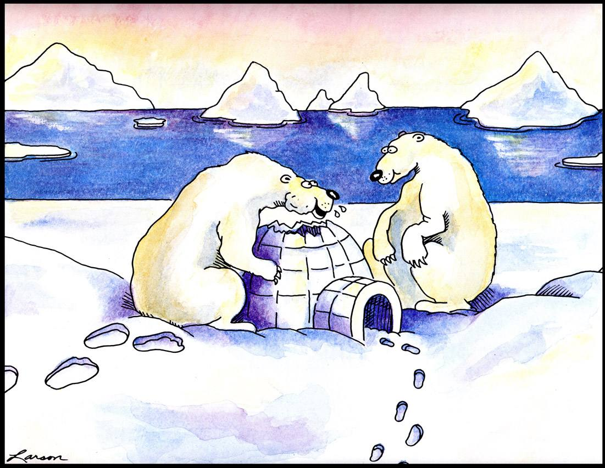{width="6.268055555555556in"
height="4.8561778215223095in"}

**\"Oh, hey! I love these things!\....Crunchy on the outside and chewy
centre!\"**

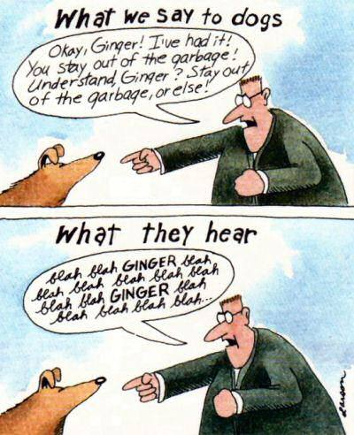{width="4.166666666666667in"
height="5.125in"}

{width="6.268055555555556in"
height="8.229011373578302in"}

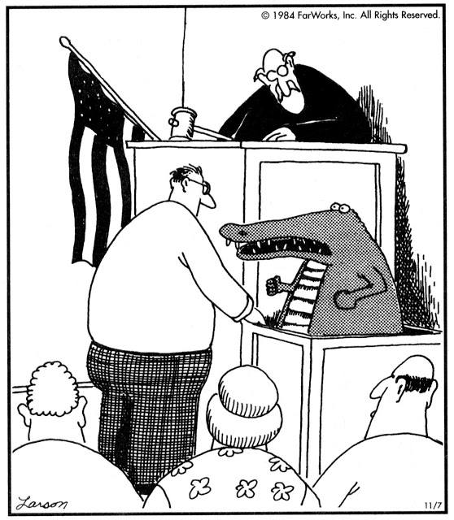{width="5.8125in"
height="6.666666666666667in"}

\"Well, of *course* I did it in cold blood,\
you idiot! \... I\'m a reptile!\"

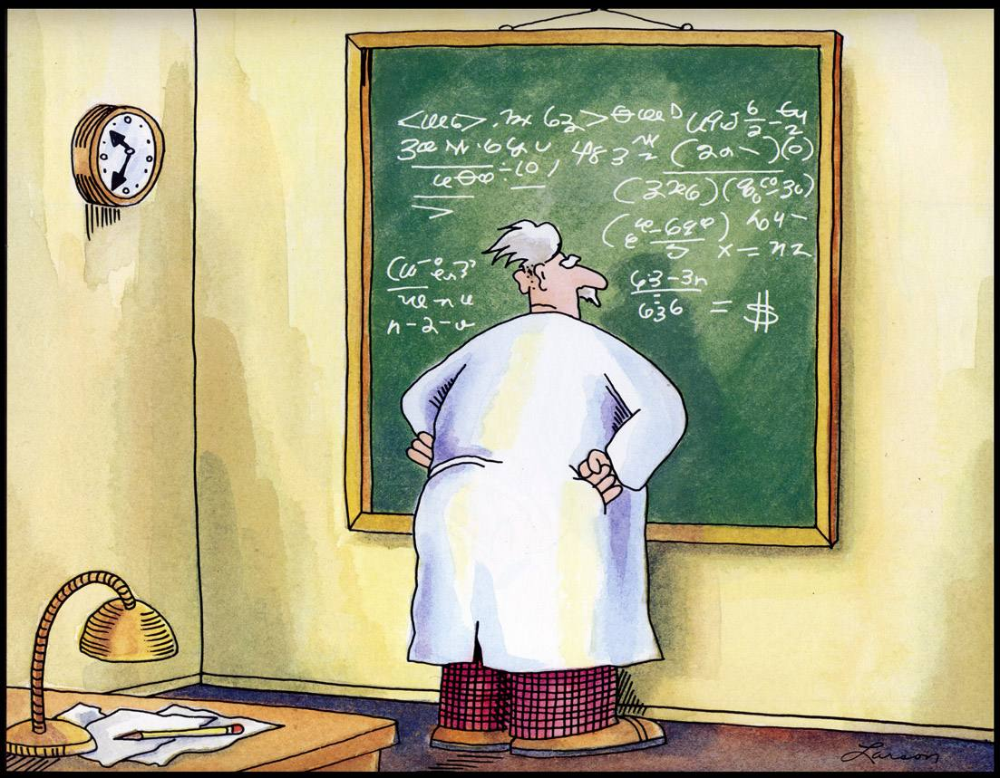{width="6.268055555555556in"
height="4.881468722659667in"}

Einstein discovers that time is actually money.

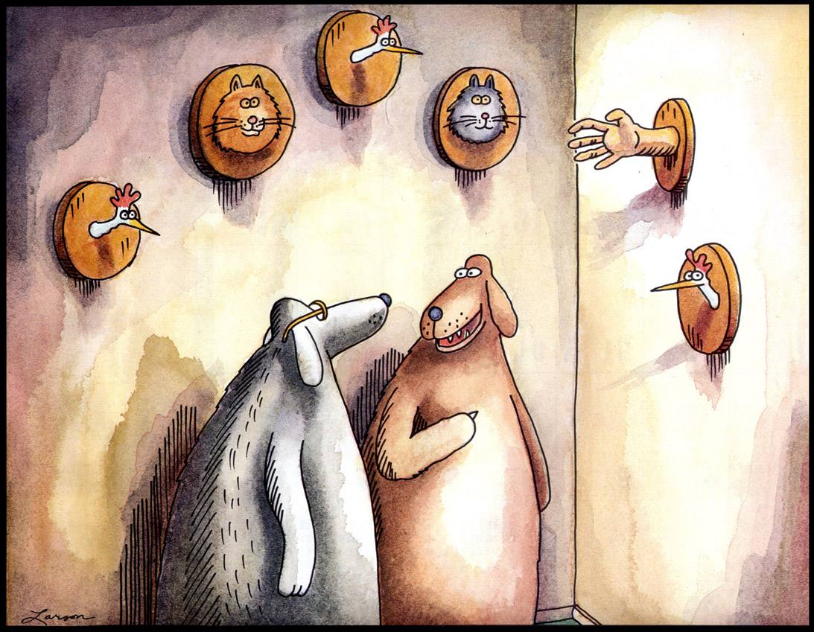{width="6.268055555555556in"
height="4.86878280839895in"}

**\"And that\'s the hand that fed me.\"**

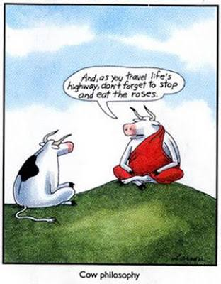{width="3.25in"
height="4.166666666666667in"}

**There's a Hair in My Dirt Gary Larson**

Beneath the floor of a very old forest, nestled in among some nice, rich
topsoil, lived a family of worms. Earthworms to be exact.

One evening, the three of them -- father, mother, and little worm son --
sat down to their usual dinner: dirt.

They ha just begun to dine when the little worm, staring wide-eyed at
his meal, suddenly spat out his food and screamed, "THERE'S A HAIR IN MY
DIRT! THERE'S A HAIR IN MY DIRT!"

And sure enough, there it was -- plain as day. They could all see it.

At first, the little worm was horrified, but soon that gave way to being
just plain mad.

"I hate being a worm!" he screeched, his tiny body trembling. "We're the
lowest of the low! Bottom of the food chain! Bird food! Fish bait! What
kind of life is this, anyway? We never go swimming or camping or hiking
or *anything!* Shoot, we never even go to the surface unless the rains
flood us out! All we ever do is crawl around in the stupid ground. Oh,
and how can I forget? We eat dirt! Dirt for breakfast, dirt for lunch,
and dirt for dinner! Dirt, dirt, dirt! And look -- now there's even a
hair in my dirt! The final insult -- I can't stand it any longer!

I HATE BEING A WORM!"

And with that, the little worm slumped back in his chair, exhausted by
his outburst.

Mother Worm, an expression of concern on her face, looked from her
pouting son to Father Worm. She had constantly tried to make their home
as cheery as possible, even going so far as always putting silverware on
the table -- despite the fact that none of them had arms.

But Father Worm, a proud invertebrate and a learned member of the
Annelida phylum (even with his small, rudimentary brain), was glaring at
what he considered to be an ungrateful and ignorant son. "Well, well,
well," he said, breaking the awkward silence. "Let me get this straight:
Not only is your mother's dirt not good enough for you, but you feel
being a worm isn't exactly a charmed life, eh?" A strange glint fell
across Father Worm's eye. "My boy, I think it's time I tell you a
story."

The little worm looked up and sneered sarcastically, "If this is the one
about the teenage worms and the Insane Trout Fisherman, I've heard that
one a gazillion times!"

"No, no," Father Worm calmly responded. "Not that story. (Though it is a
good story.) This one is different. *This* story has a happy ending.

"I have an idea," Mother Worm chimed in enthusiastically. "Let's listen
to Father's story and afterwards, maybe we can all have some fresh, cold
dirt for dessert!"

And so Father Worm cleared his long, primitive pharynx, took a futile
puff on his dirt-filled pipe, and began his story.

Once upon a time, in a forest not too far from here, lived a beautiful
young maiden. Her name was Harriet, and Harriet loved the magic of
Nature, with all its magnificent plants and animals.

One lovely spring morning, she decided to take a stroll along her
favourite woodland trail. "What wondrous things will I see today?"
Harriet thought to herself. I must say, she was as excited as a tapeworm
in a meat patty!

With her first steps, Harriet took a deep breath and filled her lungs
with the fresh air. "Oh, thank you trees and other plants!" she called
out. "Thank you for making the air so crisp and clean!"

Well, as any worm with half a ganglion knows, the plants did a little
more than just make the air crisp and clean -- they made the air *air!*
Every molecule of oxygen in the earth's atmosphere was put there by a
plant, and -- last time I looked -- the Living were quite fond of
oxygen. (Heck, even the Dead need it, or they'd hang around a lot longer
and get on everyone's nerves.)

Soon Harriet met a family of squirrels, who came bounding towards her,
unafraid and looking for a possible treat. Gathering nuts from a nearby
tree, Harriet was quick to accommodate them. "Oh, you're all so *cute*!"
she gushed.

To be sure, these furry creatures had that "cute" thing down real good
-- regrettably. You see, Harriet was feeding Grey squirrels, a large,
aggressive species that had been introduced to this forest and were
taking it over from the native Red squirrels, a smaller, more timid
species.

All squirrels are rodents, but in the wrong time and place, some are
rats.

Around the bend, the forest opened into a meadow of wild flowers as far
as the eye could see. "My!" Harriet exclaimed, bedazzled. "I'm gazing at
a painting! Oh, Mother Nature! What an artist you are!"

"Oh, Mother Nature! What a sex maniac you are!" may have been a better
choice of words, for Harriet was actually gazing upon a reproductive
battlefield. Using bright colours, nectar, mimicry, deception, and
whatever other tricks they had up their leaves, these floral sirens were
competing for the attention of pollinating insects.

In a field of flowers, all is fair in bugs and war.

A little ways farther, Harriet happened to look down and saw a column of
ants crossing the trail. "Ahh!" she smiled, noticing all the eggs they
were carrying. "Even the littlest creatures take good care of their
babies! How adorable!"

"Adorable?" Well, as Grandpa Worm used to say, "About as adorable as a
nest of baby robins!" These were Amazon ants, a species that, despite
its name, lives in many parts of the world and specialises in the
enslavement of other species -- and Harriet was watching a raiding party
returning home with their living booty.

As the trail widened and the trees thinned out, Harriet heard a rumbling
sound. Looking up, she spied a familiar truck heading her way. She
immediately recognised the ruggedly handsome and rosy-cheeked character
behind the wheel. "Hello, Lumberjack Bob!" she called, waving with happy
excitement, knowing him to be a gentle man with a quick smile and a big
heart.

Well, kind, big-hearted, and rosy-cheeked he might be (the latter caused
by expanded capillaries in his skin's dermal layer), but Lumberjack Bob
was really just a regular guy with little education doing the one job he
knew how to do -- cutting down ancient trees that were here long before
the first intestinal worms came over in the Pilgrims.

Harriet then heard a magical sound from the canopy of trees above. "Oh!"
she cried skyward. "Listen to the songs of those happy, happy birds!"

Well, if those birds were happy, may the garden gods cut me in half with
a rusty shovel! Birds sing to communicate, and what they were
communicating was mostly an array of insults, warnings, and come-ons to
members of their own species.

(IN fact, all baby birds are taught by their parents not to even smile,
or their beaks will crack.)

"This story *is* for the birds, if you ask me!" the little worm
interrupted suddenly. "Some lady taking a walk in the woods? Oh, I can't
*stand* the excitement!

"If you have to tell me a story, you could at least tell me one that's
sort of exciting -- like 'Mr Dung Beetle Finds His Field of Dreams.' Now
that's a cool story."

"I'm telling you *this* story," said Father Worm, rather testily. "So
just put a fish hook in that mouth of yours and let me finish! Now where
was I? Oh, yes."

In the distance, Harriet noticed some movement at the far side of the
meadow. "Fawns!" she happily exclaimed. And as she watched them taking
turns chasing each other and frolicking while their mother grazed, she
mused out loud, "Yes, little ones, go ahead and play your silly games,
for soon you'll be all grown up and have to say good-bye to such
carefree antics."

Silly games? Carefree antics? Leech livers! As young animals play, they
literally become smarter, as extra neurons are formed in their brains.
And, of course, smarter deer have a better chance of survival than
dumber ones.

You know, Bambi's mum never played much as a kid, and looked what
happened to *her.*

Around the next bend, the path skirted a lovely pond, and Harriet was
elated to see a slow-moving, lumpy creature just in front of her.

"Mr Turtle!" she squealed, excitedly scooping up the startled reptile.
And then, with a sympathetic smile, she added, "What are you doing out
of your pond, Mr Turtle? Well, I think I'll just send you right back
home!"

So Harriet wound up and hurled the bewildered animal into the middle of
the marsh, where it landed with a loud and satisfying *kerplunk!*

Well, unfortunately, "Mr Turtle" was not a turtle at all, but a
tortoise, and while turtles are well adapted for aquatic life, their
land-dwelling cousins never even evolved into decent dogpaddlers. Sadly,
the little reptile sank to the bottom, where it promptly drowned. (Even
worse, who knows how many of our parasitic loved ones went down with the
ship!)

As the middle of the pond bubbled, Harriet's eye was caught by large and
colourful insects flying just above the surface. "Dragonflies!" she
exulted. "Oh, look how they dance in the air, like winged ballerinas!"

"Winged ballerinas?" Winged assassins in tutus might have been closer to
the truth! Dragonflies are skilled predators, and if their graceful
aerobatics have anything to do with dancing, then I'm a sea monkey's
uncle.

Harriet thought she saw something move in the tall grass near her feet.
Dropping gracefully to her knees, she almost put her hand on a small
slug that was wandering by. Recoiling in disgust, she cried, "Stay away
from me, you slimy little thing!"

And then, seeing the real object of her desire, she lunged forward and
came up with her prize. "Hello, Mr Frog!" she said, laughing. "Should I
kiss you and see if you turn into a prince?"

Fortunately for Harriet, she *didn't* kiss this little creature, for it
wasn't "Mr Frog" she was holding, but "Mr Toad," and like most toads
(and some frogs), this one packed a powerful, sometimes lethal, toxin in
its skin. On the other hand, the slug slime was actually quite harmless,
if perhaps a bit gooey.

Kissing out of your species is not really recommended, Son, but if you
have to, always chose a gastropod over an amphibian.

"Ernie Johnson!" Mother Worm suddenly blurted out.

"What?" Father Worm asked, finding his story interrupted for the second
time.

"Ernie Johnson!" his wife repeated. "I went to my high school prom with
a slug named Ernie Johnson! And Ernie's slime might have been harmless,
dear, but it certainly wrecked *my* evening! Before the night was over,
I was wishing I had brought a salt shaker!"

"Well, what made you fall for Dad?" the little worm asked. "He's slimy,
too, isn't he?"

"No, not exactly," Mother Worm replied. "Your father has always been
more on what I'd call the 'sticky' side."

"MAY I PLEASE CONTINUE?" screamed Father Worm. "That is, if the two of
you are through discussing the viscosity of my mucus!"

Releasing the frog, Harriet continued on her way. The trail soon brought
her to the edge of a small river, where she saw a most remarkable sight:
Large, hook-nosed fish, their red scales shimmering in the sunlight,
were struggling to get upstream. "Salmon!" she joyfully declared.
"Looking for their spawning grounds, I bet!"

Well, technically speaking, the salmon weren't looking for their
spawning grounds -- they were *smelling* them. When salmon hatch, the
smell of home is branded into their brains forever, and even though they
may wander in the ocean for years, their incredible noses will one day
lead them right back to where their life began.

Now, we earthworms have our own little miracle when it comes to
breeding. Each of us contains *both* male and female reproductive
organs! (But that's a story I'll tell you when you're a little longer,
Son.)

As the trees closed in on Harriet, the forest grew darker and darker.
Sensing that she was being watched, Harriet looked up into a nearby tree
and was momentarily startled to see a pair of large, ominous eyes
staring back at her. "Oh, I recognise you now, Mr Owl!" She laughed.
"And fireflies!" she gleefully cried as a group of the little insects
suddenly swarmed around her. "They're the fairies of the night,
enchanting the forest with their magical little lights!"

Ha! Did Harriet ever get taken in by one of the oldest tricks in
Nature's book -- the old I'm-a-scary-creature-with-giant-eyeballs gag.
You see, Mr Owl was really a Royal moth, an insect that used its large
wingspots to mimic a much more frightening animal. (One once scared the
dirt out of me!) And those fireflies -- which really weren't fireflies
at all, but beetles -- were using a cold chemical process to produce
light and attract potential mates. Beautiful, yes, but if anyone thinks
they're magical, I've got some hardpan in Florida to sell them.

Soon our maiden was confronted by a sight that saddened her deeply. An
immense tree, as old as the forest itself, was lying on the ground. "Oh,
I'm so sorry!" Harriet said, touching the fallen giant. "Such a tragedy!
Such a waste! Oh, you poor, beautiful tree!"

Well, truthfully, the tree's fate was a far cry from being a "waste."
These huge "nurse trees," as their name implies, are the key to new
growth and the survival of the entire forest. In fact, a fallen tree is
arguably more alive than a standing one, so much of their mass is taken
up with other organisms. As a famous worm once wrote,

*I think that I shall never see*

*a poem as lovely as*

*a big, rotting tree carcass.*

Harriet was suddenly surprised to come across a little baby bird lying
helplessly on the ground. She gently scooped up the scared little
creature and searched for a nest in the highest reaches of a nearby
tree. "Poor little guy," she cooed. "Did you fall out of your home?
Well, I'll put you right back where you belong!"

Climbing the tree, Harriet peered into the nest. "There you go!" she
said, placing the trembling baby bird alongside its sibling. "You two
youngsters are together again!"

But not for long. As soon as Harriet was gone, the fledgling found
itself plummeting back to earth. You see, she had rescued a baby Golden
eagle, a species in which the strongest sibling ensures its own survival
by giving its younger brothers and sisters the old "heave-ho."

Scrambling up the tree, Harriet's view was marred by the sight of the
forest fire, raging out of control, but fortunately moving away from
her. "Oh, the suffering! The loss of life!" she lamented. "Someone
should try and put it out!"

Someone should just mind their own business, from Nature's point of
view.

Big, healthy trees don't burn very easily, unless the flames are stoked
with a lot of fallen branches and debris. Occasional fires (if certain
tw0-legged vertebrates would just let them run their course) benefit the
forest by keeping all that dangerous "kindling" from piling up. But,
boy, if it does pile up, *WHOOSH!,* better watch your anterior end.

But Harriet's spirits didn't stay dampened for long, and she decided it
was time to return home. As she hummed a cheery tune, she reflected on
how lucky she was to live in the forest and be so close to Nature. Oh,
the things she had seen!

But then, without warning, Harriet came across something she didn't want
to see. A sight that chilled her blood!

"A SNAKE!" she screamed. And trapped within the serpent's coils, being
slowly suffocated, was a small, helpless mouse. The poor creature,
almost expired, was emitting faint squeaks, and his scared eyes seemed
to meet Harriet's in one last look of hope.

Acting quickly, Harriet grabbed a nearby stick and began striking the
reptile repeatedly.

"Take that, you dreadful thing!"

*BONK!*

"And that!"

*BONK!*

"And two more!"

*BONK! BONK!*

Soon it was over. The snake was dead. (Boy, was he ever.)

Catching her breath, Harriet reached down and gently removed the
unconscious mouse from the snake's lifeless coils. And as the fair
maiden watched, a miracle occurred. The little mouse stirred. He was
alive! A minute later, he got groggily to his feet, looked up at
Harriet, and wiggled his nose.

Harriet beamed. As she held the little mouse in one hand, she wiped a
tear away with the other.

She put the little fellow down at her feet, where he quickly bounded off
into the tall grass, safe and sound. Harriet headed home. Good had
triumphed over Evil, and the forest was just a little bit safer for
everyone.

Well, actually, the snake Harriet killed was a Kingsnake, an efficient,
rodent-eating predator, and that "cute" little mouse she saved was a
vector for a deadly disease. When Harriet wiped the tear from her eye, a
virus, which was living on the mouse's fur, invaded her body. And one
lovely spring morning, Harriet, delirious with fever, stumbled out of
her little cottage, fell over, and died.

The End.

"SHE DIED?" the little worm yelled. "What kind of story is that? That's
supposed to cheer me up? Boy, I'm *really* full of warm, wormy feelings
now! Thanks, Dad!"

Father Worm sat back in his chair, trying to be patient but secretly
thinking his son was perhaps short a neuron or two. "Look, my boy," he
said. "I'm afraid you haven't quite grasped the point of this story."

"You see," Father Worm began, "Harriet loved Nature. But loving Nature
is not the same as understanding it. And Harriet not only misunderstood
the things she saw -- vilifying some creatures while romanticising
others -- but also her own connection to them." Father Worm paused, his
eyes narrowing. "Ah, connections, Son. That's the fateful key that
Harriet missed, the key to understanding the natural world."

Father Worm sat back, stretching himself out to his full, glorious three
and a half inches. "Take us worms, for example. We till, aerate, and
enrich the earth's soil, making it suitable for plants. No worms, no
plants, and no plants, no so-called higher animals running around with
their oh-so-precious backbones!"

He was really get into it now. "Heck, we're invertebrates, my boy! As a
whole, we're the movers and shakers on this planet! Spineless
superheroes, that's what *we* are!" And since father Worm didn't have a
fist to bring down on the table, he just yelled, "*BANG!"*

The little worm sat there for a moment, thinking about what his father
had just told him. And it was true, he was feeling a little better about
his lot in life. Maybe even a little proud.

But then he remembered something.

"Okay, I get it -- being a worm ain't so bad. But you're wrong about one
thing. That story didn't have a happy ending! You said it had a *happy*
ending!"

"Well, it does," replied his father, "if you're a worm." And then he
leant across the table until his face was very, very close to his son's
and said, with a big grin. "Which brings us back to that hair in your
dirt. Or should I say ..

' \... Harriet'?"

Mother giggled. Father guffawed. And the son frowned, then smiled, then
broke out in laughter.

And after they all stopped laughing, the little worm finished his whole
dinner, went to bed, and had the best dreams ever!

Author's Note: Well, truthfully, earthworms don't really sit around
dinner tables complaining, telling stories, laughing, and so on. On the
other hand, they do have a message for all of us \...

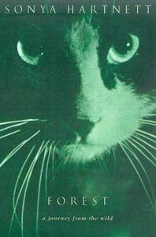{width="2.0625in"
height="3.125in"}

**Forest Sonya Hartnett**

The forest is earth and leaves, sun and shade, feather and blood and
bone. It is the old way, the true way, the wild way to live. But, for
Kian, wilderness is not home. \'Sonya Hartnett has the eye of an artist
and an ear for the rhythm of language.\'

{width="2.2916666666666665in"
height="1.5208333333333333in"}

Sonya Hartnett\'s work has won numerous Australian and international
literary prizes and has been published around the world. Uniquely, she
is acclaimed for her stories for adults, young adults and children. Her
accolades include the Commonwealth Writers\' Prize (Of A Boy), The Age
Book of the Year (Of A Boy), the Guardian Children\'s Fiction Prize
(Thursday\'s Child), the Children\'s Book Council of Australia Book of
the Year for both Older and Younger Readers (Forest, The Silver Donkey,
The Ghost\'s Child, The Midnight Zoo and The Children of the King), the
Victorian Premier\'s Literary Award (Surrender), shortlistings for the
Miles Franklin Award (for both Of a Boy and Butterfly) and the CILP
Carnegie Medal (The Midnight Zoo). Hartnett is also the first Australian
recipient of the Astrid Lindgren Memorial Award (2008).

**Forest Sonya Hartnett** (Extract p. 1 \...)

**The Marble Sky**

Inside the box they crouched, too frightened to make a sound. Through
their feet they could feel they were flying; even in blackness they
sensed the speeding hills and trees. They heard the roar of the wind
beyond the weighted lid of the box, heard the crank and thrash of the
engine and the spin of the tyres on the road. They closed their eyes as
though darkness were a dazzling thing, bowed their heads as if the
noise, every moment of it come and gone in a slick, slashing instant,
was more than their sensitive ears could bear. Above the locked-in odour
of each other they could smell smoke, grease, and oil; the box itself
tanged with the sugary scent of citrus. The eldest of them, his chest
soaked with nervousness, could not hunch into any smaller shape and so
waited, frozen tensely to his place; the siblings, still kittens, buried
themselves against him for the comfort of hearing his heart. When they
felt the car's slowing their eyes flashed open, black and full of alarm;
beneath the wheels they heard gravel crunch and grinding, stones pressed
together by the burden of the vehicle just as they themselves had been,
huddled inside the box.

When the container was lifted they slid forward, grappling at the
cardboard. The walls of the box were waxy and high but through them the
cats smelled crisp air and huge open spaces beyond. They hit the ground
heavily and the lid was pulled back and the animals found themselves
blinking at the early stars, at the marbled grey evening sky. The
littlest kitten bounded to the lip of the box and was over it and gone,
claws scarring the wax. Their confines made vast by her absence, the two
remaining cats shrank, and their paws, outstretched, found nothing to
catch; the cats sprawled across the muddy earth and the coal-black male
kitten darted into the cover of some pampas, his ears sleeked to his
skull. The bigger cat stayed where it had landed, flinching in the
grass. Through midnight eyes it watched the man, looming tall above. The
man gave off smoke, sweat, and the snaky smell of unwashed skin. The man
and the animal stared at one another, but the cat made no move: "Get,"
the man said finally, and shoved the creature with his boot. "Get."

The cat quailed, blinking, but did not run. The man swayed backward,
defied. The cat turned its eyes and, for a moment, denied the very
existence of its foe. Then the man reached out and gripped it by the
scruff, dragging the animal to him. The cat's mouth came open and it
stiffened, claws scything the dirt. The man's hand fumbled under the
cat's chin and among the twists of hair, seeking the vulnerable throat.
The cat wrenched its hind legs up and they threshed at nothing, its
forelegs flailing wildly, but from its gaping mouth came no noise. The
man hissed and snarled, forcing the animal's head upward, blinding it
with a palm. The cat felt squirming fingers at its throat and then a
sharp jerk that severed the cold flow of the air -- and suddenly it was
free again, dumped forcefully to the ground. It gathered itself against
the earth and gazed at the man, who crumpled the animal's collar and
threw it aside, the disc and bell jinkling as they fell into the weeds.
He stamped a foot and the cat cowered, squinting, groaning. "Get!" the
man bellowed; he snatched abruptly for the creature, hoisting it by the
armpits and flinging it as far as he could. The cat dived gracefully,
dancing sideways through the grass with its eyes fixed on the man.
"Get!" the man barked, kicking the box so it bucked, all angles, into
the air. "Get! Scat! Get!"

The cat could feel the heat pouring from the man, could smell the bitter
mix of frustration and rage. It stayed still as it watched the man
bundle himself into the car and the car itself, then, leap into eager
life, spinning its wheels as if bursting with impatience to be gone; it
raced out of a cloud of its own fumes, gravel stinging off its
underside. The dusty pall it left behind hung in the air for a long
while, powdering red the dull slate sky.

The pampas whispered as the hidden kitten rose to his feet. The bigger
cat shook himself, noting at once the oddness left by the missing
collar. Somewhere in his pedigree was a long-haired splendidness of coat
that had passed down to him diluted into wispiness, and his ruff
preserved a flattened ring: he had worn his collar every day of his five
and a half years. As the kitten stepped forward, lifting his paws high
from the clammy ground, the older cat sank to his haunches, wanly
terrified. He stared at a world that was not his, furling his ears
against its peculiar smell and sound. Something bumped his paw and he
scrambled back but it was only a moth stuttering a path across the dirt,
wings folded primly over stern. The black-and-white cat sagged into the
grass, his heart battering.

The kitten, however, was quickly forgetting he had ever been afraid. He
stretched his legs and yawned hugely -- the journey in the box had been
long and cramped. The car still droned on the edge of his hearing but it
was a long way off now, and easily ignored. The young cat's coat was jet
and glossless and he moved like a shade, gliding past the box and then
the collar before trotting onto the shoulder of the road and stopping on
its crest, to look about. On either side of the road was a tract of wet,
weedy, liverwort-smeared land and beyond this was wilderness, a jungle
of brake and fallen bark and embankments of rotting leaves. Rising out
of and above this were the peeling trunks of a forest of ashen trees,
the canopy a craggy scribble against the sky. Shadows and darkness
concealed its depths mysteriously; the dusk's light glazed the peaks of
huge ferns and raffish weeds. The kitten had never seen anything like
it, and he walked in circles of wonder. A scarf of darkness slipped
between the branches and flapped silently into the clouds and the kitten
watched it intently, his golden eyes swivelling in his skull. "Kian," he
said, "what's that?"

The black-and-white cat hardly dared glance up. "A bat. Jem, come here."

In response Jem feigned deafness, and stayed on the road. Kian continued
to scan the scrub, wide-eyed with shock and fear. He had never seen a
forest, but some ancestral memory assured him that the crowding of trees
with its serrated scents made up that thing, a forest. Kian had been
born and raised a suburban cat, and his life, until this evening, had
been lived amid glass and brick and steel. He had known a garden with
fruiting plants, lawns crossed by stepping stones, flowers staked neatly
in terracotta pots. A forest was not something he had ever even dreamed
of, and though his ancestors might recognize it, Kian knew with
certainty that a forest was not his home. He stared about in dismay,
whiskers quivering, coat rumpled by the strengthening breeze, and from
the corner of a lime eye he spied a gauzy shadow winnowing between the
eucalypts and knew it wasn't an animal or a phantom but the very eyes of
the forest itself, staring back at him. His blood ran cold but he made
no move, too desolate to flee: this cataclysmic day had shredded his
courage and dignity, stripping him of all desire to even breathe any
more.

The cold evening silence was rattled, suddenly, as a tiny wagtail,
evidently pushed to the brink of its tolerance, nose-dived from the
canopy chitting furiously as it came. It rushed for Jem, its minute pied
frame spearing the air. Jem ducked as it swooped him, his whiskers blown
by the slipstream. The wagtail wheeled and dived again, a flurry of
feather and sickle claw, and Jem went prostrate to the road, yowling
unhappily. Kian watched as the little bird landed beside the kitten and
hopped about in the dirt, boiling with an anger it could not give voice
to fast enough. "Grr grr!" it spluttered at the kitten. "Meiow meiow!
Cak cak! Wa wa! Aargh! Aaargh! Aaaargh!"

The wagtail clearly believed that this gabble, though nonsensical to
itself, made perfect sense to a cat: when the kitten did not react as
desired, emotion overcame the bird and it leapt into the air, shooting
like a wasp for Jem's eyes. The kitten sprang to his feet and bolted. He
scuttled past Kian, low as a lizard, the wagtail zooming through the air
behind him, and plunged blindly into the forest. The bird alighted on a
broken twig and shouted insults after him before fluffing its feathers
dismissively and turning its beady glare on Kian. "Mew," it told the
astonished cat. "Hiss hiss hiss, mew."

All birds abhor cats but Kian had rarely encountered one so recklessly
passionate about the matter; when his gaze swept the canopy, however, he
saw it shudder with an equal animosity. Cats, he realised, were known
here, and creatures hated them. He could stay among the weeds forever so
he stepped cautiously into the concealment of the forest and the wagtail
supervised his leaving, tail bobbing, muttering abuse. Jem hurried from
the shadows and as the two cats wove into the forest the kitten watched
the older cat's ears turning and shifting, saw the ivory threads of his
whiskers tremble and felt the wariness in each snowy paw, and the last
of his bravery deserted him, and he slunk along the earth.

Kian stopped at the base of a stringybark and Jem followed his gaze up
its crusted, blood-dark trunk. "Cally," Kian murmured, and without
hesitation the small kitten came down, rump-first and wriggling,
slipping at the last moment so she dropped into a hill of sodden leaves.
She stood up and shook herself before touching her nose to Jem's.
siblings, the kittens could hardly have been less alike, for dainty
Cally carried no suggestion of her robust brother's sooty hide --
instead, her coat was a patchwork of red, apricot, storm-grey and cream,
each colour leaking into the others like water in overflowed puddles.
Just the tip of her muzzle was white, as if she'd drunk too greedily
from a plate of milk, and perhaps walked through it as well, for her
paws were similarly stained. Her amber eyes were round, now, and her
ears pirouetted. She crouched beside her brother and looked uncertainly
at Kian. "What is this place?" she asked him. "Why have we come here?"

It went against his feline nature to admit to being nonplussed, so Kian
disregarded the question. Jem pinned down a leaf that was ticking in the
wind and told his sister, "The man took off Kian's collar."

It sounded ominous, and Cally pressed to the ground. Pinging and
clicking all around them were the eerie sounds of the shifting forest,
the retreat of the daytime inhabitants to secure sleeping-places, the
waking of those who rose with the moon. Bickering broke out among
roosting birds and the brief flurried commotion was followed by silence
fragile as shale. The trees and earth drew breath as one, exhaling a
ghost's frosty sigh. The breeze carried an odour that, to the cats, was
physical as the trees, streaked as it was with evidence of unknown
animals and eccentric landscapes, this spectre of scent was the most
nerve-racking aspect of their altogether awful plight. Kian knew he
could not strain his senses more vigilantly nor be more prepared to fly,
but he felt, and knew the kittens felt, hopelessly endangered and
exposed. He stared at the peeling trunks and massing ferns, daunted,
fretful for the comfort of his cemented home. "We don't belong here," he
told the kittens softly. "We have to go back where we came from."

**Forest Sonya Hartnett** (extract p.13 \...)

**Moonlit**

The kittens were young, and at every turn the world presented to them
some beguiling new wonder they had not encountered before. Anything that
moved with the faintest suggestion of life -- sunshine rippling on a
leaf, an undulating rope of caterpillars, a succession of raindrops
plipping from a height -- captivated their attention with a flawlessness
that seemed, to the more world-weary Kian, insane. But the adaptable
nature of kittenhood, which expects most things to be perplexing and so
recovers quickly from surprise, served Jem and Cally well as they
stepped through the forest after Kian. While the older cat was alert to
the very curl of his claws, the thoughts of the kittens soon began to
wander.

Many things are of grave importance to a feline, and the gravest of them
is food. The cats had not eaten since the previous afternoon, and that
meal, a sprinkle of dust-dry kibble shaken over the footpath by the man,
had been unequally shared, Kian and Jem gulping it down faster than
Cally could, and nudging her aside. The calico kitten preferred the days
when the old woman fed them, giving them each a private bowl. Picking
her way through spires of native grass the kitten murmured, \'I\'m
hungry.\'

\'Me too,\' Jem added immediately. \'Kian?\'

Kian could sense their hunger on the perimeter of his own but he only
glanced at them, and kept walking. With the passing of evening and the
arrival of night, the forest had grown quieter. Not purely quiet, for
the scrub was crowded with creatures following their moonlit destinies,
but the naturally raucous inhabitants -- the extrovert birds and
rattle-winged insects -- were now holding the monastic hushness of the
rest. Whatever was abroad in the darkness, stalking, repairing, feeding,
wooing, preferred to keep its business, if it could, to itself.
Nonetheless Kian felt surrounded, and oppressively harried by squawks
and wails of a kind he had never heard, by appalling shrieks that
lacerated the icy air, and each that skidded by him left him feeling
slightly more shredded than the last. He didn\'t know what there was
worth fearing in the forest, but it sounded hideous.

\'Kian?\'

\'. . . Yes?\'

\'Did you hear us say we\'re hungry?\'

Kian paused on the crown of a boulder, considering the stars. They shone
brightly across a pearl-grey sky, spiked as summer burrs.

\'Kian?\'

\'What?\'

\'There\'s lots of trees here.\'

\'Hmm.\' Through the spongy floor of the forest Kian could feel the
guiding song, a drone that vibrated through the pads of his paws. The
cats were walking in the furrow of a rodent\'s trail, and the tips of
overhanging fronds splashed Kian\'s nose with dew. No footstep he took
was soundless, however deft he tried to be. At the press of each paw a
leaf would fall, a stick would snap, a clod would roll away, and this
treacherous trait of the scrub was becoming a torment to him. \'It\'s a
forest, Jem.\'

\'Yeah, a forest . . . Kian?\'

\'What?\'

\'Why are there no street lights?\'

\'There just aren\'t. Shh, Jem.\'

\'It\'s very dark.\' The kitten hopped over a eucalypt\'s felled limb.
\'That\'s because there\'s no street lights. You know what else there
isn\'t?\'

\'Jem, be quiet . . .\'

\'Cally? You know what else?\'

\'What?\'

\'There\'s no aerials. And you know what else? Kian, you know what --\'

\'Quiet!\' Kian wheeled, hissing into the youngster\'s face. \'I said be
quiet!\'

And then, as if awaiting this chance to disobey, a maniacal scream
careened through the forest, stripping it as it went the leaves from the
trees; fast on its heels raced another, a wrath of rage which sent
blackbirds splintering into the air. Kian and the kittens dashed for the
shelter of a tree-fern and from beneath the umbrella of fronds they
watched a massive piebald cat swoop through the jangling canopy, howling
as it came. Its great legs launched it on soaring flights that linked
the gum trees and Cally scarcely had time to realise it was coming
straight towards her when the mottled giant changed direction -- indeed,
it threw itself skyward and for an instant was silouhetted against the
moon, a twisting, screeching sinew. It landed on the bow of a messmate,
nose to nose with a cat equally as monstrous, tawny yellow, who slammed
a paw so violently into its face that the momentum almost threw the
blotched beast from its perch. The dappled cat reared, stunned but
boxing viciously, and the tawny animal retreated, reversing agilely
along the branch. The piebald jumped after it, but stopped wisely beyond
the reach of its adversary\'s punch. For a burning moment they stared at
one another, high up in the canopy, while the woken birds flapped and
squawked and a shower of leaves whirlygigged to the forest floor.
Beneath the fern the urban cats cringed, chins against the earth. Above
them the titans glared, lips hoisted over dagger fangs. A rumble began
in the throat of the second and was caught like a birdsong by the first,
both cats so irate that they smelt vaguely smoky. Neither made a move.
Unexpectedly, one spoke: the darker told the lighter, \'Someone\'s
plucked an eye from you already -- you\'re one-eyed at both ends. Why
don\'t you let me scoop out that leftover orb? My claws are just
a-itching.\'

The yellow gladiator sniggered. \'No one took that eye from me, scrote.
I ripped it out myself when I had nothing better to do. Come here, I\'ll
show you how.\'

.

{width="3.9479166666666665in"
height="2.5625in"}

**Q & A with Sonya Hartnett**

Your first book was published at the age of 15 - how did that happen?

I had no plans to publish it but a friend of mine suggested I should
send it to a publisher, \'You\'ve got nothing to lose.\' So I looked up
\'P\' for publisher in the Yellow Pages. I was going to school in
Camberwell and I couldn\'t afford to post it very far so I narrowed my
search down to ones I could afford, which knocked out places like
Sydney.

And they were interested?

Yes, a lot of our correspondence wasn\'t preserved but I do have a draft
of the very first letter I sent them. It went on display in an
exhibition about Victorian writers in the State Library a few years ago.
I remember asking the publishers how would they like the manuscript
presented? It was already typed up on letterhead from my Dad\'s
friend\'s car-yard so it had \'Frankie\'s Car-Yard\' on every page. A
friend of my brother had thrown it on the fire so it was a bit burnt and
tatty looking. I know it went back and forth a few times between us.
They said they liked it but it needed a lot of fixing up here and there.
After about a year of working on the manuscript they agreed to publish
it.

Must have been exciting?

Well yes, it was exciting to have a first book published but it was a
gradual process. To this day there remains a part of me that just stares
in gob-smacked amazement that any of it is ever happening, even 30 years
later.

Your family and friends must have been amazed?

Some people were probably a bit surprised. At the time it wasn\'t
something that we ever really discussed. I know people were thrilled at
the time and have always been very enthusiastic.

Perhaps back then people didn\'t celebrate kid\'s achievements to the
extent they do today?

Certainly schools didn\'t - mine didn\'t take much notice of it.

Was it your dream to become a writer?

I think I did it because it was one of the rare things I felt I was
competent at. And I enjoyed doing it. I had started when I was about 9
when I realised I could not only do it, I could do it reasonably well. I
think it gave me a feeling of power in an otherwise powerless life. I
wasn\'t sporty or tall or handsome and funny. I was a nothing kind of
kid and when I discovered something I could do it was very pleasing to
me. My Grade 5 teacher read out my first ever short story and I think as
soon as she did that my fate was sealed.

But I can\'t say I really wanted to be a writer, I only wanted to do
something I wasn\'t completely hopeless at.

Where do you write?

On a laptop on my bed. On a creaky \$2 plastic table with fold-out legs.
There you go - with a cup of coffee and a steady supply of chocolate and
the animals crowding up on the bed around me. And that\'s how we do it.

I write for about three hours in the morning and that\'s about as much
as I can do.

Do you work in silence or have music on in the background?

Silence.

If you get stuck do you walk away or what do you do?

I try not to get stuck. I try to know what I\'m writing in advance so
there is no \'stuck.\' I can get stuck in the planning sometimes but
even then, my tendency is to abandon ship. I don\'t waste a lot of time
nutting something out. If it doesn\'t come easily then it tends to mean
that it\'s bad. But if say I can\'t work a sentence out then I\'ll just
fill it in as best I can. Every time I touch the manuscript I like to
get it as right as I can at that time. On the rare occasions if it\'s
being really recalcitrant I will just put it down. Say \'fine...if
you\'re in a bad mood...\' You\'ve got to treat it like a child I find.
And if it\'s misbehaving you ignore it.

What kind of books do you like to read?

I read really quite widely. Certain things I\'m not all that mad about
like science fiction. But I think it\'s important if anyone wants to be
a writer that they have a vast general knowledge and are prepared to
soak up information about everything including things that don\'t
interest you. So I\'ve read a lot of stuff over the time right down to
ads for cars in the newspaper to the history of Henry VIII\'s wives to -
right now I\'m reading the George R.R. Martin Game of Thrones series.

I have my preferences but I think you should never say \'no\' to
anything. I\'m mostly prepared to give anything a go. Right through my
childhood and even into my 20s and 30s, a lot of the time I couldn\'t
afford to buy books so I\'ve read what has come my way and it\'s been a
tradition that\'s just continued all my life.

Life outside work?

I\'m the second eldest of six. There\'re four girls and two boys. I have
a dog, a husky cross called Shilo and Morgan the diabolical Siamese. She
kind of rules, she\'s the boss. I\'m the bottom of the pack, below the
fish. I have about 47 fish in the pond in the garden. So I can spend an
awful lot of time \'maintaining\' the pond. Sometimes I wonder what on
earth I do with my time. I get up and potter around and then its
lunchtime and there\'s more pottering and so on. I like to go shopping,
I love to spend money, I\'m a great haunter of antique shops and I also
like to garden. But my main outside hobby is buying houses, fixing them
up and then selling them. And all that is associated with that.

So what number house is this?

Perhaps number 11. Every day I scan real estate.com in the hope the next
house has come up for me because I get very bored - I\'ve owned houses
where I haven\'t bothered to unpack because I know I\'m not going to
stay. Sometimes I\'ve been known to be packing up thinking about the
house I\'m going buy after the next one! I used to think I was looking
for my dream house where I would be happy forever but now I have
accepted the fact that there is no such house. I think when you work
from home you need a change of a scenery. Otherwise I just get sunk in
boredom.

What kind of childhood did you have?

I was a shy kind of kid and in some ways I still remain that kid. As
soon as the first book was published I had to get over that in a big
hurry. I think inside still I\'m still deeply unsure about everything I
say and do. And kind of like my privacy the way I did as a child. I
wasn\'t the kind of kid that liked parties or to stay overnight at other
people\'s places. I liked to be at home, left to my own devices. But
when you\'ve got 5 brothers and sisters in a small fairly impoverished
family, life is noisy and cheap. At the same time there was a great deal
of freedom. Because I was one of the elder ones and Mum was very
preoccupied with the younger kids, when I was about 10 or 11 I was well
able to roam around by myself. We were quite free children. We were
raised to be independent and I think that has seen us well through life.

Did your mother work?

Not always but she had been a nurse and when I was about 10 she went
back to work.

Your father?

He was a proof reader at the Sun Herald and I think that gave me a
lifelong love of newspapers and in some ways, the media as a whole.
Every morning you\'d get up and on the kitchen table would be a
beautiful, fresh copy of the newspaper, unread, untouched by human
hands. In retrospect it was probably read by everyone but because I was
generally up first, it always seemed the newspaper was there for me
alone.

So it\'s not surprising I found a future in words, I suppose.

Likes?

I love Siamese cats...just watching mine walk out the window into the
garden...she\'s so beautiful. I love animals. I love it when you\'re
walking along the street and something like a smell reminds you of
another time. And I love pasta.

Dislikes?

I hate cruelty whether to animals or people. I dislike lamb\'s fry. And
I dislike screaming children.

Off the Shelf : Q & A with Sonya Hartnett about her new book The
Children of the King

What is The Children of the King about?

It is about three children who are evacuated from London during the
Blitz and sent to live in Yorkshire. While there, they find two
mysterious boys living in the ruins of a castle nearby.

Is the book part ghost, part war story?

It is both those things, but it is also a historical novel and a
coming-of-age story.

Why the Blitz and WWII?

War puts people in a situation that isn\'t typical. The London blitz
must have been an incredibly demanding time in which to be alive.
Relentlessly frightening but also relentlessly challenging and
interesting.

And a shocking experience for children?

I think childhood is a powerless time anyway, but to have been a child
during the war would have been doubly disconcerting. Although at the
same time they surely became used to it and probably thought nothing of,
say, going every night to sleep in the underground. Many children would
have grown up thinking that was quite a normal thing to do.

The book has a sub-plot set in the 16th century -- was that always your
intention?

Yes. The ideal approach to a novel, I think, is to have it planned very
well before you begin. I was a little worried with this one because
although I knew I was going to combine the war story with the Richard
III story, right until the end I was very unsure how it would tie
together. But in the end it found its own way. Some books are
self-reliant and this one looked after itself.

The story of the Princes being imprisoned by their uncle, Richard III in
the Tower then disappearing is an unsolved crime?

I don\'t think it\'s unsolved. Anyone who doesn\'t think Richard killed
his nephews is kidding themselves. The evidence is circumstantial but it
is extremely strong. If he got off today it would be on a technicality.

What about the story appeals?

I\'ve been interested in the Princes for years and this is not the first
time I\'ve used them in my work. It\'s a very evocative story -- all
that money and those two children, power, murder -- it\'s dramatic and
colourful.

You paint an almost sympathetic portrait of Richard III in your book?

I do have some sympathy for Richard -- I believe he was very much a
product of his environment. I don\'t think he was an intrinsically bad
man. He was brought up to be able to do bad things.

In your re-telling of his story he is pained to realise he\'s done all
that for nought?

I\'m sure he felt a real sense of frustration and futility, and
disappointment in himself. He was smart enough and sensitive enough to
know that everything - his whole life, really - had gone terribly wrong.

I love the character Uncle Peregrine - his name is perfect for him!

(Laughing) I wasn\'t sure about the name and then I thought no, use it
with confidence and it will be all right.

When Uncle Peregrine tells the story of Richard III, the children learn
a lot about things like the corrosive nature of power, how the past
impacts on the future\... ?

And how our knowledge of history can be influenced by the input of
people who have their reasons for taking a certain position, like
Shakespeare writing 'Richard III\' under the queen-ship of Elizabeth who
was a Tudor and obviously very anti-Richard. Shakespeare\'s depiction of
Richard has coloured our view of Richard in every single way.

At the time, people were horrified by the murder of the Princes?

I am always surprised about that because this was a really bloodthirsty,
barbaric time and for a King to assassinate a couple of children seems
minor given what else was going on. Yet people were appalled by the
thought that he\'d killed them.

Maybe killing children of your own flesh and blood was the breaking
point?

As opposed to killing someone else\'s child? No, I think it had a lot to
do with the fact that the boys were the sons of what had been a very
beloved king; and also, I think people were looking for a reason to get
rid of Richard. They didn\'t like him. No matter what he did - and he
was actually a very decent king, he did good things for poor people, for
the arts, for education - the population was set against him. If he\'d
been much loved then it\'s possible people would have found a way of
excusing his treatment of the princes.

Your description of the bombing of London felt very authentic.

When you approach a big subject like that it can be overwhelming. I
tried to think along the lines of what would have an impact on me if I
was a 14 year old, as is Jeremy, the older boy in the story - how he
would have felt seeing the little things like towel railings torn from
houses and thrown over the road. You use a collection of details to
build up a picture.

Parents must have found it difficult to send their children away to the
country?

No doubt it was awful for a lot of parents but I bet they had a very
British, chin-up attitude, the overriding conviction that it was hard,
but it was for the best.

It must have been hard on the children?

Had I been an evacuee I would have died of terror, I wouldn\'t have been
able to endure it. But some kids would have accepted it, even revelled
in it. Also, we shouldn\'t confuse the mollycoddled kids of today with
the children of 70 years ago. They were a completely different species,
I suspect.

Some evacuees had bad experiences?

Some of them looked back on that time as the best years of their lives
and remained lifelong friends with the people who took them in. For
others, it was utterly awful.

Before writing did you talk to evacuees?

No. A book is not real life. It\'s a work of art. I could talk to 100
evacuees, but if their story doesn\'t fit the book\'s requirements,
it\'s a waste of time. I make sure anything I want to write is
realistically feasible, but I don\'t fit the story around reality. I fit
reality around the story.

War forces children to face some very unpleasant facts.

Of course. War is essentially about death. It is also about courage and
stoicism, but it\'s mostly about fear and loss and deprivation. You\'re
only a child once, and it\'s unfortunate for anyone to have to learn
about those things during their childhood. The kids in the novel don\'t
suffer as much as many did. Cecily has to leave her beloved father
behind in London, knowing that the city was being bombed. I tried to
imagine the constant worry and confusion she\'d endure.

Cecily is an interesting character.

Cecily very much wrote herself. I started our thinking I didn\'t like
her, but as she came alive I became very fond of her. She\'s funny and
stupid and kind.

She\'s awful one minute, lovable the next?

Cecily has been brought up in an indulgent family. Her mother is quite
cruel to her at times, but she\'s nonetheless a spoiled child and used
to getting what she wants. The world has always fallen into place for
her: Cecily wouldn\'t know any way of thinking other than if you want
something, it\'s yours and it\'s yours for as long as you want to play
with it and when you throw it away you can have something new.\' So when
she gets given a child, the evacuee, May, and discovers she\'s not
pliable, like a doll, it gets a bit ugly. Cecily\'s wealth makes her
feel superior to May and although she thinks it will give her the
upper-hand, it doesn\'t. May is smarter than Cecily, that\'s why. It\'s
brains versus brawn.

Part of your story sees the children realising their parents aren\'t
perfect?

Most particularly in Jeremy\'s relationship with his mother, yes. He
begins to think, 'Hang on a minute, you actually aren\'t as smart or as
great as I have been led to believe.\' Which is always a painful thing
for any child to realise about their parent.

His conflict with his mother is over his desire to do something to help
with the war despite only being 14 years old?

I suspect young men innately need to test themselves and war is one of
the ways they do it. If a young guy can\'t test himself in battle then
he\'s going to drive his car really fast - they have to do it. It\'s
tempting to say they\'re just foolish, thoughtless, reckless, but I
don\'t think it\'s that - I think young men have a primal drive to push
their abilities in dangerous ways.

The reader is left with the feeling there\'s a link between Peregrine
and Richard III?

Peregrine is very dark and strange; his character deliberately echoes
Richard\'s. He leaves May a locket with the portrait of Richard III in
it, as if he does have a deeper connection with the king. Cecily sees
him as Richard in that he is regal and crippled (Shakespeare wrote of
him as a cripple but he wasn\'t in reality). One of the reasons
Peregrine likes May is because she\'s open to hidden layers in the
world - to ghosts, to history. If Peregrine is in some way also Richard,
May is the one who\'ll understand that. She is the link between the
ghost world and the real world.

Cecily and Jeremy\'s father Humphrey is involved in secret war stuff?

Humphrey and Peregrine are both involved in some sort of high level
intelligence. When I called the book Children of the King I wanted there
to be many 'kings\', not just Richard, which is why Jeremy and Cecily
worship Humphrey and why they find it appalling to discover he\'s just a
tired man. But in my mind, Humphrey isn\'t the most kingly of the kings
in the book.

Who is the most kingly, then?

That would be telling.

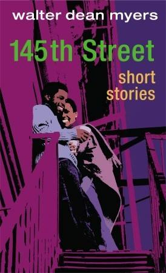{width="2.8541666666666665in"
height="4.6875in"}

A salty, wrenchingly honest collection of stories set on one block of
145th Street. We get to know the oldest resident; the cop on the beat;
fine Peaches and her girl, Squeezie; Monkeyman; and Benny, a fighter on
the way to a knockout. We meet Angela, who starts having prophetic
dreams after her father is killed; Kitty, whose love for Mack pulls him
back from the brink; and Big Joe, who wants a bang-up funeral while
he\'s still around to enjoy it. Some of these stories are private, and
some are the ones behind the headlines. In each one, characters jump off
the page and pull readers right into the mix on 1-4-5.

Literature Discussion Groups. Discuss the questions you have.

This is written with authentic voice.

What is your authentic voice of the stories of your neighbourhood?

**Monkeyman in 145^th^ Street Short Stories**

**Walter Dean Myers**

**Monkeyman**

The Tigros hit the 'hood gradually, like the turning of a season. First
we saw some tags scrawled on the wall near the Pioneer Supermarket. Then
we heard that a kid on 141^st^ Street got stabbed and they arrested a
member of a gang called Tigros.

"What's that supposed to mean?" Fee asked. "What's a Tigro, anyway?"

I didn't know. I didn't even want to talk about gangs. Some people said
-- okay, it wasn't some people, it was my uncle who runs the barbershop
-- Uncle Duke said that I had a bad attitude about Harlem.

"You're so anxious to leave you're not even giving your homeland a
chance," he said.

"Africa is my homeland," I said.

"That's the easy answer, isn't it?" he said. He was sweeping the floor
of the shop, "Like running away from the neighbourhood."

He was right, really. Fee, who is my main man, said that I had black
skin and white dreams, that all I wanted to do was to get away someplace
and be with white people.

I liked a lot of things about Harlem, especially the block, which was
how we talked about 145^th^ Street. There were good people on the block,
but what I wanted was to be more than what I saw on the block. Uncle
Duke said I could be more, but if I put Harlem out of my heart I could
end up being a lot less, too.

Yeah, well, I was ready to take my chances. What I wanted to do was to
be a doctor and have a nice crib, and a Benz, the whole nine. Then the
thing happened with Monkeyman.

Monkeyman was always quiet. He was down with the books and everything,
but he kept to himself a lot and didn't get into anybody else's
business. We used to call him Monkeyman because sometimes he would go up
to the park, climb up into a tree, and sit there and read all day. We
weren't dissing him, we just gave him the tag and he seemed to like it,
so it stuck.

Anyway, the Tigros turned out to be a new gang that were trying to build
a rep in the 'hood. They were biting all the stuff they read in the
papers about wearing colours and flashing signs and whatnot. It wasn't a
real big thing until they started terrorising stores and then they beat
up a lot of people and stabbed that one kid. After that you saw their
tag all over the place, like stabbing a lid was something to be proud
of.

What usually happens when a new gang makes the scene is they jump bad as
a posse for a while until they step too far and their leaders get
busted. Then, when they realise that their reps and tattoos and colours
don't keep them out of jail, they chill and their colours fade. But that
hadn't happened yet with the Tigros. They were still wilding and messing
with people and putting out squad tracts. A squad tract is when somebody
messes with a posse and they let everybody know they're going to kick
his butt. When the word comes down that a gang is after you it's scary,
and one of reasons I wanted to leave the area.

Okay, so here's what happened with Monkeyman and the Tigros. It started
when one of the Lady Tigros got into a beef with Peaches. The Lady
Tigros were just as bad as the dudes and one of them slapped Peaches in
the face. Peaches and the girl got into it pretty good and Peaches won
the fight. Then, on the way home, two of the lady Tigros went after
Peaches and one of them had a razor blade. Monkeyman was coming from
school and had stopped off to buy a soda on the ave. He saw the girl
trying to cut Peaches and he ran out and knocked the blade from the
girl's hand. Bingo, the fight's over because neither of those two girls
wanted to mess with Peaches without a blade and they weren't on their
turf anyway. But one of the Lady Tigros went to the same school as
Monkeyman. She went back and told the Tigros and before you knew it
everybody on the block was talking about how monkeyman was in big
trouble.

There were signs painted on the walls -- MONKEYMAN MUST DIE and
MONKEYMAN GOT TO FALL. It was all signed by the Tigros.

Uncle Duke saw Monkeyman in the barbershop and told him to lay low for a
while. Fee told him the same thing but everybody figured that Monkeyman
was going to get beat up and maybe even worse.

"You know any karate or anything?" I asked Monkeyman when I ran into him
on the corner.

"I read a book on it once," he said.

"That's not good enough," I said.

He shrugged and gave me this little grin. Okay, let me back up a little.
Monkeyman is six feet tall, maybe even six feet one, and thin. He plays
a little ball but he's not kicking hoops and he's kind of mild-looking.
He's not a lame or anything like that but he's more down with his mind
than his hands. So we worried about him.

"We need to get together and help Monkeyman," Peaches said.

"That's hip," Fee said. "It's hip to help a brother in trouble and
everything, but what you're talking about is getting a posse together to
go down with the Tigros and that's heavier than it is hip."

"We can tell the police," Peaches said.

"A guy I know went to the police when he got into trouble with a numbers
runner," I said. "The numbers runner said he was going to cut him a new
place to pee from. He went to the police and the police told him they
couldn't do anything until something happened."

"They're into cutting people," Peaches said. "That's serious."

"Yo, Peaches, I didn't know you were sweating Monkeyman," Fee said.

"Lighten up, lame," Peaches came back with her quick mouth. "Monkeyman
had the heart to help me when I needed some help. If you don't have the
heart to help him that's cool, but don't try to finesse it off like it's
no big thing."

"Ne needs a gun," Fee said. "That's the only thing they respect."

Just blow the word and I was ready to split. From a scrap in the street
the jam was jumping to nines. On the way home I tried thinking about
what Monkeyman could do. If the Tigros came on him and just beat him up
it would be cool. I mean, that was sick but it was better than being cut
or shot. And the thing was that a lot of kids were talking about being
down with gangs and trying to make themselves large by going to wack
city and offing somebody. That was the danger big-time. To me it was
like some moron jumping off a big building and styling for the camera on
the way down. They would be throwing away their life, and taking
somebody else's life for some moment they imagined would happen. This
craziness filled my nightmares. And it might have been sad but the truth
was that I was glad it was Monkeyman on the line, and not me.

Two weeks passed from the time that Monkeyman had stopped the girl from
cutting Peaches and it looked as if things might blow over without
anyone getting hurt. Then a guy called Clean entered the picture.

Ralph J. Bunche is the best school in the 'hood but every so often we
get in a guy who doesn't fit. That's what Clean was. He wasn't a big
dude, more small and wiry. He wore his pants low in hip-hop style with
about four inches of his shorts showing. You're not allowed to style
down in the school but he kept at it and the hallway teachers got on his
case. He told everyone he was from L.A. and used to run with the Crips,
but Fee peeped his school record and the dude was really from some place
in California called Lompoc.

Clean hooked up with some folks who told him about the Tigros posse.
Check this out, to get into the Tigros you either had to slash a saint
in public, meaning cut somebody who wasn't involved in nothing, just
walking down the street, or make something that was foul righteous.
According to the Tigros posse, since Monkeyman had messed with them and
that was foul, getting even with him was making it righteous.

It got around in the cafeteria that Clean was going to do up Monkeyman.
Peaches was still trying to settle things peacefully.

"Let's just go up to the dud and see if we can talk a hole in his ego or
whatever else it takes," she said. "Because I got to be watching
Monkeyman's back the same way he turned out for me."

A few other kids said they were willing to try to talk to Clean. But the
truth is that some dudes you can talk to and some you can't. In the
first place Clean was not into brain surgery. I mean, his favourite
sentence was "Huh?" Clean was in a class called ZIP. ZIP was supposed to
stand for Zoned for Individual Progress, but all the kids called it the
Underground Railroad because it was the last stop you made before you
dropped out of high school.

Okay, besides Clean not being a brainiac he was also like nine shades of
serious wack. He was kind of kid who made you wonder what his mama had
been smoking when he was in the womb. But hey, give it a shot, right?

We found him on the street, and Peaches took the first shot at Clean.
"So," she said, "there's no use in us, as young black brothers and
sisters, getting into the same violence thing that's killing us off and
messing up our dreams. If we can't respect each other, how are we going
to expect other people to respect us?"

"He messed with the Tigros so he got to be messed up!" Clean answered.

"Why?" came out of me before I could stop it.

"Because that's the way it goes!" Clean said. "He got to be messed up!"

I could see that Clean was getting off with everybody standing around
trying to cop a plea for Monkeyman. We split the session and I was still
hoping that things would blow over. For Monkeyman's sake and for
Peaches' sake, too.

The next day Clean got busted bringing a knife to school. If you bring
any kind of weapon to Bunche it means an automatic suspension and then
you have to go through the bring-in-your-parents bit to get back in.
When Mr Aumack, the principal, called the police, Clean got mad and
walked out of the school. But before he left he sent word that he'd be
waiting for Monkeyman when he got out at three-fifteen.

Three-fifteen came. When we looked out of the windows, we saw a dozen
Tigros outside. They were all wearing their black do-rags and some of
them had jackets with their tag on them.

Mr Aumack called the police again and in a few minutes the whole block
was filled with squad cars. Their lights were flashing and police were
snatching everybody wearing Tigros gear. One of the Tigros spotted
Monkeyman and got up in his face. He said, "When we catch you we'll cap
you."

"How about tomorrow night, eleven o'clock in Jackie Robinson Memorial
Park?" Monkeyman said.

"Bet!" the Tigros dude said. "Tomorrow night in the park. Be there,
sucker, and wear something that's going to look good at the autopsy."

"And bring your whole posse," Monkeyman said.

Whoa. Monkeyman had called out Tigros big-time. I grabbed his arm and we
started walking away.

If you're going to get into somebody's face you got to know they got a
mind somewhere behind their eyebrows. Then maybe they'll do some heavy
thinking and settle for a chill pill.

"What are you doing, Monkeyman?" I asked.

"What's got to be done," Monkeyman said. "Just what's got to be done."

The word bounced around: Be in the park to catch the go-down at eleven.
Some kids said they didn't want any part of it.

"Let's kidnap Monkeyman," Fee said. "He don't show and nothing can
happen."

It was all gums and teeth because nobody really knew what to do. I was
all for dropping a dime to 911 but everyone else said no.

"I'm going to be at the park," Peaches said.

Fee said he would be, too. So did Tommy Collins, Debbie, LaToya, Jamie,
and me. I didn't want to show, but Peaches made it clear that anybody
that didn't would be punking out.

We hadn't seen Monkeyman all day and rumours were that he had left town.

"Maybe he'll show at the last minute with an Uzi and start blowing away
all the Tigros," LaToya said.

Nobody said anything when we headed up the hill to the park. I wondered
if everybody else could hear their heart beating. I was wearing my
sneakers, ready to run if I had to.

When we got to the park there were maybe twenty-five guys in their
Tigros gear and ten girls.

My knees got real loose and I was having trouble swallowing.

"Where's Monkeyman?" Clean asked. He was wearing a heavy jacket and had
his hands in his pockets. "Where Monkeyman?"

"We thought he was here," Fee said. I noticed Fee's voice was kind of
high.

We waited for another ten or fifteen minutes with all the Tigros posse
calling us suckers and stuff like that. I was hoping they didn't turn on
us.

"Yo, here he come now!" A girl pointed towards the uptown side of the
park. "Who he got with him?"

I turned and I saw Monkeyman coming down the street. He had a man and a
woman with him. The man looked old. Monkeyman brought them right over to
where we were and I recognised his grandfather. I didn't know the woman.

"Hey, this is my grandfather," Monkeyman said. "His name is Mr Nesbitt.
And this is my godmother, Sister Smith."

"What you bring them for?" Clean said, edging closer to Monkeyman.

"They came to see you mess me up!" Monkeyman said.

He took off his jacket as if he meant to fight Clean. For a moment I
thought maybe it would be a fair fight. But then Monkeyman took off his
shirt and jsut stood there in his bare skin and held his hands out and
his head to one side.

Clean didn't know what was happening. He looked around.

"Kick his butt!" one of the Tigros called out. "Waste him!"

Clean took his hands out of his pockets and started circling Monkeyman,
but Monkeyman didn't move. Clean hit him in the back of his head and he
didn't say nothing.

"Please don't do that, boy," Monkeyman's grandfather said. "He made us
promise not to help him, but please don't do that."

"We'll kick your butt, too," a girl said.

Everybody turned and looked at her and she held out her chin like she
didn't even care. But she didn't say anything else.

Monkeyman's godmother was praying.

It was dark but there was a moon out and the park lights were on. More
people came into the park to see what was going on. What they saw was
Monkeyman standing with his arms outstretched and Clean hitting him. He
hit him in the face a couple of times and an old man asked, "What's
going on?"

"That's the Tigros gang," Fee said. "They're beating up Monkeyman
because he stopped one of their girls from slashing somebody in the
face."

"I ought to kill you!" Clean shouted.

"They just waiting for the police to come," another Tigros guy said.

It grew quiet. There had to be fifty people watching now, watching Clean
stand in front of Monkeyman, not knowing what to do, watching the rest
of the gang not knowing where to take it, watching Monkeyman with his
arms still out from his sides, his nose bleeding, his body quivering
from the pain and from the growing cold. The high streetlamps outside
the park cast a pale glare on Monkeyman's dark skin. The shadow on the
ground, of Monkeyman's body being offered up for a beating, was long and
thin and disappeared into the shifting knot of people watching.

"That's what's wrong with the neighbourhood now," a man said. "We got it
hard enough without this kind of thing."

"He ain't nothing but a punk." A short, squat guy stepped out from the
Tigros group. "If he don't fight he a punk!"

"I ain't even going to waste my time on him," Clean said. "If I was back
in the Crips I wouldn't even waste my time on no punk."

The Tigros were outnumbered now, and began drifting off. When they got
down to the last five or so someone yelled that the cops were coming and
they all ran.

Monkeyman put on his shirt. His grandfather put his arm around him and
they started out of the park. The wind picked up a little and I began to
shiver. Around me others were slowly starting to move and I pulled my
jacket shut and started home.

I saw Monkeyman two days later.

"You were wrong,' I said. "You took a chance and you could have been
killed."

"I was hurt," Monkeyman said. "I was hurt but they were wrong, not me."

"What if they had killed you?" I said.

He just looked at me. "I know," he said. "I know."

He said with a sadness that just got all into me. He had been looking
down but now Monkeyman looked up, right into my eyes, as if he expected
me to say something that was right for the moment. I couldn't think of
anything.

"Yo, Monkeyman, what did you think was going to happen that night?" I
asked.

"I just thought that some people were going to show wrong, and some
others were going to show right," he said. "No matter what happened to
me, everybody was going to know the difference."

I couldn't see it. I wouldn't have let them beat on me like that. What I
would have done I don't know.

It didn't end there. Three weeks later another guy in the Tigros stabbed
Monkeyman in the back. Monkeyman was in the hospital for three weeks,
hanging on between life and death, but finally he made it.

The guy who stabbed Monkeyman had been arrested before for possession of
drugs and was on parole. They gave him ten to fifteen years for
attempted murder. So Monkeyman got hurt and the guy that hurt him would
be in jail until he wan't a kid anymore.

It was all so scary. All so sad.

I went to visit Monkeyman in the hospital. We talked about what was
going on in school, and what was going on around the 'hood.

"Man, I can't wait to go to college," I said. "I need to put some
serious distance between me and 145^th^ Street. How about you?"

"I got accepted at an art school in Pittsburgh," he said. "When I get
finished I'll probably come back and open a studio or something. How
about you?"

"I don't know," I said. "When I get to be a doctor maybe I'll come back
and take care of guys like you."

Monkeyman grinned.

When I left I looked back over everything that had happened. What he did
in the park wasn't smart. As a matter of fact it was dumb. Maybe. But as
Peaches always said, when you have a friend like Monkeyman, somebody has
to watch his back. I thought about what had happened in the park for
months afterwards. That night in the park Monkeyman had seemed so small,
but now, in my mind and in my heart, he has grown. Yeah, Monkeyman.

**To This Day Shane Koyczan**

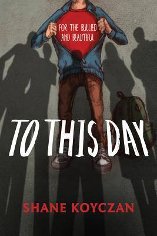{width="2.78125in"
height="4.166666666666667in"}

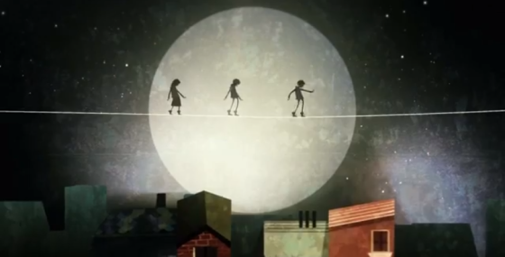{width="5.833333333333333in"
height="2.96875in"}

{width="6.268055555555556in"
height="3.369080271216098in"}

**\**

**To This Day by Shane Koyczan**

To This Day

When I was a kid

I used to think that pork chops and karate chops

were the same thing

I thought they were both pork chops

and because my grandmother thought it was cute

and because they were my favourite

she let me keep doing it

not really a big deal

one day

before I realised fat kids are not designed to climb trees

I fell out of a tree

and bruised the right side of my body

I didn't want to tell my grandmother about it

because I was afraid I'd get in trouble

for playing somewhere that I shouldn't have been

a few days later the gym teacher noticed the bruise

and I got sent to the principal's office

from there I was sent to another small room

with a really nice lady

who asked me all kinds of questions

about my life at home

I saw no reason to lie

as far as I was concerned

life was pretty good

I told her "whenever I'm sad

my grandmother gives me karate chops"

this led to a full scale investigation

and I was removed from the house for three days

until they finally decided to ask how I got the bruises

news of this silly little story quickly spread through the school

and I earned my first nickname

pork chop

to this day

I hate pork chops

I'm not the only kid

who grew up this way

surrounded by people who used to say

that rhyme about sticks and stones

as if broken bones

hurt more than the names we got called

and we got called them all

so we grew up believing no one

would ever fall in love with us

that we'd be lonely forever

that we'd never meet someone

to make us feel like the sun

was something they built for us

in their tool shed

so broken heart strings bled the blues

as we tried to empty ourselves

so we would feel nothing

don't tell me that hurts less than a broken bone

that an ingrown life

is something surgeons can cut away

that there's no way for it to metastasise

it does

she was eight years old

our first day of grade three

when she got called ugly

we both got moved to the back of the class

so we would stop get bombarded by spit balls

but the school halls were a battleground

where we found ourselves outnumbered day after wretched day

we used to stay inside for recess

because outside was worse

outside we'd have to rehearse running away

or learn to stay still like statues giving no clues that we were there

in grade five they taped a sign to her desk

that read beware of dog

to this day

despite a loving husband

she doesn't think she's beautiful

because of a birthmark

that takes up a little less than half of her face

kids used to say she looks like a wrong answer

that someone tried to erase

but couldn't quite get the job done

and they'll never understand

that she's raising two kids

whose definition of beauty

begins with the word mom

because they see her heart

before they see her skin

that she's only ever always been amazing

he

was a broken branch

grafted onto a different family tree

adopted

but not because his parents opted for a different destiny

he was three when he became a mixed drink

of one part left alone

and two parts tragedy

started therapy in 8th grade

had a personality made up of tests and pills

lived like the uphills were mountains

and the downhills were cliffs

four fifths suicidal

a tidal wave of anti depressants

and an adolescence of being called popper

one part because of the pills

and ninety nine parts because of the cruelty

he tried to kill himself in grade ten

when a kid who still had his mom and dad

had the audacity to tell him "get over it" as if depression

is something that can be remedied

by any of the contents found in a first aid kit

to this day

he is a stick on TNT lit from both ends

could describe to you in detail the way the sky bends

in the moments before it's about to fall

and despite an army of friends

who all call him an inspiration

he remains a conversation piece between people

who can't understand

sometimes becoming drug free

has less to do with addiction

and more to do with sanity

we weren't the only kids who grew up this way

to this day

kids are still being called names

the classics were

hey stupid

hey spaz

seems like each school has an arsenal of names

getting updated every year

and if a kid breaks in a school

and no one around chooses to hear

do they make a sound?

are they just the background noise

of a soundtrack stuck on repeat

when people say things like

kids can be cruel?

every school was a big top circus tent

and the pecking order went

from acrobats to lion tamers

from clowns to carnies

all of these were miles ahead of who we were

we were freaks

lobster claw boys and bearded ladies

oddities

juggling depression and loneliness playing solitaire spin the bottle

trying to kiss the wounded parts of ourselves and heal

but at night

while the others slept

we kept walking the tightrope

it was practice

and yeah

some of us fell

but I want to tell them

that all of this shit

is just debris

leftover when we finally decide to smash all the things we thought

we used to be

and if you can't see anything beautiful about yourself

get a better mirror

look a little closer

stare a little longer

because there's something inside you

that made you keep trying

despite everyone who told you to quit

you built a cast around your broken heart

and signed it yourself

you signed it

"they were wrong"

because maybe you didn't belong to a group or a click

maybe they decided to pick you last for basketball or everything

maybe you used to bring bruises and broken teeth

to show and tell but never told

because how can you hold your ground

if everyone around you wants to bury you beneath it

you have to believe that they were wrong

they have to be wrong

why else would we still be here?

we grew up learning to cheer on the underdog

because we see ourselves in them

we stem from a root planted in the belief

that we are not what we were called we are not abandoned cars stalled
out and sitting empty on a highway

and if in some way we are

don't worry

we only got out to walk and get gas

we are graduating members from the class of

fuck off we made it

not the faded echoes of voices crying out

names will never hurt me

of course

they did

but our lives will only ever always

continue to be

a balancing act

that has less to do with pain

and more to do with beauty.

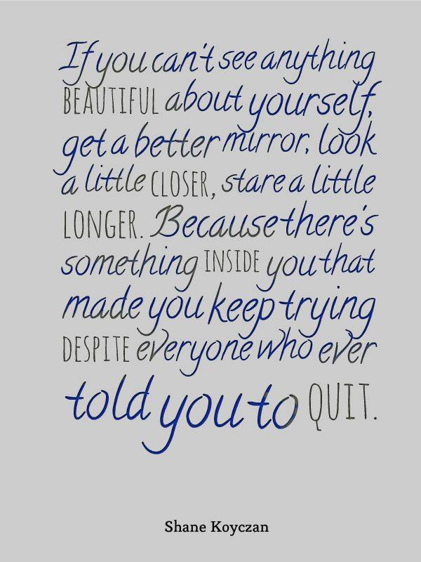{width="6.25in"
height="8.333333333333334in"}

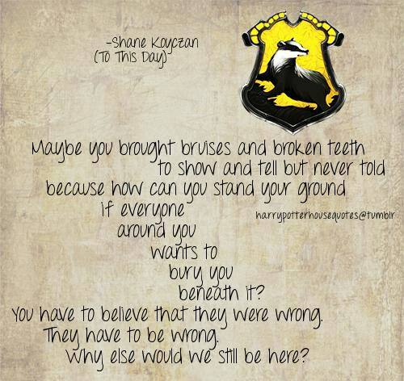{width="5.208333333333333in"
height="4.916666666666667in"}

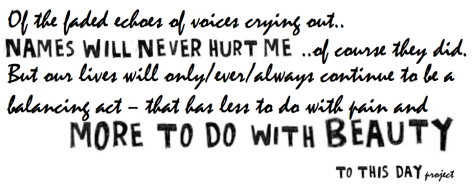{width="4.916666666666667in"
height="1.9479166666666667in"}

**To This Day by Shane Koyczan •**

Lesson Plan prepared by Marla Conn, MS Ed.

Genre: Poetry

Themes: Anti-bullying

To This Day

Born of the author's own experiences as a child, this extraordinary poem
expresses not only the devastating effects of bullying, but also the
strength and inner resources that allow people to move beyond the names
they're called. Originally an animated video, To This Day went viral,
racking up over 13 million hits. Now this remarkable poem has been
adapted into a moving and visually arresting book with illustrations by
thirty different artists. Each page is a vibrant collage of words and
images that will resonate with anyone who has experienced bullying,
whether as a victim, observer, or participant.

Bullying has become a HUGE problem in schools, neighbourhoods, and
communities all over the world.

Statistics tell us that 1 in every 3 students will be bullied, 1 in 3
students bully someone, and 9 out of 10 students have been bystanders.
The fact is that EVERYONE involved in bullying is hurt by it.

Did you know that there is actually a day designated for anti-bullying
awareness?

Anti-Bullying Day (a.k.a. Pink Shirt Day) originated in Canada and is
best known in North America. It takes place on the last Wednesday of
February or the second Thursday in September. It originally started as a
protest against a bullying incident at Central Kings Rural High School
in Nova Scotia, when a grade nine student, Charles McNeill, arrived at
school wearing a pink shirt. On Anti-Bullying Day, many of those who
participate wear pink to symbolise a stand against bullying.

**Before Reading**

*The following speaking and listening skills will ensure that students
engage in a range of meaningful, collaborative discussions that allow
them to demonstrate the ability to initiate, participate, propel, and
respond to topics, ideas, and texts.*

• Initiate and participate effectively in a range of collaborative
discussions (one-on-one, in groups, and teacher-led) with diverse
partners on middle- and high-school topics, texts, and issues, building
on others' ideas and expressing their own clearly and persuasively.

• Come to discussions prepared, having read and researched material
under study; explicitly draw on that preparation by referring to
evidence from texts and other research on the topic or issue to
stimulate a thoughtful, well-reasoned exchange of ideas.

• Propel conversations by posing and responding to questions that probe
reasoning and evidence; ensure a hearing for a full range of positions
on a topic or issue; clarify, verify, or challenge ideas and
conclusions; promote divergent and creative perspectives.

• Respond thoughtfully to diverse perspectives; synthesize comments,
claims, and evidence made on all sides of an issue; resolve
contradictions when possible; determine what additional information or
research is required to deepen the investigation or complete the task.

1\. Have each student look at the questions, reflect, and discuss in
small groups.

• Bullying/harassment occurs within our school community.

• I have personally witnessed, perpetrated, or been a target of bullying
involving

members of our school community.

• Students who are, or who are perceived to be,
\_\_\_\_\_\_\_\_\_\_\_\_, are targets of bullying at our school.

• I understand what it feels like to be ridiculed, harassed, or hurt
because of who I am.

• I believe that the student body at this school has the power to do
something about bullying.

• I believe that adults, including parents, teachers, coaches,
counsellors, and administrators at this school have the power to do
something about bullying.

• What would you do if you saw or heard someone being bullied?

• If I had the chance to talk privately to the person being bullied, I
would tell

him/her\_\_\_\_\_\_\_\_\_\_\_\_\_\_\_.

• What are good strategies for dealing with feelings of hurt and
despair?

2\. Discuss: Shane Koyczan wrote, "Writing was a way of escaping my real
life, a way to cope with cruelty and indifference." Describe other ways
that people use to cope with hurt.

3\. What is a spoken word poem? Define the characteristics: use of
concrete language, repetition, rhyme, attitude, persona, performance,
memorisation.

4\. How do spoken word poems help us understand what the author is
trying to convey?

5\. How does an author's background influence his writing?

6\. How does the author's point of view contribute to the authenticity
of the poem?

**During Reading**

7\. Shane Koyczan made a point to write this book for "the bullied and
beautiful." What do you think he meant by that?

8\. Evaluate how the author uses the following poetic devices in To This
Day. Find examples from the poem.

• Use of concrete language

• Repetition

• Rhyme

• Attitude

• Persona

• Performance

• Memorisation

9\. Analyse how the illustrations contribute to the author's message and
the overall effect he wishes to create. Give examples of how they convey
meaning, feeling, and attitude.

10\. How do Koyczan and the illustrators use symbols to represent
objects and concepts?

11\. How is the theme reflected through the character's behaviour and
events?

*The following language and vocabulary skills ensure that students will
be able to determine the meaning of words and phrases as they are used
in text, including figurative and connotative meaning.*

*They will also be able to analyse the impact of specific word choices
on meaning and tone.*

• Demonstrate understanding of figurative language, word relationships,
and nuances in word meanings.

• Interpret figures of speech in context and analyse their role in the
text.

• Analyse nuances in the meaning of words with similar denotations.

• Apply knowledge of language to understand how language functions in
different contexts, to make effective choices for meaning or style, and
to comprehend more fully when reading or listening.

12\. Give examples of how Koyczan uses figurative language to enhance
meaning and tone.

**After Reading**

*The following literacy skills help students integrate knowledge and
ideas, comparing and analysing multiple versions of a poem presented in
many different artistic mediums and media formats.*

• Integrate multiple sources of information presented in diverse formats
and media in order to make informed decisions and solve problems;
evaluating the credibility and accuracy of each source and noting any
discrepancies among the data.

• Analyse multiple interpretations of a story, drama, or poem (e.g.,
recorded or live production of a play or recorded novel or poetry),
evaluating how each version interprets the source text.

13\. Research the various videos, TV broadcasts (TED Talks), and music
associated with To This Day.

14\. How do the video/music interpretations compare to the written text?

15\. After watching the video, evaluate how Shane Koyczan uses posture,
eye contact, projection, enunciation, facial expression, and gestures
during his performances. How do these affect his message?

16\. After reading the poem, why do you think Shayne Koyczan wrote To
This Day?

**Personal Response**

*The following writing skills enable students to communicate experiences
in an organised, engaging way using narrative techniques.*

• Write narratives to develop real or imagined experiences or events
using effective technique, well-chosen details, and well-structured
event sequences.

• Engage and orient the reader by setting out a problem, situation, or
observation and its significance, establishing one or multiple point(s)
of view, and introducing a narrator and/or characters; create a smooth
progression of experiences or events.

• Use narrative techniques, such as dialogue, pacing, description,
reflection, and multiple plot lines, to develop experiences, events,
and/or characters.

• Use a variety of techniques to sequence events so that they build on
one another to create a coherent whole and a particular tone and
outcome.

• Use precise words and phrases, telling details, and sensory language
to convey a vivid picture of the experiences, events, setting, and/or
characters.

• Provide a conclusion that follows from and reflects on what is
experienced, observed, or resolved over the course of the narrative.

17\. Create a "spoken word poem" in response to Shayne Koyczan's
message.

18\. How did Koyczan's attitude toward the topic translate into your
attitude? Did it have an impact on your value system?

19\. Write down your thoughts about bullying/harassment and the climate
of acceptance and tolerance at our school. What do you think teachers
and administrators need to know? What do you think your fellow
classmates need to know?

20\. Work with peers to promote civil, democratic discussions and
decision-making; set clear goals and deadlines, and establish individual
roles as needed. Discuss what makes people feel connected. What can a
community achieve that individuals cannot?

21\. Create an anti-bullying campaign.

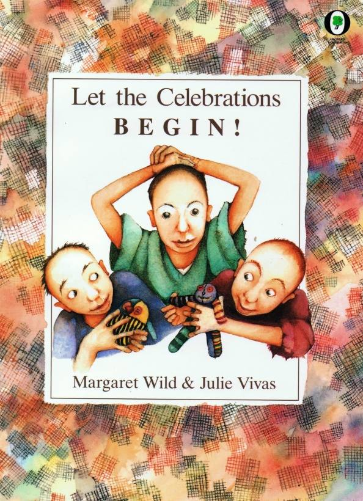{width="2.701314523184602in"
height="3.7291666666666665in"}

**Let the Celebrations BEGIN!**

Written by Margaret Wild

Illustrated by Julie Vivas

*The optimistic voice of children is what may strike you as you read
this book. Tough they are harboured in a Nazi concentration camp where
survival is an everyday struggle, the children make toys out of the bits
of life they find around them -- old yarn, rags, thread, remembrances of
their old lives. They understand, with an intuition that only children
have, that liberation is near and a return to life is just around the
corner. The children tell about and celebrate their dreams of a new life
as they spend their last days in the camp. This is a poignant text that
speaks honestly from the first word to the last.*

*Ruth Culham*

Aim: Creating meaning -- gaining information.

Discussion: Before, during and after reading.

Before Reading

- What does the cover tell us about the possibilities in the story?

  - People (haircuts)

  - Clothes

  - Toys

Or

List what you see on the front cover. Write several sentences about your
thoughts.

- Introduction: Genre- explanation

> *"A small collection of stuffed toys has been preserved which were
> made by Polish women in Belsen for the first children's party held
> after the liberation."*
>
> What further information does the illustration on the introduction
> page give?
>
> Why has the author used the explanation genre?
>
> \- retelling historical events.
>
> Clarifying -- Belsen

- concentration camp

- liberation

> (Research or teacher/pupil information)
>
> During/After Reading

- List questions you have.

- Look closely at the pictures

If students are reading the story independently they can write their
questions on post-its or in their Literature Response Journals.

- Discussion in groups or whole class.

Discuss the use of the three genres used in the book.

- Explanation in introduction.

- Narrative in present tense.

- Personal recount in past tense.

Why has the author done this?

How do the illustrations help the story?

Discuss the theme of the story.

Retell the story from the perspective of old Jacoba.

Compare this book to *Rose Blanche*.

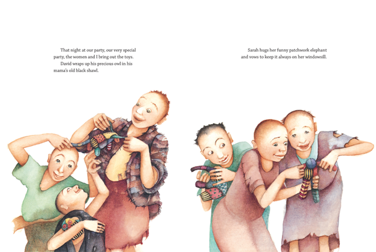{width="6.268055555555556in"
height="4.205662729658792in"}

**Let the Celebrations BEGIN! Margaret Wild**

***A small collection of stuffed toys has been preserved which were made
by Polish women in Belsen for the first children's party held after the
liberation. From Antique Toys and their Background by G.White***

**We are planning a party, a very special party, the women and I. My
name is Miriam, and this is where I live. Hut 18, bed 22.**

**This is my best friend, Sarah, and this is David. He is only four. See
him there in the corner with his mama's old black shawl. See his hungry
eyes and his legs. His legs! The chickens running in our yard were
fatter.**

**Chickens! It is years since I chewed on a chicken leg. Back then, I
didn't like the skin or fat. Now I would gobble it all up -- skin, fat
and bones. I would lick the plate and pull the wishbone and make sure
David had second helpings, third helpings, fourth helpings of
everything!**

**Sarah and David say to me, "Tell us again, Miriam, tell us about your
teddy bear with the squeak in the middle. Tell us about your doll that
has eyes that blink. Tell us about your soft pink elephant that sits on
the windowsill, and the owl that swings from the ceiling."**

**So I tell them. Sarah stares at me, and David hugs his mama's old
black shawl, and I run away to be on my own, because I know Sarah and
David want a toy more than anything else in the world. And in this place
there are no toys.**

**That is why we are planning a party, a very special party, the women
and I. When the soldiers come to set us free- and they are coming soon,
everyone says so! -- they will open the gates. And for dinner we will
cook chickens -- chickens for everyone! -- and each child in the hut
will get a toy. A toy of their own.**

**We are making the toys now, the women and I. We are collecting bits
and pieces. Scraps pf material, rags, tiny strands of thread, wool,
anything. And we shall make toys -- incredible toys! -- the women and
I.**

**Old Jacoba says we are mad. 'Why do you worry about toys?" she scolds.
"We are starving, *dummkopfs*. It is food we need, not your foolish
toys."**

**But we laugh at her, the women and I. And we go on begging buttons and
torn pockets, because there is nothing we can do about the food. There
*is* no food. But we can make toys. And we shall. In the end, old Jacoba
gives us the back of her jumper and goes off grumbling that it will be
our fault if she gets rheumatism in her back this winter.**

**But we shrug and smile because we know we won't still be in the camp
this winter. The soldiers are coming soon -- everyone says so! -- and we
must be ready, the women and I, for our party, our very special party.**

**We are cutting and sewing, all of us, every night while the guards
sleep. Even old Jacoba is helping. She has given us the right sleeve of
her jumoer, and she says it will be our fault -- oh yes! -- if she gets
rheumatism in her right arm this winter.**

**But we still don't have enough material! So now we are cutting up our
own clothes. My skirt is getting shorter and shorter. David is puzzled.
He thinks my legs are growing longer and longer, remarkably fast.**

**Sarah scowls. She knows we have a secret, the women and I, and she
says she hates me, she will never speak to me again. But I can't tell
her, not yet, not until I have finished making her an elephant that will
one day sit on the windowsill of her new home...**

**They are here! Everyone, everyone, the soldiers are here! See their
guns and their tanks and the big gates swinging open!**

**David peeps at the soldiers through his mama's old black shawl, and
the soldiers stare back at us, oh, so strangely, making soft noises in
their throats. They seem afraid to touch us -- it's as if they think we
might break. Then old Jacoba shuffles forward and demands a cooked
chicken -- all to herself! -- and the soldiers laugh and one of them
swings David up onto his shoulders.**

**That night at our party, our very special party, the women and I bring
out the toys.**

**David wraps up his special owl in his mama's old black shawl. Sarah
hugs her funny patchwork elephant and vows to keep it always on her
windowsill. And old Jacoba tells everyone, very loudly, that she donated
her whole jumper -- yes! -- the back of it, the front, and both sleeves,
so that these dear children could have toys.**

**The women and I wink at one another and pass old Jacoba another
helping of chicken soup -- and so the celebrations begin!**

***Suddenly...we heard the sound of rolling tanks. We were convinced
that the Germans were about to blow up the camp. But then...we heard a
loud voice say in German: "Hello, hello, you are free! We are British
soldiers, and we came to liberate you!"***

***We ran out of the barracks and saw...a British army car with a
loudspeaker on top going through the camp and repeating the same message
over and over again. Within minutes, hundreds of women stopped the car,
screaming, laughing, and crying, and the British soldier was crying with
us.***

***Recollection of Dr Hadassah Rosensaft***

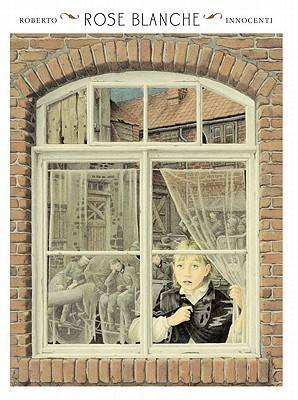{width="3.1041666666666665in"
height="4.166666666666667in"}

Text: Ian McEwan Illustrations: Roberto Innocenti

A young German girl watches as the streets of her town fill with
soldiers and tanks. Then, one day, she follows a truck into the woods
and discovers a terrible secret.

How true is the story of Rose Blanche?

While Rose Blanche is a fictional character within a fictional story,
Roberto Innocenti was very careful to use accurate historical detail in
his illustrations. The activities aim to guide pupils towards the
conclusion that although the story itself is untrue, the events, places
and characters it depicts are firmly rooted in historical reality giving
it \"a ring of truth\" as a work of fiction.

Rose Blanche was the name of a group of young German citizens who, at
their peril, protested against the war. Like them, Rose observes all the
changes going on around her which others choose to ignore. She watches
as the streets of her small German town fill with soldiers. One day she
sees a little boy escaping from the back of a truck, only to be captured
by the mayor and shoved back into it. Rose follows the truck to a
desolate place out of town, where she discovers many other children,
staring hungrily from behind an electric barbed wire fence. She starts
bringing the children food, instinctively sensing the need for secrecy,
even with her mother. Until the tide of the war turns and soldiers in
different uniforms stream in from the East, and Rose and the imprisoned
children disappear\...

{width="6.268055555555556in"
height="7.301438101487314in"}

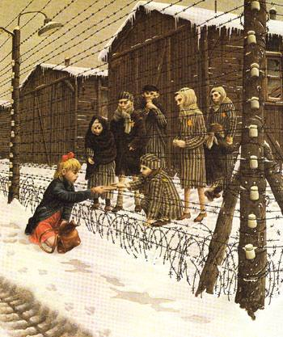{width="3.6458333333333335in"
height="4.34375in"}

Inferring:

What do you think happened to Rose Blanche?

Could you do what Rose Blanche did?

{width="3.09375in"
height="3.3333333333333335in"}

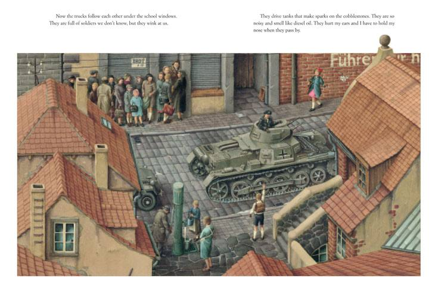{width="6.268055555555556in"
height="4.17870406824147in"}

Oddly, Roberto Innocenti, the illustrator\'s name is written before the
much famous Ian McEwan (at least for the English audience). It goes to
show the importance of the illustrations in this book. Roberto
Innocenti\'s illustrations are magical. The war is distant and the only
pictures of war that we see are how Rose views them. The illustration
(the centre spread) where Rose lays her eyes on a group of kids in
striped pyjamas interred behind barbed wires with Star of David
prominently displayed is poignant. There is no life in the eyes of kids
behind the barbed wires and their eyes are marked with just simple dark
spots.

There is another illustration that shows Rose crossing over a bricked
bridge with reflections in the water below. It sounds straightforward so
far, but something is unsettling about the whole scenery. It becomes
more clear when we watch more closely the reflection in the water -
presence of barbed wires in the water. Where did this reflection come
from? Is it something hanging around the village that no one has cared
to notice? Does it illustrate the fate of the girl or does it illustrate
the dangers that she is going to face?

**Rose Blanche by Roberto Innocenti**

My name is Rose Blanche. I live in a small town in Germany with narrow
streets, old fountains and tall houses with pigeons on the roofs. One
day the first truck arrived and many men left. They were dressed as
soldiers. Winter was beginning.

Now the trucks follow each other under the school windows. They are full
of soldiers we don't know, but they wink at us. They drive tanks that
make sparks on the cobblestones. They are so noisy and smell like diesel
oil. They hurt my ears and I have to hold my nose when they pass by.

Sometimes it seems things haven't really changed. But my mother wants me
to be careful crossing the street between all the trucks. She says
soldiers won't slow down. Lot of times I walk by the river, just looking
at it. Branches float along and sometimes old, broken toys. I like the
colour of the river. It looks like the sky.

The trucks are fun to watch. We stand in the doorway as they pass. We
don't know where they're going. But we think they're going someplace on
the other side of the river. One day one of them stopped so the soldiers
could repair the engine. A little boy jumped from the back of the truck
and tried to run away. But the mayor was standing there in the middle of
the street.

He grabbed the little boy by the collar and brought him back to the
truck. Then he smiled at the soldiers without speaking. And they thanked
him. The sky was grey. The soldiers climbed back into the truck; door
banged shut and it pulled away. It happened very fast.

I wanted to know where the little boy went. So I watched the truck until
it disappeared around the corner. The street was crowded. Kids were
playing. There were bicycles and farmer's tractors all over. It was
noisy just like every day when school is out. But I walked on the
sidewalk ignoring everyone-and no one saw me.

I walked for a long time, past the edge of town into the open fields,
where I had never been. The clouds were grey. Everything was frozen.
Sometimes I ran. I followed the tracks into the forest and found a
clearing.

Suddenly, electric barbed wire stopped me. Behind it there were some
children standing still. I didn't know any of them. The youngest said
they were hungry. Since I had a piece of bread, I carefully handed it to
them through the pointed wires. They all stood in front of long wooden
houses. The sun was setting behind the hills. It was windy. I was cold.

Weeks passed by in the pale winter. Rose Blanche's appetite surprised
her mother: she took more to school than she ate at home. All the bread
and butter she could carry; even more jam and apples from the cellar.
Rose Blanche was getting thinner. In town, only the mayor was staying
fat. Everyone watched everyone else. Rose Blanche hid her food in her
school bag and sneaked out of school early.

By now she knew the road by heart. There were more children by the
wooden houses, and they were also getting thinner behind the barbed wire
fence. Some of them had a star pinned on their shirts. It was bright
yellow. When the snow melted and the streets were very muddy, the trucks
full of weary soldiers drove only at night. This time in the other
direction. They were coming with no lights on from the far side of the
river, and they never stopped.

One morning all the people of the town fled, carrying pots and burlap
bags and chairs. There were soldiers among them. Some had torn uniforms.
Some were limping. Some were in pain and asking for water. Rose Blanche
disappeared that day. She had walked into the forest again.

Fog had erased the road. Rose Blanche was hopping around the mud puddles
to keep her shoes clean. In the middle of the woods, the clearing had
changed. It was empty. Rose Blanche dropped her school bag full of food.
She stood still. Shadows were moving between the trees. It was hard to
see them. Soldiers saw the enemy everywhere. There was a shot.

At that moment in town, some other soldiers arrived. Their trucks and
their tanks were also noisy, and they smelt like diesel oil. But their
uniforms were a different colour. And they spoke a different language.

Rose Blanche's mother waited a long time for her little girl. The
crocuses finally sprang up from the ground. The river swelled and
overflowed its banks. Trees were green and full of birds. Spring sang.

**Rose Blanche Ian McEwan**

When wars begin people often cheer. The sadness comes later. The men
from the town went off to fight for Germany. Rose Blanche and her mother
joined the crowds and waved them good-bye. A marching band played,
everyone cheered, and the fat mayor made a boring speech.

There were jokes and songs and old men shouted advice to the young
soldiers. Rose Blanche was shivering with excitement. But her mother
said it was cold. Winter was coming.

Then there were lorries grinding through the narrow streets day and
night, and lumbering tanks made sparks on the cobblestones. The noise
was fantastic. The soldiers in the lorries sang songs. They smiled and
winked at the children as if they were old friends. The children always
waved back.

Rose Blanche often went shopping for her mother. There were long queues
outside the shops, but no one grumbled. Everybody knew that food was
needed for the soldiers who were always hungry.

Many things did not change at all. Rose Blanche still played with her
friends. She did her homework after supper and went to school early in
the morning with her lunch in her satchel.

And when school was over, she walked her favourite way home, along the
river. At home her mother was always waiting for her with a hot drink.

Nobody knew where all the lorries were going. But people in the town
talked about them. Some said they were going to a place just outside the
town.

One day a lorry broke down. Rose Blanche saw two soldiers trying to
repair the engine. Suddenly a little boy leapt from the back of the
lorry and ran down the street.

A soldier shouted, "Stop or I'll shoot!"

The boy ran straight into the arms of the fat mayor.

The mayor was immensely pleased with himself. He dragged the boy by the
scruff of the neck back to the lorry.

One of the soldiers was furious and shouted at the boy who burst into
tears. The boy was thrown back into the lorry. Rose Blanche saw other
pale faces in the gloom, when the door banged shut and the lorry drove
away in a cloud of diesel fumes.

Rose Blanche was furious at the way they had treated the little boy.
Where were they taking him? She followed the lorry right through the
town. She was a fast runner; she knew all the short-cuts. Winding
streets forced the lorry to go slowly.

She ran along rutted tracks, across fields, over ditches and frozen
puddles. She climbed under fences and barriers in places she wasn't
meant to go. Rose Blanche took a short-cut through the forest where bare
branches scratched her face. The road was below her, the lorry was a
long way ahead. She was so tired, she felt like giving up.

Then she stumbled into a clearing and could hardly believe what she saw.

Dozens of silent. motionless children stared at her from behind a barbed
wire fence. They hardly seemed to breathe.

Their eyes were large and full of sorrow. They stood like ghosts,
watching as she came close. One of them called for food, and others took
up the cry.

"Food, food, please be our friend. Please give us something to eat,
little girl."

But she had nothing to give them, nothing at all. The cries died down,
the silence returned. The winter sun was setting, the chilly wind made
the barbed wire moan. Rose Blanche turned for home. Their sad and hungry
eyes followed her into the forest.

Rose Blanche told no one, not even her mother, what she had seen. All
through the bitter winter she took extra food to school, jam and apples
from the cellar. And yet she was growing thinner all the time. At home
she secretly saved the food off her own plate.

In the town people were no longer patient when they waited in the
queues. No one had enough to eat except the mayor who was as fat as
ever.

Rose Blanche slipped away from school as early as she could and,
clasping her heavy bag, headed towards the forest.

The children were always waiting for her by the fence. When they took
the food, careful not to touch the electric wires, their thin hands
trembled.

Rose Blanche learnt their names, told them hers and told them all about
her school.

The children said little in reply. Huddled together, they stared through
the fence into the distance.

Even at night Rose Blanche made her journey to the forest. The snow was
melting now and the track was muddy.

Others travelling under the cover of dark -- soldiers, thousands of
them, exhausted, wounded, dispirited -- poured back through the town and
on into the night. There was no singing or waving now.

Then one morning the whole town decided to leave. people were
frightened. They carried bags, and furniture and pets, they loaded
wheelbarrows and carts. The mayor was one of the first to leave. He had
taken off the bright armband he had once been so proud of.

That was the day Rose Blanche disappeared. Her mother searched
frantically for her all over the emptying town. She asked everyone she
met if they had seen her daughter.

"She's probably with friends, ahead", they told her. " Don't worry. Pack
your bags and come with us."

Thick fog shrouded the forest and it was hard to find the way. Rose's
feet were muddy and frozen. Her clothes were torn, and at last she
arrived at her usual place.

She stood by the clearing as though in a dream. Everything was so
different it was hard to think clearly. Behind her were figures moving
through the fog. Tired and fearful soldiers saw danger everywhere.

As Rose Blanche turned to walk away, there was a shot, a sharp and
terrible sound which echoed against the bare trees.

Meanwhile there were different soldiers passing through the little town.
Their language was strange, their uniform unfamiliar, and though they
were tired, they were cheerful. The war was almost over.

Rose Blanche's mother never found her little girl.

As the weeks went by another, gentler invasion began. The cold
retreated, fresh grasses advanced across the land. There were explosions
of colour. Trees put on their bright new uniforms and paraded in the
sun. Birds took up their positions and sang their simple message.

Spring had triumphed.

# The White Rose Movement

The White Rose movement
opposed [Hitler](http://www.historylearningsite.co.uk/adolf_hitler.htm), [Nazi](http://www.historylearningsite.co.uk/Nazi%20Germany.htm) rule
and [World War
Two](http://www.historylearningsite.co.uk/WORLD%20WAR%20TWO.htm). The
White Rose movement is probably the most famous of the civilian
resistance movements that developed within Nazi Germany but some of its
members paid a terrible price for their stand against the system.

 

 

The White Rose movement was made up of students who attended Munich
University. Its most famous members
were [Hans](http://www.historylearningsite.co.uk/hans_schol.htm) and [Sophie](http://www.historylearningsite.co.uk/sophie_scholl.htm) [Scholl](http://www.historylearningsite.co.uk/sophie_scholl.htm).
Members of the White Rose movement clandestinely distributed anti-Nazi
and anti-war leaflets and it was while they were in the process of doing
this that they were caught.

 

 

Nazi Germany was a [police
state](http://www.historylearningsite.co.uk/nazi_police_state.htm).
Whether it was true or not, people believed that informants were
everywhere. To keep secrecy, membership of the White Rose movement was
extremely small. It produced anti-war leaflets that were also deemed to
be anti-Nazi. What those in it did was extremely dangerous. If they were
captured they would have been charged with treason with the inevitable
consequences. That is why the group had to be kept very small --
everyone knew each other and each was convinced of the loyalty of
everyone in the group.

 

 

The White Rose movement was active between June 1942 and February 1943.
In that time they made six anti-war/anti-Nazi leaflets, which were
distributed in public. Member also engaged in a graffiti campaign within
Munich.

 

 

One of the leaflets entitled "Passive Resistance to National Socialism"
stated:

 

 

"Many, perhaps most, of the readers of these leaflets do not see clearly
how they can practise an effective opposition. They do not see any
avenues open to them. We want to try to show them that everyone is in a
position to contribute to the overthrow of the system. It can be done
only by the cooperation of many convinced, energetic people -- people
who are agreed as to the means they must use. We have no great number of
choices as to the means. The only one available is passive resistance.
The meaning and goal of passive resistance is to topple National
Socialism, and in this struggle we must not recoil from any course, any
action, whatever its nature. A victory of fascist Germany in this war
would have immeasurable frightful consequences. We cannot provide each
man with the blueprint for his acts, we can only suggest them in general
terms. Sabotage in armaments plants and war industries, at all
gatherings, rallies and organisations of the National Socialist
Party................convince all your acquaintances of the hopelessness
of this war..................and urge them to passive resistance."

 

 

Another leaflet was called "To the fellow fighters in the resistance",
which was written in February 1943, after the German defeat at
Stalingrad.

 

 

"The day of reckoning has come -- the reckoning of German youth with the
most abominable tyrant our people have ever been forced to endure. We
grew up in a state in which all free expression of opinion is ruthlessly
suppressed. The [Hitler
Youth](http://www.historylearningsite.co.uk/hitler_youth.htm), the SA,
the SS have all tried to drug us, to regiment us in the most promising
years of our lives. For us there is but one slogan: fight against the
party. The name of Germany is dishonoured for all time if German youth
does not finally rise, take revenge, smash its tormentors. Students! The
German people look to us."

 

 

It was while leaflets were being distributed at Munich University that
Hans and Sophie Scholl were arrested by the Gestapo. They had already
distributed many White Rose leaflets that they were carrying. However,
Sophie and Hans realised that they had not distributed all of them. As
so much trouble was taken to produce these leaflets, they decided that
they would ensure that the rest were also distributed. They were seen
throwing the leaflets around the university's atrium by a caretaker
called Jakob Schmid and he contacted the Gestapo. This occurred on
February 18^th^ 1943. The Scholl's were literally carrying all the
evidence needed by the Gestapo.

 

 

Both Hans and Sophie admitted their full responsibility in an attempt to
end any form of interrogation that might result in them revealing other
members of the movement. However, the Gestapo refused to believe that
only two people were involved and after further interrogation, they
gained the names of all those involved who were subsequently arrested.

 

 

Sophie, Hans and Christoph Probst were the first to be brought before
the People's Court on February 22^nd^1943. The People's Court had been
established on April 24^th^ 1934 to try cases that were deemed to be
political offences against the Nazi state. Invariably these trials were
nothing more than show trials designed to humiliate those brought before
it, presumably in the hope that such a public humiliation would put off
anyone else whom might be thinking in the same way as the condemned. All
three were found guilty and sentenced to death by beheading. The
executions took place the same day.

 

 

More trials took place on April 19^th^ and July 13^th^ 1943 when other
members of the White Rose movement were brought before the People's
Court. Not all of them were executed. The third trial (July 13^th^) was
not presided over by the infamous Roland Freisler and the main witness
-- also on trial (Gisela Schertling) -- withdrew her evidence that she
had given during her interrogation. As a result, the judge acquitted all
of those on trial that day with the exception of one, Josef Soehngen,
who was given 6 months in prison.

 

 

Before World War Two in Europe ended, the final leaflet produced by the
White Rose movement was smuggled out of Germany and handed to the
advancing Allies. They printed millions of copies of it and dropped them
all over the country.  

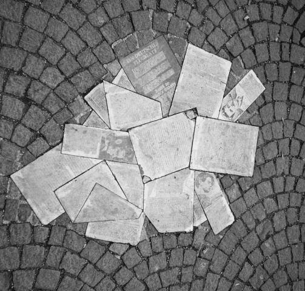{width="5.239583333333333in"
height="5.0in"}

{width="2.5625in"
height="3.3229166666666665in"}

When the Nazis invade Poland, a family is split apart. A harmonica keeps
a boy\'s hope alive. The story is inspired by the life of a Holocaust
survivor.

Henryk Rosmaryn. Henryk survived the Dyhernfurth concentration camp with
the help of the harmonica his father gave him. After coming to America,
he continued to use his harmonica and its music as a way to share his
wartime experience.

Set during WWII, Tony Johnston tells the story of how a boy's harmonica
and the memory of his parents give him hope and help him survive the
horrors of a concentration camp. This beautiful and tragic tale gently
lures the reader into the setting, into the camp, almost able to hear
the music of the harmonica.

Although the characters remain nameless, they become relatable to
everyone who has experienced loss and hopelessness. The vivid language
and beautiful illustrations allow the reader to take part in an amazing
journey of hope and courage.

Conflict: A boy, separated from his parents and imprisoned in a Nazi
concentration camp, feels badly about receiving extra food for playing
his harmonica to the commandant.

Conflict Resolution: The boy realises that he is bringing great joy and
hope to the other prisoners.

Action: Description of action:

*"I cannot remember my father's face,* Sets the tone and mood for

*or my mother's, but I remember their* the story.

*love, warm and unfolding as a song"*

(first page)

*"I played the harmonica while my parents* This is the rising action
that

*danced. In our dream we believed the* will take the boy to the

*world to be good. Until there in the heart* concentration camp, and
reader

*of Poland, Nazi soldiers found us"* to the climax of the story.

(middle)

*"Night after night I touched the* Resolution:

*harmonica to my lips. I thought of my* The boy has found his new

*father, who had given it to me. Of my* dream, his new place.

*mother, who once had danced. And of*

*the prisoners, without hope, who might*

*hear the notes and be lifted, like*

*flights of birds."* (last page)

**History -- Holocaust (Concentration Camps):** In 1933, before WWII
even officially began, concentration camps were created by the Nazis.
\"The term concentration camp refers to a camp in which people are
detained or confined, usually under harsh conditions and without regard
to legal norms of arrest and imprisonment.\"

By the beginning of the War, people taken to the camps were either
killed or put to hard labour (work). \"Those forced to work, were
deliberately undernourished and mistreated\" with the intent that they
would be killed by the work.

**Art**

Warm Colour Palette / Cool Colour Palette: Notice how most of the
pictures about his family are done in tones of reds, oranges, yellows
(warm colours) to reflect the warmth of the happy times. Most of the
pictures of his time as a prisoner in the concentration camp is done
cool colours to reflect the cold, hard times.

The artist in this story used black as a basic colour (in the
concentration camp illustrations) and added bits of colour for
variation. Students can try to use black as a main colour while adding
other colours for variation. What colours emerge from a black base? Are
the differences notable? Which colours were added in the illustrations
in the story?

**Symbolism**: Re-read the part about the commandant who wore ugliness
and death upon his shoulders. Look at the picture that accompanies that
text\... there is a skull above the soldier's shoulder. This was the
illustrator's way of painting the picture to go with the text. The skull
symbolises the ugliness and death, and he drew it above the one
shoulder.

**Music**

Composers -- Franz Peter Schubert:

Franz Peter Schubert was born in Austria on January 31, 1797. During his

childhood, the Austrians were fighting France, so French soldiers were a
common sight. Music was a diversion. His father was a cellist and
provided lessons (violin and viola) for this children. It was plain to
see that Franz Peter was talented, and when his father had taught him
all he could it was arranged that he was receive lessons.

In 1808 (at age 11), he was accepted into The Imperial and Royal Chapel
choir and admitted to Stadtkonvikt, the Imperial and Royal Court
Seminary. He studied great composers like Hadel, Mozart, and Beethoven.

He did very well at first. By age 12, he was playing second violin and
began

composing. Before long, writing music began to take up so much time that
his

grades suffered. And then in 1812, his mother died and his voice
changed\....ending his scholarship with the choir and school. He was
given special permission by the Emperor himself to stay on at the
Seminary. His father wanted him to become a teacher. But Franz Peter had
decided that music was his life and he only wanted to compose. Between
1813 and 1816, Franz Peter composed 400 different works. And by age 20,
he had also written one cantata and five symphonies.

By 1823, he had become ill and depressed. During the next few years, he
battled his illness and depression but still remained quite productive
with his

music. He died on November 19, 1828. While he had times of recognition
while he was alive, it was not until after his death that his work
became truly famous.

Biographies talk of Franz Peter being cold and hungry at school, but
that writing music made him forget that. Also tells of a time when the
French soldiers fired a cannon ball that went through the school. You
could tie both incidences in with The Harmonica.

**Found Poetry**\
**The Harmonica Tony Johnston**

I cannot remember my father's face, or my mother's, but I remember their
love, warm and enfolding as a song.

Singing was like breathing to us. For a time the only music in our house
was our own voices -- my father's, my mother's, and mine -- so off-key
we could crack crockery. Then the melodies of Schubert soared into our
home, freed from the neighbours' gramophone. We sang and we listened to
the gramophone's sweet notes, and we lived our lives. I had dreams of
music. A piano was my heart's desire. A piano for playing Schubert. But
like the composer, we were poor as pigeons. Even so, one evening, dusted
with coal from the mine where he worked, my father came home and slipped
a silvery gift into my hand. A harmonica.

On it were his charry fingerprints. My lips loved the harmonica, cool as
water. At first my breath panted in and out of its niched sides like a
bellows. I was so eager.

"Gently," said my father, a smile in his voice. "Or you will simply
blast it apart."

I wheezed. And blew. Until somewhere in the heart of the harmonica, my
mouth found Schubert. Then my mother and father danced together. Waltzed
over our bare floor.

Somewhere outside, a war was raging. But it was far away -- a bad dream
-- leaving us untouched.

I played the harmonica while my parents danced. In our dream we believed
the world to be good. Until there in the heart of Poland, Nazi soldiers
found us.

We were Jews. Enough for them to take my mother and father from me. like
a length of kindling, in one stroke, they split our family.

I was sent to a concentration camp, swallowed, dreams and all, down the
dark Nazi throat. Barefoot, I laboured alongside others, all of us
dull-eyed bags of bones, digging a road through snow. With each
shovelful of frozen earth, I thought of my mother and father. Were they
still alive? I wondered.

Often, to keep from losing hope, I touched the harmonica, cold inside my
pocket. Sometimes I played it to keep from losing hope. I wept when I
thought of my father and mother.

I awoke jolted from sleep. And I knew -- my parents were dead. Then I
played Schubert. Played and played while my heart reeled.

The commandant of the camp loved Schubert. By some terrible miracle he
heard of me and sniffed me out. One night he spat, "Play, Jew!"

I stood before him, my hand numb with winter. What if I fumbled? What if
the notes rushed from my head? Inside I trembled like a hare crouched in
a bush. I had no doubt, if I faltered, I would be dead.

I remembered what my father had told me of Schubert. How he had lived in
a bare room with no fire. Though his fingers ached with cold, he wrote
his music. Though he ached, he could not stop creating beauty. Though I
ached, each night I, skin-and-bones-boy, played for the commandant. He
listened, enthralled. Each night, when I was done, he tossed me bread.

He worked us, beat us for no reason, without mercy. Yet he recognised
beauty. I could not imagine how that could be.

I felt sick, black inside, playing music for the commandant, who wore
ugliness and death upon his shoulders like epaulets. I felt sick,
getting bread while others starved to death. I despised myself for every
note, every harmonica-breath until one day a whisper grazed my ear.
"Bless you."

"For what?' I asked the dark.

"Schubert."

I slipped that into my pocket. Each night, like the very stars, my notes
had reached other prisoners.

"Play, Jew!" The commandant spat, night after night.

Night after night I touched the harmonica to my lips. I thought of my
father, who had given it to me. Of my mother, who once had danced. And
of prisoners, without hope, who might hear the notes and be lifted, like
flights of birds. I played for them -- with all my heart.

**WRITING CRAFT The Harmonica**

+----------------------+---------------------------------------------+
| **Focus**            | Nazis Concentration Camp                    |
|                      |                                             |
| **Ideas and          | Hope                                        |
| details:**           |                                             |
+======================+=============================================+
| **Organisation**     | Lead: Poignant. Sets the tone and mood for  |
|                      | the story.                                  |
| Leads/Endings        |                                             |
|                      | Ending: Reinforces theme                    |
| Transitions          |                                             |
|                      | Problem/ Solution                           |
| **Organisational     |                                             |
| Structure:**         |                                             |
+----------------------+---------------------------------------------+
| **Style**            | Repetition: . *Tony Johnston uses           |
|                      | repetition in*                              |
| **Words: Memorable   |                                             |
| Language**           | *A poetic way. Certain phrases are          |
|                      | emphasised and*                             |
| **Voice:**           |                                             |
|                      | *certain phrases are comforting through her |
| **Fluency:**         | use of repetition.* Some examples:          |
|                      |                                             |
|                      | \"Often, to keep from losing hope, I        |
|                      | touched the harmonica\...\"                 |
|                      |                                             |
|                      | \"Sometimes I played it to keep from losing |
|                      | hope\...\"                                  |
|                      |                                             |
|                      | \"Though he ached\...\"                     |
|                      |                                             |
|                      | \"Though I ached\...\"                      |
|                      |                                             |
|                      | \"I felt sick, black inside\...\"           |
|                      |                                             |
|                      | \"I felt sick, getting bread\...\"          |
|                      |                                             |
|                      | \"\...the commandant spat, night after      |
|                      | night.\"                                    |
|                      |                                             |
|                      | \"Night after night I touched the           |
|                      | harmonica\...\"                             |
|                      |                                             |
|                      | Strong Verbs: *wheezed waltzed jolted       |
|                      | reeled spat fumbled faltered enthralled     |
|                      | epaulets despised grazed* Nouns: *crockery  |
|                      | kindling epaulets commandant niche*         |
|                      |                                             |
|                      | Similes: *\"Love, warm and enfolding as a   |
|                      | song\"*                                     |
|                      |                                             |
|                      | *\"Singing was like breathing\"*            |
|                      |                                             |
|                      | *\"Harmonica, cool as water\"*              |
|                      |                                             |
|                      | *\"Breath panted in and out\....like a      |
|                      | bellows\"*                                  |
|                      |                                             |
|                      | Simile hunt -- there are more.              |
|                      |                                             |
|                      | Distinct voice.                             |
|                      |                                             |
|                      | Sentence fragments.                         |
+----------------------+---------------------------------------------+
| **Conventions**      | Questions.                                  |
|                      |                                             |
| **Punctuation:**     | Exclamations.                               |
|                      |                                             |
| **Grammar:**         | Dash.                                       |
|                      |                                             |
| **Spelling:**        |                                             |
+----------------------+---------------------------------------------+

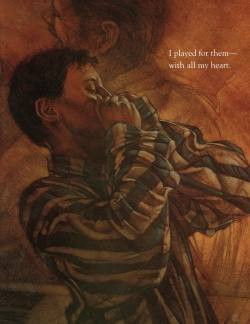{width="2.6041666666666665in"
height="3.375in"}

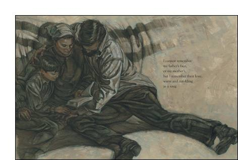{width="4.916666666666667in"
height="3.3020833333333335in"}

Author\'s Note:

The Harmonica was inspired by a true story. Henryk Rosmaryn grew up in
Czeladz, Poland. In 1939 the Germans invaded his homeland. Henryk was
taken to Dyhrenfurth concentration camp where, with the help of the
harmonica that his father had taught him to play, he survived the
hardship and sorrow of that prison.

After the war he came to the United States and changed his name to Henry
Rosmarin. Again with the aid of his harmonica, he shared his wartime
experiences with others, especially teenagers, in the hope that they
might bring about a better future. Although he died in 2001, his is an
ongoing story of the power of music and the strength of the human heart.

> --- Tony Johnston
