**Voice**

> **(17)**

{width="3.4791666666666665in"
height="3.5729166666666665in"}

**Voice in Persuasive Texts\**

{width="2.3020833333333335in"
height="2.3641152668416447in"}

**Voice 17**

**Voice in Persuasive Text**

Road Map for Persuasive Writing

Writing with Voice

Alexander, Who's Not (Do you hear me? I mean it!) Going to Move.

> Judith Viorst

Persuasive Letter Writing

Dear Mr Blueberry Simon James

Detective LaRue: Letters from Obedience School

Mark Teague

Hey, Little Ant Phillip and Hannah Hoose

Don't Let the Pigeon Stay Up Late! Mo Willems

Don't let the Pigeon Drive the Bus! Mo Willems

Earrings Judith Viorst

The True Story of the 3 Little Pigs Jon Scieszka

The Wretched Stone Chris van Allsburg

My Lucky Day Keiko Kasza

The Dog Who Cried Wolf Keiko Kasza

The Salamander Room Anne Mazer

Flossie & the Fox Patricia McKissack

Cloudy with a Chance of Meatballs Judi Barrett

I WANNA IGUANA Karen Orloff

I WANNA NEW ROOM Karen Orloff

**\**

> ***Road Map for Persuasive Writing***

- Understanding point of view

- Using Persuasive Writing for real World Purposes

- Persuasive Writing Topics

> Personal Issues -- E.g. Topic: getting a pet
>
> Audience: parents
>
> School Issues -- E.g. Topic: wearing uniforms
>
> Audience: principal and teachers
>
> Community issues -- E.g. Topic: park facilities
>
> Audience: city council
>
> World issues -- E.g. Topic: recycling
>
> Audience: people who throw away recyclables

- Narrowing the Topic to a Manageable Size

- Graphic Organisers for Persuasion (Pro/Con List)

- Formats for Writing (advertisements, reviews etc)

- Understanding the Rhetorical Question

- Writing an Introduction

> Leads
>
> Thesis Statement (topic and point)
>
> Snapshots of Setting
>
> Snapshots of People
>
> Stating your Arguments
>
> Transitions Within and Between Paragraphs

- Writing the Body

> Structures: compare/contrast, cause/effect, problem/solution
>
> Using a Narrative to Persuade as the Body of the Piece
>
> Arguments and Supporting Details
>
> Anecdotes
>
> Examples
>
> Explanations
>
> Statistics
>
> Transition Words and Phrases

- Writing a Conclusion

> Restate the Thesis or Point
>
> Summary Statements
>
> Rhetorical Questions
>
> Transition Words or Phrases
>
> Personalised Connections, Visualisation, Food for Thought

**Writing with Voice**

> Read Alouds -- Persuasive books with voice
>
> e.g.
>
> Alexander , Who's Not Going to Move by Judith Viorst
>
> Fly Away Home by Eve Bunting
>
> Mrs Katz and Tush by Patricia Polacco
>
> The Wednesday Surprise by Eve Bunting
>
> Train to Somewhere by Eve Bunting
>
> Writing
>
> Write a persuasive text using voice, on a topic that is near and dear
> to your heart.
>
> Brainstorm
>
> Moving

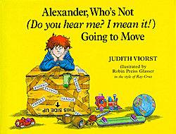{width="2.6041666666666665in"
height="1.9791666666666667in"}

Blurb: Alexander is *not* going to leave his best friend Paul. Or
Rachel, the best babysitter in the world. Or the Baldwins, who have a
terrific dog names Swoozie. Or Mr and Mrs Oberdorfer, who always give
great treats on Halloween. Who cares if his father has a new job a
thousand miles away? Alexander is not -- DO YOU HEAR HIM? HE MEANS IT!
-- going to move.

Should Alexander's dad take the job and move, or should he turn down the
job and stay where they live now?

Do you think they should move? Why or why not?

Give reasons for your thinking.

> 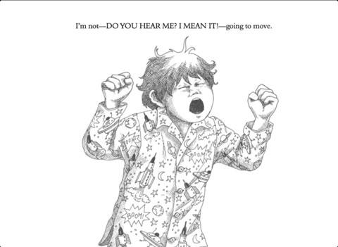{width="5.0in"
> height="3.65625in"}

**Alexander, Who's Not (Do you hear me? I mean it!) Going to Move.**

> **Judith Viorst**
>
> They can't make me pack my baseball mitt or my I LOVE DINOSAURS
> sweatshirt or my cowboy boots. They can't make me pack my ice skates,
> my jeans with eight zippers, my compass, my radio or my stuffed pig.
> My dad is packing. My mum is packing. My brothers Nick and Anthony are
> packing.
>
> I'm not packing. I'm not going to move.
>
> My dad says we have to move to where his new job is. That job is a
> thousand miles away. My mum says we have to move to where our new
> house is. That house is a thousand miles away. Right next door to the
> new house there's a boy who is Anthony's age. Down the street there's
> a boy the same age as Nick.
>
> There's no one next door or down the street or maybe for a thousand
> miles who is my age.
>
> I'm not -- DO YOU HEAR ME? I MEAN IT! -- going to move.
>
> I'll never have a best friend like Paul again. I'll never have a
> sitter like Rachel again. I'll never have my soccer team or my car
> pool again. I'll never have kids who know me, except my brothers, and
> sometimes *they* don't want to know me.
>
> I'm not packing. I'm not going to move.
>
> Nick says I'm a fool and should get a brain transplant. Anthony says
> I'm being immature. My mum and my dad say that after a while I'll get
> used to living a thousand miles from everything.
>
> Never. Not ever. No way. Uh uh. N.O.
>
> I maybe could stay here and live with the Baldwins. They've got a dog.
>
> I always wanted a dog.
>
> I maybe could stay here and live with the Rooneys. They've got six
> girls. They always wanted one boy.
>
> I maybe could stay here and live with Mr and Mrs Oberdorfer. They
> always give great treats on Halloween.
>
> I maybe could stay here and live by myself in maybe a tree house or
> maybe a tent or maybe a cave.
>
> Nick says I could live in the zoo with all the other animals. Anthony
> says I'm being immature. My dad says I should take a last look at all
> my special places.
>
> I'm taking a look -- but it won't be my last.
>
> I looked at the Rooney's roof, which I once climbed out on but then I
> couldn't climb back in, until the Fire Department came and helped me.
> I looked at Pearson's Drug Store, where they once said my mum had to
> pay them eighty dollars when I threw a ball in the air that I almost
> caught.
>
> I looked at the lot next to Albert's house, where I once and for all
> learned to tell which was poison ivy. I looked at my school, where
> even Ms. Knoop, the teacher I once spilt the goldfish bowl on, said
> she's miss me.
>
> I looked at my special places where a lot of different things happened
> -- not just different but different good.
>
> Like winning that sack race.
>
> Like finding that flashlight.
>
> Like spitting farther than Jack three times in a row.
>
> Like selling so much lemonade that my dad said I would probably have
> to pay taxes. My dad was just making jokes about paying taxes. I wish
> he was just making jokes about having to move.
>
> I'm not -- DO YOU HEAR ME? I MEAN IT! -- going to move.
>
> Nick says I'm acting like a puke-face.
>
> Anthony says I'm being immature.
>
> My mum says to say a last good-bye to all my special people.
>
> I'm saying good-bye -- but it won't be my last.
>
> I said good-bye to my friends, especially Paul, who is almost like
> having another brother, except he doesn't say puke-face or immature.
>
> I said good-bye to my neighbors, especially Swoozie, who is almost
> like having a dog, except she's the Baldwin's dog instead of mine.
>
> I said good-bye to Rachel, who taught me to stand on my head and
> whistle with two fingers, but she says don't try to do both at the
> same time. I said good-bye to Seymour the cleaners, who -- even if
> it's gum wrappers or an old tooth -- always saves me the stuff I leave
> in my pockets.
>
> I said a lot of good-byes to a lot of people and got a lot of hugs and
> kisses, enough hugs and kisses to last for a person's whole life. I
> said a lot of good-byes -- except I'm staying right here. I'm not
> going to move.
>
> When the movers come to put my bedroom furniture on their truck, maybe
> I'' barricade my bedroom door. when my dad wants to tie my bicycle to
> the roof rack on top of the station wagon, maybe I'll lock up my bike
> and bury the key. When my mum says, "Finish packing up, it's time for
> us to get going," maybe she'll look around and she won't see me.
>
> I know places to hide where they'd never find me.
>
> Like behind the racks of clothes at Seymour the cleaners.
>
> Like underneath the piano in Eddie's basement.
>
> Like inside the pickle barrel at Friendly's Market.
>
> Or maybe I could hide in the weeds in the lot next to Albert's house,
> now that I know how to tell which is poison ivy.
>
> I'd rather have poison ivy than have to move.
>
> My dad says it might take a while but I'll find a new soccer team. He
> says it might take a while but I'll find boys my own age.
>
> He also says that sometimes, when a person moves away, his father
> might need to let him get a dog to be his friend till he makes some
> people friends. I think that Swoozie Two would be a good name.
>
> My mum says that it might take a while but we'll find a great sitter.
> She says it might take a while but we'll find a cleaners who even
> saves gum wrappers and old teeth. She also says that sometimes, when a
> person moves away, his mother might let him call his best friend
> long-distance. I already know the telephone number by heart.
>
> Paul gave me a baseball cap. Rachel gave me a backpack that glows in
> the dark. Mr and Mrs Oberdorfer gave us treats to eat for a thousand
> miles. Nick says if I'm lonesome in my new room all by myself, he
> might let me sleep with him for a little while.
>
> Anthony says that Nick is being mature.
>
> My dad is packing. My mum is packing. My brothers Nick and Anthony are
> packing. I don't like it, but I'm packing too.
>
> They better not try to move anymore when we get where we're going to
> go.
>
> Because this is the last time I'll do it. The next time they won't
> make me do it. Never. Not ever. No way. Uh uh. N. O.
>
> I'm not -- DO YOU HEAR ME? I MEAN IT! -- going to move.

**Writing with Voice in Persuasive Writing**

**Persuasive Letter Writing**

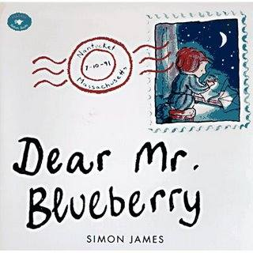{width="3.3333333333333335in"
height="3.3333333333333335in"}

Mentor text: Dear Mr Blueberry by Simon James. This book has also been
published with the title Dear Greenpeace.

Voice is the way you say something. In the lesson on *Should We Have
Pets* we asked the students to sound like themselves. We can also write
in the voice of other people. In persuasive writing the voice should be
strong, sounding confident and knowledgeable about the subject.

In Dear Mr Blueberry we have letters written in two voices -- Emily and
her teacher. The writer needs to be serious about their opinion and
polite when writing a letter.

Read Aloud

Discussion:

Characters.

Emily:

Is she polite?

Does she sound convincing?

Mr Blueberry

Is he polite?

Does he sound knowledgeable about whales?

Does he sound serious as he tries to convince Emily that she can't have
a whale in her pond?

Does Mr Blueberry convince Emily?

Does this matter?

Possibilities:

Persuasive letter writing:

Format --

Heading

Greeting

Message

Closing

Signature

Read Aloud. Leave out the last letter from Emily. Students write their
own.

Partner writing.

**\**

**Dear Mr Blueberry**

**Simon James**

Dear Mr Blueberry,

I love whales very much and I think I saw one in my pond today. Please
send me some information on whales, as I think he might be hurt.

Love

Emily

*Dear Emily,*

*Here are some details about whales. I don't think you'll find it was a
whale you saw, because whales don't live in ponds, but in salt water.*

*Yours sincerely*

*Your teacher,*

*Mr Blueberry*

Dear Mr Blueberry,

I am now putting salt into the pond every day before breakfast, and last
night I saw my whale smile. I think he is feeling better.

Do you think he might be lost?

Love

Emily

*Dear Emily,*

*Please don't put any more salt in the pond. I'm sure your parents won't
be pleased.*

*I'm afraid there can't be a whale in your pond, because whales don't
get lost, they always know where they are in the oceans.*

*Yours sincerely,*

*Mr Blueberry*

Dear Mr Blueberry,

Tonight I am very happy because I saw my whale jump up and spurt lots of
water. He looked blue.

Does this mean he might be a blue whale?

Love

Emily

P.S. What can I feed him with?

*Dear Emily,*

*Blue whales are blue and they eat tiny shrimplike creatures that live
in the sea. However, I must tell you that a blue whale is much too big
to live in your pond.*

*Yours sincerely,*

*Mr Blueberry*

*P.S. Perhaps it is a blue goldfish?*

Dear Mr Blueberry,

Last night I read your letter to my whale. Afterwards he let me stroke
his head. It was very exciting.

I secretly took him some crunched-up cornflakes and bread crumbs. This
morning I looked in the pond and they were all gone!

I think I shall call him Arthur.

What do you think?

Love

Emily

*Dear Emily,*

*I must point out to you quite forcibly now that in no way could a whale
live in your pond. You may not know that whales are migratory, which
means they travel great distances each day.*

*I am sorry to disappoint you.*

*Yours sincerely,*

*Mr Blueberry*

Dear Mr Blueberry,

Tonight I'm a little sad. Arthur has gone. I think your letter made
sense to him and he has decided to be migratory again.

Love

\` Emily

*Dear Emily,*

*Please don't be too sad, it really was impossible for a whale to live
in your pond. Perhaps when you are older you would like to sail the
oceans studying and protecting whales.*

*Yours sincerely,*

*Mr Blueberry*

Dear Mr Blueberry,

It's been the happiest day! I went to the beach and you'll never guess,
but I saw Arthur! I called to him and he smiled. I knew it was Arthur
because he let me stroke his head.

I gave him some of my sandwich ... and then we said good-bye.

I shouted that I loved him very much and, I hope you don't mind, I said
you loved him, too.

Love

Emily (and Arthur)

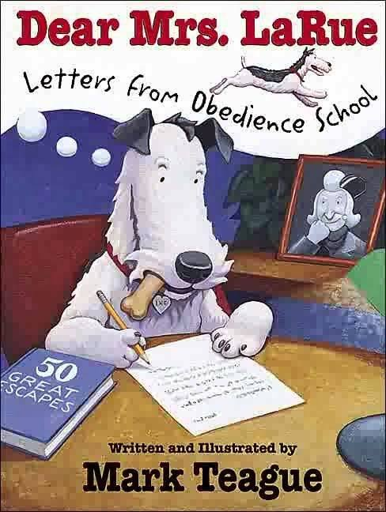{width="2.2435695538057745in"
height="2.9791666666666665in"}

This is a great book to teach about using your own voice in letter
writing.  After reading the book, discuss ways in which we could tell
how a character was feeling by reading the letters.   Link this to
students' letter writing. E.g.

Write a letter to Santa convincing him why they would be the best elf
for the job! They have to create an elf character, with a name and a
personality and convey all of this in a convincing letter to Santa.

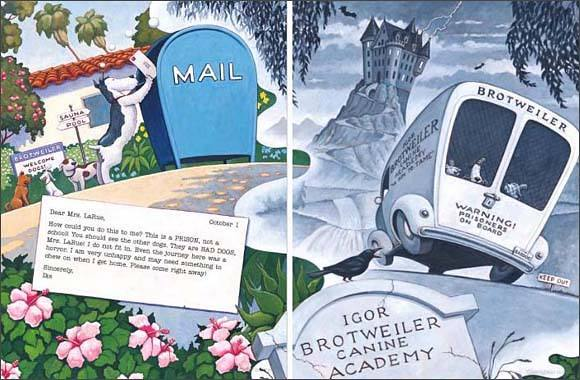{width="6.041666666666667in"
height="3.9583333333333335in"}

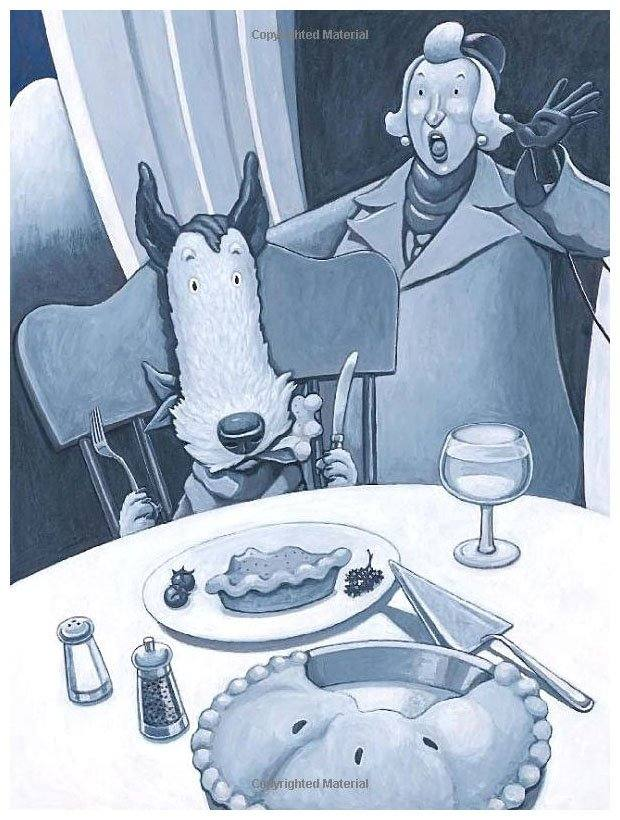{width="6.268055555555556in"
height="8.290008748906386in"}

Detective LaRue: Letters from Obedience School.

Why do you think Ike wants to leave the Canine Academy?

How does Ike try to convince Mrs LaRue to let him come home?

Do you think Ike's methods of persuasion are working. Why or why not?

Look at the letters to determine persuasive words and techniques.

Write an unusual persuasive letter.

Dear Mrs LaRue: Letters from Obedience School uses point-of-view and
persuasive writing techniques when writing a friendly letter. Ike
attempts to convince his owner that he doesn't belong in an obedience
school.

Often the pictures of Ike's life at obedience school directly contrast
the message he is sending in his letters.

Read Aloud.

Read Aloud as a mentor text.

\- Ike uses powerful details when describing each day from his point of
view.

\- He uses emotionally charged words.

\- He uses emphatic capitalisation techniques.

\- He uses quotes to support his argument.

\- He crafts each letter to persuade his audience -- Mrs LaRue -- whom
he wants something from.

Discussion. One letter could be displayed on the board. Discuss its most
persuasive word and its most persuasive technique.

Other letters could receive a similar discussion in small groups.

Modelled Writing -- use students' letters from previous years. Discuss
voice as focus of lesson. Another mini-lesson could centre on word
choice.

Revision.

Edit for conventions.

Publish.

{width="6.041666666666667in"
height="4.0in"}

{width="3.09576990376203in"
height="2.4270833333333335in"}

**Hey, Little Ant** **Phillip and Hannah Hoose\**

This story is about the dialogue between an ant and a boy. The boy is
about to squish the ant, because the ant is useless and steals picnic
food. The ant tries to convince the boy not to squish him because he
needs the food to feed his family and there are many things that they
have in common. At the end, it is left up to the reader to make the
decision if the boy should squish the ant.

**Understandings**

- Learning how others might be feeling in order to encourage sensitivity

- Understanding other's perspectives, points of view, and feelings

- Recognising the effects of decisions on self and others

- Recognising the cause-effect relationship in the decision-making
  process

- Understanding that people-have strengths and weaknesses

- Controlling impulses, aggression and self-destructive behaviour

- Identifying ways in which people are alike and different

**Objectives**

Students will decide if the ant should get squished and be able to
justify their decision using both reasoned and intuitive judgement.

Literacy: Students will apply knowledge of character to resolve the
story\'s dilemma.

**Pre-Reading**

Have you ever seen a bug and killed it? Did you ever stop to think how
the bug felt?\
Have you ever thought about doing something and then changed your mind?

**Discussion Questions**

Were you ever in the same situation as the boy? What happened?\
How did the bug feel when he saw the shoe?\
Do you agree that "ants can feel"?\
How is the boy similar to the ant?\
Why is the ant important in the world?

*Should the kid step on the ant?*

Two points of view are presented. Chart the arguments -- the boy and the
ant.

Partner Talk -- decide which character has the stronger argument.

To support the ant read nonfiction texts about ants -- chart facts plus
prior knowledge. (A series of texts is available).

Use arguments the ant used and knowledge gained to make statements. E.g.

*Ants are a lot like people.*

*Ants are important to the environment.*

Argument Supporting details

Refer to chart for evidence to support statements. Write essay.

Think of possible leads. E.g

Questions.

"What if..."

Snapshot of character -- the ant.

Quote from text.

Using mentor texts: E.g. Somewhere Today by Bert Kitchen.

"Somewhere today..."

Students should check to make sure the facts they used to support the
arguments match the big idea.

The students know:

Convincing arguments must be strong.

The arguments must be supported by facts.

**Revise**

**Lead**

Unusual detail.

Strong statement.

Quotation.

Anecdote.

Fact.

Question.

Exaggeration.

**Middle**

Evidence

**Conclusion**

Summarises most important details.

Restates what the reader is to believe or do.

Ending:

Prediction.

Question -- reader to make own prediction, draw own conclusion.

Recommendation -- stresses action to be taken.

Quote.

Persuasive text. (see chart)

Have a firm opinion that you want your reader to accept.

Strong lead to grab your reader.

Give evidence to support your opinion.

Conclude by restating what you want reader to believe.

**Hey, Little Ant Phillip & Hannah Hoose**

**KID**: Hey, little ant down in the crack,

Can you hear me? Can you talk back?

See my shoe, can you see that?

Well, now, it's gonna **squish** you flat!

**ANT:** Please, oh please, do not squish me,

Change your mind and let me be,

I'm on my way with a crumb of pie,

Please, oh **please,** don't make me die!

**KID:** Anyone knows that ants can't feel.

You're so tiny you don't look real!

I'm so big and you're so small,

I don't think it'll hurt at all.

**ANT:** But you are a giant and giants can't

Know how it feels to be an ant.

Come down close, I think you'll see

That you are very much like me.

**KID:** Are you crazy? **Me** like **you?**

I have a home and a family, too.

You're just a speck that runs around,

No one would care if my foot came down.

**ANT:** Oh big friend, you are so wrong,

My nest mates need me 'cause I am strong.

I dig our nest and feed baby ants, too,

I must not die beneath your shoe.

**KID:** But my mum says that ants are rude,

They carry off our picnic food!

They steal our chips and bread crumbs, too,

It's **good** if I squish a crook like you.

**ANT:** Hey, I'm not a crook, kid, read my lips!

Sometimes ants need crumbs and chips.

One little chip can feed my town,

So please don't make your shoe come down.

**KID:** But all my friends squish ants each day,

Squishing ants is a game we play.

They're looking at me -- they're listening, too.

They all say I **should** squish you.

**ANT:** I can see you're big and strong,

Decide for yourself what's right and wrong.

If you were me and I were you,

What would **you** want **me** to do?

**Should the ant get squished? Should the ant go free?**

**It's up to the kid, not up to me.**

**We'll leave the kid with the raised-up shoe.**

**What do you think that kid should do?**

> 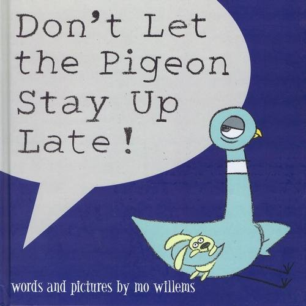{width="2.9166666666666665in"
> height="2.9166666666666665in"}
>
> ***Don't Let the Pigeon Stay Up Late!* By Mo Willems**
>
> One of the many 'pigeon' books. *Don't Let the Pigeon Drive the Bus!*
> Was a Caldecott Honour book. The pigeon comes up with an elaborate
> list of excuses not to go to bed -- and it gives those excuses to YOU!
> The owner has asked you, the reader, for a favour while he brushes his
> teeth. *Don't let the pigeon stay up late! Will you?*
>
> I'm sure that most children will have text-to-self connections.
>
> This can be used as a mentor text, the students writing about excuses
> not to go to bed.

**Don't Let the Pigeon Stay Up Late! Mo Willems**

> Oh, good, it's you. Listen, it's getting late and I need to brush my
> teeth. Can you do me a favour? Don't let the pigeon stay up late!
> Thanks!
>
> First of all, I'm not even tired.
>
> In fact, I'm in the mood for a hot-dog party!
>
> What do you say?
>
> "No" !? Hmph.
>
> I hear there's a good show about birds on TV tonight.
>
> Should be very educational.
>
> How about five more minutes?
>
> Go on! What's five minutes in the grand scheme of things? Yawn
>
> What!? WHAT!?!
>
> I'M NOT TIRED!
>
> You know what, we never talk any more.
>
> Tell me about you day ...
>
> Oh! I've got a great idea! We could count the stars.
>
> Can I have a glass of water?
>
> Studies show that pigeons hardly need any sleep at all!
>
> It's the middle of the day in Alaska!
>
> I'll go to bed early tomorrow night instead!
>
> Hey, hey! Ho, ho! This here pigeon just won't go!
>
> Pleeeeeaaasssseee!
>
> Bunny wants to stay up too!
>
> You can't say "No" to a bunny, can you?
>
> YAWN! LOOK, THAT WAS NOT A YAWN! I was stretching.
>
> I'm -- Yawn -- 110% awake...! You haven't heard the -- Yaaaawn -- last
> of me!
>
> zzzzzz snork! zzzzz!
>
> Good work. Thanks.
>
> Good night.

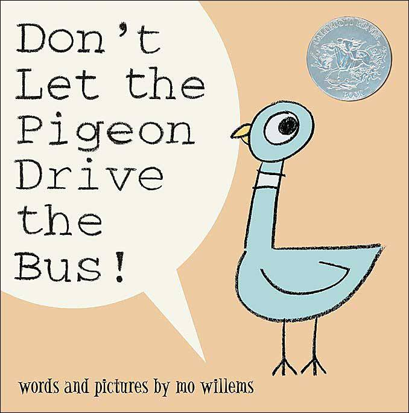{width="2.4895833333333335in"
height="2.5116152668416447in"}

When a bus driver takes a break from his route, a very unlikely
volunteer springs up to take his place-a pigeon! But you\'ve never met
one like this before. As he pleads, wheedles, and begs his way through
the book, children will love being able to answer back and decide his
fate.

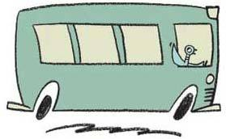{width="2.90625in"
height="1.7916666666666667in"}

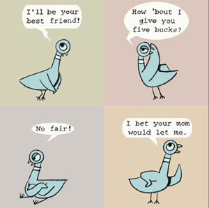{width="3.125in"
height="3.1041666666666665in"}

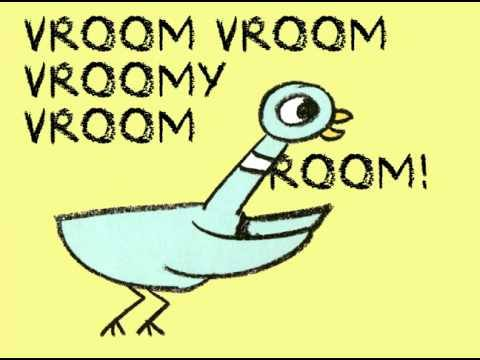{width="5.0in"
height="3.75in"}

**Don't let the Pigeon Drive the Bus! Mo Willems**

"Hi! I'm the bus driver. Listen, I've got to leave for a little while,
so can you watch things for me until I get back? Thanks. Oh, and
remember: Don't let the pigeon drive the bus!"

"I thought he'd never leave. Hey, can I drive the bus?

Please? I'll be careful.

I know what, I'll just steer. My cousin Harry drives a bus almost every
day!

True story.

Vroom -- Vroom Vroomy Vroom-Vroom. PIGEON AT THE WHEEL!

No? I never get to do anything!

Hey, I've got an idea. Let's play 'Drive the Bus'! I'll go first.

C'mon! Just to the corner and back!

I'll be your best friend. How 'bout I give you a fiver? No fair! I bet
your mum would let me.

What's the problem!? It's just a bus !!! I have dreams, you know! Fine.

LET ME DRIVE THE BUS!!!"

"I'm back! You didn't let the pigeon drive the bus, did you?

Great! Thanks a lot."

"Uh-oh!"

"Bye!"

"Hey ..."

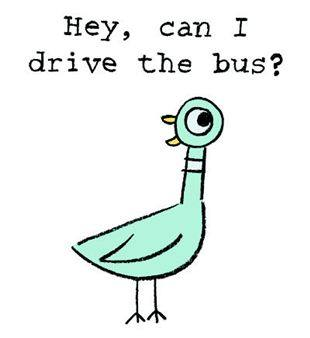{width="3.2291666666666665in"
height="3.5208333333333335in"}

CALDECOTT HONOUR:

The Caldecott Honor, or silver medal, is given each year to the artists

of the year's most distinguished American picture books for children.

Some readers may look at Willems's books and call them deceptively

simple. Willems agrees, but with some clarification.

"I'd tweak that to 'deliberately simple'," he says. "The essence of my
design

is to create an immediate, emotional connection\... I'm thrilled that
any

child can pick up a crayon and quickly create a reasonable drawing of

Pigeon; it allows the book to connect with the reader on a fundamental,

participatory level."

Discussion:

Why do you think the Caldecott Committee chose this book?

What is special or memorable about the illustrations?

GET TO KNOW THE PIGEON:

With your children, compile a list of words that describe each of his
emotions. Next, list words that describe the pigeon's personality. Draw
a picture of the pigeon to go along with one or more of those words.

Examine the illustrations and describe how the pigeon's face was drawn
to express each emotion.

Writing:

For older children, what is this? It's a monologue, though one that
encourages you, the person on the outside of the story, to interact and
respond. Read the

story aloud again and have children answer each of the pigeon's
entreaties out loud (or in writing), giving a variety of good reasons
for each response. What a

fabulous showcase for persuasive writing, one of the many forms writing
teachers introduce and model!

Students write a persuasive letter to the bus driver, with clear reasons
why the pigeon should, or should not, be allowed to drive. Or write to
the pigeon himself.

Personal Narratives::

What do you do when your parents say no? Write about a time you tried to
talk your parents into letting you do something. What arguments did you
use?

What did they say? Were you successful or not? What happened?

Do a Quick Write describing the experience.

Predicting Outcomes:

When you come to the end, where the pigeon turns and sees the enormous
red tractor trailer truck and says "Hey . . ." students predict what the
pigeon will do next. (The back endpaper shows him, once again, dreaming,
rapturously, of driving that semi.) One question the pigeon never
answers is WHY he wants to drive the bus or truck. Write and illustrate
his reasons from his point of view: "I, Pigeon, want to drive the bus
because . . ."

Write and illustrate sequels:

Don't Let the Pigeon Drive the Tractor Trailer Truck! is one

possibility for a sequel, of course.

Debate:

Pro-pigeon-driving and anti-pigeon-driving. Each group must come up with

a list of reasons to support their side. Then, start a debate

with the topic: Should the pigeon drive the bus?

Writing:

"If the pigeon drove the bus, he \_\_\_."

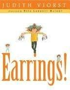{width="1.5in"
height="1.9479166666666667in"}

**Earrings by Judith Viorst**

She wants them. She needs them. She loves them. Earrings! What won't a
girl do to finally get her ears pierced? Find out in this delightful
tale that perfectly captures the yearnings of a young girl in desperate
need of beautiful, glorious earrings!

Earrings by Judith Viorst

Parents versus the author about getting pierced ears.

Do you think her parents should let her get her ears pierced?

Why or why not?

Give reasons for your thinking.

> **Earrings!**
>
> **Judith Viorst**
>
> I want them.
>
> I need them.
>
> I love them.
>
> I've got to have them.
>
> My mum and my dad won't let me have them.
>
> Earrings.
>
> Beautiful earrings for
>
> Pierced ears.
>
> Teachers and lady dentists have them.
>
> Mothers and even grandmothers have them.
>
> Why won't my mum and my dad let me have
>
> Pierced ears?
>
> They say that I'm too young.
>
> I'm not too young.
>
> I'm actually very mature for my age.
>
> I clear the plates after dinner.
>
> I take a shower without even being told.
>
> They say that I need to be patient.
>
> I've tried being patient.
>
> I'm tired of patient.
>
> I want my ears pierced NOW -- not when I'm
>
> Twenty
>
> Forty
>
> Eighty
>
> A hundred years old.
>
> I want them. I need them. I love them.
>
> Beautiful earrings. Glorious earrings.
>
> My mum and my dad say,
>
> Wait for a couple of years.
>
> I tell them I'm the only girl
>
> In my class
>
> In my school
>
> In the world
>
> In the solar system
>
> Whose mum and dad won't let her have
>
> Pierced ears.
>
> At your age, they say, pierced ears are premature,
>
> I HATE "premature."
>
> At your age, they say, pierced ears are inappropriate,
>
> I REALLY HATE "inappropriate."
>
> At your age, they say, pierced ears look a little ... tacky.
>
> I can't believe I've got such old-fashioned parents!
>
> I want them. I need them. I love them.
>
> Beautiful earrings. Glorious earrings.
>
> My mum and my dad keep saying weird things like,
>
> Why?
>
> Because they'd make me look good.
>
> Because they'd make me feel good.
>
> And because, furthermore, I'd be so proud of wearing them,
>
> I'd stand up straight and hold my head up high.
>
> Which means that they would also be good for my posture.
>
> (And I hear that they keep earlobes warm in winter.)
>
> My mum and my dad ask,
>
> What do you want for your birthday?
>
> I tell them what I want for my birthday: pierced ears.
>
> My mum and my dad ask,
>
> What do you want for Christmas?
>
> I tell them that I only want pierced ears.
>
> And what do you think I say when they ask me,
>
> What should we bring you back from our vacation?
>
> I say earrings.
>
> Beautiful earrings.
>
> Glorious earrings.
>
> Beautiful, glorious earrings for
>
> Pierced ears.
>
> Instead of earrings, they say,
>
> We could get you a locket.
>
> I don't WANT a locket.
>
> Instead of earrings, they say,
>
> We could get you a charm bracelet.
>
> I REALLY don't want a charm bracelet.
>
> As a substitute for earrings, they say,
>
> We brought you back this ...
>
> Don't they understand?
>
> There *isn't* any substitute for earrings?
>
> I want them.
>
> I need them.
>
> I love them.
>
> Beautiful earrings.
>
> Glorious earrings.
>
> I argue and beg and sometimes there's yelling and tears.
>
> I tell my mum and my dad all the things I would do
>
> If only
>
> If only
>
> If only
>
> If only
>
> If only they would let me have pierced ears.
>
> Like, walk our dog every day for one whole year.
>
> Like, clean up my room every day for one whole year.
>
> Like, read a book once a week for one whole year.
>
> Like, be nice to my little brother for one whole year.
>
> Well, maybe six months.
>
> And I wouldn't ask for new clothes, because I could wear the same old
> clothes -- and just change my earrings.
>
> I want them.
>
> I need them.
>
> I love them.
>
> I keep telling my mum and my dad I've got to have them.
>
> My mum and my dad say they're tired of hearing this stuff.
>
> But I promise
>
> I promise
>
> I promise
>
> I cross-my-heart promise that they'll never hear it again,
>
> The minute they decide I'm old enough
>
> For earrings,
>
> Beautiful earrings.
>
> Glorious earrings.
>
> Beautiful, glorious earrings for
>
> Pierced ears.
>
> 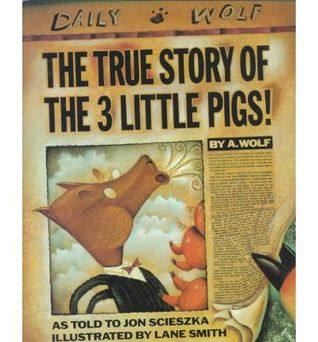{width="3.3125in"
> height="3.5625in"}
>
> **The True Story of the 3 Little Pigs Jon Scieszka**
>
> **You thought you knew the story of the "The Three Little Pigs"... You
> thought wrong.**
>
> In this hysterical and clever fracture fairy tale picture book that
> twists point of view and perspective, young readers will finally hear
> the other side of the story of "The Three Little Pigs."
>
> 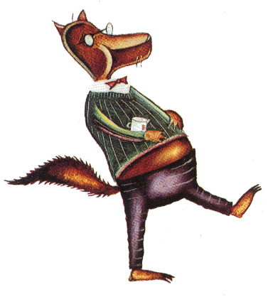{width="2.5in"
> height="2.721353893263342in"}

**The True Story of the 3 Little Pigs Jon Scieszka**

Everybody knows the story of the Three Little Pigs. Or at least they
think they do.

But I\'ll let you in on a little secret. Nobody knows the real story,
because nobody has ever heard my side of the story.

I\'m the wolf. Alexander T. Wolf. You can call me Al. I don\'t know how
this whole Big

Bad Wolf thing got started, but it\'s all wrong.

Maybe it\'s because of our diet. Hey, it\'s not my fault wolves eat cute
little animals like bunnies, sheep and pigs. That\'s just the way we
are. If cheeseburgers were cute, folks would probably think you were Big
and Bad, too.

But like I was saying, the whole Big Bad Wolf thing is wrong. The real
story is about a

sneeze and a cup of sugar.

This is the real story.

Way back in Once Upon a Time time, I was making a birthday cake for my
dear old granny. I had a terrible sneezing cold. I ran out of sugar. So
I walked down the street to ask my neighbour for a cup of sugar. Now the
guy next door was a pig. And he wasn\'t too bright either. He had built
his whole house out of straw. Can you believe it? I mean who in his
right mind would build a house of straw?

So of course the minute I knocked on the door, it fell right in. I
didn\'t want to just walk into someone else\'s house. So I called,
\"Little Pig, Little Pig, are you in?

No answer.

I was just about to go home without the cup of sugar for my dear old

granny\'s birthday cake.

That\'s when my nose started to itch. I felt a sneeze coming on. Well I
huffed. And I

snuffed. And I sneezed a great sneeze.

And you know what? That whole darn straw house fell down. And right in
the middle of the pile of straw was the First Little Pig-dead as a
doornail. He had been home the whole time.

It seemed like a shame to leave a perfectly good ham dinner lying there
in

the straw. So I ate it up. Think of it as a big cheeseburger just lying
there.

I was feeling a little better. But I still didn\'t have my cup of sugar.
So I went to the next house. The guy who lived there was the First
Little Pig\'s brother.

He was a little smarter, but not much. He had built his house of sticks.
I rang the bell on the stick house. Nobody answered.

I called, "Mr. Pig, Mr. Pig, are you in?"

He yelled bacl, "Go away wolf. You can\'t come in. I\'m shaving the
hairs on my chinny chin chin.\"

I had just grabbed the doorknob when he felt another sneeze coming on. I
huffed. And I snuffed. And I tried to cover my mouth, but I sneezed a
great sneeze.

And you\'re not going to believe it, but this guy\'s house fell down
just like his

brother\'s.

When the dust cleared, there was the Second Little Pig-dead as a
doornail. Wolf\'s

honour. Now you know food will spoil if you just leave it out in the
open. So I did the only thing there was to do. I had dinner again. Think
of it as a second helping.

I was getting awfully full. But my cold was feeling a little better.

And I still didn\'t have that cup of sugar for my dear old granny\'s
birthday cake.

So he went to the next house.

This guy was the First and Second Little Pig\'s brother. He must have
been the brains in the family. He had built his house of bricks. I
knocked on the brick house.

No answer.

I called, \"Mr. Pig, Mr. Pig, are you in? And do you know what that rude
little porker answered?

\"Get out of here, Wolf. Don\'t bother me again.\"

Talk about impolite! He probably had a whole sackful of sugar.

And he wouldn\'t give me even one little cup for dear sweet old
granny\'s

birthday cake. What a pig!

I was just about to go home and maybe make a nice birthday card instead

of a cake, when I felt my cold coming on.

I huffed. And I snuffed. And I sneezed once again.

Then the Third Little Pig yelled, "And your old granny can sit on a
pin!"

Now I\'m usually a pretty calm fellow. But when somebody talks about my
granny lie

that, I go a little crazy.

When the cops drove up, of course I was trying to break down this Pig\'s
door.

And the whole time I was huffing and puffing and sneezing and making a
real

scene.

The rest, as they say, is history.

The news reporters found out about the two pigs I had for dinner.

They figured a sick guy going to borrow a cup of sugar didn\'t sound
very

exciting. So they jazzed up the story with all of that \"Huff and puff
and blow your house down.\" And they made me the Big Bad Wolf.

That\'s it.

The real story. I was framed.

But maybe you could loan me a cup of sugar.

**Persuasive Writing** . Persuasive writing genre, structure and
features.

Persuasive writing.

Mentor Text: The Perfect Pet by Margie Palatini

Persuasive essay -- discuss the Hamburger Model of writing an essay.

Persuasive letter

Research -- Notetaking using keywording.

Reader's Theatre

Reading strategies

Visualising

Summarising using Who? What? Why?

Independent Writing: Persuasive essay 'The Perfect Pet.'

{width="2.3854166666666665in"
height="2.0416666666666665in"}

Bird?

Bunny?

Turtle?

Fish? Elizabeth really, really wants a pet, but her parents say NO to
all of her ideas. Instead, she ends up with a cactus called Carolyn. And
after some very unsuccessful campaigning, to her wonderful surprise,
Elizabeth encounters Doug \-- surely the most unusual and special pet of
all.

**\**

> **The Perfect Pet**
>
> **Margie Palatini**
>
> Elizabeth really, really, *really* wanted a pet. Her parents really,
> really, *really* did not.
>
> They gave her a plant instead.
>
> Mind you, it was a very good-looking plant, as cactus plants go. And
> it had quite a prickly sense of humor.
>
> Elizabeth named it Carolyn, which seemed to suit it just fine. It was
> absolutely no trouble and it was a very good listener.
>
> Snuggling was a bit of a challenge. However, Elizabeth did manage a
> quick hug now and then.
>
> Elizabeth really, really did like the plant ... but, she still really,
> really, *really* wanted a pet.
>
> And she had a plan.
>
> THE ELEMENT OF SURPRISE
>
> "So, how about a horse?"
>
> "Huh? What? Who?" said Father.
>
> "Who? What? Huh?" said Mother.
>
> "I could ride it. Give it carrots. Lumps of sugar. A horse would be
> the perfect pet. Whaddya say?"
>
> Father yawned. "A horse is too big."
>
> Mother sighed. "Our yard is too small."
>
> "Why, it would eat us out of house and home," said Father.
>
> "A horse is not *quite* perfect, dear," said Mother, going back to
> sleep.
>
> "Not *quite* perfect," said Father sleepily.
>
> Scratch the horse.
>
> CATCH THEM OFF GUARD
>
> "What about a dog?"
>
> "Huh? What? Who?" said Father as he stood in front of the mirror
> shaving.
>
> "Who? What? Huh?" said Mother, peeking from behind the shower curtain
> and dripping soapy water.
>
> "I could take it for walks. Teach it tricks. Feed it treats. Play
> fetch. A dog would be the perfect pet. Whaddya think?"
>
> Father spat shaving cream. "Dogs bark. They're much too loud."
>
> Mother grabbed a towel. "They jump all over the furniture."
>
> "A dog is not *quite* perfect, Elizabeth," said father as he shaved.
>
> "Not *quite* perfect," called Mother from the shower.
>
> Forget Fido.
>
> THE FULL STOMACH
>
> *Burp.*
>
> "You know what would hit the spot right about now?" asked Elizabeth.
> "I'm thinking ... a cat."
>
> "Huh? What? Who?' said Father.
>
> "Who? What? Huh?" said Mother.
>
> "A cat could lick the plates. Curl up in my lap. Drink leftover milk.
> And we'd always know what to do with all that extra string. A cat
> would be the perfect pet. So ... how about it?"
>
> Father picked up the newspaper. "Cats scratch."
>
> Mother cleared the table. "Cats shed all over."
>
> "A cat is definitely *not* the perfect pet," said Father.
>
> "Achoo! I'm sneezing already," said Mother.
>
> Cross of kitty.
>
> GO FOR BROKE
>
> "How about a bird? Bunny? Turtle? Fish? Guinea pig? Rat? Any? All?
> Take your pick!" said Elizabeth.
>
> Her parents looked at each other.
>
> "Nope."
>
> "Afraid not."
>
> "Not quite."
>
> "Too fishy."
>
> "Uh-uh."
>
> "Don't even go there."
>
> "What's left?" moaned Elizabeth.
>
> DOUG
>
> Elizabeth was thinking she would never ever find the really, really,
> *really* perfect pet, when ... what do you know? She really, really
> did.
>
> In fact, she almost stepped on it.
>
> Right there on her rug. A bug.
>
> Elizabeth picked him up.
>
> She held him in her hand. Looked him in the eyes.
>
> He wasn't too big. He most definitely was not too loud.
>
> He couldn't jump on the furniture. Didn't scratch. Didn't shed. And
> how much food could he possibly eat?
>
> He was the perfect pet.
>
> Carolyn totally agreed.
>
> SNUG
>
> Doug moved right in to the lovely house in the corner of Elizabeth's
> room. It had everything a bug could possibly want and more. Including
> his very own cactus plant, as Carolyn was only a hop, skip, and jump
> away. He truly enjoyed sunning himself in her sand.
>
> Of course, Elizabeth provided him with enough crumbs to satisfy any
> growing bug's appetite.
>
> As expected, their relationship was a *tad* different than the usual.
>
> Doug could not give Elizabeth a pony ride. She could not take him for
> a walk.
>
> He could not catch a ball or fetch, no matter how many times they
> practised.
>
> And try as he might, Doug just couldn't get the hang of playing with
> string.
>
> But he was very helpful with homework. (He always knew where to put a
> decimal or a full stop.)
>
> And he loved snuggling up with Elizabeth each night for a story.
>
> What more could you ask? He was perfect.
>
> UNSNUGGED
>
> With all those crumbs and plenty of sun, Doug grew by leaps and
> bounds. He was one big, healthy bug ... and then some.
>
> The only trouble really, really, *really* came one Saturday morning,
> many weeks later. Elizabeth's mother came into her bedroom to get the
> laundry and ...
>
> "THERE'S A BUG IN THAT BED!" she screamed.
>
> "A bug!" shouted Father, ready to swat.
>
> "That's Doug," said Elizabeth very protectively. "He's my pet."
>
> Her parents looked at each other. "Pet?"
>
> "Pet," said Elizabeth. "Just like you wanted. He's not big like a
> horse. He isn't loud like a dog. He doesn't jump on furniture,
> scratch, or shed. And he hardly eats a thing."
>
> "But, a *bug?"* asked Father.
>
> "A *bug*?" repeated Mother.
>
> "Doug," said Elizabeth. "And he's perfect."
>
> ONE BIG HAPPY FAMILY
>
> "Think we should have said 'yes' to the dog?" whispered Father to
> Mother.
>
> Mother shrugged. "I don't know. We have more room on the couch with
> the bug."
>
> Elizabeth smiled and tossed Doug a piece of popcorn.
>
> 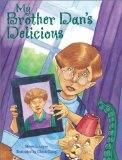{width="1.2708333333333333in"
> height="1.6666666666666667in"}
>
> Steven L. Layne's main character in [My Brother Dan\'s
> Delicious]{.underline}\--Joseph Demorett II\--relies on an emotional
> monologue to tell his story. He comes home and finds himself alone,
> which becomes a scary notion once he realises that some monster might
> be waiting to eat him. The narrator\'s fear is personified, and his
> monologue tries to convince the personified entity to do anything else
> than come after him. His best argument is that his brother Dan will be
> home soon, and he explains multiple reasons why his brother would make
> a better meal than him. When Joseph hears the front door unlocking, he
> is sure the monster has finally found his way in the house, but his
> brother Dan comes in instead, and Joseph realises how much his brother
> means to him.
>
> Discuss the techniques of persuasion (opposites, statistics (numbers),
> and repetition) and how they are evident in My Brother Dan's Delicious
> Create an anchor chart that labels the techniques of persuasion.
>
> Two elements in the text that students will attempt to imitate in
> their own monologues:

- Joseph sounds like a real person and uses expressions (voice) that
  make him come across as a personality.

- Joseph uses subtle alliteration to improve his voice\...\"magnificent
  meal\" and \"succulent sibling\"

> **My Brother Dan's Delicious Steven Layne**

Sometimes, when you're eight and a half, life throws you an unexpected
curve. In my case, it happened just last night. I went to my best
friend's Dave's house for supper, and his mother served one of her weird
casseroles. It looked to me like things were moving underneath the
crust, so I didn't eat much. I left his house at seven o'clock, walked
three blocks to my house, and that's where all the trouble started. When
I reached our front door, I found a note.

*Dear Joey,*

*Your father and I went across the street to have a cup of coffee with
the Dicksons. Dan is at the movies with a friend, but he will be home
soon.*

*Love.*

*Mum*

At first glance, the note did not appear to be a problem.. in fact, I
was thrilled! My mother and father were finally admitting that their
youngest child, a member of the gifted and talented class at Horace E.
Depworth Elementary School, was old enough to stay home alone.

At second, third, and fourth glance, however, I became rather upset. I
mean, *what was the matter with my parents?* This note was advertising
to practically the *entire world* that an innocent youngster, not to
mention the child voted most interesting Show-and-Tell speaker for three
years running, was going to be left home *alone* and *unprotected.*

Now everyone knows that monsters, especially those with a taste for
pan-fried boys, are waiting for just this kind of opportunity to come
along.

Of course, I'm too old to believe in them anymore, but if I *did* still
believe in monsters, you can be sure I'd know just how to handle this
type of situation.

The first step, of course, is to get inside the house, where your
movements cannot be easily tracked. The second step is to identify the
likely hiding places of these villainous creatures if, in fact, they are
already inside the house. The third and most important step in dealing
with monsters, however, is to *distract* them.

For example, if I felt that monster was watching me at this very moment,
thinking perhaps about a fantastic dinner featuring Joseph A. Demorett
11 as the main course, I would simply alert him to the existence of my
older, larger, *tastier* brother Dan!

There are times when sacrifice is the only way. I would miss him, but he
*does* have the bigger bedroom.

Perhaps, for the benefit of those who still give in to that occasional
moment of "monster fear," I should begin a demonstration.

Are there any monsters about? If there are, I just want you to know, my
brother Dan's *delicious!* Yes, indeedy-do. He's one ultratasty guy.
He's a succulent sibling, all right. Any monsters looking for a tender
boy to munch on would do well to stay right where you are while I share
some personal insights on what makes my brother a magnificent meal
choice.

Well, to begin with, Dan's a big guy. Sort of. Okay, so he didn't make
the wrestling team, and Lisa Jean Owen beat him up a few times. Still,
he's bigger than I am.

I mean, a guy like me would barely make an appetiser; whereas a monster
who planned well could probably get at least three good meals out of
Dan!

Do I hear the sounds of stomach growling coming from behind the basement
door? Wee, just you *stay put!*

My brother Dan will be home soon; my brother Dan's *delicious!*

Next, let's consider intake. Danny-boy eats all of the stuff Mum tells
him to -- carrots, potatoes ... even broccoli! A guy like me prefers
goodies from the candy counter at Mrs Castelli's Drugstore. I buy them
in secret, eat them in secret, and then tell Mum I'm not hungry at
dinnertime. So, any monster with dietary concerns is going to want to
grab Danny. He's like a Thanksgiving turkey already stuffed for the
platter!

Is something smacking its lips with eager anticipation inside that coat
closet? Well, just you *stay put!* My brother Dan will be home soon; my
brother Dan's *delicious!*

In most of the stories I've read, monsters have all kinds of trouble
capturing the boys they want to eat. But in Danny's case, a smart
monster will meet with easy success and have a good laugh before dinner.
In other words, Dan's not too bright.

Some boys, on the other hand, would be much more difficult to capture.
These persons would be characterized as receiving top scores on national
achievement tests as well as being the one Mrs Biggs chooses to take
messages to the office and whom she may secretly want to marry someday.

So why be depressed and disappointed trying to outsmart an intellectual
giant when I can simply tell Dan it's a costume party and dress him as a
pot roast!

Is something about to release some terribly discoloured saliva from
underneath that king-sized bed? Well, just you *stay put!* My brother
Dan will be home soon; my brother Dan's *delicious!*

Finally, and most importantly, there's an issue of *taste.* Fortunately,
I can offer personal testimony to the fact that my brother Dan is
nothing less than a thirteen-year-old, mouthwatering flavour factory!

It *is* true that I came by this knowledge through a rather painful
series of events that found Dan's hands and feet colliding with my mouth
at a force just below nuclear. Still, I must confess that in each and
every one of those situations, I noticed that my brother had a uniquely
appetising taste.

Wha ... wha ... what's that giant shadow moving just outside the
back-porch door? Well. just you *stay put!*

My brother Dan will be home soon; my brother Dan's *delicious!* Yes, my
brother Dan's *delicious, divine, delectable,* and *delightful!* He's a
meaty, mouthwatering meal of undeniable flavour. Yes! He's an
unparalleled taste sensation. He's ... uh ... uh ... a virtual *banquet*
for monsters of our day!

Hey! I know! I know! When he arrives, I'll signal any waiting monsters
with a secret code sentence. Okay? Then, he's all yours! As soon as I
get him into position, I'' yell really loud, "*My brother Dan's ...*

MY HERO!"

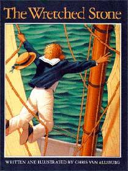{width="2.1770833333333335in"
height="2.90625in"}

The Wretched Stone begins with a notice reading: "Excerpts from the log
of the Rita Ann. Randall Ethan Hope, Captain. "We read, then, the
captain's record of an extraordinary journey. The captain writes about
loading supplies onto the ship at the start of the voyage, and the fine
crew that has been assembled by first mate Mr. Howard. He notes that many
of the men are avid readers, musicians, and storytellers, and as the
voyage is under way they are able to entertain themselves wonderfully.

The captain records the sighting of an uncharted island and decides to
disembark with his crew to look for fruit and fresh water. Then he
records their sojourn into the island's interior. He describes lush
vegetation that bears no fruit, bitter water, and an overpowering sickly
sweet smell. He also describes an object the crew found and brought
aboard: a grey rock with one smooth and glowing surface. As the crew
sets sail again, the captain describes their fascination with the stone.
All they seem to do is sit and stare into it. Soon the captain notes
that something is wrong with the

crew---they do not speak or play their instruments anymore. He believes
they may have contracted some sort of fever from the stone, and he plans
to throw it overboard. The next day he wakes to find that the crewmembers
have locked themselves into the hold with the stone. A storm approaches,
and the captain is fearful---how will he sail the ship alone? He pounds
on the door of the hold until finally it swings open. He is horrified to
find that each member of his crew has turned into an ape.

The next entry records that the storm has passed, though both masts and
the ship's rudder are lost. The mysterious stone has gone dark. The men
are still apes. As the boat drifts and waits for rescue, the captain
discovers that playing the violin and reading to the crew has a positive
effect. Discovering that the stone has begun to glow again, he covers it
up. He soon reports that the men have returned to normal; those among
them who knew how to read return most quickly to their natural forms.

The final entries record that the captain and crew have been rescued. The
captain decides to burn the boat and sink it and the stone to the bottom
of the sea and not to talk about the strange events with anyone. The
crew, he reports is back to normal---except for one thing: an unnatural
appetite for bananas.

It is fun to look at how Chris Van Allsburg dates the captain's entries
and how the tone of the entries changes to reflect the captain's changing
circumstances and mood as the stone begins to affect the crew.

**Questioning and Inferring**

We are never told what the stone is, how it came to be, or why it has
such an extraordinary power over those who spend time with it.

What do you think this stone is? Does the description remind you

of anything? (Metaphor/Symbolism)

Why did the men bring the stone onboard?

What is happening to the crewmembers? Why aren't they reading

or dancing anymore?

"Why monkeys?"

Why is it that crewmembers that know how to read are more quickly
transformed back into humans?

The stone could be a metaphor for television in many ways---a glowing
object

that draws humans to stare at it for hours at a time and shuts down

(or just doesn't make use of) creative parts of the brain.

Fritz appears as just a tail near the leg of a sailor-turned-ape in the
hold of

the ship.

"The crew is fascinated by the rock." What could the rock represent in
your life?

What happens to the stone? Does anybody find it again? Write about the
continuing adventures of the stone.

**WRITING CRAFT**

+----------------------+---------------------------------------------+
| **Focus**            | "... a tale at once provocative, exotic and |
|                      | mystical."                                  |
| **Ideas and          |                                             |
| details:**           |                                             |
+======================+=============================================+
| **Organisation**     | Excerpts from the log of the Rita Anne ...  |
|                      |                                             |
| Leads/Endings        | Leaves the reader wondering.                |
|                      |                                             |
| **Organisational     | Written as the captain's logbook.           |
| Structure:**         |                                             |
|                      |                                             |
| Sequence             |                                             |
+----------------------+---------------------------------------------+
| **Style**            | Strong verbs: *finished recorded consulted  |
|                      | missed growing returned discovered          |
| **Words: Memorable   | requiring gazing deserted locked depend     |
| Language**           | covered scuttle abandon*                    |
|                      |                                             |
| **Voice:**           | Power of three: *singing, dancing or        |
|                      | amusing*                                    |
| **Fluency:**         |                                             |
|                      | Nouns: *supplies aboard breeze omen voyage  |
|                      | sailors musical instruments passage         |
|                      | storytellers adventure charts vegetation    |
|                      | odour fever masts rudder lightning beasts   |
|                      | compartment vessel rescuers*                |
|                      |                                             |
|                      | Adverbs: *slightly approximately roughly    |
|                      | unbelievably perfectly rarely apparently    |
|                      | steadily barely*                            |
|                      |                                             |
|                      | Adjectives: *extraordinary textured glowing |
|                      | feverish wretched powerful encouraging*     |
|                      |                                             |
|                      | Hyphenated adjectives: *stooped-over        |
|                      | fashion*                                    |
|                      |                                             |
|                      | Written in journal or letterform creates a  |
|                      | particular voice, being in the third        |
|                      | person. We see into the mind of the         |
|                      | captain. He reveals his emotions and        |
|                      | thoughts to the reader of his logbook.      |
+----------------------+---------------------------------------------+
| **Conventions**      | Prefixes: un- *unbelievably unchanged       |
|                      | unfortunately unnatural*                    |
| **Punctuation:**     |                                             |
|                      | re- *returned recovered*                    |
| **Spelling:**        |                                             |
|                      | Compound words: *storytellers upright*      |
+----------------------+---------------------------------------------+

**WRITING CRAFT**

+----------------------+---------------------------------------------+
| **Focus**            |                                             |
|                      |                                             |
| **Ideas and          |                                             |
| details:**           |                                             |
+======================+=============================================+
| **Organisation**     |                                             |
|                      |                                             |
| Leads/Endings        |                                             |
|                      |                                             |
| Transitions          |                                             |
|                      |                                             |
| **Organisational     |                                             |
| Structure:**         |                                             |
|                      |                                             |
| Sequence             |                                             |
|                      |                                             |
| Description          |                                             |
|                      |                                             |
| Cause and Effect     |                                             |
|                      |                                             |
| Compare and Contrast |                                             |
|                      |                                             |
| Problem/Solution     |                                             |
+----------------------+---------------------------------------------+
| **Style**            |                                             |
|                      |                                             |
| **Words: Memorable   |                                             |
| Language**           |                                             |
|                      |                                             |
| **Voice:**           |                                             |
|                      |                                             |
| **Fluency:**         |                                             |
+----------------------+---------------------------------------------+
| **Conventions**      |                                             |
|                      |                                             |
| **Punctuation:**     |                                             |
|                      |                                             |
| **Spelling:**        |                                             |
+----------------------+---------------------------------------------+

**Text Questions and Inferences**

  -----------------------------------------------------------------------
  **Text Says ...**       **Questions**           **Inferences**
  ----------------------- ----------------------- -----------------------
                                                  

  -----------------------------------------------------------------------

+---------------------------------------------------------------------------------------------------+
| I infer \_\_\_\_\_\_\_\_\_\_\_\_\_\_\_\_\_\_\_\_\_\_\_\_\_\_\_\_\_\_\_\_\_\_\_\_\_\_\_\_\_\_:     |
+========================+========================+========================+========================+
| Questions in my head.  | Evidence from          | Evidence from the      | My conclusion.         |
|                        | illustrations.         | text.                  |                        |
+------------------------+------------------------+------------------------+------------------------+
|                        |                        |                        |                        |
+------------------------+------------------------+------------------------+------------------------+

  ---------------------------------------------------------------------
  **Questions**                      **Inferences**
  ---------------------------------- ----------------------------------
                                     

  ---------------------------------------------------------------------

Book:
\_\_\_\_\_\_\_\_\_\_\_\_\_\_\_\_\_\_\_\_\_\_\_\_\_\_\_\_\_\_\_\_\_\_\_\_\_\_\_\_

  ---------------------------------------------------------------------
  **Inference**                      **Evidence**
  ---------------------------------- ----------------------------------
                                     

  ---------------------------------------------------------------------

**The Wretched Stone Chris Van Allsburg**

Excerpts from the Log of the Rita Anne. Randall Ethan Hope, Captain

*May 8*

We finished bringing supplies aboard early this morning. At midday we
left on the tide and found a fresh breeze outside the harbour. It is a
good omen that our voyage has begun with fair winds and a clear sky.

*May 9*

The first mate, Mr Howard, has brought together a fine crew. These men
are not only good sailors, they are accomplished in other ways.

Many read and have borrowed books from my small library. Some play
musical instruments, and there are a few good storytellers among them.

*May 17*

Our passage is going well. The usual boredom that comes with many days
at sea is not present on this ship. When the members of this clever crew
are not on duty, I find them singing and dancing or amusing each other
with tales of past adventure.

*June 5*

Land ho! Slightly before sunset we spotted an island. I have consulted
my charts, but do not see it recorded. This is odd, since ships have
sailed through these waters for years. Apparently they have all missed
this small place. We are low on water and would be happy to find fresh
fruit growing here. Tomorrow I will take some men ashore and look about.

*June 6*

I have just returned from the island. It is strange indeed. The
vegetation is lush, but not a single plant bears fruit. The air has an
odour that at first seems sweet and pleasant, then becomes an
overpowering stink. I saw no sign of animal life, not even an insect. We
found a spring that had water too bitter to drink. We also discovered
something quite extraordinary, which I have brought aboard.

It is a rock, approximately two feet across. It is roughly textured,
grey in colour, but a portion of it is as flat and smooth as glass. From
his surface comes a glowing light that is quite beautiful and pleasing
to look at. The thing is unbelievably heavy, requiring six strong men to
lift it. With great effort we were able to get it aboard and into the
forward hold. We have set sail and are under way again.

*June 10*

The crew is fascinated by the rock. When not needed on deck, they are
down below, gazing in silence at the peculiar light it gives off. I miss
the music and storytelling that has become part of our ship's life. The
last few days have passed quite slowly. The men, however, seem perfectly
content. I am sure their interest in the stone will fade away soon.

*June 13*

Something is wrong with the crew. They rarely speak, and though they
swing through the rigging more quickly than ever, they walk the decks in
a clumsy, stoop-over fashion. Last night I heard shrieks coming from the
forward hold. I believe they have contracted some kind of fever that
came on board with the stone. I told Mr Howard that tomorrow I will have
the thing thrown overboard.

*June 14*

This morning I awoke to find the deck deserted. The wheel was tied
steady with a rope. I believe Mr Howard, who spent some time around the
rock, told the men about my plan to get rid of it. They have now locked
themselves in the forward hold. They apparently believe, in their
feverish state, that I can sail this boat alone while they sit around
that wretched stone.

This is, I am sure, my last entry. What I have seen is so horrifying I
barely have the strength to write it down. After I pounded at the door
to the forward hold, it finally swung open. But it was not a man who
opened the door, it was an ape. The whole crew has turned into hairy
beasts. They just sat there, grinning at that terrible rock. They don't
understand a word I say. We are doomed.

*June 16*

The storm has passed. The *Rita Anne* is still afloat, but both masts
and rudder are lost. The stone has gone dark. We were struck by
lightning twice during the storm. I believe that was the cause.
Unfortunately, the crew is unchanged. They are still beasts, but seem
sad and lost without the glowing rock. I have moved them back to their
quarters. We have food for two weeks. I am hopeful of a rescue.

*June 19*

I have made an encouraging discovery. I am playing the violin and
reading to the crew. It is having a positive effect. They are walking
upright and have an alert look in their eyes.

*June 24*

I was in the forward hold today. A dull glow was coming from the stone.
I have covered it and will keep the compartment locked.

*June 28*

I am happy to report that the men have returned to normal. It seems that
those who knew how to read recovered most quickly.

*June 30*

We are saved! A ship has been spotted off our starboard side. I have
decided to scuttle the *Rita Anne.* There is only one place for the
wretched stone. Before we abandon ship, I will set a fire that will send
this vessel and her cargo to the bottom of the sea.

*July 12*

Our rescuers have left us in the harbour town of Santa Pango. One by one
the crew should be able to sign on to ships passing through and work
their way home. We have made an agreement not to talk about the strange
events that took place aboard the *Rita Anne.* The men appear to have
recovered completely, though some show an unnatural appetite for the
fruit that is available here.

{width="7.583333333333333in"
height="5.6875in"}

{width="7.583333333333333in"
height="5.6875in"}

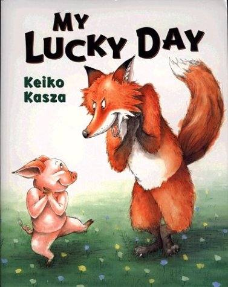{width="2.125in"
height="2.6666666666666665in"}

A hungry fox can\'t believe his luck when a pig actually shows up on his
doorstep. \"Oh no!\" screams the piglet, who\'s mistaken the fox\'s
house for Rabbit\'s. \"Oh yes!\" the fox gleefully replies, grabbing the
pig and getting out the frying pan. But all is not what it seems in
Keiko Kasza\'s crafty tale. The fox\'s dinner preparations grow more and
more complex as the pig points out how dirty he is (resulting in a nice
warm bath), how scrawny he is (a nice big meal to fatten him up), and
how tough he is (a tenderising massage). By the night\'s end, Fox is too
exhausted to cook the pig, while the sly swine has had a treatment
worthy of the finest spa. Keiko delivers a cunning ending that makes an
already hilarious story even funnier.

**Inferring**

Challenge students by asking them what they can infer at various points
in the story when an unstated detail can be inferred from text or

through the pictures.

Predict -- What do you think the story will be about? Whose Lucky Day
will it be? Who do you think will be at the door? Do you think the
piglet will be able to escape Mr. Fox? How do you think Mr. Fox will
fatten up the piglet? How will the fox tenderise the piglet? Where did
Mr. Fox go? What do you think the piglet will do now that Mr. Fox has
passed out?

**READING STRATEGIES Why? To gain meaning from our reading.**

+------------------------------+--------------------------------------+
| **STRATEGY**                 | **EXAMPLE**                          |
+==============================+======================================+
| **PRIOR KNOWLEDGE**          | Text-to-text connection. Connect to  |
|                              | The Wolf's Chicken Stew by Keiko     |
|                              | Kasza because both the wolf and Mr.  |
|                              | Fox wanted to catch another animal,  |
|                              | only to have that other animal       |
|                              | outsmart him.                        |
+------------------------------+--------------------------------------+
| **QUESTIONING**              | {possible questions before} I wonder |
|                              | what the story is about. I wonder    |
|                              | whose lucky day it is. I wonder if   |
|                              | it is the fox or the pig that is     |
|                              | lucky. {possible questions during} I |
|                              | wonder why the piglet keeps helping  |
|                              | the fox. I wonder why the pig looks  |
|                              | so happy if he is just going to be   |
|                              | eaten. I wonder why the fox looks so |
|                              | angry while he is preparing his pig  |
|                              | roast. {possible questions after} I  |
|                              | wonder if the piglet will trick the  |
|                              | bear like he tricked the fox.        |
+------------------------------+--------------------------------------+
| **VISUALISING**              |                                      |
+------------------------------+--------------------------------------+
| **INFERRING**                | Drawing conclusions & inferring --   |
|                              | Do you think the bear at the end of  |
|                              | the story will be tricked like Mr.   |
|                              | Fox was tricked? {text clues} The    |
|                              | piglet was pretty clever when he was |
|                              | with Mr. Fox. He came to the bear's  |
|                              | house looking filthy just like he    |
|                              | did at Mr. Fox's house {my           |
|                              | conclusion} I think the bear will be |
|                              | tricked just like Mr. Fox was.       |
+------------------------------+--------------------------------------+
| **DETERMINING IMPORTANT      | Main idea & details - {main idea}    |
| IDEAS**                      | Mr. Fox was getting the piglet ready |
|                              | for roasting. {details} He gave the  |
|                              | piglet a bath, a nice meal and a     |
|                              | massage'                             |
|                              |                                      |
|                              | Theme: Triumph of the underdog.      |
+------------------------------+--------------------------------------+
| **SYNTHESISING**             | Mr. Fox said it was his lucky day,   |
|                              | but it was really the piglet's lucky |
|                              | day. What would you tell the bear at |
|                              | the end of the story about piglet so |
|                              | he won't get tricked like Mr. Fox    |
|                              | did.                                 |
|                              |                                      |
|                              | Summarise - {someone} Mr. Fox        |
|                              | {wanted} wanted a roast pig for      |
|                              | dinner {but} but was tricked by the  |
|                              | piglet into giving him a nice bath,  |
|                              | delicious dinner and a relaxing      |
|                              | massage. {then} Then Mr. Fox passed  |
|                              | out from exhaustion. {finally}       |
|                              | Finally the piglet went home, happy  |
|                              | as can be.                           |
+------------------------------+--------------------------------------+

**WRITING CRAFT**

+----------------------+---------------------------------------------+
| **Focus**            | Main idea & details - {main idea} Mr. Fox   |
|                      | was getting the piglet ready for roasting.  |
| **Ideas and          | {details} He gave the piglet a bath, a nice |
| details:**           | meal and a massage.                         |
+======================+=============================================+
| **Organisation**     | Beginning, middle, end - {most important    |
|                      | event from beginning} The pig knocked on    |
| Leads/Endings        | Mr. Fox's door. {most important event from  |
|                      | middle} Mr. Fox bathed, massaged and fed    |
| Transitions          | the pig a nice meal. {most important event  |
|                      | from end} Mr. Fox passed out because he was |
| **Organisational     | so exhausted.                               |
| Structure:**         |                                             |
|                      | Story elements - list title, author,        |
| Sequence             | characters, setting, beginning, middle,     |
|                      | end, or problem & solution.                 |
| Description          |                                             |
|                      | Sequence -- events in order.                |
| Cause and Effect     |                                             |
|                      | Piglet knocks on Mr. Fox's door. Mr. Fox    |
| Compare and Contrast | grabs piglet. Mr. Fox starts to prepare the |
|                      | piglet for the roast. Piglet suggests a     |
| Problem/Solution     | bath since he is filthy. Mr. Fox gives      |
|                      | piglet a bath. Piglet tells Mr. Fox that he |
|                      | should be fattened up before cooking. Mr.   |
|                      | Fox fixes the piglet a delicious meal.      |
|                      | Piglet tells Mr. Fox that his muscles are a |
|                      | bit tough, so Mr. Fox gives piglet a nice   |
|                      | massage. Mr. Fox collapses from exhaustion  |
|                      | because of all the work. The piglet runs    |
|                      | home as happy as can be.                    |
|                      |                                             |
|                      | Cause and effect -- *Why did Mr. Fox grab   |
|                      | the piglet*? Because he was standing at his |
|                      | front door. *Why did the piglet kick and    |
|                      | squeal?* Because Mr. Fox grabbed him. *Why  |
|                      | did Mr. Fox give the piglet a bath?*        |
|                      | Because he was filthy. *Why did Mr. Fox     |
|                      | give piglet and nice meal?* Because he      |
|                      | needed to fatten him up. *Why did Mr. Fox   |
|                      | give piglet a massage?* So he could make    |
|                      | him tender. *Why did Mr. Fox pass out?*     |
|                      | Because he was exhausted.                   |
|                      |                                             |
|                      | Compare & contrast -- Mr. Fox to piglet.    |
|                      | Compare Mr. Fox to the wolf in The Wolf's   |
|                      | Chicken Stew by Keiko Kasza.                |
|                      |                                             |
|                      | Problem & solution - {piglets problem}      |
|                      | Piglet was caught by Mr. Fox. {solution}    |
|                      | Piglet tricked Mr. Fox into doing a lot     |
|                      | things for him such as a nice bath,         |
|                      | delicious dinner and a relaxing massage.    |
|                      | Mr. Fox passed out exhausted from all the   |
|                      | work.                                       |
+----------------------+---------------------------------------------+
| **Style**            | Strong Verbs: *grabbed hauled polished      |
|                      | picked baked occurred pushed pulled*        |
| **Words: Memorable   |                                             |
| Language**           | Word pairs: *kicked and squealed*           |
|                      |                                             |
| **Voice:**           | Comparative and Superlative: *fattest       |
|                      | cleanest harder softest*                    |
| **Fluency:**         |                                             |
|                      | ... *the cleanest, fattest and softest      |
|                      | piglet*                                     |
|                      |                                             |
|                      | Words as well as said: *thought yelled      |
|                      | sighed growled shouted cried wondered*      |
|                      |                                             |
|                      | Varying sentence length.                    |
+----------------------+---------------------------------------------+
| **Conventions**      | Exclamation marks. Talking marks.           |
|                      |                                             |
| **Punctuation:**     | Ellipses.                                   |
|                      |                                             |
| **Spelling:**        | Abbreviations: *I've I'd shouldn't isn't    |
|                      | you're let's couldn't*                      |
+----------------------+---------------------------------------------+

**Character**

Study the characters of the fox and the pig. Anticipate the
characteristics of each, pausing on the page in which the fox is
carrying the pig to put in the roasting pan. Make a list of adjectives
the children provide to describe the

fox and the pig. Once the story is finished, revisit the earlier list
and cross off the characteristics that did not match, and add new words
to describe the fox and pig. Talk about what makes a character a
"trickster" and discuss other tricksters the children may have
encountered in other books.

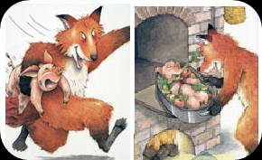{width="3.34375in"
height="2.0416666666666665in"}

Discussion: Discuss the "big bad" characters in various folktales and
stories. Why do you think the author chose to use a fox character
instead of a wolf?

Students write or tell about a time when they had a "lucky day"

Use the final page of the book to write a sequel to the story.

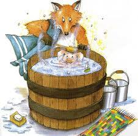{width="2.3541666666666665in"
height="2.3229166666666665in"}

**My Lucky Day**

**Keiko Kasza**

One day, a hungry fox was preparing to hunt for his dinner. As he
polished his claws, he was startled by a knock at the door.

"Hey, Rabbit!" someone yelled outside. "Are you home?"

*Rabbit?* thought the fox. *If there were any rabbits in here, I'd have
eaten them for breakfast.*

When the fox opened the door, there stood a delicious-looking piglet.

"Oh, no!" screamed the piglet.

"Oh, yes!" cried the fox. "You've come to the right place."

He grabbed the piglet and hauled him inside.

"This must be my lucky day!" the fox shouted. "How often does dinner
come knocking on the door?"

The piglet kicked and squealed. "Let me go! Let me go!"

"Sorry, pal," said the fox. "This isn't just any dinner. It's pig roast.
My favourite! Now get into this roasting pan."

It was useless to struggle. "All right," sighed the piglet. "I will. But
there is just one thing."

"What?" growled the fox.

"Well, I am a pig, you know. I'm filthy. Shouldn't you wash me first?
Just a thought, Mr Fox."

"Hmmm..." the fox said to himself, "he is filthy."

So the fox got busy. He collected twigs. He made a fire. He carried in
the water. And, finally, he gave the piglet a nice bath.

"You're a terrific scrubber," said the piglet.

"There," said the fox. "Now, you're the cleanest piglet in the county.
You stay still, now!"

"All right," sighed the piglet. "I will. But..."

"But what?" growled the fox.

"Well, I am a very small piglet, you know. Shouldn't you fatten me up to
get more meat? Just a thought, Mr Fox."

"Hmmm..." the fox said to himself, "he is on the small side."

So the fox got busy. He picked tomatoes. He made spaghetti. He baked
cookies. And, finally, he gave the piglet a nice dinner.

"You're a terrific cook," said the piglet.

"There," said the fox. "Now you're the fattest piglet in the county. So
get into the oven!"

"All right," sighed the piglet. "I will. But..."

"What? What? WHAT?" shouted the fox.

"Well, I am a hardworking pig, you know. My meat is awfully tough.
Shouldn't you massage me first to make a more tender roast? Just a
thought, Mr Fox."

"Hmmm..." the fox said to himself, "I do prefer tender meat."

So the fox got busy. He pushed... and he pulled. He squeezed and he
pounded the piglet from head to toe.

"You give a terrific massage," said the piglet. "But." The piglet
continued. "I've been working really hard lately. My back is awfully
stiff. Could you push a bit harder, Mr Fox? A little to the right,
please ... yes, yes ... now just a little to the left ... Mr Fox, are
you there?"

But Mr Fox was no longer listening. He had passed out, exhausted. He
couldn't lift a finger, let alone a roasting pan.

"Poor Mr Fox," sighed the piglet. "He's had a busy day." Then the
cleanest, fattest and softest piglet in the county picked up the rest of
his cookies and headed for home.

"What a bath! What a dinner! What a massage!" cried the piglet. "This
must be my lucky day!"

When he got home, the piglet relaxed before a warm fire. "Let's see," he
wondered, looking at his address book. "Who shall I visit next?"

Fox Bear

Log Cabin House with

Up on the hill red roof by

Wolf Coyote

Next to the Cave under

tallest pine the hanging

tree. rock.

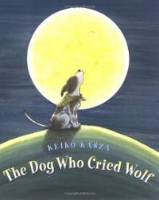{width="2.0833333333333335in"
height="2.6145833333333335in"}

Moka the dog is happy to spend time with his owner, Michelle, until the
day she reads him a book about wolves. She tells him that he is kind of
like a wolf. That discovery then leads Moka to contemplate how wolves
run free, hunt wild animals and stay up late to howl at the moon while
he is nothing but

a house pet who is made to dress up for Michelle's tea parties. He
sneaks away, runs to a mountain top and leads the free life---but finds
that catching your own food and encountering real wolves is not as
enticing as he thought.

**READING STRATEGIES Why? To gain meaning from our reading.**

+------------------------------+--------------------------------------+
| **STRATEGY**                 | **EXAMPLE**                          |
+==============================+======================================+
| **PRIOR KNOWLEDGE**          | Dogs and wolves.                     |
+------------------------------+--------------------------------------+
| **QUESTIONING**              | Before: See prediction.              |
|                              |                                      |
|                              | During: *Why did Moka want to be a   |
|                              | wolf?*                               |
|                              |                                      |
|                              | After: *What will happen after       |
|                              | Michelle reads the book about        |
|                              | monkeys?*                            |
+------------------------------+--------------------------------------+
| **VISUALISING**              | *He gazed at the golden moon and     |
|                              | howled as loudly as he could:        |
|                              | "Haooooooooo ...'" just like a       |
|                              | wolf.*                               |
|                              |                                      |
|                              | *He missed Michelle.*                |
+------------------------------+--------------------------------------+
| **INFERRING**                | Predict: Front cover. Why is the dog |
|                              | howling at the moon?                 |
|                              |                                      |
|                              | On the title page, the picture shows |
|                              | Moka the dog looking at a book about |
|                              | wolves. The expression on his face   |
|                              | seems to indicate that he is         |
|                              | thinking about what he sees in the   |
|                              | book. What might be on his mind?     |
|                              |                                      |
|                              | , "And even a field mouse made fun   |
|                              | of him." Clearly, it is through the  |
|                              | illustration that children must      |
|                              | visually infer what the field mouse  |
|                              | did and how he made fun of Moka the  |
|                              | dog. Children must make the          |
|                              | inference that the mouse dug a hole  |
|                              | to escape from Moka and has surfaced |
|                              | behind Moka, unseen, and is making a |
|                              | teasing face to the dog's back side. |
|                              |                                      |
|                              | What will happen after Michelle      |
|                              | reads the book about monkeys?        |
+------------------------------+--------------------------------------+
| **DETERMINING IMPORTANT      | Theme work.                          |
| IDEAS**                      |                                      |
+------------------------------+--------------------------------------+
| **SYNTHESISING**             | Summarising:                         |
|                              |                                      |
|                              | Somebody Wanted But So               |
+------------------------------+--------------------------------------+

**\
WRITING CRAFT**

+----------------------+---------------------------------------------+
| **Focus**            | The dog wanted to be a wolf.                |
|                      |                                             |
| **Ideas and          |                                             |
| details:**           |                                             |
+======================+=============================================+
| **Organisation**     | Lead: Character -- *Moka was a good dog.*   |
|                      |                                             |
| Leads/Endings        | Ending: Journey -- *Moka goes on a journey  |
|                      | and returns.* Anticipation - ... *until one |
| Transitions          | day, she reads a book about monkeys ...*    |
|                      |                                             |
| **Organisational     | *The next day ... By nightfall ...*         |
| Structure:**         |                                             |
|                      | Moka wants to be wolf -- he discovers real  |
| Problem/Solution     | wolves and returns home.                    |
+----------------------+---------------------------------------------+
| **Style**            | Strong verbs: *loved danced peed jumped     |
|                      | snuck*                                      |
| **Words: Memorable   |                                             |
| Language**           | *pinched sprayed outran missed gazed froze  |
|                      | reached dashed*                             |
| **Voice:**           |                                             |
|                      | Word pairs: *turned and raced*              |
| **Fluency:**         |                                             |
|                      | Words as well as said: *thought sighed      |
|                      | yelped*                                     |
|                      |                                             |
|                      | *exclaimed cried mumbled howled panted      |
|                      | shouted*                                    |
|                      |                                             |
|                      | Sense of person writing.                    |
|                      |                                             |
|                      | Varying sentence length: *He ran. He        |
|                      | jumped. He danced. And he peed wherever he  |
|                      | wanted.*                                    |
|                      |                                             |
|                      | Repetition: *He ran, and ran, and ran ...*  |
+----------------------+---------------------------------------------+
| **Conventions**      | Ellipses. Exclamation marks. Talking marks. |
|                      |                                             |
| **Punctuation:**     | Onomatopoeia: *Haoooooo.*                   |
|                      |                                             |
| **Spelling:**        | Compound words: *nightfall outran*          |
|                      |                                             |
| **Grammar:**         | Abbreviations: *you're I'm can't*           |
|                      |                                             |
|                      | 'And' sentence beginning.                   |
+----------------------+---------------------------------------------+

**The Dog Who Cried Wolf Keiko Kasza**

Moka was a good dog. He and Michelle loved to be together. Life was
perfect, until one day, she read a book about wolves.

"Look, Moka," said Michelle, "you're kind of like a wolf!"

Wow! thought Moka. I *am* kind of like a wolf. But look how amazing
wolves are! They run around free, hunt wild animals, and stay up late to
howl at the moon.

And look at the way I live, Moka sighed. I'm nothing but a house pet. He
felt like a failure, especially when Michelle made him dress up for her
tea parties. He wanted to be a wolf.

The next day, Moka made up his mind. He snuck out of the house and took
off for the mountains. He ran, and ran, and ran ...

... until finally he reached a high mountaintop. "I'm free!" he yelped.
"Free as a wolf!"

He ran. He jumped. He danced. And he peed wherever he wanted. "Wow!" he
exclaimed. "The world is mine!"

Soon, Moka got hungry. "No problem!" he cried. "I'll hunt for my food,
just like the wolves do."

And off he went. But a rabbit outran him. A skunk sprayed him. A beetle
pinched him. And even a field mouse made fun of him.

By nightfall, Moka was miserable. He missed Michelle. "I even miss her
tea parties," he mumbled. "But I can't give up yet. There is just one
more thing I have to try ..."

He gazed at the golden moon and howled as loudly as he could:
"Haooooooooo ...," just like a wolf.

Suddenly, something howled back! "Haooooooo ... Haooooooo ..." and then
again, "Haoooooo ..."

Moka froze.

"Woooooooolves!" he cried. "Real wolves!"

He turned and raced down the mountain. "I want to go home!" he panted.
"I never want to be a wolf again!"

He ran, and ran, and ran ...

... until finally he reached the house he knew so well.

"Moka!" Michelle shouted as she dashed out to meet him.

**"You're back!"**

Moka was home again, and he and Michelle were oh, so happy! Life was
just perfect, until one day, she read a book about monkeys ...

Through a variety of activities related to

The Salamander Room book and the Reading

Rainbow program, students will have

opportunities to:

understand cause and effect through a

character's actions

distinguish between reality and fantasy

create an environment for an animal

record information about rainforests on a K-W-L-S chart

organize a classroom Discover Rainforest Center

use a thesaurus to select exact verbs for sentence writing

use onomatopoeia to describe the rainforest environment

compose rainforest riddles

create a rainforest alphabet to write a book

write a "porquoi tale" to explain the unique characteristic

of a rainforest animal

vicariously experience a trek through the rainforest

complete a rainforest trail guide book

design a travel brochure

write a diary entry for a rainforest animal

create a class rainforest newsletter

use exaggeration and descriptive language to describe

rainforest animals

compare and contrast rainforests of the world using a Venn

diagram

Language Arts and Literature Activities

Why did that happen? Use The Salamander Room to illustrate why

making a home for an animal is such a complicated task. Write the

following phrases on chart paper. Ask students to explain what

caused Brian to do each of these things. Each cause is shown in

parenthesis.

bring in leaves and moss (to make a salamander bed )

bring in crickets and bullfrogs (to sing the salamander to sleep)

collect wet leaves, tree stumps, and boulders (to provide a place

for the salamander to play)

bring in another salamander (to provide a friend)

bring in insects and make a pool of water (so the salamanders

could eat and drink)

bring in birds and bullfrogs (to control the multiplying insects)

provide trees and ponds (to make a home for the birds and

bullfrogs)

lift off the ceiling (so the birds could fly, the sun would shine

in, and the trees and plants could grow)

Real or make-believe? Return to the list. Which of Brian's plans

could realistically be carried out? Which plans could not and

why? Ask students to conclude whether The Salamander Room is a

realistic story. What real lesson did they learn from the story?

(Lead students to see how the story teaches about the natural

habitat of salamanders. It also shows that a house is not a

suitable home for most wild animals.)

An animal room of your very own. Just for fun, provide students

with a copy of the reproducible "The \_\_\_\_\_\_\_\_ Room" found on
page

00 at the end of this section. Have them choose any interesting

wild animal they would like to have for their own and plan a special
room as a

habitat for this animal by answering the

questions. Set aside time for sharing. Then ask students to

determine if any of the animal rooms described are a real

possibility.

K-W-L-S chart for rainforests. Use butcher paper to make a large

class K-W-L-S chart like the following. The chart is also

available as a reproducible on page 00 at the end of this

section. Students can fill in individual charts independently,

work in small groups to fill a chart, or work as a whole group

with one large class chart.

RA

IN

FO

RE

ST

S

What I

Already Know

What I Want

to Know

What I Have

Learned

What I Still

Need to Learn

After sharing the video, have students recall what they learned

about rainforests from the segment featuring Jungle World at the

Bronx Zoo. They can write their ideas or dictate for you to write

in the first column under "What I Already Know." Continue by

inviting students to write or dictate questions for the second

column on the chart. As activities from the curriculum package

are performed and information is shared, students can continue to

add questions as well as fill in the third section on the chart.

Return to the chart when this unit of study is nearing its

completion, and have students write further questions or topics

to research on their own for column four. If a group chart was

used, display it in your classroom Discover Rainforests Center.

Individual charts can be stored in student portfolios.

Rainforest Read Fest. Invite students to visit the classroom

Discover Rainforests Center that has been set up with books,

posters, and pictures that were collected as part of the Getting

Started activities. Revisit page 00 at the beginning of this

guide for details.

Set aside time for students to browse and read individually, with

partners, or in small groups. If some books are particularly

interesting, share them with the whole group. Expose students to

as much information as possible to learn about rainforests around

the world. A good selection of books is listed in the Appendix.

Students will be able to add more ideas to their K-W-L-S chart as

they read and share.

Jungle movements. Brainstorm a list of jungle animal names. Talk

about how each animal moves through the jungle. Volunteers can

demonstrate. Then ask students to assign a special verb to name

the animal action. Use a Thesaurus to choose the best possible verb and
to avoid

using the same action words. For example, a

substitute for the action word jump might be leap, spring,

- Reread the book focusing on Brian\'s responses to each of his
  mother\'s comments and questions. Which of Brian\'s solutions are
  realistic? Which would not be possible? Are there other ways for Brian
  to appropriately care for his pet?

- In the story, Brian addresses each of his salamander\'s needs by
  responding to his mother\'s comments and questions. As you read the
  story to your class, pause to let them predict each of those needs
  before you read about Brian\'s actions.

- Focusing again on Brian\'s mother\'s comments and questions, how would
  the salamander respond?

- Discuss wild animals versus pets. Is it possible for people to make
  pets of wild animals? Can people really provide an appropriate
  environment for wild animals?

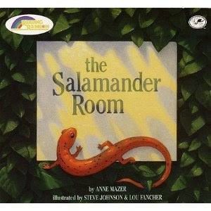{width="3.125in"
height="3.125in"}

When Brian finds a salamander in the woods, he takes it home to live
with him. By addressing his new pet\'s needs, Brian gradually creates a
forest environment in his bedroom. The vivid illustrations depict the
bedroom-turned-forest. The text allows the reader to discover the world
of the forest layer by layer and to better understand the
interdependence of creatures and their environment.

While the images of Brian in his private spaces are rooted in realism,
Johnson uses unusual perspectives to create a child-like reference to
size and scale. The full range of colour can be seen in the muted tones
that serve to unify the pictures.

**Things to Talk About and Notice**

- Reread the book focusing on Brian\'s responses to each of his
  mother\'s comments and questions. Which of Brian\'s solutions are
  realistic? Which would not be possible? Are there other ways for Brian
  to appropriately care for his pet?

- In the story, Brian addresses each of his salamander\'s needs by
  responding to his mother\'s comments and questions. As you read the
  story to your class, pause to let them predict each of those needs
  before you read about Brian\'s actions.

- Focusing again on Brian\'s mother\'s comments and questions, how would
  the salamander respond?

- Discuss wild animals versus pets. Is it possible for people to make
  pets of wild animals? Can people really provide an appropriate
  environment for wild animals?

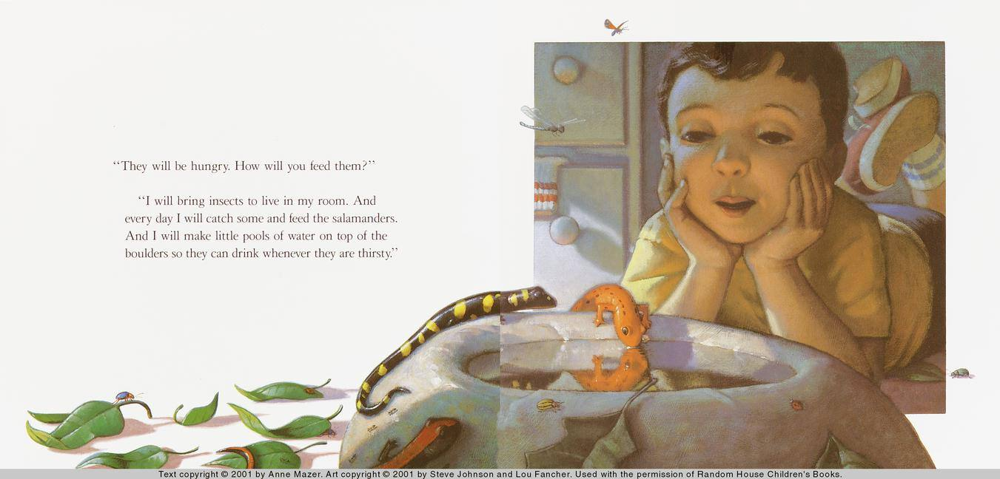{width="6.268055555555556in"
height="3.0064391951006124in"}

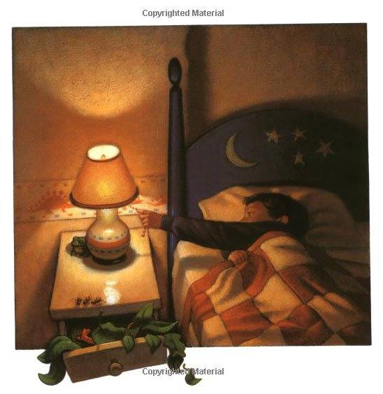{width="5.708333333333333in"
height="5.875in"}

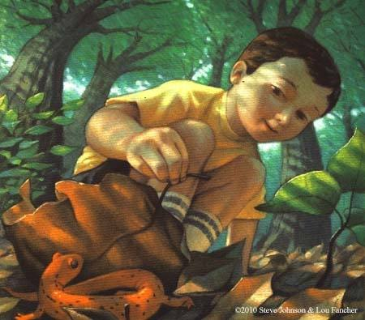{width="4.6875in"
height="4.114583333333333in"}

Extension:

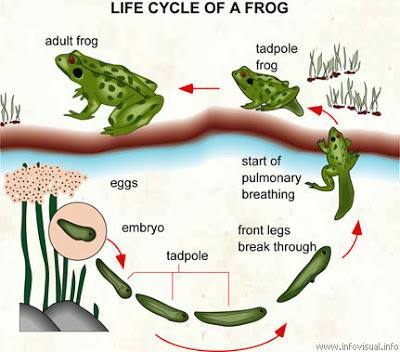{width="4.166666666666667in"
height="3.6666666666666665in"}

**The Salamander Room Anne Mazer**

Brian found a salamander in the woods. It was a little orange salamander
that crawled through the dried leaves of the forest floor.

The salamander was warm and cosy in the boy's hand. "Come live with me,"
Brian said.

He took the salamander home.

"And when he wakes up, where will he play?"

"I will carpet my room with shiny wet leaves and water them so he can
slide around and play. I will bring tree stumps into my room so he can
climb up the bark and sun himself on top. And I will bring boulders that
he can creep over."

"He will miss his friends in the forest?"

"I will bring salamander friends to play with him."

"They will be hungry. How will you feed them?"

"I will bring insects to live in my room. And every day I will catch
some and feed the salamanders. And I will make little pools of water on
top of the boulders so they can drink whenever they are thirsty."

"The insects will multiply, and soon there will be bugs and insects
everywhere."

"I will find birds to eat the extra bugs and insects. And the bullfrogs
will eat them too."

"Where will the birds and bullfrogs live?"

"I will bring trees for the birds to roost in, and make ponds for the
frogs."

"Birds need to fly."

"We can lift off the ceiling. They will sail out in the sky, but they
will come back to my room when it is time for dinner, because they will
know that the biggest, juiciest insects are there."

"And you -- where will you sleep?"

"I will sleep on a bed under the stars, with the moon shining through
the green leaves of the trees; owls will hoot and crickets will sing;
and next to me, on the boulder with its head resting on soft moss, the
salamander will sleep."

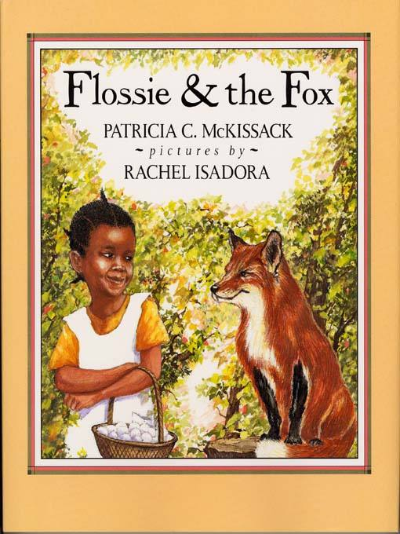{width="2.6875in"
height="3.5833333333333335in"}

A fox has been circling the McCutchin place and their hens won't lay
eggs, so sassy Flossie Finley is dispatched to deliver a basketful to
them. On her way, she meets a bushy-tailed, yellow-eyed, sharp-clawed
critter that can't seem to shake the child's confidence. 

The **fox** tries to **persuade Flossie** with facts that he is
a **fox** so that she will be scared \...

**Flossie & the Fox Patricia McKissack**

"Flo-o-o-ossie!"

The sound of Big Mama's voice floated past the cabins in Sophie's
Quarters, round the smokehouse, beyond the chicken coop, all the way
down to Flossie Finley. Flossie tucked her straw doll in a hollow log,
the hurried to answer her grandmother's call.

"Here I am, Big Mama," Flossie said after catching her breath. I was
hot, hotter than a usual Tennessee August day.

Big Mama stopped sortin' peaches and wiped her hands and face with her
apron. "Take these to Miz Viola over at the McCutchin place," she say
reaching behind her and handing Flossie a basket of fresh eggs. "Seem
like they been troubled by a fox. Miz Viola's chickens be so scared,
they can't even now lay a stone." Big Mama clicked her teeth and shook
her head.

"Why come Mr. J. W. can't catch the fox with his dogs?" Flossie asked,
putting a peach in her apron for later.

"Ever-time they corner that ol' slickster, he gets away. I tell you,
that fox is one sly critter."

"How do a fox look?" Flossie asked. "I disremember ever seeing one."

"Big Mama had to think at bit. "Chile, a fox be just a fox. But one
thing for sure, that rascal loves eggs. He'll do most anything for get
at some eggs."

Flossie tucked the basket under her arm and started on her

way. "Don't tarry now," Big Mama called. "And be particular 'bout them
eggs."

"Yes'um," Flossie answered.

The way through the woods was shorter and cooler than the road route
under the open sun. What if I come upon a fox? thought Flossie. Oh well,
a fox be just a fox. That aine so scary.

Flossie commenced to skip along, when she come upon a critter she
couldn't recollect ever seeing. He was sittin' 'side the road like he
was expectin' somebody. Flossie skipped right up to him and nodded a
greeting the way she'd been taught to do.

"Top of the morning to you, Little Missy," the critter replied. "And
what is your name?"

"I be Flossie Finley," she answered with a proper curtsy. I reckon I
don't know who you be either."

Slowly the animal circled around Flossie. "I am a fox," he announced,
all the time eying the basket of eggs. He stopped in front of Flossie,
smiled as best a fox can, and bowed. "At your service."

Flossie rocked back on her heels then up on her toes, back and forward,
back and forward ... carefully studying the creature who was claiming to
be a fox.

"Nope," she said at last. "I just purely don't believe it."

"You don't believe what?" Fox asked, looking away from the basket of
eggs for the first time.

"I don't believe you a fox, what's what."

Fox's eyes flashed anger. Then he chuckled softly. "My dear child," he
said, sounding rightly disgusted, "of course I'm a fox. A little girl
like you should simply be terrified of me. Whatever do they teach
children these days?"

Flossie tossed her head in the air. "Well, whatever you are, you sho' do
think a heap of yo'self," she said, and skipped away.

Fox looked shocked. "Wait," he called. "You mean ... you're not
frightened? Not just a bit?"

Flossie stopped. Then she turned and said, "I aine never seen a fox
before. So, why should I be scared of you and I don't even-now know you
a real fox for a fact?"

Fox pulled himself tall. He cleared his throat. "Are you saying I must
offer proof that I am a fox before you will be frightened of me?"

"That's just what I'm saying."

Li'l Flossie skipped on through the piney woods while that Fox fella
rushed way lookin' for whatever he needed to prove he was really who he
said he was.

Meanwhile Flossie stopped to rest 'side a tree. Suddenly Fox was beside
her. "I have the proof," he said. "See, I have thick, luxurious fur.
Feel for yourself."

Fox leaned over for Flossie to rub his back.

"Ummmm. Feels like rabbit fur to me," she say to Fox. "Shucks! You aine
no fox. You a rabbit, all the time trying to fool me."

"Me! A rabbit!" he shouted. "I have you know my reputation precedes me.
I am the third generation of foxes who have out-smarted and out-run Mr.
J. W. McCutchin's fine hunting dogs. I have raided some of the best
henhouses from Franklin to Madison. Rabbit indeed! I am a fox, and you
will act accordingly."

Flossie hopped to her feet. She put her free hand on her hip and patted
her foot. "Unless you can show you a fox, I'll not accord you nothing!"
And without further ceremony she skipped away.

Down the road a piece, Flossie stopped by a bubbly spring. She knelt to
get a drink of water. Fox came up to her and said, "I have a long
pointed nose. Now that should be proof enough."

"Don't prove a thing to me." Flossie picked up some wild flowers. "Come
to think of it," she said matter-of-fact-like, "rats got long pointed
noses." She snapped her fingers. "That's it! You a rat trying to pass
yo'self off as a fox."

That near 'bout took Fox's breath away. "I beg your pardon," he gasped.

"You can beg all you wanna," Flossie say skipping on down the road.
"That still don't make you no fox."

"I'll teach you a think or two, young lady," Fox called after her. "You
just wait and see."

Before long Flossie came to a clearing. A large orange tabby was sunning
on a tree stump. "Hi, pretty kitty," the girl say and rubbed the cat
behind her ears. Meanwhile Fox slipped from behind a clump of bushes.

"Since you won't believe me when I tell you I am a fox," he said
stiffly, "perhaps you will believe that feline creature, toward whom you
seem to have some measure of respect."

Flossie looked at the cat and winked her eye. "He sho' use a heap o'
words," she whispered.

Fox beckoned for Cat to speak up. Cat jumped to a nearby log and yawned
and stretched---then she answered. "This is a fox because he has sharp
claws and yellow eyes," she purred.

Fox seemed satisfied. But Flossie looked at Cat. She looked at Fox, then
once more at both just to be sure. She say, "All due respect, Miz Cat,
both both y'all got sharp claws and yellow eyes. So...that don't prove
nothing, 'cep'n both y'all be cats."

Fox went to howling and running around in circles. He was plum beside
himself. "I am a fox and I know it," he shouted. "This is absurd!"

"No call for you to use that kind of language," Flossie said and she
skipped away.

"Wait, wait," Fox followed pleading. "I just remembered something. It
may be the solution to this---this horrible situation."

"Good. It's about time."

"I-I-I have a bushy tail." Fox seemed to perk up. "That's right," he
said. "All foxes are known for their fluffy, bushy tails. That has got
to be adequate proof."

"Aine got to be. You got a bushy tail. So do squirrels." Flossie pointed
to one overhead leaping from branch to branch in the tree tops. "Here,
have a bite of a peach," she said, offering Fox first bite of her treat.

But Fox was crying like a natural born baby. "no, no, no," he sobbed.
"If I promise you I'm a fox, won't that do?

Flossie shook her head no.

"Oh, woe is me," Fox hollered. "I may never recover my confidence."

Flossie didn't stop walking. "That's just what I been saying. You just
an ol' confidencer. Come tellin' me you was a fox, then can't prove it.
Shame on you!"

Long about that time, Flossie and the fox came out of the

woods. Flossie cupped her hands over her eyes and caught sight of
McCutchin Quarters and Miz Viola's cabin. Fox didn't notice a thing; he
just followed behind Flossie begging to be believed.

"Give me one last chance," he pleaded.

Flossie turned on her heels. "Okay, but just this once more."

Fox tried not to whimper, but his voice was real unsteady-like. "I-I
have sharp teeth and I can run exceedingly fast." He waited for Flossie
to say something.

Slowly the girl rocked from heel to toe ... back and forward. "You
know," she finally said, smiling, "it don't make much difference what I
think anymore."

"What?" Fox asked. "Why?"

"Cause there's one of Mr. J. W. McCutchin's hounds behind you. He's got
sharp teeth and can run fast too. And, by the way that hound's lookin',
it's all over for you!"

With a quick glace back Fox dashed toward the woods. "The hound knows
who I am!" he shouted. "But I'm not worried. I sure

can out-run one of Mr. J. W. McCutchin's miserable mutts any old time of
the day, because like I told you, I am a fox!"

"I know," said Flossie. "I know." And she turned toward Miz Viola's with
the basket of eggs safely tucked under her arm.

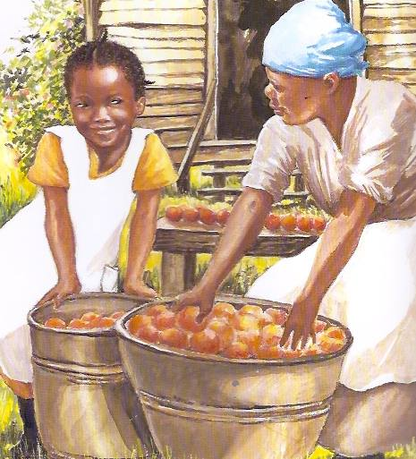{width="4.552083333333333in"
height="5.021975065616798in"}

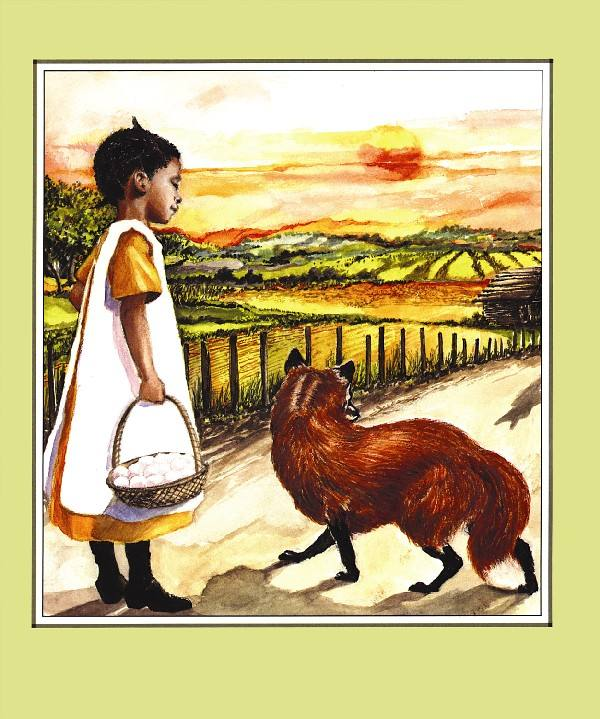{width="6.25in"
height="7.489583333333333in"}

**Cloudy with a Chance of Meatballs Judi Barrett**

The book details a bedtime story narrated by a grandfather to his
grandchildren, chronicling the daily lives of the citizens of an
unordinary town called Chewandswallow characterised by its strange daily
meteorological pattern that provides the townsfolk with all of their
required daily meals by raining food. Although the residents of the town
enjoy a lifestyle devoid of any grocery shopping or cookery, the weather
unexpectedly and inexplicably takes a turn for the worst, devastating
the local community with destructive and uncontrollable storms of either
unpleasant or dangerously oversized foods, resulting in unstoppable
catastrophes for the townspeople. Their lives endangered by the threats
of the storms, they relocate to a different community of average
meteorological patterns, safe from the hazards that once were presented
by raining meals.

The following morning, the man\'s grandchildren awaken to discover
snowfall. After bundling up and hurrying outside to play, the
granddaughter, in first-person narration, describes the scent of mashed
potatoes detected while romping with her brother, implying that the
grandfather\'s story might not be purely fictitious.

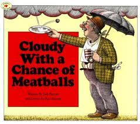{width="2.8020833333333335in"
height="2.46875in"}

THINK ABOUT IT

1\. How is Chewandswallow like a real town? How is it different?

2\. Would you like to live in a place where it rains food and juice?
Explain your answer.

3\. How can you tell that the story Grandpa tells the children is a tall
tale?

**Cloudy with a Chance of Meatballs**

- Look at the illustrations and think of some speech / thought bubbles
  for the characters.

- Grandpa makes up the story of Chewandswallow after something that
  happened over breakfast that morning. Can you think of a story based
  on something that has happened to you recently?

- Think about where the food comes from in Chewandswallow. Write a story
  that explains why it all comes from the sky?

- How would it change your life if all of your food came from the sky.
  What would be the advantages / disadvantages of raining food?!

- Plan a menu for the food that might fall from the sky over the coming
  days.

- Write the newspaper article about the record-breaking fall of
  spaghetti.

- Write a diary entry from the point of view of a resident of
  Chewandswallow the day before they had to leave.

- Write a new ending for the book, in which the people don\'t leave the
  town. What might happen instead?

- Imagine that you were asked to return to Chewandswallow a year after
  everybody left. Write the story (in the first person) that explains
  what you might find there when you go back.

- Can you think of some similes / metaphors that involve food, e.g. as
  green as pea soup, as slippery as melting butter.

- Watch [the film
  version](http://www.amazon.co.uk/gp/product/B002MXXDD4/ref=as_li_ss_tl?ie=UTF8&camp=1634&creative=19450&creativeASIN=B002MXXDD4&linkCode=as2&tag=teachingideasfor) of
  this book. Which do you prefer?

- Make a list of similarities and differences between the book and the
  film*.*

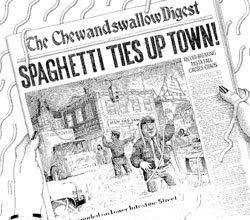{width="2.6041666666666665in"
height="2.2916666666666665in"}

{width="5.625in"
height="4.916666666666667in"}

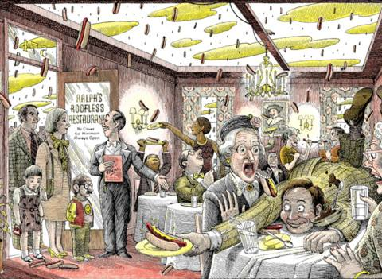{width="5.0in"
height="3.65625in"}

{width="6.268055555555556in"
height="4.176274059492563in"}

{width="6.268055555555556in"
height="5.349882983377078in"} {width="6.268055555555556in"
height="5.349882983377078in"}

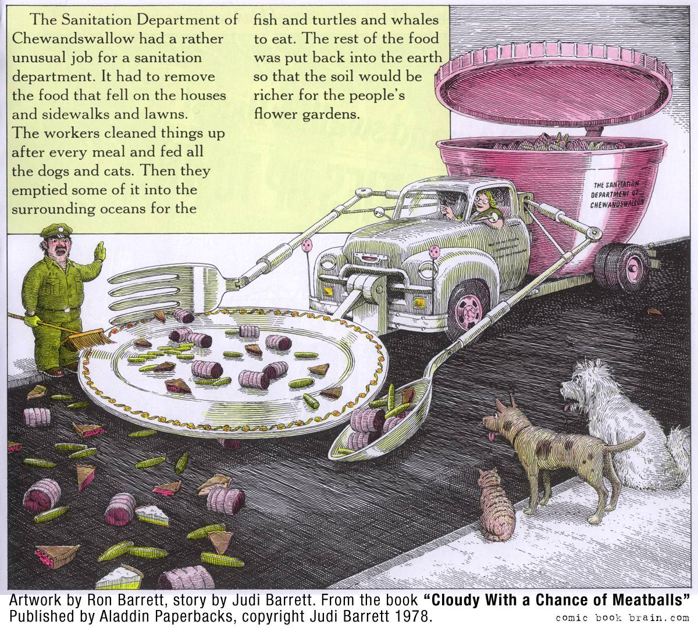{width="6.268055555555556in"
height="5.646473097112861in"}

**Cloudy With a Chance of Meatballs**

> **written by Judi Barrett**
>
> **drawn by Ron Barrett**

We were all sitting around the big kitchen table. It was Saturday
morning. Pancake morning. Mum was squeezing oranges for juice. Henry and
I were betting on how many pancakes we each could eat. And Grandpa was
doing the flipping.

Seconds later, something flew through the air headed toward the kitchen
ceiling... and landed right on Henry.

After we realised that the flying object was only a pancake, we all
laughed, even Grandpa. Breakfast continued quite uneventfully. All the
other pancakes landed in the pan. And all them were eaten, even the one
that landed on Henry.

That night, touched off by the pancake incident at breakfast, Grandpa
told us the best tall-tale bedtime story he'd ever told.

"Across an ocean, over lots of huge bumpy mountains, across three hot
deserts, and one smaller ocean...there lay the tiny town of
Chewandswallow.

In most ways, it was very much like any other tiny town. It had a Main
Street lined with stores, houses with trees and gardens around them, a
schoolhouse, about three hundred people, and some assorted cats and
dogs.

But there were no food stores in the town of Chewandswallow. They didn't
need any. The sky supplied all the food they could possibly want.

The only thing that was really different about Chewandswallow was its
weather. It came three times a day, at breakfast, lunch and dinner.
Everything that everyone ate came from the sky.

Whatever the weather served, that was what they ate. But it never rained
rain. It never snowed snow. And it never blew just wind. It rained
things like soup and juice. It snowed mashed potatoes and green peas.
And sometimes the wind blew in storms of hamburgers.

The people could watch the weather report on television in the morning
and they would even hear a prediction for the next day's food.

When the townspeople went outside, they carried their plates, cups,
glasses, forks, spoons, knives and napkins with them. That way they
would always be

prepared for any kind of weather.

If there were leftovers, and there usually were, the people took them
home and put them in their refrigerators in case they got hungry between
meals.

The menu varied.

By the time they woke up in the morning, breakfast was coming down.

After a brief shower of orange juice, low clouds of sunny-side up eggs
moved in followed by pieces of toast. Butter and jelly sprinkled down
for the toast. And most of the time it rained milk afterwards.

For lunch one day, frankfurters, already in their rolls, blew in from
the northwest at about five miles an hour.

There were mustard clouds nearby. Then the wind shifted to the east and
brought in baked beans.

A drizzle of soda finished off the meal.

Dinner one night consisted of lamb chops, becoming heavy at times, with
occasional ketchup. Periods of peas and baked potatoes were followed by
gradual clearing, with a wonderful Jell-O setting in the west.

The Sanitation Department of Chewandswallow had a rather unusual job for
a sanitation department. It had to remove the food that fell on the
houses and

sidewalks and lawns. The workers cleaned things up after every meal and
fed all the dogs and cats. Then they emptied some of it into the
surrounding oceans for the fish and turtles and whales to eat. The rest
of the food was put back into the earth so that the soil would be richer
for the people's flower gardens.

Life for the townspeople was delicious until the weather took a turn for
the worse.

One day there was nothing but Gorgonzola cheese all day long.

The next day there was only broccoli, all overcooked.

And the next day there were brussel sprouts and peanut butter with
mayonnaise.

Another day there was a pea soup fog. People could not see where they
were going and they could barely find the rest of the meal that got
stuck in the

fog.

The food was getting larger and larger, and so were the portions. The
people were getting frightened. Violent storms blew up frequently. Awful
things were happening.

One Tuesday there was a hurricane of bread and rolls all day long and
into the night. There were soft rolls and hard rolls, some with seeds
and some without. There was white bread and rye and whole wheat toast.
Most of it was larger than they had ever seen bread and rolls before. It
was a terrible day. Everyone had to stay indoors. Roofs were damaged,
and the Sanitation Department was beside itself. The mess took the
workers four days to clean up, and the sea was full of floating rolls.

To help out, the people piled up as much bread as they could in their
backyards. The birds picked at it a bit, but it just stayed there and
got staler and

staler.

There was a storm of pancakes one morning and a downpour of maple syrup
that nearly flooded the town. A huge pancake covered the school. No one
could get it off because of its weight, so they had to close the school.

Lunch one day brought fifteen-inch drifts of cream cheese and jelly
sandwiches. People ate themselves sick and the day ended with a
stomachache.

There was an awful salt and pepper wind accompanied by an even worse
tomato tornado. People were sneezing themselves silly and running to
avoid the tomatoes. The town was a mess. There were seeds and pulp
everywhere.

The Sanitation Department gave up. The job was too big.

People feared for their lives. They couldn't go outside most of the
time. Many houses had been badly damaged by giant meatballs, stores were
boarded up and there was no more school for the children.

So a decision was made to abandon the town of Chewandswallow.

It was a matter of survival.

The people glued together the giant pieces of stale bread sandwich-style
with peanut butter, took the absolute necessities with them, and set
sail on their rafts for a new land.

After being afloat for a week, they finally reached a small coastal
town, which welcomed them. The bread had held up surprisingly well, well
enough for them to build temporary houses for themselves out of it.

The children began school again, and the adults all tried to find places
for themselves in the new land. The biggest change they had to make was
getting

used to buying food at a supermarket. They found it odd that the food
was kept on the shelves, packaged in boxes, cans and bottles. Meat that
had to be cooked was kept in large refrigerators. Nothing came down from
the sky except rain and snow. The clouds above their heads were not made
of fried eggs. No one ever got hit by a hamburger again.

And nobody dared to go back to Chewandswallow to find out what had
happened to it. They were too afraid."

Henry and I were awake until the very end of Grandpa's story. I remember
his goodnight kiss.

The next morning we woke up to see snow falling outside our window.

We ran downstairs for breakfast and ate it a little faster than usual so
we could go sledding with Grandpa.

It's funny, but even as we were sliding down the hill we thought we saw
a giant pat of butter at the top, and we could almost smell mashed
potatoes.

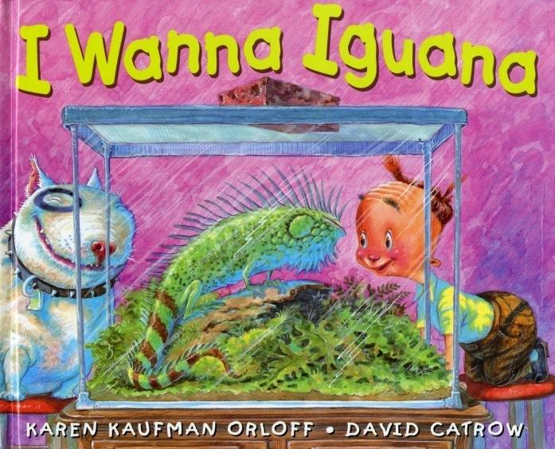{width="3.1666666666666665in"
height="2.562684820647419in"}

When Alex's neighbour Mikey moves away, he offers to give Alex his baby
iguana. Alex wants the new pet badly. His mother isn't as enthusiastic.
In a series of letters, Alex works to convince his mother to let him
have the new pet. But Mum has an answer for every good reason he gives
and every letter he writes. Finally Mum suggests that Alex take the
iguana on a "trial basis." If Alex takes good care of the pet for a week
or two, he will be allowed to keep it. When Alex agrees to Mum's
proposition, Mum sends him to his room. There Alex finds the iguana
waiting for him. Could it be that this is what Mum had in mind all
along?

Independent Writing:

Discuss the persuasive techniques used by Alex in the notes he sends his
mother in I Wanna Iguana, as well as the persuasive responses his mother
returns.

I Wanna \_\_\_\_\_\_\_\_\_\_\_\_\_\_\_\_\_\_\_\_\_\_\_\_\_\_\_\_\_\_\_.

**\**

**I WANNA IGUANA**

**Karen Orloff**

Dear Mum,

I know you don't think I should

have Mikey Gulligan's baby iguana

when he moves, but here's why I should.

If I don't take it, he goes to Stinky and

Stinky's dog, Lurch, will eat it.

You don't want that to happen, do you?

Signed,

Your sensitive son,

Alex

Dear Alex,

I'm glad you're so compassionate,

but I doubt that Stinky's mother

will let Lurch get into

the iguana's cage.

Nice try, though.

Love,

Mum

Dear Mum,

Did you know that iguana's are really quiet

and they're cute too. I think they are

much cuter than hamsters.

Love,

Your adorable son,

Alex

Dear Alex,

Tarantulas are quiet too, but I wouldn't

want one as a pet. By the way, that iguana

of Mikey's is uglier than Godzilla.

Just thought I'd mention it.

Love,

Mum

Dear Mum,

You would never even have to see

the iguana. I'll keep his cage in

my room on the dresser next to

my soccer trophies. Plus, he's

so small, I bet you'll never even

know he's there.

Love and a zillion and one kisses,

Alex

Dear Alex,

Iguanas can grow to be over two metres

long. You won't have enough space

in your whole room, much less

on your dresser (with or

without your trophies).

Love,

Mum

Dear Mum,

It takes 15 years for an iguana to

get that big. Mikey told me. I'll be

married by then and probably

living in my own house.

love,

your smart and mature kid, Alex.

Dear Alex,

How are you going to get

a girl to marry you when

you own a two-metre-long

reptile?

Love,

Your concerned mother

Dear Mum,

Forget the girl.

I need a new friend now!

This iguana can be the brother I've always wanted.

Love,

Your lonely child, Alex

Dear Alex,

You have a brother.

Love,

Mum

Dear Mum,

I know I have a brother

but he's just a baby.

What fun is that? If I had

an iguana, I could teach

it tricks and things.

Ethan doesn't do tricks.

He just burps and poops.

Love,

Grossed-out Alex

Dear Alex,

How do I know you're ready

for a pet? Remember what

happened when you took

home the class fish?

Love,

Mum

Dear Mum,

If I knew the fish was going to

jump into the spaghetti sauce,

I never would have taken

the cover off the jar!

Love,

Your son who has

Learned his lesson

P.S. Iguanas don't like spaghetti.

Dear Alex,

Let's say I let you have

the iguana on a trial basis.

What exactly would you do

to take care of it?

Love,

Mum

Dear Mum.

I would feed him every day (he eats

lettuce). And I would make sure

he had enough water. And I would

clean his cage when it got messy.

Love,

Responsible Alex

P.S. What's a trial basis?

Dear Alex,

A trial basis means dad and I see

how well you take care of him for

a week or two before we decide if

you can have him forever. Remember,

Stinky and Lurch are waiting!

Love,

Mum

P.S. If you clean his cage as well as

You clean your room, you're in trouble.

Dear Mum,

I'll really, realty, really try to clean my

room and the iguana's cage. Also,

listen to this, I'll pay for the lettuce with

my allowance. I mean, how much

can one baby iguana eat, anyway?

Love,

Alex the financial wizard

"Are you sure you want to do this, Alex?'

"Yes, Mum!

I wanna iguana ...

Please!"

Dear Alex,

Look on your dresser.

Love,

Mum

"YESSSS!

Thank you!

**Thank**

**you!**

**See also:**

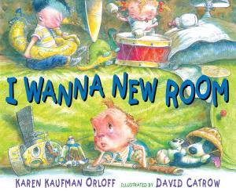{width="3.125in"
height="2.5416666666666665in"}

If you're familiar with I Wanna Iguana, then you'll be excited to see
Alex is back and asking for something else. In this book he wants to get
his own bedroom since he now has to share one with his younger brother
Ethan since there's a new baby (girl) in the house. Alex is NOT enjoying
sharing his space with his loud and annoying younger brother. Through a
series of letters written back and forth between Alex and his father
(That's right, his father. Mum's too tired in this book to exchange
missives with her son.), Alex details specific reasons why he needs a
space of his own.

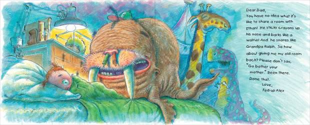{width="6.268055555555556in"
height="2.537551399825022in"}

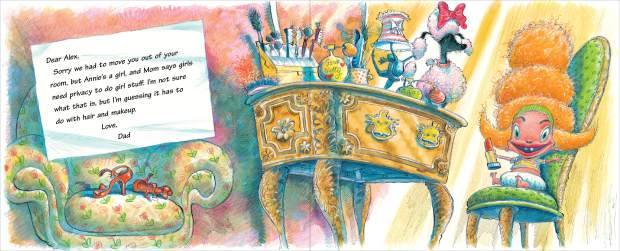{width="6.268055555555556in"
height="2.537551399825022in"}

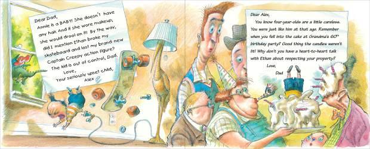{width="6.268055555555556in"
height="2.537551399825022in"}

**I WANNA NEW ROOM**

**Karen Orloff**

Dear Mum,

I know you think I should share a

room with Ethan now that we have

Baby Annie, but here's why I

shouldn't. When Ethan sleeps, he

sounds like the cat coughing up

fur balls. Why can't you move

Annie in with you and

give me my room back?

Signed,

Your very tired son,

Alex

Dear Alex,

Go bother your father,

Signed,

Your very, VERY tired mother

Dear Dad,

You have no idea what it's

like to share a room with

Ethan! He sticks crayons up

his nose and barks like a

walrus! And he snores like

grandpa Ralph. So how

about giving me my old room

back? Please don't say,

"Go bother your

mother." Been there.

Done that.

Love,

Fed-up Alex

Dear Alex,

Sorry we had to move you out of your

room, but Annie's a girl, and Mum says girls

need privacy to do girl stuff. I'm not sure what that is, but I'm
guessing it has to

do with hair and makeup.

Love,

Dad

Dear Dad,

Annie is a BABY! She doesn't have

any hair. And if she wore makeup,

she would drool on it! By the way,

did I mention Ethan broke my

skateboard and lost my brand-new

Captain Creepy action figure?

The kid is out of control, Dad.

Love,

Your seriously upset child,

Alex

*Dear Alex,*

*You know four-year-olds are a little careless.*

*You were just like him at that age. Remember*

*When you fell into the cake at Grandma's 60^th^*

*birthday party? Good thing the candles weren't*

*lit! why don't you have a heart-to-heart talk*

*with Ethan about respecting your property?*

*Love,*

*Dad*

Dear Dad,

Thanks for the advice. Now i

Know exactly how to handle this.

Love,

Your diplomatic son, Alex

P.S. "Diplomatic" was one of

My vocabulary words.

DEAR ETHAN,

THIS IS YOUR SIDE OF THE ROOM.

THIS IS MY SIDE OF THE ROOM.

STAY ON YOUR SIDE.

ALEX

P.S. DON'T TOUCH MY STUFF

**OR ELSE!**

*Dear Alex,*

*Do you realise you gave Ethan the side*

*of the room that doesn't have a door?*

*I just found him jumping up and down on*

*his bed, yelling that he can't come out*

*to take his bath because Alex said so.*

*Fix this problem when you get home*

*From soccer practice or else!*

*Love,*

*Dad*

Dear dad,

Okay, I told Trampoline Boy he can

use the door now. Honestly, Dad, you

see what I'm dealing with here? Please

give me my room back! I promise I'll

keep it really, really clean!

Love,

Neat and tidy Alex

*Dear Alex,*

*Does that include cleaning the iguana's cage?*

*I've noticed an unusual smell coming from*

*that general direction. Just thought I'd*

*mention it.*

*Love,*

*Your concerned father*

Dear Dad,

Let's not change the subject. Here's the thing.

I'm practically grown-up. I wanna new room!

Plus, I think I should get rewarded for all

the A's I got in school.

Love,

Alex the super student

*Dear Alex,*

*Nice try, but if I remember correctly,*

*you got three B's and one A, and I think*

*the A was in Lunch.*

*Love,*

*Dad*

> Dear dad,

Even Stinky's dog Lurch has his own

room! That dog is treated like a king. He's

got six pillows and his own TV. He and

Stinky watch cartoons and eat cheesy

popcorn every single night. I'm not

even asking for a TV. Just one little room.

Love,

Your HUMAN son, Alex

P.S. Stinky got a D in lunch.

*Dear Alex,*

*No can do.*

*Love, Dad*

*P.S. Stinky scares me.*

Dear Dad,

It's more than the room. it's the principle of the

thing! Why do I, the oldest and most important kid,

have to suffer just because you and Mum had

another baby? Does that seem fair? I don't think so.

Love,

Your number ONE son, Alex

*Dear Alex,*

*Yes, you are very important to us, but so*

*are your brother and sister. However, you*

*make some good points. A boy your age needs his own space. Maybe we
could build*

*you a special place of your own.*

*Love, Dad*

Dear Dad,

Now you're talking! We could add a

whole new wing onto the house! I can

have my own bathroom with a hot tub,

skateboard ramp and bowling alley. What

do you say, Dad? Here's a floor plan.

Love,

Alex the architect

*Dear Alex,*

*Slow down there, buddy! We're not*

*gazillionaires. We can't build you a*

*condo. I was thinking of something*

*like a tree house. We can build it*

*together. You won't have to share*

*it with your brother unless you*

*absolutely want to.*

*Love,*

*Dad*

"You mean it, Dad?"

*"I do, Alex."*

Dear Ethan,

Do you want to play

with me in my

tree house?

Love,

Your big brother,

Alex

"Yessssss!"

"Thanks, Alex!"

