> **Voice**
>
> **(18)**
>
> 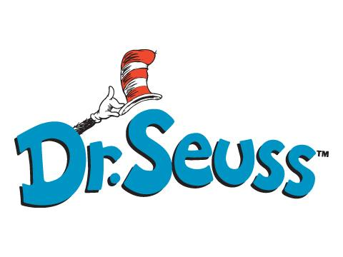{width="5.0in"
> height="3.75in"}

{width="2.1770833333333335in"
height="1.6328127734033246in"}

**Voice 18 Dr Seuss**

Hooray for Doofendorfer Day

The Sneetches

Oh, the Places You'll Go!

The Butter Battle Book

The Lorax

{width="1.28125in"
height="2.7083333333333335in"}

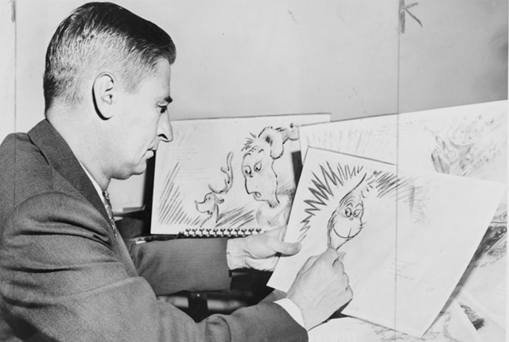{width="6.268055555555556in"
height="4.211349518810149in"}

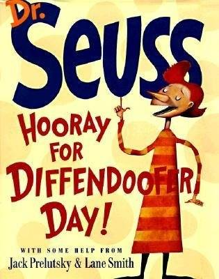{width="2.6145833333333335in"
height="3.3125in"}

Started by Dr. Seuss, finished by Jack Prelutsky, and illustrated by
Lane Smith, Hooray for Diffendoofer Day! is a joyous ode to
individuality starring unsinkable teacher Miss Bonkers and the quirky
Diffendoofer School (which must prove it has taught its students how to
think\--or have them sent to dreary Flobbertown). Included is an
introduction by Dr. Seuss\'s longtime editor explaining how the book
came to be and reproductions of Dr. Seuss\'s original pencil sketches
and hand-printed notes for the book---a true find for all Seuss
collectors! Jack Prelutsky and Lane Smith pay homage to the Good Doctor
in their own distinctive ways, the result of which is the union of three
one-of-a-kind voices in a brand-new, completely original book that is
greater than the sum of its parts. For all of us who will never forget
our school days and that special teacher, here is a book to give and to
get.

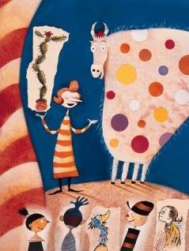{width="1.9650481189851268in"
height="2.6145833333333335in"}

**Hooray for Diffendoofer Day! Dr Seuss**

I've always lived in Dinkerville,

My friends all live here too.

We go to Diffendoofer School --

We're happy that we do.

Our school is at the corner

Of Dinkzoober and Dinkzott.

It looks like any other school,

But we suspect it's not.

I think we're learning lots of things

Not taught at other schools.

Our teachers are remarkable,

They make up their own rules.

Miss Bobble teaches listening,

Miss Wobble teaches smelling.

Miss Fribble teaches yelling.

Miss Twining teaches tying knots

In neckerchief and noodles.

And how to tell chrysanthemums

from miniature poodles.

Miss Vining teaches all the ways

A pigeon may be peppered,

And how to put a saddle

On a lizard or a leopard.

My teacher is Miss Bonkers,

She's as bouncy as a flea.

I'm not certain what she teaches,

But I'm glad she teaches me.

"Look! Look!" she chirps. "I'll show you how

To tell a cactus from a cow.

And then I shall instruct you why

A hippo cannot hope to fly."

She even teaches frogs to dance,

And pigs to put on underpants.

One day she taught a duck to sing --

Miss Bonkers teaches EVERYTHING.

Of all the teachers in our school,

I like Miss Bonkers best.

Our teachers are all different,

But she's *different-er* than the rest.

We also have a principal,

His name is Mr Lowe.

He is the very saddest man

That any of us know.

He mumbles, "Are they learning

This and that and such and such?"

His face is wrinkled as a prune

From worrying so much.

He breaks a lot of pencil points

From pushing down too hard,

And many dogs start barking

As he mopes around the yard.

We think he wears false eyebrows,

In fact, we're sure it's so.

We've heard he takes them off at night ...

I guess we'll never know.

But we *know* he likes Miss Bonkers,

He treats her like a queen.

He's always there to watch her

When she's on her trampoline.

There are many other people

Who make Diffendoofer run.

They are utterly amazing --

I love every single one.

Our nurse, Miss Clotte,

knows what to do

When we've got sniffles or the flu.

One day I had a splinter, so

She bandaged me from head to toe.

Mr Plunger, our custodian,

Has fashioned a machine --

A super-zooper-flooper-do-

It keeps the whole school clean.

Our music teacher, Mrs Fox,

Makes bagpipes out of straws and socks.

Our art instructor, Mr Beeze,

Paints pictures hanging by his knees.

In science class with Mr Katz,

We learn to build robotic rats.

In gym we watch as Mr Bear

Hoists elephants into the air.

Miss Loon is our librarian,

She hides behind the shelves.

And often cries out, "LOUDER!"

When we're reading to ourselves.

We have three cooks, all named Mr Munch,

Who merrily prepare our lunch.

They make us hot dogs, beans and fries,

Plus things we do not recognize.

And as they cook, they sing their song,

Not too short and not too long.

*"Roast and toast and slice and dice,*

*Cooking lunch is oh so nice."*

We were eating their concoctions,

Telling jokes and making noise.

When Mr Lowe appeared and howled,

"Attention, girls and boys!"

He began to fuss and fidget,

Scratch and mutter, sneeze and cough.

He shook his head so hard, we thought

His eyebrows would come off.

He wrung his hands, he cleared his throat,

He shed a little tear,

Then sobbed, "I've something to announce,

And that is why I'm here.

"All schools for miles and miles around

Must take a special test,

To see who's learning such and such --

To see which school's the best.

If our small school does not do well,

Then it will be torn down.

And you will have to go to school

In dreary Flobbertown."

"Not Flabbertown!" we shouted,

And we shuddered at the name.

For everyone in Flobbertown

Does *everything* the same.

It's miserable in Flobbertown,

They dress in just one style.

They sing one song, they never dance,

They march in single file.

They do not have a playground,

And they do not have a park.

Their lunches have no taste at all,

Their dogs are scared to bark.

Miss Bonkers rose, "Don't fret!" she said.

"You've learnt the things you need

To pass that test and many more --

I'm certain you'll succeed.

We've taught you that the earth is round,

That red and white make pink,

And something else that matters more --

We've taught you how to think."

"I hope you're right," sighed Mr Lowe.

He shed another tear.

"The test is in ten minutes,

And you're taking it right here."

We sat in shock and disbelief.

"Oh no!" we moaned. "Oh no!"

We were even more unhappy

than unhappy Mr Lowe.

But then the test was handed out.

"Yahoo!" we yelled. "Yahoo!"

For it was filled with all the things

That we all *knew* we knew*.*

There were questions about noodles,

About poodles, frogs and yelling,

About listening and laughing,

And chrysanthemums and smelling.

There were questions about other things

We'd *never* seen or heard.

And yet we somehow answered them,

Enjoying every word.

One week later, after recess,

Mr Lowe meandered in.

We'd never seen him smile before,

But now he wore a grin.

He soon began to giggle,

Then his giggle grew by half.

And then it *really* happened --

Mr lowe began to laugh.

"You've saved our school!

You've saved our school!"

He jubilantly roared.

"We got the very highest score!"

He wrote it on the board.

Miss Bonkers did some cartwheels

Till her face turned cherry red.

She bounded up to Mr Lowe

And kissed him on the head.

"Hooray! Hooray!" she shouted.

"I'm so proud I cannot speak."

So she did another cartwheel,

And she pecked him on the cheek.

"Ahem! Ahem!" coughed Mr Lowe.

"You all deserve a bow.

I thus declare a holiday --

It starts exactly now.

Because you've done so splendidly

In every sort of way.

this day forever shall be known

as Diffendoofer Day.

And furthermore, I promise

I won't ever wear a frown.

For now I know we'll never go

To dreary Flobbertown."

Then we held a celebration,

There was pizza, milk and cake.

Like everyone, I ate too much

And got a bellyache.

We laughed and whopped and hollered

The entire school day long,

Then we all sang, triumphantly.

"The Diffendoofer Song."

We love you, Diffendoofer School,

We definitely do.

there surely is no other school

that's anything like you.

You're *gribbulous* and *grobbulous,*

Each day we love you more.

You are the school we treasure

And unceasingly adore.

Oh, finest school in Dinkerville --

The only one as well --

We love you, Diffendoofer School,

Much more than we can tell.

You are so *diffendooferous*

It gives us joy to say,

Three cheers for Diffendoofer School --

**HOORAY!**

**HOORAY!**

**HOORAY!**

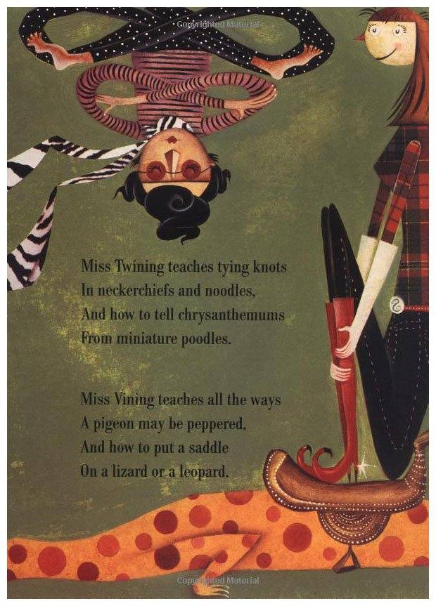{width="6.268055555555556in"
height="8.724728783902012in"}

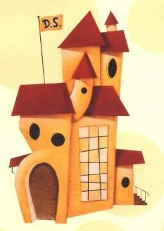{width="2.4270833333333335in"
height="3.4270833333333335in"}

**Hooray for Diffendoofer Day!** is a story about creative teaching and
thinking. It is a tale that celebrates originality, difference, and
uniqueness. It is a book that lends itself to the lively exploration of
a place and an activity that are at

the centre of young people's lives: school and learning.

**Read Aloud**

Discuss the story and the school in the book.

*Would you like this school? Why?*

**Writing**

How alike and/or different is your school and Diffendoofer School?

From the Dr Seuss' Website

Discussion Topics and Activities: Hooray for Diffendoofer Day!

What is a school?

The narrator of this story is sure that Diffendoofer School is very
different from other schools. Ask your students to define "school" and
"learning." What and how are teachers supposed to teach? What is the job
of a principal? Do

students think that their school is different from other schools in any
way? If yes, explain. If no, what is an "ordinary" school? Do your
students think that they would like Diffendoofer School? Why or why not?

Terrific Teachers

Diffendoofer teachers teach some wild and wacky subjects. Inspired by
the characters in the story, your students can create their own unique
teachers. First, have each child draw a picture of an imaginary teacher
at work in the

classroom. Next, ask students to caption their drawings with a made-up
name, being sure to point out that many of the Diffendoofer teachers and
staff have names that hint at what they teach or do. Use the drawings to
create a classroom wall display. Invite children to make suggestions and
then choose an original name to give the school in which all of the
imaginary teachers teach.

Students as Teachers

Ask students to complete a survey that contains the following questions:

What is your name?

What is the most interesting thing you know?

How did you learn this?

Do you think you could teach this to other students?

Collage Creations

The illustrations in this story are a combination of Lane Smith's
inventive oil paintings and snippets of Dr. Seuss's original drawings
blended together in a type of collage. Invite students to make their own
collage creations, inspired by these illustrations. You will need an
assortment of old magazines, safety scissors, white glue, old
paintbrushes, pencils, Magic Markers, drawing paper, a stapler, and
construction paper.

1\. Ask each student to cut two or three pictures from the magazines to
use in his or her collage. (Note: Students may choose a theme or topic
in advance or allow the images in the magazine to inspire them.)

2\. Arrange the cutouts on the drawing paper and lightly trace the
outlines of the images with a pencil; then set aside.

3\. Use pencils to sketch, then markers to complete an original drawing
that will contain the magazine cutouts.

4\. When the ink is dry, use a paintbrush to apply a little
water-diluted white glue to the backside of each clipping, then
carefully press onto the drawing paper.

5\. Staple completed collage creations onto slightly larger pieces of
construction paper to create a colorful "work of art." Encourage
students to expand the boundaries of this activity in such ways as (1)
using fabric scraps, photographs, and other items in addition to
magazine clippings, (2) using paints, coloured pencils, or other media
for their original artwork, or (3) decorating the construction paper
frame to continue the mood or theme of the collage.

*Unfortunately, the story wasn't complete --- Seuss had only left behind
a few verses and very rough drawings.*

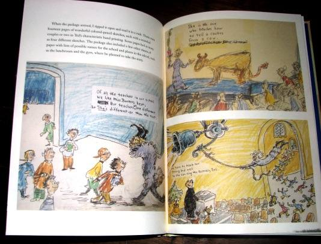{width="5.5625in"
height="4.239583333333333in"}

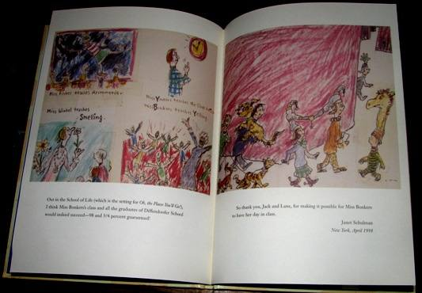{width="5.552083333333333in"
height="3.8541666666666665in"}

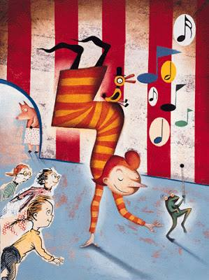{width="3.1145833333333335in"
height="4.166666666666667in"}

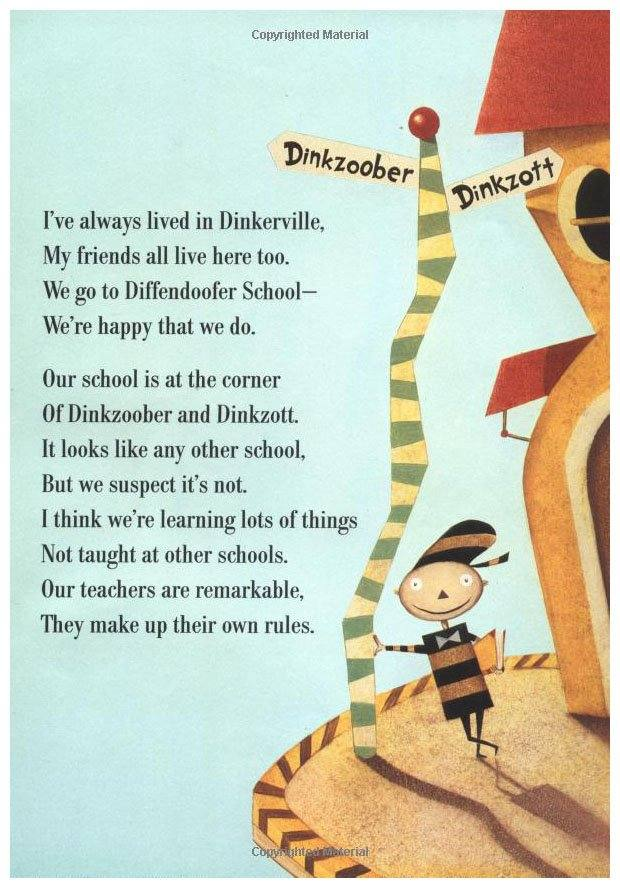{width="6.268055555555556in"
height="8.97747265966754in"}

{width="2.1041666666666665in"
height="8.0in"}

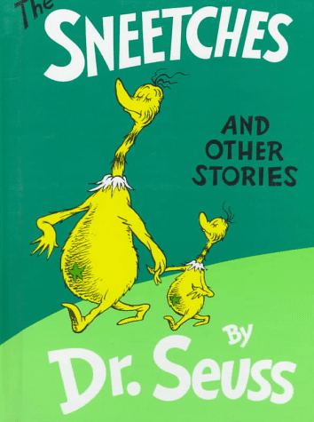{width="2.6145833333333335in"
height="3.5104166666666665in"}

Sneetchland is populated by two types of Sneetches: the Star Belly
Sneetches, born with a yellow star on their stomachs, and the Plain
Belly Sneetches, born with no stars. The Star Belly Sneetches flaunt
their belly stars as proof of their superiority and refuse to mix with
the \"inferior\" Plain

Bellies. They snub them at every occasion and prohibit their Star Belly
children from playing with Plain Belly kids. The Plain Belly Sneetches,
for their part, feel inferior to the Star Belly Sneetches and envy them
their belly star status symbols. Everything changes when a clever man
named McBean arrives with his Star-On-Off machine. The Plain Belly
Sneetches eagerly pay him to put stars on theirbellies so they can join
the ranks of the \"superior\" Star Bellies. This infuriates the Star
Bellies,who can no longer tell the \"good\" sneetches from the \"bad\",
since everyone now has belly stars. They therefore get together and
decide that not having belly stars is the new \"in\" status symbol, and
pay McBean to take off their belly stars. Next follows a crazy on-again,
off-again race as the Star Belly Sneetches run through McBean\'s machine
to add or take off stars and the Plain Belly Sneetches keep imitating
them. Finally, both Star Bellies and Plain Bellies run out of money and
McBean drives off with their cash, laughing \"You can\'t teach a
sneetch.\" By this time, no-one can tell who\'s a Star Belly or Plain
Belly any longer. On the last page, the Sneetches decide to abandon
their silly status games and to treat each other as friends and equals,
vowing never again to discriminate against others who look different.

**Read Aloud using DRTA**

Read the story aloud to the class, using the Directed Reading-Thinking
Activity (DRTA), stopping every now and then to ask for predictions:
\"What do you think will happen now?\" \"What do you think they will
do?\" \"What makes you think that?\"

Validate all predictions and continue reading to find out to what extent
the predictions were accurate. Do not read the last page; just ask the
children what they think will happen. List their predictions on the
board and invite students to justify their suggestions. Then, read the
conclusion and compare the children\'s predictions with the author\'s
conclusion.

**Discussion**

Lead a discussion on how the Star Belly Sneetches felt about the Plain
Belly Sneetches and how they showed their feelings - prejudice. Children
talk about how they think the Plain Belly Sneetches felt about the Star
Bellies\' attitude and behaviour, and how the prejudiced attitudes and
stereotyping affected the life of the two groups and the Sneetch
community as a whole.

In what ways the Sneetches are like people. If children have difficulty,
ask if there are groups of people that are treated like the snobbish
Star Bellies treated the Plain Bellies.

**Writing**

This is an ideal story to generate writing activities. Below are a few
suggestions. You may want to select activities that you think will
interest your class and that meet your particular language goals, or
give the students a choice of assignments. You\'ll get more insightful
results if you allow students a few minutes paired discussion before
writing.

Imagine that you are a Plain Belly Sneetch (or a Star Belly Sneetch).
Write a journal entry about your thoughts and feelings. Share your entry
with the class. Compare.

Imagine that you are a Star Belly mother whose child wants to invite a
Plain Belly child from her class to your important Sneetchstaroo party.
What will you tell your child? (With a partner, present a dialogue
between mother and child.)

You are a newspaper reporter sent to cover the strange happenings in
Sneetchland. Write a news report about these events.

You are a TV reporter covering events in Sneetchland. Present a brief
commentary in TV news style about what happened.

Write a different ending to the story, starting (a) from McBean\'s
departure; (b) from the moment the Plain Bellies first come out of the
Star Machine with stars on their bellies and the Star Bellies see them.

With a partner, write and present to the class a dialogue between a Star
Belly and a Plain Belly who would like to be friends.

Write a new story about prejudice and its consequences.

**The Sneetches Dr Seuss**

Now, the Star-Belly Sneetches- Had bellies with stars.

The Plain-Belly Sneetches- Had none upon thars.

Those stars weren't so big. They were really so small.

You might think such a thing wouldn't matter at all.

But, because they had stars, all the Star-Belly Sneetches

Would brag, "We're the best kind of Sneetch on the beaches.

With their snoots in the air, they would sniff and they'd snort

"We'll have nothing to do with the Plain-Belly sort!"

And whenever they met some, when they were out walking,

They'd hike right on past them without even talking.

When the Star-Belly children went out to play ball,

Could a Plain- Belly get in the game...? Not at all.

You only could play if your bellies had stars

And the Plain-Belly children had none upon thars.

When the Star-Belly Sneetches had frankfurter roasts

Or picnics or parties or marshmallow toasts,

They never invited the Plain-Belly Sneetches.

They left them out cold, in the dark of the beaches.

They kept them away. Never let them come near.

And that's how they treated them year after year.

Then ONE day, seems...while the Plain-Belly Sneetches

Were moping and doping alone on the beaches,

Just sitting there wishing their bellies had stars...

A stranger zipped up in the strangest of cars!

"My friends," he announced in a voice clear and keen,

"My name is Sylvester McMonkey McBean.

And I've heard of your troubles. I've heard you're unhappy.

But I can fix that. I'm the Fix-it-Up Chappie.

I've come here to help you. I have what you need.

And my prices are low. And I work at great speed.

And my work is one hundred per cent guaranteed!

Then, quickly Sylvester McMonkey McBean

Put together a very peculiar machine.

And he said, "You want stars like a Star-Belly Sneetch...?

My friends, you can have them for three dollars each!"

"Just pay me your money and hop right aboard!"

So they clambered inside. Then the big machine roared

And it klonked. And it bonked. And it jerked. And it berked

And it bopped them about. But the thing really worked!

When the Plain-Belly Sneetches popped out, they had stars!

They actually did. They had stars upon thars!

Then they yelled at the ones who had stars at the start,

"We're exactly like you! You can't tell us apart.

We're all just the same, now, you snooty old smarties!

And now we can go to your frankfurter parties."

"Good grief!" groaned the ones who had stars at the first.

"We're still the best Sneetches and they are the worst.

But, now, how in the world will we know," they all frowned,

"If which kind is what, or the other way round?"

Then came McBean with a very sly wink.

And he said, "Things are not quite as bad as you think.

So you don't know who's who. That is perfectly true.

But come with me, friends. Do you know what I'll do?

I'll make you, again, the best Sneetches on beaches

And all it will cost you is ten dollars eaches."

"Belly stars are no longer in style," said McBean.

"What you need is a trip through my Star-off Machine.

This wondrous contraption will take off your stars

So you won't look like Sneetches who have them on thars."

And that handy machine Working very precisely

Removed all the stars from their tummies quite nicely.

Then, with snoots in the air, they paraded about

And they opened their beaks and they let out a shout,

"We know who is who! Now there isn't a doubt.

The best kind of Sneetches are Sneetches without!"

Then, of course, those with stars all got frightfully mad.

To be wearing a star now was frightfully bad.

Then, of course, old Sylvester McMonkey McBean

Invited them into his star-off machine.

Then, of course from THEN on, as you probably guess,

Things really got into a horrible mess.

All the rest of that day, on those wild screaming beaches,

The fix-it-up Chappie kept fixing up Sneetches.

Off again! On Again! In again! Out again!

Through the machines they raced round and about again,

Changing their stars every minute or two.

They kept paying money. They kept running through

Until neither the Plain nor the Star-Bellies knew

Whether this one was that one...or that one was this one

Or which one was what one ...or what one was who.

Then, when every last cent

Of their money was spent,

The Fix-it-Up Chappie packed up

And he went.

And he laughed as he drove

In his car up the beach,

"They never will learn.

No. You can't teach a Sneetch!"

But McBean was quite wrong. I'm quite happy to say

That the Sneetches got really quite smart on that day,

The day they decided that Sneetches are Sneetches

And no kind of Sneetch is the best on the beaches

That day, all the Sneetches forgot about stars

And whether they had one, or not, upon thars.

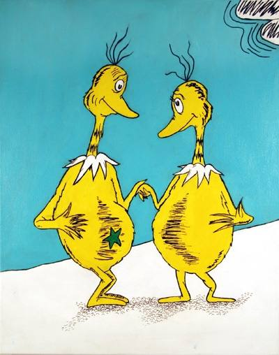{width="4.166666666666667in"
height="5.291666666666667in"}

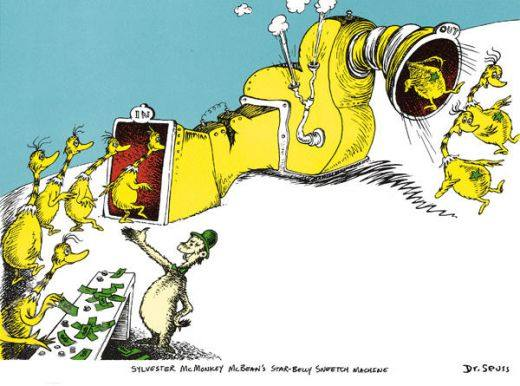{width="5.416666666666667in"
height="4.020833333333333in"}

{width="6.239583333333333in"
height="6.239583333333333in"}

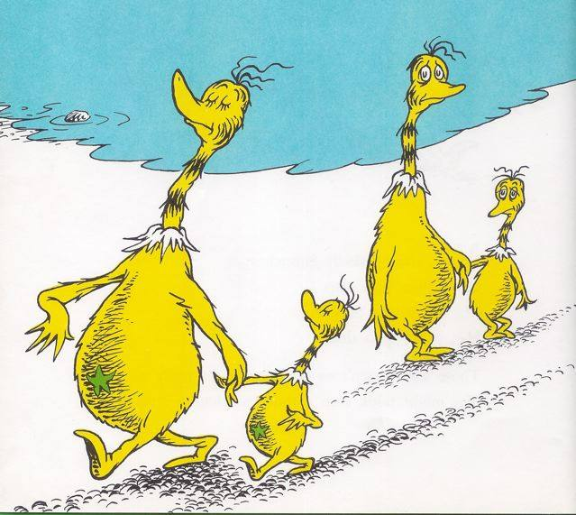{width="6.65625in"
height="5.947916666666667in"}

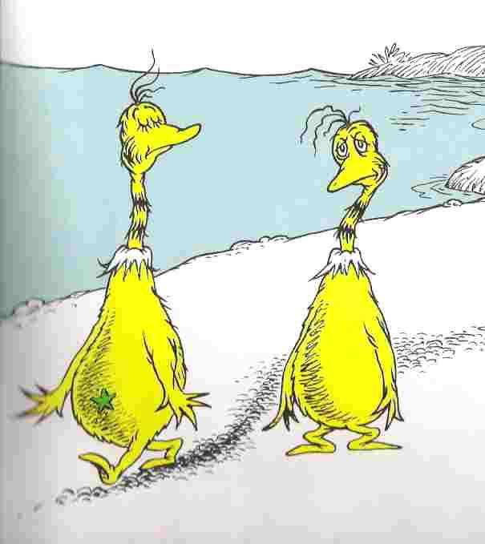{width="6.302083333333333in"
height="7.072916666666667in"}

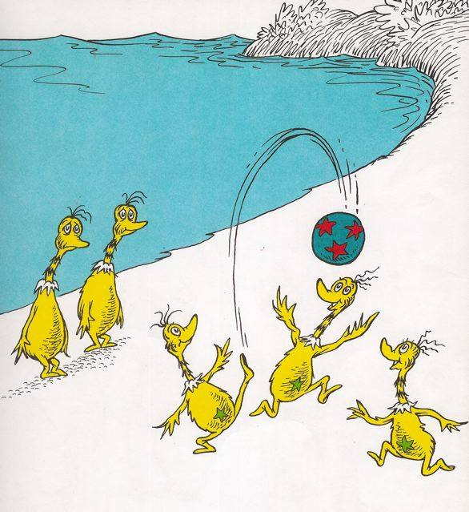{width="6.104166666666667in"
height="6.65625in"}

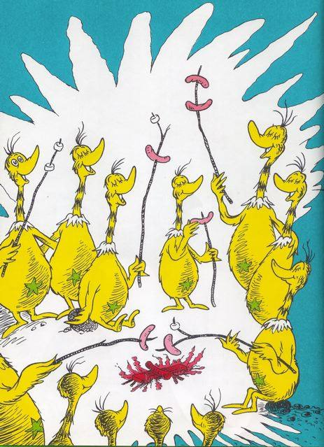{width="4.822916666666667in"
height="6.65625in"}

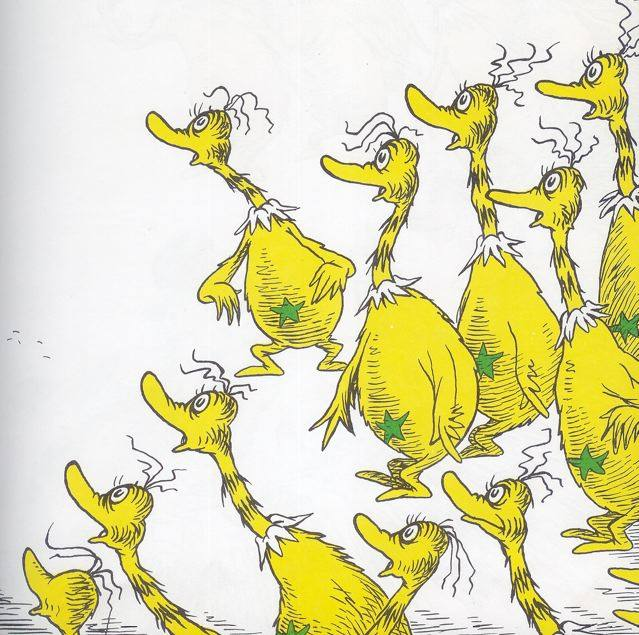{width="6.65625in"
height="6.614583333333333in"}\
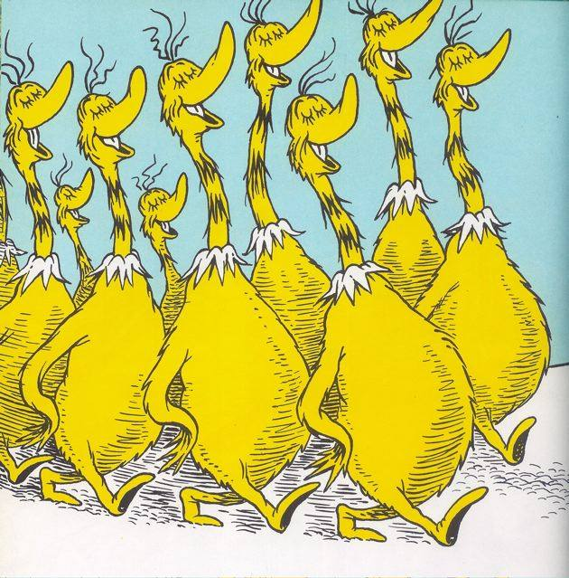{width="6.5625in"
height="6.65625in"}

{width="6.65625in"
height="5.947916666666667in"}

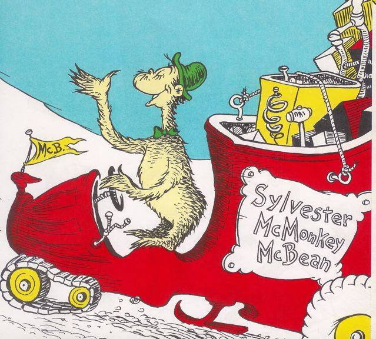{width="6.65625in"
height="6.0in"}

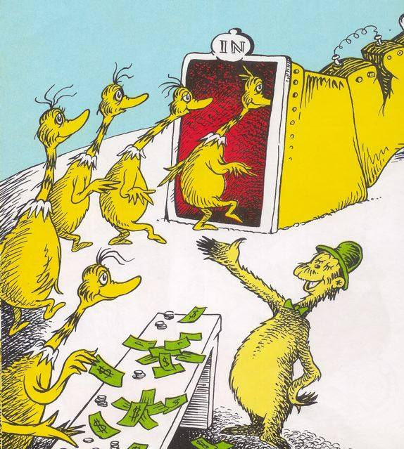{width="5.979166666666667in"
height="6.65625in"}

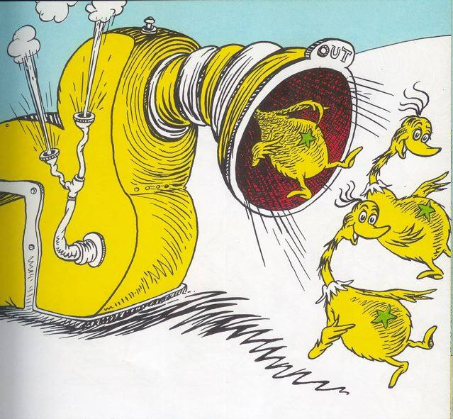{width="6.65625in"
height="6.15625in"}

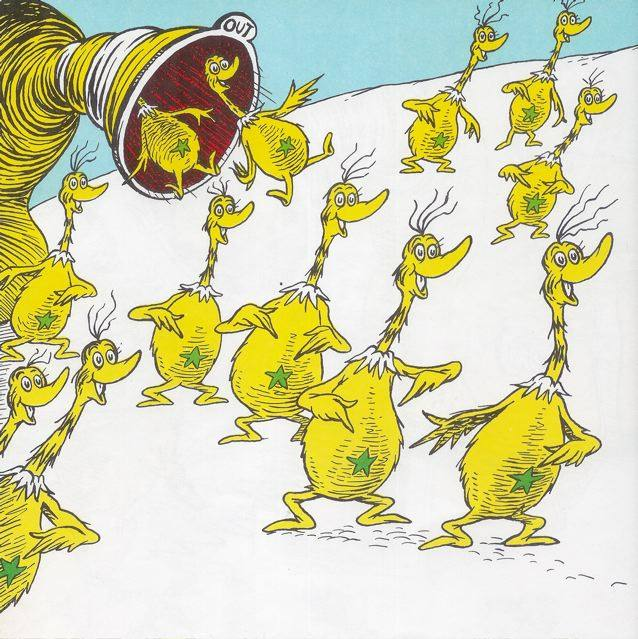{width="6.645833333333333in"
height="6.65625in"}

{width="6.65625in"
height="6.614583333333333in"}

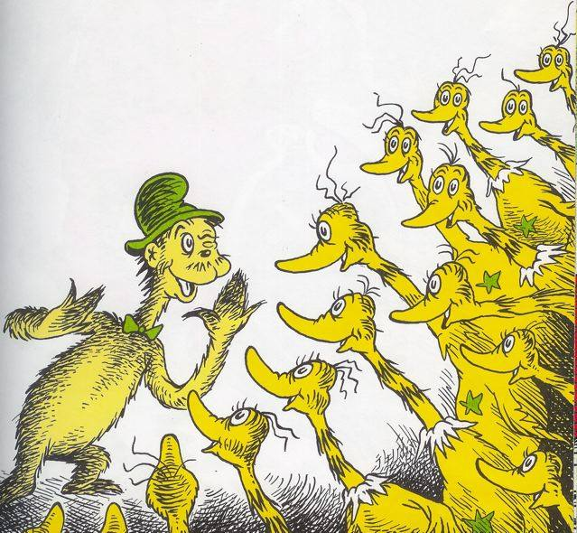{width="6.65625in"
height="6.145833333333333in"}

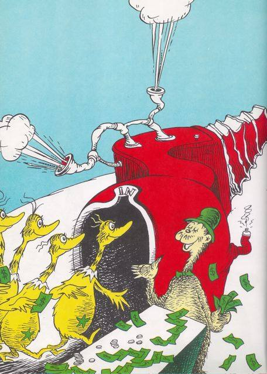{width="4.75in"
height="6.65625in"}

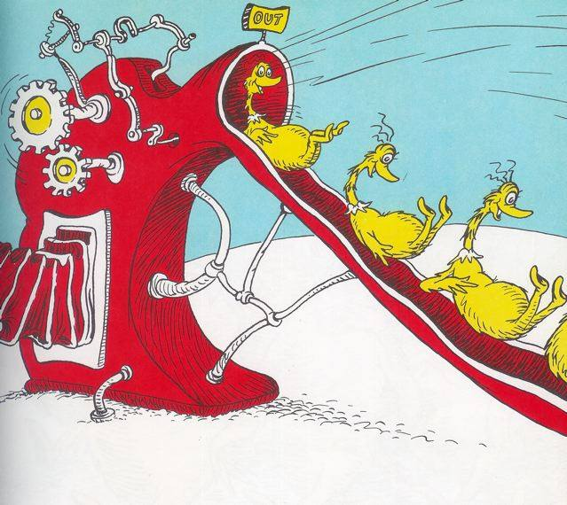{width="6.65625in"
height="5.9375in"}

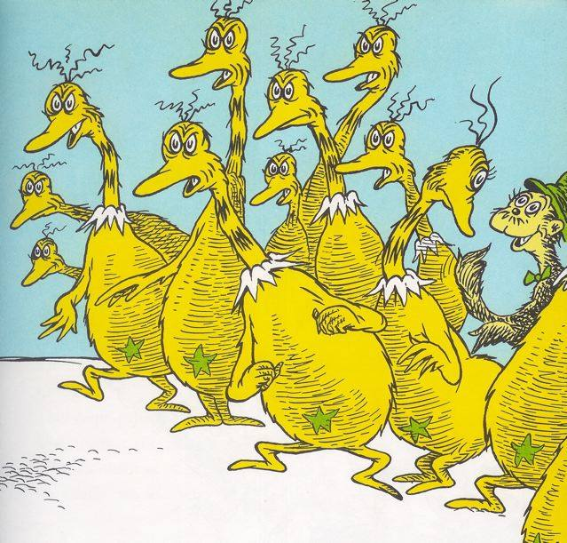{width="6.65625in"
height="6.364583333333333in"}

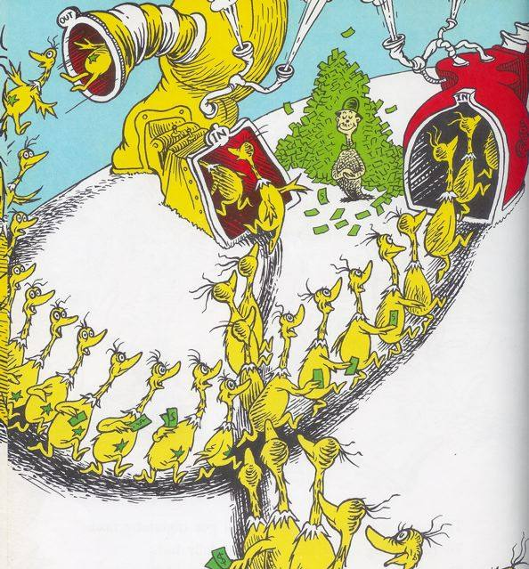{width="6.1875in"
height="6.65625in"}

{width="6.1875in"
height="6.65625in"}

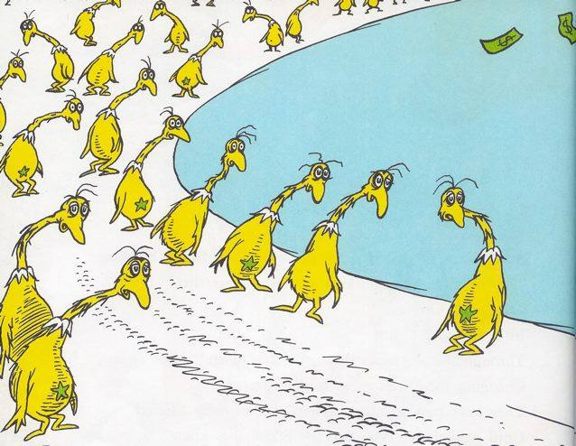{width="6.645833333333333in"
height="5.145833333333333in"}

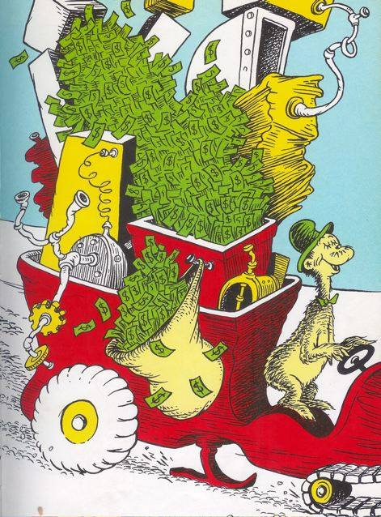{width="4.90625in"
height="6.645833333333333in"}

**Th**e Sneetches

One of Dr. Seuss's wonderfully rich stories is the unforgettable tale of
The Sneetches---some with stars on their bellies and some without. It is
this star, or lack of it, that brilliantly teaches children about social
injustice and the senselessness of discrimination. A testament to the
genius of this book came in 1998 when NATO translated The Sneetches and
Other Stories into Serbo-Croatian and distributed it to 500,000 children
in Bosnia and Herzegovina as part of an information campaign to help
encourage racial tolerance.

Audrey Geisel said of this undertaking: "Since my husband died, much has
happened that I would have dearly loved to share with him, but none more
than to have had him see his Sneetches, whose only territory has been
beaches, now have the opportunity to teach their lesson of tolerance in
a far more important theater of operations: the minds of the children of
Bosnia. He would regard this as among his finest achievements."\
Ted Geisel ends The Sneetches story with a universal truth for all to
embrace: "I'm quite happy to say that the Sneetches got really quite
smart on that day, the day they decided that Sneetches are Sneetches and
no kind of Sneetch is the best on the beaches. That day, all the
Sneetches forgot about stars and whether they had one, or not, upon
thars."

Picture adapted posthumously from the illustration for the 1961 book,
The Sneetches and Other Stories

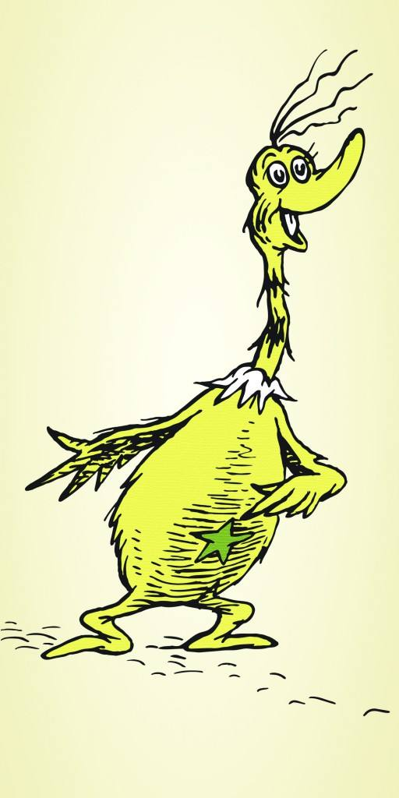{width="4.791666666666667in"
height="9.583333333333334in"}

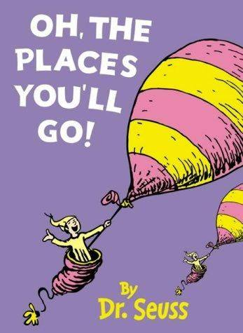{width="3.6145833333333335in"
height="4.947916666666667in"}

'Oh, The Places You'll Go!" offers a surprisingly eloquent perspective
on life. There are a lot of highs and some low points too, but through
it all "there is fun to be done".

This classic Seussian tale begins with a little guy who is about to
embark on a big adventure.  He's off to Great Places...he's off and
away.  As he travels through the story, he encounters situations that
could mirror any of our lives.  OK, so you might not find yourself in a
prickle-ly perch or a creek where the Hakken-Kraks howl, but you're sure
to relate to the struggles and surprises this little guy experiences as
he chooses his course in life.

Like us, he is filled with a myriad of feelings -- winning, loneliness,
fear, confusion, exhilaration, stagnation and bravery....to name a few. 
He learns about the possibilities that life has to offer and that his
challenges are not insurmountable. I just wonder how much more resilient
our kids would be if they grew up with this type of message -- that life
isn't always a fairy tale ... but with care and tact you can always get
out of the "slump" you're in? And what better way to validate our
children's feelings than to reassure them that it's ok to have off days,
no matter how big or small you are.

With such an encouraging, yet honest message that brings hope to the
future, it is not surprising that it was the first book I read to
Jamie.  I wanted to say that the world is available to you and it's
filled with great places.  As you navigate through the ups and downs in
your life, you get to choose the path you will take.  "And will you
succeed?  Yes! You will, indeed! (98 and ¾ percent guaranteed)".

In keeping with Dr Seuss stories, the pictures are funky and the writing
is fun to read.  It is suitable for people of all ages.  I've personally
used it in organisations and schools as a way of discussing issues
related to change, choices, adversity, resilience and self-belief.

So what are you waiting for?  "Today is your day! Your *life* is
waiting.  So .... get on your way!".

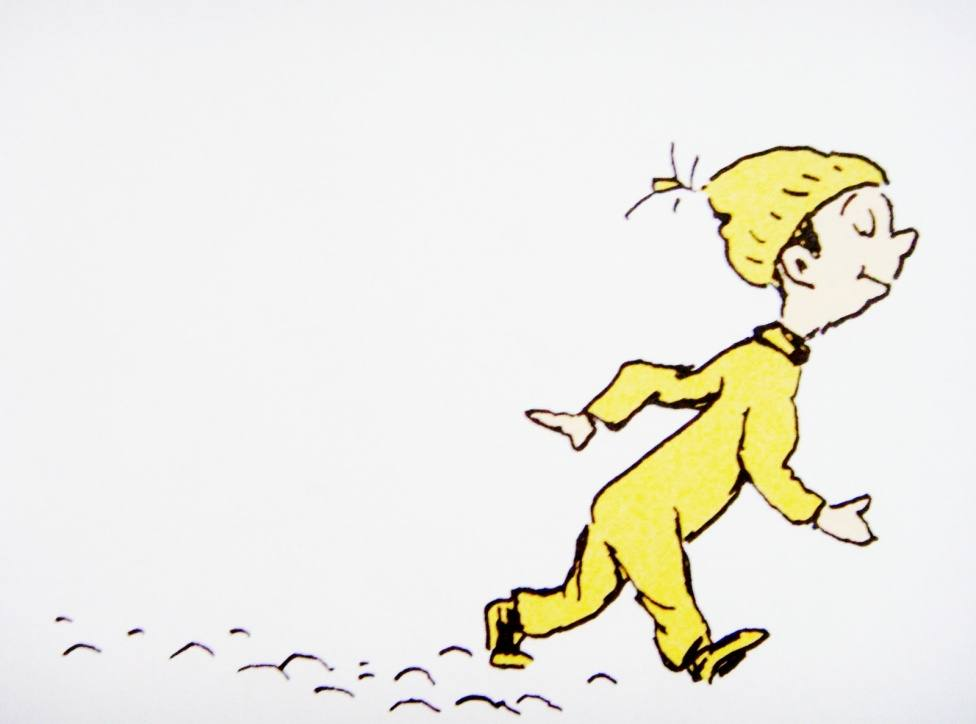{width="4.4375in"
height="3.2916666666666665in"}

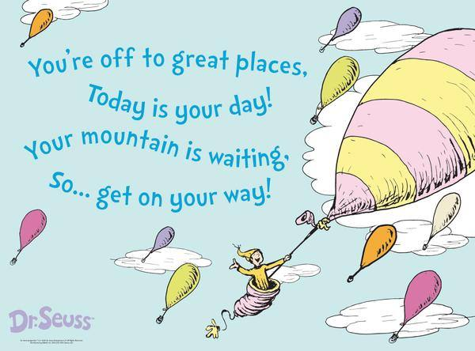{width="6.25in"
height="4.625in"}

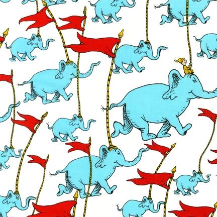{width="4.5in"
height="4.5in"}

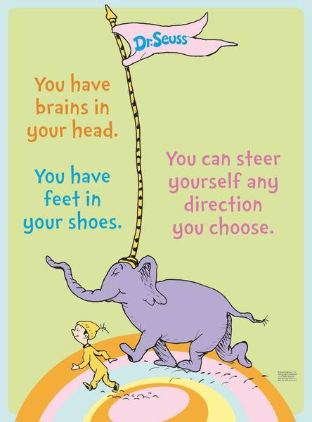{width="4.625in"
height="6.25in"}

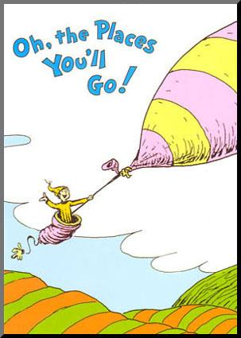{width="3.15625in"
height="4.427083333333333in"}

{width="6.770833333333333in"
height="8.760416666666666in"}

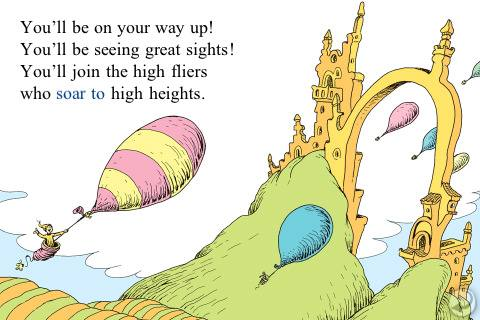{width="5.0in"
height="3.3333333333333335in"}

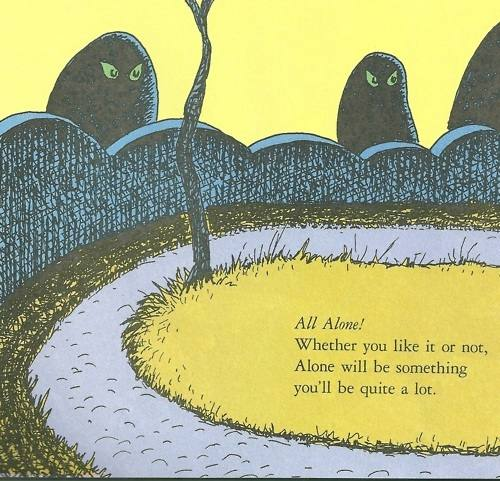{width="5.0in"
height="4.8125in"}

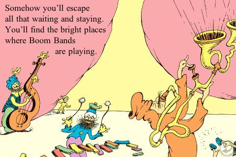{width="5.0in"
height="3.3333333333333335in"}

\"Oh, The Places You\'ll Go!\" written and illustrated by Theodor
Geisel, better known as Dr. Seuss, debuted on January 22, 1990.

Since then, millions of high school and college grads have heard the
same zealous affirmation, a not-so-gentle reminder to live up to their
potential \-- \"KID, YOU\'LL MOVE MOUNTAINS!\" \-- mixed with warnings
about loneliness and uncertainty.

It\'s a children\'s book, as most Dr. Seuss books are, but its messages
have resonated through a quarter-century because adults love it too,
said Philip Nel, director of the program in children\'s literature at
Kansas State University.

Children\'s books \"possess an enormous amount of wisdom for the adults
mature enough to recognise it,\" he said.

Here are a few facts about \"Oh, The Places You\'ll Go!\" and its
legacy.

Dr. Seuss knew it would be the last book he published

Geisel was writing and illustrating \"Oh, The Places You\'ll Go!\" in
the final years of his life, as he battled cancer. Other Seuss books
have emerged since his death in 1991, but this was the last he had a
hand in.

\"It was his swan song, and he knew it was his swan song,\" Nel said.
\"It\'s a career summation in a lot of ways, both visually and morally,
in the messages and the images.\"

Though it presents plenty of Seussian optimism \-- \"And will you
succeed? Yes! You will, indeed! (98 and 3/4 percent guaranteed.)\" \--
it references dark times and stumbles: \"I\'m afraid that sometimes
you\'ll play lonely games too. Games you can\'t win \'cause you\'ll play
against you.\"

Geisel wrote from experience. After a successful career in advertising,
his first book, \"And to Think That I Saw It on Mulberry Street,\" was
famously rejected multiple times. Some projects in print and on screen
simply never took off. In his personal life, he faced illness and the
suicide of his first wife.

\"The darkness of the book is what makes the optimism credible,\" Nel
said.

Geisel was known to be shy but would be \"tickled\" to know that his
words still have meaning now, said Susan Brandt, president of licensing
and marketing at Dr. Seuss Enterprises. He was deliberate about what his
last words to the world would be.

\"You can feel him saying, \'Wait, I have one more thing to say,\' \"
she said. \" \'Listen to me; this is important.\' \"

It\'s the top-selling Dr. Seuss book

\"Oh, The Places You\'ll Go!\" rose to the bestseller list shortly after
it was released in 1990 and continues to pop up there most every spring,
as high school and college grads transition to a new phase of life.
Twenty-five years and more than 10 million copies later, it\'s the
top-selling Dr. Seuss book.

The company it keeps at the top? Beloved early-reading books like
\"Green Eggs and Ham\" and \"The Cat in the Hat,\" perennial holiday
read \"How the Grinch Stole Christmas!\" and books with a message \--
and a movie \-- like \"The Lorax\" and \"Horton Hears a Who!\"

Its success isn\'t exactly a surprise, said Mallory Loehr, vice
president and publisher of Random House Children\'s Books. It was
published the year she began her career at Random House, and she
remember the buzz around the book even then.

\"People knew it was special (in 1990),\" Loehr said. \"But 10 million
is crazy.\"

The main character is You \-- and you, and you, and you

Passages in \"The Cat in the Hat\" and \"The Lorax\" both slip into the
second-person to make a point to readers, but Geisel made the main
character of \"Oh, The Places You\'ll Go!\" a person called You, who
conveniently happens to be, well, you.

\"That makes the book about the reader and puts the reader in the
position of the character,\" Nel said. \"It\'s a motivator. See yourself
as the character; take action.\"

Dr. Seuss had already been a major player in children\'s literature for
decades, but this was an early entry into a burgeoning category:
children\'s stories that appeal to adults, Loehr said.

\"This is almost a self-help book. People forget that it has pages that
really acknowledge that things will be tough some times,\" she said.
\"Sit down; read this book. It will be OK.\"

As Geisel himself put it, \"I never write for children. I write for
people.\"

**Oh, the Places You\'ll Go! Dr. Seuss**

Congratulations!

Today is your day.

You\'re off to Great Places!

You\'re off and away!

You have brains in your head.

You have feet in your shoes.

You can steer yourself

any direction you choose.

You\'re on your own. And you know what you know.

And YOU are the guy who\'ll decide where to go.

You\'ll look up and down streets. Look \'em over with care.

About some you will say, \"I don\'t choose to go there.\"

With your head full of brains and your shoes full of feet,

you\'re too smart to go down any not-so-good street.

And you may not find any

you\'ll want to go down.

In that case, of course,

you\'ll head straight out of town.

It\'s opener there

in the wide open air.

Out there things can happen

and frequently do

to people as brainy

and footsy as you.

And then things start to happen,

don\'t worry. Don\'t stew.

Just go right along.

You\'ll start happening too.

OH!

THE PLACES YOU\'LL GO!

You\'ll be on y our way up!

You\'ll be seeing great sights!

You\'ll join the high fliers

who soar to high heights.

You won\'t lag behind, because you\'ll have the speed.

You\'ll pass the whole gang and you\'ll soon take the lead.

Wherever you fly, you\'ll be best of the best.

Wherever you go, you will top all the rest.

Except when you don\'t.

Because, sometimes, you won\'t.

I\'m sorry to say so

but, sadly, it\'s true

that Bang-ups

and Hang-ups

can happen to you.

You can get all hung up

in a prickle-ly perch.

And your gang will fly on.

You\'ll be left in a Lurch.

You\'ll come down from the Lurch

with an unpleasant bump.

And the chances are, then,

that you\'ll be in a Slump.

And when you\'re in a Slump,

you\'re not in for much fun.

Un-slumping yourself

is not easily done.

You will come to a place where the streets are not marked.

Some windows are lighted. But mostly they\'re darked.

A place you could sprain both your elbow and chin!

Do you dare to stay out? Do you dare to go in?

How much can you lose? How much can you win?

And IF you go in, should you turn left or right\...

or right-and-three-quarters? Or, maybe, not quite?

Or go around back and sneak in from behind?

Simple it\'s not, I\'m afraid you will find,

for a mind-maker-upper to make up his mind.

You can get so confused

that you\'ll start in to race

down long wiggled roads at a break-necking pace

and grind on for miles cross weirdish wild space,

headed, I fear, toward a most useless place.

The Waiting Place\...

\...for people just waiting.

Waiting for a train to go

or a bus to come, or a plane to go

or the mail to come, or the rain to go

or the phone to ring, or the snow to snow

or the waiting around for a Yes or No

or waiting for their hair to grow.

Everyone is just waiting.

Waiting for the fish to bite

or waiting for the wind to fly a kite

or waiting around for Friday night

or waiting, perhaps, for their Uncle Jake

or a pot to boil, or a Better Break

or a string of pearls, or a pair of pants

or a wig with curls, or Another Chance.

Everyone is just waiting.

NO!

That\'s not for you!

Somehow you\'ll escape

all that waiting and staying

You\'ll find the bright places

where Boom Bands are playing.

With banner flip-flapping,

once more you\'ll ride high!

Ready for anything under the sky.

Ready because you\'re that kind of a guy!

Oh, the places you\'ll go! There is fun to be done!

There are points to be scored. There are games to be won.

And the magical things you can do with that ball

will make you the winning-est winner of all.

Fame! You\'ll be as famous as famous can be,

with the whole wide world watching you win on TV.

Except when they don\'t

Because, sometimes they won\'t.

I\'m afraid that some times

you\'ll play lonely games too.

Games you can\'t win

\'cause you\'ll play against you.

All Alone!

Whether you like it or not,

Alone will be something

you\'ll be quite a lot.

And when you\'re alone, there\'s a very good chance

you\'ll meet things that scare you right out of your pants.

There are some, down the road between hither and yon,

that can scare you so much you won\'t want to go on.

But on you will go

though the weather be foul.

On you will go

though your enemies prowl.

On you will go

though the Hakken-Kraks howl.

Onward up many

a frightening creek,

though your arms may get sore

and your sneakers may leak.

On and on you will hike,

And I know you\'ll hike far

and face up to your problems

whatever they are.

You\'ll get mixed up, of course,

as you already know.

You\'ll get mixed up

with many strange birds as you go.

So be sure when you step.

Step with care and great tact

and remember that Life\'s

a Great Balancing Act.

Just never foget to be dexterous and deft.

And never mix up your right foot with your left.

And will you succeed?

Yes! You will, indeed!

(98 and 3/4 percent guaranteed.)

KID, YOU\'LL MOVE MOUNTAINS!

So\...

be your name Buxbaum or Bixby or Bray

or Mordecai Ali Van Allen O\'Shea,

You\'re off the Great Places!

Today is your day!

Your mountain is waiting.

So\...get on your way!

{width="4.166666666666667in"
height="4.166666666666667in"}

**Dr. Seuss teaches peace - **Oh, the Places You\'ll Go! 

  ------------------------------------
  *\"If we are to reach real peace in
  the world, we shall have to begin
  with the children.\"  Gandhi*
  ------------------------------------

  ------------------------------------

You\'re off to great places! Today is your day! Your mountain is
waiting. So\...get on your way!\"

Background/ History

"Oh, the Places You'll Go!" was published in 1990 and was Dr. Seuss's
final published work before his death in 1991. The story follows the
main character through basic stages of life, using creations like "the
waiting place" and scary dark paths as the challenges and difficulties
everyone must face. Dr. Seuss focuses however on the potential of the
boy to transcend and overcome the many struggles of life and to achieve
great things. Like his other works, this story uses his infamous
rhythmic and rhyming style and is filled with creative and imaginative
scenes and characters. What makes this short story unique, is his use of
2nd person writing, and his reference to the main character simply as
"you". This allowed Dr. Seuss's message in this book to be entirely
universal and the book has become an iconic graduation gift since is
release.

Objectives

Students discuss the future and their role in deciding it.

Students discuss the concept of the "balancing act" in life.

Students complete an activity to pinpoint their goals while recognising
their struggles.

Students discuss potential and self-motivation.

Discussion with open ended questions such as:

What does the author mean when he talks about "bang-ups" and "hang-ups"?

Do you think you can control these events, and does everyone have them?

Who do you think makes most of the decisions in your life?

Dr. Seuss says "Do you dare to stay out? Do you dare to go in? How much
can you lose? How much can you win? And if you go in, should you turn
left or right...or right-and-three-quarters? Or, maybe, not quite? Or go
around back and sneak in from behind?" Do you think there is always a
right answer to these questions?

What do you think Dr. Seuss means when he compares life to a great
balancing act?

What different things do you balance in your life?

**Art**

First section, using cut outs from the magazines or drawings, they
should represent everyday choices or challenges they face as well as
activities or hobbies.

In the second section students represent major challenges or "slumps"
they have had to overcome in the past.

Finally, in the third section students illustrate what their goals are
for the future. (What they see themselves doing in high school, college,
careers etc.)

Discussion

How students overcame some of their challenges, whether it was losing a
pet, getting sick, etc. Use school as an example to discuss motivation.
For example, whether their parents make them do homework, or they do it
on their own. Discuss the responsibility of making their own choices in
the future.

Message

When you grow up you will become more independent! With independence you
are sometimes alone in your decisions. Adults regularly decide what path
to take and how to deal with slumps. Sometimes there will be things that
are out of your hands like the "waiting place" and the "bang-ups" and
"hang-ups." While family and friends can and do help, it is your
responsibility to get yourself out of hard times and create a future
with exciting options and choices.

Optional follow up activities

1\. Students will write a paragraph describing their most important goal
for the future. Then they will exchange their paragraphs with a student
and discuss these important goals.

2\. You may choose to show the movie adapted from this story.

**Quotes - Quick Writes**

"You have brains in your head. You have feet in your shoes. You can
steer yourself any direction you choose. You\'re on your own. And you
know what you know. And YOU are the one who\'ll decide where to go\..."

*"You\'re off to Great Places!*

*Today is your day!*

*Your mountain is waiting,*

*So\... get on your way!"*

"So be sure when you step, Step with care and great tact. And remember
that life\'s A Great Balancing Act. And will you succeed? Yes! You will,
indeed! (98 and ¾ percent guaranteed) Kid, you\'ll move mountains."

*"You\'ll get mixed up, of course, as you already know. You\'ll get
mixed up with many strange birds as you go. So be sure when you step.
Step with care and great tact and remember that Life\'s a Great
Balancing Act. Just never forget to be dexterous and deft. And never mix
up your right foot with your left."*

"Oh the places you\'ll go! There is fun to be done! There are points to
be scored. There are games to be won. And the magical things you can do
with that ball will make you the winning-est winner of all."

*"Things may happen and often do to people as brainy and footsy as you*"

"Congratulations!

Today is your day.

You\'re off to Great Places!

You\'re off and away!"

*"It\'s opener, out there, in the wide, open air."*

"You have brains in your head.

You have feet in your shoes.

You can steer yourself any direction you choose."

*"And when you\'re alone there\'s a very good chance*

*you\'ll meet things that scare you right out of your pants*

*There are some, down the road between hither and yon,*

*that can scare you so much you won\'t want to go on."*

"Fame you\'ll be famous, as famous as can be, with everyone watching you
win on TV, Except when they don\'t because sometimes they won\'t.."

*"You will come to a place where the streets are not marked.*

*Some windows are lighted. but mostly they\'re darked.*

*But mostly they\'re darked.*

*A place you could sprain both your elbow and chin!*

*Do you dare to stay out? Do you dare to go in?*

*How much can you lose? How much can you win?"*

"When you\'re in a Slump,

you\'re not in for much fun.

Un-slumping yourself

is not easily done."

*"You won\'t lag behind, because you\'ll have the speed.*

*You\'ll pass the whole gang and you\'ll soon take the lead.*

*Wherever you fly, you\'ll be best of the best.*

*Wherever you go, you will top all the rest.*

*Except when you don\'t.*

*Because, sometimes, you won\'t."*

"Onward up many a frightening creek, though your arms may get sore and
your sneakers may leak. Oh! The places you\'ll go!"

*"So\...\
be your name Buxbaum or Bixby or Bray\
or Mordecai Ali Van Allen O\'Shea,\
you\'re off to Great Places!\
Today is your day!\
Your mountain is waiting.\
So\...get on your way!" *

"Out there things can happen, and frequently do,\
To people as brainy and footsy as you.\
And when things start to happen, don\'t worry, don\'t stew.\
Just go right along, you\'ll start happening too!" 

*"You can get so confused\
that you\'ll start in to race\
down long wiggled roads at a break-necking pace\
and grind on for miles across weirdish wild space,\
headed, I fear, toward a most useless place.\
The Waiting Place\..." *

"Kid, you\'ll move mountains."

*"Simple it\'s not, I\'m afraid you will find, for a mind maker-upper to
make up his mind"*

"Oh, the places you\'ll go! There is fun to be done!

There are points to be scored. There are games to be won.

And the magical things you can do with that ball

will make you the winning-est winner of all.

Fame! You\'ll be as famous as famous can be,

with the whole wide world watching you win on TV.

Except when they don\'t

Because, sometimes they won\'t.

I\'m afraid that some times

you\'ll play lonely games too.

Games you can\'t win

\'cause you\'ll play against you."

*"I\'m sorry to say so*

*but, sadly, it\'s true*

*that Bang-ups*

*and Hang-ups*

*can happen to you."*

"And that is a story that no one can beat,

When I say that I saw it on Mulberry Street."

Dr. Seuss was one of America's greatest children's book writers and
illustrators, and he was also one of our great satirists. The satirical
aspects of his work often get little notice, but his social commentary
is timeless and speaks to the eternal foolishness of all human beings,
whether they be adults or children.

{width="2.0833333333333335in"
height="2.875in"}

The Butter Battle Book was created in 1984 as a story against war and
the proliferation of nuclear weapons. It was published in the cold war,
when the Reagan administration and the Soviet Union were developing
weapons like the MX missile and the Star Wars space defence program as a
deterrence against each other. In November 1983 The Day After had just
aired in ABC television as a t.v. special that depicted the aftermath of
a nuclear war between the United States and the Soviet Union. People all
over the world were worried about nuclear war and this influence Dr.
Seuss.

The Butter Battle Book is about two groups, the Yooks and the Zooks, who
like on opposite sides of a winding wall and are in constant conflict
against each other. The source of the conflict is simple that the Yooks
eat their bread with the butter side up while the Zooks eat their bread
with the butter side down. They cannot live with this small difference,
and they build larger and ever more dangerous weapons to hurt the other
side. Finally a small but extremely destructive red bomb called the
"Bitsy Big-Boy Boomeroo" is created, that can destroy both sides if it
is ever used. Like The Lorax, The Butter Battle Book ends with a
warning:

"Be careful Grandpa,

Be careful! Oh gee!

Who will drop it, will you or will he?"

"I don't know," Grandpa replied,

"We'll see.

We shall see."

a verse that Dr. Seuss spoke to a commencement at Lake Forest College
outside Chicago in June 1977. His commencement poem was greeted with
cheers from the students who grew up with the books of Dr. Seuss. This
poem is called "My Uncle Terwilliger on the Art of Eating Popovers".

My uncle ordered popovers

from the restaurant's bill of fare.

And when they were served,

he regarded them

with a penetrating stare...

Then he spoke great Words of Wisdom

as he sat there on that chair:

"To eat these things,"

said my uncle,

"you must exercise great care.

You may swallow down what's solid...

BUT...

you must spit out the air!"

And...

as you partake of the world's bill of fare,

that's darned good advice to follow.

Do a lot spitting out of the hot air.

And be careful what you swallow."

**Dr. Seuss teaches peace - The Butter Battle Book**

**-**teachpeace.com

\"If we are to reach real peace in the world, we shall have to begin
with the children.\" Gandhi

The Butter Battle Book (theme is silly conflicts can escalate into a
dangerous situation) was written in response to the arms build-up and
nuclear war threat during the Reagan administration. Published in 1984,
Butter Battle shed light on the growing threat of war between Yooks and
the Zooks. The threat stems solely from the way Yooks and Zooks choose
to eat their bread: butter-side up and butter-side down, respectively.
The story ends with a blank page, leaving a cliffhanger ending that is
open to interpretation. The Butter Battle Book was on the adult New York
Times bestseller list for adults. In 1990, a televised version of The
Butter Battle Book was shown on Russian television.

This cautionary Cold War tale has a lot to teach about intolerance and
how tit-for-tat violence can quickly get out of hand. Explaining the
very serious differences between the Zooks and the Yooks, a Zook grandpa
tells his grandchild the unspeakable truth: \"It\'s high time that you
knew of the terribly horrible thing that Zooks do. In every Zook house
and every Zook town every Zook eats his bread with the butter side
down!\" He then recalls his days with the Zook-Watching Border Patrol,
as he gave any Zook who dared come close \"a twitch with my tough-tufted
prickly Snick-Berry Switch.\" But when the Zooks fought back, the
switches gave way to Triple-Sling Jiggers, then Jigger-Rock
Snatchems\--even a Kick-a-Poo Kid that was \"loaded with powerful
Poo-a-Doo Powder and ants\' eggs and bees\' legs and dried-fried clam
chowder.\" (5th-6th graders)

Background/ History

Published in 1984, The Butter Battle Book is an anti-war story written
by Dr. Seuss. It is a children's' rhyming story addressing fears from
the cold war era during which it was written. Specifically it deals with
the nuclear war and the possibility of mutually assured destruction. Dr.
Seuss, whose real name was Theodor Seuss Geisel, wrote many children's
books, and many referred to his political views or other moral codes.
Some of his stories, like The Butter Battle Book were considered
controversial at the time. This particular story was censored and taken
out of public libraries for its obvious statements against the arms race
between the United States and the Soviet Union.

Objectives

Students will explore the themes behind the story

Students will analyse the significance of these messages in today's
world

Students will learn about the different methods of propaganda

Students will discuss present issues they see in their own societies

Instructions

1\. Hand out copies of the book and have the students read it in a read
aloud so many students get a chance to read.

2\. Start a class discussion with open ended questions such as:

a\. Why do you think the Zooks and Yooks did not get along?

b\. What do you think caused this conflict to get worse?

c\. How do you think this happens with your friends or siblings?

d\. What do you think the Zooks and Yooks could have done differently to
prevent this conflict?

e\. In the story, each side uses propaganda to make their side seem like
the right side. Does anybody know how to explain what propaganda is?

3\. Direct the conversation by explaining:

Propaganda is the spread of information aimed at promoting a cause or
influencing public opinion, often slanting the truth to mislead.

4\. Next give a few examples of methods used in propaganda such as:

a\. Testimonials- using famous celebrities or leaders in advertisements

b\. Name calling-insulting or putting people down

c\. Fear- using fear to change somebody's opinions

5\. Transition into class activity by putting the students in groups of
3-4. Hand out a bank sheet of paper to each group. Write on the board
the 3 different methods of propaganda and explain each. Then assign each
group to be either the Zooks, or the Yooks to create a banner against
the other side using the methods on the board.

6\. After about half an hour pair up opposing groups and have the groups
present the banners to one another.

Evaluation

1\. To evaluate student comprehension, have the groups present the
banners to the whole class and explain the different methods and
purposes they had in mind.

2\. Have students explain what methods they chose to use, and the
purpose of their banner.

3\. Next lead a discussion about propaganda in today's world. Ask the
students if they think it is still used often, if they believe it is
influential, where they see it the most in society, whether it be
television commercials, billboards, newspapers etc.

4\. On another day, you may also chose to show the adapted production
film of the story, which is available online and in most public
libraries.

**TEACHING CHILDREN PHILOSOPHY**

{width="2.0833333333333335in"
height="2.875in"}

Summary

The Yooks believe firmly that bread should only ever be eaten with the
butter side up while the Zooks believe just as strongly that bread
should only ever be eaten with the butter side down. A grandfather gives
an account to his grandson of how the two societies segregated
themselves by increasingly threatening means until the present day has
come when the grandfather and his Zook rival VanItch come to an ultimate
standoff over how far their mounting aggressions will go.

Guidelines for Philosophical Discussion

By Nathan Treloar

*The Butter Battle Book* is an allegory for the nuclear arms race and
the state of mutually assured destruction (MAD) that occurred during the
Cold War. This story thus lends itself to a discussion with children
about the concept of war itself, the moral issues related to war and the
outcomes of retaliatory acts. An arms race develops between the Yooks
and Zooks as each side develop and threatens to use progressively larger
weapons in response to the threats and weapons development of their
rivals. Finally, after continued escalation in the actions of both sides
grandpa and VanItch stand opposed each other, both prepared to deliver
the terrible destructive force of the \"Big-Boy Boomeroo\", an obvious
metaphor for weapons of mass destruction.

Cautionary Note: *The Butter Battle Book* portrays a state of war and
near-war escalations between the Yooks and Zooks. The discussion of war
can bring out images of violence, killing and death, even though the
story does not describe any violence or killing. However, such a
potentially difficult conversation can be significantly meaningful. The
very difficult topic child soldiers can be a powerfully meaningful
conversation for many children as they are confronted with a reality of
the living conditions of children in other parts of the world that they
could personally identify with. Should you choose to carry on a
philosophical discussion of *The Butter Battle Book* with a group of
children it is important that you prepare yourself for the difficult
topic of war even if you do not intentionally intend to discuss the
topic. Although discussions of this book and the concepts of war and
violence can be facilitated without addressing death, as a facilitator
you should be prepared to address this topic if it arises in the
conversation. Also, a facilitator should be sensitive to the fact that
some of the children may have parents or other members of the family who
are in the military, or alternatively, may have had very personal
experiences with war and its effects (i.e. refugees from war-torn
countries). This could be uncomfortable for the child if they encounter
difficult topics within the discussion. Regardless, a facilitator should
be aware of these potentially difficult issues and cultivate sensitivity
to the difficult emotions any child might be experiencing because of the
discussion. You might encourage students to approach you or another
adult they can trust to discuss the emotions they are experiencing.

What is War Really Like? Although any child you may seek to have a
discussion with will likely have been exposed to many images of war in
the news and in popular media they may not have been confronted with the
serious and difficult topics of the legal state sanctioned violence,
destructing and killing that constitutes war. Further, the portrayal of
war in the media, in both news and entertainment, are often filtered
through very stereotyped attitudes towards war. War is also frequently
stereotyped as being quintessentially immoral in all contexts portraying
violence being wholly immoral in any context or situation. The complex
middle ground of why war, potentially the worst of all human activities,
can sometimes be condoned or even considered necessary while also being
the worst possible courses of action is a concept that many adults do
not consider let alone children. Any conversation about war with an
audience otherwise naïve to such complex and difficult issues has the
potential of creating long last ideas and values that might not be
challenged by direct experience (at least not in a Western audience of
children that live in conditions of being relatively sheltered from the
direct experience of war) but yet could potentially make future
decisions that affect the discussion of whether or not to support or
oppose war.

Violence, War and the Implications These issues are merely a small piece
of what a child's perspective on war could represent, speaking nothing
of exhaustive effects of war around the world. Questions from the group
on *Violence War and the Implications* aim to draw out some of the
issues, and misconceptions that may arise around the concept of war and
challenge children to try and engage their attitudes towards the
appropriateness of violence however they feel about the topic. By asking
children very specifically about what they think are good and bad
reasons for going to war children can expose themselves to at least the
differences of opinions that may exist with the other children around
them. Further, if the children cannot come to a consensus on when war is
appropriate it can provide a lesson to them about the reality of how
controversial war is. If the children cannot come to an agreement on
good and bad reasons for war then the discussion at hand would segway
well into the Responsibility of a Soldier section of questions.

When is War Appropriate? Encourage the children to discuss their ideas
about when retaliation is okay and when it is not. See if any of the
children can point out their differences between Dr.Seuss\' various
silly weapons and their inherent aggressive vs. retaliatory natures such
as the Triple-Sling Jigger and the Jigger-Rock Snatchem. If they do not
pick up on the difference point it out to them and ask them if they
think it is an important difference. The questions from this section aim
to build upon the notions of when war is right or wrong and then
challenge the notions developed by the children with examples from the
book. These questions aim to present contextual situations for the
children to consider in their discussions so that they might be able to
develop a sense for the concept of a 'Just War'. The [Just War Theory
website](http://www.justwartheory.com/) listed in the resources section
is a good resource for anyone attempting to learn more about the concept
of a 'Just War" and seeking to expand discussion of the topic within
their students.

The Responsibility and Role of a Soldier The responsibility of a soldier
would likely be a potentially difficult topic for some younger children
to grasp. However, if you are feeling brave, a discussion of the topic
could prove to be a powerful one for some older audiences. This
discussion ultimately aims to encourage children to consider who is
actually responsible for the acts of war and whether they feel any
individual person should be held accountable for their actions in times
of war. The discussion of a soldier's responsibilities for his or her
actions in war draws out the entire notion of responsibility and how it
is understood in our world. The fact that violence is condoned and
encouraged in soldiers\' actions while the same actions would be
severely punished outside in most other roles lends itself to a
discussion of what are appropriate and inappropriate actions for a
soldier and why. An underlying theme of these questions is the notion of
personal responsibility and when it is necessary for the individual to
make a choice such that it might be unpopular with those people with
positions of authority in the world. An important topic of discussion
that could come out of these questions is the issue of whether or not to
hold someone accountable for their crimes if they were forced to commit
them. Child soldiers are an obvious example of soldiers who've been
forced to fight against their will. A discussion of this topic would be
a good precursor to discussions of guilt, and why an individual may not
be considered guilty of a crime if they did not have any intent to
commit it.

Leadership and Leadership in the Face of Adversity In their
article *Leadership Lessons from The Butter Battle Book* William B.
Locander and David L. Luechauer use the story of *The Butter Battle
Book* to describe a moral about leadership, and warn against the
potentials of what they describe as situations of escalation as
understood from a business/leadership perspective. The goal of the
associated question sets is to reflect Locander and Luechauer's idea
that a bad idea can escalate into a trap of the wrong series of actions
(the perils *The Butter Battle Book* describes) and true leadership is
required to break free of the poor course of action. Poor courses of
action can be set either by outside influence, such as the leadership of
others, or by establishing a course oneself in the past. The moral is,
of course, that true leadership comes when people do what is right,
even, and especially, when it is most difficult to do. These questions
also overlap with a foundation of anti-establishment ideology that could
suggest the basic idea of questioning authority to children. Different
audiences will be at different levels of development which can directly
correspond to how they can cope with the concept that doing what is
right does not come from an adult or person of authority, but could come
from somewhere else entirely. However, if the youth discuss this with
can grasp these concepts this discussion can be very powerful for them
(and also very difficult for you if you are the authority figure who
will soon have their authority questioned more frequently).

Vocabulary

In *The Butter Battle Book* there are many words and phrases invented by
Dr. Seuss, as is the custom of his unique writings. Generally the
meaning of a strange word can be understood from the accompanying
pictures in the book. If there is concern that some children might be
confused by some of Dr.Suess' words, taking a moment to point out the
objects while reading the story is helpful.

Questions for Philosophical Discussion

What is War Really Like?

1.  What is war?

2.  Where have you seen war?

3.  Do movies or television shows about war show what war is really
    like?

4.  What is war really like?

5.  Why do wars happen?

6.  Are there any good things about war? What are they?

7.  Are there any bad things about war? What are they?

Violence, War and the Implications

1.  Ask the children if they thought that the Yooks and Zooks were at
    battle. Ask them to show you in the book when they thought that the
    Yooks and Zooks went from not fighting to fighting.

2.  Does anyone know what the the Yooks and the Zooks were fighting
    about in the story?

3.  Is that a good reason to be fighting?

4.  What does it mean when people are going to war?

5.  When is it good to go into war?

6.  When is it bad to go into war?

7.  Are there times when it is okay to start a war against someone else?

When is War Appropriate?

1.  At the end of the book Grandpa and VanItch are ready to drop Big-Boy
    Bommeroos on each other\'s homes. One of the Big-Boy Boomeroos will
    destroy everything that is not safely underground. Should VanItch
    drop a Big-Boy Boomeroo on the Zooks if Grandpa drops one on the
    Yooks even though it won\'t bring back any of Yooks\' homes?

2.  If someone has started a war against you is okay for you to fight
    back against them?

3.  When VanItch shot the sling shot and broke Grandpa\'s Snick-Berry
    Switch, would it have right for Grandpa to go to war against
    VanItch?

The Responsibility and Role of a Soldier

*Grandpa is a member of the Zook-Watching Border Patrol. As a member of
the Zook-Watching Border Patrol he takes his orders from the Chief
Zookeroo.*

1.  Ask the children if they know what \"responsibility\" meant. Ask
    them if they can give an example. Ensure they understand what it
    means to take responsibility for one\'s actions vs. the behaviour of
    responsibility.

2.  Because Grandpa is doing what the Cheif Zookeroo orders him to, is
    he responsible for his own actions?

3.  When Grandpa threatens to twitch the Yooks with the Snick-Berry
    Swtich, would it be Grandpa's fault if one of the Yooks got hurt or
    killed?

4.  Was it wrong for VanItch to destroy Snick-Berry Switch?

5.  When Grandpa crossed over wall to cover the Zook in Blue Goo he
    stopped because VanItch had an Utterly Sputter as well and he said
    that he would cover the Yooks with Blue Goo if Grandpa did so to the
    Zooks?

6.  If some of the Yooks got hurt by Grandpa when he covered them would
    Grandpa have been responsible?

7.  If Grandpa dropped the Bitsy Big-Boy Boomeroo and destroyed all of
    the Yooks\' homes, would Grandpa have been responsible?

Leadership

1.  What is leadership?

2.  Who are some leaders?

3.  Who were the leaders in The Butter Battle?

4.  Why were they leaders?

5.  What were the things they did that made them leaders? (Can you point
    it out in the book?)

Leadership in the Face of Adversity

*When the book ends, Grandpa and VanItch are both ready to drop a
Big-Boy Boomeroo on each others home. If either do drop it, they will
destroy the home land of the other.*

1.  When the Chief Zookeroo tell Grandpa drops the Big-Boy Boomeroo on
    the homes of the Zooks, and then VanItch drops the Big-Boo Boomeroo
    on the homes of the Yooks, and then everybody\'s home is destroyed,
    is it right for Grandpa to drop the Big-Boy Boomeroo?

2.  Would Grandpa be a leader if he drops the Big-Boy Boomeroo?

3.  If Grandpa doesn\'t do what the Chief Yookeroo tells him to, would
    Grandpa be doing what is right?

4.  If Grandpa doesn\'t drop the Big-Boy Boomeroo, is Grandpa showing
    leadership?

5.  Can people ever show leadership by not doing what they are told to
    do?

6.  When are people being leaders by not doing what they are told to do?

7.  When are people being leaders by not doing something that in the
    past said they would do.

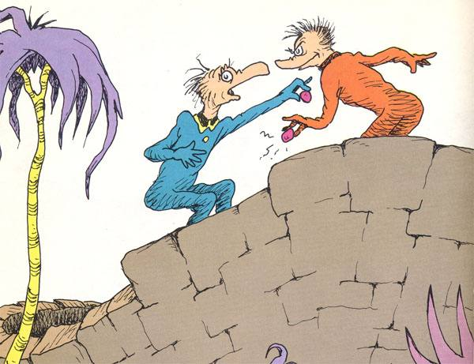{width="6.25in"
height="4.802083333333333in"}

{width="5.625in"
height="2.8854166666666665in"}

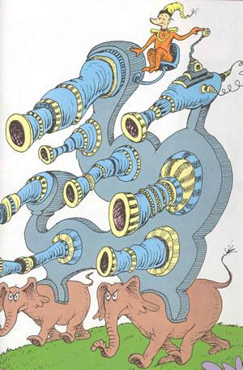{width="3.125in"
height="4.75in"}

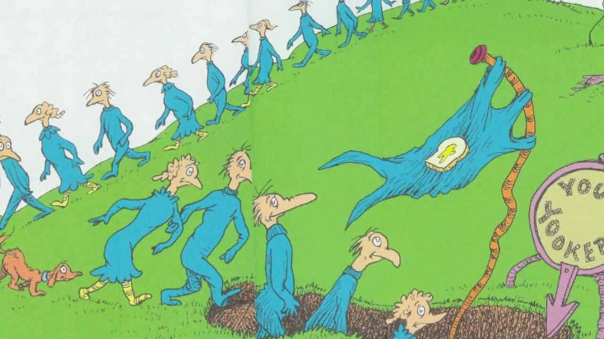{width="6.268055555555556in"
height="3.5257808398950132in"}

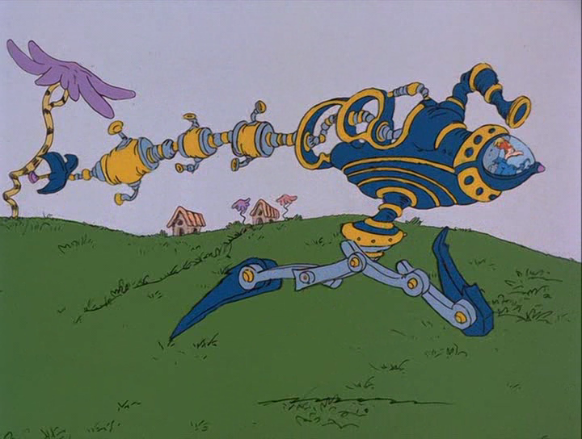{width="6.268055555555556in"
height="4.735863954505687in"}

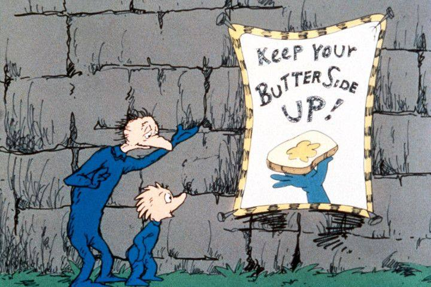{width="6.268055555555556in"
height="4.17870406824147in"}

**The Butter Battle by Dr. Seuss**

On the last day of summer,

ten hours before fall . . .

. . . my grandfather took me

out to the Wall.

For a while he stood silent.

Then finally he said,

with a very bad shake

of his very old head,

\"As you know, on this side of the Wall

we are Yooks.

On the far other side of this Wall

live the Zooks.\"

Then my grandfather said,

\"It\'s high time that you knew

of the terribly horrible thing that Zooks do.

In every Zook house and in every Zook town

every Zook eats his bread

with the butter side down!\"

\"But we Yooks, as you know,

when we breakfast or sup,

spread our bread,\" Grandpa said,

\"with the butter side up.

That\'s the right, honest way!\"

Grandpa gritted his teeth.

\"So you can\'t trust a Zook who spreads bread underneath!

Every Zook must be watched!

He has kinks in his soul!

That\'s why, as a youth, I made watching my goal,

watching Zooks for the Zook-Watching Border Patrol!

In those days, of course,

the Wall wasn\'t so high

and I could look any Zook

Square in the eye.

If he dared to come close

I could give him a twitch

with my tough-tufted

prickely Snick-Berry Switch.

For a while that worked fine.

All the Zooks stayed away

and our country was safe.

Then one terrible day

a very rude Zook by the name of VanItch

snuck up and slingshotted my Snick-Berry Switch!

With my broken-off switch, with my head hung in shame,

to the Chief Yookerooo in great sorrow I came.

But our Leader just smiled. He said, \"You\'re not to blame.

And those Zooks will be sorry they started this game.

\"We\'ll dress you right up in a fancier suit!

We\'ll give you a fancier slingshot to shoot!\"

And he ordered the Boys in the Back Room to figger

how to build me some sort of a triple-sling jigger.

With my Tripe-Sling Jigger

I sure felt much bigger.

I marched to the Wall with great vim and great vigor,

right up to VanItch with my hand on the trigger.

\"I\'ll have no more nonsense,\" I said with a frown,

\"from Zooks who eat bread with the butter side down!\"

VanItch looked quite sickly.

He ran off quite quickly.

I\'m unhappy to say

he came back the next day

in a spiffy new suit with a big new machine,

and he snarled as he said, looking frightfully mean,

\"You may fling those hard rocks with your Triple-Sling Jigger.

But I, also, now have my hand on a trigger!

My wonderful weapon, the Jigger-Rock Snatchem,

will fling \'em right back just as quick as we catch \'em.

We\'ll have no more nonsense.

We\'ll take no more gupp

from you Yooks who eat bread with the butter side up!\"

\"I have failed, sir,\" I sobbed as I made my report

to the Chief Yookeroo in the headquarters fort.

He just laughed. \"You\'ve done nothing at all of the sort.

Our slingshots have failed.

That was old-fashioned stuff.

Slingshots, dear boy,

are not modern enough.

\"All we need is some newfangled kind of gun.

My Boys in the Back Room have already begun

to think up a walloping whizz-zinger one!

My Bright Boys are thinking.

They\'re on the right track.

They\'ll think one up quick

and we\'ll send you right back!\"

They thought up a great one!

They certainly did.

They thought up a gun called the Kick-a-Poo Kid

which they loaded with powerful Poo-a-Doo Powder

and ants\' eggs and bees\' legs

and dried-fried clam chowder.

And they carefully trained a real smart dog named Daniel

to serve as our country\'s first gun-toting spaniel.

Then Daniel, the Kick-a-Poo Spaniel, and I

marched back toward the Wall

with our heads held up high

while everyone cheered and their cheers filled the sky:

\"Fight! Fight for the Butter side UP!

Do or die!\"

Well . . .

We didn\'t do.

And we didn\'t quite die.

But we sure did get worsted, poor Daniel and I.

VanItch was there too! And he said, the old pig,

\"The Boys in my Back Room invented this rig

called the Eight-Nozzled, Elephant-Toted Boom-Blitz.

It shoots high-explosive sour cherry stone pits

and will put your dumb Kick-a-Poo Kid on the fritz!\"

Poor Daniel and I

were scared out of our witz!

Once more, by VanItch I was bested and beat.

Once again I limped home from the Wall in defeat.

I dragged and I sagged

and my spirits were low,

as low as I thought that they ever could go,

when I heard a Boom-Bah!

And a Diddle-dee-Dill!

And our Butter-Up Band

marched up over the hill!

The Chief Yookeroo had sent them to meet me

along with the Right-Sid-Up Song Girls to greet me.

They sang:

\"Oh, be faithful!

Believe in thy butter!\"

And they lifted my spirits right out of the gutter!

\"My boy,\" smiled the Chief Yookeroo, \"we\'ve just voted

and made you a general! You\'ve been promoted.

Your pretty new uniform\'s ready. Get in it!

The Big War is coming. You\'re going to begin it!

And what\'s more, this time you are certain to win it.

\"My Boys in the Back Room have finally found how.

Just wait till you see what they\'ve puttered up now!

In their great new machine you\'ll fly over the Wall

and clobber those Butter-Down Zooks one and all!\"

Those Boy in the Back Room sure knew how to putter!

They made me a thing called the Utterly Sputter

and I jumped aboard with my heart all aflutter

and steered toward the land\"

of the Upside-Down Butter.

This machine was so modern, so frightfully new,

no one knew quite exactly just what it would do!

But it had several faucets that sprinkled Blue Goo

which, somehow, would sprinkle the Zooks as I flew

and gum up that upside-down butter they chew.

I was racing pell-mell

when I heard a voice yell,

\"If you sprinkle us Zooks,

you\'ll get sprinkled as well!\"

VanItch had a Sputter exactly like mine!

And he yelled, \"My Blue-Gooer is working just fine!

And I\'m here to say that if Yooks can goo Zooks,

you\'d better forget it. \'Cause Zooks can goo Yooks!\"

I flew right back home

and, as you may have guessed,

I was downright despondent,

disturbed,

and depressed.

And I saw, just as soon as I stepped back on land,

so were all of the girls of the Butter-Up Band.

The Chief Drum Majorette, Miz Yookie-Ann Sue,

said, \"That was a pretty sour flight that you flew.

And the Chief Yookerooo has been looking for you!\"

I raced to his office. The place was a sight.

\"Have no fears,\" said the Chief. \"Everything is all right.

My Bright Back Room Boys have been brighter than bright.

They\'ve thought up a gadget that\'s Newer than New.

It is filled with mysterious Moo-Lacka-Moo

and can blow all those Zooks clear to Sala-ma-goo.

THEY\'VE INVENTED

THE BITSY

BIG-BOY BOOMEROO!

\"You just run to the Wall like a nice little man.\"

Drop this bomb on the Zooks just as fast as you can.

I have ordered all Yooks to stay safe underground\"

while the Bitsy Big-Boy Boomeroo is around.\"

As I raced for that Wall, with the bomb in my hand,

I noticed that every last Yook in our land

was obeying our Chief Yookeroo\'s grim command.

They were all bravely marching,

with banners aflutter,

down a hole! For their country!

And Right-Side-Up Butter!

That\'s when Grandfather found me!

He grabbed me. He said,

\"You should be down that hole!

And you\'re up here instead!

But perhaps this is all for the better, somehow.

You will se me make history!

RIGHT HERE! AND RIGHT NOW!\"

Grandpa leapt up that Wall with a lopulous leap

and he cleared his hoarse throat

with a bopulous beep.

He screamed, \"Here\'s the end of that terrible town

full of Zooks who eat bread with the butter side down!\"

And at that very instant we heard a klupp-klupp

of feet on the Wall and old VanItch klupped up!

The Boys in HIS Back Room had made him one too!

In his fist was another Big-Boy Boomeroo!

\"I\'ll blow you,\" he yelled, \"into pork and wee beans!

I\'ll butter-side-up you to small smithereens!\"

\"Grandpa! I shouted. \"Be careful! Oh, gee!

Who\'s going to drop it?

Will you . . . ? Or will he . . . ?

\"Be patient,\" said Grandpa. \"We\'ll see.

We will see . . . \"

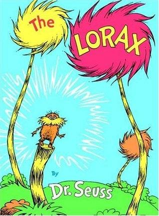{width="3.3125in"
height="4.510416666666667in"}

Long before "going green" was mainstream, Dr. Seuss's Lorax spoke for
the trees and warned of the dangers of disrespecting the environment. In
this cautionary rhyming tale (printed on recycled paper) we learn of the
Once-ler, who came across a valley of Truffula Trees and Brown
Bar-ba-loots, and how his harvesting of the tufted trees changed the
landscape forever. With the release of the blockbuster film version, the
Lorax and his classic tale have educated a new generation of young
readers not only about the importance of seeing the beauty in the world
around us, but also about our responsibility to protect it.

{width="4.635416666666667in"
height="0.22916666666666666in"}

- What was the land of the Lorax like before the Once-ler arrived? Did
  it seem like someplace you\'d like to live? What parts of your own
  environment would you be sad to see go?

- What kind of person is the Once-ler? Why won\'t he listen to the
  Lorax? The Lorax says to the Once-ler, \"You are crazy with greed.\"
  Why does the Lorax say that? Do you agree or disagree?

- Why does the Lorax speak for the trees? Why is it important to speak
  up for others? Have you ever spoken up for someone else? Has someone
  else ever spoken up for you?

- How does the Once-ler\'s Thneed business hurt the land of the Lorax?
  What happens to the Swomee-swans, the Brown Bar-ba-loots, and the
  Humming-fish? How could things have been different if the Once-ler
  listened to the Lorax?

- What do you think the boy hearing the story will do with the Truffula
  seed that the Once-ler tosses to him? What would you do if you were
  the boy?

- Do you think the Lorax and his friends will come back if new Truffula
  Trees grow? Where do you think they have been?

**The Lorax Quotes**

"Unless someone like you cares a whole awful lot,\
Nothing is going to get better. It\'s not."

"I am the Lorax. I speak for the trees. I speak for the trees for the
trees have no tongues." 

"It\'s not about what it is, it\'s about what it can become."

"Catch! calls the Once-ler.

He lets something fall.

It\'s a Truffula Seed.

It\'s the last one of all!

You\'re in charge of the last of the Truffula Seeds.

And Truffula Trees are what everyone needs.

Plant a new Truffula. Treat it with care.

Give it clean water. And feed it fresh air.

Grow a forest. Protect it from axes that hack.

Then the Lorax

and all of his friends

may come back."

"But now,\" says the Once-ler, \"now that you\'re here, the word of the
Lorax seems perfectly clear. UNLESS someone like you cares a whole awful
lot, nothing is going to get better. It\'s not."

"The Lorax: Which way does a tree fall?

The Once-ler: Uh, down?

The Lorax: A tree falls the way it leans. Be careful which way you
lean."

**THE LORAX \~Dr. Seuss**

At the far end of town

where the Grickle-grass grows

and the wind smells slow-and-sour when it blows

and no birds ever sing excepting old crows\...

is the Street of the Lifted Lorax.

And deep in the Grickle-grass, some people say,

if you look deep enough you can still see, today,

where the Lorax once stood

just as long as it could

before somebody lifted the Lorax away.

What was the Lorax?

And why was it there?

And why was it lifted and taken somewhere

from the far end of town where the Grickle-grass grows?

The old Once-ler still lives here.

Ask him. He knows.

You won\'t see the Once-ler.

Don\'t knock at his door.

He stays in his Lerkim on top of his store.

He lurks in his Lerkim, cold under the roof,

where he makes his own clothes

out of miff-muffered moof.

And on special dank midnights in August,

he peeks

out of the shutters

and sometimes he speaks

and tells how the Lorax was lifted away.

He\'ll tell you, perhaps\...

if you\'re willing to pay.

On the end of a rope

he lets down a tin pail

and you have to toss in fifteen cents

and a nail

and the shell of a great-great-greatgrandfather

snail.

Then he pulls up the pail,

makes a most careful count

to see if you\'ve paid him

the proper amount.

Then he hides what you paid him

away in his Snuvv,

his secret strange hole

in his gruvvulous glove.

Then he grunts, \"I will call you by Whisper-ma-Phone,

for the secrets I tell you are for your ears alone.\"

SLUPP!

Down slupps the Whisper-ma-Phone to your ear

and the old Once-ler\'s whispers are not very clear,

since they have to come down

through a snergelly hose,

and he sounds

as if he had

smallish bees up his nose.

\"Now I\'ll tell you,\"he says, with his teeth sounding gray,

\"how the Lorax got lifted and taken away\...

It all started way back\...

such a long, long time back\...

Way back in the days when the grass was still green

and the pond was still wet

and the clouds were still clean,

and the song of the Swomee-Swans rang out in space\...

one morning, I came to this glorious place.

And I first saw the trees!

The Truffula Trees!

The bright-colored tufts of the Truffula Trees!

Mile after mile in the fresh morning breeze.

And, under the trees, I saw Brown Bar-ba-loots

frisking about in their Bar-ba-loot suits

as they played in the shade and ate Truffula fruits.

From the rippulous pond

came the comfortable sound

of the Humming-Fish humming

while splashing around.

But those trees! Those trees!

Those Truffula Trees!

All my life I\'d been searching

for trees such as these.

The touch of their tufts

was much softer than silk.

And they had the sweet smell

of fresh butterfly milk.

I felt a great leaping

of joy in my heart.

I knew just what I\'d do!

I unloaded my cart.

In no time at all, I had built a small shop.

Then I chopped down a Truffula Tree with one chop.

And with great skillful skill and with great speedy speed,

I took the soft tuft, and I knitted a Thneed!

The instant I\'d finished, I heard a ga-Zump!

I looked.

I saw something pop out of the stump

of the tree I\'d chopped down. It was sort of a man.

Describe him?\... That\'s hard. I don\'t know if I can.

He was shortish. And oldish.

And brownish. And mossy.

And he spoke with a voice

that was sharpish and bossy.

\"Mister!\" he said with a sawdusty sneeze,

\"I am the Lorax. I speak for the trees.

I speak for the trees, for the trees have no tongues.

And I\'m asking you, sir, at the top if my lungs\"-

he was very upset as he shouted and puffed-

\"What\'s that THING you\'ve made out of my Truffula tuft?\"

\"Look, Lorax,\" I said.\"There\'s no cause for alarm.

I chopped just one tree. I am doing no harm.

I\'m being quite useful. This thing is a Thneed.

A Thneed\'s a Fine-Something-That-All-People-Need!

It\'s a shirt. It\'s a sock. It\'s a glove, It\'s a hat.

But it has other uses. Yes, far beyond that.

You can use it for carpets. For pillows! For sheets!

Or curtains! Or covers for bicycle seats!\"

The Lorax said,

\"Sir! You are crazy with greed.

There is no one on earth

who would buy that fool Thneed!\"

But the very next minute I proved he was wrong.

For, just at that minute, a chap came along,

and he thought the Thneed I had knitted was great.

He happily bought it for three ninety-eight

I laughed at the Lorax, \"You poor stupid guy!

You never can tell what some people will buy.\"

\"I repeat,\" cried the Lorax,

\"I speak for the trees!\"

\"I\'m busy,\" I told him.

\"Shut up, if you please.\"

I rushed \'cross the room, and in no time at all,

built a radio-phone. I put in a quick call.

I called all my brothers and uncles and aunts

and I said, \"Listen here! Here\'s a wonderful chance

for the whole Once-ler Family to get mighty rich!

Get over here fast! Take the road to North Nitch.

Turn left at Weehawken. Sharp right at South Stitch.\"

And, in no time at all,

in the factory I built,

the whole Once-ler Family

was working full tilt.

We were all knitting Thneeds

just as busy as bees,

to the sound of the chopping

of Truffula Trees.

Then\...

Oh! Baby! Oh!

How my business did grow!

Now, chopping one tree

at a time

was too slow.

So I quickly invented my Super-Axe-Hacker

which whacked off four Truffula Trees at one smacker.

We were making Thneeds

four times as fast as before!

And that Lorax?\...

He didn\'t show up any more.

But the next week

he knocked

on my new office door.

He snapped, \"I am the Lorax who speaks for the trees

which you seem to be chopping as fast as you please.

But I\'m also in charge of the Brown Bar-ba-loots

who played in the shade in their Bar-ba-loot suits

and happily lived, eating Truffula Fruits.

\"NOW\... thanks to your hacking my trees to the ground,

there\'s not enought Truffula Fruit to go \'round.

And my poor Bar-ba-loots are all getting the crummies

because they have gas, and no food, in their tummies!

\"They loved living here. But I can\'t let them stay.

They\'ll have to find food. And I hope that they may.

Good luck, boys,\" he cried. And he sent them away.

I, the old Once-ler, felt sad

as I watched them all go.

BUT\...

business is business!

And business must grow

regardless of crummies in tummies, you know.

I meant no harm. I most truly did not.

But I had to grow bigger.So bigger I got.

I biggered my factory. I biggered my roads.

I biggered my wagons. I biggered the loads

of the Thneeds I shipped out. I was shipping them forth

to the South! To the East! To the West! To the North!

I went right on biggering\... selling more Thneeds.

And I biggered my money, which everyone needs.

Then again he came back! I was fixing some pipes

when that old-nuisance Lorax came back with more gripes.

\"I am the Lorax,\" he coughed and he whiffed.

He sneezed and he snuffled. He snarggled. He sniffed.

\"Once-ler!\" he cried with a cruffulous croak.

\"Once-ler! You\'re making such smogulous smoke!

My poor Swomee-Swans\... why, they can\'t sing a note!

No one can sing who has smog in his throat.

\"And so,\" said the Lorax,

\"-please pardon my coughthey

cannot live here.

So I\'m sending them off.

\"Where will they go?\...

I don\'t hopefully know.

They may have to fly for a month\... or a year\...

To escape from the smog you\'ve smogged up around here.

\"What\'s more,\" snapped the Lorax. (His dander was up.)

\"Let me say a few words about Gluppity-Glupp.

Your machine chugs on, day and night without stop

making Gluppity-Glupp. Also Schloppity-Schlopp.

And what do you do with this leftover goo?\...

I\'ll show you. You dirty old Once-ler man, you!

\"You\'re glumping the pond where the Humming-Fish hummed!

No more can they hum, for their gills are all gummed.

So I\'m sending them off. Oh, their future is dreary.

They\'ll walk on their fins and get woefully weary

in search of some water that isn\'t so smeary.\"

And then I got mad.

I got terribly mad.

I yelled at the Lorax, \"Now listen here, Dad!

All you do is yap-yap and say, \'Bad! Bad! Bad! Bad!\'

Well, I have my rights, sir, and I\'m telling you

I intend to go on doing just what I do!

And, for your information, you Lorax, I\'m figgering

On biggering

and BIGGERING

andBIGGERING

and BIGGERING,

turning MORE Truffula Trees into Thneeds

which everyone, EVERYONE, EVERYONE needs!\"

And at that very moment, we heard a loud whack!

From outside in the fields came a sickening smack

of an axe on a tree. Then we heard the tree fall.

The very last Truffula Tree of them all!

No more trees. No more Thneeds. No more work to be done.

So, in no time, my uncles and aunts, every one,

all waved me good-bye. They jumped into my cars

and drove away under the smoke-smuggered stars.

Now all that was left \'neath the bad smelling-sky

was my big empty factory\...

the Lorax\...

and I.

The Lorax said nothing. Just gave me a glance\...

just gave me a very sad, sad backward glance\...

as he lifted himself by the seat of his pants.

And I\'ll never forget the grim look on his face

when he heisted himself and took leave of this place,

through a hole in the smog, without leaving a trace.

And all that the Lorax left here in this mess

was a small pile of rocks, with one word\...

\"UNLESS.\"

Whatever that meant, well, I just couldn\'t guess.

That was long, long ago.

But each day since that day

I\'ve sat here and worried

and worried away.

Through the years, while my buildings

have fallen apart,

I\'ve worried about it

with all of my heart.

\"But now,\" says the Once-ler,

\"Now that you\'re here,

the word of the Lorax seems perfectly clear.

UNLESS someone like you

cares a whole awful lot,

nothing is going to get better.

It\'s not.

\"SO\...

Catch!\" calls the Once-ler.

He lets something fall.

\"It\'s a Truffula Seed.

It\'s the last one of all!

You\'re in charge of the last of the Truffula Seeds.

And Truffula Trees are what everyone needs.

Plant a new Truffula.Treat it with care.

Give it clean water. And feed it fresh air.

Grow a forest. Protect it from axes that hack.

Then the Lorax

and all of his friends

may come back.\"

