> **Voice**
>
> **(19)**

{width="5.104166666666667in"
height="6.267382983377078in"}

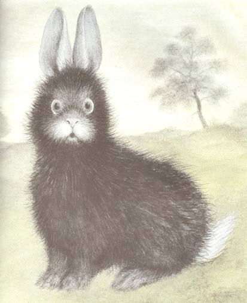{width="1.875in"
height="2.3023042432195977in"}

**Voice 19**

Writing with Voice

Piggie Pie! Margie Palatini

A Fine, Fine School Sharon Creech

Fishing in the Air Sharon Creech

John Henry Julius Lester

The Five-Dog Night Eileen Christelow

Canoe Days Gary Paulsen

The Hating Book Charlotte Zolotow

Let's Be Enemies Janice Udry

Turtle, Turtle, Watch Out! April Sayre

Bears Out There Joanne Ryder

**Writing with Voice**

**Objective**

**Students will:**

1.  Identify examples of strong voice in popular picture books

2.  Add voice to their writing

3.  Evaluate and revise their own writing

4.  Share their writing with their peers

**Identifying Strong Voice**

Revise our understanding of 'Voice': personality, colour, and emotion.

Characteristics of writing that indicate strong voice. 

You know writing has voice if:

- It shows the writer\'s personality

- It sounds different from everyone else\'s

- It contains feelings and emotions

- The words come to life

- It comes from the heart

Words can be used to capture strong emotion.  Emphasise this through our
Read Alouds -- stories with \"lots of voice.\"  Listen for the emotions
that are captured.

E.g. The Memory String by Eve Bunting or any mentor text that has strong
voice and emotion.

Discuss the different emotions and what part of the story captured the
emotion. Why did this story have strong voice and how did the author
achieve this? (Adding emotion is one of the ways we have discussed to
add more voice to a text.

Independent Reading: Students can do this during independent reading
with post-its.

Independent Writing:

Voice and emotion can be the focus in independent writing or revision.

Writer's Notebook

Quick Write:

Students select an emotion:

- Write a short paragraph in which you show that emotion. The name of
  the emotion CANNOT be used in the paragraph. Students must reveal the
  emotion solely through the thoughts, words, or actions of the
  characters or narrator in their short text.

- Partner talk. Partners read their work and guess each other's chosen
  emotion.

- Discussion: relate this activity to voice. i.e. expressing emotion in
  writing is one way to add more voice to a story.

- Independent work: revisit an entry in their Writer\'s Notebook (or any
  piece of writing that they have already published) to find places
  where they can add more voice, emotion, or point of view.

- Using post-its, students find places where they can add more emotion
  to a scene, add more exciting dialogue, or add a character\'s actions
  to reveal a certain attitude or mood.*  (Post-its enable students to
  add material as there is not usually room to write in an existing
  story.  I recently had a conversation with a teacher where a student
  was having trouble adding material during revision. I suggested that
  for a while that student could write only on the left hand side of
  their book, allowing the right hand side to be used for revision.)*

- Group work: listen to group members read aloud their improved texts. 
  While listening, students can name and discuss the emotions that they
  feel the author has clearly revealed in his or her writing. *(Refer to
  the specific words in the author\'s story that made the emotions so
  clear.)*

**Name That Emotion!**

Words can be used to reveal many different voices. What mood or
personality

do you hear in the "voices" of a story?

Happiness Excitement Fear Confusion

Anger Boredom Jealousy Envy

Greed Joy Guilt Pride

Compassion Arrogance Hunger Relief

Satisfaction Love Regret Sadness

Gratitude Panic Embarrassment Empathy

Sympathy Hope Anxiety Concern

Loneliness Surprise Shame Curiosity

Disappointment Shock Exhaustion

Confidence Disapproval Remorse

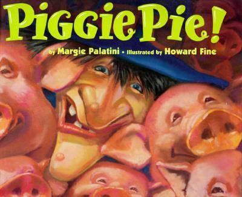{width="4.166666666666667in"
height="3.40625in"}

Gritch the Witch woke up grouchy, grumpy, and very hungry. Her belly
grumbled for something delicious. Something delightful. Something
special. But what? It wasn't purple mouse-tail stew. No, she ate that
yesterday for lunch. Maybe some mashed dragon-tongue pudding? No, Gritch
wasn't in the mood for anything quite that sweet. Perhaps a taste of
boiled buzzard feet? That always made her mouth water. No, not today.
Today, Gritch wanted something truly tasty. Something really yummy.
Something SPECIAL! And that could only mean....PIGGIE PIE! "Yes, yes,
Piggie Pie! I can taste those plump, juicy, pink piggies right now,"
Gritch said smacking her lips.

**Prior knowledge:**

Old MacDonald's farm

**Writing:**

Repetition - *something delightful. Something special.*

**Inference:**

What happened next? Evidence.

**Piggie Pie! Margie Palatini**

Gritch the Witch woke up grouchy, grumpy, and very hungry. Her belly
grumbled for something delicious. Something delightful. Something
special. But what? It wasn't purple mouse-tail stew. No, she ate that
yesterday for lunch. Maybe some mashed dragon-tongue pudding? No. Gritch
wasn't in the mood for anything quite that sweet. Perhaps a taste of
boiled black buzzard feet? That always made her mouth water. No, not
today. Today Gritch wanted something truly tasty. Something really
yummy. Something SPECIAL! And that could only mean ...

Piggie Pie!

"Yes, yes, Piggie Pie! I can taste those plump, juicy, pink piggies
right now," Gritch said, smacking her lips.

She hurried to the pantry and pulled down her Old Hag Cookbook from the
top shelf. She picked off a spider, blew off the dust, and turned to the
secret recipe on page 342. Gritch ran her bony finger with the long
green nail down the list of ingredients.

**1 eye of a fly**

She checked the pantry shelves.

"No problem," said Gritch.

**2 shakes of a rattlesnake's rattle**

"No problem," said Gritch.

**3 belly hairs of a possum**

"No problem," said Gritch.

**8 plump piggies**

"Problem!" screeched Gritch. "I don't have any piggies! How can I make
Piggie Pie without even one puny pink pig?"

Gritch pulled her hair. She stomped her feet. She paced the floor. She
wanted Piggie Pie. She wanted Piggie Pie very much!

"Hmmm," she said, tapping the lucky wart on her chin. "Now where would I
find eight plump pigs?"

Gritch thought. And thought. And thought.

"Aha!" she shouted with a jump. "The circus! Yes, yes, the circus! The
CIRCUS? No, no, not the circus. You don't find pigs in the circus."

She thought harder.

"Aha!" she shouted with a jump. "The zoo! Yes, yes, the zoo! The ZOO?
No, no, not the zoo. You don't find pigs in the zoo."

She thought much harder.

"The FARM? Yes! Yes! The farm! You find pigs on the farm."

There was still just one teeny, tiny, little PROBLEM ... where to find a
farm.

"WHERE ELSE?" Gritch let her bony fingers do the walking and opened the
Yellow Pages to F, where she found a very large ad. THIS WAS IT!

**OLD MacDONALD'S**

**FARM**

**CALL EI-EI-O**

JUST OVER THE RIVER AND

THROUGH THE WOODS

**WE HAVE DUCKS, CHICKENS,**

AND -- **PIGGIES**

Gritch put her broomstick in gear and headed over the river and through
the woods to Old MacDonald's Farm.

"I've got you in my sights now, you little porkers!" she cackled as she
circled overhead.

SURRENDER PIGGIES!

Gritch zoomed in for a THUMP-P-P! ERRRRCH-CH! landing. She spat straw,
fanned her still-smoking tootsies, and lifted her goggles. There wasn't
a pig in sight!

"Where did they all go?" Gritch shouted to a duck. "Hey, duck! I said,
where are all the piggies? I need eight plump piggies for Piggie Pie."

The duck quack-quacked here. It quack-quacked there. Here it quacked.
There it quacked. Everywhere it quack-quacked, "No piggies."

"What do you mean, *no piggies*, you dizzy duck?" Gritch screeched into
his bill. "I just saw a passel of piggies down here not a minute ago!
Hand over those hogs, you little quacker."

"No piggies," quacked the duck.

Gritch pulled her hair. She stomped her feet. She even threatened the
duck with one of her most evil spells.

The duck was not impressed. It wasn't even scared. It gave Gritch
another quack and waddled away.

"So, who needs a dumb duck?" Gritch mumbled.

Being careful where she stepped, Gritch wandered across the meadow.

"Yoo hoo," she shouted.

"Moo?"

"You," Gritch said to the cow. "Where are the piggies? I need eight
plump piggies for Piggie Pie."

The cow moo-mooed here. It moo-mooed there. Here it mooed. There it
mooed. Everywhere it moo-mooed, "No piggies."

"What do you mean, *no piggies,* you lumpy-looking cow!" screamed
Gritch. "I need eight plump piggies for Piggie Pie! Fork over the pork,
you walking milk machine, or I'll curdle your cream!"

"No piggies," mooed the cow.

Gritch pulled her hair. She stomped her feet. She even threatened the
cow with one of her most evil spells.

The cow stared at Gritch, swatted a fly with its tail, and lumbered
away.

"Cows! Who needs 'em?" Gritch muttered.

So she tried the barnyard, where she stopped a chicken in its tracks.

"Okay, birdbrain. Where are the piggies? I need eight plump piggies for
Piggie Pie."

The chicken cluck-clucked here. It cluck-clucked there. Here it clucked.
There it clucked. Everywhere it cluck-clucked, "No piggies."

"What do you mean, *no piggies,* you feathered drumstick?" Gritch
screeched. "What's going on here? Where's the boss of this heap of hay?"

The chicken flapped a wing towards Old MacDonald.

Gritch looked him over once. Twice.

"You're Old MacDonald?" she said. "Don't look much like your picture, do
you?"

The farmer thumbed his suspenders and shrugged.

"Look, Shorty, I've been quack-quacked here, moo-mooed there, and
cluck-clucked everywhere all over this farm. I need eight plump piggies
for Piggie Pie. Where are the piggies?"

The farmer looked here. He looked there. Here he looked. There he
looked. Everywhere he looked and looked. "No piggies."

"What do you mean, *no piggies?* You flea-bitten seed spreader! You must
have piggies.

Gritch pulled her hair. She stomped her feet. She even threatened him
with one of her most evil spells.

"No piggies!"

Her stomach growled. It grumbled. But there were no piggies. There would
be no Piggie Pie. Now what was she going to eat?

"Psst ... psst ...PSSST! ... Excuse me, little lady. Wolf's the name.
Let me give you some advice. Forget about the pigs."

"Forget about the pigs?" said Gritch, eyeing the wolf.

He nodded. "They're too tricky. Trust me. I've been chasing three little
pigs for days.\
He huffed and puffed. "I'm starving. Look at me. I'm nothing but skin
and bones!"

Gritch pinched his arm. "Well, not quite." She grinned.

"Mr Wolf, I have the most wonderful idea. I was thinking, since you
haven't eaten, and I haven't eaten, why don't you come home with me for
lunch? I'm a very good cook."

"Why, that does sound tempting," the wolf said as he looked at Gritch
and smacked his lips.

"Are you sure it wouldn't be any problem?"

"PROBLEM?" Gritch grinned. "No problem at all," she said as they walked
off arm in arm. "I always enjoy having a wolf for lunch."

**Word Choice**

**Word Play:** *Gritch let her bony fingers do the walking.* (Yellow
pages ad)

Old MacDonald's Farm refrain.

**Strong Verbs:**

*grumbled smacking picked hurried pulled stomped paced wanted tapping
headed opened found zoomed fanned threatened waddled wandered stepped
lumbered stared swatted flapped thumbed shrugged eyeing chasing starving
pinched grinned thinking*

Word pairs: *huffed and puffed*

**Nouns:**

*ingredients recipe suspenders*

**Adjectives:**

*Feathered drumstick*

Hyphenated adjectives: *dragon-tongue pudding still-smoking tootsies
lumpy-looking cow flea-bitten seed spreader*

**Adverbs:**

**Alliteration:**

*grouchy, grumpy boiled black buzzard feet dumb duck dizzy duck*

*plump piggies for Piggie Pie*

**Onomatopoeia:**

*THUMP-P-P! ERRRRCH-CH!*

**Words as well as said:**

*screeched thought shouted cackled shouted quacked mumbled mooed
muttered*

**Spelling:**

Spelling exploration.

Exploring suffixes -- ed Gathering ed words from reading.

Treat ed and ing as spelling patterns.

Aim: students to know that ed has three sounds.

**Compound words:**

*broomstick overhead barnyard*

**Abbreviations:**

*wasn't don't I'll what's where's haven't I'm*

**Grammar/Punctuation**

Ellipses. Exclamation marks. Talking marks.

**Possessive apostrophe:**

*Rattlesnake's rattle Old MacDonald's farm*

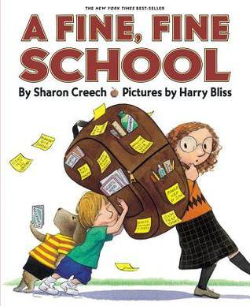{width="3.3125in"
height="4.041666666666667in"}

**A Fine, Fine School Sharon Creech**

One day, Mr. Keene called all the students and teachers together and
said, \"This is a fine, fine school! From now on, let\'s have school on
Saturdays too.\"And then there was more.

School all weekend.School on the holidays.

School in the SUMMER!

What was next . . .

SCHOOL AT NIGHT?

So it\'s up to Tillie to show her well-intentioned principal, Mr. Keene,
that even though his fine, fine school is a wonderful place, it\'s not
fine, fine to be there all the time.

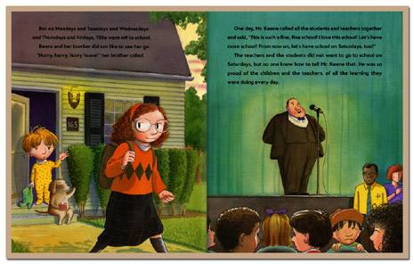{width="4.84375in"
height="3.0833333333333335in"}

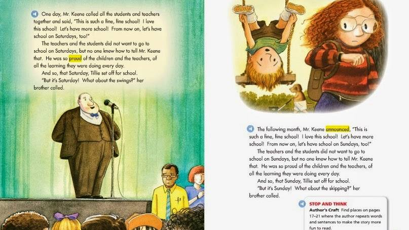{width="6.268055555555556in"
height="3.526266404199475in"}

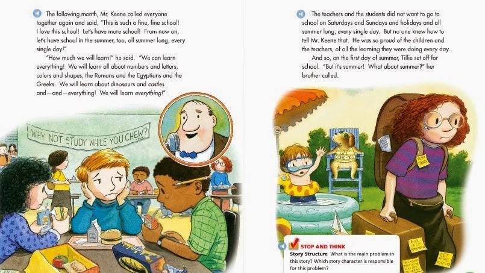{width="6.719438976377953in"
height="3.78125in"}

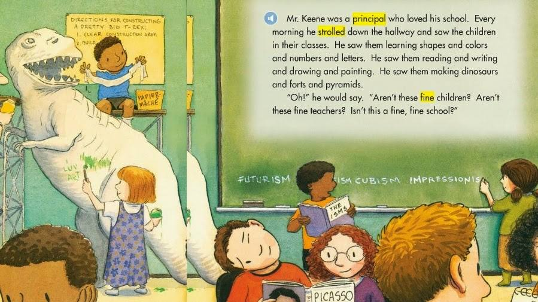{width="6.71875in"
height="3.7741601049868767in"}

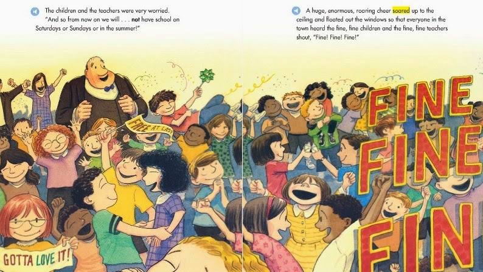{width="6.268055555555556in"
height="3.528741251093613in"}

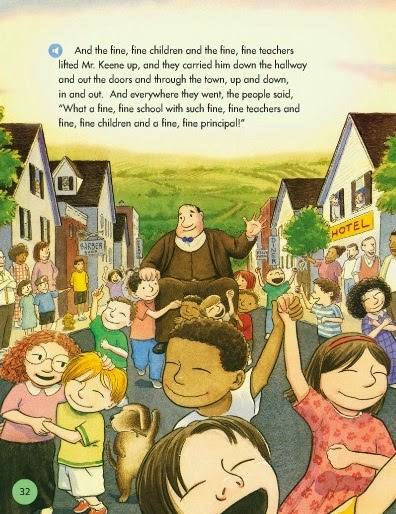{width="4.125in"
height="5.354166666666667in"}

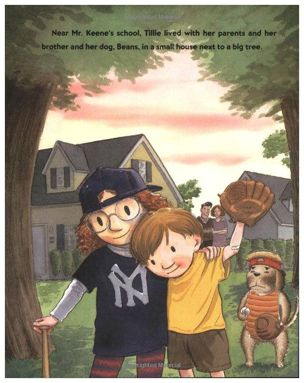{width="6.268055555555556in"
height="7.905837707786526in"}

**Writing**

Students write a list of things they would miss if they went to school
every day of the year. The list should include things they do on
weekends, club or sports activities, holiday traditions and family
outings.

Then students study their list and pick the favourite two or three
things and include them when writing a paragraph: "If I went to school
every day, I would miss..."

Describe a Fine, Fine School

Not every school is as fine as Mr. Keene's, but all schools have their
fine

aspects. Children write a description of the finest thing/s in their
school. It

can be the subjects, a room, a great teacher, the playground, computers,

-anything.

**Reading skills and strategies:**

Asking **questions** - questions before. E.g.

I wonder what the story is about.

I wonder why she has such a big backpack.

I wonder why the dog is reading.

During: E.g.

I wonder why nobody told the principal they didn't want school on all
those extra days.

I wonder why the principal thought the kids and teachers liked having
that much school.

After: E.g.

I wonder if the students will still learn as much as they did when they
were in school all year.

**Author\'s point of view** -- Third. Be sure to find 3 pieces of
evidence to support this (they, fine teachers, fine principal, he, and
she).

**Author\'s purpose** -- entertain

Evidence - The principal made everyone go to school every day.

> The dog was reading. There was a student brushing his teeth at school.
> All these things are a bit silly and make an entertaining story.

**Beginning, middle, end** --

Most important event from beginning - The principal thought his school
was a fine school.

Most important event from middle - The principal decided the students
and teachers should be at school every day -- weekends, holidays and
summer!

Most important event from end - Tillie finally told the principal that
there were people outside of school that weren't learning.

**Cause and effect** -- Why did Mr. Keene think it was a fine school?
because he saw the students learning shapes, colours, numbers and
letters, reading, writing, drawing and painting.

How come the teachers and students had to go to school on Saturdays?
Because no one knew how to tell Mr. Keene that they didn't want to.

How come Tillie decided to talk to Mr. Keene?

Because she had to leave her brother to learn on his own.

Why was the boy brushing his teeth at school?

Because he didn't have time at home.

Why was everyone so worried at the last assembly?

Because they thought Mr. Keene was going to have dogs and little
brothers come to school.

Why were all the students so happy?

Because they didn't have to come to school on Saturday, Sunday, holidays
or summer anymore.

**Character analysis** - describe Mr. Keene, describe Tillie

Looks like, feelings, thoughts, character

Character changes -- Beginning: Mr. Keene thought everyone needed to be
in school all the time to learn as much as they could.

End: Mr. Keene finally realized that there was learning outside of
school that has to happen as well and the kids cannot do it if they are
in school all the time.

**Classify & categorise** -- things to learn -- inside and outside of
school.

**Compare & contrast** -- Mr. Keene and Tillie. Your principal and Mr.
Keene.

**Connections** - Possible text-to-self connections Going to a fine
school. Having a great principal. Having a brother at home that you help
do thing and help learn things.

Possible text-to-text connections: Frog Principal by Stephanie Calmenson
or The Principals New Clothes by Stephanie Calmenson. Both of these
books are about principals and the kids at the school.

**Drawing conclusions & inferring** -- Why do you think Mr. Keene
listened to Tillie and changed his mind about having school all the
time?

Text clues:

Tillie tells Mr. Keene that she can't teach her brother how to swing or
skip and can't teach her dog to sit. She also tells him that she can't
learn how to climb a tree.

What I know

I know that I learn many things outside of the classroom.

My conclusion

I think Mr. Keene listened to Tillie because he didn't realise how much
students learn even when they are not in school.

**Main idea & details** --

Main idea: The story is mostly about students going to school all the
time. Details: Mr. Keene made the students come to school on Saturdays.
They had to go to school on holidays. They had to come to school during
the summer.

**Plot** - the turning point or climax in the story was when Tillie
finally went in and talked to Mr. Keene.

**Predict:**

What do you think the story is going to be about?

Why do you think he called everyone together?

Do you think Mr. Keene will want them to go to school during the summer?

Do you think anyone will ever talk to Mr. Keene?

What do you thing Mr. Keene will do after he talks to Tillie?

**Problem & solution**:

Problem: Mr. Keene is making the students and teachers come to school
all the time.

Solution: Tillie decided to talk to Mr. Keene and all the school.

**Sequencing:**

Mr. Keene loves his school.

Mr. Keene told everyone to start coming to school on Saturdays.

On Sundays Tillie climbed trees and worked with Beans and tried to teach
her brother how to swing and skip.

Mr. Keene said they should go to school on Sundays.

The next month Mr. Keene said they should go to school on all the
holidays.

Mr. Keene said they should go to school during the summer.

On the 1st day of summer Tillie went and talked to Mr. Keene.

Mr. Keene called everyone together.

Everyone was worried. Mr. Keene said they wouldn't have school on
Saturdays, Sundays, holidays and the summer.

Everyone was happy.

**Story elements**:

List title, author, characters, setting, beginning, middle, end, or
problem & solution.

**Strong thought**:

Everyone was too afraid to talk to Mr. Keene about all the extra school.
What would you do or say to Mr. Keene if you were one of the students.

**Summarise**

Someone - Mr. Keene

Wanted - wanted the students to come to school on the weekends, holidays
and during the summer

But - the students didn't want to

So - so Tillie talked to Mr. Keene and

Then - he

Finally - finally understood that you can learn things even when you are
not in school.

**Theme:**

Mr. Keene learnt that learning can take place everywhere, not just in
school.

**Visualise:**

What would you look like if you were told you needed to go to school on
Saturdays, Sundays, holidays and all summer?

**\**

**A Fine, Fine School Sharon Creech**

Mr Keene was a principal who loved his school. Every morning he strolled
down the hallway and saw the children in their classes. He saw them
learning shapes and colours and numbers and letters. He saw them reading
and writing and drawing and painting. He saw them making dinosaurs and
forts and pyramids.

"Oh!" he would say. "Aren't these fine children? Aren't these fine
teachers? Isn't this a fine, fine school?"

Near Mr Keene's school, Tillie lived with her parents and her brother
and her dog, Beans, in a small house next to a big tree.

On Mondays and Tuesdays and Wednesdays and Thursdays and Fridays, Tillie
went off to school.

At school, Tillie learnt her shapes and colours and numbers and letters.
Sometimes, when she saw Mr Keene standing in the hallway, he waved.

"Aren't these fine children?" he said to himself. "Aren't these fine
teachers? Isn't this a fine, fine school?"

On the weekends -- Saturday and Sunday -- Tillie climbed her favourite
tree, and she took Beans on walks and threw him sticks, and she pushed
her brother on a swing and tried to teach him how to skip.

But on Mondays and Tuesdays and Wednesdays and Thursdays and Fridays,
Tillie went off to school.

Beans and her brother did not like to see her go.

"Hurry, hurry, hurry home!" her brother called.

One day, Mr Keene called all the students and teachers together and
said, "This is such a fine, fine school! I love this school! Let's have
more school! From now on, let's have school on Saturdays, too!"

The teachers and the students did not want to go to school on Saturdays,
but no one knew how to tell Mr Keene that. He was so proud of the
children and the teachers, of all the learning they were doing every
day.

And so, that Saturday, Tillie set off for school.

"But it's Saturday! What about the swings?" her brother called.

The following month, Mr Keene announced, "This is such a fine, fine
school! I love this school! Let's have more school! From now on, let's
have school on Sundays, too!"

The teachers and the students did not want to go to school on Saturdays,
but no one knew how to tell Mr Keene that. He was so proud of the
children and the teachers, of all the learning they were doing every
day.

And so, that Sunday, Tillie set off for school.

"But it's Sunday! What about the skipping?" her brother called.

The following month, Mr Keene called everyone together and said, "This
is such a fine, fine school! I love this school! Let's have more school!
From now on, let's have school on holidays, too -- on Easter and Ramadan
and Thanksgiving and Christmas and Hanukkah -- on all the holidays on
every calendar!"

The teachers and the students did not want to go to school on holidays,
but no one knew how to tell Mr Keene that. He was so proud of the
children and the teachers, of all the learning they were doing every
day.

And so, on Christmas, Tillie set off for school.

"But it's Christmas! What about Christmas?" her brother called.

The following month, Mr Keene called everyone together and said, "This
is such a fine, fine school! I love this school! Let's have more school!
From now on, let's have school in the summer, too, all summer long,
every single day!"

"How much we will learn!" he said. "We can learn everything! We will
learn all about numbers and letters, colours and shapes, the Romans and
the Egyptians and the Greeks. We will learn about dinosaurs and castles
and -- and -- everything!"

The teachers and the students did not want to go to school on Saturdays
and Sundays and holidays and all summer long, every single day. But no
one knew how to tell Mr Keene that. He was so proud of the children and
the teachers, of all the learning they were doing every day.

And so, on the first day of summer, Tillie set off for school.

"But it's summer! What about summer?" her brother called.

And that day, Tillie went to see Mr Keene. She stood in his office,
infront of his desk.

"What a fine, fine school this is!" Mr Keene said. "What amazing things
everyone is learning!"

"Yes," Tillie said, "we certainly are learning some amazing things."

"A fine. fine school!" Mr Keene said.

"But," Tillie said, "not everyone is learning."

"What?" Mr Keene said. He looked very worried. "Who? Who isn't learning?
Tell me, and I will see that they learn!"

"My dog, Beans, hasn't learnt how to sit," Tillie said. "And he hasn't
learnt how to jump over the creek."

"Oh!" Mr Keene said.

"And my little brother hasn't learnt how to swing or skip."

"Oh!" Mr Keene said.

"And I --" she said.

"But you go to school!" Mr Keene said. "To our fine, fine school!"

"True," Tillie said. "But I haven't learnt how to climb very high in my
tree. And I haven't learnt how to sit in my tree for a whole hour."

"Oh!" Mr Keene said.

That day, Mr Keene walked up and down the halls, looking at the children
and the teachers. Up and down he walked. Up and down, up and down.

The next morning, Mr Keene called everyone together. The children and
the teachers were very worried.

Mr Keene said, "This a fine, fine school, with fine, fine children, and
fine, fine teachers. But not everyone is learning."

The children and the teachers were very, very worried.

Mr Keene said, "There are dogs who need to learn how to sit and how to
jump creeks."

What did he mean? Was he going to make their dogs come to school?

"There are little brothers and sisters who need to learn how to swing
and how to skip."

What did he mean? Was he going to make their younger brothers and
sisters come to school, too?

The children and the teachers were very, very, very worried.

"And you, all of you -- children and teachers -- you need to learn how
to climb a tree and sit in it for an hour!" Mr Keene said.

The children and the teachers were very worried.

"And so from now on we will \...

\... **not** have school on Saturdays or Sundays or holidays or in the
summer!"

A huge, enormous, roaring cheer soared up to the ceiling and floated out
the windows so that everyone in the town heard the fine, fine children
and the fine, fine teachers shout, "Fine! Fine! Fine!"

And the fine, fine children and the fine, fine teachers lifted Mr Keene
up, and they carried him down the hallway and out the doors and through
the town, up and down, in and out. And everywhere they went, the people
said, "What a fine, fine school with such fine, fine teachers and fine,
fine children and a fine, fine principal!"

**\**

**Fishing in the Air Sharon Creech**

A magical father-son fishing trip turns into a real bonding experience.

+-----------------------------------------------------------------------------------+-----------------------------+----------------------+
| Craft                                                                             | Example                     | Reason               |
+===================================================================================+=============================+======================+
| Voice                                                                             | Use of dialogue and first   |                      |
|                                                                                   | person.                     |                      |
+-----------------------------------------------------------------------------------+-----------------------------+----------------------+
| Cumulative text                                                                   | Boy adds detail into his    |                      |
|                                                                                   | questions.                  |                      |
+-----------------------------------------------------------------------------------+-----------------------------+----------------------+
| 'And'                                                                             | *And what was beyond the    |                      |
|                                                                                   | trees?*                     |                      |
+-----------------------------------------------------------------------------------+-----------------------------+----------------------+
| Repetition                                                                        | *We bumped along, along,    | Slow down reading    |
|                                                                                   | along the winding lane.*    |                      |
| 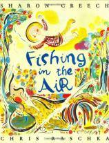{width="1.125in" |                             | Emphasis             |
| height="1.46875in"}                                                               | *White white clouds*        |                      |
|                                                                                   |                             | Rhythm               |
|                                                                                   | *What was it like in your   |                      |
|                                                                                   | house, the house you lived  | Style                |
|                                                                                   | in when you were a boy?*    |                      |
|                                                                                   |                             |                      |
|                                                                                   | Father's words echoed in    |                      |
|                                                                                   | boy's questions.            |                      |
+-----------------------------------------------------------------------------------+-----------------------------+----------------------+
| Simile                                                                            | *streetlamps ...glowing     | Imagery              |
|                                                                                   | like tiny moons*            |                      |
|                                                                                   |                             |                      |
|                                                                                   | *birds singing their songs  |                      |
|                                                                                   | like little angels. Etc.*   |                      |
+-----------------------------------------------------------------------------------+-----------------------------+----------------------+
| Metaphor                                                                          | Title metaphor for          |                      |
|                                                                                   | imagination                 |                      |
+-----------------------------------------------------------------------------------+-----------------------------+----------------------+
| Ending-Fishing                                                                    | *And we caught a father,    |                      |
|                                                                                   | and we caught a boy, who    |                      |
| metaphor                                                                          | learnt to fish.*            |                      |
+-----------------------------------------------------------------------------------+-----------------------------+----------------------+
| Descriptive lang.                                                                 | *My line had no hook, only  | Imagery              |
|                                                                                   | a blue feather midway down  |                      |
|                                                                                   | the line and a red and      |                      |
|                                                                                   | white bobber near the end.* |                      |
+-----------------------------------------------------------------------------------+-----------------------------+----------------------+
| Alliteration                                                                      | *Clear, cool river*         |                      |
|                                                                                   |                             |                      |
|                                                                                   | *Bubbles of breeze*         |                      |
|                                                                                   |                             |                      |
|                                                                                   | *Sliver of sky*             |                      |
+-----------------------------------------------------------------------------------+-----------------------------+----------------------+

**Fishing in the Air Sharon Creech**

One Saturday, when I was young, my father and I left the house early in
the morning, when it was still blue-black outside. The grass left wet
marks on our shoes. In the backyard, under stones, we dug up crawly
worms and laid them in a can with lumps of damp dirt.

Into the trunk we put two poles and the can of worms and a sack of
sandwiches and a thermos of water.

"We're going on a journey," my father said. "To a secret place. We'll
catch the air! We'll catch the breeze!

We slipped into the car and closed the doors quietly and off we went.

"Look at those streetlamps," my father said, "glowing like tiny moons
all in a row."

And the lamps which had been lamps, became in an instant, tiny moons all
in a row.

We drove and drove along the road, until we came to a narrow lane. We
bumped along, along, along the winding lane.

"Those trees," my father said, "don't they look like green soldiers
standing at attention."

And the trees which had been trees became, in an instant, tall green
soldiers standing at attention.

We were going on a journey. To a secret place. We'd catch the air! We'd
catch the breeze!

When we stopped, my father said, "Ah, what a sky! White white clouds and
a golden sun and bubbles of breeze and birds singing their songs like
little angels."

And the birds which had been birds became, in an instant, little angels
singing their songs.

"I'd like to take those clouds, that sun, those bubbles of breeze, and
those angel birds home with me," my father said. He took my hand and
said, "I smell a river!"

I sniffed. I smelt it too.

We took our poles and our food, and we ducked through the trees. And
there, beyond the trees, was the river.

"Oh, I love a clear, cool river," my father said," such a clear, cool
river, rolling along over sandy-coloured stones. I'd like to take that
river home."

My father baited his hook and cast his line into the water.

"When I was a boy," my father said, "I caught the air, I caught the
breeze, and I took them home with me."

My line had no hook, only a blue feather midway down the line and a red
and white bobber near the end. I cast the line high above my head.

"And where did you live when you were a boy?" I asked.

"in a small house," he said.

I looked at my father, a big man. "What was it like, your house?" I
asked. "The house you lived in when you were a boy?"

He closed his eyes. "it was a small grey house with a crooked porch and
tiny windows and a red roof. It looked like a little box with a red
hat."

I cast my line, and it flew high into the air. I caught a bubble of
breeze.

"What was it like outside your house, the house you lived in when you
were a boy?" I asked.

"There were green fields around it, rolling green fields with bright red
flowers here and there like floating rubies, and all around the fields
were trees, tall green green trees," my father said.

I reeled in my line and cast again. High, high it flew. I caught a
sliver of sky.

"And what was beyond the trees?" I asked. "Beyond those trees that were
around the fields that were around the house you lived in as a boy?"

"There was a river, clear and cool, that rippled over stones," my father
said, "and there I learnt to fish."

I reeled in my line. I cast it high and far, and it sailed into the air,
its blue feather waving in the breeze. I caught a slice of yellow sun.

"And," I asked, "who taught you how to fish in that clear, cool river
beyond the trees around the green fields around the grey house you lived
in when you were a boy?"

"Ah," he said, with his eyes closed tightly, "it was my father. My
father taught me how to fish in the clear, cool river."

My bobber bounced on the water, and the blue feather waved in the air. I
reeled it in and cast again and caught a white white cloud.

"Oh, where is that house?" my father said. "And where are those fields
and that river and that father and that boy?"

I reeled in my line. I cast it higher and farther, and it sailed lazily
through the air. And this time I caught it all.

I caught a bubble of breeze and a sliver of sky and a slice of yellow
sun and a small grey house with a crooked porch and tiny windows and a
red roof and rolling green fields with red flowers waving and tall green
green trees and a river rippling cool and clear.

"Oh," my father said again. "Where is that father and that boy?"

I reeled in my line. "Right here," I said, and he turned to look at me,
as I cast my line again so high, so far.

And at the end of the day, after we'd put our fishing poles back into
the trunk and set off down the winding lane, he said, "We've been on a
journey. To a secret place. We caught the air! We caught the breeze!"

And we also caught a small grey house with a crooked porch and tiny
windows and a red roof and rolling green fields with red flowers waving
and tall green green trees and a river rippling cool and clear.

And we caught a father, and we caught a boy, who learnt to fish.

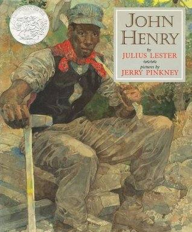{width="3.3125in"
height="4.010416666666667in"}

**John Henry Julius Lester**

With his two sledgehammers pulverising boulders, John Henry races a
steam drill tunnelling through a mountain. It\'s a deadly contest of
man-vs-machine written with such power that this African-American folk
hero becomes as awesome as a force of nature, yet as familiar as an
older brother. Pinkney\'s stunning art shows John Henry\'s energy
bursting from nature.

**John Henry**

Like most legends, folk tales, heroic myths, it is not clear whether a
real-life John Henry actually existed. With the constant retelling of
tale after tale after tale, John Henry's story has reached epic
proportions and has consistently served as an inspiration for
working-class people and a celebration of the human spirit -- as seen
through folk songs, paintings, books, monuments, and video clips that
have been created in honour of this giant being.

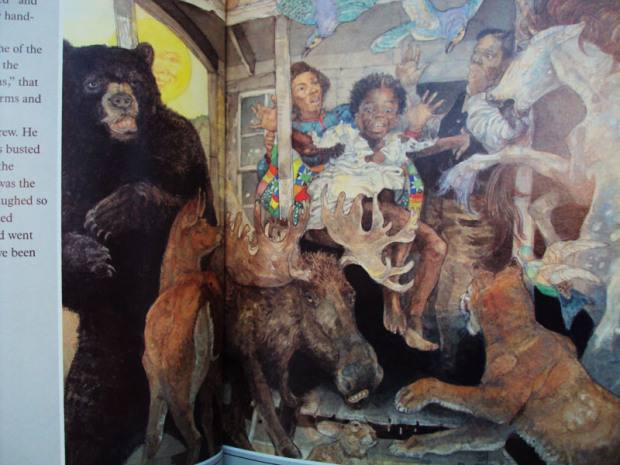{width="3.8958333333333335in"
height="2.9218755468066493in"}

The Birth of John Henry with Animals All Around

Who is John Henry? This was how Julius Lester described this mythical
figure and how special he is from the moment of his birth.

*You have probably never heard of John Henry. Or maybe you heard about
him but don't know the ins and outs of his comings and goings. Well,
that's why I'm going to tell you about him.*

*When John Henry was born, birds came from everywhere to see him. The
bears and panthers and moose and deer and rabbits and squirrels and even
a unicorn came out of the woods to see him. And instead of the sun
tending to his business and going to bed, it was peeping out from behind
the moon's skirts trying to get a glimpse of the new baby.*

*He grew and he grew and he grew. He grew until his head and shoulders
busted through the roof which was over the porch. John Henry thought
that was the funniest thing in the world. He laughed so loud, the sun
got scared. It scurried* *from behind the moon's skirts and went to bed,
which is where it should've been all the while.*

The poetry in the way that John Henry's life story was written by Lester
and the moving images/ paintings created by the genius hands of Pinkney
evoke such texture and depth and authenticity -- it unites human beings
regardless of one's colour/race. The surreal quality of a baby becoming
a full-grown man overnight, commanding the sun to shine and chopping
down an acre of trees the day after he was born -- appeal to that sense
of the mythic, the heroic, and the totally impossible, it just had to be
real.

**Conquering Evil and Working with One's Hands.** John Henry's first
challenge was

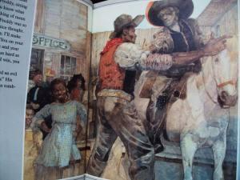{width="3.125in"
height="2.34375in"}

John Henry with Ferret Faced Freddy whose voice \"sounded like bat wings
on tombstones.\"

Ferret-Faced Freddy known to be the meanest man in the state. John Henry
sought to change this man through a bet he could not refuse:

*Let's have a race. You on your horse. Me on my legs. If you and your
horse win, you can work me as hard as you want for a whole year. If I
win, you have to be nice for a year.*

This race was meant to show John Henry's speed (*"the wind was out of
breath trying to keep up with him"*), agility, and the capacity of good
to triumph over evil.

With *"two twenty-pound sledgehammers with four foot handles made of
whale bone"* given to him by his father, John Henry continued to go out
into the world to make something of himself.

Armed with these tools, his powerful hands, and the clothes on his back
(and a rainbow on his shoulder), he managed to destroy a boulder that
was "as hard as anger and so big around, it took half a week for a tall
man to walk from one side to the other." He was able to do what dynamite
couldn't.

*The hammer hit the boulder. That boulder shivered like you do on a cold
winter morning when it looks like the school bus is never going to
come.*

*RINGGGGGG!*

*The boulder shivered like the morning when freedom came to the slaves.*

John Henry's strength does not come from one man -- but from the
collective power of a people with a rich and dynamic heritage and the
fortitude that could move mountains, the boundless faith that can
pulverize rocks, stones and a veritable mountain and turn it into paved
road overnight.

The Big Bend Tunnel and the Steam Drill Challenge. Legend has it that
between

1870-1873, the Big Bend Tunnel was being built on the Chesapeake and
Ohio Railroad in West Virginia, now believed to be the home of this
giant of a man. While historians point to possible accounts of an
ex-slave named John Henry among the African American people who worked
on the tunnel, the evidence pointing to an actual encounter that pits
machine (a steam drill) against Man (John Henry) remains inconclusive.

Julius Lester shares this challenge between man and machine through the
eyes of the rising sun who was surprised that the birds weren't singing
and the roosters ceased crowing the day that the competition was about
to take place.

*When the sun didn't hear the rooster, he wondered if something was
wrong. So he rose a couple of minutes early to see.*

*What he saw was a mountain as big as hurt feelings. On one side was a
big machine hooked up to hoses. It was belching smoke and steam. As the
machine attacked the mountain, rocks and dirt and underbrush flew into
the air. On the other side was John Henry. Next to the mountain he
didn't look much bigger than a wish that wasn't going to come true.*

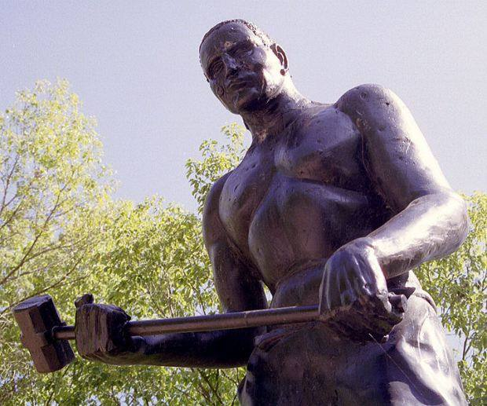{width="4.916666666666667in"
height="4.099865485564305in"}

A monument in honour of John Henry

So did Man triumph over Machine? One thing is for certain: this man has
lived through decades through folk songs, word of mouth, and quiet
stories told in a circle by the fire -- whispered through the ages,
hollered across train tunnels, declared in public speeches that move
millions of people.

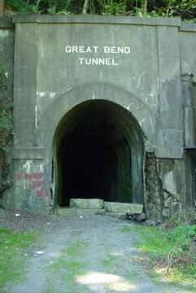{width="2.1666666666666665in"
height="3.2365146544181975in"}

The Original Great Bend Tunnel

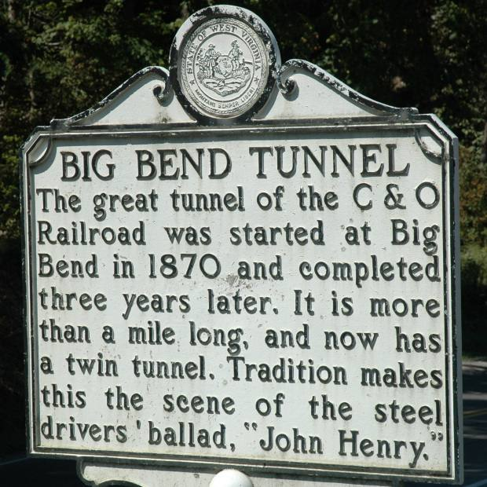{width="5.270833333333333in"
height="5.270833333333333in"}

Plaque that provides rich details about the Big Bend Tunnel.

**John Henry Julius Lester**

You have probably never heard of John Henry. Or maybe you heard about
him, but don't know the ins and outs of his comings and goings. Well,
that's why I'm going to tell you about him.

When John Henry was born, birds came from everywhere to see him. The
bears and panthers and moose and deer and rabbits and squirrels and even
a unicorn came out of the woods to see him. And instead of the sun
tending to his business and going to bed, it was peeping out from behind
the moon's skirts trying to get a glimpse of the new baby.

Before long the mama and papa come out on the porch to show off their
brand-new baby. The birds "ooooooohed" and the animals "aaaaaaahed" at
how handsome the baby was.

Somewhere in the middle of one of the "ooooooohs," or maybe it was on
the backside of one of the "aaaaaaahs," that baby jumped out of his
mama's arms and started growing.

He grew and he grew and he grew. He grew until his head and shoulders
busted through the roof which was over the porch. John Henry thought
that was the funniest thing in the world. He laughed so loud, the sun
got scared. It scurried from behind the moon's skirts and went to bed,
which is where it should've been all the while.

The next morning John Henry was up at sunrise. The sun wasn't he was
tired and had decided to sleep in. John Henry wasn't going to have none
of that. He hollered up into the sky, "Get up from there! I got things
to do and I need light to do 'em by."

The sun yawned, washed its face, flossed and brushed its teeth, and
hurried up over the horizon.

That day John Henry helped his papa rebuild the porch he had busted
through, added a wing onto the house with an indoor swimming pool and
one of them Jacuzzis. After lunch he chopped down an acre of trees and
split them into fireplace logs and still had time for a nap before
supper.

The next day John Henry went to town. He met up with the meanest man in
the state, Ferret-Faced Freddy, sitting on his big white horse. You know
what he was doing? He was thinking of mean things to do. Ferret-Faced
Freddy was so mean, he cried if he had a nice thought.

John Henry said, "Freddy, I'll make you a bet. Let's have a race. You on
your horse. Me on my legs. If you and your horse win, you can work me as
hard as you want for a whole year. If I win, you have to be nice for a
year."

Ferret-Faced Freddy laughed an evil laugh. "It's a deal, John Henry."
His voice sounded like bat wings on tombstones.

The next morning folks lined up along the way the race would go. John
Henry was ready. Ferret-Faced Freddy and his horse were ready.

BANG! The race was on.

My great-granddaddy's brother's cousin's sister-in-law's uncle's aunt
was there that morning. She said everybody saw Ferret-Faced Freddy ride
by on his big white horse and they were sho' 'nuf moving. Didn't nobody
see John Henry. That's because he was so fast, the wind was out of
breath trying to keep up with him. When Ferret-Faced Freddy crossed the
finish line, John Henry was already on the other side, sitting in a
rocking chair and drinking a soda mum.

After that Ferret-Faced Freddy was so nice, everybody called him
Frederick the Friendly.

John Henry decided it was time for him to go on down the big road. He
went home and told his mama and daddy good-bye.

His daddy said, "You got to have something to make your way in the world
with, Son. These belonged to your granddaddy." And he gave him two
twenty-pound sledgehammers with four-foot handles made of whale bone.

A day or so later, John Henry saw a crew building a road. At least,
that's what they were doing until they came on a boulder right smack-dab
where the road was supposed to go. This was no ordinary boulder. It was
as hard as anger and so big around, it took half a week for a tall man
to walk from one side to the other.

John Henry offered to lend them a hand.

"That's all right. We'll put some dynamite to it."

John Henry smiled to himself. "Whatever you say."

The road crew planted dynamite all around the rock and set it off.

KERBOOM BLAMMITY-

BLAMMITY BOOMBOOM

BANGBOOMBANG!!!

That dynamite made so much racket, the Almighty looked over the parapets
of Heaven and hollered, "It's getting too noisy down there." The
dynamite kicked up so much dirt and dust, it got dark. The moon thought
night had caught her napping and she hurried out so fast, she almost
bumped into the sun who was still climbing the steep hill towards
noontime.

When all the commotion from the dynamite was over, the road crew was
amazed. The boulder was still there. In fact, the dynamite hadn't
knocked even a chip off it.

The crew didn't know what to do. Then they heard a rumbling noise. they
looked around. It was John Henry, laughing. He said, "If you gentlemen
would give me a little room, I got some work to do."

"Don't see how you can do what dynamite couldn't," said the boss of the
crew.

John Henry chuckled. "Just watch me." He swung one of his hammers round
and round his head. It made such a wind that leaves blew off the trees
and birds fell out of the sky.

RINGGGGGG!

The boulder shivered like the morning when freedom came to the slaves.

John Henry picked up his other hammer. He swung one hammer in a circle
over his head. As soon as it hit the rock -- RINGGGG! -- the hammer in
his left hand started to make a circle and --

RINGGGG! Soon the RINGGGG! of one hammer followed the RINGGGG! of the
other one so closely, it sounded like they were falling at the same
time.

RINGGGG! RINGGGG!

RINGGGG! RINGGGG!

Chips and dust were flying from the boulder so fast that John Henry
vanished from sight. But you could still hear his hammers -- RINGGGG!
RINGGGG!

The air seemed to be dancing to the rhythm of his hammers. The boss of
the road crew looked up. His mouth dropped open. He pointed into the
sky.

There, in the air above the boulder, was a rainbow. John Henry was
swinging the hammers so fast, he was making a rainbow around his
shoulders. It was shining and shimmering in the dust and grit like hope
that never dies. John Henry started singing:

I got a rainbow

RINGGGG! RINGGGG!

Tied round my shoulder

RINGGGG! RINGGGG!

It ain't gon' rain,

No, it ain't gon' rain.

RINGGGG! RINGGGG!

John Henry sang and he hammered and the air danced and the rainbow
shimmered and the earth shook and rolled from the blows of the hammer.
Finally it was quiet. Slowly the dust cleared.

Folks could not believe their eyes. The boulder was gone. In its place
was the prettiest and straightest road they had ever seen. Not only had
John Henry pulverised the boulder into pebbles, he had finished building
the road.

In the distance where the new road connected to the main one, the road
crew saw John Henry waving good-bye, a hammer on each shoulder, the
rainbow draped round him like love.

John Henry went on his way. He had heard that any man good with a hammer
could find work building the Chesapeake and Ohio Railroad through West
Virginia. That was where he had been going when he stopped to build the
road.

The next day John Henry arrived at the railroad. However, work had
stopped. The railroad tracks had to go through a mountain, and such a
mountain. Next to it even John Henry felt small.

But a worker told John Henry about a new machine they were going to use
to tunnel through the mountain. It was called a steam drill. "It can
hammer faster and harder than ten men and it never has to stop and
rest."

The next day the boss arrived with the steam drill. John Henry said to
him, "Let's have a contest. Your steam drill against me and my hammers."

The man laughed. "I've heard you're the best there ever was, John Henry.
But even you can't outhammer a machine."

"Let's find out," John Henry answered.

Boss shrugged. "Don't make me no never mind. You start on the other side
of the mountain. I'll start the steam drill over here. Whoever gets to
the middle first is the winner."

The next morning all was still. The birds weren't singing and the
roosters weren't crowing. When the sun didn't hear the rooster, he
wondered if something was wrong. So he rose a couple of minutes early to
see.

What he swa was a mountain as big as hurt feelings. On one side was a
big machine hooked up to hoses. It was belching smoke and steam. As the
machine attacked the mountain, rocks and dirt and underbrush flew into
the air. On the other side was John Henry. Next to the mountain he
didn't look much bigger than a wish that wasn't going to come true.

He had a twenty-pound hammer in each hand and muscles hard as wisdom in
each arm. As he swung them through the air, they shone like silver, and
when the hammers hit the rock, they rang like gold. Before long, tongues
of fire leapt out with each blow.

On the other side the boss of the steam drill felt the mountain shudder.
He got scared and hollered, "I believe this mountain is caving in!"

From the darkness inside the mountain came a deep voice: "It's just my
hammers sucking wind." There wasn't enough room inside the tunnel for
the rainbow, so it wrapped itself around the mountain on the side where
John Henry was.

All through the night John Henry and the steam drill went at it. In the
light from the tongues of fire shooting out of the tunnel from John
Henry's hammer blows, folks could see the rainbow wrapped around the
mountain like a shawl.

The sun came up extra early the next morning to see who was winning.
Just as it did, John Henry broke through and met the steam drill. The
boss of the steam drill was flabbergasted. John Henry had come a mile
and a quarter. The steam drill had only come a quarter.

Folks were cheering and yelling, "John Henry! John Henry!"

John Henry walked out of the tunnel into the sunlight, raised his arms
over his head, a hammer in each hand. The rainbow slid off the mountain
and around his shoulders.

With a smile John Henry's eyes closed and slowly he fell to the ground.
John Henry was dead. He had hammered so hard and so fast and so long
that his big heart had burst.

Everybody was silent for a minute. Then came the sound of soft crying.
Some said it came from the moon. Another one said she saw the sun shed a
tear.

Then something strange happened. Afterwards folks swore the rainbow
whispered it. I don't know. But whether it was a whisper or a thought,
everyone had the same knowing at the same moment: "Dying ain't
important. Everybody does that. what matters is how well you do your
living."

First one person started clapping. Then another, and another. Soon
everybody was clapping.

The next morning the sun got everybody up early to say good-bye to John
Henry. They put him on flatbed railroad car, and the train made its way
slowly out of the mountains. All along the way folks lined both sides of
the track, and they were cheering and shouting through their tears:

"John Henry! John Henry!"

John Henry's body was taken to Washington, D.C.

Some say he was buried on the White House lawn late one night while the
President and the Mrs President were asleep.

I don't know about none of that. What I do know is this: If you walk by
the White House late at night, stand real still, and listen real
closely, folks say you just might hear a deep voice singing:

I got a rainbow

RINGGGG! RINGGGG!

Tied round my shoulder

RINGGGG! RINGGGG!

It ain't gon' rain,

No, it ain't gon' rain.

RINGGGG! RINGGGG!

**John Henry**

+-----------------+----------------------------+----------------------+
| **Craft**       | **Example**                | **Reason**           |
+=================+============================+======================+
| Hyperbole       | *He grew until his head    | Enables visualising  |
|                 | and shoulders busted       |                      |
|                 | through the roof which was | Humour               |
|                 | over the porch.*           |                      |
+-----------------+----------------------------+----------------------+
| Personification | *The sun yawned, washed    |                      |
|                 | its face, flossed and      |                      |
|                 | brushed its teeth, and     |                      |
|                 | hurried up over the        |                      |
|                 | horizon.*                  |                      |
+-----------------+----------------------------+----------------------+
| Transition      | The next morning ...       | Sequencing           |
| words           |                            |                      |
|                 | All through the night ...  |                      |
+-----------------+----------------------------+----------------------+
| Strong verbs    | *belching whispered*       |                      |
|                 |                            |                      |
|                 | *hammered shook*           |                      |
|                 |                            |                      |
|                 | *shimmered danced*         |                      |
+-----------------+----------------------------+----------------------+
| Onomatopoeia    | *RINGGGG! RINGGGG*         | Emphasises hammer    |
+-----------------+----------------------------+----------------------+
| List using and  | *The bears and panthers    | Fluency              |
|                 | and moose and deer and     |                      |
|                 | rabbits and squirrels and  |                      |
|                 | even a unicorn ...*        |                      |
+-----------------+----------------------------+----------------------+
| Alliteration    | *Ferret-Faced Freddy*      | Humour. Fluency      |
+-----------------+----------------------------+----------------------+
| Simile          | *His voice sounded like    | Unusual figurative   |
|                 | bat wings on tombstones.*  | lang.                |
|                 |                            |                      |
|                 | *grit like hope that never |                      |
|                 | dies*                      |                      |
+-----------------+----------------------------+----------------------+
| Power of three  | *rocks and dirt and        | Fluency              |
|                 | underbrush*                |                      |
+-----------------+----------------------------+----------------------+
| Effective       | *No, it ain't gon' rain.*  | Poignant, echoing    |
| ending          |                            | text.                |
|                 | *RINGGGG! RINGGGG*         |                      |
+-----------------+----------------------------+----------------------+

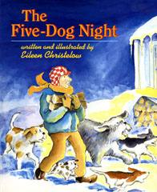{width="2.0416666666666665in"
height="2.5in"}

**The Five-Dog Night Eileen Christelow**

The Story:

Ezra and his five dogs live high on a hilltop. Just down the hill lives
old Betty, who visits daily with cookies and advice on how to stay warm
on the cold winter nights. But Ezra doesn\'t want Betty\'s advice­---or
her blankets which she offers him after the first snowy night.

\"It wasn\'t so bad,\" says Ezra. \"It was only a three-dog night.\"

\"Stubborn as a mule,\" frets Betty. \"He\'ll turn into a block of
ice.\"

After the coldest night of all, Betty rushes up to Ezra\'s house to
check on him. What she discovers there makes a funny and satisfying
climax to this folksy story about friendship and keeping warm.

Where did you get the IDEA?

When I first heard Will Curtis, on NPR, tell how an old Vermonter kept
himself warm through long winter nights with the help of his five dogs,
I thought, \"That\'s a picture book!\"

Later, I was telling my cousin, nature writer, Gale Lawrence, that I was
thinking of writing a picture book inspired by Will Curtis\'s story.
Unbelievably, our conversation was interrupted by a phone call from . .
. can you guess? Will Curtis! He was asking permission to use one of her
articles on his radio program.

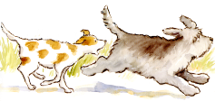{width="2.46875in"
height="1.1666666666666667in"}

Did the old Vermonter (Ezra) actually exist?

No one is sure. Will Curtis first read the story in Sanctuary, an
Audubon Society magazine. It\'s possible their story was a folk tale,
told and retold.

The expression, \'three-dog night\', has been around for a
while---shared by many cultures which have dogs and cold nights.

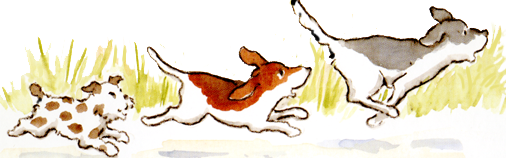{width="5.270833333333333in"
height="1.6458333333333333in"}

Was old Betty in the original story?

No, I added old Betty to build the plot. So in addition to a story about
dogs and warmth, it became a story about friendship.

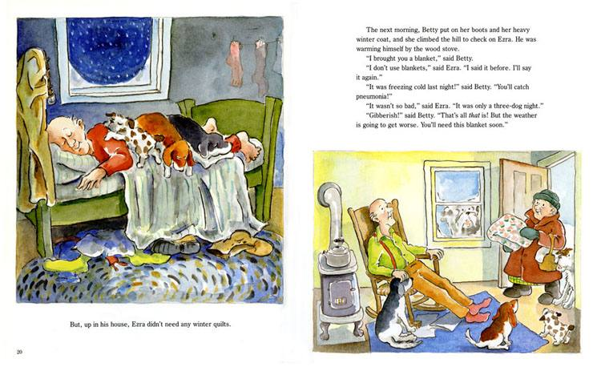{width="6.268055555555556in"
height="3.895449475065617in"}

**The Five-Dog Night Eileen Christelow**

Ezra lived alone in a small house, high on windy hilltop. Well, not
exactly alone \... he had five dogs for company.

And halfway down the hill lived old Betty. She visited Ezra almost every
day, rain or shine. Ezra loved dogs, but he figured he could pretty much
take or leave old betty.

When Ezra saw her climbing up the hill to his house, he grumbled to his
dogs, "Here comes that old busybody, Betty."

As soon as he said that, all five dogs were up and running down the
hill. They barked. They wagged their tails. They licked Betty's face.

She gave them each a cookie.

"Humph!" grumbled Ezra. "You spoil those dogs. They're supposed to chase
you away."

"Posh!" said Betty. "I brought you some cookies, too. I'll make us a pot
of tea."

"Don't bother yourself," said Ezra. But Betty made tea.

"Fall is here," she said. "The leaves are turning. It's going to be
chilly tonight. You'll need an extra blanket."

"I don't need blankets," said Ezra.

"Everyone needs blankets," said Betty.

"Not me," said Ezra, his mouth full of cookies.

"Stubborn as a mule," said Betty as she headed home.

"Nosy as a mouse sniffing for cheese," Ezra muttered as he fed the dogs.

That night, a chill breeze blew in from the north. Down in her house,
Betty put an extra blanket on her bed.

But, up in his house, Ezra did not need an extra blanket.

The next morning, Betty climbed the hill to visit Ezra.

"Chilly last night," said Betty.

"Wasn't too bad," said Ezra. "It was only a one-dog night."

"What are you talking about?" said Betty.

Ezra just winked at the dogs.

"Crazy as a loon!" said Betty.

"Nosy old biddy," Ezra muttered.

During the next weeks all the leaves turned red and gold. Then one day a
wind came up and it rained, knocking the last of the leaves from the
trees.

Betty told Ezra, "Winter is coming. I hear it's going to clear up
tonight and get so cold there'll be ice on the puddles by morning.
You'll surely need a blanket."

"Nope," said Ezra. "I won't."

That night was so chilly, Betty had to get up at two a.m. to find
another blanket. She could just see Ezra's house in the moonlight.

"That stubborn old mule is probably up there shivering and quivering
with the cold," she said to herself.

But, up in his house, Ezra was not shivering and quivering with the
cold.

The next day, Ezra was carrying in wood for his stove when Betty came up
the hill to visit.

"Cold last night," said Betty. "The last of my garden froze up.
shrivelled, and died."

"It wasn't so bad," said Ezra. "It was only a tw0-dog night."

"Humph!" said Betty. "Talking crazy again. But you better cover up
tonight. They say a snowstorm is coming our way."

"I'm not worries," said Ezra.

That night, the first snow fell.

Down in her house, Betty took out her winter quilt.

But, up in his house, Ezra didn't need any winter quilts.

The next morning, Betty put on her boots and her heavy winter coat, and
she climbed the hill to check on Ezra. He was warming himself by the
wood stove.

"I brought you a blanket," said Betty.

"I don't use blankets," said Ezra. "I said it before. I'll say it
again."

"It was freezing cold last night!" said Betty. "You'll catch pneumonia!"

"It wasn't so bad," said Ezra. "It was only a three-dog night."

"Gibberish!" said Betty. "That's all *that* is! But the weather is going
to get worse. You'll need this blanket soon."

The next couple of weeks, it snowed again and then again. In fact the
snow got so deep, it reached halfway up Ezra's windows.

Then one night an icy north wind blew the clouds from the sky,
uncovering the stars. The temperature dropped to zero.

But Ezra didn't use Betty's blanket.

The next morning, Betty chugged up the hill in her car to visit Ezra.
She brought hot chocolate in a thermos.

"It's too cold to walk," she said. "It was freezing last night. Did you
use the blanket?"

"Nope," said Ezra. "It was only a four-dog night."

"The colder it gets, the crazier you get!" said Betty.

"You mean the colder it gets, the nosier YOU get," mumbled Ezra.

The next days were so cold the trees cracked and the river froze solid.

Then one evening an Arctic wind howled around Ezra's house. The
temperature dropped well below zero. Even Ezra's largest and furriest
dog would not stay outside.

Betty piled all of her blankets and coats onto her bed. She stoked her
wood stove with extra logs.

"Ezra will have to stoke his wood srtove all night," she thought as she
shivered under her blankets. "And he'll have to use that blanket, or
he'll turn into a block of ice."

The next morning, Betty was so concerned about Ezra that she drove up to
his house just as the sun was rising, before she had even eaten
breakfast.

There was no smoke coming out of Ezra's chimney.

"No fire in the wood stove!" said Betty. "He's frozen to death!"

She opened Ezra's door and peeked inside -- and there was Ezra, snoring
happily, without any blankets on at all.

the dogs raised their heads and growled.

"Sh-h-h-h! It's only me!" whispered Betty.

The dogs jumped off the bed, barked, and wagged their tails. ezra woke
up.

"What's going on ?" he asked.

"I was just checking to see if you're all right," said Betty

"Well, DON'T!" roared Ezra. "You \... you nosy old busybody!"

"If that's the way you feel, I won't -- ever again!" shouted Betty. "You
\... you old grouch!"

She walked out of the house, slammed the door, and drove back down the
hill.

"Well, I guess that old busybody won't nose around here again," Ezra
told the dogs. "Good riddance!"

Not one tail wagged.

Weeks went by. The weather turned warmer. The snow melted. The dogs lay
around in the front yard, watching the road. Betty didn't come up the
hill.

"Awfully quiet around here," Ezra said to the dogs. "It's almost spring,
and I'm feeling gloomy as a stormy sky. Can't figure it out."

Around the first time the first daffodils were poking out of the ground,
Ezra baked some cookies. Then he put on his cleanest shirt and walked
down the hill. The dogs came with him.

Within earshot of Betty's house, they were greeted by the sound of
barking.

Five dogs exploded out of Betty's gate and raced up the road towards
them. Betty came after them.

"Quiet!" she shouted. "Stop!"

"New dogs?" said Ezra.

"Got them in January," said Betty. "They are better company than some
people I know."

"I can brew a pot of tea to go with these cookies I made," said Ezra.
"Don't know of any dogs who can do that."

"Guess that's true," said Betty.

"It's getting warmer," said Ezra as he boiled water for tea.

"It certainly is," said Betty. "Last night was only a one-dog night."

"You'll catch your death of pneumonia!" said Ezra. "last night was a
two-dog night!"

**Canoe Days Gary Paulsen**

{width="2.3958333333333335in"
height="2.625in"}

Peace. Stillness. Quiet. Nature observation at its best. Paulsen\'s
poetic language draws the reader onto the serene lake with him and his
canoe. The illustration perfectly captures the mirror image of the
lake\'s edge in the glassy water.

+----------------------+---------------------------------------------+
| Craft                | Example                                     |
+======================+=============================================+
| Lead -- use of       | *Sometimes when it is still, so still you   |
| repetition           | can hear the swish of a butterfly's wing -- |
|                      | sometimes when it is that still I take the  |
|                      | canoe out on the edge of the lake.*         |
+----------------------+---------------------------------------------+
| Strong Verbs         | disappear floating flopping                 |
+----------------------+---------------------------------------------+
| Similes              | *the canoe slides in green magic without a  |
|                      | ripple, disappears like a ghost floating in |
|                      | the airwater*                               |
|                      |                                             |
|                      | *the cold slash of a hunting northern pike  |
|                      | moves like an arrow through the pads*       |
|                      |                                             |
|                      | *her ducklings spread out like a spotted    |
|                      | fan around her*                             |
|                      |                                             |
|                      | *only the canoe, as a shiny log floating in |
|                      | the sun*                                    |
|                      |                                             |
|                      | *while the sun is on my back like a golden  |
|                      | friend on this perfect day.*                |
+----------------------+---------------------------------------------+
| Metaphor             | *The water is a window into the skylake.*   |
+----------------------+---------------------------------------------+
| Specific nouns       | *Sunfish northern pike mallard hen*         |
+----------------------+---------------------------------------------+
| Use and 'and' in a   | *while I hold my breath and see the fawn    |
| series of items      | and the ducks and the doe and the snake and |
|                      | the frogs and the fish and the fox and the  |
|                      | badger all around me*                       |
+----------------------+---------------------------------------------+
| Unusual vocabulary   | *Airwater skylake*                          |
+----------------------+---------------------------------------------+
| Ending -- sentence   | *A canoe day.*                              |
| fragment             |                                             |
+----------------------+---------------------------------------------+

**Canoe Days Gary Paulsen**

Sometimes when it is still, so still you can hear the swish of a
butterfly's wing -- sometimes when it is that still I take the canoe out
on the edge of the lake.

One stroke of the paddle and we are gone, the canoe and me, moving
silently.

Across water so quiet it becomes part of the sky, the canoe slides in
green magic without a ripple, disappears like a ghost floating in the
airwater over the playground where fish play.

The water is a window into the skylake.

Sunfish under lily pads living in cool green rooms, watching for water
bugs to make a lunch.

Watching for frogs to make a dinner.

But still now, everything frozen while the cold slash of a hunting
northern pike moves like an arrow through the pads, looking, fiercely
searching always for something to eat; and then he's gone into the green
depths.

Ahead is a mallard hen, her ducklings spread out like a spotted fan
around her looking for skittering oar bugs to eat. The canoe does not
frighten her -- she does not see the man, only the canoe, as a shiny log
floating in the sun.

And there a fawn, on the edge, his feet in the water, ears flopping the
flies away while he watches the canoe glide past, as unafraid as the
mallard.

But his mother is near, in the bush, knowing better and trying to get
him away with short stamps of her feet.

Come away now. Come away *now*.

A fox drinks, soft laps with a pink tongue while the paddle waits, all
still. Then the fox slips away.

A raccoon turns a log looking for worms to eat.

A snake moves from shore to pad, a wavy ripple, green back and light
belly making it invisible when it stops.

And then, perfect on the brim of my cap, a dragonfly catches a deerfly
that would have bitten me and eats there without leaving; while I hold
my breath and see the fawn and the ducks and the doe and the snake and
the frogs and the fish and the fox and the badger all around me while
the sun is on my back like a golden friend on this perfect day.

A canoe day.

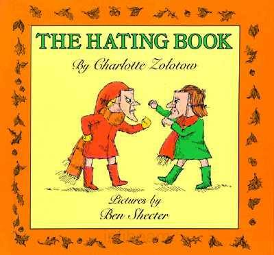{width="4.166666666666667in"
height="3.875in"}

**The Hating Book** **Charlotte Zolotow**

**Synopsis Of Story:**\
A girl is angry with her friend because she makes the wrong assumptions
about her friend\'s behaviour. Rather than testing out her assumptions,
she \"hates\" her friend and interprets every action from her friend as
proving what she believes. When her mother suggests to her that she
\"ask why\" her friend is acting this way, she says that she would
rather die. Finally, she reluctantly approaches her friend and finds out
that her friend was not being mean to her at all. She realises that her
problem was based on a misunderstanding. They resolve the problem.

**Understandings**

- Recognising that fights are often based on misunderstandings

- Understanding people will act on how they perceive things

- The first part of solving a conflict is to cool down, explore what you
  are thinking and feeling and then communicate with the other person.

- Recognising other's reactions to us influences our response to them
  (our emotions dictate our actions)

- Understanding your perceptions are your perceptions and not always the
  same as others

- Knowing that you can "hate" someone you love (feelings conflict)

- Knowing how to approach others when surprised by their reaction to us

- Acknowledge that friends can and do hurt us

- Knowing we can get past negative feelings toward others

- Knowing that a common response to confrontation is defensiveness

- 

**Objectives**\
1. Students will develop an awareness of how misunderstandings can cause
and escalate conflicts.\
2. Students will be able to identify escalating and deescalating
behaviours in a conflict situation.

Literacy: Children will learn to read with expression.

**Pre-Reading**\
Think about a time that you were really angry with your friend. How did
you handle it? What happened? Share a personal example. I was angry with
my friend Liz. She was supposed to come over. I waited and waited but
she never showed up. Finally, I ate and went to bed. How would you feel?
She called and I would not even talk to her for three days. When I
finally spoke to her I found out that she was stuck on the road with a
flat tyre, no cell phone, and no dinner. How did she feel? What did we
have? We had a misunderstanding!

Ask children to take a minute each to share with their Practice Partners
a time they had a misunderstanding with someone else. What was the
misunderstanding? When done, tell class that you will read a story about
two girls who had a misunderstanding. Tell them that you want them to
listen carefully to how you use emotions in your voice as you read the
story. Encourage them to guess silently what emotions you are trying to
express and tell them that later they will have a chance to read with
expression.

**Discussion Questions**

How did the narrator (i.e. the girl) react in the beginning to her
friend's actions? Did the problem get worse or better right away? Why?\
Why do you think the girl didn't want to ask her friend about her
behaviour?\
What did the girl do differently at the end? What was her friend\'s
reaction?\
When have you reacted negatively to a friend\'s actions toward you and
been afraid to discuss your feelings with them? What were you afraid of?

**.**

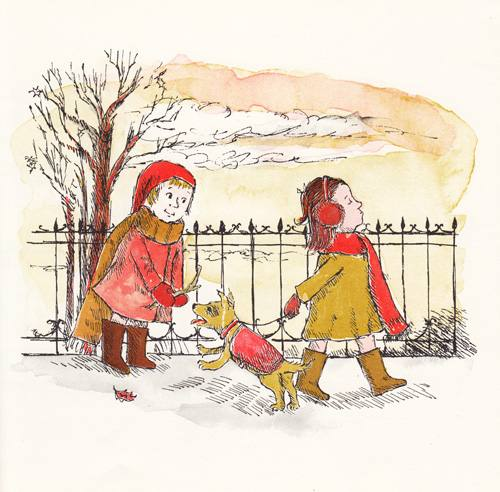{width="5.208333333333333in"
height="5.125in"}

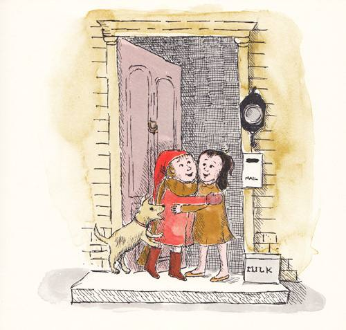{width="5.208333333333333in"
height="4.96875in"}

[**[The Hating Book: An Illustrated Vintage Parable About What Every
Friendship
Needs]{.underline}**](http://www.brainpickings.org/2014/02/21/the-hating-book-charlotte-zolotow/)

**by [Maria Popova](http://www.brainpickings.org/author/mpopova/)**

> *"You're ugly and dumb. Being with you was never fun."*

[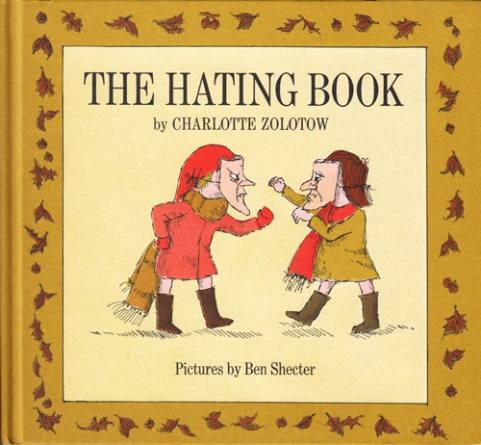{width="2.1875in"
height="2.0208333333333335in"}](http://www.amazon.com/exec/obidos/ASIN/0064431975/braipick-20)In
1961, young [Maurice
Sendak](http://www.brainpickings.org/index.php/tag/maurice-sendak/) illustrated
[*Let's Be
Enemies*](http://www.brainpickings.org/index.php/2014/01/29/lets-be-enemies-maurice-sendak/) ---
a charming lesson in friendship via reverse psychology by writer Janice
May Urdy, published by Harper's children's division. Eight years later,
the same publisher, overseen by Sendak's [remarkable editor and
patron-saint](http://www.brainpickings.org/index.php/2013/06/10/ursula-nordstrom-letter-maurice-sendak/) Ursula
Nordstrom, came out with [***The Hating
Book***](http://www.amazon.com/exec/obidos/ASIN/0064431975/braipick-20)([*public
library*](http://www.worldcat.org/title/hating-book/oclc/22940&referer=brief_results))
by **Charlotte Zolotow**, the beloved children's writer whom we recently
lost and with whom [Sendak frequently
collaborated](http://www.brainpickings.org/index.php/2013/11/21/charlotte-zolotow/) ---
a story strikingly similar in its ethos to *Let's Be Enemies*, only
featuring two little girls rather than two little boys, and illustrated
by a very young **Ben Shecter** in a style akin to Sendak's.

Whether the parallel was intentional or just the product of creative
happenstance, we'll never know. But Zolotow's story and Shecter's
illustrations stand on their own not only as a lovely vintage treasure,
but also an endearing, light-hearted yet poignant reminder that [we
invent our attitudes towards friends and
foes](http://www.brainpickings.org/index.php/2014/02/20/the-benjamin-franklin-effect-mcraney/),
that a great deal of how we interpret another person's behavior and
intentions is merely a projection of the stories we've constructed about
them, and that open communication is the glue of true friendship.

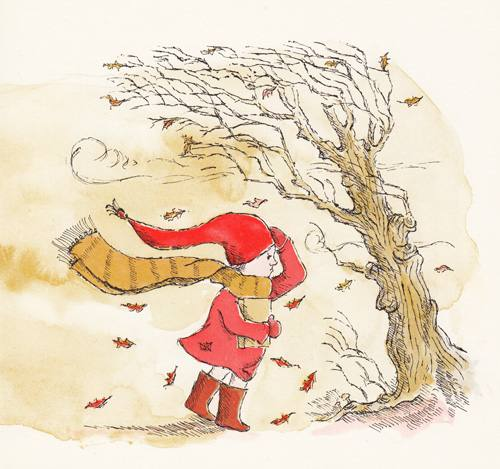{width="5.208333333333333in"
height="4.885416666666667in"}

I hate, hate, hated my friend.

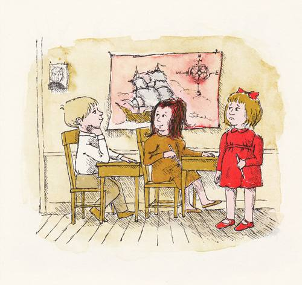{width="5.208333333333333in"
height="4.916666666666667in"}

When I moved over in the school bus, she sat somewhere else.

When her point broke in arithmetic and I passed her my pencil, she took
Peter's instead.

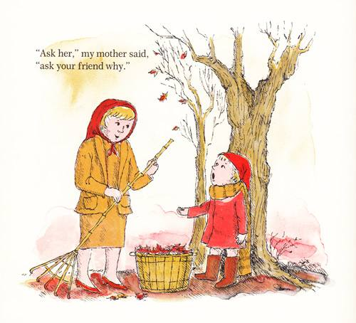{width="5.208333333333333in"
height="4.729166666666667in"}

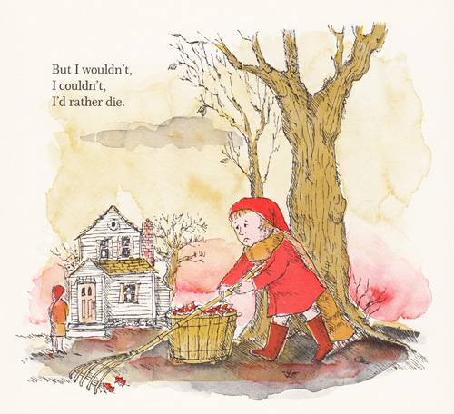{width="5.208333333333333in"
height="4.75in"}

What if she should say\
Oh, please, just go away.\
You're ugly and dumb.\
Being with you\
was never fun.

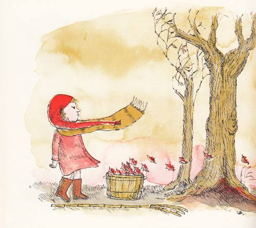{width="5.208333333333333in"
height="4.635416666666667in"}

Oh, I hated my friend.

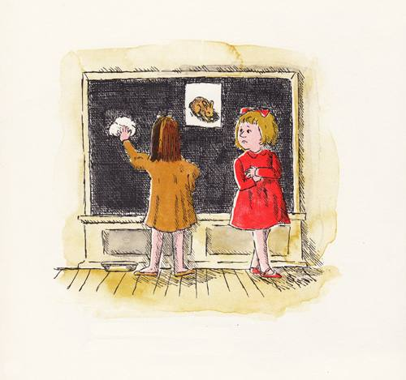{width="5.208333333333333in"
height="4.885416666666667in"}

When it was her turn to wash the board,\
she didn't ask me to help.

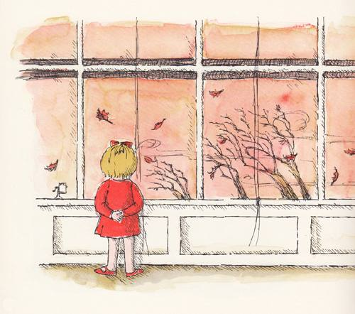{width="5.208333333333333in"
height="4.604166666666667in"}

Oh, I hated my friend.

{width="5.208333333333333in"
height="5.125in"}

When I went to walk home with her,\
she had already gone.

When she took her dog out\
and I whistled to him,\
she put him on a leash\
and led him away.

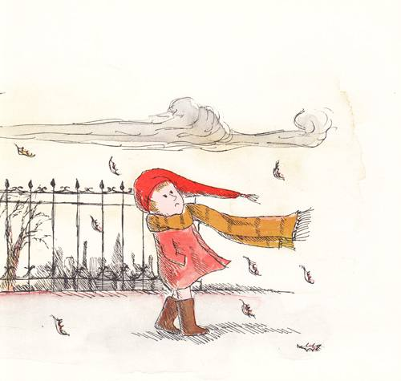{width="5.208333333333333in"
height="4.947916666666667in"}

Oh, I hated my friend.

After a few more spreads of inner turmoil, the snubbed little girl
eventually decides to take her mother's advice and confront her friend.

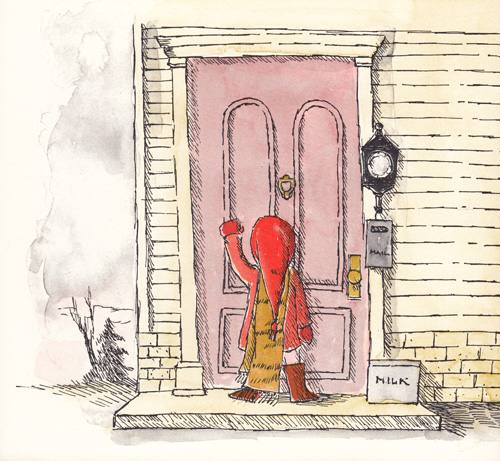{width="5.208333333333333in"
height="4.802083333333333in"}

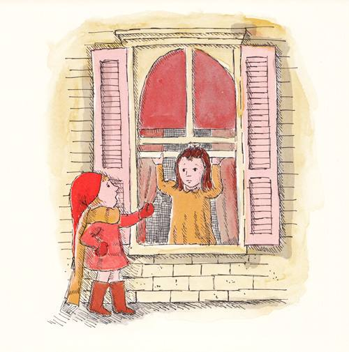{width="5.208333333333333in"
height="5.260416666666667in"}

"You've been so rotten," I said.\
"Why?"\
She looked as though she'd cry.\
"It's you," she said. "Last week\
when I wore my new dress,\
Sue said Jane said you said\
I looked like a freak."\
"I did not!\
I said you looked *neat*!"

{width="5.208333333333333in"
height="4.96875in"}

She looked straight at me for a while,\
and then we both began to smile.\
My friend said, "Hey\
maybe tomorrow we can play?"\
"Oh, yes," I said, "OKAY!"

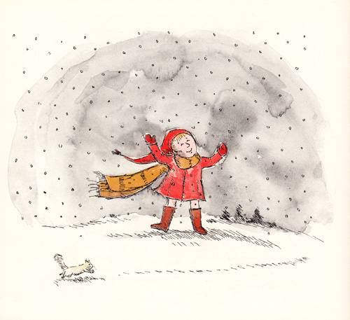{width="5.208333333333333in"
height="4.760416666666667in"}

I didn't hate her anyway.\
I wish it were tomorrow.

**The Hating Book Charlotte Zolotow**

I hate, hate, hated my friend.

When I moved over in the school bus, she sat somewhere else.

When her point broke in arithmetic

and I passed her my pencil, she took Peter's instead.

"Ask her," my mother said, "ask your friend why."

But I wouldn't, I couldn't. I'd rather die.

What if she should say

Oh, please, just go away.

You're ugly and dumb.

Being with you

was never fun.

Oh, I hated my friend.

When it was her turn to wash the board,

she didn't ask me to help.

When it was time to choose teams,

she didn't choose me.

And when I made a basket

and everyone else yelled YAAAA,

she turned away.

Oh, I hated my friend.

When I went to walk home with her,

she had already gone.

When she took her dog out

and I whistled to him,

she put him on a leash

and led him away.

Oh, I hated my friend.

"Ask her," my mother said, "ask your friend why."

But I wouldn't, I couldn't. I'd rather die.

No --

if that's the way she's going to be,

it's quite okay with me.

"Ask her," my mother said, "ask your friend why."

But I wouldn't, I couldn't.

But maybe \...

"You've been so rotten," I said.

"Why?"

She looked as though she'd cry.

"It's you," she said. "Last week

when I wore my new dress,

Sue said Jane said you said

I looked like a freak."

"I did not!

I said you looked neat!"

She looked straight at me for a while,

and then we both began to smile.

My friend said, "Hey

maybe tomorrow we can play?"

"Oh, yes," I said, "OKAY!"

I didn't hate her anyway.

I wish it were tomorrow.

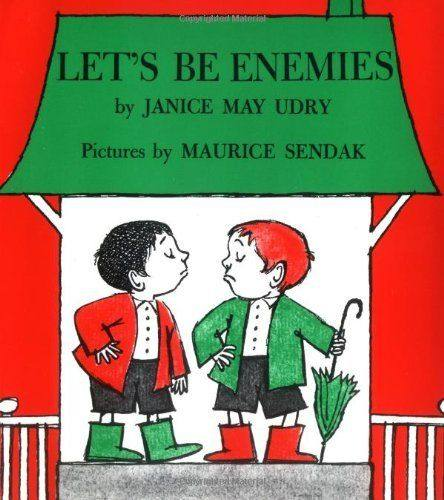{width="3.8229166666666665in"
height="4.3050863954505685in"}

James and John are best friends \-- or at least they used to be. They
shared pretzels, umbrellas, and even chicken pox. Now James always wants
to be boss, and John doesn\'t want to be friends anymore. But when he
goes to James\' house to tell him so, something unexpected happens.

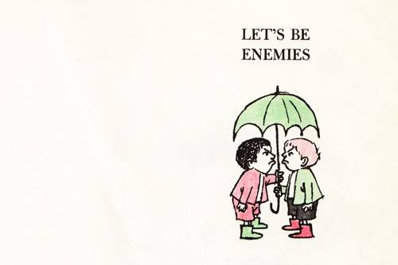{width="5.208333333333333in"
height="3.46875in"}

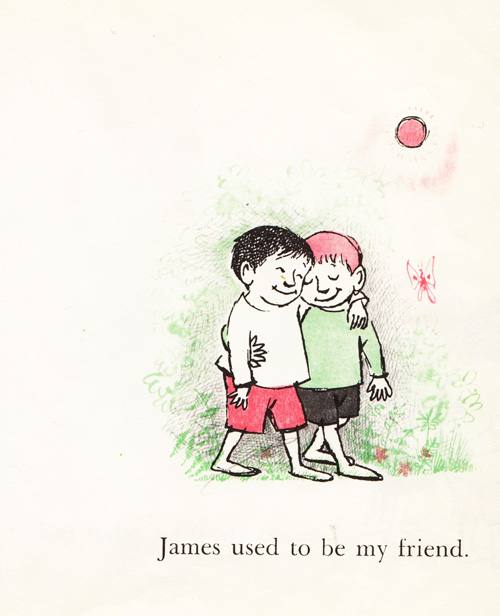{width="5.208333333333333in"
height="6.416666666666667in"}

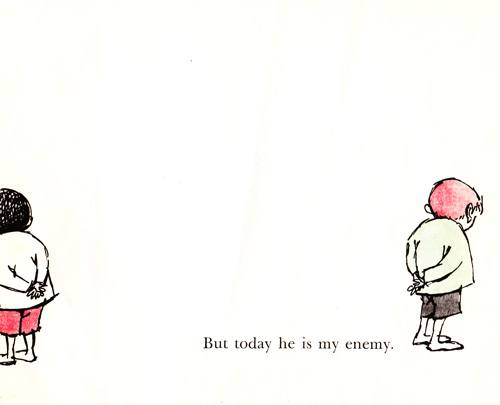{width="5.208333333333333in"
height="4.21875in"}

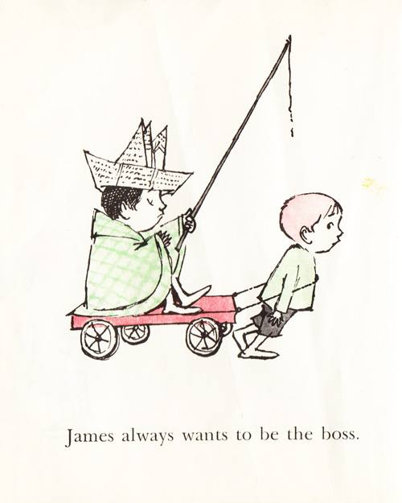{width="5.208333333333333in"
height="6.510416666666667in"}

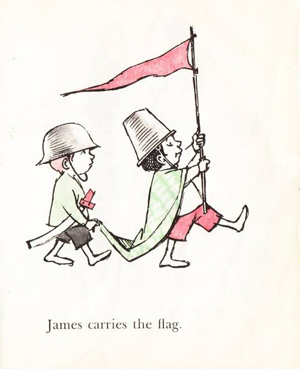{width="5.208333333333333in"
height="6.395833333333333in"}

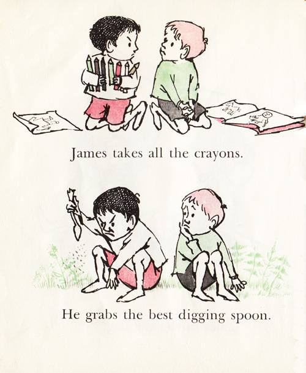{width="5.208333333333333in"
height="6.34375in"}

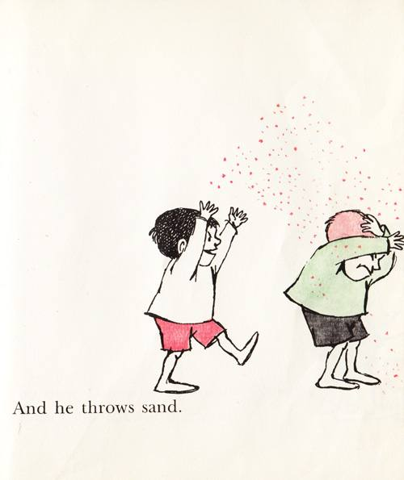{width="5.208333333333333in"
height="6.197916666666667in"}

So now James is my enemy. Now he hasn't got me for a friend.

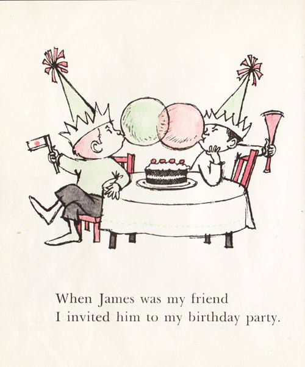{width="5.208333333333333in"
height="6.28125in"}

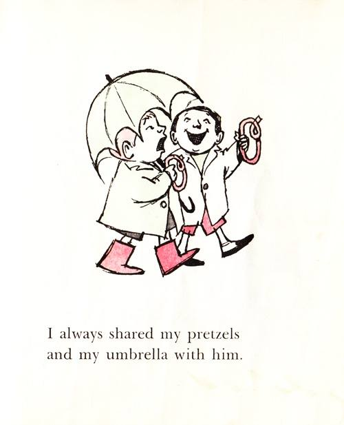{width="5.208333333333333in"
height="6.427083333333333in"}

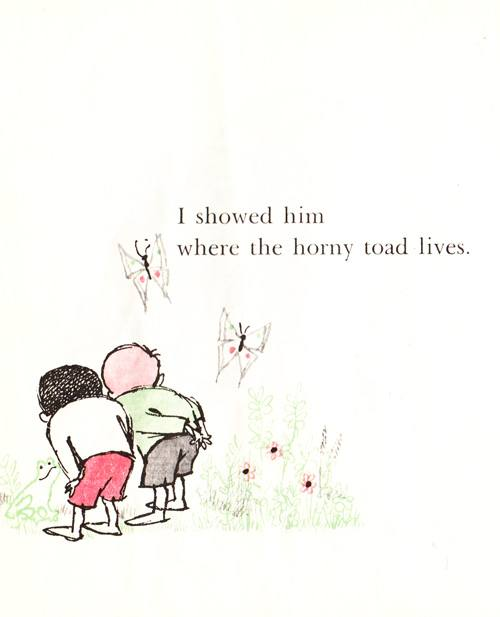{width="5.208333333333333in"
height="6.427083333333333in"}

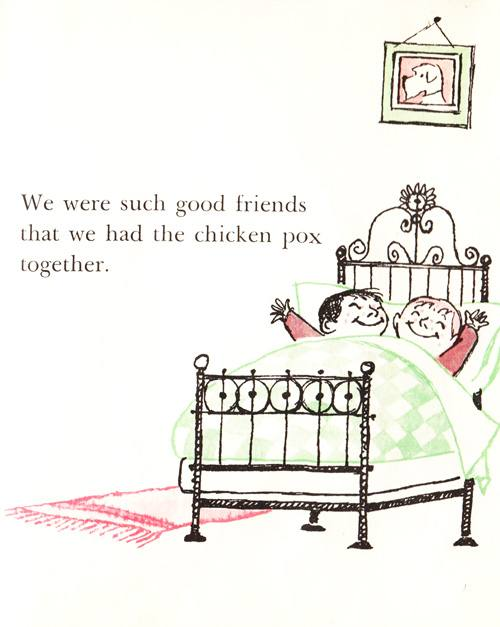{width="5.208333333333333in"
height="6.53125in"}

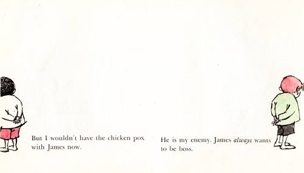{width="5.208333333333333in"
height="2.96875in"}

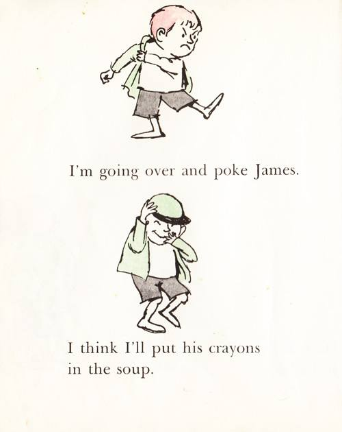{width="5.208333333333333in"
height="6.5625in"}

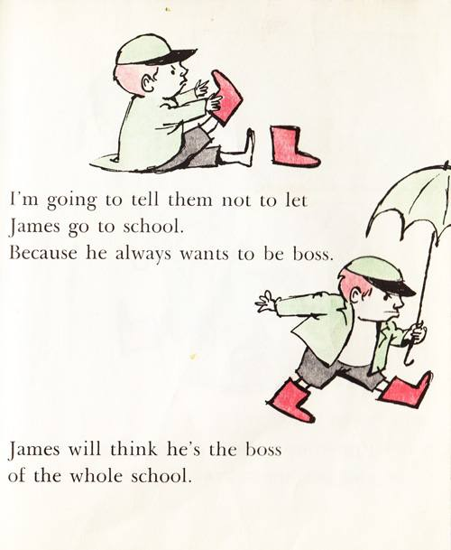{width="5.208333333333333in"
height="6.34375in"}

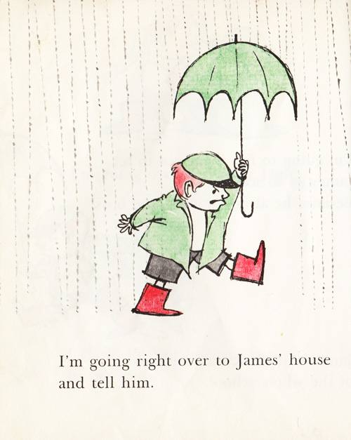{width="5.208333333333333in"
height="6.53125in"}

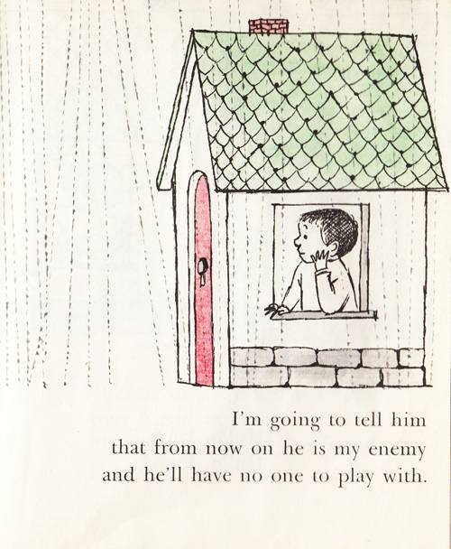{width="5.208333333333333in"
height="6.333333333333333in"}

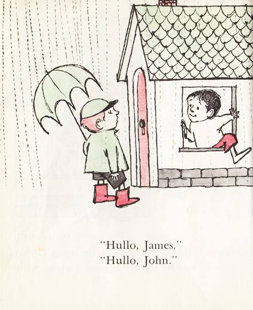{width="5.208333333333333in"
height="6.395833333333333in"}

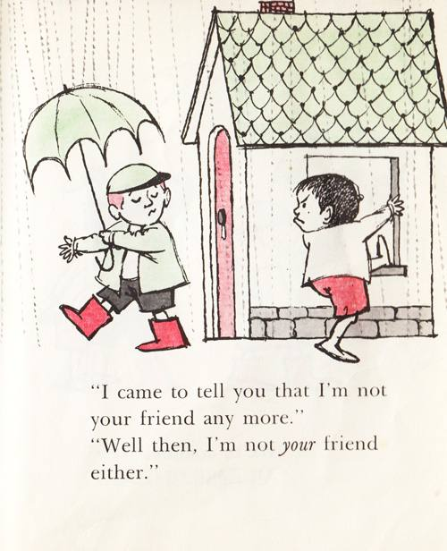{width="5.208333333333333in"
height="6.416666666666667in"}

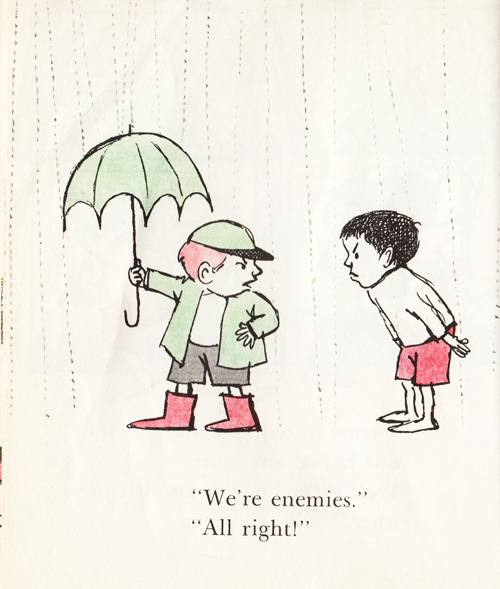{width="5.208333333333333in"
height="6.135416666666667in"}

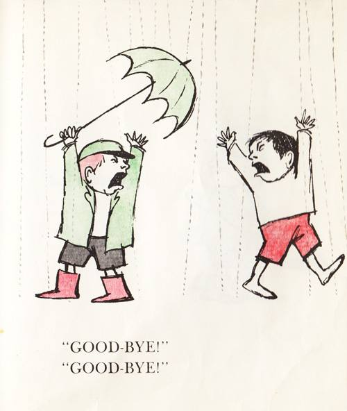{width="5.208333333333333in"
height="6.166666666666667in"}

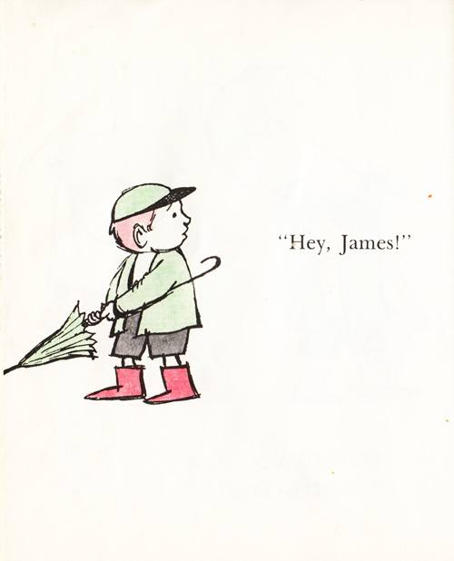{width="5.208333333333333in"
height="6.4375in"}

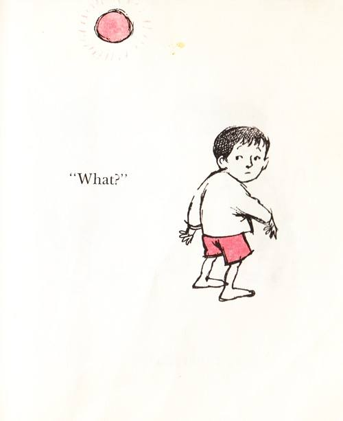{width="5.208333333333333in"
height="6.385416666666667in"}

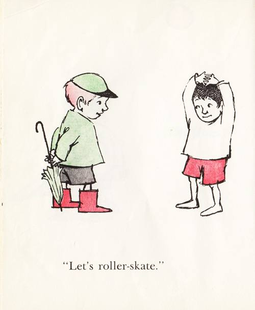{width="5.208333333333333in"
height="6.34375in"}

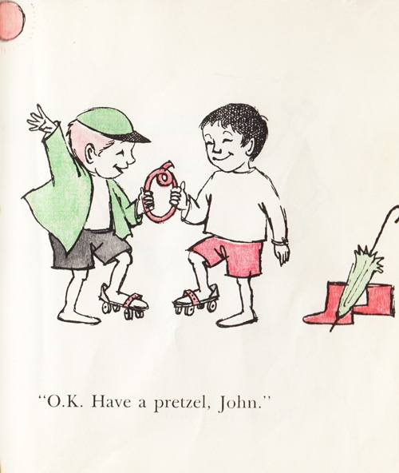{width="5.208333333333333in"
height="6.166666666666667in"}

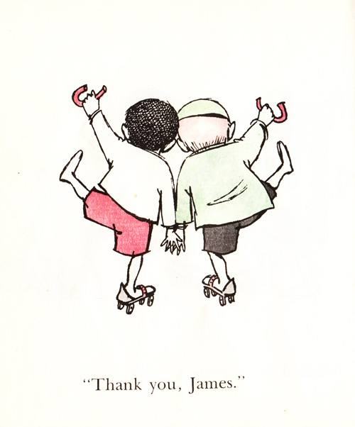{width="5.208333333333333in"
height="6.270833333333333in"}

**Let's Be Enemies Janice Udry**

James used to be my friend.

But today he is my enemy.

James always wants to be the boss.

James carries the flag.

James takes all the crayons.

He grabs the best digging spoon.

And he throws sand.

When James was my friend I invited him to my birthday party.

I always shared my pretzels and my umbrella with him.

I showed him where the horny toad lives.

We were such good friends that we had the chicken pox together.

But I wouldn't have the chicken pox with James now.

He is my enemy. James always wants to be boss.

I'm going over and poke James.

I think I'll put his crayons in the soup.

I'm going to tell them not to let James go to school.

Because he always wants to be boss.

James will think he's the boss of the whole school.

I'm going right over to James' house and tell him.

I'm going to tell him that from now on he is my enemy and he'll have no
one to play with.

"Hullo, James."

"Hullo, John."

"I came to tell you that I'm not your friend any more."

"Well then, I'm not *your* friend either."

"We're enemies."

"All right!"

"GOOD-BYE!"

"GOOD-BYE!"

"Hey, James!"

"What?"\
"Let's roller-skate."

"Okay. Have a pretzel, John."

"Thank you, James."

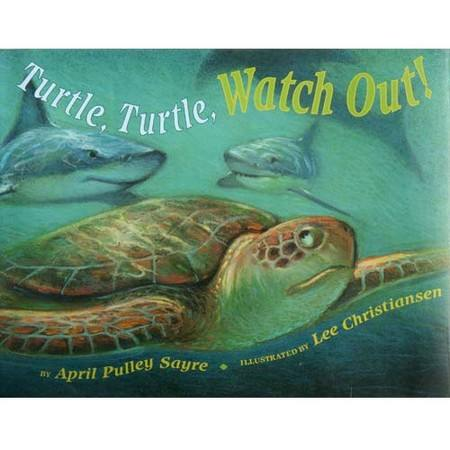{width="4.6875in"
height="4.6875in"}

**Turtle, Turtle, Watch Out! April Sayre**

When Turtle is just an egg buried in sand, hungry raccoons try to dig
her up. Turtle, Turtle, Watch Out! But a child scares them away and puts
wire mesh over the nest to protect the eggs. As Turtle hatches, scurries
to sea, grows up, and becomes a mother turtle returning to the same
beach to lay her own eggs, numerous dangers threaten her. Sometimes she
escapes through her own efforts, and sometimes she needs the help of
human hands. This exciting story vividly describes the life cycle of a
sea turtle and the ways we can help these endangered animals survive.
Rich artwork and a dramatic read-aloud text make it a tale that will
keep children on the edge of their seats.

Teaching:

Voice

Strong verbs

Sequencing

Repetition

Onomatopoeia

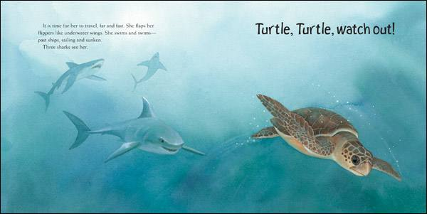{width="5.59375in"
height="2.8061975065616798in"}

Mother sea turtle lays her eggs in the Florida sand, then crawls back
into the water. Raccoons begin to dig up the eggs, but a boy scares them
off. He then sets off a protected area for them, complete with warning
signs. Months later, the eggs hatch and the baby turtles head for the
ocean. The story follows one baby turtle that survives, matures, and
returns one night to the same Florida beach to lay her own eggs. \"And
some will make it, with a little luck, and fast-moving flippers, and the
help of many hands.\" The concluding pages note the endangered status of
sea turtles and suggest ways in which people, even children, can protect
them from harm. Many animal books for young children end with an
appended plea for people to protect an endangered species, but none has
so memorably dramatized in the book itself how people can help animals
in the wild. The simple, direct text reads aloud well, drawing readers
into the turtles\' story without anthropomorphism. Impressive pastel
illustrations, including many dramatic double-page spreads, depict with
power and beauty the turtles\' world of sand and shore.

**Turtle, Turtle, Watch Out April Sayre**

Late one night, on a beach in Florida, a baby turtle's story begins. It
could be a short story, or no story at all, if not for helping hands.

Turtle is only an egg now. Her mother's flippers cover her with sand.

But hungry raccoons watch. And when Mother Turtle crawls back to sea
\... Furry feet scurry. Noses sniff. Paws dig.

Turtle, Turtle, watch out!

Young hands, holding a flashlight, scare the bandits away. They place
wire mesh around the turtle nest to protect the buried eggs.

Morning comes. So does a jeep. It speeds towards the eggs.

Turtle, Turtle, watch out!

The jeep stops. Clever hands put up a painted sign.

BEACH CLOSED. TURTLES NESTING, the sign says. The jeep drives away. The
turtle nest is safe and undisturbed. Turtle sees none of this, inside
her egg.

Two months later, on a starry August night, Turtle begins to tear her
eggshell. She rips it open with a special tooth. She rocks and wiggles
to escape. Nudging, pushing, paddling, she digs her way to the surface.
All around her, other nestlings dig out too.

They crawl across the beach. *Go to the light!* That's all Turtle knows.
At night the brightest light should be the moon on the sea.

Tonight it is not. Turtle crawls towards the wrong light, shining from
across the street.

Turtle, Turtle, watch out!

Small hands switch off the light. Turtle turns and crawls the other way.
She scurries towards bright moonlight, shining on ocean waves.

Step by step, she journeys down the beach. Animals gather: night herons,
cats, and raccoons. They are here to eat the hatchlings. Long bird legs
stalk Turtle.

Turtle, Turtle, watch out!

Quickly Turtle scoots to the water. *Whoosh!* Waves tumble her tiny
body. She pushes her flippers. She can swim! Currents catch her and
carry her far from shore. She drifts for days, dining on tiny plants and
animals. But danger lurks again.

*Keeyou!* cries a gull, swooping down.

Turtle, Turtle, watch out!

*Phloop!* Turtle dives into a seaweed patch to hide. Safe and sound, she
floats.

For several months Turtle drifts with the seaweed. She grows larger.

Then one day she leaves. She swims. Past islands. Past sailfish. Past
humpback whales.

She reaches a coral reef, where she spies a tasty jellyfish \...

Turtle, Turtle, watch out!

*Splash!* Quick hands dip down, grabbing the plastic bag. It looks like
a jellyfish, but it's not. It could choke a turtle or clog its belly.

Turtle swims onward. She looks for other food. Her jaws crack open
conchs, crabs, and clams. For twenty years this is her turtle life \...
until one day she feels restless.

It is time for her to travel, far and fast.

She flaps her flippers like underwater wings. She swims and swims. Past
ships, sailing and sunken too. Seven sharks see her.

Turtle, Turtle, watch out!

The sharks pursue her. No hands can help her now.

She swims faster and faster ,,, and finally she escapes.

But she does not see a shrimper's nets rushing right towards her.

Turtle, Turtle, watch out!

In an instant she is swept into a net. It drags her down, down. She
needs to surface to breathe. The boat pulls, tumbling her to the back of
the net. She is almost out of air, when \... she slips through an escape
hatch. She is free!

Months before, weathered hands sewed that hatch onto the net, just so
sea turtles could escape.

Shaken but safe, Turtle swims on. She meets a male turtle, and they
mate. Later, under a summer moon, Turtle swims towards the breaking
waves.

Turtle, Turtle, watch out!

*Thud!* Her heavy body hits the hard shore. It's the same beach where
she hatched. But now things are different. For now *she* is a mother
turtle, about to lay *her* eggs.

One day those eggs will hatch. The tiny turtles will begin their
journeys, scrambling across the sand. And some will make it, with a
little luck, and fast-moving flippers, and the help of many hands.

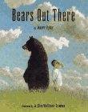{width="1.1458333333333333in"
height="1.4583333333333333in"}

**Bears Out There Joanna Ryder**

Joanne Ryder\'s lyrical exploration of a child\'s imagination begins
first tucked in bed in the early morning, then throughout the day, as he
imagines the playful antics of the wild bears in the woods\--bears that
he can\'t see but that he knows are there. By the river they wade and
splash. In the tall grass they tumble and wrestle, then feed on berries.
They follow nameless paths through the woods, and as night falls they,
just like the child, feel the coolness of the evening and watch the
world turn dark.

Voice

Strong Verbs

Power of Three

**Bears Out There Joanne Ryder**

There are bears out there.

I can feel them.

Asleep in the woods

bears curl, soft and dark.

Tucked under branches

that droop from tall trees,

there are big bears,

yawning and blinking

and stretching --

like me.

There are bears

waking early

while the day

is still grey,

shaking soft dirt

and old leaves

from their coat.

Bears wrapped in fur,

as I'm wrapped in covers,

feel the coolness of morning,

hear the wind in the trees.

There are bears out there,

sniffing the air,

sniffing the ground,

looking for food --

tender grass, tasty roots.

Hungry bears

sniff and listen

and follow a humming

that leads them

to sweetness.

Bears in the woods

eat breakfast too,

licking their paws

full of honey.

There are paths

in the woods,

paths without names

bears know by heart,

dusty trails covered

with pawprints

big and wide.

Bears have their paths

from here to there,

and I have mine.

Along these paths,

there are bears

moving slowly,

reaching high,

touching a branch

they could not

touch before.

They are tall bears,

growing taller,

growing stronger --

just like me.

Down by the water,

hot, dusty bears

wade and splash.

Large bears catch fish

with quick, strong jaws.

And dark bears, wet bears,

paddle upstream,

making long ripples

as they glide

through the coolness.

Ahhhh!

In patches of sun,

there are bears,

shaggy wet bears,

shaking sprays of water

from their thick fur.

Closing their eyes,

damp bears feel

the bright sun

all around them

as it dries them

and warms them --

like me.

In the middle of day,

bears shuffle slow,

some finding a place

to rest and be quiet.

There are bears,

in the heat of the day,

sitting in cool mud,

lying in soft grass,

and sleeping

within shady trees,

dreaming dreams

of their own,

all alone.

In the tall grass,

young bears are hiding,

tumbling and wrestling.

Their mama is watching,

keeping them safe,

calling them softly

or growling a warning.

*Woof, woof.*

Danger is coming!

Small bears dash

to the closest of trees.

Their sharp claws

cling to bark

as they climb.

Tucked in the branches,

bears hide in shadows

until Mama calls,

and they run to her side.

She leads them to bushes

drooping with berries.

There are bears out there,

eating and eating

till their pink tongues

turn dark.

I can feel them,

sticky-faced bears,

fat and full

of sweetness.

Deep in the woods,

there are bears,

sipping from streams,

nibbling thin leaves,

rubbing their backs

against trees just to scratch.

Hungry bears, sleepy bears,

feel the coolness of evening,

watch the world turning dark --

just like me.

Under the moon,

there are flat-footed bears

walking softly,

quietly through the night.

I sit on our porch

looking at stars and

feeling the bears,

dark in the dark woods.

I am glad

there are bears out there.

I am glad

I can feel them.

The screen door thumps and clicks

as Papa comes to find me.

"What are you looking at?" he asks.

"Just the night," I tell him.

"There are bears out there, Papa."

"Uh-hmm," he says.

And we stand in the porchlight,

side by side, watching, listening,

feeling the bears that roam,

that belong in the deep, dark woods.

