> **Voice**
>
> **(2)**

Voi**ce 2**

Voice Revisited

Neil Gaiman quote

The Relatives Came Cynthia Rylant

Let the Celebrations BEGIN! Margaret Wild

Rose Blanche Roberto Innocenti

Miss Rumphius Barbara Cooney

A Bad Case of Stripes David Shannon

Postcards Simms Taback

Edward and the Pirates David McPhail

Mr George Baker Amy Hest

A Symphony of Whales Steve Schuch

**VOICE**

**Author's Voice Character's Voice**

Writer's Personality How Character:

Acts

Unique Thinks

Feelings & Emotions Speaks Lively Words & Attitude

Connects

Clear purpose

Thoughts

Tone

**Influenced by:**

Reading, Reading, Reading

Writing, Writing, Writing

Topic

Passion

Show Don't Tell

Angle e.g.

Humour

Seriousness

Sarcasm

> Mysteriousness
>
> Opinions
>
> Supported by Details/Reasons
>
> Audience
>
> Genre
>
> **Strengthened by All Writing Craft**

Word Choice

Verbs convey voice

Punctuation

Fluency

Rhythm/flow

Perspective

Point of View

**Narrative Voice**

First Person

Second Person

Third Person

**Voice revisited**

Voice is the personality behind your writing, the thing that makes
readers recognise your work . Many things contribute to voice: sentence
structure, word choice, mood, tone, and more---so by definition, all
books have voice. But not all of them have really standout voices; the
writing may be clean, but it lacks personality. But a unique and strong
voice is priceless; it can make a book un-put-down-able regardless of
plot.

**Writing Style**

Voice -- Personal Quality --Who is the writer?

• Flavour or tone appropriate to the purpose and audience

• Emotions -- a strong consistent emotion or a range of emotions

• Involvement, enthusiasm and integrity

Word Choice -- Correct and Accurate use of language

• Vivid, precise and memorable words

• Try a new way to say things

• Sensory words

• Effective, original use of everyday words

Sentence Fluency -- How it sounds when read aloud

• Rhythm and cadence -- how does it sound?

• Smooth and easy flow

• Variety of sentence beginnings, length and patterning -- highlight

• Read sentences aloud

**Genre**

**Modes of Writing:** 

- **narrative:** realistic storytelling

- **descriptive:** showing a person, place, or thing in vivid language

- **expository:** explanations and information

- **persuasive:** convincing someone of an idea or attempting to change
  his or her viewpoint

- **imaginative:** fanciful storytelling

With your class, brainstorm how a topic might be approached according to
the five modes. Suppose the topic is sports. One might write a realistic
story about a championship game **(narrative)**, explain how to play a
sport **(expository)**, invent a fantasy sport **(imaginative)**,
describe a moment playing a sport **(descriptive)**, or convince a
teacher to schedule more time for organised sports **(persuasive)**.
Next, determine the voice one would likely use for such pieces. For
example, an imaginative story about an invented fantasy sport would
carry a voice of whimsy and excitement. Encourage each student to select
a topic and mode and write a piece in an appropriate voice.

**Tone and Mood**

**How are TONE and MOOD different? **

- **TONE** is the author\'s attitude

- **MOOD** is the reader\'s feelings

Are the two interchangeable? No. However, the two can overlap within a
narrative. Regardless, the words that evoke **Tone** and **Mood** are
usually the same - keyword here is *usually*.

**Read Aloud**

We are building an extensive Mentor Text Library (currently in the
conference room). When using mentor texts for writing we read the text
twice:

Enjoying the plot.

Specific Writing Craft according to students' needs.

During read aloud, stop several times at natural breaking points and
pose the following queries for students to "turn and talk" about:

• Where do you think this author got his/her ideas for this book?

• Listen to this! Let me reread the beginning of this book. Did the lead
make you want to read the story?

• Did you hear any words that you want to remember and use in your
writing?

• Can you picture this setting/character/event in your mind? How did the
author help you do that? What words did he or she use?

• Notice the way the sentences flow. Talk about how the author did that.

• Does this writing have voice?

• Who is telling this story? How do you know that?

Source: Adapted from Routman, Regie. (2003). Reading Essentials: The
Specifics You Need to Teach Reading Well.

*We need to marinate students in literature so that, over time, it soaks
into*

*their consciousness and, eventually, into their writing.*

Ralph Fletcher, Roots and Wings: Literature and Children's Writing
(1993)

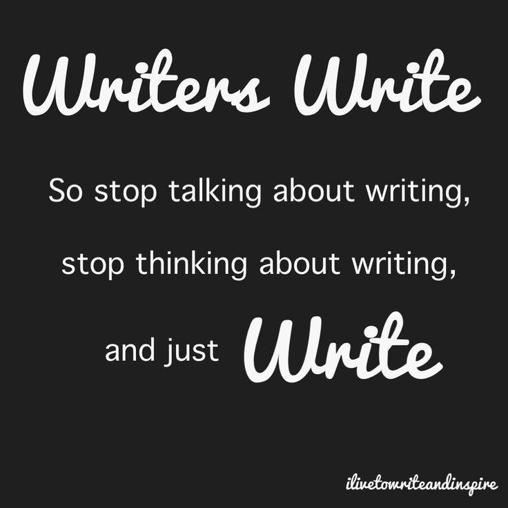

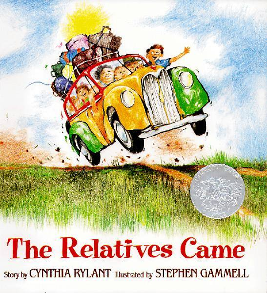

In a rainbow-coloured station wagon that smelt like a real car, the
relatives came. When they arrived, they hugged and hugged from the
kitchen to the front room. All summer they tended the garden and ate up
all the strawberries and melons. They plucked banjos and strummed
guitars. \
When they finally had to leave, they were sad, but not for long. They
all knew they would be together next summer

*Summer vacation carries with it a feel and texture all its own. This
book captures that mood, tone, and voice of these carefree days. When
relatives come we appreciate what's really important about families as
Cynthia Rylant relates this story about a time when relatives, young and
old, unite in hugs and laughter.*

Cynthia Rylant really describes the setting and takes the small moment
of the relatives' arrival and really makes it come to life!

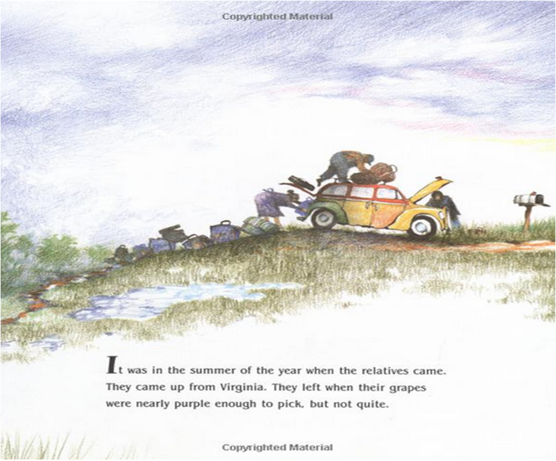

The way that Cynthia describes the setting provides the opportunity to
discuss different ways to use your senses to build a picture in the
reader\'s eye of the setting. It says, \"They had an old station wagon
that smelt like a real car.\"

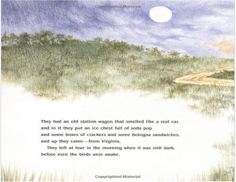

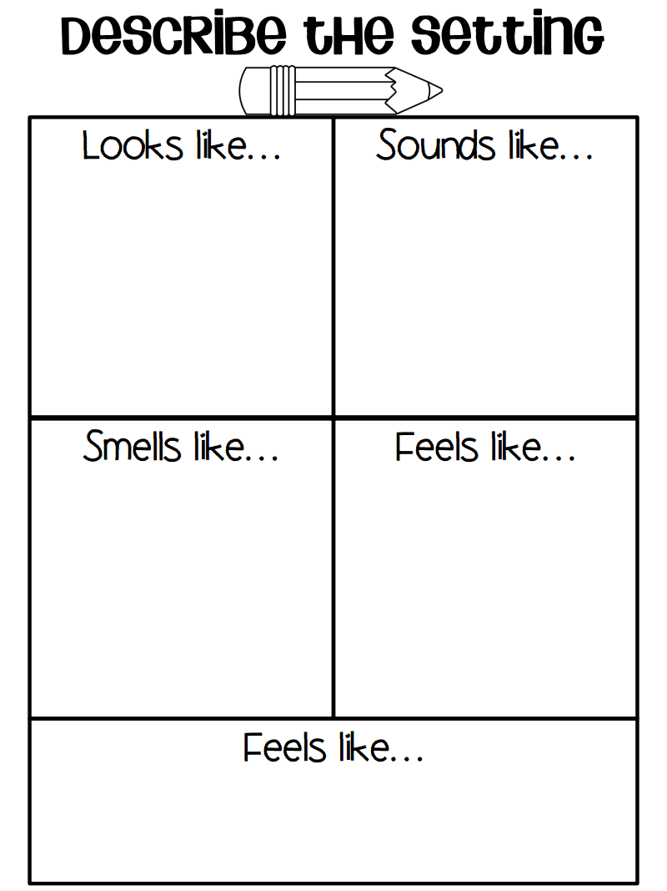

**The Relatives Came Cynthia Rylant**

It was in the summer of the year when the relatives came. They came up
from Virginia. They left when their grapes were nearly purple enough to
pick, but not quite. They had an old station wagon that smelt like a
real car, and in it they put an ice chest full of soda pop and some
boxes of crackers and some bologna sandwiches, and up they came -- from
Virginia.

They left at four in the morning when it was still dark, before even the
birds were awake. They drove all day long and into the night, and while
they travelled along they looked at the strange houses and different
mountains and they thought about their almost purple grapes back home.
They thought about Virginia -- but they thought about us, too. Waiting
for them.

So they drank up all their pop and ate up all their crackers and
travelled up all those miles until finally they pulled into our yard.
Then it was hugging time. Talk about hugging! Those relatives just
passed us all around their car, pulling us against their wrinkled
Virginia clothes, crying sometimes. They hugged us for hours.

Then it was into the house and so much laughing and shining faces and
hugging in the doorways. You'd have to go through at least four
different hugs to get from the kitchen to the front room. Those
relatives!

And finally after a big supper two or three times around until we all
got a turn at the table, there was quiet talk and we were in twos and
threes through the house.

The relatives weren't particular about beds, which was good since there
weren't any extras, so a few squeezed in with us and the rest slept on
the floor, some with their arms thrown over the closest person, or some
with an arm across one person and a leg across another. It was
different, going to sleep with all that new breathing in the house.

The relatives stayed for weeks and weeks. They helped us tend the garden
and they fixed any broken things they could find. They ate up all our
strawberries and melons, then promised we could eat up all their grapes
and peaches when we came to Virginia. But none of us thought about
Virginia much. We were so busy hugging and eating and breathing
together.

Finally, after a long time, the relatives loaded up their ice chest and
headed back to Virginia at four in the morning. We stood there in our
pyjamas and waved them off in the dark.

We watched the relatives disappear down the road, then we crawled back
into our beds that felt too big and too quiet. We fell asleep.

And the relatives drove on, all day long and into the night, and while
they travelled along they looked at the strange houses and different
mountains and they thought about their dark purple grapes waiting at
home in Virginia. But they thought about us, too. Missing them. And they
missed us.

And when they were finally home in Virginia, they crawled into their
silent, soft beds and dreamt about the next summer.

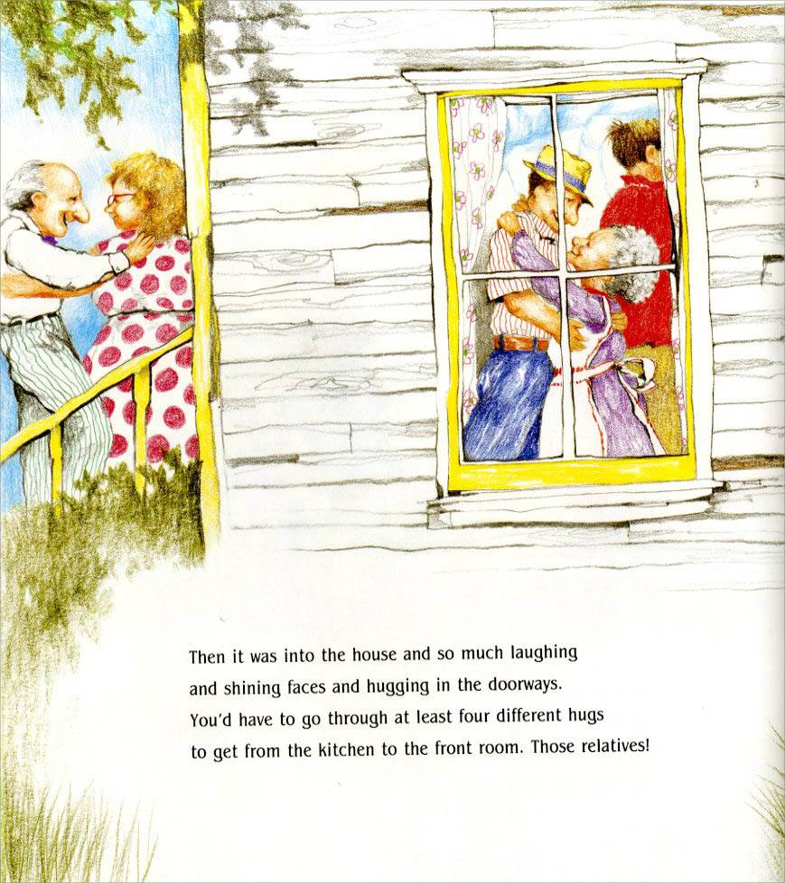

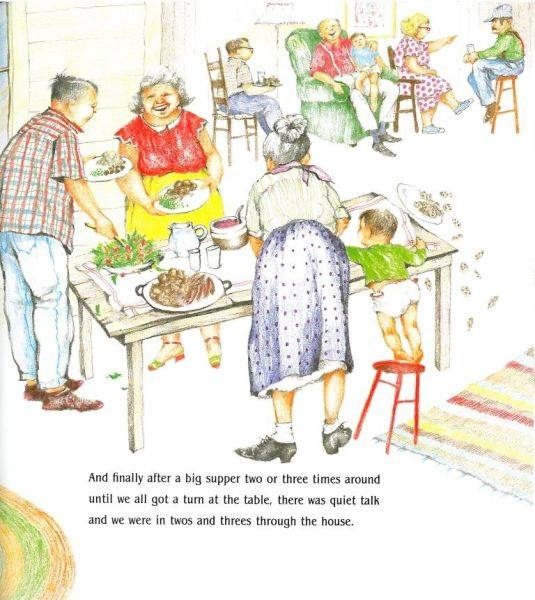

**Reading Strategies**

**Questioning**

Before:

Talk about relatives. Who qualifies as a relative? Discuss how sisters,
brothers, cousins, aunts, uncles, and other relatives are related.
Encourage the children to describe their own extended families, or other
large families that they know.

During:

Who are the main characters?

What can you tell me about the setting?

Is there a problem in the story?

At the beginning, we see the relatives packing up and getting ready to
visit or travel to a different place. They live in Virginia, but our
story does not tell us where they are going to visit.

What do the relatives mean when they say, "They left when their grapes
were nearly purple enough to pick, but not quite."

What is going on in the middle of the story? A lot of hugging. Do you
think they really care about each other? How can you tell?

How did the story end?

After:

If you had relatives like these, how could you make the world a better
place? Turn and Talk.

How long did the relatives stay? What did they mainly do during their
visit?

Text-to-Self **connections.**

**Retelling** - prompts if necessary

Beginning

Who came to visit?

Where do they live?

What did they bring with them?

What time of day did they leave at?

Did they travel far?

What time of year was it?

Middle

What happened when the relatives arrived?

What did they do during their stay?

Where they happy? How could you tell?

Did they stay long?

End

Where did the relatives go?

Did it take them a long time to get home?

What did they see on their way home?

What did they do when they got home?

**Vocabulary**

Tier 2 Words Selected

tend relatives squeeze particular

wrinkled silent

**Writing**

**Personal connections and story ideas.**

Connections can be used for Writer's Notebook entries.

'Rehearse' or tell your idea for writing today. Turn and talk, taking

turns sharing. After you have told your story you will be ready to start
writing.

Children write about a time when they stayed at their relatives for an
extended period, or a time when relatives stayed with them for a long

time. Was it a special occasion, perhaps a holiday? How long did they
stay? What was the experience like?

Opportunity for small moment writing. E.g.

Visiting family can be an enjoyable time, but problems can occur too!
What are some problems that arise in the book (not enough room in the
house, hard to sleep next to so many people, etc.)? Have children talk
about a time when similar problems occurred in their experience. What
did the family do about it?

There are many reasons why a family might get together. What are some
reasons families get together? (birthdays, holidays, reunions, etc).
What do these events mean? Why are they important?

**Let the Celebrations BEGIN!**

Written by Margaret Wild

Illustrated by Julie Vivas

*The optimistic voice of children is what may strike you as you read
this book. Tough they are harboured in a Nazi concentration camp where
survival is an everyday struggle, the children make toys out of the bits
of life they find around them -- old yarn, rags, thread, remembrances of
their old lives. They understand, with an intuition that only children
have, that liberation is near and a return to life is just around the
corner. The children tell about and celebrate their dreams of a new life
as they spend their last days in the camp. This is a poignant text that
speaks honestly from the first word to the last.*

*Ruth Culham*

Aim: Creating meaning -- gaining information.

Discussion: Before, during and after reading.

Before Reading

- What does the cover tell us about the possibilities in the story?

  - People (haircuts)

  - Clothes

  - Toys

Or

List what you see on the front cover. Write several sentences about your
thoughts.

- Introduction: Genre- explanation

> *"A small collection of stuffed toys has been preserved which were
> made by Polish women in Belsen for the first children's party held
> after the liberation."*
>
> What further information does the illustration on the introduction
> page give?
>
> Why has the author used the explanation genre?
>
> \- retelling historical events.
>
> Clarifying -- Belsen

- concentration camp

- liberation

> (Research or teacher/pupil information)
>
> During/After Reading

- List questions you have.

- Look closely at the pictures

If students are reading the story independently they can write their
questions on post-its or in their Literature Response Journals.

- Discussion in groups or whole class.

Discuss the use of the three genres used in the book.

- Explanation in introduction.

- Narrative in present tense.

- Personal recount in past tense.

Why has the author done this?

How do the illustrations help the story?

Discuss the theme of the story.

Retell the story from the perspective of old Jacoba.

Compare this book to *Rose Blanche*.

**Let the Celebrations BEGIN! Margaret Wild**

***A small collection of stuffed toys has been preserved which were made
by Polish women in Belsen for the first children's party held after the
liberation. From Antique Toys and their Background by G.White***

**We are planning a party, a very special party, the women and I. My
name is Miriam, and this is where I live. Hut 18, bed 22.**

**This is my best friend, Sarah, and this is David. He is only four. See
him there in the corner with his mama's old black shawl. See his hungry
eyes and his legs. His legs! The chickens running in our yard were
fatter.**

**Chickens! It is years since I chewed on a chicken leg. Back then, I
didn't like the skin or fat. Now I would gobble it all up -- skin, fat
and bones. I would lick the plate and pull the wishbone and make sure
David had second helpings, third helpings, fourth helpings of
everything!**

**Sarah and David say to me, "Tell us again, Miriam, tell us about your
teddy bear with the squeak in the middle. Tell us about your doll that
has eyes that blink. Tell us about your soft pink elephant that sits on
the windowsill, and the owl that swings from the ceiling."**

**So I tell them. Sarah stares at me, and David hugs his mama's old
black shawl, and I run away to be on my own, because I know Sarah and
David want a toy more than anything else in the world. And in this place
there are no toys.**

**That is why we are planning a party, a very special party, the women
and I. When the soldiers come to set us free- and they are coming soon,
everyone says so! -- they will open the gates. And for dinner we will
cook chickens -- chickens for everyone! -- and each child in the hut
will get a toy. A toy of their own.**

**We are making the toys now, the women and I. We are collecting bits
and pieces. Scraps pf material, rags, tiny strands of thread, wool,
anything. And we shall make toys -- incredible toys! -- the women and
I.**

**Old Jacoba says we are mad. 'Why do you worry about toys?" she scolds.
"We are starving, *dummkopfs*. It is food we need, not your foolish
toys."**

**But we laugh at her, the women and I. And we go on begging buttons and
torn pockets, because there is nothing we can do about the food. There
*is* no food. But we can make toys. And we shall. In the end, old Jacoba
gives us the back of her jumper and goes off grumbling that it will be
our fault if she gets rheumatism in her back this winter.**

**But we shrug and smile because we know we won't still be in the camp
this winter. The soldiers are coming soon -- everyone says so! -- and we
must be ready, the women and I, for our party, our very special party.**

**We are cutting and sewing, all of us, every night while the guards
sleep. Even old Jacoba is helping. She has given us the right sleeve of
her jumoer, and she says it will be our fault -- oh yes! -- if she gets
rheumatism in her right arm this winter.**

**But we still don't have enough material! So now we are cutting up our
own clothes. My skirt is getting shorter and shorter. David is puzzled.
He thinks my legs are growing longer and longer, remarkably fast.**

**Sarah scowls. She knows we have a secret, the women and I, and she
says she hates me, she will never speak to me again. But I can't tell
her, not yet, not until I have finished making her an elephant that will
one day sit on the windowsill of her new home...**

**They are here! Everyone, everyone, the soldiers are here! See their
guns and their tanks and the big gates swinging open!**

**David peeps at the soldiers through his mama's old black shawl, and
the soldiers stare back at us, oh, so strangely, making soft noises in
their throats. They seem afraid to touch us -- it's as if they think we
might break. Then old Jacoba shuffles forward and demands a cooked
chicken -- all to herself! -- and the soldiers laugh and one of them
swings David up onto his shoulders.**

**That night at our party, our very special party, the women and I bring
out the toys.**

**David wraps up his special owl in his mama's old black shawl. Sarah
hugs her funny patchwork elephant and vows to keep it always on her
windowsill. And old Jacoba tells everyone, very loudly, that she donated
her whole jumper -- yes! -- the back of it, the front, and both sleeves,
so that these dear children could have toys.**

**The women and I wink at one another and pass old Jacoba another
helping of chicken soup -- and so the celebrations begin!**

***Suddenly...we heard the sound of rolling tanks. We were convinced
that the Germans were about to blow up the camp. But then...we heard a
loud voice say in German: "Hello, hello, you are free! We are British
soldiers, and we came to liberate you!"***

***We ran out of the barracks and saw...a British army car with a
loudspeaker on top going through the camp and repeating the same message
over and over again. Within minutes, hundreds of women stopped the car,
screaming, laughing, and crying, and the British soldier was crying with
us.***

***Recollection of Dr Hadassah Rosensaft***

Text: Ian McEwan Illustrations: Roberto Innocenti

A young German girl watches as the streets of her town fill with
soldiers and tanks. Then, one day, she follows a truck into the woods
and discovers a terrible secret.

How true is the story of Rose Blanche?

While Rose Blanche is a fictional character within a fictional story,
Roberto Innocenti was very careful to use accurate historical detail in
his illustrations. The activities aim to guide pupils towards the
conclusion that although the story itself is untrue, the events, places
and characters it depicts are firmly rooted in historical reality giving
it \"a ring of truth\" as a work of fiction.

Rose Blanche was the name of a group of young German citizens who, at
their peril, protested against the war. Like them, Rose observes all the
changes going on around her which others choose to ignore. She watches
as the streets of her small German town fill with soldiers. One day she
sees a little boy escaping from the back of a truck, only to be captured
by the mayor and shoved back into it. Rose follows the truck to a
desolate place out of town, where she discovers many other children,
staring hungrily from behind an electric barbed wire fence. She starts
bringing the children food, instinctively sensing the need for secrecy,
even with her mother. Until the tide of the war turns and soldiers in
different uniforms stream in from the East, and Rose and the imprisoned
children disappear\...

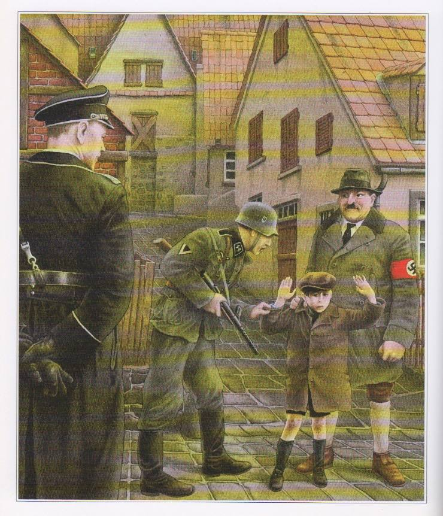

Inferring:

What do you think happened to Rose Blanche?

Could you do what Rose Blanche did?

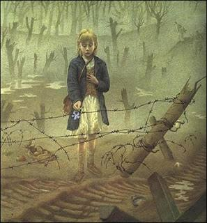

Oddly, Roberto Innocenti, the illustrator\'s name is written before the
much famous Ian McEwan (at least for the English audience). It goes to
show the importance of the illustrations in this book. Roberto
Innocenti\'s illustrations are magical. The war is distant and the only
pictures of war that we see are how Rose views them. The illustration
(the centre spread) where Rose lays her eyes on a group of kids in
striped pyjamas interred behind barbed wires with Star of David
prominently displayed is poignant. There is no life in the eyes of kids
behind the barbed wires and their eyes are marked with just simple dark
spots.

There is another illustration that shows Rose crossing over a bricked
bridge with reflections in the water below. It sounds straightforward so
far, but something is unsettling about the whole scenery. It becomes
more clear when we watch more closely the reflection in the water -
presence of barbed wires in the water. Where did this reflection come
from? Is it something hanging around the village that no one has cared
to notice? Does it illustrate the fate of the girl or does it illustrate
the dangers that she is going to face?

**Rose Blanche by Roberto Innocenti**

My name is Rose Blanche. I live in a small town in Germany with narrow
streets, old fountains and tall houses with pigeons on the roofs. One
day the first truck arrived and many men left. They were dressed as
soldiers. Winter was beginning.

Now the trucks follow each other under the school windows. They are full
of soldiers we don't know, but they wink at us. They drive tanks that
make sparks on the cobblestones. They are so noisy and smell like diesel
oil. They hurt my ears and I have to hold my nose when they pass by.

Sometimes it seems things haven't really changed. But my mother wants me
to be careful crossing the street between all the trucks. She says
soldiers won't slow down. Lot of times I walk by the river, just looking
at it. Branches float along and sometimes old, broken toys. I like the
colour of the river. It looks like the sky.

The trucks are fun to watch. We stand in the doorway as they pass. We
don't know where they're going. But we think they're going someplace on
the other side of the river. One day one of them stopped so the soldiers
could repair the engine. A little boy jumped from the back of the truck
and tried to run away. But the mayor was standing there in the middle of
the street.

He grabbed the little boy by the collar and brought him back to the
truck. Then he smiled at the soldiers without speaking. And they thanked
him. The sky was grey. The soldiers climbed back into the truck; door
banged shut and it pulled away. It happened very fast.

I wanted to know where the little boy went. So I watched the truck until
it disappeared around the corner. The street was crowded. Kids were
playing. There were bicycles and farmer's tractors all over. It was
noisy just like every day when school is out. But I walked on the
sidewalk ignoring everyone-and no one saw me.

I walked for a long time, past the edge of town into the open fields,
where I had never been. The clouds were grey. Everything was frozen.
Sometimes I ran. I followed the tracks into the forest and found a
clearing.

Suddenly, electric barbed wire stopped me. Behind it there were some
children standing still. I didn't know any of them. The youngest said
they were hungry. Since I had a piece of bread, I carefully handed it to
them through the pointed wires. They all stood in front of long wooden
houses. The sun was setting behind the hills. It was windy. I was cold.

Weeks passed by in the pale winter. Rose Blanche's appetite surprised
her mother: she took more to school than she ate at home. All the bread
and butter she could carry; even more jam and apples from the cellar.
Rose Blanche was getting thinner. In town, only the mayor was staying
fat. Everyone watched everyone else. Rose Blanche hid her food in her
school bag and sneaked out of school early.

By now she knew the road by heart. There were more children by the
wooden houses, and they were also getting thinner behind the barbed wire
fence. Some of them had a star pinned on their shirts. It was bright
yellow. When the snow melted and the streets were very muddy, the trucks
full of weary soldiers drove only at night. This time in the other
direction. They were coming with no lights on from the far side of the
river, and they never stopped.

One morning all the people of the town fled, carrying pots and burlap
bags and chairs. There were soldiers among them. Some had torn uniforms.
Some were limping. Some were in pain and asking for water. Rose Blanche
disappeared that day. She had walked into the forest again.

Fog had erased the road. Rose Blanche was hopping around the mud puddles
to keep her shoes clean. In the middle of the woods, the clearing had
changed. It was empty. Rose Blanche dropped her school bag full of food.
She stood still. Shadows were moving between the trees. It was hard to
see them. Soldiers saw the enemy everywhere. There was a shot.

At that moment in town, some other soldiers arrived. Their trucks and
their tanks were also noisy, and they smelt like diesel oil. But their
uniforms were a different colour. And they spoke a different language.

Rose Blanche's mother waited a long time for her little girl. The
crocuses finally sprang up from the ground. The river swelled and
overflowed its banks. Trees were green and full of birds. Spring sang.

**Rose Blanche Ian McEwan**

When wars begin people often cheer. The sadness comes later. The men
from the town went off to fight for Germany. Rose Blanche and her mother
joined the crowds and waved them good-bye. A marching band played,
everyone cheered, and the fat mayor made a boring speech.

There were jokes and songs and old men shouted advice to the young
soldiers. Rose Blanche was shivering with excitement. But her mother
said it was cold. Winter was coming.

Then there were lorries grinding through the narrow streets day and
night, and lumbering tanks made sparks on the cobblestones. The noise
was fantastic. The soldiers in the lorries sang songs. They smiled and
winked at the children as if they were old friends. The children always
waved back.

Rose Blanche often went shopping for her mother. There were long queues
outside the shops, but no one grumbled. Everybody knew that food was
needed for the soldiers who were always hungry.

Many things did not change at all. Rose Blanche still played with her
friends. She did her homework after supper and went to school early in
the morning with her lunch in her satchel.

And when school was over, she walked her favourite way home, along the
river. At home her mother was always waiting for her with a hot drink.

Nobody knew where all the lorries were going. But people in the town
talked about them. Some said they were going to a place just outside the
town.

One day a lorry broke down. Rose Blanche saw two soldiers trying to
repair the engine. Suddenly a little boy leapt from the back of the
lorry and ran down the street.

A soldier shouted, "Stop or I'll shoot!"

The boy ran straight into the arms of the fat mayor.

The mayor was immensely pleased with himself. He dragged the boy by the
scruff of the neck back to the lorry.

One of the soldiers was furious and shouted at the boy who burst into
tears. The boy was thrown back into the lorry. Rose Blanche saw other
pale faces in the gloom, when the door banged shut and the lorry drove
away in a cloud of diesel fumes.

Rose Blanche was furious at the way they had treated the little boy.
Where were they taking him? She followed the lorry right through the
town. She was a fast runner; she knew all the short-cuts. Winding
streets forced the lorry to go slowly.

She ran along rutted tracks, across fields, over ditches and frozen
puddles. She climbed under fences and barriers in places she wasn't
meant to go. Rose Blanche took a short-cut through the forest where bare
branches scratched her face. The road was below her, the lorry was a
long way ahead. She was so tired, she felt like giving up.

Then she stumbled into a clearing and could hardly believe what she saw.

Dozens of silent. motionless children stared at her from behind a barbed
wire fence. They hardly seemed to breathe.

Their eyes were large and full of sorrow. They stood like ghosts,
watching as she came close. One of them called for food, and others took
up the cry.

"Food, food, please be our friend. Please give us something to eat,
little girl."

But she had nothing to give them, nothing at all. The cries died down,
the silence returned. The winter sun was setting, the chilly wind made
the barbed wire moan. Rose Blanche turned for home. Their sad and hungry
eyes followed her into the forest.

Rose Blanche told no one, not even her mother, what she had seen. All
through the bitter winter she took extra food to school, jam and apples
from the cellar. And yet she was growing thinner all the time. At home
she secretly saved the food off her own plate.

In the town people were no longer patient when they waited in the
queues. No one had enough to eat except the mayor who was as fat as
ever.

Rose Blanche slipped away from school as early as she could and,
clasping her heavy bag, headed towards the forest.

The children were always waiting for her by the fence. When they took
the food, careful not to touch the electric wires, their thin hands
trembled.

Rose Blanche learnt their names, told them hers and told them all about
her school.

The children said little in reply. Huddled together, they stared through
the fence into the distance.

Even at night Rose Blanche made her journey to the forest. The snow was
melting now and the track was muddy.

Others travelling under the cover of dark -- soldiers, thousands of
them, exhausted, wounded, dispirited -- poured back through the town and
on into the night. There was no singing or waving now.

Then one morning the whole town decided to leave. people were
frightened. They carried bags, and furniture and pets, they loaded
wheelbarrows and carts. The mayor was one of the first to leave. He had
taken off the bright armband he had once been so proud of.

That was the day Rose Blanche disappeared. Her mother searched
frantically for her all over the emptying town. She asked everyone she
met if they had seen her daughter.

"She's probably with friends, ahead", they told her. " Don't worry. Pack
your bags and come with us."

Thick fog shrouded the forest and it was hard to find the way. Rose's
feet were muddy and frozen. Her clothes were torn, and at last she
arrived at her usual place.

She stood by the clearing as though in a dream. Everything was so
different it was hard to think clearly. Behind her were figures moving
through the fog. Tired and fearful soldiers saw danger everywhere.

As Rose Blanche turned to walk away, there was a shot, a sharp and
terrible sound which echoed against the bare trees.

Meanwhile there were different soldiers passing through the little town.
Their language was strange, their uniform unfamiliar, and though they
were tired, they were cheerful. The war was almost over.

Rose Blanche's mother never found her little girl.

As the weeks went by another, gentler invasion began. The cold
retreated, fresh grasses advanced across the land. There were explosions
of colour. Trees put on their bright new uniforms and paraded in the
sun. Birds took up their positions and sang their simple message.

Spring had triumphed.

# The White Rose Movement

The White Rose movement
opposed [Hitler](http://www.historylearningsite.co.uk/adolf_hitler.htm), [Nazi](http://www.historylearningsite.co.uk/Nazi%20Germany.htm) rule
and [World War
Two](http://www.historylearningsite.co.uk/WORLD%20WAR%20TWO.htm). The
White Rose movement is probably the most famous of the civilian
resistance movements that developed within Nazi Germany but some of its
members paid a terrible price for their stand against the system.

 

 

The White Rose movement was made up of students who attended Munich
University. Its most famous members
were [Hans](http://www.historylearningsite.co.uk/hans_schol.htm) and [Sophie](http://www.historylearningsite.co.uk/sophie_scholl.htm) [Scholl](http://www.historylearningsite.co.uk/sophie_scholl.htm).
Members of the White Rose movement clandestinely distributed anti-Nazi
and anti-war leaflets and it was while they were in the process of doing
this that they were caught.

 

 

Nazi Germany was a [police
state](http://www.historylearningsite.co.uk/nazi_police_state.htm).
Whether it was true or not, people believed that informants were
everywhere. To keep secrecy, membership of the White Rose movement was
extremely small. It produced anti-war leaflets that were also deemed to
be anti-Nazi. What those in it did was extremely dangerous. If they were
captured they would have been charged with treason with the inevitable
consequences. That is why the group had to be kept very small --
everyone knew each other and each was convinced of the loyalty of
everyone in the group.

 

 

The White Rose movement was active between June 1942 and February 1943.
In that time they made six anti-war/anti-Nazi leaflets, which were
distributed in public. Member also engaged in a graffiti campaign within
Munich.

 

 

One of the leaflets entitled "Passive Resistance to National Socialism"
stated:

 

 

"Many, perhaps most, of the readers of these leaflets do not see clearly
how they can practise an effective opposition. They do not see any
avenues open to them. We want to try to show them that everyone is in a
position to contribute to the overthrow of the system. It can be done
only by the cooperation of many convinced, energetic people -- people
who are agreed as to the means they must use. We have no great number of
choices as to the means. The only one available is passive resistance.
The meaning and goal of passive resistance is to topple National
Socialism, and in this struggle we must not recoil from any course, any
action, whatever its nature. A victory of fascist Germany in this war
would have immeasurable frightful consequences. We cannot provide each
man with the blueprint for his acts, we can only suggest them in general
terms. Sabotage in armaments plants and war industries, at all
gatherings, rallies and organisations of the National Socialist
Party................convince all your acquaintances of the hopelessness
of this war..................and urge them to passive resistance."

 

 

Another leaflet was called "To the fellow fighters in the resistance",
which was written in February 1943, after the German defeat at
Stalingrad.

 

 

"The day of reckoning has come -- the reckoning of German youth with the
most abominable tyrant our people have ever been forced to endure. We
grew up in a state in which all free expression of opinion is ruthlessly
suppressed. The [Hitler
Youth](http://www.historylearningsite.co.uk/hitler_youth.htm), the SA,
the SS have all tried to drug us, to regiment us in the most promising
years of our lives. For us there is but one slogan: fight against the
party. The name of Germany is dishonoured for all time if German youth
does not finally rise, take revenge, smash its tormentors. Students! The
German people look to us."

 

 

It was while leaflets were being distributed at Munich University that
Hans and Sophie Scholl were arrested by the Gestapo. They had already
distributed many White Rose leaflets that they were carrying. However,
Sophie and Hans realised that they had not distributed all of them. As
so much trouble was taken to produce these leaflets, they decided that
they would ensure that the rest were also distributed. They were seen
throwing the leaflets around the university's atrium by a caretaker
called Jakob Schmid and he contacted the Gestapo. This occurred on
February 18^th^ 1943. The Scholl's were literally carrying all the
evidence needed by the Gestapo.

 

 

Both Hans and Sophie admitted their full responsibility in an attempt to
end any form of interrogation that might result in them revealing other
members of the movement. However, the Gestapo refused to believe that
only two people were involved and after further interrogation, they
gained the names of all those involved who were subsequently arrested.

 

 

Sophie, Hans and Christoph Probst were the first to be brought before
the People's Court on February 22^nd^1943. The People's Court had been
established on April 24^th^ 1934 to try cases that were deemed to be
political offences against the Nazi state. Invariably these trials were
nothing more than show trials designed to humiliate those brought before
it, presumably in the hope that such a public humiliation would put off
anyone else whom might be thinking in the same way as the condemned. All
three were found guilty and sentenced to death by beheading. The
executions took place the same day.

 

 

More trials took place on April 19^th^ and July 13^th^ 1943 when other
members of the White Rose movement were brought before the People's
Court. Not all of them were executed. The third trial (July 13^th^) was
not presided over by the infamous Roland Freisler and the main witness
-- also on trial (Gisela Schertling) -- withdrew her evidence that she
had given during her interrogation. As a result, the judge acquitted all
of those on trial that day with the exception of one, Josef Soehngen,
who was given 6 months in prison.

 

 

Before World War Two in Europe ended, the final leaflet produced by the
White Rose movement was smuggled out of Germany and handed to the
advancing Allies. They printed millions of copies of it and dropped them
all over the country.  

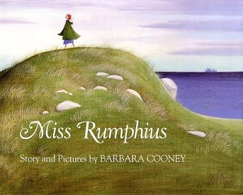

**Miss Rumphius Barbara Cooney**

What is our responsibility in the world? To Alice Rumphius, her
responsibility was to do something to make the world more beautiful. But
what does that mean to her and what does it mean to you? Making the
world a more beautiful place may seem like a big task, but small simple
gestures may have a bigger impact than you imagine. This book inspires
the reader to think of small ways to do something for the common good.
What will you do to make the world more beautiful?

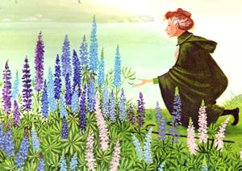

This is a story that tells about one person from when she is a child to
a very old woman. There are three things she wants to do in her life.

**Questioning:**

During Reading

What are the three things Miss Rumphius wants to do?

What job does she have? Where does she travel? How does she feel about
other people?

Connect: What do you think she will do to make the world beautiful? What
would you like to do to make the world beautiful in your lifetime?

After Reading

What does the young Alice at the end of the story say she wants to do in
her life?

Why do you think she wants to do the same thing as her great aunt?

Look at the final pictures of the children enjoying the company and
flowers of Miss Rumphius. What does that tell you about Miss Rumphius?

CONNECT: Although Miss Rumphius seems to be alone her whole life, she is
part of several different communities. What are the different
communities? What different communities do you belong to? (A community
is a group of people coming together for a common purpose or in a common
place.)

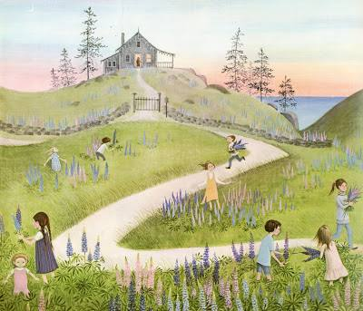

Making the World a More Beautiful Place

After listening to the story, students consider themselves as members of
a community and plan a project that improves their community/school.

## Miss Rumphius

## 

## Summary

By Jenna Caputo

Miss Rumphius' Grandfather tells her to make the world more beautiful.
She has difficulty coming up with a way to do this until she plants
Lupin and the wind carries the seeds. The next summer she travels,
spreading Lupin seeds. She presents the same challenge to her great
niece at the conclusion of the book.

## Guidelines for Philosophical Discussion

By Jenna Caputo

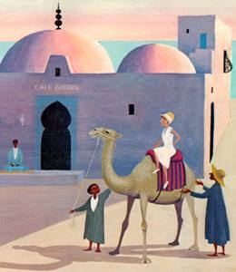

Every person has values, whether they know specifically what they are,
or whether they just live by them without realising it. Values in their
simplest form are our principals, or our judgment about what in life is
important. But how do we acquire these values? Miss Rumphius illustrates
two ways that this is possible: explicitly (listening to people) and
implicitly (observing people and following their example). The book
opens with Miss Rumphius sitting with her grandfather and being
enchanted by his life story. She decides because of the example that he
set, that she too wants to travel to faraway places and live by the sea.
He tells her that she must also make the world more beautiful, but
doesn't tell her how.

Miss Rumphius raises questions concerning what it means to make the
world more beautiful. Student will be quick to bring up things that are
physically beautiful, but will hopefully get to a point where they can
figure out what is essential to their beliefs about what makes something
beautiful. This leads us to the next question set: the nature of beauty.
Philosophically, there are a number of issues. First, are there
objective features of something that make it beautiful or is beauty, as
they say, in the eye of the beholder? In addition, there are many
questions about whether beauty is culturally determined or not.

The next question set deals with family values. Students will be anxious
to share what is important in their family and there will be great
variety in their responses. Some philosophers believe that each person
has a filial duty, while others do not.

Prominent in this book is the topic of what gives a life meaning, which
by its nature is very personal. After exploring the possibilities
through firsthand life experiences a person must decide what their mark
will be on the world will be. This is probably why the characters in
Miss Rumphius found it so important to travel the world. It's a metaphor
for having a wide range of life experiences. The author believes that
through those life experiences we are in the best position to discover
some experience that enriches our lives and, if we are lucky, the lives
of others.

## Questions for Philosophical Discussion

By Jenna Caputo

**Topic: Making the World More Beautiful**

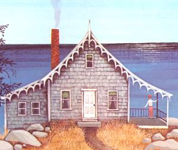

*Miss Rumphius' grandfather tells her that she must make the world more
beautiful*

1.  What does Miss Rumphius' grandfather do to make the world more
    beautiful?

2.  What does Miss Rumphius do to make the world more beautiful?

3.  Are their other ways to make the world more beautiful? Explain.

4.  Is there a right or wrong way to make the world more beautiful?

5.  Name something that you think is beautiful. What would you do to
    make it more beautiful?

6.  Does making something more beautiful make it better?

7.  Can you make a person more beautiful? Does that make a better
    person?

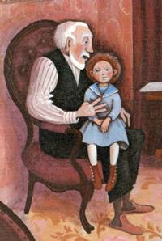

**Topic: Family Values**

*Miss Rumphius' grandfather gives her a duty, which she passes along to
her great niece*

1.  What did Miss Rumphius want to do just like her grandfather?

2.  What does Miss Rumphius' grandfather tell her that she must do?

3.  What is something that your parents have told you that you must do?
    Did you also think it was important, or did you just listen because
    they were your parents

4.  When you grow up, do you think it's still important to listen to
    your parents?

5.  Do you think that you have a responsibility to do absolutely
    everything you can to make sure that the desires of your family
    members are fulfilled?

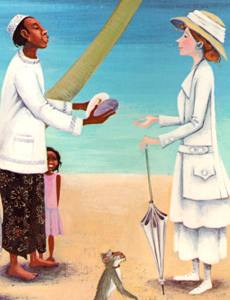

**Topic: The Nature of Friendship**

*When Miss Rumphius travels to Faraway places she meets many people who
become her friends*

1.  What does the Bapa Raja give to Miss Rumphius?

2.  Why did Miss Rumphius become friends with him?

3.  What do you like about the people who are your friends.

4.  Is it possible to be friends with somebody who you know you probably
    won't see again?

5.  What is it about a person that makes them your friend?

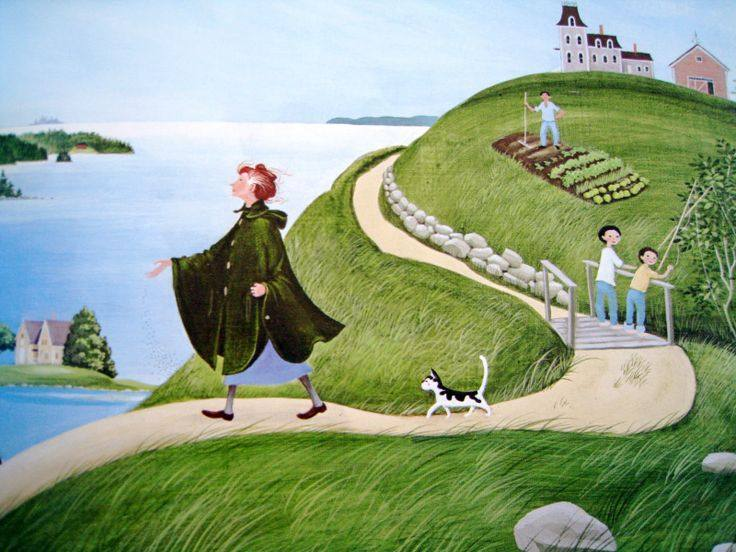

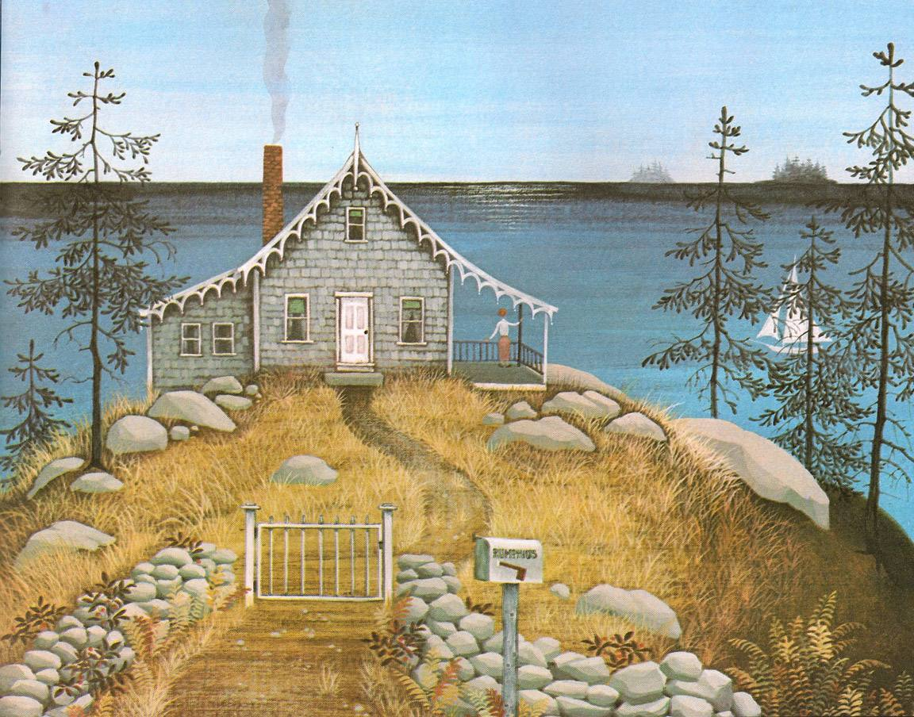

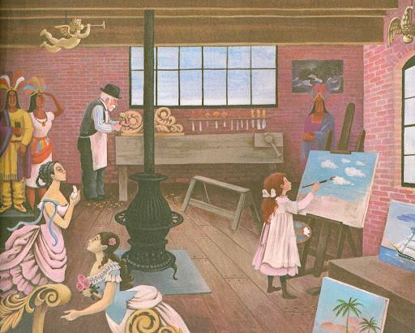

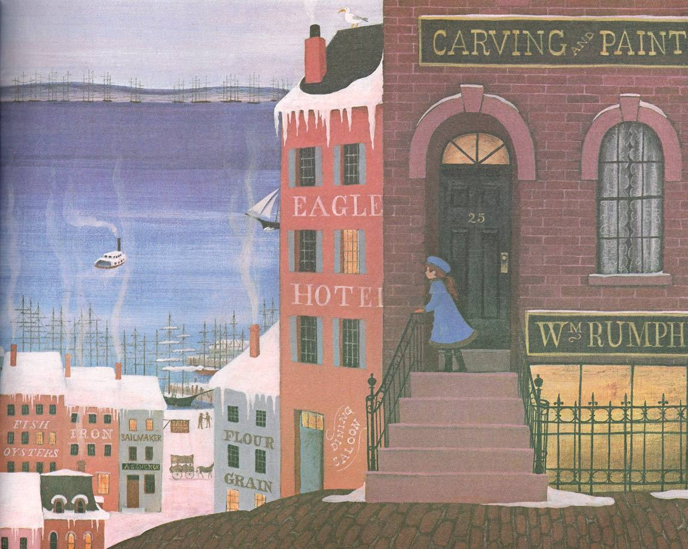

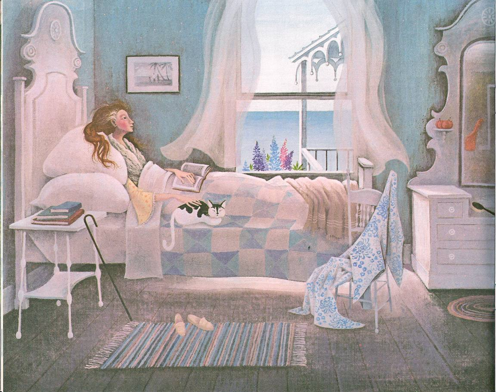

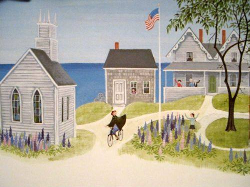

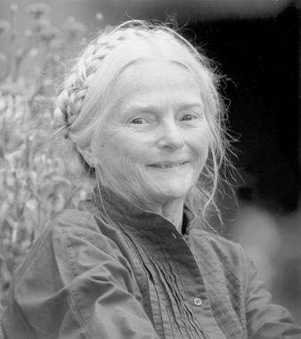

# Barbara Cooney\'s Obituary

(March 13, 2000. New York, NY) Barbara
Cooney, renowned children\'s book author and illustrator, died on
Friday, March 10 after a lengthy illness at Maine Medical Center in
Portland, Maine. Ms. Cooney was 83 years of age.

[Barbara Cooney](http://www.carolhurst.com/authors/bcooney.html) was
born in Room 1127 of the Hotel Bossert in Brooklyn, New York in 1917,
the daughter of Mae Bossert Cooney and Russell Schenck Cooney.
Throughout her long and internationally recognized career of sixty
years, Barbara Cooney has been at the forefront of the children\'s books
publishing industry. Her first book was published in 1940, and her 110th
book, *Basket Moon, *was published in September of 1999. A long-time
resident of Maine, her literary works have frequently focused on the
culture, history and society of her adopted state; her books [*Miss
Rumphius*](http://www.carolhurst.com/titles/missrumphius.html), *Island
Boy, Captain Pottle\'s House,* and *King of Wreck Island* are all set
there. Miss Cooney twice won the prestigious Caldecott Medal given by
the American Library Association for Best Illustrated Book of the Year,
first for her retelling of Chaucer\'s *Chanticleer and the Fox*, and
second, for [*Ox-cart
Man*](http://www.carolhurst.com/titles/oxcartman.html), written by famed
New England poet Donald Hall. She was honored with the American Book
Award for [*Miss
Rumphius*](http://www.carolhurst.com/titles/missrumphius.html), and over
the years she has received six major awards for her complete body of
work. She also was honored as the official United States Nominee for the
Hans Christian Andersen Medal \-- the children\'s book equivalent of
being nominated for a Nobel Prize. [*Miss
Rumphius*](http://www.carolhurst.com/titles/missrumphius.html) was named
a *New York Times* Best Illustrated Books of the Year in 1982.

After growing up on Long Island and spending cherished childhood summers
with her family in Maine, she took every course offered in studio art
and art history at Smith College. Miss Cooney\'s mother, herself an
artist, took her daughter\'s painting seriously, giving her the
encouragement she needed to make art a lifelong passion. After Barbara
Cooney graduated from college she knew she wanted to be an artist and
that she wanted to illustrate children\'s books. She studied briefly at
the Art Students League in New York City and began showing her portfolio
to publishers.

Her first book, *Ake and His World* (Farrar and Rinehart, 1940), by the
Swedish poet Bertil Malmberg, was published a year after graduation. The
same year, Farrar and Rinehart published *King of Wreck Island*, the
first book Miss Cooney both wrote and illustrated. She continued to
illustrate books written by other people as well as illustrating her own
texts.

Over the years, her books have been translated into ten languages \--
Finnish, Afrikaans, Japanese, Spanish, French, Swedish, Danish, German,
English, and Arabic \-- thereby teaching the children of the world the
culture, history and society of her beloved New England.

Miss Cooney\'s range of expression in her
art ran the gamut from superb scratchboard technique (*Chanticleer and
the Fox*) \-- a technique which is unforgiving of the most minor error
\-- to a style often referred to as \"early American primitive\" in
which she echoes the work of untrained New England limners who used flat
paint on wood with little or no perspective (*Emily* and [*Ox-cart
Man*](http://www.carolhurst.com/titles/oxcartman.html)). The apparent
simplicity of her art recreated the peaceful rhythms of
nineteenth-century rural New England, and this style is one she made her
signature style, returning to it again and again. Each of her books was
laboriously and extensively researched \-- from the magpie on the
pollarded willow representing an evil omen in Medieval times
(*Chanticleer and the Fox*) \-- to the extreme detail of the baptismal
gown which was actually worn by Eleanor Roosevelt at her baptism
in *Eleanor*. \"My goal,\" she said, \"is to make the past come alive
for children, to let them see it as it was, full of colour and activity,
and not as the static black-and-white photographs which history books
portray it.\"

\"Of all the books I have done,\" she says, \"[*Miss
Rumphius*](http://www.carolhurst.com/titles/missrumphius.html) (Viking,
1982), *Island Boy*(Viking, 1988), and *Hattie and the Wild
Waves* (Viking, 1990), are the closest to my heart. These three are as
near as I ever will come to an autobiography.\"

Barbara Cooney took her adopted state of Maine to her heart and Maine
returned the affection. In 1989, the Maine Library Association created
the Lupine Award, named for [*Miss
Rumphius*](http://www.carolhurst.com/titles/missrumphius.html), to
recognise outstanding children\'s books by state residents or to honour
authors whose chosen subjects were about Maine. Their opening ceremony
honoured [*Miss
Rumphius*](http://www.carolhurst.com/titles/missrumphius.html) and its
creator.

In addition to the Lupine Award named for her most famous character,
Barbara Cooney has received many other prestigious honors, including the
University of Southern Mississippi Children\'s Collection Medallion in
1975; the Smith College Award in 1976; the Keene State College of New
Hampshire Award in 1989; the Kerlan Award from the University of
Minnesota in 1992; and the New England Reading Association Award in
1992. Her books have repeatedly been named as American Library
Association Notable Books.

In December of 1996 Maine Governor Angus King honored Miss Cooney by
declaring her a \"Living Treasure of the State of Maine\" and proclaimed
\"Barbara Cooney Day\" in her honor. This recognition by her adopted
state gave her enormous pleasure.

Miss Cooney has been awarded four honorary
doctoral degrees \-- from Fitchburg State College in 1988; University of
Maine at Machias, 1994; Westbrook College in Portland, Maine in 1995;
and from Bowdoin College in 1996.

In December of 1997, Miss Cooney announced a Christmas gift of \$550,000
to her local library in Damariscotta, Maine. The gift was to be used, in
part, to raise other monies towards a new library complex on the
condition that the library remain in the downtown of the village. In
announcing the gift, she expressed the hope and desire that other people
would contribute funds at Christmas time to their local libraries. She
later increased her gift by another donation of \$300,000.
Groundbreaking for the new library will be in April, 2000.

Miss Cooney is survived by her husband, Dr. Charles Talbot Porter; four
children, Gretel Porter of Freeport, Maine, Barnaby Porter of
Damariscotta, Maine, Charles Talbot Porter, Jr of Puerto Williams,
Chile, and Phoebe Porter of Conway, Massachusetts. She is also survived
by two brothers, Daniel Cooney of Darien, Connecticut, and David Cooney
of Arlington Heights, Illinois. Also surviving are three grandchildren,
Shetu Nanday of West Bengal, India, Samuel Goldsmith of Los Angeles,
California, and Elijah W. Porter of Damariscott, Maine, and one
great-grandchild, Soraya Nanday or West Bengal, India.

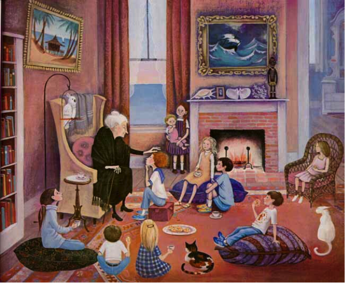

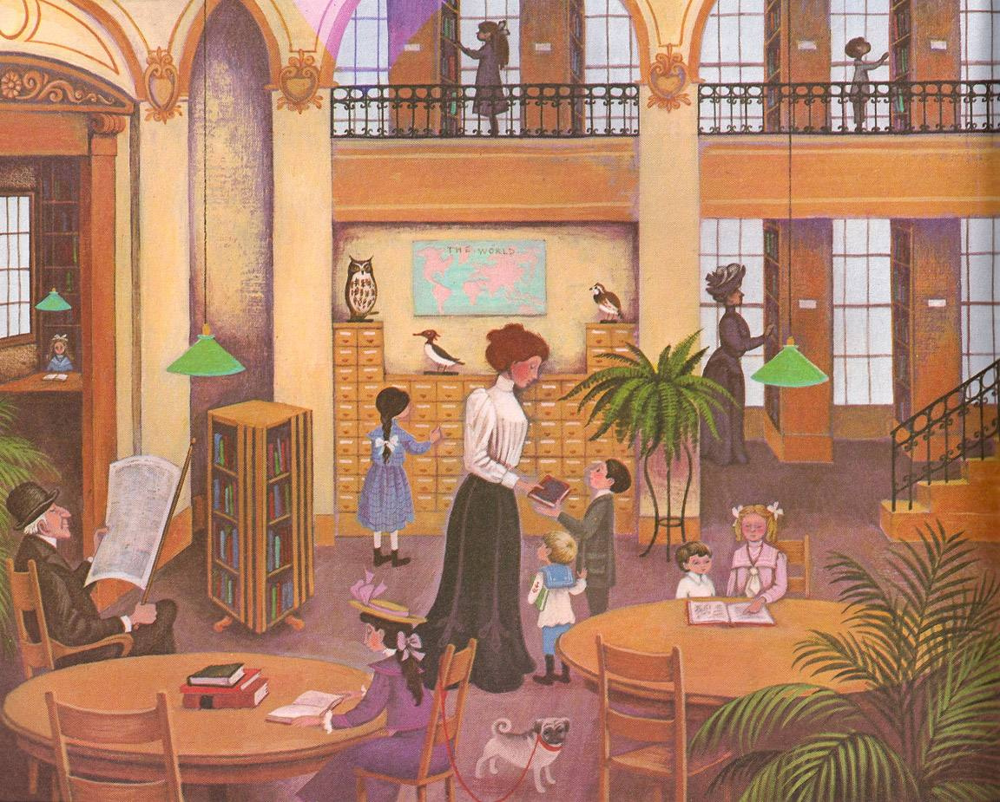

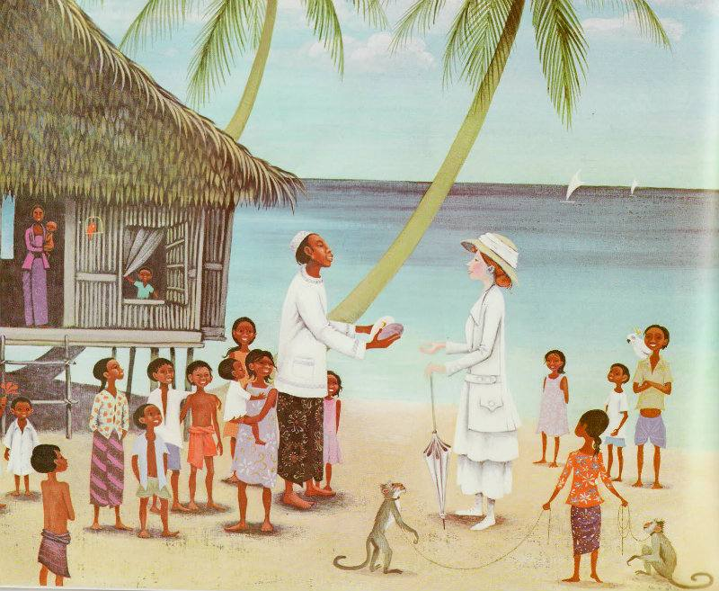

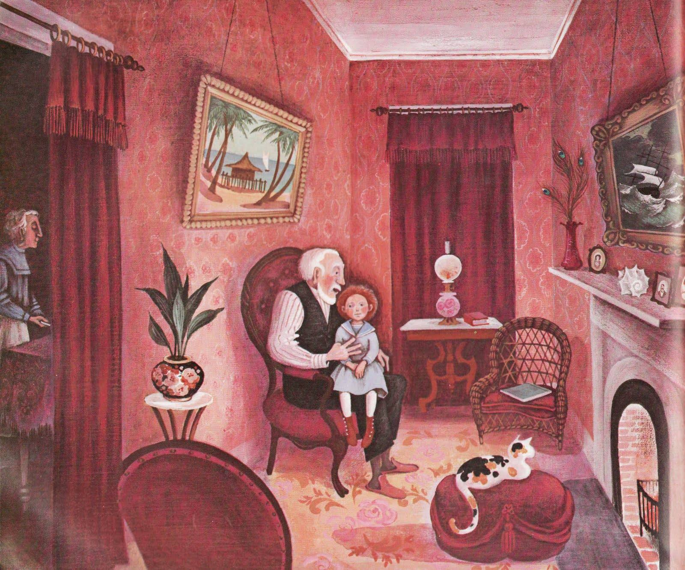

**Miss Rumphius Barbara Cooney**

The Lupin Lady lives in a small house overlooking the sea. In between
the rocks around her house grow blue and purple and rose-coloured
flowers, The Lupine Lady is little and old. But she has not always been
that way. I know. She is my great aunt, and she told me so.

Once upon a time she was a little girl named Alice, who lived in a city
by the sea. From the front stoop she could see the wharves and the
bristling masts of tall ships. Many years ago her grandfather had come
to America on a large sailing ship.

Now he worked in the shop at the bottom of the house, making figureheads
for the prows of ships, and carving Indians out of wood to put in front
of cigar stores. For Alice's grandfather was an artist. He painted
pictures, too, of sailing ships and places across the sea. When he was
very busy, Alice helped him put in the skies.

In the evening Alice sat on her grandfather's knee and listened to his
stories of faraway places. When he had finished, Alice would say, "When
I grow up, I too will go to faraway places, and when I grow old, I too
will live beside the sea."

"That is all very well, little Alice," said her grandfather, "but there
is a third thing you must do."

"What is that?" asked Alice.

"You must do something to make the world more beautiful," said her
grandfather.

"All right," said Alice. But she did not know what that could be.

In the meantime Alice got up and washed her face and ate porridge for
breakfast. She went to school and came home and did her homework.

And pretty soon she was grown up.

Then my Great-aunt Alice set out to do the three things she had told her
grandfather she was going to do. She left home and went to live in
another city far from the sea and the salt air. Then she worked in a
library, dusting books and keeping them from getting mixed up, and
helping people find the ones they wanted. Some of the books told her
about faraway places.

People called her Miss Rumphius now.

Sometimes she went to the conservatory in the middle of the park. When
she stepped inside on a wintry day, the warm moist air wrapped itself
around her, and the sweet smell of jasmine filled her nose.

"This is almost like a gtropical isle," said Miss Rumphius. "But not
quite.

So Miss Rumphius went to a real tropical island, where people kept
cockatoos and monkeys as pets. She walked on long beaches, picking up
beautiful shells. One day she met the Bapa Raja, king of a fishing
village.

"You must be tired," he said. "Come into my house and rest."

So Miss Rumphius went and met the Bapa Raja's wife. The Bapa Raja
himself fetched a green coconut and cut a slice off the top so that Miss
Rumphius could drink the coconut water inside. Before she left, the Bapa
Raja gave her a beautiful mother-of-pearl shell on which he had painted
a bird of paradise and the words, "You will always remain in my heart."

"You will always remain in mine too," said Miss Rumphius.

My great-aunt Miss Alice Rumphius climbed tall mountains where the snow
never melted. She went through jungles and across deserts. She saw lions
playing and kangaroos jumping. And everywhere she made friends she would
never forget. Finally she came to the Land of the Lotus-Eaters, and
there, getting off a camel, she hurt her back.

"What a foolish thing to do," said Miss Rumphius. "Well, I have
certainly seen faraway places. Maybe it is time to find my place by the
sea.

And it was, and she did.

From the porch of her new house Miss Rumphius watched the sun come up;
she watched it cross the heavens and sparkle on the water, and she saw
it set in glory in the evening. She started a little garden among the
rocks that surrounded her house, and she planted a few flower seeds in
the stony ground. Miss Rumphius was *almost* perfectly happy.

"But there is still one more thing I have to do," she said. "I have to
do something to make the world more beautiful."

But what? "The world already is pretty nice," she thought, looking out
over the ocean.

The next spring Miss Rumphius was not very well. Her back was bothering
her again, and she had to stay in bed most of the time.

The flowers she had planted the summer before had come up and bloomed
blue and purple and rose-coloured.

"Lupines," said Miss Rumphius with satisfaction. "I have always loved
lupines the best. I wish I could plant more seeds this summer so that I
could have still more flowers next year."

But she was not able to.

After a hard winter spring came. Miss Rumphius was feeling much better.
Now she could take walks again. One afternoon she started to go up and
over the hill, where she had not been in a long time.

"I don't believe my eyes!" she cried when she got to the top. For there
on the other side of the hill was a large patch of blue and purple and
rose-coloured lupines!

"It was the wind," she said as she knelt in delight. "It was the wind
that brought the seeds from my garden here! And the birds must have
helped!"

Then Miss Rumphius had a wonderful idea!

She hurried home and got out her seed catalogues. She sent off to the
very best seed house for five bushels of lupine seed.

All that summer Miss Rumphius, her pockets full of seeds, wandered over
fields and headlands, sowing lupines. She scattered seeds along the
highways and down the country lanes. She flung handfuls of them around
the schoolhouse and back of the church. She tossed them into hollows and
along stone walls.

Her back didn't hurt any more at all.

Now some people called her That Crazy Old Lady.

The next spring there were lupines everywhere. Fields and hillsides were
covered with blue and purple and rose-coloured flowers. They bloomed
along the highways and down the lanes. Bright patches lay around the
schoolhouse and back of the church. Down in the hollows and along the
stone walls grew the beautiful flowers.

Miss Rumphius had done the third, the most difficult thing of all!

My Great-aunt Alice, Miss Rumphius, is very old now. Her hair is very
white. Every year there are more and more lupines. Now they call her the
Lupine Lady. Sometimes my friends stand with me outside her gate,
curious to see the old, old lady who planted the fields of lupines. When
she invites us in, they come slowly. They think she is the oldest woman
in the world. Often she tells us stories of faraway places.

"When I grow up," I tell her, "I too will go to faraway places and come
home to live by the sea."

"That is all very well, little Alice," says my aunt, "but there is a
third thing you must do."

"What is that?" I ask.

""You must do something to make the world more beautiful."

"All right," I say.

But I do not know yet what that can be.

**\**

**A Bad Case of Stripes David Shannon**

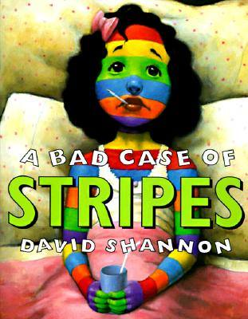

After she refuses to eat her lima beans, Camilla finds herself covered
with stripes. The stripes change into stars, polka dots, and other
patterns. Camilla overcomes her \"illness\" when she learns to be
herself.

+----------------------+---------------------------------------------+
| Craft                | Example                                     |
+======================+=============================================+
| Verbs                | screamed striped laughed squeezed jabbed    |
|                      | rushed sprouted vanished swirled huddled    |
|                      | whispered                                   |
+----------------------+---------------------------------------------+
| Words as well as     | ordered cried answered exclaimed asked      |
| 'said'               | sighed mumbled concluded groaned            |
+----------------------+---------------------------------------------+
| Contractions         | couldn't you're doesn't here's I'd we'll    |
|                      | didn't                                      |
|                      |                                             |
|                      | wasn't                                      |
+----------------------+---------------------------------------------+
| Striking words       | contagious distraction embarrassed          |
|                      | specialists                                 |
|                      |                                             |
|                      | scientific fungus blotches remedies         |
|                      | psychologists allergists herbalists         |
|                      | psychics guru veterinarian crystals         |
|                      | environmental therapist                     |
+----------------------+---------------------------------------------+
| Simile               | *just as plump and sweet as a strawberry.*  |
+----------------------+---------------------------------------------+

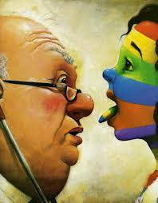

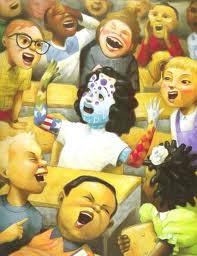

Using photographs with writing.

Students colour photos of themselves before writing their own
narratives/poetry.

Storyline online for a Read Aloud.

Listen to the voice of the author as a little girl is so concerned with
everyone\'s opinion of her that she stops being herself and instead
becomes whatever anyone calls her. 

**A Bad Case of Stripes David Shannon**

Camilla Cream loved lima beans. But she never ate them. All of her
friends hated lima beans, and she wanted to fit in. Camilla always
worried about what other people thought of her.

Today she was fretting even more than usual. It was the very first day
of school, and she couldn\'t decide what to wear. There were so many
people to impress! She tried on forty-two outfits, but none seemed quite
right. She put on a pretty red dress and looked in the mirror. Then she
screamed.

Her mother ran into the room, and she screamed, too. \"Oh my heavens!
You\'re completely covered with stripes!\" she cried. This was certainly
true. Camilla was striped from head to toe. She looked like a rainbow.

Mrs. Cream felt Camilla\'s forehead. \"Do you feel all right?\" she
asked.

\"I feel fine," Camilla answered, "but just look at me!\"

\"You get back in bed this instant," her mother ordered. "You\'re not
going to school today.\"

Camilla was relieved. She didn\'t want to miss the first day of school,
but she was afraid of what the other kids would say. And she had no idea
what to wear with those crazy stripes.

That afternoon, Dr. Bumble came to examine Camilla. \"Most
extraordinary!" he exclaimed. "I\'ve never seen anything like it! Are
you having any coughing, sneezing, runny nose, aches, pains, chills, hot
flashes, dizziness, drowsiness, shortness of breath, or uncontrollable
twitching?\"

\"No," Camilla told him. "I feel fine.\"

\"Well then," Dr. Bumble said, turning to Mrs. Cream, "I don\'t see any
reason why she shouldn\'t go to school tomorrow. Here\'s some ointment
that should help clear up those stripes in a few days. If it doesn\'t,
you know where to reach me.\" And off he went.

The next day was a disaster. Everyone at school laughed at Camilla. They
called her \"Camilla Crayon\" and \"Night of the Living Lollipop.\" She
tried her best to act as if everything were normal, but when the class
said the Pledge of Allegiance, her stripes turned red, white, and blue,
and she broke out in stars!

The other kids thought this was great. One yelled out, \"Let\'s see some
purple polka dots!\" Sure enough, Camilla turned all purple polka-dotty.
Someone else shouted, \"Checkerboard!\" and a pattern of squares covered
her skin. Soon everyone was calling out different shapes and colours,
and poor Camilla was changing faster than you can change channels on a
T.V.

That night, Mr. Harms, the school principal, called. \"I\'m sorry, Mrs.
Cream, I\'m going to have to ask you to keep Camilla home from school.
She\'s just too much of a distraction, and I\'ve been getting phone
calls from the other parents. They\'re afraid those stripes may be
contagious.\"

Camilla was so embarrassed. She couldn\'t believe that two days ago
everyone liked her. Now, nobody wanted to be in the same room with her.

Her father tried to make her feel better. \"Is there anything I can get
you, sweetheart?\" he asked.

\"No, thank you,\" sighed Camilla. What she really wanted was a nice
plate of lima beans, but she had been laughed at enough for one day.

\"Hmm, well, yes, I see," Dr Bumble mumbled when Mr Cream phoned the
next day. "I think I\'d better bring in the Specialists. We\'ll be right
over."

About an hour later, Dr. Bumble arrived with four people in long white
coats. He introduced them to the Creams. \"This is Dr. Grop, Dr. Sponge,
Dr. Cricket, and Dr. Young.\"

Then the Specialists went to work on Camilla. They squeezed and jabbed,
tapped and tested. It was very uncomfortable.

\"Well, it\'s not the mumps,\" concluded Dr Grop.

\"Or the measles,\" said Dr Sponge.

\"Definitely not chicken pox,\" put in Dr Cricket.

\"Or sunburn,\" said Dr Young.

"Try these," said the Specialists. They each handed her a bottle filled
with different colored pills.

"Take one of each before bed,\" said Dr Grop

Then they filed out the front door followed by Dr. Bumble.

That night, Camilla took her medicine. It was awful. When she woke up
the next morning, she did feel different, but when she got dressed, her
clothes didn\'t fit right. She looked in the mirror, and there, staring
back at her, was a giant, multi-colored pill with a face on it.

Dr. Bumble rushed over as soon as Mrs. Cream called. But this time,
instead of the Specialists, he brought the Experts.

Dr. Gourd and Mr. Mellon were the finest scientific minds in the land.
Once again, Camilla was poked and prodded, looked at and listened to.
The Experts wrote down lots of numbers. Then they huddled together and
whispered.

Dr. Gourd finally spoke, \"It might be a virus,\" he announced with
authority. Suddenly, fuzzy little virus balls appeared all over Camilla.

\"Or possibly some form of bacteria," said Mr. Mellon. Out popped
squiggly little bacteria tails.

\"Or it could be a fungus,\" added Dr. Gourd. Instantly, Camilla was
covered with different colored fungus blotches.

The experts looked at Camilla, then each other. \"We need to go over
these numbers again back at the lab," Dr Gourd explained. "We'll call
you when we know something,\" But the Experts didn\'t have a clue, much
less a cure.

By now, the T.V. news had found out about Camilla. Reporters from every
channel were outside her house, telling the story of \"The Bizarre Case
of the Incredible Changing Kid.\"

Soon a huge crowd was camped out on the front lawn.

The Creams were swamped with all kinds of remedies from psychologists,
allergists, herbalists, nutritionists, psychics, an old medicine man, a
guru, and even a veterinarian. Each so-called cure only added to poor
Camilla\'s strange appearance until it was hard to even recognise her.
She sprouted roots and berries and crystals and feathers and a long
furry tail. But nothing worked.

One day, a woman who called herself an Environmental Therapist claimed
she could cure Camilla. \"Close your eyes," she said. "Breathe deeply,
and become one with your room.\"

\"I wish you hadn\'t said that,\" Camilla groaned. Slowly, she started
to melt into the walls of her room. Her bed became her mouth, her nose
was a dresser, and two paintings were her eyes. The therapist screamed
and ran from the house.

\"What are we going to do?" cried Mrs. Cream. "It just keeps getting
worse and worse!\" She began to sob.

At that moment, Mr. Cream heard a quiet little knock at the front door.
He opened it, and there stood an old woman who was just as plump and
sweet as a strawberry. \"Excuse me," she said brightly. "But I think I
can help.\"

She went into Camilla\'s room and looked around. \"My goodness," she
said with a shake of her head. " What we have here is a bad case of the
stripes. One of the worst I\'ve ever seen!\" She pulled a container of
small green beans from her bag. "Here," she said. "These might do the
trick.\"

\"Are those magic beans?\" asked Mrs. Cream.

\"Oh my, no," replied the kind old woman. "There\'s no such thing. These
are just plain old lima beans. I\'ll bet you\'d like some, wouldn\'t
you?" she asked Camilla.

Camilla wanted a big, heaping plateful of lima beans more than just
about anything, but she was still afraid to admit it.

\"Yuck!" she said. "No one likes lima beans, especially me!\"

\"Oh, dear," the old woman said sadly. "I guess I was wrong about you.\"
She put the beans back in her bag and started towards the door.

Camilla watched the old woman walk away. Those beans would taste so
good. And being laughed at for eating them was nothing, compared to what
she\'d been going through. She finally couldn\'t stand it.

\"Wait!" she cried. "The truth is\...I really love lima beans.\"

\"I thought so,\" the old woman said with a smile. She took a handful of
beans and popped them into Camilla's mouth.

\"Mmmmmmm,\" said Camilla.

Suddenly the branches, feathers, and squiggly tails began to disappear.
Then the whole room swirled around. When it stopped, there stood
Camilla, and

everything was back to normal.

\"I\'m cured!\" she shouted.

\"Yes," said the old woman. "I knew the real you was in there
somewhere.\" She patted Camilla on the head. Then she went outside and
vanished into the crowd.

Afterward, Camilla wasn\'t quite the same. Some of the kids at school
said she was weird, but she didn\'t care a bit. She ate all the lima
beans she wanted, and she never had even a touch of stripes again.

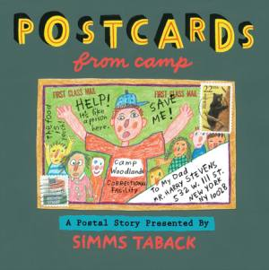

**Postcards From Camp Simms Taback**

Michael is \"forced\" by his dad to go to camp and has no problem
letting him know exactly how he feels about counsellor, the frogs, the
rain, etc. Of course dad is patient and answers each letter from camp
with a positive message. Use the letters back and forth between dad and
son to study the voice of the characters.

Michael's summer seems off to a miserable start when he sends his father
a postcard from camp, exclaiming, "I HATE camp! Come get me!
P-L-E-A-S-E. My counsellor is an alien, and a vegetarian." Instead of
rescuing his son, Michael's father, Harry, deliberately ignores the
complaints and replies with his own postcard: "Hiya Michael, Aren't you
the lucky one to be at camp? . . . Sorry you had to take the bus, but I
hope the ride was fun. I wish I could have taken you in our car. I hope
to get it repaired soon." So begins a hysterical correspondence between
father and son, chronicling the evolution of Michael's summer camp
experience. Caldecott Award-winning illustrator and author Simms Taback
is back with a vibrant and clever interactive picture book. With the
exception of a brief prelude and epilogue, the entire story is told
through postcards and letters, some of which can be removed from their
envelopes and
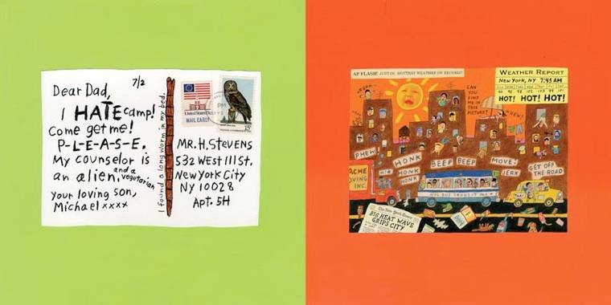Michael and Harry, with illustrations that
layer more meaning and richness to the words that each writes. Perfect
for teachers to read aloud at the beginning of the year and for students
to reread and explore on their own, Postcards from Camp is a fantastic
and fun-filled book for the classroom.

Postcard and Letter Writing.

Read aloud Postcards from Camp to introduce a unit on postcard and
letter writing. Students use tone to achieve different moods in their
letters.

A New Twist on "What I Did During My Summer Vacation."

It's no surprise that many students despise this popular (and frankly,
hackneyed) beginning-of-year activity. Aside from the pressure to
produce a dazzling piece of writing on the first day back to school, the
activity carries assumptions and expectations that one must spend the
summer doing spectacular, adventurous, or expensive activities, when
truth be told, many students spend perfectly happy summers at home or in
their own backyards. Instead of asking students to write an essay or
tell a story about how they spent their entire summer, tap into their
multiple modes of literacy expression and ask them to share one or two
small events that were somehow memorable. Maybe they tried a new kind of
food this summer, or met new neighbors. Maybe while cleaning their
bedroom, they found an old toy that brought back fond memories. Or,
maybe they spent the summer working to earn money, and something
interesting happened on the job. Encourage students to write, draw, or
otherwise use language and images to describe that small but significant
event and share it with the class.

Inferring Character.

Although we never get a direct description or see Michael or his father,
Simms Taback provides us with a lot of information about their
characters through text and illustration. What inferences can they make
about each character based on each piece of mail and on his
correspondence as a whole?

Perspective and Point of View.

Although Michael and Harry write directly to each other, they sometimes
stray from the first-person storytelling perspective. For example, Harry
creates a postcard that resembles an advertisement for a fictional story
based on Michael's fear of sharks. What effect does Simon Taback achieve
by shifting points of view in his story? You might want to follow up
this discussion by having students tell a story in alternating
perspectives.

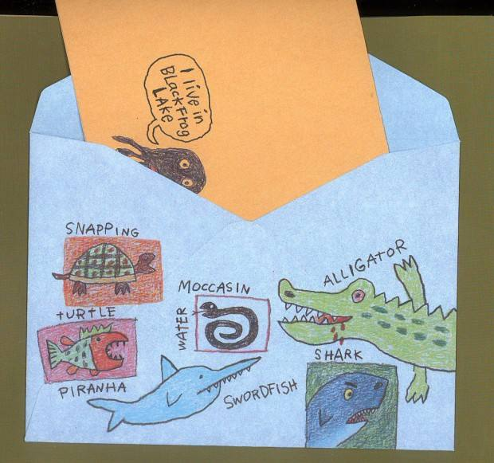

**Postcards from Camp Simms Taback**

On the first day Michael went to camp, he sent his father this card \...

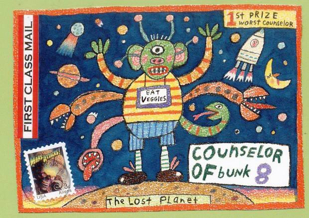

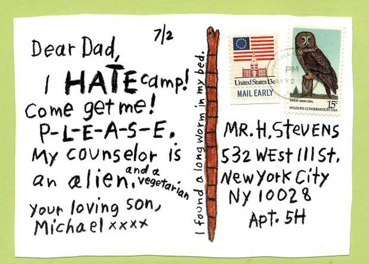

7/5

Hiya Michael,

Aren't you the lucky one to be at camp. It's so hot and unpleasant in
NYC, everyone is melting. Hope you had a good trip to camp. Sorry you
had to take the bus, but I hope the ride was fun.

I wish I could have taken you in our car. I hope to get it repaired
soon.

It's only your first day in camp. Rest assured, you will feel better
when you make new friends.

Write soon.

Your Dad, Harry

7/8

Dad --

Last night I found a big wet frog in my bed. I got scared and yelled
very loud.

It wasn't funny but my bunkmates laughed and laughed. Guess who put the
frog in my bed? My bunkmates HATE me! I hate them.

P.S. I made this card in arts and crafts.

Your loving son,

Mike XXX

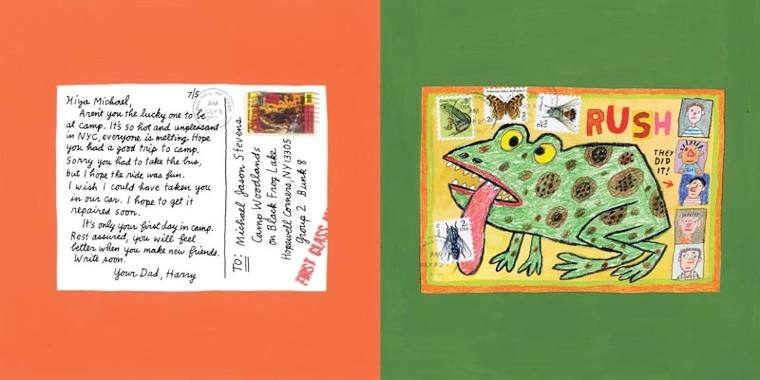

7/12

Dear Mike,

It sounds like you are making friends pretty quickly. THAT'S GREAT!

I met some of my best friends at camp and they remain my best friends to
this day. You know my friends Bert and Ray? And by the way, they send
their regards. Remember -- think positive.

Love, your Pop

7/15

Dear Dad,

It's been raining day and night ever since I got here. COME GET ME SOON!

Send me some dry clothes and sneakers. My friend Seymour said last
summer it rained every day. I need another raincoat because that's all I
wear. The tent roof leaks on our beds.

Your VERY VERY wet son, Michael

> 7/18

Dear Michael,

Don't let a little rain spoil your good time at camp. There are many
ways to have fun in the rain.

Some Helpful Ideas

1.  Fish while standing on your bed.

2.  Turn your cabin into a terrarium with turtles & frogs and charge
    admission.

3.  Challenge kids in the next bunk to water soccer or touch football in
    the mud. What fun!

4.  A really convenient time to take a shower (no excuses) and wash your
    clothes while wearing them.

> Love, Your Dad

AttN. MR STEVENS,

WE DON'T WANT YOUR SON IN OUR BUNK. HE HAS ~~HALITOSIS~~ BAD BREATH

AND USESE BAD LANGUAGE AND WEARS REALLY SMELLY SOCKS. COME AND GET HIM
REAL QUICK. WE LOCKED HIM IN THE BATHROOM UNTIL YOU COME!

HIS BUNKMATES

IN BUNK 8

7/26

Hi Michael,

WISE GUY! That was a pretty convincing ransom note. I'm glad you didn't
send it to your mum and scare her half to death. Silly fellow -- getting
to be just like your dad. But it does make correspondence more fun \...
YES? Anyhow, it sounds like you are more comfortable in camp these days
and I bet you felt a lot better when the sun came out. Just kidding! Did
you pass the swim test? And at what level? Minnow? Sunfish? Shark? \...
or whale?

Keep those cards coming \... Love, your Dad

PS Tuesday is pick up at the camp laundry.

> 7/29

Dear Dad,

Yes, I did pass the swim test. I am a shark, 2^nd^ level. I'm going to
take the test again in 2 weeks to make whale. I don't go swimming that
much because the water is dark and muddy and you can't see the bottom.
And there's green and yechhy stuff on top. There are lots of snakes and
I swear I saw an alligator or something. No one believes me.

I would like to go canoeing with my friend Stew.

Your son,

Michael

7/31

Hey Michael,

Remember to always keep a flashlight with you, if a giant fish swallows
you in a single gulp. You will have light to see your way and perhaps
set up house just like Geppetto from the story of Pinocchio, when he is
swallowed by a whale!!! Remember, you always loved the movie \... just
trying to be helpful. HA, HA! Seriously, please be careful on your canoe
trip.

Love, your Dad

Tuesday

Dear Dad,

Canoeing is great.

We went on the rapids and it was scary. You have to paddle really fast
sometimes. Brady was in the third canoe and he fell out because he hit a
big rock, but he was O.K. He only had a scratch on his knee.

Later we camped and roasted marshmallows and told ghost stories. But
they were not that scary and we mostly laughed and laughed, even Jonah,
our counsellor. We kidded Brady a little. He didn't mind too much.
Sometimes camp is really fun. I can stay a little longer next time,
maybe.

Love, Michael

This is the kind of canoe we were in. We learnt to use a compass and
orient with a map, too.

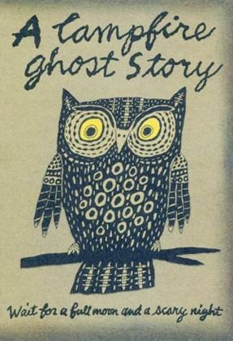

Chapter 1.

It was a hot summer night.

Willie and Sam went camping in the woods near their houses.

They built a fire, and roasted marshmallows. The night was very quiet.
An oiwl above them was calling, "Who! Who! Who!"

Then Willie said to Sam, "Did you hear that?"

"What! You mean the owl?" Sam replied.

"No \...no, listen carefully," whispered Sam.

From far away they could hear a voice saying:

"If the log turns over, we'll both get drowned."

"Maybe someone needs our help?" said Sam. Willie was scared, but he
agreed. So off they went, heading in the direction of the voice. Soon
the voice got a bit stronger.

"If the log turns over, we'll both get drowned."

Willie looked at Sam, Sam looked at Willie. But they continued on.

Chapter 11

Now the voice was getting louder.

"If the log turns over, we'll both get drowned."

"Maybe we should go back and get help," Willie said.

"But we're almost there," Sam answered.

They arrived at a clearing in the woods and came upon a house. It looked
deserted and spooky. They had never seen this house before and they
played in the woods often. The house was dark except for a light in an
upstairs window.

The voice was coming from up there.

"If the log turns over, well both get drowned."

Chapter 111

Willie and Sam knocked on the door, but no one answered. So Sam opened
the door and asked Willie to go in first.

"Is there anyone home?" Willie yelled. Still no one answered. The house
was dark. All they heard was the voice,

"If the log turns over, we'll both get drowned."

The door shut behind the boys. They managed to find their way to the
staircase and started to walk up. The stairs creaked as Willie held
Sam's arm.

There was a light shining from under a bedroom door.

On the other side the voice was terribly loud,

"If the log turns over, we'll both get drowned."

Chapter IV

Sam opened the door. He had never been so scared and Willie was hanging
on to him and would not let go.

Up on the wall was a speaker and the voice boomed: "If the log turns
over, we'll both get drowned."

A wire from the speaker led to the bathroom. The boys followed the wire
and entered the bathroom, Sam first.

Chapter V

The wire led to a microphone lying on top of the toilet. Willie and Sam
looked at each other and then into the toilet. A twig was floating in
the water. Two little bugs were standing on the twig. One bug was saying
to the other \...

"If the log turns over, we'll both get drowned."

The End

8/9

Dear Dad,

We just finished colour war. It lasted 2 days. The whole camp divided
into 2 teams -- the REDS and the BLUES. There were so many games like
tug of war, swim races, ping pong, spelling bees, make up songs and lots
more. I was in the chicken fight. You had to hop on one leg and bump
someone down. It was such fun. Youy were right. Camp isn't that bad.
Maybe I could come back next year.

Love, your son

Bunk 8 Group 2

8/12

Dear Michael,

I'll be there early on Saturday to pick you up. I'll know you'll need
some time to say good-bye. It sounds to me like you had a good time, all
in all, and made lots of new friends, like i thought. Are you sorry to
leave early? \... before the end of season "big social." You will have
lots of fond memories and time to reflect about what you want to do next
summer. can't wait to see you.

Love, Dad

Dear Fred, Brady, Stew, Ollie, Bud, Jonah and everyone in bunk 8,

I'm having fun with my dad fishing and backpacking. Can't wait to see
you next year at camp. I hope you are all coming.

Your friend,

Michael

P.S. My dad caught the smallest fish I ever saw on a hook.

The next year, Michael went to camp for the whole summer.

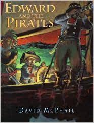

**Edward and the Pirates David McPhail**

Reading everything he can after learning how to read, young Edward finds
his imagination soaring and particularly enjoys adventure stories, and
one day he wakes up to find himself surrounded by pirates.

Edward and the Pirates is an excellent text to use when teaching Voice.
In the story, we really see Edward\'s passion for books, and can make
connections to the books that have touched us throughout our own lives.
It\'s also a great segue into lessons on Ideas, specifically discovering
the best information (details) to convey the main idea. As we watch
Edward\'s characters come to life, we remember what makes books come
alive to us! The author\'s ability to include great detail directly
impacts the reader\'s ability to visualise and experience the story!

Edward is a good example of the craft of Voice because the author, David

McPhail relates to the reader on a very emotional level. He\'s speaking
to

those who have ever found themselves caught up in a story, eager to

keep turning the pages and disappointed when the excitement ends with
the

final page. When you find yourself wishing you were a character in a
story or identifying with the character\'s emotions, you\'re
experiencing the author\'s Voice. It makes the reading experience that
much more powerful.

Oftentimes, the details we read in a story are so rich and vibrant that
we\'re

able to not only see the events playing out in our minds, but we begin
to feel

like we like we\'re actually there, experiencing the emotions of the
characters

and becoming swept up in the actions of the story. Edward enjoyed every

story with this type of zeal, and in his mind he became the characters
he

was reading about.

When an author includes just the right information, the reader is
enveloped in the story, and can live it rather than just reading it.

- Ruth Culham

Show Don't Tell

"Sometimes what Edward read seemed to become real. Once while he was

reading a book about dinosaurs, he was convinced he'd seen a

tyrannosaurus looking in his window."

Pirate Dictionary

pirate- To make an attempt, or to complete an attack on a ship. A thief
of the seas, or oceans. Violence used to steal (by force) the property
of another vessel in order to steal gold/treasure.

privateer- An armed vessel sailing under the commission of a sovereign
power against the enemy.

buccaneer- A piratical adventurer of the sea. A person who plunders at
the sea, or land from the sea.

mariner- One whose responsibility it is to help in navigating a vessel.

merchant ship- A ship that is involved in trade/commerce. A cargo ship.

galleon- A large square masted vessel of the 1500\'s used for war, or
commerce.

booty- Goods obtained illegally. Spoils obtained as a result of war or
battle.

bounty- Reward or payment, usually from a government, for the capture of
a criminal.

loot- Gold, money, or other goods obtained illegally

plunder- The act of pillaging or robbery.

cutlass- A short, heavy, single edged sword, once used predominantly by
sailors.

mutiny- To rise against authority, particularly a naval or military
power.

maroon-to isolate. Sailors would leave mutinous shipmates on deserted
islands, without any means of survival.

jolly roger- Typically a black flag bearing drawn white bones; indicates
a pirate ship

**David McPhail**

David was born in Newburyport, Massachusetts and attended the School of
the Museum of Fine Arts, Boston. While there, he began illustrating. His
first book was "The RUNJUMPBUMB Book" by Robert Brooks -- published by
Little Brown and Company, Boston. Later that same year (1971), the first
of his own stories was published. It is titled "In the Summer I Go
Fishing" published by Addison-Wesley Press. In 1972, "The Bear's
Toothache" was published by the Atlantic Monthly Press. Thus began a
wonderful and all-too-brief association with Emilie McLeod, Editor
Extraordinaire, who published some his favourite (of his own) stories,
including "Henry Bear's Park" and "Pig Pig Grows Up". He has continued
to write and illustrate and there are now well over 100 books with his
name on them.

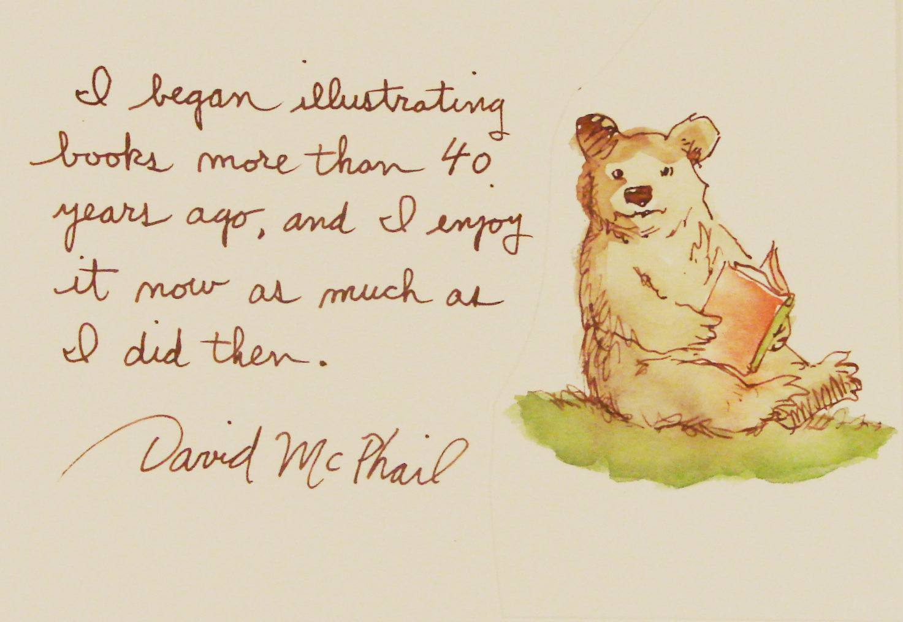

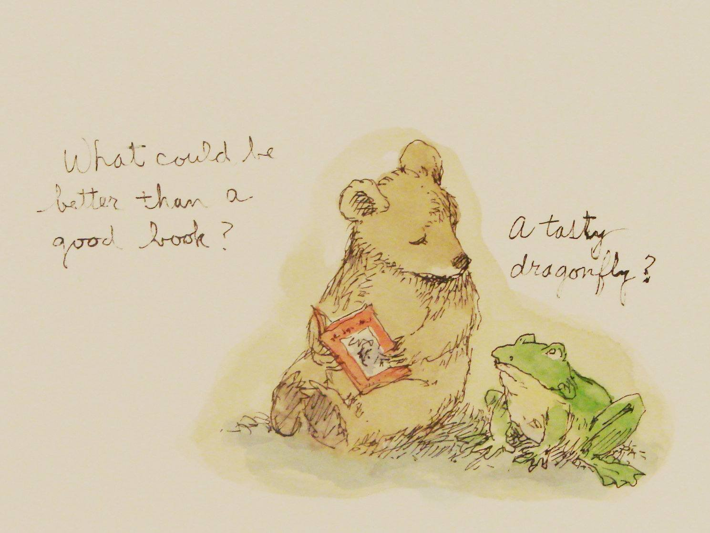

**Edward and the Pirates David McPhail**

Once Edward learned to read, there was no stopping him. Cereal boxes at
the breakfast table \...

seed catalogues that arrived on the coldest day of winter, the
inscription on the monument in the town square, and *books -- all kinds*
of books.

Edward especially liked stories of adventure. When he read about Admiral
Peary racing by dogsled to the North Pole, Edward was right alongside,
comforting the brave dogs and urging them on.

When he read that the bold outlaw Robin Hood was surrounded by the evil
Sheriff of Nottingham's men, it was Edward who came to the rescue.

And when he read about Joan of Arc leading her troops to victory, it was
Edward who carried her shield and held it up just in time to deflect the
blow of a battle-axe.

Sometimes what Edward read seemed to become real. Once while he was

reading a book about dinosaurs, he was convinced he'd seen a
tyrannosaurus looking in his window.

Next to home, the library was Edward's favourite place. He had his own
library card and could borrow all the books he could carry.

One day Edward found a book lying on a shelf behind some other books.

The book was old and covered with dust.

Edward blew away the dust and read the title:

*Lost Pirate Treasure*

He sat down and began to read: "Some pirate treasure has never been

found \..."

Edward was still reading when he felt someone tap him on the shoulder.
It was Ms Torres, the librarian. "Time to go, Edward," she said. "The
library will be closing soon."

Edward checked out the book and walked home, arriving just in time for
supper.

That night Edward went to bed early, taking his book with him. When the
pirate ship was being tossed about on stormy seas, it was Edward who
bravely took the helm \...

Sometime during the night, Edward felt his bed being bumped.

Edward sat up and looked around and saw he was surrounded by pirates!

"What are you pirates doing in my room?" he demanded.

"We've come for that book," answered the pirate who seemed to be the
leader. "We think it tells where our treasure is buried."

"I can't give it to you," Edward explained. "It's checked out on *my*
library card -- you'll have to wait till I return it."

The pirates begged, but Edward wouldn't change his mind.

They pleaded, but Edward folded his arms around the book and shook his
head no.

They even promised him a share of the treasure -- but that didn't work
either.

"You'll have to walk the plank!" threatened the pirates. But Edward
stood firm.

Finally one of the pirates drew his sword and waved it over Edward's
head.

"Hand it over!" he roared.

But Edward wouldn't budge.

"Better be quiet," he warned the pirates, "or you'll wake up my mum and
dad."

Edward had just finished speaking when the door to his room burst open
and someone riding a huge horse charged in.

It was Edward's mother.

She was dressed in a shining suit of armour and was carrying a lance.
She pinned the sword-waving pirate to the wall.

But then the other pirates drew *their* swords and closed in for the
attack!

Suddenly a flurry of arrows flew through the air, knocking all the
swords away.

A figure dressed in a green tunic bounded into the room, bow drawn,
arrows at the ready.

It was Edward's father.

"Back off!"he commanded the pirates. "Go stand in the corner."

The pirates did as they were told.

"Don't hurt us," they begged.

Edward felt sorry for the pirates.

"They only cam for this book," he explained to his mother and father. "I
don't think they meant any harm."

Edward handed the book to the pirates.

The head pirate held it open while the others huddled close by, talking
in whispers.

After a few minutes, the pirate gave the book back to Edward.

"It's of no use to us," he said sadly. "We can't read."

"You can't read?" asked Edward.

"Not one word," answered the pirate. "None of us can."

"I'll read it to you, then," said Edward. "That is, if it's all right
with my mum and dad."

It was.

"But don't stay up too late," Edward's mother told him firmly.

"And close the window when you leave," said Edward's father to the
pirates.

As his mother and father left the room and went back to bed, Edward
opened the book and began to read aloud:

"Some pirate treasure has never been found \...."

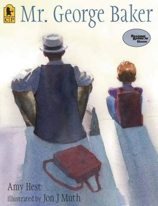

**Mr George Baker Amy Hest**

George Baker and Harry don't seem the likeliest of friends. Yet, sitting
side by side on George's porch, waiting for the school bus to come, the
two have plenty in common, this hundred-year-old musician with the
crookedy fingers going tappidy on his knees and the young schoolboy
whose shoelaces always need tying. They're both learning to read, which
is hard --- but what's easy is the warm friendship they share. In an
inspired pairing, a best-selling author and illustrator pay tribute to
the power of language and intergenerational bonds.

TOPICS FOR DISCUSSION:

Discuss with students what is necessary to get really good at doing
something.

Invite them to tell about something at which they are expert.

Pose the question that LeVar asks in the program: "What would you like
to

learn to do?"

Discuss how people learn to read. Ask students how they would go about

teaching someone to read.

Mr. George Baker and Harry are very good friends. Invite students to
tell

about their elderly friends and what they enjoy doing together.

The first person narration of Mr. George Baker is an excellent example
of

writer's voice. Have students write a brief description of an elderly
friend

or neighbour using details about what the person looks like, how the
person

dresses, and something she/he does well, similar to what Harry writes
about

George. They might start their descriptions the way Harry starts his:
"See this

(man/woman)? That's \_\_\_\_\_\_\_\_\_\_\_\_\_\_\_."

Extend invitations to elderly family members or friends of the students
to visit

the classroom. Find out any special talents and interests these people
might

have and invite them to share with the students. For example, a visiting
friend

might: teach a craft, share a hobby or collection, play a musical
instrument,

tell about her/his job, cook with the children, tell stories, read to
students, and

many other activities.

Making Inferences -- Make a chart of Mr. Baker\'s description, actions,
and dialogue. Next to it make an inference for each section. At the
bottom of the chart, combine them all into a character sketch. E.g. From
his physical description he takes pride in how he looks. From his
actions he is a patient, kind, talented, and intelligent man. From his
dialogue he has a sense of humour and values education. This is all
derived from some fairly simple text. Save this chart to use in the Show
Not Tell lesson.

Show Not Tell - Show through action rather than just tell. This is great
to do after you\'re done the reading lesson on inferences. It\'s also
where revisiting a text pays off. We\'ve already read the book, so we
can really focus on the author\'s craft. Revisit the chart of the
inferences and ask how we knew all those things about Mr. Baker
considering the author never really said any of that. On the chart side
that lists his description, actions, and dialogue, we\'ve already
identified how the author shows instead of tells.

ABOUT THE AUTHOR:

Born in New York City and raised on Long Island, Amy Hest aspired to be

a writer from an early age, but "I never thought my life was exciting
enough

for a writer," she says. Her love for books, however, led her to become
a

children's librarian and later to work in children's book publishing.
All of this

time she was writing and now has more than 30 books published, including

Reading Rainbow feature book, The Purple Coat. Amy lives in New York
with

her family.

ABOUT THE ILLUSTRATOR:

Jon J. Muth was a well-known comic book artist for 20 years before he
became

a children's book illustrator. Jon attributes the success of his work to
his

ability "to make myself small and run around inside my stories, to think
like a

child." He views his illustrations as more than "decoration," and
considers the

connection between words and pictures most important. Jon lives in
upstate

New York.

**Mr George Baker**

**Amy Hest**

See this man?

This one here, sitting on the porch?

That's Mr George Baker, and he's a *hundred* years old, no kidding.

"Hurry up, Harry! Mr Harry-in-Charge."

That's George, all snappy and happy in the morning. he always calls
"Hurry up, Harry" when I'm crossing lawns -- his and mine -- and he's
always there first, waiting on the porch.

See his pants, all baggy, baggy, baggy? What holds them up --
suspenders! Brown baggy pants with two side pockets, and two in back.

There's candy in those pockets. Little chocolate candies in twisty
wrappers. George pops one in his mouth and I do too.

We wait on the porch and chew.

I like his crumpled hat and his long stretchy legs. His shoes are
crumpled too, with long shoelaces. Mine always come undone in the
morning.

"Let's have a look," says George, making two double knots that never
come undone, not ever.

See this man?

This one here, zipping up his book bag?

His book bag is red like mine, and there's a book inside.

But George can't read.

A hundred years old, and he never learnt how.

"That must be corrected," says George.

I really like his sweater, all hangy with three buttons. It's chilly in
the morning, and we both hug our knees. And wait. We wait, watching
leaves blow off trees.

They fly for a while; they float. They tumble for a while; they swoop.

Now the screen door creaks, and you know who teeters out? Mrs baker, and
some people say she's ninety!

"Well, here you are, Harry, looking after my George."

Mrs Baker puts a sack on the step beside George, and there's lunch in
the sack for later.

"For the man I love," says Mrs baker.

"Why Mrs B! You flatter me!"

George gets up, all crookedy and slow, and the next thing you know,
they're dancing!

Then Mrs baker gives a wave and a wink.

"Good-bye," she says. "Be good," she says, and goes back in the house
with purple shutters.

George Baker and me, George Baker and I, we sit on the step and wait.

Side by side, we wait.

See these crookedy fingers, going *tappidy* on his knees? They fly
across his knees.

*Tappidy-boom. Tappidy-boom. Tappidy-boom-boom-tap.*

George baker is a drummer man, and some people say he's famous.

Sometimes he drums on his porch at night, and the neighbors come by. Up
the road and down the road, they come to hear my drummer man.

"Shh, listen!"

George gets up, real slow. I take his hand and he takes mine and we
shuffle down the walk to the big school bus.

"Morning," says the driver.

"We've been waiting," answers George.

There are twenty-two kids on the bus plus four grownups on the bus. They
all want George.

"Over here!" they cry. "Sit here!" they say, but George sits with me.
Each and every day.

See this man? This one in Room 7?

That's Mr George Baker, and he's a hundred years old, no kidding.

He's learning to read with the grownups in Room 7, and my room is right
down the hall. I'm learning, too, and it's hard.

"We can do it," says George after school.

Our books are green, and his lips sound out the letters. Real slow. But
his fingers fly across his knees. Like a big old drum.

*Tappidy-boom.tappidy-boom.*

*Tappidy-boom-boom-tap.*

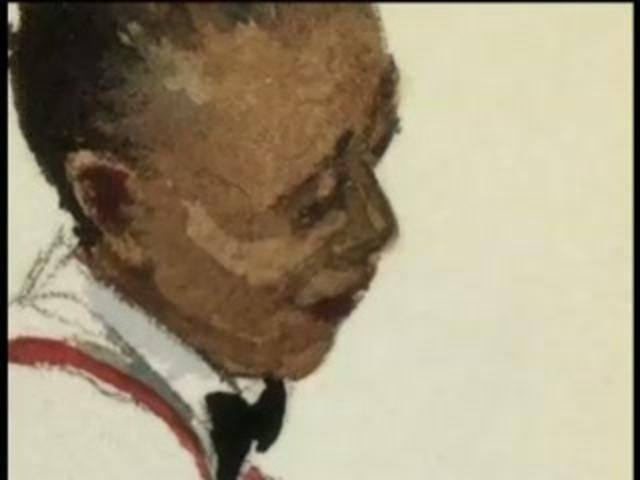*\*

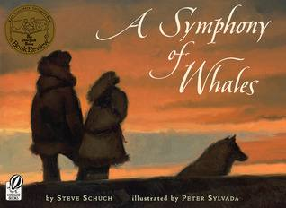

**A Symphony of Whales Steve Schuch**

Glashka can . . . but with that mysterious power comes great
responsibility. When she discovers thousands of whales trapped in a
rapidly freezing inlet, she knows it is up to her to gather the people
of her town to help them.

Based on an actual event, this inspiring story follows Glashka and her
people as they come to understand the importance of all life.

This award-winning book is based on a real incident occurring in the
winter of 1984-1985 where nearly 3,000 beluga whales became trapped in a
rapidly freezing narrow strait in Siberia. For seven weeks the local
villagers and the crew of an ice breaker fought to save the whales,
breaking up the ice so they could surface to breathe. Amazingly they
succeeded in breaking a passage through the twelve foot thick ice and
led the whales to the safety of the open sea by playing classical music!

This amazing tale with a happy ending is recounted here by musician
Steve Schuch who narrates the tale through the eyes of the fictional
Glashka, a little girl residing in the nearby Siberian village. Peter
Sylvada's amazing illustrations lend an eerie beauty that enhances this
wonderful story.

Steve Schuch also created a piece of music called "Whale Trilogy." This
very original composition tells this same whale rescue story musically
by melding violin and actual whale songs.

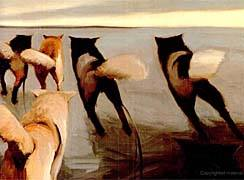

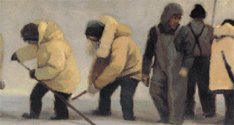

**Imagery -- Sensory words**

-- winters are described as long, dark and cold; small fire; songs
calling out of the darkness; voice of the wind; blizzards bore down;
strange men; sealskin blanket; waterproof skins

-- surrounded on all sides by ice and snow

\- water seemed to be heaving and boiling; choked with white whales; the
cries of the whales rose and fell on the wind

**Foreshadowing**

"In her dream, Glashka drove the dogsled. But the dogs did not follow
her commands. Instead they led her to open water surrounded by ice.
Glashka heard the singing of Narna, louder than she had ever heard it
before."

"They set off across the snow. " "Suddenly the sled dogs broke from the
trail. Their keen ears could pick up high pitched notes that most humans
could not hear." "They stopped short. They were right at the edge of a
great bay of open water, surrounded on all sides by ice and snow."

**Inferring**

The villagers shared their winter fish with the whales. Why did the
villagers do this and what can you infer about what this says about the
villagers and their thoughts and feelings about the whales?

The villagers had to share some of their winter fish with the whales
because the whales had been trapped in the channel for a while without
food and were beginning to get weak. The villagers cared, respected and
were very compassionate to the white whales. We can conclude such
because the text states that the villagers had to make the winter fish
last all winter because food was difficult to come by during the harsh
winter months. By sharing their limited food supply it shows that the
villagers were willing to give up something that they needed to survive
in order to help the survival of the whales.

Use details from the text to explain why Glashka kept saying, "Such
good, good dogs."

It is because of her sled dogs that the Beluga whales were found.

**Synopsis of Symphony of Whales**

The story centres around a young girl named Glashka in a village in the
far north. The old ones in the village say that Glashka has a gift,
which is to hear the song of the whale---Narna.

Glashka hears the song of Narna in a dream just before setting out on a
trip to the next village. On the trip, the sled dogs pick up some eerie
sounds that they follow. They find a bay full of a thousand beluga
whales that are trapped because the ice has come earlier than usual.
Glashka's father says that there is no help---that when the last of the
water freezes over, the whales will die.

Glashka's mother remembers that an ice breaker had rescued a Russian
freighter trapped in the ice several years before. They use an emergency
radio to put out a distress call, which is picked up by a Russian
icebreaker that radios back that it will come but the trip may take
several weeks. The villagers need to keep the whales alive until then.
The villagers and people from surrounding villages work at chipping back
the edges of the ice, giving the whales room to come up to breathe.

Glashka sings to the whales when she works and she gives some of the
fish from her lunch to the whales. Other villagers notice her doing that
and they begin to feed their stored fish to the whales too.

Finally the icebreaker comes and makes a path through the ice. When the
path has been made, the icebreaker turns around with the aim of guiding
the whales to the sea. But the whales don't follow the boat.

The ship's captain plays recordings of the sounds of whales but that
doesn't work. Then Glashka has another dream and hears other music along
with the sound of Narna. The villagers radio the ship and the crew play
other music including rock and roll. None of it works and Glashka radios
the ship to ask for other music. Finally, a recording of classical music
is played and the whales begin to follow the boat.

**Level 1:** On the surface level, this is a story of a girl's special
gift and her tenacity. In some lessons around this text, helpfulness is
emphasised. How was Glashka helpful? Have you ever been helpful? How did
Glashka's gift help to save the whales? Have you ever been in a
situation like Glashka? The students' interpretation of the story---even
that of third graders---does not have to stop with these personalised
questions. There are additional levels of meaning.

**Level 2:** The author has used Glashka and her magical gift to make
the story palatable for children. Even within the current form of the
story, there is evidence that there were numerous advocates for the
whales other than a single child (i.e., Glashka). Close reading gets
students to examine the text closely to find evidence that the event was
a community effort. Everyone was involved. Students can be supported in
doing a close reading of the text to determine the role of different
groups in saving the whales.

**Level 3:** There is another layer to the story that some might call a
backstory---it communicates the author's interest in the sounds of
whales. What might explain the author's choice to have a character like
Glashka who hears the sounds of Narna? A close reading can be done about
the author to answer the question, "why did the author focus on
Glashka's ability to hear the sounds of Narna?" Steve Schuch had been
interested in whale sounds for a long time. In fact, before writing the
story, he recorded a composition where he plays his violin accompanied
by whale sounds. That recording can be found on the Internet but it
never received the publicity that Mr. Schuch's book received. This is,
in fact, Mr. Schuch's only book to date.

**Level 4:** The final level of the text lies in the real event that the
author fictionalised. The real story of a tiny community working hard to
save 3,000 beluga whales---not 1,000 as stated in the story---is one of
the major successes of conservation of the 20th century. A close reading
of the texts can encourage students to consider why the world's news
media wasn't at the event. Why weren't there helicopters and planes
flying in with support for the rescue effort?

A book that can support students in reading "beyond the lines" is
Humphrey the Lost Whale (Tokuda & Hall, 1992). Exactly a year after the
Chukchis in Russia worked to free 3,000 beluga whales, much of the world
followed the story of Humphrey, a humpback whale that moved through the
Golden Gate in San Francisco Bay and then down the Sacramento River into
its delta. Enormous rescue efforts were coordinated to rescue Humphrey,
including the world's most powerful amplification system from the U.S.
Navy. Numerous agencies---fish, wildlife, and the U.S. Army's 481st
Transportation Company---collaborated to lure Humphrey back down the
Sacramento River and beyond the Golden Gate into the Pacific Ocean.

Just a year before, a small indigenous group of people---the
Chukchis---in an area larger than Texas (but where the population is
1/500 the size) managed to free 3,000 beluga whales. Why was Humphrey's
story publicised and the Chukchis's low-tech successful evacuation of
3,000 beluga whales limited to a fictionalised story of a girl who had
the ability to hear the sound of Narna?

# 

# 

# 

# 

# 

# 

# 

# 

# 

# 

# 

# 

# 

# 

# A Symphony of Whales Steve Schuch

From the earliest time she could remember, Glashka had heard music
inside her head. During the long dark winters, blizzards sometimes
lasted for days. Then her family stayed indoors, close to the small
fire. Glashka heard the songs calling to her out of the darkness, beyond
even the voice of the wind.

The old ones of her village said, "That is the voice of Narna, the
whale. Long has she been a friend to our people. She was a friend of our
grandparents' grandparents; she was a friend before we saw the boats of
strange men from other lands. But it is long now since one of us has
heard her. It is a great gift you have."

And Glashka would fall asleep, wrapped in her sealskin blanket,
remembering their words.

The sea gave life to Glashka's village. The seals gave meat and warm
furs to protect against the winter cold. In summer the people caught
salmon and other fish,

then salted them to keep for the hard times to come. And from Narna, the
whale, the people received food for themselves and their sled dogs,
waterproof skins for their parkas and boots, and oil for their lamps in
the long winter darkness.

One year the snows came early. For three days a blizzard bore down on
the village. When it finally stopped, Glashka's family needed supplies
from the next village. Glashka asked if she might help drive the sled
dogs. "It is not so easy to drive the sled," her parents said. "The dogs
will know if you are uncertain of the way. But you will know the way
home. Perhaps on the way back, you may try. Now go to sleep."

That night in her dreams, Glashka drove the dogsled. But the dogs did
not follow her commands. Instead they led her to open water surrounded
by ice. Glashka heard the singing of Narna, louder than she had ever
heard it before. She awoke in the darkness of her sealskins, wondering
what the dream had meant.

The morning was clear and cold as the family set out. The dogs made good
time to the neighbouring village. Before starting back, Glashka's
parents packed the supplies into the sled. Glashka checked the dogs'
feet for cuts. She rubbed their ears and necks. Glashka's parents gave
her the reins. "We'll follow behind you. If your heart and words are
clear, the dogs will listen and take you where you wish to go."

They set off. Across the ice, snow swirled as the wind began to pick up.
Suddenly the sled dogs broke from the trail, yelping and twitching their
ears. "What is it?" Glashka's parents shouted.

"I think they hear something," Glashka called back.

The sled dogs pulled harder. Their keen ears could pick up high-pitched
notes that most humans couldn't hear. But Glashka, if she turned just
right, could make out the eerie moans and whistles that grew louder
until even her parents could hear them.

The dogs stopped short. They were right at the edge of a great bay of
open water, surrounded on all sides by ice and snow.

Everywhere Glashka looked, the water seemed to be heaving and boiling,
choked with white whales. Her father came up beside her. "Beluga
whales," he said softly.

Glashka stared. "There must be more than a thousand of them."

The cries of the whales rose and fell on the wind as they swam slowly
about. The dogs whined and pawed anxiously at the ice.

"Let's hurry to the village," cried Glashka. "We'll get help!"

Glashka's father, though, knew there was no help. "They must have been
trapped when they came here last fall looking for food," he said
quietly. "There's nothing we can do to save them. When the last of the
water freezes over, the whales will die."

But Glashka's mother remembered that an icebreaker, several winters ago,
had rescued a Russian freighter trapped in the sea ice. "Could we call
on the emergency radio\> Maybe an icebreaker can clear a channel for the
whales,' she said.

Glashka and her parents raced back to their village. They gathered
everyone together and told them what had happened. Glashka's father got
on the emergency radio and put out a distress call. "Beluga whales,
maybe thousands of them, trapped. We need an icebreaker. Can anyone hear
me?"

Far out at sea, a great Russian icebreaker named the Moskva picked up
the faint signal. "We read you," the captain radioed back. "We're on our
way, but it may take several weeks to reach you. Can you keep the whales
alive until then?"

Some of the people from Glashka's village started setting up a base camp
near the whales. Others set out by dogsled to alert the surrounding
settlements.

Everyone came -- young and old, parents, grandparents, and children. Day
after day they chipped back the edges of the ice, trying to make more
room for the whales to come up to breathe. "Look," said Glashka's
grandmother. "See how the whales are taking turns, how they give the
younger ones extra time for air."

As Glashka took her turn chipping back the ice, the song of Narna filled
her ears again. She sang to the whales while she worked, trying to let
them know help was on the way. Each day, Glashka looked anxiously for a
ship. But each day, a little more water turned to ice. Each day, the
whales got weaker from hunger.

Glashka knew how it felt to be hungry. The year before, her village had
caught barely enough fish to make it through to spring. Sometimes the
memory still gnawed at her. Even so, she gave the whales part of the
fish from her lunch. The other villagers noticed and began to feed some
of their own winter fish to the whales, too.

One morning Glashka awoke to the sounds of excited voices and barking
dogs. The icebreaker had broken through the main channel during the
night. "Hurry, Glashka," her parents called. Glashka pulled on her boots
and parka and ran down the path to the water.

Everyone was gathered. Off to one side, the old ones stood, watching.
They beckoned Glashka to join them. "Now," they said, "let us see what
the whales will do."

The whales crowded together in fear, keeping as far from the icebreaker
as possible. On board the ship, the captain gave orders. He hoped the
whales would see the pathway cleared through the ice and follow the ship
to safety. The icebreaker slowly turned around and faced back out to
sea.

But the whales wouldn't follow the ship. "They may be afraid of the
noise of our engines," the captain radioed to shore. "I've heard that
trapped whales will sometimes follow the singing of other whales. We'll
try playing a recording of whale songs."

Glashka felt a shiver down her back. "Narna's songs," she whispered to
the sled dogs. "They're going to play Narna's songs."

Then the songs of the whales echoed over the water -- deep moans and
high whistling calls, ancient sounds from another world.

But the whales would not go near the ship. Again and again, the captain
inched the giant icebreaker closer to the whales, then back towards the
sea. But the whales stayed as far away as they could.

"It's no use," the captain radioed in despair. "And we can't stay beyond
tomorrow. Already the channel is starting to refreezd!"

Glashka was near tears as she asked the old ones what could be done now.
"Wait," they said. "Let us see what tomorrow brings."

That night the song of Narna came to Glashka again. Only this time it
was different. She heard the music and voices of whales, but she heard
other music, too \... melodies she'd never heard before \... While it
was still dark, Glashka woke her parents. "I've heard Narna again," she
said. "And I've heard other music, too!"

"You have to tell the old ones," Glashka's parents said.

The old ones of the village listened carefully as Glashka told them what
she had heard. "So, it is other music Narna is asking for," they said
thoughtfully. "Long is the time, but once, it is said, humans and whales
made music together. Perhaps the time has come again. Let us speak with
the captain!"

Quickly Glashka and the old ones radioed the ship. "Have you any other
music, to play for the whales?" they asked. The captain said he would
see what his crew could find.

First they tried playing rock and roll. The electric guitars and drums
boomed, but the whales would not follow the ship.

Next the crew tried Russian folk music. It was softer, with many voices
singing together. The whales swam a little closer, but still they would
not follow the ship.

On shore, Glashka ran back to the radio transmitter. She had to talk
with the captain. "I *know* there's other music that will work. Please
keep trying!" she told him.

The crew found some classical music. First the sweet sounds of violins
and violas, next the deeper notes of the cellos and, deepest of all, the
string basses \... and way up high, a solo violin \...

Everyone fell silent as the melody carried over the water. The whales
grew quiet, too, listening.

A few whales started to sing back to the ship, and to each other.
Gradually more whales joined in.

Then \... they began to swim towards the ship!

Cautiously the captain started the huge engines and headed slowly out to
sea. One whale followed, then another, then a few more. Soon all the
whales were following the ship through the narrow channel, past the
broken chunks of ice, back to the safety of the open ocean.

On shore, people laughed and cried and hugged each other. The sled dogs
jumped up and barked, trying to lick the noses and faces of anyone they
could reach. Glashka buried her wet face in the fur of the dogs' necks.
"Such good, good dogs," she told them over and over. "Such good dogs.
Now the whales are going home!"

On board the ship, the captain and his crew raised every flag. The music
played as the captain radioed to say the whales were safe. He and his
crew were finally going home, too.

Glashka and her family looked out to sea. They waved to the icebreaker
and the disappearing whales. "And do you hear Narna singing now?" her
grandmother asked.

"Yes," Glashka said, "but it isn't just Narna I hear now. It's something
bigger than that \... something like a whole symphony of whales!"

The U.S. government considers the Beluga, known by its distinctive head
bulge and white colour, to be endangered in their Alaska habitat. There
are an estimated 100,000 of the animals left in the wild; because of
their wide range of vocalizations, including clicks, chirps and
whistles, the whales are sometimes known as 'Canaries of the Sea'.

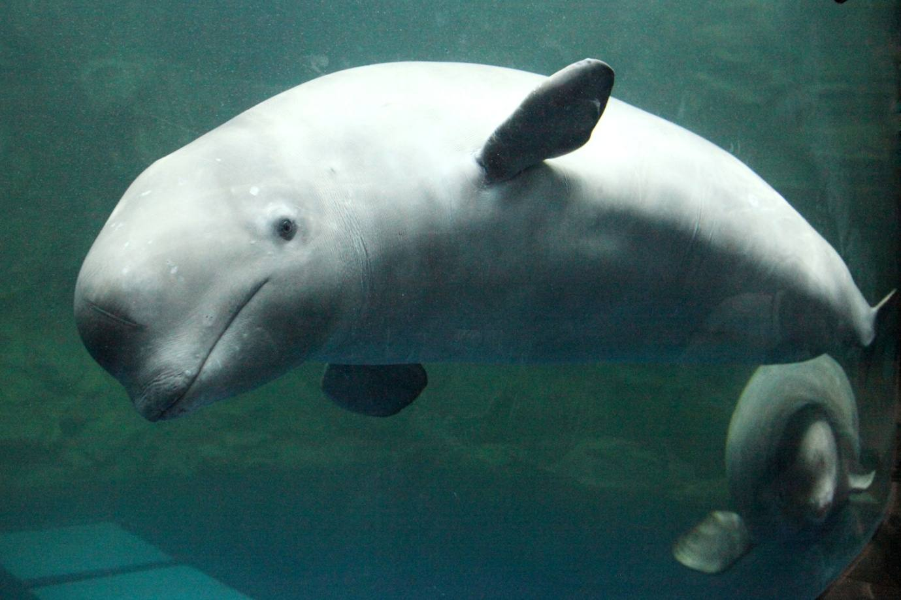

# RUSSIANS TELL SAGA OF WHALES RESCUED BY AN ICEBREAKER

###### **By SERGE SCHMEMANN**

###### **Published: March 12, 1985**

MOSCOW

IN one of the more unusual rescue operations in the history of

Arctic navigation, a Soviet icebreaker rammed a 15-mile path through
thick ice last month to free thousands of trapped white beluga whales.

The saga of the whales, known in Russia as belukhas or polar dolphins,
made for some of the winter\'s more suspenseful reading as the
icebreaker Moskva raced against time and plunging temperatures to reach
the whales before they suffocated or starved in shrinking pools of open
water. Like other seafaring mammals, Belugas must rise to the surface to
breathe.

Soviet television\'s first film report a week ago on what came to be
known as \'\'Operation Belukha\'\' showed masses of the 10-foot-long
white whales struggling for breathing room in a small pool of open water
while the giant Moskva ploughed ponderously toward them through the
seemingly endless expanse of ice.

The operation recalled the drama in the fall of 1983 when a flotilla of
icebreakers struggled to break through thick pack ice to some 20
freighters and tankers that became trapped in the Arctic Ocean. One of
the ships was crushed and sunk by the grinding ice floes before the
icebreakers succeeded in breaking a path for them to the open sea.

Trapped During Feeding Spree

According to accounts published in the Soviet press, the trapped whales
were first spotted by a native Chukchi hunter in late December. His
first reaction was joy - the white whales are a prime local quarry. But
when hunters and fishermen converged on the site they realized the scope
of the problem.

The white whales had evidently chased a large shoal of cod into the
Senyavin Strait, which separates Arakamchechen Island from the Chukchi
Peninsula in the northeasternmost corner of the Soviet Union, only about
130 miles from the Alaska mainland.

But an east wind kicked up and jammed the narrow strait with ice up to
12 feet thick, leaving only small pools of open water for the white
whales to surface for breathing. Though well adapted to the northern
seas and capable of breaking through thin ice to reach air, the white
whales found themselves trapped in ice too thick to breach and too vast
to negotiate on a single breath.

The plight of the large herd, estimated to number 1,000 to 3,000, was
soon reported by regional newspapers and by the authorities in the
Soviet Far East. Helicopters and experts were dispatched to survey the
scene, and inhabitants of the nearby settlement of Yanrakynnot brought
frozen fish to feed the teeming belugas.

Finally the decision was taken to summon the Moskva, which normally
ushers freighters through the Bering Strait, the waterway that separates
Siberia and Alaska. But on the icebreaker\'s first approach to the
strait her captain, Anatoly M. Kovalenko, found the problem more
daunting than anticipated, and retreated.

The next summons was more urgent. The belugas had begun to perish and,
taking on a full load of fuel, the Moskva plunged into the ice, guided
by special spotter planes.

Music Becomes Common Language

The next problem was to persuade the weakened whales to follow the
large, thundering ship before the ice could close up behind her.
\'\'Nobody could tell the captain how, in effect, to perform the most
responsible stage of the operation - in what language, so to speak, to
talk to the polar dolphins,\'\' wrote the Government newspaper Izvestia.
\'\'This operation was truly experimental.\'\'

At first the white whales simply rested in the larger pools the Moskva
made, feeding and gaining strength. Then they got active, playing,
whistling, squealing, snorting - \'\'in a word, doing everything except
one thing - entering the canal made by the icebreaker,\'\' Izvestia
wrote.

\'\'Four more days were needed to teach the belugas not to fear the
ship, the noise of its propellers. The icebreaker would go to and from
the herd.

\'\'At last someone recalled that dolphins react acutely to music. And
so music began to pour off the top deck. Popular, martial, classical.
The classical proved most to the taste of the belugas. The herd began to
slowly follow the ship.\'\'

Captain Kovalenko reported by radio to his headquarters: \'\'Our tactic
is this: We back up, then advance again into the ice, make a passage,
and wait. We repeat this several times. The belugas start to
\'understand\' our intentions, and follow the icebreaker. Thus we move
kilometre by kilometre.\'\'

With time the whales became fully accustomed to the ship. \'\'They began
coming up to the ship themselves,\'\' Izvestia reported. \'\'They hemmed
it about from all sides. They were happy as children, jumping, spreading
out all over the ice field.\'\'

Finally, in late February, the ship led the belugas to the open sea.

**An Author\'s Interview**\
Steve Schuch talks about A Symphony of Whales, his music, and the
importance of the Arts in the lives of children and adults \
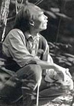**How did you first hear about the Chukchi whale rescue,
the event on which you based your new children\'s book, A Symphony of
Whales?**\
I first learned of the rescue one winter while on tour in Alaska. The
Chukchi Peninsula is located right across the Bering Straight. So people
up in Alaska knew about the rescue, even though folks in the lower 48
didn\'t. My \"Whale Trilogy\" piece ([click to hear the
mp3](http://www.nightheron.com/media/MP3s/whale.mp3)) for solo violin
and whales was a direct response to first hearing this true story. I\'ve
since performed it everywhere from schools and town halls to The Kennedy
Centre. People are always awed to hear of 3,000 whales, trapped in the
sea ice, and rescued with the help of classical music and a Soviet
icebreaker. They\'re also amazed such a thing really happened without
ever hearing about it on the evening news.

**Why didn\'t the rescue receive more press at the time?\**
There were many factors at work. It all took place in 1985, during the
depths of the Cold War. This was not a time foreign reporters roamed
about freely in the Soviet Union. Whereas most news crews prefer a fast
breaking story, this one stretched out over seven long weeks. Then there
was the remoteness of site coupled with the Siberian winter. No
airports, no hotels, no phone lines. Had the whales been trapped on a
beach in the Bahamas, it would have been very different!

**Why do you think the whales responded to classical music?\**
One possibility is that music played from the
icebreaker simply calmed the whales enough so they weren't afraid of it.
Or perhaps the whales really liked the music and wanted to hear more. I
also wonder if just maybe the whales experienced their own "Mozart
Effect." Is it possible the music stimulated their spatial reasoning
skills, as it does with humans? Did that help them find their way out
the narrow ice-cluttered channel, back to the open ocean?

**When did you first become interested in whale songs?\**
While I was at Oberlin College, studying baroque violin and biology. Dr.
Roger Payne, who did much of the pioneering research into whale songs,
came to campus with his slides, field recordings and his cello. That
evening forever changed how I heard music and thought about whales.
Shortly afterward, Pete Seeger came to campus and sang his "Song of the
World's Last Whale." The next week I went out and bought a used folk
guitar for \$25 and never looked back.

I still love classical music, especially Bach. You'll hear his influence
in some of my pieces too, along with a love of Gypsy and Celtic music.
But there is also a lot of natural history at work. I love music that
conveys a sense of place, that tells a story or paints a picture. Whale
songs do all of these.

**Why is a whale song like a symphony? **\
Like a symphony, some whale songs may last 20-30 minutes. They are not
just streams of random notes, but show enormous complexity and
organization. Within a song there are different themes and variations,
much like different motifs in a classical work. Whales also show respect
for the music "score." Committed entirely to memory, the notes and
phrasing to a given song change only gradually as time goes by. Some
whale songs even use a kind of rhyming scheme, presumably to make it
easier to remember what comes next in the piece. Symphonic composers use
different instruments to make a melody interesting. Now imagine being
able to sing all the notes of the orchestra by yourself. This is what
whales do.

**How did you get the idea to write your \"Whale Trilogy?\**
This piece for violin and whales is really a musical telling of the
rescue. It came out of listening to recordings of whales, being moved by
the rescue, and wanting to express my feelings on the violin. The first
part is very free form, with the violin imitating the haunting sounds of
the whales. Since I start the whale recording in a different place each
time I perform it, the violin part is always changing a bit from one
time to the next. The second part is more like classical music, where
the whales follow the ship out to sea. And the third part is where they
reach open water, and go into more of a joyous dance. \[[Sound
sample](http://www.nightheron.com/media/MP3s/whale.mp3)\]

**And the book, A Symphony of Whales\.... **\
Several years ago a children's book editor in New York heard a live
performance of my "Whale Trilogy." She tracked me down and asked if I'd
consider writing a book based on the musical rescue. A Symphony of
Whales is the result. Besides the book, I've also created an orchestral
adaptation of the story. Imagine Peter and the Wolf meets up with
whales! In this version I appear on stage as both soloist and narrator.
Illustrations from the book are projected onto huge screens, accompanied
by full symphony orchestra and whale songs.

**Is the little girl Glashka in *A Symphony of Whales* based on a real
person, or did you create her?**\
Many children, like writers and musicians, hear music and voices in
their heads. When I wrote this story, I wanted to tell it through the
eyes (and ears) of such a child. While I don't know of an actual child
by that name, there certainly were people like her in that village who
felt the call of the whales. Once you've heard, really heard the song of
a whale or any other living thing, it's hard to give up on them. I hope
that every village and city and town around the world has children like
Glashka\...and that grownups will listen to what these children hear,
too. 

**Why did you visit Alaska in the winter? What are some of your
memorable experiences there?**\
I went to Alaska in the winter of 1990 because\... that's when I was
hired! But performing in native villages on the Arctic Circle, venturing
out with a sled dog driver at 40 degrees below, seeing the eerie
northern lights and long winter darkness\... these are experiences you
don't get in many places. They later gave rise to the imagery found in A
Symphony of Whales. Without having spent a month in Alaska, I would not
have been able to write the book the way I did. That's why in writing
workshops I encourage folks to describe places they've observed closely,
characters they know well, or can imagine in great detail.

Other memorable moments from Alaska: the tour organizers' last minute
advice on what to do if my bush pilot's plane went down; an emergency
landing on a frozen river at minus 54 degrees, just as the fuel lines
were starting to freeze; packing my guitar and violin in special thermal
cases inside mummy sleeping bags; learning how to start a truck at 45
degrees below with a four foot long flame thrower; and eating lasagna
made from llama steaks!

**Do all your stories have musical connections?**\
It's actually hard for me to say where stories end and music begins.
Most of my stories have music running through them, just as many of my
favourite songs are story songs. [The Gift of the Wee
Folk](http://www.nightheron.com/books.html#wee) is a good example of
both. It's a traditional Irish tale that's been kept alive for hundreds
of years through oral tradition. In live performances, I weave Celtic
guitar accompaniment throughout the story, along with a singing part for
the audience. Enough people began coming up to me after shows asking if
there was a book, I finally had to write that too. The challenge then
was to convey the cadence of the character voices and the music in the
language of the book. As with the trip to Alaska, here too it helped
greatly to visit Ireland, walk her stone walls and green countrysides,
and listen closely to the music and speech patterns.

**You have played your violin in a number of unusual places. Where was
the strangest? The most inspiring? The most fun?**\
I've always loved how the violin sounds in unusual places. On our
honeymoon, my wife and I managed to find our way into a sea cave that is
only accessible at low tide. I'd packed along a violin (an inexpensive
one, just in case). We had a great time listening to how the violin
notes reverberated off the low rock walls and ceiling. In the darkened
tide pools, sea anemones waved their arms slowly to the rhythm of the
waves. Seaweed hung from the walls and ceilings, adding to the overall
effect.

Other unusual gigs have ranged from playing for a whale watch in ten
foot seas to performing my "Findhorn Suite" on the summit of Mount
Monadnock in New England. The winds were so gusty above tree line it was
all I could do to keep the violin bow on the strings. There was also the
"onomatopoeic" recording session for "The Twelve Days of Christmas"
which included a real turtle dove, four calling birds, and Kerry, a live
milking cow. When Kerry licked the recording microphone, the sound
inside my headphones was something else! \[See [A Celtic Celebration
Video](http://www.nightheron.com/video.html)\]

**Why is music an important part of a child\'s education?**\
Music is a doorway to the imagination. Along with storytelling, it is a
powerful force to develop minds that can remember and think creatively.
Current research into the "Mozart Effect" shows how listening to certain
kinds of music can stimulate brain development, particularly
mathematical and spatial reasoning skills. Music and stories also touch
our interior selves, our spirit and emotions. They help draw us together
as communities, and develop empathy and awareness of others.

I was lucky to grow up in a home surrounded by music. While neither of
my parents was a professional musician, both played a little piano and a
lot of records and tapes. Choral harmonies fascinated me even as a
child. Mom usually read us a story at bedtime. Sometimes she sang
lullabies, too. On camping trips, we'd get to hear one of Dad's ghost
stories. My parents probably did these things because they were fun. But
they were much more than that. Parents who play music and read aloud to
their children give them a head start on a lifetime of learning. A love
of beauty, curiosity and imagination\... these are gifts that will never
grow old.

**You have said \"Life is a symphony, not a sound bite.\" How does this
philosophy inspire and inform your work?**\
Like many artists and educators, I am concerned about a growing sound
bite mentality in everything from arts to news to politics. What happens
to art when it is reduced to a short blurb? What happens to us? What
happens to our society? Nowadays we get a whirlwind flurry of
information, but with only the lightest dusting of meaning. Meaning
requires time and context. Sound bites offer neither.

Deep down, I want to hear music and read books that stretch the
imagination. I want in-depth interviews and documentaries that challenge
us to think and remember. I want to feel real sand between my barefoot
toes, not virtual, and wonder at the nighttime sky. I want to hear my
own muse, yet also raise my voice with other voices, to make a symphony
worth living for.

