> **Voice**
>
> **(3)**

This is written with authentic voice.

**Voice is the author's fingerprint on the page.  By using voice the
reader feels more in touch with the writer's emotions, opinions, and
personality.**

**Voice 3**

My Rotten Red-Headed Older Brother Patricia Polacco

Touch the Sky Ann Malaspina

Dear Tooth Fairy Pamela Duncan Edwards

Testing Miss Malarkey Judy Finchler

The Paper Bag Princess Robert Munsch

Buffalo Music Tracey Fern

Bugs in My Hair David Shannon

Someday Eileen Spinelli

Hattie the Bad Jane Devlin

Gila Monsters meet you at the Airport Marjorie Sharmat

The Recess Queen Alexis O'Neill

When I Was Little Jamie Lee Curtis

When I Was Five Arthur Howard

Fireflies Julie Brinckloe

Amazing Grace Mary Hoffman

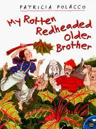

A little girl and her older brother lived on a small Michigan farm with
their Grandmother. Everything was wonderful in the little girl's life,
everything except her older brother. He always bragged about how he
could do everything better than her and the worst part was that he
actually was better at everything. One day, she was certain she had
found something she could do better than him. She challenged her brother
to a rhubarb eating contest. Like always, her brother won. That night as
her grandmother said her goodnights, they saw a shooting star. Her
grandmother explained that when you see a shooting star, you are
supposed to make a wish. The little girl closed her eyes and wished that
she could do something better than her brother. The next day, the little
girl and her brother went to a carnival. At the carnival, there was a
merry-go-round. Immediately she knew this was it. This was going to be
the thing that she could do better than her brother and she was right.
Her brother got off and she stayed on the ride. She stayed on the ride
so long that she eventually passed out and fell off the ride. Later she
woke up and discovered that her own brother carried her all the way home
and got a doctor for her. She realised that her brother, who she hated
so much, was actually not all that bad.

Like most of Polacco's books, this one was based on a true story as
well. The little girl from the story was Patricia and the boy was her
older brother, Richard. Knowing that the story is written from her own
perspective and written about her past, makes the story more
interesting. Many of the pictures showed how frustrated the little girl
was with her brother and how angry she was with him. Students can relate
to the sibling rivalry presented in the book. Hopefully they would be
able to recognise that siblings may get on your nerves sometimes but in
the end, they will be there for you.

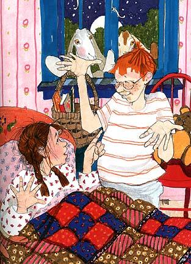

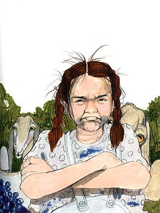

**My Rotten Redheaded Older Brother Patricia Polacco**

My brother and our mother and I all lived with my grandparents on their
farm in Union City, Michigan.

Now my babushka, my grandmother, knew a lot of things. She knew just how
to tell a good story. She knew how to make ordinary things magical. And
she knew how to make the best chocolate cake in Michigan.

After she told my brother and me a grand tale from her homeland, we'd
always ask, "Bubbie, is that true?"

She'd answer, "Of course is true, but it may not have happened!" Then
she'd laugh.

Now, I knew that she loved me all right, but I couldn't quite understand
how she could even *like* my older brother, Richard. He had orange hair
that was like wire; he was covered in freckles and looked like a weasel
with glasses.

The one thing that my bubbie didn't seem to know was how perfectly awful
my brother really was! Mind you, he was always nice whenever she was
around us; but as soon as she'd leave, he would do something terrible to
me and laugh.

There were so many things that I couldn't stand about him. The worst
that he was always telling me he could do just about everything better
than I.

"Bet I can pick more blackberries than you can," he jeered at me one
day.

"No you can't."

"Can so."

"Cannot!"

"Can," he whispered.

"Not," I said louder.

"Can!" he whispered so low that I could hardly hear him.

"Not!" I screamed back.

We both picked berries for most of the afternoon.

Well, he upped and did it! He not only picked more berries than I, he
set a record that wasn't even challenged for the next ten years.

"You make me sick, Richard Barber!" I yelled at him.

Then he smiled that smile that only a rotten redheaded older brother
could smile.

I guess I would have to face it. He could run the fastest, climb the
highest, throw the farthest, sit the longest, get the dirtiest, burp the
loudest, and spit the farthest. He had no equal, certainly not me!

"And I'm four years older than you ... Always have been and always will
be," he sneered.

There had to be something -- SOMETHING -- I could do that he couldn't!

Then an inspired thought comforted me like a fresh breeze on a hot
summer day.

"Oh, Richie," I cooed as I stood next to the rhubarb bushes. Do you like
rhubarb?"

"No!" he said. "It's the sourest stuff on this planet!"

Now I knew, at long last, that I had him.

"Bet I can eat more of this raw rhubarb thatn you can without getting
the puckers!" I challenged.

"I don't think so!"

"I do!"

"I don't!" he said, narrowing his eyes.

"I do!" I insisted.

"Don't," he hissed, looking smug.

"Do," I said furiously as I grabbed the first stalk and started chewing
it almost down to the leaf.

When I couldn't get one more sour bite into my mouth, he was still
eating with relish. "I thought you said you don't like rhubarb," I said
through pursed lips.

"I don't like it ... I LOVE IT!" he announced as he popped the last
stalk into his mouth.

I was so mad, I couldn't even feel how my belly was starting to ache. "I
can't stand you, Richard barber ... I double dog can't stand you!" I
screamed as I went into the house to be consoled by my grandmother.

"Yeah, and I'm four years older than you, too, you little twerp ...
Always have been and always will be!" he called after me. Then he
laughed that rotten redheaded older brother laugh.

That night at dinner I could hardly eat.

"Have you been eating angry apples again, child?" Bubbie asked as she
sliced me a huge wedge of rhubarb pie. "I baked your favourite!"

Richard gave me one of his extra-rotten, weasel-eyed, greeny-toothed
grins.

At bedtime my bubbie came and sat on the edge of my bed like she did
every night. "Look, a falling star," she said.

We watched it streak across the sky. Then she spat twice between her
fingers and gave her chest a loud slap.

"Why did you do that, Bubbie?" I asked.

"I was making a wish ... Didn't you know that wishes made on falling
stars come true?"

At last I knew how I was going to get back at my brother.

For the longest time I watched the dark sky until I saw a star shoot
across the night. then I spat between my two fingers and slapped my
chest.

It was done.

My wish was to do something -- anything -- better than my brother. I'd
show him!

The next morning all I could think about was my wish. I was thinking
about it so hard I almost didn't notice the wagons and trucks pulling
into the field down the road near Four Corners.

"A travelling carnival," my brother shouted as he ran towards me.
"They're setting up right here in our field! Bet I can eat more hotdogs
than you can," he teased.

He was already starting ti, but this time I was going to do something so
incredible that even he would have to sit up and take notice. I had a
star wish ... I'd show my rotten redheaded older brother all right!

That night I ran straight for the merry-go-round.

We must have taken fifty turns on that carousel. But then my brother got
off!

I stayed on. I went around and around and around.

"I knew I could do this longer than you," I shouted to my brother,
feeling proud but just a bit dizzy.

"Treesha," I heard my bubbie call out. "Get off that thing ... It's time
to go home!"

The last thing I remembered was stepping off from the platform. Next
thing I knew I woke up with Bubbie sitting on the edge of my bed. Mum
and Grandpa were there, too.

"You gave us all a fright!" Momma said. "How do you feel?"

"What happened?" I asked.

"You fell!" my rotten redheaded older brother announced with the biggest
grin on his face.

"I don't know what we would have done," my bubbie said softly. "Your
brother carried you all the way home, and then he had to run to get Dr
Lee."

"You had to have stitches ... I watched it all!" he said excitedly.

"You fell of the merry-go-round right into some pop bottles," my gramps
added.

"You even passed out!" my brother chirped. "Looks like you finally did
something special!"

It was from that exact moment that our relationship changed somehow.

"Thanks, Richie," I said to him.

"What's a big brother for, anyway?" he said, blushing.

That night we were all out in the yard. On hot Michigan nights it was my
family's custom to sleep outside, where it was cool.

"Look at those stars," Bubbie said quietly.

"Wishes are funny, aren't they" I said. "Sometimes they come true
differently than you think they will."

"That's why you have to be very careful what you wish for ... It just
may come true!" Bubbie said. Then she squeezed both of our hands. "Hang
onto the grass," she whispered.

"Why, Bub?" my brother asked.

"Because if we don't, we might float up to the stars." Then she leant
over and kissed us both three times. "I kiss your eyes, and I hold both
of your hearts in my good keeping ... And this night I thank God that I
walk this earth with both of you ... Ah-meen!"

Then we all just lay on our blankets in the gentle summer night.

"I'll always be four years older than you, though," my brother whispered
softly. Then he smiled.

All of us held one another's hands, and then we all drifted off to
sleep.

**Reading:**

**Compare and Contrast**

Compare and contrast Patricia and Richie using a Venn diagram.

Use this with your own siblings if you have any.

**Problem/Solution**

Problem: Patricia wanted to do something better than Richie.

Solution:

Wishing on a star.

Staying on the merry-go-round.

Brainstorm possible solutions.

Writing: Read and Retell with a different ending using a different
solution.

**Cause and Effect** Many examples.

Cause: Patricia stayed on the carousel longer than Richie.

Effect: She got dizzy and fell off.

Cause: Patricia wanted to do something better than Richie.

Effect: They eat rhubarb.

Cause: Patricia wishes on a star.

Effect: She realises that sometimes wishes come true in unexpected ways.

Cause: Patricia falls off the carousel.

Effect: Richie carries her home and runs for the doctor.

Cause: Richie looks after Patricia.

Effect: Their relationship changes.

Students find as many Cause/Effect pieces themselves.

**My Rotten Red-Headed Older Brother**

Prediction

Text-to-Self Connection

Text-to-Text Connection

Text-to-World Connection

Read Aloud

Prior to reading mark spots where the students could make predictions.

Guided Reading

If used with a small group for Guided reading then if all the students
write their predictions they are all doing the work.

DRTA -- Directed Reading Thinking Activity could be used with this book.

Examples of prediction points could be:

..."Now I knew, at last I had him."

"I stayed on. I went around and around and around."

Text-to-Self Connection:

..."he would do something terrible to me and laugh."

Many children can relate to an older sibling being mean.

Text-to-Text connections are possible where other Patricia Polacco books
have been read.

Reader's Theatre

Narrator

Bubbie

Tricia

Ritchie

Momma

Gramps

**Writing Craft**

+----------------------------+----------------------------------------+
| **Focus**                  | Personal narrative.                    |
|                            |                                        |
| **Ideas and details.**     | Sibling rivalry.                       |
|                            |                                        |
| Finding a significant      | Narrative development.                 |
| topic.                     |                                        |
|                            |                                        |
| Focusing on the topic.     |                                        |
|                            |                                        |
| One idea is used.          |                                        |
|                            |                                        |
| Developing the topic.      |                                        |
|                            |                                        |
| Using details.             |                                        |
+============================+========================================+
| **Organisation**           | Problem/Solution                       |
|                            |                                        |
| **Organisational           | Develop a Story Map                    |
| Structure:**               |                                        |
|                            | (See Reading for:                      |
| Lead.                      |                                        |
|                            | Compare and Contrast                   |
| Ending.                    |                                        |
|                            | Cause and Effect                       |
| Character development      |                                        |
|                            | Character/Setting                      |
|                            |                                        |
|                            | Poignant with humourous echo.          |
|                            |                                        |
|                            | Actions/Dialogue.                      |
+----------------------------+----------------------------------------+
| **Style**                  | Similes:                               |
|                            |                                        |
| **Words: Memorable         | *He had orange hair that was like      |
| Language**                 | wire; he was covered in freckles and   |
|                            | looked like a weasel with glasses.*    |
| **Voice:**                 |                                        |
|                            | Strong Verbs.                          |
| **Fluency:**               |                                        |
|                            | Hyphenated Adjectives. Adverbs.        |
|                            |                                        |
|                            | Words as well as 'said'.               |
|                            |                                        |
|                            | Superlative: *fastest, highest,        |
|                            | longest, dirtiest, loudest, sourest.*  |
|                            |                                        |
|                            | Repetition: *She knew ...*             |
|                            |                                        |
|                            | You can sense the personality of the   |
|                            | author. *Mind you, he was always nice  |
|                            | ...*                                   |
|                            |                                        |
|                            | Extensive use of ellipses dictates the |
|                            | oral reading ... pausing.              |
+----------------------------+----------------------------------------+
| **Conventions**            | Compound words:                        |
|                            |                                        |
| Spelling                   | *grandparents, grandmother, homeland,  |
|                            | redheaded, bedtime,*                   |
| Punctuation                |                                        |
|                            | Contractions:                          |
|                            |                                        |
|                            | *didn't, we'd, she'd, couldn't, can't, |
|                            | wasn't, I'm, don't, I'd, they're,      |
|                            | it's, what's. I'll*                    |
|                            |                                        |
|                            | extensive use of exclamation marks/    |
|                            |                                        |
|                            | ellipses/talking marks.                |
+----------------------------+----------------------------------------+

**My Rotten Redheaded Older Brother Questions:**

At the end of the story, during which Patricia and her brother Richard
are in a battle to try to outdo another (Patricia is convinced that
Richard can \"climb the highest, get the dirtiest, and spit the
farthest\" to name a few), the siblings both learn a valuable lesson:
not to let competition stand in the way of their kinship.

Discuss this lesson. Here are some examples of questions you could ask
(certain questions are only appropriate for older children):

1\. What are some of the things Richard did "better" than Patricia in
"My Rotten Redheaded Older Brother?

2\. What are some of the silly things you have done to try and "outdo" a
sibling (or if a student is an only child, ask them to describe some of
the ways they have competed with friends)? Suggest... sporting events,
costume parades, board games, etc., or open the discussion with your own
personal story.

3\. How did you feel when your sibling or friend "beat" you? Were you
angry? Upset? Vengeful? How did your sibling/friend feel if/when you
came out on top?

4\. How did Patricia rise above her desire to "outdo" her rotten brother
in the story "My Rotten Redheaded Older Brother"? What lesson did she
and Richard learn?

5\. How can you apply that lesson to your own relationships? Can you
rise above the competition?

6\. What are some of the special things your siblings/friends have done
for you, to show how much they care? What are some of the things you've
done for them?

7\. What are some of the things you love about your sibling/friend? How
is that person important in your life?

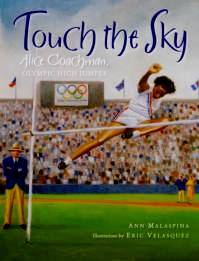

**Touch the Sky Ann Malaspina**

*"Fields shut.*

*Tracks shut.*

*Doors shut*

*to girls like Alice.*

*No place to practice.*

*No crossbar to raise.*

*Alice and her friends got busy.*

*Knotting rags.*

*Tying rags to sticks.*

*Planting sticks*

*in the red Georgia clay.*

*Then her friends stood back*

*and let Alice jump."*

**Themes**

Personal Strength, Overcoming Injustice, Civil Rights, Family Love,
Biography, Women in Sports, American Women, Olympic Games, African
American History.

**Synopsis**

\"Bare feet shouldn\'t fly. Long legs shouldn\'t spin. Braids shouldn\'t
flap in the wind. \'Sit on the porch and be a lady,\'" Papa scolded
Alice. Few girls dreamt of being athletes when Alice Coachman was
growing up in the Great Depression. In Albany, Georgia, no tracks or
gyms were open to African American high jumpers. So Alice made her own
crossbar with sticks and rags. With the support of her coach, friends,
and community, Alice started to win medals on the high jump. Her wish to
compete at the Olympics came true in 1948. This is an inspiring
free-verse story of the first African-American woman to win an Olympic
gold medal.

**Pre-Reading Discussions**

Before reading Touch the Sky with the class, you can help students
understand the times of the story. Alice was born in 1922 in the Deep
South. She grew up in an era marked by both legalised segregation and
the Great Depression. Also at that time, female athletes were struggling
for acceptance and opportunities.

1\. Alice's parents did not want her to be an athlete at first. Her
father did not think it was "lady-like" to run and jump. Do people think
the same way today?

2\. Alice could not practise on public fields and tracks because of
segregation laws. Her team could not stop at restaurants or restrooms
when they traveled. How did segregation affect Alice's goal to become a
top athlete?

3\. What does it mean to have a dream? Do you have a goal or dream that
you hope to achieve?

4\. Why did the author call the story Touch the Sky? Do you think Alice
really

touches the sky?

5\. The author wrote the story in free verse. Explain free verse and ask
students to listen for repetitions and word patterns as they read.

6\. Illustrations are important in a picture book. Ask students to look
at the

illustrations for clues about the historical setting of the story.

**After Reading**

**Ideas for Discussion**

1\. What made Alice's parents change their minds about her becoming an
athlete?

2\. How did the Great Depression affect Alice and her family?

3\. Why were the Tuskegee Relays for black athletes only? Was that good
for Alice or not?

4\. Alice always sucked on a lemon before the race. Why did she do that?
Do you

do something special to prepare for big events in your life?

5\. Alice's mother told her to "stay humble." Why did she say that?

6\. Many people helped Alice in her journey to the Olympic gold. Who are
the

people in your life that help you reach your goals?

7\. Alice was the first black woman in the world to win an Olympic gold
medal.

Why do you think that none had come before her?

8\. What qualities helped Alice to reach her goal of an Olympic gold?

9\. Alice was a hero when she came home from the Olympics, yet she found
that

many things hadn't changed. Her home town was still segregated. How do
you

think that made her feel?

10\. Did Alice really "touch the sky?" What does the sky symbolize? Look
for other symbols in this story.

**Language Arts**

Students pretend they are reporters covering the London Summer Olympics

in 1948. See website links below. Ask them to write a news story about
the high

jump competition.

Retell the story of Touch the Sky in the first-person point of view.

Write a free verse poem about a hero or heroine.

Use repetition, effective language, varied line length, and punctuation

to create form and rhythm.

Verbs are important in Touch the Sky. Students find the verbs and write
a short story using all the verbs.

Create a picture book biography of a favourite person. Use illustrations
to help tell the story.

THE HIGH JUMP AT THE OLYMPICS

The men's high jump competition was held at the

first modern Olympics in Athens, Greece in 1896.

Women competed in the high jump starting in 1928

at the Summer Olympic Games in the Netherlands.

**Reflection**

Use Touch the Sky as a jumping off point to study the Olympic Games.
Find

other books about Olympic champions, and share them with the class. What
do

the athletes have in common? How are they different?

Alice grew up during the Great Depression. Read about the Great
Depression and how families had to adapt and go without essentials.
Sometimes children had to help out, as Alice did by taking jobs after
school. Write a diary entry about life during the Great Depression.

Reflect on how practice, sacrifice and discipline helped Alice reach her
goal.

Pick a famous person in history and describe what they did to achieve
their

dream.

World War II put the Olympics on hold for eight years (1940 and 1944
Games

were cancelled). Have students research the reasons the Games were
cancelled,

and what it meant to some of the top athletes of that time.

For a maths exercise, look at this list of women's high jump Olympic
gold medal

winners, and make a graph showing how they changed.

1928 Ethel Catherwood CAN 1.59 meters

1932 Jean Shiley USA 1.66

1936 Iboylya Csak HUN 1.60

1948 Alice Coachman USA 1.68

1952 Esther Brand SAF 1.67

1956 Millie McDaniel USA 1.76

1960 Iolanda Balas ROM 1.85

1964 Iolanda Balias ROM 1.90

1968 Miloslava Rezkova CZE 1.82

1972 Ulrike Meyfarth FRG 1.92

Links for further research:

Alice Coachman Foundation http://www.alicecoachmen.com

1948 London Olympics http://www.olympic.org/london-1948-summer-olympics

United States Olympic Committee http://www.teamusa.org/

Women's High Jump http://www.olympic.org/athletics-high-jump-women

**MEET THE AUTHOR AND THE ILLUSTRATOR**

AUTHOR Ann Malaspina grew up in Brooklyn, New York, and Westport,
Connecticut. Her father emigrated from Greece after World War II. Her
mother was a fifth grade teacher. After graduating from Kenyon College,
she worked as a newspaper reporter in Massachusetts, where she learnt to
meet deadlines. Ann has written over twenty nonfiction and fiction
books, including Yasmin's Hammer, winner of the Asian Pacific American
Library Association award for picture book in 2011. Finding Lincoln
(Albert Whitman & Co.) was an IRA Teacher's Choice, Notable Social
Studies Trade Book for Young People, Skipping Stones Honour Book, and a
Paterson Prize for Books for Young

People. Ann got the idea for Touch the Sky at the 1998 Summer Olympics
in Atlanta, Georgia, where Alice Coachman was honoured as one of the one
hundred great Olympic athletes. She won a grant from the Society of
Children's Book Writers and Illustrators to research her story. Alice's
son, Richmond Davis, helped with information and support.

Ann's website: [www.annmalaspina.com](http://www.annmalaspina.com).

**ILLUSTRATOR** Eric Velasquez, the son of Afro-Puerto Rican parents,
was born in Spanish Harlem and grew up in Harlem in New York City. As a
child, his love for doodling and drawing was strongly encouraged by his
mother. From his grandmother he inherited a love of music and from his
father he developed a love of movies. Growing up in this setting, Eric
says, \"Becoming an artist was a natural choice for me. I have never
thought of being anything else." Eric won the 1999 Coretta Scott
King/John Steptoe Award for new talent for The Piano Man by Debbie
Chocolate. He has illustrated many beautiful children's books, including
Liberty Street, Champion: The Story of Muhammed Ali, and Jesse Owens:
The Fastest Man Alive.

Eric's website: [www.ericvelasquez.com](http://www.ericvelasquez.com)

Ref: Teacher's Guide for Touch the Sky

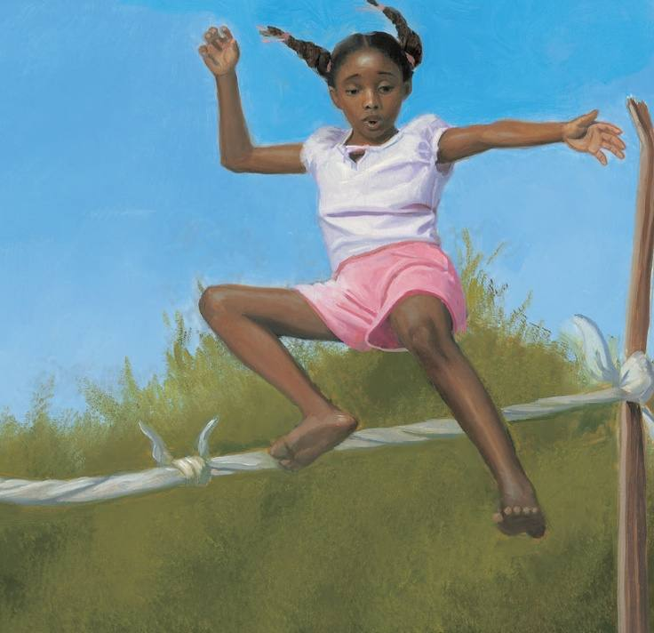

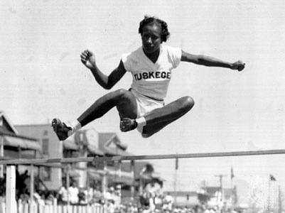

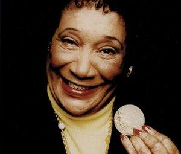

**Touch the Sky**

**Alice Couchman, Olympic High Jumper Ann Malaspina**

Alice Couchman raced

down the dirt road,

bare feet flying,

long legs spinning,

braids flapping

in the wind ...

LEAP!

She sailed over

a tree branch

and kept on running.

Back home Papa was angry.

Bare feet shouldn't fly.

Long legs shouldn't spin.

Braids shouldn't flap

in the wind.

"Sit on the porch and

be a lady," Papa scolded Alice.

Momma, who worked

from morning

till night,

gave her chores.

Cooking breakfast.

Picking cotton.

Gathering plums

and pecans

to make ends meet.

Hard times had come

to Albany, Georgia,

in the 1930's.\
There was always

more work to do.

At school, when the bell

rang for recess,

Alice burst outside

to play basketball

with the boys.

SWOOSH!

SWOOSH!

SWOOSH!

Alice wanted

to touch the sky.

Alice's teacher saw

something special

in that never-sit-still girl.

She took her to a track meet

where a boy leapt

over a crossbar

into a pile of sawdust.

Inch by inch,

the bar rose higher.

Inch by inch,

the boy jumped higher, too.

"The high jump,"

someone said.

Alice's feet tingled,

wanting to try.

Fields shut.

Tracks shut.

Doors shut

to girls like Alice.

No place to practice.

No crossbar to raise.

Alice and her friends got busy.

Knotting rags.

Tying rags to sticks.

Planting sticks

in the red Georgia clay.

Then her friends stood back

and let Alice jump.

One day a man came by

to collect the rent.

He saw Alice,

bare feet flying,

long legs spinning,

braids flapping,

in the yard.

"Evelyn, that gal's gonna

jump over the moon

one of these days,"

he said to Momma.

The moon was so far

from Albany, where

Momma saved pennies

because there weren't

ever enough.

But a dream

is a beginning,

and as Alice grew older,

her dream was to soar.

Good news.

The high school coach

needed a jumper --

a high-flying,

star-grabbing,

bar-crossing jumper --

for a trip to the Tuskegee Relays

in Alabama.

Alice's teachers brought her

shoes to run in,

shorts,

and bright white socks.

If she was gonna touch the sky,

she needed all that.

Her heart raced

when she saw them,

the sprinters,

javelin throwers,

distance runners --

the finest young black athletes

in all the South.

The referee called her name,

and Alice got ready.

Got set.

GO!

Up,

up,

up,

over the crossbar

she flew.

Inch by inch,

the bar rose higher.

Inch by inch,

Alice jumped higher, too.

When she won first place,

Coach Cleve Abbott

asked her to join

his famous team,

the Tuskagees

Golden Tigerettes,

for one meet --

the biggest meet of the year.

**September 3, 1939. The American Athletic Union**

**National Championship, Waterbury, Connecticut**

Stretching her long legs,

Alice sucked on a sour lemon.

The lemon made her feel

lightning-fast,

feather-light,

moon-jumping strong.

That day,

Alice won

her first

national medal.

When Alice got back to Albany,

Papa was proud,

but he wanted her home.

Momma admired her medal,

but warned her to stay humble.

One day, Coach Abbott came by

to invite her

to enroll at Tuskegee.

Papa said, "No."

Alice held her breath.

No more picking cotton.

No more gathering plums and pecans.

Best of all, she'd train with the Tigerettes.

Finally, Papa nodded.

Yes. He had to let her go.

At Tuskegee Institute High School,

Alice practiced her jumps

and studied hard.

To pay her fees,

Alice sewed,

mopped the gym,

and rolled the tennis courts.

Always, she thought about Momma,

working so hard

so Alice could rise high.

Travelling wasn't easy for the Tigerettes.

Whites-only restaurants shut.

Restrooms shut

to girls like them.

They ate supper on the roadside.

After dark, they hurried on.

Together, the team held strong.

Laughing. Teasing. Having fun.

When they got to the meets,

all that mattered was

sprinting,

throwing,

running,

jumping.

No one jumped higher than Alice.

National champion.

Shining star.

Still, Alice's feet tingled.

One dream hung in the sky.

She wanted an Olympic medal,

but World War 11 was raging,

and the Games were cancelled.

After peace came in 1945,

Alice wondered ...

Was she still the best,

or had her time passed by?

**July 1948. The Olympic Trials, Providence, Rhode Island**

Alice stood at the high jump pit.

Her back hurt.

One *last* jump.

Her legs were sore.

The most important jump so far.

One jump to make the Olympic team.

She sucked on a lemon --

and took off,

bare feet flying,

long legs spinning

in the wind.

Alice scaled the bar

at 5 feet 4 ¾ inches.

An Olympic Trials record.

A week later,

Alice sailed across the Atlantic Ocean,

an official member of the U.S, Olympic

women's track and field team.

**July 29, 1948, Wembley Stadium, London**

King George VI of England stood to speak.

"I proclaim open the Olympic Games of London!"

Trumpets sounded.

The Olympic flag was raised --

and cannons thundered.

In the field,

Alice paraded with her team

and four thousand athletes

from fifty-nine countries.

Flags waving.

Flame burning.

Pigeons flying into the blue.

The Olympics had begun --

and Alice's dream

was almost ...

almost

here.

The games sped by.

No gold medals for Alice's team so far.

The high jump was the last event.

Glory was up to her.

Alice squeezed a lemon.

She stretched her long legs

and touched her toes.

"The lemon and God's will

give me luck," she said to herself.

"That's all I need."

Inch by inch, the bar rose higher.

Nineteen women took their turns.

Inch by inch, Alice jumped higher, too.

Finally, only two were left.

England's champion, Dorothy Tyler,

and Alice, Albany's star.

It was Alice's turn.

The crowd held its breath.

Up,

up,

up,

over the crossbar she flew,

setting a new Olympic record

of 5 feet, 6 1/8 inches.

Dorothy took two jumps

to clear the same height,

putting Alice ahead.

When they both missed

the next jump,

the contest was over.

Alice had won the gold.

As she climbed to the top

of the winner's stand,

the crowd rose

for the bare-feet flying,

long-legs spinning,

moon jumper from Georgia.

Alice had finally touched the sky.

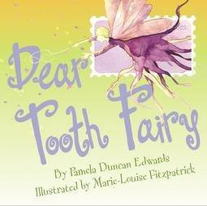

**Dear Tooth Fairy Pamela Duncan Edwards**

In a series of letters, six-year-old Claire and the Tooth Fairy discuss
the important matter of her first loose tooth and when it is going to
fall out.

Writing

Students write stories about the tooth fairy. Before they begin,
brainstorm a list of things the tooth fairy might encounter on her
nightly outings to collect teeth - barking dogs, kids who are trying to
catch her, getting lost, etc. Students write their own stories about a
night in the life of the tooth fairy.

Free Verse poetry

Poetry about the tooth fairy or any other dental health topic.

**Dear Tooth Fairy Pamela Duncan Edwards**

Dear Tooth Fairy,

Last week it was my birthday. I was six, but I don't

have even one wobbly tooth yet. I'm worried.

Yours sincerely,

Claire

Dear Tooth Fairy,

Did you get the letter I sent you three days ago?

I told my friend Amanda about writing to you.

She asked if I could mention her because she doesn't

have any wobbly teeth either. But that's okay because

Amanda is much younger than me. She isn't six for

another four weeks.

Yours sincerely,

Claire

Dear Tooth Fairy,

Today our teacher told Jimmy Clarke to stop fiddling

with his wobbly tooth. Jimmy Clarke said he wasn't fiddling with his
wobbly tooth -- he was fiddling with his TWO wobbly teeth.

Amanda and I thought Jimmy Clarke was a big bragger, so we didn't play
with him on the playground.

Yours sincerely,

Claire

Dear Tooth Fairy,

My friend Amanda and I went to visit my grandma

after school. Grandma said tooth fairies get busy at this

time of the hyear and we'd have to be patient and wait

our turn.

Grandma didn't think Jimmy Clarke was bragging when

he told us about his two wobbly teeth. She said we

should be glad for him. So we're going to ask him to

Amanda's birthday party.

Yours sincerely,

Claire

Dear Claire,

Thank you for your letters. Grandma is right --

this is a very busy season for me.

However, I checked my list, and you and Amanda

are definitely on it. So don't worry.

Love,

The Tooth Fairy

Dear Tooth Fairy,

My friend Amanda and I jumped up and down and

cheered when we got your letter.

Did I tell you that I am already six?

Love,

Claire

Dear Claire,

I know it's hard to believe, but I have people on my list who

are almost seven, and they still don't have wobbly teeth. Wobbly

teeth don't like to be hurried. They wobble when they're ready.

You are taking care of your teeth, aren't you? I hope you are

brushing them twice a day, because I really like to collect shiny white

teeth.

Love,

The Tooth Fairy

Dear Tooth Fairy,

Everyone from our class came to Amanda's party. We played

all these party games, and it was great. Jimmy Clarke wobbled his

two teeth and made Amanda's mum laugh.

But the best news of all is, I THINK I HAVE A WOBBLY TOOTH

AT LAST! I was eating a piece of birthday cake, and I'm sure my front

tooth moved.

Amanda was sad at first, but I told her not to worry -- when she's

as old as me, she'll get a wobbly tooth, too.

Love,

Claire

Dear Claire,

I told you so!

Love,

The Tooth Fairy

Dear Tooth Fairy,

It's amazing! Amanda and I are twins! She's got a wobbly

tooth, too.

Grandma took us out to celebrate, Amanda had

butterscotch ice cream and I had chocolate. Grandma had mint.

I hate mint. Except mint toothpaste is okay, I suppose.

Amanda says to tell you that we brushed our teeth after the

ice cream. We want our teeth to be white and shiny for you.

Love,

Claire

Dear Claire,

My favourite ice cream is bubble gum. Did you know yoy can get

bubble-gum-flavour tooithpaste? In fact, toothpaste comes in lots of

different flavours, just like ice cream.

Love,

The Tooth Fairy

Dear Tooth Fairy,

I'm sorry I haven't written for a long time, but yesterday was

Halloween, and Amanda and I have been planning our costumes.

Amanda went as a tooth, and I went as you! We told Jimmy

Clarke he should go as a tube of toothpaste, but he said that was silly.

He went as a pirate instead.

Grandma gave us little boxes to put our teeth in when they fall out.

She gave one to Jimmy Clarke, too, even though he was only dressed

up as a pirate.

Love,

Claire

Dear Claire,

I'm looking forward to seeing your little tooth boxes.

Sometimes a tooth can get lost under the pillows, and it takes

us a long time to find it.

Love,

The Tooth Fairy

Dear Tooth Fairy,

I've had this wobbly tooth for absolutely ages.

Do you think it's ever going to come out?

Love,

Claire

Dear Tooth Fairy,

Don't bother to read my last letter because MY WOBBLY

TOOTH CAME OUT TODAY! I screamed and made everyone jump.

But our teacher didn't mind. She said she was pleased and put my

name on the Tooth Chart.

Jimmy Clarke was a bit mad because he's had two wobbly

teeth for so long. He said, "Yuck, that's gross," when my gum was

bleeding. But I told him I bet he'll be the first boy to get on the

Tooth Chart.

Love,

Claire

P.S. My tooth will be on the table by my bed. Could you leave the

little box behind? I'll need it for my next tooth.

Dear Claire,

I'm pleased you took such good care of your tooth. It's really

white and shiny. I'm going to use it for my own special fairy carriage.

Love,

The Tooth Fairy

Dear Tooth Fairy,

Thank you for leaving me the dollar for my tooth. The fairies

must have so many carriages. I bet you have traffic jams sometimes.

By the way, I don't want to rush you, but I'm wondering -

WHEN DO YOU THINK I'LL GET MY NEXT WOBBLY TOOTH?

Love,

Claire

**Testing Miss Malarkey Judy Finchler**

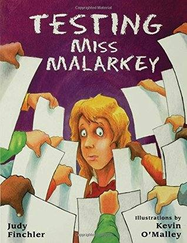

The new school year brings standardised testing to every school and Miss
Malarkey\'s is no exception. Teachers, students, and even parents are
preparing for THE TEST-The Instructional Performance Through
Understanding (IPTU) test-and the school is in an uproar. Even though
the grown-ups tell the children not to worry, they\'re acting kind of
strange. The gym teacher is teaching stress-reducing yoga instead of
sports in gym class. Parents are giving pop quizzes on bedtime stories
at night. The cafeteria is serving \"brain food\" for lunch. The kids
are beginning to think that maybe the test is more important than
they\'re being led to believe. Kids and adults alike will laugh aloud as
Finchler and O\'Malley poke fun at the commotion surrounding
standardised testing, a staple of every school\'s year.

**Testing Miss Malarkey Judy Finchler**

Miss Malarkey is a good teacher. Usually she's really nice. But a couple
of weeks ago she started acting a little weird. She started talking
about THE TEST: The Instructional Performance Through Understanding
test. I think Miss malarkey said it was called the "I.P.T.U." test.

"Not another test! No wonder they pity us."

But Miss Malarkey said THE TEST wasn't that important. She said it
wouldn't affect our report cards. It wouldn't mean extra homework. And
if we didn't do well, we'd still go on to the next grade.

"Miss Malarkey, you shouldn't bite your nails."

At recess we played Multiplication Mambo. each class got new CD roms
called "There's Something About Decimals." After lunch we played Funny
Phonics. Miss Malarkey said you never know what's going to be on THE
TESTR\>

"I before E except after C. You get to move twp spaces. Isn't phonics
fun?"

"Can I go to the bathroom?"

The closer we got to "THE TEST DAY," the weirder things got. When I
brought the attendance sheets to the office, I heard Principal Wiggins
yelling about pencils.

"THIS IS THE TEST! I want the good No. 2 pencils. Not the kind with the
crumbly erasers. And I will personally make sure they're all sharpened
perfectly."

The cafeteria lady, Mrs Slopdown, took away the potato chips and served
only fish.

"Fish is good brain food. Some of you should eat a whale."

"My food usually goes right to my stomach."

In art we each made posters about THE TEST. Mrs Magenta also showed us
how to colour in all those little circles they put on tests.

During gym we didn't play baseball or even exercise. Mr Fittanuff said
we had to prepare our minds and bodies for THE TEST. We all learnt
something about meditating and about something called "yoghurt." Like I
said, things were getting pretty weird at school. I got to thinking THE
TEST was sort of important.

"Your mind and body are one with THE TEST."

Even my mum knew about THE TEST. When she read me my bedtime story, I
had to complete a ditto and give the main idea before I could go to
sleep.

Mum started making me eat a really big breakfast. For lunch she packed
me a Power Bar 2000. When I got to school, I traded Adam for a fat-free
bran muffin. He traded with Hanna for a Baggie of carrot sticks. Hanna
didn't want the Power Bar so she asked her best friend, Meredith, if she
would trade for her apple. Somehow someone must have wanted the apple,
and I'm not sure what happened but I had the Power bar 2000 again.

One night Mum took me to a PTS meeting. A man was there talking about
THE TEST. He wasn't a teacher or a parent or even the principal, but
whoever he was he seemed to think THE TEST was very important. So did
the parents.

"My son is gifted in a variety of areas. Will this test hinder his Ivy
League chances?"

"Will the grade point average be reflected in the scores?"

"Should I be concerned about performance anxiety?"

"How will the test affect real estate prices?"

"What the heck are they talking about?"

The day of THE TEST the janitor, Mr Surley, closed off the whole
hallway. You couldn't even walk down it unless you had a pass. And you
had to whisper. Miss Malarkey had to whisper the secret password to Mr
Surley before she could go to Room 10.

That morning there were more teachers than kids waiting for the nurse.

Miss Malarkey's job was to hand out the No. 2 pencils and the scratch
paper. She looked like she didn't get enough sleep. principal Wiggins
was keeping the time. We couldn't even touch THE TEST until he waved the
flag. When it was time to start, he waved the flag so hard, something
happened to his hair.

THE TEST took forever. It took two whole days. My friend carmine got in
trouble for not using his scratch paper the right way. I thought his
ninja warrior looked pretty good, though.

Miss Malarkey caught Barry with his baseball cards.

Morgan got a stomachache -- and had to go to the nurse. The hall monitor
gave her such a hard time, she threw up right in the hall.

When Miss Malarkey said to erase all your pencil marks, Janet erased her
whole test.

Principal Wiggins was in the room for a while, but he had a stomachache
and had to go to the nurse. I hope he didn't throw up in the hall too.

After THE TEST everybody got prizes and had treats and we got extra
recess. Even Steven, who fell aslepp two times during THE TEST. Miss
Malarkey looked wiped out, and she didn't even take THE TEST.

"Here Miss Malarkey, have my Power Bar 2000."

It's been a long time since we took THE TEST. Things are back to normal.
Principal Wiggins isn't yelling quite as much. The cafeteria lady
started serving potato chips again. Mum's packing me good old peanut
butter and jelly sandwiches. And Miss Malarkey is letting her
fingernails grow real long. I guess THE TEST really wasn't that
important after all.

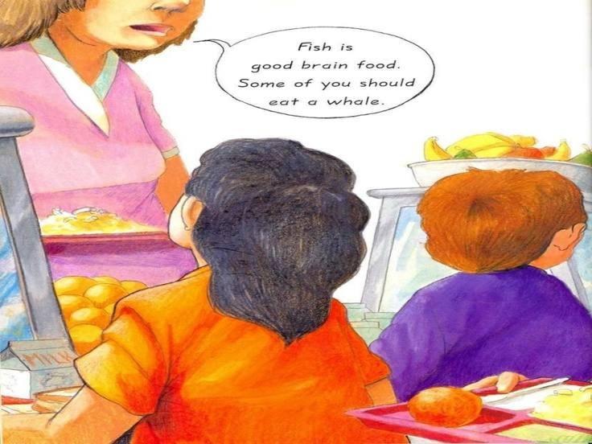

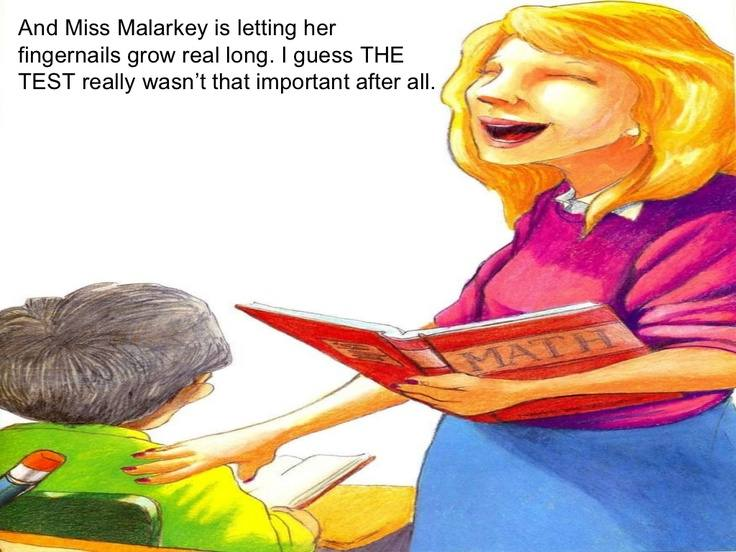

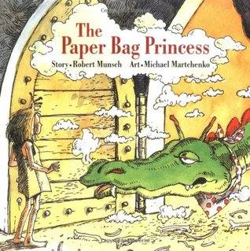

The Princess Elizabeth is slated to marry Prince Ronald when a dragon
attacks the castle and kidnaps Ronald. In resourceful and humorous
fashion, Elizabeth finds the dragon, outsmarts him, and rescues
Ronald\--who is less than pleased at her un-princess-like appearance.

**Summary**

Elizabeth is a beautiful princess who is going to marry a prince named
Ronald. One day, a dragon takes Ronald away. Elizabeth sets out to get
Ronald back from the dragon. Because the dragon had burnt all of her
clothes, the only thing she could find to wear was a paper bag.

Princess Elizabeth went to the dragon\'s cave but the dragon would not
let her in. Elizabeth tried talking to him and asking him to show her
what he could do. He showed her how he could burn down forests and tried
to impress her with how fast he could fly around the world. Elizabeth
giggled. She had outsmarted the dragon by getting him to use up the rest
of his fire and energy.

When the dragon fell asleep, she walked into the cave and rescued
Ronald. When Ronald saw how Elizabeth was dressed, he told her to come
back when she looked like a proper princess. Elizabeth realized her
unappreciative prince was not the one for her and she didn\'t marry him
after all.

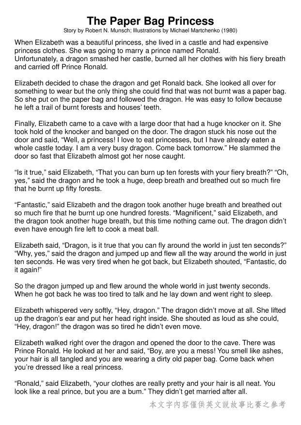

**Writing**

Sensory/Descriptive:

Describe the dragon. How did it look, smell, feel, and sound? Be sure to
use at least two adjectives for each sense to describe the dragon.

Imaginative/Narrative:

What do you think Prince Ronald would have done if Elizabeth were the
one captured by the dragon? Write a story about what would have happened
if things had been the other way around.

Analytical/Persuasive:

Princess Elizabeth rescued Ronald by outsmarting the dragon and making
him so tired that he fell asleep and she was able to rescue Ronald. What
if this had not worked? What are some things that Elizabeth could have
told the dragon to convince him to let Ronald go?

Practical/Informative:

Pretend you are a news reporter reporting on this event. Write an

article about the events of this day. Be sure to include all the facts.

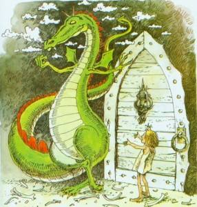

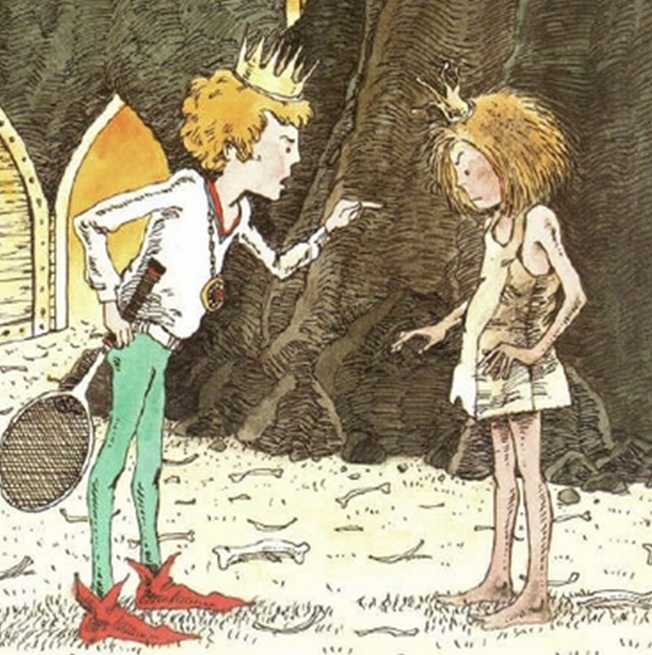

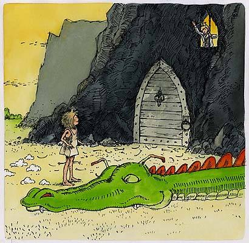

Summary:

Inspired by the story of Mary Ann Goodnight, this historical fiction
story is about a young lady who raised orphan buffalo in Texas and
eventually sent them to Yellowstone National Park.

When Molly first settled in West Texas, she did her chores to \"buffalo
music,\" the noises made by massive herds of buffalo grazing nearby.
Soon, however, buffalo hunters arrived to slaughter the animals they
thought would last forever. \"Forever came fast.\" In six years the
buffalo were gone. Molly\'s grief over their loss abates when a fellow
settler brings her two orphaned buffalo calves to raise. They thrive and
word spreads: Soon Molly\'s herd numbers 100. When Yellowstone National
Park decides to rebuild its herd, some of Molly\'s buffalo become
founding members. Molly\'s story, though fictional, is based on the real
life of pioneer Mary Ann Goodnight, whose homebred buffalo eventually
populated not only Yellowstone but other wildlife refuges and several
zoos. Fern\'s debut is auspicious. Her homespun expressions (\"fending
off wolves and poachers with the long end of my rifle\") allow Molly\'s
straightforward sentiment to shine. Castillo\'s smudgy illustrations
recall Glen Rounds and invest both Molly and the buffalo calves with
enormous personality. Together they make this story one with widespread
appeal.

Mentor Text Writing Skills:

\* Voice

\* Figurative Language

\* Sensory Words

\* Onomatopoeia

\* Vivid Verbs

\* Specificity

\* Word Choice

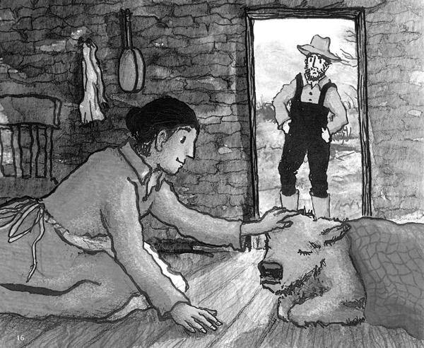

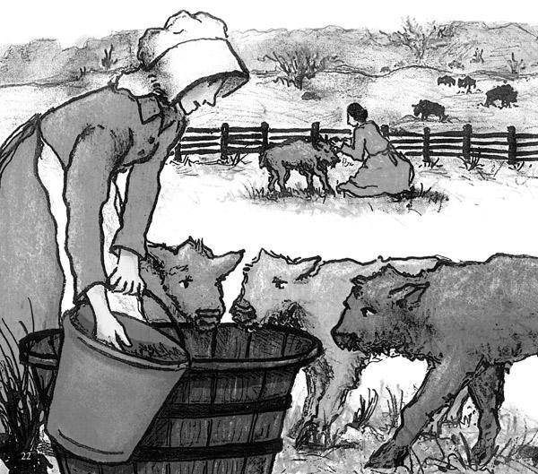

**Buffalo Music Tracey Fern**

When I first settled here, hard on the rim of Palo Duro Canyon, I had no
company but for the animals. I woke to the reveille of the roosters. I
did chores to the choir of the crows. I dreamt to the chorus of thr
coyotes. Mostly, though, I lived to the music of the buffalo.

I stirred the fire to the *huff-huff* of buffalo breath clouding the
chill dawn.

I hoed the garden to the *scritch-scritch* of buffalo scratching
themselves against the cottonwoods.

I scrubbed the bedclothes to the slosh and splash of buffalo bulls
wallowing in the mud hole.

I swept the dugout to the thunder of buffalo as they drifted like a dark
cloud across the prairie.

Buffalo are homely, feisty critters with a stubborn streak wider then
the Rio Grande. My husband, Charlie, says they remind me of my own self
and that's why I have such a fondness for them. 'Course, I can't argue
with him, for fear of proving him right. But no matter the why or
wherefore, that buffalo music played right to my heart.

One day different sounds filled the canyon -- the boom and blast of
rifles.

"What are all them shots?" I asked Charlie.

"Buffalo hunters, Molly," he said. "Fixin' to turn a profit on hides and
hooves."

Seemed like every man in Texas was afire to make a fortune in the
buffalo business. Day after day, the hunters galloped into the heart of
the herd. Shots echoed over the hills and through the hollows from sunup
till sundown. And day after day, another hundred or more buffalo lay
dead.

The heat that summer fell heavy as an angry fist. The trails were deep
with dust. The grass cracked like glass underfoot. And everywhere, as
far as the eye could see, the bleached bones of the buffalo glistened
white in the sun.

"How many till they've killed enough?" I asked Charlie as we rode by a
mountain of buffalo skulls, tall as ten men.

"Guess they figure no matter how many they kill, there's enough to roam
these plains forever," Charlie said.

But forever came fast. Within six seasons, the hunters were gone. So was
the buffalo music.

Oh, those were lonely, silent days! I was near sure the only song left
in the canyon was the cold whistle of the north wind.

But one spring morning, I was lugging wash water up from the river when
a cowhand name of Billie came trotting up.

"Howdy, Miss Molly," Billie said. "Got some orphans for you."

Billie knew IO had a soft spot for critters. He'd bring me whatever
stray or sickly creature he found on the trail -- prairie dogs, wolf
pups, wild turkeys. Once even an antelope.

"What did you bring this time?" I asked Billie as I set down the water
and went to have a look.

Two buffalo calves were trailing after him, skinny as hungry snakes.

"Found 'em snoozin' under a juniper," Billie said. "Hunters must've
figured they were too puny to fuss with. Think you can fatten 'em up?"\
Right then one of the calves let out a soft snort. Lordy, that sound
brought back some memories! I didn't need to hear anything else afore
making up my mind.

"Can't tell till I try," I told Billie. "Let's get 'em inside before
they're supper for the wolves."

I know some people think I'm as tough as old beef jerky, but truth is,
I'd seen too many living things disappear in the hard struggle for life
here. I wasn't about to let the buffalo go, too.

Now, mind you, I don't look a thing like a buffalo mama. I'm thin as a
flapjack and not much taller, but those calves up and followed me back
to the dugout, strolled in through the front door, and set down in front
of the fire!

I named one Calico, seeing as she was the same faded red as my favourite
dress. I called the other Chester, after a neighbour back home in
Tennessee with the same fierce-eyed stare.

Then I set to work tending them. I tucked hot water bottles inside
flannel cloth and wrapped a cloth around each calf like swaddling around
a babe. I fed them like babes, too, squeezing cow's milk from a rag.

They took to it like flies to a keg of molasses. Lordy, those two could
drink -- three gallons a day or more! Kept me so busy, I hardly had time
to blink.

Charlie just shook his head at me, like I didn't have enough brains to
grease a skillet. "Buffalo aren't long for this land," he told me.
"Tending to those two runts won't change that."

But Charlie knew better than to waste his breath arguing with me. When I
got a notion, a wise man knew to let me have my way. And I'd got a
notion that I was going to hear buffalo music again in this lifetime.

Within a few weeks, Calico and Chester were plump as biscuit dumplings!
By then, Charlie had had his fill of wild critters in the dugout. He
fenced off a section of pasture, and I turned the calves loose with the
milking cows.

At first, the cows showed their hind ends to Calico and Chester. Then
they tried to butt them out of the herd. But I didn't give them a
choice. I snubbed those buffalo up tight to two cows until the cows
finally came around and started nursing them like the calves were their
own. By the time winter set in, them calves had a good inch of horn, a
fine woolly beard, and the strength to turn Charlie's fences into
kindling wood!

Pretty soon, word got out all over the Panhandle that I was tending
buffalo calves. Every time a cowhand rode up with another orphan,
Charlie'd heave a sigh and start stoking the dugout fire.

Maybe he was right -- the wild herd likely were long gone, disappeared
like dew before the sun. But I knew there was another way to end the
silence in the canyon: start a herd of my own.

I set to work feeding and watering my orphans, mending the sick,
breeding the healthy, and fending off wolves and poachers with the long
end of my rifle.

With time and tending, my little herd grew. Soon I had one hundred head.

Then one day, word came that Yellowstone National Park was looking to
rebuild its buffalo herd. Soon as I heard that, I got to work.

I drove Calico and Chester and two yearlings to the east edge of our
spread, where the Santa Fe line came through. I set Billie to work
building four timber stalls spiked to the frame of a boxcar. We fastened
up some thick padding to keep the buffalo safe from the swaying and
jostling of the train. Then I loaded up the boxcar with bales of hay and
barrels of water.

"How are we going to get them onboard?" Billie asked, gathering his rope
and eyeing the bulls' horns. "They could bust through that boxcar as
easily as one of Charlie's fences."

I didn't have to think on it too long. I just took a lesson from how
Charlie treats me when I'm feeling ornery and let them have their own
way.

"Drop your rope," I told Billie. Then I tucked a chunk of molasses cake
in my apron, walked slowly past the buffalo, and waited in the boxcar.
Few minutes later, when they were good and ready, all four just strolled
up the ramp after me, gentle as newborn lambs.

I couldn't leave the rest of my herd. Billie would tend these four till
they got settled on their new range. "Take good care of my babes," I
told him as he climbed aboard and the brakeman hitched the car to the
next through freight train.

I stood watching till the last pale wake of smoke whisked away in the
wind, till the last hollow echo of the train whistle faded.

"Good luck to you, my old friends," I whispered.

When Billie wrote a few months later, he had some big news. Calico had
birthed a healthy calf. Lordy, that was some day! To my way of thinking,
it wasn't just the birth of a calf -- it was the rebirth of our national
herd.

The sounds of the canyon are different now. Settlers have crowded in.
Fences and longhorns dot the land as far as the eye can see. Nowadays, I
wake to the rumble of engines, do chores to the whoop and holler of a
hundred cowhands, and go to sleep to the blast of the train whistles.

But some days when I ride north beyond the last stand of salt cedar, I
can once again hear the faint chords of the old songs. I hear the
clatter of clashing horns. I hear the bellowing of the bulls. I hear the
muffled thud of hooves as they hurl up dust. And I live on the keen edge
of hope that one day the strains of that sweet, wild music will reach
far beyond these canyon walls.

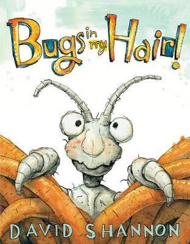

**Bugs in My Hair David Shannon**

Is something bugging you? Bestselling award-winner David Shannon shows
the funny side of waging war against\--oh no!\--head lice.

This book is guaranteed to make you laugh\--and itch! From the opening
picture of a happy, oversized louse appearing with his suitcases, you
know these bugs are determined to stay, and Mum is about to go nuts!

Nobody talks about them, but they are everywhere. (Some estimate 20
million children a year host them.) Oh the shame and humiliation of
having bugs in your hair! But if you go to school, or have play dates,
chances are good you might meet them someday. Maybe you already have!
Lucky for you, the unwelcome bugs in this story are so funny you will be
laughing aloud\--even when Mum attacks them with battle-tested anti-lice
weapons.

Shannon peppers his hilarious scenes with fun, \"nitpicking\" facts
about these \"lousy\" critters and pokes fun at common denial: \"It\'s
probably ash from that volcano in Pogo Pogo.\"

Soon the party\'s over\--Bye bye, Little Nasties! Once again Shannon has
created a fresh, highly entertaining read-aloud classic that begs to be
read again and again.

- Goodreads

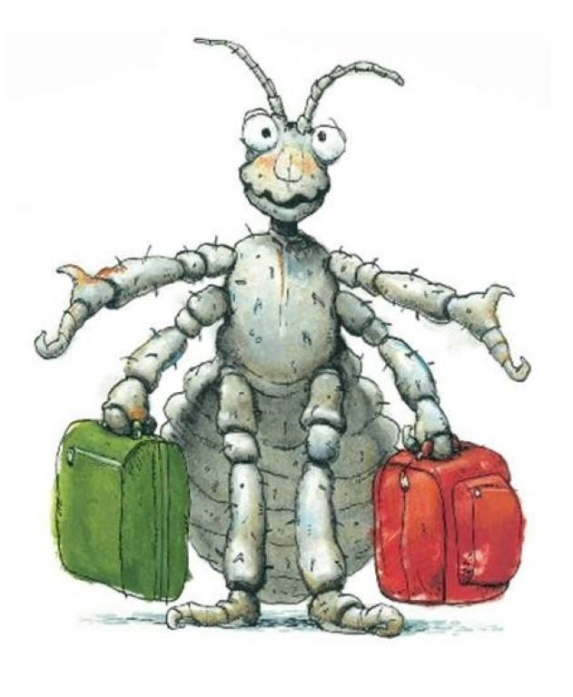

**LICE**

Scratch scratch. Scratch. Your head is feeling really itchy. Could it be
lice?

If so, you\'re not alone. Every year, between 6 and 12 million people
worldwide get head lice. Most of those millions are kids. Any kid who
goes to school has probably already heard about lice. They can spread
easily at schools, so if one kid gets them, the rest of the class might
get them, too. What can you do? Let\'s find out.

What Are Lice?

Lice are very, very small insects. In fact, they are so tiny that you
can barely see them! Each louse (the name for one of the lice) is brown
and grey and only about the size of a sesame seed.

Lice are parasites, which means that they live off other living things.
Head lice need to be next to skin to survive --- and the warmth of your
skin is a perfect place for them to live. Lice eat tiny amounts of blood
(much less than a mosquito does) for their nourishment and use their
sticky little feet to hold on to hair. Gross!

When lice start living in hair, they also start to lay eggs, or nits.
Lice can survive up to 30 days on a person\'s head and can lay eight
eggs a day. Lice attach their nits to pieces of hair, close to the
scalp. If you see a small, oval blob on a strand of hair, that\'s
probably a nit. If these little eggs are yellow, tan, or brown, the lice
haven\'t hatched yet. If the eggs are white or clear, the lice have
hatched.

Although they don\'t hurt, lice sometimes can irritate the skin and make
it itchy (especially at night). Too much scratching can lead to scalp
infections.

- KidsHealth

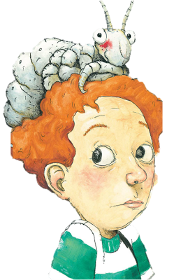

**Freddy Flea**

On my toe is Freddy flea (Touch toe)

Now he\'s climbing up on me (climb fingers upward)

Past my tummy

Past my nose

On my head where my hair grows (wiggle fingers in hair)

On my head is Freddy flea

Now he\'s climbing down on me (climb fingers back down body)

Past my tummy

Past my knee

On the floor (Stomp foot!) Take that you flea!

**Bugs in My Hair David Shannon**

One day, My mum made a terrible, awful discovery ...

Head Lice!

There were bugs in my hair!! And they were laying eggs\*!!!

\*Lice eggs are called "nits."

My head really itched!

What the heck were they doing up there?

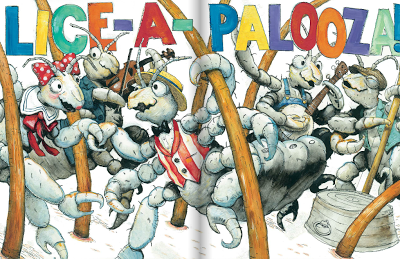

Actually, they were feasting on my BLOOD.\*

\*Ick!

Oh, the SHAME! The humiliation!

Everyone will know.

I won't have any friends.

> HOW IT FELT

. Actual size of a louse\*

\*Louse is where the word "lousy comes from.

I wondered how I got lice.

From a hug?

A hat?

Maybe a sofa?

At school?

At the movies?

From my dog?\*

I found out a bunch of kids had them!

\*Relax. Dogs don't get head lice.

It was hard for some to admit they had lice (even to themselves).

"That's just dandruff."

"I think it's sand from the beach."

"It's probably ash from that volcano in Pogo Pogo."

Other people thought they had lice even when they didn't. Just talking
about bugs made my mum itchy. Her problem wasn't on her head, it was in
her head.

I heard about lots of cures.

Shave my head.

Bomb the bugs with the strongest chemicals known to mankind.

Mayonnaise.

They all sounded AWFUL!

Lice are really hard to get rid of.

Mum did laundry every day to keep bugs from spreading.

It was like they took over our whole life!

If we didn't stop them they might ...

CONQUER THE WORLD!

BUGZILLA!

THIS WAS WAR!

Stinky stuff that lice hate.\*

Magnifying glasses.

\*Eucalyptus oil, peppermint oil, tea tree oil, etc.

Nit comb.

Mum read lots of books and magazines and she armed herself with
battle-tested anti-lice weapons.

The party's over little nasties!

Finally, everything was laundered, treated, sprayed, combed, picked,\*
and cleaned. We went to a professional lice treatment place and I was
pronounced bug-free!

\*Guess where we get the term "nitpicking."

For the first time in forever I got s good night's sleep.

And then ...

OH, NO! THEY'RE BACK!

So we went through the whole thing again and now, at last, those awful,
disgusting lice are completely gone.

And this time ...

I'm not taking any chances!

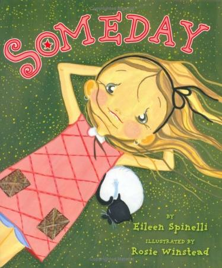

It's hard to be content with the present moment when you are little. The
future has infinitely more possibilities!

Here, the prolific and poetic Eileen Spinelli offers us the opportunity
to truly enter the mind and heart of a little girl whose dreams reach
well beyond today. With Eileen Spinelli's gift for capturing the
authentic experience of a child and Rosie Winstead's utterly accessible
and adorable artwork, this is sure to be a book that will inspire kids
to think about what their own plans are for someday.

Lesson:

Use Someday as a mentor text to innovate on the format.

Someday ...

Someday

Today ...

Right now ...

In the meantime ...

As for today ...

Tonight ...

Right now.

**Someday Eileen Spinelli**

**Someday**

I am going to be

a great artist.

I will wear a blue smock.

I will carry my paints

to the beach

to pain the sea.

A very rich person

will offer to buy my painting

for two million dollars.

But I will smile.

And I will say: "I'm sorry,

this painting is not for sale.

It is a gift for my art teacher."

**Someday ...**

**Today**

I am off to

Help my dad

Paint the shed.

Green.

(It's where I keep my bike.

I just might paint that too.)

**Someday**

I will make friends with a dolphin.

I will call her Wilma.

Wilma will let me climb on her back.

We will speed across the water.

We will sail beside tall ships.

We will dip under the waves.

I will ask Wilma

to tell me all the secrets

of the sea.

And she will.

**Right now**

I am shaking fish-food flakes into the bowl

Where my pet goldfish, Pumpkin, lives.

Pumpkin darts in and out of

His pink castle.

He blows tiny bubbles.

But he doesn't

Talk to me.

Maybe goldfish don't have secrets to tell.

**Someday**

I will dig for dinosaur bones.

Deep in a field

where once a farmer grew corn

and chickens scratched.

I will find the bones of a T-rex.

The farmer will faint

with surprise.

Reporters from the TV station

will bring their cameras

and microphones.

I will be on the evening news.

**Someday ...**

**Today**

I am digging for coins

under the sofa cushions.

Quarters! Dimes! Nickels!

Enough for a Popsicle.

**Someday**

I will be invited

to the White House

to have lunch

with the president.

He will want my ideas

on world peace.

I will wear white gloves

And a hat with a rose

Pinned to it.

I will bring the president

A box of golf balls.

The White House waiter

Will pour tea.

I will eat my salad carefully.

No spills on the rug.

**In the meantime**

I'm having lunch with

my cousin Harry.

Harry talks with his mouth full.

He slurps his milk.

He burps.

I don't think Harry

will ever be invited

to the White House.

**Someday**

I will be an animal scientist.

I will travel to the South Pole.

I will count Macaroni Penguins --

all five million of them.

It will take a very, very long time.

My hair will turn grey.

I will return home

to a ticker-tape parade.

Five million people will cheer.

**Someday ...**

**Right now**

My hair is still brown

and it's jelly beans

I'm counting.

Ten for my

little brother, Roger.

Eleven for me.

One extra for the counter.

**Someday**

I am going to be

a gymnast

at the Olympics.

I will tumble and

twirl across the mat.

I will leap into the air

as gracefully

as any ballerina.

The judges will swoon

with delight.

I'll win the gold medal!

**Someday ...**

**As for today --** I am practising cartwheels in the backyard

Look out!

Splat!

Do they make medals out of mud?

**Someday**

I will spend the night

In Egypt.

I will ride a camel

to the silvery dark.

I will feel

The cool desert breeze

as I climb down from

the camel's back.

I will take my frog-print pyjamas

from my overnight bag

and put them on

behind a thornbush.

I will lie next to the pyramid

in the bright moonlight.

I will dream of golden palaces

And pointy-eared cats.

**Someday ...**

**Tonight**

I'm sleeping

On the bottom bunk

with Roger, who is afraid

of monsters

and the dark.

I think he forgot to brush his teeth.

His breath smells like a camel's.

I turn towards the open window,

where the night sky glitters

with stars.

Quietly Mum and Dad come into

our room to tuck us in.

mum kisses our foreheads.

When they leave

I go to my window.

I see two baby owls

perched on a branch

of the tree.

I think they are going to fly

for the first time.

In the dark

I smile.

**Right now.**

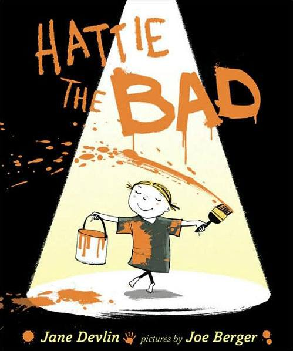

**Hattie the Bad Jane Devlin**

Everyone can identify a little with the narrator of this perky story, a
girl named Hattie who admits to being "bad" every once in a while. And
when she says bad, "I don't mean forget-to-clean-up-her-room,
reading-comics-after-bedtime bad." Eating dog biscuits and putting frogs
in the refrigerator were part of her routine, so too was offering to
sell her little brother for twenty cents at a yard sale. Her parents are
not amused by her antics, and frankly, the other kids are not either, so
she decides on a new approach. Hattie the Bad becomes Hattie the
Best-Behaved Child Ever, with a twist that reminds everyone that having
a bit of personality is not such a bad thing at all either. Jane
Devlin's idea here is cute, but it is the exuberantly wacky
illustrations of Joe Berger that really carry the day.

Review -- N.Basbanes

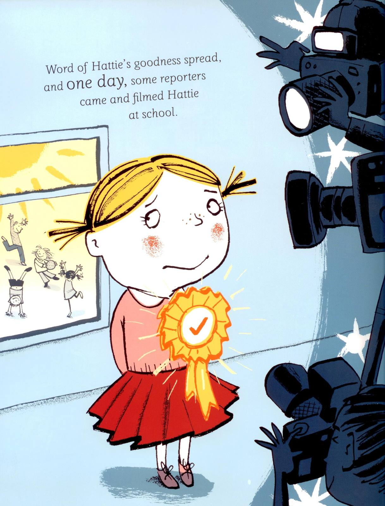

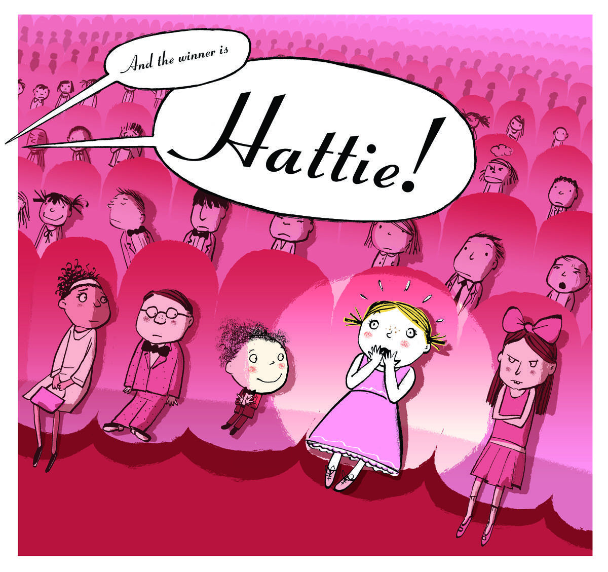

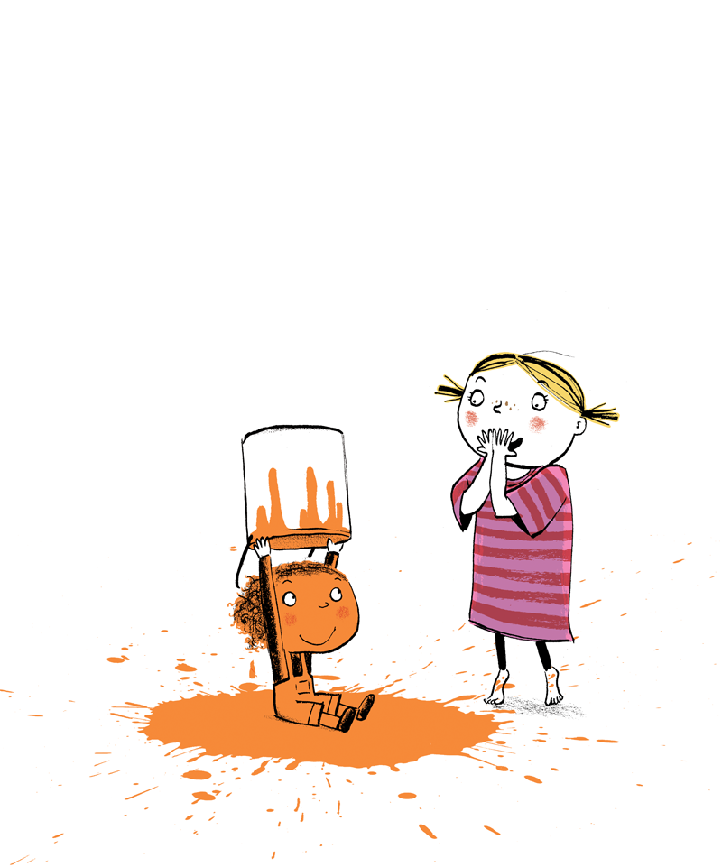

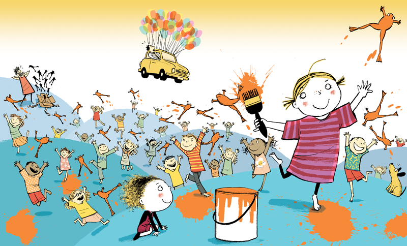

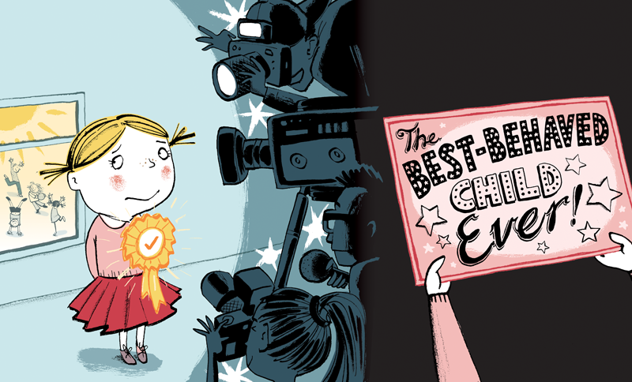

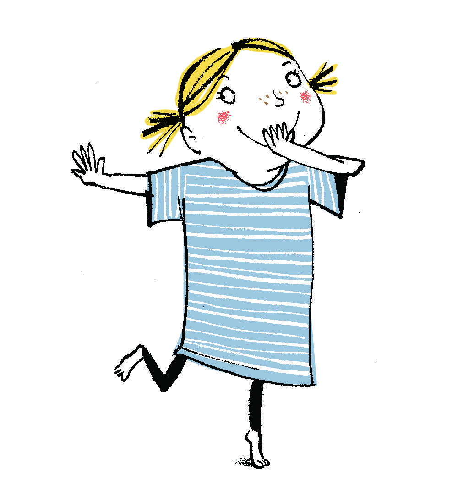

**Hattie the Bad Jane Devlin**

HATTIE WAS BAD.

When I say BAD, I don't mean a forgot-to-clean-her-room,
reading-comics-after-bedtime kind of BAD.

When I say BAD, I mean really, REALLY bad.

That is why she was called HATTIE THE BAD.

Hattie's mum said that Hattie had always been a good baby until one day
she was dropped on her head.

But even Hattie's baby brother Eddie could have told you that was a load
of baloney.

The truth was, when Hattie was a tiny little girl she had actually been
quite good.

But after a while, she couldn't help noticing that being good meant you
had to do ridiculous things like eating mushy food and going to bed when
you weren't even tired.

And where was the fun in that?

Exactly.

So Hattie became BAD.

At first she could only do small bad things like eating dog biscuits.

But as she got older, she got better and better at it.

You might be thinking that Hattie was SO bad she must not have any
friends, but you would be wrong.

Hattie was always doing EXCITING bad things, you see, so the other
children thought she was great.

Their parents disagreed.

They told their children not to play with Hattie. Being BAD with no one
else to enjoy it made Hattie feel SAD. So she had an idea.

She would become Hattie the Good. She would be just as good at being
good as she had been at being BAD.

So she wore whatever her mother wanted. She even went to bed without
being asked.

Soon the other parents forgot about Hattie the BAD.

"Sit next to Hattie," they said. "She always gets the best grades."

"I don't know why you're complaining. Hattie looks lovely in hers."

Soon the children got so fed up, they didn't want to play with hattie
any more.

Word of Hattie's goodness spread, and one day, some reporters came and
filmed Hattie at school.

Then a letter arrived inviting her to a competition to find

+------------------------------------+
| **The**                            |
|                                    |
| **BEST-BEHAVED**                   |
|                                    |
| **CHILD**                          |
|                                    |
| **Ever!**                          |
+====================================+

The day came. The famous TV lady had a large golden envelope. She opened
it up ...

"And the winner is Hattie!"

Suddenly Hattie got a funny feeling inside. As she walked up the stairs,
the feeling got bigger and bigger.

"Is there anything you'd like to say?" asked the famous TV lady.

Hattie nodded, took a deep breath, and opened her mouth to shout:

**UNDERPANTS!**

as loud as she possibly could.

All over the country, grown-ups gasped and tried to cover their
children's ears.

All over the country children -- even the good ones -- cheered.

HATTIE THE BAD was BACK (with just a teensy bit of good).

And NO ONE refused to play with her ...

ever again.

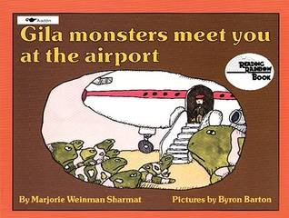

**Gila Monsters meet You at the Airport Marjorie Sharmat**

\"I live at 165 East 95th Street, and I\'m going to stay here forever.\"
says the young hero firmly. After all, out West nobody plays baseball
because they\'re too busy chasing buffaloes, and you have to ride a
horse to school even if you don\'t know how, and you can\'t sit down
because of the cactus. But his parents are moving West, and they say he
has to go, too. Once there, however, the boy doesn\'t meet the Gila
monsters he expected. And on the ride to his new home (by taxi, not
horse) he discovers the West is neither as different nor as bad as he\'d
imagined.

Marjorie Weinman Sharmat and Byron Barton share a keen sense of the
ridiculous and a compassionate understanding of a child\'s anxieties.
Together they have created a perceptive, exuberantly funny picture book
that will have children in all parts of the country laughing away their
own fears about new experiences.

Goodreads

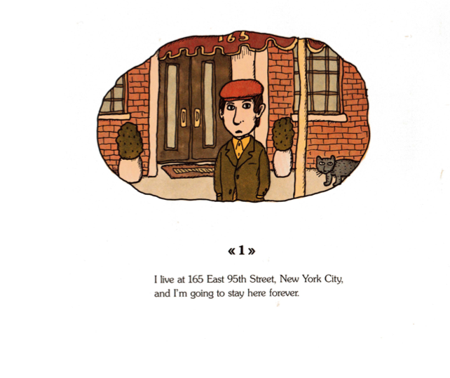

**Gila Monsters Meet you at the Airport Marjorie Sharmat**

I live at 165 East 95^th^ Street, New York City, and I'm going to stay
here forever.

My mother and father are moving. Out West.

They say I have to go, too.

They say I can't stay here forever.

Out West nobody plays baseball because they're too busy chasing
buffaloes.

And there's cactus everywhere you look. But if you don't look, you have
to stand up just as soon as you sit down.

Out West it takes fifteen minutes to say hello. Like this:
H-O-W-W-W-D-Y,

P-A-A-A-R-D-N-E-R.

Out West I'll look silly all the time. I'll have to wear chaps and spurs
and a bandanna and a hat so big that nobody can find me underneath it.
And I'll have to ride a horse to school every day and I don't know how.

Out West everybody grows up to be a sheriff. I want to be a subway
driver.

My best friend is Seymour, and we like to eat salami sandwiches
together.

Out West I probably won't have any friends, but if I do, they'll be
named Tex or Slim, and we'll eat chili and beans for breakfast. And
lunch. And dinner. While I miss Seymour and salami.

I'm on my way. Out West. It's cool in the aeroplane.

The desert is so hot you can collapse, and then the buzzards circle
overhead, but no one rescues you because it's real life and not the
movies.

There are clouds out the window. No buzzards yet.

I'm looking at a map. Before, whenever I looked at a map, I always knew
my house was on the right. But no more. Now I'm in the middle of that
map, and I'm going left. Out West.

Seymour says there are Gila monsters and horned toads out West, and I
read it in a book so I know it's so. But Seymour says they meet you at
the airport.

We're here. Out West.

I don't know what a Gila monster or horned toad looks like, but I don't
think I see any at the airport.

I see a boy in a cowboy hat. He looks like Seymour, but I know his name
is Tex.

"Hi," I say.

"Hi," he says. "I'm moving East."

"Great!" I say.

"Great?" he says. "What's so great about it? Don't you know that the
streets are full of gangsters? They all wear flowers in their lapels so
they look honest, but they zoom around in big cars with screeching
brakes. You have to jump out of their way.

"In the East it snows and blows all the time, except for five minutes
when it's spring and summer.

"And you have to live on the 50^th^ floor. Aeroplanes fly through your
bedroom, and you've got to duck fast.

"They ran out of extra space in the East a long time ago. It's so
crowded people sit on top of each when they ride to work.

"And alligators live in the sewers. I read it in a book so I know it's
so."

Then the mother and father of the boy who looks like Seymour but isn't
grab his hand, and he goes off.

"Sometimes the alligators get out," he yells to me. "And they wait for
you at the airport,"

It's warm, but there's a nice breeze. We're in a taxi riding to our new
house.

No horses yet. I don't see any buffalo stampedes either. I see a
restaurant just like the one in my old neighbourhood.

I see some kids playing baseball.

I see a horse. Hey, that's a great-looking horse!

I'm going to ask n=my mother and father for one like it.

Here's our house. Some kids are riding their bikes in front of it. I
hope one of them is named Slim.

Tomorrow I'm writing a long letter to Seymour. I'll tell him I'm sending
it by pony express. Seymour will believe me. Back east they don't know
much about us Westerners.

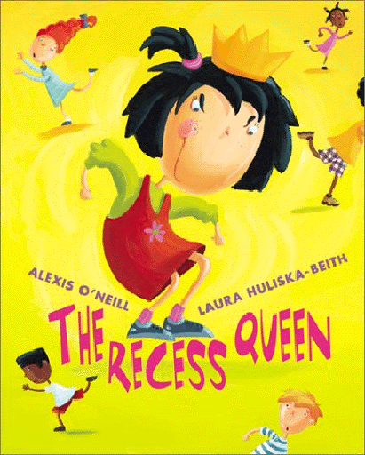

**The Recess Queen Alexis O'Neill**

Summary

A schoolyard bully is enlightened by the new kid in class in this lively
story about the power of kindness and friendship. \"Mean Jean was Recess
Queen/ and nobody said any different,\" the tale begins. Each day at
recess, Mean Jean blasts through the playground . . . No one dares cross
her path: \"She\'d push \'em and smoosh \'em, lollapaloosh \'em.\" But
when tiny Katie Sue, a new student, arrives, all bets are off. . . Her
role usurped, Mean Jean moves toward a meltdown, until Katie Sue makes
her an offer she finds difficult to refuse: an invitation to play
together.

Reviews

Told in a rollicking rhyme, the story offers a lighthearted look at a
serious topic in schools and on playgrounds everywhere - the bully.
Katie Sue puts Mean Jean in her place in a surprisingly easy way -
simply by being too new to know any better. In a nice twist, when
confronted by Mean Jean, instead of backing away, the newcomer invites
her to play. Both the text and the art are smart, sassy, and energetic.
The text effectively dips, swirls, and slants around the action of the
art, further marrying the two.

\- School Library Journal

A schoolyard bully is enlightened by the new kid in class in this lively
story about the power of kindness and friendship. O\'Neill\'s text brims
with fun-to-say phrases that fit a rollicking rhythm, and her assessment
of recess dynamics feels authentic.

-- Publisher's Weekly

O\'Neill puts seemingly meek, new classmate Katie Sue up against
aggressive Mean Jean, swaggering boss of the playground. But Katie Sue
stands up to her with a cheeky, \"How DID you get to be so bossy?\" and
pulls out a jump rope, inviting Mean Jean to jump along. Presto
change-o, a friendship is born. Huliska-Beith\'s rubbery-limbed figures,
rolling perspectives, and neon-bright colors reflect the text\'s
informality as well as its frenzied energy. Young readers will be caught
up by Katie Sue\'s engaging, fizzy exuberance.

\- Kirkus Reviews

The ability to offhandedly deflate a bully, with neither animosity nor
remorse, is my idea of heaven --- and is high on my wish list for my
daughters. This snappily told story of unwavering self-worth and the
power of cheerful assertion gives us hope --- and lots of laughs.

-- Just One More Book

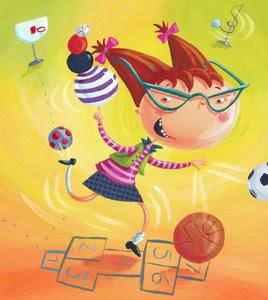

**The Recess Queen Alexis O'Neill**

Mean Jean was Recess Queen and nobody said any different.

Nobody swung until Mean Jean swung. Nobody kicked until Mean Jean
kicked. Nobody bounced until Mean Jean bounced. If kids ever crossed
her, she'd push 'em and smoosh 'em, loolapaloosh 'em, hammer 'em,
slammer 'em, kitz and kajammer 'em.

"Say WHAT?" Mean Jean growled.

"Say WHO?" Mean Jean howled. "Say YOU! Just who do you think you're
talking to?" Mean Jean always got her way.

UNTIL one day...

...a new kid came to school. Katie Sue! A teeny kid. A tiny kid. A kid
you might scare with a jump and a "BOO!"

But when the recess bell went ringity-ring, this kid ran zingity-zing
for the playground gate. Katie Sue SWUNG before Mean Jean swung. Katie
Sue KICKED before Mean Jean kicked. Katie Sue BOUNCED before Katie Sue
bounced. The kid you might scare with a jump and a "BOO!" was too new to
know about Mean Jean the Recess Queen.

Well, Mean Jean bullied through the playground crowd. Like always, she
pushed kids and smooshed kids, lollapalooshed kids, hammered 'em,
slammered 'em, kitz and kajammered 'em as she charged after that Katie
Sue.

"Say WHAT?" she growled. "Say WHO?" she howled. "Say YOU!" she snarled
and grabbed Katie Sue by the collar. "Nobody swings until Queen Jean
swings. Nobody kicks until Queen Jean kicks. Nobody bounces until Queen
Jean bounces," and she figured that would set the record straight.

She figured wrong. Katie Sue talked back! Just as sassy as could be, she
said, "How DID you get so bossy?" Then that puny thing that loony thing,
grabbed the ball and bounced away. Oh! Katie Sue was one quick kid. She
bolted quick as lightning.

BOUNCITY BOUNCITY BOUNCE.

KICKITY KICKITY KICK.

SWINGITY SWINGITY SWING.

Mean Jean thundered close behind. BOUNCITY. KICKITY. SWINGITY.

The Recess Queen was NOT amused. She raced and chased and in-your-faced
that Katie Sue.

No one spoke. No one moved. No one BREATHED.

Then from her pack pulled Katie Sue a jump rope clean and bright.

"Hey, Jeanie Beanie," sang Katie Sue. "Let's try this jump rope out!"

Here's one thing true -- until that day no one DARED ask mean Jean to
play. But that Katie Sue just hopped and jumped and skipped away. "I
like ice cream, I like tea, I want Jean to jump with me!"

Jean just gaped and stared as if too SCARED to move at all. so Katie Sue
sang once more. "I like popcorn, I like tea, I want jean to jump with
me!"

Then from the side a kid called out, "GO, JEAN, GO!"

And too surprised to even shout, Jean jumped in with Katie Sue.

"I like cookies, I like tea, I want YOU to jump with me!"

The rope whizzed and slapped, FASTER , FASTER, the rope spun and
flapped, FASTER, FASTER! Till it caught in a tangled disaster. But they
just giggled and JUMPED AGAIN.

WELL -- now when recess rolls around that playground's one great place.
At the school bell's ringity-ring those two girls race zingity-zing out
the classroom door. jean doesn't push kids and smoosh kids, lollapaloosh
kids, hammer 'em, slammer 'em, kitz and kajammer 'em -- 'cause she's
having too much fun rompity-romping with her FRIENDS.

Bouncity, kickity, swingity,

Hoppity, skippity, jumpity,

Ringity, zingity,

YESSSSSS!

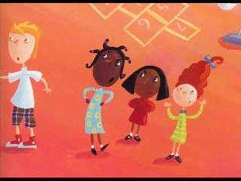

**Word Splash**

Good books to use:

*The Recess Queen --* Alexis O'Neill

*Olivia --* Ian Falconer

*Mr George Baker --* Amy Hest

*The Other Dog --* Madeleine L'Engle

Choose a picture from the book and enlarge it.

3 column chart - Adjectives Nouns Verbs

Brainstorm nouns that name the picture

Brainstorm verbs

Brainstorm adjectives

Use chart for word work.

E.g. synonym pairs, antonyms, root words, homophones, compound words,
words with affixes.

The Recess Queen

Adjectives Nouns Verbs (-ed form)

nasty rude girl shouted yakked

mean bossy student screamed yelled

ugly loud classmate threatened hissed

mad horrible kid ordered scared

crazy terrible bully demanded barked

scary freaky sister commanded

frightening child told

furious teenager bossed

red-faced enemy said

meany growled

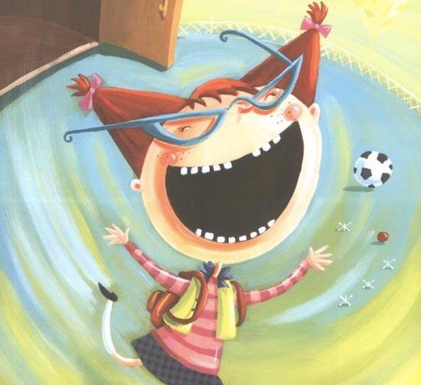

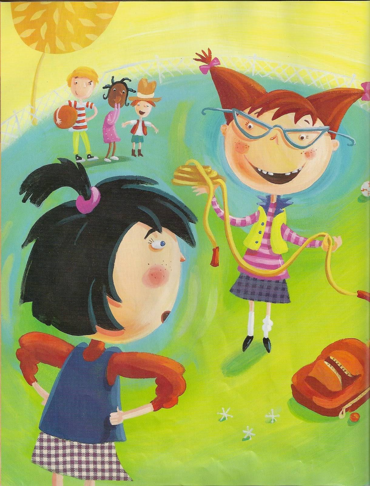

**When I Was Little Jamie Lee Curtis**

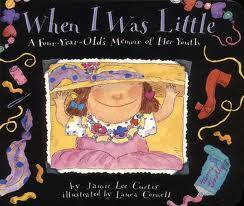

Jamie Lee Curtis and Laura Cornell perfectly capture a little girl\'s
simple, childlike celebration of herself, as she looks back on her
childhood from the lofty height of four and a half years.

**When I Was Five Arthur Howard**

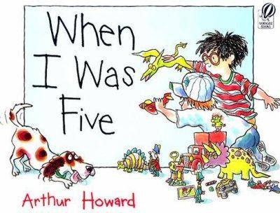

Jeremy tells what his life was like when he was five. Back then, he
wanted to be an astronaut or a cowboy or both. He liked pterodactyls and
his favourite secret hiding place was down by a pond. His best friend
was Mark. Now that he\'s six, he wants to be a major-league ballplayer
or a deep-sea diver. He goes in for Tyrannosaurus Rex and shares only
his second-best hiding place (his favourite hiding place is a secret).
He still has a best friend, Mark: "Some things never change."

Students' writing follows the format for each book.

When I was little

A four-year old's memoir of her youth.

Jamie Lee Curtis

When I was little I was a baby.

When I was little, I cried a lot.

Now I use words.

When I was little, I didn't know I was a girl.

My mum told me.

When I was little, I had silly hair. Now I can wear it in a ponytail or
braids

or pigtails or a pom-pom.

When I was little, I didn't get to eat Captain Crunch or paint my
toenails bubble-gum pink.

When I was little, I spilled a lot. My mum said I was a handful.

Now I'm helpful.

When I was little, I rode in a baby car seat.

Now I ride like a grown-up and wave at policemen.

When I was little, I went to Mummy and Me. Now I go to nursery school,
and I have teachers and cubbies and naptime and secrets.

When I was little I didn't understand time-outs.

Now I do, but I don't like them.

When I was little, I made up words like "scoopeeloo".

Now I make up songs.

When I was little, I swam in the pool with boys.

I still do, but now we wear bathing suits, but we don't wear floaties.

When I was little, the slide at the park was so big.

Now it's smaller, but I still like my granny to wait at the bottom for
me.

When I was little, I ate goo and yucky stuff.

Now I eat pizza and noodles and fruit and Chee-tos.

When I was little I had two teeth.

Now I have lots and I know how to brush them.

When I was little I slept in a zoo.

Now I sleep in a big bed and get to play monkey.

When I was little, I kissed my mum and dad good-night every night.

I still do, but only after they each read me a book and we play tickle
torture.

When I was little, I didn't know what a family was.

When I was little, I didn't know what dreams were.

When I was little, I didn't know who I was.

Now I do.

**When I Was Five**

**Arthur Howard**

When I was five I wanted to be an astronaut,

or a cowboy,

or both.

When I was five this was my favourite kind of car,

this was my favourite kind of dinosaur,

this was my favourite secret hiding place,

and this was my best friend, Mark.

Mark had a dog named Peggy,

a brother who used bad words,

and bunk beds -- my favourite kind of bed when I was five.

Now I'm six

and I want to be a major-league baseball player,

or a deep-sea diver.

Now that I'm six this is my favourite kind of car,

this is my favourite kind of dinosaur,

this is my second-best hiding place

(my favourite one is a secret),

and this is my best friend, Mark.

Some things never change.

**Fireflies Julie Brinckloe**

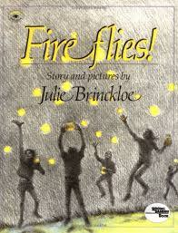

A young boy is proud of having caught a jar full of fireflies, which
seems to him like owning a piece of moonlight, but as the light begins
to dim he realises he must set the insects free or they will die.

**Fireflies Julie Brinckloe**

On a summer evening I looked up from dinner, through the open window to
the backyard. It was growing dark. My treehouse was a black shape in the
tree and I wouldn't go up there now. But something flickered there, a
moment -- I looked, and it was gone. It flickered again, over near the
fence. *Fireflies!*

"Don't let your dinner get cold," said Momma.

I forked the meat and corn and potatoes into my mouth.

"Please may I go out? The fireflies -- "

Momma smiled, and Daddy nodded.

"Go ahead," they said.

I ran from the table, down to the cellar to find a jar. I knew where to
look, behind the stairs. The jars were dusty and I polished one clean on
my shirt. Then I ran back up, two steps at a time.

"Holes," I remembered, "so they can breathe."

And as quietly as I could, so she wouldn't catch me dulling them, I
poked holes in the top of the jar with Momma's scissors.

The screen door banged behind me as I ran from the house. If someone
said, "Don't slam it," I wasn't listening.

I called to my friends in the street, "Fireflies!" But they had come
before me with polished jars, and others were coming behind.

The sky was darker now. My ears rang with crickets, and my eyes stung
from staring too long. I blinked hard as I watched them -- *Fireflies!*
Blinking on, blinking off, dipping low, soaring high above my head,
making white patterns in the dark.

We ran like crazy, barefoot in the grass..

"Catch them, catch them!" we cried, grasping at the lights.

Suddenly a voice called out above the others.

"I caught one!" And it was my own. I thrust my hand into the jar and
spread it open. The jar glowed like moonlight and I held it in my hands.
I felt a tremble of joy and shouted, "I can catch hundreds!"

Then we dashed about, waving our hands in the air like nets, catching
two, ten -- hundreds of fireflies, thrusting them into jars, waving our
hands for more.

Then someone called from my house, "It's time to come in, now," and
others called from other houses and it was over. My friends took jars of
fireflies to different homes.

I climbed the stairs to my room and set the jar on a table by my bed.
Momma kissed me and turned out the light.

"I caught hundreds," I said.

Daddy called from the hallway, "See you later, alligator."

"After a while, crocodile," I called back. "I caught hundreds of
fireflies --"

In the dark I watched the fireflies from my bed. They blinked off and
on, and the jar glowed like moonlight. But it was not the same. The
fireflies beat their wings against the glass and fell to the bottom, and
lay there. The light in the jar turned yellow like a flashlight left on
too long. I tried to swallow, but something in my throat would not go
down. And the light grew dimmer, green, like moonlight under water. I
shut my eyes tight and put the pillow over my head. They were *my*
fireflies. I caught them. They made moonlight in my jar. But the jar was
nearly dark.

I flung off the covers. I went to the window, opened the jar, and aimed
it at the stars.

"Fly!"

Then the jar began to glow, green, then gold, then white as the moon.
And the fireflies poured out into the night.

*Fireflies!* Blinking on, blinking off, dipping low, soaring high above
my head, making circles around the moon, like stars dancing.

I held the jar, dark and empty, in my hands. The moonlight and the
fireflies swam in my tears, but I could feel myself smiling.

**Fireflies!** **Reading Strategies**

+----------------------------+----------------------------------------+
| **STRATEGY**               | **EXAMPLE**                            |
+============================+========================================+
| **PRIOR KNOWLEDGE**        | Possibly on vacation in Queensland.    |
|                            |                                        |
|                            | Reading                                |
+----------------------------+----------------------------------------+
| **QUESTIONING**            | Before:                                |
|                            |                                        |
|                            | *Are there fireflies in Australia?*    |
|                            |                                        |
|                            | During:                                |
|                            |                                        |
|                            | See Inferring                          |
|                            |                                        |
|                            | After:                                 |
|                            |                                        |
|                            | See Synthesising                       |
+----------------------------+----------------------------------------+
| **VISUALISING**            | Senses:                                |
|                            |                                        |
|                            | *My ears rang with crickets ...*       |
|                            |                                        |
|                            | *Fireflies! Blinking on, blinking off, |
|                            | dipping low, soaring high above my     |
|                            | head, making white patterns in the     |
|                            | dark.*                                 |
|                            |                                        |
|                            | *Similes:*                             |
|                            |                                        |
|                            | *The jar glowed like moonlight ...*    |
|                            |                                        |
|                            | *... waving our hands in the air like  |
|                            | nets,*                                 |
|                            |                                        |
|                            | *The light in the jar turned yellow    |
|                            | like a flashlight left on too long.    |
|                            | (Others)*                              |
|                            |                                        |
|                            | *Metaphor:*                            |
|                            |                                        |
|                            | *They made moonlight in my jar.*       |
+----------------------------+----------------------------------------+
| **INFERRING**              | *The screen door banged behind me as I |
|                            | ran from the house. If someone said,   |
|                            | "Don't slam it," I wasn't listening.*  |
|                            | (Why not?)                             |
|                            |                                        |
|                            | *But it was not the same.*             |
|                            |                                        |
|                            | Why wasn't it the same in his room?    |
|                            |                                        |
|                            | *The moonlight and the fireflies swam  |
|                            | in my tears, but I could feel myself   |
|                            | smiling.*                              |
|                            |                                        |
|                            | Why was he crying and smiling?         |
|                            |                                        |
|                            | What is the theme of the story?        |
+----------------------------+----------------------------------------+
| **DETERMINING IMPORTANT    | Discuss theme.                         |
| IDEAS**                    |                                        |
|                            | See synthesising.                      |
+----------------------------+----------------------------------------+
| **SYNTHESISING**           | Why did the boy release the fireflies  |
|                            | even though he wanted to keep them?    |
|                            |                                        |
|                            | Have you ever experienced where you've |
|                            | done something, even though you didn't |
|                            | want to?                               |
|                            |                                        |
|                            | What would have happened if he had     |
|                            | decided to keep the fireflies?         |
|                            |                                        |
|                            | What happened to the fireflies that    |
|                            | the other kids captured?               |
+----------------------------+----------------------------------------+

**Fireflies - Inferring**

+----------------------+----------------------+----------------------+
| **Text**             | **Background         | **Inference**        |
|                      | Knowledge**          |                      |
+======================+======================+======================+
| *There are blinking* |                      |                      |
|                      |                      |                      |
| *lights flying       |                      |                      |
| around*              |                      |                      |
|                      |                      |                      |
| *outside. (p. 3)*    |                      |                      |
+----------------------+----------------------+----------------------+
| *Mum says, "Don't    |                      |                      |
| let*                 |                      |                      |
|                      |                      |                      |
| *your dinner get     |                      |                      |
| cold."*              |                      |                      |
+----------------------+----------------------+----------------------+
| *And as quietly as I |                      |                      |
| could, so she        |                      |                      |
| wouldn't catch me    |                      |                      |
| dulling them, I      |                      |                      |
| poked holes in the   |                      |                      |
| top of the jar with  |                      |                      |
| Momma's scissors.*   |                      |                      |
+----------------------+----------------------+----------------------+
| *Then someone called |                      |                      |
| from my house, "It's |                      |                      |
| time to come in,     |                      |                      |
| now,"*               |                      |                      |
+----------------------+----------------------+----------------------+
| *Momma kissed me and |                      |                      |
| turned out the       |                      |                      |
| light.*              |                      |                      |
+----------------------+----------------------+----------------------+
| *I tried to swallow, |                      |                      |
| but something in my  |                      |                      |
| throat would not go  |                      |                      |
| down.*               |                      |                      |
+----------------------+----------------------+----------------------+
| *The fireflies beat  |                      |                      |
| their wings against  |                      |                      |
| the glass and fell   |                      |                      |
| to the bottom, and   |                      |                      |
| lay there.*          |                      |                      |
+----------------------+----------------------+----------------------+
| *The moonlight and   |                      |                      |
| the fireflies swam   |                      |                      |
| in my tears, but I   |                      |                      |
| could feel myself    |                      |                      |
| smiling.*            |                      |                      |
+----------------------+----------------------+----------------------+

**Fireflies -- Inferring**

+----------------------+----------------------+----------------------+
| **Text**             | **Background         | **Inference**        |
|                      | Knowledge**          |                      |
+======================+======================+======================+
| *But something       | Some flying insects  | Fireflies!           |
| flickered there.*    | glow.                |                      |
|                      |                      | The book title.      |
+----------------------+----------------------+----------------------+
| *Mum says, "Don't    | My mum says that     | The boy's mind is    |
| let*                 | when my mind is      | elsewhere -- not     |
|                      | elsewhere.           | eating.              |
| *your dinner get     |                      |                      |
| cold."*              |                      |                      |
+----------------------+----------------------+----------------------+
| *And as quietly as I | If I'm told not to   | He would probably    |
| could, so she        | do something, I      | get into trouble if  |
| wouldn't catch me    | sometimes do it      | his mum caught him   |
| dulling them, I      | secretly so I don't  | dulling her          |
| poked holes in the   | get caught.          | scissors.            |
| top of the jar with  |                      |                      |
| Momma's scissors.*   |                      |                      |
+----------------------+----------------------+----------------------+
| *Then someone called | My parents do that   | It's probably one of |
| from my house, "It's | when it's time to go | his parents calling. |
| time to come in,     | in.                  |                      |
| now,"*               |                      |                      |
+----------------------+----------------------+----------------------+
| *Momma kissed me and | My mum does that.    | I think it's time    |
| turned out the       |                      | for him to go to     |
| light.*              |                      | sleep.               |
+----------------------+----------------------+----------------------+
| *I tried to swallow, | That sometimes       | The boy must be      |
| but something in my  | happens to me when   | worried that the     |
| throat would not go  | I'm nervous or       | fireflies are dying. |
| down.*               | anxious.             |                      |
+----------------------+----------------------+----------------------+
| *The fireflies beat  | I've seen insects do | The fireflies are    |
| their wings against  | that when they are   | probably dying.      |
| the glass and fell   | dying in jars.       |                      |
| to the bottom, and   |                      |                      |
| lay there.*          |                      |                      |
+----------------------+----------------------+----------------------+
| *The moonlight and   | I'm sometimes happy  | The boy is probably  |
| the fireflies swam   | and sad at the same  | sad to let the       |
| in my tears, but I   | time.                | fireflies go, but    |
| could feel myself    |                      | happy that they can  |
| smiling.*            |                      | be alive and free.   |
+----------------------+----------------------+----------------------+

**Reading Like a Writer**

**Fireflies Julie Brinckloe**

+----------------------+---------------------------------------------+
| Craft                | Example                                     |
+======================+=============================================+
| Sensory Images       | Throughout                                  |
|                      |                                             |
|                      | *Fireflies! Blinking on, blinking off,      |
|                      | dipping low, soaring high above my head,    |
|                      | making white patterns in the dark*.         |
+----------------------+---------------------------------------------+
| Simile               | *The jar glowed like moonlight...*          |
|                      |                                             |
|                      | *The light in the jar turned yellow like a  |
|                      | flashlight left on too long.*               |
|                      |                                             |
|                      | *like moonlight under water*                |
+----------------------+---------------------------------------------+
| Sentence beginnings  | And and but.                                |
+----------------------+---------------------------------------------+
| Ending               | Poignant                                    |
|                      |                                             |
|                      | *The moonlight and the fireflies swam in my |
|                      | tears, but I could feel myself smiling.*    |
+----------------------+---------------------------------------------+
| Repetition           | *Fireflies repeated throughout, creating    |
|                      | the boy's excitement.*                      |
+----------------------+---------------------------------------------+
| Verbs                | dipping soaring thrusting grasping          |
+----------------------+---------------------------------------------+
| Personification      | Moonlight, stars, and fireflies take on     |
|                      | human traits -- *swimming and dancing.*     |
+----------------------+---------------------------------------------+
| Hyperbole.           | Use of *hundreds* to exaggerate excitement. |
+----------------------+---------------------------------------------+
| Voice                | Created through use of first person         |
|                      | narration, dialogue and monologue.          |
+----------------------+---------------------------------------------+

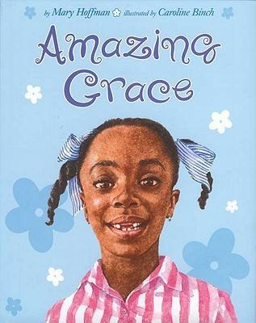

**Amazing Grace Mary Hoffman**

Grace loves stories, whether they\'re from books, movies, or the kind
her grandmother tells. So when she gets a chance to play a part in Peter
Pan, she knows exactly who she wants to be.

When her class decides to do Peter Pan, Grace wants to play Peter. With
the support of her family, Grace learns that she can be anything she
wants to be. Grace\'s courage and determination make this a great text
for students to use as a model of strong voice and emotion

**Discussion**

Gender: Why did Grace want a role that a boy usually played? Is it okay
for girls to do things that boys normally do? This conversation might
lead into topics like girls in sports or in different jobs and how
students view the roles of boys and girls.

Diversity: Not only is Grace a girl, but she is black and wants to play
the part of a white boy. Students might discuss fairness or prejudices
that people have. This conversation might lead into discussion about
people who are different in ways besides skin color such as
disabilities, language, and family life.

Courage: What does it say about Grace that she went ahead and tried out
for the part? What are some words to describe her character? Have you
ever experienced anything like this? How do you think she felt doing
something that everyone thought was unusual or even wrong? What would
you have done in her place? How would the story have been different if
Grace was shy or doubted herself?

Family: Grace\'s mother and grandmother were supportive of her decision
and encouraged her to try out for the part. How would the story have
been different if Grace\'s family had not encouraged her? Has your
family ever given you courage to do something? How has your family
helped you?

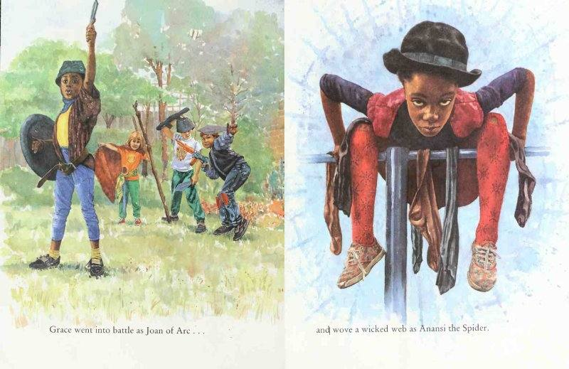

**Amazing Grace Mary Hoffman**

Grace was a girl who loved stories.

She didn't mind if they were read to her or told to her or made up in
her own head. She didn't care if they were from books or on TV or in
films or on the video or out of Nana's long memory. Grace just loved
stories.

And after she had heard them, or sometimes while they were still going
on, Grace would act them out. And she always gave herself the most
exciting part.

Grace went into battle as Joan of Arc ...

and wove a wicked web as Anansi the spiderman.

She hid inside the wooden horse at the gates of Troy ...

she crossed the Alps with Hannibal and a hundred elephants ...

she sailed the seven seas with a peg-leg and a parrot.

She was Hiawatha, sitting by the Big-Sea-Water

and Mowgli in the back garden jungle.

But most of all Grave loved to act pantomimes. She liked to be Dick
Whittington turning to hear the bells of London Town or Aladdin rubbing
the magic lamp. The best characters in pantomimes were boys, but Grace
played them anyway.

When there was no one else around, Grace played all the parts herself.
She was a cast of thousands. Paw-Paw the cat usually helped out. And
sometimes she could persuade Ma and Nana to join in, when they weren't
too busy. Then she was Doctor Grace and their lives were in her hands.

One day at school her teacher said they were going to do the play of
Peter Pan. Grace put up her hand to be ... Peter Pan.

"You can't be called Peter," said Raj. "That's a boy's name."

But Grace kept her hand up.

"You can't be Peter Pan," whispered Natalie. "He wasn't black." But
Grace kept her hand up.

"All right," said the teacher. "Lots of you want to be Peter Pan, so
we'll have to have auditions. We'll choose the parts next Monday."

When Grace got home, she seemed rather sad.

"What's the matter?" asked Ma.

"Raj said I couldn't be Peter Pan because I'm a girl."

"That just shows what Raj knows about it," said Ma. "Peter Pan is always
a girl!"

Grace cheered up, then later she remembered something else. "Natalie
says I can't be Peter Pan because I'm black," she said.

Ma started to get angry but Nana stopped her.

"It seems that Natalie is another one who don't know nothing," she said.
"You can be anything you want, Grace, if you put your mind to it."

Next day was Saturday and Nana told Grace they were going out. In the
afternoon they caught a bus and a train into town. Nana took Grace to a
grand theatre. Outside it said, "ROSALIE WILKINS in ROMEO AND JULIET" in
beautiful sparkling lights.

"Are we going to the ballet, Nana?" asked Grace.

"We are, Honey, but I want you to look at these pictures first."

Nana showed Grace some photographs of a beautiful young girl dancer in
as tutu. "STUNNING NEW JULIET!" it said on one of them.

"That one is little Rosalie from back home in Trinidad," said Nana. "Her
Granny and me, we grew up together on the island. She's always asking me
do I want tickets to see her little girl dance -- so this time I said
yes."

After the ballet, Grace played the part of Juliet, dancing around her
room in her imaginary tutu. "I can be anything I want," she thought. "I
can even be Peter Pan."

On Monday they had the auditions. The teacher let the class vote on the
parts. Raj was chosen to play Captain Hook. Natalie was going to be
Wendy.

Then they had to choose Peter Pan.

Grace knew exactly what to do -- and all the words to say. It was a part
she had often played at home. All the children voted for her.

"You were great," said Natalie.

The play was a great success and Grace was an amazing Peter Pan.

After it was all over, she said, "I feel as if I could fly all the way
home!"

"You probably could," said Ma.

"Yes," said Nana. "If Grace put her mind to it -- she can do anything
she wants."

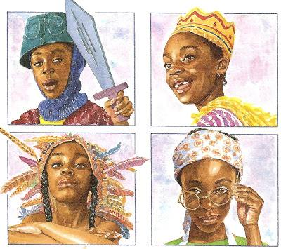

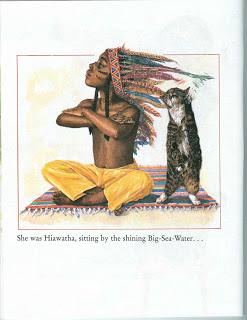

