> **Voice**
>
> **(4)**

{width="4.637681539807524in"
height="1.3333333333333333in"}

**Voice & Emotion**

{width="3.1521741032370953in"
height="0.90625in"}

**Voice 4 -- Voice & Emotion**

The Importance of Voice

Voice: Strong Voice and Emotion

Chart: You Know Writing has Voice if ...

Mentor Texts:

I am the Dog I am the Cat Donald Hall

That Summer Tony Johnston

The Memory String Eve Bunting

Jangles David Shannon

Alice the Fairy David Shannon

My Big Dog Janet Stevens

Today I Feel Silly Jamie Lee Curtis

When Sophie gets Angry Molly Bang

The Lady in the Box Ann McGovern

Fly Away Home Eve Bunting

Gleam and Glow Eve Bunting

The Flat Rabbit Bardur Oskarsson

The Harmonica Tony Johnston

Crab Moon Ruth Horowitz

Knots on a Counting Rope Bill Martin Jr. and John Archambault

**The Importance of Voice...**

- Voice is the most powerful and prized possession in a writer's tool
  box.

- Voice is that amazing thing that taps you on the shoulder (the
  character) and asks you to come with them on a journey.

- Great voice is not reserved for fiction alone. It can also be in
  non-fiction.

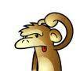{width="1.0625in"
height="0.9375in"}**What is Voice?**

- When writing you are concerned about:

> What is the story?
>
> How do you tell it?
>
> What are you conveying?
>
> How do you maintain audience interest?

Voice is what makes all of these things POWERFUL!

- Voice is what the author has in common with all of their books.

- Your voice is you. It is a reflection of you.  And you must write the
  story that only you can write.

- You have a unique view of the world. Who is in your world and what do
  they have to say about it?

- Voice is the writer's presence on the page.

- Voice is not concrete or tangible and yet it is the most important
  part of the book.

- Voice is the hook that gets us interested from page one. It determines
  the audience and points back to the author.

**Voice: Strong Voice and Emotion**

Several mini-lessons are possible:

How to recognise voice:

Author's personality comes through.

The writing sounds unique.

It has feelings and emotions.

Words come to life.

Writing is from the heart.

Brainstorm emotions -- emotions handout can add to this.

See Voice Booklist to find appropriate texts for immersion.

e.g. That Summer by Tony Johnston

The Memory String by Eve Bunting

Read Aloud

\- Stop and discuss different emotions.

Discussion: How did the author achieve the strong voice?

Central point -- Adding emotion is one way to add more voice to your
story.

Extension: Partner Talk.

Partners read the same story from those available. Highlight or make
notes where an emotion is indicated. This could also be done as group
work.

Independent writing:

Using the emotions handout, students choose an emotion and write a
paragraph (or more) capturing that emotion. Using 'show not tell', the
word indicating the emotion is not to be used in the writing. The
students at Wembley know to use the thoughts, words, or actions of the
characters or narrator in their stories -- not using synonyms of the
emotion word.

Name the Emotion: Writing can be read to a partner who guesses the
emotion.

Extension: find writing in Writers' Notebooks or Writing Journals to
find texts where they can add more voice, emotion, or point of view.
They now know to do this through thoughts, words, or actions.

**You know writing has voice if**:

**The** **author's personality comes through.**

**The writing sounds unique.**

**It has feelings and emotions.**

**The words come to life.**

**The writing comes from the heart.**

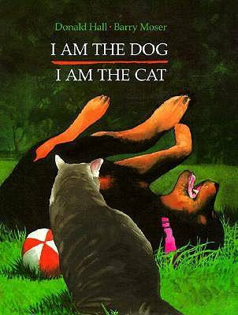{width="2.4895833333333335in"
height="3.2974617235345582in"}

Distinguished poet Donald Hall and award-winning artist Barry Moser have
teamed up to create a hilarious, affectionate portrait in contrasts of
our companions, and often best friends, a cat and a dog. With evocative
words and masterful paintings, they delineate the doginess and catlike
qualities that everyone will recognise.

**Point of View:**

**I Am the Dog**

**I Am the Cat**

**Donald Hall**

Each animal gives its point of view on life. This could be read in a
Reader's Theatre fashion with paired reading.

What has the author done well in the writing?

Creative word choice.

Created a voice for each character by focusing on the dog and catlike
qualities.

Independent Writing:

Choose two different characters.

Give those characters distinct voices that reflect their personalities.
What can they talk about?

Write each character a monologue showing how they feel about the chosen
topics. The aim is to make each character sound different.

Planning:

Voice descriptors -- a feeling or emotion adjective for each character.
E.g.

shy cheerful happy miserable curious

sarcastic nagging sneaky frightened selfish

lazy kind rude loyal cute

humorous generous fearless strong destructive

excited fearful confused angry bored

jealous envious joyful greedy guilty

proud compassionate hopeful anxious concerned

lonely surprised shocked exhausted confident

disapproving arrogant relieved satisfied

inconsiderate remorseful regretful sad

gratified panicking empathetic

sympathetic considerate

embarrassed impatient patient worried

cheerful horrified amazed disappointed lovable

Ideas for Opposites:

mountain :valley polar bear : grizzly bear

car : bicycle sun : moon

brother : sister ocean : desert

elephant : mouse snake : mouse

city : country parent : child

soil : rock planet : moon

teacher : student owl : mouse

shark : minnow rain : snow

Show not tell:

When the voice descriptor is chosen, the word does not need to appear in
the monologue. Rather the students know to show, not tell. Therefore
they will show the reader the emotion through the actions of the
characters.

Hint: Deal with one topic at a time. When that is completed start on
another topic the two characters can talk about. Added together, they
will make a story like I Am the Dog I am the Cat.

Emotions

Adjective

shy cheerful happy miserable curious

sarcastic nagging sneaky frightened selfish

lazy kind rude loyal cute

humorous generous fearless strong destructive

excited fearful confused angry bored

jealous envious joyful greedy guilty

proud compassionate hopeful anxious concerned

lonely surprised shocked exhausted confident

disapproving arrogant relieved satisfied

inconsiderate remorseful regretful sad

gratified panicking empathetic

sympathetic considerate

embarrassed impatient patient worried

cheerful horrified amazed disappointed lovable

Noun

shyness cheer happiness misery curiosity

sarcasm nag sneakiness fright selfish

laziness kindness rude loyalty cute

humour fear

generosity strong destructive

excitement confusion anger boredom

jealousy envy joy greed guilt

pride compassion hope anxiety concern

loneliness surprise shock exhaustion confidence

disapproval arrogance relief satisfaction

inconsideration remorse regret sadness

gratitude panic empathy

sympathy consideration

embarrassment impatience patience worry

cheer horrify amazement disappointment love

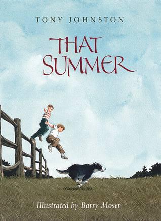{width="2.4166666666666665in"
height="3.3020833333333335in"}

That summer the brothers ran into the sun, freed from school. Time for
fishing poles, lightning bugs, country roads, baseball gloves.

But then Joey was dying.

What do you do when someone you love is leaving the world? You reach for
fragments of memory, like moments caught on film. You savour the vivid
colours and small joys of each new day. That\'s what Joey\'s family does
when they know he is leaving them.

Tony Johnston\'s poignant words and Barry Moser\'s intimate pictures, a
blend of past and present, invite us to share the experience of that
summer\--a season of family, of life, and of love.

\"This life-affirming story can provide inspiration and consolation for
the brothers and sisters of seriously ill children\--and for all family
members when a child is losing the fight against a terrible disease.
It\'s sure to stimulate helpful discussions.\"

-Gregory Reaman, M.D., Chair of the National Children\'s Oncology Group

**Discussion**

**Mentor Text:** Writing in poetic form.

**That Summer**

**Tony Johnston**

That summer began like always,

with hoots and shouts, all of us running

into the sun,

freed from school,

over the porch,

over the lawn,

down the hollows.

Joey and I ran

Like there was no tomorrow.

Fourth of July he took sick.

Mama said, "The child has overindulged

on pie once again."

so, gripping his belly,

Joey went to bed.

And there he stayed.

That summer moved like a dream

quavering with heat

and slow.

All of us were dream walkers

watching Joey,

Mama and Papa and Gram and I

and our dog, Spoon.

When Joey perked up, hope

fluttered inside us, like a little green

bird.

But it stilled when Joey

turned worse.

What do you do when you know

you are leaving

the world,

when your heart hurts

with grieving?

Joey was leaving.

It was clear as the rain

that stung his window

that summer.

First, he cried.

I heard him

alone

tucked into bed,

tucked into his bad dream.

So I, dream walker, brother, went in

and we cried together.

Joey was dying.

What mattered now, to me?

Nothing.

Nothing at all. Then

every

single

leaf.

Nights, when I lay awake

that summer,

a gleam of guilt glided

through my heart

like a gleam of snake

down a hole.

Joey was sick

but I was well.

That summer while Gram kept vigil,

she quilted,

and her needle flicked in and out,

a fish, slim and silver.

"How do you make a quilt?" Joey asked.

"Cut scraps into shapes

of all the things you love," Gram said,

"then join them together with thread."

So in the hollows of the night

when he could not sleep

Joey pieced a quilt --

a patch with an owl because he loved

its call,

the cow he squeezed from clay

(first grade),

and his fishing pole

and a lightning bug

and a country road

and his baseball glove.

I learnt a lot

that summer.

How to grin with your heart

in shreds.

How to make a bed with your brother

in it,

your brother still

as a whisper.

Each day of that summer

held small scenes --

Spoon licking Joey's face

like a big Popsicle,

Joey jutting out his jaw,

quilting.

And Joey's friends, come carolling.

In broad daylight. In July.

Boisterous, roisterous friends

caterwauling notes known only

to lonely cats,

screeching their hymn:

*Joey, come out soon!*

Joey pieced the scene.

Once, Joey and gram looked up

at the stars

flung clear across forever

and Joey asked, "When

will I die?"

"Oh, my baby dear," she crooned

and held him.

"Who will care for me then?"

"God will," said Gram.

Joey quilted what he thought

was God.

It looked a lot like

Spoon.

That summer when Joey's hair fell

in clumps,

Papa shaved the rest.

When he saw his baby-bald self,

Joey cried.

Soon I came with a cap on,

pulled it off-*ta-da!*

-and I was bald too.

"I'm a baby," Joey told me.

I said, "I'm a balloon."

"We're two bald baby balloons."

Then we hugged each other,

nearly squeezed out each other's

breath.

One night that summer

amid the crickets' heartbeat song,

we gathered at home

by candlelight.

Papa and mama and Gram and I

and Joey's friends.

The quilt was nearly done.

Just one last patch still out

left a gap

like a missing tooth.

Joey would never

finish it now

so I stitched in my masterpiece --

two bald baby balloons.

Spoon snored

Beneath the frame

while we sewed a border

to bind the pieces together,

a border from Joey's

pyjamas.

While we worked

no one really spoke our loss.

But from the edges of the quilt

our voices, soft warm sounds,

arose

like the purr of pigeons

in a church.

The room fell still.

I touched my smooth head.

Then into the silence, sweet and wide

as sleep,

I whispered to Joey,

*Good-bye.*

**The Memory String Eve Bunting**

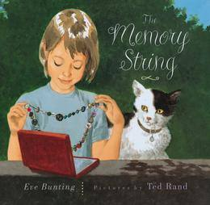{width="2.25in"
height="2.1979166666666665in"}

This book is about a young girl, Laura, and a family keepsake referred
to as a memory string. This keepsake was passed down to her when her
mother died. Each button on the string represents an important moment in
time. While Laura is describing each one to her cat, he breaks the
string and the buttons scatter everywhere. Laura\'s stepmother works
hard to find all of the buttons to help bring their relationship closer.

Character Traits

We learn about characters by what the character:

Looks like. Says.

Thinks. Does. Feels.

Also by:

What others say and think about the character, and

How the character develops. E.g.

  ---------------------------------------------------------------------
  Character Trait/Emotion  Evidence
  ------------------------ --------------------------------------------
  Resentful                Laura purposefully displays and talks about
                           the memory string in front of Laura.

  Jealous                  "It hurt to hear them happy like that."

  Sensitive                Upset when Whiskers breaks the memory
                           string.

  Reflective/thoughtful    Reflects on Laura's words, "It's like a
                           mother. No substitute allowed."

  Matures/develops         Asks Jane to help her to restring the memory
                           string.
  ---------------------------------------------------------------------

+-----------------+----------------------------+----------------------+
| Craft           | Evidence                   | Reason               |
+=================+============================+======================+
| Show not tell   | "Her shoulders were stiff" | Jane's concern.      |
|                 |                            |                      |
|                 | "I can't talk about my     | Laura resentful.     |
|                 | memory string to myself,   |                      |
|                 | can I?"                    | Laura jealous.       |
|                 |                            |                      |
|                 | "It hurt to hear them      | Jane's concern.      |
|                 | happy like that."          |                      |
|                 |                            | Nervous about what   |
|                 | "Jane's voice was soft..." | she is about to say. |
|                 |                            |                      |
|                 | She swallowed.             |                      |
+-----------------+----------------------------+----------------------+
| Self-discovery  | "Will you really help me   | Shows character      |
| ending          | restring them, Jane?"      | development.         |
+-----------------+----------------------------+----------------------+
| Hyphenated      | Skinny-leg jeans           |                      |
| adjectives      |                            |                      |
|                 | Oak-leaf shadows           |                      |
|                 |                            |                      |
|                 | Robin's-egg blue           |                      |
+-----------------+----------------------------+----------------------+
| Close echo      | "So much to think about.   | Emphasis             |
|                 | So much."                  |                      |
+-----------------+----------------------------+----------------------+
| Meaningful      | Throughout                 | Reveals characters   |
| dialogue        |                            |                      |
+-----------------+----------------------------+----------------------+

**The Memory String**

**Eve Bunting**

Laura sat under the oak tree in their back yard. Whiskers, her
black-and-white cat, lay beside her, twitching his tail. On the porch
her dad and her new stepmother, Jane, were painting the railings.

Jane stopped and pushed her hair away from her face. She wore an old
paint-stained shirt and skinny-leg jeans.

"Want some lemonade?" she called.

Laura shook her head. While Jane was still looking in her direction, she
took the memory string from the red velvet box on her lap. The buttons
strung on the string shone and silvered, patterned with oak-leaf
shadows.

Jane dipped her brush in the paint and went back to work. Her shoulders
were stiff. Laura had pulled out this string a lot in front of her
stepmother.

"This was my great-grandmother's memory string," Laura told Whiskers in
a loud voice. "Then it was my grandmother's, them my mother's, and now
it's mine."

"Are you sure you don't want some lemonade?" her dad called.

"No thanks," Laura said.

"If you're not doing anything important, you might come and help us."
Jane's voice was sharp.

"I *am* doing something important," Laura said.

"This button came off my great-grandmother's first grown-up dress," she
told Whiskers. "Back then some people couldn't read, or keep diaries, so
a string like this was their way to remember. Mum told me."

Whiskers yawned.

"This button was my great-aunt's. She wore the dress to a quilting
party. It's all part of our family's history."

Whiskers got up to leave, but Laura took a firm grip under his stomach
and crushed him against her, leaving her arms free.

"Yowww!" Whiskers warned.

"Be quiet," Laura whispered. "I can't talk about my memory string to
myself, can I? You have to stay here,"

"These three buttons were from second cousins of my grandma's. The
cousins were at a spelling bee." She peered up under her bangs. Dad was
pouring lemonade. He took a frosted glass to Jane, and she sat back on
her heels and smiled at him.

Laura saw him touch Jane's neck, under her hair. He did that often.
Sometimes Dad and Jane sat on the porch at night after Laura had gone to
bed. Her room was above, and she'd hear them whispering and laughing
softly. They seemed so happy. It hurt to hear them happy like that.

She rubbed the buttons between her fingers. Get to the good parts, she
thought. Forget the cousins. Get to Mum.

"This button came from Mum's prom dress," she told Whiskers. "Stop
squirming," she added. "And this is from her wedding dress. It was
white, of course.

"And see this little teeny tiny one? This is off my christening dress,
and this one is off the dress I wore to my fifth birthday party. I
remember."

She stopped for breath and glanced up again at Jane. All this must hurt
her a lot. For an instant Laura felt mean and horrible. But only for an
instant. She didn't *hate* Jane. Not really. It was just that Jane had
gone and married Dad.

She had to rush now, because Dad was coming down the front steps. "This
khaki one was off Dad's uniform when he went to war in a plane called
the Gulf. Mum cut it off his jacket when he came home, and she cried and
cried because she was so happy he was safe."

Dad stood in front of her, bare ankles, old torn tennies. "Laura ...?"

Quickly, before he could stop her, Laura said, "This last one fastened
the neck of Mum's nightgown, the one she was wearing when she died. Dad
saved it for me." She held up the memory string. It turned, the colours
blurring through the blur in her eyes.

Whiskers leapt.

"Watch it!" Dad said anxiously. But he was too late.

Whisker"s claws caught on the string, scattering buttons like sunflower
seeds.

Laura covered her eyes with her hands. "Oh, no!"

Up on the porch, Jane dropped the paintbrush and rushed down the steps.
"It's okay, sweetie," she said. "We'll find them."

The three of them searched the grass.

"I've found one," Dad said.

"Here's another," Jane called.

Whiskers watched from the top of the sagging fence.

"Bad Whiskers!" One by one Laura put the buttons carefully back in the
box. "There were forty-three," she said. "I'm still missing seven."

They found six more. Their knees were covered with dirt. Ants crawled
over their hands and arms.

They sifted through leaves and dead blossoms that had blown off the
camellia bushes by the porch. "Do you know which one is still missing?"
Jane asked.

"The one from Dad's uniform. It was Mum's favourite, because ... because
... "

Tears streamed down Laura's face, and Jane took a step towards her. "Oh,
Laura, my dear."

It was what Mum would have said. What Mum would have done. Jane's voice
was soft, as Mum's would have been. But this wasn't Mum. Mum had died
three years ago. This was Jane.

"Dad?" Laura whispered, and her dad folded her against him.

They searched again after supper until the light faded while Whiskers
lay on the porch, lazily swatting bugs.

When she finally went to bed, Laura couldn't sleep.

"We'll find the button in the morning," Dad had promised.

"And I'll help you restring them," Jane said.

"Thanks. But I know how to do it," Laura told her.

She lay, listening to the crickets, listening to Whiskers purring beside
her.

A little later she heard the murmur of porch voices, and she got out of
bed and knelt by the window.

Jane and Dad sat in the swing. She could hear its soft creak. Bugs
batted against the yellow light bulb.

"But there won't be any difference," Dad was saying. "My old uniform is
in one of those boxes we stored in the attic. I can cut a button off and
drop it in the grass. She'' never know."

"How can you think of such a thing?" Jane asked. "Those are true moments
on that string. You can't cheat Laura like that."

"But, sweetheart." Laura imagined Dad taking off his baseball cap,
rubbing his head the way he did when he was worried. "My little girl's
heart is breaking. I ony want to make her fell better."

"Laura would rather have that button missing than have a replacement,"
Jane said. And then she added, "It's like a mother. No substitutes
allowed."

Laura heard the chokiness in Jane's voice. She felt choked up herself.

The swing squeaked as one of them stood up. "Let's look some more. Right
now," Jane said.

"Now? You can't see a thing."

"Flashlights," Jane said.

Laura bit her lip. Should she go, too? But then they'd know she'd heard.

She watched the white circles of the flashlights, the dark figures of
Jane and Dad crawling through the grass. She could smell the fresh
paint. The crickets had stopped singing to listen.

And then she heard Jane's excited voice. "I found it. over here! It must
have rolled." She held something up between her finger and thumb.

"Whoopee!" Dad swung Jane round and round and Jane laughed. "Careful! We
don't want to lose it again!"

"She'll be so happy! You can give it to her at breakfast, Janie."

"I don't think so," Jane said. "She won't like it that I'm the one who
found it. Let's just leave it on the porch. Like a gift from a good
fairy."

Laura got slowly back into bed. Whiskers had moved into her warm place,
and she slid him over.

"Grr!" he warned.

She lay, thinking. Jane's sad voice saying: "It's like a mother. No
substitute allowed." She remembered the soft look on Jane's face today.
The way she had understood about the true moments on the string.

So much to think about. So much.

As soon as she wakened the next morning, Laura went downstairs. Jane was
painting the back door robin's-egg blue. "Like it?" she asked.

Laura nodded. Already she could see the button on the porch. She picked
it up and held it tight in her hand. "A good fairy must have brought
it," she said.

She noticed that the buttons on Jane's painting shirt were a deep, dark
green. Pretty! Maybe one day she'd ask Jane for one to put on the memory
string.

She swallowed. "Will you really help me restring them, Jane?"

Jane wiped her hands on a rag and stood up. "Anytime you want," she
said. "I'm here."

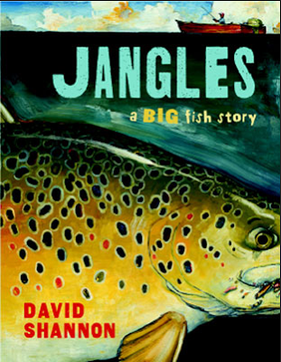{width="2.6354166666666665in"
height="3.3896030183727035in"}

Breathtaking oil paintings bursting with energy pull readers along into
Big Lake, the home of Jangles, the biggest fish anyone has seen. Fishing
alone at dusk,

A boy feels a tug on his line and comes face-to-face with the gigantic
trout\--whose enormous jaw is covered with so many lures and fish hooks
that he jingles and jangles when he swims. Terrified by the sight, the
boy is shocked when Jangles befriends him and takes him on an adventure
to the bottom of the lake. A surprise ending will leave readers laughing
and shaking their heads. Here is Shannon at his very best-in a wild and
witty story that begs repeated reading.

*When I was a kid, Jangles was the biggest fish that anyone had ever
seen - or heard! That\'s right, you could hear Jangles. He\'d broken so
many fishing lines that his huge, crooked jaw was covered with shiny
metal lures and rusty old fishhooks of all shapes and sized. They
clinked and clattered as he swam. That\'s why he was called Jangles.*

*Jangles was so big, he ate eagles from the trees that hung over the
lake, and full-grown beavers that strayed too far from home.*

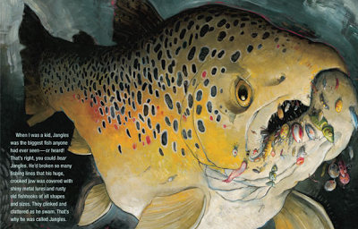{width="4.166666666666667in"
height="2.6666666666666665in"}

David Shannon\'s recent picture book Jangles: A BIG Fish Story harkens
back to the day of the traditional Tall Tale. Tall Tales, characterised
mainly by their penchant for hyperbole (that is, their tendency to
exaggerate to the point of lying!) developed a boastful and boisterous
voice over time, due to the fact that many of the original Tall Tales
were spread orally. Each subsequent teller would add his or her own
embellishments (as well as quaint colloquialisms), resulting in
crowd-sourced versions of the tales that were rich in both authentic
voice and vocabulary.

The story itself is an engaging narrative, with an ending that requires
a bit of inferring on the reader\'s part. The story also begs the
question, \"What would you have done in his place?\" Close re-readings
can reveal simile, alliteration, personification, and many other
wonderful literary devices masterfully woven into the tale.

**Extensions:**

After reading *Jangles: A BIG Fish Story*, challenge students to write a
Tall Tale about an animal of their choosing. You might consider
supplying a simple story map based upon the mentor text which can guide
students in their writing.

To begin a Tall Tale unit, let children read a number of traditional
retellings of Paul Bunyan, Pecos Bill, John Henry, and Slue-Foot Sue.
Have them generate the critical attributes of this genre, explaining as
well how it differs from (and yet takes cues from) legends, folktales,
and myths.

**Jangles: A BIG Fish Story: A Conversation with Author David Shannon**

Q: When did you start fishing?

A: The first fish I ever "caught" was in Glacier National Park, Montana,
when I was two or three years old. My brother and I were fishing with a
piece of string tied to a stick---that's it. Well, whaddya know, we each
caught a rainbow trout---and they were already cleaned, too! Some nice
man had swum underwater and tied them to our strings.

Growing up in Spokane, Washington, you sort of naturally start fishing
in the nearby lakes at around six or seven years old. Then my dad and I
took up fly fishing when I was maybe eleven. Back then I tied my own
flies, too. I took a course from this old guy who looked like a factory
when he smoked his pipe.

Q: Do you have a favourite fishing memory?

A: I have so many! One of my favourites is the first time my daughter
and I went fishing on the lake where I have a cabin. She was about five
years old and she caught what we've always referred to as "The
Whopper"---a great big cutthroat trout. The local newspaper put her name
in the next edition. She was totally thrilled. She almost always
outfishes everybody else in our group.

Q: Why do you think fishing creates such a bond between parents and
children?

A: I think it's because you're sharing an adventure. You're out in
nature where there's a lot of mystery, beauty, and excitement. Fishing
memories are so vivid and unique. Plus, fishing has hardly changed at
all over the years.

Q: What inspired the story of Jangles?

A: I'd been wanting to write a fishing story for a long time, and it
finally came together when I took a whole bunch of little stories I'd
either heard or actually experienced and rolled them all into one "BIG
Fish Story." One part is from a story my friend's grandfather told us in
Montana; a couple other bits are from tales I heard from guides; some of
it is based on Native American mythology; a bunch of it is stuff that
really happened to me; and then the rest I just made up!

Q: The art style in Jangles is very different from your other books. Can
you talk a little about that?

A: It's the first time I've painted in oils since I went to art school.
I'd always used acrylics because they dry fast and they're not so toxic
and smelly (my studio was always in my house or apartment). Anyway, I'd
begun to get really tired of painting a couple years ago so I started
thinking about shaking things up a little. My studio is now separate
from the house, and when Jangles came along it seemed like a good
vehicle for some oil paintings. I tried not to think of anything but the
painting---no deadlines, no expectations from others, no worries about
ruining the piece and starting over---so I was free to try new things
and experiment. It was a blast! (Once I got the ventilation worked out,
that is.) I love the look and feel of oil paints---they're so rich and
fun to squish around in---I don't know if I'll ever use acrylics again.

Q: Jangles, with his scars and hooks, seems so real. How does the art
contribute to the sense of fishing that the story tells?

A: I wanted the art to make the story more believable. I was hoping the
reader would experience what the kid in the story is feeling---the sense
of wonder, the humour, even a little fear.

Q: Do you have a story of one that got away? And, is there one fish
you\'ve never caught that tops your "to do" list?

A: Well, there was this red head in eighth grade. . . .Actually, the
part in Jangles where the kid drifts out into the deep area of the lake
is based on something that happened to me. It was really getting dark
and I hooked into something REALLY BIG! At first I thought I'd snagged
bottom, but my line was going out a lot faster than I was drifting.
Whatever it was just kept going until all my line was gone. I grabbed
the last couple feet and held on, but it snapped right off. Then
everything was quiet and I just sat there for a long time.

As far as the "to do" list, I finally caught my first golden trout last
summer. That's one I've always wanted to catch. They're unbelievably
beautiful and are native only to a few high-altitude streams in the
Sierra Nevada mountains.

Q: What is your favourite place to fish?

A: I have a little cabin in the Sierras that's surrounded by tons of
rivers, lakes, and streams. It's not just my favourite place to fish;
it's my favourite place, period!

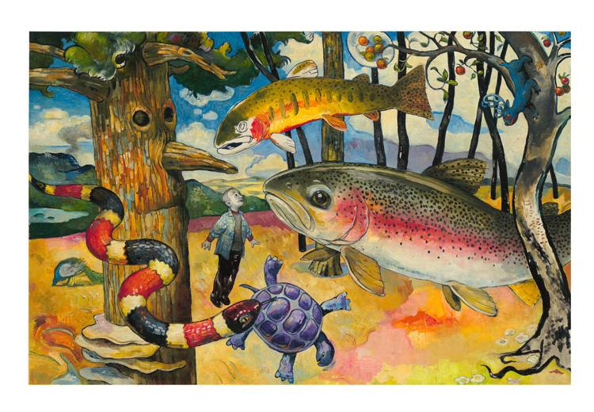{width="6.0in"
height="4.16in"}

**Jangles a BIG fish story David Shannon**

When the sun goes down and the weather's just right, Big Lake gets
smooth as glass and a thin mist whispers across it. That's when you
might catch a glimpse of Jangles.

My father told me lots of stories, but my favourite was about a giant
trout he saw when he was a kid. I still remember sitting with him in
front of the big stone fireplace at the cabin. He pulled out a dirty
green tackle box and shook it a couple of times so it rattled. Then he
told me this story ...

When I was a kid, Jangles was the biggest fish anyone had ever seen --
or heard! That's right, you could *hear* Jangles. He'd broken so many
fishing lines that his huge, crooked jaw was covered with shiny metal
lures and rusty old fishhooks of all shapes and sizes. They clinked and
clattered as he swam. That's why he was called Jangles.

Jangles was so big, he ate eagles from the trees that hung out over the
lake and full-grown beavers that strayed too far from home.

But he didn't seem to care much for the taste of kids. In fact, people
swear one time Jangles saved a baby who fell into the lake when his
family's canoe tipped over. They say he took that baby up so gently that
none of the hooks even stuck it, and he swam it to shore. Supposedly he
gave the baby's momma a dirty look as if to say, *What are you doing
bringing your precious little baby out here in a tippy old canoe?!*

Everyone wanted to catch Jangles. They held big tournaments with lots of
prize money, but no one could bring him in. He was too smart and too
strong, and he lived too deep down in the middle of the lake. They tried
all sorts of tricks, like using whole turkeys for bait!

One fellow even tried dynamite. He threw big cans of tuna fish in the
water and waited till he heard Jangles coming. Then he lit a stick of
dynamite and tossed it in the lake. I don't know if it hit a rock or
something, but that dynamite came flying back out of the water and into
his boat and blew it to smithereens! Then he had to swim all the way
back to his dock. He said Jangles came up and bumped him on his butt,
but nobody believed him.

One time when I was just about your age, I was fishing over where the
creek comes into the lake, and my anchor came loose. I was concentrating
so hard on catching a fish that I didn't notice I was drifting way out
into the middle of the lake. There wasn't another soul out there, and it
was getting dark.

Just when I realized where I was, I felt a tug on my line -- not a real
big tug, but something was on the other end. I started to reel it in. It
was wiggling all right, but it didn't really feel like a fish. I finally
got it in, and what do you know -- I'd snagged an old fishing rod that
somebody must've dropped out of a boat a long time ago!

I started to reel in that one, too. I cranked and I cranked and finally
felt the end of it getting closer to the surface. Then I heard a sound
that made my whole body feel all prickly. It was kinds soft at first --
*tinkle, tankle, dingle --* but then it started getting louder. *Tingle,
Jingle, JANGLE!* Now, I used to daydream all the time about catching
Jangles, but right then I was scared to death! Just when I saw the lure
on the end of the line, a gigantic shadow came out of the deep darkness
and swallowed it up!

My rod bent nearly in half. I was hanging on to it like it was my first
dollar when Jangles suddenly swam under the boat and pulled me right
over the side and into the cold, black lake. Down we went like a crazy
horse and buggy! Pretty soon I noticed I could still breathe, and the
water wasn't cold anymore.

Finally, we came to a cave in the deepest part of the lake. It was
decorated with parts of old boats and lots of rods and reels.

"This is my home," said Jangles. "It's been a long time since I had a
visitor."

His voice was so low and soothing it seemed perfectly natural that this
fish was talking, so I wasn't afraid at all.

Then Jangles told me stories. Amazing, wonderful stories about the
beginning of the Earth before there were people, and stories about wise
old redwood trees and animals who were silly and the great fish that
lived before him in Big Lake. It was like Jangles was my magic uncle!

After a while I started to get sleepy, and he said, "Time to go."

He told me to hang onto the big fin on his back. I still had the old rod
in my hand, and as we swam up and the water turned from black to purple,
I slowly pulled out some line and made a bunch of long loops. When we
reached the surface, Jangles swam alongside my boat. Quick as a minnow,
I hopped off the fish's giant back and threw the coils of line around
him. Then, with a sharp yank, I spun him upside down!

Now, you might not know this, but when you turn a fish upside down --
even a big, old, smart fish like Jangles -- it gets confused and can't
hardly move. Like it's paralysed.

"Gotcha!" I shouted.

Jangles just lay there, but he could still talk.

"You tricked me!" he cried. "I told you secrets from the beginning of
time, and this is how you thank me?"

"You are a fish," I said, "and I have caught you!"

"Set me free," Jangles urged. "I am more than a fish. I am a
storyteller, and a story."

"A story no one will believe if I let you go," I replied.

Then Jangles asked me, "Is that more important than doing what is
right?"

I thought of all the wondrous things I'd heard that day. Then I thought
about people dragging whole turkeys around the lake. "You're right," I
said. "I'm sorry. I will set you free, but what can I do to apologise?"

I swear Jangles grinned at me with that big, crooked jingly jaw of his.
"There is one thing you can do to help me," he said, "and it would also
prove you caught ol' Jangles ...."

That's when my dad stopped telling his story and gave me his tackle box.
It was full to the top with shiny metal lures and rusty old fishhooks of
all shapes and sizes. He never told anyone about catching the giant
fish. He kept it a secret until that night when he told me.

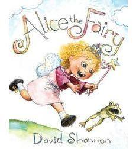{width="2.3958333333333335in"
height="2.625in"}

Alice is a little girl with a big imagination. She is just a temporary
fairy, but well on her way to becoming a permanent one, learning many
skills that permanent fairies must possess: flying high and quickly;
casting spells; and using a magic wand, magic mirror, and fairy dust.
Not everything works out quite how Alice plans, but she gives it all a
try in this hilarious account of what it\'s like to be a fairy without
all her powers firmly secured.

Students will enjoy this book for many reasons, including David
Shannon\'s delightful use of voice. For this lesson, they work with the
voice trait by imagining how they would use a magic wand to cast fun
spells and putting their thoughts into writing.

**Possible Lesson:**

Show students the cover of Alice the Fairy by David Shannon and ask what
voice they think this book will have. Serious? Humorous? Scary? Sad?
Silly? Students will probably say humorous and silly-and perhaps even a
little scary.

Read Aloud: Alice the Fairy

Question: *What voice or voices did you hear?* They should confirm that
the book is, indeed, humorous and silly, and perhaps describe it in
other ways, including funny and hilarious. Explain to students that when
authors choose their writing voices carefully, they are much more likely
to create pieces with a lot of energy, as David Shannon did with Alice
the Fairy.

What other voices do authors use? E.g. sad, caring, lonely, angry,
fearful, and peaceful.

Since they have identified the voices in Alice the Fairy, ask them if
Shannon\'s use of phrases such as \"permanent fairy,\" \"temporary
fairy,\" \"doggin floggin biddle noggin,\" \"strawberry Jell-O,\" and
\"Advanced Fairy School\"enhanced their appreciation of those voices.
Stress that when authors stretch for just the right words and phrases,
or make up new words and phrases, they are engaged with the topic and,
as a result, voice is much more likely to be energetic.

Writing:

Students assume the role of temporary fairy or wizard.

Independent writing showing strong voice through energetic ideas and
words of their own.

Turn and Talk about Powers: these might include being able to fly, being
invisible, jumping into outer space, talking to animals, freezing time,
reading people\'s minds, and being invincible.

Record the power and spell and describe what happens when they cast the
spell. Encourage them to think about the voice they want to use because
that will add energy to their writing. Here are some examples.

Power: to make objects move

Spell: to clean your room without lifting a finger

Power: to make people fall asleep

Spell: to keep teachers from assigning homework

Power: to turn food you don\'t like into something else

Spell: to make all the vegetables turn into candy

Power: to make people laugh

Spell: to make the principal laugh so hard she or he forgets to give you
detention when you\'re caught running in the hall.

Write a dialogue between a temporary fairy or wizard who is having
trouble controlling her/his powers and spells, and a permanent fairy or
wizard who gives advice to the temporary fairy or wizard.

**\**

**Alice the Fairy David Shannon**

My name is Alice. I'm a fairy! I'm not a Permanent fairy. I'm a
Temporary fairy. You have to pass a lot of tests to be a Permanent
fairy.

> I have wings so I can fly! I can't fly very high yet, but I can fly
> really fast!
>
> This is my magic wand. This is my blanket. Fairies use magic wands to
> change frogs into princes and things like that. I changed my dad into
> a horse. One time my mum made cookies for my dad, so I turned them
> into mine. I felt bad about the cookies, so I thought I'd whip up a
> new outfit for my dad. Did I tell you he's the Duke of Morningside
> Drive? Well, he is! But clothes were too hard, so I made him a new
> crown instead.
>
> With my magic wand, I can make leaves fall from trees. And I can draw
> pictures on water. Sometimes I use my wand to disappear. But that's
> kind of scary. I'd rather use my blanket!
>
> Of course, I also have a magic mirror. "Mirror, mirror, on the wall,
> who's the fairest of them all?" Well, what do you know -- it's me,
> Alice! Thank you, mirror!
>
> Fairy dust is very useful. I use it to turn oatmeal into cake.
>
> Casting spells is another important part of being a fairy. Watch me
> make my dog float on the ceiling.
>
> Hocus Pocus croakin Docus!
>
> Howkin Towkin Riggin Fowlkin!
>
> Doggin Floggin Biddle Noggin!!
>
> Okay ... that one needs a little work.
>
> But, a fairy must be very careful with magic. Once I accidentally
> turned my white dress into a red one. That made the Duchess so mad she
> locked me in the tower forever! (I got away, though.)
>
> A fairy's life is filled with danger. Broccoli is often poisoned by
> the wicked Duchess and should never be eaten.
>
> Fairies also hate baths. I'd like to turn my bathwater into strawberry
> Jell-o. That would be fun! But, I don't know how yet. You have to be a
> Permanent fairy to do tricks like that. They go to Advanced Fairy
> School to learn how.
>
> I'm supposed to learn how to make clothes get up off the floor and
> dance around and line up in the closet. I'm not very good at that,
> though.
>
> I'll probably be a Temporary fairy forever.

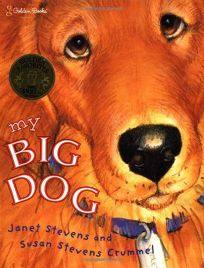{width="2.125in"
height="2.7916666666666665in"}

The arrival of a big-hearted, dopey golden retriever puppy disrupts a
reigning cat\'s domain in sister collaborators Stevens (Tops & Bottoms)
and Crummel\'s irresistible tale told from the feline\'s point of view.
Merl, a crotchety brown-and-white cat with a pink play mouse dangling
from its mouth, likes things Merl\'s way: \"\"Inside my house, my
pur-r-r-r-fect house, everything is mine! My dish. My sofa. My
chair\....\"\" The cat is not amused when the new puppy bounds up with
her \"\"sloppy, drooly tongue\"\" and tries to make friends. But it gets
worse: the dog just keeps getting bigger (shown adorably full-grown in
the centerfold with a \"\"Violet\"\" name tag), so the cat sets off in
search of a new home until Violet comes along to retrieve Merl.
Stevens\'s busy, close-up pastel drawings underscore Merl\'s firm
position by frequently depicting the cat solo, simply looking out at the
viewer. Stevens effectively uses these one-page portraits to convey the
cat\'s internal life through its whiskered disgruntled expressions,
uneven ears and lifeless toy mouse, while depicting Merl\'s interaction
with Violet in successive energetic spot drawings. The few times humans
are in evidence, they appear in black-and-white photographs that Stevens
overlays atop her drawings. The authors\' chronicle of the puppy\'s slow
victory over Merl\'s disaffections works to great comic effect.

**Point of View and Voice**

·          Have students read the first sentence using different voices
for Merl

·          Have students re-tell a familiar story from the point of one
of the main character.

**My Big Dog Janet Stevens**

My name is Merl and I am a cat, a very special cat. Inside my house, my

PURR-R-R-R-fect house, everything is MINE!

My dish. My sofa. My chair. My mouse. My bed.

The people in my house are cat people. They love to pet me. Which I let
them do. Sometimes, when I feel like it.

YAWN. I'm tired. I've been awake since breakfast. It's time for a nap.
Ah-h-h-h, so quiet, so nice, so peaceful, so PURR-R-R-R-fect.

CRASH. THUD. WOOF. What's that? What woke me up? Shhh -- I'm trying to
sleep.

YIP. YIP. YIP.

Wait a minute. I know those noises. Those are puppy noises! A puppy's in
my house. A wiggly, noisy, slurpy, clumsy, puppy! That can't be.

Here come my people. They are picking it up. They are talking to it in
clumsy-smootsey, lovey-dovey baby voices. Uh-oh. It sees me. Emergency
alert -- I have to hide!

I'll try hiding under the bed. On top of the desk. Inside a drawer.

That's one smart puppy. It found me.

PANT. PANT. SLURP.

It's licking me with its sloppy, drooly tongue. YUCK. I think it likes
me. I think it wants to be my friend. NO WAY. I am a cat and it is a
dog.

I have to get rid of it. I'll use my firm voice and tell it to leave.
MEOW.

PANT. PANT. SLURP. There's that tongue again. This puppy won't listen.
Bad puppy!

How about the doggie-out-the-door trick? Good puppy. Just follow these
crumbs outside. Down the walk. Across the street. Uh-oh. I'm out of
crumbs. And it's after me again with that big tongue. Now what?

I've got it! I'll take it for a walk and tie it to a tree.

Help! The puppy got away!

PANT. PANT. SLURP.

The tongue is back. Things can't get any worse!

Oh yes they can. Look at that puppy. Each wek, it gets bigger ...

and **bigger ...** and **BIGGER.**

HELP! There's a huge dog in my house!

I get I have no choice. There's only one thing left to do -- LEAVE! I'll
take my mouse toy and go.

Look. There's a nice lady. I'll look real sad and she'll feel sorry for
me. See? It worked. She's picking me up. She's taking me home. She wants
me.

SPLASH. WHIRRR. POOF.

She ruined me. I'm not a show cat. I don't like my fur fluffed and my
claws painted. I'm Merl, a very special cat. NO WAY will I stay here.
There must be a home for me somewhere. I'll keep looking.

Hey, there's a sign, CAT WANTED. I'll look inside. Nice house! No dogs,
no bows -- I like this place. I'll go in and let them know I'm here.

SLAM. SWAT. THUD.

What? NO cats in the house? I'm not a work cat! I can't sleep in a barn
and catch mice. I'm Merl, a very special cat. NO WAY will I stay here.
There must be a home for me somewhere. I'll keep looking.

Hey, look at those two kids playing. I'm sure they want a cat like me.
I'll just rub against their legs and purr.

PURR-R-R-R.

The boy is picking me up.

"Nice kitty! I've always wanted a kitty!"

Help! The girl is grabbing me.

"My kitty!"

"No, mine!"

"Mine!"

"No, mine!"

Whoa. They both want me. STOP IT! Put me down! I am NOT A TOY cat. Don't
play tug-of-war with me! I'm Merl, a very special cat.

Where will I go?

Where will I live?

Look at me. I'm a mess. I can barely move. I'm sore. And I'm very tired.

I'll just climb into this empty box and rest a minute.

DRIZZLE. DRIZZLE.

Oh, dear. It's raining. How I hate getting wet.

MEOW. MEOW. MEOW.

PANT. PANT. SLURP.

What's that? Ph, no, not that big dog again! It's picking me up. Hey,
put me down! Where are you taking me? This is no way for a cat to
travel. Let go of me!

Home! That big dog found me and brought me home. It misses me. It needs
me. It likes me. But I am a cat and it is a dog. A VERY BIG dog.

Could we be friends? is it possible? Hmmmmm. Maybe, just MAYBE.

As long as it understands the rules. Inside my house, my PURR-R-R-R-fect
house, everything is MINE!

My dish. My sofa. My chair. My mouse. My bed ...

and MY BIG DOG.

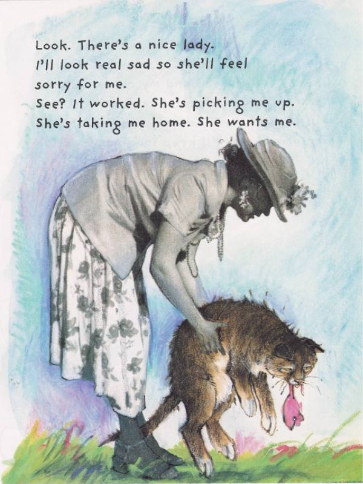{width="6.0in"
height="7.99in"}

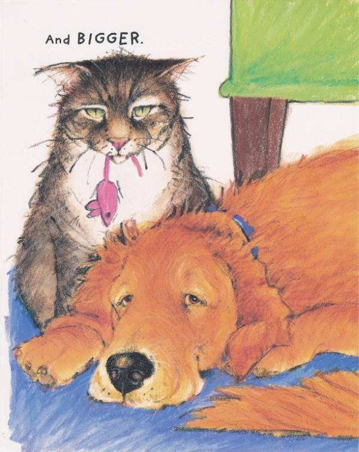{width="6.25in"
height="7.875in"}

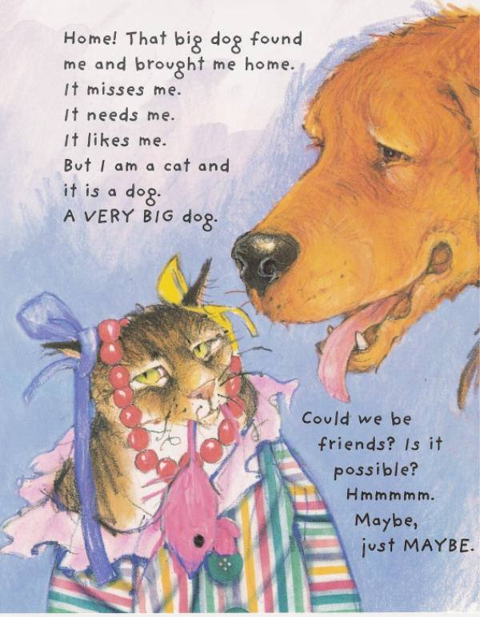{width="6.25in"
height="8.041666666666666in"}

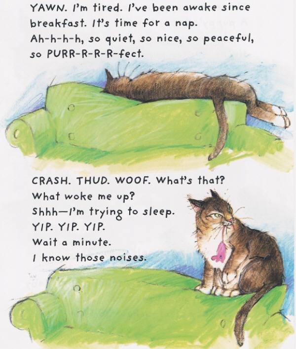{width="6.25in"
height="7.364583333333333in"}

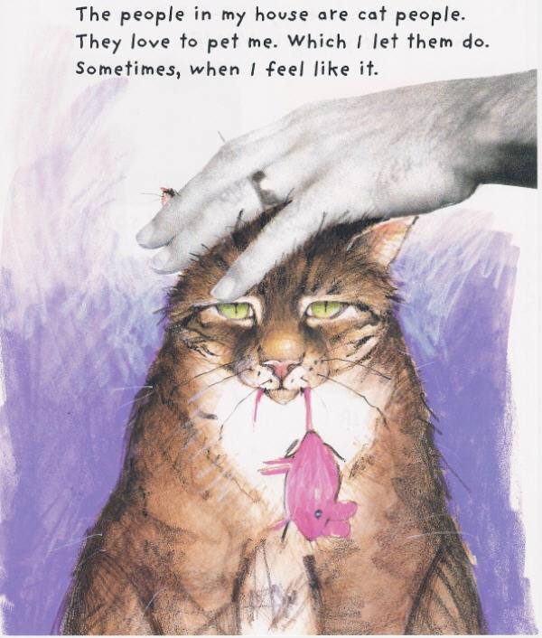{width="6.25in"
height="7.354166666666667in"}

 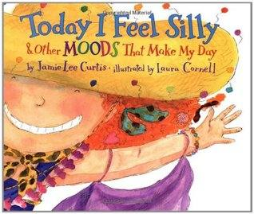{width="3.3125in"
height="2.8020833333333335in"}

Today I feel silly. Mom says it\'s the heat.

I put rouge on the cat and gloves on my feet.

I ate noodles for breakfast and pancakes at night.

I dressed like a star and was quite a sight.

Today I am sad, my mood\'s heavy and grey.

There\'s a frown on my face and it\'s been there all day.

My best friend and I had a really big fight.

She said that I tattled and I know that she\'s right.

Silly, cranky, excited, or sad\--everyone has moods that can change each
day. Jamie Lee Curtis\'s zany and touching verse, paired with Laura
Cornell\'s whimsical and original illustrations, helps kids explore,
identify, and, even have fun with their ever-changing moods.

Here\'s another inspired picture book from the bestselling
author-illustrator team of Tell Me Again About the Night I Was Born and
When I Was Little: A Four-Year-Old\'s Memoir of Her Youth.

 

**Read Aloud**

While reading, stop at appropriate times to allow for discussion and to
point out new and interesting feelings words. Class interacts with the
text while listening to it.    

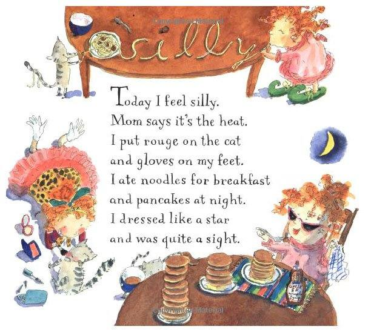{width="6.268055555555556in"
height="5.6125721784776905in"}

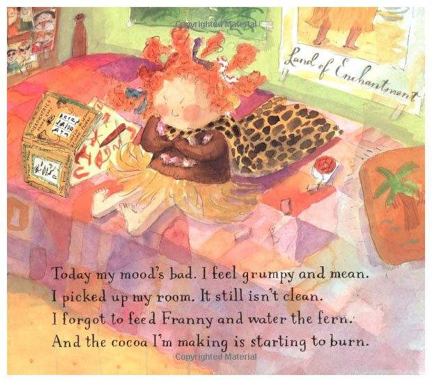{width="6.268055555555556in"
height="5.540152012248469in"}

** Understandings**

- Understanding events trigger feelings. Each person has different
  triggers. What makes you excited might make me sad and vice versa.

- Recognising we all have many feelings and that feelings are neither
  right nor wrong. They\'re normal.

- Knowing feelings shift and change

- Recognising feelings influence our behaviour

- Knowing feelings can be managed

- Recognising that feelings have expressions in our bodies

**Objectives**

- Students will be able to identify a feeling they experienced in the
  past week and name the triggering event.

- Students will identify other situations that will trigger a feeling or
  mood change for them.

- Students will be able to make predictions about the story by applying
  what they previously know about feelings/emotions.

- Students will be able to individually connect emotional experiences
  from their personal lives by writing sentences about emotions as well
  as illustrating emotions and acting them out.

- Students will be able to use more sophisticated vocabulary when
  referring to specific emotions and be able to fully comprehend each
  new words definition (for example, students will know that word
  "cranky" could be potentially used in place of the word "upset").

- Students will be able to articulate what behavioral and environmental
  clues help us understand and express emotions, such as body language,
  facial expressions, tone of voice, etc.

Literacy:

- Students will either begin a journal or learn how writing about
  emotional experiences can enrich an existing journal.

- Write poems or stories about feelings.

- Identify triggering events in other books.

Extension:

- Listen to music and draw how it makes you feel

- Take pictures of students and have them "wear" a feeling. Turn this
  activity into a bulletin board

- Add an \"Emotional Triggers\" section to your Feelings Wall.

- Near the end of the book, the narrator explains that she would rather
  feel the positive emotions than the more difficult ones. Read the book
  to the children again, asking them after each mood if there's
  something the girl could do about her feelings. For instance, what
  could she do about the confused feelings she has? Could she talk with
  her teacher? Could she talk with a parent or another adult? Often it
  is easier for children to talk about emotions and problem solving when
  they are talking about a third party, such as a character in a book,
  rather than talking directly about themselves.

**Today I Feel Silly Jamie Lee Curtis**

Today I feel silly.

Mum says it's the heat.

I put rouge on the cat

and gloves on my feet.

I ate noodles for breakfast

and pancakes at night.

I dressed like a star

and was quite a sight.

Today my mood's bad. I feel grumpy and mean.

I picked up my room. It still isn't clean.

I forgot to feed Franny and water the fern.

And the cocoa I'm making is starting to burn.

Today I am angry. You'd better stay clear.

My face is all pinched and red ear to ear.

My friends had a play date. They left me out.

My feelings are hurt. I want to shout!

Today I am joyful. My mood is first-rate.

My friend's sleeping over, she said she can't wait.

My freckles are popping, the sun is so bright.

I ran in the relay with all of my might.

Today I'm confused, my life's getting hairy.

Sam says he's my boyfriend but he also likes Mary.

My mum told my father he might be a dad.

I might get a brother. I'm not sure I'm glad.

Today I am quiet, my mum understands.

She gave me two ice-creams and then we held hands.

We went to the movies and then had a bite.

I cried just a little and then felt all right.

Today I'm excited there's so much to do.

I'm going to sell cookies and lemonade too.

I'm starting a club to go clean up the park.

And I've got a big crush on my teacher named Mark.

Today I am cranky so nothing seems right.

I have diarrhea and broke my new kite.

Mum dyed her hair orange. My dad shaved his beard.

My tooth came in crooked. This family is weird.

Today I am lonely. I feel so small.

My Aunty's away. I wish that she'd call.

My mum's working late and my dad has the flu.

And although I've got stuff I've got nothing to do.

Today I am happy. I'm walking on air.

I learnt how to knit and to French-braid my hair.

I did my first solo in hip-hop and jazz.

This day's been so great, I am full of pizzazz.

Today I'm discouraged and frustrated -- see?

I tried rollerblading and fell on my knee.

I really want straight hair, but mine's curly-q.

Should I cut it or grow it, oh what should I do?

Today I am sad, my mood's heavy and grey.

There's a frown on my face and it's been there all day.

My best friend and I had a really big fight.

She said that I tattled and I know that she's right.

Today my mood's great, it's the absolute best.

I rode a tw0-wheeler and passed my maths test.

I played soccer at recess and we won the game.

I sang in the show and my parents both came.

I'd rather feel silly, excited or glad,

than cranky or grumpy, discouraged or sad.

But moods are just something that happen each day.

Whatever I'm feeling inside is okay!

How do YOU feel today? ...

** Understandings**

- Recognising and naming one's emotions (i.e. emotional awareness)

- Recognising facial expressions of emotions in others

- Understanding the reasons and circumstances for feeling as one does

- Learning how to express emotion's effectively

**Objectives**

- Students will become aware of different feelings and share their own
  experiences with these feelings.

<!-- -->

- Literacy: Text-to-Self connection.

**Discussion Questions**

Before reading:

*This is a funny book about feelings. What is a feeling?*

During reading:\
*Has anyone felt this feeling (pointing to a photo)? \
What is the name for this feeling? \
When did you have this feeling?*

After reading the book, process the learning experience with these
questions:\
*What new feeling words did we learn from this book or from each other*
(Chart responses)? *\
How can you tell how someone is feeling by looking at their face? \
How can you find out if your guess is correct* (e.g. Ask the person)?

**Activity**

Partner work: Choose a feeling from the chart and try to make a feeling
face to express that feeling. Their partners have two attempts to guess
the feeling and then it is their turn.

After the activity, ask students how they felt when they had to make a
feeling face and when they had to guess the feeling. Elicit that it is
sometimes hard to name what feeling we are having; hard to guess someone
else\'s feeling and we can learn how to do both this year in school.

**Extensions:**

- In guided reading sessions, work with students on using visual cues in
  picture books to infer a character\'s feeling state.

- Have students draw \"Feelings Faces\" (paper plates make good
  templates). Hang a Face for each feeling around the room with the
  feeling clearly labelled with a sentence.

- Students write about a personal feeling experience and add their
  stories to the Feelings Wall.

- Create a fruit or vegetable art show complete with Feelings Faces.

- Play feelings charades using our whole bodies. Students can take turns
  walking by the group saying their names \"I am Harry\" and expressing
  a feeling in their body language (gestures, tone of voice, facial
  expression, etc.). Students then guess the feeling.

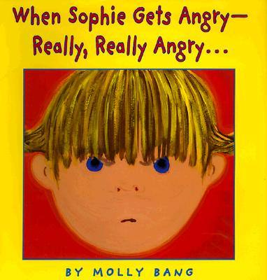{width="2.9644794400699914in"
height="3.1041666666666665in"}

**When Sophie Gets Angry -- Really, Really Angry** **Molly Bang**

When Sophie gets angry at her sister she acts out and wants to \"smash
the world to smithereens.\" She goes on an emotional rollercoaster but
eventually calms herself by walking, climbing and feeling nature\'s
beauty. At the end of the story Sophie is back at home and feeling
peaceful.

**Understandings**

- Angry feelings are normal and can be managed.

- Different people handle anger in different ways.

- Recognises one's emotions

- Knowing that others may see things differently than you do

**Objectives**

- Students will recognise anger as a normal feeling that can be good or
  bad depending on how it is handled.

- Students will identify strategies to help them control and manage
  angry feelings.

Literacy:

- Alliteration (e.g. \"She roars a red, red roar\" and \"She watches the
  water and the waves\").

**Introduction:**

** ***\"What does it mean to get \'really, really angry\'? How do you
handle your anger when you get this angry? Let\'s see what Sophie does
to handle her anger.\"*

**Discussion Questions**

Possible Questions:\
What happens between Sophie and her sister?\
Has this ever happened to you?\
How did Sophie handle her anger?\
If someone makes you upset, do you have a cosy or comfy place to go and
think things through?\
What else could Sophie have done?\
At the end of the story Sophie calms down and returns home in a happy
mood. Can you do the same?\
What comforts Sophie when she's angry?\
What triggers your anger?\
Identify the feelings? Where do you feel them?

**Activities -The Anger Thermometer**

Before class create an anger thermometer on chart paper. On the
thermometer\'s scale write words to represent different levels of anger.
A simple scale might have three levels: annoyed, angry and really angry.
If your class is advanced you might try five levels: irritated, annoyed,
angry, furious and enraged. Whichever words you select, write each of
the words in large colourful letters on separate sheets of paper. Post
the sheets across your room so that you create a Feelings Thermometer
with the lowest emotional intensity on the left and the highest on the
right.

Use the story and the children\'s earlier self sharing to reinforce the
concept that anger is normal and that it helps to deal with our anger
when our feelings \"temperature\" is low. Ask children to recall times
when Sophie was at different levels of anger and show where Sophie might
put herself on the Anger Thermometer.

Tell the children that now they will have a chance to place themselves
on an Anger Thermometer that you have set up in the room (point to the
scale on the wall).

+-------------+-----------+-------------+
| **ANNOYED** | **ANGRY** | ** **       |
|             |           |             |
|             |           | **VERY      |
|             |           | ANGRY**     |
+=============+===========+=============+

Ask them to stand, take a deep breath and stretch. Say:

Alright, now that you are relaxed I will ask you to think about what
makes you feel annoyed, angry or very angry. For example, I might feel
annoyed (stand under the ANNOYED sign) if someone spilled a drink on my
lap. I might feel angry (move under the ANGRY sign) if a friend stole
money from me. And I might get very angry (move again) if a person hurt
my dog. Now I want you to think without speaking about how you would
feel if a friend called you a mean name. Would you feel annoyed, angry
or very angry?

- Give students about 20 seconds to think then ask a few volunteers to
  share how they would feel. When each has spoken ask that child to
  stand under the appropriate sign.

- Ask the rest of the class to share how they would feel by raising
  their hands when you point to the sign that best shows how they would
  feel.

- Tell class that you will name another \"anger trigger\" but, this
  time, you will ask them to move under the sign that names the feeling
  they believe they might experience. They will move slowly and without
  speaking and should pick the spot that feels best for them and not go
  to a spot because a friend goes there. If your students would have a
  hard time with this group movement, use raised hands as described
  above.

- Read first anger trigger below. After children move, ask a volunteer
  from each sign to explain the reasons for picking that place on the
  thermometer. Affirm all volunteers. Have children notice how people
  can feel differently about the same event. If you have time continue
  with anger triggers two and three.

<!-- -->

- Anger Triggers (Begin with \"How would you feel if...):\
  1. Your friend called you a mean name while you were playing in the
  schoolyard?\
  2. You were on line at the canteen and another student cut in front of
  you?\
  3. Your teacher said you had done something wrong and you had not?

**Processing Questions: **\
1. What did you notice about how people feel about the same thing?\
2. How many of you noticed that your friends might not always feel
exactly as you do? Why is that okay?\
3. How can you find out how strongly someone feels?

**Extension**

- What Bugs Me! Have students list what gets them angry. Either create a
  master list and post it or give each child a large drawing of a bug
  with a fat round body. On this body, students should write their names
  and one or two triggers that \"bug\" them in the classroom (e.g. When
  someone says that I\'m cute.). Students can decorate their bugs and
  display them in the room.

- Write What Bugs Me! list poetry.

- Read My Many Coloured Days by Dr. Seuss. Activity - When you feel sad
  what colour are you? When you are happy?

- After using Anger thermometer use other feeling thermometers (
  Pleased, Happy, Joyful).

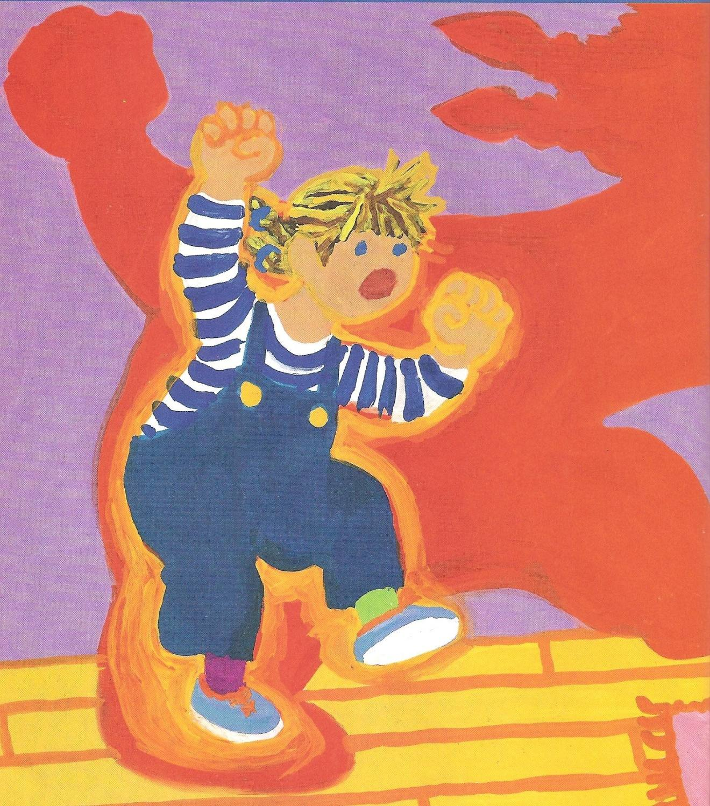{width="6.0in"
height="6.810160761154855in"}

**When Sophie Gets Angry -- Really, Really Angry...**

**Molly Bang**

Sophie was busy playing when...

"My turn."

...her sister grabbed Gorilla.

"No!" said Sophie.

"Yes!" said her mother. "It is her turn now, Sophie."

As her sister snatched Gorilla away...

...Sophie fell over the truck.

Oh, is Sophie ever angry now!

She kicks. She screams. She wants to smash the world to smithereens.

She roars a red, red roar. Sophie is a volcano ready to explode.

And when Sophie gets angry -- really, really angry...

...she runs!

She runs and runs and runs until she can't run anymore.

Then, for a little while, she cries.

Now she sees the rocks, the trees and ferns. She hears a bird.

She comes to the old beech tree. She climbs.

She feels the breeze blow her hair.

She watches the water and the waves. The wide world comforts her.

Sophie feels better now. She climbs back down...

...and heads for home.

The house is warm and smells good. Everyone is glad she's home.

Everything's back together again.

And Sophie isn't angry anymore.

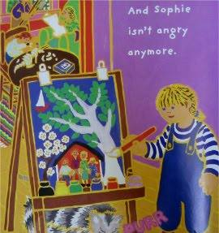{width="2.8125in"
height="2.9895833333333335in"}

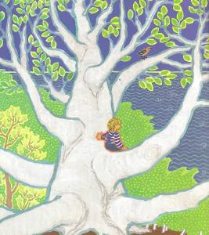{width="2.78125in"
height="3.125in"}

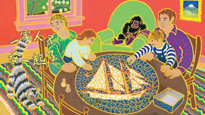{width="4.166666666666667in"
height="2.3333333333333335in"}

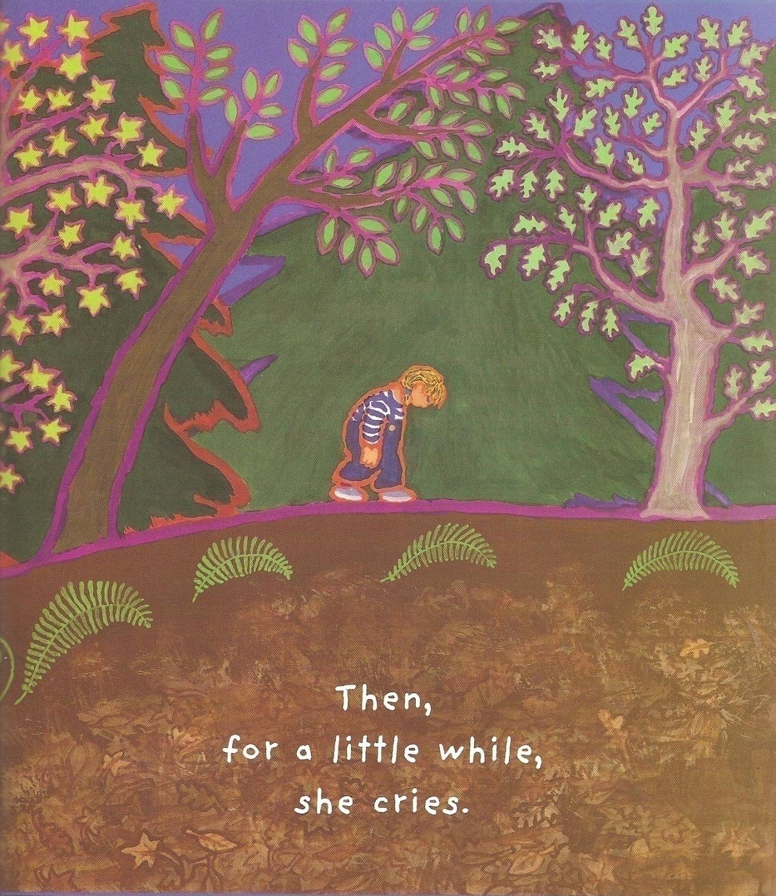{width="6.0in"
height="6.9302635608048995in"}

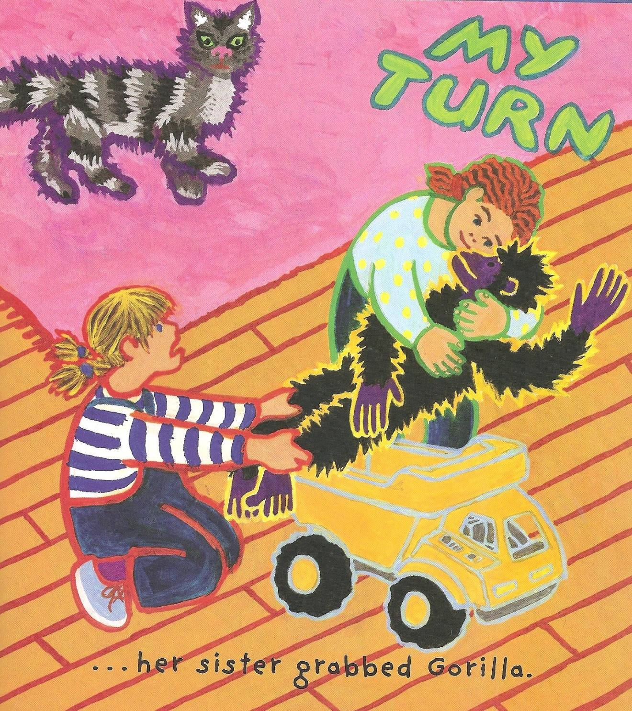{width="6.0in"
height="6.745967847769029in"}

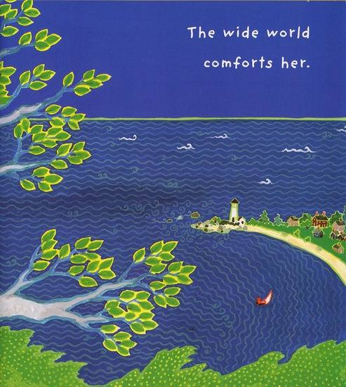{width="5.135416666666667in"
height="5.729166666666667in"}**\**

**The Lady in the Box Ann McGovern**

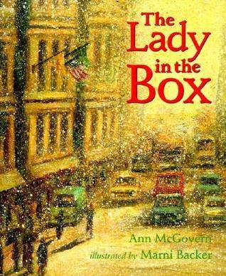{width="3.3125in"
height="4.041666666666667in"}

It is wintertime in the city and freezing cold, but not everyone is
inside and warm. Ben and his sister Lizzie know that there is a lady who
lives outside in a box over a warm air vent. The children worry about
the kind-looking lady, and begin sneaking food and clothes out of their
apartment for her. Gently told and powerfully illustrated in rich hues,
The Lady in the Box deals candidly with the issue of homelessness**.**

Ann McGovern writes a touching story from the perspective of Ben, a boy
who, with his older sister, brings food and a warm scarf to Dorrie, a
homeless woman living in a box outside their neighbourhood deli. When
the store\'s owner bans Dorrie from the sidewalk, the children\'s mother
convinces him to let the woman return to her space by a heat grate. Ben
convincingly shares his thoughts and observations, as when he smiles at
Dorrie: \"\"I thought she smiled back. Maybe she didn\'t. Maybe I just
wished she had.\" Ben sounds the heartening note that the smallest
kindnesses can make a difference.

**Take a Stand**

You have just read or have heard the story *The Lady in the Box* by Ann
McGovern.  The City Council in New York has just decided to ban box
ladies from its streets.  They no longer want people sleeping on the
streets of New York.

You will now take a stand on the following public policy
issue:  **Should the homeless of New York be allowed to sleep on the
streets?**  You may either support or oppose this decision.  Write a
letter to the City Council.  Use information to provide reasons that
support your position.

**Compare and Contrast** to Fly Away Home by Eve Bunting.

**The Lady in the Box Ann McGovern**

There was a lady who slept in a box down our street.

Before dark, she sat in her box in front of the Circle Deli.

She just sat and stared.

When the sky got black, she curled up in her box. I think she slept in
the box all night.

She must have liked the Circle Deli because of the warm air from the
basement that came through the grate. The warm air kept her from
freezing.

I never saw her in the morning. My sister Lizzie didn't either. She
probably folded up her box and put it somewhere safe till nighttime.

We could have kept it for her in our house. But Lizzie and I aren't
supposed to talk to strangers. So we didn't offer.

She looked like a kind, nice lady. I smiled at her. Just yesterday, I
thought she smiled back. Maybe she didn't. Maybe I just wished she had.

The lady in the box looked hungry.

It was Lizzie's idea to bring her food. I reminded Lizzie that we can't
talk to strangers. Lizzie said we wouldn't talk to her. We'd just put
some crackers and peanut butter next to her box.

The first time, we forgot the knife for putting peanut butter on the
crackers. But she managed somehow. The next day the peanut butter jar
was empty.

I thought she should eat food that was good for her. So I brought her
two raw carrots, a bunch of celery, and an apple.

Lizzie said the lady in the box didn't have many teeth, not enough for
chewing hard food. There were a couple of cans of soup in our kitchen
cabinet. Cream of celery and vegetable noodle. Soft and mushy soups.
Just right for someone without teeth.

Lizzie thought vegetable noodle was better. I thought celery. We had a
fight about it. Lizzie won.

We heated up the vegetable noodle soup and ran down the stairs fast to
get it to her before the soup got cold. Then we ran home before Mama
could tell we were up to something again. Mama says we are always up to
something.

The store windows were all Christmasy. It got dark early and the nights
were very cold.

The lady in the box didn't have warm-enough clothes.

We looked in our closets.

On Lizzie's shelf was a big warm scarf with bright red flowers.

Lizzie said she didn't like the scarf because it was so itchy.

I wasn't so sure the lady in the box would like it either. But it was
better than the cold wind blowing on her neck.

We left it outside her box.

Later we saw the scarf wrapped around her neck.

Maybe she liked red flowers.

She called after us, "My name is Dorrie. Thanks."

"My name is Lizzie," Lizzie said. "My brother is Ben. And you're
welcome."

I was worrying about Mama's rule about speaking to strangers.

"Now that we know her name, she's not exactly a stranger," I said to
Lizzie. She nodded.

The next day it was freezing cold.

The owner of the Circle Deli came out of his store.

"Get away from here," he shouted at Dorrie. "I don't want you sitting in
front of my store anymore. People are complaining."

Dorrie had to move. She set up her box in front of an empty store down
the street. But no warm air came up from the basement there. She began
to shiver. Her lips looked kind of blue.

Lizzie said it was about ten degrees above zero.

"We have to do something," Lizzie said, "or she'll freeze to death."

"We could bring her some of our blankets," I said.

"That's dumb," Lizzie said. "Mama would find out for sure."

We were quiet as we climbed the two flights of stairs to our apartment.

I figured Lizzie was thinking about the same thing I was thinking about.

Telling Mama or not telling Mama.

But when we got home, it was Mama who told us a thing or two.

It's not easy to fool Mama.

Why were the cans of soup missing, she wanted to know.. Why was the
flowered scarf gone?

She asked us what we were up to.

We decided to tell her. Maybe if she met the lady in the box, she would
know how to help her better.

So we told Mama about her and how we gave her the food, starting with
the peanut butter and crackers. And how she had to move her box away
from the Circle Deli. And that her name was Dorrie and she was freezing
cold.

Mama didn't get mad and yell at us. Instead she sighed and said, "Okay,
let's see your lady in the box."

The three of us went downstairs and around the corner.

Mama knocked on the box.

"Come on out," she said in her no-nonsense tone of voice. "I want to
meet you."

Dorrie opened the top flap of the box and sat up. Mama had this amazing
way of making people talk to her.

Dorrie started to talk to us. She told us about losing her job and not
being able to pay her rent so she had to leave her apartment. She said
she tried to stay in a shelter for homeless women but someone there
stole her bag of clothes while she was sleeping. After that, she slept
in a box on the street.

Mama got that look on her face. It was her
I'm-going-to-do-something-about-it look.

Mama marched to the Circle Deli. We had to run to catch up.

When she saw the owner, Mama began to give it to him. She said that
Christmas was coming soon and that it was freezing cold outside and she
used words like human kindness and simple charity until he said, "Okay,
okay, she can stay."

We told Dorrie she could move herr box back to the Circle Deli where it
was warm.

She smiled a big smile!

We climbed up to our apartment but all I could think about was helping
Dorrie. But how?

When Mama came in to kiss me goodnight, I told her I wanted to help
Dorrie more but I didn't know how to do it.

Mama said she'd think of something and go to sleep now, honey.

When Saturday came, Mama asked us if we wanted to help in the
neighbourhood soup kitchen. "Homeless people get free lunches there,"
she said.

The soup kitchen was in a church basement. The line to get in was long.
I felt sad that there were so many people needing free soup.

My job was to put a piece of bread and a pat of butter on a paper plate.
Lizzie's job was to hand the plate to the people in line. Mama's job was
dishing out cup after cup of soup.

I was so busy doing my job that I almost didn't hear my name being
called.

I looked up to see Dorrie in line. She smiled at me.

"Hello, Ben," she said quietly.

"Hi, Dorrie," I said, smiling back.

"Who's your friend?" the helper next to me asked.

Friend! Nobody ever called Dorrie my friend before. It sounded nice.

Maybe someday, I thought, Dorrie wouldn't have to live in her box. Maybe
she could get a job and a place of her own. She'd have a key just like I
have a key to our apartment.

I reached into my pocket and took out my lucky key ring. It has a
plastic four-leaf clover on it.

I took off my key and I gave my new friend Dorrie the key ring with the
four-leaf clover.

Maybe it would bring her luck.

Maybe someday she could use it for her very own key.

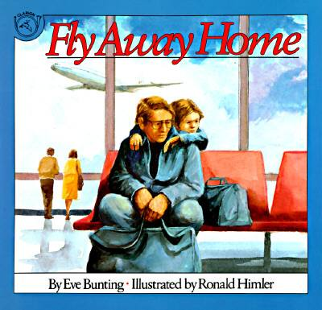{width="3.25in"
height="3.125in"}

A homeless boy who lives in an airport with his father, moving from
terminal to terminal trying not to be noticed, is given hope when a
trapped bird finally finds its freedom.

**Discussion:**

- What is important about having a home? In what ways does having a home
  help people? What is this small family missing by not having one?

- The parallel between the sparrow and the boy\'s family is not
  difficult symbolism but some children may have to be helped to see it.

- The boy says \"Not to be noticed is to look like nobody at all.\"
  Children should be helped to see what that statement means in all its
  implications.

- Rereading the book with an eye towards what the various people in this
  book value and how their values compare with those of the children in
  your class is a worthwhile activity. These people may be homeless but
  they are not valueless. Help the children see how they are coping with
  this difficult situation without hurting anybody. They have not turned
  to crime in order to get a place to live. The father goes off to a
  part time job. They are constantly looking for a way out: an apartment
  they can afford, better paying work. They are staying clean, washing
  up with full flights of people in the washrooms. The boy\'s father is
  insisting that, when it comes time, the boy will go to school even
  though he\'s not sure how he will manage it. There is compassion
  toward others in the book and real friendships between some of the
  homeless people.

**Fly Away Home**

**Eve Bunting**

My dad and I live in an airport. That's because we don't have a home and
the airport is better than the streets. We are careful not to get
caught.

Mr. Slocum and Mr. Vail were caught last night. "Ten green bottles,
hanging on the wall," they sang. They were as loud as two moose
bellowing. Dad says they broke the first rule of living here. Don't get
noticed. Dad and I try not to get noticed. We stay among the crowds. We
change airlines.

"Delta, TWA, Northwest, we love them all," Dad says. He and I wear blue
jeans and blue T-shirts and blue jackets. We each have a blue zippered
bag with a change of blue clothes. Not to be noticed is to look like
nobody at all.

Once we saw a woman pushing a metal cart full of stuff. She wore a long,
dirty coat and she lay down across a row of seating in front of
Continental Gate 6. The cart, the dirty coat, the lying down were all
noticeable. Security moved her out real fast.

Dad and I sleep sitting up. We use different airport areas. "Where are
we tonight?" I ask. Dad checks his notebook. "Alaska Air," he says.
"Over in the other terminal." That's OK. We like to walk. We know some
of the airport regulars by name and by sight. There's Idaho Joe and
Annie Frannie and Mars Man. But we don't sit together.

"Sitting together will get you noticed faster than anything," Dad says.

Everything in the airport is on the move---passengers, pilots, flight
attendants, cleaner with their brooms. Jets roar in, close to the
windows. Other jets roar out. Luggage bounces down chutes, escalators
glide up and down, disappearing floors. Everyone's going somewhere
except Dad and me. We stay.

Once a little brown bird got into the main terminal and couldn't get
out. It fluttered in the high, hollow spaces. It threw itself at the
glass, fell panting on the floor, flew to a tall, metal girder, and
perched there, exhausted.

"Don't stop trying," I told it silently. "Don't! You can get out!"

For days the bird flew around, dragging one wing. And then it found the
instant when a sliding door was open and slipped through. I watched it
rise. Its wing seemed okay.

"Fly, bird," I whispered. "Fly away home!"

Though I couldn't hear it, I knew it was singing. Nothing made me as
happy as that bird. The airport's busy and noisy even at night. Dad and
I sleep anyway. When it gets quiet, between two and four A.M., we wake
up.

"Dead time," Dad says. "Almost no flights coming in or going out." At
dead time there aren't many people around, so we're extra careful. In
the mornings Dad and I wash up in one of the bathrooms, and he shaves.
The bathrooms are crowded, no matter how early. And that's the way we
like it. Strangers talk to strangers.

"Where did you get in from?"

"Three hours our flight was delayed. Man! Am I bushed!"

Dad and I, we don't talk to anyone. We buy doughnuts and milk for
breakfast at one of the cafeterias, standing in line with our red trays.
Sometimes Dad gets me a carton of juice.

On weekends Dad take the bus to work. He's a janitor in an office in the
city. The bus fare's a dollar each way. On those days Mrs. Medina looks
out for me. The Medinas live in the airport, too---Grandma, Mrs. Medina,
and Denny, who's my friend. He and I collect rented luggage carts that
people have left outside and return them for fifty cents each. If the
crowds are big and safe, we offer to carry bags.

"Get this one for you, lady? It looks heavy." Or, "Can I call you a
cab?" Denny's real good at calling cabs. That's because he's seven
already.

Sometimes passengers don't tip. Then Denny whispers, "Stingy!" But he
doesn't whisper too loud. The Medinas understand that it's dangerous to
be noticed.

When Dad comes home from work, he buys hamburgers for us and the
Medinas. That's to pay them for watching out for me. If Denny and I have
had a good day, we treat for pie. But I've stopped doing that. I save my
money in my shoe.

"Will we ever have our own apartment again?" I ask Dad. I'd like it to
be the way it was, before Mom died.

"Maybe we will," he says. "If I can find more work. If we can save some
money." He rubs my head. "It's nice right here, though, isn't it,
Andrew? It's warm. It's safe. And the price is right."

But I know he's trying all the time to find us a place. He takes
newspapers from the trash baskets and makes pencil circles around
letters and numbers. Then he goes to the phones. When he comes back he
looks sad. Sad and angry. I know he's been calling about an apartment. I
know the rents are too high for us.

"I'm saving money, too," I tell him, and I lift one foot and point to my
shoe.

Dad smiles. "Atta boy!"

"If we get a place, you and your dad can come live with us," Denny says.

"And if we get a place, you and your mum and your grandma can come live
with us," I say.

"Yeah!"

We shake on it. That's going to be so great!

After next summer, Dad says, I have to start school.

"How?" I ask.

"I don't know. But it's important. We'll work it out."

Denny's mom says he can wait for a while. But Dad says I can't wait.
Sometimes I watch people meeting people.

"We missed you."

"It's so good to be home."

Sometimes I get mad, and I want to run at them and push them and shout,
"Why do you have homes when we don't? What makes you so special?" That
would get us noticed, all right. Sometimes I just want to cry. I think
Dad and I will be here forever. Then I remember the bird. It took a
while, but a door opened. And when the bird left, when it flew free, I
know it was singing.

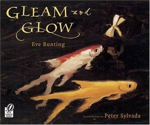{width="3.125in"
height="2.6145833333333335in"}

The story is all too familiar, unless you haven\'t been reading the
papers or watching television news. A family hastens to escape their
war-torn country, but before leaving an older man leaves his fish bowl
with the family. Little Marina names them Gleam and Glow and Viktor her
brother places the two beautiful goldfish in their pond in the hope that
they may live a day or two more. The family escapes to the safety of a
refugee camp and when the war ends, they return home. Sadly it is only
to find that all is destroyed except that the beautiful fish have
multiplied and filled the pond with shades of gold-adding some joy to
their return home. As Eve Bunting remarked in one presentation \"the
saddest wars are civil wars.\" This story is sad but it ends on a bright
note and the closing picture is filled with the golden glow of the fish.
The beautiful endpapers and cream-coloured pages are a perfect
complement as are the paintings by Sylvada which early on are filled
with dark colours to reflect the bleakness of war and then brighten as
the people return home. This is a picture book that will also appeal to
older readers.

A Note from the Author:

*There is a village called Jezero in Bosnia-Herzegovina. In 1990, before
the Bosnian war, a villager named Smajo Malkoc gave his sons two golden
fish in an aquarium.*

*When the war came, Malkoc's family fled from the Bosnian-Serb forces.
In an attempt to save the fish, his wife released them into a nearby
lake.*

*In 1995, when the family returned home after the war, they found their
house and village in ruins. The lake, however, was teeming with life =
it was filled with shining golden fish. Left alone, the fish had fed on
the underwater lake life, thrived, and multiplied.*

*Hearing of the remarkable fish, people came to admire and to buy. The
fish turned out to be not only beautiful but valuable. Prosperity and
fame came to the Malkocs and their neighbours, and the village was
rebuilt.*

*Gleam and Glow was inspired by this true and magical story. yet my
version is not only a story for a particular country or people -- it's
for people everywhere who have been forced from the lives they have
known, and who find hope in the most unexpected places.*

*\*

**Gleam and Glow Eve Bunting**

When Papa left to join the underground, marina cried, To be truthful,
mama and I cried, too.

"I don't want Papa to be underground,' Marina sobbed.

"Shh, little one," Mama said. "It just means he's fighting secretly with
many of our men. On top of the ground."

I gave marina a pitying glance. She's only five and doesn't know much.
I'm eight, and I know a lot.

Before he left, Papa had tried to explain things to Marina.

"Why don't those people like us?" she'd asked.

I didn't know why, either, but I rolled my eyes and pretended I did.

"We're different from them," Papa told her. "They think this is their
country and they don't want us living here. But this is *our* country. I
will fight with the Liberation Army to stop them from pushing us out of
our own land." He put his hand on my shoulder. "Viktor, you are the man
of the house now. Be a strong help to your mother."

And then he was gone.

"I'll be back," he'd said. But I worried. What if he came back, and we
weren't here?

Mama said we would have to leave soon. It was getting too dangerous to
stay much longer. Our enemies were coming, sweeping through villages
like great brooms, forcing people out and burning their homes.

Every day we heard distant gunshots and saw smoke rise into the faraway
skies.

Every day strangers stopped on their way out of the country to put down
their bundles, to share our food, to take shelter under our roof. They
told terrible stories of how it had been for them and their neighbours
when the soldiers came. They cried as they talked. Their eyes went this
way and that, as if they thought the soldiers were just outside on our
doorstep.

When their stories got too terrible, Mama sent marina and me to the pond
for fresh water or to the vegetable patch to look for hidden potatoes.

But we heard a lot anyway.

Marina started to suck her thumb again, and I wet the bed three nights
in a row.

mama held me close. "It's all right, Viktor. There is no harm done."

One day a family came on a tractor. They had a boy my age named Alexsa
and a dog who could do tricks. Alexsa liked showing him off.

"My father is in the underground," I told him, and I felt proud. Having
a father in the underground was better than having a dog who could do
tricks.

I watched them leave the next morning. We don't have a tractor. I knew
that when we left, we would have to walk.

A few days later a man came. His heavy bag was strapped on his back, and
he was carrying a bowl with water and two fish in it. He put the bowl on
our table, and it seemed to me that all the light of the world was
trapped inside that glass bowl.

"I can't carry them farther," he said. "Will you keep them? They are
very wondrous fish."

Mama shook her head. "We are leaving ourselves in a day or two."

Marina jumped up and down. "Please, Mama! Aren't they pretty? I've just
thought up their names. Gleam and Glow."

The man sighed. "Let them stay behind when you go, then. An extra day or
two of life is as important to a fish as it is to us. Here is their
food." He gave Marina a twist of paper. "Sprinkle a little on top of the
water each day."

"I will," Marina promised.

For two days she fed them and talked to them and even tried to pet them
with her finger.

"I love Gleam and Glow," she told Mama. "I love them with all my heart."

Three days later Mama said we could wait no longer. "I wanted to stay
till it got warmer," she said softly, as if to herself. "The cold will
be hard on the little one." I knew she was remembering the pneumonia
Marina had last year.

"We will leave tomorrow early," she said to us. "We must make it to the
border and the safe country beyond."

"Is it far to walk?" I asked, wishing for a tractor.

"It is. But we will get there."

"Please, please, can we take Gleam and Glow?" Marina begged. "I'll carry
them."

"You couldn't, Marina," Mama said. "We will have to leave them. But
think, we may be able to find your father. Won't that be good?"

I thought maybe she wa just trying to give us hope, but even the
goodness of that hope didn't comfort Marina. She slept with Mama that
night, and I heard her sobbing for a long time before it was quiet and I
knew she was asleep.

I lay looking around my room, putting it in my memory. My books on the
shelves Papa made for me. The painting I had done that Mama had framed.
I thought about how hard it would be for Marina to leave her fish.

When the clock struck midnight I got up, carried the fishbowl outside to
our pond, and slipped Gleam and Glow into the water. They flashed into
the tangled weeds at the edge of the pond. I sprinkled what was left of
their food on the water. "One or two extra days of life," I whispered.
"Good luck."

We would need good luck, too.

Mama woke us at dawn. When I told about the fish, we went outside to see
if they made it through the night. Marina clapped her hands and called
their names, but Gleam and Glow stayed out of sight.

"Maybe they're sleeping," she said. "I know they'll love our pond."

Our bundles were ready to carry. Two each for Mama and me and a smaller
one for Marina.

The road outside our house was filled with half-light shadows. I looked
back once as we walked away. There was our oak tree, the vegetable
patch, Mama's flower garden, where the flowers waited under the earth
for spring.

Would we ever come home again? Would Papa ever find us?

We walked and walked.

We were slow and people passed us. But some went at our pace, and the
things they told us made us know that we had been right to leave before
the horror reached out to us.

We walked and walked.

A man with a wheelbarrow let Marina ride on top for a whole day. He took
one of Mama's bundles and one of mine. That was the best walking day
ever.

At night we slept in fields or barns. One night it rained hard, but we
were lucky to find a deserted house and we slept well.

Once some men from our Liberation Army stopped and shared chickens with
us. We had chicken stew that night.

"Do you know our papa?" Marina asked. But they said they didn't.

We kept looking for Papa, thinking sometimes we saw him. But was always
a stranger who just looked like him.

Some days Marina and I begged to stop. We could go no farther. But
Mama's will pulled us on.

And then, one morning, we heard cheers from people walking ahead of us.
Someone shouted, "I see the border! We're almost there." All along the
line everyone cheered until our throats hurt.

It was better after we crossed the border. There was a camp with tents
for us to live in; there was food, and fires to cook it. We could wash
our clothes and ourselves. There were other children in the camp. I made
friends with two boys named Behar and Admir, and we played games
together. We were allowed to paint the initials of the Liberation Army
ona wall and we felt good, as if we were fighting alongside the
liberators to set our country free.

We were in the camp for a long time., and that is where Papa found us. I
looked up one evening and there he was, dirty and thin -- but beautiful.
Marina and I screamed with joy, and hje picked us both up and kissed our
faces over and over. Mama stood with tears running down her cheeks, and
he gathered her close and whispered into her hair. She touched his face
with her fingertips as if she thought he was just a dream. "Are you
really here?"

"I am here," Papa said softly. "It's a miracle I found you. I asked and
asked. Always I asked."

Marina tugged at his leg. "Can you stay, Papa?"

"Yes, little one." Papa smiled. I didn't know how he could stay. It was
enough that he could.

"Can we go home now, Papa?" I asked.

"Not yet, Viktor. Soon."

But it was many months before we were told it was safe to leave. That
night we all danced between the rows of tents. It was a great, joyful
party.

The next day we started on the long walk home.

And, oh, it was sad. We saw no houses, no farms, no animals along the
way, just rubble and great holes where bombs had fallen.

We walked and walked.

I knew our house would be gone. I didn't want to know that, but somehow
I just did. Papa carried Marina on his shoulders and she jabbered
happily. She was the only one who thought our old life would be waiting
for us.

When I saw the oak tree still standing, my heart raced with hope. I
clutched Mama's hand. Maybe it was going to be all right.

Then I looked beyond the tree. Our house was only a skeleton. A few
flowers poked up from Mama's garden. Except for that, we could have been
on the moon.

Marina was the first to remember the fish. She took a stale slice of
bread from Mama's bundle and ran towards the pond, calling out Gleam and
Glow's names. We ran behind to comfort her.

And there was our pond, as shimmery and dazzling as melted gold. It was
filled with countless fish.

Mama pressed her hands to her heart. "Gleam and Glow and their children
and their children's children," she said.

"They found their own nourishment," Papa said.

Marina clapped her hands. "Oh, what smart fish," she said.

"In spite of everything, they lived," Mama whispered.

Like us, I thought. *They lived.*

"Gleam! Glow!" Marina called, and tossed in crumbs of bread. Fish after
fish came to the edge of the pond where she knelt. "Look!" She pointed.
"There's Gleam and there's Glow."

"That made us laugh, because those fish were as identical as could be.

"Did you miss me?" Marina asked them. "I missed you."

I leant close to the water. "We're back, Gleam and Glow," I told the
fish. "We've come home."

**The Flat Rabbit**

**Author & Illustrator: Bardur Oskarsson**

{width="2.7083333333333335in"
height="2.71875in"}

The Flat Rabbit follows the traditional plot triangle, with an
introduction, rising action, climax, and resolution. But it is more
emotion-driven than action-driven.

A dog and a rat separately stumble upon a flattened rabbit in the road.
They take a moment pondering her and feeling quite sad about the
situation. The rat says,

*Lying there can't be any fun.*

They feel moved to do something with the rabbit, but they don't know
what. They're worried about how it might look to carry a flattened
rabbit back to her apartment. They're distressed something might find
and eat her. The rising action is really their increasing concern
without knowing what to do about it.

The dog was now so deep in thought that, had you put your ear to his
skull, you would have actually heard him racking his brain.

Finally, he comes up with the solution, and rat helps him make it happen
(because, as they discover, it's actually quite difficult, adding some
suspense to the climax). The dog and the rat carefully lift the
flattened rabbit off the road, tape her to a kite they had spent the
night constructing, and fly her high up above the park.

"Do you think she is having a good time?" the rat finally asked, without
looking at the dog.

The dog doesn't know, but he offers the rat a turn to hold the kite.

{width="2.53125in"
height="2.6875in"}

Now, there's no question that prying up some road kill and taping it to
a kite is a weird thing to do, and maybe even a bit controversial to
write into a children's story. But perhaps that is just my reaction from
growing up in a society where death is treated as something only to be
sad about and otherwise avoided as much as possible, both in
conversation and in actual experience. Really though, how sweet that
these two animal strangers were kind enough not to avoid death, but to
set the rabbit soaring as a final send-off.

The final spread is an overhead image of the city with a bird flying
over the buildings. Perhaps the dead rabbit's view from the kite, having
a good time? Or has the rabbit actually transformed into that now-living
bird? Or maybe the dog and the rat have helped the rabbit reach the
heavens?

**The Flat Rabbit:** A Minimalist Scandinavian Children's Book about
Making Sense of Death and the Mysteries of Life

Article by Maria Popova

A gentle and assuring reminder that we don't have all the answers

[\
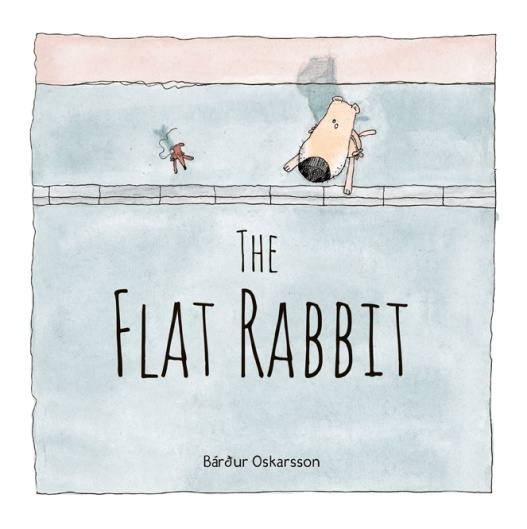{width="2.3958333333333335in"
height="2.40625in"}](http://www.amazon.com/exec/obidos/ASIN/1771470593/braipick-20)Neil
Gaiman, in discussing his [gorgeous new adaptation of *Hansel and
Gretel*](http://www.brainpickings.org/2014/10/28/neil-gaiman-hansel-gretel-lorenzo-mattotti/),
asserted that we shouldn't protect ourselves and children from the dark.
But when the thickest darkness comes, in childhood as much as in
adulthood, it brings with it not the monsters and witches of fairy tales
but the tragedies of life itself --- nowhere more acutely than in
confronting death and its ghouls of grief. And when it does come,
as [Joan Didion memorably put
it](http://www.brainpickings.org/2013/12/05/joan-didion-on-grief/), it's
"nothing like we expect it to be." What we need isn't so much protection
as the shaky comfort of understanding --- a sense-making mechanism
for [the messiness of
loss](http://www.brainpickings.org/2014/06/09/meghan-o-rourke-the-long-goodbye/).

That's precisely what Faroese children's book author and artist **Bárður
Oskarsson** does in [***The Flat
Rabbit***](http://www.amazon.com/exec/obidos/ASIN/1771470593/braipick-20) ---
a masterwork of minimalist storytelling that speaks volumes about
our [eternal tussle with our own
impermanence](http://www.brainpickings.org/2014/05/22/alan-lightman-accidental-universe-impermanence/).

The book, translated by Faroese language-lover **Marita Thomsen**, comes
from a long tradition of Scandinavian children's books with singular
sensitivity to such difficult subjects --- from Tove Jansson's [vintage
parables of
uncertainty](http://www.brainpickings.org/2014/09/29/too-ticky-quotes-tove-jansson/) to
Stein Erik Lunde's [Norwegian tale of
grief](http://www.brainpickings.org/2013/04/12/my-fathers-arms-are-a-boat/) to
Øyvind Torseter's [existential meditation on the meaning of something
and
nothing](http://www.brainpickings.org/2013/09/16/the-hole-enchanted-lion/).

The story, full of quiet wit and wistful wonder, begins with a carefree
dog walking down the street. Suddenly, he comes upon a rabbit, lying
silently flattened on the road. As the dog, saddened by the sight,
wonders what to do, his friend the rat comes by.

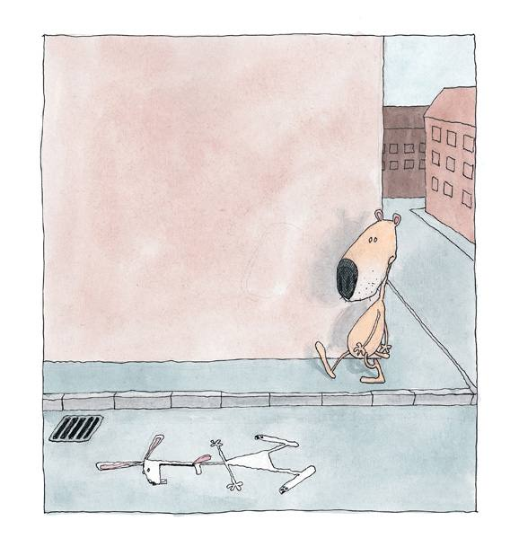{width="5.208333333333333in"
height="5.479166666666667in"}

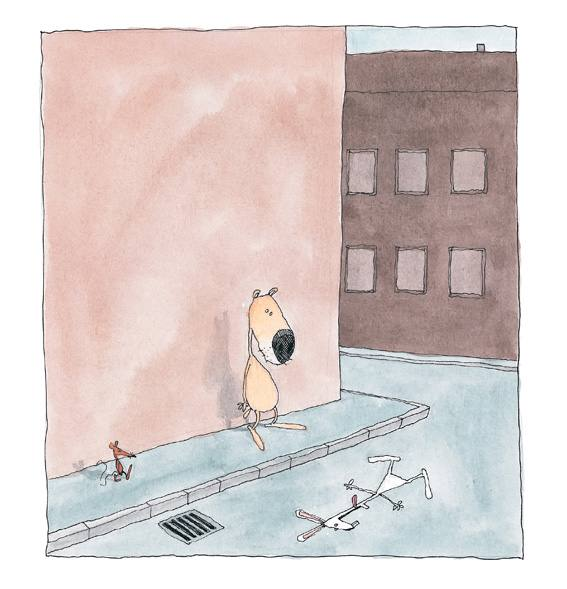{width="5.208333333333333in"
height="5.40625in"}

"She is totally flat," said the rat. For a while they just stood there
looking at her.

"Do you know her?"

"Well," said the dog, "I think she's from number 34. I've never talked
to her, but I peed on the gate a couple of times, so we've definitely
met."

The two agree that "lying there can't be any fun" and decide to move
her, but don't know where to take her and head to the park to think.

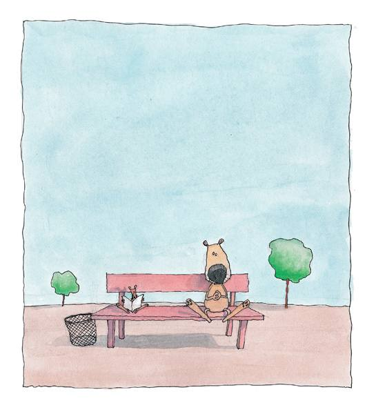{width="5.208333333333333in"
height="5.697916666666667in"}

The dog was now so deep in thought that, had you put your ear to his
skull, you would have actually heard him racking his brain.

Embedded in the story is a subtle reminder that ideas don't come to us
by force of will but by the power
of [incubation](http://www.brainpickings.org/2013/08/28/the-art-of-thought-graham-wallas-stages/) as
everything we've unconsciously absorbed clicks together into new
combinations in our minds. As the dog sits straining his neurons, we see
someone flying a kite behind him --- a seeming aside noted only in the
visual narrative, but one that becomes the seed for the rabbit solution.

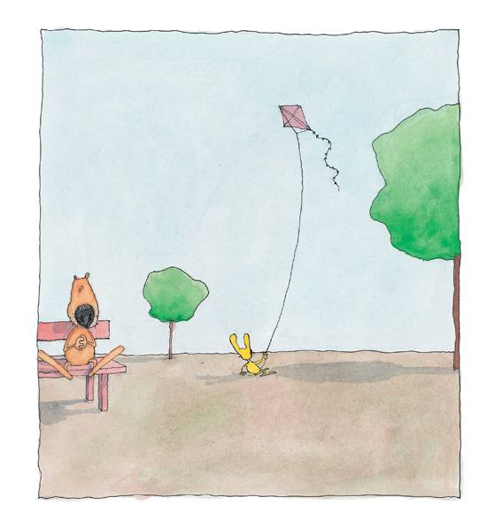{width="5.208333333333333in"
height="5.479166666666667in"}

Exclaiming that he has a plan, the dog returns to the scene with the
rat. They take the rabbit from the road and work all night on the plan,
hammering away in the doghouse.

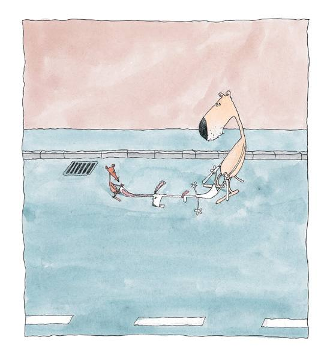{width="5.208333333333333in"
height="5.59375in"}

In the next scene, we see the rabbit lovingly taped to the frame of a
kite, which takes the dog and the rat forty-two attempts to fly.

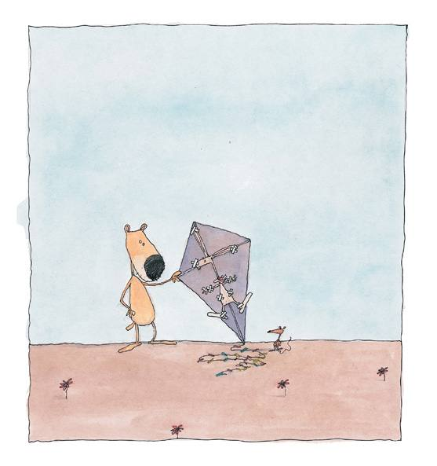{width="5.208333333333333in"
height="5.541666666666667in"}

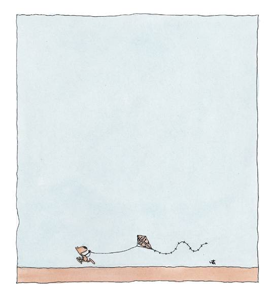{width="5.208333333333333in"
height="5.645833333333333in"}

With great simplicity and sensitivity, the story lifts off into a subtle
meditation on the spiritual question of an afterlife --- there is even
the spatial alignment of a proverbial heaven "above." It suggests --- to
my mind, at least --- that all such notions exist solely for the comfort
of the living, for those who survive the dead and who confront their own
mortality in that survival, and yet there is peace to be found in such
illusory consolations anyway, which alone is reason enough to have them.

Mostly, the story serves as a gentle reminder that we simply don't have
all the answers and that, as [John Updike put
it](http://www.brainpickings.org/2012/07/30/john-updike-jim-holt-why-does-the-world-exist/),
"the mystery of being is a permanent mystery."

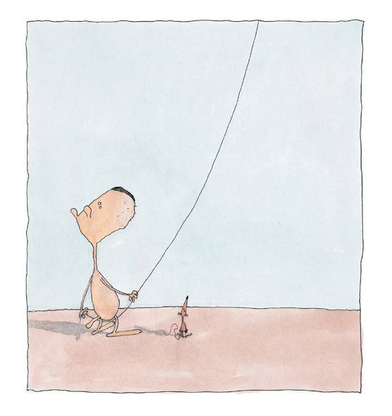{width="5.208333333333333in"
height="5.520833333333333in"}

Once the kite was flying, they watched it in silence for a long time.

"Do you think she is having a good time?" the rat finally asked, without
looking at the dog.

The dog tried to imagine what the world would look like from up there.

"I don't know..." he replied slowly. "I don't know."

.

**Possible Lessons:**

**Predictions:**

Encourage students to make predictions based on the cover of the book
before reading the story. Show students the front cover and ask them,
"Who are the characters in the story?" Show them the back cover of the
book and ask them, "What would you do if you found a flat rabbit?" Ask
students, "What would cause a rabbit to be flat?" or "Where do the dog
and rat find the rabbit?" After discussing the students' predictions,
read the story together.

**Themes**

While the text and illustrations appear simple, the themes addressed in
The Flat Rabbit range from the simple theme of friendship to the more
complex themes of compassion, working together toward a common goal, and
coping with death. Have students begin to think about themes by asking
them to pick the part of the story they think is most important and tell
why they think it is important. Put students' ideas up on an anchor
chart. Group like ideas together so students can start seeing the
messages in the story.

**Discussion Questions**

1\. What information does the reader learn from one (or more) of the
illustrations that is not directly stated in the text?

2\. When the dog and rat are trying to figure out what to do for the
rabbit, what does the rat do while the dog thinks? How do the rat's
activities help the dog formulate a plan?

3\. How do the dog and the rat show their compassion for the rabbit,
whom they do not even know well? What does this show the reader about
the characters of the dog and the rat?

4\. What does the author reveal to the reader about the friendship
between the dog and the rat? How does the reader know that the dog and
the rat were not friends with the rabbit?

5\. Why do the dog and the rat want to send the rabbit to the sky on a
kite? Where could they be sending the rabbit? Why would they fly her on
a kite?

6\. Based on the fact that the rabbit is flat in the road, how might she
have died?

**Writing**

After reading and discussing the book, ask students to think about
whether they would like to have the rat and/or the dog as a friend, and
why. Then have students write and explain their position. Or, have
students write about an important day they spent with a friend. Students
should tell what happened and why it was important. Ask for volunteers
to share their writing with the class.

The dog and the rat wonder what the rabbit must see from the sky.

Write a poem from the point of view of the rabbit. First, brainstorm
phrases or sentences that the rabbit might say --- if she could --- to
the rat and the dog, based on what happens in the story.

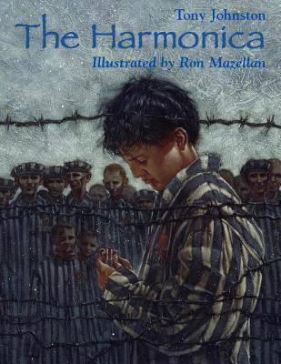{width="2.5625in"
height="3.3229166666666665in"}

When the Nazis invade Poland, a family is split apart. A harmonica keeps
a boy\'s hope alive. The story is inspired by the life of a Holocaust
survivor.

Henryk Rosmaryn. Henryk survived the Dyhernfurth concentration camp with
the help of the harmonica his father gave him. After coming to America,
he continued to use his harmonica and its music as a way to share his
wartime experience.

Set during WWII, Tony Johnston tells the story of how a boy's harmonica
and the memory of his parents give him hope and help him survive the
horrors of a concentration camp. This beautiful and tragic tale gently
lures the reader into the setting, into the camp, almost able to hear
the music of the harmonica.

Although the characters remain nameless, they become relatable to
everyone who has experienced loss and hopelessness. The vivid language
and beautiful illustrations allow the reader to take part in an amazing
journey of hope and courage.

Conflict: A boy, separated from his parents and imprisoned in a Nazi
concentration camp, feels badly about receiving extra food for playing
his harmonica to the commandant.

Conflict Resolution: The boy realises that he is bringing great joy and
hope to the other prisoners.

Action: Description of action:

*"I cannot remember my father's face,* Sets the tone and mood for

*or my mother's, but I remember their* the story.

*love, warm and unfolding as a song"*

(first page)

*"I played the harmonica while my parents* This is the rising action
that

*danced. In our dream we believed the* will take the boy to the

*world to be good. Until there in the heart* concentration camp, and
reader

*of Poland, Nazi soldiers found us"* to the climax of the story.

(middle)

*"Night after night I touched the* Resolution:

*harmonica to my lips. I thought of my* The boy has found his new

*father, who had given it to me. Of my* dream, his new place.

*mother, who once had danced. And of*

*the prisoners, without hope, who might*

*hear the notes and be lifted, like*

*flights of birds."* (last page)

**History -- Holocaust (Concentration Camps):** In 1933, before WWII
even officially began, concentration camps were created by the Nazis.
\"The term concentration camp refers to a camp in which people are
detained or confined, usually under harsh conditions and without regard
to legal norms of arrest and imprisonment.\"

By the beginning of the War, people taken to the camps were either
killed or put to hard labour (work). \"Those forced to work, were
deliberately undernourished and mistreated\" with the intent that they
would be killed by the work.

**Art**

Warm Colour Palette / Cool Colour Palette: Notice how most of the
pictures about his family are done in tones of reds, oranges, yellows
(warm colours) to reflect the warmth of the happy times. Most of the
pictures of his time as a prisoner in the concentration camp is done
cool colours to reflect the cold, hard times.

The artist in this story used black as a basic colour (in the
concentration camp illustrations) and added bits of colour for
variation. Students can try to use black as a main colour while adding
other colours for variation. What colours emerge from a black base? Are
the differences notable? Which colours were added in the illustrations
in the story?

**Symbolism**: Re-read the part about the commandant who wore ugliness
and death upon his shoulders. Look at the picture that accompanies that
text\... there is a skull above the soldier's shoulder. This was the
illustrator's way of painting the picture to go with the text. The skull
symbolises the ugliness and death, and he drew it above the one
shoulder.

**Music**

Composers -- Franz Peter Schubert:

Franz Peter Schubert was born in Austria on January 31, 1797. During his

childhood, the Austrians were fighting France, so French soldiers were a
common sight. Music was a diversion. His father was a cellist and
provided lessons (violin and viola) for this children. It was plain to
see that Franz Peter was talented, and when his father had taught him
all he could it was arranged that he was receive lessons.

In 1808 (at age 11), he was accepted into The Imperial and Royal Chapel
choir and admitted to Stadtkonvikt, the Imperial and Royal Court
Seminary. He studied great composers like Hadel, Mozart, and Beethoven.

He did very well at first. By age 12, he was playing second violin and
began

composing. Before long, writing music began to take up so much time that
his

grades suffered. And then in 1812, his mother died and his voice
changed\....ending his scholarship with the choir and school. He was
given special permission by the Emperor himself to stay on at the
Seminary. His father wanted him to become a teacher. But Franz Peter had
decided that music was his life and he only wanted to compose. Between
1813 and 1816, Franz Peter composed 400 different works. And by age 20,
he had also written one cantata and five symphonies.

By 1823, he had become ill and depressed. During the next few years, he
battled his illness and depression but still remained quite productive
with his

music. He died on November 19, 1828. While he had times of recognition
while he was alive, it was not until after his death that his work
became truly famous.

Biographies talk of Franz Peter being cold and hungry at school, but
that writing music made him forget that. Also tells of a time when the
French soldiers fired a cannon ball that went through the school. You
could tie both incidences in with The Harmonica.

**Found Poetry**\
**The Harmonica Tony Johnston**

I cannot remember my father's face, or my mother's, but I remember their
love, warm and enfolding as a song.

Singing was like breathing to us. For a time the only music in our house
was our own voices -- my father's, my mother's, and mine -- so off-key
we could crack crockery. Then the melodies of Schubert soared into our
home, freed from the neighbours' gramophone. We sang and we listened to
the gramophone's sweet notes, and we lived our lives. I had dreams of
music. A piano was my heart's desire. A piano for playing Schubert. But
like the composer, we were poor as pigeons. Even so, one evening, dusted
with coal from the mine where he worked, my father came home and slipped
a silvery gift into my hand. A harmonica.

On it were his charry fingerprints. My lips loved the harmonica, cool as
water. At first my breath panted in and out of its niched sides like a
bellows. I was so eager.

"Gently," said my father, a smile in his voice. "Or you will simply
blast it apart."

I wheezed. And blew. Until somewhere in the heart of the harmonica, my
mouth found Schubert. Then my mother and father danced together. Waltzed
over our bare floor.

Somewhere outside, a war was raging. But it was far away -- a bad dream
-- leaving us untouched.

I played the harmonica while my parents danced. In our dream we believed
the world to be good. Until there in the heart of Poland, Nazi soldiers
found us.

We were Jews. Enough for them to take my mother and father from me. like
a length of kindling, in one stroke, they split our family.

I was sent to a concentration camp, swallowed, dreams and all, down the
dark Nazi throat. Barefoot, I laboured alongside others, all of us
dull-eyed bags of bones, digging a road through snow. With each
shovelful of frozen earth, I thought of my mother and father. Were they
still alive? I wondered.

Often, to keep from losing hope, I touched the harmonica, cold inside my
pocket. Sometimes I played it to keep from losing hope. I wept when I
thought of my father and mother.

I awoke jolted from sleep. And I knew -- my parents were dead. Then I
played Schubert. Played and played while my heart reeled.

The commandant of the camp loved Schubert. By some terrible miracle he
heard of me and sniffed me out. One night he spat, "Play, Jew!"

I stood before him, my hand numb with winter. What if I fumbled? What if
the notes rushed from my head? Inside I trembled like a hare crouched in
a bush. I had no doubt, if I faltered, I would be dead.

I remembered what my father had told me of Schubert. How he had lived in
a bare room with no fire. Though his fingers ached with cold, he wrote
his music. Though he ached, he could not stop creating beauty. Though I
ached, each night I, skin-and-bones-boy, played for the commandant. He
listened, enthralled. Each night, when I was done, he tossed me bread.

He worked us, beat us for no reason, without mercy. Yet he recognised
beauty. I could not imagine how that could be.

I felt sick, black inside, playing music for the commandant, who wore
ugliness and death upon his shoulders like epaulets. I felt sick,
getting bread while others starved to death. I despised myself for every
note, every harmonica-breath until one day a whisper grazed my ear.
"Bless you."

"For what?' I asked the dark.

"Schubert."

I slipped that into my pocket. Each night, like the very stars, my notes
had reached other prisoners.

"Play, Jew!" The commandant spat, night after night.

Night after night I touched the harmonica to my lips. I thought of my
father, who had given it to me. Of my mother, who once had danced. And
of prisoners, without hope, who might hear the notes and be lifted, like
flights of birds. I played for them -- with all my heart.

**WRITING CRAFT The Harmonica**

+----------------------+---------------------------------------------+
| **Focus**            | Nazis Concentration Camp                    |
|                      |                                             |
| **Ideas and          | Hope                                        |
| details:**           |                                             |
+======================+=============================================+
| **Organisation**     | Lead: Poignant. Sets the tone and mood for  |
|                      | the story.                                  |
| Leads/Endings        |                                             |
|                      | Ending: Reinforces theme                    |
| Transitions          |                                             |
|                      | Problem/ Solution                           |
| **Organisational     |                                             |
| Structure:**         |                                             |
+----------------------+---------------------------------------------+
| **Style**            | Repetition: . *Tony Johnston uses           |
|                      | repetition in*                              |
| **Words: Memorable   |                                             |
| Language**           | *A poetic way. Certain phrases are          |
|                      | emphasised and*                             |
| **Voice:**           |                                             |
|                      | *certain phrases are comforting through her |
| **Fluency:**         | use of repetition.* Some examples:          |
|                      |                                             |
|                      | \"Often, to keep from losing hope, I        |
|                      | touched the harmonica\...\"                 |
|                      |                                             |
|                      | \"Sometimes I played it to keep from losing |
|                      | hope\...\"                                  |
|                      |                                             |
|                      | \"Though he ached\...\"                     |
|                      |                                             |
|                      | \"Though I ached\...\"                      |
|                      |                                             |
|                      | \"I felt sick, black inside\...\"           |
|                      |                                             |
|                      | \"I felt sick, getting bread\...\"          |
|                      |                                             |
|                      | \"\...the commandant spat, night after      |
|                      | night.\"                                    |
|                      |                                             |
|                      | \"Night after night I touched the           |
|                      | harmonica\...\"                             |
|                      |                                             |
|                      | Strong Verbs: *wheezed waltzed jolted       |
|                      | reeled spat fumbled faltered enthralled     |
|                      | epaulets despised grazed* Nouns: *crockery  |
|                      | kindling epaulets commandant niche*         |
|                      |                                             |
|                      | Similes: *\"Love, warm and enfolding as a   |
|                      | song\"*                                     |
|                      |                                             |
|                      | *\"Singing was like breathing\"*            |
|                      |                                             |
|                      | *\"Harmonica, cool as water\"*              |
|                      |                                             |
|                      | *\"Breath panted in and out\....like a      |
|                      | bellows\"*                                  |
|                      |                                             |
|                      | Simile hunt -- there are more.              |
|                      |                                             |
|                      | Distinct voice.                             |
|                      |                                             |
|                      | Sentence fragments.                         |
+----------------------+---------------------------------------------+
| **Conventions**      | Questions.                                  |
|                      |                                             |
| **Punctuation:**     | Exclamations.                               |
|                      |                                             |
| **Grammar:**         | Dash.                                       |
|                      |                                             |
| **Spelling:**        |                                             |
+----------------------+---------------------------------------------+

{width="2.6041666666666665in"
height="3.375in"}

{width="4.916666666666667in"
height="3.3020833333333335in"}

Author\'s Note:

The Harmonica was inspired by a true story. Henryk Rosmaryn grew up in
Czeladz, Poland. In 1939 the Germans invaded his homeland. Henryk was
taken to Dyhrenfurth concentration camp where, with the help of the
harmonica that his father had taught him to play, he survived the
hardship and sorrow of that prison.

After the war he came to the United States and changed his name to Henry
Rosmarin. Again with the aid of his harmonica, he shared his wartime
experiences with others, especially teenagers, in the hope that they
might bring about a better future. Although he died in 2001, his is an
ongoing story of the power of music and the strength of the human heart.

> --- Tony Johnston

{width="4.6875in"
height="3.8854166666666665in"}

**Crab Moon Ruth Horowitz**

One June night, under the full moon, Daniel's mother wakes him up to see
the extraordinary sight of horseshoe crabs spawning on the beach, just
as they have every spring for an awesome 350 million years. But when
Daniel returns in the morning, he finds only one lonely crab, marooned
upside down in the sand. Can he possibly save it? Like a perfect day at
the beach, CRAB MOON leaves an indelible memory of a special adventure
between parent and child, and a quiet message about doing our part to
preserve even earth's oldest creatures.

**Horseshoe Crabs**

Background information for the teacher

The Horseshoe Crab has survived for millions of years and is sometimes
called a "living fossil." It is not a crab but resembles a member of the
arachnid family. The male and female crabs look similar except for size
and legs. The male crab is much smaller and has as its first set of
legs, a pair of what looks like boxing gloves, which it uses to hold on
to the female crabs shell during spawning. The crab has an exoskeleton
made of chitin which helps to protect it. This is called the carapace.
The carapace is the colour of the sand and helps the crab to blend in.
On top of the carapace are two compound eyes. At the front of the
carapace are simple eyes. There are also photoreceptors along the edge
of the shell and along the telson. It has six sets of walking legs. The
first set of legs on the male are the clasping legs. Behind the legs are
the book gills. The gills remove oxygen from the water in order for the
crab to breathe. As long as the gills are wet, the crabs can breathe out
of water for some time.

In the middle of the sets of legs, is the mouth. Around the mouth are
tiny bristles, which help to collect and grind up tiny worms and
molluscs. The mouth works only when the crab is moving. The tail is
called a telson. The telson is important to the crab because it uses it
to flip itself over if it is stranded on the beach upside down. If left
upside down it will die. The telson is also used in swimming.

Horseshoe Crabs spawn in late May to early June. The males come ashore
and wait for a female. The females may have several males attach to her
as she comes ashore. She lays eggs in clusters of about 4,000 eggs. She
does this several times during the high tides. The eggs are tiny green
circle and are found a few inches below the sand and sometimes along the
high tide mark. These eggs are an important food source for migrating
birds on their way from South America North.

Important Facts:

Horseshoe Crabs are used for fertiliser and bait, which can contribute
to population reduction.

Scientists use Horseshoe Crab blood for testing medicines. This is not
harmful to the Horseshoe Crab, but is very beneficial for humans.
Sometimes the horseshoe crab shell will have slipper shells, mud snails,
periwinkles, etc. attached.

Horseshoe Crab eggs hatch in about 2 weeks. The crabs grow by moulting.
They moult 8-10 times in their first year. They moult for the last time
at about 9-12 years old. Only then are they ready to spawn. Horseshoe
Crabs live to be about 20+ years old.

Horseshoe Crabs swim upside down.

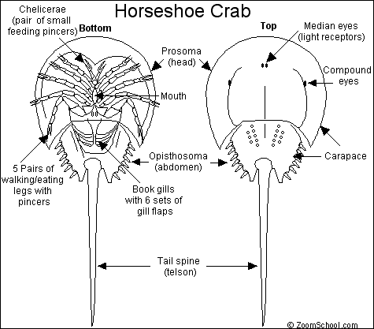{width="4.947916666666667in"
height="4.34375in"}

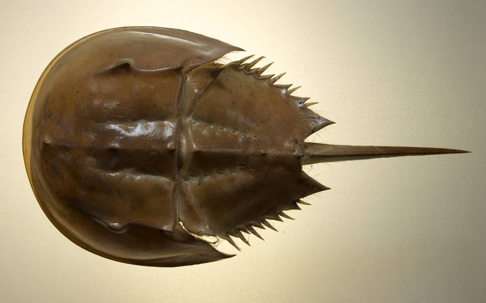{width="6.0in"
height="3.7496784776902885in"}

**Crab Moon**

> **Ruth Horowitz**

The summer Daniel turned seven, his family rented a cottage at the
beach. They arrived on the weekend of the full moon.

"The full moon in June brings the high tide of the horseshoe crabs,"
said his mother. "I saw them laying their eggs on this beach when I was
your age."

"Does it still happen?" Daniel asked.

"Every summer," his mother answered. "Horseshoe crabs have bee coming
ashore for hundreds of millions of years. They're older than the
dinosaurs."

"Can I see them?" Daniel asked.

"You'll have to get up in the middle of the night. I'll come and wake
you," she promised.

That night, the fat, round face of the full moon wavered on the surface
of the water. The path felt cool under Daniel's feet. As the beam of
their flashlight swept the beach, he drew a sharp breath. Everywhere
they looked, horseshoe crabs crowded and pushed, like restless
cobblestones. Under the sandy shuffle of the surf, he could hear the
clack of the crabs' shielded backs bumping and scraping together. Near
Daniel's feet, a large crab dug in the sand.

"That's a female," his mother said. "The smaller crab on her back is a
male. She laid her eggs in that hole, and now she's pulling him across
so he can fertilise them." They watched as the female crab swung herself
around. Still carrying her mate, she made her way back to the water.

Little by little, the tide receded. The crabs returned to the sea.
Daniel's feet sank into the sand as he and his mother climbed back up to
bed.

In the morning, Daniel raced back to the beach. The tide was low, now.
The crabs were gone. Curly black seaweed was strewn on the sand, like
streamers left over from a party.

Then Daniel saw one last lonely crab marooned upside down. She looked
dead and dry. He found a piece of driftwood and gently nudged her. One
leg moved. The other crabs had scratched their tracks in the sand where
they had swung themselves around and gone home.

How could this crab follow unless someone turned her over? Daniel
reached out one nervous finger. The tail felt stiff, but not sharp. He
carefully lifted the crab.

As her body left the ground, her claws started to snap. Daniel put her
down fast.

Then he took a deep breath and reached for her again. This time, he
quickly turned the crab over, and gently set her down.

Daniel grinned. Barnacles and slipper shells covered the crab's back,
like jewels on a crown. She set off down the beach, pausing, and pulling
her shell through the sand, quiet as a queen.

Slowly and grandly, the crab pulled herself forward. Stepping and
pausing, Daniel's feet felt their way into the bay. He followed until
she disappeared. Then he gave the water one last, long look and
whispered to his horseshoe crab, "See you next summer."

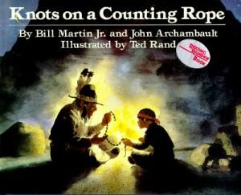{width="3.125in"
height="2.53125in"}

Themes/topics: birth, growing up, blindness, Native Americans,
relationship between child and grandparent, courage, self-confidence,
love, enduring nature of love even after death.

Opening Sentences:

Tell me the story again, Grandfather. Tell me who I am. ...

I have told you many times, Boy. You know the story by heart.

... But it sounds better when you tell it, Grandfather.

... Then listen carefully. This may be the last telling.

Synopsis: A young Navajo boy and his grandfather are sitting by a
campfire one night. The boy asks his grandfather to tell again the story
of who he is. Although the grandfather protests that the boy knows the
story by heart, he tells it one last time. There is poignancy in knowing
that this could be the last time the grandfather is alive to tell the
story. There is also drama, lyricism and suspense. We learn through the
story that the boy is blind, but that he sees with his inward eye,
keenly and astutely, that he has courage, and that his grandfather will
live on in him. The title is explained on the last page. "Now, Boy, now
that the story has been told again, I will tie another knot in the
counting rope. When the rope is filled with knots, you will know the
story by heart and can tell it to yourself." Through his story, the boy
gains strength. Through his story, his grandfather will live on.

The text is lyrical and gripping. The illustrations are detailed and
beautiful paintings.

Ideal to use for Readers' Theatre.

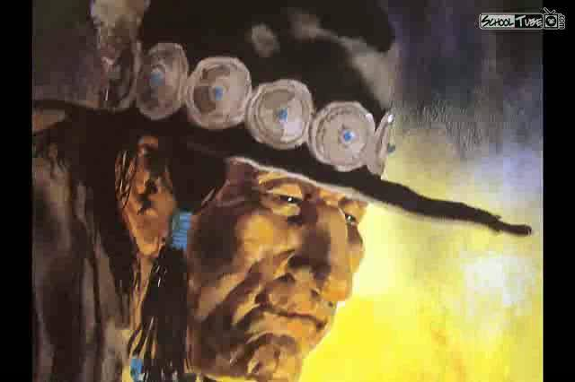{width="5.864583333333333in"
height="3.90625in"}

Listen to the story on School Tube or YouTube (different readers).

**Knots on a Counting Rope**

**By Bill Martin Jr. and John Archambault**

**Illustrated by Ted Rand**

Partner Reading Script for Two Voices

BOY'S PART: GRANDFATHER'S PART:

Tell me the story again, Grandfather.

Tell me who I am.

I have told you many times, Boy.

You know the story by heart.

But it sounds better

when you tell it, Grandfather.

Then listen carefully.

This may be the last telling.

No, no Grandfather.

There will never be a last time.

Promise me that.

Promise me.

I promise you nothing, Boy.

I love you.

That is better than a promise.

And I love you, Grandfather,

But tell me the story again.

Please.

Once there was a boy child...

No, Grandfather.

Start at the beginning.

Start where the storm

was crying my name.

You know the story, Boy.

Tell it.

No, Grandfather, no.

Start, "It was a dark night..."

It was a dark night,

a strange night.

Your mother and father and I were

safe in the hogan,,,

...and the sheep were safe

in the pen...

...when a wild storm

came out of the mountains...

...crying,

"Boy-eeeeeeeee! Boy-eeeeeeeee!"

....and your mother said,

"I hear it in the wounded wind.

A boy child will be born tonight."

Then what happened Grandfather?

I rode up the canyon fast,

to bring the grandmother.

It is not a good sign

for a child to be born

without a grandmother's blessing.

Was the wind still calling for me,

Grandfather?

Yes, Boy, it was whipping up sand

as sharp as claws,

and crying like a bobcat,

"Boy-eeeeeeeee! Boy-eeeeeeeee!"

Were you afraid, Grandfather?

I was much afraid.

How much afraid?

Heart-pounding afraid, Boy.

Then what happened, Grandfather?

Just as I was born...

tell me that part.

It was strange...strange.

Just as you came forth

and made your first cry,

the wind stopped howling

and the storm was over...

...and the night became as quiet

as soft falling snow

...The grandmother took you up

in her arms, and said,

"He will walk in beauty...

to the east..."

"...to the west,

to the north, to the south

he will walk in beauty..."

"....forever."

And I was born strong,

wasn't I Grandfather?

No, you were not strong.

You were sick and frail.

We thought you would die.

But I didn't die, did I?

Tell me about that, Grandfather.

All night you lay silent

with your eyes closed,

your breath too shallow,

too weak for crying...

...and you carried me out

to see the morning, Grandfather,

but I did not open my eyes.

Tell me that part.

Two great blue horses

came galloping by...

...and they stopped, Grandfather!

They stopped and looked at me...

...and you raised your arms

to the great blue horses,

and I said,

"See how the horses speak to him.

They are his brothers from..."

"...from beyond the dark mountains.

This boy child will not die."

That is what you said,

isn't it, Grandfather?

Yes, Boy, that is what I said,

"This boy child will not die.

The great blue horses have given him

the strength to live."

And that is when you named me,

isn't it, Grandfather?

After you smiled your first smile,

we had the naming ceremony.

All of the grandmothers

and grandfathers were there.

And you named me

Boy-Strength-of-Blue-Horses.

It is a strong name.

Did I need a strong name,

Grandfather?

All children need a strong name

to help them grow strong.

And I grew strong, didn't I?

Yes, Boy-Strength-of-Blue-Horses,

and each day

you are growing stronger.

You are learning to cross

the dark mountains.

I already have crossed

some of the dark mountains.

There will be more, Boy.

Dark mountains

are always around us.

They have no beginnings and...

...they have no endings.

But we know they are there, Grandfather

when we suddenly feel afraid.

Yes, Boy...afraid to do

what we have to do.

Will I always have to live in the dark?

Yes, Boy.

You were born with a dark curtain

in front of your eyes.

But there are many ways to see,

Grandfather.

Yes, Boy, you are learning

to see through your darkness

because you have

the strength of blue horses.

I see the horses with my hands,

Grandfather,

but I cannot see the blue.

What is blue?

You know morning, Boy.

Yes, I can feel morning.

Morning throws off

the blanket of the night.

And you know sunrise.

Yes, I hear sunrise,

in the song of the birds.

And you know sky, Boy.

Yes, sky touches my face...

soft, like lambs' wool...

and I breathe its softness.

Blue is all of these.

Blue is the feeling

of a spring day beginning.

Try...try to see it, Boy.

Blue? ... blue?

Blue is the morning...

the sunrise...

the sky...

the song of the birds...

O, I see it!

Blue! Blue!

Blue is happiness, Grandfather!

I feel it...

in my heart!

There was a sweep of blue

in the rainbow, Boy,

that morning your horse was born.

O, tell me that part, Grandfather!

I could not see the rainbow

but I can still feel its happiness.

I awakened you, Boy,

during the night, remember,

just before the foal was born.

And you said to me,

"Come, Boy,

Circles is ready to foal.

The colt will be yours."

It was a long night of cold rain...

....and we put a blanket

over Circles, Grandfather,

to keep her warm.

Yes, Boy.

As the sun

came through the clouds,

the foal was born...

...and a rainbow

danced across the sky.

It was a good sign, Boy.

And I named the little wet foal....

Rainbow!

You have trained her well, Boy.

Rainbow is smart, Grandfather.

Like you.

She is good at remembering.

Rainbow is my eyes, Grandfather.

She takes me to the sheep,

wherever they are,

and when I am ready

she finds the way home.

No one thought you could teach her

to race, Boy...

....but I did, Grandfather!

Every day, day after day,

we followed you along the trail!

And you let me hold the reins.

You traced the trails

in your mind, Boy,

both you and Rainbow.

Yes, Grandfather,

we learnt the trails by heart...

up South Mountain to Granite Rock...

down the steep shortcut

to Meadow-of-Blue-Flowers...

then straight across the Red Flats

to Lightning-Split-Tree...

then down the Switchbacks

to the canyon trail...

and on around to the finish line.

I learned from Rainbow when to turn

by the pull of her neck

and by counting her gallops.

Now tell me again about the race,

Grandfather.

It was a tribal day, Boy.

You and the other boys

were at the starting line...

but you pulled back.

I was afraid, Grandfather,

until you called to me.

Tell me again what you said.

I said,

"Don't be afraid, Boy!

Trust your darkness!

Go like the wind!"

And I leant forward

on Rainbow's neck.

I grabbed her mane tight,

and I said, "Go, Rainbow, go!"

I could feel the

pushing and crowding

and galloping thunder

all around me.

Rainbow and I

went twisting, turning,

galloping, galloping, galloping,

counting the gallops...

remembering the way...

And what did the people say, Grandfather?

They said,

"Who is that boy riding bareback...

racing the race with all his heart?"

And you said,

"That is Boy-Strength-of-Blue-Horses...

He and his horse are together like one."

Yes, Boy, that is what I said.

But I didn't win, Grandfather.

No, but you rode like the wind.

The wind is my friend, Grandfather.

It throws back my hair

and laughs in my face.

You see the wind better than I, Boy.

I finished the race, hot and dusty,

sweat dripping from my face...

And you were smiling, Boy!

I wasn't afraid, Grandfather.

I could see through the dark

every turn of the race.

Rainbow and I knew the way.

You were crossing the dark mountains, Boy!

Tell me again what you told me then.

I like to hear it over and over.

I said,

"Boy-Strength-of-Blue-Horses,

you have raced darkness and won!

You now can see with your heart,

feel a part of all that surrounds you.

Your courage lights the way."

And what did the grandmothers say?

You tell me, Boy.

I know you remember.

Yes, I remember, Grandfather.

They said,

"This boy walks in beauty.

His dreams are more beautiful

than rainbows and sunsets."

Now, Boy...

now that the story has been told again,

I will tie another knot

in the counting rope.

When the rope is filled with knots,

you will know the story by heart

and can tell it to yourself.

So that I will grow stronger, Grandfather?

Yes...stronger...strong enough

to cross the dark mountains.

I always feel strong

when you are with me, Grandfather.

I will not always be with you, Boy.

No, Grandfather,

don't ever leave me.

What will I do without you?

You will never be alone, Boy.

My love will always surround you...

with the strength of blue horses.

.

