> **Voice**
>
> **(5)**
>
> 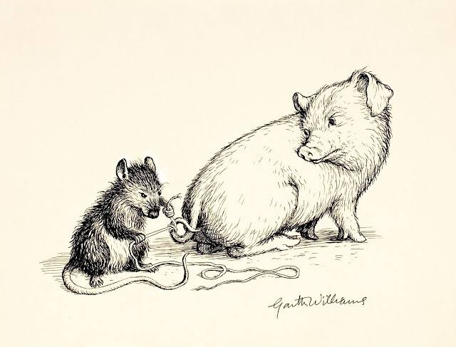
>
> **Voice & Personification**
>
> **Personification, is attribution
> of [human](http://en.wikipedia.org/wiki/Human) form or other
> characteristics to anything other than a human being.**
>
> 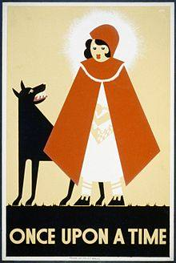
>
> 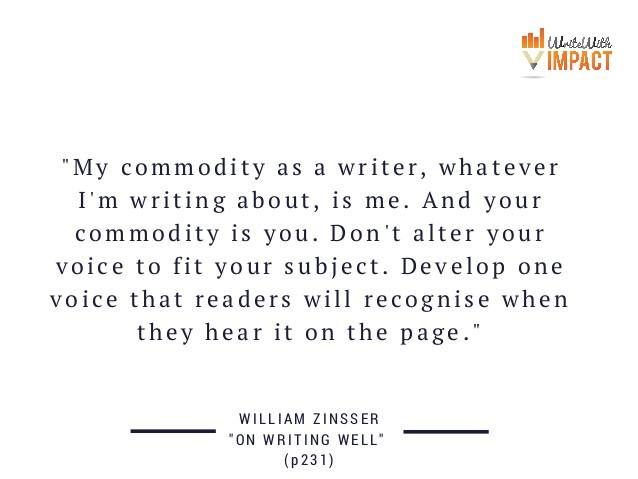
>
> 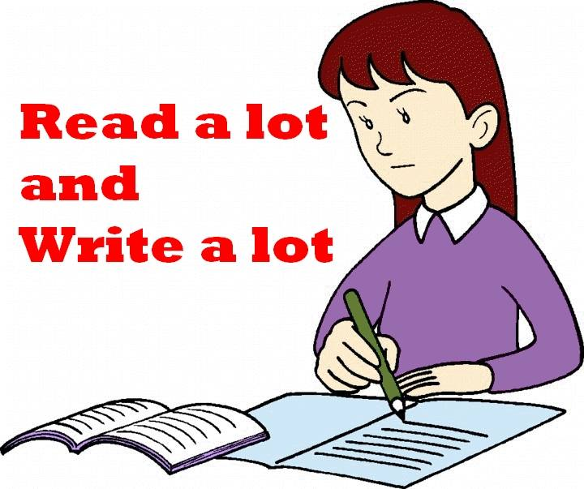

**\**

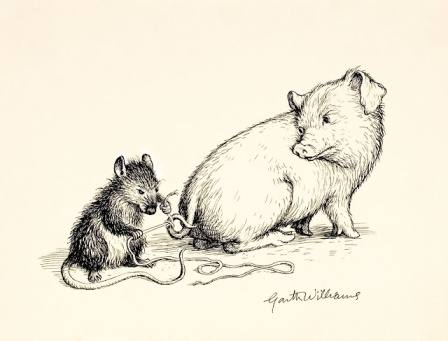

**Voice 5**

**Voice & Personification**

Little Red Writing Joan Holub

I Don't Want to be a Frog Dev Petty

I Stink Kate McMullan

Sarah Cynthia Sylvia Stout Shel Silverstein

The Day the Crayons Quit Drew Daywelt

Chester Melanie Watt

Creepy Carrots Aaron Reynolds

Two Bad Ants Chris Van Allsburg

Wolf Becky Bloom

The Spider and the Fly Mary Howitt

Goldilocks and Just One Bear Leigh Hodgkinson

Scarecrow Cynthia Rylant

The Black Rabbit Philippa Leathers

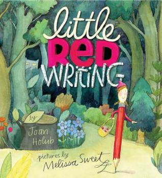

Acclaimed writer Joan Holub and Caldecott Honouree Melissa Sweet team up
in this hilarious and exuberant retelling of Little Red Riding Hood, in
which a brave, little red pencil finds her way through the many perils
of writing a story, faces a ravenous pencil sharpener (the Wolf
3000)\... and saves the day.

**Little Red Writing**

Read Aloud

Before Reading:

Cover Connection: *Does it reminds you of another story you might know?*

Discuss the cover illustration and identify any clues as to what story
elements might be included.

Allusion: Obviously Little red Riding Hood. Depending on the grade
level, the original story can be revised. E.g. Oral retelling in groups.

During Reading:

Pause, Ponder, and Predict:

As the story is read aloud, pause at points to have students ponder what
is happening in the story and then predict what might occur next. For
example, when Ms. 2 gives Little Red a basket of 15 red words to use,
students brainstorm

what those words might include such as rose, strawberry, fire truck, and
others. What type of story could Little Red write using some of those
words? What is the long, tangly tail that Little Red spies as it
disappears around the corner?

After Reading:

Vocabulary : Create charts of words for nouns, action verbs, adjectives,
and adverbs located in the text and illustrations. Students can generate
two or more words of their own for each category.

Turn and Talk: Ask students to turn and talk to the person next to them
about Little Red's dilemma in trying to write a story, the different
problems she encounters along the way with her writing, and the
predicament she faces with Wolf 3000.

Compare and Contrast:

Use a Venn diagram to compare and contrast Little Red Writing with
Little Red Riding Hood.

Open-ended Questions for during and after reading:

• Which character did you like best and why?

• Why do you think Little Red had difficulty in beginning her story?

• What strategies have you used to improve your writing?

• How did Little Red follow Ms. 2's suggested "Story Path" for writing?

• Why do you think the illustrator, Melissa Sweet, included so many
words in her illustrations? What else did she include?

• What was the most interesting or enjoyable part of the story? What
illustration(s) caught your eye?

Story Path:

Ms. 2 presents a process for her class to write a story. Students select
one of the pencil characters, or create their own character and generate
a story using Ms. 2's story path writing process. Students focus on
their use of nouns, verbs,

adjectives, and adverbs. Students determine:

1\. What is the plot, traits for each character, and the story setting?

2\. What problem or conflict does the character encounter?

3\. How does this problem become a bigger problem?

4\. How is the problem solved?

Character Analysis Chart

Use the following chart to analyse Little Red, her challenges, and her
actions. Students can use the same categories to develop their
character(s) for the story they are writing.

  ----------------------------------------------------------------------------
  Name of        Description    Major Goal of  Response(s) to   Change(s) in
  Character                     Character      Goal/Challenge   Character
  -------------- -------------- -------------- ---------------- --------------
                                                                

                                                                

                                                                
  ----------------------------------------------------------------------------

Strong Verbs:

Little Red wanted her story to be exciting and knew that she needed
active verbs. Students create two columns:

"Nouns " and "What Thing Does." Create a list of nouns then have
students think about active verbs to go with them. This strategy will
reinforce that good writers use precise verbs to make stories
interesting and vivid. It will encourage

them to show, don't tell. For example:

+-----------------------------------+----------------------------------+
| Noun/Thing                        | What 'thing' Does                |
+===================================+==================================+
| Alexis                            | stomped loudly to her room       |
|                                   |                                  |
|                                   | danced merrily to her room       |
|                                   |                                  |
|                                   | shuffled quietly to her room     |
+-----------------------------------+----------------------------------+
| The cat                           | pounced on the mouse.            |
+-----------------------------------+----------------------------------+

The Pencil School News in Little Red Writing proclaims that March 30th
is National Pencil Day. (America) Share a few fast facts about pencils
and notable pencil users such as:

• Hymen Lipman received the first patent for a attaching an eraser to
the end of a pencil in 1858.

• The majority of pencils made in the United States are painted yellow.

• Author Roald Dahl used only yellow pencils. He had 6 sharpened pencils
ready at the beginning of each day and when all 6 pencils became
unusable, he sharpened them again.

Have students conduct research about other unique holidays such as Tell
a Fairy Tale Day (February 26), World Read Aloud Day (March 6) or Poetry
Reading Day (April 28). (America -- research for Australia). Students
create a chart with the following information: the name of the holiday,
the date it is celebrated, the origins for the day, and how people
celebrate the event. Students report orally about their findings.
Students could also create their own holiday using the same categories
and write a persuasive argument for why it should be celebrated.

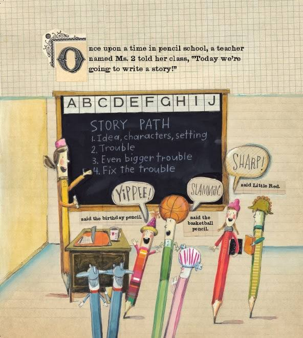

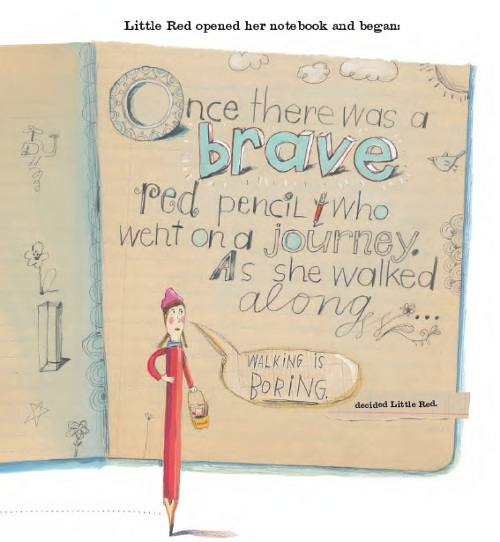

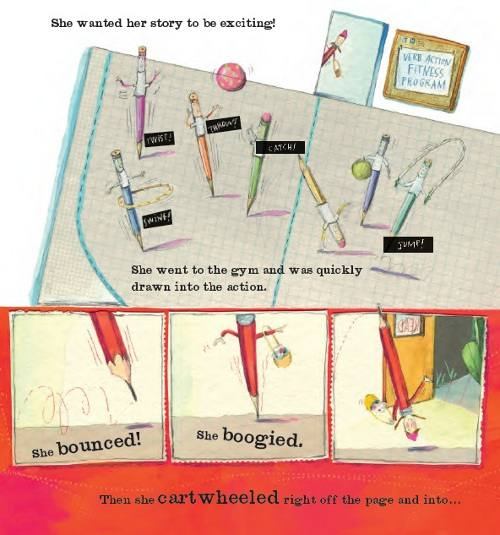

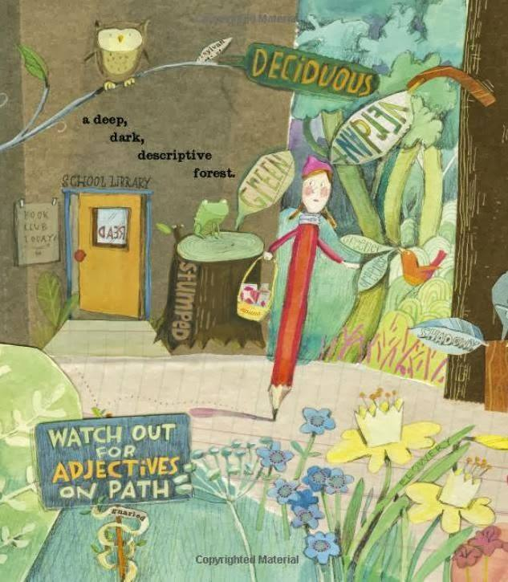

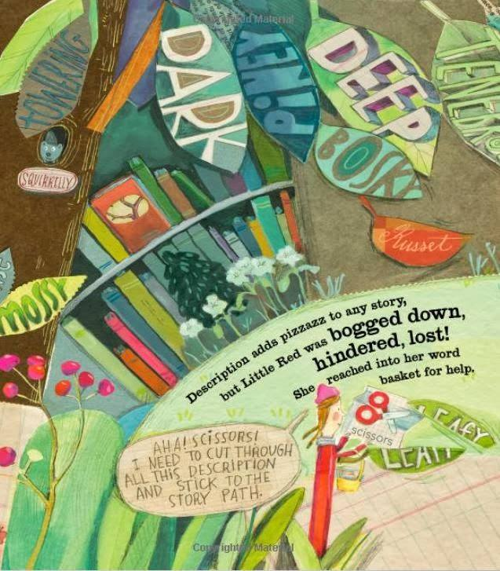

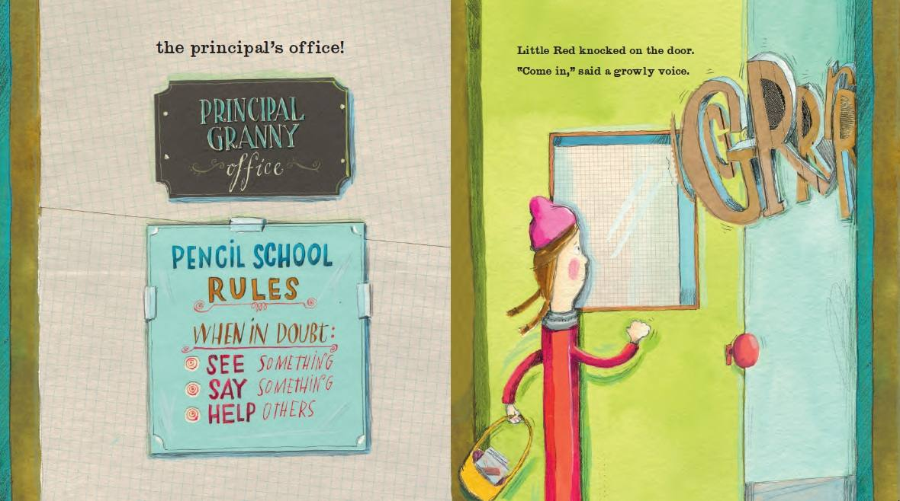

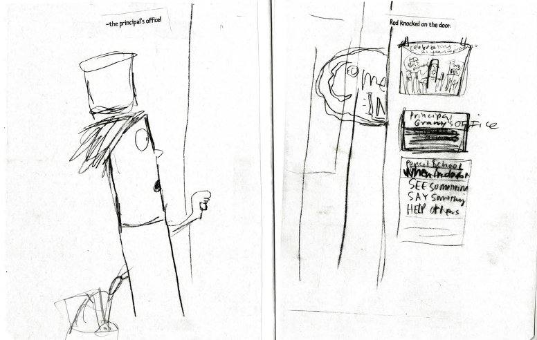

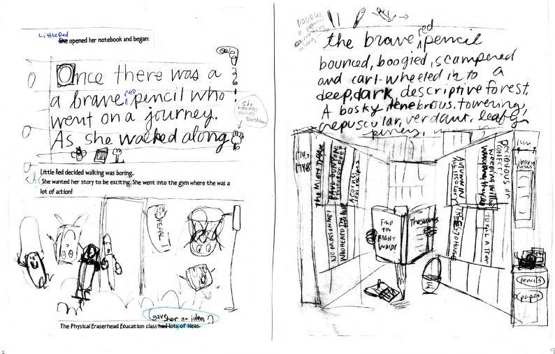

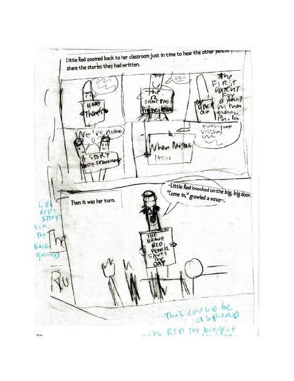

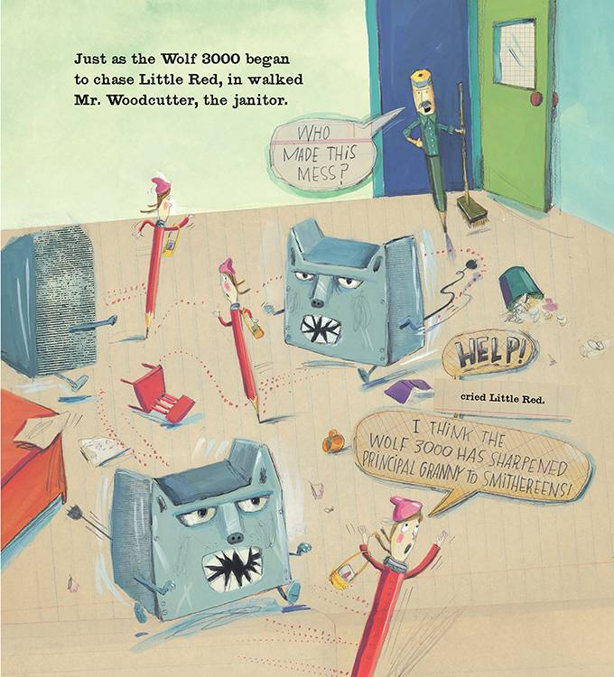

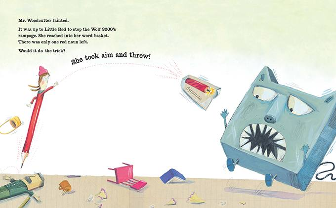

*Footnote: which is the story that Little Red is living, and which is
the story she is writing for her class assignment? At the end, she zooms
back to her classroom, so she has been away---but she also has a
finished story to share with the rest of the class. Did any of it really
happen? Melissa and Joan wanted the line between the story Little Red
writes and the story she lives to be not totally clear, and
interpretable by the reader. Little Red Writing is about the process of
storytelling, and Joan and Melissa wanted to acknowledge that the
stories we invest in---whether reading them or writing them---do really
happen to us. As J. K. Rowling put it, "Of course it is happening inside
your head, Harry, but why on earth should that mean that it is not
real?"*

**Interview with Author and Illustrator by Elizabeth Dulemba.**

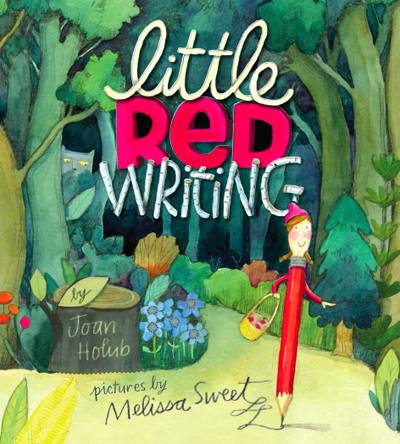

**Joan:** Thanks, Elizabeth. As the the Wolf 3000 would say, "GRRREAT to
be here!"\
**Q. Ha! Joan, what inspired the LITTLE RED WRITING?**\
**A. **The title came first. The riding/writing aspect. In the Grimm
fairy tale, Red Riding Hood's mother tells her to stay on a path as she
goes through the forest to her grandma's house. A pencil physically
travels or writes along a path as I convey information or draft a story.
So I thought of a red pencil as a main character. Her teacher, a pencil
named Ms. 2, tells the class to write a story and stick to a story path.
And who else could the wolf be but the growliest pencil sharpener ever
made! \
\
**Q. Joan, this is such a simple idea, talking about how to write, but
it actually looks like it was quite complicated to pull off. Was it?**\
**A. **Writing a story about a pencil, who was writing a story about a
brave red pencil; and trying to include parts of speech without making
the whole book feel teachy! Yikes. It was complicated and my job as an
author was to uncomplicate it and make it a fun read. Little Red Writing
took longer from idea to publication than any book I've written.\
\
**Q. Joan, so many authors wonder about including illustration notes in
their manuscripts. Did you?**\
**A. **Actually, I submitted Little Red Writing to Chronicle books as a
full-size dummy! Even though I had no plans to illustrate it. I almost
always make a dummy to develop board books, picture books, and easy
readers; but not for chapter books or middle grade, which have few
illustrations. I don't know if Chronicle showed the dummy to illustrator
Melissa Sweet. Regardless, if you compare my dummy pages to Melissa's
art in the published book, you can see that she did her own thing, which
is amazing compared to my scribbles. I have loved her art since I first
saw the Pinky and Rex series. (Note that the text on these dummy pages
isn't the final wording in the book.) 

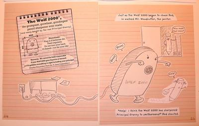

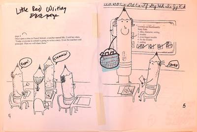

**Q. Melissa, your collage style is so perfect for this story. How much
of the story was sent to you and how much did you run with the idea on
your own?**\
**A. **From the start, I only saw the manuscript. I just recently
learned that there were notes on the art and Joan's dummy\--or if I knew
I promptly forgot. This is a case where it was better for me not to see
notes or suggestions. I needed time to come to the story on my own to
absorb and understand it.\
      Because this story has so much wit and humour, I was encouraged to
run with it. For example, I created the school newspaper at the
beginning of the book to create a bridge from getting to school to being
in the classroom. The opportunity to impart visual puns and suspend
reality was a ton of fun.\
      (Holy Toledo, I just realised that in Joan's dummy her pencils
have legs and the point is their head. I never thought of that!)

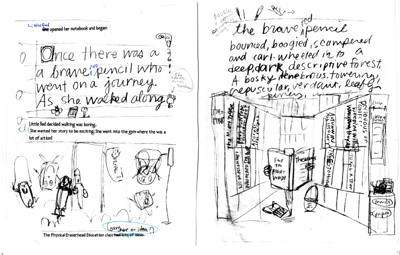

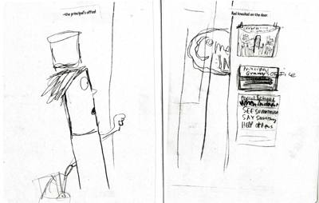

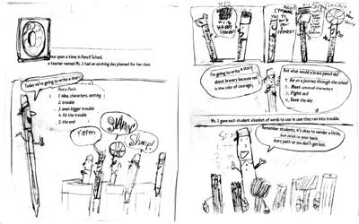

**Q. Joan and Melissa, truly, this seems to have been a collaborative
effort (or like it came from one brain). Was it?**\
**A. **\
**Joan:** I love that you think that, Elizabeth! I'll be interested to
see what Melissa says here. Seems to me it was a three-way collaboration
between Melissa, me, and our editor. The story was dependent on the art,
which was dependent on the story, round and round. So the sketches would
reach a certain point, then there would be issues to solve that would
come back to me via our editor. I'd write things to address any issues,
and make any additional suggestions I had, building on what Melissa had
done in her sketches. We'd sometimes talk it out by phone. Once, our
editor and I had a difference of opinion on something, so she ran to
another department at Chronicle to consult with someone who had more
expertise on the subject than either of us to break the tie. Little Red
Writing was one of the most collaborative experiences I've ever had as a
writer, and it was energising and fun! 

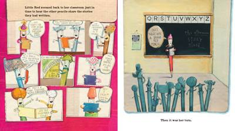

**Melissa:** In fact, as is typical with author and illustrators, Joan
and I have not yet met! But it was a good pairing on Chronicle\'s part.\
      It was very collaborative with me, Melissa Manlove (editor) and
Kristine Brogno (art director). I knew they were weighing in with Joan
and welcomed the feedback.\
      It\'s safe to say it was many brains working as one. I concur with
Joan---it was one of my most collaborative books. There was a lot of
give and take.

**Little Red Writing Joan Holub**

Once upon a time in pencil school, a teacher named Ms 2 told her class,
"Today we're going to write a story!"

STORY PATH

1.  Idea, characters, setting.

2.  Trouble.

3.  Even bigger trouble.

4.  Fix the trouble.

> "Yippee!" said the birthday pencil.
>
> "Slammin'," said the basketball pencil.
>
> "Sharp!" said Little Red.
>
> "I want to write a happy story," said the birthday pencil.

"I'm going to do a nonfiction story about the great state of
Pencilvania," said the state pencil.

"I'll write about sports!" said the basketball pencil.

"I want to write a story about bravery because red is the colour of
courage. But what would a brave pencil do?," wondered Little Red.

". Go on a journey through the school.

. Meet unusual characters.

. Fight evil.

. Save the day."

Ms 2 gave Little Red a basket of 15 red words to use in case she ran
into trouble.

"Remember, it's okay to wander a bit, but stick to your basic story path
so you don't get lost."

"Okey, doke," said Little Red.

Little Red opened her notebook and began:

Once there was a brave red pencil who went on a journey. As she walked
along \...

"Walking is boring," decided Little Red.

She wanted her story to be exciting!

She went to the gym and was quickly drawn into the action. She bounced!
She boogied! Then she cartwheeled right off the page and into \...

a deep, dark, descriptive forest.

Watch out for Adjectives on Path

Description adds pizzazz to any story, but Little Red was bogged down,
hindered, lost! She reached into her word basket for help

"Aha! Scissors! I need to cut through all this description and stick to
the story path."

"Need help sticking to your story path? Well, you have come to the right
place, pencil," said a voice from the supply closet. (Conjunction Glue)

"'Cause i am full of words that have stick-to-it-iveness. They'll stick
up for you, and stick by you, but they aren't stuck up like that tape
guy down there."

Little Red squeezed the bottle \... too many glue words came out! So
that is how she found herself writing a sentence that would not end but
just kept going and going and running on and on although it had no
purpose yet it would not get out of her story or say anything important
so she was glad when a helpful word arrived --

SUDDENLY (and it brought some friends).

Adverbs -- we deliver speedily.

Suddenly, abruptly, surprisingly, she heard a strange sound, which she
decided required all capitals and rather large punctuation:

GGGRRGRRRRRR!!!

It was the middle of her story, where something exciting should happen.
And it did. That growly sound chased her!

abandoning all rules of punctuation and sentence structure in her panic
to escape Little Red began running on and on and on she grabbed random
nouns from her word basket tossing them out to fill up the chasm of
blank space nothingness which was all that stood between her and that
GRRR then hooray finally at last the page was full and she could leave
the horrid sound behind and go to

\...the next page. But as the page turned, Little Red couldn't help
noticing a long, tangly tail disappear around the corner. Was that tail
up to no good?

"A truly brave pencil would follow it to find out," she thought.

She decided to tail that tail and wound up trailing it around the entire
page of her story. Eventually it led her all the way to the next page
and went into \...

the principal's office.

Pencil School Rules

When in Doubt:

- See something

- Say something

- Help others

Little Red knocked on the door.

"Come in," said a growly voice. "GRRRR \... GRRREETINGS. Little Pencil.
Grrreat to see you," said Principal Granny.

Little Red was suspicious

"I'd like to report hearing a growly voice. And you know what? It
sounded kind of like yours," said Little Red.

"The betterrr to be heard on the school interrrcom," said Principal
Granny.

"I'd also like to report that I saw a long tangly tail. I can't help
noticing you have a tangly tail, too," said L:ittle Red.

"The betterrr to get charrrged up for my school duties when my
batterrries are rrrunning low," said Principal Granny.

"I'd also like to report I have just noticed what big sharp teeth you
have!" said Little Red.

"The betterrr to chomp little pencils like you and grrrind them up!"
growled Principal Granny, who in reality was \...

the Wolf 3000: the grumpiest, growliest, grindingest pencil sharpener
ever made!

Just as the Wolf 3000 began to chase Little Red, in walked Mr
Woodcutter, the janitor. "Who made this mess?"

"Help!" cried Little Red. "I think the Wolf 3000 has sharpened Principal
Granny to smithereens!"

Mr Woodcutter fainted.

It was up to Little Red to stop the Wolf 3000's rampage. She reached
into her word basket. There was only one red noun left. Would it do the
trick? She took aim and threw!

KABLOOEY!

"Phew! That was a close shave. Good thing that brave little pencil came
along to save the day," said Mr Woodcutter.

Luckily, Principal Granny was all right. (Though her life had been
somewhat shortened by her experience with the Wolf 3000.)

"I wasn't really brave. I was scared," said Little Red.

"Even heroes get scared, but they do brave deeds anyway. You are a hero
in my book!" replied Principal Granny.

Little Red zoomed back to her classroom just in time to hear the other
pencils share the stories they had written.

\..."and that's the story of the happiest birthday party ever!"

"The Adventures of the Write Brothers."

"The artist challenged them to a draw."

"The first patent for a pencil with an eraser was issued in
Philadelphia."

"He was very tall."

"The pencil and Gretel ate all the candy."

"We wrote a story together using teamwork."

"Get a grip!" said the pencil.

Then it was her turn. "Once there was a brave red pencil \..."

Good Job, Little Red!

Write on!

Ms 2

**Little Red Writing Joan Holub**

**9 Readers**

Narrator

Little Red

Birthday Pencil

Basketball Pencil

Ms 2

Conjunction Glue

Principal Granny

Wolf 3000

Mr Woodcutter

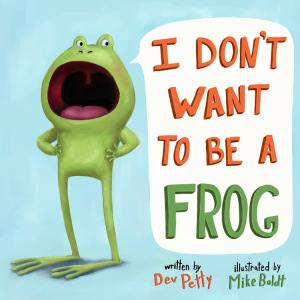

Two characters are talking, with a surprise one at the end. And their
interaction is priceless; the tone is just right.

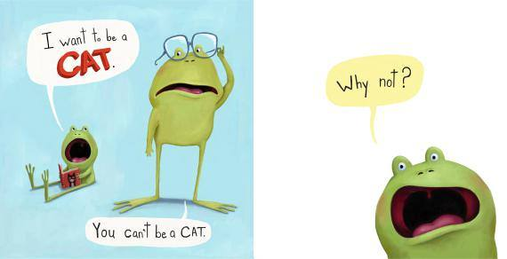

Kid Frog and Dad Frog are having a conversation about how Kid Frog
doesn't want to be a frog. He'd like to be a cat or a rabbit (he can
hop!) or an owl, but not a frog. Frogs are wet and slimy and stuff.

Here's what's so stellar about the talking that takes place.

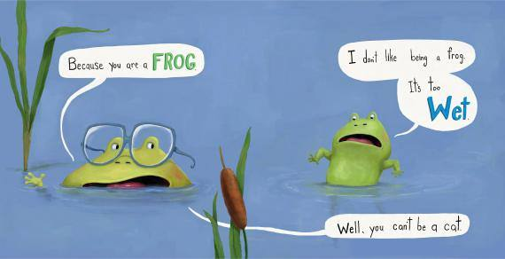

Kid frog's voice is spot on. It's fed up. It's full of questions. It
won't take no for an answer. It's a little bit complainy, but endearing
and we like it. Plus, it's relatable. Who hasn't wanted to be something
else entirely at least once? (And who hasn't talked to a child who must
pursue an inquiry for a very long time...)

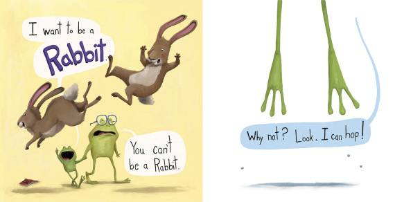

Oh, Dad frog in the giant glasses. His voice is great too. It's
exasperated. It's logical. It's long-suffering and willing to keep the
conversation going. It's pedagogical while understanding and
compassionate. Validating. Good natured. Like, you know, a good parent.

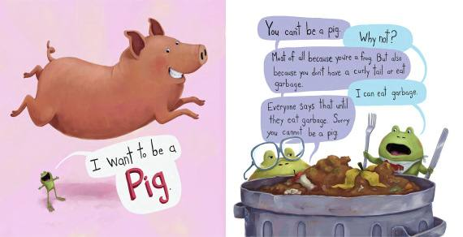

WOLF: OUTSIDER'S VOICE

It's slightly menacing. It's truthful. And it's exactly what the Dad
needs to help prove his argument. I love that the wolf comes in to save
the day in this way. A wolf! Sometimes, kids just won't hear it from
their parents. They need an outside source in order to believe
something. Like that lima beans are okay to eat. Or that it's okay to be
a wet, slimy frog and not a cat or an owl even though owls are really
cool.

And let's not forget how Mike Boldt's illustrations enhance the
dialogue! The coloured speech bubbles with long tails. Their sections
and back and forth. (How they're shaped sort of pollywoggy.)

The kid frog's gaping mouth.

The way we further know how the Dad is saying something by the
particular way he fidgets with his glasses.

And the way we hear from the third character in a speech bubble before
we see him on the next page. Great opportunities for pre-page turn
guessing abound!

**I Don't Want to be a Frog**

A tiny frog desperately wishes to be any other animal.

After reading a book about a cat, the young frog stretches open his
mouth as wide as it will go and decidedly declares, "I want to be a
CAT." His father patiently explains, "You can't be a CAT....Because
you're a FROG." But frogs are too wet and slimy. The little frog then
decides to be a rabbit. After all, he can already hop. But father points
out that he does not have long ears. The young amphibian is not
deterred. There are many other options---a pig, perhaps? Or an owl? But
his no-nonsense father explains away each one. Until a wolf, who enjoys
eating many animals---except wet, slimy frogs---comes along and changes
the young frog's perspective. Debut author Petty presents a droll take
on this oft-explored wish of being different. But what shines the
brightest is Boldt's expressive frog duo. Question-weary grown-ups will
understand the father's heavy-lidded eyes, and nothing embodies a
childlike curiosity (and/or crazy, determined declarations) more than
the tiny frog's wide-open mouth. Coloured speech bubbles distinguish the
speakers' words and tumble over each other on the page.

A lively look at self-acceptance.

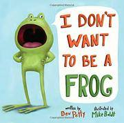

Readers' Theatre

Writing:

> *What animal would you like to be? Why?*

*Write a conversation between an animal and its father/mother.*

**I Don't Want to be a Frog Dev Petty**

"I want to be a CAT."

"You can't be a CAT."

"Why not?"

"Because you're a FROG."

"I don't like being a frog. It's too wet."

"Well, you can't be a cat."

"I want to be a rabbit."

"You can't be a rabbit."

"Why not? Look, I can hop!"

"Sure, but where are your long ears? Besides, what's wrong with being a
frog?"

"I don't like being a frog. It's too slimy."

"That may be. But you can't be a rabbit."

"I want to be a pig."

"You can't be a pig."

"Why not?"

"Most of all because you're a frog. But also because you don't have a
curly tail or eat garbage."

"I can eat garbage."

"Everyone says that until they eat garbage. Sorry, you can't be a pig."

"I want to be an owl."

"Of course you want to be an owl! Being an owl is the greatest thing
ever. Boy, would you love being an owl."

"So I can be an owl, then?"

"No, of course not!"

"Why not?"

"1. You don't have wings.

2\. You don't look wise.

3\. You can't turn your head all the way around.

4\. YOU ARE A FROG.

What's wrong with being a frog anyway?"

"Too much bug eating."

"I see. But still, NO being an owl for you."

"Why so glum?"

"I don't want to be a frog."

"What do you want to be then?"

"Not a frog. I want to be a cat or a rabbit or a pig or an owl.
Something cute and warm."

"I'm going to let you in on a little secret \....

I love eating cats. I love eating rabbits and pigs and owls too. And I
am pretty hungry. I might just go gobble some up right now."

"That's terrible!"

"It's who I am. But guess the one thing I never eat."

"Badgers?"

"Nooo, I eat badgers. Lots of badgers."

"Frogs?"

"Bingo."

"Why don't you eat frogs?"

"Because they are too wet and slimy and full of bugs."

Oh. So it's good to be a frog?"

"Yup."

"I guess you can't fight nature. We are what we are. You are a fierce
hunter."

"And you are a wet, slimy, bug-eating, very lucky frog. You should just
be happy you're not a fly."

"What's wrong with being a FLY?"

About Me:

Hello and welcome. Evidently, I\'m a writer. I write funny, sometimes
confusing, picture books for children who are funny and confusing
themselves.

I used to work in Visual Effects in film where I sat in a terribly dark
room for ten years working as a texture painter. It was wonderful. (It
really was). You can go up on IMDB and verify my story. When I had my
daughters, I didn\'t think I\'d ever find something nearly as wonderful
to do with my time.

Then I found writing and I realised that it would be pretty awesome to
write books for kids. So I did!

I live in Albany, California right near my hometown, Berkeley. I\'m a
devout Californian and also a terrible gardener.

Other facts: I\'m great at word jumbles, I married my high-school
sweetheart, I was on the Bay Bridge in the \'89 quake and I love
Cheezits\...but who doesn\'t?

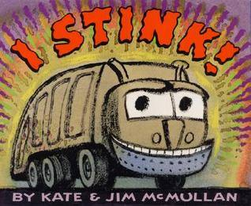

Know what I do at night while you\'re asleep? Eat your trash, that\'s
what! See those bags? I smell breakfast!

With ten wide tyres, one really big appetite, and an even bigger smell,
this truck\'s got it all. His job? Eating your garbage and loving every
stinky second of it!

And you thought nighttime was just for sleeping.

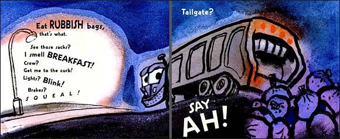

The garbage truck speaks in this picture book, telling the reader of his
nighttime adventures moving trash in the city.

\* Specificity of language

\* Alliteration

\* Voice

\* Point of View

\* Onomatopoeia

**I Stink! Kate & Jim McMullan**

Who am I?

I've got lights. Ten wide tyres. No A.C., not me. I've got doubles:
steering wheels, gas pedals, brakes. I am totally DUAL OP. Know what I
do at night while you're asleep?

Eat your trash, that's what. See these bags? I smell BREAKFAST!

Crew? Get me to the curb! Lights? BLINK!

Brakes? SQUEAL!

Tail gate? SAY AH!

Feed me! Straight into the hopper! Nice toss, guys! STOP!

Hopper's full. Hit the THROTTLE. Gimme some gas. Rev me to the MAX.

Engine? ROAR!

Did I wake you? Too bad!

PISTONS? Bring on the crusher blade,

BLADE? Push back the bags. SQUEEZE them! Crush them! Mash them! Smash
them! Whoa, those bags are WAY COMPACTED.

BURRRP!

Ahhhhhh! Now I have room for alphabet soup. Get a load of my recipe.

Apple cores

Banana peels

Candy wrappers

Dirty diapers

Eggshells

Fish heads

Gobs and gobs of gum Half-eaten hot-dogs

Icky ice-cream cartons

Jam jars

Kitty litter

Lobster claws

Mouldy meatballs

Nasty neckties

Orange peels

Puppy poo

Quail bones, too

Rotten radishes

Smelly sneakers

Toothpaste tubes

Ugly underpants

Vacuum bags

Watermelon rinds

XL T-shirts

Year-ols yams

Zipped-up ziti with zucchini

Thank you very much!

What's that? You thin I STINK?

WHOOOOO-WHEE! Do I ever! No skunk ever stank THIS BAD!

Go on, hold your nose, but think about it -- WITHOUT ME?

You're on Mount Trash-o-rama, baby.

Next stop, the river.

Lights? FLASH!

Driver?

REVERSE!

Get me to the barge.

Hear me blast my BACK-UP RAP.

BEEP! BEEP! HAY!

BEEP! BEEP! OUTTA MY WAY!

Ready, crew \...

ACTION!

Pins?

OUT!

Power take-off switch?

HIT IT!

Tail gate?

SEPARATE!

Up, up, up!

Tail-gate sweeper?

EJECT! PLOP!

I'm empty. I'm beat. You're waking up now, but I need some
zzzzzzzzzzzzzzzzzzz's/

back to the garage crew. Hose me down and gas me up.

See you tomorrow night, guys.

Who am I?

THE GARBAGE TRUCK, THAT'S WHO.

**I Stink!**

**Before Reading Activities**

Do a KWHL chart with children. Guiding questions:

- Where does our rubbish go when we throw it away?

- What happens to the rubbish when it is goes into the garbage truck?

- When does the garbage truck take care of the rubbish?

Revisit this chart after reading the book to fill in the What I Learnt
section.

Imagine with children what it would be like if the trash were never
taken care of. Children can draw pictures of what they picture their
homes and communities would be like if the garbage truck never came.

Read aloud Shel Silverstein\'s poem, \"Sarah Cynthia Sylvia Stout Who
Would Not Take the Garbage Out.\" Guiding questions:

- What happened to the little girl in the poem?

- Whose responsibility is it to take care of trash?

**After Reading Activities**

Revisit the KWL chart. Guiding questions:

- Where does the rubbish go after it has been collected by the garbage
  truck?

- How does a garbage truck process the rubbish?

- How do you think garbage collection is different in the country than
  it is in the city?

Create a garbage alphabet soup like the one in the book. Assign each
child or pair of children to a letter. Have children write the letter
and then draw pictures of the garbage that they think would match with
that letter. Compile all of the children\'s work into an alphabet book.

**Discussion**

Ask the students to recall their 5 senses. Remind them that they are
sight, sound, touch, touch, taste and hearing. Discuss and list on chart
paper all the ways they might describe a garbage truck using their 5
senses. Begin the first read aloud of "I Stink" while asking the
students to think about how the author describes the garbage truck using
5 senses.

Read the story again and discuss all the onomatopoeia words the garbage
truck makes.

**SARAH CYNTHIA SYLVIA STOUT WOULD NOT TAKE THE GARBAGE OUT**

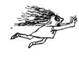

Sarah Cynthia Sylvia Stout \
Would not take the garbage out! \
She\'d scour the pots and scrape the pans, \
Candy the yams and spice the hams, \
And though her daddy would scream and shout, \
She simply would not take the garbage out. \
And so it piled up to the ceilings: \
Coffee grounds, potato peelings, \
Brown bananas, rotten peas, \
Chunks of sour cottage cheese. \
It filled the can, it covered the floor, \
It cracked the window and blocked the door \
With bacon rinds and chicken bones, \
Drippy ends of ice cream cones, \
Prune pits, peach pits, orange peel, \
Gloppy glumps of cold oatmeal, \
Pizza crusts and withered greens, \
Soggy beans and tangerines, \
Crusts of black burned buttered toast, \
Gristly bits of beefy roasts. . . \
The garbage rolled on down the hall, \
It raised the roof, it broke the wall. . . \
Greasy napkins, cookie crumbs, \
Globs of gooey bubble gum, \
Cellophane from green baloney, \
Rubbery blubbery macaroni, \
Peanut butter, caked and dry, \
Curdled milk and crusts of pie, \
Mouldy melons, dried-up mustard, \
Eggshells mixed with lemon custard, \
Cold French fried and rancid meat, \
Yellow lumps of Cream of Wheat. \
At last the garbage reached so high \
That it finally touched the sky. \
And all the neighbours moved away, \
And none of her friends would come to play. \
And finally Sarah Cynthia Stout said, \
\"OK, I\'ll take the garbage out!\" \
But then, of course, it was too late. . . \
The garbage reached across the state, \
From New York to the Golden Gate. \
And there, in the garbage she did hate, \
Poor Sarah met an awful fate, \
That I cannot now relate \
Because the hour is much too late. \
But children, remember Sarah Stout \
And always take the garbage out!

***Shel Silverstein***

**\**

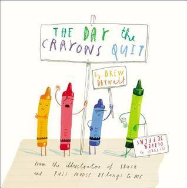

Poor Duncan just wants to colour. But when he opens his box of crayons,
he finds only letters, all saying the same thing: We quit!

Beige is tired of playing second fiddle to Brown. Blue needs a break
from colouring all that water, while Pink just wants to be used. Green
has no complaints, but Orange and Yellow are no longer speaking to each
other.

What is Duncan to do? Debut author Drew Daywalt and New York Times
bestseller Oliver Jeffers create a colourful solution in this playful,
imaginative story that will have children laughing and playing with
their crayons in a whole new way.

**Opinion Writing**

This book is great to demonstrate opinion writing, and how to include
reasons and details to support opinion. This is because each crayon
supports his reason for quitting very well. You also \"hear\" the voice
of each crayon.

Quick Write

Read Aloud

Make a list of objects that we use every day -- things that might quit
on us. E,g,

forks, spoons, knives, soccer balls, chairs, books, toothbrushes\...

Students choose an object and write a letter to themselves from the
point of view of that object. They try not to SAY what they are until
the end of their letter- give clues and reasons that would help us
understand what object they were.

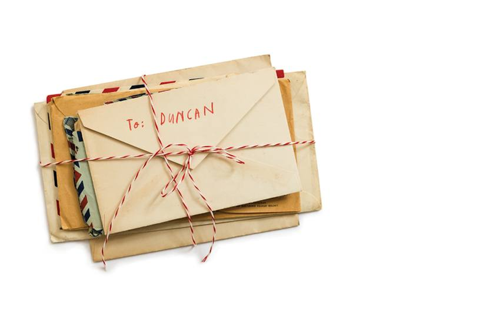

**The Day the Crayons Quit Drew Daywalt**

one day in class, Duncan went to take out his crayons and found a stack
of letters with his name on them.

Hey Duncan,

It;s me, RED crayon. We need to talk. You make me work harder than any
of your other crayons. All year long I wear myself out colouring fire
engines, apples, strawberries and everything else that's red. I even
work on holidays! I have to colour all the Santas at Christmas and all
the hearts on Valentine's Day!

I NEED A REST!

Your overworked friend,

RED crayon.

Dear Duncan,

All right, LISTEN\>

I love that I'm your favourite crayon for grapes, dragons, and wizards'
hats, but it makes me crazy that so much of my gorgeous colour goes
outside the lines, If you DON'T START colouring inside the lines soon
\... I'm going to COMPLETELY LOSE IT.

Your very neat friend,

Purple Crayon.

Dear Duncan,

I'm tired of being called "light brown" or "dark tan" because I am
neither. I am BEIGE and I am proud. I'm also tired of being second place
to Mr Brown. It's not fair that Brown gets all the bears, ponies and
puppies while the only things I get are turkey dinners (if I'm lucky)
and wheat, and let's be honest -- when was the last time you saw a kid
excited about colouring wheat?

Your BEIGE friend,

Beige Crayon

Duncan,

Grey crayon here. You're KILLING ME! I know you love elephants. And I
know that elephants are grey and that's a LOT of space to colour in all
by myself.

And don't even get me started on your rhinos, hippos and HUMPBACK
WHALES.

You know how tired I am after handling one of those things? Such BIG
animals \... Baby penguins are grey you know. So are very tiny rocks.
Pebbles, How about one of those once in a while to give me a break?

Your very tired friend,

Grey Crayon

D

Dear Duncan,

You colour with me, but why? Most of the time I'm the same colour as the
page you are using me on -- WHITE.

If I didn't have a black outline, you wouldn't even know I was THERE!

I'm not even in the rainbow.

I'm only used to colour SNOW or to fill in empty space between other
things. And it leaves me feeling ...

... well ... empty. We need to talk.

Your empty friend,

White crayon

Hi, Duncan,

I HATE being used to draw the outline of things that are coloured in by
other colours, all of which think they're brighter than me!

It's NOT FAIR when you use me to draw a nice beach ball and then fill in
the colours of the ball with ALL THE OTHER CRAYONS. How about a BLACK
beachball sometime? Is that too much to ask?

Your friend,

Black Crayon

Dear Duncan,

As Green crayon, I am writing for TWO reasons. One is to say that I like
my work -- loads of crocodiles, trees, dinosaurs, and frogs. I have no
problems and wish to congratulate you on a very successful "colouring
things green" career so far.

The second reason I write is for my friends, Yellow crayon and orange
crayon, who are no longer speaking to each other. Both crayons feel THEY
should be the colour of the sun. Please settle this soon because they're
driving the rest of us CRAZY!

Your happy friend,

Green Crayon

Dear Duncan,

Yellow crayon here. I need you to tell orange crayon that I am the
colour of the sun.. I would tell him but we are no longer speaking. And
I can prove I'm the colour of the sun too! Last Tuesday you used me to
colour in the sun on your "happy farm" colouring book. In case you've
forgotten, it's on page 1. You can't miss me. I'm shining down
brilliantly on a field of YELLOW corn!

Your pal (and the true colour of the sun),

Yellow crayon

Dear Duncan,

I see Yellow crayon already talked to you, the BIG WHINER. Anyway, could
you please tell Mr Tattletale that he is NOT the colour of the sun? I
would, but we're no longer speaking. We both know I'm clearly the colour
of the sun because, on Thursday, you used me to colour the sun on BOTH
the "monkey island" and the "meet the zookeeper" pages in your "DAY AT
THE ZOO" colouring book. Orange you glad I'm here? Ha!

Your pal (and the real colour of the sun),

Orange Crayon

Dear Duncan,

It has been great being your FAVOURITE colour this PAST year. And the
year before. And the year before THAT!

I have really enjoyed all those oceans, lakes, rivers, raindrops, rain
clouds and clear skies.

But the BAD NEWS is that I am so short and stubby. I can't even see over
the railing in the CRAYON BOX anymore!

I need a BREAK!

Your very stubby friend,

Blue Crayon

Duncan,

Okay, LISTEN HERE, KID! You have not used me ONCE in the past year. It's
because you think I am a GIRLS' colour, isn't it? Speaking of which,
please tell your little sister I said thank you for using me to colour
in her "Little Princess" colouring book. I think she did a fabulous job
of staying inside the lines!

Now, back to us. Could you PLEASE use me sometime to colour the
occasional PINK DINOSAUR or MONSTER or cowboy? Goodness knows they could
use a splash of colour.

Your unused friend,

Pink crayon

HEY DUNCAN,

It's me, PEACH CRAYON. Why did you peel off my paper wrapping?

Now I'm NAKED and too embarrassed to leave the crayon box.

I don't even have any underwear! How would YOU like to go to school
naked? I need some clothes. HELP!

Your naked friend,

PEACH crayon.

Well, poor Duncan just wanted to colour \... and of course he wanted his
crayons to be happy. And that gave him an idea.

When Duncan showed his teacher his new picture, she gave him an A for
colouring \...

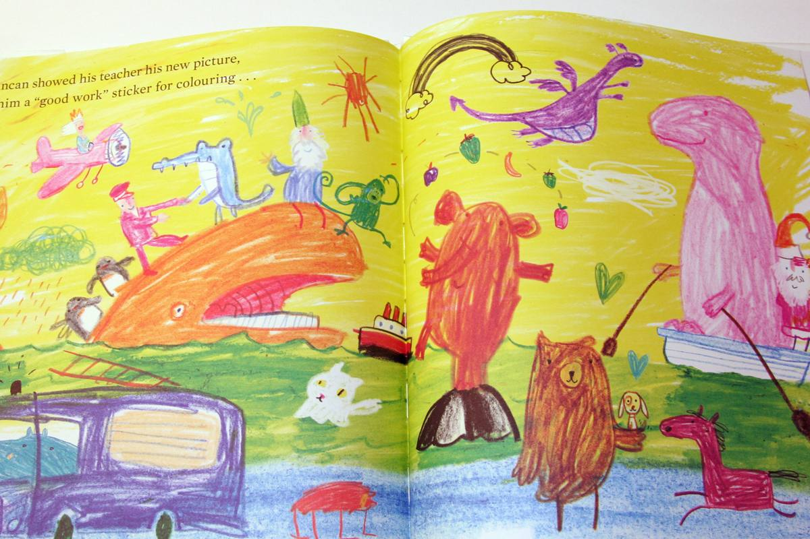

\... and an A+ for creativity!

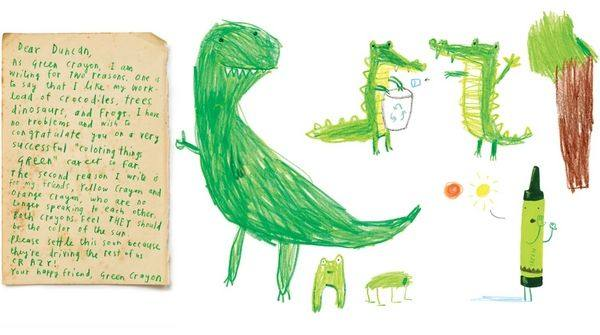

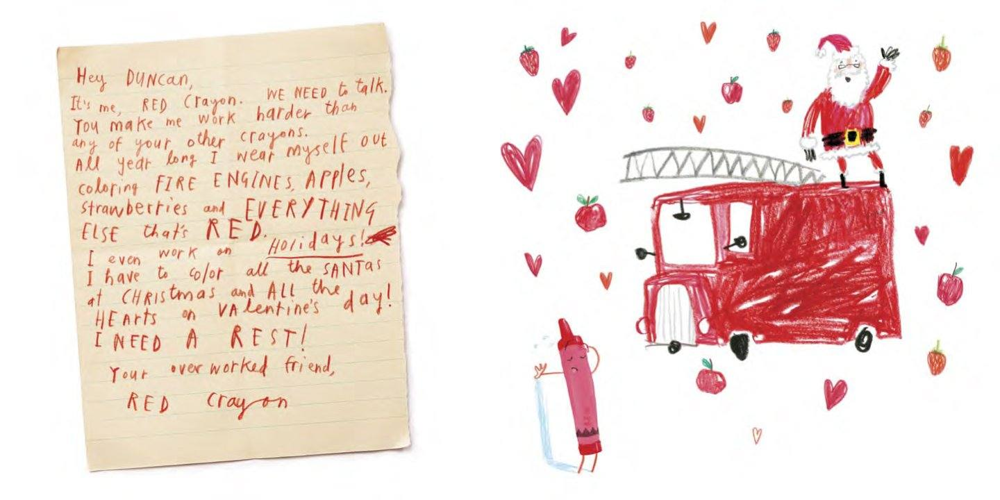

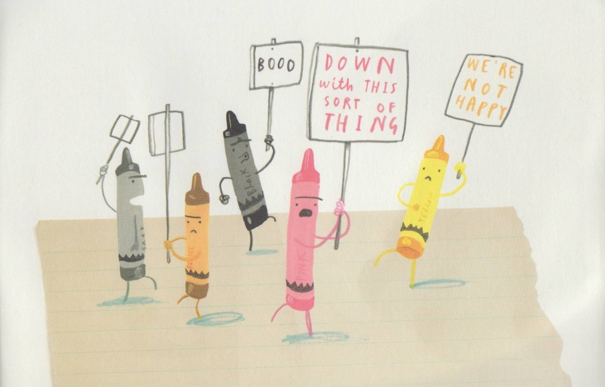

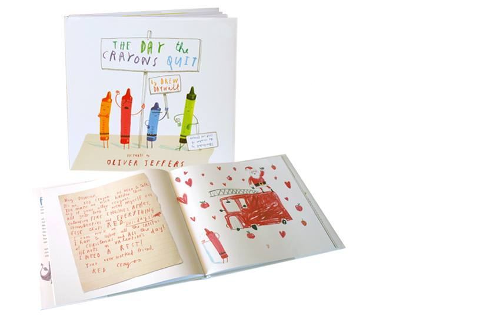

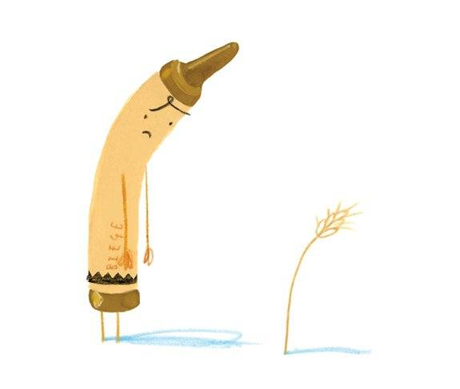

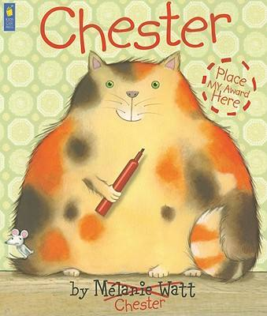

[*Chester*](http://www.indiebound.org/book/9781554534609) has a very
funny premise, which Mélanie Watt executes exceedingly well. The gist is
that an author and illustrator named, coincidentally enough, Mélanie
Watt is trying -- operative word: trying -- to draw a picture book about
a mouse who lives in a house in the country, BUT a big, ego-driven cat
named Chester has swiped a red marker and is editing the story to make
himself the star. Chester is constantly arguing with Melanie via his red
marker -- they bicker on the jacket flap copy, Chester edits her author
bio, the cat even changes her dedication on the copyright page.

Chester eventually ignites a war with his creator, which is an extremely
fun sequence to read aloud. When he redraws a page, she fights back with
her omniscient author powers and changes the scene or dresses him up in
a pink tutu. It turns into this large-scale argument with a fictional
character refusing to listen to its creator -- which is a really
hilarious concept -- but, since the creator becomes such a big part of
the story, she becomes a character as well.

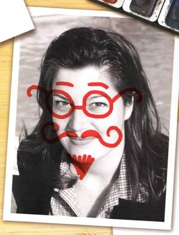

**Lesson Suggestions**

**Before the story\...**

- The front cover indicates trouble is brewing right from the start.
  Melanie Watt's name has been crossed out and replaced with "Chester"
  in bright red ink.

- Invite the children to participate by asking who the author of the
  story is.

- What additional clues does the cover give as to what the story will be
  about?

- Point out Mouse on the front cover. Ask the children what emotion he
  is showing? What emotion is Chester showing?

- You'll want to set the stage for this story before you begin. Either
  use the text in the front book-jacket-flap or describe the dilemma
  yourself: Melanie is trying to write a story about a Mouse but Chester
  keeps taking over with his red marker!

**During the story\...**

- Unless you are particularly good at characterisation, you may need
  more than your vocal skills to differentiate between who's telling the
  story -- Melanie or Chester. While it's clear by the colour of the
  text, it's less so when read out-loud (especially for younger
  audiences).

- Try making a "Chester Mask" (see attached template), and hold this up
  in front of your face every time Chester speaks. Alternatively you
  could use a cat puppet or some other prop for the same purpose.

- Be sure to point out all the little doodles in the illustrations as
  you go.

- Ask the children what changes they see in the picture now that Chester
  has "moved in".

**At the end of the story...**

- Continue the discussion by asking the children if they have pets at
  home. Do they ever misbehave? Ask for some examples.

- Go back and look closely at the pictures, are there any clues about
  where Chester sent Mouse on his trip?

- Ask the class for suggestions as to how Melanie could have helped make
  Chester behave.

- We never did get to hear a story about Mouse. If appropriate, start a
  discussion about what Mouse's story might have been about. This is a
  great way to lead into an independent story writing activity.

**Related Activities**

- The Chester series is especially conducive to discussing point of view
  since there are two strong, defined characters that are the focus. 
  Discuss the differences in tone, mood, and content between them.  Use
  a [Venn
  Diagram](http://www.sites4teachers.com/links/redirect.php?url=http://www.eduplace.com/graphicorganizer/pdf/venn.pdf) to
  outline the similarities/differences or make a chart together.  Also,
  connect that information to specific character qualities of each
  voice.  Help students to see the connection between voice, point of
  view, and character. 

**Mouse's Story\...**

- Children write their own story about Mouse. "Once upon a time there
  was a mouse. He lived in a house in the country...." Students finish
  this off, imagining what story Melanie was actually trying to tell us.

**Chester's Story\...**

- Alternatively, children create a story that actually is all about
  Chester. What would happen in it? What would he do? Would he still get
  into trouble?

<!-- -->

- Students write their own version of the story.  For instance, in pairs
  students can create their own Chester vs. Melanie conflict.  One
  person begins to write a story (either made up or a familiar fairy
  tale/myth), while the other person jumps in periodically to give
  his/her point of view on how the story should go.  It should be done
  in a fun and humorous manner. 

 

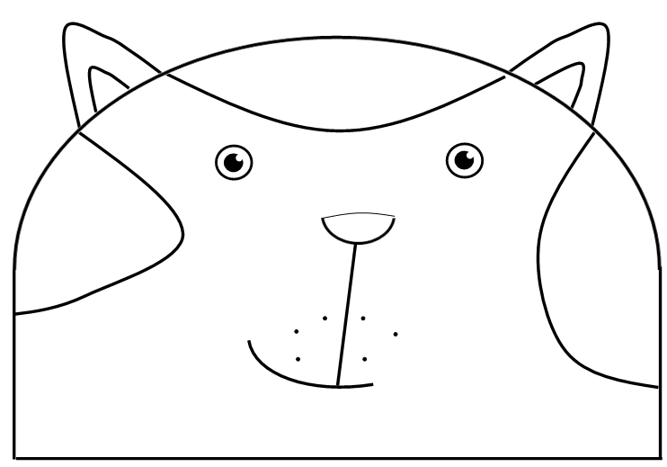

**Chester Melanie Watt**

Hi, I'm Melanie Watt, and I'm trying to write and illustrate a story
about a mouse. But Chester just won't stop interfering.

Thank Goodness! NOW it's a great book about me!

See what I mean? Chester keeps doodling on and rewriting my story with
his annoying red marker. How am I supposed to deal with this cat
upstaging me at every turn? I need to think of a way to put an end to
this before he compketely takes over!

Good luck, Einstein!!

As you can tell, Chester, A.K.A. the rude and self-centred furball,
always has to have the last word!

NOT TRUE!

You see?

See what?

What did I tell you?

Whatever!

+----------------------------+
| Dear Readers,              |
|                            |
| I apologise for Chester's  |
|                            |
| behaviour in my mouse      |
| story.                     |
|                            |
| Sorry for the              |
| inconvenience.             |
|                            |
| Sincerely,                 |
|                            |
| Melanie Watt               |
|                            |
| Blah! Blah! Blah!          |
+============================+

For Marcos, Eva,

Melina and Layla. X

For Chester because I couldn't have made this

book without him. He's the smartest, most

handsome cat in the world. I wish I could be

like him someday!

Chester

[NOT]{.underline} Written and Illustrated by Melanie Watt

Once upon a time there was a mouse. He lived in a house in the country.

Then Mouse packed his bags and went on a trip very, very far away and we
never saw him ever again!

So Chester moved in and made a few changes to HIS new place.

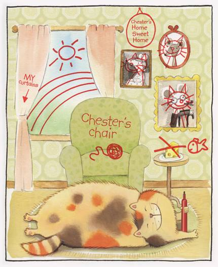

But Mouse returned home.

Oh yes, did I mention he brought back a really big souvenir with teeth?

Back to the story \...

Once upon a time there was a mouse. He lived in \... Chester, move out
of the way!

\... he lived in the country with his vegetarian dog who only ate
carrots.

Then Melanie begged Chester to write a better story. And it goes
something like this \...

Once upon a time there was ME. Chester stands for

Charming

Handsome

Envy of Mouse

Smart

Talented

Envy of Melanie

Really handsome

Chester lived in Chesterville, where mice weren't allowed. It was a
beautiful day.

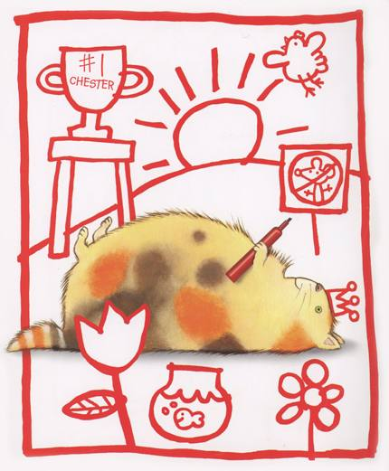

Until it started to rain.

Now, as I was saying \...

Once upon a time there was a mouse. He lived in a house in the country.

And he lived happily ever after \...

THE END!

**Chester!**

This is where I draw the line!

Nope! I'M drawing the line!

\_\_\_\_\_\_\_\_\_\_\_\_\_\_\_\_\_\_\_\_\_\_\_\_\_\_\_\_\_\_\_\_\_\_\_\_\_\_\_\_\_\_\_\_\_\_\_\_\_\_\_\_\_\_\_\_\_\_

DO NOT cross this line!

KEEP OUT!! (Chester's side)

Chester! That's enough! Hand over the marker this instant!

Chester's busy.

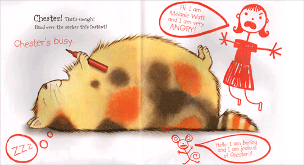

Chester! I'm warning you! Hand over the marker and apologise before I
count to three!

1 \...

2 \...

3 and 4, 5, 6, 7, 8, 9, 10, 11, 12, 13, 14, 15, 16, 17, 18, 19, 20, 21
\... La! La! La!

**All right, Chester!**

You want your own story? You want to be the star of this book?

Well, get ready. Here it is \...

FINALLY!!!

Once upon a time there was a cat named Chester. He lived in a house in
the country.

Chester was a very handsome cat. Especially when he wore a pink \...

YOU WOULDN'T!!!

**Tutu!**

NOW it's personal \...

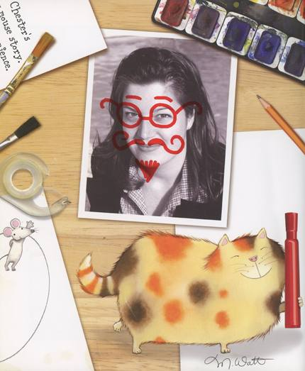

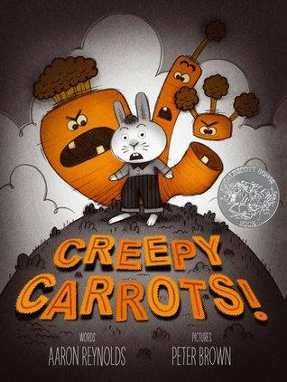

*The Twilight Zone *comes to the carrot patch in this clever picture
book parable about a rabbit who fears his favourite treats are out to
get him.** **Jasper Rabbit loves carrots---especially Crackenhopper
Field carrots.\
\
He eats them on the way to school.\
\
He eats them going to Little League.\
\
He eats them walking home.\
\
Until the day the carrots start following him\...or are they?

**Watch** The Creepy Carrot Zone on YouTube. This shows how Peter Brown
the illustrator got inspiration for his illustrations.

"Brown's panels - bordered in black, drawn in pencil, and digitally
composed and coloured -- cleverly combine the mood of film noir with the
low-tech look of early children's television staging for an aesthetic
that is atmospheric, but not overwhelming ... Panels in varying sizes
and multiple perspectives keep pace with Reynolds's tongue-in-cheek
narrative . . . This age-appropriate horror story takes children's fears
seriously and then offers them an escape through genuine comic
relief."---*School Library Journal*

"With pitch perfect illustration by the increasingly talented Peter
Brown, this beautifully shaded creation is a great example of how to get
the tone of a picture book exactly right. Strange and wonderful and
weird in all the right places. A masterpiece of the scary/funny
balance."---Elizabeth Bird 

 It has a great story line, it\'s relatable, not completely predictable,
and the pictures add to the experience and mood of the story.  As far as
who would enjoy this book I would say *Creepy Carrots!* is a great read
for Prep through 4th grade.  Teachers in the upper elementary grades
could easily use this book in lessons depicting mood as well as
descriptive writing.

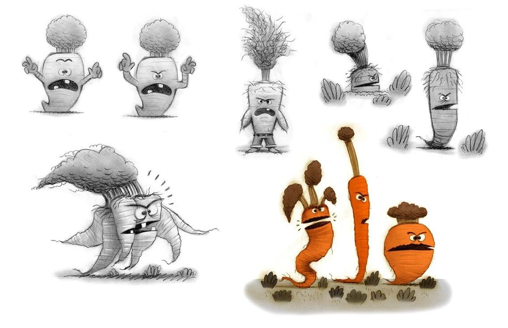

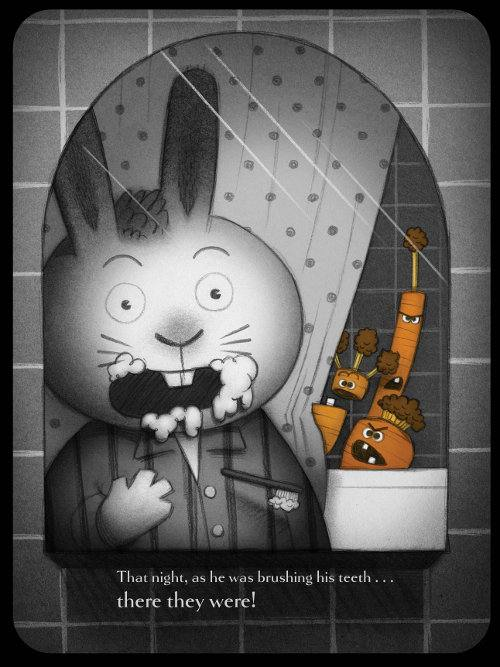

**Creepy Carrots Aaron Reynolds**

Jasper Rabbit had a passion for carrots. And the carrots that grew in
Crackenhopper Field were the best. Fat. Crisp. And free for the taking.

He pulled some for the morning snack on the way to school.

He yanked out a few on his way to Little League practice.

He ripped them from the ground on his way home at night.

Jasper couldn't get enough carrots \...

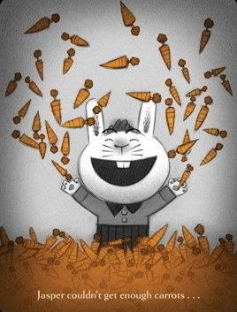

\... until they started following him.

He first noticed something strange after the big game against the East
Valley Hares. Jasper was about to help himself to a victory snack \...
when he heard it. The soft \... sinister \... *tunktunktunk* of carrots
creeping.

He turned \...

but there was nothing there.

Just my imagination, he thought. But he hopped a little faster.

That night, as he was brushing his teeth \... **there they were!**

Jasper whipped around \... but nothing. He laughed at himself, picked
his toothbrush off the floor, and went to bed \... quickly.

The next morning he approached Crackenhopper Field slowly.

He reached for two wild carrots. Nothing happened.

He bit into one. Nothing happened.

Whew! Creepy carrots. **It was ridiculous!**

But when he arrived home that evening \...

"Mum! Mum!" Jasper screamed. "Creepy carrots! In the shed!"

"There are no such things as creepy carrots," Mum said, shaking her
head.

Later that night, as Jasper lay in bed, he heard it.

Breathing.

Terrible, carroty breathing.

And there, on his wall!

"Creepy carrots!" he shouted.

"DAD! DAD!"

His dad thumped into his bedroom and threw on the light.

They searched under the bed. No creepy carrots.

They looked through the closet. No creepy carrots.

They opened the dresser drawers. No. **Creepy. Carrots.**

"Just a bad dream, son," his dad said, shaking his head. "Now go to
sleep."

That wasn't going to happen.

By the end of the week Jasper was seeing creepy carrots EVERYWHERE.

Jasper knew his parents were wrong. Creepy carrots were real. And they
were coming for him!\~ But they couldn't get him \... if they couldn't
get out.

Jasper hatched a plan. First thing on Saturday, he grabbed supplies and
headed to Crackenhopper Field.

As the sun finally set across Crackenhopper Field, Jasper Rabbit smiled.

On his way home there was no *tunktunktunk.* There were no carrot-shaped
shadows. His plan had worked. No creepy carrots would get out of that
carrot patch again.

And as the sun finally set, the carrots of Crackenhopper Field \...

**cheered!**

Their creepy plan had worked. They were sure of it.

Jasper rabbit would never get *into* that carrot patch again.

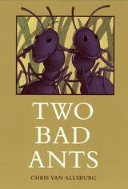

When an ant scout returns home with a mysterious crystal, the queen ant
decides it is the most delicious food she has ever tasted. That evening
the other ants, wishing to make the queen happy, set off on a journey to
fetch home as many of these crystals as they can carry. The journey is a
dangerous one. Following the scout, the ants travel through the
\"forest\" to the \"mountain\" they must climb in order to reach the
treasure they seek. In the perilous and confounding world of the human
kitchen, the ants find the bowl of delicious crystals. Hurrying home,
they fail to notice that two small ants have stayed behind. The two ants
have decided to tarry and eat crystals to their hearts\' content. When
morning comes, the ants are violently awoken by a large scoop lifting
them out of the crystal jar and dropping them into a hot brown liquid.
They manage one narrow escape after another until finally they decide to
choose one last crystal each and leave this strange and frightening
place. Lugging the crystals back home, they are glad to be doing the
right thing and returning to their family.

The spare illustrations in Two Bad Ants --- drawn with pen and ink over
a base of casein, paint that is not water soluble --- differ perceptibly
from Van Allsburg\'s other drawings but are equally expressive. In this
book perhaps more than other Van Allsburg\'s stories we observe the
world from unusual angles and perspectives. As we follow the ants on
their journey to the pot of delicious crystals, the ordinary becomes
extraordinary and powerful. A simple kitchen becomes a perilous obstacle
course. We are invited to try on the size of an ant --- electric sockets
loom overhead, a spoon is as big as an elevator. The adventure is
described in fresh language that transforms a simple walk from the yard
to the kitchen (in human terms) into a life-threatening excursion.

As in many of Van Allsburg\'s books, the characters develop and change
by passing through a dangerous or challenging experience unscathed. Once
again we are encouraged to celebrate and honour the comforts of a simple
life. The two bad ants are reminded that working together for the
benefit of the whole community --- something that is true to the nature
of an ant --- feels better than selfishly lingering in the sugar bowl to
eat a great share of the delicious crystals. After their frightening
experiences in the kitchen, the ants are relieved and delighted to head
home to the calm and collaborative world of their home and family.

Teaching Ideas:

To reach the delicious crystals, the ants traverse what to them is a
mysterious land full of menacing obstacles. To us, it\'s an ordinary
kitchen, but Van Allsburg doesn\'t tell us that directly: he describes
the setting without telling us it\'s a kitchen.

Reviewing such excerpts during reading lessons can help their own
examination of setting or description. How does a particular description
affect the story? If the description were left out, what would be the
result? This technique of querying is useful in writing lessons as
well.\
\
*Two Bad Ants* provides opportunities for less-experienced readers to
develop their predicting skills, either during a read-aloud or as part
of their independent reading. 

Tell the children that every so often readers stop and make a
prediction, or guess what is going to happen next. Tell them to watch
you as you show them how this is done, using Two Bad Ants. Remind them
quickly of how the two ants decide to stay in the bowl of crystals, and
then read the following excerpt (pages 16--17):

Daylight came. The sleeping ants were unaware of changes taking place in
their new found home. A giant silver scoop hovered above them, then
plunged deep into the crystals. It shovelled up both ants and crystals
and carried them high into the air.

**Predictions:**

The ants were wide awake when the scoop turned, dropping them from a
frightening height. They tumbled through space in a shower of crystals
and fell into a boiling brown lake.

Think aloud for your students as you make a prediction. You might say,
\"I think the ants might have fallen into a cup of coffee when they got
scooped out of the sugar bowl. This is why: I read in the text that a
silver scoop shovelled them up. I think that\'s a spoon. Then I read
that the ants fell into a boiling brown lake. I think that must be
coffee. The pictures make me think that also --- the big silver object
does look like a spoon.\"

Ask the students to get out their own books and read for a couple of
minutes. Tell them you will be stopping them and asking them to make a
prediction to a partner. Do this. As they talk to each other, remind
them to use both the pictures and the words to help them. Bring the
class back together and ask one or two children to share their
predictions with the class.

Tell the students as you send them off to read independently that
whenever they are reading, their job is to stop every so often and make
a prediction about what is going to happen next, using both pictures and
text.

*Teachers' Guide*

**Writing**

Students read the story, work in pairs to analyse the illustrations and
text, and compare and contrast points of view. After rereading the
story, students apply their knowledge of point of view by writing a
short story from an ant\'s perspective.

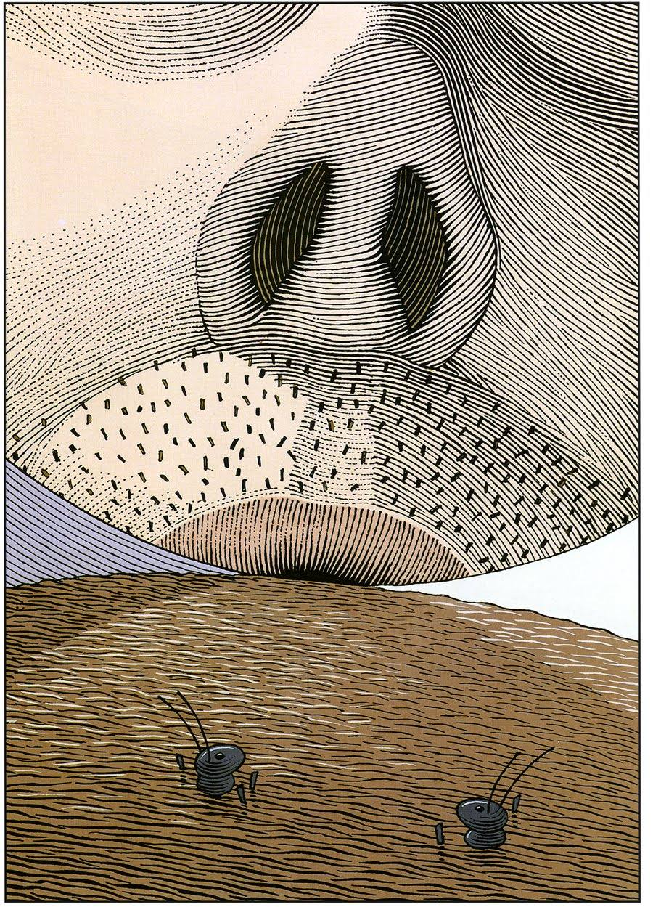

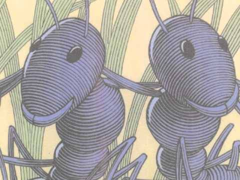

**WRITING CRAFT Two Bad Ants**

+----------------------+---------------------------------------------+
| **Focus**            | The journey of two ants.                    |
|                      |                                             |
| **Ideas and          |                                             |
| details:**           |                                             |
+======================+=============================================+
| **Organisation**     | Lead: Setting                               |
|                      |                                             |
| Leads/Endings        | Ending: Poignant                            |
|                      |                                             |
| Transitions          | Transitions: *When the ants Daylight came.* |
|                      |                                             |
| **Organisational     | Descriptive writing: Show not tell          |
| Structure:**         | examples.                                   |
|                      |                                             |
| Sequence             | > *When the ants climbed out of the holes   |
|                      | > they were surrounded by a strange red     |
| Description          | > glow. It seemed to them that every second |
|                      | > the temperature was rising. It soon       |
| Cause and Effect     | > became so unbearably hot that they        |
|                      | > thought they would soon be cooked.*       |
| Compare and Contrast |                                             |
|                      | Problem/Solution                            |
| Problem/Solution     |                                             |
+----------------------+---------------------------------------------+
| **Style**            | Metaphor:                                   |
|                      |                                             |
| **Words: Memorable   | *They had reached their goal. From the top  |
| Language**           | of the wall they looked below to a sea of   |
|                      | crystals (sugar). One by one the ants       |
| **Voice:**           | climbed down into the sparkling treasure.*  |
|                      |                                             |
| **Fluency:**         | Simile:                                     |
|                      |                                             |
|                      | *They were stunned senseless and blown out  |
|                      | of the holes like bullets from a gun.*      |
|                      |                                             |
|                      | Strong verbs: *travelled returned presented |
|                      | deemed understood gather departed stretched |
|                      | climbed marched listened echoing formed     |
|                      | whistled struggled reached crawled noticed  |
|                      | stayed hovered shoveled carried spinning    |
|                      | creating bobbed spitting hurried pulled     |
|                      | rising flying landed gripped plunged        |
|                      | stunned*                                    |
|                      |                                             |
|                      | Word pairs: *twisted and turned bruised and |
|                      | dizzy*                                      |
|                      |                                             |
|                      | Power of three: *lifted, tilted, and        |
|                      | lowered*                                    |
|                      |                                             |
|                      | Nouns: *crystal happiness shadow journey    |
|                      | dusk twilight mountain fountain antennae    |
|                      | tunnel scoop disk chamber bullets*          |
|                      |                                             |
|                      | Adjectives: *sparkling delicious hungry     |
|                      | blinding tasty sleeping frightening pitch   |
|                      | black powerful feverish refreshing whirling |
|                      | shredded battered*                          |
|                      |                                             |
|                      | Adverbs: *quickly swiftly anxiously         |
|                      | violently neatly unbearably tightly*        |
|                      |                                             |
|                      | Sentence fragments: *Daylight came.*        |
+----------------------+---------------------------------------------+
| **Conventions**      | Possessive apostrophe: *mountain's face*    |
|                      |                                             |
| **Punctuation:**     | Talking marks. Question marks.              |
|                      |                                             |
| **Spelling:**        | Comparative/Superlative: *happier deeper    |
|                      | higher closer*                              |
|                      |                                             |
|                      | Compound words: *whirlpool daylight         |
|                      | underground*                                |
|                      |                                             |
|                      | Abbreviations: *you're they'd*              |
|                      |                                             |
|                      | Prefix: un- *unaware unbearable*            |
+----------------------+---------------------------------------------+

**Two Bad Ants Chris Van Allsburg**

The news travelled swiftly through the tunnels of the ant world. A scout
had returned with a remarkable discovery -- a beautiful sparkling
crystal. When the scout presented the crystal to the ant queen she took
a small bite, then quickly ate the entire thing.

She deemed it the most delicious food she had ever tasted. Nothing could
make her happier than to have more, much more. The ants understood. They
were eager to gather more crystals because the queen was the mother of
them all. Her happiness made the whole ant nest a happy place.

It was late in the day when they departed. Long shadows stretched over
the entrance to the ant kingdom. One by one the insects climbed out,
following the scout, who had made it clear -- there were many crystals
where the first had been found, but the journey was long and dangerous.

They marched into the woods that surrounded their underground home. Dusk
turned to twilight, twilight to night. The path they followed twisted
and turned, every bend leading them deeper into the dark forest.

More than once the line of ants stopped and anxiously listened for the
sounds of hungry spiders. But all they heard was the call of crickets
echoing through the woods like distant thunder.

Dew formed on the leaves above. Without warning, huge cold drops fell on
the marching ants. A firefly passed overhead that, for an instant, lit
up the woods with a blinding flash of blue-green light.

At the edge of the forest stood a mountain. The ants looked up and could
not see its peak. It seemed to reach right to the heavens. But they did
not stop. Up the side they climbed, higher and higher.

The wind whistled through the cracks of the mountain's face. The ants
could feel its force bending their delicate antennae. Their legs grew
weak as they struggled upward. At last they reached a ledge and crawled
through a narrow tunnel.

When the ants came out of the tunnel they found themselves in a strange
world. Smells they had known all their lives, smells of dirt and grass
and rotting plants, had vanished. There was no more wind and, most
puzzling of all, it seemed that the sky was gone.

They crossed smooth shiny surfaces, then followed the scout up a glassy
curved wall. They had reached their goal. From the top of the wall they
looked below to a sea of crystals.

Quickly they each chose a crystal, then turned to start the journey
home. There was something about this unnatural place that made the ants
nervous. In fact they left in such a hurry that none of them noticed the
two small ants who stayed behind.

"Why go back?" one asked the other. "This place may not feel like home,
but look at all these crystals."

"You're right," said the other, "we can stay here and eat this tasty
treasure every day, forever."

So the two ants ate crystal after crystal until they were too full to
move, and fell asleep.

Daylight came. the sleeping ants were unaware of changes taking place in
their new found home. A giant silver scoop hovered above them, then
plunged deep into the crystals. It shovelled up both ants and crystals
and carried them high into the air.

The ants were wide awake when the scoop turned, dropping them from a
frightening height. They tumbled through space in a shower of crystals
and fell into a boiling brown lake.

Then the giant scoop stirred violently back and forth. Crushing waves
fell over the ants. They paddled hard to keep their tiny heads above
water. But the scoop kept spinning the hot brown liquid.

Around and around it went, creating a whirlpool that sucked the ants
deeper and deeper. They both held their breath and finally bobbed to the
surface, gasping for air and spitting mouthfuls of the terrible, bitter
water.

Then the lake tilted and began to empty into a cave. The ants could hear
the rushing water and felt themselves pulled towards the pitch black
hole. Suddenly the cave disappeared and the lake became calm. The ants
swam to the shore and found that the lake had steep sides.

They hurried down the walls that held back the lake. The frightened
insects looked for a place to hide, worried that the giant scoop might
shovel them up again. Close by they found a huge round disk with holes
that could neatly hide them.

But as soon as they had climbed inside, their hiding place was lifted,
tilted, and lowered into a dark space. When the ants climbed out of the
holes they were surrounded by a strange red glow. It seemed to them that
every second the temperature was rising.

It soon became so unbearably hot that they thought they would soon be
cooked. But suddenly the disk they were standing on rocketed upward and
the two hot ants went flying through the air.

They landed near what seemed to be a fountain -- a waterfall pouring
from a silver tube. Both ants had a powerful thirst and longed to dip
their feverish heads into the refreshing water. They quickly climbed
along the tube.

As they got closer to the rushing water the ants felt a cool spray. They
tightly gripped the shiny surface of the fountain and slowly leant their
heads into the falling stream. But the force of the water was much too
strong.

The tiny insects were pulled off the fountain and plunged down into a
wet dark chamber. They landed on half-eaten fruit and other soggy
things. Suddenly the air was filled with loud, frightening sounds. The
chamber began to spin.

The ants were caught in a whirling storm of shredded food and stinging
rain. Then, just as quickly as it had started, the noise and spinning
stopped. Bruised and dizzy, the ants climbed out of the chamber.

In daylight once again, they raced through puddles and up a smooth metal
wall. In the distance they saw something comforting -- two long, narrow
holes that reminded them of the warmth and safety of their old
underground home. They climbed up into the dark openings.

But there was no safety inside these holes. A strange force passed
through the wet ants. They were stunned senseless and blown out of the
holes like bullets from a gun. When they landed the tiny insects were
too exhausted to go on. They crawled into a dark corner and fell fast
asleep.

Night had returned when the battered ants awoke to a familiar sound --
the footsteps of their fellow insects returning for more crystals. The
two ants slipped quietly to the end of the line. They climbed the glassy
wall and once again stood amid the treasure. But this time they each
chose a single crystal and followed their friends home.

Standing a the edge of their ant hole, the two ants listened to the
joyful sounds that came from below. They knew how grateful their mother
queen would be when they gave her their crystals. At that moment, the
two ants felt happier than they'd ever felt before. This was their home,
this was their family. This was where they were meant to be.

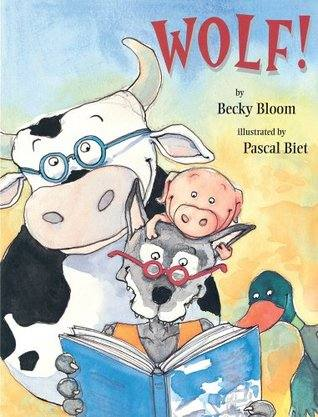

**Wolf! Becky Bloom**

Once upon a time, a howling wolf leapt at a pig, a duck, and a cow ---
and got no reaction. No running away, no frightened oinks or quacks or
moos. \"What\'s wrong with you?\" growled the wolf. \"Can\'t you see
I\'m a big and dangerous wolf?\"

\"I\'m sure you are\", replied the pig. \"But couldn\'t you be big and
dangerous somewhere else? We\'re trying to read. This is a farm for
educated animals\...\"

Educated animals? That gets the wolf thinking. Maybe he, too, could
learn to read. And as this witty and winning tale reveals, an exciting
new chapter in the wolf\'s life begins!

My all-time favourite for Readers' Theatre.

*The voice is energetic and fun.*

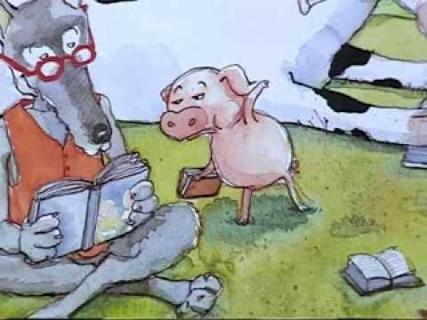

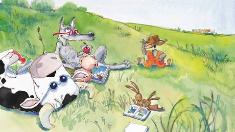

**\**

**Wolf!**

**Becky Bloom**

After walking for many days, a wolf wandered into a quiet little town.
He was tired and hungry, his feet ached, and he had only a little money
that he kept for emergencies. Then he remembered. There's a farm outside
this village, he thought. I'll find some food there ....

As he peered over the farm fence, he saw a pig, a duck, and a cow
reading in the sun. The wolf had never seen animals read before.

"I'm so hungry that my eyes are playing tricks on me," he said to
himself. But he really was very hungry and didn't stop to think about it
for too long.

The wolf stood up tall, took a deep breath ...

... and leapt at the animals with a howl --

"AaaOOOOOoo!"

Chickens and rabbits ran for their lives, but the duck, the pig, and the
cow didn't budge.

"What is that awful noise?" complained the cow. "I can't concentrate on
my book."

"Just ignore it," said the duck.

The wolf did not like to be ignored.

"What's wrong with you?" growled the wolf. "Can't you see I'm a big and
dangerous wolf?"

"I'm sure you are," replied the pig. "But couldn't you be big and
dangerous somewhere else? We're trying to read. This is a farm for
educated animals. Now be a good wolf and go away," said the pig, giving
him a push.

The wolf had never been treated like this before.

"Educated animals ... educated animals!" the wolf repeated to himself.
"This is something new. Well then! I'll learn how to read too."

And off he went to school.

The children found it strange to have a wolf in their class, but since
he didn't try to eat anyone, they soon got used to him. The wolf was
serious and hardworking, and after much effort he learned to read and
write. Soon he became the best in the class.

Feeling quite satisfied, the wolf went back to the farm and jumped over
the fence. I'll show them, he thought. He opened his book and began to
read,

"Run, wolf! Run!

See wolf run."

"You've got a long way to go," said the duck, without even bothering to
look up. And the pig, the duck, and the cow went on reading their own
books, not the least impressed.

The wolf jumped back over the fence and ran straight to the public
library. He studied long and hard, reading lots of dusty old books, and
he practised and practised until he could read without stopping.

"They'll be impressed with my reading now," he said to himself.

The wolf walked up to the farm gate and knocked. He opened The Three
Little Pigs and began to read:

"Onceuponatimetherewerethreelittlepigsonedaytheirmothercalledthemandtoldthem--"

"Stop that racket," interrupted the duck.

"You have improved," remarked the pig, "but you still need to work on
your style."

The wolf tucked his tail between his legs and slunk away.

But the wolf wasn't about to give up. He counted the little money he had
left, went to the bookshop, and bought a splendid new storybook. His
first very own book! He was going to read it day and night, every letter
and every line. He would read so well that the farm animals would admire
him.

Ding-dong, rang the wolf at the farm gate.

He lay down on the grass, made himself comfortable, took out his new
book, and began to read. He read with confidence and passion, and the
pig, the cow, and the duck all listened and said not one word. Each time
he finished a story, the pig, the duck, and the cow asked if would
please read them another.

So the wolf read on, story after story. One minute he was Little Red
Riding Hood,

the next a genie emerging from a lamp, and then a swashbuckling pirate.

"This is so much fun!" said the duck.

"He's a master," said the pig.

"Why don't you join us on our picnic today," offered the cow.

And so they all had a picnic -- the pig, the duck, the cow, and the
wolf. They lay in the tall grass and told stories all the afternoon
long.

"We should all become storytellers," said the cow suddenly.

"We could travel around the world," added the duck.

"We can start tomorrow morning," said the pig.

The wolf stretched in the grass. He was happy to have such

wonderful friends.

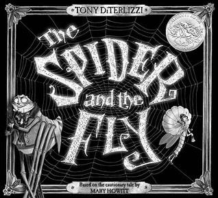

**The Spider and the Fly by Mary Howitt Illustrated byTony DiTerlizzi**

\"\'Will you walk into my parlour,\' said the Spider to the Fly\...\"

is easily one of the most recognised and quoted first lines in all of
English verse. But do you have any idea how the age-old tale of the
Spider and the Fly ends? Join celebrated artist Tony DiTerlizzi as he
\-- drawing inspiration from one of his loves, the classic Hollywood
horror movies of the 1920s and 1930s \-- shines a cinematic spotlight on
Mary Howitt\'s warning, written to her own children about those who use
sweet words to hide their not-so-sweet intentions.

Aim: Studying contrasting voices in the one book.

Read The Spider and the Fly without showing pictures. Students describe
voice.

Group work:

Copy of text.

Examples of pictures.

Do the illustrations add to the understanding of the ideas and creating
the voice?

Group discussion.

Group work:

Read the letter from the spider. Describe voice.

Independent work:

Use the 3 columns to summarise the text.

**The Spider and the Fly**

  -----------------------------------------------------------------------
  **Voice in the Text**   **Voice in the          **Voice in the
                          Illustrations**         Endpapers**
  ----------------------- ----------------------- -----------------------
                                                  

  -----------------------------------------------------------------------

E.g.

**The Spider and the Fly**

+----------------------+-----------------------+-----------------------+
| **Voice in the       | **Voice in the        | **Voice in the        |
| Text**               | Illustrations**       | Endpapers**           |
+======================+=======================+=======================+
| Formal               | Mesmerising           | Sarcastic             |
|                      |                       |                       |
| Scary                | Captivating           | Wicked                |
|                      |                       |                       |
| Persuasive           | Illustrative          | Ego-centric           |
+----------------------+-----------------------+-----------------------+

Add to class chart of Descriptors for Voice: E.g.

*bold, hilarious, contemplative, judgmental.*

Further Literacy work:

Rhyme: Poetic rhyme scheme of AA, BB, CC using limbic pentameter style
of poetry construction

Simile: Page 19; "Your eyes are like the diamond bright, but mine are
dull as lead!"

Allusion: Page 10: The large clock in the background showing 11:30 p.m.
indicates that time is running out for the fly. This alludes to the
significance of the clock string midnight in the classic fairytale,
Cinderella.

Allusion: The fly is depicted as a flapper, alluding to a frivolous
young woman from the 1920s jazz age.

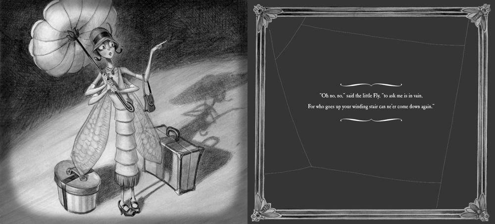

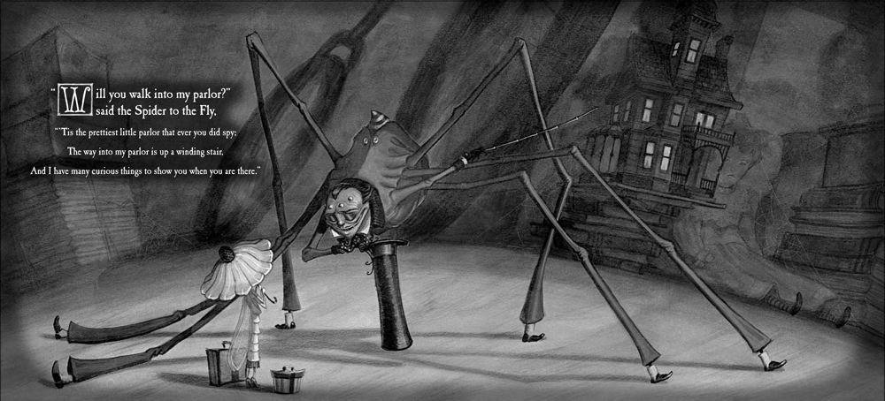

### The Spider and the Fly Mary Howitt

### \"Will you walk into my parlour?\" said the spider to the fly; \"\'Tis the prettiest little parlour that ever you did spy. The way into my parlour is up a winding stair, And I have many pretty things to show when you are there.\" \"O no, no,\" said the little fly, \"To ask me is in vain, For who goes up your winding stair can ne\'er come down again.\"  \"I\'m sure you must be weary, dear, with soaring up so high; Will you rest upon my little bed?\" said the spider to the fly. \"There are pretty curtains drawn around, the sheets are fine and thin, And if you like to rest awhile, I\'ll snugly tuck you in.\" \"O no, no,\" said the little fly, \"for I\'ve often heard it said, They NEVER, NEVER WAKE again, who sleep upon YOUR bed.\"  Said the cunning spider to the fly, \"Dear friend, what shall I do, To prove the warm affection I\'ve always felt for you? I have within my pantry good store of all that\'s nice; I\'m sure you\'re very welcome; will you please to take a slice? \"O no, no,\" said the little fly, \"kind sir, that cannot be; I\'ve heard what\'s in your pantry, and I do not wish to see.\"  \"Sweet creature!\" said the spider, \"you\'re witty and you\'re wise, How handsome are your gauzy wings, how brilliant are your eyes! I have a little looking-glass upon my parlour shelf, If you\'ll step in one moment dear, you shall behold yourself.\" I thank you, gentle sir,\" she said, \"for what you\'re pleased to say, And bidding you good-morning NOW, I\'ll call ANOTHER day.\"  The spider turned him round about, and went into his den, For well he knew the silly fly would soon be back again: So he wove a subtle web, in a little corner sly, And set his table ready to dine upon the fly. Then he came out to his door again, and merrily did sing, \"Come hither, hither, pretty fly, with the pearl and silver wing: Your robes are green and purple; there\'s a crest upon your head; Your eyes are like the diamond bright, but mine are dull as lead.\"  Alas, alas! how very soon this silly little fly, Hearing his wily flattering words, came slowly flitting by.  With buzzing wings she hung aloft, then near and nearer drew, Thinking only of her crested head - POOR FOOLISH THING! At last, Up jumped the cunning spider, and fiercely held her fast. He dragged her up his winding stair, into his dismal den, Within his little parlour; but she ne\'er came out again!  And now, dear little children, who may this story read, To idle, silly, flattering words, I pray you ne\'er give heed; Unto an evil counsellor close heart, and ear, and eye, And take a lesson from this tale of the Spider and the Fly.

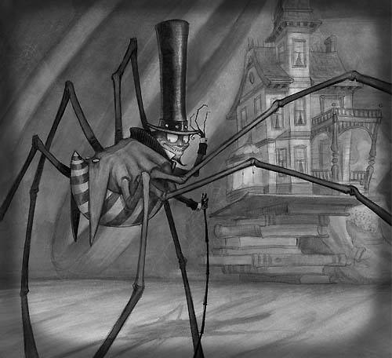

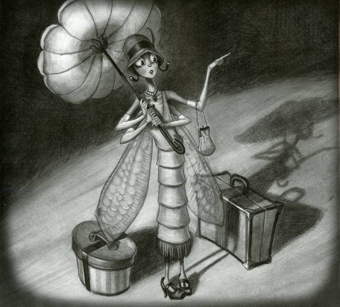

### 

### 

### 

### 

### 

### 

**Interview with Tony DiTerlizzi (extract)**

**TEACHINGBOOKS:** *The Spider and the Fly* is a book on the darker end
of the spectrum as well.

**TONY DITERLIZZI:** I read the Mary Howlitt poem and I instantly had
these visions of Edward Gorey\'s little tongue and cheek pen and ink
illustrations or Charles Addams where it\'s just the darkest humour that
as a kid I loved so much. So I said the book has got to be black and
white. I instantly saw what the spider looked like. I saw what the fly
looked like. The spider was in black and inspired by all the dastardly
do-badder guys you\'d see on cartoons that would, you know, play with
their moustache and say, \"I\'m tying you to the railroad tracks, ha ha
ha ha! Get out of this one.\"

And the fly was like this doe-eyed creature in white saying, \"Oh my
gosh, where am I? The world is so big and scary. Wow.\" I knew I didn\'t
want the spider to live in a web. I wanted him to live in something else
that was a little more unconventional so we came up with the dollhouse
in the attic. I thought the idea of a house within a house was kind of
clever, so that the human viewer could relate to what was going on.

**TEACHINGBOOKS:** How did you approach both the illustrations and the
overall design of *The Spider and the Fly*?

**TONY DITERLIZZI:** I focused on showing scenes from interesting angles
and providing cool effects with the text or really integrating the text
within the pictures. We created a glow on some of the text and the
shadow. We included ghost bugs that weren\'t in Mary\'s original poem.
They\'re there to warn the fly and help tell the story to the younger
readers. And we tried all different ways to create them. I was
originally going to do them on tracing paper, and glue them in, but it
wasn\'t working. So, the book designer at the publisher used Photoshop
to make the ghost bugs see-through and glowing.

The final thing that we added was the silver. And that was a total
homage to the silver screen. I mean, the idea that *The Spider and the
Fly* was already like a silent monster movie, so we thought it would be
really cool to add to that feel with the silver. And, I wanted the book
to look like it had been made a long time ago. The silver helped in that
way as well. I try to draw upon older artists and older writers in all
my books, so that there\'s a familiarity to the books --- so you feel
like you\'ve seen them before.

**TEACHINGBOOKS:** Did you expect *The Spider and the Fly* to do as well
as it did?

**TONY DITERLIZZI:** We had no idea the book was going to do that well.
We really didn\'t. I mean, we were happy with it, but we thought we\'d
sell 20 copies to all the Goth kids out there. But we also figured
people would either love it or they\'d hate it. And we just kept getting
starred review after starred review. And then, of course, when we won
the Caldecott Honour for it we were stunned. We had no idea when we
created it --- you don\'t think about that kind of stuff. You just want
to make a book that you think kids are going to dig.

**TEACHINGBOOKS:** Was part of your surprise over the success of the
book due to the fact that the book does not have a happy ending?

**TONY DITERLIZZI:** I knew that kids would gravitate to the unhappy
ending, and I love that about the book. A lot of adults didn\'t, but
still, it was delicious to children --- we\'re so to the usual way
stories progress, that the idea that it ends differently delights us. I
love reading the ending out loud and seeing the look on kids\' faces. I
actually pause halfway when I\'m reading and say, \"Okay, the fly\'s
leaving. Do you think she\'s coming back?\" And it\'s unanimous: no,
she\'s not coming back. And then I just turn the page. And the look, you
know, when they see the tombstone at the very end\... It\'s great. They
love it. I love that. It kind of zings them.

**TEACHINGBOOKS:** How did you strike the right balance in the \"zing\"
as you call it for the picture book audience?

**TONY DITERLIZZI:** I was very conscious that I wanted to spook
children, but I would never want to terrify them. There\'s enough stuff
that\'s out there that\'s violent and terrifying enough that kids are
exposed to via maybe television or video games, and even in other books.
And so for me it was more entertainment. It\'s got to have a little dark
grit to it because kids love that. I love that as an adult, too.

**TEACHINGBOOKS:** Did your parents and teachers support your creativity
and desire to be an artist when you were younger?

**TONY DITERLIZZI:** Yes --- both my mom and my father were very
supportive of me being a little creative artist and kind of doing my
thing. And I had a series of teachers, from fifth grade, middle school
and high school that were very supportive of my art. And I think that\'s
just something that you don\'t realize how special that is until you
look back.

**TEACHINGBOOKS:** Can you provide some examples of the support you got
from teachers?

**TONY DITERLIZZI:** Yeah, my fifth grade teacher, actually, Ray
Strassburger, comes to mind. I was consistently having problems with my
book reports for class, so he said, \"Why don\'t you do a drawing from
the stories and I\'ll let you get extra credit for that. And it can\'t
be a drawing that\'s already in the book. You\'ve got to come up with
your own scene.\" I did that for all my book reports, and was able to
get good grades.

In high school I had taken all the art classes I could take. And my art
teacher said, \"You\'ve taken all the art classes and you\'ve got art
schools that you\'re interested in going to. Why don\'t we have a
planning period? Why don\'t we make up these assignments for you that
you can work on. One assignment was for me to illustrate a famous or
well-known kid\'s story. We chose *Alice in Wonderland*, and I spent the
entire semester reinterpreting it. He gave me a lot of feedback. And the
thing I had to hand in at the end of the semester was an illustrated
book. I had a good time doing it. But I look back, and I realise how
fortunate I was to be surrounded by adults who actually nurtured my
ability.

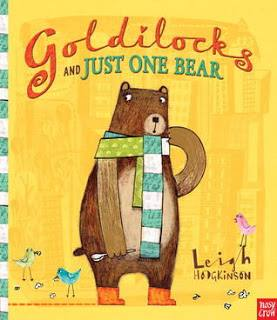

In this award-winning author/illustrator's witty sequel to the
traditional Goldilocks story, Little Bear is all grown up and Goldilocks
is a distant memory. One day, Little Bear wanders out of the woods and
finds himself lost in the Big City. Will he find the city too noisy? Too
quiet? Or just right? And what are the chances of him bumping in to
someone who remembers exactly how he likes his porridge?

Kids will love predicting what\'s going to happen to the bear and may
even be surprised to discover just exactly whose house he has wandered
into\...or maybe not, but either way, I think they\'ll be delighted with
the ending.

Reading Strategies:

Activating Background Knowledge, Making Connections, Making Inferences,
Making Predictions

Compare this story to the traditional Goldilocks and the Three Bears.
What did the author change? What did the author imply about the decision
that the bear made compared to Goldilocks\' decisions from the
traditional story?

Writing Strategies:

Descriptive, Word Choice, Adjectives, Compound Adjectives, Compare and
Contrast, Personal Narrative, Repetition,

Writing Prompts: Write about a time in your life when you were lost -
whether you were confused or really not sure where you were. How did you
feel? What did you do in this situation?

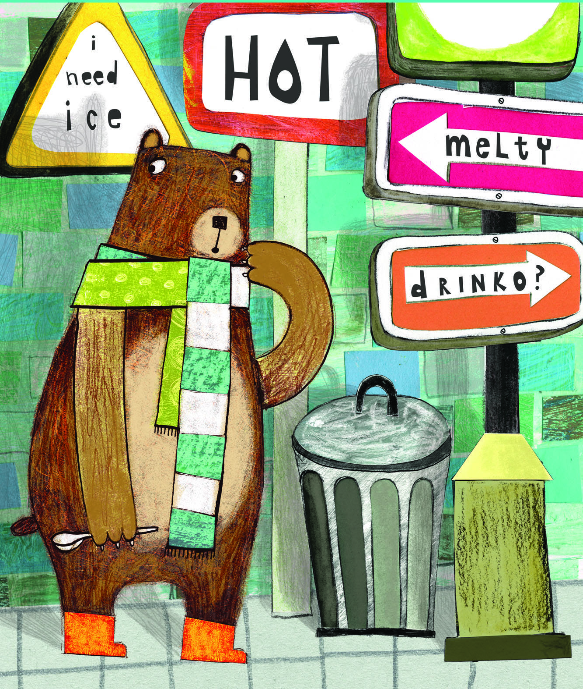

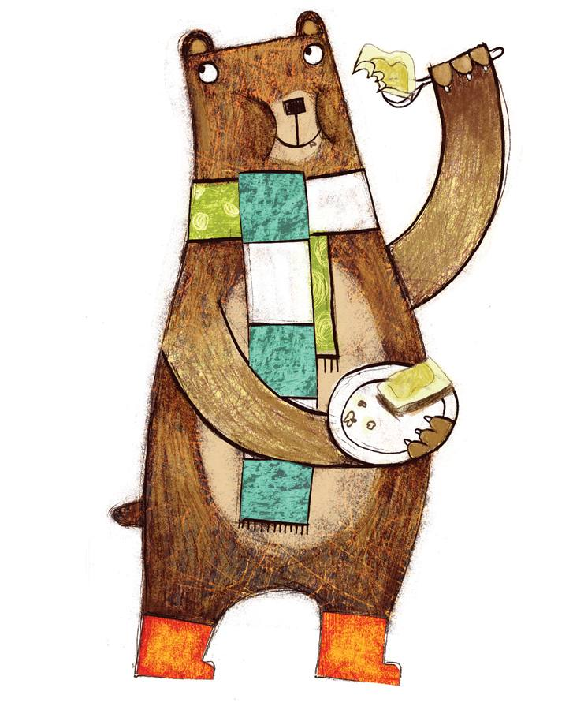

**\**

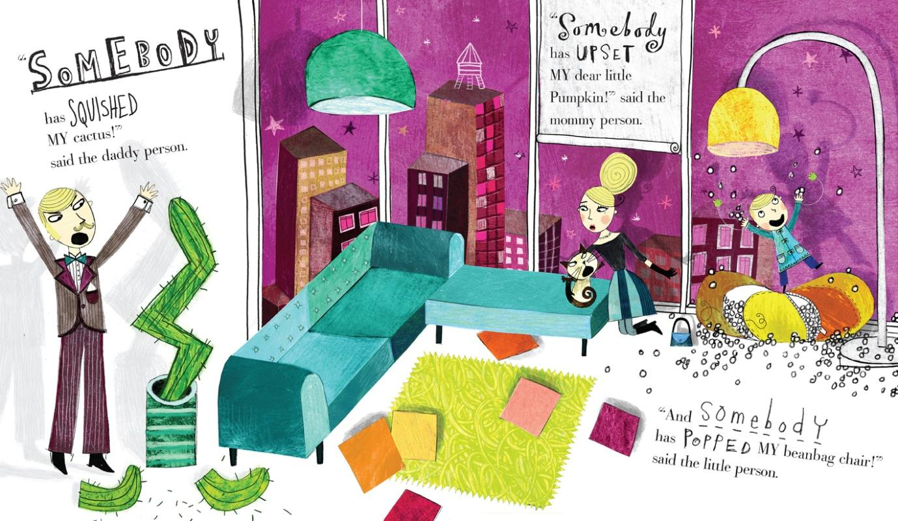

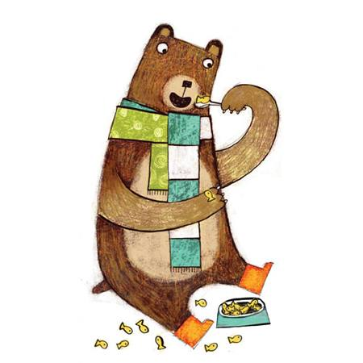

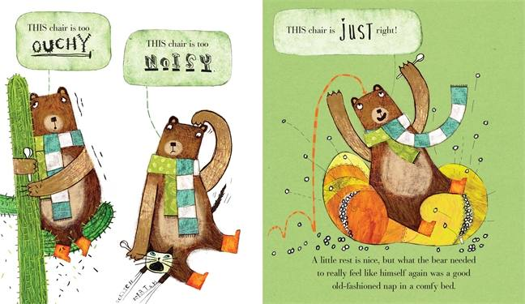

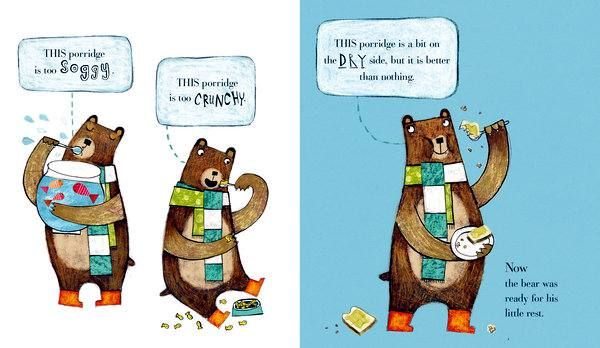

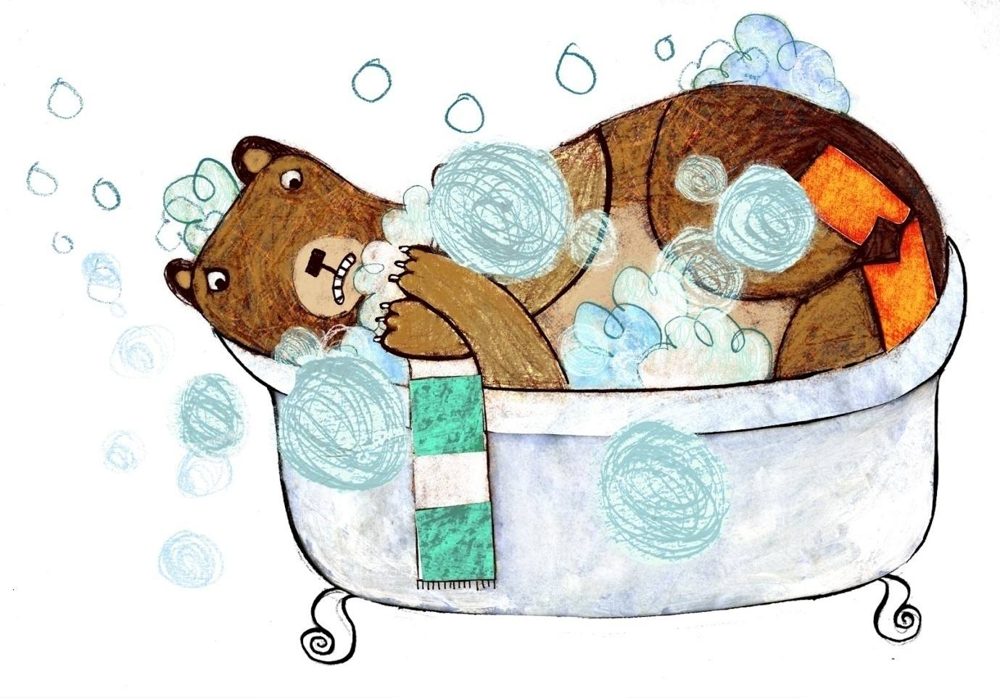

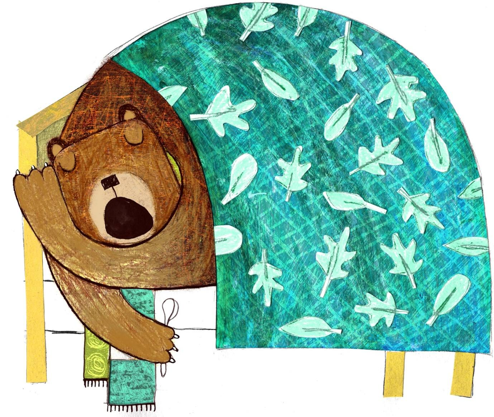

**Goldilocks and Just One Bear Leigh Hodgkinson**

Once upon a time, there was this bear. One minute, he was lolloping
about in the wood all happy-go-lucky ...

The next minute, a hadn't a crumb-of-a-clue where he was. He was one
completely lost bear.

The bear didn't much like this place. Too many bright lights and not
enough twigs. Too much loud honking and beeping and not nearly enough
owl-hooting.

The bear was also a teeny bit scared and his furry legs had gone
slightly wobbly.

"Maybe the thing to do," said the bear looking round, "is to nip into
'Snooty Towers' here, and get away from this terrible racket."

But the spinny 'Snooty Towers' door made the bear feel dizzy, and being
dizzy with wobbly legs was bad news. What the bear needed was a little
sit-down. A little sit-down somewhere would definitely see him
tickety-boo.

The bear peeked through a door and thought how very pleasant it was up
here.

"Not nasty and noisy like down there, thought the bear. "Just the place
for a little sit-down."

All that whoosh travelling was certainly a hungry business so, before
his little sit-down, a spot of porridge seemed a good idea ...

"This porridge is too soggy," said the bear.

"This porridge is too crunchy," said the bear.

"This porridge is a bit on the dry side," said the bear, "but it is
better than nothing."

Now the bear was ready for his little sit-down.

"This chair is too ouchy," said the bear.

"This chair is too noisy," said the bear.

"This chair is just right," said the bear.

A little sit-down is all very well, but what the bear needed to feel
really tickety-boo was a good old fashioned lie-down in a comfy bed ...

"This bed is too frothy," said the bear.

"This bed is too pink," said the bear.

"This bed is just right," yawned the bear. And soon he nodded off.

The bear dreamt of ...

... crunching through leaves.

The bear dreamt of pottering about in his slippers.

The bear dreamt of ...

... a voice shouting very, very loudly.

"Somebody has been eating from my fish bowl!" said the daddy person.

"Somebody has been eating my dear little Pumpkin's kittynibbles!" said
the mummy person.

"And somebody has been eating my toast," said the little person. "And
they've eaten it all up!"

Unfortunately, the bear was not dreaming at all. He was wide awake and
back in real life again.

"Somebody has squished my cactus!" said the daddy person.

"Somebody has upset my dear little Pumpkin!" said the mummy person.

"And somebody has popped my bean bag!" said the little person.

"Somebody has been sleeping in my bath!" said the daddy person.

"Somebody has been sleeping in my bed!" said the mummy person.

"Shhhhh!" whispered the little person. "I think THAT somebody is
sleeping in MY bed right now!"

The bear peeked from under the duvet to see a daddy person, a mummy
person and a little person standing right there.

The bear thought that the mummy person looked ever-so slightly familiar.
And the mummy person thought that ...

Scoffing other people's breakfast, breaking other people's stuff, and
snoozing in other people's beds ... seemed ever-sp slightly familiar
too. Then, the penny dropped ...

"Little Bear?" said the mummy person.

"Goldilocks?" said the bear.

"Porridge?" asked Goldilocks.

The bear nodded. So Goldilocks cooked up a BIG bowl and plonked it in
front of him.

It was not too hot.

It was not too cold.

It was just right.

It made the bear almost forget about that once-upon-a-time when
Goldilocks had behaved so badly. This little bear would never dream of
doing anything like that.

And although it had been good to see Goldilocks living so happily ever
after with those charming people, the bear decided it was time to go
back home to the woods.

**Scarecrow Cynthia Rylant**

Has to be an all-time favourite mentor text.

The world becomes an extraordinary place when viewed through the eyes of
a scarecrow. They perch high above gardens and fields, with borrowed
coats and button eyes and pie-pan hands that glint in the sun. What else
is there to know about scarecrows? Perhaps more than we realise. . . .

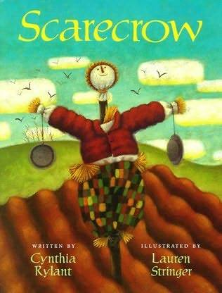

+-----------------+----------------------------+----------------------+
| Craft           | Example                    | Reason               |
+=================+============================+======================+
| Descriptive     | Whole story                |                      |
| lang.           |                            |                      |
+-----------------+----------------------------+----------------------+
| Voice           | Lyrical prose              |                      |
+-----------------+----------------------------+----------------------+
| Repetition      | *His hat is borrowed, his  | Emphasis             |
|                 | suit is borrowed, his      |                      |
|                 | hands are borrowed, even   |                      |
|                 | his head ...*              |                      |
+-----------------+----------------------------+----------------------+
| Simile          | *He has watched a spider   | Using figurative     |
|                 | work for hours making a    | language to help     |
|                 | web like lace.*            | description.         |
+-----------------+----------------------------+----------------------+
| Unusual verbs   | *The earth has rained and  | Shows passing of     |
|                 | snowed and snowed and      | seasons              |
| Use of and      | blossomed and wilted and   |                      |
|                 | yellowed and greened and   | Instead of comma.    |
|                 | vined itself all around    |                      |
|                 | him.*                      |                      |
+-----------------+----------------------------+----------------------+
| Ellipses        | *The scarecrow is thinking | Slows time.          |
|                 | his long slow thoughts...* |                      |
+-----------------+----------------------------+----------------------+
| Hyphenated Adj. | *Pie-pan, button-borrowed* |                      |
+-----------------+----------------------------+----------------------+

**Scarecrow Cynthia Rylant**

His hat is borrowed, his suit is borrowed, his hands are borrowed, even
his head is borrowed. And his eyes probably came out of someone's
drawer. But a scarecrow's life is all his own.

It takes a certain peace, hanging around a garden all day. It takes a
love of silence and air. A liking for long, slow thoughts. A
friendliness towards birds. Yes, birds. Crows, grackles, starlings,
jays. Ask them how they feel about a scarecrow, and they'll say,
"Lovely." They ignore the pie-pan hands and the button eyes and see
instead the scarecrow's best gift: his gentleness. They line up on his
arms and can chat all day.

He knows he isn't real. A scarecrow understands right away that he is
just borrowed parts made to look like somebody.

But he knows this, too: that there is a certain wonder going on around
him. Seeds are being planted, and inside them there are ten-foot-tall
sunflowers and mammoth pumpkins and beans that just go on forever. And
though the scarecrow knows that he can as quickly be turned back into
straw and buttons as he was turned into a man, he doesn't care.

He has been with the owls in the evening and the rabbits at dawn. He has
watched a spider work for hours making a web like lace. He has seen the
sun tremble and the moon lie still.

The scarecrow doesn't care what he is made of or how long he might last,
for he has been a witness to life. The earth has rained and snowed and
blossomed and wilted and yellowed and greened and vined itself all
around him. His hat has housed mice and his arms have rested birds. A
morning glory has held tight to his legs and a worm is living in his
lapel. There is not much else a person might want, and the scarecrow
knows this. So he doesn't mind that there is always a smile on his face
or that his eyes are always open. He doesn't mind being up high. He
doesn't mind staying there.

The wind is brushing his borrowed head and the sun is warming his
borrowed hands and clouds are floating across his button-borrowed eyes.
The scarecrow is thinking his long, slow thoughts ...

... and soon, birds will be coming by.

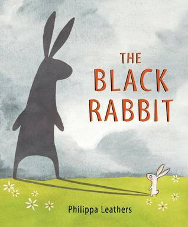

In this clever picture book, a debut author-illustrator introduces a
plucky rabbit and the new companion that he just can't shake.

Rabbit has a problem. There's a large black rabbit chasing him. No
matter where he runs --- behind a tree, over the river --- the shadowy
rabbit follows. Finally in the deep, dark wood, Rabbit loses his nemesis
--- only to encounter a real foe! Kids who like to be in on the secret
will revel in this humorous look at shadows and friendship, brought to
light by a talented animator.

**Reading Strategies:**

Prior Knowledge

Making Connections

Text-to-Text Connection. Read Moonbear's Shadow by Frank Asch and
compare to Black Rabbit. Use a Venn Diagram to compare and contrast the
two stories.

Text-to-Self Connection: Partner Talk -- *talk about a time when you
were scared.*

Making Predictions

Questioning

Inferring

Visualising

**Writing Craft:**

> Ideas: Students can write about a time when they were scared or when
> they did something brave.\
> Fluency: Variety of sentence length. Sentence fragments.

Punctuation: Talking marks.

*When it comes to teaching quotation marks, it should be about
understanding why an author uses dialogue and therefore actually needs
quotation marks. Understanding why we use quotation marks is more than
recognising that a person is talking. In order for students to
understand why and how to use quotation marks, we have to show them why
an author would want to use quotation marks. The instances in this book
when the rabbit talks to the big rabbit really show his emotion.*

Exclamation marks.

Ellipses

Strong Verbs

**The Black Rabbit**

**Black Rabbit, the Copycat** from Candlewick Press

Read Aloud:

Questions:

Who (or in this case, what) is the Black Rabbit?

Why was Rabbit scared of the Black Rabbit?

Ask the children if they have ever played with their own shadow or made

shadow puppets. Discuss the reason why the Black Rabbit was sometimes
behind Rabbit and at other times in front of Rabbit.

Discuss the fact that the Black Rabbit is a copycat: when Rabbit runs,
so does the Black Rabbit, and so on. Place the children in pairs and
have one child be Rabbit and the other the Black Rabbit. Explain that
the child who is the Black Rabbit should copy all the movements of the
child who is Rabbit. Then have each pair switch roles.

### The story behind the shadow

### *Shadows are magical things; they follow you around everywhere, they come in all kinds of shapes and sizes, and when you\'re just a small rabbit they can be pretty scary! Philippa Leathers tells us about the inspiration for her gorgeous new picture book The Black Rabbit\...*

### The main character in my picture book The Black Rabbit originated from an animation I made years ago at college. A small white rabbit only had a small supporting role, but I liked him so much I wanted to use him in a story of his own. The way he was drawn with short, stumpy little legs meant he moved in a certain way. I loved the way he ran, his short legs meaning he comically wiggled from side to side and had to put in a lot of effort. 

### It can be such a long process to get the story right and sometimes I will go back again and again revisiting ideas. Ideas are all around us, but it can be hard to recognise them and after a long time spent looking for the plot idea for The Black Rabbit, one day it just popped into my head. I have my own two little house rabbits who are always together, following each other around. They are easily spooked and can jump at the smallest noises or movements. I had been drawing Rabbit running in different situations when the saying -scared of your own shadow popped up. I then wondered what would happen if there was real danger?

### I find it easier to write and illustrate the book together and try to balance the words and pictures. If the pictures show something, this does not need to be repeated in the text, which I like to keep very minimal. There needs to be a good interaction between the two. If the story can be told in a better way with a picture then the text can be as minimal as possible.

### Illustrating The Black Rabbit was a bit of a challenge at times as my baby daughter was only a few months old and I had to pick up my paintbrush whenever she napped. The illustrations are drawn with pencil and then painted mainly with watercolour but I use ink and coloured pencils too- anything I think will work best and then I tweak the final illustration a little digitally.

### 

### The story The Black Rabbit is about a rabbit who is afraid of his own shadow, seeing it as a large frightening creature who follows his every move. Rabbit tries to escape this large black rabbit and eventually in the deep, dark wood, manages to do so, only to encounter something more dangerous.... I hope you like it.

### 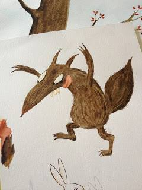

### 

###  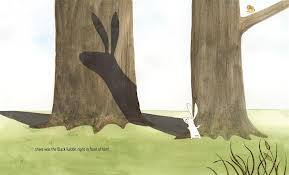

### 

### 

### 

### 

### 

### 

### 

### 

### 

### 

### 

### 

### 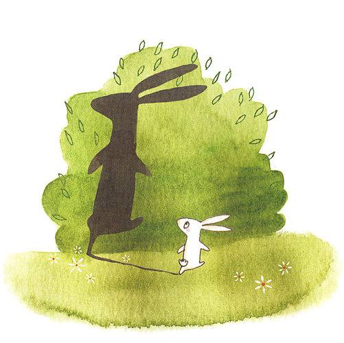

### 

### 

### 

### 

### 

### 

### 

### 

### 

### 

### 

### 

### 

### 

### The Black Rabbit Philippa Leathers

Rabbit woke up one morning and stepped out of his burrow into the bright
sunlight. It was a beautiful day. But something was wrong. He was not
alone. Rabbit was scared.

"Go away, Black Rabbit!" he cried. But the Black Rabbit did not move.

Rabbit ran. But the Black Rabbit was right behind him. Rabbit ran even
faster.

*The Black Rabbit won't find me here!* thought Rabbit, and he hid behind
a tree. But when Rabbit stepped out from behind the tree ...

there was the Black Rabbit right in front of him!

*Maybe he is not a good swimmer like me,* thought Rabbit, and he jumped
into the river and swam to the other side.

But as he pulled himself up onto the bank ...

the Black Rabbit climbed out of the water, too!

"What do you want?" cried Rabbit, trembling. "Why are you following me?"

But the Black Rabbit did not reply.

Rabbit began to run again, faster than he had ever run before --
straight into the deep, dark wood.

The forest was dark and quiet. The Black Rabbit was nowhere to be seen.
With a sigh of relief, Rabbit sat down and nibbled a carrot ...

until he noticed two eyes shining brightly in the dark.

*OH, NO,* thought Rabbit. *The Black Rabbit has found me.*

But it was NOT the Black Rabbit. Rabbit ran as fast as he could out of
the deep, dark forest, with Wolf close behind him. Then he tripped!

Rabbit scrambled to his feet, but it was too late. He shut his eyes
tight and waited for Wolf to attack ....

But nothing happened.

Because there, standing in the sunlight behind Rabbit, was the Black
Rabbit.

Rabbit smiled, and somehow he knew that the Black Rabbit was smiling
back.

Hand in hand, they bounced off across the field.

