**Voice**

> **(6)**

{width="4.6875in"
height="3.5833333333333335in"}

> **Voice & Personification 2**
>
> 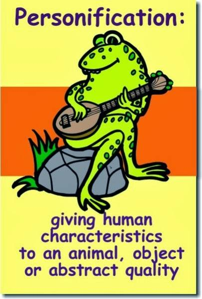{width="4.21875in"
> height="6.25in"}

{width="2.166606517935258in"
height="1.65625in"}

**Voice 6**

**Voice & Personification 2**

The Wolf Story Toby Forward

Memoirs of a Goldfish Devin Scillian

Help Me, Mr Mutt! Janet Stevens

Expert Answers for Dogs With People Problems

The Pigeon Finds a Hot Dog Mo Willems

Good Dog Maya Gottfried

The Wolf Who Cried Boy Bob Hartman

Goodnight Already! Jory John

I Want My Hat Back Jon Klassen

This is not My Hat Jon Klassen

Good Little Wolf Nadia Shireen

We Are In A Book! Mo Willems

Arnie the Doughnut Laurie Keller

Stellaluna Janell Cannon

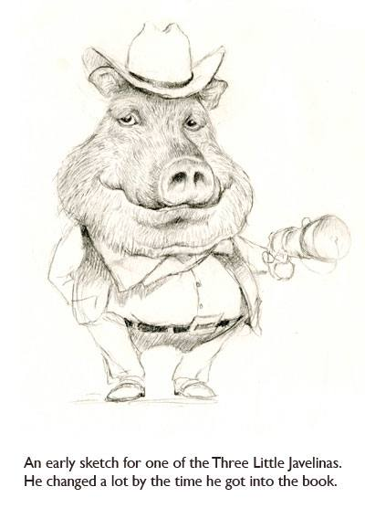{width="2.5in"
height="3.475in"}

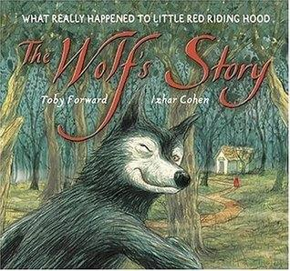{width="3.3125in"
height="3.1041666666666665in"}

**The Wolf\'s Story: What Really Happened to Little Red Riding Hood**

**by Toby Forward**

Readers will love second-guessing this funny, fractured fairy tale that
replays the story of Little Red Riding Hood from the poor maligned
wolf\'s point of view.

No, please. Look at me.

Would I LIE to you?

It was the old woman who started it.

Everyone knows there are at least two sides to every story, and if you
believe in the big-eared, sharp-toothed villain of LITTLE RED RIDING
HOOD, there\'s a logical explanation for everything. As our antihero
tells it, it all starts with the helpful wolf doing odd jobs for Grandma
(are you sure you don\'t want to sit a little closer?). How was he to
know that the spoilt Little Red would come along and ruin a good working
relationship? Zooming in dramatically from strategic angles, the amusing
illustrations offer visual clues that this is a story to be taken with a
grain of salt - and a lot of giggling.

**Writing Challenge:**

Tell Red's tale from the mother's or the grandmother's point of view.

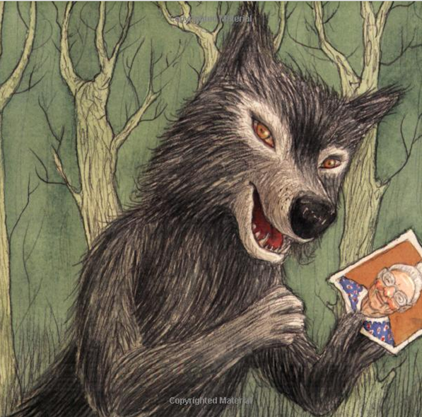{width="6.21875in"
height="6.145833333333333in"}

**What Really Happened to Little Red Riding Hood**

**The Wolf's Story**

**Toby Forward**

NO, PLEASE. Look at me. Would I LIE to you? It was the old woman who
started it. I did *nothing* wrong. Would I? We hit it off from the
beginning. Not everyone likes a wolf, do they? Look at *you.* You're not
certain.

Would you like to come and sit a little closer while I tell you about
the kid? I don't bite. No? Sure? Okay. Up to you.

Any way, I did odd jobs for the old woman. Called her *Grandma.* We were
close.

I put up shelves, did the shopping, tidied the garden. I *even* altered
her clothes, sewed on buttons -- that sort of thing.

I'm versatile! Sort of a new wolf. Vegetarian cuisine a specialty. If I
eat any more lettuce, I'll turn green. But that's too much information.

Are you *sure* you wouldn't like to sit just a little closer?

Every week, the kid came, with a big basket of toffee. I tell you, that
toffee was so bad it made Grandma's teeth stick together. And you don't
want toffee messing up your false teeth.

But Grandma looked forward to seeing the kid. She even made her a red
cape, so she could see the kid coming.

Did anyone ever make *me* a cape?

Me, I didn't like the kid being there. She *never* spoke to me. She
seemed nervous. Can you believe that? When Little Red was there, I felt
left out.

I tried to join in. I even offered to eat the toffee, and that stuff
could ruin a wolf's good teeth! So you can see how I tried.

*But they just ignored me.*

The day it happened was like this -- I saw the kid coming with her big
basket of toffee. I was looking for fresh herbs in the forest, and I
*tried* to pass the time of day with her. But she pretended not to know
me and hurried on. That's the sort of kid she is.

*Like I'm frightening? Eh?*

Then I scooted back the quick way to warn Grandma to hide her teeth from
the toffee. The kid always took a long time to get there. You know how
*slow* kids are. When I got back, Grandma was reaching for her best
dress in the wardrobe and couldn't reach the hook.

*And this is the part where it all went wrong.*

I tried to help her get it, but she fell over, right into the wardrobe.
And, you know how it is -- Grandma got a teeny tiny bump on her head
that knocked her cold. And the kid was banging on the door.

All right. I panicked. It looked bad. Not everyone trusts a wolf. I
thought they might say I'd done something bad to Grandma. ME?

Anyway, I shut the wardrobe, put the dress on -- sort of thought I could
cover it up, and pretend to be Grandma till she was better.

I have to admit, I don't have the best legs for a dress. So I jumped
into the bed. Anyone would have thought I was Grandma.

Then the kid came in and started acting strange. She was pretending to
be scared again, and she wouldn't come close.

"*Oh, Grandma,"* she said. "What BIG eyes you have."

"Got rid of my glasses," I told her. "I've got these new contacts. They
really smart when you first put them in -- they'd make *anyone's* eyes
look big*."*

It was the first time we'd had a talk, and she wasn't that bad, really.
Looked good enough to eat, if you know what I mean.

*"Oh, Grandma,"* she said. *"What BIG ears you have."*

Now, these are good ears. But I have to admit, they aren't a lot like
Grandma's, and, of course, they're pretty furry as well.

"Oh, these old things," I said, and changed the subject.

*"Oh, Grandma,"* she said. *"What BIG teeth you have."*

And this is what made it worse \....

She was about to pop one of her sticky toffees into my mouth. And I
couldn't stand that, so I leapt out of bed, and it may have looked as
though I was going to eat her or something. Then she started screaming.

"*WOLF! WOLF! You've eaten my grandma!"*

Do I *look* like the sort of wolf who goes around eating grandmas?

It got worse. The door swung open. There was a woodsman the siz of a
tree.

*With an axe!*

I shouted for help. But Grandma was still out cold in the wardrobe. She
would tell you the truth. She really would.

The woodsman took a swing at me, and I was *this* close to being a fur
coat!

I jumped out of that window, with the sound of the axe CRASHING down
behind me.

I ran all the way to town. And I have to tell you -- a wolf in a dress
is an embarrassed wolf! People were laughing, and that's not nice.

Anyway, thanks for listening. And if you ever want any odd jobs done
around the house, just get in touch. Here's my card. I'm cheap, I'm a
neat worker, completely trustworthy, and I won't make a meal of it!

*No, please.* Look at me. *Would I lie to you?*

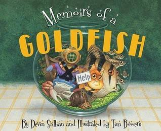{width="3.3125in"
height="2.7083333333333335in"}

With his bowl to himself, Goldfish loves his life\...until one day\...

A personal account from a goldfish on life in his bowl as other
intruders crowd him.

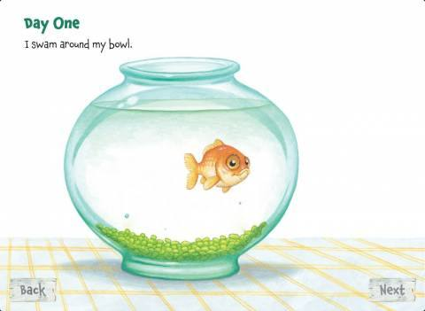{width="5.0in"
height="3.65625in"}

**Discussion Questions:**

- Can you predict the story from the cover?

- What solution can you think of to fix the fishes' problem of little
  space?

- How can the fish get along better?

- Did the goldfish really see his reflection? If not, who was it?

- How would you feel if you had to share your space with a bunch of
  people?

- How would you feel if you had the bowl to yourself again?

- Why were the fish happy in the end?

**Writing**

Voice: Read aloud Memoirs of a Goldfish and discuss how the author found
the voice of a goldfish to really craft the story. The NorthWest
Regional Education Laboratory (NWREL) defines voice as, "the heart and
soul, the magic, the wit, along with the feeling and conviction of the
individual writer coming out through the words. How would the voice of
the book sound different if the author had chosen an iguana or hermit
crab to write his memoirs? Read aloud and discuss more books with great
voice (Doreen Cronin's Diary of a Fly, Diary of a Worm, and Diary of a
Spider are great examples). Students write memoirs from the point of
view of their own pet. If they don't have a pet, have them choose an
animal they know really well.

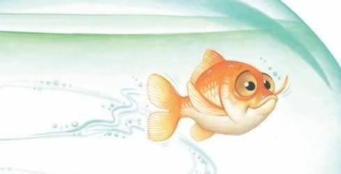{width="5.104166666666667in"
height="2.6041666666666665in"}

**Memoirs of a Goldfish Devin Scillian**

**Day One**

I swam around my bowl.

**Day Two**

I swam around my bowl. Twice.

**Day Three**

I swam around my bowl.

I thought about taking a nap.

But fish don't sleep.

So I swam around my bowl.

**Day Four**

I got some company today.

I don't like the looks of him one bit.

He doesn't say anything. He just bubbles.

**Day Five**

Mr Bubbles still hasn't said a word.

Hew just looks at me. I said "Hello" today.

And he said, "Ggggllllggggllll."

He's creepy.

**Day Six**

Today my bowl looks like a garden.

There are a bunch of plants in here now.

I guess I'll have to water them.

Great.

**Day Seven**

Mr Bubbles and I now have company. He's a snail.

He says his name is Mervin and he likes to eat the

slime off the inside of the bowl.

He's disgusting.

**Day Eight**

Things are getting very crowded. While watering the plants,

I met a crab named Fred. I offered him my fin and he nearly cut it off.

Even Mr Bubbles is afraid of him. Fred says I should stay on my side

of the bowl. "Look," I said, "the whole bowl is my side of the bowl."

He snapped his claw and Mervin fainted.

I gotta get out of here.

**Day Nine**

That does it. My bowl now contains

a sunken pirate ship, two guppies named

Rhoda and Clark, and an angelfish named

Cha-Cha who says she's from Hollywood.

I can't turn around without bumping

into something.

At least Mervin is happy. There's more

gunk on the side of the bowl every day.

**Day Ten**

This is ridiculous.

Clark told me they're going to have babies soon.

Like there's room for THAT.

Fred knocked Mr Bubbles over

and he became tangled in the plants.

Cha=Cha said she couldn't help with Mr Bubbles

but needed me to apply her sunscreen.

The sides of the bowl are covered in slime and

Mervin says he's too full to eat any more.

Yuck.

**Day Eleven**

I'm a nervous wreck. Trying to avoid Fred, I turned

around quickly this morning and came face to face with my

reflection in a mirror. I nearly jumped out of my gills.

I don't even look like myself anymore. I need to relax.

**Day Twelve**

I've had it. Rhoda and Clark were racing

around the bowl, Fred was fighting with

Mr Bubbles, Mervin kept belching, and

Cha-Cha told me I was standing in her light.

I just lost it.

**"This is my bowl!" I screamed.**

**"I want my bowl back!"**

**Day Thirteen**

Today I got my wish. Sort of. With a whoosh, and a splash,

and a clank, and a plunge, I was suddenly in a very tiny bowl

of clear, pure water. Ahhh. It was small, but it was all mine.

It was heavenly. I swam around my new bowl.

Twice.

But I started to wonder. What had happened to everyone?

When I last saw Mr Bubbles, he was tangled in green. Who would help him?

Poor Mervin was probably sick as a dogfish. He needs me.

Cha-Cha will get a sunburn without me around.

What about Rhoda and Clark? Did Rhoda have her baby guppies?

There are probably a thousand of them!

They need me to make guppy bottles and change guppy diapers.

Even Fred needs me. I'm the only one who can really talk to the crabby
guy.

Have they even noticed I'm gone? Does anyone miss me?

I started to cry. And that's not easy for a fish to do.

**Day Fourteen**

After a long, sad night there was a whoosh, and a splash,

and a clank, and a plunge, and I was suddenly sprayed

in the face by bubbles.

Mr Bubbles gurgled a happy tune. Rhoda and Clark raced by

me like two speedboats, followed by twelve of the cutest

baby guppies you've ever seen. Mervin waved his tail at me

from the nice clean glass of our enormous tank. Cha-Cha sat

happily beneath an umbrella.

I think even Fred missed me.

We were all back together, and I looked

around and realised I was part of a

big family. I guess I must have smiled

because Clark said, "You look happy."

I wanted to see for myself.

"Where's the mirror?' I asked.

"What mirror?" asked Clark.

"We don't have a mirror," said Fred.

No mirror? No wonder I didn't look like myself.

It wasn't me I was seeing.

Her name is Gracie, and she's the colour

of a fresh tangerine. She's a Pisces

just like me. And today we're going to

swim around the tank together.

**Twice**

**Devin\'s Biography**

One wonders what Devin Scillian puts on an application that asks for his
occupation. Journalist, best-selling author, songwriter, musician \-\--
they all fit.

{width="4.583333333333333in"
height="3.6979166666666665in"}

As a journalist, Devin Scillian brings national and international
reporting experience to his position as anchor of Detroit\'s top-rated
newscast, Local First News at 11 PM and Local First News at 5 & 6 on
WDIV-TV. His Sunday morning news program Flashpoint has become required
viewing for those in the know. And he\'s been honoured for his work both
at home and abroad.

{width="4.583333333333333in"
height="3.6979166666666665in"}

Outside of the newsroom, Devin\'s passions have taken him into other
creative worlds. A popular author of children\'s books, he has inspired
children across the nation with his compelling and patriotic stories.
Devin is also an accomplished country artist, with two albums and a
Detroit Music Award under his belt.

{width="4.3125in"
height="3.4791666666666665in"}

After graduating from the William Allen White School of Journalism at
the University of Kansas in 1985, Devin began his career at WIBW-TV in
Topeka. His career took him to WAND in Decatur, Illinois, KLTV in Tyler,
Texas, and KFOR in Oklahoma City before he arrived in Detroit. He joined
WDIV in August 1995 as a reporter and moved into the anchor position in
1996.

Devin\'s news assignments have taken him from Sydney, Australia to St.
Peter\'s Square at the Vatican; from the Red Sea to Moscow; from
Jerusalem to Siberia. His interview subjects range from Willie Nelson to
President Bush. He\'s covered terrorism at the World Trade Centre, the
assassination of Yitzhak Rabin, the U.S. invasion of Haiti, the birth of
DaimlerChrysler, the disaster of Hurricane Andrew, the arms embargo
against Iraq, and the collapse of the Soviet Union. The Olympic Games
have taken Devin to Sydney, Salt Lake City, and Athens where he covered
the Summer Games for NBC. Most recently, he travelled to China to
explain the crisis in American manufacturing. His documentary \"The
China Syndrome: Where Did All the Jobs Go?\" won an Edward R. Murrow
Award, one of the highest honours in television news.

{width="4.583333333333333in"
height="3.6979166666666665in"}

Devin gained wide recognition for his coverage of the 1995 bombing of
the federal building in Oklahoma City. As anchor for KFOR-TV in Oklahoma
City, his marathon reporting at the anchor desk was carried all over the
country by NBC and all over the world by CNN. The saddest and most
challenging day of his career won him the Emmy Award for \"Best
Anchor,\" one of ten Devin has received. The bombing coverage he led at
KFOR earned the station the distinguished Peabody Award.

Devin, his wife Corey, and their four children make their home in Grosse
Pointe, Michigan.

{width="4.583333333333333in"
height="3.6979166666666665in"}

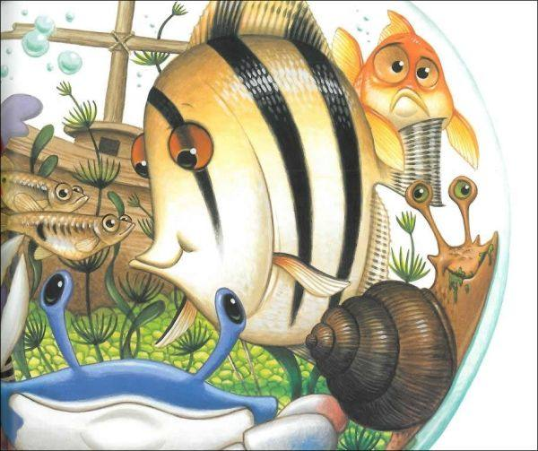{width="6.25in"
height="5.239583333333333in"}

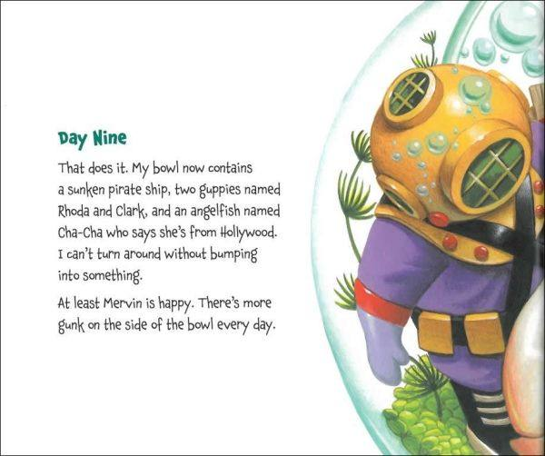{width="6.25in"
height="5.229166666666667in"}

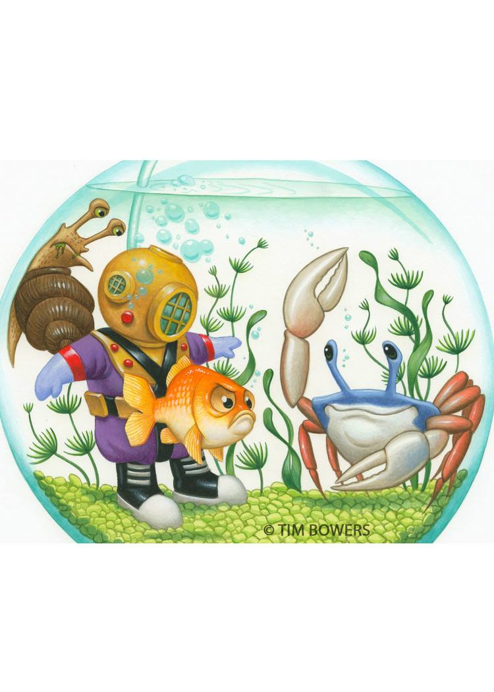{width="7.083333333333333in"
height="9.916666666666666in"}\
**Tim Bowers**

Tim Bowers was born in Troy, Ohio, where he began drawing at an early
age. His career in illustration grew from his childhood interest in art
and an active imagination. Even then, his artwork reflected an ability
to tell stories, using humorous characters.

Bowers continued his art education at the Columbus College of Art &
Design (Ohio), where he would pursue a career in illustration. During
those years, he was introduced to the work of many great illustrators of
the past, including Howard Pyle, N.C. Wyeth, Maxfield Parrish and Norman
Rockwell. He was influenced by the work of popular illustrators of that
time, including Mark English, Bob Peak and Bernie Fuchs. This is also
when he began collecting children\'s books and admiring the work of
Maurice Sendak, Wallace Tripp and Etienne Delessert. Such a diverse
group of artists inspired Tim to explore his interest in both decorative
and realistic imagery. He graduated from C.C.A.D. with a Bachelor of
Fine Arts degree.

Tim worked in a Dayton, Ohio illustration studio after graduating from
college and gained valuable experience creating artwork for corporations
such as Procter & Gamble, Kenner (toys), Huffy (bicycles) and Wendy\'s.
His drawings were also used for local television commercial storyboards
and his cartoon characters were used to promote various products.

Bowers left the Dayton studio and was soon recruited by Hallmark Cards
in Kansas City, Missouri. There, he worked in several humor groups and
helped launch the popular Shoebox Greetings card line. It was during
those five years in Kansas City, that Tim also illustrated his first
three children\'s books.

Bowers has illustrated over thirty five children's books, including The
New York Times bestseller, Dream Big, Little Pig! written by Kristi
Yamaguchi and Dinosaur Pet by Neil Sedaka and Marc Sedaka. His work has
been published in children\'s magazines, his illustrations have been
used on a wide variety of products and his characters have appeared on
hundreds of greeting cards.

Tim Bowers and his wife live in central Ohio. They are the parents of
four grown children and are proud grandparents.

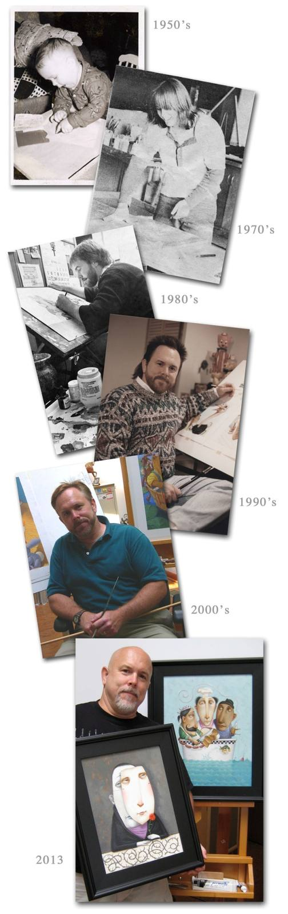{width="2.7916666666666665in"
height="8.854166666666666in"}

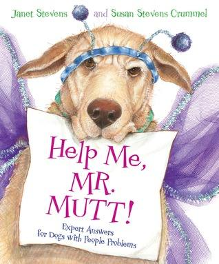{width="3.3125in"
height="3.9895833333333335in"}

**Help Me Mr. Mutt! Expert Answers for Dogs With People Problems**

**Janet Stevens**

Dogs write to Mr. Mutt for advice for their people problems and Mr. Mutt
and the cantankerous cat supply their answers. The different voices of
the dogs, Mr. Mutt and the Cat develop the mood of the book.

Responding to disgruntled dogs nationwide, Mr. Mutt, Canine Counsellor,
has solutions to the most sticky dilemmas. But Mr. Mutt has his own
problem to solve: the cat (aka The Queen), who has her own idea of who's
in charge. Now Mr. Mutt is the one who needs help\--quick!

Through letters and newspaper clippings\--and with plenty of their
trademark humour\--Janet Stevens and Susan Stevens Crummel give voice to
despairing dogs everywhere.

Study the voice of the various dogs that write Mr. Mutt. Think about
using for Readers' Theatre, graphs, and letter writing.

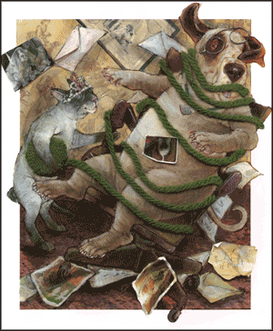{width="3.125in"
height="3.7916666666666665in"}

**Writing:**

Letter from dog bothered by its owners behaviour (and the household
cat), including some kind of chart, table, or graph;

Response from Mr. Mutt giving the dog ideas about how to assert
him/herself as the alpha in the household;

Haughty response from The Queen, the cat who lives under Mr. Mutt's
desk.

Follow the **format of the book** with:

A letter from a dog with problems, including a P.S. about a cat.

A reply from Mr Mutt in letter format, with a P.S. comment about cats.

A note from the cat with a P.S. about the behavior of cats.

Name: \_\_\_\_\_\_\_\_\_\_\_\_\_\_\_\_\_\_\_\_\_\_\_

Name of your dog or a fictitious dog
\_\_\_\_\_\_\_\_\_\_\_\_\_\_\_\_\_\_\_\_\_\_\_\_\_\_

What would your dog write if he sent a letter to a doggie advice column?

What advice would you as the columnist give your dog?

**Help Me, Mr Mutt!**

**Expert Answers for Dogs with People Problems.**

**Janet Stevens**

**DO YOU HAVE**

**PEOPLE PROBLEMS?**

**ARE YOU ALWAYS**

**IN THE DOGHOUSE?**

**Don't yelp, get help!**

**100 Bonaparte Blvd.**

**Dogwood. DE 19091**

**Photographs helpful. (A picture tells all.)**

**Speedy replies guaranteed,**

**complete with diagrams and tips.**

+------------------------------------------------------+
| January 17                                           |
|                                                      |
| Dear Mr Mutt,                                        |
|                                                      |
| Do I look fat?                                       |
|                                                      |
| My people put me on a diet!                          |
|                                                      |
| They're starving me!                                 |
|                                                      |
| I'm so hungry my stomach growls louder than I growl. |
|                                                      |
| I'm wasting away. Soon there will be nothing left of |
| me.                                                  |
|                                                      |
| I'm so weak, I don't think I can finish writing this |
| letter\...                                           |
|                                                      |
| Help me, Mr Mutt!                                    |
|                                                      |
| - Famished in Florida                                |
|                                                      |
| P.S. My people give the fat cat fancy food from a    |
| tiny can.                                            |
|                                                      |
| All I get is tasteless gravel from a giant sack. Is  |
| that fair?                                           |
+======================================================+

+-------------------------------------------+
| Mr Mutt, Canine Councellor                |
|                                           |
| 100 Bonaparte Blvd.                       |
|                                           |
| Dogwood, DE 19091                         |
|                                           |
| January 22                                |
|                                           |
| 81 Canine Court                           |
|                                           |
| Dogtona Beach. FL 33133                   |
|                                           |
| Dear Famished,                            |
|                                           |
| Pull yourself together. You do not look   |
| fat.                                      |
|                                           |
| Your tummy isn't even dragging on the     |
| ground!                                   |
|                                           |
| Study the food pyramid. Dogs require at   |
| least eight servings per day of           |
| scrumptious food.                         |
|                                           |
| Your people do not understand this, so    |
| you have to take matters into your own    |
| paws.                                     |
|                                           |
| Look on the countertops.                  |
|                                           |
| Big dogs, this is easy.                   |
|                                           |
| Small dogs, use teamwork.                 |
|                                           |
| Don't forget the trash. Be sure to dump   |
| it out and spread it around for the best  |
| selection.                                |
|                                           |
| If there's a baby in the house, head for  |
| the high chair and open wide. It's        |
| raining food!                             |
|                                           |
| And don't forget cleanup time. People     |
| call it kisses. We call it dessert.       |
|                                           |
| Finish off your gourmet meal with a cool  |
| drink of water.                           |
|                                           |
| Good luck, famished.                      |
|                                           |
| And remember, you are TOP DOG!            |
|                                           |
| Sincerely,                                |
|                                           |
| Mr Mutt                                   |
|                                           |
| P.S. Cats are spoilt rotten.              |
|                                           |
| It's never fair.                          |
+===========================================+

**Watch it, Muttface.**

**Cats are not spoilt rotten.**

**Especially me.**

**I am royalty.**

**I am The Queen.**

**P.S. The Queen would never**

**drink from a toilet.**

**February 23**

**Dear Mr Mutt,**

**Play, play. I love to play.**

**Every day. Every way.**

**"Go away!" my people say.**

**"Not today!"**

**What, no play?**

**They sit and watch TV.**

**Woe is me.**

**Sit, sit.**

**Watch, watch.**

**I'm bored.**

**Help me, Mr Mutt!**

- **Underplayed in Utah**

**P.S. Even our cat is a lazy bum.**

Mr Mutt, Canine Councellor

100 Bonaparte Blvd.

Dogwood, DE 19091

March 3

64 Hound Hwy.

Salty Dog City. UT 84248

Dear Underplayed,

I feel your pain. People used to play with their dogs

all the time.

Then came the crash: TELEVISION. Everything changed.

Try this. First pull the plug on that TV. Then chew the

cord in two. Those couch potatoes will be bored just like

you.

Now's your chance. Get their attention. Jump up and down.

Those potatoes will roll off that couch and out the door,

ready to play catch with you!

Remind your people: This is fun play.

Another reminder: This is not fun play!

Good luck, Underplayed.

And remember, you are TOP DOG!

Sincerely,

Mr Mutt

P.S. If you're bored, you can always play Chase the Cat.

**Hold your horses, Mutty Boy.**

**You're playing with fire.**

**Chasing The Queen can be hazardous**

**to your health.**

**P.S. Cats are not lazy bums. They just**

**need their beauty rest.**

May 19.

Dear Mr Mutt,

It's ridiculous!

Outrageous!

Preposterous!

Holidays are unbearable. First I'm a baby, next I'm a

bunny, now I'm an angel.

I'm NOT a baby or a bunny or a bride or an angel.

I'm a dog.

Where is my dignity? I'm the laughingstock of the block!

I'm in need of your assistance immediately!

Help me, Mr Mutt!

- Overdressed in Oklahoma

P.S. My people never dress up the cantankerous cat!

Mr Mutt, Canine Councellor

100 Bonaparte Blvd.

Dogwood, DE 19091

May 25

49 Ruff Road

Dogville, OK 73337

Dear Overdressed,

As this bar graph shows, dogs of all kinds are

subjected to this foolishness. Some more than

others.

In my expert opinion, you have three choices

(two bad, one good):

1.  Rip and Run. Rip off the costume and run

for your life. Consequence: Your people

will be mad -- you'll be in the doghouse.

2.  Play Dead. Consequence: Your people will be

worried -- and you'll be at the vet.

3.  Grin and Bear it. Smile and wear it.

Consequence: Your people will think you're adorable

-- even when you're gobbling the turkey.

The choice is up to you.

Good luck, Overdressed.

And remember, you are TOP DOG!

Sincerely,

Mr Mutt

P.S. How about this for a kitty costume?

Don't let the cat out of the bag!

**Back off, Muttbreath.**

**No one puts a bag on The Queen.**

**The Queen wears only a tiara.**

**Sometimes.**

**When she feels like it.**

**P.S. Cats are not cantankerous.**

**Cats are the sweet and gentle**

**supreme rulers of the universe.**

**June 7**

**Dear Mr Mutt,**

**I'm a barker. Hear me BARK!**

**Doorbell. BARK!**

**Mailman. BARK!**

**Thunder. BARK!**

**Telephone. BARK!**

**My people yell, "DON'T BARK!"**

**Then they tell me, "Do a trick! Speak! Speak!**

**For a treat!" Doesn't speak mean bark?**

**What do I do? To bark or NOT to bark?**

**That is the question.**

**Help me, Mr Mutt!**

- **Confused in Connecticut**

**P.S. The loudmouth cat gets to meow constantly.**

**Why isn't THAT a problem?**

Mr Mutt, Canine Councellor

100 Bonaparte Blvd.

Dogwood, DE 19091

June 14

36 Speakeasy Street

Dog Haven, CT 06460

Dear Confused,

Dogs bark. It's a fact. It's the way we communicate.

Would people tell a duck not to quack? A cow not to

moo? A donkey not to hee-haw?

So why do your people say, "Don't bark!" and then say,

"Speask!"? They are confused, not you!

It;s a brain thing. The dog brain is enormous. The

people brain is the size of a pea. That's why it's so easy

to fool people.

Have some fun. The next time your people say "Speak!"

look them in the eye and let out a big "MOOOOO."

They will be so surprised that they will drop the box of treats.

It's all yours! Grab it and run.

Seriously, it's a dog-eat-treat world. Bark when you're told to.

Do the tricks to get the treats. Follow this guide:

And if you feel the urge for some recreational barking,

choose your time wisely. Wait until your people leave,

then let it rip. Soon every dog in town will be barking up a storm.

Good luck, Confused.

And remember, you are TOP DOG!

Sincerely,

Mr Mutt

P.S. You can make up some new tricks on your own, like this one:

DUNK.

**You're all wet, Mutt Brain.**

**Don't even think of dunking**

**The Queen!**

**P.S. A meow is like music to**

**the ears. A lullaby. A symphony.**

July 19

Dear Mr Mutt,

I'm a biiiiig dog.

And I need a biiiiig bed.

A biiiiig people bed.

But my people say, "Get down!"

They make me sleep on a little doggie bed.

Most of me is on the cooold, haaard floor.

I can't sleep on the cooold, haaard floor.

I'm exhausted.

Help me, Mr Mutt!

- Sleepless in South Dakota

- 

P.S. Our snooty cat gets the fluffy, puffy, comfy bed.

Mr Mutt, Canine Councellor

100 Bonaparte Blvd.

Dogwood, DE 19091

July 26

25 Lazy Dog Lane

Doggie Doo Falls, SD 57575

Dear Sleepless,

You are not alone. In a recent poll, nine out of ten

dogs said that they definitely prefer to sleep on

the people bed.

Here's how you do it:

1.  Choose the right bed. Grown-up bed?

Too crowded. baby bed? Too small.

Kid bed? Just right.

2.  Choose the right time. Nose on bed.

Asleep? Check.

Crawl up. Asleep? Check.

Wiggle forward. Plop!

The kid's on the floor.

Bingo! The bed is yours.

Good luck, Sleepless.

And remember, you are TOP DOG!

Sincerely,

Mr Mutt

P.S. Use the fluffy, puffy, comfy cat bed for a pillow.

Better yet, use the flea-bitten cat for a pillow!

**Wake up and smell the catnip, Mutthead!**

**Fleas dare not touch The Queen.**

**Her majesty says if you ever want to sleep**

**again, you will not touch the cat or the**

**fluffy, puffy, comfy cat bed.**

**P.S. Cats are not snooty. We just have a superior attitude. A
cattitude.**

**P.P.S. Watch what you say. Don't make me come up there.**

**November 1**

**HOWDY, MR MUTT,**

**I'm a workin' dog. When I herd cows, I get mighty stinky.**

**I like stinky.**

**But somethin' awful's happened.**

**We moved to the city.**

**Now my people are always cleanin' and scrubbin' and**

**bathin' me.**

**I'm fixin' to move out if they don't quit throwin' me in**

**that tub. And this noisy contraption is suckin' up all my**

**dog hair!**

**Help me, Mr Mutt!**

- **Washed up in Washington**

**P.S. Look at my city neighbours. Will I end up like this?**

**P.P.S. I don't see my people bathing that dirty rotten cat!**

Mr Mutt, Canine Councellor

100 Bonaparte Blvd.

Dogwood, DE 19091

November 7

16 Prissy Pooch Parkway

Woof Woof, WA 98689

Dear Washed Up,

City folks are all clean freaks. Neatniks. Tidy-uppers.

They could scrub the spots off a Dalmatian!

If you don't want to end up like your neighbours, you

have to put your paw down right now! Get your smell back.

Work up a stink.

If your people get you in the tub, start shaking. They

will take off running. Jump out and follow. Shake, shake.

Down the hall. Shake, shake, shake. On the bed.

Shake it up, baby.

This will reduce your tub time to the proper amount.

Good luck, Washed Up.

And remember, you are TOP DOG!

Sincerely,

Mr Mutt

P.S. I don't know why people hate dog hair. I'm covered

with it and I like it!

People should use that noisy contraption to suck up cat hair --

while it's still on the dirty rotten cat!

**Are you nutso, Muttso?**

**I've had enough of your catty remarks.**

**Not another peep out of you.**

**The Queen is taking control.**

**You are officially out of business!**

+----------------------------------------+
| **ATTENTION**                          |
|                                        |
| **ALL DOGS**                           |
|                                        |
| **Mr Mutt is tied up right now.**      |
|                                        |
| **He can't help you and you can't help |
| him.**                                 |
|                                        |
| **THE QUEEN HAS TAKEN OVER**           |
|                                        |
| **You got a problem?**                 |
|                                        |
| **You're a dog.**                      |
|                                        |
| **That's your problem.**               |
|                                        |
| **Solve it yourself.**                 |
+========================================+

+-----------------------------------------------------------------------+
| **DOGS INVADE DOGWOOD**                                               |
|                                                                       |
| One hundred and one dogs descended on the quiet town of Dogwood       |
|                                                                       |
| today, barking and racing willy-nilly through the streets. Who they   |
|                                                                       |
| are, why they are here, and where they are going remain unanswered    |
|                                                                       |
| questions as the investigation continues. "We are sniffing around,"   |
|                                                                       |
| remarked Sheriff G.Shepherd. "We have some good leads, but are        |
|                                                                       |
| unable to comment at this time."                                      |
+=======================================================================+

+-----------------------------------------------------------------------+
| **CATastrophe!**                                                      |
|                                                                       |
| One hundred and one dogs, believed to be the pack spotted earlier,    |
|                                                                       |
| departed Dogwood this afternoon in hot pursuit of a lone cat.         |
|                                                                       |
| The cat, identified as The Queen, resided at the house of the famous  |
|                                                                       |
| canine councellor, Mr Mutt. "The dogs were apparently on a rescue     |
|                                                                       |
| mission," announced Sheriff G.Shepherd. "Mr Mutt is safe.             |
|                                                                       |
| Case closed."                                                         |
+=======================================================================+

+---------------------------------------+
| **MR MUTT**                           |
|                                       |
| **IS BACK IN BUSINESS**               |
|                                       |
| **Write to Mr Mutt, the expert for    |
| dogs with people problems.**          |
|                                       |
| **100 Bonaparte Blvd.**               |
|                                       |
| **Dogwood, DE 19091**                 |
|                                       |
| **Speedy replies guaranteed!**        |
+=======================================+

+-------------------------------------+
| **DO YOU HAVE**                     |
|                                     |
| **DOG PROBLEMS?**                   |
|                                     |
| **Write to The Queen,**             |
|                                     |
| **The expert for cats.**            |
|                                     |
| **9 Palace Place**                  |
|                                     |
| **The Catskills, NY 10801**         |
+=====================================+

+-----------------------------------------+
| **MISSING CAT**                         |
|                                         |
| **Answers to the name The Queen,**      |
|                                         |
| **Grey and white.**                     |
|                                         |
| **Last seen wearing tiara.**            |
|                                         |
| **Cranky but loveable.**                |
|                                         |
| **One of a kind.**                      |
|                                         |
| **Handle with care.**                   |
|                                         |
| **MR MUTT MISSES HER**                  |
|                                         |
| **(SORT OF.)**                          |
|                                         |
| **Please return ASAP to**               |
|                                         |
| **100 Bonaparte Blvd.**                 |
|                                         |
| **Dogwood, DE 19091**                   |
|                                         |
| **REWARD**                              |
+=========================================+

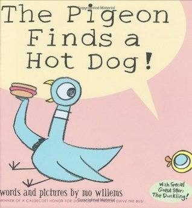{width="3.3125in"
height="3.6041666666666665in"}

**The Pigeon Finds a Hot Dog! Mo Willems**

When Pigeon finds a delicious hot dog, he can hardly wait to shove the
entire thing in his beak. But . . . then a very sly and hungry duckling
enters the scene and wants a bite. Who will be the more clever bird?

In this hilarious follow-up to the acclaimed Don\'t Let the Pigeon Drive
the Bus! Mo Willems has created another avian adventure that encourages
children to share even their most prized processed foods.

Mo Willems is a six-time Emmy Award-winning writer and animator for
Sesame Street and the head writer of Cartoon Network\'s Code Name: Kids
Next Door. The Pigeon Finds a Hot Dog! is the companion to Mo\'s first
children\'s book, Don\'t Let the Pigeon Drive the Bus! He is also the
author of Time to Pee!

The pigeon's crazy antics with the bird give great opportunities for
teaching point of view and voice. Other books in this series such as
Don't Let the Pigeon Drive the Bus! also work.

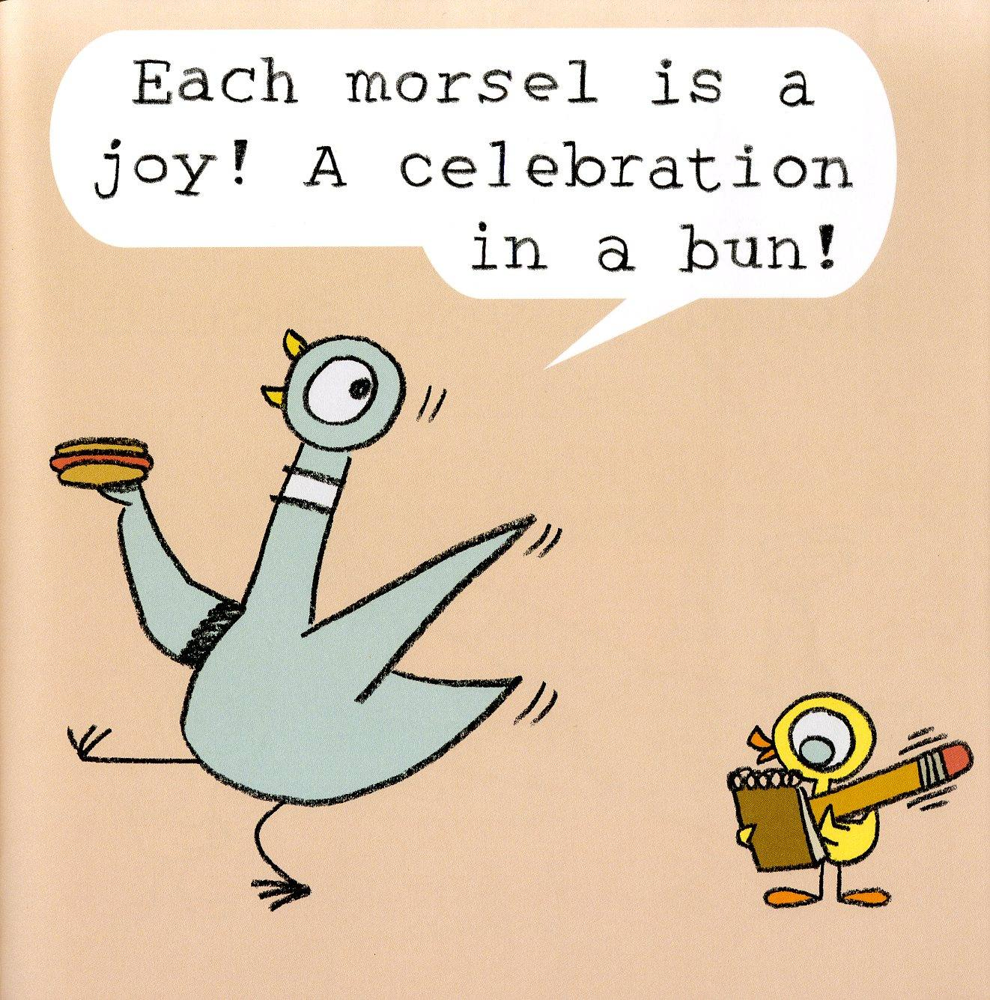{width="6.268055555555556in"
height="6.3296926946631675in"}

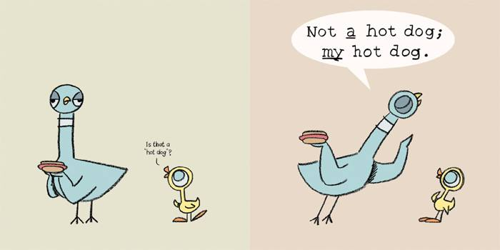{width="6.268055555555556in"
height="3.134027777777778in"}

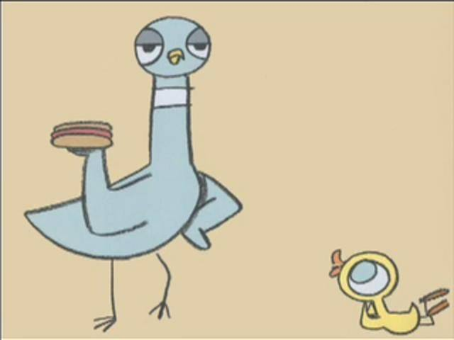{width="6.268055555555556in"
height="4.701042213473316in"}

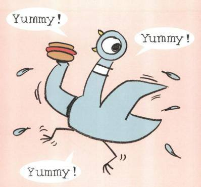{width="4.145833333333333in"
height="3.8541666666666665in"}

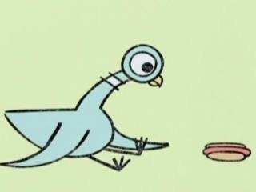{width="3.3333333333333335in"
height="2.5in"}

**The Pigeon Finds a Hot Dog! Mo Willems**

"Oooooh! A hot dog! Yummy! Yummy! Yummy!

Aaaaaaahhh \...

May I help you?"

"Is that a hot dog?"

"Not a hot dog; my hot dog. Aaaaaaahhh \... "

"I have a question. I've never had a hot dog before \... What do they
taste like?"

"Well, they are a taste sensation. Each morsel is a joy! A celebration
in a bun!

If you've never experienced the splendour of a hot dog, you should
really \...

Wait a second. This hot dog is mine. I found it!"

"Of course! Enjoy! Go ahead."

"Aaaaaaahh -- "

"Would you say that it tastes like chicken?"

"Can you believe this guy!?!"

"What \...?"

"It just tastes like a hot dog, okay!?"

"Okay! Okay! So it doesn't taste like chicken, then?"

"Oh, for Pete's sake!"

"Hey, I'm a curious bird."

"THAT'S IT!"

"It's my hot dog, right!? MINE! MINE! MINE!

This is UNBELIEVABLE! "Finders, keepers," is what I say!

'I'm a curious bird!' 'What do they taste like?' 'Blah, blah, blah!'

Yeah, RIGHT! I can't take it anymore! What am I supposed to do?"

"I think I've got an idea."

"You know, you're pretty smart for a duckling."

"Hmmm \... needs mustard."

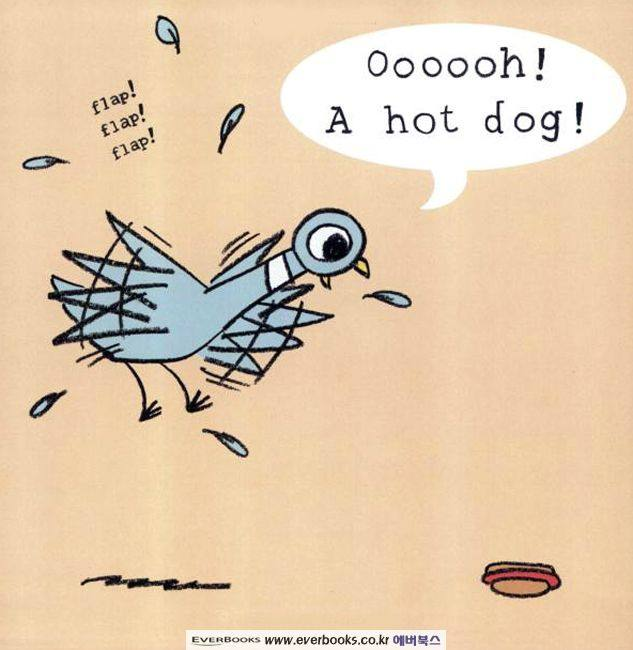{width="6.268055555555556in"
height="6.436392169728784in"}

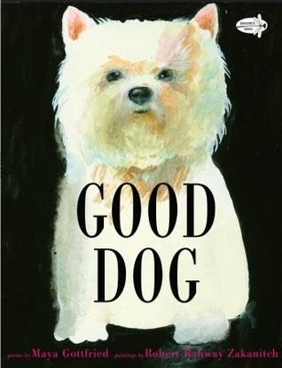{width="3.3125in"
height="4.322916666666667in"}

Good Dog by Maya Gottfried is a dog lover's book. Sixteen poems
characterise some of the world's most popular dogs people own as pets.
In fact, the dogs represented in Good Dog are the dogs one sees most
often that look like their owners! Each poem is written in the voice of
a particular dog. The voice of the dog is true to its character.
Accompanying the poems are paintings of dogs. Whimsical, but true to
life, Robert Rahway Zakanitch captures the essence of each dog. In the
paintings, each dog is set against a very dark, blackish background. The
dogs look directly at the reader as they sit, roll, or pant; each with a
doleful look on their faces. My best analysis of these paintings is that
the dogs are just downright cute!

The humour and sweetness depicted in the poems and the paintings are
appealing to children. The first poem is filled with commands to a
white, good-natured Westie, sitting attentively on the adjacent page:
"Sit / Stay / Fetch / Heel "(Gottfried 2005, p. 1). Turn the page and a
stout-bodied chow is the one giving commands, "Listen up! / It's time to
go. / Get the leash. / Let's hit the road" (p. 2). In the chow's poem,
he tells us that he has a bone to pick with a Chihuahua. That same
Chihuahua appears a few pages later talking about chasing that big dog!
(p. 7). Featured after the chow is a Pekingese whose poem is a memo to
his owner saying how sorry he is about the accident on the piano, the
hair on the suit, and the chewed up shoes (p. 5). The nice touch in the
paintings is that the breed of the dog is identified within the
painting; for example, below the portrait of the Pekingese, the word,
"Pekingese" is painted.

The poems match the paintings. In fact, if the poems and paintings were
mixed topsy-turvy, I believe they could be matched back up. None of the
poems have an "official" title; the title (the breed of the dog) is
written in the painting.

There is rhyme in some of the poems, (the "chow" poem), but the poems
are written mainly in free verse. There are instances of onomatopoeia in
the Pomeranian poem; dog sounds that children love, "A dog must GRRR!
And ARF! And WOOF!" (p.11). Alliteration appears in the same poem --
"powder puff" (p. 11) -- the Pomeranian is certainly a powder puff. In
his painted portrait, the little, round dog is exaggeratedly fat; a
circle of orange fluff.

My favourite poem is the Maltese's "wedding vow" poem.

Do you take this dog to be your friend?

Will you see her through tangles and mats?

Through dog days and kennel stays?

Do you promise to put down your book

when she sits upon your lap?

And be faithful to her, and her alone?

As long as you both shall live?

I do. (p. 15)

It's an excellent commentary on the commitment required between dog
owner and pet, and simply imaginative in its composition.

Review by Deri David

**Writing:** Write a poem in the voice of a breed of dog.

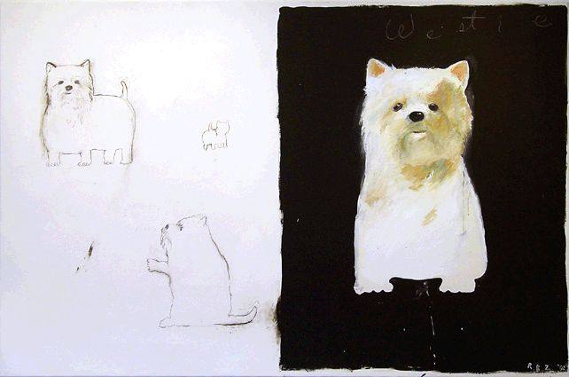{width="6.268055555555556in"
height="4.149413823272091in"}

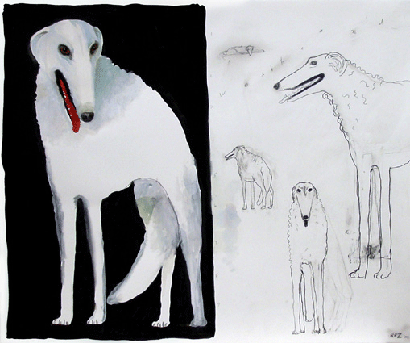{width="5.302083333333333in"
height="4.427083333333333in"}

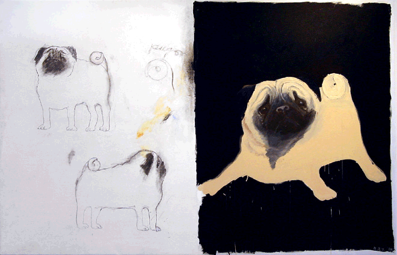{width="6.268055555555556in"
height="4.036247812773404in"}

**Westie**

Sit

Stay

Fetch

Heel

Lie Down

Roll over

Shake hands

Speak

Jump

Run

Beg

Right away,

no problem,

whatever you say.

A dog's work is never done.

**Chow**

Listen up! It's time to go.

Get the leash. Let's hit the road.

I've got a bone to pick with a Chihuahua.

And there's a coupla dachshunds that need a barking to.

Put down your paper already,

let's get this show on the road.

Throw me my stick,

I'm ready to go.

**Pekingese**

MEMO

To: My Person

From: Your Little Friend

Re: My Apologies

I'm sorry about the stain on the piano bench. Accident,

won't happen again.

And my most sincere regrets about the hair on that nice wool suit.

I feel terrible about chewing on your custom-made leather shoes. Though,

they were on the floor.

PS: Have you seen my chew bone? I was sure that I'd left it on your
pillow.

**Chihuahua**

I chased

that big dog,

over there,

I did.

Wait until

my owner's here.

He'll tell you like

it really is.

I chased that hound,

and then

he hid.

I may be small,

but I am swift.

Don't you mess with me.

**Springer Spaniel**

Mmm, mmm, mmm, scratching behind my ear.

Chasing that duck across the grass.

Swooshing and splashing in the pond.

In the sun.

Running and running and running.

Digging in the warm, dry dirt.

Tired, resting on a big blanket.

Beside you.

**Pomeranian**

You did it again!

And you promised.

You promised!

A dog must GRRR! And ARF! And WOOF!

And chase and jump and frolic.

Look at me!

Hair! Hair! Hair! I can barely see!

Now I'm as round as a powder puff.

This is just embarrassing.

**Corgi**

Oh, throw me my plush tomato!

Then I will gladly lie down by your feet.

I've been here by the door since the sun disappeared,

awaiting the sound of your key.

**Maltese**

Do you take this dog to be your friend?

Will you see her through tangles and mats?

Through dog days and kennel stays?

Do you promise to put down your book

when she sits upon your lap?

And be faithful to her, and her alone?

As long as you both shall live?

I do.

**Bulldog**

All I really want is a hug and a bone.

Is that too much to ask?

Maybe it's the snout \... or the snoring.

And the drool -- well, it dries.

But you know, don't you? That

beneath this tough exterior there thumps a gentle heart.

**Pug**

You aren't forgetting about dinner,

are you?

I know you were walking towards the door,

but you wouldn't leave without feeding me, would you?

There's a bag of food on the kitchen counter.

I could feed myself, you know, if you kept it on the floor.

**Collie**

For you, my dear, I will always be there.

I'll be in your dreams.

Curled up on your chair.

Through the dark night,

you need not be scared.

For you, only you,

I will always be there.

**Boston Terrier**

Oh yes, oh yes!

Well, first I went,

I went to the vet.

And yes, I was,

I was good.

And then, and then

we went to the park.

And yes, I ran.

I ran and ran!

And next, then next

I saw a cat!

And yes, I chased

and growled and barked.

I showed that cat.

So now! What now?

Oh yes, a kiss!

And still a scratch,

and then,

just then,

I'll lay

and

rest.

**Borzoi**

Many times I've paced this hall,

searching for my missing ball.

Many times you heard me sigh

and told me, "It will be all right."

Three full times I circled round

before I finally settled down.

**King Charles Spaniel**

WHAT ARE YOU DOING IN MY CHAIR!?

There, now that I've resumed my throne,

perhaps you could fetch my royal squeaky burger.

I'll forgive you this once,

but next time it's the doghouse for you.

**Scottie**

Look at the firld.

It's covered in snow.

See all my tracks!

The flakes on my nose.

Icy cold.

I don't care.

Let me dig

one more hole.

Then I promise I'll go back home.

**Mutt**

Patches

Fido

Pooch

Petunia

Buddy

Queenie

Lucky

Rex

Rover

Spot

Champ

Thor

Luna

Who's a good dog?

Me.

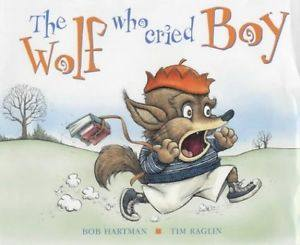{width="3.125in"
height="2.5520833333333335in"}

Little Wolf is tired of his mum\'s cooking! It\'s the same old thing
night after night, Lamburgers and Sloppy Does. How he wishes his mother
would serve up a nice platter of his favourite dish: Boy! But Boy is
hard to come by these days. As Little Wolf trudges home from school one
day, he decides to postpone his boring dinner by shouting \"Boy! Boy!\"
But what will happen when a real boy finally comes along? In this
hilarious twisted tale, Little Wolf learns the same timeless lesson that
the boy who cried \"Wolf!\" did so many years ago.

{width="3.9166666666666665in"
height="1.5625in"}

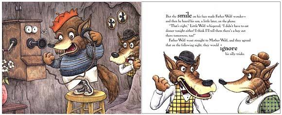{width="6.041666666666667in"
height="2.4791666666666665in"}

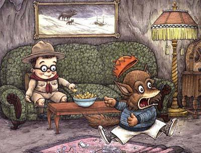{width="4.166666666666667in"
height="3.1875in"}

**The Wolf Who Cried Boy**

**Bob Hartman**

Once upon a time there lived a family of wolves. They stole sheep, ran
after rabbits and dined on ducklings and deer.

Except for Little Wolf, that is, who never stopped complaining about
what his mother prepared each night for dinner.

"Lamburgers again?" he whined. "I hate Lamburgers!"

"Minced Mole Rolls?" he howled. "We had Minced Mole Rolls last night."

"Chocolate Moose?" he whimpered. "Chocolate Moose makes me sick. And
besides, it looks just like -- "

"That's enough!" barked Father Wolf.

But it never did any good, for all Little Wolf wanted to eat was ...

"Boy! Why can't we have Boy tonight? We never have Boy any more!"

"Well, son," sighed Father Wolf, "there was a time when a clever wolf
could snatch a shepherd boy off a hill or pluck a farm boy out of a
field. Why, there was nothing better than a steaming plate of Boy Chops,
a big Baked Boy-tato, and some Boys-n-Berry-Pie. But boys are hard to
come by these days, so stop your complaining and finish off that Moose."

"Yes, Father," Little Wolf muttered. Then he asked, "But suppose I did
find a boy someday?"

Father Wolf smiled," You find a boy out there in the woods, and your
mother and I will be happy to catch him and cook him for you. But I
wouldn't get my hopes up if I were you.

The next day, as Little Wolf made his way home from school, he sniffed
the air.

"Three-Pig Salad!" he moaned. "I hate Three-Pig Salad!" And then Little
Wolf remembered what his father had told him about catching a boy
someday. So he decided to play a little trick, and put off that awful
dinner for a while. He ran home as fast as he could, howling all the
way.

"Boy! Boy! I've just seen a boy in the woods! If we hurry, we can catch
him!"

Father and Mother Wolf raced out of the cave. They ran through the woods
to the top of the hill and all the way down to the creek. They peered
into trees and sniffed behind rocks and looked into every hollow log.
But they could not find the boy.

"We looked everywhere," panted Father Wolf. "Everywhere a boy might go.
But we just couldn't find him. Better luck next time, Son."

Little Wolf tried to look disappointed, but it was all he could do to
keep from laughing.

The joke got even better when his mother announced, "Oh no! The
Three-Pig Salad is ruined! The bricks are limp, the straw is damp, and
the sticks have turned all ... sticky."

"Don't worry, dear," Father Wolf said. "We can make do with snack food
tonight."

And so they crunched on Chipmunks and Dip, and Little Wolf was happy.

So happy, in fact, that he decided to try the same trick the very next
day.

"It's the boy!" he cried. "I saw him again! He's just at the edge of the
woods!"

So, once again, Father and Mother Wolf went racing after the boy. Once
again, they came dragging home, their paws empty. And, once again, their
dinner was ruined.

"Just look at that Granny Smith Pie," Mother Wolf sighed. "The apples
are entirely too mushy."

"Yep," agreed Father Wolf. "And Granny's gone all crusty and hard."

"Looks like snacks again tonight," Little Wolf shrugged. But the smile
on his faced made Father Wolf wonder -- and then he heard his son, a
little later, on the phone.

"That's right," Little Wolf whispered, "I didn't have to eat dinner
tonight either! I think I'll tell them there's a boy out there tomorrow,
too!"

Father Wolf went straight to Mother Wolf, and they agreed that on the
following night, they would ignore his silly tricks.

The next day, Little Wolf made his way home from school as usual. He
could smell the awful odour of hot steaming Porridged Stoats as it
floated out of the cave, and was just about to holler, "Boy!" when the
most amazing thing happened. There, walking through the woods before
him, were more boys than he had ever seen!

"Boy!" he cried. "Boy!" But no one came running from the cave. "Boy!" he
howled. "Boys!" But still no one came. So he ran into the cave,
shouting, "There are boys out there! Dozens of them! Big ones and little
ones. Fat ones and skinny ones. Enough to fill our freezer and Aunty's
freezer, too!"

But his mother just shrugged and said, "That's very nice, dear, but I
already have our supper planned."

Father Wolf hid his face behind a newspaper.

And that's when one of the boys stuck his head in the cave.

He was the mischievous type -- a lot like Little Wolf, in fact. And he
had crept away from his Scout pack to have a closer look.

"See!" Little Wolf shouted. "There's one of them now!"

But even thought the boy tiptoed right into the cave, Little Wolf
couldn't get anyone to look.

"There's a boy on the couch!" he howled.

"That's enough now, Son," said his mother.

"You're not fooling us again," added his father from behind the paper.
"We're on to your little tricks."

"But I'm not lying this time. Honest!" Little Wolf pleaded. "There
really is a boy -- right here, in our cave!"

The boy glanced at his watch, then turned to leave.

"Look! Please look!" Little Wolf begged. "He's getting away!"

But by the time Father Wolf finally stuck his head up above the paper,
the boy was gone.

"You waited too long!" cried Little Wolf. "He was here a minute ago. All
we have to do is run outside -- "

"We will do no such thing!" growled Father Wolf. "From now on, you will
eat your dinner without complaining."

"And you will stop your fibbing, once and for all!" said his mother. "Do
you understand?"

"Okay," Little Wolf sighed.

So from then on, Little Wolf ate Lamburgers and Three-Pig Salad and even
grew fond of Granny Smith Pie. And he never, ever cried "Boy!" again!

And that's why the boys, at least, lived happily ever after.

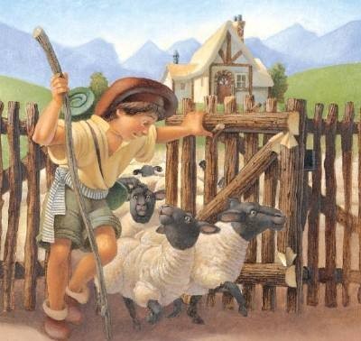{width="4.166666666666667in"
height="3.9375in"}

There was a young boy who lived in a village. He wasn\'t very old, but
he had an important job. He was a shepherd, and his job was to guard the
sheep from danger, especially wolves.

The shepherd boy also had to make sure the sheep got plenty of food and
exercise. Every day, in order to give the sheep the exercise they
needed, the boy took them to a nearby valley.

Once they had walked there, the sheep would graze on the tasty green
grass that grew in the valley. The villagers trusted the shepherd to
take good care of the sheep.

The shepherd boy wasn\'t really all alone. The village people worked
nearby. If a wolf ever did attack, the people could run to the rescue.

The villagers counted on the shepherd boy to do his job. They never felt
like they had to check on him. They trusted him to do what he was
supposed to do.

Every day, the shepherd faithfully watched the sheep from his lookout
post. He could also see the people hard at work. Some days they worked
at their jobs in the village. Sometimes they did other chores.

For the shepherd boy, every day was the same. He looked at the sheep.
They looked the same every day. Then he looked out at the forest. It
looked the same, too.

While he was happy most days just to do his job, some days he wished
that something exciting would happen.

In his whole life, the boy had never seen a wolf come near the sheep. In
fact, he had never even seen a wolf! Some people told stories of hearing
wolves howl in the forest, but the boy never heard any howling.
Sometimes he even wondered if there really were any wolves.

One day the shepherd tried to make things more exciting. He thought,
\"Maybe I can play some games with the sheep.\" He planned his next day,
and he smiled when he thought about the fun he would have.

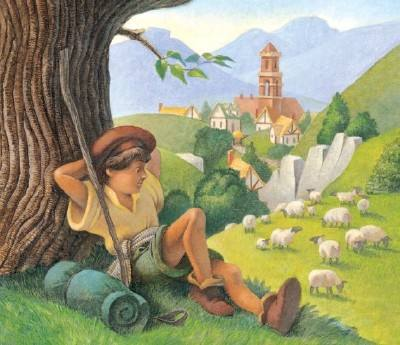{width="4.166666666666667in"
height="3.59375in"}

The boy woke up bright and early the next morning. He ate his breakfast
very quickly and then packed his bag for the day. He kissed his parents
good-bye and hurried to take the sheep to the valley.

As soon as they reached the green grass in the valley, the shepherd boy
tried to play games with the sheep. The sheep, however, had a different
idea. They didn\'t want to play catch. They weren\'t interested in
trying to bounce the ball. They didn\'t even want to try to kick the
ball.

All the sheep wanted to do was eat the grass or take a nap. \"This
isn\'t any fun at all,\" thought the shepherd boy.

Downhearted, the shepherd boy walked slowly back to his lookout post.
\"Alas,\" thought the boy, \"I just wanted to make things a little more
exciting around here.\"

Then something caught the corner of his eye. He could tell the wind was
blowing because it made the treetops move. \"I wonder,\" he said,
thinking out loud, \"what is on the other side of those trees?\"

The boy smiled to himself. Would it be so bad to pretend there was a
wolf? He thought this would be a good joke.

As the sheep ate the grass, the shepherd boy cupped his hand near his
mouth and shouted, \"Wolf! Wolf! A wolf is stealing the sheep! Come help
me!\"

All the village people stopped what they were doing and ran to help
scare off the wolf. When they got there, they were very confused.

The villagers did not find a wolf. And where was the shepherd? They were
worried about him. What if the wolf had stolen the boy? They frantically
began to search high and low to find him.

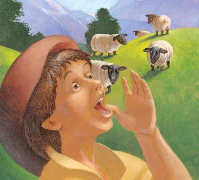{width="4.166666666666667in"
height="3.7708333333333335in"}

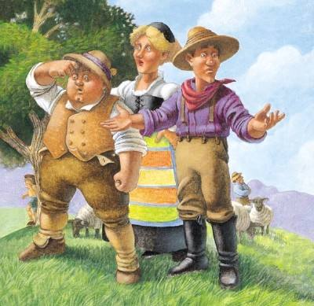{width="4.166666666666667in"
height="4.052083333333333in"}

A villager pointed to a tree and said, \"There he is over there. Is he
okay?\" They saw he was not hurt. In fact, he was laughing!

\"You looked so funny running up here for no reason. This was a great
joke,\" laughed the boy.

The villagers did not laugh. They had been very scared for the boy and
the sheep. They did not feel like laughing at all. They shook their
heads and said, \"We have to get back to work now. We don\'t have time
for pranks.\"

The shepherd boy hardly heard a word they said. He was laughing too
hard.

At breakfast the next day, the boy\'s mother and father told him to be
good. He nodded his head and left to tend the sheep.

Soon, however, he was bored again. \"Wolf! Wolf!\" he shouted, louder
than the day before. \"A wolf is stealing the sheep! Come help me!\"

Again the villagers came running. Again there was no wolf in sight. This
time the village people were very upset. They told the boy, \"If you
don\'t tell people the truth all the time, they will never know when to
believe you.\"

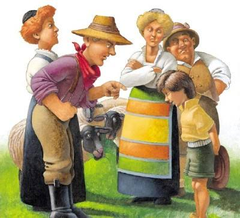{width="4.166666666666667in"
height="3.78125in"}

The boy was still laughing at his joke. After the villagers went back to
their jobs, however, he started to think about what the people had said.
\"Maybe,\" he thought, \"it isn\'t so funny to play tricks on others.\"

The shepherd boy began walking back to his lookout post. Little did he
know he was soon going to have all the excitement he could handle.

Just on the other side of the trees, a sly wolf had seen everything.
When the shepherd reached his post, the wolf began stealing the sheep.

The shepherd couldn\'t believe his eyes. It was a real wolf! He cried
out, \"Wolf! Wolf! A wolf is stealing the sheep! Come help me!\"

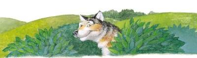{width="4.166666666666667in"
height="1.2291666666666667in"}

He waited for the villagers to come running, but no one came. They
weren\'t going to fall for that trick again! This time, though, it was
no trick.

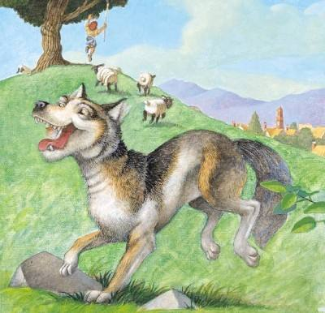{width="4.166666666666667in"
height="4.020833333333333in"}

The boy tried yelling for help again, but no one came. He could only
watch as the wolf ran off into the forest with all the sheep. This time
the only one laughing was the wolf.

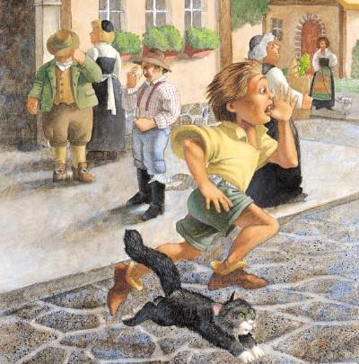{width="4.166666666666667in"
height="4.21875in"}

The shepherd boy ran into the village. \"Wolf! Wolf!\" he cried. \"He\'s
stealing our sheep!\" The boy kept running and calling for help, but no
one believed he was telling the truth. He called out again, \"Wolf!
Wolf!\"

\"I bet!\" said one villager. \"I can\'t believe that boy is trying to
make fools out of us again.\"

\"Well, he\'s not going to make a fool out of me,\" said another
villager. \"I don\'t believe him.\"

Finally the shepherd boy stopped running. \"I\'m telling the truth this
time,\" he said. \"There really is a wolf in the valley, and he really
is stealing the sheep. You\'ve got to believe me.\"

The villagers came and looked at the boy. They shook their fingers at
him. \"We\'re smarter than you think,\" the people said. \"This time
we\'re just going to ignore you and your wolf! Humph!\"

At that moment, the shepherd boy knew no one would believe him. How
could he blame them? When they trusted him, he let them down. He lost
their trust by not always telling the truth.

He sadly walked back to his lookout and gazed down where he always took
his sheep to eat grass. But there weren\'t any sheep left. The wolf had
taken all of them away. The boy was so sad that he began to cry.

The boy remembered what his parents and the villagers had told him. How
he wished he had listened to what they said. He wished he had just
always told the truth.

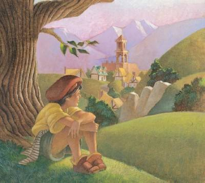{width="4.166666666666667in"
height="3.7291666666666665in"}

He didn\'t want any harm to come to the sheep! Because he didn\'t tell
the truth, no one believed him when it really mattered. Now it was too
late. The shepherd boy didn\'t think his joke was so funny anymore.

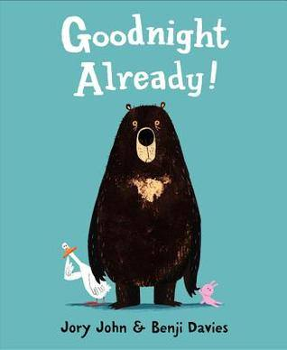{width="3.3125in"
height="4.041666666666667in"}

Meet Bear. He\'s exhausted. All he wants is to go to sleep. Meet Duck,
Bear\'s persistent next-door neighbour. All he wants is to hang out . .
. with Bear.

There's some debate about whether bears actually hibernate, but the one
in Goodnight Already!, by Jory John and Benji Davies, is clearly
desperate to catch a few ZZZZZZZs.

"I've never been so tired," he tells us as he gets ready to climb the
stairs to his bedroom, pink stuffed bunny in hand (no teddy bear for
Bear). "I could sleep for weeks. Months, even!"

Unfortunately, his next-door neighbour, Duck, is an insomniac ‚--- and
gregarious by nature. Just as Bear gets ready to drift off to sleep,
there's a knock at the door. Rousing himself, he pulls on a flowery robe
and stumbles down the stairs to find Duck on his doorstep, eager for
company.

"Wanna play cards?" Duck asks. "No," says Bear.

"Watch a movie?"

Duck runs through a list of possible activities, each of which meets
with a firm "No" from Bear --- all except a second "Wanna play cards?"
which elicits the curt response: "You already said that.")

Duck eventually gets the message. "Fine," he says. "Goodnight already!"

Bear, eyes already drooping shut, has his hand on the door to close it
as Duck walks through. "Whatever," he tells Duck.

The text is brief, but spot-on. The dialogue has just the right note of
weary sarcasm on Bear's part, and bubbly enthusiasm on Duck's.

The fine-feathered neighbour is not easily dissuaded. Just as Bear
drifts off to sleep again, Duck appears at the window. "Psst! Bear!," he
beckons, announcing that he has decided to bake cookies, but needs to
borrow some sugar. "No," says Bear. There follows another litany of
back-and-forth requests and responses: butter, dough, salt all meet with
no's. "Can I just borrow some cookies then?" Duck asks. And even the
youngest reader will be able to anticipate and chime in with Bear's
response. "No."

Repetition works in picture books for the very young, and author Jory
John uses just the right amount --- enough to help even children who
can't decode the printed word to "read" for themselves, but not so much
that adults reading the book aloud will tire of predictable text.

In the end, Bear reaches his breaking point when Duck uses an emergency
key to enter Bear's home and ends up scaring him awake. Benji Davies's
bold, colourful art captures this sequence perfectly, showing Bear and
his bunny fast asleep under the covers, with Duck perched on Bear's
chest in the first image, then Bear's (and bunny's) startled, wide-awake
eyes when Duck taps Bear on the nose.

Not only the art, but also the typeface reflects Bear's outraged
response. In ever-larger font, Bear announces he's had enough and yells
at Duck: "I SAID GOODNIGHT ALREADY!"

But the creators aren't finished amusing their readers. In a lovely
about-face, we have Duck, in his home, reading himself to sleep at the
end of the book while a defeated Bear, now wide awake and wearing a
flowery apron, hauls out the fixings for a batch of cookies in the
middle of the night.

{width="6.268055555555556in"
height="4.701042213473316in"}

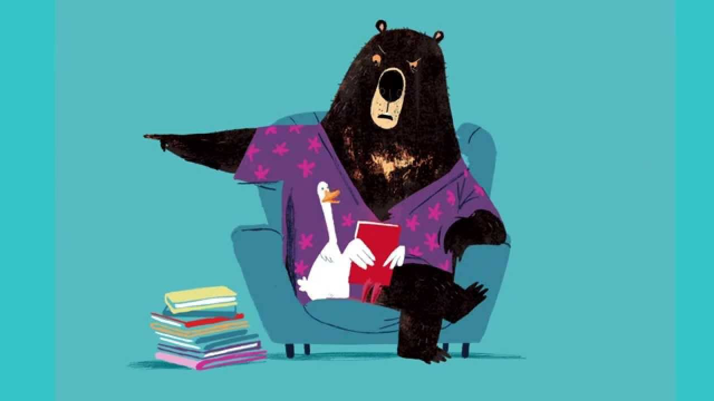{width="6.268055555555556in"
height="3.5257808398950132in"}

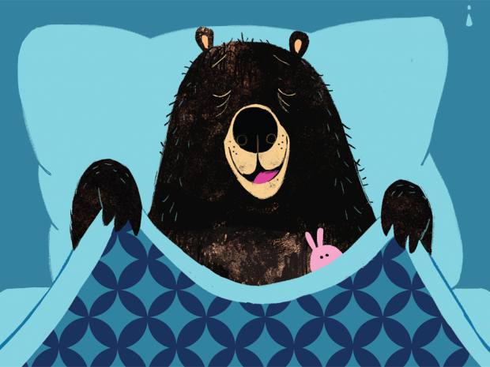{width="6.268055555555556in"
height="4.701042213473316in"}

**\**

**Goodnight Already! Jory John**

"I've never been so tired. I could sleep for weeks. Months, even!"

"I've never been so awake. I wonder what ol' Bear's up to?"

"I can't wait to sleep. Here we go \... yes \..."

"Bear! It's me! Duck! Open up! C'mon buddy!"

"What is it, Duck? I was fast asleep."

"Want to play cards?"

"No."

"Watch a movie?"

"No."

"Start a band?"

"No."

"Make smoothies?"

"No."

Talk all night?"

"No."

"Play cards?"

"You already said that."

"Read books to each other?"

"No."

"Fine. Goodnight already."

"Whatever. Ahh. Bed. Yes. Almost \... asleep \..."\
"Psst! Bear! It's Duck! From next door!"

"What?!"

"I want to make cookies. Can I borrow some sugar?"

"No."

"Butter?"

"No."

"Dough?"

"No."

"Salt?"

"No."

"Butter?"

"You already said that."

"Can I just borrow some cookies then?"

"No."

"Goodnight already."

"That duck \... always bothering me! \... I need to get some new
neighbours \...

\... Later, though \... too tired \... must sleep."

"AAAAHHHHHH! How on earth \...?!"

"I used my spare key."

"That was for emergencies!"

"This is an emergency."

"What? What is it, Duck? What's the emergency?"

"I stubbed my beak. See?"

"Duck! You've got to stop waking me up. Out! NOW!"

"But \..."

"I SAID GOODNIGHT ALREADY!"

"Bear is so grumpy! His bad attitude is making me tired."

""Once upon a time there was a \...

there was a \..."

"I've never been so awake."

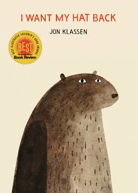{width="1.7083333333333333in"
height="2.375in"} Review

Understatement, simplicity, and subversion comprise a formula for
success in Jon Klassen's debut picture book, I Want My Hat Back.
Narrated only through characters' dialogue, the premise is
straightforward: a bear has lost his hat and wants it back. And so, a
pillar of politeness and perseverance, he roams the forest interrogating
its inhabitants about the whereabouts of his hat. It is when he finally
begins to despair that he realises his diligence has paid off and he
recalls a clue discovered during his rounds of questioning. Do not let
the simple text and unadorned illustrations lull you into believing this
story is commonplace, however. Teachers should be prepared for an
irreverent resolution to the bear's predicament. What happens next is
subtle and wickedly funny, although adults who want children's books to
present admirable protagonists, teach morals, and have sweet, happy
endings might not think so. When the bear realises the rabbit lied to
him, he seeks revenge in the worst way. Klassen uses Chinese ink and
digital media to render illustrations in a muted palette that
masterfully convey so much with so little. The characters are depicted
without any mouths, leaving so much expression and personality to be
interpreted through the slightest variance in their eyes. Read this one
aloud to students, or encourage them to read it on their own, and watch
them light up and giggle when they finally figure out Klassen's clever
joke.

**Inferring Character and Plot through Illustration.**

Before reading this book with students, do a picture walk of the
illustrations, emphasising that attention must be paid to the
characters' eyes. What do they notice about each animal's gaze? At whom
is each animal looking? What inferences can they make about the
personality of each? How does Klassen also use colour to convey
character? Finally, make sure that students look closely at the bits of
scenery that Klassen provides. What changes do they notice? Can they
figure out why those changes occurred? In other words, what happens in
the story that isn't narrated or revealed directly through the text?
(The Classroom Bookshelf)

{width="3.2916666666666665in"
height="3.8020833333333335in"}

{width="4.145833333333333in"
height="2.9375in"}

{width="3.15625in"
height="3.5208333333333335in"}

{width="3.1145833333333335in"
height="4.958333333333333in"}

Lesson:

Tuning in. Students think of one special item they have that they would
be very sad to find was missing. Partner talk.

Read Aloud Stop after a few pages to fill in part of Story Map:

Main Character, Setting, and Problem. While reading, students can read
repetitive phrases chorally. Sentence strips can provide visual support.

Just before the surprise ending, ask students to predict how the bear is
going to solve the problem. Record a few ideas on t-chart.

Read surprise ending. Discuss what happens. Children will need to infer
the ending based on the illustration. Refer to the t-chart and write (or
reveal) the solution (s).

Discussion: *Did you like the way the story ended? Why? Why not?*

Follow up: Readers' Theatre.\
**I Want My Hat Back Jon Klassen**

"My hat is gone. I want it back."

"Have you seen my hat?"

"No. I haven't seen your hat."

"Okay. Thank you anyway."

"Have you seen my hat?"

"No. I have not seen any hats around here."

"Okay. Thank you anyway."

"Have you seen my hat?"

"No. Why are you asking me? I haven't seen it. I haven't seen any hats
anywhere. I would not steal a hat. Don't ask me any more questions."

"Okay. Thank you anyway."

"Have you seen my hat?"

"I haven't seen anything all day. I have been trying to climb this
tock."

"Would you like me to lift you on top of it?"

"Yes, please."

"Have you seen my hat?"

"I saw a hat once. It was blue and round."

"My hat doesn't look like that. Thank you anyway."

"Have you seen my hat?"

"What is a hat?"

"Thank you anyway."

"Nobody has seen my hat. What if I never see it again? What if nobody
ever finds it? My poor hat. I miss it so much."

"What's the matter?"

"I have lost my hat. And nobody has seen it."

"What does your hat look like?"

"It is red and pointy and ...

I HAVE SEEN MY HAT.

"YOU. YOU STOLE MY HAT.

"I love my hat."

"Excuse me, have you seen a rabbit wearing a hat?"

"No. Why are you asking me? I haven't seen him. I haven't seen any
rabbits anywhere. I would not eat a rabbit. Don't ask me any more
questions."

"Okay. Thank you anyway."

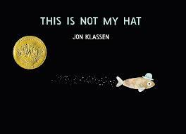{width="2.75in"
height="1.9895833333333333in"}

When a tiny fish shoots into view wearing a round blue topper (which
happens to fit him perfectly), trouble could be following close behind.
So it\'s a good thing that enormous fish won\'t wake up. And even if he
does, it\'s not like he\'ll ever know what happened\...

A little fish with a big ego boasts that he has stolen a bowler hat off
the head of a mammoth fish and can get away with it. Beyond the story,
Klassen plays with texture and light in his Chinese ink and digital
illustrations to construct layers of meaning. Once again the eyes tell
it all so that the dark resolution should be no surprise to attentive
readers.

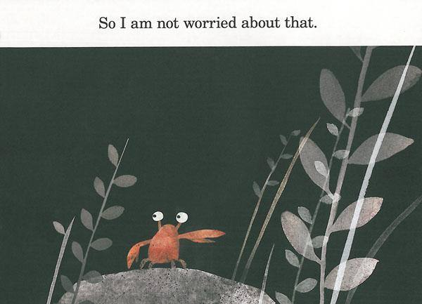{width="5.75in"
height="4.145833333333333in"}

A little fish (the fellow you see on the cover) is narrating the story
as he swims. "This hat is not mine," he admits. He stole it from a big
fish, and we see the big fish sleeping. "... He probably won't wake up
for a long time," says the little fish, and we see the same illustration
of that big fish, but now his eyes are wide open. So all the words are
from the little fish's point of view, but we see in the illustrations
what the little fish doesn't realise -- the big fish does realise his
hat was stolen, does know who took it, and is out to get his hat back.
The end shows the big fish with his tiny hat back on his head, and the
little fish is nowhere to be seen. Infer what happened in the end?

+-----------------------------------------------------------------------------+
| **Book**                                                                    |
+:=======================:+:=======================:+:=======================:+
| Clues in the Book       | What I Know             | My Inferences           |
+-------------------------+-------------------------+-------------------------+
|                         |                         |                         |
+-------------------------+-------------------------+-------------------------+
|                         |                         |                         |
+-------------------------+-------------------------+-------------------------+

**This is Not My Hat Jon Klassen**

This hat is not mine.

I just stole it.

I stole it from a big fish.

He was asleep when I did it.

And he probably won't wake up for a long time.

And even if he does wake up,

he probably won't notice that it's gone.

And even if he does notice that it's gone,

he probably won't know it was me who took it.

And even if he does guess it was me,

he won't know where I am going.

But I will tell you where I am going.

I am going where the plants grow

big and tall and close together.

It is very hard to see in there.

Nobody will ever find me.

There is someone who saw me already.

But he said he wouldn't tell anyone

which way I went.

So I am not worried about that.

I know it's wrong to steal a hat.

I know it does not belong to me.

But I am going to keep it.

It was too small for him anyway.

It fits me just right.

And look! I made it!

Where the plants are big and tall and close together!

I knew I was going to make it.

Nobody will ever find me.

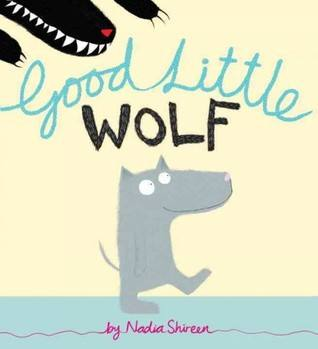{width="3.3125in"
height="3.6354166666666665in"}

**Good Little Wolf by Nadia Shireen**

Once upon a time there was a wolf called Rolf - a good little wolf who
liked baking cakes and was always kind to his friends. But real wolves
aren\'t supposed to be good - they\'re supposed to be BIG and BAD**.**

Can a good little wolf still be a real wolf?

And will Rolf discover there\'s something big and bad lurking inside him
after all?

**Writing**

- Retell the story from the Big Bad Wolf\'s point of view.

- Retell the story from Mrs. Boggin\'s point of view.

- Write a new ending for the story.

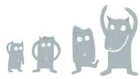{width="2.5in"
height="1.40625in"}

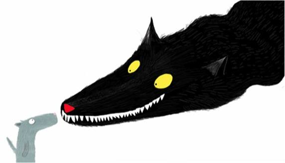{width="5.958333333333333in"
height="3.4166666666666665in"}

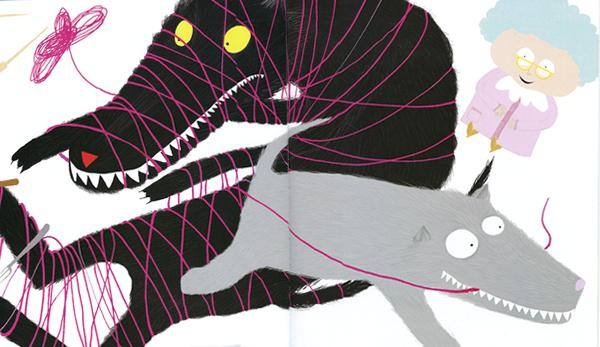{width="6.25in"
height="3.6145833333333335in"}

**Good Little Wolf Nadia Shireen**

Rolf and Mrs Boggins were best friends.

"You really are a good little wolf," Mrs Boggins told him.

Rolf liked being a good little wolf.

He liked baking tasty cakes.

He ate up all his vegetables.

And he was always nice to his friends.

But Mrs Boggins also said that not *all* wolves were good. In fact, some
were downright bad.

Rolf hoped he would never bump into a big bad wolf.

"Now what do we have here?" said the Big Bad Wolf. "You LOOK like a wolf
\... You FEEL like a wolf \... You SMELL like a wolf \..."

"That's because I AM a wolf," piped up Rolf. "I'm a very good little
wolf."

"Good?" said the Big Bad Wolf. "Wolves aren't good! Wolves are BIG and
BAD."

"Real wolves howl at the moon!" hooted the Big Bad Wolf. "Real wolves
blow houses in! Real wolves eat people up!"

"Well," said Rolf. "I am a real wolf. And I'm sure I can do all of those
things."

So Rolf tried to howl at the moon. He pursed his lips, took a deep
breath, and out came a great big \... whistle.

Then Rolf went to see Little Pig.

"Do you mind if I blow your house in?" asked Rolf.

"You can try, I suppose." said Little Pig.

So he huffed \... And he puffed \... But it was no use.

"I'm sorry, Rolf," said Little Pig.

"You're right!" said Rolf sadly. "I'm just not bad enough to be a real
wolf."

"Well \... there is one last thing you can do to prove you're a proper
wolf," said the Big Bad Wolf.

And suddenly, something quite strange came over Rolf. He felt an
unfamiliar, wild feeling growing inside him \...

Rolf had never felt more like a wolf. "AROOOOOOOOOOOOO. See? I am a
proper wolf. I just happen to be a GOOD little wolf," said Rolf.

"This calls for a celebration!" cried Mrs Boggins. And they all sat down
for some tea and cake.

"Will you stop eating people up, Big Bad Wolf?" asked Rolf.

"Oh, I suppose so," said the Big Bad Wolf \...

"I'll stop first thing tomorrow."

**\**

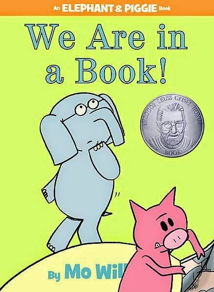{width="1.5104166666666667in"
height="2.0833333333333335in"}

**[We Are In A
Book!* *](http://www.amazon.com/We-Are-Book-Elephant-Piggie/dp/1423133080/ref=sr_1_1?s=books&ie=UTF8&qid=1416539633&sr=1-1&keywords=we+are+in+a+book)by
Mo Willems**

This is a book about 2 best friends, Gerald and Piggie, who find
themselves in a book! They just can't believe this new adventure and use
some great "voice". The book is composed of back and forth dialogue
along with great simple pictures.  

Read Aloud

Talk about the different emotions the characters displayed and how the
reader knew this. E.g.

-speech bubbles

\- the punctuation-exclamation points

-expressions on Gerald and Piggy's face.  

Link these back to "voice."

Writing:

Students write their own comic. Brainstorm ways that authors show voice
and then the students try to incorporate some aspects of voice into
their own comic strips.

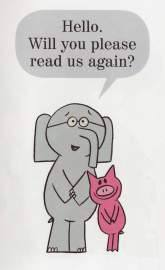{width="1.71875in"
height="2.8125in"}

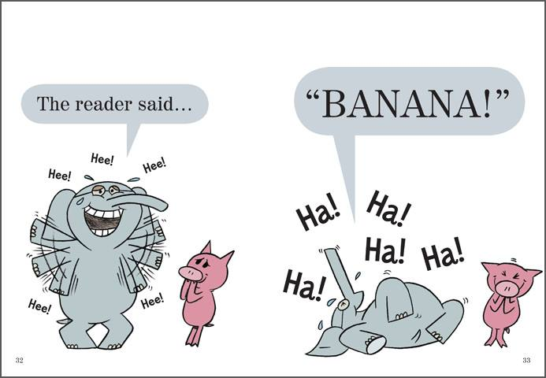{width="6.268055555555556in"
height="4.3415102799650045in"}

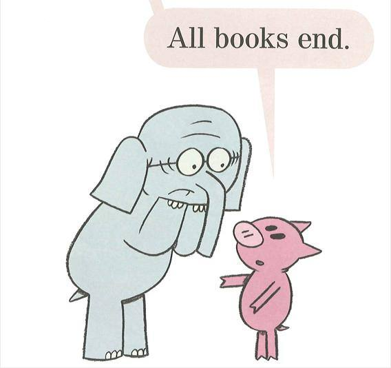{width="5.916666666666667in"
height="5.5625in"}

**\**

{width="3.8441951006124233in"
height="3.1458333333333335in"}

**Arnie the Doughnut Laurie Keller**

At first glance, Arnie looks like an average doughnut \-- round and
cakey, with a hole in the middle. OH, and the most important part \--
lots of sprinkles! Arnie\'s very excited to meet his doughnut neighbours
but even MORE excited to see who he\'s going home with. When Mr. Bing
chooses him from all the other dozens of doughnuts, Arnie gets a big
surprise when Mr. Bing tries to eat him! Pull up a napkin and find out
if Arnie gets eaten in this kooky tale.

{width="6.25in"
height="2.5625in"}

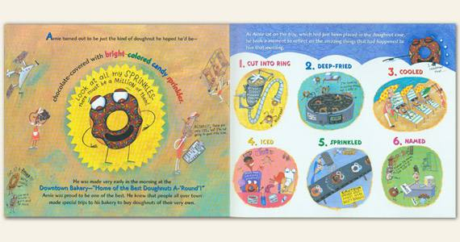{width="6.222916666666666in"
height="3.275219816272966in"}

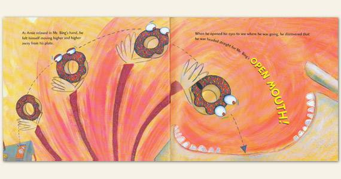{width="5.9375in"
height="3.125in"}

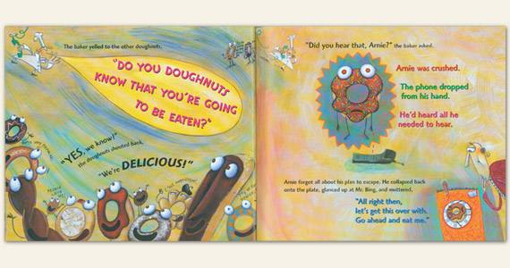{width="5.9375in"
height="3.125in"}

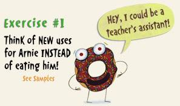{width="3.09375in"
height="1.8229166666666667in"}

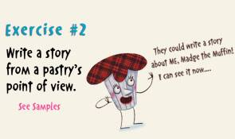{width="3.0729166666666665in"
height="1.8229166666666667in"}

**Arnie the Doughnut Laurie Keller**

Arnie turned out to be just the kind of doughnut he hoped he'd be --

chocolate-covered with bright-coloured candy sprinkles.

He was made very early in the morning at the Downtown Bakery -- "Home of
the Best Doughnuts A -- 'Round'!" Arnie was proud to be one of the best.
He knew that people all over town made special trips to his bakery to
buy doughnuts of their very own.

As Arnie sat on the tray, which had just been placed in the doughnut
case, he took a moment to reflect on the amazing things that had
happened to him that morning.

1.  Cut into ring.

2.  Deep-Fried

3.  Cooled

4.  Iced

5.  Sprinkled

6.  Named

Arnie looked around and saw all sorts of doughnuts sitting nearby. He
tried to strike up a conversation with an apple fritter on the next tray
over, but she didn't seem to want to talk.

"It is rather early. Maybe she's not a morning doughnut," Arnie
supposed.

It was 6 A.M. and the baker had just hung the OPEN sign in the window.
Arnie was fascinated as he watched customers stream into the bakery. One
by one, doughnuts were chosen, placed in paper bags, and whisked away
with their new owners. Some went by the dozen in giant boxes.

"This is so exciting! I wonder who will choose ME?"

Just then, Arnie looked up and saw a man pointing right at him before he
could say another word, he was pulled from the tray and placed in a
paper bag of his very own.

"Thank you, Mr Bing. Have a nice day!" Arnie heard the baker say to the
man.

"Mr Bing \... that's a fine name," Arnie decided. "I can hardly wait to
meet him!"

the ride to Mr Bing's apartment was a little bumpy. Arnie was grateful
for the soft napkin the baker had so thoughtfully placed underneath him
in the bag. He had never ridden in a car and wished he could look out
the window to see all the sights. But more than anything, he wished he
could meet Mr Bing.

"Why does he keep me in this bag?" Arnie wondered.

Finally, the car came to a stop and they were home.

Mr Bing carefully removed Arnie from his paper bag and placed him on a
clean, shiny plate.

"What a handsome plate," Arnie said to himself. "I'm not crazy about the
design -- I prefer a more modern look. But it's nothing a little paint
can't fix."

Mr Bing gently lifted Arnie from his new plate.

"Isn't that cute?" thought Arnie, as he closed his eyes and smiled. "He
wants to hold me."

as Arnie relaxed in Mr Bing's hand, he felt himself moving higher and
higher away from his plate. When he opened his eyes to see where he was
going, he discovered that he was headed straight for Mr Bing's OPEN
MOUTH!

"WHAT ARE YOU DOING?" shouted Arnie.

Mr Bing was stunned. He dropped Arnie back into the plate. "I was going
to \... to eat you," he replied in shock.

"EAT ME?" Arnie shrieked, his sprinkles flying everywhere. "Why would
you do a thing like that? Do you make a habit of eating all your
houseguests?"

"Nnnno \... of course not."

"So, why then did it suddenly occur to you to eat ME?" Arnie demanded.

"Swell \... because \... you're a doughnut. That's what doughnuts are
for -- to eat."

"Do you mean to tell me you've done this before?"

"Yes \... I eat a doughnut every day," Mr Bing said sheepishly.

Arnie froze. He felt sick and frightened and angry! He thought to
himself a moment. "I must put a stop to this right away! I'll call the
bakery and warn the others. Whoever's LEFT, that is!"

Arnie knew that there was no time to waste and that he needed to be very
sneaky in order to keep his plan from Mr Bing. He turned to Mr Bing and
said in his sweetest voice, "Excuse me, sir, but I don't believe we've
been properly introduced. My name is Arnie."

"Um \... hello \... Arnie," Mr Bing stammered. "I;m \... Mr Bing. It's
nice to eat you -- I mean meet you."

"Mr Bing, would you be a dear and allow me to use your telephone?" Arnie
asked extra politely.

"Oh \... well \... okay," said Mr Bing, and he handed Arnie the phone.

As quickly as he could, Arnie dialled the number of the bakery. The
baker answered the phone. "Downtown Bakery, home of the best --"

"Mr Baker Man!" Arnie frantically whispered. "This Arnie the doughnut.
Do you remember me? You made me at 5:15 this morning, and I was bought
about twenty minutes ago by a man who goes by the name of Mr Bing."

"Yes, Arnie," the baker answered. "What can I do for you?"

"Now, I don't want to alarm you, but just moments ago, that man tried to
eat me! And not only that -- he claims to have eaten hundreds of us! I'm
going to make a run for it, but I wanted to warn you that if you see him
coming into the bakery again, you can stop him!"

"Oh my, Arnie -- I thought you understood. That's why I make doughnuts
\... for people to eat."

"I CAN'T BELIEVE IT!" Arnie gasped. "Are the other doughnuts aware of
this arrangement?"

"Well, I think so," the baker said. "Let me ask them to make sure."

The baker yelled to the other doughnuts, "DO YOU DOUGHNUTS KNOW THAT
YOU'RE GOING TO BE EATEN?"

"Yes, we know!" the doughnuts shouted back. "We're DELICIOUS!"

"Did you hear that, Arnie?" the baker asked. Arnie was crushed. The
phone dropped from his hand. He'd heard all he needed to hear. arnie
forgot about his plan to escape. He collapsed back onto the plate,
glanced up at Mr Bing, and muttered, "All right then, let's get this
over with. Go ahead and eat me."

Mr Bing gazed down at Arnie. "I'm not going to eat you, Arnie," he said
reassuringly. "i just wouldn't feel right about it now."

"REALLY?" Arnie said, with a huge sigh of relief. "Well, I'm glad to see
that you've come to your senses!"

"But since I'm not going to eat you," Mr Bing continued, "I'll have to
figure out something else to do with you. I paid good money for you -- I
don't want to be wasteful."

"Of course not!" Arnie agreed.

"What we need to do is each make a list of things I can do with you.
Bewteen the two of us, I know we'll come up with something."

"Good plan, Mr Bing!" Arnie said. "This will be a breeze -- I bet I'm
good at lots of stuff."

They both feverishly wrote down their ideas. When they were finished, Mr
Bing asked, "Would you like to read your first?"

"Sure thing, Mr Bing!" Arnie answered.

"Things Mr Bing Can Do with me Instead of eating Me."

"Do you need a ballroom dance partner?"

"No, I don't dance."

"You could use a personal fitness trainer."

"Hmmmmm, I'd get too sweaty."

"How about a portrait painter?"

"Oh, heavnes no!"

"Would you like me to entertain at your parties?'

"I don't like throwing parties."

"I could be you chauffeur."

"But you can't see over the steering wheel."

"I'd make a great bodyguard!"

"Who could protect me from -- a cookie?"

"All righty, Mr Bing. Let's hear what you came up with!"

"Okey-dokey," he replied. "I just know you'll like some of these."

"Things I Can Do with Arnie Instead of Eating Him."

"I could use you as a pincushion."

"Ooooh, too painful!"

"How about an air freshener for my car?"

"How about not?"

"Would you like to be a picture frame?"

"I don't imagine so."

"I need a new bowling ball."

"Well, don't look at me."

"You'd make a fine paperweight."

"BORING!"\
"Then what about a doorstop?"

"Try again."

But there was nothing else on Mr Bing's list. They were both completely
out of ideas. Arnie and Mr Bing were exhausted. They felt terribly
disappointed. After a few minutes of awkward silence, Mr Bing finally
spoke.

"I'm sorry, Arnie --but it's clear that we can't agree on anything for
you to do around here. This is difficult for me to say, but I think it
would be best if you found another home."

"I know," said Arnie, fighting back tears. "I'll just be on my way then.
Is it all right if I keep this napkin to pack up all my loose
sprinkles?"

"Of course," Mr Bing replied sadly.

"As soon as I get a job, I'll pay you back the money you spent on me."

"That's not necessary, Arnie."

Arnie shook Mr Bing's hand and thanked him for his kindness. Mr Bing
opened the door, and as Arnie left he apused and said, "I guess
doughnuts really are only good for eating, aren't they?"

They both waved good-bye and Arnie was gone. Mr Bing stood at the window
and watched as Arnie walked away. He walked past the flower beds, the
mailboxes, and the apartment manager's office. He passed the tennis
court, the swimming pool, and the clubhouse. But when Arnie reached the
NO DOGS ALLOWED sign at the end of the driveway, Mr Bing suddenly came
up with a new idea.

"Arnie! Arnie! Wait up!" yelled Mr Bing as he ran after him.

Arnie turned back and stopped. When Mr Bing caught up with him, he was
out of breath.

"I can't believe I didn't think of this earlier!" Mr Bing panted.
"Arnie, I've always wanted a dog and could never have one because
they're not allowed here. But there's no sign that says: NO DOUGHNUTS
ALLOWED."

Arnie perked up when he realised what Mr Bing was thinking.

"Would you like to take walks and play fetch?" Mr Bing asked excitedly.

"You bet I would!"

"Can you do tricks, like rolling over?"

"ROLLING OVER? LOOK AT ME -- I was MADE for rolling over!"

"Well, then, there's only one thing left to ask. Arnie, will you be my
doughnut-dog?"

"Oh, Mr Bing -- I would LOVE to be your doughnut-dog!"

From that moment on, Arnie and Mr Bing were inseparable. Arnie liked
being a doughnut dog even better than he liked being a doughnut! He went
through a short phase of chewing on furniture and barking at the
mailman, but after a crash course in obedience school, he graduated
first in his class.

Everywhere the two of them went, people would stop to pet Arnie. No one
had ever seen a doughnut-dog before.

Arnie and Mr Bing had so much fun together. Arnie was the best pet Mr
Bing could ever have hoped for -- and Mr Bing was Arnie's best friend.

**Stellaluna Janell Cannon**

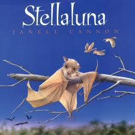{width="2.34375in"
height="2.34375in"}

Stellaluna is a baby bat who is accidentally separated from her mother
and ends up being raised by a mother bird, along with her three baby
birds. Although Stellaluna is a fruit bat, she tries to fit in with the
customs of the birds by eating insects, sleeping at night, and she
sleeps in their nest instead of hanging upside down by her feet.

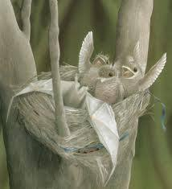{width="2.2291666666666665in"
height="2.4479166666666665in"}

Although Stellaluna is accepted by the birds, she somehow never feels at
home or herself. When the baby birds learn to fly and land, poor
Stellaluna is clumsy and embarrassed that she can\'t land gracefully on
a branch because her feet are equipped for hanging, not perching.

In the end, Stellaluna is reunited with her real mother and she
discovers that she isn\'t a bird, she\'s a bat! She learns that bats
love to eat fruit, they sleep hanging upside down, they stay awake at
night, and bats can fly in the dark because they travel by echolocation.

Stellaluna realises that she can remain best friends with her bird
siblings, but she doesn\'t have to look or act like them, she can be
herself.

The small pen and ink drawings at the top of the text pages tell the
story of how Stellaluna\'s mother is alive and searching for her baby.

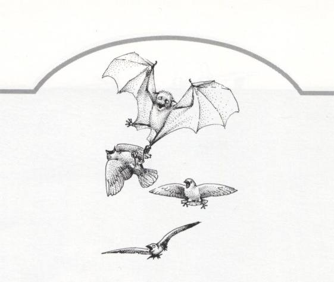{width="2.5520833333333335in"
height="2.15625in"}

**Writing Ideas**

The last two pages of the book contain a section called \"Bat Notes\".
These pages are filled with interesting and easy to understand
information about bats.

The students write captions that would go along with each of these
smaller illustrations.

Write a sequel to Stellaluna that shows how she is still friends with
the birds.

Choose an animal that is often thought of negatively like a bat (snake,
rat, mouse, spider, etc.). Next, have your students write a story about
their animal that will help change people\'s feeling and perceptions
about this animal.

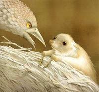{width="2.0833333333333335in"
height="1.9270833333333333in"}

**Compare/Contrast**

Venn diagrams are useful.

Compare Fiction/Nonfiction texts.

See: Bats by Gail Gibbons

Zipping, Zapping, Zooming Bats by Ann Earle

Bats! - Time for Kids

Use nonfiction books for Notetaking -- (Keywording) after KWHL.

Compare different bats.

See Bat loves the Night by Nicola Davies

+------------------------+--------------------------------------------+
| Craft                  | Example                                    |
+========================+============================================+
| Lead -- character,     | *In a warm and sultry forest far, far      |
| action, place.         | away, there once lived a mother fruit bat  |
|                        | and her new baby.*                         |
+------------------------+--------------------------------------------+
| Strong verbs -- enable | *clutched, flew, followed, dodging,        |
| us to visualise        | shrieking, knocking, exercising*           |
| without using          |                                            |
|                        |                                            |
| adjectives and         |                                            |
| adverbs.               |                                            |
+------------------------+--------------------------------------------+
| Similes                | *Her baby wings were as limp and useless   |
|                        | as wet paper.*                             |
|                        |                                            |
|                        | *She felt as though rays of light shone    |
|                        | from her eyes.*                            |
+------------------------+--------------------------------------------+
| Proper nouns           | Mother Bat, Mama Bird, Pip, Flitter, Flap  |
+------------------------+--------------------------------------------+
| Compound words         | *Everything, nowhere, nighttime,           |
|                        | headfirst, daybreak, grasshopper*          |
+------------------------+--------------------------------------------+
| Words for said         | *sighed, stuttered, crooned, squeaked,     |
|                        | hissed, cried, chirped, warned, shrieked,  |
| (as well as said)      | asked, murmured, cheered, agreed,          |
|                        | explained, howled, yelled, gasped, mused*  |
+------------------------+--------------------------------------------+
| Noun/verb sentence.    | *Stellaluna promised.*                     |
+------------------------+--------------------------------------------+
| Thoughtshots           | *I'm just like them, thought Stellaluna.*  |
|                        |                                            |
|                        | *I will fly all day, Stellaluna told       |
|                        | herself.*                                  |
+------------------------+--------------------------------------------+
| Transition words       | *Each night, One night, Many, may times,*  |
|                        |                                            |
|                        | *Finally, By daybreak, Once*               |
+------------------------+--------------------------------------------+
| Show don't tell        | *The dark leafy tangle of branches caught  |
|                        | Stellaluna as she fell. One twig was small |
|                        | enough for Stellaluna's tiny feet.         |
|                        | Wrapping her wings about her, she clutched |
|                        | the thin branch, trembling with cold and   |
|                        | fear.*                                     |
+------------------------+--------------------------------------------+
| Tell, then show        | *How embarrassing!*                        |
|                        |                                            |
|                        | *I will fly all day, Stellaluna told       |
|                        | herself. Then no one will see how clumsy I |
|                        | am.*                                       |
+------------------------+--------------------------------------------+
| Dialogue               | *"You are teaching my children to do bad   |
|                        | things. I will not let you back into this  |
| to show mood of        | nest unless you promise to obey all the    |
| character.             | rules of this house."*                     |
|                        |                                            |
| Punctuation            | New line indented for new speaker.         |
+------------------------+--------------------------------------------+
| Exploding a moment --  | *Many, many times that day Mama Bird flew  |
|                        | away, always returning with food for her   |
| Not "Stellaluna ate a  | babies.*                                   |
| grasshopper."          |                                            |
|                        | *Stellaluna was terribly hungry -- but not |
|                        | for the crawly things Mama Bird brought.*  |
|                        |                                            |
|                        | *Finally, though, the little bat could     |
|                        | bear it no longer. She climbed into the    |
|                        | nest, closed her eyes, and opened her      |
|                        | mouth.*                                    |
|                        |                                            |
|                        | *Plop! In dropped a big green              |
|                        | grasshopper.*                              |
+------------------------+--------------------------------------------+
| Italics used for       |                                            |
| emphasis -- helps us   |                                            |
| to read it.            |                                            |
+------------------------+--------------------------------------------+
| Shrinking time -time   | *All the babies grew quickly. Soon the     |
| lapse.                 | nest became crowded.*                      |
+------------------------+--------------------------------------------+
| Ellipses -- character  | *"She said I was wrong ..."*               |
| interrupted by         |                                            |
| another.               |                                            |
+------------------------+--------------------------------------------+
| Homophones             | *Your, you're*                             |
+------------------------+--------------------------------------------+
| Apostrophe             | *You're, let's, I'll, I'm, it's*           |
+------------------------+--------------------------------------------+
| Phonics -- ed          |                                            |
|                        |                                            |
| Categorise into 3      |                                            |
| sounds                 |                                            |
+------------------------+--------------------------------------------+
| Ending -- reflective,  | *They perched in silence for a long time.* |
| learning a lesson      |                                            |
|                        | *"How can we be so different and feel so   |
|                        | much alike?"" mused Flitter.*              |
|                        |                                            |
|                        | *"And how can we feel so different and be  |
|                        | so much alike?" wondered Pip.*             |
|                        |                                            |
|                        | *"I think this is quite a mystery," Flap   |
|                        | chirped.*                                  |
|                        |                                            |
|                        | *"I agree," said Stellaluna. "But we're    |
|                        | friends. And that's a fact."*              |
+------------------------+--------------------------------------------+

**Stellaluna Janell Cannon**

In a warm and sultry forest far, far away, there once lived a mother
fruit bat and her new baby.

Oh, how Mother Bat loved her soft tiny baby. "I'll name you Stellaluna,"
she crooned.

Each night, Mother Bat would carry Stellaluna clutched to her breast as
she flew out to search for food.

One night, as Mother Bat followed the heavy scent of ripe fruit, an owl
spied her. On silent wings the powerful bird swooped down upon the bats.

Dodging and shrieking, Mother bat tried to escape, but the owl struck
again and again, knocking Stellaluna into the air. Her baby wings were
as limp and useless as wet paper.

Down, down she went, faster and faster, into the forest below.

The dark leafy tangle of branches caught Stellaluna as she fell. One
twig was small enough for Stellaluna's tiny feet. Wrapping her wings
about her, she clutched the thin branch, trembling with cold and fear.

"Mother," Stellaluna squeaked. "Where are you?"

By daybreak, the baby bat could hold on no longer. Down, down again she
dropped.

*Flump!* Stellaluna landed headfirst in a soft downy nest, startling the
three baby birds who lived there.

Stellaluna quickly clambered from the nest and hung out of sight below
it. she listened to the babble of the three birds.

"What was *that*?" cried Flap.

"I don't know, but it's hanging by its feet," chirped Flitter.

"Shhh! Here comes Mama," hissed Pip.

Many, many times that day Mama Bird flew away, always returning with
food for her babies.

Stellaluna was terribly hungry -- but *not* for the crawly things Mama
Bird brought.

Finally, though, the little bat could bear it no longer. She climbed
into the nest, closed her eyes, and opened her mouth.

*Plop!* In dropped a big green grasshopper.

Stellaluna learnt to be like the birds. She stayed awake all day and
slept at night. she ate bugs even though they tasted awful. Her bat ways
were quickly disappearing. Except for one thing: Stellaluna still liked
to sleep hanging by her feet.

Once, when Mama was away, the curious baby birds decided to try it, too.
When Mama Bird came home she saw eight tiny feet gripping the edge of
the nest.

"Eeek!" she cried. "Get back up here this instant! You're going to fall
and break your necks!"

The birds clambered back into the nest, but Mama Bird stopped
Stellaluna. "You are teaching my children to do bad things. I will not
let you back into this nest unless you promise to obey all the rules of
this house."

Stellaluna promised. She ate bugs without making faces. She slept in the
nest at night. And she didn't hang by her feet. Stellaluna behaved as a
good bird should.

All the babies grew quickly. Soon the nest became crowded.

Mama Bird told them it was time to learn to fly. One by one, Pip,
Flitter, Flap, and Stellaluna jumped from the nest.

Their wings worked!

I'm just like them, thought Stellaluna. I can fly, too.

Pip, Flitter, and Flap landed gracefully on a branch. Stellaluna tried
to do the same.

How embarrassing!

I will fly all day, Stellaluna told herself. Then no one will see how
clumsy I am.

The next day, Pip, Flitter, and Flap, and Stellaluna went flying far
from home. They flew for hours, exercising their new wings.

"The sun is setting," warned Flitter.

"We had better go home or we will get lost in the dark," said Flap.

But Stellaluna had flown far ahead and was nowhere to be seen. The three
anxious birds went home without her.

All alone, Stellaluna flew and flew until her wings ached and she
dropped into a tree. "I promised not to hang by my feet," Stellaluna
sighed. So she hung by her thumbs and soon fell asleep.

She didn't hear the soft sound of wings coming near.

"Hey!" a loud voice said, "Why are you hanging upside down?"

Stellaluna's eyes opened wide. She saw a most peculiar face. "I'm not
upside down, *you* are!" Stellaluna said.

"Ah, but you're a *bat.* Bats hang by their feet. You are hanging by
your thumbs, so that makes you *upside down.!"* the creature said. "I'm
a bat. I am hanging by my feet. That makes me *right side up."*

Stellaluna was confused. "Mama Bird told me I was upside down. she said
I was wrong ..."

"Wrong for a bird, maybe, but not for a bat."

More bats gathered around to see the strange young bat who behaved like
a bird. Stellaluna told them her story.

"You ate *b-bugs*?" stuttered one.

"You slept at *night*?" gasped another.

"How very strange," they all murmured.

"Wait! Wait! Let me look at this child." A bat pushed through the crowd.
"An *owl* attacked you?" she asked. Sniffing Stellaluna's fur, she
whispered, "You are *Stellaluna.* You are my baby."

"You escaped the owl?" cried Stellaluna. "You survived?"

"Yes," said Mother bat as she wrapped her wings around Stellaluna. "Come
with me and I'll show you where to find the most delicious fruit. You'll
never have to eat another bug as long as you live."

"But it's nighttime," Stellaluna squeaked. "We can't fly in the dark or
we will crash into trees."

"We're bats," said Mother Bat. "We can see in the darkness. Come with
us."

Stellaluna was afraid, but she let go of the tree and dropped into the
deep blue sky.

Stellaluna *could* see. She felt as though rays of light shone from her
eyes*.*

She was able to see everything in her path.

Soon the bats found a mango tree, and Stellaluna ate as much of the
fruit as she could hold.

"I'll never eat another bug as long as I live," cheered Stellaluna as
she stuffed herself full. "I must tell Pip, Flitter, and Flap!"

The next day Stellaluna went to visit the birds.

"Come with me and meet my bat family," said Stellaluna.

"Okay, let's go," agreed Pip.

"They hang by their feet and they fly at night and they eat the best
food in the world," Stellaluna explained to the birds on the way.

As the birds flew among the bats, Flap said, "I feel upside down here."

So the birds hung by their feet.

"Wait until dark," Stellaluna said excitedly. "We will fly at night."

When night came Stellaluna flew away. Pip, Flitter, and Flap leapt from
the tree to follow her.

"I can't see a thing!" yelled Pip.

"Neither can I," howled Flitter.

"Aaeee!" shrieked Flap.

"They're going to crash," gasped Stellaluna. "I must rescue them!"

Stellaluna swooped about, grabbing her friends in the air. She lifted
them to a tree, and the birds grasped a branch. Stellaluna hung from the
limb above them.

"We're safe," said Stellaluna. Then she sighed. "I wish you could see in
the dark,too."

"We wish you could land on your feet," Flitter replied. Pip and Flap
nodded.

They perched in silence for a long time.

"How can we be so different and feel so much alike?"" mused Flitter.

"And how can we feel so different and be so much alike?" wondered Pip.

"I think this is quite a mystery," Flap chirped.

"I agree," said Stellaluna. "But we're friends. And that's a fact."

**Bat Notes** (from Stellaluna)

Of the nearly 4,000 species of mammals on Earth, almost one quarter are
bats, the only mammals capable of powered flight.

The scientific name for bats is Chiroptera, "hand-wing," because the
skeleton that supports the wing is composed of the animal's elongated
finger bones.

The majority of bats are classified as Microchiroptera, "small
hand-wing." Nearly 800 varieties fill special niches in every climate
around the world except the polar zones. The lifestyles and food
preferences of Microchiroptera vary widely. Many eat insects, while
others catch fish, amphibians, and reptiles. Finally, there is the
famous vampire, of which there are only three species, ranging from
Mexico to Argentina. The vampire's victims are mostly domestic cattle
and native mammals and birds.

The other 170 or so species of bats are the fruit bats, otherwise known
as Megachiroptera, or "large hand-wing." As their name implies, these
are the largest bats, some types boasting wingspans of 1.8 metres.

Fruit bats generally have long muzzles, large eyes, pointy ears, and
furry bodies, which is why they are often called flying foxes. Unlike
the Microchiroptera, who travel by echolocation, fruit bats depend on
their keen vision and sense of smell to navigate. They live in tropical
and subtropical climates that provide year-round supplies of their
favourite fruit, flowers, and nectar. Some fruit bats, as they forage
for nectar, are responsible for pollination of many types of
night-blooming trees and plants. Others eat whole fruits, seeds and all,
and distribute the seeds over the forest floor in their droppings.
Regeneration of tropical forests depends greatly on bats.

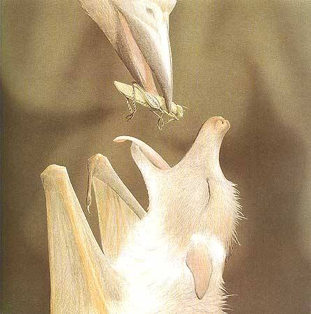{width="4.645833333333333in"
height="4.6875in"}

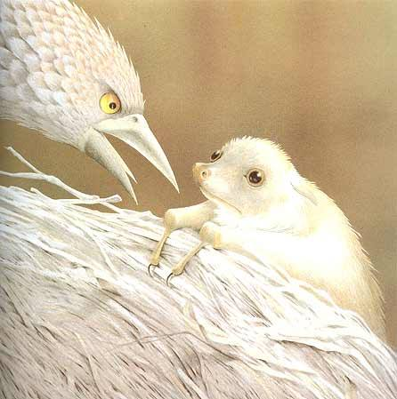{width="4.645833333333333in"
height="4.677083333333333in"}

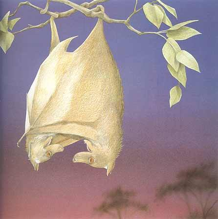{width="4.645833333333333in"
height="4.666666666666667in"}

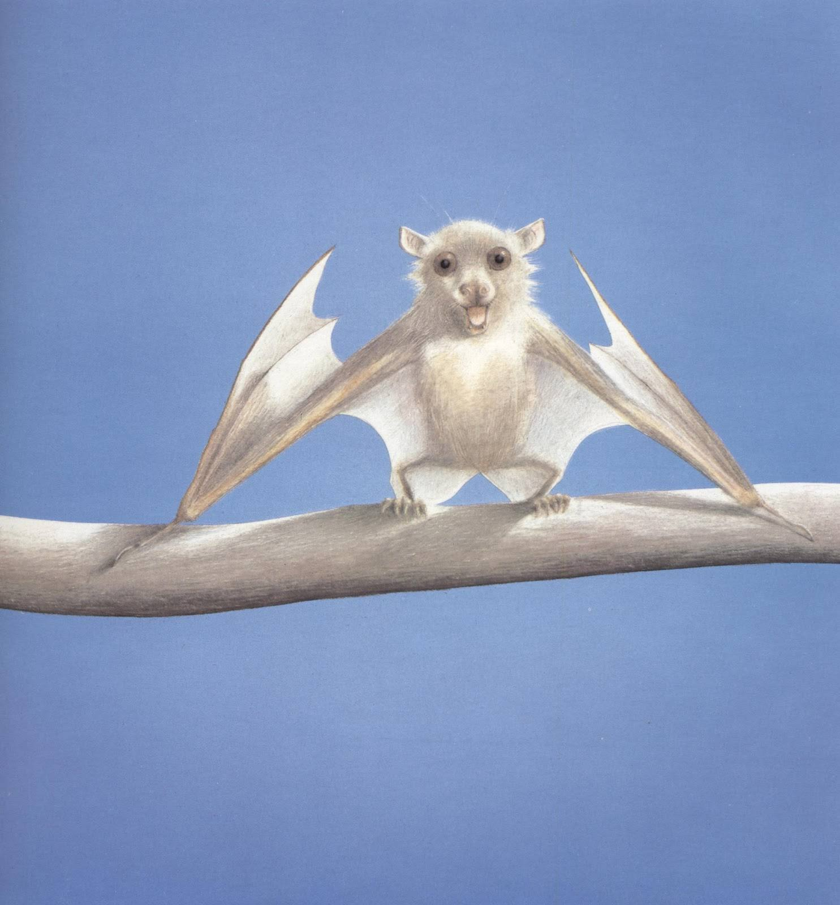{width="6.864583333333333in"
height="7.416666666666667in"}

