**Voice**

> **(7)**
>
> 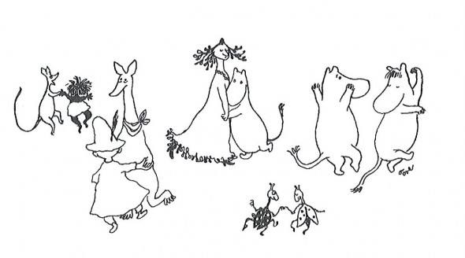{width="6.145833333333333in"
> height="3.4166666666666665in"}
>
> **Voice & Personification 3**
>
> {width="3.653771872265967in"
> height="2.03125in"}

**Voice 7 -- Voice & Personification 3**

Dumpy La Rue Elizabeth Winthrop

Yours Truly, Goldilocks Alma Flor Ada

Little Red Hen (Makes a Pizza) Philemon Sturgess

The Little Red Hen retold by Brenda Parkes

The Book about Moomin, Mymble and Little My

Tove Jansson

Psssst! It\'s Me\... the Bogeyman Barbara Park

Diary of a Worm Doreen Cronin

Ask the Answer Worm! S.K.Worm

Squirmin' Herman

Stranger in the Woods Carl R.Sams 11 & Jean Stoick

> 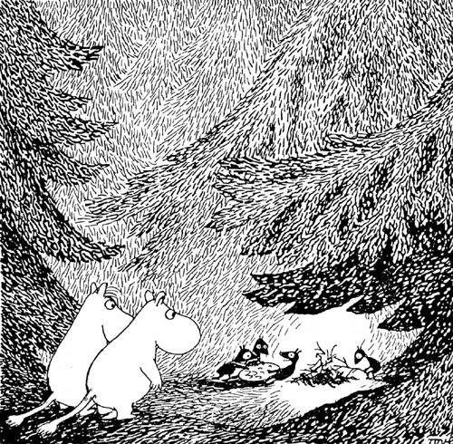{width="3.0625in"
> height="3.00125in"}

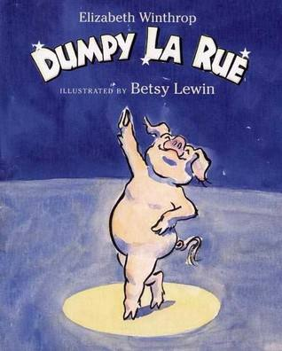{width="3.3125in"
height="4.125in"}

**Dumpy La Rue Elizabeth Winthrop**

*\"He\'s a porker with passion,*

*a dancing fool, a pig with rhythm-*

*this breaks every rule,\"*

*said the normally reticent mule.*

Dumpy La Rue, a story of a pig who knew what he wanted to do.

Elizabeth Winthrop\'s romping, rhyming story and Betsy Lewin\'s
exuberant illustrations will have readers tapping their toes, jumping
for joy, and dancing a jig with this passionate pig as they follow him
and the barnyard animals from farm to fame.

Dumpy La Rue is a 2001 New York Times Book Review Best Illustrated Book
of the Year.

**Elizabeth Winthrop** has written more than forty books for readers of
all ages. These books include Promises, also illustrated by Betsy Lewin;
Shoes, illustrated by William Joyce; and the award-winning novel, The
Castle in the Attic. Ms. Winthrop lives in New York City. She wishes she
could dance as well as Dumpy.

**Betsy Lewin** grew up in Clearfield, Pennsylvania. She always loved to
draw and can't remember wanting to be anything but an artist. Her
mother, a kindergarten teacher, is responsible for her love of
children's books. She read to Betsy and her brother every night:*Winnie
The Pooh*, *The* *Adventures of Babar, Uncle Remus*, and all the fairy
tale books. The illustrators A.B. Frost and Ernest Shepard were among
her earliest heros. Later on when she started illustrating for children,
Betsy realised how strongly she'd been influenced by James Stevenson and
Quentin Blake. \
\
After graduating from Pratt Institute where she studied illustration,
Betsy designed greeting cards. Then she began to write and illustrate
stories for children's magazines. When an editor at Dodd, Mead & Company
asked her to expand one of those stories into a picture book, Betsy
says, "I jumped at the chance. I've been doing picture books ever since
and loving every moment."\
\
Betsy's art is usually humorous, drawn in pen or brush with watercolour
washes, as in *Click, Clack, Moo; Cows That Type*, but she also paints
in a naturalistic style as in *Chubbo's Pool*. *Gorilla Walk *is her
first collaboration with her husband Ted and is about their trek to see
the mountain gorillas in Uganda. This was followed by five more
collaborations; *Elephant Quest*, set in the Okavango Delta, *Top To
Bottom Down Under*, about their adventures in Australia, *Horse Song; A
Story of the Naadam*, set in Mongolia, *Balarama; A Royal Elephant*, set
in India, and the soon to come *Puffling Patro*l, about the puffins of
Iceland.

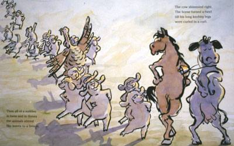{width="4.166666666666667in"
height="2.59375in"}

**Reading**

**Identifying the topic of the story.**

Discussion before, during, and after reading.

**Identifying and explaining the purpose in writing.**

**Before Reading:** Begin the discussion by asking students if they
remember the topic of this story. What other book have they read that is
about a character who believed he/she could do something?

How they (the students) are like Dumpy La Rue? How are they different
than Dumpy La Rue?

Author's Purpose

Entertain Persuade Inform

Remind students that all authors have a purpose for writing.

What do you think was the purpose that the author, Elizabeth Winthrop,
had in writing Dumpy La Rue? Do you think there is more than one
purpose?

\*If the students have not been taught that an author may have more than
one purpose, Dumpy La Rue is a great example of writing to entertain and
persuade.

Students need to know that to be entertaining, a story evokes emotions.
They need to look for clues that depict emotions such as happiness,
sadness, determination, etc.

Students also need to know that to be persuading, the author is
presenting his own opinions or beliefs. They need to look for clues that
express the author's beliefs.

**During Reading:**

Visualising:

While you hear the story being read aloud, note places where the author
gives you a clear picture of how Dumpy or any of the animals feel.

What were some parts of the story that showed emotion?

Questioning

What was the author trying to tell the reader when he said, "But Dumpy
La Rue was a pig who knew what he wanted to do?" Why would the author
repeat this three times in the story? (Pages 4, 10, 30)

Inferring

I wonder why Dumpy La Rue told the cow and the horse that they couldn't
hear his tune or his beat that was in his head, but they just had to
close their eyes and listen inside?

**After Reading:**

Determining Importance

The author repeats that Dumpy La Rue knew what he wanted to do.

Did Dumpy's parents and sister support Dumpy at the beginning of the
story? Did they change how they felt?

Did the animals believe that Dumpy could dance?

Did Dumpy believe he could dance?

So what do you think the author was trying to say?

Turn and Talk: Discuss why you think the author had two purposes:
entertain and persuade.

Share with the class.

**Reading Response Journals**

Entertain:

The author made me feel \_\_\_\_\_\_\_\_\_\_\_\_\_\_\_\_\_\_\_\_\_ when
\_\_\_\_\_\_\_\_\_\_\_\_\_\_\_\_\_\_\_\_\_\_\_\_\_\_\_\_\_\_\_\_\_\_\_\_\_\_\_\_\_\_\_\_\_\_\_\_\_\_\_\_\_\_\_\_\_

Persuade:

The author was trying to say that
\_\_\_\_\_\_\_\_\_\_\_\_\_\_\_\_\_\_\_\_\_\_\_\_\_\_\_\_\_\_\_\_

\_\_\_\_\_\_\_\_\_\_\_\_\_\_\_\_\_\_\_\_\_\_\_\_\_\_\_\_\_\_\_\_\_\_\_\_\_\_\_\_\_\_\_\_\_\_\_\_\_\_\_\_\_\_\_\_\_\_

Synthesising

If you were to tell another person about Dumpy La Rue and you could only
use a few sentences, what would you say?

What did the author mean when he said, "But Dumpy LaRue was a pig who
knew what he wanted to do?

What do you think was the author's message?

**Writing**

The author zoomed in and described with vivid details.

*A turkey all gobbling,*

*a goat and his mate,*

*and five grey rats, who were quite overweight.*

*They stopped and they stared.*

*They leaned on the fence.*

*'Twas the first time they'd seen*

*a pig who could dance.*

The author zooms in and describes the scene with vivid words such as
"gobbling", "overweight", and "a pig who could dance."

*He slipped in the slop,*

*he slid in the slime.*

*But no matter what,*

*he always kept time.*

*He did a glissade,*

*A pas de bourree.*

*From slop heap to bucket,*

*he jeted his way.*

**Vivid Imagery Words** used in Dumpy La Rue

bellow

swallow

wallow

snort

cavort

twirled

prowl

gobbling

slick

slipped in the slop

slid in the slime

glissade

pas de bourree (a turn in jazz dancing)

jeted ( a modern dance/ballet move that starts by first chasing ones
feet together in gliding motion followed by a kick in mid-air where the
legs switch places with one another).

glissade (ballet and modern dance move like a jete)

porker with passion

dancing fool

reticent mule

rhumbas

choirs of angels sing

stirred

shimmied

shuffled

**Voice**

Read Aloud

Create a short list of encouraging statements for Dumpy LaRue to follow
as he learns how to dance. Compare these statements to the negative ones
that other characters in the book make. Discuss the value of having
positive support when attempting difficult things.

Discuss how Dumpy took on a hard task even though his family didn't
believe in him.

*Do you think Dumpy took a risk when he taught himself how to dance?
What kind of risk? Was he afraid of what others might think?*

*Is the risk Dumpy took like the risk writers take when they write with
voice.*

Students look at a piece of their own writing and see if it has voice.

*Have you taken any risks with your writing by choosing new words,
coming up with fresh and originals details, or trying a new way to
organize?*

Writing with voice is how you let readers know how you think and feel --
like Dumpy La Rue did when he danced.

Create a list of motivating bulletin board comments on voice that
students can turn to when they need them. e.g.

*This sounds just like you!*

*What an unusual way to look at this.*

*It made me think.*

*I feel like I know this person.*

*This piece begs to be read aloud.*

*You piece is not like anyone else's.*

*I can identify with this point of view.*

Writer's Notebook: Write about times when you've shown perseverance like
Dumpy La Rue. Reflect on what you've learnt from that experience.

- Voice unit by R.Culham

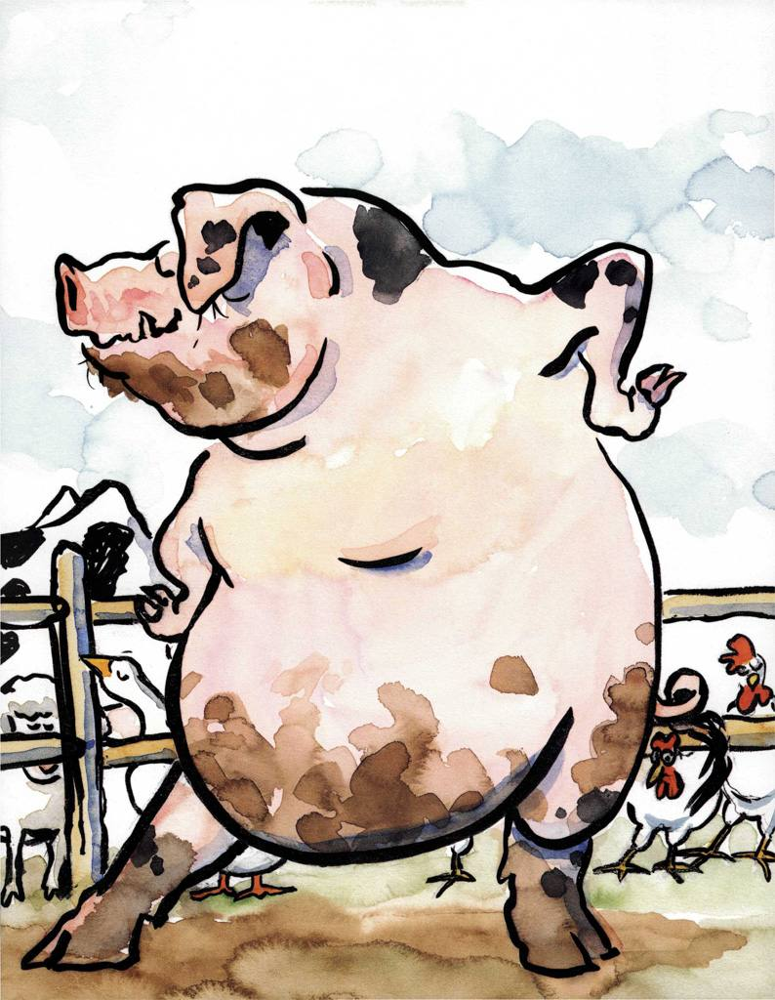{width="6.268055555555556in"
height="8.083739063867016in"}

**Dumpy La Rue Elizabeth Winthrop**

Dumpy La Rue wanted to dance.

"You're a pig," said his father.

"Pigs don't dance.

They grunt, they grovel,

they snuffle for truffles."

"Pigs don't dance,"

said his mother.

"They bellow, they swallow,

they learn how to wallow."

"I want to dance,"

said Dumpy.

"Fat chance," said his sister.

"Boys don't dance.

They fight, they march,

they sport, and they snort.

And they're never ever

supposed to cavort."

But Dumpy La Rue

was a pig

who knew what he wanted to do.

He twirled in the sty,

raised his snout to the sky,

spread his hooves far and wide,

and pretended to fly.

The cow came by.

Then the horse, and some fowl,

a mule, fourteen sheep, and the fox on the prowl.

A turkey all gobbling,

a goat and his mate,

and five grey rats, who were quite overweight.

They stopped and they stared.

They leant on the fence.

'Twas the first time they'd seen

a pig who could dance.

"Hey, Dumpy, you're dancing,"

yelled the goose. "What a kick!"

She hopped up and down.

"You look pretty slick!"

Dumpy's father buried his snout.

Dumpy's mother tried to go out.

Dumpy's sister knocked off the flies,

sat down in the mud,

and covered her eyes.

But Dumpy La Rue

was clearly a pig

who knew what he wanted to do.

he slipped in the slop.

he slid in the slime.

But no matter what,

he always kept time.

He did a glissade,

a pas de bourree.

From slop heap to bucket,

he jeted his way.

"He's a porker with passion,

a dancing fool,

a pig with a rhythm --

this breaks every rule,"

said the normally reticent mule.

"We want to dance too,"

cried the sheep.

"It looks fun.

Why should *he* be

the only one?"

"What's the tune?" yelled the cow.

"What's the beat?" called the horse.

"You can't hear it, of course."

said Dumpy La Rue.

"It's all in my head.

*You* have it too.

If you want to dance,

if you want to glide,

just close your eyes

and listen inside."

The turkey stopped gobbling.

The barnyard grew quiet.

Even Poppa Pig decided to try it.

Some heard bugles,

some heard drums,

some heard mothers humming hums.

Some heard rhumbas,

some heard swing,

some heard choirs of angels sing.

Some heard jazz,

some heard blues,

some heard the slap of tapping shoes.

Then all of a sudden

in twos and in threes

the animals stirred

like leaves to a breeze.

The cow shimmied right.

The horse turned a twirl

till his long knobbly legs

were curled in a curl.

The goats did a two-step.

The fox did a three.

The mule danced the salsa

with a neighbouring tree.

The rats formed a line

and shuffled down the lane.

And when they reached the gate

they shuffled back again.

Poppa Pig waltzed Mama

all around the sty.

Even Dumpy's sister

bounced a little

on the sly.

"You were right," called his mother.

"You were right," cried his pop.

"Once you get us pigs a-dancing,

we don't ever want to stop."

Now his friends had learnt to dance,

they would never be the same.

They would tango in the hay,

they would rhumba night and day.

Word would spread far and wide

of mules that twirl and sheep that glide.

Folks would come from high and low

to see this most amazing show.

The barnyard ballet

of Dumpy La Rue.

The pig who knew

what he wanted to do.

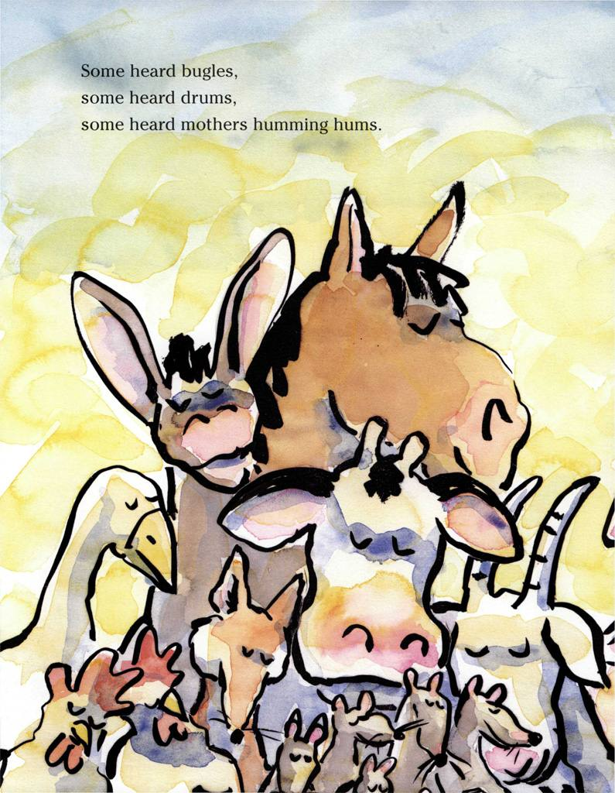{width="6.268055555555556in"
height="8.073570647419073in"}

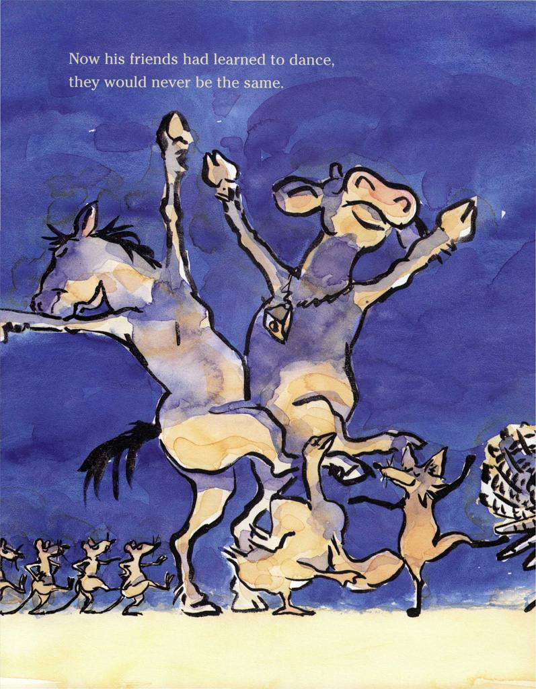{width="6.268055555555556in"
height="8.053311461067366in"}

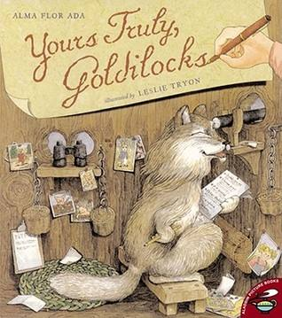{width="3.311111111111111in"
height="3.745138888888889in"}

**Yours Truly, Goldilocks Alma Flor Ada**

Everyone who\'s anyone will be at the Three Little Pigs\' housewarming
party. Goldilocks and Little Red Riding Hood have already marked it on
their calendars.

Unfortunately, so have the wolves \-- those who\'ve caused the Pigs to
build their brick house in the first place!

In this wonderfully creative sequel to Dear Peter Rabbit, Alma Flor Ada
imagines what it would be like if a few beloved fairy-tale characters
were pen pals. Leslie Tryon\'s intricate and colourful illustrations
make the unique epistolary format fun for young readers.

Discussion Topics

•Be sure your students are familiar with the original tales that
inspired Dear Peter Rabbit and Yours Truly, Goldilocks: The Three Little
Pigs, Beatrix Potter's Rabbit stories, Goldilocks and the Three Bears,
and Little Red Riding Hood. Try to share several versions of each story
and encourage the children to identify and discuss differences. Do they
have a favourite version? Why?

•What makes a good friend? Discuss the ways that these characters help
each other out in times of trouble. Have your students ever helped a
friend? Have they ever been helped by one? Encourage them to share their
own experiences.

•Brainstorm about fanciful party guests. Ask your students to name
favourite characters---from these books as well as others---that they
would want to invite to their birthday party.

•Many of the storybook characters are confused by the term
"housewarming." Discuss what it means with your students. What do they
think are appropriate gifts for a real life housewarming party?

**Yours Truly, Goldilocks Alma Flor Ada**

*Brick House*

*Woodsy Woods*

*April 7*

*Goldilocks McGregor*

*McGregor's Farm*

*Veggie Lane*

*Dear Goldilocks,*

*Thank you, thank you, thank you! The three of us had a great time at
your birthday party.*

*It was a wonderful, wonderful, wonderful party. That is, all three of
us think it was wonderful.*

*As you know, we have had a terrible time building our houses. Now that
we are sure that no wolf can blow down our new house, no matter how hard
he huffs and puffs, we would like to finally have a house warming party
on April twenty-ninth. We would be very happy if you were our special
guest. we are also sending invitations to Baby Bear, Little Red Riding
Hood, and Peter Rabbit. We look forward to a wonderful day.*

*Love, love, love, your three friends,*

*Pig One, Pig Two, and Pig Three*

> *Cottage in the Woods*

*Hidden Forest*

*April 9*

*Little Red Riding Hood*

*Cardinal Cottage*

*Riding Lane*

*Dearest Granddaughter,*

*You have such a wonderful imagination! Just to think \... a birthday
party with bears, rabbits, and pigs. Well, well, I imagine you and
Goldilocks must have had fun with your stuffed animals.*

*Goldilocks sounds like a very nice girl. I have known the McGregor
family for a long time. Years ago when I lived on Riding Lane, I used to
buy all my vegetables from them. Mr McGregor is a stern man but a
wonderful gardener.*

*Give a kiss to your mother for me. I hope you can come to see me again
soon. I'll be here all day on the twelfth. Why not then? But you must
keep your promise to stay on the trail this time. That encounter with
the wolf was certainly not imaginary.*

*Love,*

*Grandma*

> **Majestic Tower**

**Hidden Lane**

**Wooden Heights**

**April 9**

**Wolfy Lupus**

**Wolf Lane**

**Oakshire**

**Dear Cousin Wolfy,**

**After my humiliation at their hands, my continued surveillance of the
porcine trio and their friends has finally proven useful.**

**I have been led to believe that there will be a gathering at their
house on the twenty-ninth of April for a house warming party. This means
that a delicious bunch of morsels -- that is, guests -- will be
attending and I have a stupendous plan to ensure that not all of them
will return home.**

**A deep trench on Royal Road after the fork will force them to take
Forest Trail. It will not be difficult for us to ambush them there.**

**After their party at that stubborn brick house, we will show them a
true party in my majestic tower. What do you think?**

**Why don't you come to stay on the twenty-seventh? That will give us
ample time for the necessary preparations.**

**Affectionately,**

**Fer O'Cious**

> Cardinal Cottage

Riding Lane

April 10

Goldilocks McGregor,

Have you received an invitation from the three Pigs for their house
warming party? After all the fun we had at your birthday it will be
wonderful to all get together again. You certainly have interesting
friends.

I wrote a long letter to my grandmother telling her all about your
birthday party, and she doesn't believe it's true that Peter Rabbit,
Baby Bear and the Three Pigs were there.

When I visit her the day after tomorrow I will take the invitation to
the house warming party and tell her all about it in person, and she
will see it is true.

Do you want to go together to the pigs' party? My mother says it is okay
if you want to come the day before and spend the night. And she will
make us some of her special gingerbread cookies.

Your good friend

LITTLE RED RIDING HOOD

McGregor's farm

Veggie lane

April 12

Little Red Riding Hood

Cardinal Cottage

Riding Lane

Dear Little Red Riding Hood,

Yes, I did receive the invitation and I would love to spend the night at
your house and go together to the house warming party. Do you have any
idea what one does at a house warming party? I know the pigs have been
trying to have one for a long time. Do you think we bring blankets to
warm the house?

Baby Bear would like for us to go play hide-and-seek a week from Sunday.
His cousins Teddy and Osito are visiting. Do you want to go? I love
houses in the forest, don't you?

Be careful on your visit to your grandmother. My father says there
definitely still are wolves around.

I have to write to the pigs and Baby Bear, and I still need to water
three rows of vegetables, so I must go now.

Your busy friend,

Goldilocks

**Wolf Lane**

**Oakshire**

**April 13**

**Fer O'Cious**

**Majestic Tower**

**Hidden Lane**

**Wooden Heights**

**Dear Cousin Fer,**

**You are definitely right about the forthcoming event on April
twenty-ninth. Yesterday, as I was trailing that appetising- looking
creature in red, she seemed to have gotten scared somehow. As she ran
into her grandmother's house, she dropped an invitation on the path.
Sure enough, those pigs of yours are inviting everyone to a house
warming party. I am enclosing the foolish card for your perusal.**

**I found any mention of warming in their house somewhat distasteful,
their description of their abode pretentious, and their reference to us
rather offensive.**

**There is no question that I will join you in your efforts. I like your
plan and I will be there on the twenty-seventh with ready paws and
sharpened teeth!**

**Your affectionate cousin,**

**Wolfy**

> McGregor's Farm
>
> Veggie Lane

April 13

Baby Bear

Bear House in the Woods

Hidden Meadow

Dear baby Bear,

Your letter was very nice. I have always loved getting letters. Although
right now I am getting so many, I can't find enough time to answer back.
And my father is always after me to go water the vegetables.

I don't mind too much watering the lettuces and the carrots. They grow
close to the well and I don't have to carry the watering can that far.
But the spinach and the peas are much farther away and that full can
gets heavy. I can't understand how anyone likes to eat that green stuff
anyway.

I would love to go to your house to play hide-and-seek a week from
Sunday and meet your cousins Teddy and Osito. I have already asked
Little Red Riding Hood to come also.

Your very good and busy friend,

Goldilocks

> McGregor's Farm
>
> Veggie Lane

April 15

Pig One, Pig Two, and Pig Three,

A house warming party sounds like a terrific idea! I love parties, but I
have never been to a house warming party yet. How do you warm the house?
Do you want us to bring blankets?

Little Bear would like to play hide-and-seek. Would you like to come to
his house a week from today? His cousins Teddy and Osito will be there
also.

Have you seen or heard from Peter Rabbit? I haven't heard anything from
him, except that the one carrot I leave each night outside the hedge is
always gone the next morning. Do you know if he is all right? Things are
a lot quieter in my house since my father doesn't complain anymore about
stolen vegetables, but I miss Peter! If you come to the Bears' house,
please bring him along!

Your friend,

Goldilocks

> Rabbit's Burrow

Hollow Oak

April 23

Goldilocks McGregor

McGregor's Farm

Veggie Lane

Dear Goldilocks,

My friends the Pigs came by to see me yesterday, after you all played
hide-and-seek at the Bears' Sorry I couldn't be there.

They told me you were worried about me and I am sorry i have not written
before. You see, I have been in bed now for almost three weeks with
measles.

Your carrots have been wonderful. Flopsy, Mopsy, and Cotton-tail have
been picking them up every morning at dawn. They did not get measles
this time because they all had it last year. My mother has been feeding
us carrot soup carrot salad, and carrot cake; I love carrots! She has
also been feeding me gallons of chamomile tea. You know my mother loves
chamomile tea!

Now that the measles are all gone I will be able to go to the Pigs'
party Sunday. See you there!

Thanks again for the carrots!

Your very dearest friend,

Peter Rabbit.

P.S. The Pigs convinced my mother to allow Flopsy, Mopsy and Cottontail
to come to their party. They are dying to meet you!

Rabbit's Burrow

Hollow Oak

May 1

Mrs Mother Bear

Bear House in the Woods

Hidden Meadow

Dear Mrs Bear,

I wanted my mother to help me write you a letter, but she says that if I
can get into trouble all by myself, I should be able to write this
letter all by myself.

The first thing I want to say is THANK YOU VERY MUCH! Thank you for
saving me from those two terrible wolves.

As you know, it is usually not very easy for a wolf to catch a rabbit.
And I could race those two and win easily anytime. But I was talking to
Goldilocks about the party and didn't even see them coming. Before i
knew it I was inside that ugly sack. I thought it was the end of all of
us.

They tell me you were terrific, and I wish I could have helped you
instead of being inside that smelly sack. Thank you again for saving my
life.

Gratefully yours,

Peter Rabbit

P.S. Although my mother wanted me to write the letter she is very
thankful too. And it wouldn't surprise me at all if she were planning
something special to thank you.

**\**

**Majestic Tower**

**Hidden Lane**

**Wooden Heights**

**May 1**

**Speedy raccoon, Furrier**

**Forest Drive**

**Hidden Forest**

**Dear Mr Raccoon:**

**My cousin Mr Wolfy Lupus and I are in great need of your services
again. Both of us have been the unfortunate victims at t**he **paws of
an angry mother bear.**

**Since we are both bedridden, would you be able to make a house call to
take the necessary measurements\>**

**I will be needing a new tail. I trust you will be able to provide one
of an elegant deep grey colour to match the rest of my beautiful fur. My
cousin will require some large patches on the back as well as a
supplementary ear.**

**To imagine that a bear would go to such lengths to defend a couple of
little girls and some silly rabbits! We certainly did not mean to bother
her bear cub at all.**

**We look forward from hearing from you at your earliest convenience
since we would like to change our sorrowful state.**

**Sincerely,**

**Fer O'Cious**

> McGregor's Farm
>
> Veggie Lane

**May 1**

**Pig One, Pig Two, and Pig Three**

**Brick House**

**Woodsy Woods**

**Dear Pig One, Pig Two, and Pig Three,**

**Your house warming party was truly spectacular. i didn't know what a
house warming party was all about before it started. it was great to
realise that a house is warmed with friends, fun, and laughter.**

**As I am sure you know by now, several of us had a horrific experience
on our way home after the party. It was very scary!**

**Little Red Riding Hood and I have been thinking we should all get
together to plan how to thank Mother Bear for saving our lives and how
to make sure those ugly wolves cannot hurt us.**

**Please begin thinking of wonderful ideas. When we decide a time and
place to meet, we will let you know.**

**Enjoy your brick house!**

**Yours Truly,**

**Goldilocks**

**\**

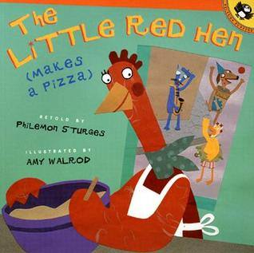{width="3.3125in"
height="3.3020833333333335in"}

**Little Red Hen (Makes a Pizza) Philemon Sturgess**

The story of the industrious Little Red Hen is not a new one, but when
this particular hen spies a can of tomato sauce in her cupboard and
decides to make a pizza, the familiar tale takes on a fresh new twist.
Kids will love following along as the hen, with no help from her friends
the duck, the dog, and the cat, goes through the steps of making a
pizza-shopping for supplies, making the dough, and adding the toppings.
But despite their initial resistance, the hen\'s friends come through in
the end and help out in a refreshing and surprising way.

Descriptive Writing

The primary purpose of descriptive writing is to describe a person,
place or thing in such a way that a picture is formed in the reader\'s
mind. Capturing an event through descriptive writing involves paying
close attention to the details by using all of your five senses.
Teaching students to write more descriptively will improve their writing
by making it more interesting and engaging to read.

Why teach descriptive writing?

It will help your students\' writing be more interesting and full of
details

It encourages students to use new vocabulary words

It can help students clarify their understanding of new subject matter
material.

How to teach descriptive writing

There\'s no one way to teach descriptive writing. That said, teachers
can:

Develop descriptive writing skill through modelling and the sharing of
quality literature full of descriptive writing.

Call students\' attention to interesting, descriptive word choices in
classroom writing.

Descriptive writing shares the following characteristics:

- Good descriptive writing includes many vivid sensory details that
  paint a picture and appeals to all of the reader\'s senses of sight,
  hearing, touch, smell and taste when appropriate. Descriptive writing
  may also paint pictures of the feelings the person, place or thing
  invokes in the writer. Watch a teacher use a five senses graphic
  organizer as a planning strategy for descriptive writing

- Good descriptive writing often makes use of figurative language such
  as analogies, similes and metaphors to help paint the picture in the
  reader\'s mind.

- Good descriptive writing uses precise language. General adjectives,
  nouns, and passive verbs do not have a place in good descriptive
  writing. Use specific adjectives and nouns and strong action verbs to
  give life to the picture you are painting in the reader\'s mind.

- Good descriptive writing is organised. Some ways to organise
  descriptive writing include: chronological (time), spatial (location),
  and order of importance. When describing a person, you might begin
  with a physical description, followed by how that person thinks, feels
  and acts.

<!-- -->

- Reading Rockets

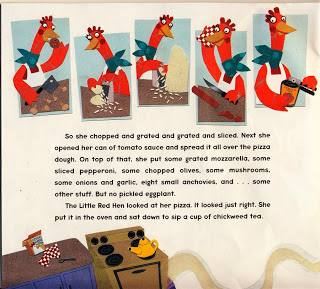{width="3.9331014873140857in"
height="3.5520833333333335in"}

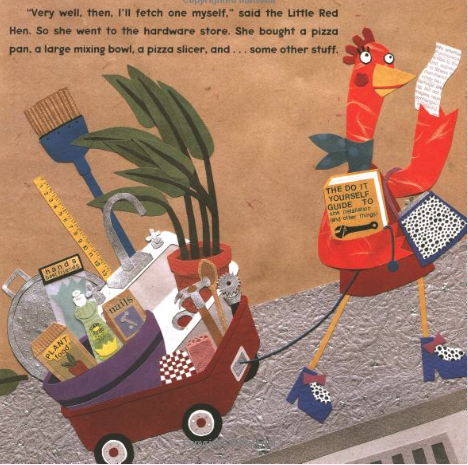{width="4.875in"
height="4.84375in"}

**The Little Red Hen (Makes a Pizza) Philemon Sturgess**

The Little Red Hen had eaten the last slice of her tasty loaf of bread.
She'd sipped a cup of chickweed tea and taken her nap. Now she was
hungry again. So she scratched through her cupboard and spied a can of
tomato sauce.

Why don't I make a lovely pizza? she said to herself.

She rummaged through her pan drawer. There were bread pans, cake pans,
muffin pans, frying pans -- all kinds of pans -- but not one single pan
was large and round and flat.

"Cluck," she said. "I need a pizza pan."

She stuck her head out the window. "Good morning," she called. "Does
anybody have a pizza pan?"

"Not I," said the duck.

"Not I," said the dog.

"Not I," said the cat.

"Very well, then, I'll fetch one myself," said the Little Red Hen. So
she went to the hardware store. She bought a pizza pan, a large mixing
bowl, a pizza slicer, and \... some other stuff.

When she got home, she opened the cupboard. She saw beans and rice,
sugar and spices, jars of jam, and jars of honey, and even pickled
eggplant -- but no flour.

"Cluck," she said. "I need flour."

She stuck her head out the window. "Hello," she said. "Who'll run to the
store and get me some flour?"

"Not I," said the duck.

"Not I," said the cat.

"Not I," said the dog.

"Very well, then, I'll fetch some myself," said the Little Red Hen. So
she went to the supermarket. She bought some flour, some salt, some oil,
and \... some other stuff.

When she got home, she opened the fridge.

"Cluck," she said. "There's cream cheese, blue cheese, string cheese,
and Swiss cheese \... but no mozzarella!" So \...

She stuck her head out the window. "Excuse me," she said. "Who will go
to the store and buy me some mozzarella?"

"Not I," said the duck.

"Not I," said the dog.

"Not I," said the cat.

"Very well, then, I'll fetch some myself," said the Little Red Hen.

So the Little Red Hen went to the delicatessen. She bought some
mozzarella, pepperoni, and olives; some mushrooms, onions, and garlic; a
can of eight small anchovies; and \... some other stuff. But no pickled
eggplant.

When she got home, the Little Red Hen put on her apron and stuck her
head out the window. "Good afternoon," she said. "Who will help me make
some pizza dough?"

"Not I," said the duck.

"Not I," said the dog.

"Not I," said the cat.

"Very well, then, I'll make it myself," said the Little Red Hen.

So she put the flour and some other stuff into her mixing bowl and
stirred and mixed and mixed and kneaded and kneaded and pounded until
she had a big ball of pizza dough.

After the dough rose, the Little Red Hen rolled it flat and folded it
and rolled it again and spun it around her head several times.

When the dough was just right, she tossed it way up in the air one last
time for good luck and put it in her pizza pan.

Then she stuck her head out the window. "Excuse me," she said. "Who will
help me make the topping?"

"Not I," said the duck.

"Not I," said the dog.

"Not I," said the cat.

"Very well, then, I'll make it myself," said the Little Red Hen.

So she chopped and grated and sliced. Next she opened her can of tomato
sauce and spread it all over the pizza dough. On top of that, she put
some grated mozzarella, some sliced pepperoni, some chopped olives, some
mushrooms, some onions and garlic, eight small anchovies, and \... some
other stuff. But no pickled eggplant.

The Little Red Hen looked at her pizza. It looked just right.

She put it in the oven and sat down to sip a cup of chickweed tea.

Pretty soon a delicious smell drifted from the oven. It filled the room
and floated out the window.

My lovely little pizza must be ready, she thought.

It was lovely, but it was not little.

So she stuck her head out the window. "Good evening," she said. "Would
anybody like some pizza?"

Can you guess what the duck said?

Can you guess what the dog said??

Can you guess what the cat said???

They all said, "YES!" of course.

Then she asked, "Who will help me do the dishes?"

Now can you guess what the duck, the dog, and the cat each said?

They each said, "I will."

"I will."

"I will."

And they did.

**The Little Red Hen retold by Brenda Parkes**

One spring morning, the little Red Hen found a grain of wheat.

"I will plant this grain of wheat," she said.

She asked the duck, "Will you help me plant this grain of wheat?"

"Not I," quacked the duck. "I've got better things to do."

She asked the dog, "Will you help me plant this grain of wheat?"

"Not I," barked the dog. "I've got better things to do."

She asked the cat, "Will you help me plant this grain of wheat?"

"Not I," meowed the cat. "I've got better things to do."

She asked the pig, "Will you help me plant this grain of wheat?"

"Not I," grunted the pig. "I've got better things to do."

"Then I'll plant it myself," said the little Red Hen. And she did.

The wheat grew tall and it ripened.

"Who will help me cut the wheat?" asked the little Red Hen.

"Not I," quacked the duck.

"Not I," barked the dog.

"Not I," meowed the cat.

"Not I," grunted the pig.

"Then I will do it myself," said the little Red Hen. And she did.

Now the wheat was ready to go to the mill.

"Who will help me take the wheat to the mill?" asked the little Red Hen.

"Not I," quacked the duck.

"Not I," barked the dog.

"Not I," meowed the cat.

"Not I," grunted the pig.

"Then I will do it myself," said the little Red Hen. And she did.

When she got home with the flour she asked, "Who will help me make the
bread?"

"Not I," quacked the duck.

"Not I," barked the dog.

"Not I," meowed the cat.

"Not I," grunted the pig.

"Then I will make it myself," said the little Red Hen. And she did.

Soon the bread was ready to bake.

"Who will help me bake the bread?" asked the little Red Hen.

"Not I," quacked the duck.

"Not I," barked the dog.

"Not I," meowed the cat.

"Not I," grunted the pig.

"Then I will do it myself," said the little Red Hen. And she did.

When the bread was cool she asked, "Who will help me eat the bread?"

"I will!" quacked the duck.

"I will!" barked the dog.

"I will!" meowed the cat.

"I will!" grunted the pig.

"Oh, no, you won't!" said the little Red Hen. "I will eat it myself."

And she did!

> *The gloriously illustrated story of an errand turned adventure turned
> existential parable.*

[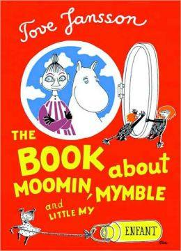{width="1.9791666666666667in"
height="2.7395833333333335in"}](http://www.amazon.com/exec/obidos/ASIN/1897299958/braipick-20)The *Moomin* series
by Swedish-Finn artist, writer, comic strip creator, and children's book
author [Tove
Jansson](http://www.brainpickings.org/index.php/tag/tove-jansson/) (1914--2001),
recipient of the prestigious Hans Christian Andersen Medal, is among the
most imaginative storytelling of the past century. Partway between
children's books and comics, her lovable family of roundish white
hippopotamus-like creatures have captivated generations since their
birth in 1945. The crown jewel of the series is arguably the 1952
picture-book [***The Book about Moomin, Mymble and Little
My***](http://www.amazon.com/exec/obidos/ASIN/1897299958/braipick-20) ---
a playful and philosophical tale that falls somewhere between Øyvind
Torseter's [*The
Hole*](http://www.brainpickings.org/index.php/2013/09/16/the-hole-enchanted-lion/) (which
was possibly inspired by Jansson) and [Dr.
Seuss](http://www.brainpickings.org/index.php/tag/dr-seuss/), with a
touch of [Edward Goreyesque creaturely
magic](http://www.brainpickings.org/index.php/2012/04/04/edward-gorey-donald-boxed-set/) and [*Alice
in
Quantumland*](http://www.brainpickings.org/index.php/2014/01/30/alice-in-quantumland-robert-gilmore/) mind-bending.
Parallels notwithstanding, Jansson's singular sensibility makes this
vintage treasure one of the greatest children's books of all time, so
unlike anything else that ever existed before or since that it inhabits
a wholly different yet timelessly welcoming universe.

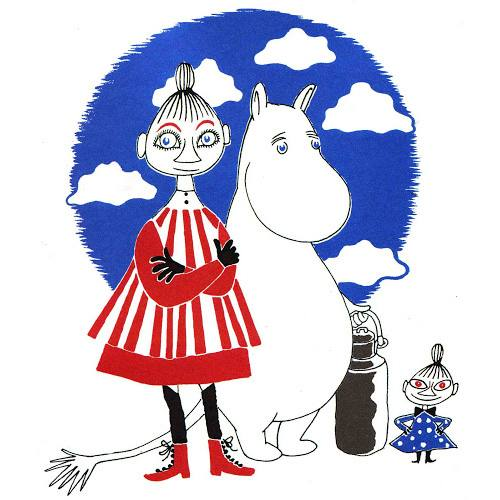{width="5.208333333333333in"
height="5.208333333333333in"}

The story is driven by a clever what-comes-next guessing game as we
follow little Moomintroll on an errand that turns into an adventure that
turns into an existential parable. Moomintroll, brimming with the
boundless optimism typical of Jansson's Moomin family, sets out to help
the distraught Mymble find her sister, Little My --- an irreverent,
independent-minded, sharp- and even acerbic-witted heroine who stands as
the naughty but necessary anchor to the Moomin buoyancy. That dynamic
--- the eternal tussle between [skepticism and
openness](http://www.brainpickings.org/index.php/2012/05/23/carl-sagan-the-burden-of-skepticism/) that
keeps life in balance --- is one of the story's powerful underlying
themes, and yet it only amplifies rather than detracting from the joyful
hopefulness of the overall message.

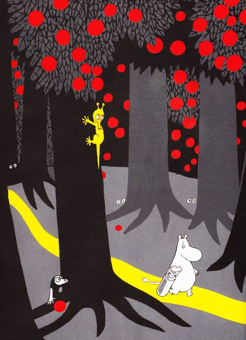{width="4.8125in"
height="6.631625109361329in"}

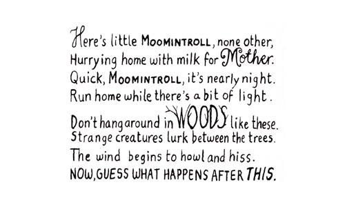{width="5.208333333333333in"
height="3.125in"}

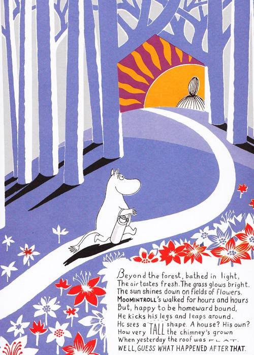{width="5.208333333333333in"
height="7.270833333333333in"}

Beautifully illustrated and hand-lettered in rhythmic verse, the book
features gorgeous and brilliantly placed die-cut holes, reminiscent
of [*I Saw a Peacock with a Fiery
Tail*](http://www.brainpickings.org/index.php/2012/05/15/i-saw-a-peacock-tara-books/),
which lend the story an enchanting quality that plays into our human
restlessness for knowing what's around the corner, cleverly reminding us
that what we think we see is often a distortion of what actually is.

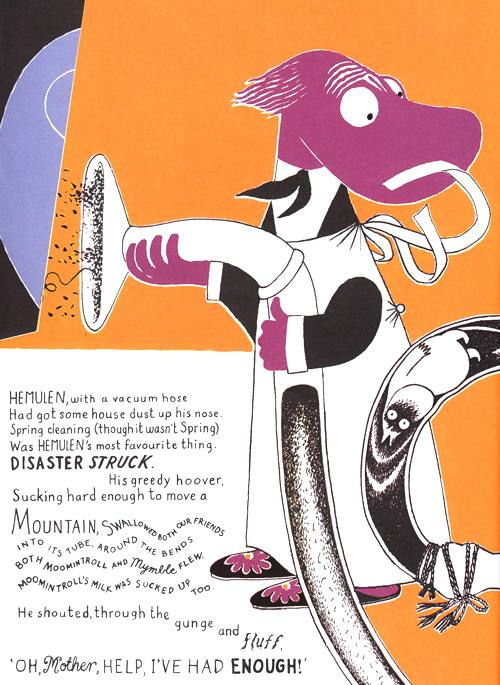{width="5.208333333333333in"
height="7.135416666666667in"}

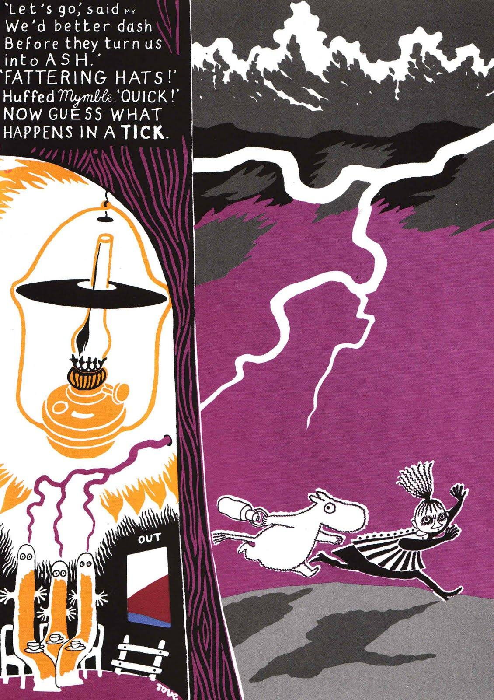{width="5.208333333333333in"
height="7.364583333333333in"}

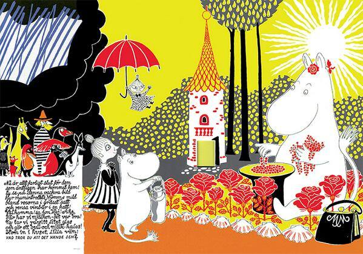{width="5.208333333333333in"
height="3.6354166666666665in"}

And while the book was Jansson's first to be [adapted for
iPad](https://itunes.apple.com/us/app/moomin-mymble-and-little-my/id531261142?mt=8),
what screen could possibly replace the immeasurable tactile magic of
this beautifully, thoughtfully designed paper masterpiece?

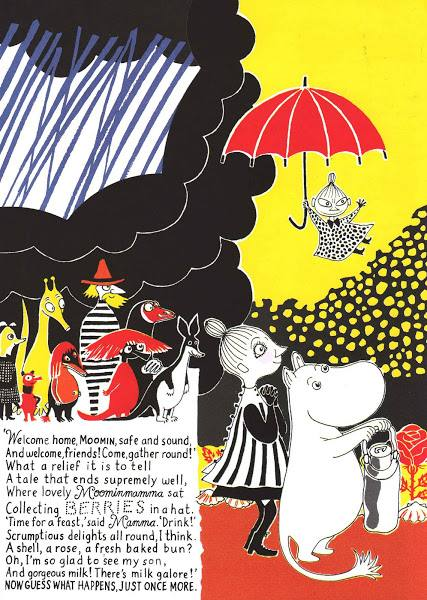{width="4.447916666666667in"
height="6.25in"}\
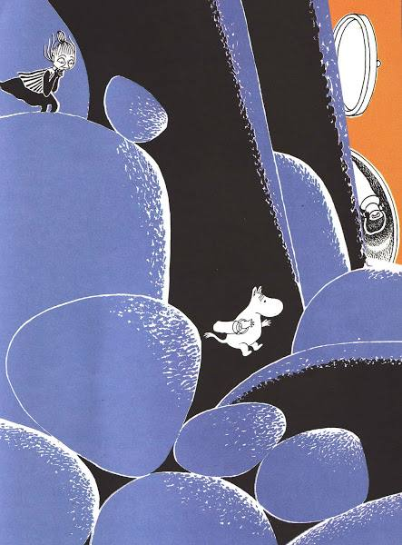{width="4.614583333333333in"
height="6.25in"}

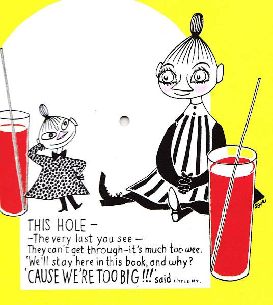{width="5.583333333333333in"
height="6.25in"}

**The Book about Moomin, Mymble and Little My**

**Tove Jansson**

Here's little Moomintroll, none other,

Hurrying home with milk for Mother.

Quick, Moomintroll, it's nearly night.

Run home while there's a bit of light.

Don't hang around in woods like these

Strange creatures lurk between the trees.

The wind begins to howl and hiss.

Now, guess what happens after this.

Beyond the forest, bathed in light,

The air tastes fresh. The grass glows bright.

The sun shines down on fields of flowers.

Moomintroll's walked for hours and hours

But, happy to be homeward bound,

He kicks his legs and leaps around.

He sees a tall shape. A house? His own?

How very tall the chimney's grown

When yesterday the roof was flat.

Well, guess what happened after that.

'That's not a roof or chimney pot --

It's Mymble's hair, tied in a knot!

She's weeping on a big tin can,

Poor thing,' thought moomintroll, and ran

To Mymble, begging, 'Please, don't cry!'

'I've lost my sister, Little My,'

She told him, and began to yelp.

'She ran away! Oh, Moomin, help!'

Moomintroll frowned. 'Well, let's begin

By checking if she's in this tin.

Some villain might have stashed her in it.'

Now guess what happens in a minute.

They crawl out on the other side

Next to a river, deep and wide,

Where Gaffsie, with her gruesome hair,

Gives them a mean and chilling stare

And growls, 'You fools! Make you wish

You'd stayed at home. Now let me fish.'

Mymble says, 'Quick, let's go. She'll bite.'

And Moomintroll says, 'Yes, quite right.

Perhaps your sister's in this cave?'

They tiptoe in. They must be brave,

And find poor Little My somehow.

Well, Guess what happens to them now.

Among the boulders piled up high

There is no sign of Little My.

They search and search but find no trace.

The bitter wind whips Mymble's face.

Moomintroll feels extremely glum.

He wants his home, his bed, his mum.

Where is the warm and sunny days?

Then guess what happened right away.

Hemulen, with a vacuum hose

Had got some house dust up his nose.

Spring cleaning (though it wasn't Spring)

Was Hemulen's most favourite thing.'

disaster struck.

His greedy hoover,

Sucking hard enough to move a

Mountain, swallowed both our friends

Into its tube. Around the bends

Both Moomintroll and Mymble flew.

Moomintroll's milk was sucked up too.

He shouted, through the gunge and fluff,

'Oh, Mother, help, I've had enough!'

A stroke of luck! Who should walk by

But Mymble's sister, Little My.

While taking a relaxing stroll

She'd heard the cries of Moomintroll.'

She cut the tube and pulled it back.

Mymble and Moomintroll were black

With dust from head to toe. My laughed,

'Blimey, the two of you look daft!'

'We've saved you, My!' cheered Mymble, 'Phew!'

Hemulen, seething through and through,

Chased them away like dust and mess --

And guess what happened, go on, guess.

They landed = it was quite amusing --

Where a fillyjonk was snoozing.

'Oh look,' said My. 'What's this red mat?'

'It's fillyjonk! You've squashed her flat!'

Cried Mymble, 'Look, she's in a rage.'

Fillyjonk howled and split this page.

'I think the fillyjonk escaped

Here, through this fiollyjonk-shaped

Hole,' Mymble said. 'This was her route.'

So they set off inm hot pursuit

To where a new adventure beckoned.

Now guess what happened in a second.

The hunt is not a huge success.

They find the fillyjonk's red dress

But as for fillyjonk the creature,

Sad to say, she doesn't feature.

'Golly, now she'll have to buy

A brand new dress,' says Little My.'

A storm flares up. The lightning flashes.

On the beach, a wild wave crashes.

It simply shouldn't be so scary,

Bringing milk back from the dairy.

'My mother needs this milk tonight,'

Says Moomintroll. 'Oh, look, a light!'

A sign of life, a friend, a guide?

Now guess what happens. You decide.

What an odd sight!

What can it be?

Some Hattifatteners

Sipping tea --

Hundreds of

The electric chaps

Who smell of

burned-out thunderclaps!

'Let's go,' said My

We'd better dash

before they turn us

into ash.'

'Fattering hats!'

Huffed Mymble. 'Quick!'

Now guess what happens in a tick.

Millions of sopping raindrops fall.

They got a soakinmg, one and all

(Except for Little My, quite jolly

Underneath her lovely brolly).

The ground, already rather wet

From Mymble's tears, gets wetter yet.

Moomintroll cries, 'We need dry land!'

Wait -- here's someone to lend a hand.

On the horizon, two big ears

And, in between, the sun appears,

Our friends will soon be found, not lost.

Now guess what happens. Fingers crossed.

'Welcome home, Moomin, safe and sound,'

And welcome, friends! Come, gather round!'

What a relief it is to tell

A tale that ends supremely well,

Where lovely Moominmamma sat

Collecting berries in a hat.

'Time for a feast,' said Mamma. 'Drink!'

Scrumptious delights all round, I think.

A shell, a rose, a fresh baked bun?

Oh, I'm so glad to see my son,

And gorgeous milk! There's milk galore!'

Now guess what happens, just once more.

Yuck! All the milk's turned sour and cheesy.

Mamma says, 'Never mind, it's easy:

Now we've all got a greta excuse

For drinking sweet pink berry juice!'

This hole --

-The very last you see --

They can't get through -- it's much too wee.

'We'll stay here in this book, and why?

'Cause we're too big!!! said little My.**\**

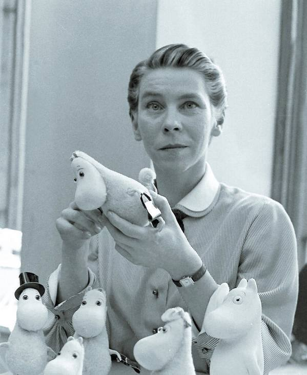{width="6.239583333333333in"
height="7.614583333333333in"}

**Psssst! It\'s Me\... the Bogeyman Barbara Park**

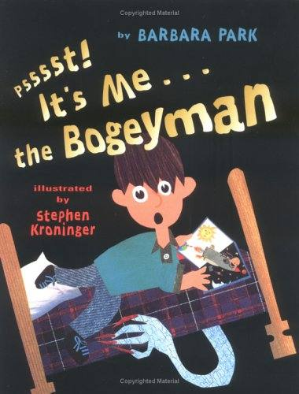{width="2.09375in"
height="2.75in"}

'The Bogeyman goes on an extended rap-rant to set a few things straight
regarding his personality and modus operandi.' He explains to the little
boy whose bed he hides under, whose dark closet he haunts, that he is
\"\"stew-spewin\', gravel-chewin\' mad.\"\" A tabloid claims to have
photographed him and run a headline: \"\"Evil Bogeyman Bellows Boo.\"\"
Well, he wants the tyke to know, he never gets photographed, never says
boo (it\'s a baby word), and never bellows (\"\"l rarely raise my voice.
I\'m a professional, Peppie\"\"). But this Bogeyman lets slip his
aversion to smelly sweat socks, and the boy, by unloosing a bundle of
them, banishes the Bogeyman across the hall, to a sister\'s room. A book
for wordplay.

Discussion: Leaving the 'g' off words to create the voice of the
Bogeyman.

Alliteration when calling the boy different names. Why?

Writing: Narrative -- The Bogeyman (or other fictional scary character).

Poetry -- The Bogeyman

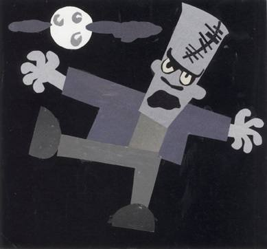{width="3.5520833333333335in"
height="3.3020833333333335in"}

Sketchbook "cut-out" of Frankenstein monster.

+----------------------+-----------------------------------------------------------------------------+
| Craft                | Example                                                                     |
+======================+=============================================================================+
| Lead -- onomatopoeia | Psssssssst!                                                                 |
|                      |                                                                             |
| Circular ending.     |                                                                             |
+----------------------+-----------------------------------------------------------------------------+
| Onomatopoeia         | Zzzzz Ugh! Bluck! Ick! Aaauuugggghhhhhhh!                                   |
+----------------------+-----------------------------------------------------------------------------+
| Alliteration         | finest fingernail jiggle-jam-jelly.                                         |
|                      |                                                                             |
|                      | wafffffft on warm summer winds.                                             |
+----------------------+-----------------------------------------------------------------------------+
| Hyphenated           | It's the genuine, creepy-crawly, blood-chilling, spine-tingling,            |
| Adjectives           | can't-avoid-the-urge-to-grab-your-ankle-when-you're-climbing-into-the-sack, |
|                      | Bogeyguy. dim-witted feet                                                   |
+----------------------+-----------------------------------------------------------------------------+
| Verbs                | Fuming clomping shivering                                                   |
+----------------------+-----------------------------------------------------------------------------+
| Contractions         | I'd it's isn't doesn't you've here's you'd                                  |
+----------------------+-----------------------------------------------------------------------------+
| Sentence fragments.  | The photo's a fake. A fib. A fraud!                                         |
+----------------------+-----------------------------------------------------------------------------+
| Compound words       | fingernail lightbulb upstairs backyard                                      |
+----------------------+-----------------------------------------------------------------------------+
| Ellipses - pause     | Go ... get ... ready ... for ... bed.                                       |
+----------------------+-----------------------------------------------------------------------------+
| Sentence beginnings  | Use of And and But.                                                         |
+----------------------+-----------------------------------------------------------------------------+

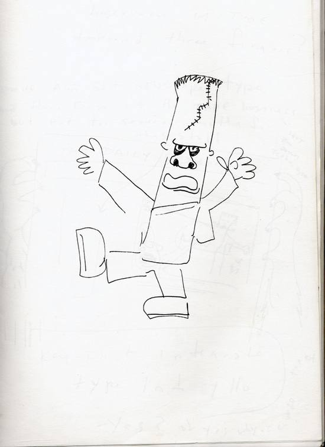{width="5.729166666666667in"
height="7.885416666666667in"}

Preliminary sketch by the artist, Stephen Kroninger.

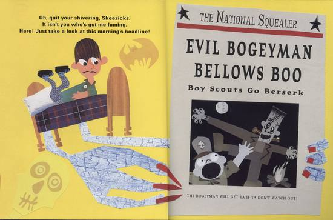{width="5.729166666666667in"
height="3.78125in"}

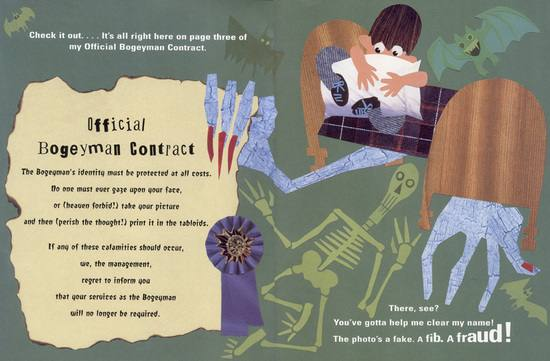{width="5.729166666666667in"
height="3.7604166666666665in"}

**Psssst! It's Me ... the Bogeyman Barbara Park**

Psssssssst!

Yo!

Down here ... under the bed.

It's me, the Bogeyman.

Yeah, you heard me, Sparkie. It's the genuine, creepy-crawly,
blood-chilling, spine-tingling,
can't-avoid-the-urge-to-grab-your-ankle-when-you're-climbing-into-the-sack,
Bogeyguy.

And the news doesn't get any better, Bud, 'cause I'm stew-spewin',
gravel-chewin' mad.

Oh, quit your shivering, Skeezicks.

It isn't you who's got me fuming. Here! Just take a look at this
morning's headline!

[THE NATIONAL SQUEALER]{.underline}

**EVIL BOGEYMAN**

**BELLOWS BOO**

THE BOGEYMAN WILL GET YA IF YA DON'T WATCH OUT!

It's a lie, I tell you! That lummox isn't me! I don't go clomping after
campers like some bumbling, stumbling Frankenstein. And even if I did,
I'd never stop and pose for pictures. I'd lose my job, Jake.

Check it out ... It's all right here on page three of my Official
Bogeyman Contract.

**Official**

**Bogeyman Contract**

**The Bogeyman's identity must be protected at all costs.**

**No one must ever gaze upon your face,**

**or (heaven forbid!) take your picture**

**and then (perish the thought!) print it in the tabloids.**

**If any of these calamities should occur,**

**we, the management,**

**regret to inform you**

**that your services as the Bogeyman**

**will no longer be required.**

There, see? You've gotta help me clear my name! The photo's a fake. A
fib. A fraud!

And here's another NEWS FLASH, Filbert: The Bogeyman doesn't say BOO.
**Boo's** a baby word, Bubbie. It rhymes with **toodle-loo**. And
**Winnie-the-Pooh**. And it comes after **peek-a-.** and right before
**hoo**. And okay, maybe if you scream it really loud at a football
game, it might mean the ref made a bad call. But no matter how you shout
it, **boo** just ain't scary, Skippy.

Want to know a scary word? I'll give you five of 'em: Go ... get ...
ready ... for ... bed.

Yeah, you know what I'm talking about. Especially if it's a dark and
stormy night, and your pj's are in your closet, all the way in ... the
... back. And oh, dearie me, your lightbulb burnt out last night. But
you fight your fear and head upstairs.

Then you stop at the top and peer into the pitch-black darkness of your
room. You'd have to be insane to go in there. Am I right, Dwight?

But suddenly, your dim-witted feet rush you right across your rug, and
deposit you slap dab in front of your closet door which swings open all
by itself. (Hmm. That's odd.)

Still you gather your courage and reach for the hook. And silly-willy
me. I been waitin' for you, Jack. And I tenderly tickle your arm with my
finest fingernail. And you yell so loud and run so fast, you never even
hear me collapse on the closet floor and bust a gut full of giggles.

NEWS FLASH Number Three: I don't BELLOW.

Why, I rarely even raise my voice. I'm a professional, Peppie. I
whisssssper and I murrrmurrr. And I whooooosh and swooooosh and saaaail.
And, weather permitting, I even wafffffft on warm summer winds.

Which is why, my little whippersnapper, on that dark, moonless night
last August, when dear old Dad left you all alone in your big backyard,
looking for the Little Dipper, you heard just the faintest of sounds as
I sneaked up behind you on marshmallow feet and fluttered my eyelashes
close to your ear.

Th-then th-th-that's when you s-s-sensed that you (gulp) w-w-weren't
alone, and the hairs on your neck tried to stand up and run as your
knockin', rockin' legs turned to jiggle-jam-jelly. And seriously,
Seymour, don't you just *hate* it when that happens?

NEWS FLASH Number Four: the Bogeyman does not "**GET YA**." What does
that even mean, **get ya**? If I **got ya**, what would I do **with
ya**? Where would I **put ya**? And what would I **feed ya**? My job is
to **scare ya.** I don't want to **raise ya.** So enough already with
the **get ya** garbage.

I'm not "EVIL," Alvin. In fact, I'm not that different from you. I
gobble up chicken fingers and I gulp down Gummi Bears. And after eating,
I almost always floss my tooth before slipping under someone's bed to
catch a few zzzzz's. Which is exactly what I'm about to do now. All this
belly-achin' has got me beat. Besides, I'm off-duty, and my cloak is at
the cleaners. So start spreadin' the word that this headline is hogwash.

Oh yeah, and kindly keep your smelly sweatsocks off the floor. I'm
allergic, okay? Just one whiff of those things and I'm outa here, Dude.
I start gaspin' and wheezin' and chokin' and sneezin'. Plus I break out
in itchy, splotchy blue blotchies. So like I said, just keep them --
*Whoa, whoa, whoa!* Hold on a second, Sherlock. You're not taking off
those socks now, are you? **You are?** But ... but I thought we were
pals.

Hey! Stop waving them around! What's got into you anyway? Wait! Knock it
off! Not all those!! Ugh! Bluck!!! Ick! AAAUUUGGGGHHHHHHH!

> TO MY\
> SISTER'S
>
> ROOM

I'm gone!

Psssssssst!

Yo!

Down here ... under the bed.

It's me,

the Bogeyman.

**Diary of a Worm Doreen Cronin**

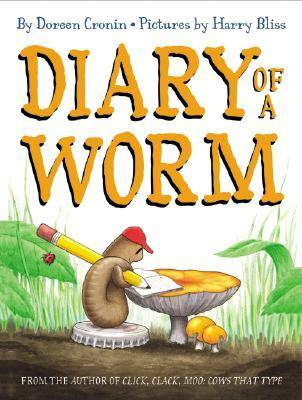{width="2.3357808398950133in"
height="3.09375in"}

This is the diary . . . of a worm. Surprisingly, a worm not that
different from you or me: He lives with his parents, plays with his
friends, and even goes to school. But unlike you or me, he never has to
take a bath, he gets to eat his homework, and because he doesn\'t have
legs, he just can\'t do the hokey pokey \-- no matter how hard he tries.
Oh, and his head looks a lot like his rear end.

**"Diary of a ..."**

Students choose a favourite animal and write diary passages from that
animal's perspective. Read select passages from Diary of a Worm and
examine the humour in the book. Look at the July 29th entry and as a
group, name all the funny things that you see (for example, Dr. D. Kay
name tag).

Discuss different styles of writing. Students include humour in their
animal diary writing. Suggested writing topics can include:

- What does the animal eat?

- How does the animal move?

- What is the animal's living environment?

- How does the animal's size compare to people, buildings, etc.?

**About the Author**

DOREEN CRONIN'S first picture book, the blockbuster New York Times
best-seller Click, Clack, Moo: Cows That Type, was a Caldecott Honour
Book in 2001. Her second book Giggle, Giggle Quack was also a New York
Times best-seller and the Main Selection of the Book-of-the-Month Club.
She lives in New York.

**About the Artist**

HARRY BLISS is an award-winning cartoonist and cover artist for The New
Yorker. He has illustrated Sharon Creech's New York Times best-selling A
Fine, Fine School and William Steig's Which Would You Rather Be? Harry
Bliss lives in Vermont.

**"Worm Fun Facts**"

Worms are more than long, thin, slimy animals that live in the soil. For
example, worms have five hearts, and all of these hearts pump blood
through blood vessels just like a human heart! Using reference books and
the internet, have students work in pairs to research interesting worm
facts to share with the class. Each day hold a Worm Fun Fact whole
-group session and record each new fact on a chart posted in the
classroom. This permanent placement allows children to study the
environment throughout the school year.

**Fact or Fiction**

Use the book for students to determine the difference between fact and
fiction.

**"All I Need Is ... the Earth"**

Read aloud the March 20^th^ entry from Diary of a Worm, which includes
"The earth gives us everything we need." Ask students if they can
explain this statement from a worm's perspective. Use this discussion as
a starting point for a lesson about our ecosystem. Explain to students
that the earthworm is responsible for healthy soil, which in turn is
needed to grow healthy plants.

Have students crate a life-cycle wheel to show how different ecosystems
relate to one another --- worms contribute to the soil, which affects
plant growth, which affects the food cycle for other animals. Use paper
plates or oak tags cut into a circle to create the wheel.

**"See Me in Action**"

Turn students into scientists by creating a worm box in your classroom.
Students will be able to observe the worms in their environment and
record their findings in their science journals.

**"A Feast Fit for a Worm"**

Ask students if they know what worms like to eat. As a class, brainstorm
a list of items and record them on chart paper. Then have students
research which items were correct and which were not. Divide the list
into two columns: "Delicious" and "Yucky." Student can then create a
worm menu with items from the list.

**"Journaling Fun"**

Many students practise their writing by keeping a journal at school
and/or at home. Use selections from Diary of a Worm to discuss different
ways of recording information---sentences, numbered lists, photographs,
illustrations, and so on. Encourage students to use various techniques
in their own journals.

**Unlikely Diaries**

Idea Development and Writing with Voice.

Read Aloud.  Talk about how author Doreen Cronin conveys real facts
about an invertebrate (a worm) in an unlikely format (the worm\'s
imaginary diary) and successfully shares interesting facts while using
humour.  Read the story a second time; stop after each entry and ask
students, \"What fact about worms did the author just talk or joke
about?\"  Tell the students they will be writing their own unlikely
diaries.

Use graphic organisers as planning sheets.

**Diary of a \_\_\_\_\_\_\_\_\_\_\_\_\_\_\_\_\_\_\_\_**

Ten interesting facts.

  ---------------------------------------------------------------------
  1\.
  ---------------------------------------------------------------------
  2\.

  3\.

  4\.

  5\.

  6\.

  7\.

  8\.

  9\.

  10\.
  ---------------------------------------------------------------------

**Diary of a \_\_\_\_\_\_\_\_\_\_\_\_\_\_\_\_\_\_\_\_\_\_\_\_\_\_\_**

Write 2-3 sentences about each day.

+---------------------------------------------------------------------+
| Date:                                                               |
|                                                                     |
| What happens?                                                       |
+=====================================================================+
| Date:                                                               |
|                                                                     |
| What happens?                                                       |
+---------------------------------------------------------------------+
| Date:                                                               |
|                                                                     |
| What happens?                                                       |
+---------------------------------------------------------------------+
| Date:                                                               |
|                                                                     |
| What happens?                                                       |
+---------------------------------------------------------------------+
| Date:                                                               |
|                                                                     |
| What happens?                                                       |
+---------------------------------------------------------------------+
| Date:                                                               |
|                                                                     |
| What happens?                                                       |
+---------------------------------------------------------------------+
| Date:                                                               |
|                                                                     |
| What happens?                                                       |
+---------------------------------------------------------------------+
| Date:                                                               |
|                                                                     |
| What happens?                                                       |
+---------------------------------------------------------------------+
| Date:                                                               |
|                                                                     |
| What happens?                                                       |
+---------------------------------------------------------------------+
| Date:                                                               |
|                                                                     |
| What happens?                                                       |
+---------------------------------------------------------------------+

**Diary of a Worm Doreen Cronin**

**MARCH 20**

**Mum says there are three things I should always remember:**

1.  **The earth gives us everything we need.**

2.  **When we dig tunnels, we help take care of the earth.**

3.  **Never bother Daddy when he's eating the newspaper.**

**MARCH 29**

**Today I tried to teach Spider how to dig.**

**First of all his legs got stuck.**

**Then he swallowed a bunch of dirt.**

**Tomorrow he's going to teach me how to walk upside down.**

**MARCH 30**

**Worms cannot walk upside down.**

**APRIL 4**

**Fishing season started today. We all dug deeper.**

**APRIL 10**

**It rained all night and the ground was soaked. We spent the entire day
on the sidewalk.**

**Hopscotch is a very dangerous game.**

**APRIL 15**

**I forgot my lunch today. I got so hungry that I ate my homework.**

**My teacher made me write "I will not eat my homework" ten times.**

**When I was finished, I ate that, too.**

**APRIL 20**

**I snuck up on some kids in the park today. They didn't hear me
coming.**

**I wiggled up right between them and they SCREAMED.**

**I love when they do that.**

**MAY 1**

**Grandpa taught us that good manners are very important.**

**So today I said "good morning" to the first ant I saw.**

**There were 600 more of them in line. I stood there all day.**

**MAY 8**

**Had the worst nightmare last night -- giant birds playing hopscotch.**

**Mum says I have to stop eating so much garbage right before I go to
bed.**

**MAY 15**

**I got into a fight with Spider today. He told me you need legs to be
cool. Then he ran. I couldn't keep up. Maybe he's right.**

**MAY 16**

**I made Spider laugh so hard, he fell out of his tree. Who needs
legs?**

**MAY 28**

**Last night I went to the school dance. You put your head in. You put
your head out. You do the hokey pokey and you turn yourself about.
That's all we could do.**

**JUNE 5**

**Today we made macaroni necklaces in art class. I brought mine home and
we ate it for dinner.**

**JUNE 15**

**My older sister thinks she's so pretty. I told her that no matter how
much time she spends looking in the mirror, her face will always look
just like her rear end.**

**Spider thought that was really funny. Mum did not.**

**JULY 4**

**When I grow up, I want to be a Secret Service agent. Spider says I
will have to be very careful because the president might step on me by
mistake.**

**"It's a dangerous job," I told him. "But someone's got to do it."**

**JULY 18**

**Three things I don't like about being a worm:**

**1. I can't chew gum.**

**2. I can't have a dog.**

**3. All that homework.**

**JULY 29**

**Three good things about being a worm:**

**1. I never have to go to the dentist.**

**2. I never get in trouble for tracking mud through the house.**

**3. I never have to take a bath.**

**AUGUST 1**

**It's not always easy being a worm. We're very small, and sometimes
people forget that we're even here. But, like Mum always says, the earth
never forgets we're here.**

**Points-of-View**

**Compare/Contrast Chart**

Directions: Complete the chart below to compare and contrast the worm's
point of view in Diary of a Worm to your point of view. First, fill in
the chart with responses that the worm might have.

Check your answers using the book. Then, fill in the chart with your
responses.

  ------------------------------------------------------------------------
                         **Worm**                 **Me**
  ---------------------- ------------------------ ------------------------
  One thing my mother                             
  wants me to remember:                           

  Something I've tried                            
  to teach someone else                           
  to do:                                          

  Something I cannot do:                          

  Where I spend the day                           
  when it rains:                                  

  What I do when I                                
  forget my lunch:                                

  One good thing about                            
  being me:                                       
  ------------------------------------------------------------------------

**\
Shared Writing**

Mentor Text: S.K. Worm answers your questions about soil and stuff.

Make books for each student.

Read Along.

Notetaking using graphic organiser.

Revise leads.

Shared writing using the graphic organiser as a planner.

This could be a segue into:

**Squirmin' Herman.**

A similar approach could be taken with individual books being made for
students (see attached).

Persuasive Writing:

Worms should be encouraged to live in our soil.

**Diary of a Worm** by Doreen Cronin.

**There's a Hair in My Dirt!** By Gary Larson

For (much) older grades this is an hilarious book by the author of Far
Side.

(See Voice 15 course for Secondary students)

# Ask the Answer Worm!

###### It's a dirty job but someone has to do it - S.K.Worm, the official annelid, or worm, of the U.S. Department of Agriculture\'s Natural Resources Conservation Service answers students' questions about soil. Even their teachers can't wiggle their way out of this one! Slither your way through these soiled questions.

{width="3.9583333333333335in"
height="3.0625in"}

#### Hello, worm lovers and soil supporters!

It is I, S.K. Worm. The S.K. stands for \"*Scientific Knowledge*.\" But
you can call me *Skworm*, as in squirm around and wiggle all over the
place.

{width="2.78125in"
height="3.125in"}

**Soil doesn\'t just appear out of nowhere.** A magician doesn\'t wave a
magic wand and\...poof!\... soil shows up. And it\'s not made in a soil
factory. Soil comes from broken up pieces of rock and dead leaves, tree
limbs, and dead bugs-those kinds of things.

{width="4.270833333333333in"
height="1.9479166666666667in"}

#### Soil doesn\'t have a mum and dad.

But it is made up of something called *parent material *- the basic
stuff needed to make soil

# What does the weather do to soil?

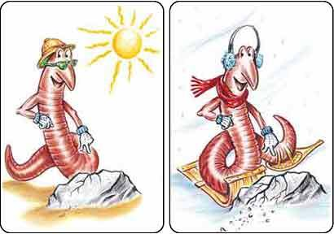{width="4.260416666666667in"
height="3.0in"}

**Whether you believe it or not,** weather helps make soil. When the
weather gets hot, rocks can get bigger. When the weather turns cold,
rocks can get smaller. If this happens often enough, the rock will crack
and break up into small pieces that break into even smaller pieces. When
they get really small they turn into soil. Rain and ice can also get
into rocks and break them apart. So, believe me, the weather does help
make soil. And that\'s no snow job.

# What\'s on, and in, the horizon?

{width="1.84375in"
height="3.28125in"}Did you know that there are horizons in the soil?
They\'re named **O, A, B,** and **C.** O is the top horizon. It\'s about
two and a half centimetres thick made up of dead material that breaks
down and keeps the soil \"O\"- so healthy. The A horizon is topsoil
that\'s alive with roots, tiny microstuff like bacteria and fungi, and
all kinds of critters like me. The A horizon is \"A-OK\" with me. Number
three is horizon B. Plants and animals have a tough time getting through
B. Why? \"B\"- 'cause it\'s very hard. See horizon C? You see, horizon C
has less living material in it than O, A, and B. C is parent material
that\'s made up of the rock and soil that formed the three layers above
it.

# How does soil help me keep my cool?

#### 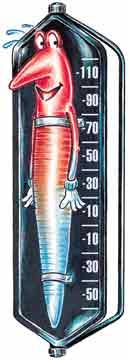{width="1.3333333333333333in" height="3.75in"}When the soil is cool,

I\'m cool. If the temperature gets too cool, I can dig deeper to find a
warm place to slither and snooze. But when the temperature is too hot, I
don\'t feel so hot. In fact, if I get too hot, I\'ll dry up like a piece
of old beef jerky. So, on really hot days, I look for a cool spot in the
soil and coil myself up to keep cool and stay moist.

# 

# 

# 

# 

# Do soils come in different colours?

# 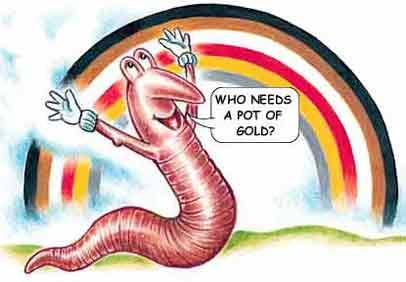{width="4.229166666666667in" height="2.90625in"}

#### They sure do!

Soils can come in black, red, yellow, white, brown, and grey. Not
exactly a rainbow of colours, but they look good to me!

# 

# 

# 

# 

# 

# How does water stay in the soil?

#### 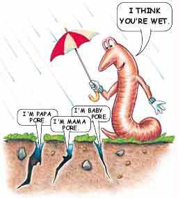{width="2.6666666666666665in" height="2.96875in"} When water gets into the soil, it pours into pores. Pores are spaces in the soil that come in different sizes. The bigger the pore, the more water it holds.

 

+---------------------------------------------------------------------------------------+------------------------------------+
| **How does air get into the soil?**                                                                                        |
+---------------------------------------------------------------------------------------+------------------------------------+
| {width="3.5729166666666665in" |                                    |
| height="2.96875in"}\                                                                  | Air gets down into the soil        |
| \                                                                                     | through the same pores that let in |
| \                                                                                     | and hold water. The burrows that I |
| \                                                                                     | and my pals dig let in air, too.   |
| \                                                                                     | That\'s good news for              |
| \                                                                                     | undergrounders who need air. \     |
| \                                                                                     | \                                  |
|                                                                                       | By the way, I don\'t have lungs    |
|                                                                                       | for breathing. I breathe through   |
|                                                                                       | my skin. Please, don\'t try this   |
|                                                                                       | at home.                           |
+---------------------------------------------------------------------------------------+------------------------------------+

# 

# 

# 

# Why do plants like soil?

{width="4.260416666666667in"
height="2.7916666666666665in"}

#### Because they like to eat and drink.

Soil has a lot of the things that plants need to satisfy their
appetites. But not for pizza or banana splits. Those are too big to fit
in the plant\'s roots. Plants have a hunger for nutrients with really
strange names that you\'ll learn in secondary school.

# Do roots just help plants?

{width="3.3645833333333335in"
height="3.125in"}

**No way!\
\**
Roots love helping others. They drain water from the soil. That keeps
the soil from staying too wet. And when the soil gets too dry, roots
draw up water. This water has all kinds of good stuff in it that living
things need to stay healthy. Roots help make soil, too. They split rocks
into pieces that later become soil.

+-------------------------------------------------------------------------------------------------------------------------------------------+
| # Does soil care about time?                                                                                                              |
|                                                                                                                                           |
| #### 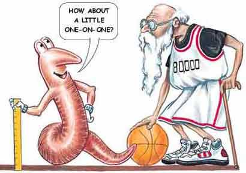{width="4.260416666666667in" height="3.0in"} |
|                                                                                                                                           |
| #### Soil is never in a hurry.                                                                                                            |
|                                                                                                                                           |
| Especially when it comes to making more soil. It can take 1,000 years to form two centimetres of soil. If people grew that slowly it      |
| would take 80,000 years to grow a basketball player. Incredible!                                                                          |
+-------------------------------------------------------------------------------------------------------------------------------------------+
|                                                                                                                                           |
+-------------------------------------------------------------------------------------------------------------------------------------------+

# 

# 

# Can we keep the soil from washing and blowing away?

{width="4.260416666666667in"
height="3.03125in"}

#### Yep is right.

And there\'s soil saving going on right now. People are using plants and
grass to hold the soil down. Farmers have ways underway to keep their
soil on the land so they can keep on growing food for us. One way is
with windbreaks, rows of trees that are planted beside fields to keep
the soil from blowing away. The next time you\'re out in the country,
take a look at the farmland and see all of the ways farmers keep their
soil at home.

# 

# 

# What is soil conservation?

{width="3.5416666666666665in"
height="3.0in"}

#### It\'s smart.

Soil conservation is the best way to make sure that we have the land we
need to live on or, in my case, live in. If you see your soil eroding,
protect it with grass or plants. If you see something that\'s making the
soil sick, do everything you can to make the soil healthy again. If you
live on a farm, make sure that the soil on your fields and pastures
stays right where it is right now!

### Congratulations! You now have a worm\'s-eye view of that wonderful stuff we call soil.

**Caring for the Environment -- Soil Conservation**

**Statement:** We should look after the soil around us.

**Position:** looking after the soil means looking after our
environment.

**Collecting Evidence:** Notetaking from S.K.Worm

Parent material is needed. Dead material equals healthy soil.

Weather helps make soil.

Soil keeps creatures cool.

Pores holds water in the soil.

Air gets into the soil through the pores.

Worms let air in too.

Plants need the nutrients in the soil.

Roots --

Drain water from soil.

Draw up water when it's dry.

Split rocks.

Plants hold the soil down. Protection from wind and rain.

**Conclusion:**

For a healthy environment soil is important.

It takes a long time to make soil.

**Squirmin' Herman**

{width="3.125in"
height="3.125in"}

I\'ll bet you think that the earthworm is only good for fishbait. Well,
think again. The earthworm is one of nature\'s top \"soil scientists.\"
The earthworm is responsible for a lot of the things that help make our
soil good enough to grow healthy plants and provide us food.

Worms help to increase the amount of air and water that gets into the
soil. They break down organic matter, like leaves and grass into things
that plants can use. When they eat, they leave behind castings that are
a very valuable type of fertiliser.

Earthworms are like free farm help. They help to \"turn\" the
soil---bringing down organic matter from the top and mixing it with the
soil below. Another interesting job that the worm has is that of making
fertiliser. If there are 500,000 worms living in an acre of soil, they
could make 50 tons of castings. That\'s like lining up 100,000 one pound
coffee cans filled with castings. These same 500,000 worms burrowing
into an acre of soil can create a drainage system equal to 2,000 feet of
6-inch pipe. Pretty amazing for just a little old worm, don\'t you
think?

Having worms around in your garden is a real good sign that you have a
healthy soil.

{width="1.59375in"
height="3.6041666666666665in"}

A worm has no arms, legs or eyes.

There are approximately 2,700 different kinds of earthworms.

Worms live where there is food, moisture, oxygen and a favorable
temperature. If they don't have these things, they go somewhere else.

In two hectares of land, there can be more than two million earthworms.

Worms are cold-blooded animals.

Earthworms have the ability to replace or replicate lost segments. This
ability varies greatly depending on the species of worm you have, the
amount of damage to the worm and where it is cut. It may be easy for a
worm to replace a lost tail, but may be very difficult or impossible to
replace a lost head if things are not just right.

Baby worms are not born. They hatch from cocoons smaller than a grain of
rice.

Even though worms don't have eyes, they can sense light, especially at
their anterior (front end). They move away from light and will become
paralysed if exposed to light for too long (approximately one hour).

If a worm's skin dries out, it will die.

Worms can eat their weight each day.

Worms tunnel deeply in the soil and bring subsoil closer to the surface
mixing it with the topsoil. Slime, a secretion of earthworms, contains
nitrogen.

Nitrogen is an important nutrient for plants. The sticky slime helps to
hold clusters of soil particles together in formations called
aggregates.

{width="1.6145833333333333in"
height="3.6145833333333335in"}

{width="1.5625in"
height="3.6458333333333335in"}**.**

 

Now comes the part I like the best---FOOD! I spend most of my time
eating and believe it or not I love vegetables and fruits

I love potato peelings, carrots, lettuce, cabbage, celery, apple
peelings, banana peels, orange rinds, and grapefruit. I also like
cornmeal, oatmeal, crushed eggshells, coffee grounds with the filter,
and tea bags**.**

**My Beginning and End**

+:-----------------------------------------------------------------------------------:+
| {width="4.979166666666667in" |
| height="2.4895833333333335in"}                                                      |
+-------------------------------------------------------------------------------------+
|                                                                                     |
|                                                                                     |
| Hey kids! I said head to toe, but I don\'t really have a head like yours. But I do  |
| have a head end, the fancy word is anterior. Please remember that it is really      |
| different from the tail end, called the posterior. Just imagine how you would feel  |
| if someone said they could not tell the difference between your head and rear end   |
| (it\'s so embarrassing, and I get a little sensitive about that).                   |
+-------------------------------------------------------------------------------------+

**My Body**

+:----------------------------------------------------------------------------------------:+
| {width="4.979166666666667in" |
| height="2.4895833333333335in"}                                                           |
+------------------------------------------------------------------------------------------+
|                                                                                          |
|                                                                                          |
| If you get a chance to feel me (hey worms need affection, too) you should notice that I  |
| am a little bit wet or slimy. It doesn\'t mean I need a shower . . . my skin is supposed |
| to feel like that. I need moisture to survive.                                           |
|                                                                                          |
| You will also notice that I do not have bones or arms, or legs, or eyes, or teeth (no    |
| one nags me about brushing or flossing). I just feel sort of squishy.                    |
+------------------------------------------------------------------------------------------+

**Segments**

+:----------------------------------------------------------------------------------------:+
| {width="4.979166666666667in" |
| height="2.4895833333333335in"}                                                           |
+------------------------------------------------------------------------------------------+
| If you look at my body under a magnifying glass, you will see a lot of little rings      |
| across my entire body . . . looks kind of like corduroy or a lot of rings connected      |
| together. These rings are called segments. When I am all grown up, I will have 120-170   |
| segments. On the first segment is my mouth and on the last segment is my anus---sort of  |
| like the beginning and the end.                                                          |
|                                                                                          |
| If you had a microscope and looked really, really closely at each segment, you will see  |
| something that looks like a bunch of small hairs or bristles. (And I\'ll bet you thought |
| worms were bald.) These bristles are called setae (pronounced see-tee) and they help me  |
| move. I have four pairs of these bristly hairs on each ring or segment.                  |
|                                                                                          |
| **My Mouth**                                                                             |
+------------------------------------------------------------------------------------------+

{width="6.25in"
height="2.4895833333333335in"}

At the very tip of my head (that\'s the anterior, remember), you will
see a flap of skin that hangs over my mouth. It is called the
prostomium. It keeps stuff I don\'t like from getting into my mouth.
(Yeah, some things are even gross for worms). It is kind of like your
upper lip. (Wanna kiss, baby?) Right under the prostomium is my
mouth---you know what that\'s for. I have a pretty big mouth for a worm.
It\'s big enough to grab a leaf and drag it around.

**My Five Hearts**

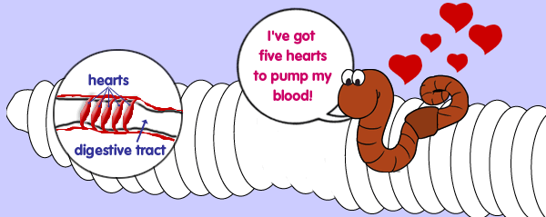{width="6.239583333333333in"
height="2.4895833333333335in"}

Guess what? I have five hearts! All of these hearts pump blood through
my blood vessels just like your one heart.

**How I Move**

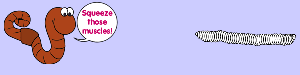{width="6.239583333333333in"
height="1.5625in"}

It takes a lot of work to get where I want to go. I don\'t move very
quickly, but think about how fast you would go if you had to slide
around on your tummy.

I use some of my muscles and my setae (bristles, remember). My setae act
like the brakes on a car, helping me to slow down or stop. I have
muscles that go in circles around my body and other muscles that run the
length of my body.

Actually, I\'m pretty well-built, if I do say so myself. When my
circular muscles tighten up, my body becomes thinner and longer. I sort
of look like two birds are pulling me from each end.

(Now that\'s a scary thought. Let me take a minute to calm myself
down\....whew! Now where were we \... oh, yeah, moving right along.)

This movement by my circular muscles squeezes my front end forward. My
other long muscles squeeze together and help move the rear end of my
body towards the front end. So this is how I move forwards and
backwards. Pretty slick.

**How I Digest**

My mouth is very small. So I can only eat very tiny things like
bacteria, fungi and protozoa which you couldn\'t see unless you are
looking through a microscope. I also eat organic matter like plants
(mmmm, salad) and decaying animals. I guess that sounds sort of yucky,
but you humans eat dead animals and birds too.

Sometimes the bits of food are too big for my mouth, so I moisten them
to make them soft and suck them right into my mouth. (Don\'t try this at
home, human parents tend not to like this.)

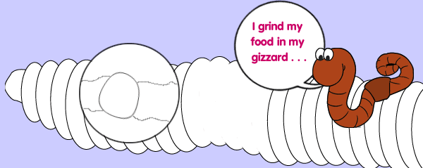{width="6.25in"
height="2.4895833333333335in"}

Since I have no teeth, I cannot really chew my food like you do. I do
have something inside of me close to my mouth called a gizzard. You
might have heard this word before because birds, including chickens and
turkeys, have a gizzard almost like mine. As I eat my food some grains
of sand and soil get into my gizzard. These grains of sand and soil push
against each other, mix with moisture and grind the food into tiny
pieces (kind of like my own personal food processor).

When the food leaves my gizzard, it goes into my intestine. The food is
dissolved there and absorbed into my blood. Then it is carried to all
parts of my body to keep me strong, healthy and slimy.

**How I Breathe**

Have you ever wondered how I breathe without a nose or lungs? You
breathe through your lungs. Your lungs take in oxygen and give off
carbon dioxide.

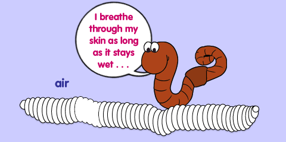{width="4.979166666666667in"
height="2.4895833333333335in"}

Worms do not have lungs but I breathe through my skin. I take in oxygen
through my skin and it goes right into my bloodstream. My skin must stay
wet in order for the oxygen to pass through it, but if I am in too much
water I will drown. Just keep me damp, moist and slimy. Although if the
water has lots of air in it, I can stay under for a long time.

**Light Sensitivity**

{width="4.135416666666667in"
height="2.0729166666666665in"}

I can tell the difference between light and dark . . . pretty good for
someone who does not have eyes. I have cells in the front part of my
body that are sensitive to light. This is called light sensitivity.

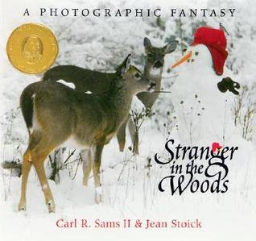{width="3.3125in"
height="3.1145833333333335in"}

Summary: Animals in the woods sense that a stranger has arrived. They
cautiously discover a snowman that has been built by children overnight.
They also discover that the snowman can be eaten. There are seeds left
in the hat, a carrot nose, and acorns for eyes and mouth. The animals
enjoy the stranger and the children refill the treats often.\
\
The photographs used as illustrations in this book really enhance the
story and draw readers in to look at this mysterious stranger through
the eyes of the woodland animals.\
\
Literary Devices: personification (animals are speaking)

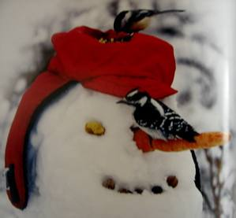{width="3.1145833333333335in"
height="2.8854166666666665in"}

**\
Stranger in the Woods Carl R.Sams 11 & Jean Stoick**

The snowflakes were

resting after their twisting

twirling dance through

the crisp night air.

Every twig in the forest

wore a new coat

of glimmering white,

Daybreak came

softly moving through the woods

and yawning

as its rays slowly stretched

across the snowy meadow.

The birds

were the first to notice ...

**Stranger in the woods!**

"Take care!

Take care!"

The bluejays cawed

a warning

from high in the tops

of the tall oaks.

**Stranger in the woods!**

"Do you hear the jays calling?"

Mother Doe spoke softly

to her fawn.

"Yes," he whispered.

"I always listen to the birds,

the wind blowing through the trees,

the rustling of the leaves

and all the sounds of the woods."

**Stranger in the woods!**

"Who-hoo's in the woods?

Where? Where did the jays say?

Where is he?"

asked the Owl of many Questions.

"Coo-coo-could that be him?"

asked the mourning dove.

"There!

Beyond the old apple tree.

Follow the snow trail,

past the pond

to where the meadow begins.

Not far ... not far at all."

"Who-hoo's in the woods?

Why is he here?

When? When did the stranger come?"

asked the Owl of Many Questions.

"I've been here since early morning

before the first pale light

on the Eastern Sky,"

said the munching muskrat.

"No stranger came this way.

No one passed by my pond."

"I followed the snow trail

under the light of the Winter Moon,"

answered the buck.

"He was not there during the night,

that I am sure!"

As the animals moved

through the snowy forest, they came to

the edge of the meadow.

The frightened doe

stomped her hoof

and snorted!

"Where is he?

Where is he?

Can you see him?"

"Yes! Yes! I do see him!"

chattered the squirrel.

"Someone needs to go and,

and check-check-check check'em out!"

"Who-hoo-hoo will go?

Who-hoo-hoo will go see?"

asked the Owl of Many Questions.

"Now don't be looking at me.

I'm much too busy chew-chew-chewing on my antler,"

sputtered the porcupine.

"You'll not be volunteering me!

No sir-ree!"

said the scared rabbit.

"Is ... is he watching me?"

"Howdy-dee-dee.

It is me, the chickadee-dee-dee!

I will go! I will take the lead."

"I'm-m-m-m the smallest and

I ca-ca-can scamper quickly.

I'll do it! I'll make a tunnel under the snow

where only I can go ...

... creeping in closer to get a look.

Quietly

just like a m-m-mouse!"

"Let it be me!

Let me go!"

volunteered the fawn.

"I can do it.

I know I can!"

"I am the strongest and the biggest,"

said the young buck.

"I should go first."

"I can fly faster,"

chirped the cardinal.

"But I can run like lightning

and I have antlers!"

boasted the buck.

"But ... I am ... I am ... RED!"

announced the cardinal,

not knowing what else to say.

"What are you waiting for? I'm there already-dee-dee!"

exclaimed the Chickadee-dee-dee!

"Gee-gee-gee!"

said the Chickadee-dee-dee.

"There are nuts and seeds

on his hat for you and me!

This stranger is friendly.

Come see! Come see!

There's plenty."

"I can see there's something for you,"

said the buck. "Could it be there's something for me?

My nose is leading me to corn

buried beneath the snow."

"I found a treat that I can eat,"

said the young doe as she reached out

to the stranger.

"Wow! A carrot!

Do I have to share it?"

"What is this?" questioned the fawn

as he passed a curious object in the snow.

"Could it be ...

there's more than one stranger in the woods?"

After the corn was gone,

the animals left by the snow trail one by one

and disappeared into the winter woods.

It was the chickadee who took the last seed and flew away.

The snowman stood alone ...

but only for a short time.

"They have eaten everything ...

even the carrot nose,"

whispered the little sister

peeking out from behind the evergreens.

"Let's put out more

seeds and corn

before they come back,"

encouraged the brother.

"The animals will never know

we were here."

"How long will

we feed them?"

she asked.

"For a long,

long time,"

he replied.

"After the snow has gone

and the snowman has melted away,

until the frogs start to sing

and the trees grow new leaves."

I think they like carrots the best!

**\**

**Possible Inferring Questions**

Why did day break come softly? What does that mean?

Who was the first to notice the stranger? Why?

Why did the birds warn the deer?

Did the owl and the mourning doves have real questions? How do you know?

If the stranger was a snowman, why did he leave footprints in the snow?
How do no footprints add to the mystery in the story?

Why do you think the muskrat didn\'t see anyone?

When was the snowman built? How do you know?

Why did the animals send a representative to check out the stranger?

Why do you think the owl will not be the one to approach the stranger?

Why won\'t the porcupine go?

Why are the chickadee and the Cardinal willing to go see about the
stranger?

Why do the moose and fawn volunteer? Why do you think they don\'t go?

What is the stranger really? How do you know?

Why are the children hiding?

Why do you think the children will feed the animals

until spring?

Why did the stranger arrive after a winter storm?

**Possible** **Inferring Questions Possible Answers**

Why did day break come softly? What does that mean?

Maybe the snow made everything quiet.

Who was the first to notice the stranger? Why?

Birds, they can see so much from trees.

Why did the birds warn the deer?

Maybe the stranger was a hunter.

Did the owl and the mourning doves have real questions? How do you know?

Yes, although they said their usual calls, their calls were really
questions and they were wondering.

If the stranger was a snowman, why did he leave footprints in the snow?
How do footprints add to the mystery in the story?

The children left the footprints, so that is like a red herring or a
clue to throw us off the track.

Why do you think the muskrat didn\'t see anyone?

He swims under water to be inside and has no windows in his house, or he
was so busy he wasn\'t looking. Maybe the snow made everything so quiet
he heard nothing.

When was the snowman built? How do you know?

Early in the morning, he was new to the animals, the animals would have
noticed yesterday.

Why did the animals send a representative to check out the stranger?

Maybe they were worried about hunters or just curious and are often
scared of strangers.

Why do you think the owl will not be the one to approach the stranger?

The owl is bigger than the birds and could attract attention? Maybe the
owl was shy, we don\'t know.

Why won\'t the porcupine go?

He had food already so he wasn\'t looking for food.

Why are the chickadee and the Cardinal willing to go see about the
stranger?

They can manoeuvre more easily than an owl and get away fast, in case
the stranger was dangerous.

Why do the moose and fawn volunteer? Why do you think they don\'t go?

They didn\'t realize the danger and probably the parents

stopped them.

What is the stranger really? How do you know?

The stranger looks like a snowman but is really a feeder.

Seed on the top of the hat, corn under the snow, carrot nose, and so on.

Why are the children hiding?

They could scare the animals away and then the animals would not get the
food.

Why do you think the children will feed the animals until spring?

In the spring the animals will be able to find their own food.

Why did the stranger arrive after a winter storm?

The stranger was made of snow, and after a storm there would be snow. No
snow, no snowman.

Inferring Questions ref. *The Wise Owl Factory*

**Stranger in the Woods**

**Readers' Theatre**

Narrator

Bluejays

Mother Doe

Fawn

Owl of Many Questions

Mourning dove

Muskrat

Buck

Squirrel

Porcupine

Rabbit

Chickadee

Mouse

Cardinal

Little sister

Brother

