> **Voice**
>
> **(8)**
>
> {width="4.6875in"
> height="4.15625in"}

**Inner Voice**

{width="2.408365048118985in"
height="2.1354166666666665in"}

**Voice -- 8**

**Inner Voice**

Amelia's Road Linda Altman

Night in the Country Cynthia Rylant

My Father\'s Hands Joanne Ryder

Thank You Mr. Falker Patricia Polacco

Crow Call Lois Lowry

The Other Side Jaqueline Woodson

Wemberly Worried Kevin Henkes

Little White Rabbit Kevin Henkes

Henry's Freedom Box Ellen Levine

Wilma Unlimited Kathleen Krull

How Many Days to America? Eve Bunting

Train to Somewhere Eve Bunting

The Honest-to Goodness Truth Patricia McKissack

Enemy Pie Derek Munson

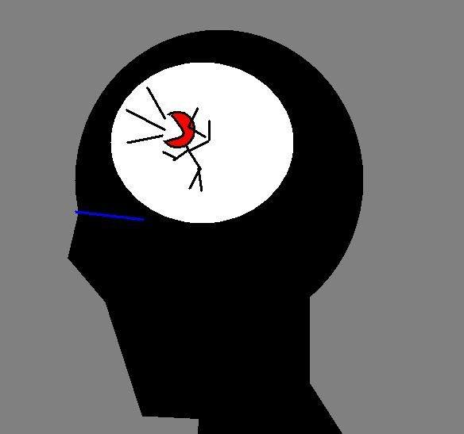{width="2.3229166666666665in"
height="2.1757458442694664in"}

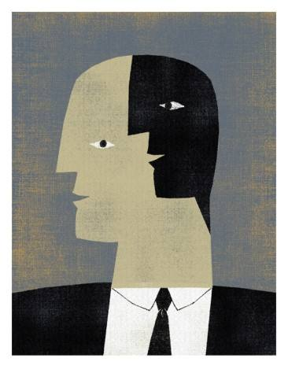{width="2.3671872265966756in"
height="3.15625in"}

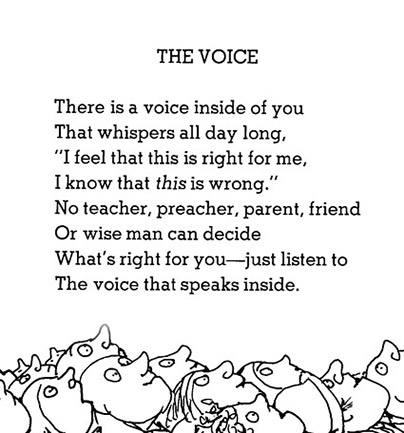{width="4.208333333333333in"
height="4.510416666666667in"}

**\**
{width="2.573386920384952in"
height="3.6770833333333335in"}

{width="4.25in"
height="2.975in"}

**\**

{width="2.0729166666666665in"
height="2.6145833333333335in"}

**Amelia's Road Linda Altman**

Synopsis

Amelia Luisa Martinez hates roads. Los caminos, the roads, take her
migrant worker family to fields where they labour all day, to schools
where no one knows Amelia\'s name, and to bleak cabins that are not
homes. She longs for the day when she doesn\'t need to move again, and
can live in a tidy white house with a fine shade tree.

One day Amelia discovers an \"accidental road.\" At its end she finds an
amazing old tree. Its stately sense of permanence inspires her to put
her own roots down in a special way--by placing her favourite things in
a box and burying it next to the tree, so she will always have a place
to go back to.

Background

There are between three million and five million migrant workers in
America. They move from one harvest to another and do not have stable
homes. Many of the migrant workers come from different parts of the
world, such as Mexico, South America, or the Caribbean. But many of them
are American citizens, born in the United States.

Before Reading

Prereading Focus Question

Amelia's Road is about a young girl who lives in a family that travels
around the country harvesting crops. The family rarely spends more than
six weeks in one place. Would you like to live such a life? What would
you dislike about moving from place to place all the time? Is there
anything you would like about it?

During/After Reading

Reading Response Journals

Do you feel sorry for Amelia? Why or why not?

Why do you think Amelia is happy that everyone in her class knows her
name?

How would you feel if you were Amelia?

Show don't Tell and Inferring

Linda Jacobs Altman is an author who doesn't just tell her readers about
the characters, she shows you. When an author shows you information
instead of telling, you have to make an inference.

Turn and Talk.

What can we infer about the work that Amelia does?

*The next day, everybody got up at dawn. From five to almost eight in
the morning, Amelia and her family picked apples. Even though she still
felt sleepy, Amelia had to be extra careful so she wouldn't bruise the
fruit.*

*By the time she had finished her morning's work, Amelia's hands stung
and her shoulders ached. She grabbed an apple and hurried off to
school.*

How did Amelia feel when she discovered the accidental road?

What words and phrases did Linda Jacobs Altman use for you to make that
inference?

*Amelia called it the accidental road because it was narrow and rocky,
more like a footpath, that happened by accident than a road somebody
built on purpose.*

*She followed it over a grassy meadow, through a clump of bushes, and
down a gentle hill. There, where the accidental road ended, stood a most
wondrous tree. it was old beyond knowing, and quite the sturdiest most
permanent thing Amelia had ever seen. When she closed her eyes, she
could even picture it in front of her tidy white house.*

*Amelia dance for joy, her black hair flying as she twirled around the
silent meadow.*

Make an inference about the things Amelia was putting in the old metal
box she found in the trash.

*Amelia found an old metal box that somebody had tossed into the trash.
It was* *dented and rusty, but Amelia didn't care. That box was the
answer to her problem.*

*She set to work at once, filling it with "Amelia-things." First she put
in the hair ribbon her mother had made for her one Christmas; next came
the name tag Mrs Ramos had given her; then a photograph of her whole
family taken at her last birthday; and after that the picture she'd
drawn in class with the bright red star on it.*

*Finally, she took out a sheet of paper and drew a map of the accidental
road, from the highway to the very old tree. In her best lettering she
wrote Amelia Road on the path. Then she folded the map and put it into
her box*.

How does Amelia feel now?

What words and phrases did the use for you to make that inference?

*"I'll be back," she whispered, and then she turned away.*

*Amelia skipped through the meadow, laughed at the sky, even turned
cartwheels right in the middle of the accidental road.*

*When she got back to the camp, the rest of the family had already
started packing the car. Amelia watched them for a moment, then took a
deep breath and joined in to help.*

*For the first time in her life, she didn't cry when her father took out
the road map.*

"As you are reading today, pay attention to the places where you make
inferences. See if your author shows you about the characters the way
Linda Jacobs Altman did."

Use a Venn diagram to compare and contrast your life with Amelia's.

Writing

Poetry -- Querencia (see Poetry course)

Querencia Poetry is set out below

**About the Author and Illustrator**

Linda Jacobs Altman is a writer based in Clearlake, California.
Amelia\'s Road marked her picture book debut. This title carries special
meaning for her: "I first became aware of the problems of migrant farm
workers when Cesar Chavez was organising the United Farm Workers in the
1960s. I identified especially with the migrant children because, like
them, I grew up in a family where moving around was simply the way of
things.\" She was born in Winston-Salem, North Carolina, and has lived
in many parts of California. Her second book for Lee & Low, The Legend
Of Freedom Hill is a fictional story set during the California Gold
Rush, in which a girl teams up with her best friend, in search of gold
to buy her mother's freedom from a slave catcher.

Enrique O. Sanchez divides his home between Bar Harbor, Maine and
Florida. He was born in the Dominican Republic and studied architecture
at the Santa Domingo University and fine arts at the Bellas Artes
Institute. He then moved to New York to study set and scene design and
worked as a graphic designer for Sesame Street. While he is primarily a
fine artist, he has illustrated many picture books.

**Amelia's Road Linda Altman**

Amelia Luisa Martinez hated roads. Straight roads. Curved roads. Dirt
roads. Paved roads. Roads leading to all manner of strange places, and
roads leading to nowhere at all. Amelia hated roads so much that she
cried every time her father took out the map.

The roads Amelia knew went to farms where workers laboured in sunstruck
fields and lived in grim, grey shanties. *Los caminos,* the roads, were
long and cheerless. They never went where you wanted them to go.

Amelia wanted to go someplace where people didn't have to work so hard,
or move around so much, or live in labour camps.

Her house would be white and tidy, with blue shutters at the windows and
a fine old shade tree growing in the yard. She would live there forever
and never worry about *los caminos* again.

It was almost dark when their rusty old car pulled to a stop in front of
cabin number twelve at the labour camp.

"Is this the same cabin we had last year?" Amelia asked, but nobody
remembered. It didn't seem to matter to the rest of the family.

It mattered a lot to Amelia. From one year to the next, there was
nothing to show Amelia had lived here, gone to school in this town, and
worked in these fields. Amelia wanted to settle down, to belong.

"Maybe someday," said her mother, but that wonderful someday never
seemed to come.

"Mama," Amelia asked, "where was I born?"

Mrs Martinez paused for a moment and smiled. "Where? Let me see. Must
have been in Yuba City. Because I remember we were picking peaches at
the time."

"That's right. Peaches," said Mr Martinez, "which means you were born in
June."

Amelia sighed. Other fathers remembered days and dates. Hers remembered
crops. Mr Martinez marked all the important occasions of life by the
never-ending rhythms of harvest.

The next day, everybody got up at dawn. From five to almost eight in the
morning, Amelia and her family picked apples. Even though she still felt
sleepy, Amelia had to be extra careful so she wouldn't bruise the fruit.

By the time she had finished her morning's work, Amelia's hands stung
and her shoulders ached. She grabbed an apple and hurried off to school.

Last year, Amelia spent six weeks at Fillmore Elementary School, and not
even the teacher had bothered to learn her name.

This year, the teacher bothered. She welcomed all the new children to
her classroom and gave them name tags to wear. She wore a name tag
herself. It said MRS RAMOS.

Later, Mrs Ramos asked the class to draw their dearest wishes. "Share
with us something that's really special to you."

Amelia knew exactly what that would be. She drew a pretty white house
with a great big tree in the front yard. When Amelia finished, Mrs Ramos
showed her picture to the whole class. Then she pasted a bright red star
on the top.

By the end of the day, everybody in class had learnt Amelia's name.
finally, here was a place where she wanted to stay.

Amelia couldn't wait to tell her mother about this wonderful day.
Feeling as bright as the sky, she decided to look for a shortcut back to
camp. That's when she found it.

*The accidental road.*

Amelia called it the accidental road because it was narrow and rocky,
more like a footpath, that happened by accident than a road somebody
built on purpose.

She followed it over a grassy meadow, through a clump of bushes, and
down a gentle hill. There, where the accidental road ended, stood a most
wondrous tree. it was old beyond knowing, and quite the sturdiest most
permanent thing Amelia had ever seen. When she closed her eyes, she
could even picture it in front of her tidy white house.

Amelia dance for joy, her black hair flying as she twirled around the
silent meadow.

Almost every day, when work and school were over, Amelia would sit
beneath the tree and pretend she had come home.

More than anywhere in the world, she wanted to belong to this place and
know that it belonged to her.

But the harvest was almost over, and Amelia didn't know what she'd do
when the time came for leaving.

She asked everyone for advice -- her sister Rosa, her parents, her
brother Hector, her neighbours at camp, and Mrs Ramos at school, but
nobody could tell her what to do.

The answer, when it came, was nearly as accidental as the road.

Amelia found an old metal box that somebody had tossed into the trash.
It was dented and rusty, but Amelia didn't care. That box was the answer
to her problem.

She set to work at once, filling it with "Amelia-things." First she put
in the hair ribbon her mother had made for her one Christmas; next came
the name tag Mrs Ramos had given her; then a photograph of her whole
family taken at her last birthday; and after that the picture she'd
drawn in class with the bright red star on it.

Finally, she took out a sheet of paper and drew a map of the accidental
road, from the highway to the very old tree. In her best lettering she
wrote *Amelia Road* on the path. Then she folded the map and put it into
her box.

When all the apples were finally picked, Amelia's family and the other
workers had to get ready to move again. Amelia made one more trip down
the accidental road, this time with her treasure box.

She dug a hole near the old tree, and gently placed the box inside and
covered it over with dirt. Then she set a rock on top, so nobody would
notice the freshly turned ground.

When Amelia finished, she took a step back and looked at the tree.
Finally, here was a place where she belonged, a place where she could
come back to.

"I'll be back," she whispered, and then she turned away.

Amelia skipped through the meadow, laughed at the sky, even turned
cartwheels right in the middle of the accidental road.

When she got back to the camp, the rest of the family had already
started packing the car. Amelia watched them for a moment, then took a
deep breath and joined in to help.

For the first time in her life, she didn't cry when her father took out
the road map.

**QUERENCIA**

"... a place where one feels safe, a place from which one's strength of
character is drawn, a place where one feels at home." (Spanish)

- Georgia Heard

Where is your querencia?

- Home

- School

- The Mountains

- The Beach

- The City

Why is it your querencia?

Is it linked to your feelings?

Is it linked to your senses?

- The Sound of.............

- The Smell of .............

- The Sight of .............

Is it when you are doing something?

- Writing

- Reading

- Relaxing

"Writing is a way of finding and keeping our home."

Write about where you feel most at home; where your querencia is.

We can collect artifacts to do with our querencia:

- Photographs

- Pictures

- Objects

- Music

Questions that might help:

- 'Where do I feel most happy and relaxed?'

- 'Where do I come from?'

- 'Where do I feel most at home?'

- 'What is my ideal writing environment?'

- 'Do I have anything that reminds me of places that mean something to
  me?'

Use your Writer's Notebook to begin ideas -- to sow the seeds.

*"A Notebook is a conversation with yourself. And it's your job as a
writer to keep up the conversation." (Georgia Heard)*

**Writing, paying attention to your inner voice: Personal Monologue**

Be guided by your inner voice: how you feel; what you see; what
questions you have; and what you remember.

Writing a personal monologue (e.g. a story or poem) is written with your
voice. It reveals a sense of place, character, scene, and story.

A good example of a personal monologue is the excellent picture book
*Tight Times* by Barbara Shook Hazen.

By writing a personal monologue you are strengthening your writing voice
because it's as if you are actually speaking to someone. Your voice
becomes real and confident.

Use the work we did on **images** to help. Sketch your place.

Use a mentor poem like The Copper Beach to help you.

It may help to use an organiser to plan your poem.

**Querencia**

**How I Feel:**

**What I See:**

**Questions I Have:**

**What I Remember**

**Reading Myself to Sleep**

The house is all in darkness except for this corner bedroom

where the lighthouse of a table lamp is guiding

my eyes through the narrow channels of print,

and the only movement in the night is the slight

swirl of curtains, the easy lift and fall of my breathing,

and the flap of pages as they turn in the wind of my hand.

Is there a more gentle way to go into the night

than to follow an endless rope of sentences

and then to slip drowsily under the surface of a page

into the first tentative flicker of a dream,

passing out of the bright precincts of attention

like cigarette smoke passing through a window screen?

All late readers know this sinking feeling of falling

into the liquid of sleep and then rising again

to the call of a voice that you are holding in your hands,

as if pulled from the sea back into a boat

where a discussion is raging on some subject or other,

on Patagonia or Thoroughbreds or the nature of war.

Is there a better method of departure by night

than this bon voyage with an open book,

the sole companion who has come to see you off,

to wave you into the dark waters beyond language?

I can hear the rush and sweep of fallen leaves outside

where the world lies unconscious, and I can feel myself

dissolving, drifting into a story that will never be written,

letting the book slip to the floor where I will find it

in the morning when I surface, wet and streaked with daylight.

***Billy Collins***

**Under the Back Porch**

**Our house is two storeys high**

**shaped like a white box.**

**There is a yard stretched around it**

**and in back**

**a wooden porch.**

**Under the back porch is my place.**

**I rest there.**

**I go there when I have to be alone.**

**It is always shaded and damp.**

**Sunlight only slants through the slats**

**in long strips of light,**

**and the smell of the damp**

**is moist green,**

**like the moss that grows there.**

**My sisters and brothers**

**can stand on the back porch**

**and never know**

**I am here**

**underneath.**

**It is my place.**

**All mine.**

***Virginia Hamilton***

> **My Imagination**
>
> **My imagination,**
>
> **Safe from everyone,**
>
> **Warm and cosy inside my head.**
>
> **Words and ideas dance,**
>
> **Making sentences as they skip.**
>
> **Lands only known to me,**
>
> **Beyond reality.**
>
> **Hills of thought;**
>
> **No fences made by adults.**
>
> **I can wander wherever I want.**
>
> **I feel comfortable,**
>
> **Mesmerised by my thoughts.**
>
> **Grace Lunn Gr 6 Wembley**
>
> **Take Me Away**
>
> **Two items;**
>
> **So simple,**
>
> **So fine,**
>
> **That bring harmony**
>
> **And peace**
>
> **To one --**
>
> **To me.**
>
> **They take me to a place**
>
> **Where I am alone,**
>
> **Where I am alive.**
>
> **Two easy,**
>
> **Simple items**
>
> **Are the portholes**
>
> **To my special place.**
>
> **Pen and paper --**
>
> **When together**
>
> **Take me away,**
>
> **Away to my home**
>
> **Where I am alive.**
>
> **Bridget Walker Gr.6 Wembley**
>
> **In My Dad's Arms**
>
> **There's a place**
>
> **So safe,**
>
> **So warm,**
>
> **So soft --**
>
> **It's in my dad's arms.**
>
> **I feel so loved,**
>
> **So special,**
>
> **So good.**
>
> **The world moves around**
>
> **While my dad's arms**
>
> **Are wrapped around me.**
>
> **Nothing can get in the way.**
>
> **My soul is safe.**
>
> **I'm so warm.**
>
> **His soft touch**
>
> **Is like a blanket on my skin.**
>
> **I can tell him anything;**
>
> **My secrets,**
>
> **My problems,**
>
> **My feelings.**
>
> **He will help;**
>
> **And after,**
>
> **He will give me a hug**
>
> **With love.**
>
> **That's my querencia --**
>
> **In my dad's arms.**
>
> **Tegan Walker Gr.6 Wembley**

**\**

**Night in the Country Cynthia Rylant**

The writing helps the reader imagine the sights and sounds of a night in
the country.

I enjoy introducing this text to a class through Found Poetry.

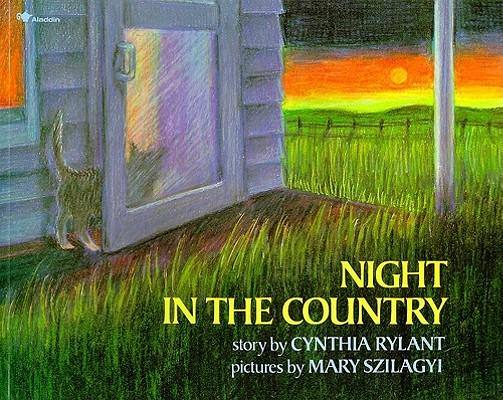{width="2.8020833333333335in"
height="2.2291666666666665in"}

+-----------------+----------------------------+----------------------+
| Craft           | Example                    | Reason               |
+=================+============================+======================+
| Lead            | *There is no night so      | Descriptive lead     |
|                 | dark, so black as night in | establishes setting  |
|                 | the country*.              |                      |
+-----------------+----------------------------+----------------------+
| Ending          | *Then they will spend a    | Reversal of roles    |
|                 | day in the country         | effective.           |
|                 | listening to you*.         |                      |
+-----------------+----------------------------+----------------------+
| Descriptive     | *Great owls with marble    | Mental imagery       |
| language -      | eyes ...*                  |                      |
| Metaphor        |                            |                      |
+-----------------+----------------------------+----------------------+
| Repetition      | *...the groans and thumps  | and instead of       |
|                 | and squeaks that houses    | commas               |
|                 | make when they are trying, |                      |
|                 | like you, to sleep.*       | has action ongoing   |
+-----------------+----------------------------+----------------------+
| 'And' starts    | *And all around you ...*   |                      |
| sentences       |                            |                      |
+-----------------+----------------------------+----------------------+
| Onomatopoeia    | *reek reek*                | Adds vivid           |
|                 |                            | description          |
+-----------------+----------------------------+----------------------+
| Punctuation     | : *reek reek*              | Introduces sounds.   |
|                 |                            |                      |
| Colon           | *outside -- in the field*  | Highlights           |
|                 |                            | importance.          |
| Dashes          | *Outside ...*              |                      |
|                 |                            | Pause in             |
| Ellipses        |                            | anticipation.        |
+-----------------+----------------------------+----------------------+

**Night in the Country Cynthia Rylant**

There is no night so dark, so black as night in the country.

In little houses people lie sleeping and dreaming about daytime things,
while outside -- in the fields, and by the rivers, and deep in the trees
-- there is only night and nighttime things.

There are owls. Great owls with marble eyes who swoop among the trees
and who are not afraid of night in the country. Night birds.

There are frogs. Night frogs who sing songs for you every night: *reek
reek reek reek* . Night songs.

And if you are one of those people in one of those little houses, and if
you cannot sleep, you will hear the sounds of night in the country all
around you.

Outside, the dog's chain clinks as he gets up for a drink of water.

Far over the hill you hear someone open and close a creaking screen
door. You wonder who is up so late.

And, if you lie very still, you may hear an apple fall from the tree in
the back yard.

Listen:

*Pump!*

Later, the rabbits will patter into your yard and eat pieces of your
fallen apples. But only when they think you are asleep.

And all around you on a night in the country are the groans and thumps
and squeaks that houses make when they are trying, like you, to sleep.

Outside ...

A raccoon mother licks her babies.

A cow nuzzles her calf.

An old pig rolls over in the barn.

And towards morning, one small bird will be the first to tell everyone
that night in the country is nearly over.

The owls will go to sleep, the frogs will grow quiet, the rabbits will
run away.

Then they will spend a day in the country listening to you.

**My Father's Hands by Joanne Ryder**

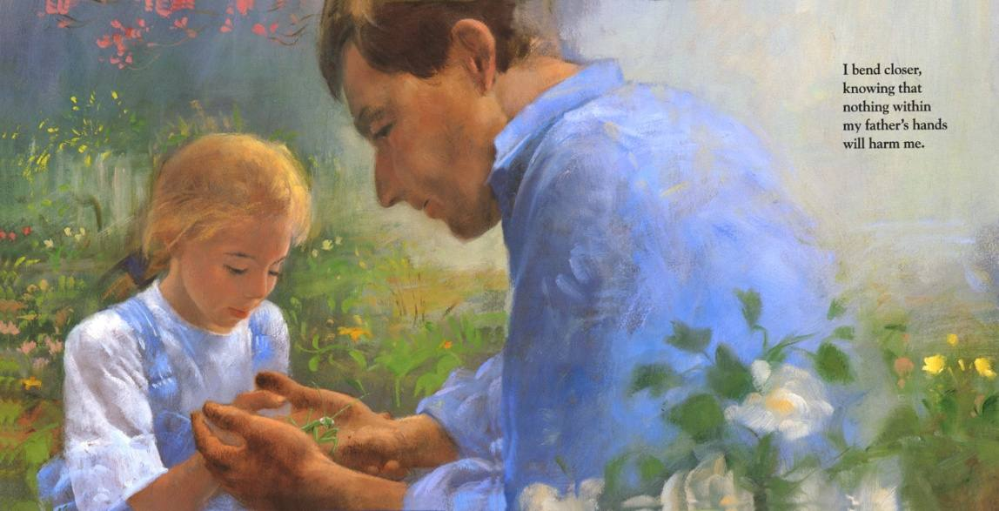{width="5.21875in"
height="2.6666666666666665in"}

In the garden with her father, a young girl describes her father's
hands:

Gardening

Holding insects

Surrounding hers

Holding hers

+-----------------+----------------------------+----------------------+
| Craft           | Example                    | Reason               |
+=================+============================+======================+
| Writing small   | Whole text                 | Focus                |
+-----------------+----------------------------+----------------------+
| Strong verbs    | scooping, lifting,         |                      |
|                 | planting, watering,        |                      |
|                 | weeding, kneeling,         |                      |
|                 | reaching, unfolding.       |                      |
+-----------------+----------------------------+----------------------+
| Descriptive     | Dirt fills every line and  | Imagery              |
| language        | edges each nail black.     |                      |
|                 |                            | Show Don't Tell      |
|                 | ...watch him till he melts |                      |
|                 | green in the greenness.    |                      |
+-----------------+----------------------------+----------------------+
| Simile          | ... his hands curl like a  | Figurative language  |
|                 | flower budding             |                      |
+-----------------+----------------------------+----------------------+
| Ellipsis        | unfolding wide so I can    | Anticipation         |
|                 | see ...                    |                      |
+-----------------+----------------------------+----------------------+
| Repetition      | He is so light, so bold,   | Emphasis             |
|                 | so strange.                |                      |
+-----------------+----------------------------+----------------------+
| Word pairs      | soft and warm              | Fluency              |
|                 |                            |                      |
|                 | hanging and swaying        |                      |
+-----------------+----------------------------+----------------------+

**My Father's Hands Joanne Ryder**

My father's hands are big and strong, scooping up earth and lifting
sacks of seeds. Thin cracks run down my father's fingers. Dirt fills
every line and edges each nail black.

Planting, watering, weeding, my father's hands shape a patch of earth
into our garden.

From the porch I watch him, kneeling in the sun, reaching into shadows
to find something small and hidden.

He calls to me with a promise in his voice, and I run, seeing his hands
curl like a flower budding, then unfolding wide so I can see ...

the pink circle of worm, the round beetle shining in gold armour, the
snail sliding over the dark cracks, or the leaf-green mantis balancing
today on long thin legs.

I bend closer, knowing that nothing within my father's hands will harm
me.

Gently my father tips his hands, softly urging the small one to my open
palms. Green prickly feet find their footing on my steady fingers. The
mantis tilts his pointed face, his huge round eyes watching me watch
him. He is so light, so bold, so strange. I wonder what he thinks of me,
of my hands soft and warm. And when he thinks I'm dreaming, he leaps --
scampering up my arm, hanging and swaying on my shirt. My father plucks
the traveller free and gives him back to me. His hands surrounding mine,
we take the small one to his bush, watch him till he melts green in the
greenness.

No one will ever bring me better treasures than the ones cupped in my
father's hands.

# [Ga-Ga's Hands](http://thepioneerwoman.com/blog/2009/08/ga-gas_hands/)

# 

# 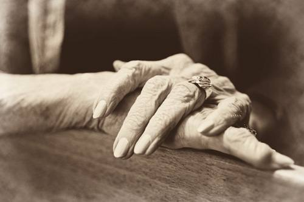{width="5.208333333333333in" height="3.46875in"}

# 

I've always loved Ga-Ga's hand's. Her nails. Her petite, thin fingers.
Her rings.

When I was a little girl, I used to curl up on Ga-Ga's lap, hold her
hands and say, "Ga-Ga? When you die, will you leave me all your rings?"

I wasn't concerned with the material value. At least...at least I hope I
wasn't. Yeah. Yeah, I'm pretty sure I wasn't. I just always connected
Ga-Ga's rings to her fingers...which were connected to her hands...which
always held and patted and hugged me and gave me baths in her kitchen
sink (not after I graduated from high school, though. I had to grow up
sometime.) Her hands fixed me sliced peaches in parfait glasses and
squirted Reddi-Whip all over the top, and they turned the TV channel to
Mary Tyler Moore and Bob Newhart. And they rubbed Vicks Vapour Rub on my
neck and chest if I ever so much as cleared my throat.

And that's why I always wanted to make sure she planned to leave me her
rings. Because then I'd always have a part of her with me. Because even
as a little girl I knew I could never, ever imagine life without her.

So when Ga-Ga came over to my house Saturday afternoon and rested her
beautiful hands on a chair in the kitchen, I made a point of capturing
them with my camera.

"I love your hands, Ga-Ga," I said.

She looked at her hands and laughed quietly. "Do you know why my hands
look like this?" she asked me.

"Arthur Itis?" I asked. It's the kind of joke only the daughter of an
orthopaedic surgeon appreciates.

"No," Ga-Ga answered. "It's because I've been down many a road in my
life. And not all of them were paved."

Then I laughed. Then I hugged her.

I couldn't possibly love a person more.

> **From Confessions of a Pioneer Woman**

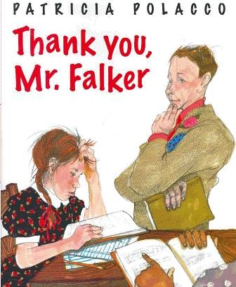{width="2.46875in"
height="3.0in"}

Following young Trisha as she navigates grade school while not being
able to read is a heart-warming true story about author, Patricia
Polacco. The story was written to honour the teacher that helped her
overcome her struggles with learning to read. Trisha is constantly
teased in school for not being able to read. It is during this time that
she relies on drawings to tell her stories and becomes quiet talented.
When her grandparents pass away, Trisha finds it even harder to find
dedication in school and in learning to read because her grandmother was
so supportive of her and told her that she was not dumb. After a move
from Michigan to California, Trisha finally meets a teacher that may
just change her life. Mr. Falker is genuine, kindhearted, and
influential and believes in Trisha from the beginning. He recognises her
amazing artistic talents and encourages her to continue those as well as
spends time with working with Trisha after school until she is finally
able to read a paragraph from Charlotte's Web all by herself and without
difficulty.

Patricia Polacco wrote this story in dedication and thanks to Mr. Falker
for changing her life and giving her the ability to read, and eventually
write amazing children's books.

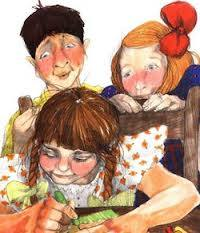{width="2.0833333333333335in"
height="2.4270833333333335in"}

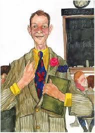{width="1.9791666666666667in"
height="2.7604166666666665in"}

{width="2.0in"
height="2.7395833333333335in"}

**Thank You, Mr Falker Patricia Polacco**

*The grandpa held the jar of honey so that all the family could see,
then dipped a ladle into it and drizzled honey on the cover of a small
book.*

*The little girl had just turned five.*

*"Stand up, little one," he cooed. "I did this for your mother, your
uncles, your older brother, and now you!"*

*Then he handed the book to her. "Taste!"*

*She dipped her finger into the honey and put it into her mouth.*

*"What is that taste?" the grandma asked.*

*The little girl answered, "Sweet!"*

*Then all of the family said in a single voice, "Yes, and so is
knowledge, but knowledge is like the bee that made that sweet honey, you
have to chase it through the pages of a book!"*

*The little girl knew that the promise to read was at last hers. son she
was going to learn to read.*

Trisha, the littlest girl in the family, grew up loving books. Her
schoolteacher mother read to her every night. Her redheaded brother
brought his books home from school and shared them. And whenever she
visited the family farm, her grandfather or grandmother read to her by
the stone fireplace.

When she turned five and went to kindergarten, most of all she hoped to
read. Each day she saw the kids in the first grade across the hall
reading, and before the year was over, some of the kids in her own class
began to read. Not Trisha.

Still, she loved being at school because she could draw. The other kids
would crowd around her and watch her do her magic with the crayons.

"In first grade, you'll learn to read," her mother said.

In first grade, Trisha sat in a circle with the other kids. They were
all holding *Our Neighbourhood*, their first reader, sounding out
letters and words. They said, "Beh, beh ... oy, boy, and luh, luh ...
ook, look." The teacher smiled at them when they put all the sounds
together and got a word right.

But when Trisha looked at a page, all she saw were wiggling shapes, and
when she tried to sound out words, the other kids laughed at her.

"Trisha, what are you looking at in that book?" they'd say.

"I'm reading!" she'd say back to them.

But her teacher would move on to the next person. Always when it was her
turn to read, her teacher had to help her with every single word. And
while the other kids moved up into the second reader and third reader,
she stayed alone in *Our Neighbourhood.*

Trisha began to feel 'different.' She began to feel dumb.

The harder words got for the little girl, the more and more time she
spent drawing -- how she loved to draw! -- or just sitting and dreaming.
Or, when she could, going for walks with her grandmother.

One summer day she and her grandma were walking together in the small
woods behind their farm. It was twilight. The air was sweet and warm.
Fireflies were just coming up from the grasses.

As they walked, Trisha said, "Gramma, do you think I'm ... different?"

"Of course," her grandma answered. "To be different is the miracle of
life. You see all of those little fireflies? Every one is different."

"Do you think I'm smart?" Trisha didn't feel smart.

Her grandma hugged her. "You are the smartest, quickest, dearest little
thing ever."

Right then the little girl felt safe in her grandma's arms. Reading
didn't matter so much.

Trisha's grandma used to say that the stars were holes in the sky. They
were the light of heaven from the other side. And she used to say that
someday she would be on the other side where the light comes from.

One evening they lay on the grass together and counted the lights from
heaven. "You know," her grandma said, "all of us will go there someday.
Hang onto the grass, or you'll lift right off the ground, and there
you'll be!"

They laughed, and both hung onto the grass.

But it was not long after that night that her grandma must have let go
of the grass, because she went to where the lights were, on the other
side. And not long after that, Trisha's grandpa let go of the grass,
too.

School seemed harder and harder now.

Reading was just plain torture. When Sue Ellyn read her page, or Tommy
Bob read his page, they read so easily that Trisha would watch the top
of their heads to see if something was happening to their heads that
wasn't happening to hers.

And numbers were the hardest thing of all to read. She never added
anything right.

"Line the numbers up before you add them," the teacher would say. But
when Trisha tried, the numbers looked like a stack of blocks, wobbly and
ready to fall.

She just knew she was dumb.

Then, one day, her mother announced that she had got a teaching job in
California! A long way from the family farm in Michigan.

Even though her grandma and grandpa were gone, the little girl didn't
want to move. Maybe, though, the teachers and kids in her new school
wouldn't know how dumb she was.

She and her mother and brother moved across the country in a two-tone
1949 Plymouth. It took five days.

But at the new school it was the same. When she tried to read, she
stumbled over words: "the cah, cah ... cat ... rrrr, rrr ... ran." She
was reading like a baby in the third grade!

And when her teacher read along with them, and called on Trisha for an
answer, she gave the wrong answer every time.

"Hey, dummy!" a boy called out to her on the playground, "How come you
are so dumb?" Other kids stood near him and they laughed.

Trisha could feel the tears burning in her eyes. How she longed to go
back to her grandparents' farm in Michigan.

Now Trisha wanted to go school less and less. "I have a sore throat,"
she'd say to her mother. Or, "I have a stomachache." She dreamt more and
more, and drew more and more, and she hated, hated, hated school.

Then, when Trisha started fifth grade, the school was all abuzz. There
was a new teacher. He was tall and elegant. everybody loved his striped
coat and slick grey pants -- he wore the neatest clothes.

All the usual teacher's pets gathered around him -- Stevie Joe and Alice
Marie, Davy and Michael Lee. But right from the start, it didn't seem to
matter to Mr Falker which kids were the cutest. Or the smartest. Or the
best at anything.

Mr Falker would stand behind Trisha whenever she was drawing, and
whisper, "This is brilliant ... absolutely brilliant. Do you know how
talented you are?"

When he said this, even the kids who teased her would turn around in
their seats and look at her drawings. But they still laughed whenever
she gave a wrong answer.

Then, one day, she had to stand up and read, which she hated. She was
stumbling through a page in *Charlotte's Web,* and the page was going
all fuzzy, when the kids began to laugh out loud.

Mr Falker, in his plaid jacket and his butterfly tie, said, "Stop! Are
all of you so perfect that you can look at another person and find fault
with her?"

That was the last day anyone laughed out loud. Or made fun of her. All
except Eric. He had sat behind Trisha for two whole years, but he seemed
almost to hate her. Trisha didn't know why.

He waited by the door of the classroom for her and pulled her hair. He
waited for her on the playground, leant in her face, and called her,
"Toad!"

Trisha was afraid to turn any corner, for fear Eric would be there. She
felt completely alone.

The only time she was really happy was when she was around Mr Falker. He
let her erase the blackboards -- only the best students got to do that.
He patted her on the back whenever she got something right, and he
looked hard and mean at any kid who teased her.

But the nicer Mr Falker was to Trisha, the worse Eric treated her. He
got all the other kids to wait for her on the playground, or in the
cafeteria, or even in the bathroom, and to jump out and call her
"Stupid!" or "Ugly!"

And Trisha began to believe them.

She discovered that if she asked to go to the bathroom just before
recess, she could hide under the inside stairwell during the free time,
and not have to go outside at all. in that dark place she felt
completely safe.

But one day at recess, Eric followed her to her secret hiding place.
"Have you become a mole?" he laughed. And he pulled her out into the
hall, and danced around her. "Dumbbell, dumbbell, magotty old dumbbell!"

Trisha buried her head in her arms and curled up in a ball. Suddenly,
she heard footsteps. It was Mr Falker.

He marched Eric down to the office. When he came back, he found Trisha.
"I don't think you'll have to worry about that boy again," he said
softly.

"What was he teasing you about, little one?"

"I don't know," Trisha shrugged.

Trisha was sure Mr Falker believed that she could read. She had learnt
to memorise what the kid next to her was reading. Or she would wait for
Mr Falker to help her with a sentence, then she'd say the same thing
that he did. "Good," he would say.

Then, one day, Mr Falker asked her to stay after school and help wash
the blackboards. He put on music and brought out little sandwiches as
they worked and talked.

All at once he said, "Let's play a game! I'll shout out letters. You
write them on the board with the wet sponge as quickly as you can."

"A." he shouted. She wiped a watery A.

"Eight," he shouted. She made a watery 8.

"Fourteen ... Three ... D ... M ... Q," he shouted out. He shouted out
many, many letters and numbers. Then he walked up behind her, and
together they looked at the board.

It was a watery mess. Trisha knew that none of the letters or numbers
looked like they should. She threw the sponge down and tried to run.

But Mr Falker caught her arm and sank to his knees in front of her. "You
poor baby," he said. "You think you're dumb, don't you? How awful for
you to be so lonely and afraid."

She sobbed.

"But, little one, don't you understand, you don't see letters or numbers
the way other people do. And you've got through school all this time,
and fooled many, many good teachers!" He smiled at her. "That took
cunning, and smartness, and such, such bravery."

Then he stood up and finished washing the board. "We're going to change
all that, girl. You're going to read -- I promise you that."

Now, almost every day after school, she met with Mr Falker and Miss
Plessy, a reading teacher. They did a lot of things she didn't even
understand! At first she made circles in sand, and then big sponge
circles on the blackboard, going from left to right, left to right.

Another day they flicked letters on a screen, and Trisha shouted them
out loud. Still other days she worked with wooden blocks and built
words. Letters, letters, letters. Words, words, words. Always sounding
them out. And that felt good.

But, though she'd read words, she hadn't read a whole sentence. And deep
down she still felt dumb.

And then one spring day -- had it been three months or four months since
they had started? -- Mr Falker put a book in front of her. She'd never
seen it before. He picked a paragraph in the middle of a page and
pointed at it.

Almost as if it were magic, or as if light poured into her brain, the
words and sentences started to take shape on the page as they never had
before. "She ... marched ... them ... off ... to ..." Slowly, she read a
sentence. The another, and another. And finally she'd read a paragraph.
And she understood the whole thing.

She didn't notice that Mr Falker and Miss Plessy had tears in their
eyes.

That night, Trisha ran home without stopping to catch her breath. She
bounded up the front steps, thre open her front door, and ran through
the dining room to the kitchen. She climbed up on the cupboard and
grabbed a jar of honey.

Then she went into the living room and found the book on a shelf, the
very book that her grandpa had shown her so many years ago. She spooned
honey on the cover and tasted the sweetness, and said to herself, "The
honey is sweet, and so is knowledge, but knowledge is like the bee who
made the honey, it has to be chased though the pages of a book!"

Then she held the book, honey and all, close to her chest. She could
feel tears roll down her cheeks, but they weren't tears of sadness --
she was happy, so very happy.

*The rest of the year became an odyssey of discovery and adventure for
the little girl. She learnt to love school. I know because that little
girl was me, Patricia Polacco.*

*I saw Mr Falker again some thirty years later at a wedding. I walked up
to him and introduced myself. At first he had difficulty placing me.
Then I told him who I was, and how he had changed my life so many years
ago.*

*He hugged me and asked me what I did for a living. "Why, Mr Falker," I
answered. "I make books for children ... Thank you, Mr Falker. Thank
you."*

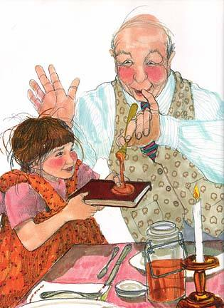{width="3.28125in"
height="4.5in"}

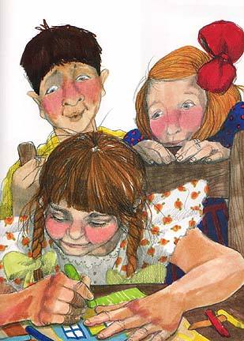{width="3.4895833333333335in"
height="4.875in"}

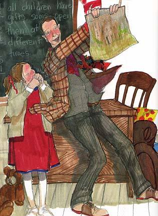{width="3.9583333333333335in"
height="5.427083333333333in"}

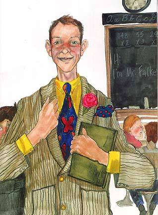{width="3.8541666666666665in"
height="5.229166666666667in"}

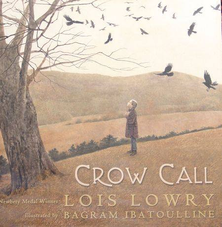{width="3.556385608048994in"
height="3.6354166666666665in"}

**Summary**

Eight-year-old Lizzie is just getting reconnected with her father who
has just returned home after World War II by going with him crow hunting
in November to protect the crops. Lizzie admits she's never gone hunting
before and asks her father, "What if I don't know what to do?" Her
father responds that he's decided to put her in charge of the crow call,
that it's a knack he's sure she'll be able to do. In a rainbow plaid
shirt that's so big for her so that the waitress mistakes her for a boy,
she and her father stop at a diner where her father, after asking her
what her favorite food is, orders two pieces of cherry pie for her.
After breakfast and on their way to the woods, she realises that she's
no more sure of hunting crows than she is of calling her father Daddy.
She asks him if he was scared in the war; he admits that he was and asks
her if she's scared of anything. She wants to tell him she's afraid of
the word "hunter" but instead asks about the crows and why they need to
be shot. She asks if he can call any animal, and the contest is won by
her father who feigns a silent giraffe call.

Then the time has come for Lizzie to try the crow call. To her delight
and amazement, the crows respond, at first a few and then dozens.
Lizzie's father doesn't shoot the crows; instead, he sits on a rock
delighting in her joy. Lizzie takes her father's hand, knowing that "The
crows will always be there and they will always eat the crops; and some
other morning, on some other hill, a hunter, maybe not my daddy, will
take aim."

**Review**

It's a cold November morning, and Liz's father has just returned from
the war. Shyly she sits "next to the stranger who is \[her\] father"
practicing his name under her breath, "Daddy. Daddy." Together they
drive to the Pennsylvania farmlands to hunt for the crows that destroy
the crops, learning each other's idiosyncrasies along the way; in
journeying to save the harvest, they begin to cultivate their
relationship anew. Beautifully written, the piece reads much like a
traditional short story. Lowry's narrative, dense with sensory details,
is based on her own life's events. Fittingly, Ibatoulline's muted,
earth-toned palette is reminiscent of vintage, faded photographs. At
times, the characters in the photorealistic illustrations are floating
in the uncanny valley, separated from their environment. But in other
instances, the details of his renderings gracefully capture a moment in
time that was lost. Relevant for families whose parents are returning
from war, the text is also ripe for classroom discussion and for
advanced readers.

> Kirkus Reviews

**My reaction**

This is another book that I've selected for the "everyone" category. The
illustrator, Bagram Ibatoulline, has dedicated this book to the memory
of Andrew Wyeth, his favorite American illustrator, and it show in his
realistic depictions of Liz and her father, as well as the Pennsylvania
countryside where the story takes place. His illustrations are perfectly
evocative of the story of a young girl and her father gradually getting
to know one another after his return from World War II. Although the
story is true, it is appropriate for any child getting to know a parent
who is returning from a long absence, such as a divorce.

**Possible activities**

Discuss what it's like to reacquaint oneself with a parent, a sibling,
or a grandparent, or even a friend that one hasn't seen in a while. Ask
the children to relate personal experiences that might be similar to
Lizzie's.

While Lizzie is conflicted about hunting, in the end she understands the
necessity to hunt crows. What do the students think about this conflict?

Personal Narrative Graphic Organiser

Author:\_\_\_\_\_\_\_\_\_\_\_\_\_\_\_\_\_\_\_\_\_\_\_\_\_\_\_\_\_

*Remember that a Personal Narrative has character descriptions, setting
descriptions, dialogue, and interesting vivid details. It's also very
specific and narrow.*

+-------------------------------------------------------------------------------------------+
| Topic/Event:                                                                              |
+=====================================+=====================================================+
| Engaging Lead:                                                                            |
+-------------------------------------------------------------------------------------------+
| Introduction:(includes descriptive details setting up your story)                         |
+-------------------------------------+-----------------------------------------------------+
| Beginning:                          |                                                     |
|                                     |                                                     |
| *Rising Action*                     |                                                     |
+-------------------------------------+-----------------------------------------------------+
| Middle:                             |                                                     |
|                                     |                                                     |
| *Climax*                            |                                                     |
+-------------------------------------+-----------------------------------------------------+
| End:                                |                                                     |
|                                     |                                                     |
| *Falling action/resolution*         |                                                     |
+-------------------------------------+-----------------------------------------------------+
| Strong Conclusion that connects back to the introduction.                                 |
+-------------------------------------------------------------------------------------------+

**\**

**Personal narrative**

Mentor text: Crow Call

**Students:**

- Write narratives to develop real or imagined experiences or events
  using effective technique, descriptive details, and clear event
  sequences.

- Create narratives that have a fully developed plot and a consistent

point of view.

Read Aloud

> Pause intermittently when you come across descriptive details,
> repeating the lines so students can listen and use them as examples in
> their own writing.
>
> *Visualise the events in the story. Think of what details specifically
> help form the mind picture you created.*

After Reading

Discussion on what images we saw as we listened to the story.

What noises did you hear?

What did you see?

What details from the story helped you to visualize those parts?

Good personal narratives aren't on big events. They're on small,
specific events. In this story, the girl was writing about a time where
she went crow hunting with her dad. Not a generalised story on crow
hunting, but a specific time she went. It was a very simple, but special
event that occurred in her life.

Writer's Notebook: Students write down as many events, anything that
comes to mind, on the left hand side of a page. They have 3 minutes to
do so. It can be a trip they went on, a time they went fishing with
their brother, holding their baby sister for the first time, or the
first time your mum brought home your puppy.

After they write down their ideas, they must take 2 minutes to choose an
idea from their list they want to write about. It must be true and it
must be important to them. It also must be specific.

Turn and Talk. Take 60 seconds to share with your neighbour what you
might write about.

Model if necessary how to narrow down a personal topic.

Story Map.

Draft personal narrative.

Review:

Review what their stories need to contain: A good opening/lead; a
beginning, middle, and an end, and good descriptive details.

- Also review the parts of personal narratives.

(Character description, setting description, dialogue, interesting
details, etc.)

**Rubric for Personal Narrative**

Author:
\_\_\_\_\_\_\_\_\_\_\_\_\_\_\_\_\_\_\_\_\_\_\_\_\_Date:\_\_\_\_\_\_\_

+----------------+----------------------------------------------+-----+
| Overall        | I wrote the story of an important moment. It |     |
|                | read like a story, even though it might be a |     |
|                | true account.                                |     |
+:==============:+==============================================+:===:+
| Lead           | I wrote a beginning in which I not only      |     |
|                | showed what was happening and where, but     |     |
|                | also gave some clues to what would later     |     |
|                | become a problem for the main character.     |     |
+----------------+----------------------------------------------+-----+
| Details        | I used precise details and used figurative   |     |
|                | language so that readers could picture the   |     |
|                | setting, characters, and events. I used some |     |
|                | objects or actions as symbols to bring forth |     |
|                | my meaning.                                  |     |
+----------------+----------------------------------------------+-----+
| Transitions    | I used transitional phrases to show passage  |     |
|                | of time in complicated ways, perhaps by      |     |
|                | showing things happening at the same time    |     |
|                | (meanwhile, at the same time) or flash back  |     |
|                | or flash-forward (early that morning, three  |     |
|                | hours later)                                 |     |
+----------------+----------------------------------------------+-----+
| Ending         | I wrote an ending that connected to the main |     |
|                | part of the story. The character said, did,  |     |
|                | or realized something at the end that came   |     |
|                | from what happened in the story.             |     |
|                |                                              |     |
|                | I gave readers a sense of closure.           |     |
+----------------+----------------------------------------------+-----+
| Organisation   | I used paragraphs to separate different      |     |
|                | parts or time of the story and to show when  |     |
|                | a new character was speaking. Some parts of  |     |
|                | the story were longer and more developed     |     |
|                | than others                                  |     |
+----------------+----------------------------------------------+-----+
| Elaboration    | I developed characters, setting, and plot    |     |
|                | throughout my story, especially the heart of |     |
|                | the story. To do this, I used a blend of     |     |
|                | description, action, dialogue, and thinking. |     |
+----------------+----------------------------------------------+-----+
| Spelling/      | I used spelling rules to help me spell and   |     |
|                | edit. I used resources when needed.          |     |
| Punctuation    |                                              |     |
|                | I used commas to set off introductory parts, |     |
|                | such as *"One day at the park, I went on the |     |
|                | slide."* I also capitalised letters at the   |     |
|                | beginning of a sentence, and the first       |     |
|                | letters of names of people, and places.      |     |
+----------------+----------------------------------------------+-----+
| Additional     |                                              |     |
| Comments:      |                                              |     |
+----------------+----------------------------------------------+-----+

**Crow Call Lois Lowry**

It's morning, early, barely light, cold for November. At home, in the
bed next to mine, Jessica, my older sister still sleeps. But my bed is
empty.

I sit shyly in the front seat of the car next to the stranger who is my
father, my legs pulled up under the too-large shirt I am wearing.

I practise his name to myself, whispering it under my breath. *Daddy.
Daddy.* Saying it feels new. The war has lasted so long. He has been
gone so long. Finally I look over at him timidly and speak aloud.

"Daddy," I say, "I've never gone hunting before. What if I don't know
what to do?"

"Well, Liz," he says, "I've been thinking about that, and I've decided
to put you in charge of the crow call. Have you ever operated a crow
call?"

I shake my head. "No."

"It's an art," he says. "No doubt about that. But I'm pretty sure you
can handle it. Some people will blow and blow on a crow call and not a
single crow will even wake up or bother to listen, much less answer. But
I really think you can do it. Of course," he adds chuckling, "having
that shirt will help."

My father had bought the shirt for me. In town to buy groceries, he had
noticed my hesitating in front of Kronenberg's window. The plaid hunting
shirts had been in the store window for a month - the popular
red-and-black and green-and-black ones towards the front, clothing
mannequins holding duck decoys; but my shirt, the rainbow plaid, hung
separately on a wooden hanger towards the back of the display. I had
lingered in front of Kronenberg's window every chance I had since the
hunting shirts had appeared.

My sister had rolled her eyes in disdain. "Daddy," she pointed out to
him as we entered Kronenberg"s, "that's a *man's* shirt."

The salesman had smiled and said dubiously, "I don't quite think ..."

"You know, Lizzie," my father had said to me as the salesman wrapped the
shirt, "buying this shirt is probably a very practical thing to do. You
will never *ever* outgrow this shirt."

Now, as we go into a diner for breakfast, the shirt unfolds itself
downwards until the bottom of it reaches my knees, from the bulky
thickness of rolled-back cuffs, my hands are exposed. I feel totally
surrounded by shirt.

My father orders coffee for himself. The waitress asks, "What about your
boy? What does he want?"

My father winks at me, and I hope that my pigtails will stay hidden
inside the plaid wool collar. Holding my head very still, I look at the
menu. At home my usual breakfast is cereal with honey and milk. My
mother keeps honey in a covered silver pitcher. There's no honey on the
diner's menu.

"What's your favourite thing to eat in the whole world?" asks my father.

I smile at him. "Cherry pie," I admit. If he hadn't been away for so
long, he would have known. My mother had even put birthday candles on a
cherry pie on my last birthday. It was a family joke in a family that
hadn't included Daddy.

My father hands back both menus to the waitress. "Three pieces of cherry
pie," he tells her.

"Three?" She looks at him sleepily, not writing the order down. "You
mean two?"

"No," he said, "I mean three. One for me, with black coffee, and two for
my hunting companion, with a large glass of milk."

She shrugs.

We eat quickly, watching the sun rise across the Pennsylvania farmlands.
Back in the car, I flip my pigtails out from under my shirt collar and
giggle.

"Hey, boy," my father says to me in an imitation of the groggy
waitress's voice, "you sure you can eat all that cherry pie, boy?"

"Just you watch me, lady," I answer in a deep voice, pulling my face
into stern, serious lines. We laugh again, driving out the grey-green
hills of the early morning.

It's not far to the place he has chosen, not long until he pulls the car
to the side of the empty road and stops.

Grass, frozen after its summer softness, crunches under our feet; the
air is sharp and supremely clear, free from the floating pollens of
summer, and our words seem etched and breakable on the brittle
stillness. I feel the smooth wood of the crow call in my pocket, moving
my fingers against it for warmth, memorising its ridges and shape. I
stamp my feet hard against the ground now and then as my father does. I
want to scamper ahead of him like a puppy, kicking the dead leaves and
reaching the unknown places first, but there is an uneasy feeling along
the edge of my back at the thought of walking in front of someone who is
a *hunter.* The word makes me uneasy. Carefully I stay by his side.

It is quieter than summer. There are no animals, no bird-waking noises;
even the occasional leaf that falls within our vision does so in
silence, spiralling slowly down to blend in with the others. But most
leaves are already gone from the trees; those that remain catch there by
accident, waiting for the wind that will free them. Our breath is steam.

"Daddy," I ask shyly, "were you scared in the war?"

He looks ahead, up the hill, and after a moment he says, "Yes. I was
scared."

"Of what?"

"Lots of things. Of being alone. Of being hurt. Of hurting someone
else."

"Are you still?"

He glances down. "I don't think so. Those kinds of scares go away."

"I'm scared sometimes," I confide.

He nods, unsurprised. "I know," he said. "Are you scared now?"

I start to say no. Then I remember the word that scares me. *Hunter.*

I answer, "Maybe a little."

I look at his gun, his polished, waxed prize, and then at him. He nods,
not saying anything. We walk on.

"Daddy?"

"Mmmmmm?" He is watching the sky, the trees.

"I wish the crows didn't eat the crops."

"They don't know any better," he says. "Even people do bad things
without meaning to."

"Yes, but ..." I pause and then say what I'd been thinking. "They might
have babies to take care of. Baby crows."

"Not now, Liz, not this time of year," he says. "By now their babies are
grown. It's a strange thing, but by now they don't even know who their
babies are." He puts his free arm over my shoulders for a moment.

"And their babies grow up and eat the crops, too," I say, and sigh,
knowing it to be true and unchangeable.

"It's too bad," he says. We begin to climb the hill.

"Can you call anything else, Daddy? Or just crows?"

"Sure," he says. "Listen. *Mooooooooo.* That's a cow call."

"Guess the cows didn't hear it," I tease.

"Well, of course, sometimes they choose not to answer. I can do tigers,
too. *Rrrrrrrrrrr."*

"Ha, so can I. And bears. Better watch out, now. Bears might come out of
the woods on this one. *Grrrrrrrrr."*

"You think you're so smart, doing bears. Listen to this. Giraffe call."
He stands with his neck stretched out, soundless.

I try not to laugh, wanting to do rabbits next, but I can't keep from
it. He looks so funny, with his neck pulled away from his shirt collar
and a condescending, poised, giraffe look on his face. I giggle at him
and we keep walking to the top of the hill.

From where we stand, we can see almost back to town. We can look down on
our car and follow the ribbon through the farmlands until it is lost in
trees. Dark roofs of houses lay scattered, separated by pastures.

"Okay, Lizzie," says my father, "this is a good place. You can do the
crow call now."

I see no crows. For a moment, the fear of disappointing him struggles
with my desire to blow into the smooth, polished tip of the crow call.
But I see that he's waiting, and I take it from my pocket, hold it
against my lips and blow softly.

The harsh, muted sound of a sleepy crow comes as a surprise to me, and I
smile at it, at the delight of having made that sound myself. I do it
again, softly.

From a grove of trees on another hill comes an answer from a waking
bird. Just one, and then silence.

Tentatively I call again, more loudly. The branches of a nearby tree
rustle, and crows answer, fluttering and calling crossly. They fly
briefly into the air and then settle on a branch -- three of them.

"Look, Daddy," I whisper. "Do you see them? They think *I'm* a crow!"

He nods, watching them.

I move away from him and stand on a rock at the top of the hill and blow
loudly several times. Crows rise from all the trees. They scream with
harsh voices and I respond, blowing again and again as they fly from the
hillside in circles, dipping and soaring, landing speculatively,
lurching from the limbs in afterthought and then settling again with
resolute and disgruntled shrieks.

"Listen, Daddy! Do you hear them? They think I'm their friend! Maybe
their baby, all grown up!"

I run about the top of the hill and then down, through the frozen grass,
blowing the crow call over and over. The crows call back, and from all
the trees they rise, from all the hills. They circle and circle, and the
morning is filled with the patterns of calling crows as I look back,
still running. I can see my father sitting on a rock, and I can see he
is smiling.

My crow calling comes in shorter and shorter spurts as I become
breathless; finally I stop and stand laughing at the foot of the hill,
and the noise from the crows subsides as they circle and settle back in
the trees. They are waiting for me.

My father comes down the hill to meet me coming up. He carries his gun
carefully; and though I am grateful to him for not using it, I feel that
there is no need to say thank you -- Daddy knows this already. The crows
will always be there and they will always eat the crops; and some other
morning, on some other hill, a hunter, maybe not my daddy, will take
aim.

I blow the crow call once more, to say good morning and good-bye and
everything that goes in between. Then I put it into the pocket of my
shirt and reach over, out of my enormous cuff, and take my father's
hand.

**Biography of Lois Lowry**

{width="2.1666666666666665in"
height="2.7708333333333335in"}

Lois Lowry was born on March 20, 1937 in Honolulu, Hawaii, to Katharine,
a teacher, and Robert Hammersberg, an army dentist stationed near Pearl
Harbor. Lois, her siblings, and her mother moved to Pennsylvania before
the Pearl Harbor bombings in 1941. By her own account, Lowry\'s
childhood was safe, happy, and predictable. Her father was deployed for
several years, so Lowry grew up largely without his presence.

Lowry learned to read at an early age, and she loved to create stories
in her mind as a child. She graduated from high school at sixteen and
matriculated at Pembroke College, a women's college that was connected
to and later became part of Brown University. She studied writing with
the hope of becoming a novelist. However, like many of her female peers
in the 1950s, Lowry married before completing college and turned her
attention to being a homemaker.

She married naval officer Donald Grey Lowry in 1956 and spent the next
several years raising their four children: Alix, Grey, Kristin, and
Benjamin. Donald pursued his law degree at Harvard, while Lois stayed at
home with the children until they reached adulthood. Eventually, she
returned to school to complete her degree at the University of Southern
Maine in 1972. She continued on to attend graduate school at USM. During
this time, Lowry started publishing short stories and writing textbooks.

After divorcing Donald in 1977, Lois Lowry published A Summer to Die,
her first novel. A Summer to Die is the story of Meg Chalmers, a teenage
girl who has a complicated relationship with her older sister Molly.
Molly\'s battle with a terminal disease forces Meg to reevaluate her own
life as she comes to understand her love for her sister. Lowry got the
idea for the novel from her own life; her older sister Helen lost her
fight with cancer when Lowry was twenty-five.

Over the next few years, Lowry wrote and published several novels,
including a series of books about Anastasia Krupnik, a girl on the brink
of adolescence who often finds herself in humorous situations. Alongside
these more comic works, Lowry wrote a number of more serious novels,
such as Rabble Starkey (1987). Parable Ann, also known as Rabble, lives
in the rural Appalachian Mountains of West Virginia, and the story is
centered on love and family.

Lowry received the Newbery Medal for Children\'s Literature twice in her
career. She earned the first one in 1990 for Number the Stars. The novel
tells story of young Annemarie Johansen, a Danish gentile living in
Copenhagen during World War II. She and her family risk their lives to
help Jews escape from Nazi-controlled Denmark into Sweden.

Lowry received her second Newbery Medal in 1993 for The Giver. The Giver
is the story of Jonas, a boy living in a dystopian society. One day, he
becomes the new Receiver of Memory - a respected but lonely and
difficult position which, Jonas learns, involves protecting all of
society\'s memories. Eventually, Jonas decides he must escape the
community in order to return his memories to society, and the novel\'s
ambiguous ending leaves the question of Jonas\'s fate unanswered.

Lois Lowry published more several novels during the 2000s, including
Gathering Blue and Messenger, both of which are set in the same
dystopian environment as The Giver. One of America\'s most celebrated
young adult novelists, Lois Lowry has engaged millions of readers with
her careful and sensitive stories dealing with major issues like death,
cancer, and the Holocaust. She remains an active writer.

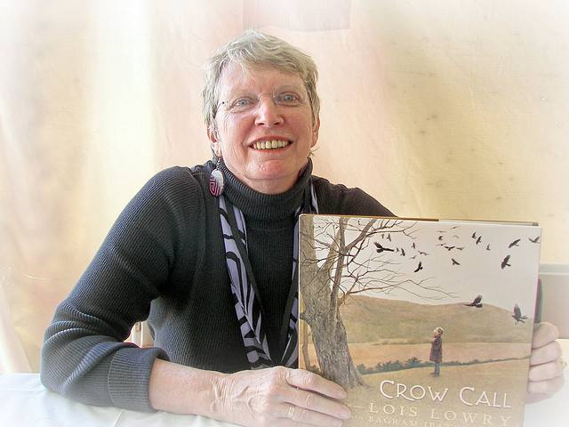{width="6.268055555555556in"
height="4.701042213473316in"}

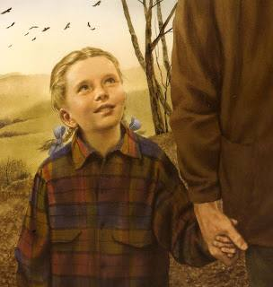{width="3.1666666666666665in"
height="3.3333333333333335in"}

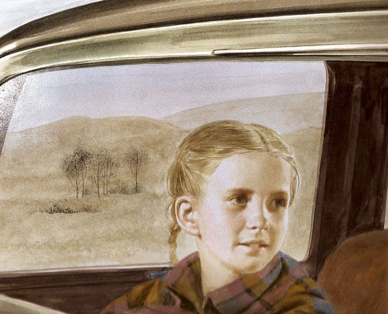{width="6.268055555555556in"
height="5.084959536307961in"}

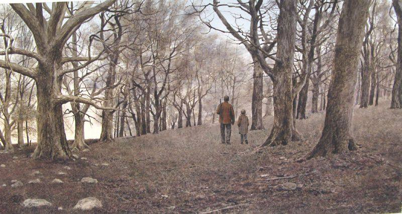{width="6.268055555555556in"
height="3.3455741469816274in"}

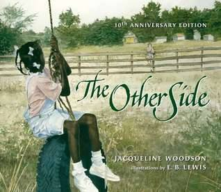{width="3.3125in"
height="2.875in"}

Clover\'s mum says it isn\'t safe to cross the fence that segregates
their African-American side of town from the white side where Anna
lives. But the two girls strike up a friendship, and get around the
grown-ups\' rules by sitting on top of the fence together.

With the addition of a brand-new author\'s note, this special edition
celebrates the tenth anniversary of this classic book. As always,
Woodson moves readers with her lyrical narrative, and E. B. Lewis\'s
amazing talent shines in his gorgeous watercolor illustrations.

**Questioning and Discussion**

Before Reading

What is the purpose of a fence?

Look at the picture on the cover and read the title of the book. What is
on each side of the fence on the cover? What might the girls be
thinking. Think of some reasons why those girls aren't playing together.

T-S: Name some boundaries you are not allowed to cross---maybe it is a
busy street or even the door of your sister's room. What other
boundaries do you know about that are okay to cross. Talk about what a
boundary is and some reasons boundaries cannot be crossed (privacy,
safety, avoid disputes).

During Reading

Why do you think the white girl seems so sad? How do you think the black
girl feels about that girl?

Look at the picture of the girls seeing each other in town. Notice how
the girls are dressed so much alike. The mothers are dressed alike, too.
Do you think it is confusing to the girls why they should be kept apart?
They are neighbours, the same age, and have the same interests. Doesn't
it seem that, of course, they should be friends? Why do you think the
girls are looking at each other but the mothers aren't?

CONNECT: Why do you think the adults don't try to change "the way things
have always been?" Is it up to children to make changes in the world
because adults won't? What changes would you like to make to today's
world?

After Reading

Why do you think Clover's mother didn't tell her to get down from the
fence?

Look at the pictures on the last two pages of all the girls on the
fence. What do you think is going on in these pictures?

CONNECT: Have you ever felt like something was wrong and you knew
something had to be done to fix it? What did you do about it?

Activities

Annie and Clover were taking steps towards making their world a better
place. Sometimes children are the best people to make changes because
adults are used to doing things in a certain way. Think of something you
(and your friends) can do to make the world a better place. Think of an
issue, such as hunger, pollution, a sick neighbour, or recycling. Make a
plan for a small thing you can do to improve the problem. Do it.

Annie and Clover made friends slowly. They watched each other and moved
carefully together, step-by-step. Talk about how you make friends. What
do you say and do? Do you make friends in the same way in the
neighbourhood as you do at school? Where else have you made a friend? Do
your friends look like you and act like you (same gender, same skin
colour, same religion, same personality, etc.)? Draw pictures of
yourself playing with your friends.

A fence is a boundary. Another kind of boundary is a rule. A rule tells
you the limit for your behaviour. Talk about how a family rule is like a
fence. Name your family rules and write them down. Talk about what
happens when you cross the boundary from following the rule to breaking
the rule. What is the purpose of a rule (safety, avoid conflict)?

Clover and Annie climbed up on the fence because they wanted to test the
boundary between them. They were sure that someday the fence would come
down. Have you ever tested a boundary (tried to cross it to see what
would happen)? Think about boundaries such as a street and fence, as
well as a boundary such as a rule. Why did you test it? Did you wonder
if the boundary was important? What did you find out?

Think of someone at school or the playground who often plays alone (or a
neighbour who lives alone). Next time you are there, ask that person to
play. Make a plan now for what you will say and do to include him or her
in your play activity.

Think about where you are right now. Name some "other sides" from where
you are. For example, if you are sitting next to Mum, she has another
side. Who or what is on her other side? What are some more other sides
from you? (There is the other side of . . . the table, the room, the
window, the street, the town, and the world.) Are you happy with which
side you are on? Would you like to know more about the other side? How
would you feel if someone told you not to go to one of those other
sides?

Sketch-to-Stretch

Sketch your response to the story. Remember not to worry about artistic

quality, just sketch your reaction.

Describe your sketch and your reaction to the story.

**The Other Side**

**Jacqueline Woodson**

That summer the fence that stretched through our town seemed bigger. We
lived in a yellow house on one side of it. White people lived on the
other. And mama said, "Don't climb over that fence when you play." She
said it wasn't safe.

That summer there was a girl who wore a pink sweater. Each morning, she
climbed up on the fence and stared over at our side. Sometimes I stared
back. She never sat on that fence with anybody, that girl didn't.

Once, when we were jumping rope, she asked if she could play. And my
friend Sandra said no without even asking the rest of us.

I don't know what I would have said. Maybe yes, maybe no.

That summer everyone and everything on the other side of that fence
seemed far away. When I asked my mama why, she said, "Because that's the
way things have always been."

Sometimes when me and Mama went into town, I saw that girl with her
mama. She looked sad sometimes, that girl did.

"Don't stare," my mama said. "It's not polite."

It rained a lot that summer. On rainy days that girl sat on the fence in
a raincoat. She let herself get all wet and acted like she didn't even
care. Sometimes I saw her dancing around in puddles, splashing and
laughing.

Mama wouldn't let me go out in the rain.

"That's why I bought you rainy-day toys," my mama said. "You stay inside
here -- where it's warm and safe, and dry."

But every time it rained, I looked for that girl. And I always found
her. Somewhere near the fence.

Someplace in the middle of the summer, the rain stopped. When I walked
outside, the grass was damp and the sun was already high up in the sky.
And I stood there with my hands up in the air. I felt brave that day. I
felt free. I got close to the fence and that girl asked me my name.

"Clover," I said.

"My name's Annie," she said. "Annie Paul. I live over yonder," she said,
"by where you see the laundry. That's my blouse hanging on the line."

She smiled then. She had a pretty smile.

And then I smiled. And we stood there looking at each other, smiling.

"It's nice up on this fence," Annie said. "You can see all over."

I ran my hand along the fence. I reached up and touched the top of it.

"A fence like this was made for sitting on," Annie said. She looked at
me sideways.

"My mama says I shouldn't go on the other side," I said.

"My mama says the same thing. But she never said nothing about sitting
on it."

"Neither did mine," I said.

That summer me and Annie sat together on that fence. And when Sandra and
them looked at me funny, I just made believe I didn't care.

Some mornings my mama watched us. I waited for her to tell me to get
down from that fence before I break my neck or something. But she never
did.

"I see you made a new friend," she said one morning. And I nodded and
Mama smiled.

That summer me and Annie sat on that fence and watched the whole wide
world around us.

One day Sandra and them were jumping rope near the fence and we asked if
we could play. "I don't care," Sandra said.

And when we jumped, Sandra and me were partners, the way we used to be.
When we were too tired to jump anymore, we sat up on the fence, all of
us in a long line.

"Someday somebody's going to come along and knock this old fence down,"
Annie said.

And I nodded. "Yeah," I said. "Someday."

**Jacqueline Woodson**

**Response Strategies and Engagements**

Because student questions are the beginning point of learning, the
following activities use student reactions and thoughts as the starting
point for a deeper look at Jacqueline Woodson's body of work. The
suggested activities are based on Kathy Short's cycle of inquiry (2009)
and are meant to encourage critical thinking about the books and the
characters portrayed.

Use one of the response strategies to look at each book as a whole, or
use different strategies for various chapters, or to look at the entire
body of work. Choosing at least one strategy from each category will
push student thinking.

**Connections:**

Connections give readers an entry point into the narrative. Through
connections they can understand or empathise with a character or event
because of an experience in their own personal history.

• Post-Full Thinking: students read the assigned section, placing
post-in notes on pages or photos that make them think of something that
happened to them, to friends or families, or in another book they have
read. In small discussion groups, students take turns sharing their
post-it notes and connections.

• Graffiti Board: each person in the group takes a corner of a big sheet
of paper and records in graffiti-fashion their responses to the book. It
can be quotes, sketches or connections, with the focus on initial
responses to the book. Group members then share their graffiti, possibly
followed by charting or webbing to organise their connections.

• Collage Reading: students mark quotes in the book that are
significant. One person starts by reading a quote. The student may leave
it at that, or may choose to add a brief comment about the personal
significance of the quote. Another student then jumps in with a
significant quote. There is no discussion of the quotes until after
anyone who wishes has shared their selection with the group or class.

**Invitation:**

These activities help readers identify and focus on parts of the
narrative they wonder and think about, inviting a thoughtful reaction to
the book.

• Save the Last Word For Me: students make note of passages that catch
their attention because they are interesting, puzzling, powerful or
contradictory. They then write the quote on a card, and their personal
response on the other side. In small groups, a student begins by sharing
the quote, and the other group members discuss their thinking about the
quote. When the discussion dies down, the student then reads his/her
response and explains why he/she picked the quote, having the 'last
word'. Another member then begins the discussion with a quote he/she
selected.

• Sketch to Stretch: a symbolic drawing is often more challenging to
create than writing a reaction with words. Students create a graphic or
visual image of what the chapter/book meant to them. This is not an
illustration but a symbolic rendering of the meaning of a passage. Group
members comment on the drawing before the student shares the meaning.
Group members can then discuss the different ideas that were raised by
the sketches.

• Written Conversation: students have a conversation back and forth with
another student, writing on a shared piece of paper. No talking is
allowed.

**Tension:**

Identifying tensions help readers focus on parts of the story that are
puzzling to them personally. Tensions often introduce and invite
discussion about different perspectives.

• Webbing What's On My Mind: After sharing initial connections and
responses, the group webs issues, themes and discussions that they could
discuss. They decide on one tension that is the most interesting, and
discuss it, adding new ideas to their web as they come up.

• Chart a Conversation: fill in a chart with the categories I Like, I
Dislike, Patterns, Problems/Puzzles. Each group fills in the chart,
discussing what they write down. They share with the class what they
wrote, and add in a different colour items or issues that other groups
thought of. They then discuss issues in their groups that they had not
discussed before.

**Investigation:**

Investigations allow readers to focus on an idea, event or person in the
book they want to explore more in depth.

• There are a number of overarching themes in Woodson's work, such as
ACCEPTANCE, EQUALITY, CONFLICT, IDENTITY, FAMILY TIES, STEREOTYPES,
DISCRIMINATION AND POWER. Students begin a web with one of these themes
in the middle, adding links for the many kinds of related words
displayed in Woodson's books and other books paired with it. After
adding to the web several times over the course of the study, the
teacher then types up all the words and gives the groups a set of the
words. Students cut them up and organise them in big categories that
make sense to that group. Each group then presents their organisation to
the class. Over the course of

the study, the students consider how their concept of the theme changes
or expands.

• Comparison Charts or Venn Diagrams: Choose two people, issues,
organisations, or philosophical approaches to promoting change. Use some
sort of graphic organiser to compare the two choices and how they are
alike or different.

• Heart Maps: After discussing one or more of Woodson's books, choose a
character the group would like to look at more closely. The group then
maps his/her heart, using spatial relationships, colour and size to show
the values and beliefs he/she held and how important each was in
relationship to his other values or beliefs. The same strategy can be
used to look at characters in books paired with Woodson's books.

**Book-pairing:**

Pairing books gives yet another perspective on the struggle for civil
rights.

• Pair Woodson's books and nonfiction/informational texts to draw some
students more effectively into the historical significance of her work,
and make the books come alive in a different way. Use the same
discussion strategies listed above to look at the fiction.

• Pair the book The Other Side with other documentaries that profile an
event in the struggle for civil rights (e.g. the Montgomery Bus Boycott,
the Selma-Montgomery Walk, the March on Washington for Jobs and Freedom,
the Woolworths sit-in, the Freedom Rides...) On a map, record where
different events took place in order to create a sense of where the
activity pockets were.

**Sketch to Stretch**

Here are some suggestions for ways to have students sketch to
stretch---use a visual portrayal to extend literary understandings:

- Have students choose a scene or a passage and draw it, incorporating
  the passage into the visual.

- In groups, ask students to choose the \"most important moment\" in the
  book and represent it graphically.

- When the groups share their work with the class, they should explain
  the reasons for choosing the moment they did as well as why they
  portrayed it as they did.

- In groups or with a partner, ask students to choose a character and
  portray him or her non-representationally--- using colour, shape, and
  visual symbols. When they share their work, they should explain why
  they chose a particular character as well as the artistic choices they
  made for their portrayal.

- Have students do a visual sketch in their writer's notebooks in place
  of the customary written response. You may ask that they include a
  brief written commentary so you can understand their thinking.

- To begin a discussion, ask students to do a quick sketch of an issue
  in the reading that interests them. Use the sketches to begin the
  discussion.

To help students appreciate the strengths of sketch to stretch, you may
wish them to consider ways in which their

sketches helped them see or understand things in the literature that
they might not have noticed before, or if they

changed their plan for a sketch during the process of sketching and why.

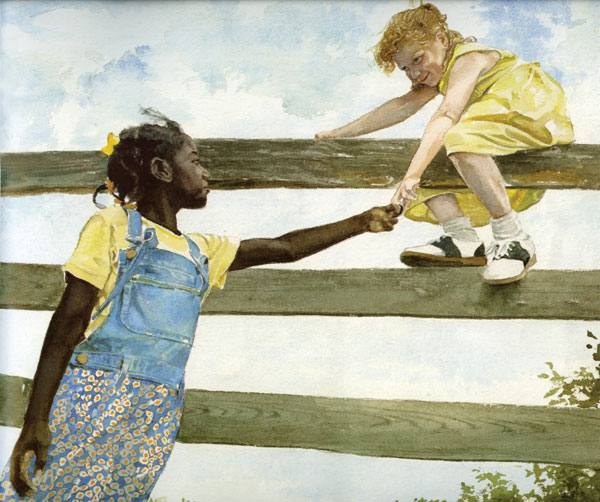{width="6.25in"
height="5.229166666666667in"}

**Jacqueline Woodson**

{width="1.5625in"
height="1.5625in"}

I used to say I'd be a teacher or a lawyer or a hairdresser when I grew
up but even as I said these things, I knew what made me happiest was
writing.

I wrote on everything and everywhere. I remember my uncle catching me
writing my name in graffiti on the side of a building. (It was not
pretty for me when my mother found out.) I wrote on paper bags and my
shoes and denim binders. I chalked stories across sidewalks and penciled
tiny tales in notebook margins. I loved and still love watching words
flower into sentences and sentences blossom into stories.

I also told a lot of stories as a child. Not "Once upon a time" stories
but basically, outright lies. I loved lying and getting away with it!
There was something about telling the lie-story and seeing your friends'
eyes grow wide with wonder. Of course I got in trouble for lying but I
didn't stop until fifth grade.

That year, I wrote a story and my teacher said "This is really good."
Before that I had written a poem about Martin Luther King that was, I
guess, so good no one believed I wrote it. After lots of brouhaha, it
was believed finally that I had indeed penned the poem which went on to
win me a Scrabble game and local acclaim. So by the time the story
rolled around and the words "This is really good" came out of the
otherwise down-turned lips of my fifth grade teacher, I was well on my
way to understanding that a lie on the page was a whole different animal
--- one that won you prizes and got surly teachers to smile. A lie on
the page meant lots of independent time to create your stories and the
freedom to sit hunched over the pages of your notebook without people
thinking you were strange.

Lots and lots of books later, I am still surprised when I walk into a
bookstore and see my name on a book or when the phone rings and someone
on the other end is telling me I've just won an award. Sometimes, when
I'm sitting at my desk for long hours and nothing's coming to me, I
remember my fifth grade teacher, the way her eyes lit up when she said
"This is really good." The way, I --- the skinny girl in the back of the
classroom who was always getting into trouble for talking or missed
homework assignments --- sat up a little straighter, folded my hands on
the desks, smiled and began to believe in me.

{width="2.8125in"
height="1.9583333333333333in"}

{width="6.268055555555556in"
height="4.477182852143482in"}

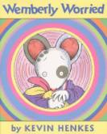{width="1.3854166666666667in"
height="1.7291666666666667in"} **Wemberly Worried Kevin Henkes**

Wemberly is always worried. She is worried about the swings, her
birthday party, and her favourite stuffed animal, Petal. Her parents and
her grandmother always tell her not to worry, but Wemberly worries even
more. When she is very worried, she rubs Petal's ears and it helps her
calm down. Wemberly is worried even more about starting school. Will the
teacher be mean? What if she does not like the snack? What if she can't
find the bathroom? Wemberly is worried about everything. Will she be
able to go to school and find a friend?

Before Reading

Show the children the book Wemberly Worried . Tell the children that the
story is about a little mouse named Wemberly who worried about
everything, especially about the first day of school. Ask them if they
remember how they felt before their first day of school. Did they feel
worried? Did they feel excited? Encourage them to share their feelings
with their friends.

**Activity**

1.  Read the book *Wemberly Worried. *On a sheet of chart paper write
    the question *What did Wemberly worry about? A* sk the children to
    recall the different things that Wemberly worried about in the book.
    Record their responses.

2.  Review the list with the class. Ask them if they ever have similar
    worries. Engage the class in a discussion about their worries.

3.  Next, solicit opinions about Wemberly\'s experience at school. What
    caused Wemberly\'s worries about school to go away? Ask the class to
    recall events that helped their worries about school to go away.

4.  Do they think that Wemberly will continue to worry? What might she
    worry about now that she has completed her first day of school?

5.  Invite the children to share their thoughts about why they think
    this is a good story for children. Record their responses on chart
    paper.

**Writing**

Write about a time when you were worried. Tell how you got over the
worry.

Make up a story about the second day of school. Tell what Wemberly and
Jewel might do.

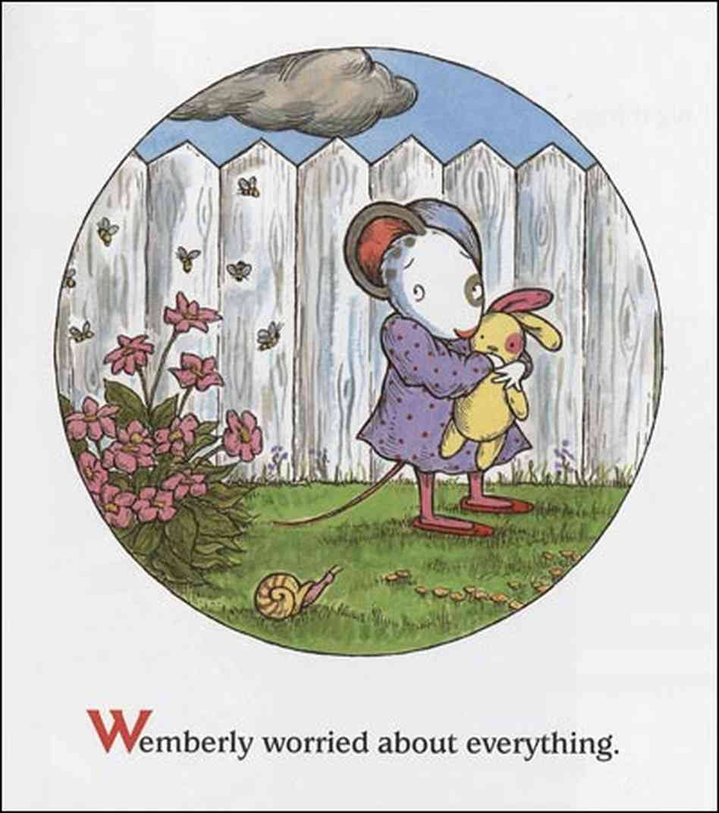{width="6.268055555555556in"
height="7.0813156167979in"}

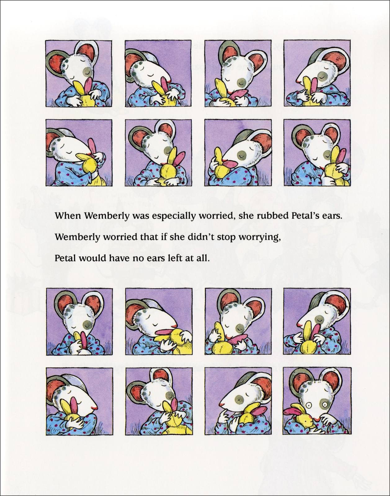{width="6.268055555555556in"
height="7.9790135608048995in"}

**Wemberly Worried Kevin Henkes**

Wemberly worried about everything.

Big things, little things, and things in between.

Wemberly worried in the morning. She worried at night. And she worried
throughout the day.

"You worry too much," said here mother.

"When you worry, I worry," said her father.

"Worry, worry, worry," said her grandmother. "Too much worry."

At home, Wemberly worried about the tree in the front yard, and the
crack in the living room wall, and the noise the radiators made.

At the playground, Wemberly worried about the chains on the swings, and
the bolts on the slide, and the bars on the jungle gym. And always. she
worried about her doll, Petal.

"Don't worry," said her mother.

"Don't worry," said her father.

But Wemberly worried. She worried and worried and worried. When Wemberly
was especially worried, she rubbed Petal's ears. Wemberly worried that
if she didn't stop worrying, Petal would have no ears left at all.

On her birthday, Wemberly worried that no one would come to her party.

"See," said her mother. "there was nothing to worry about."

But then Wemberly worried that there wouldn't be enough cake.

On Halloween, Wemberly worried that there would be too many butterflies
in the neighbourhood parade.

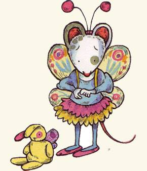{width="3.0208333333333335in"
height="3.5208333333333335in"}

"See," said her father, "there was nothing to worry about."

But then Wemberly worried because she was the only one.

"You worry too much," said her mother.

"When you worry, I worry," said her father.

"Worry, worry, worry," said her grandmother. "Too much worry."

Soon, Wemberly had a new worry: school. Wemberly worried about the start
of school more than anything she had ever worried about before.

By the time the first day arrived, Wemberly had a long list of worries.

What if no one else has spots?

What is no one else wears stripes?

What if no one else brings a doll?

What if the teacher is mean?

What if the room smells bad?

What if they make fun of my name?

What if I can't find the bathroom?

What if I hate the snack?

What if i have to cry?

"Don't worry," said her mother.

"Don't worry," said her father.

But Wemberly worried. She worried and worried and worried. She worried
all the way there.While Wemberly's parents talked to the teacher, Mrs
Peachum, Wemberly looked around the room.

Then Mrs Peachum said, "Wemberly, there is someone I think you should
meet."

Her name was Jewel. She was standing by herself. She was wearing
stripes. She was holding a doll. At first, Wemberly and jewel just
peeked at each other.

"This is Petal," said Wemberly.

"This is Nibblet," said Jewel.

Petal waved. Nibblet waved back.

"Hi," said petal.

"Hi," said Nibblet.

"I rub her ears," said Wemberly.

"I rub her nose," said Jewel.

Throughout the morning, SWemberly and Jewel sat side by side and played
together whenever they could. Petal and Nibblet sat side by side, too.

Wemberly worried. But no more than usual. And sometimes even less.
before Wemberly knew it, it was time to go home.

"Come back tomorrow," called Mrs Peachum.. as the students walked out
the door.

Wemberly turned and smiled and waved.

"I will,' she said. "Don't worry."

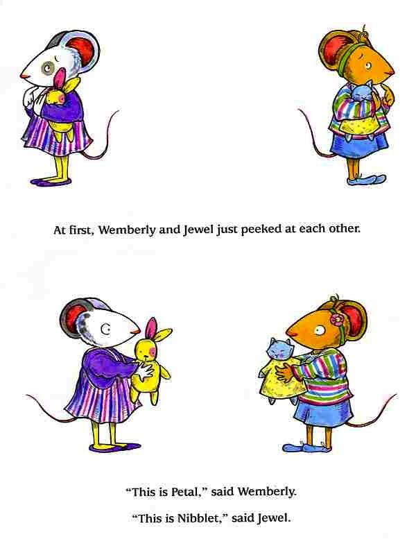{width="6.25in"
height="8.333333333333334in"}

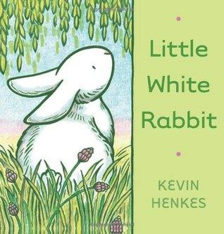{width="3.3125in"
height="3.46875in"}

Little White Rabbit wonders about everything. What would it be like to
be green, like the grass? Or tall like the fir trees? But the one thing
Little White Rabbit knows for sure is that someone who loves him is
always waiting for him at home.

Little White Rabbit's eager curiosity and the beauty of the world around
him are illustrated with incredible understanding and sensitivity, in
all the colors of Easter and spring.

Meet Kevin Henkes and Little White Rabbit by HarperKids on Youtube

**Thinking and Disc ussing**

1\. Who Is Little White Rabbit? Discuss what young readers know about
Little White Rabbit. What does he do? What does he like? What doesn't he
like? Is Little White Rabbit real or pretend? How do they know?

Would they like to be friends with Little White Rabbit? Why or why not?

2\. A Green Rabbit? Ask children what imagination is. How do they know
when Little White Rabbit uses his imagination in the book? Ask them to
imagine that they themselves could change in the same ways Little White
Rabbit imagines changing. How would their lives be different if they
were green? Or as tall as a tree? Or able to fly? If they could change
in only one of these ways, which one would they choose and why? Which
one wouldn't they choose and why?

3\. Runaway Rabbit! Everyone is scared of something. Discuss with
children what frightened Little White Rabbit, why he was scared, and
what he did about it. Do cats frighten them, too? Lead a conversation
about what scares them and what they can do about it.

4\. What Else, Little White Rabbit? Reread the book, pausing to discuss
each thing that makes Little White Rabbit curious. What else could
Little White Rabbit wonder about grass, fir trees, rocks, and
butterflies?

Encourage children to think in other directions, as well. What else is
green? What else is tall? What else does not move? What else flutters?
What else do they think Little White Rabbit wonders about when he is at
home?

5\. Another Word for Rabbit Is . . . Ask children to think about the
words they heard in the story. Which words do they remember? Why do they
remember those words, in particular? Explain that there can be more than
one word for the same thing, and have them think about the word rabbit.
What is another word for rabbit? Also consider other ways to say hopped,
flutter, and frightened.

6.A Rabbit in Springtime. Review the book with a silent picture walk
(turning the pages and asking children to remember what was happening on
each page). Have children share what they noticed with the whole group.
What do the illustrations make them think about? How do the pictures
make them feel?

{width="2.1041666666666665in"
height="2.71875in"}

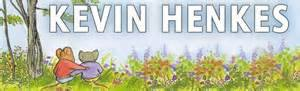{width="3.125in"
height="0.9479166666666666in"}

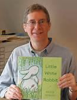{width="1.3541666666666667in"
height="1.7708333333333333in"}

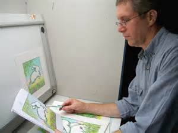{width="3.125in"
height="2.34375in"}

**Little White Rabbit Kevin Henkes**

Little white rabbit hopped along.

When he hopped through the high grass, he wondered what it would be like
to be green.

When he hopped by the fir trees, he wondered what it would be like to be
tall.

When he hopped over the rock, he wondered what it would be like not to
be able to move.

When he hopped under the butterflies, he wondered what it would be like
to flutter through the air.

When he hopped passed the cat, he was too frightened to wonder anything
--

so he turned around and hopped and hopped, as fast as he could.

Soon little white rabbit was home.

He still wondered about many things,

but he didn't wonder who loved him.

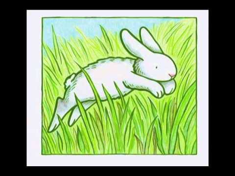{width="5.0in"
height="3.75in"}

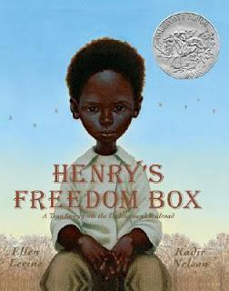{width="2.625in"
height="3.3333333333333335in"}

A stirring, dramatic story of a slave who mails himself to freedom by a
Jane Addams Peace Award-winning author and a Coretta Scott King
Award-winning artist.

Henry Brown doesn\'t know how old he is. Nobody keeps records of
slaves\' birthdays. All the time he dreams about freedom, but that dream
seems farther away than ever when he is torn from his family and put to
work in a warehouse. Henry grows up and marries, but he is again
devastated when his family is sold at the slave market. Then one day, as
he lifts a crate at the warehouse, he knows exactly what he must do: He
will mail himself to the North. After an arduous journey in the crate,
Henry finally has a birthday \-- his first day of freedom.

Big Question: Critical Thinking

Ask students to think about this question as they read and be ready to
answer it when they have finished the book. Write the question on chart
paper or have students write it in their reading journals. Why does
Henry decide to risk his life for freedom?

Questions to Share

Encourage students to share their responses with a partner or small
group.

1\. Text-to-Self

Would you be able to stay quiet in a small crate for 27 hours like Henry
did? (Answers will vary.)

2\. Text-to-World

Do you know of places in today's world where people are enslaved or
treated unequally? (Answers will vary.)

3\. Text-to-Text

What is another book that you have read about the Underground Railroad?
Compare how slaves escaped in that book with how Henry escaped. (Answers
will vary.)

About the Author

Ellen Levine was the author of fiction and nonfiction for children,
young readers, and adults that focused on important social issues and
historical periods. Her rigorous research and devotion to accuracy made
her stories compelling. Henry's Freedom Box (a Caldecott Honor) is the
true story of a slave who mailed himself to freedom; Darkness Over
Denmark details the rescue of Jews by the Danes in World War II; A Fence
Away from Freedom details the internment of Japanese Americans in the
1940s.

"I first read about Henry 'Box' Brown in William Still's 1872 book, The
Underground Railroad. An 800-page volume, it contained the stories of
all the runaway slaves who came through Still's Anti-Slavery Society
office in Philadelphia," says Ellen. "I was awed by Henry's ingenious
plan and his courage in undertaking it. That he built a box not even
three feet square and mailed himself to freedom, seemed to me a
remarkable idea; that he traveled in that box for some 27 hours with
only a little water and a few biscuits, equally astonishing; that he
survived to tell the tale, our great fortune."

Ellen Levine died on May 26, 2012.

**Narrative Writing**

After reading about Henry's journey to freedom (in Henry's Freedom Box),
introduce this narrative prompt: "Write a story as if you are in the box
headed for freedom. Begin your story as you get into the box and end the
story as the box is opened at your destination. Be sure to describe the
action in the story, your thoughts, and feelings. Use words to show time
order and end with a strong wrap-up."

**Henry's Freedom Box Ellen Levine**

Henry brown wasn't sure how old he was. Henry was a slave. And slaves
weren't allowed to know their birthdays.

Henry and his brothers and sisters worked in a big house where the
master lived. Henry's master had been good to Henry and his family.

But Henry's mother knew things could change. "Do you see those leaves
blowing in the wind? They are torn from the trees like slave children
are torn from their families."

One morning the master called for Henry and his mother. They climbed the
wide staircase. The master lay in bed with only his head above the
quilt. He was very ill. He beckoned them to come closer.

Some slaves were freed by their owners. Henry's heart beat fast. Maybe
the master would set him free.

But the master said, "You are a good worker, Henry. I am giving you to
my son. You must obey him and never tell a lie."

Henry nodded, but he didn't say thank you. That would have been a lie.

Later that day Henry watched a bird soar high above the trees. *Free
bird! Free bird!* Henry thought.

Henry said good-bye to his family. He looked across the field. The
leaves swirled in the wind.

Henry worked in his new master's factory. He was good at his job.

"Do not tear that tobacco leaf!" the boss yelled at the new boy. He
poked the boy with a stick.

If you made a mistake, the boss would beat you.

Henry was lonely. One day he met Nancy, who was shopping for her
mistress.

They walked and talked and agreed to meet again. Henry felt like
singing. But slaves didn't dare sing in the streets. Instead, he hummed
all the way home.

Months later, Henry asked Nancy to be his wife. When both their masters
agreed, Henry and Nancy were married.

Soon there was a little baby. Then another. And another.

Henry knew they were very lucky. They lived together even though they
had different masters.

But Nancy was worried. her master had lost a great deal of money. "I'm
afraid he will sell our children," she said.

Henry sat very still.

Henry worked hard all morning. He tried to forget what Nancy had said.

His friend James came into the factory. He whispered to Henry, "Your
wife and children were just sold at the slave market."

"No!" cried Henry.

Henry couldn't move.

He couldn't think.

He couldn't work.

"Twist that tobacco!" The boss poked Hnery.

Henry twisted tobacco leaves. His heart twisted in his chest.

At lunchtime, Henry rushed to the centre of town. A large group of
slaves was tied together. The owner shouted at them.

Henry looked for his family.

"Father! Father!"

Henry watched his children disappear down the road. Where was Nancy? He
saw her the same moment she saw him. When he wiped away his tears,
nancy, too, was gone.

Henry no longer sang. He couldn't hum.

He went to work, and at night he ate supper and went to bed.

Henry tried to think of happy times. But all he could see were the carts
carrying away everyone he loved.

Henry knew he would never see his family again.

Many weeks passed. One morning, Henry heard singing. A little bird flew
out of a tree into the open sky. And Henry thought about being free.

But how? As he lifted a crate, he knew the answer.

He asked James and Dr Smith to help him. Dr Smith was a white man who
thought slavery was wrong.

They met early the next day at an empty warehouse. Henry arrived with a
box.

"I will mail myself to a place where there are no slaves!" he said.

James stared at the box, then at Henry. "What if you cough and someone
hears you?"

"I will cover my mouth and hope," Henry said.

Dr Smith wrote on the box:

To: William H. Johnson

Arch Street

Philadelphia, Pennsylvania

Henry would be delivered to friends in Philadelphia. Then he printed on
the crate in big letters:

THIS SIDE UP WITH CARE

Henry needed an excuse to stay home, or the work boss would think he
hads run off.

James pointed to Henry's sore finger. But Henry knew it wasn't bad
enough. He opened a bottle of oil of vitriol.

"No!" cried James.

Henry poured it on his hand. It burnt his skin to the bone. Now the boss
would have to let him stay home!

Dr Smith bandaged Henry's hand. They arranged to meet the next morning
at four o'clock.

The sun was not yet up when Henry climbed into the box.

"Ready!" he said.

James nailed down the lid. Dr Smith and James drove to the station. The
railway clerk tipped the box over and nailed a paper to the bottom.

Dr Smith begged the clerks to be careful. But they didn't listen. They
threw the box into the baggage car.

Hours passed. Henry was lifted up and thrown again. Upside down! He
heard waves splashing. This must be the steamboat headed for Washington,
D.C. The ship rode smoothly, but Henry was still upside down. Blood
rushed to his head. His face got hot. His eyes ached. He thought his
head would burst. but he was agraid to move. Someone might hear him.

"I'm tired of standing," someone said.

"Why don't we move that box and sit on it?" said another.

Henry held his breath. Could they be talking about *his* box?

Henry was pushed. The box scarped the deck. Now he was on his right
side! Now on his left! And suddenly, right side up!

"What do you think is in here?" said the first man.

"Mail, I guess," said the other.

*I am mail,* thought Henry. *But not the kind they imagine!*

Henry was carried off the steamboat and placed in a railroad car, this
time head up. He fell asleep to the rattling song of the train wheels.

He awoke to loud knocking.

"Henry, are you all right in there?"

"All right!" he answered.

The cover was pried open. Henry stretched and stood up. Four men smiled
at him.

"Welcome to Philadelphia!"

At last Henry had a birthday -- March 30, 1849, his first day of
freedom! And from that day on, he also had a middle name. Everyone
called him Henry "BOX" Brown.

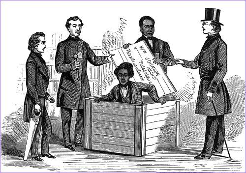{width="5.208333333333333in"
height="3.6666666666666665in"}

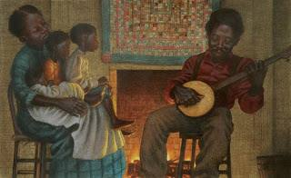{width="3.3333333333333335in"
height="2.0416666666666665in"}

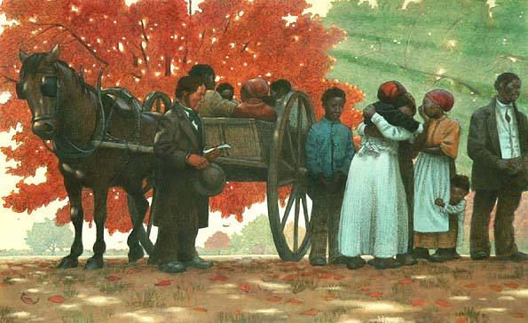{width="6.197916666666667in"
height="3.7916666666666665in"}

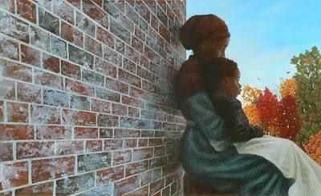{width="4.166666666666667in"
height="2.5520833333333335in"}

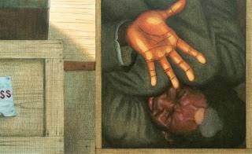{width="3.3333333333333335in"
height="2.0416666666666665in"}

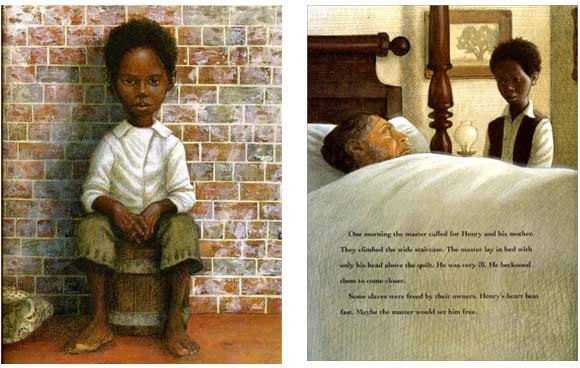{width="6.041666666666667in"
height="3.8333333333333335in"}

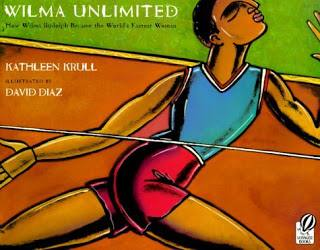{width="3.3333333333333335in"
height="2.6041666666666665in"}

**Wilma Unlimited Kathleen Krull**

Introduction, explaining that the book is about Wilma Rudolph, an
African-American woman who became a champion athlete.

Although discrimination and segregation are not the major themes of the
book, background knowledge might help. In the 1940's, 1950's, when Wilma
was growing up:

6.  Blacks in Tennessee and other states did not have the same rights as
    whites.

7.  Laws in many states made it illegal for blacks to attend the same
    schools as whites, or use the same drinking fountains.

8.  Blacks were required to sit in the back of buses

9.  Some hospitals and doctors would not treat blacks.

Read Aloud -- stop throughout book, using Partner Talk and building up a
Double Entry Journal as the story progresses

What We Learnt What We Wonder

E.g. *"The news spread around Clarksville. Wilma, that lively girl,
would never walk again."*

*"At times her leg really did seem to be getting stronger. Other times
it just hurt."*

*"Finally, Wilma reached a seat in the front and began singing too, her
smile triumphant."*

Decide whether you are going to read this book straight through, or in
segments. If over several days, review day one and continue.

*"She was the first member of her family to go to college."*

*"And as the fourth and final runner on her team, it was Wilma who had
to cross the finish line."*

*"Wilma Rudolph, once known as the sickliest child in Clarksville, had
become the fastest woman in the world."*

Discussing the book using Questioning. E.g.

Q: What lessons can we learn from Wilma Rudolph's life that can help us
in our own lives? Explain your thinking.

Q: What are some things you wondered in the first part of the book that
are talked about in the second part?

Q: What more do you wonder about Wilma Rudolph?

On another day you could read the Author's Note which may answer some of
the questions raised about Wilma Rudolph.

Q: Are there still questions not answered? How could we find the
answers? (Note work we have done on Other Sources)

**Wilma Unlimited Kathleen Krull**

No one expected such a tiny girl to have a first birthday. In
Clarksville, Tennessee, in 1940, life for a baby who weighed just over
four pounds at birth was sure to be limited.

But most babies didn't have nineteen older brothers and sisters to watch
over them. Most babies didn't have a mother who knew home remedies and a
father who worked several jobs.

Most babies weren't Wilma Rudolph.

Wilma did celebrate her first birthday, and everyone noticed that as
soon as this girl could walk, she ran or jumped instead.

She worried people, though- she was always so small and sickly. If a
brother or sister had a cold, she got double pneumonia. If one of them
had measles, Wilma got measles, too, plus mumps and chicken pox.

Her mother always nursed her at home. Doctors were a luxury for the
Rudolph family, and anyway, only one doctor in Clarksville would treat
black people.

Just before Wilma turned five, she got sicker than ever. Her sisters and
brothers heaped all the family's blankets on her, trying to keep her
warm.

During that sickness, Wilma's left leg twisted inward, and she couldn't
move it back. Not even Wilma's mother knew what was wrong.

The doctor came to see her then. Besides scarlet fever, he said, Wilma
had also been stricken with polio. In those days, most children who got
polio either died or were permanently crippled. There was no cure.

The news spread around Clarksville. Wilma, that lively girl, would never
walk again.

But Wilma kept moving any way she could. By hopping on one foot, she
could get herself around the house, to the outhouse in the backyard, and
even, on Sundays, to church.

Wilma's mother urged her on. Mrs Rudolph had plenty to do -- cooking,
cleaning, sewing patterned flour sacks into clothes for her children,
now twenty-two in all. Yet twice every week, she and Wilma took the bus
to the nearest hospital that would treat black patients, some fifty
miles away in Nashville. They rode together in the back, the only place
blacks were allowed to sit.

Doctors and nurses at the hospital helped Wilma do exercises to make her
paralysed leg stronger. Wilma practised them constantly, even when it
hurt.

To Wilma, what hurt most was that the local school wouldn't let her
attend because she couldn't walk. Tearful and lonely, she watched her
brothers and sisters run off to school each day, leaving her behind.

Finally, tired of crying all the time, she decided she had to fight back
-- somehow.

Wilma worked so hard at her exercises that the doctors decided she was
ready for a heavy steel brace. With the brace supporting her leg, she
didn't have to hop anymore. School was possible at last.

But it wasn't the happy place she had imagined. Her classmates made fun
of her brace. During playground games she could only sit on the
sidelines, twitchy with impatience. She studied the other kids for hours
-- memorising moves, watching the ball zoom through the rim of the
bushel basket they used as a hoop.

Wilma fought the sadness by doing more leg exercises. Her family always
cheered her on, and Wilma did everything she could to keep them from
worrying about her. At times her leg really did seem to be getting
stronger. Other times it just hurt.

One Sunday, on her way to church, Wilma felt especially good. She and
her family had always found strength in their faith, and church was
Wilma's favorite place in the world. Everyone she knew would be there --
talking and laughing, praying and singing. It would be just the place to
try the bravest thing she had ever done.

She hung back while people filled the old building. Standing alone, the
sound of hymns coloring the air, she unbuckled her heavy brace and set
it by the church's front door. Taking a deep breath, she moved one foot
in front of the other, her knees trembling violently. She took her mind
off her knees by concentrating on taking another breath, and then
another.

Whispers rippled through the gathering. Wilma Rudolph was *walking*. Row
by row, heads turned toward her as she walked alone down the aisle. Her
large family, all her family's friends, everyone from school -- each
person stared wide-eyed. The singing never stopped, it seemed to burst
right through the walls and into the trees. Finally, Wilma reached a
seat in the front and began singing too, her smile triumphant.

Wilma practised walking as often as she could after that, and when she
was twelve years old, she was able to take off the brace for good. She
and her mother realised she could get along without it, so one memorable
day, they wrapped the hated brace in a box and mailed it back to the
hospital.

As soon as Wilma sent that box away, she knew her life was beginning all
over again.

After years of sitting on the sidelines, Wilma couldn't wait to throw
herself into basketball, the game she had most liked to watch. She was
skinny but no longer tiny. Her long, long legs would propel her across
the court and through the air, and she knew all the rules and all the
moves.

In high school, she led her basketball team to one victory after
another. Eventually, she took the team all the way to the Tennessee
state championships. There, to everyone's astonishment, her team lost.

Wilma had become accustomed to winning. Now she slumped on the bench,
all the liveliness knocked out of her.

But at the game that day was a college coach. He admired Wilma's
basketball playing but was especially impressed by the way she ran. He
wanted her for his track-and-field team.

With his help, Wilma won a full athletic scholarship to Tennessee State
University. She was the first member of her family to go to college.

Eight years after she mailed her brace away, Wilma's long legs and years
of hard work carried her thousands of miles from Clarksville, Tennessee.
The summer of 1960 she arrived in Rome, Italy, to represent the United
States at the Olympic Games -- as a runner.

Just participating in the Olympics was a deeply personal victory for
Wilma, but her chances of winning a race were limited. Simply walking in
Rome's shimmering heat was a chore, and athletes from other countries
had run faster races than Wilma ever had. Women weren't thought to run
very well, anyway; track-and-field was considered a sport for men. And
the pressure from the public was intense -- for the first time ever, the
Olympics would be shown on television, and all the athletes knew that
more than one hundred million people would be watching. Worst of all,
Wilma had twisted jer ankle just after she arrived in Rome. It was still
swollen and painful on the day of her first race.

Yet once it was her turn to compete, Wilma forgot her ankle and
everything else. She lunged forward, not thinking about her fear, her
pain, or the sweat flying off her face. She ran better than she ever had
before. And she ran better than anyone else.

Grabbing the attention of the whole world, Wilma Rudolph of the United
States won the 100-metre dash. No one alse even came close. An Olympic
gold medal was hers to take home.

So when it was time for the 200-metre dash, Wilma's graceful long legs
were already famous. Her ears buzzed with the sound of the crowd
chanting her name. Such support helped her ignore the rain was beginning
to fall. At the crack of the starting gun, she surged into the humid air
like a tornado. When she crossed the finish line, she had done it again.
She finished far ahead of anyone else. She had earned her second gold
medal. Wet and breathless, Wilma was exhilarated by the double triumph.
The crowd went wild.

The 400-metre relay race was yet to come. Wilma's team faced the
toughest competition of all. And as the fourth and final runner on her
team, it was Wilma who had to cross the finish line.

Wilma's teammates ran well, passed the baton smoothly, and kept the team
in first place. Wilma readied herself for the dash to the finish line as
her third teammate ran toward her. She reached back for the baton -- and
nearly dropped it. As she tried to recover from the fumble, two other
runners sped past her. Wilma and her team were suddenly in third place.

Ever since the day she had walked down the aisle at church, Wilma had
known the power of concentration. Now, legs pumping, she put her mind to
work. In a final, electrifying burst of speed, she pulled ahead. By a
fraction of a second, she was the first to blast across the finish line.
The thundering cheers matched the thundering of her own heart. She had
made history. She had won for an astonishing third time.

At her third ceremony that week, as the band played "The Star-Spangled
Banner," Wilma stood tall and still, like a queen, the last of her three
Olympic gold medals hanging around her neck.

Wilma Rudolph, once known as the sickliest child in Clarksville, had
become the fastest woman in the world.

Author's Note.

Wilma Rudolph became, at age twenty, the first American woman to win
three gold medals at a single Olympics. When she returned home from
Rome, her family was waiting for her, and so was all of Clarksville,
Tennessee. The huge parade and banquet held in her honor were the first
events in the town's history to include both blacks and whites.

During the time of Wilma's childhood in the 1940's, polio, also known as
infantile paralysis, was the world's most dreaded disease. A cure for it
was not found until 1955. by then it had killed or crippled 357,000
Americans, mostly children -- only 50,000 fewer than the number of
Americans who had died in World War 11.

After she retired from her career as a runner in 1962, Wilma became a
second-grade teacher and a high school coach. She remained a much
admired celebrity, but to prove that there was more to her than just
running, she started a company called Wilma Unlimited that gave her
opportunities to travel, lecture, and support causes she believed in.
Later she founded the nonprofit Wilma Rudolph Foundation to nurture
young athletes and to teach them that they, too, cam succeed despite all
odds against them. The story of all she overcame in order to win at the
Olympics has inspired thousands of young athletes, especially women.

Wilma Rudolph died in 1994.

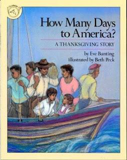{width="2.6458333333333335in"
height="3.3333333333333335in"}

**How Many Days to America? Eve Bunting**

Whether students\' families came to Australia ten days ago, ten months
ago, ten years ago, or much longer than that, they, like most
Australians, are either immigrants or descendants of immigrants.

Students do an oral-history project that explores each one\'s immigrant
background. Develop questions such as:

• Who in your family immigrated to Australia?

• What countries were the original homelands?

• When did they come to Australia?

• Why did they come?

• How did they get here? Was the journey anything like the one in How
Many Days to America?

• What language did they originally speak? Is that language still spoken
in the home?

• What songs, customs, or traditional clothing can they tell about?

Students can interview and tape-record, if possible, their parents and
grandparents, as well as write and talk about their own personal
experiences. Keep a world map in the room, and as the reports come, flag
countries of origin.

.

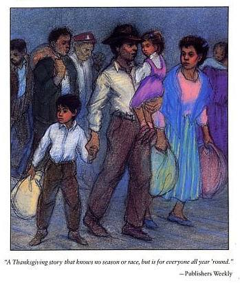{width="3.6354166666666665in"
height="4.28125in"}

**How Many Days to America? Eve Bunting**

It was nice in our village. Till the night in October when the soldiers
came.

My mother hid my little sister and me under the bed. When I peered out I
could see my mother's feet in their black slippers and the great, muddy
boots of the soldiers.

When they were gone my father said, " We must leave right now."

"Why?" I asked.

"Because we do not think the way they think, my son. Hurry!"

He would not let us take anything but a change of clothes.

My mother cried. "Leave all my things? My chair, where I sat to nurse
our children? The bedcover that my mother made, every stitch by hand?"

"Nothing," my father said. "Just money to buy our way to America."

The word "America" was not new to me. I'd heard it whispered between my
parents in the restless hours of the night. America. We were going
there?

Others, too, moved silently along the secret streets.

Boats bobbed in the dark water off the quay and men talked behind their
hands while gold passed from one pocket to another.

"I must have your wedding ring," my father told my mother. "And your
garnets."

My mother took the ring from her finger and the garnet necklace from its
little bag, buried deep in her bundle. She did not speak.

MY father said we would leave while it was still dark.

"How many days to America?" my little sister asked.

"Not many," my father said. "Don't be afraid.

The fishing boat was small and there were many people. More kept coming,
and more. We chugged heavily from harbor to open ocean.

"Can we see America yet, Papa? All the time my little sister asks
questions.

"Not yet," my father said.

We were an hour from shore when the motors stopped.

The men crowded the engines.

"A part is broken that cannot be fixed," my father told my mother, and
her face twisted the way it did when she closed the door of our home for
the last time.

The women made a sail by knotting clothes together and when they pulled
it high I saw my father's Sunday shirt blowing in the wind. But the sail
carried us back towards our own shore and men shot at us from the
cliffs.

At last we got the boat turned in the right direction.

"How many days to America now?" my little sister asked.

"More, my small one," my father said and he held us close. I saw him
look at my mother across our heads.

Day followed night and night, day. our food and water ran out and many
people were sick.

At sunset, my father and mother and sister and I huddled in the bow.
Then my father sang as he sang at home.

"Sleep and dream, tomorrow comes

And we shall all be free."

That was the only time I was not afraid.

By day we fished and shared the catch. When it rained we caught the
water in our buckets. I slept and dreamt. Of home. Of food. Of my
favourite uncle who worked with my father in his shop and who had stayed
behind. Sometimes I cried and then my mother would rock me against her.

Once we saw a whale, grey as an elephant and covered with barnacles.

"Come push us, whale," my mother called. "Push us to America."

But the whale did not hear.

Once a boat came, roaring close on wings of foam, and we were filled
with joy. But not for long.

"Thieves!" Fear moved like a bad wind between us.

Men scrambled from the other boat to ours, waving their guns, shouting
for money and jewels. There was little to take. But what we had went
with them.

Once there was a shout of "Land!" and we crowded the railing. But though
we pulled on the sail our boat would go no closer.

"We will swim for help," my father said and he and two others jumped
into the water.

"No!" my mother cried.

But they were gone already.

When at last we saw them rise on the green roll of the surf, saw them
carried to shore, we danced and cheered.

But there were soldiers on the rocks.

Everyone was quiet and my mother gripped my hand.

"They are bringing them back," she whispered.

Three soldiers with rifles came too, in the small boat. they brought us
water and fruit, but they did not speak or smile as they tossed it up to
our waiting hands.

"Was it not the right land, Papa?" I asked as the soldiers pulled away.
"Will it not do?"

"It would do. But they will not take us," my father said.

My sister tugged at his arm. "They don't like us?"

"It is not that." He did not explain what it was.

Our family got two papayas and three lemons and a coconut with milk that
tasted like flowers.

The sea was rough that night and my father's song lost itself in the
wind. I said the words as the stars dipped and turned above our heads.

"Tomorrow comes, tomorrow comes,

And we shall all be free."

It was the next day, the tomorrow, that we sighted land again. I was
afraid to hope.

A boat came. My mother clasped her hands and bent her head. Was she
afraid to hope too?

The boat circled us twice and then a line was thrown and we were pulled
towards shore.

There was such a silence among us then, such an anxious, watchful
silence.

People waited on the dock.

"Welcome," they called. "Welcome to America."

That was when our silence turned to cheers.

"But how did they know we would come today?" my father asked.

"Perhaps people come every day," my mother said. "Perhaps they
understand how it is for us."

There was a shed, warm from the sun on its tin roof. There were tables
covered with food. Though the benches were crowded there was room for
all of us.

"Do you know what day this is?" a woman asked me. She passed me a dinner
plate.

"It is the coming-to-America day," I said.

She smiled. "Yes. And it is special for another reason, too. Today is
Thanksgiving."

"What is that?" My little sister was shy, but not too shy to ask her
questions.

"Long ago, unhappy people came here to start new lives," the woman said.
"They celebrated by giving thanks."

My father nodded. "That is the only true way to celebrate."

We joined hands and closed our eyes while my gather gave thanks that we
were free, and safe and here.

"Can we stay, Papa?" my little sister asked.

"Yes, small one," my father said. "We can stay."

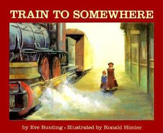{width="3.3333333333333335in"
height="2.71875in"}

Eve Bunting has always been an author who sheds light on emotional
issues. Recently she has turned her writing talents to historical
subjects. Train to Somewhere illuminates the times of the Orphan Trains,
which ran from the mid-1850\'s to 1920, bringing an estimated 100,000
homeless children by train from New York City to small towns and farms
in the Midwest. Eve\'s tale tells the story of Marianne, a young female
orphan, travelling with thirteen others on an orphan train. Bunting\'s
genius shows when she takes the general subject into the specific by
showing us Marianne\'s hopes, dreams, and disappointment. Marianne\'s
mother, leaving her at the orphanage, has promised she\'d make a new
life for them in the West, and return before Christmas, but Marianna has
\"waited through so many Christmases.\" Still she hopes to be greeted by
her mother at every stop the train makes. Her journey, marred by rude
comments and rejection, turns Marianne\'s dreams to disappointment. She
is, finally, the last orphan, headed to the last stop, the town of
Somewhere. The train is greeted by an elderly couple who\'d hoped for a
boy, but welcome her lovingly. The woman speaks of her happy
late-in-life marriage, saying \"sometimes what you get turns out to be
better than what you wanted in the first place.\" Marianne\'s dreams of
finding her mother begin to fade in her new hopes for a secure home with
people who care about her.

In the introduction to Train to Somewhere, Eve Bunting tells the reader
that while the names of the towns and the route the train takes are
fictional, the Orphan Train was indeed real. From the 1850s to the
1920s, thousands of homeless children were sent from New York City by
train to families in the Midwest in the hope they would be adopted. Many
of the

experiences and recollections of these children have been documented and
can be found on the Internet.

**Genre: Historical Fiction**

See Historical Fiction course.

Historical fiction is realistic fiction that takes place in the past.

The author makes up the characters and events, but they seem real.

The setting is important and the problems and events are based on things
that really did or could have happened during the time period.

**Reading Strategies:**

**Sequencing:**

Sequence is the order of the events that occur in a story.

You can determine the order of events by clue words such as first and
next, in the beginning, then, following, after, and finally.

Some story events may occur at the same time.

Other story events, such as *flashbacks*, are told out of order.

**Cause and effect:**

An effect is something that happens**.**

A cause explains why it happens**.**

Writing may include clue words such as because, in order to, so, and as
a result to link causes and effects.

If these words are missing, readers need to think about cause-and-effect
relationships on their own.

**Cause Effect**

- Marianne's mother could not care for her.

- People in the Midwest wanted children to adopt.

**Questioning and Inferring**

Before Reading:

Title: Where is Somewhere?

Picture: When did this take place?

Who are the children?

During Reading: E.g.

p\. 7 How is Nora feeling?

Will the girls be able to stay together?

What is the importance of the feather?

Who is 'she'?

p\. 8 Why are the orphans changing their clothes?

Read p. 10-15 Students record questions.

Read p. 15 +

Developing in-depth questions beyond 'right there'. E.g.

I wonder how the girl is feeling and if those feelings might change 

throughout the story? 
This question requires further reading and maybe some discussion about 

whether her feelings really will change. It gets the students

 thinking about the character and her internal traits.

**Questions:**

• What are the names of real Orphan Train children?

• Why were children placed on Orphan Trains?

• When did they ride the train?

• What were the real routes Orphan Trains took?

• What cities did they pass through?

• Did children get adopted by loving families, or were they just a
source of cheap labour?

• Were they happy with their new families? Why or why not?

• Are there any Orphan Train children still alive today?

• How have foster child programs changed?

**Research and Writing**

Connections can be made to the orphan program in Australia. Using
material from Australia or America, students can write traditional
reports or create a newspaper of the times featuring human-interest
stories about the individual children and the families who adopted them.

**Train to Somewhere Eve Bunting**

***Introduction***

*From the mid 1850s till the late 1920s, an estimated 100,000 homeless
children were sent by train from New York City to small towns and farms
in the Midwest. Charles Loring Brace of the Children's Aid Society hoped
to place them with caring families.*

*Some of the children did well. Some did not. Some exchanged one kind of
misery for another. Some found security and even love.*

*This is the story of fourteen orphan children, going west, dreaming of
a better life. the Orphan Train itself is real; the route it takes and
the place names are fictional. The town of Somewhere exists only on the
map of the author's imagination.*

"This is our train, Marianne," Miss Randolph says, and Nora clutches at
my hand.

A conductor comes along the platform. "Are these the orphans, ma'am?" he
asks.

Miss Randolph stands very straight. "Fourteen of them."

"We put on a special coach for you at the back," the conductor says.

The big boys carry the trunks and we take the rest of the bundles. Miss
Randolph brings the emergency bag. This past week I watched her pack it
with washcloths, medicine, and larkspur in case there are some stowaway
fleas. None of us from St Christopher's has any, of course. But those
from the other homes and from the streets might.

"Going for a placing-out, are you?" the conductor asks Nora. "My, you
look nice!"

"Thank you," Nora says. She's only five, but at St Christopher's they
teach us manner early.

"Good luck!" he says to me. "I hear there are still a lot of people in
the New West wanting children to adopt."

"Yes, indeed," Miss Randolph says.

"We're not seeing as many going this year, though," the conductor adds.
"1877 was a peak year for orphans."

We go aboard.

The train seats are hard. I let Nora sit by the window. We can see
ourselves reflected in its dirty glass. She's wearing her new blue coat
with the shiny buttons. Her hair twirls in bright ringlets under her
bonnet. I can see my own long, thin face. I'm not pretty. I know Nora
will be one of the first ones taken.

"Marianne?" She's got my hand again. "Will they believe we're sisters?
We don't look a bit alike. I couldn't bear it if they split us up. Let's
not go if ..."

"Shh!" I whisper.

But Miss Randolph has heard. "What's this?" she asks. "It won't work
pretending to be sisters." Her voice softens. "Girls, listen. Most of
the people will only want one child. Don't spoil it for each other."

*It's all right,* I tell myself. I slide my fingers into my pocket and
touch the softness of the feather. *She'll be there. She'll want me.*

The train's moving. We're gliding fast and smooth past freight yards,
past tenements with washing strung on lines, past warehouses. Then we're
in the country and there are trees, trees with apples hanging on them. I
knew this was the way apples grew but I'd never seen such a thing
before.

Miss Randolph has me and another big girl, Jean, hold up a blanket to
separate the boys from the girls. She opens one of the trunks and gives
us our old clothes. We're to change.

"We don't want you looking messy at the first stop," she says.

She holds the blanket for Jean and me. We fold our new clothes and put
them back into the trunks.

After a while we make sandwiches from the loaves and fillings Miss
Randolph has brought and we have thick milk out of a can. When it gets
dark we sleep, sitting up, leaning against one another.

The wheels mumble all night long.

*Clickety-clack, clickety-clee,*

*I'm coming, Mama. Wait for me.*

At Chicago we carry everything out and change trains. Then we're on our
way again.

Days and nights have passed since we left New York. Now there's nothing
to see outside but grass everywhere, rolling into the distance.

"The Great Plains," Miss Randolph tells us. she shows us in the atlas
she's brought. Miss Randolph has made this trip with other orphans,
other times. She says that now we should change back into our new
clothes.

Not long after we hear the call: "Porterville, Illinois!" This is our
first stop. The town of Somewhere, Iowa, will be our last.

A crowd is waiting on the little platform.

"Cor blimey!" Zachary Cummings breathes when he sees so many people.
Zachary came to New York on a boat from Liverpool, England, with his
father, and then his father left him. Zachary has a funny way of saying
things.

He's the first one out behind Miss Randolph.

There's a gentleman with a big box camera on legs. There are horses and
wagons and dogs barking. I can see right away that my mother isn't here.
She probably went farther west, farther than this.

A man leads us to the city hall with everyone following like a parade.

"Smile and look pleasant," Miss Randolph whispers.

We sit on chairs and the people from the town look us over. They feel
the boys' muscles through their coats. They say things like: "This
here's a good one." And, "He'll be useful come harvest."

Zachary is taken right away along with two other big boys.

"Cheerio, mates," he calls to us.

Mavis Perkins is chosen by a little, scrawny woman. Mavis is tall and a
bit heavy. She has a round face and the sweetest dimples.

"Dorothea!" the little woman calls out to another woman, just as
scrawny. "Look at the one I got. She'll be a big help to me in the
house. You should get one for your place."

"Mavis is a dear girl," Miss Randolph says as she signs the agreement
papers. "Be good to her." She has her lips pressed tightly together.
"There'll be an agent coming round to make sure the children are all
right."

"So you think I won't treat her well, Missus? Is that what you're
saying?" The woman glares at Miss Randolph. "Do you want me to give her
back?"

Miss Randolph doesn't say anything. She hands over the papers, and the
scrawny woman leads Mavis away.

A man and a woman stop in front of us.

My knees start trembling.

The woman has a soft fur muff. The man's carrying a cane with a gold
head.

"Oh, Herbert. How sweet that little girl is!" The woman smiles at Nora.
"Can we take her, Herbert? Can we?"

"This is my sister," Nora whispers, tugging at my hand. "Please, please,
if you take me can you take her, too?"

"Oh, dear!" The woman looks at Miss Randolph. 'We couldn't possibly. We
only want one little girl."

"Of course. And they're not sisters, just friends," Miss Randolph says
quickly. "Now, stand up, Nora. You help her, Marianne."

I have to pry Nora's fingers from mine.

The woman bends down. "Do you know what's waiting for you in our
carriage? A puppy, just for you."

"I don't want a puppy. I want Marianne," Nora cries.

Miss Randolph and the couple sign the agreement papers, and then they
take her.

Nora's still crying and looking back.

I'm sniffling, too.

But it's better if I'm not taken. I have to stay free for my mother. She
told me she'd come for me. She knelt in front of me on the steps of St
Christopher's the day she left me there. She was working in Gerrison's
chicken factory at the time, and there was a white feather caught in her
hair.

I lifted it off and held it against my cheek.

"I'm going West to make a new life for us," she said. "Then I'll come
for you."

"When, Mama? When?" The feather stuck against the tears that ran down my
face.

"Before Christmas," she said.

I've waited through so many Christmases.

But now I'm going west, too.

Nine of us are left to get back on the train. Miss Randolph says we're
to keep on our good clothes. We'll be getting off again soon.

At Kilburn we are walked to a hardware store to stand in line.

"I expect they took all the biggest boys in Porterville," one man says.
"But still ..."

Eddie Hartz, who is only seven, is taken. There's a boy who can stand on
his hands and pretend to pull buttons out of people's ears. He makes the
crowd laugh and he gets taken, too.

As soon as the train has loaded on wood and fresh water, the rest of us
get back aboard.

Miss Randolph wipes her eyes. "Anything's better than being on the
streets of New York," she says. "A lot of you will do fine."

"We weren't on the streets," Susan Ayers says. Susan's only five, same
as Nora, but she's sassy, and not sweet. She was at St Christopher's,
too.

"We couldn't keep all of you forever." Miss Randolph blows her nose on
her white handkerchief. "We have to make room. There are other orphans
in need."

Susan makes a face.

The next station is Glover. The crowd is smaller. My mother isn't here,
either. Where is she? She must know I might be on this train. the story
was in all the newspapers, Miss Randolph said. "Orphans from St
Christopher's among those riding the rails." "Children in need of
homes," The papers listed every stop. I was sure my mother would be at
one of them.

*Wait, Mama, wait! I'm coming!* Night after night at St Christopher's
I'd send my thoughts to her across the darkness and the distance. *You
don't even have to come get me, Mama. I'm coming to you.* But where is
she?

At Glover they line us up along the railway track.

Susan's pouting and whining. She says her new boots hurt her feet.

There's a nice-looking man and woman at the front of the crowd.

Susan stops pouting. She smiles and holds up her arms.

"Mama! Papa!" she begs.

The woman clutches at her heart. "James! She's calling out to us."

The man scoops Susan into his arms. "We'll take her," he says.

"Can I have a puppy?" Susan asks.

The man smiles. "I'll just bet you can, honey."

A boy who has his eyeglasses tied on with string is taken, too, and two
other boys.

"There's not much left to pick from," a woman says in a bad-tempered
way. "Next time we'll have to ride in as far as Porterville."

I have a terrible hurt inside of me. my mother didn't want me. It looks
like nobody wants me. It's not that I'm hoping to be placed, because my
mother could be at the very next stop. But what if she isn't?

The three of us who are left get back on the train with Miss Randolph.
She gives us gingersnaps and milk from the can she got in Glover. The
milk is sweet.

"We can't be down in the dumps, children," she says. "Let's sing." She
begins, "Jesus loves me," but nobody joins in. She sings alone through
three verses.

We're such a long way from Nora. I wonder if her puppy has a name. if
somebody takes me, I'll ask if we can go visit her. "She's like my
sister," I'll say.

"Memorial," the conductor calls. There are four people waiting at the
station. None of them is my mother. I stumble out with the girl named
Amy and the one named Dorothy. We sneak glances at one another. We're
wondering which one of us looks best. They're not pretty, either. The
taste of the sweet milk is still in my throat and it's making me sick.

One couple take both Amy and Dorothy. "Two for the price of one," the
man jokes, though of course there is no price.

"Marianne is very good with children," Miss Randolph tells the other
couple. There's a sort of begging in her voice as she clutches the last
agreement form, the one for me.

"My missus looks after our little ones," the man grumps.

"We just came to look," the woman says. "But ..." She takes an apple
from her bag and gives it to me. "Have this, child."

"Thank you." I bend my head over the apple. It is blurry through my
tears.

The train whistle's blowing.

Miss Randolph and I get on. There's only one stop left, I know. One.

Miss Randolph says I should eat my apple. She says she has a washcloth
in case my hands get sticky. I say I don't want to eat anything just
yet.

We look out the window, not talking, not singing. Miss Randolph has me
take off my hat and she brushes my hair.

"There's a nice hotel farther down the line," she says. "If there's
nobody at this next stop, why, we'll just go on. I'll be glad of the
company. And on the journey back."

"Somewhere," the conductor calls. It's such a strange name. as if it
thinks itself important. As if it's a place surrounded by nowhere.

I put my hat back on. My hands are shaking.

Outside there's a couple waiting by a wagon. The woman is small and
round as a dumpling. She's wearing a heavy black dress and a man's
droopy black hat. She is not my mother.

"Are you ready, Marianne?" Miss Randolph asks softly.

I pull myself back into the corner of the seat. "No," I whisper. "No."

Miss Randolph holds my hand as we get down from the train.

The man is tall and stooped. He takes off his hat.

The woman doesn't take hers off.

I think they're both pretty old. The woman's holding a wooden toy
locomotive.

"Are you ... ?" the man asks Miss Randolph.

"Yes." Miss Randolph nudges me forward. "This is Marianne."

"Is she all ... ?" The woman stops. I know she was going to say: "Is she
all that's left?" But she doesn't. She looks at me closely and I see a
change in her face. A softness. I'd thought my mother would look at me
like that.

Somehow this woman understands about me, how it felt that nobody wanted
me, even though I was waiting inside myself for my mother to come.
Somehow she understands the hurt.

"I'm Tillie Book," she tells Miss Randolph. "This here's my husband,
Roscoe." She holds the toy locomotive out to me. "We brought you this."

"I'm not what you wanted, am I?" I say. "You wanted a boy." The
locomotive has red painted wheels and a blue smokestack.

"I won't lie to you. We did want a boy," Mrs Book says.

"But we like girls fine," Mr Book adds.

Mrs Book squints at me. "I expect we're not what you wanted, either.
Roscoe and I, we found each other late in life. I always thought I'd
catch myself somebody a mite more handsome." She pats Mr Book's hand and
they smile at each other, and I can tell they like each other a lot.
"Sometimes what you get turns out to be better than what you wanted in
the first place," Mrs Book says.

"Yes." There's a sort of crumbling inside of me. my mother's not in
Somewhere. She's not waiting here or anywhere. "I ... " I reach in my
pocket and bring out the feather. It was white when I took it from my
mother's hair; now it's yellow. I smooth it with my fingers. "I brought
you this."

"Why, thank you." Mrs Book sticks the feather in the band of her droopy
hat. It's funny the way it nestles there, as if it belongs, as if it has
found its place at last.

Mr Book takes the agreement papers, looks at them, then at me. "Will you
come with us?"

"Yes," I whisper.

Miss Randolph leans forward and kisses my cheek.

"Are you ready now, Marianne?" she asks.

"I'm ready."

**\**
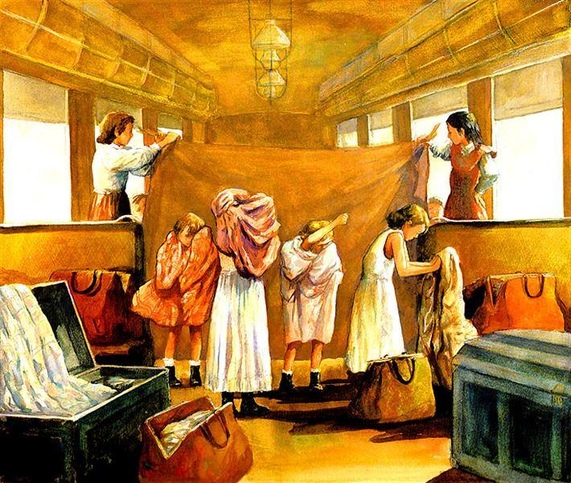{width="5.5625in"
height="4.698325678040245in"}

**Questions:**

Why did people come to the train station?

Why did the children have to change their clothes?

Do you think the children liked standing on the stage being looked at by
the adults? Explain your answer.

Why did Marianne not want to be chosen?

What would it feel like to be the last one chosen?

Explain your answer.

Do you think the couple at the end wanted a boy or a girl? \* Give
examples to support your reasoning\*

What do you think the feather symbolises?

Why did she give it to the lady at the end of the book?

{width="3.4166666666666665in"
height="4.166666666666667in"}

When her mother catches her in a lie, Libby is punished and vowed "From
now on, only the truth." Libby begins to blatantly tell the truth about
everything and everyone, and soon enough, Libby's friends become angry
with her. But since she thinks that she's doing the right thing, Libby
finds it hard to understand why her truth-telling turned out to be a bad
thing. It takes Libby being on the receiving end of truth-telling for
her to understand how the truth can be hurtful, and she proceeds to make
amends with her friends. By the end, Libby learns that while she should
not lie, it is not always necessary to blurt out the whole truth either
and there is a right and wrong way to tell people the truth.

## Questions for Philosophical Discussion

by Ronteau Coppin

**Truth and Punishment/Consequences**

*When Libby is punished for lying to her mother, she vows "From now on,
only the truth."*

1.  Do you think Libby should have vowed always to tell the truth? Why
    or why not?

2.  If she never got caught, do you think Libby would have continued to
    lie?

3.  Is lying only wrong if you get caught?

4.  If there were no consequences, would lying be okay?

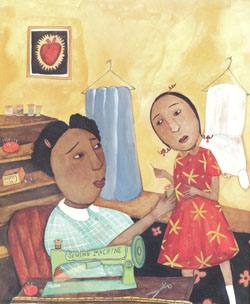{width="2.6041666666666665in"
height="3.1666666666666665in"}

**Truth regarding Someone's Feelings**

*Ruthie Mae tells Libby that what she said was mean and all of Libby's
other friends are upset with her.*

1.  Why were Libby's friends mad at her?

2.  Do you think that Libby began to change her truth-telling only
    because she lost her friends? Should she have known better?

3.  What harm can be caused by being too truthful?

4.  Does it even matter if the truth is mean, or if it hurts?

5.  Should the truth be "watered-down" so as to spare someone's
    feelings?

6.  Does that become a lie?

*Libby tells her teacher that another student didn't do his homework.*

1.  Do you think it was right for Libby to do that?

2.  Is there a difference between telling the truth and tattling on
    someone?

*Libby's mother tells her that "Sometimes the truth is told at the wrong
time or in the wrong way, or for the wrong reasons. And that can be
hurtful. But the honest-to-goodness truth is never wrong."*

1.  What do you think her mother means?

2.  What is the "honest-to-goodness truth?"

3.  Why didn't Libby understand what her mother meant?

4.  Do you think Libby really needed to experience a hurtful truth
    herself to finally understand why her friends were mad at her?

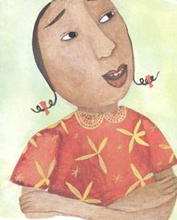{width="2.2916666666666665in"
height="2.8541666666666665in"}

**Choosing between Truth & Fiction (Lie)**

1.  Which is easier: telling a lie or telling the truth?

2.  Is it always necessary to speak the truth?

3.  Can the truth ever be wrong? In what sense?

4.  Is there ever a good reason to lie?

5.  What about lies that are not deceptive, like flattery? Are those
    wrong too? Why or why not?

6.  Why do we tell the truth? What are our reasons for telling the
    truth?

**The Nature of Truth**

1.  Is not telling the truth automatically lying? Is there a middle
    ground?

2.  Is there actually a time or a situation where deceit is not only
    allowed, but necessary?

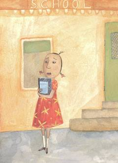{width="2.5in"
height="3.4479166666666665in"}

**Writing**

- Students write a poem about honesty. As a starter, tell students that
  they can include Mama\'s words as lines in their poem.

- Write a story about a time that you told the truth and hurt someone\'s
  feelings, or when someone told *them* the truth and
  hurt *their* feelings.

- Patricia McKissack uses similes and metaphors beautifully. When Libby
  lies, for example, she is \"surprised how easy the lie slid out of her
  mouth, like it was greased with warm butter.\" Have students point out
  other literary devices in the picture book for discussion. Then,
  present students with some \"boring sentences\" in need of \"dressing
  up\" with similes.

> 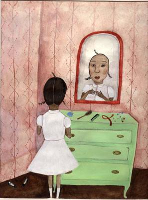{width="3.09375in"
> height="4.166666666666667in"}

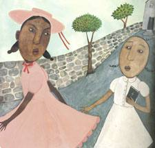{width="2.34375in"
height="2.25in"}

**The Honest-to Goodness Truth**

**Patricia McKissack**

Libby hurried out the door and down the porch steps. "Did you feed and
water Ol' Boss?" Mama called from her sewing room window.

Libby stopped at the gate. "Yes, Mama," she answered. She was surprised
at how easy the lie slid out of her mouth, like it was greased with warm
butter.

Mama stopped sewing Virginia Washington's wedding dress, and came
outside. Libby dropped her head and wouldn't look in her mother's eyes.
"Are you sure?" Mama asked real stern-like. "Speak the truth and shame
the devil."

Libby opened her mouth, but Mama placed a finger in the air as a signal
for her to stop. "Libby Louise Sullivan, I'll ask you once more and
again: Did you feed and water Ol' Boss?"

Libby's stomach felt like she'd swallowed a handful of chicken feathers.
Her eyes commenced to fill with water and her bottom lip quivered. Then,
taking a deep breath and gulping hard, she owned up to her lie. "I was
gon' do it soon as I got back from jumping rope with Ruthie Mae."

Libby felt a lot better, even though Mama punished her double. For not
tending to Ol' Boss, Libby couldn't go play with Ruthie Mae. And for
lying, she had to stay on the porch the rest of the day. It was the
first time Libby had lied to mama, and as far as she was concerned it
was gon' be the last.

"From now on, only the truth," she decided.

Libby started her truth-telling come Sunday morning.

All the children from Briarsville were gathered outside the small
church, waiting on Sunday school to begin. Everybody was admiring Ruthie
Mae's new dress and matching hat when Libby came skipping up.

"Morning, everybody. Morning, Ruthie Mae," she spoke all nice. "I like
your outfit. It's real pretty ... but you've got a hole in your sock."

All eyes went from the hat to the dress to the hole. Meanwhile, Libby
skipped up the steps and inside the church without ever noticing the
hurt on her best friend's face.

Service ended and, same as always, Libby asked Ruthie Mae to walk home.
"No, no, and no again!" Ruthie Mae glared at her.

Libby was purely surprised. "What'd I do?"

"You told the world I had a hole in my sock."

"It was the truth," Libby pronounced, feeling satisfied.

"It was plain mean!" replied Ruthie Mae, and she hurried away.

Libby looked at the idea from outside in, and then from the inside out
as she walked home alone. By the time she trudged up her steps, she was
still confused.

The next morning, Libby joined a group of friends on the way to school.

"Did you do your geography homework?" Willie asked Libby.

"It was easy," she answered.

"Not for me," Willie shook his head. "I didn't understand it, so I
didn't do it."

First thing in class, Libby started waving her hand. "Me, Miz Jackson,
me, me, me, Miz Jackson!" When the teacher called on her, Libby
announced, "Willie don't got his geography homework."

"Doesn't have his homework," corrected Miz Jackson.

"No, ma'am, he don't." Libby was pleased with herself.

Willie gave her an ugly look. "Why'd you tell on me?" he whispered as he
headed to Miz Jackson's desk to explain.

With certainty she whispered back, "All I did was tell it like it is. So
there!" and she folded her hands neatly in her lap.

Before lunchtime, Libby had told a lot of truths. She reminded everybody
how Daisy had forgotten her Christmas speech and cried in front of all
the parents.

She told how Charlesetta had got a spanking for stealing peaches off Miz
Stacey's tree.

And the whole class knew that Thomas didn't have lunch money and had to
borrow some from Miz Jackson.

By the time school was out, hardly anyone would talk to her.

"Why are y'all so mad at me?" Libby asked as her classmates started home
without her.

On Libby's way home, she wondered why her stomach felt as fluttery as it
did when she'd told the lie. "I promised Mama I would tell the truth no
matter how much it hurt," she reassured herself glumly. "And that's all
I done."

Before Libby knew it, she was in front of Miz Tusselbury's vine-covered
cottage. The woman was in her rocking chair, gliding back and forward
and fanning herself with a hand-folded fan. "How-do, Libby Louise," she
called in her sing-song voice. "What's that sad look you wearing on such
a pretty day?"

Libby jumped right in with what was bothering her. "Can the truth be
wrong?"

"Oh, no," Miz Tusselbury said, fanning faster. "The truth is never
wrong. Always, always tell the truth!"

"That's what I thought," Libby said, a smile of relief lighting up her
face.

Miz Tusselbury leant over the railing to pluck a bloom from one of the
vines that grew all over her yard and up her house. "Don't you think my
garden is lovely?"

Libby thought on it. Ordinarily she would have just said yes, for fear
of sounding sassy. But that wasn't the truth. So polite as you please,
she answered, "Miz Tusselbury, truly and honestly, you yard looks like a
... a ... a jungle."

"Well, I declare!" Miz Tusselbury gasped.

"Don't be mad!" Libby pleaded.

But it was too late. Miz Tusselbury rushed inside her house and slammed
the door.

Even though Mama was busy putting the finishing touches on Virginia
Washington's wedding dress, she still took time to listen to Libby's
problem.

"I feel something awful. My friends don't like me no more."

"Any more," repeated her mother.

"No, they don't -- and just 'cause I told the truth." The girl sighed
deeply.

Handing her a needle to thread, Mama asked gently, "Are you sure they're
mad at you for telling the truth?"

"I think so," said Libby. "Willie was mad as a hornet when I told Miz
Jackson he didn't have his homework. And Miz Tusselbury got plenty upset
when I said her garden looked like a jungle."

Mama smiled. "Oh, I see." Then, putting down her work, she took Libby's
hands, saying, "Sometimes the truth is told at the wrong time or in the
wrong way, or for the wrong reasons. And that can be hurtful. But the
honest-to-goodness truth is never wrong." Then Mama went back to
stitching and pulling, stitching and pulling.

Libby walked to the barn to feed and water Ol' Boss, all the time trying
to get an understanding of her mother's words. Just then Virginia
Washington sashayed out of the fields and past the barn -- come for the
final fitting of her wedding dress.

As she watched Libby brush Ol' Boss, Virginia burst into laughter. "That
horse is older than black pepper," she said, shaking her head. "I doubt
you could get a dollar for that old flea-ridden swayback." And she
flounced off towards the house.

"Don't say those things about Ol' Boss," Libby called after her,
throwing her arms around the horse's neck. She knew he wasn't the fine
carriage horse he had once been, but why did Virginia have to rub it in?

Now Libby thought back on her own truth-telling, and Mama's words
suddenly became crystal clear.

The next day, Libby caught up with her friends on the way to school. She
told Ruthie Mae, "You did have a hole in your sock, but I could have
whispered it to you instead of hollering it out for everybody to hear.
I'm sorry."

Ruthie Mae smiled. "You finally got it," she said.

Libby apologised to Willie, too. "I should have let you tell Miz Jackson
'bout your own homework. It was unfair. Besides, nobody asked me in the
first place."

"That's all right. But, hey," he added, "do you think you could help me
with my geography homework?"

"No problem," said Libby.

Later, Libby talked to all the other victims of her truth-telling.

But there was one more person she had to see. On the way home, she
headed straight for Miz Tusselbury's house.

Libby found her neighbour out front, down on all fours, pulling up
flowers and snatching up vines by the roots. When Miz Tusselbury saw
her, she wiped her brow with the back of her hand and flashed a full
smile.

"I'm sorry if I hurt your feeling yesterday," Libby said.

"Libby Louise, you were right," Miz Tusselbury replied. "This place had
gone completely and uncontrollably wild!"

"But you were so mad at me."

Miz Tusselbury waved a dismissing hand. "The truth is often hard to
chew. But if it is sweetened with love, then it is a little easier to
swallow."

Libby really did understand. She picked up a hoe and began helping.

"Things are really looking pretty good around here," she said. And that
was the honest-to-goodness truth.

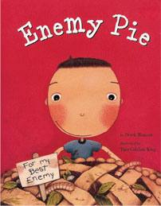{width="2.1041666666666665in"
height="2.6979166666666665in"}

**Summary**\
\
One boy\'s perfect summer seems to be ruined when his worst enemy,
Jeremy Ross, moves in down the block. Fortunately, though, Dad has a
recipe for enemy pie. But it seems that the pie will only be effective
if the recipient is treated kindly before eating it. Reluctantly, the
boy agrees to spend time with Jeremy.\
\
As the boys spend the day shooting hoops, jumping on the trampoline, and
throwing water balloons at the girls, our protagonist begins to realise
that Jeremy isn\'t a bad kid at all; in fact, he and Jeremy share many
traits and interests. So imagine his confusion and consternation when
the pie is finally served. He desperately wants to tell Jeremy, \"Don\'t
eat it! It\'s poison!\" But then he realises that Dad, wise old Dad, is
eating the pie as well, and enjoying himself immensely. The lesson here
is pretty clear, and well delivered.

**Before Reading Questions**

- *Who here has a best friend? What special qualities make this person a
  friend?*

- What is the opposite of a friend? Is it a stranger, is it an enemy, or
  is it something else?

- Today\'s book is Enemy Pie. Before I show you the front cover, I\'ll
  tell you what appears there: a large pie with a note that reads, \"For
  My Best Enemy.\" We talked about a best friend; is there such a thing
  as a \"best enemy?\" And why would you want to give something as
  delicious as a pie to your enemy?

- Let\'s look at the front cover. Do you think you\'d enjoy enemy pie?
  What might be this character\'s intentions with this pie?

**After Reading Questions**

- *Why didn\'t the main character like Jeremy Ross?*

- Why did his father suggest enemy pie?

- So, did the pie work?

- What else might his Dad have suggested? Why was the pie a clever idea?

- At what point did we, the readers, realise what was happening? (You
  may also wish to tell students that when the reader knows something
  that a character does not, it is called **dramatic irony**. Dramatic
  irony is a terrific way of building suspense in a story.

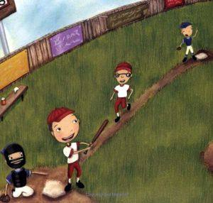{width="3.125in"
height="2.9791666666666665in"}

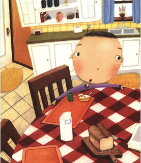{width="2.8854166666666665in"
height="3.3333333333333335in"}

**Enemy Pie**

**Derek Munson**

It should have been a perfect summer. My dad helped me build a tree
house in our backyard. My sister was at camp for three whole weeks. And
I was on the best baseball team in town. It should have been a perfect
summer. But it wasn't.

It was all good until Jeremy Ross moved into the neighbourhood, right
next door to my best friend Stanley. I did not like Jeremy Ross. He
laughed at me when he struck me out in a baseball game. He had a party
on his trampoline, and I wasn't even invited. But my best friend Stanley
was.

Jeremy Ross was the one and only person on my enemy list. I never even
had an enemy list until he moved in to the neighbourhood. But as soon as
he came along, I needed one. I hung it up in my tree house, where Jeremy
Rodd was not allowed to go.

Dad understood stuff like enemies. He told me that when he was my age,
he had enemies. But he knew of a way to get rid of them. I asked him to
tell me how.

"Tell you how? I'll show you how!" he said. He pulled a really old
recipe book off the kitchen shelf. Inside, there was a worn-out scrap of
paper with faded writing. Dad held it up and squinted at it.

"Enemy Pie," he said, satisfied.

You may be wondering what exactly is in Enemy Pie. I was wondering, too.
But Dad said the recipe was so secret, he couldn't even tell me. I
decided it must be magic. I begged him to tell me something -- anything.

"I will tell you this," he said. "Enemy Pie is the fastest known way to
get rid of enemies."

Now, of course, this got my mind working. What kind of things --
disgusting things -- would I put into a pie for an enemy? I brought Dad
some weeds from the garden, but he just shook his head. I brought him
earthworms and rocks, but he didn't think he'd need those. I gave him
the gum I'd been chewing on all morning. He gave it right back to me.

I went out to play, alone. I shot baskets until the ball got stuck on
the roof. I threw a boomerang that never came back to me. And all the
while, I listened to the sounds of my dad chopping and stirring and
blending the ingredients of Enemy Pie. This could be a great summer
after all.

Enemy Pie was going to be awful. I tried to imagine how horrible it must
smell, or worst yet, what it would look like. But when I was in the
backyard, looking for ladybugs, I smelled something really, really,
really good. And as far as I could tell, it was coming from our kitchen.
I was a bit confused. I went in to ask Dad what was wrong. Enemy Pie
shouldn't smell this good. But Dad was smart. "If Enemy Pie smelled bad,
your enemy would never eat it," he said. I could tell he'd made Enemy
Pie before.

The buzzer rang, and dad put on his oven mitts and pulled the pie out of
the oven. It looked like plain, old pie. It looked good enough to eat! I
was catching on.

But still, I wasn't really sure how this Enemy Pie worked. What exactly
did it do to enemies? Maybe it made their hair fall out, or their breath
stinky. Maybe it made bullies cry. I asked Dad, but he was no help. He
wouldn't tell me a thing.

But while the pie cooled, he filled me in on my job. He talked quietly.
"There is one part of Enemy Pie that I can't do. In order for it to
work, you need to spend a day with your enemy. Even worse, you have to
be nice to him. It's not easy. But it's the only way that Enemy Pie can
work. Are you sure you want to go through with this?"

Of course I was.

It sounded horrible. It was scary. But it was worth a try. All I had to
do was spend one day with Jeremy Ross, then he'd be out of my hair for
the rest of my life. I rode my bike to his house and knocked on the
door. When Jeremy opened the door, he seemed surprised. He stood on the
other side of the screen door and looked at me, waiting for me to say
something. I was nervous.

"Can you play?" I asked.

He looked confused. "I'll go ask my mum," he said. He came back with his
shoes in his hand. His mum walked around the corner to say hello.

"You boys stay out of trouble," she said, smiling.

We rode bikes for a while and played on the trampoline. Then we made
some water balloons and threw them at the neighbour girls, but we
missed. Jeremy's mum made us lunch. After lunch we went over to my
house. it was strange, but I was kind of having fun with my enemy. He
almost seemed nice. But of course I couldn't tell Dad that, since he had
worked so hard to make Enemy Pie.

Jeremy Ross liked my basketball hoop. He said he wished he had a
basketball hoop, but they didn't have room for one. I let him win a
game, just to be nice. Jeremy Ross knew how to throw a boomerang. He
threw it and it came right back to him. I threw it and it went over my
house and into the backyard. When we climbed over the fence to find it,
the first thing Jeremy noticed was my tree house. My tree house was *my*
tree house. I was the boss. If my sister wanted in, I didn't have to let
her. If my dad wanted in, I didn't have to let him. And if Jeremy wanted
in...

"Can we go in?" he asked.

I knew he was going to ask me that! But he was the top person, the ONLY
person, on my enemy list. And enemies aren't allowed in my tree house.

But he did teach me to throw a boomerang. And he did have me over for
lunch. And he did let me play on his trampoline. He wasn't being a very
good enemy.

"Okay," I said, "but hold on." I climbed up ahead of him and tore the
enemy list off the wall.

I had a checkerboard and some cards in the tree house, and we played
games until my dad called us down for dinner. We pretended we didn't
hear him, and when he came out to get us, we tried to hide from him. But
somehow he found us. Dad made us macaroni and cheese for dinner -- my
favourite. It was Jeremy's favourite, too! Maybe Jeremy Ross wasn't so
bad after all. I was beginning to think that maybe we should just forget
about Enemy Pie.

But sure enough, after dinner, Dad brought out the pie. I watched as he
cut the pie into eight thick slices.

"Dad," I said, "it sure is nice having a new friend in the
neighbourhood." I was trying to get his attention and trying to tell him
that Jeremy Ross was no longer my enemy. But Dad only smiled and nodded.
I think he thought I was just pretending. Dad dished up three plates,
side by side, with big pieces of pie and giant scoops of ice cream. He
passed one to me and one to Jeremy.

"Wow!" Jeremy said, looking at the pie, "my dad never makes pies like
this."

It was at this point that I panicked. I didn't want Jeremy to eat Enemy
Pie! He was my friend! I couldn't let him eat it!

"Jeremy, don't eat it! It's bad pie! I think it's poisonous or
something!"

Jeremy's fork stopped before reaching his mouth. He crumpled his
eyebrows and looked at me funny. I felt relieved. I had saved his life.
I was a hero.

"If it's so bad," Jeremy asked, "then why has your dad already eaten
half of it?" I turned to look at my dad. Sure enough, he was eating
Enemy Pie!

"Good stuff," he mumbled through a mouthful. And that was all he said. I
sat there watching them eat Enemy Pie for a few seconds. Dad was
laughing. Jeremy was happily eating. And neither of them was losing any
hair! It seemed safe enough, so I took a tiny taste. Enemy Pie was
delicious!

After dessert, Jeremy rode his bike home but not before inviting me over
to play on his trampoline in the morning. He said he'd teach me how to
flip.

As for Enemy Pie, I still don't know how to make it. I still wonder if
enemies really do hate it or if their hair falls out or their breath
turns bad. But I don't know if I'll ever get an answer, because I just
lost my best enemy.
