> **Voice**
>
> **(9)**
>
> 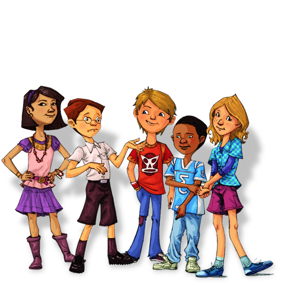{width="5.114583333333333in"
> height="5.0in"}

**Narrative Voice**

**Novels\**

{width="2.2604166666666665in"
height="2.209775809273841in"}

**Voice 9**

**Narrative Voice -- Novels**

The One and Only Ivan Katherine Applegate

Ivan the remarkable True Story of the Shopping Mall Gorilla

Katherine Applegate

Moominland Midwinter Tove Jansson

Because of Winn-Dixie Kate DiCamillo

Charlotte's Web E.B.White

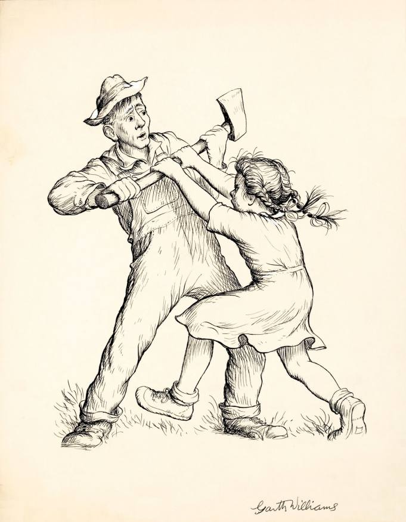{width="3.09375in"
height="3.979099956255468in"}

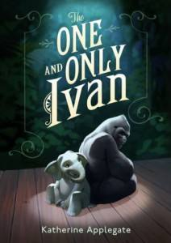{width="2.2083333333333335in"
height="3.125in"}

**The One and Only Ivan Katherine Applegate**

In 1962, a silverback gorilla was born in the African nation now known
as the Democratic Republic of Congo. While still a toddler, he was
captured, named Ivan, and caged in the U.S. and there he remained for
three decades. That true story is the inspiration for "The One and Only
Ivan" by Katherine Applegate.

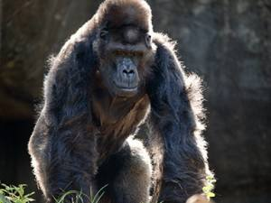{width="3.125in"
height="2.34375in"}

In Applegate's story, Ivan lives at the tacky Big Top Mall and Video
Arcade, along with Stella the elephant, parrots, monkeys and other
animals that belong in a jungle, as well as a scrappy stray dog named
Bob. They comprise a circus that is meant to draw customers to the mall.

Ivan, with wry humour which befits his resignation to caged life tells
us: "Mack works here at the mall. He is the boss. I work here too. I am
the gorilla."

The animals live in filth, are not terribly happy, but they appreciate
each other's company. Each animal has his own wisdom. Bob the dog, in
talking about humans who capture animals, says with disgust, "Humans.
Rats have bigger hearts. Roaches have kinder souls. Flies have..."
before falling asleep atop Ivan's belly.

Mack buys a baby elephant to try to boost faltering business. Stella is
delighted to have elephant company. She asks Ivan to promise to help the
new elephant. Due to Mack's neglect, the circus befalls a terrible
tragedy.

Ivan has always drawn pictures, which Mack sells in the circus store.
But when Ivan observes Julia, the daughter of the caretaker, using
paints, he's intrigued. Julia had given him his first crayon ages ago,
and whereas they can't talk to each other, she's an intuitive girl.
Julia brings Ivan paints, brushes and paper and he musters a plan. Ivan
paints to express his feelings. He has the same frustrations as any
artist. There are good days and bad.

Could his painting draw the attention of enough people who would
understand the plight of caged animals? That's what he hopes. And that's
what the reader hopes.

This is a gentle look at animal abuse, a topic which hits the hearts of
many children and adults alike. The story is life-affirming---both
animal and human. Charming illustrations are by Patricia Castelao.

Pages 1-20 can be found in the Choral Reading course. (Repeated here)

**The One and Only Ivan Katherine Applegate**

(extract)

*hello*

I am Ivan. I am a gorilla.

It's not as easy as it looks.

*how I look*

I used to be a wild gorilla, and I still look the part.

I have a gorilla's shy gaze, a gorilla's sly smile. I wear a snowy
saddle of fur, the uniform of a silverback. When the sun warms my back,
I cast a gorilla's majestic shadow.

In my size humans see attest of themselves. They hear fighting words on
the wind, when all I'm thinking is how the late-day sun reminds me of a
ripe nectarine.

I'm mightier than any human, four hundred pounds of pure power. My body
looks made for battle. My arms outstretched, span taller than the
tallest human.

My family tree spreads wide as well. I am a great ape, and you are a
great ape, and so are chimpanzees and orang-utans and bonobos, all of us
distant and distrustful cousins.

I know this is troubling.

I too find it hard to believe there is a connection across time and
space, linking me to a race of ill-mannered clowns.

Chimps. There's no excuse for them.

*the exit 8 big top mall and video arcade*

I live ina human habitat called the Exit 8 Big Top Mall and Video
Arcade. We are conveniently located off 1-95, with shows at two, four,
and seven, 365 days a year.

Mack says that when he answers the trilling telephone.

Mack works here at the mall. He is the boss.

I work here too. I am the gorilla.

At the Big Top Mall, a creaky-music carousel spins all day, and monkeys
and parrots live amid the merchants. In the middle of the mall is a ring
with benches where humans can sit on their rumps while they eat soft
pretzels. The floor is covered with sawdust made of dead trees.

My domain is at one end of the ring. I live here because I am too much
gorilla and not enough human.

Stella's domain is next to mine. Stella is an elephant. She and Bob, who
is a dog, are my dearest friends.

At present, I do not have any gorilla friends.

My domain is made of thick glass and rusty metal and rough cement.
Stella's domain is made of metal bars. The sun bears' domain is wood;
the parrots' is wire mesh.

Three of my walls are glass. One of them is cracked, and a small piece,
about the size of my hand, is missing from its bottom corner. I made the
hole with a baseball bat Mack gave me for my sixth birthday. After that
he took the bat away, but he let me keep the baseball that came with it.

A jungle scene is painted on one of my domain walls. It has a waterfall
without water and flowers without scent and trees without roots. I
didn't paint it, but I enjoy the way the shapes flow across my wall,
even if it isn't much of a jungle.

I am lucky my domain has three windowed walls. I can see the whole mall
and a bit of the world beyond; the frantic pinball machines, the pink
bellows of cotton candy, the vast and treeless parking lot.

Beyond the lot is a freeway where cars stampede without end. A giant
sign at its edge beckons them to stop and rest like gazelles at a
watering hole.

The sign is faded, the colours bleeding, but I know what it says. Mack
read its words aloud one day: COME TO THE EXIT 8 BIG TOP MALL AND VIDEO
ARCADE, HOME OF THE ONE AND ONLY IVAN, MIGHTY SILVERBACK!"

Sadly, I cannot read, although I wish I could. reading stories would
make a fine way to fill my empty hours.

Once, however, I was able to enjoy a book left in my domain by one of my
keepers.

It tasted like termite.

The freeway billboard has a drawing of Mack in his clown clothes and
Stella on her hind legs and an angry animal with fierce eyes and unkempt
hair.

That animal is supposed to be me, but the artist made a mistake. I am
never angry.

Anger is precious. A silverback uses anger to maintain order and warn
his troop of danger. When my father beat his chest, it was to say,
*Beware, listen, I am in charge. I am angry to protect you, because that
is what I was born to do.*

Here in my domain there is no one to protect.

*the littlest big top on earth*

My neighbours here at the Big Top Mall know many tricks. They are an
educated lot, more accomplished than I am.

One of my neighbours plays baseball, although she is a chicken. Another
drives a fire truck, although he is a rabbit.

I used to have a neighbour, a sleek and thoughtful seal, who could
balance a ball on her nose from dawn till dusk. Her voice was like the
throaty bark of a dog chained outside on a cold night.

Children wished on pennies and tossed them into her plastic pool. They
glowed on the bottom like flat copper atones.

The seal was hungry one day, or bored, perhaps, so she ate one hundred
pennies.

Mack said she'd be fine.

He was mistaken.

Mack calls our show "The Littlest Big Top on Earth." Every day at two,
four, and seven, humans fan themselves, drink sodas, applaud. babies
wail. Mack, dressed like a clown, pedals a tiny bike. A dog named
Snickers rides on Stella's back. Stella sits on a stool.

It is a very sturdy stool.

I don't do any tricks. Mack says it's enough for me to be me.

Stella told me that some circuses move from town to town. They have
humans who dangle on ropes twining from the tops of tents. They have
grumbling lions with gleaming teeth and a snaking line of elephants,
each clutching the limp tail in front of her. The elephants look far off
into the distance so they won't see the humans who want to see them.

Our circus doesn't migrate. We sit where we are, like an old beast too
tired to push on.

After our show, humans forage through the stores. A store is where
humans buy things they need to survive. At the Big Top Mall, some stores
sell new things, thinhs like balloons and T-shirts and caps to cover the
gleaming heads of humans. Some stores sell old things, things that smell
dusty and damp and long forgotten.

All day, I watch humans scurry from store to store. They pass their
green paper, dry as old leaves and smelling of a thousand hands, back
and forth and back again.

They hunt frantically, stalking, pushing, grumbling. Then they leave,
clutching bags filled with things -- bright things, soft things -- but
no matter how full the bags, they always come back for more.

Humans are clever indeed. They spin pink clouds you can eat. They build
domains with flat waterfalls.

But they are lousy hunters.

*gone*

Some animals live privately, unwatched, but that is not my life.

My life is flashing lights and pointing fingers and uninvited visitors.
Inches away, humans flatten their little hands against the wall of glass
that separates us.

The glass says you are this and we are that and that is how it will
always be.

Humans leave their fingerprints behind, sticky with candy, slick with
sweat. Each night a weary man comes to wipe them away.

Sometimes I press my nose against the glass. My noseprint, like your
fingerprint, is the first and last and only one.

The man wipes the glass and then I am gone.

*artists*

Here in my domain, I do not have much to do. You can only throw so many
me-balls at humans before you get bored.

A me-ball is made by rolling up dung until it's the size of a small
apple, then letting it dry. I always keep a few on hand.

For some reason, my visitors never seem to carry any.

In my domain, I have a tyre swing, a baseball, a tiny plastic pool
filled with dirty water, and even an old TV.

I have a stuffed toy gorilla, too. Julia, the daughter of the weary man
who cleans the mall each night, gave it to me.

The gorilla has empty eyes and floppy limbs, but I sleep with it every
night. I call it Not-Tag.

Tag was my twin sister's name.

Julia is ten years old. She has hair like black glass and a wide,
half-moon smile. She and I have a lot in common. We are both great apes,
and we are both artists.

It was Julia who gave me my first crayon, a stubby blue one, slipped
through the broken spot in my glass along with a folded piece of paper.

I knew what to do with it. I's watched Julia draw. When I dragged the
crayon across the paper, it left a trail in its wake like a slithering
blue snake.

Julia's drawings are wild with colour and movement. She draws things
that aren't real: clouds that smile and cars that swim. She draws until
her crayons break and her paper rips. Her pictures are like pieces of a
dream.

I can't draw dreamy pictures. I never remember my dreams, although I
sometimes awaken with my fists clenched and my heart hammering.

My drawings seem pale and timid next to Julia's. She draws the ideas in
her head. I draw the things in my cage, simple items that fill my days:
an apple core, a banana peel, a candy wrapper. (I often eat my subjects
before I draw them.)

But even though i draw the same things over and over again, I never get
bored with my art. When I'm drawing, that's all I think about. I don't
think about where I am, about yesterday or tomorrow. I just move my
crayons across the paper.

Humans don't always seem to recognise what I've drawn. They squint, cock
their heads, murmur. I'll draw a banana, a perfectly lovely banana, and
they'll say, "It's a yellow aeroplane!" or "It's a duck without wings!"

That's all right. I'm not drawing for them. I'm drawing for me.

mack soon realised that people will pay for a picture made by a gorilla,
even if they don't know what it is. Now I draw every day. My works sell
for twenty dollars apiece (twenty-five with frame) at the gift shop near
my domain.

If I get tired and need a break, I eat my crayons.

*shapes in clouds*

I think I've always been an artist.

Even as a baby, still clinging to my mother, I had an artist's eye. I
saw shapes in the clouds, and sculptures in the tumbled stones at the
bottom of a stream. I grabbed at colours -- the crimson flower just out
of reach, the ebony bird streaking past.

I don't remember much about my early life, but I do remember this:
Whenever I got the chance, I would dip my fingers into cool mud and use
my mother;s back for a canvas.

She was a patient soul, my mother.

*imagination*

Someday, I hope I can draw the way Julia draws, imagining worlds that
don't yet exist.

I know what most humans think. They think gorillas don't have
imaginations. they think we don't remember our past or ponder our
futures.

Come to think of it, I suppose they have a point. Mostly I think about
what is, not what could be.

I've learnt not to get my hopes up.

the loneliest gorilla in the world

When the Big Top Mall was first built, it smelt of new paint and fresh
hay, and humans came to visit from morning till night. They drifted past
my domain like logs on a lazy river.

Lately, a day might go by without a single visitor. Mack says he's
worried. He says I'm not cute anymore. He says, "Ivan, you've lost your
magic, old guy. You used to be a hit."

It's true that some of my visitors don't linger the way they used to.
They stare though the glass, they cluck their tongues, they frown while
I watch my TV.

"He looks lonely," they say.

Not long ago, a little boy stood before my glass, tears streaming down
his smooth red cheeks. "He must be the loneliest gorilla in the world,"
he said, clutching his mother's hand.

At times like that, I wish humans could understand me the way i can
understand them.

It's not so bad, I wanted to tell the little boy. With enough time, you
can get used to almost anything.

{width="4.166666666666667in"
height="3.4583333333333335in"}

**Katherine Applegate**

On writing a story about animals in captivity

\"Ivan\'s story was so compelling and so bizarre. The fact that he had
been captured as an infant from the Democratic Republic of the Congo and
brought to Tacoma, Wash., to live in a mall? \... It was beyond
comprehension when I first came across this story in The New York Times.
The headline read, \'Gorilla Sulks in \[a\] Mall as His Future Is
Debated.\' This was about 20 years ago. They were trying to figure out
what to do with this guy, and I thought, \'There\'s a story there, I
just have to figure out how to tell it.\' \"

On trying to meet Ivan

\"I tried to meet Ivan. I went to the zoo. I took my 13-year-old
daughter --- she was about 10 at the time --- and it was a very wet day.
Ivan hated wet weather, and he never came out, and I sat there for hours
in the rain, and my daughter was looking at me, going, \'Are you crazy,
Mum?\' \... I\'d flown all the way to Atlanta! I was determined to see
him! But at the end of the day I realized this guy actually had some
control over his environment. In the old days would he have been able to
go anywhere? To make a choice like that? And it was really validating. I
was okay that he couldn\'t come out. I did go to his memorial service
later, though.\"

On Ivan\'s memorial service

\"His keeper Jodi Carrigan told stories about Ivan. He was quite a
character. He liked to wear a sombrero. He hated wet weather so he would
carry around a burlap coffee bag and stick it under his butt and slide
around on the grass that way. He was, um, not shy about making his needs
known.\"

On becoming a writer

\"I think all writers write from the time they\'re really young, and you
just start asking the question, \'What if?\' What if you were sitting
here next to me and you turned into a cat? I have a story. So I was
writing at a really young age, but it took me a long time to be brave
enough to become a published writer, or to try to become a published
writer. It\'s a very public way to fail. And I was kind of scared, so I
started out as a ghost writer, and I wrote for other series, like Disney
Aladdin and Sweet Valley and books like that. And my husband, Michael
Grant, and I started a series called Animorphs, about kids who can turn
into animals, and that was our big first success.\"

On what she\'d like young readers to take away from the book

\"I think we have a real obligation when we do have animals in captivity
to understand their needs and to care for them as well as we can. Stella
the elephant in Ivan says, \'You know humans surprise you sometimes,\'
and I hope that the next generation can surprise us all.\"

{width="2.15625in"
height="3.4479166666666665in"}**\**

A Gorilla Sulks in a Mall as His Future Is Debated

Published: October 17, 1993

**TACOMA, Wash., Oct. 16--- **Staring at shoppers from the concrete cell
at the B & I Shopping Mall that has been his home for 26 years, Ivan, a
500-pound gorilla, scratched his matted hair and ambled over to a dim
corner.

\"We used to bang on the window and he\'d bang back,\" said Donna
Wetmore, a Tacoma resident. \"But now he just sits there and looks sad.
He should be in a zoo with a girlfriend.\"

Nearly everyone has an opinion about what is best for Ivan, who has long
been the focus of contention between his owner who has kept him in the
mall and animal rights advocates, who want the gorilla moved to a zoo
where he can smell grass for the first time in nearly three decades and
meet other gorillas.

Ivan\'s fate was left in the hands of a bankruptcy judge in November
when the shopping centre filed for reorganization. The judge, Phillip
Brandt of Federal Bankruptcy Court in Tacoma, will choose one of two
plans for the 200,000-square-foot mall on Oct 26. But neither of the
plans makes a provision for Ivan.

Since 1975 the owner of the mall and of Ivan, Ron Irwin, has resisted
the pressure by animal rights advocates to turn the gorilla over to a
zoo, saying that the stress of moving could kill him.

\"He\'s probably the healthiest gorilla in America,\" Mr. Irwin said
recently. \"Moving him across the country would kill him. Nobody seems
to care about that.\"

But Mr. Irwin said this week that he thought it might now be in the best
interest of Ivan as well as the mall to let him go to a zoo. \"It\'s
time,\" he said, adding that he would meet with gorilla experts to
discuss Ivan\'s future.

The problem is that the Tacoma zoo and others in the area do not have a
place for him. It has been zoos farther away, including the Bronx Zoo
and zoos in Dallas, Atlanta and Washington, that have expressed interest
in Ivan, who, as a western lowland gorilla, is a member of an endangered
species. Now 29 years old and at gorilla mid-life, Ivan is in good
physical shape, they say, and could breed with female lowland gorillas
in captivity.

\"We will never be able to take another gorilla out of the wild,\" said
David Towne, director of the Woodland Park Zoo in Seattle. \"So his
contribution as a wild gorilla is significant to the gene pool.\"
Captured in 1964

Ivan and six other gorillas were captured in the Congo, now Zaire, in
1964 and sold to American businesses. All but Ivan died in transit. Ivan
spent his first couple of years in this country in the home of a mall
employee, being treated like a member of the family, Mr. Irwin said.
Ivan was transferred to the mall when he became too rambunctious to stay
in the house.

In the late 1980\'s, the Progressive Animal Welfare Society, an animal
rights group based in Lynnwood, Wash., began picketing the mall and
calling for Ivan\'s transfer to a zoo, saying that it would be a humane
act that would benefit science.

The animal society sued Mr. Irwin in March, claiming he was wrongfully
using an endangered species for commercial purposes, said a spokesman
for the group, Mitchell Fox. Mr. Irwin argued that the gorilla was
exempt from the endangered species act because he was captured before
the law was passed in 1973.

If Ivan\'s transfer to a zoo is stalled for any reason, Mr. Fox said his
group would go to Federal District Court and ask that the gorilla be
removed.

Mr. Towne of the Woodland Park Zoo said that Ivan would face a long and
tedious reacclimation to nature and other animals if he was moved to a
zoo. Ivan\'s only contact with tropical vegetation, Mr. Towne said, has
been a mural of a jungle in his cell. While the gorilla appears to be
emotionally stable, moving him to a zoo might be traumatic, Mr. Towne
said.

But Ron Kagan, director of the Detroit Zoo, who has visited Ivan several
times, said the rewards of moving the gorilla outweighed any risks.

\"Gorillas are incredibly sophisticated and complex social mammals,\"
Mr. Kagan said. \"They\'re just like humans. They need companionship.
Leaving him in a concrete cell is like leaving him in prison.\"

Ivan Dies At 50: A Gorilla Life, Remembered

AUGUST 23, 201212:48 PM ET

BArbara king

{width="7.083333333333333in"
height="5.3125in"}

[Ivan chews on his finger at Zoo Atlanta in
1996.](http://www.npr.org/people/336055111/barbara-j-king)

[*John Bazemore/AP*\
](http://www.npr.org/people/336055111/barbara-j-king)

*I\'ve [written
before](http://www.npr.org/blogs/13.7/2012/04/05/149951712/do-pet-obituaries-belong-in-the-newspaper) in
this space about how an animal obituary may help mark a life of
significance. Here is my obituary for Ivan the gorilla.*

On Tuesday, Aug. 21, a 50-year life that began in the freedom of Africa,
included a 27-year period of solitary confinement in a concrete cell in
a U.S. shopping centre, and drew to a close via relaxed naps under Zoo
Atlanta\'s sunny sky, came to an end. One of the oldest gorillas in U.S.
captivity, Ivan [died following surgical
assessment ](http://www.ajc.com/news/atlanta/ivan-the-gorilla-50-1503252.html)meant
to discover why he was losing weight and feeling poorly.

Around 1962, Ivan and his twin sister were born in the African nation
now known as the Democratic Republic of the Congo. When they were about
2, the youngsters were captured and sold by wildlife traders to a
department store owner here in the U.S.

The sister died. Ivan lived as a pet until the inevitable happened, and
he became too large to control. He was moved to the department store
itself, in Tacoma, Wash. For the next 27 years, he lived on display,
behind glass, in a 14-by-14-foot concrete cell. There, he smoked and ate
hamburgers and lived utterly without ape companionship.

But times change, and collective action matters. More and more people
began to grasp that this confinement of a highly social, smart ape
wasn\'t right. Locally and nationally, [people began to fight for
Ivan](http://www.paws.org/ivan-gorilla.html). And finally, in 1995, they
won.

At Zoo Atlanta that year, Ivan walked on grass for the first time in
decades. The zoo hoped he\'d come to enjoy living with other gorillas,
and though they made sure he resided with females for many years, it was
never an easy or completely enjoyable road for him. At worst, the
females picked on him, and at best, Ivan and a female would live
side-by-side but not interact much.

As *The Atlanta
Journal-Constitution* [reported ](http://www.ajc.com/lifestyle/gorillas-cruise-into-golden-1502470.html)before
his death this week, Ivan was suffering from the aches and pains of an
aging primate. He took Centrum vitamins and was given an easier-to-chew
diet. He lived alone, but with visual contact with nearby gorillas.

Animal lovers will wish that Ivan had grown up to become a magnificent
silverback in the DRC, head of his own group. Humans didn\'t allow that
to happen. But after the terrible shopping-centre period, Zoo Atlanta
offered Ivan a life that could fairly be described as content. As [the
zoo\'s Ivan page](http://www.zooatlanta.org/ivan) shows via a timeline,
photographs and a video clip, Ivan enjoyed his favourite routines and
the sun, sky and grass of his enclosure. He had close bonds with people
at the zoo. That he lived alone near the end seems at first a terrible
irony. But it\'s clear that all those years of emotional deprivation
took their toll. He couldn\'t make the adjustment toward enjoying
gorilla-gorilla interaction.

Ivan\'s story has touched thousands of people. He reminded us that even
as we must face the \"big\" conservation and environmental problems with
an ecosystem approach, we can\'t forget the individuals, each of whom
has a story, a personality and a history.

**\**
Ivan the Gorilla

*A story and a life that continues to touch and inspire so many.*

March 16, 1995 marked the date that Ivan, an endangered western lowland
gorilla, first set foot on real grass in almost 30 years.

In 1987, after becoming aware of the plight of this highly social
animal, who had been confined alone to a 14\' x 14\' concrete cell for
more than 27 years, PAWS began a campaign to free Ivan. It took more
than seven years. Ivan, who had been imported to the US from then Zaire
by owner of B&I Shopping Center in Tacoma in 1964, had not seen another
gorilla since the death of his infant sister Burma in that same year.

*A community rallied*

Thousands of members of the Tacoma/Seattle community got involved to
help make the campaign to free Ivan a success---they collected
signatures for petitions calling for his release, donated money to PAWS
for the placement of newspaper ads, and took part in protests and
boycotts. They even helped PAWS to raise a \$30,000 \"offer\" in
exchange for Ivan\'s release to Woodland Park Zoo.

Ivan, PAWS and the citizens of Tacoma/Seattle got a boost to their cause
in 1991, when National Geographic Explorer aired a documentary entitled
\"The Urban Gorilla\" that contrasted shots of a sad, lonely and
listless Ivan with shots of Willie B., another lowland gorilla shown
taking his first tentative steps outdoors in Zoo Atlanta\'s natural
gorilla habitat after 27 years of his own solitary confinement. Ivan\'s
story was covered across the nation, from People Magazine to the New
York Times.

*Victory at last*

In 1995 our efforts finally paid off. Thanks to scientists from Woodland
Park Zoo and the Gorilla Species Survival Plan, Ivan was eventually
gifted to Woodland Park Zoo, who then agreed to permanently loan Ivan to
Zoo Atlanta, the place best fit to care for him. Ivan is an intelligent,
inspirational, and gentle giant who is greatly enjoying his life at Zoo
Atlanta. He has become one of the zoo\'s \"star\" attractions after
successfully overcoming the emotional and physical damage caused by his
years of confinement. Ivan delights guests of Zoo Atlanta with his
paternal antics and tendencies to cover his head with a burlap sack to
express his disapproval of rain.

Ivan\'s case is a shining example of the amazing change a caring
community can inspire. His story now teaches kids in our community that
they truly can make a difference in the lives of others.

{width="3.125in"
height="2.1770833333333335in"}\
*PAWS members at one of many protests to free Ivan.*

{width="2.2395833333333335in"
height="2.90625in"}\
*Poster for Ivan rally.*

{width="2.5208333333333335in"
height="2.0208333333333335in"}\
*Ivan in Atlanta- content, confident and healthy.*

{width="1.3125in"
height="1.0833333333333333in"}

Celebrating Ivan

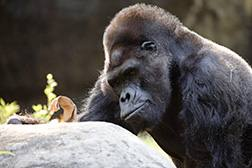{width="2.625in"
height="1.75in"}The Zoo Atlanta family is saddened by the passing of
Ivan the western lowland gorilla, 50 years old and a cherished member of
our collection since 1994.

Every life at the Zoo is a story worth sharing, but his story was once
told so widely and passionately that it ignited a national movement that
touched two coasts. From the jungles of Africa to the shores of the
Pacific Northwest to The Ford African Rain Forest at Zoo Atlanta, his
life has been a symbol of the way animals shape our lives -- and the
power we have to shape theirs.

We'd love him even if he weren't one of our special senior gorillas, a
member of an irreplaceable generation that now represents some of the
world's oldest living members of his species. We'd love him even if he
weren't one of our most famous residents. We'd love him even if he
didn't still attract scores of well wishes, greetings, questions and
Facebook posts from hundreds of friends and fans who have never
forgotten him. We'd love him anyway, because we've had the honour and
the privilege of sharing 17 years of an extraordinary life.

Watch the Altlanta Zoo video of Ivan.

Ivan: An Amazing Journey 

**1960s: Infancy in Africa and a Trans-Atlantic Journey**

- **Circa 1962**: Ivan and a female infant are born in the wild in what
  is now the Democratic Republic of the Congo. In an era in which many
  zoos still acquire baby apes directly from the wild, the infants are
  captured for their market value.

- **1964**: Ivan and his companion are brought to the U.S. and sold by
  wildlife traders to the owners of the B&I department store in Tacoma,
  Wash. The female dies soon after their arrival, and he spends his
  early years as a pet in a human household.

- **1967**: Great apes make poor pets, and Ivan is no exception.
  Although only 5, he is already too large, strong and boisterous for
  life with a human family. As a solution, Ivan is moved to an indoor
  enclosure inside the B&I department store. He will not go outdoors
  again for nearly 30 years.

**1970s-1994: The "Shopping Mall Gorilla"**

- **1970s and 1980s**: Ivan is the star attraction of the B&I store, and
  he becomes Tacoma's most famous non-human resident. Over the next two
  decades, he is visited by thousands of friends and fans, an adoring
  public who may not realize at this time that Ivan's lifestyle is
  utterly at odds with the physical, social and behavioral needs of his
  species. Meanwhile, across the U.S. in Atlanta, Ga., in 1988, another
  solitary gorilla, Zoo Atlanta's Willie B., enters a naturalistic
  habitat for the first time after more than 25 years in a small indoor
  enclosure.

- **1992**: The B&I department store is facing bankruptcy, and finances
  aren't its owners' only woes. Riding on the cresting wave of a global
  push toward naturalistic settings for wild animals in captivity,
  Ivan's friends and fans now recognize that a 30-year-old male gorilla
  has specific social and spatial needs -- needs that aren't being met
  within the confines of a glass-enclosed room.

- **1994**: Ivan's solitary existence has by now provoked national
  outrage within the zoological and animal welfare communities, and in
  1994, his owners donate him to Seattle's Woodland Park Zoo.\
  \
  Back East, Willie B.'s high-profile turn from longtime loner to
  successful silverback has lent national credibility to the gorilla
  program at Zoo Atlanta, which has by now seen a succession of births.
  With the approval of the Gorilla Species Survival Plan (SSP), the
  Woodland Park Zoo sends Ivan to Atlanta on permanent loan in October
  1994.

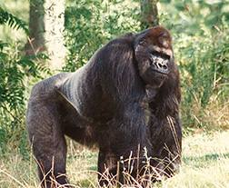{width="2.625in"
height="2.15625in"}**1995-2011: Sun, space and ladies**

- **1995**: Ivan explores The Ford African Rain Forest at Zoo Atlanta in
  spring 1995 -- the first time he has been outdoors in more than 27
  years. Sunlight, trees, grass and fresh air are sensory enrichment he
  has not experienced since 1967.\
  \
  There's another new experience, too -- girls! Ivan makes his debut
  with females Molly and Kuchi, and he later meets Shamba, Kashata and
  Kinyani. While he socializes well with his female companions, and is
  even observed mating with the flirtatious Kinyani, Ivan sires no
  offspring.

<!-- -->

- **2010**: Ivan's 15th anniversary in Atlanta is observed at Zoo
  Atlanta. He is photographed holding a sign reading, "Ivan 'Hearts'
  Atlanta," and it's obvious that Atlanta "hearts" him, too.

- **2011**: Ivan's last "roommate," Kinyani, leaves Zoo Atlanta for the
  Columbus Zoo -- a departure Ivan hardly seems to notice. After more
  than 16 years in Atlanta, it's apparent that while he has never
  overtly rejected the presence of other gorillas, his most lasting
  social relationships have always been with his keepers, with whom he
  has formed close personal bonds.

**Today: "Dear Zoo Atlanta ..."**

- **2012**: Ivan's fans from the Pacific Northwest have never forgotten
  the "Shopping Mall Gorilla." While the Zoo might have expected the
  occasional call or email from a curious old friend with a wonderful
  memory, inquiries about Ivan have been far from occasional. He still
  receives birthday and holiday cards, letters and greetings, and his
  legacy has even continued into the age of social media. Of our more
  than 1,500 residents, Ivan is the most asked-about animal on the Zoo's
  Facebook profile.

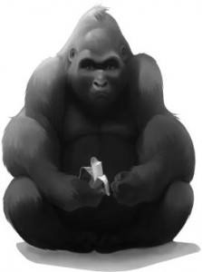{width="2.3229166666666665in"
height="3.125in"}

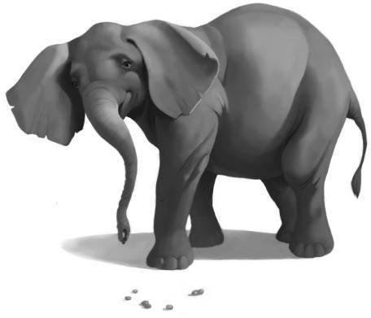{width="4.0625in"
height="3.4791666666666665in"}

**Q & A with Katherine Applegate**

*n her bestselling Animorphs series, Katherine Applegate introduced
teens with the ability to morph into any animal they touch. She offers a
very different take on an animal story in *The One and Only
Ivan* (Harper). The novel is based on a real-life silverback gorilla
born in Africa that lived in a glass box for 27 years as an attraction
in a circus-themed mall in Tacoma, Wash., before being transferred to
Zoo Atlanta, where he still resides. Ivan's story made a splash in the
media and caught the attention of Applegate, who talks about how her
novel came to be.*

**How did you first heard of Ivan's plight?**

Bottom of Form

I read a piece about Ivan in the *New York Times*, I'd say almost 20
years ago---back in the days when newspapers were actually made out of
paper. It was before Ivan was released to Zoo Atlanta, which I believe
was in 1994. So I cut out the article and tossed it in a box with a
million other story ideas.

**What was it about Ivan's story that grabbed you?**

I found his story so heartbreaking, and I followed it in the media over
the next few years, waiting to see what happened. Ivan had been isolated
in the mall for 27 whole years, and people finally began to understand
that animals in captivity require the presence of others of their kind.
But Ivan was not instantly released. There was a long litigious battle
and eventually there was a passionate outcry from people, including many
little kids who wrote impassioned letters. He was eventually acquired by
Zoo Atlanta, which has the largest population of gorillas in this
country.

**At what point did you decide to turn your interest in Ivan into a
novel?**

It was maybe five years ago. I had started writing two middle-grade
novels for Anne Hoppe, my editor at HarperCollins. But I kept getting
distracted by Ivan's story---it continued to haunt me. And Anne, being
wonderfully patient, said, "Why don't you just go ahead and do the Ivan
book first?" So I did.

**Did the book fall into place quickly?**

Well, it took a while for me to figure out how to do it. I had to decide
whether or not to write a journalistic piece, or an animal fantasy,
where I'd have to get more anthropomorphic. In the end, I liked the idea
of giving Ivan himself a story to tell, using his actual story as a
departure point. I thought that was the best approach to take to invent
a story for him.

**Ivan's voice has a poetic, spare quality. Did you find it easy to slip
into his voice?**

Once I knew where I was going with the book, his voice did come quite
easily. Gorillas may seem terrifying because of their bodies, but they
are really magnificent and very gentle. I wanted his voice to convey
that calm dignity that I associate with gorillas. And I tend to write
short, brief snippets---I lean toward the chamber music end as opposed
to the symphony end of things. I realized that Ivan's voice was a good
match for me. He is a gorilla of few words.

**Speaking of words, at one point in the novel, Ivan says that sometimes
he forgets what he is and wonders if he's a human or a gorilla, and
observes that, though humans have more words than they truly need,
"still, they have no word for what I am." Would you say Ivan's struggle
with his identity is a major theme of the novel?**

Absolutely. In fact, I think if you're looking for one sentence that
distills the book, that sentence does it perfectly. I hate to witness
animals in captivity---or see circus elephants paraded down the streets.
When animals are caged, it's a loss of what they are. Of course zoos are
not a perfect solution, but it's what we've come up with. Fortunately,
the zoo where Ivan ended up is a wonderful place---but even that isn't
perfect.

**Did you visit Zoo Atlanta in the process of writing *The One and Only
Ivan***?

I did actually. It was a rainy, cold day, and Ivan is notoriously averse
to cold weather. He was born in Africa, after all. I stood with my
daughter in the rain, hoping against hope that Ivan would come out and
we could catch sight of him. A lot of other gorillas did, but Ivan never
did. But it was somewhat gratifying to think that finally, after all
those years when he couldn't, he can now exercise a bit of control over
his life. That was kind of nice.

**What do you hope kids take away from Ivan's story?**

I hope they realise that it takes a lot of courage to stay true to
yourself in grim, lonely circumstances, and will take heart that Ivan
found a place where he belongs. The attitude toward captive animals has
changed over the years in a gratifying way, but it's been a slow change,
and some animals' situations break my heart. At the end of the day, I'd
love to see children stop begging their parents to go to the circus.
That's what would make me most happy.

**Do you view this novel as a departure for you, in terms of subject and
writing style?**

I'd say it parallels some of the feeling of Animorphs. In those books, I
got to explore what it was like to feel like an animal, so on that level
it's channeling the same kind of thing. Stylistically, this novel is
more similar to *Home of the Brave *\[Feiwel and Friends, 2007\], which
I wrote from the point of view of a refugee of Sudan.

**Are there more animal books in your future?**

Absolutely! I'm now writing a novel from a dog's point of view. It's one
of the novels I was working on when I digressed to Ivan. It's another
middle-grade animal fantasy.

**You seem to be quite at home in that genre.**

Yes, I love those books. I grew up reading and rereading *Charlotte's
Web *and anything by Jean Craighead George. I loved any book that had to
do with animals. As a writer, maybe I've finally found the place I'm
happiest. It only took me 20 years. Maybe I'm a slow learner?

{width="2.0833333333333335in"
height="2.4479166666666665in"}

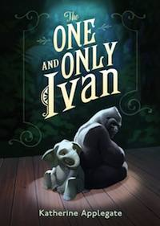{width="2.0833333333333335in"
height="2.9270833333333335in"}

**Teaching Ideas and Invitations**

**\"Good Zoos\"** - Stella tells the other animals that a \"good zoo . .
. is how humans make amends.\"

What constitutes a good zoo?

What would you want in a zoo if you were the animals that lived there?

Visit a variety of zoos, online or if possible in-person - research the
ways they care for animals.

How does the zoo acquire animals?

What do the animals\' domains look like?

What do they eat?

What happens if they get sick?

Do they get to live with other members of their species?

**Character Development** - Ivan undergoes a significant changes in his
character as the novel progresses. Trace that development, using
specific lines from the novel to support characterisations of him at
each stage of his development. Identify plot points that cause changes
in Ivan\'s character to understand how the various events and
experiences impact Ivan and spur those changes.

**The Urban Gorilla** - Watch the 1997 National Geographic video, The
Urban Gorilla, which spotlights Ivan\'s story as one of the amazing
cases of gorillas living in human environments and under human care. How
are they similar to or different from Ivan\'s? As a follow-up research
the other stories showcased in the video to learn what has been
happening in the gorillas\' lives since the filming of the video.

**Author Study** - Katherine Applegate has written dozens of books for
children and young adults. Conduct an author study of her works. There
are several ways to accomplish this. You can have several small groups,
and allow students to select individual titles that they compare and
contrast together. Or, you could conduct an author study in which small
groups become experts on one book and then they come together in a
jigsaw group to start comparing and contrast the author's work. The goal
would be to have the widest range of books represented. Have students
examine the content of Applegate\'s work, and the similarities and
differences within the range. How does this content relate to her
professional and personal background? Have students also explore
Applegate\'s research methods, writing style and the internal
organisation of texts (structure, format) across her body of work.

**Voice in Writing** - Undoubtedly, voice is one of the most difficult
traits of writing for students to grasp and for teachers to teach. Voice
is the trait that allows readers to develop a full sense of who is
speaking the words on the page, whether it is a narrator, fictionalised
character, or the author himself/herself. The One and Only Ivan does a
great job of illustrating exactly what voice is, as we read Ivan\'s
thoughts and descriptions. Study how Katherine Applegate does this. What
words or phrases does she choose to help readers "hear" Ivan\'s distinct
voice as a gorilla? How does he view and describe the same things
differently from how humans or the other animals at the Big Top Mall do?
To further demonstrate the quality of voice, do a reader's theatre
activity with excerpts from the novel so students can really hear what
Applegate is doing in her writing. Then, have students experiment with
voice by perhaps writing about the same topic in different voices,
including different animals\' voices. You might also use Anthony
Browne's picture book Voices in the Park, Paul Fleischman\'s Seedfolks,
or Jacqueline Woodson\'s Behind You as mentor texts.

**Animal Organisations** - Many different organisations exist whose
mission is to ensure the safe and ethical treatment of animals. PAWS is
the organisation that campaigned to free the real Ivan from the mall
where he lived. Research a number of these organisations and find out
what some of their most recent campaigns are. Research those campaigns
further and present findings via PowerPoint, class website, or wiki.

**Stories about Animal Friendships** - Friendships between animals of
different species have always been a point of fascination, and many
children\'s books chronicle the stories of those friendships. Read
several of these stories (e.g. Suryia and Roscoe, Owen & Mzee, Koko\'s
Kitten, and Unlikely Friendships) to determine what is similar and
different across them. Are there certain animal species that tend to
form cross-species friendships than others? What characterises these
friendships? How did those friendships begin garnering attention? What
can those stories teach us about human friendships with each other and
with animals?

Ref: The Classroom Bookshelf

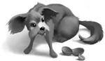{width="1.5625in"
height="0.90625in"}

**Discussion/Persuasive Writing**

"Animals should not be kept in cages."

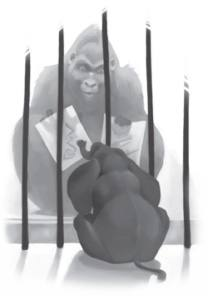{width="2.1666666666666665in"
height="3.125in"}

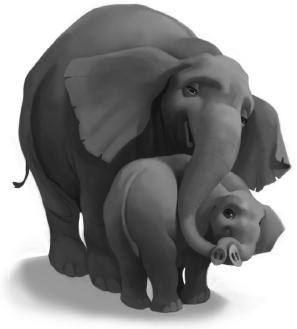{width="3.09375in"
height="3.4270833333333335in"}

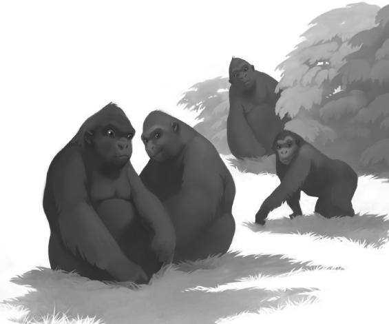{width="5.458333333333333in"
height="4.541666666666667in"}

**Discussion questions:**

This story is told in the first person from Ivan's point of view. Why do
you think the author wrote it this way?

Did you find Ivan believable?

How would the story be different if it had been told by a different
character in the book?

What do each of Ivan's friends - Bob, Stella and Julia -- give to Ivan?

How do they help him? How are they important to Ivan's survival?

How does the arrival of Ruby change Ivan?

Why does Ivan tell Stella that he will save the baby elephant when he
knows he is locked in a cage?

What do you think of Mack and George? How are they alike? How are they
different?

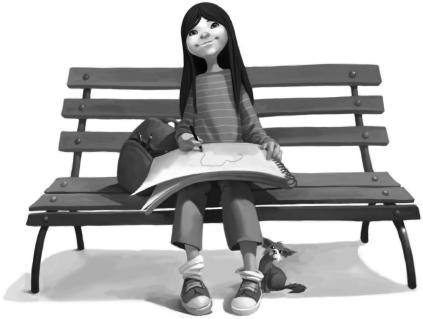{width="4.40625in"
height="3.3229166666666665in"}

**Reading Response Journal**

Journals can be used whether the book is being used as a:

Class novel

Literature Discussion Group

Enter questions and thinking about the book. E.g.

♦ Ask questions about things that you\'re wondering or things that seem
confusing to you.

♦ Tell about what happened in the story.

♦ Describe your feelings about the characters or events.

♦ Describe your favourite part.

♦ Make a prediction about what will happen next.

♦ Tell how you would react if you were one of the characters in the
story.

♦ Describe a part that surprised you.

♦ Write a letter to the author or a character.

**Word Choice**

**Strong Verbs**

The One and Only Ivan is so well written that you could take any passage
for a discussion on the use of strong verbs. E.g.

*poor mack*

Mack groans. He stumbles to his feet and hobbles off towards his office.
Ruby watches him leave. I can't read her expression. Is she afraid?
Relieved? Proud?

It lends itself to:

Verb Hunt

Choral Reading

Found Poetry

Readers' Theatre

Writer's Notebook: Quick Writes

Free Verse Poetry

Haiku

Persuasive Writing

Six Word Stories

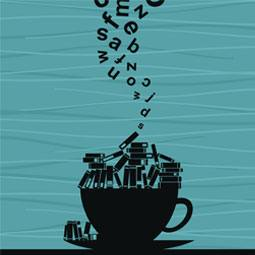{width="2.65625in"
height="2.65625in"}

"Writing in Six Words is a simple, creative way to get to the essence of
anything \-- from the breaking news of the day to your own life and the
way you live it."

Smith magazine

*arrival*

The new neighbour arrives after the four o'clock show.

When the truck comes lumbering towards the parking lot, Bob scampers
over to inform us.

Bob always knows what's happening. He's a useful friend to have,
especially when you can't leave your domain.

With a groan, Mack lifts the sliding metal door near the food court, the
place where deliveries are made.

A big white truck is backing up to the door, belching smoke. When the
driver opens the truck, I know that Stella is right.

A baby elephant is inside. I see her trunk, poking out from the
blackness.

I'm glad for Stella. But when I glance at her, I see she is not glad at
all.

"Stand back, everyone!" Mack yells. "We've got a new arrival. This is
Ruby, folks. Six hundred pounds of fun to save our sorry butts. This gal
is gonna sell us some tickets."

Mack and two men climb into the black cave of the truck. We hear noise,
scuffling, a word Mack uses when he's angry.

Ruby makes a noise too, like one of the little trumpets they sell at the
gift store.

"Move," Mack says, but still there is no Ruby. "Move," he says again.
"We haven't got all day."

Inside her domain, Stella paces as much as she's able: two steps one
way, two steps the other. She slaps her trunk against rusty metal bars.
She grumbles.

"Stella," I ask, "did you hear the baby?"

Stella mutters something under her breath, a word *she* uses when
*she's* angry.

"Relax, Stella," I say. "It will be okay."

"Ivan," Stella says, "it will never, ever be okay," and I know enough to
stop talking.

*stella helps*

The men are still yelling. Some of the yelling is at each other, but
most of it is at Ruby.

We hear scrambling, pounding, shifting. The side of the truck shudders.

"I'm starting to like this elephant," Bob Whispers.

"I'm getting the big one," Mack says. "Maybe she can coax the stupid
brat out of the truck."

Mack opens Stella's door. "Come on, girl," he urges. He unties the rope
attached to the floor bolt.

Stella pushes past Mack, nearly knocking him over. She rushes as best
she can, limping heavily, towards the open back door of the truck. She
catches her swollen foot on the edge of the ramp and winces. Blood
trickles down.

Halfway up the ramp she pauses. The noise in the truck stops. Ruby falls
silent.

Slowly Stella makes her way up the rest of the ramp. It groans under her
weight, and I can tell how much she is hurting by the awkward way she
moves.

At the top of the incline she stops. She pokes her trunk into the
emptiness.

We wait.

The tiny grey trunk appears again. Stella curls her own trunk around the
baby's. They make soft rumbling sounds.

We wait some more. A hush falls over the entire Big Top Mall.

*Thud. Thud.* Step, step, pause. Step, step, pause.

And there she is, so small she can underneath Stella with room to spare.
Her skin sags, and she sways unsteadily as she makes her way down the
ramp.

"Not the greatest specimen," Mack says, "but I got her cheap from this
bankrupt circus out west. They had her shipped over from Africa. Only
had her a month before they went bust." He gestures towards Ruby. "Thing
is, people love babies. Baby elephants, baby gorillas, heck, give me a
baby alligator and I could make a killing."

Stella ushers Ruby towards her domain. Mack and the two men follow. At
Stella's door, Ruby hesitates.

Mack gives Ruby a shove, but she doesn't budge. "Doggone it, get a clue,
Ruby," he mutters, but Ruby isn't moving, and neither is Stella.

Mack grabs a broom. He raises it. Instantly, Stella steps in front of
Ruby to shield her.

"Get in the cage, both of you!" Mack shouts.

Stella stares at Mack, considering. Gently but firmly, using her trunk,
she nudges Ruby into her domain. Only then does Stella enter. Mack slams
the door shut with a clang.

I see two trunks entwined. I hear Stella whispering.

"Poor kid," says Bob. "Welcome to the Exit 8 Big Top Mall and Video
Arcade, Home of the One and Only Ivan."

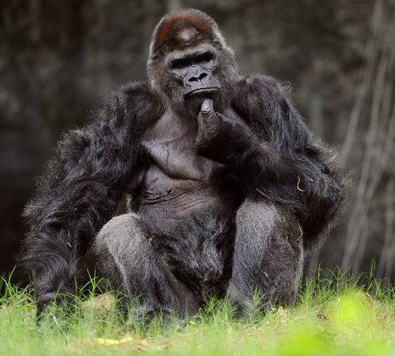{width="5.197916666666667in"
height="4.6875in"}

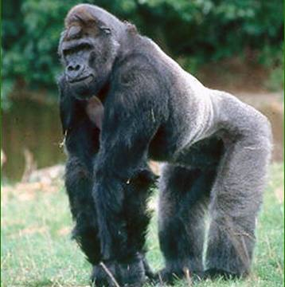{width="3.7291666666666665in"
height="3.75in"}

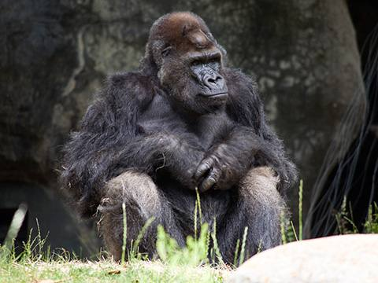{width="5.0in"
height="3.75in"}

{width="5.135416666666667in"
height="4.21875in"}

{width="6.385416666666667in"
height="7.947916666666667in"}

**Discussion Questions from the Publisher's Study Guide**

1.What does Ivan mean when he says, "In my size humans see a test of
themselves" (p. 4), and "I am too much gorilla and not enough human" (p.
7)? Why does the sign for the Big Top Mall show Ivan as angry and
fierce? Why doesn't Ivan express any anger in the beginning of the
story?

2.What are the characteristics of Stella and Bob that make Ivan call
them his best friends? Why is each of them important to Ivan? What do
Ivan and Stella have in common? How are they alike, and how are they
different? What does Stella mean when she says, "Old age is a powerful
disguise" (p. 31)?

3\. Discuss the special bond between Julia and Ivan. Why is she
different from all the other children who come to see his shows? Why do
people pay for Ivan's drawings if they don't recognise what he has
drawn?

Why is Ivan's art important to Mack? Why is it important to Julia?

4.What is the importance of the television in Ivan's cage?

What does he learn from watching the television?

Why does he like Westerns, and what does he learn from the nature shows?
What do you learn from television? What would you say is the most
important thing television has taught you?

5\. Why is Bob so independent? What makes him trust Ivan enough to sleep
on Ivan's stomach? What events in Bob's life have shaped his
personality? How does Bob's experience with humans compare to Ivan's?

6\. Compare the personalities of Mack and George. How are they alike,
and how are they different? What is the meaning of "family" to each of
them? What are the contradictions in Mack's character?

7\. What does Stella mean when she says, "A good zoo is how humans make
amends" (p. 64)? What is the importance of the story that Stella tells
about Jambo (pp. 63-66)? What does it tell us about gorillas?

Compare that story to Ruby's story about the humans who rescued her in
the jungle (pp. 101-104). What does this story tell us about some
humans?

8\. What is Ivan's initial reaction to the arrival of Ruby?

Compare Ruby's arrival with that of a new baby in a human household. How
does her arrival affect all the other animals at the mall? When and why
do Ivan's feelings about Ruby change?

9\. Why does Ivan promise Stella that he will take care of Ruby when he
knows how hard it will be to keep that promise? How does Ivan know that
Stella is gone before anyone else does?

10\. Discuss the importance of memory in this story.

How does Ivan's perception change when he begins to remember more of his
own history? What are his most vivid memories? What was Ivan's name in
the forest? Why is it important for him to remember his name and his
life as a baby gorilla?

11\. What is the turning point in the story? When does Ivan start to
believe that he will be able to help Ruby, and perhaps himself as well?
What events come together to change Ivan's acceptance of the situation
and to help him grow into his own strength and wisdom? How do you know
he is changing?

12\. How does Julia convince her father that Ivan's picture has a very
important meaning? Why does George agree to help Julia display Ivan's
art on the billboard, even though he knows it might cost him his job?
Discuss

the meaning of the word "principle."

13\. Why is Ivan reluctant to join the other gorillas when he arrives at
the zoo? How does he learn to be a true gorilla? What does he need to do
to be accepted by the others? How do you feel when you are in a
situation

with other children you don't know?

14\. Discuss the theme of belonging in this story, from the point of
view of each of the characters. What is the meaning of belonging for
each of them? What does the idea of belonging mean to you?

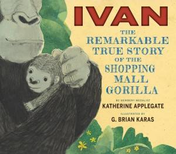{width="3.125in"
height="2.7395833333333335in"}

Like the novel before it, Ivan is a masterpiece of efficient beauty.

*In leafy calm,*

*in gentle arms,*

*a gorilla's life began.*

There's a good chance you know the story. As babies, two gorillas are
snatched from their home and taken to Tacoma Washington. One of them,
named Burma, didn't survive long. The other, Ivan, went on to live a
lonely life as a shopping mall attraction. After years spent in a tiny
cell, Ivan began to gain support from the public, who demanded better
living conditions for the gorilla. Ivan was eventually moved to Zoo
Atlanta to live out his days in relative peace and companionship.

The spare text is expertly executed. Words in picture books always have
to be carefully chosen, but here every word seems essential. Applegate
could have strayed into oversimplification, but that's not the case.
Passages like this one...

*A man who owned a shopping mall had ordered and paid for them, like a
couple of pizzas, like a pair of shoes.*

...and this one...

*Zoo Atlanta wasn't a jungle. It was a place with walls. Still, the
breeze carried jungle sounds and scents.*

...add depth in few words.

His death in 2012 isn't covered in the text, but is addressed in the
informative author's note -- a smart decision that keeps the focus on
Ivan's joyful escape from Tacoma.

The illustrations, G. Brian Karas, are superb. At every turn he
seamlessly captures the emotion of the text. The fear of being taken
from home, the isolation of being endlessly gawked at, the joy of
escaping a lonely existence -- it's all there.

Similar to the finale of Caldecott Honor Me...Jane, a photograph is used
on the last page to great success. It's a perfect way to draw things to
a close, reminding readers that what they read was a true story and
giving them a glimpse of what Ivan really looked like.

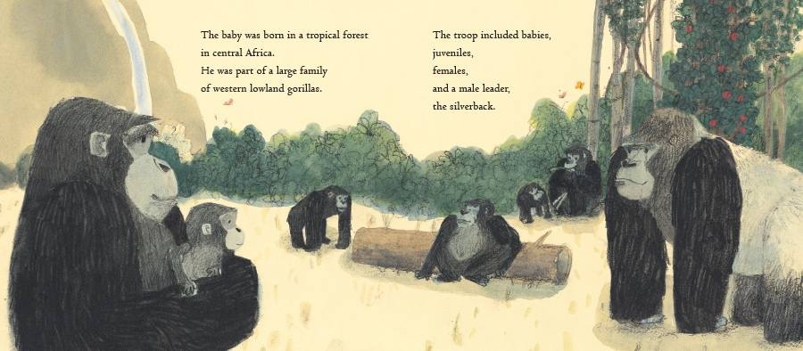{width="7.03125in"
height="3.0833333333333335in"}

**Ivan the remarkable True Story of the Shopping Mall Gorilla**

**Katherine Applegate**

In leafy calm, in gentle arms, a gorilla's life began. The baby was born
in a tropical forest in central Africa. He was part of a large family of
western lowland gorillas. The troop included babies, juveniles, females,
and a male leader, the silverback.

The more the baby gorilla grew, the more he played. The more he played,
the more he learnt. He rode on his mother's back. He listened to the
hoots and grunts and chest-beats of his father. He watched the older
gorillas, clever and quick, as they wrestled and chased and swung from
vines.

He did not learn about humans until it was too late. Poachers with loud
guns and cruel hands stole the little gorilla and another baby.

After thousands of miles and endless days in a black, damp crate, at
last came light and fresh air. The jungle, green with life, was gone.

The gorillas had travelled halfway around the world to Tacoma,
Washington. A man who owned a shopping mall had ordered and paid for
them, like a couple of pizzas, like a pair of shoes.

People cooed and laughed and held the babies. They dressed them in human
clothes and fed them human food. The shopping mall owner ran a "Name the
Babies" contest. The winning names were Burma and Ivan.

One dark day soon after the babies arrived in their strange new world,
Burma died. Without her, Ivan was all alone, with too much left to
learn.

While he was little, Ivan was cute and cuddly. For three years he lived
in a home like a human child. He slept in a bed and went to baseball
games. He held babies and rode on a motorcycle. He had to learn many
things gorillas in the wild don't ever need to know.

The one thing Ivan didn't need to learn was how to eat. The more he ate,
the more he grew. The more he grew, the less he could live a human life
in a human house.

A cage in the mall became Ivan's new home. There wasn't much to do.
Sometimes Ivan watched TV. Sometimes he played with an old tyre.
Sometimes he finger-painted, signing the papers with his thumbprint.
Mostly he watched the humans watching him.

Ivan was about thirteen when his coat began to shimmer with
silvery-white hairs. He'd grown into a silverback gorilla. In the
jungle, he would have been ready to protect his family.

But he had no family to protect.

Year after year passed. People began to grow angry about Ivan's lonely
life. Children and adults wrote letters, and signed petitions, and held
protests.

Ivan lived in his cage without the company of other gorillas for
twenty-seven years before he was sent on another journey. This time the
hands were gentle.

Zoo Atlanta wasn't a jungle. It was a place with walls. Still, the
breeze carried jungle sounds and scents. Scientists who understood the
needs of gorillas helped Ivan adjust slowly, carefully, gently to his
new life.

Finally, it was time. Was Ivan ready?

Cameras clicked. Reporters watched.

When Ivan stepped onto the cool green grass, the sunlight gleaming on
his silver hair, people cheered and laughed and wept with joy. Ivan, the
shopping mall gorilla, was in a place with trees and grass and other
gorillas at last.

In leafy calm, in gentle arms, a gorilla's life began again.

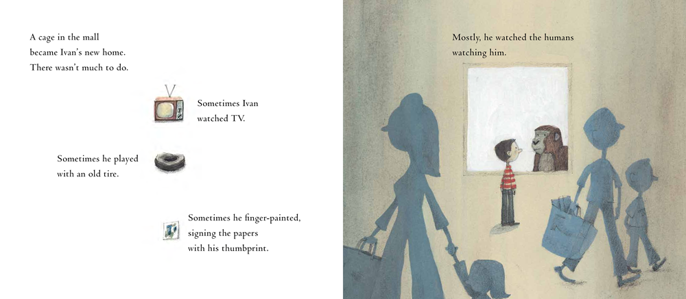{width="6.90625in"
height="3.0208333333333335in"}

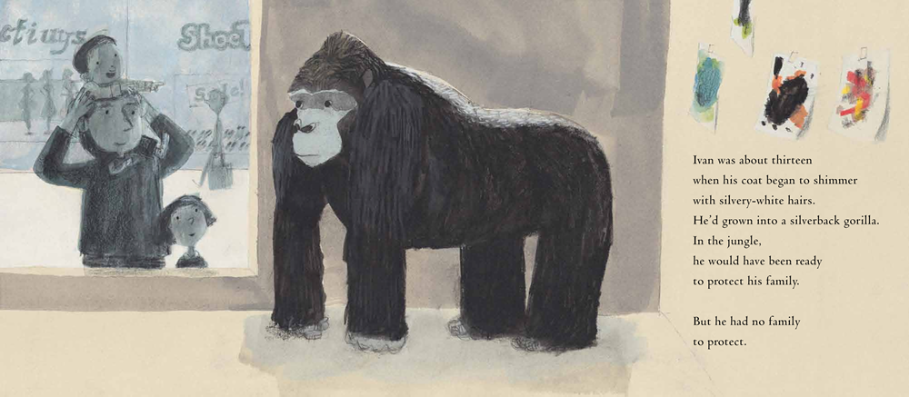{width="6.90625in"
height="3.0208333333333335in"}

**Fiction/Non-Fiction**

Children are exposed to fiction from their early years in the form of
fairy tales and a wide variety of picture books. Because of this, they
are able to negotiate fiction easily. They understand and anticipate
that there is a beginning, a middle, and an end. They know that there is
a problem that requires resolution. They also know that there is a
message or purpose to the story and that the story is made up from
someone's imagination.

The One and Only Ivan is fiction. The author, Katherine Applegate (who
wrote both books), heard of Ivan's story and made up a tale based upon
it.

The differences between non-fiction and fiction are easily explained and
shown to children. First, children need to learn that non-fiction is
real. Everything in a non-fiction book is based on fact. While The One
and Only Ivan is based loosely on Ivan's story, it is not entirely true,

is it? For one thing, animals don't talk! That's a simple way to explain
the difference between fiction and non-fiction: If it can't happen in
real life, it's fiction. Applegate wanted to provide Ivan's point of
view in her fictional story about him, and she chose to let us in on his
thoughts as if he were talking to us. In non-fiction, everything
described must be true and accurate, as in Applegate's follow-up book,
Ivan: The Remarkable True Story of the Shopping Mall Gorilla

We don't hear Ivan's inner thoughts in this book. In real life, we
couldn't, and non-fiction has to mirror real life. Since Ivan: The
Remarkable True Story of the Shopping Mall Gorilla is based on a real
gorilla named Ivan, this non-fiction does have a "story" to it. It tells
the reader the true story of Ivan's life. There is no listening in on
his thoughts in this book, because it is completely factual. Pairing
this book with the fictionalised account is a great way to show children
the difference between fiction and non-fiction. Exposing students to
both books will enhance their understanding and enjoyment of Ivan's life
story.

Activities

Website to view the real Ivan

Ivan lived to be fifty years old and died in 2012 in a natural habitat
at Zoo Atlanta surrounded by other gorillas. The zoo's website is
ZooAtlanta.org, and you can find actual video footage of the real Ivan
there. Go to their home page and enter "Ivan" in the "search" box.

**Critical-thinking questions** based on

Ivan: The Remarkable True Story of the Shopping Mall Gorilla

These questions are not meant to elicit random facts or to constitute a
ten-question quiz, but rather to require students to think critically
and synthesise the information they read. They are meant to get children
thinking and to support a robust discussion. The answers listed are only
possible ones; real answers will vary.

Q.Should anyone in the world be able to purchase wild animals? Why or
why not?

A. The general consensus is that wild animals should be raised in a
habitat as close to their original habitat as is possible. Wild animals
are wild, and they can attack humans even if the humans treat them like
pets.

Q. Ivan lived with the couple who brought him into their home for three
years and was treated like a pet. What might be good about that and what
might be bad about that?

A. Ivan became less and less like a gorilla and more like a human. In
the end, he had to be caged, which was far different from having the run
of the home where he lived. On the plus side, he did have social
interaction, even if it was only with humans.

Q. When Ivan was moved to the shopping mall, his living conditions
changed dramatically. He was now kept in a cage, where shoppers could
stop and look at him. What were the problems with that?

A. Gorillas are social animals, and Ivan was all alone with no gorillas
to learn from or interact with. He would have been a mighty, dignified
silverback swinging from trees if he hadn't been abducted. Now he lived
in a very small cage with a TV and an old tyre to play with. Behaviours
common to gorillas were no longer present in Ivan due to his isolation.

Q. Poachers are people who go into the wild to steal animals they know
will command a high price. Sadly, some poachers kill some animals to
harvest their organs or their tusks. In our society we have "puppy
mills," which breed lots of puppies to sell. When having animals is all
about making money, what happens to the animals?

A. They are not cared for properly. The poachers or owners of puppy
mills have only a short-term interest in the animals. They need to keep
the animals alive so they can sell them, but they generally give only
minimal care.

Q. Compare Ivan's life when he lived in the wild with his later life in
the cage at the mall.

A. Then: His life was carefree, safe, secure, and part of an extended
family. He learnt by playing, rode on his mother's back, and mimicked
his father by chest beating. In captivity: He had no interaction with
other gorillas, was used as a way to get people to come to the mall, and
probably had a poor diet and didn't receive veterinary services as
needed.

Q. Silverback gorillas typically play an important role in their troops.
They find food for the troop and are the protectors. In human society,
families have protectors too. Who is the protector in your family and
how does this person protect you?

A. Answers will include Mum and Dad, certainly, but may be extended to
include grandparents and others.

Q. Ivan was a silverback, but he had no family to protect. When he moved
to Zoo Atlanta and spent time with other gorillas, do you think he knew
how to be a silverback?

A. Students will have different responses. Always ask them for the
reasoning behind their answers so that they learn to connect their
thinking with what is said in the text. This is the best way to check
comprehension.

Q. When Ivan was moved to Zoo Atlanta, he was initially afraid of the
other gorillas. Why do you think that was?

A. He had lost any connection to his kind. He didn't know how to
socialise or if these other gorillas would mean him harm.

Q. At the end of the book, the author says, "In leafy calm, in gentle
arms, a gorilla's life began again." What does she mean by that?

A. Ivan had to relearn what it meant to be a gorilla---in his case, a
silverback---and what it meant to be part of a family. He would now be
with other gorillas and learn how to socialise. He would no longer be
confined to a

cage but would roam freely in a large area created for gorillas to feel
at home.

Q. Based on this book, do you think Ivan would have been better off if
the poachers never kidnapped him, or was life in captivity better for
him?

A. Again, answers will vary.

Guide create by Joan Kindig, Professor, James Madison University

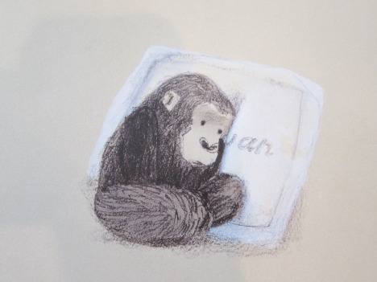{width="4.875in"
height="3.65625in"}

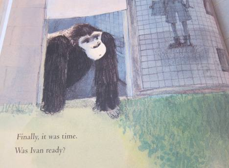{width="4.875in"
height="3.5729166666666665in"}

**Word Choice**

+----------------------+---------------------------------------------+
| Craft                | Example                                     |
+======================+=============================================+
| Sensory Images       |                                             |
|                      |                                             |
| Appealing to the     |                                             |
| senses               |                                             |
+----------------------+---------------------------------------------+
| Strong, vivid Verbs  |                                             |
+----------------------+---------------------------------------------+
| Specific Nouns       |                                             |
+----------------------+---------------------------------------------+
| Surprising Language  |                                             |
+----------------------+---------------------------------------------+
| Striking words and   |                                             |
| phrases including:   |                                             |
|                      |                                             |
| Adjectives           |                                             |
|                      |                                             |
| Hyphenated           |                                             |
| adjectives           |                                             |
|                      |                                             |
| Adverbs              |                                             |
+----------------------+---------------------------------------------+
| Show not Tell        |                                             |
+----------------------+---------------------------------------------+
| 'And' -- effective   | .                                           |
| use to start a       |                                             |
| sentence             |                                             |
+----------------------+---------------------------------------------+
| Items in a series    |                                             |
+----------------------+---------------------------------------------+
| Figurative Language  |                                             |
|                      |                                             |
| Similes              |                                             |
|                      |                                             |
| Metaphors            |                                             |
|                      |                                             |
| Onomatopoeia         |                                             |
|                      |                                             |
| Alliteration         |                                             |
|                      |                                             |
| Personification      |                                             |
+----------------------+---------------------------------------------+
| Repetition:          |                                             |
|                      |                                             |
| Close-echoes         |                                             |
|                      |                                             |
| Details              |                                             |
|                      |                                             |
| Ideas (Re-say)       |                                             |
|                      |                                             |
| Sentence structure   |                                             |
+----------------------+---------------------------------------------+
| Power of Three       |                                             |
+----------------------+---------------------------------------------+
| Words as well as     |                                             |
| 'said'               |                                             |
+----------------------+---------------------------------------------+
| Made up words        |                                             |
+----------------------+---------------------------------------------+

> *"All things are so very uncertain, and that's exactly what makes me
> feel reassured."*

[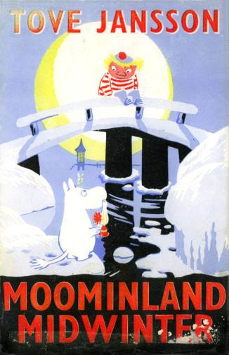{width="2.0833333333333335in"
height="3.21875in"}](http://www.amazon.com/exec/obidos/ASIN/0312625413/braipick-20)**Tove
Jansson** (1914--2001) is among the most imaginative, important, and
influential children's book creators of all time, an artist and writer
of unparalleled creative vision and great sensitivity to life's
ineffable nuances. A recipient of the prestigious Hans Christian
Andersen Award, she had the courage to turn down Walt Disney and build
her own creative empire. From her
beloved [Moomins](http://www.brainpickings.org/2014/03/26/tove-janssen-moomin-mymble-little-my/)
characters to her spectacular vintage illustrations for [*Alice in
Wonderland*](http://www.brainpickings.org/2014/07/07/best-illustrations-alice-in-wonderland/) and [*The
Hobbit*](http://www.brainpickings.org/2014/06/13/vintage-hobbit-illustrations/),
her stories exude the metaphorical magic of
Milne's *Winnie-the-Pooh* tales, the fanciful whimsy of Baum's Oz world,
the contemplative introspection of Saint-Exupéry's *The Little Prince*,
and the enchanting symbolism of Carroll's Wonderland. Philip Pullman has
aptly called her "a genius of a very subtle kind" and Neil Gaiman
considers her work "a surrealist masterpiece."

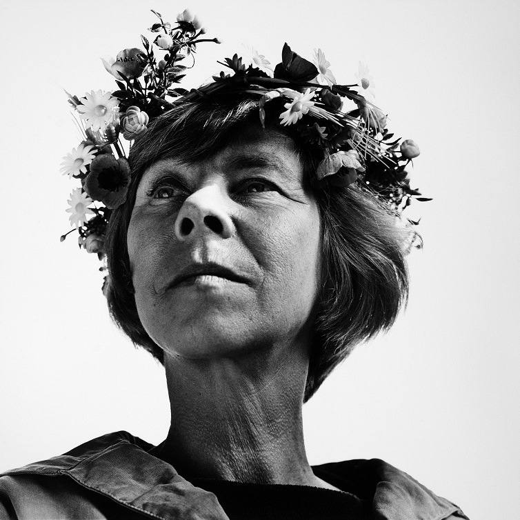{width="6.268055555555556in"
height="6.268055555555556in"}

Jansson's singular sensibility springs from her own unusual life. Born
to an artistic and rather eccentric family from Finland's
Swedish-speaking minority, young Tove was raised by wildly creative
parents --- her father was one of Finland's greatest sculptors and her
mother designed books and postage stamps, illustrated book jackets, and
created punchy political cartoons. Jansson completed her formal training
in art and graphic design in various institutions across Sweden,
Finland, and France, but the origin of her iconic Moomin characters was
rooted in an affectionate family joke rather than in her formal training
--- while studying in Stockholm in her late teens and living with
relatives there, Jansson would regularly sneak into the kitchen for
treats; her uncle would tease her that a "Moomintroll" lived in the
kitchen pantry, ready to breathe cold air down stealthy snackers' necks.

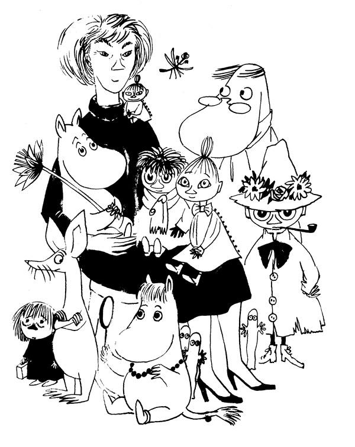{width="6.25in"
height="7.875in"}

Moominvalley's main protagonist, Moomintroll, is thus a self-portrait of
sorts, but perhaps Jansson's most interesting character is also the one
based on the most intimate part of her life. Too-ticky, the sage of
Moominvalley who solves even the most existential of problems with equal
parts practicality and wisdom, was inspired by the love of Jansson's
life --- the great Finnish sculptor and graphic arts pioneer Tuulikki
"Tooti" Pietilä, Jansson's spouse. The two women met in art school
during their twenties and remained together until Jansson's death more
than six decades later, collaborating on a lifetime of creative projects
--- all at a time when queer couples were straddling the impossible line
between [anguishing
invisibility](http://www.brainpickings.org/index.php/2014/06/19/the-invisibles-sebastien-lifshitz/) and [dangerous
visibility](http://www.brainpickings.org/2014/01/10/edith-windsor-debbie-millman-time/).

Although Too-ticky, clad in her signature red-and-white sweater, appears
in a number of the Moomin books, her spirit blossoms most vibrantly in
the 1957 gem Moominland Midwinter, where "her common sense often
restores order in the valley." More than mere common sense, however,
Too-ticky's laconic sagacity and aphoristic reflections are full of
invaluable wisdom on life.

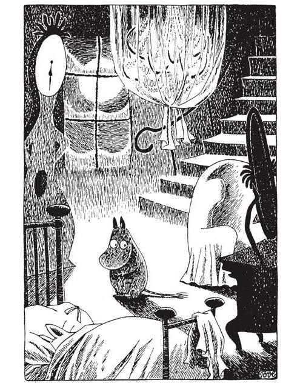{width="5.208333333333333in"
height="6.635416666666667in"}

The book tells the story of Moomintroll who, unlike his family that
hibernated from November to April every year, wakes up early and decides
to stay up through the harsh Scandinavian winter. He grows angry at the
sun's absence, angry at the raging blizzards, angry at those who seem
able to enjoy rather than resent the season of snow and ice. It is a
tale of learning to live with the vital discomfort of uncertainty, to
get lost in order to find oneself, to surrender to the rhythms of life
rather than agonising in resistance.

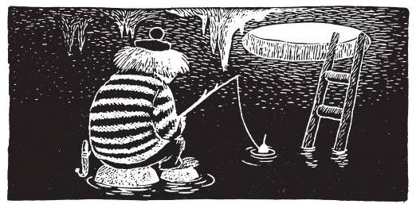{width="5.4375in"
height="2.7291666666666665in"}

Lost in the forest, Moomintroll comes upon a warm light emanating from a
cozy hole someone had dug for shelter --- "someone who lay looking up at
the serene winter sky and whistling very softly to herself." It is, of
course, Too-ticky. When Moomintroll inquires about the song she is
whistling, she replies, Whitman-like, with a wonderfully metaphorical
answer:

*It's a song of myself... The refrain is about the things one can't
understand. I'm thinking about the aurora borealis. You can't tell if it
really does exist or if it just looks like existing. All things are so
very uncertain, and that's exactly what makes me feel reassured.*

This theme of uncertainty and of finding joy in questioning reality is a
recurring one for Too-ticky. Echoing the first of Bertrand Russell's ten
famous commandments of teaching, learning, and life --- "Do not feel
absolutely certain of anything." --- she offers comforting solidarity in
Moomintroll's lament that he doesn't understand the snow:

*I don't either... You believe it's cold, but if you build yourself a
snowhouse it's warm. You think it's white, but at times it looks pink,
and another time it's blue. It can be softer than anything, and then
again harder than stone. Nothing is certain.*

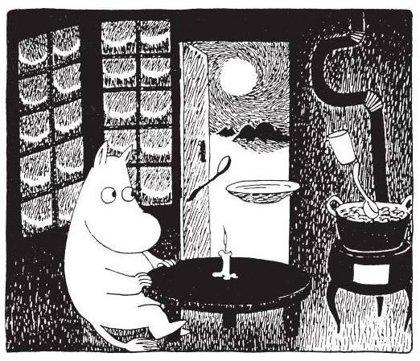{width="5.4375in"
height="4.677083333333333in"}

In many ways, Too-ticky's wisdom seems almost Zen Buddhist in nature. In
addition to championing the ability to be at peace with uncertainty, she
also advocates a minimalist approach to material possessions --- when
Moomintroll discovers, distraught and indignant, that someone is
secretly smuggling things out of his sleeping family's house, Too-ticky
responds:

*That's nice, isn't it? You've got too many things about you. As well as
things you remember, and things you're dreaming about.*

Too-ticky is also a sage of the "slow churn" and wise champion of the
idea that "anything worthwhile takes a long time." (Janssen would
certainly know --- she wrote her first Moomin book, The Moomins and the
Great Flood, in 1939 and published it in 1945, but it was not a success;
her first critical acclaim arrived in 1946, nearly a decade after she
had created the Moomins, with the publication of Comet in Moominland.)
When Moomintroll grows angry and impatient with the sun's refusal to
rise, Too-ticky reminds him that hurrying is a toxic way of trying to
resist the present:

*Don't be in such a hurry... Soon now. Sit down and wait.*

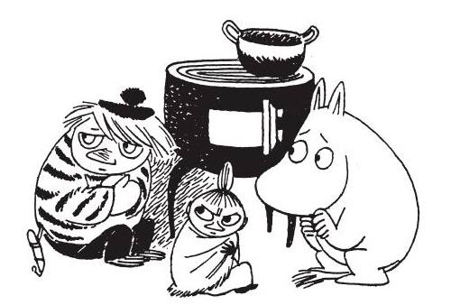{width="5.208333333333333in"
height="3.5208333333333335in"}

When the sun does appear, it flits across the horizon for a fleeting
moment, only to set back down. Moomintroll is even more frustrated, but
Too-ticky assures him that the sun, like the myth of the overnight
success, follows an incremental rise to brilliance:

*He'll return tomorrow... And then he'll be a tiny bit bigger, about
like a piece of cheese rind. Take it easy*.

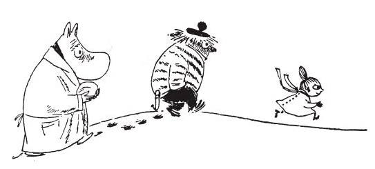{width="5.65625in"
height="2.5520833333333335in"}

The story is also a gentle primer on evolution. When Moomintroll,
against Too-ticky's instruction, opens her secret cabinet and finds a
strange creature living there, he tells her it was "*only a sort of old
rat*," but she corrects him:

*That was no rat. It was a troll. A troll of the kind you were yourself
before you became a Moomin. That was how you looked a thousand years
ago.*

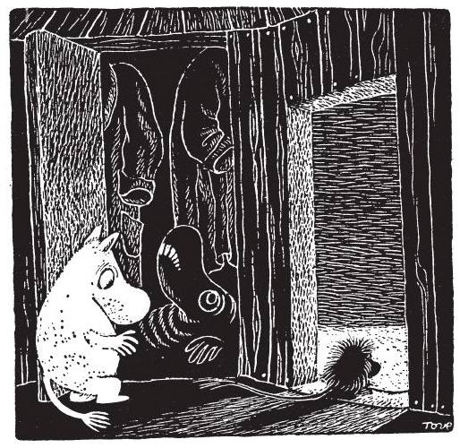{width="5.354166666666667in"
height="5.208333333333333in"}

Moomintroll is so unsettled by the notion that he is related to a mere
rat --- an elegant allegory for why some people are drawn to such
defensive fancies as Young Earth creationism --- he storms into the
attic to look for an old family album. Janssen writes:

*Page after page of dignified Moomins, most often reproduced standing in
front of porcelain stoves, or on fret-worked verandahs. Not a single one
of them resembled the cupboard troll. "Must be a mistake," Moomintroll
thought. "He can't be any relation of mine."*

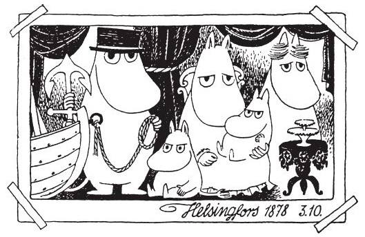{width="5.510416666666667in"
height="3.5833333333333335in"}

Slowly, Moomintroll makes peace with Too-ticky's knowledge:

*He went down and looked at his sleeping Pappa. Only the nose bore some
resemblance to the troll's. But possibly, a thousand years ago.*

There is almost a cosmology element to this undercurrent --- a reminder
that, however discomfiting this too may be to most humans, we are indeed
a cosmic accident. Janssen traces the evolution of Moomintroll's
understanding:

*Suddenly he felt very proud of having an ancestor. And it cheered him
no little to think that Little My \[Moomintroll's sister\] had no
pedigree at all, but rather had come into the world by chance.*

But perhaps her most profound wisdom deals with our quintessential
struggle to make peace with death, which stems from an inability to
recognize the comforting interconnectedness of life. When the Lady of
the Cold --- the beautiful but formidable priestess of the Great Cold,
capable of turning into an icicle any fool so bewitched as to look
straight into her eyes --- freezes the cheerful little squirrel
Moomintroll had befriended, Too-ticky sighs:

*It's very hard to tell if people take any pleasure in their tails when
they're dead.*

Death, too, is part of nature's necessary cycles of growth and decay.
When Moomintroll and Little My remonstrate the very mention of death,
Too-ticky responds:

*When one's dead, then one's dead. This squirrel will become earth all
in his time. And later on still there'll grow trees from him, with new
squirrels skipping about in them. Do you think that's so very sad?*

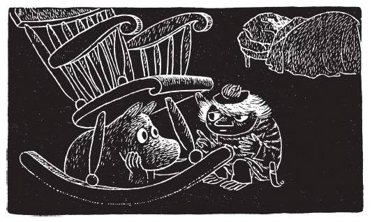{width="5.552083333333333in"
height="3.3125in"}

Too-ticky's greatest gift, it appears, is a certain quality of presence
--- the kind she cultivated in "her own private winter world that had
followed its own strange rules year after year" --- that allows her to
feel one with the world. It is from that standpoint that, when spring
finally arrives, she responds to Moomintroll's accusation that she
hadn't comforted him during the long winter by offering assurance that
spring will come, but instead focused on what the world had to offer
right there and then. Too-ticky's answer, emanating a kind of
Emerson-like ideal of self-reliance, rings with extraordinary, if
uncomfortable, poignancy:

*One has to discover everything for oneself. And get over it all alone.*

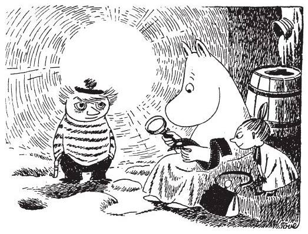{width="5.447916666666667in"
height="4.135416666666667in"}

Moomintroll imbibes Too-ticky's existential lesson. Soon, when his
friend the Snork Maiden comes across "the first brave nose-tip of a
crocus" shyly trying to push through snow, she suggests they put a glass
over it to protect it from the frost at night. But Moomintroll objects:

*No, don't do that. Let it fight it out. I believe it's going to do
still better if things aren't so easy.*

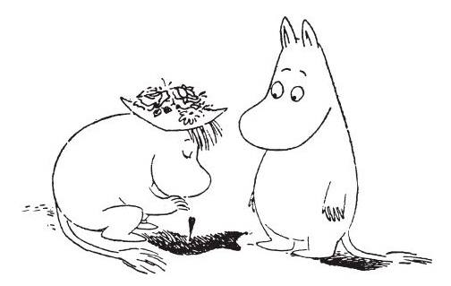{width="5.25in"
height="3.3229166666666665in"}

Decades before the groundbreaking research on why cultivating grit is
the greatest key to success, Jansson made the same point with great
subtlety and wisdom.

**Because of Winn-Dixie Kate DiCamillo**

{width="2.7083333333333335in"
height="3.9166666666666665in"}

The summer Opal and her father, the preacher, move to Naomi, Florida,
Opal goes into the Winn-Dixie supermarket and comes out with a dog. A
big, ugly, suffering dog with a sterling sense of humour. A dog she dubs
Winn-Dixie. Because of Winn-Dixie, the preacher tells Opal ten things
about her absent mother, one for each year Opal has been alive.
Winn-Dixie is better at making friends than anyone Opal has ever known,
and together they meet the local librarian, Miss Franny Block, who once
fought off a bear with a copy of War and Peace. They meet Gloria Dump,
who is nearly blind but sees with her heart, and Otis, an ex-con who
sets the animals in his pet shop loose after hours, then lulls them with
his guitar. Opal spends all that sweet summer collecting stories about
her new friends, and thinking about her mother. But because of
Winn-Dixie or perhaps because she has grown, Opal learns to let go, just
a little, and that friendship-and forgiveness-can sneak up on you like a
sudden summer storm.

**Because of Winn-Dixie**

**Kate DiCamillo**

Voice.

Writing a Decalogue.

In Chapter 3 Opal asks her father to tell her ten things about her
mother who had left them.

Chapter 4 contains that Decalogue. A Decalogue is a list of 10 personal
beliefs about something important.

Text-to-text connection: The Tenth Good Thing About Barney by Judith
Viorst.

The Decalogue is spoken by Opal's father. The structure of the chapter
can be used as a mentor for a Decalogue.

Students create a personal Decalogue. A variation could be to get the
students to use different words to begin each line.

Students create a fictional character Decalogue. In this story the
student's character reveals a Decalogue to another character through
dialogue.

Writer's Notebook: Write a Decalogue.

10 things about:

Myself as a writer

What makes me different.

In my Writer's Notebook I summarised the chapter by transforming the
preacher's words into a found poem. (attached).

This could be a mentor for a decalogue poem.

Read end of Chapter 3 -- Chapter 4.

Discussion about ten interesting facts:

How the characters talk.

What do we learn about the characters through this dialogue?

**Your Mama**

Your mama was funny.

She could make just about anybody laugh.

She had red hair and freckles.

She like to plant things;

She had a talent for it.

She could stick a tyre in the ground

And grow a car.

She could run fast.

If you were racing her,

You couldn't ever let her get a head start,

She would beat you for sure.

She couldn't cook.

She burnt everything,

Including water.

She had a hard time opening a can of beans.

Your mama loved a story.

She would sit and listen to stories

All day long.

She loved to be told a story.

She especially liked funny ones,

Stories that made her laugh.

She knew all about the constellations,

Every planet in the nighttime sky,

Every last one of them.

She could name them

And point them out.

And she never got tired of looking up at them.

She hated being a preacher's wife.

She said she just couldn't stand having the ladies

At church judge what she was wearing

And what she was cooking

And how she was singing.

She said it made her feel

Like a bug under a microscope.

She drank.

She drank beer,

And whiskey,

And wine.

Sometimes, she couldn't stop drinking.

And that made me and your mama

Fight quite a bit.

Your mama loved you.

She loved you very much.

**Decalogue Topic Ideas:**

childhood ego love money

addiction happiness beauty curiosity

power war pride bravery

education family trust talent

teamwork failure faith

**Character Ideas**:

Character: Adjective:

artist nurse a remorseful

politician beggar a victimised

hero athlete a depressed

neighbour knight a dishonest

scientist sailor a brilliant

actor wizard an optimistic

performer a poverty-stricken

student doctor a rebellious

monarch musician a creative

pilot a ghostly

a pleasant

a scholarly

an eccentric

a dramatic

a crippled

**Writing:**

**Narrative Writing: Because of . . .**

Students think about how India Opal's life changes "because of
Winn-Dixie." Students write a first person narrative about a person (or
pet!) who has made a difference in their life. Before they begin
writing, students make a list of ten things about this person or pet.
Suggest that they use this list to create their characterisation of the
person or pet**.**

**Exploring a Theme**

Frannie compares life to a Littmus Lozenge, because the sweet and sad
are often mixed up together.

Read handout from chapter 17.

First person narrative on sweetness and sadness in life.

**Another Decalogue**

In Chapter 24 Opal thinks of ten things about Winn-Dixie when he runs
off in a thunderstorm. This is short and could be used by the students
when they write one as a planning guide. Each point could then be
elaborated in a first person story.

Read handout from this chapter.

**Vocabulary:**

**Word Harvesting**

Read Aoud/Read Along/Independent Reading.

Harvest 5-10 words to be placed on the Literature Word Wall. Discover
meanings through context. Use words in speaking and writing -- students
and teacher. Discuss words which can be nouns and verbs. Look at word
families.

Chapters 1-5

skidded produce (n) missionary suffering

exception fortunate (n) judge (v) memorised

congregation distract effect sermon

potluck constellation retriever

Chapters 6-10

memorial embarrassed trembling pride

peculiar recall gerbil instalment

dust bunnies overgrown green thumb snuffle

grand trustworthy palmetto theme

advanced (Adj)

Chapters 11-15

whimper tearing (v) rights charming (v)

routine intend roundabout fit (n)

retarded pathological cooped up dramatic

criminal

Chapters 16-20

occur enlist abiding typhoid

sensation lozenge sorrow melancholy

batch tragedies manufacture survive

murderer squawk hunch

Chapters 21=26

frilly crepe paper shimmer downpour

drizzle plumb (slang) strum gentle

myths complicated potions spells

**Vocabulary Ideas:**

Vocabulary Charades. Act out a word for others to guess.

Vocabulary Pictures,

Working in pairs, A draws a picture representing the word for B to
guess.

Verb Hunt.

Chapter 25 for strong verbs.

**Because of Winn-Dixie**

**THEMES**

  ---------------------------------------------------------------------
  **Theme**                          **Evidence from Text**
  ---------------------------------- ----------------------------------
                                     

  ---------------------------------------------------------------------

**\
Because of Winn-Dixie Kate DiCamillo**

**Chapter Four**

"One," said the preacher. We were sitting on the couch and Winn-Dixie
was sitting between us. Winn-Dixie had already decided that he liked the
couch a lot. "One," said the preacher again. Winn-Dixie looked at him
kind of hard. "Your mama was funny. She could make just about anybody
laugh."

"Two," he said. "She red hair and freckles."

"Just like me," I said.

"Just like you," the preacher nodded.

"Three. She liked to plant things. She had a talent for it. she could
stick a tyre in the ground and grow a car."

Winn-Dixie started chewing on his paw, and I tapped him on the head to
make him stop.

"Four," said the preacher. "She could run fast. If you were racing her,
you couldn't ever let her get a head start, because she would beat you
for sure."

"I'm that way, too," I said. "Back home, in Watley, I raced Liam
Fullerton, and beat him, and he said it wasn't fair, because boys and
girls shouldn't race each other to begin with. I told him he was just a
sore loser."

The preacher nodded. He Was quiet for a minute.

"I'm ready for number five," I told him.

"Five," he said. "She couldn't cook. She burnt everything, including
water. She had a hard time opening a can of beans. She couldn't make
head nor tail of a piece of meat. Six." The preacher rubbed his nose and
looked up at the ceiling. Winn-Dixie looked up, too. "Number six is that
your mama loved a story. She would sit and listen to stories all day
long. She loved to be told a story. She especially liked funny ones,
stories that made her laugh." The preacher nodded his head like he was
agreeing with himself.

"What's number seven?" I asked.

"Let's see," he said. "She knew all the constellations, every planet in
the nighttime sky. Every last one of them. She could name them. And
point them out. And she never got tired of looking up at them.

"Number eight," said the preacher, with his eyes closed, "was that she
hated being a preacher's wife. She said she just couldn't stand having
the ladies at church judge what she was wearing and what she was
cooking, and how she was singing. She said it made her feel like a bug
under a microscope."

Winn-Dixie lay down on the couch. He put his nose in the preacher's lap
and his tail in mine.

"Ten," said the preacher.

"Nine," I told him.

"Nine," said the preacher. "She drank. She drank beer. And whiskey. And
wine. Sometimes, she couldn't stop drinking. And that made me and your
mama fight quite a bit. Number ten," he said with a long sigh, "number
ten is that your mama loved you. She loved you very much."

"But she left me," I told him.

"She left us," said the preacher softly. I could see him pulling his old
turtle head back into his stupid turtle shell. "She packed her bags and
left us, and she didn't leave one thing behind."

"Okay," I said. I got up off the couch. Winn-Dixie hopped off, too.
"Thank you for telling me," I said.

I went right back to my room and wrote down all ten things that the
preacher had told me. I wrote them down just the way he said them to me
so that I wouldn't forget them, and then I read them out loud to
Winn-Dixie until I had them memorised. I wanted to know those ten things
inside and out. That way, if my mama ever came back, I could recognise
her, and I would be able to grab her and hold on to her tight and not
let her get away from me again.

**Because of Winn-Dixie**

**Littmus Lozenge**

Miss Franny tells Opal about her great-grandfather, Littmus W. Block,
who invented the Littmus Lozenge.

I ate my Littmus Lozenge slow. It tasted good. It tasted like root beer
and strawberry and something else I didn't have a name for, something
that made me feel kind of sad ...

"There's a secret ingredient in there," Miss Franny said.

"I know it," I told her. "I can taste it. What is it?"

"Sorrow," Miss Franny said. "Not everybody can taste it. Children
especially seem to have a hard time knowing it's there."

"I taste it," I said.

"Me too," said Amanda.

"Well, then," Miss Franny said, "you've probably both had your share of
sadness."

... She (Miss Franny) shook her head. "Sorrow," she said. "It is a
sorrow-filled world."

"But how do you put that in a piece of candy?" I asked her. "How do you
get that taste in there?"

"That's a secret," she said. "That's why Littmus made a fortune. He
manufactured a piece of candy that tasted sweet and sad at the same
time."

Opal is given candy to give to others.

Gloria Dump:

"Mmmm-hmmm." She nodded her head slowly. "It tastes sweet. But it also
tastes like people leaving."

"You mean sad?" I asked. "Dows it taste like sorrow to you?"

"That's right," she said. "It tastes sorrowful but sweet ..."

The preacher:

"It almost tastes a little melancholy," he said.

"Melancholy? What's that?"

"Sad," said the preacher. He rubbed his nose some more. "It makes me
think of your mother."

Otis:

"It tastes good, but it also tastes a little bit like being in jail."

**Winn-Dixie**

**...** And in my head, I started on a list of ten things that I knew
about Winn-Dixie, things I could write on big old posters and put up
around the neighbourhood, things that would help people look for him.

Number one was he had a pathological fear of thunderstorms.

Number two was he liked to smile, using all his teeth.

Number three was that he could run fast.

Number four was that he snored.

Number five was that he could catch mice without squishing them to
death.

Number six was he liked to meet people.

Number seven was he liked to eat peanut butter.

Number eight was he couldn't stand to be left alone.

Number nine was he liked to sit on couches and sleep in beds.

Number ten was he didn't mind going to church.

**Chapter 25**

We heard the music even before we got to Gloria Dump's house. We heard
it almost a block away. It was guitar-playing and singing and clapping.

"I wonder what's going on?" my father said.

We walked up Gloria's sidewalk and around back, through her yard and
into her kitchen, and what we was Otis playing his guitar, and Miss
Franny and Gloria sitting there smiling and singing, and Gloria holding
Sweetie Pie in her lap. Amanda and Dunlap and Stevie were sitting on the
kitchen floor, clapping along and having the best possible time. Even
Amanda was smiling. I couldn't believe they were so happy when
Winn-Dixie was missing.

"We didn't find him," I shouted at them.

The music stopped and Gloria Dump looked at me and said, "Child, we know
you didn't find him. You didn't find him because he was right here all
along."

She took her cane and poked at something under her chair. "Come on out
of there," she said.

There was a snuffle and a sigh.

"He's asleep," she said. "He's plumb wore out."

She poked around with her cane again. and Winn-Dixie stood up from
underneath her chair and yawned.

"Winn-Dixie!" I hollered.

"Dog," Gertrude squawked.

Winn-Dixie wagged his tail and showed me all his teeth and sneezed. I
went pushing past everybody. I dropped to the floor and wrapped my arms
around him.

"Where have you been?" I asked him.

He yawned again.

"How did you find him?" I asked.

"Now there's a story," said Miss Franny. "Gloria, why don't you tell
it."

"Well," said Gloria Dump, "we was all just sitting around waiting on you
two. And after I convinced these Dewberry boys that I ain't no scary
witch all full of spells and potions \_"

"She ain't no witch," Stevie said. He shook his bald head. He looked
kind of disappointed.

"New," said Dunlap. "She ain't. If she was, she would've turned us into
toads by now." He grinned.

"I could have told you that she wasn't a witch. Witches don't exist,"
said Amanda. 'They are just myths."

"All right now," said Gloria. "What happened was we got through all them
witchy things and then Franny said, why don't we have a little music
while we wait for you two to get back. And so Otis played his guitar.
And whooooeee, there ain't a song he don't know. And if he don't know
it, he can pick it up right quick if you hum it to him. He has a gift."

Gloria stopped and smiled over at Otis, and he smiled back. He looked
all lit up from the inside.

"Tell what happened," Sweetie Pie said. "Tell about that dog."

"So," said Gloria. "Franny and me, we started thinking about all these
songs we knew from when we were girls. We got Otis to play them and we
started singing them, teaching the words to these children."

"And then somebody sneezed," Sweetie Pie shouted.

"That's right," said Gloria. "Somebody sneezed and it wasn't none of us.
So we looked around, wondering who did, thinking that maybe we got us a
burglar in the house. we looked around and we didn't see nothing, so we
started into singing again. and sure enough, there was another big
*achoo.* Sounded like it was coming from my bedroom. So I sent Otis in
there. I said, 'Otis, go on in there and see who is sneezing.' So Otis
went. And do you know what he found?"

I shook my head.

"Winn-Dixie!" shouted Sweetie Pie.

"That dog of yours was all hid underneath my bed, squeezed under there
like the world was about to end. But he was smiling like a fool every
time he heard Otis play the guitar, smiling so hard he sneezed."

My daddy laughed.

"It is true," Miss Franny said.

"It's the truth," said Stevie.

Dunlap nodded and smiled right at me.

"So," Gloria Dump said, "Otis played his guitar right to that dog and a
little bit at a time, Winn-Dixie came creeping out from underneath the
bed."

"He was covered in dust," said Amanda.

"He looked like a ghost," said Dunlap.

"Yeah," said Sweetie Pie, "just like a ghost."

"Mmmmm-hmm," said Gloria. "Looked just like a ghost. Anyway, the storm
stopped after a while. And your dog settled in under my chair. And fell
asleep. And that's where he's been ever since, just waiting on you to
come back and find him."

"Winn-Dixie," I said. I hugged him so tight he wheezed. "We were out
there whistling and calling for you and you were right here all along.
Thank you," I said to everybody.

"Well," said Gloria Dump. "We didn't do nothin'. We just sat and waited
and sang some songs. We all got to be good friends. Now. the punch ain't
nothin' but water and the egg-salad sandwiches got tore up by the rain.
You got to eat them with a spoon if you want egg salad. But we got
pickles to eat. And Littmus Lozenges. And we still got a party going
on."

My daddy pulled out a kitchen chair and sat down.

"Otis," he said, "do you know any hymns?"

"I know some," said Otis.

"You hum it," said Miss Franny, nodding her head, "and he can play it."

So my daddy started humming something and Otis started picking it out on
his guitar, and Winn-Dixie wagged his tail and lay back down underneath
Gloria's chair. I looked around the room at all the different faces, and
I felt my heart swell up inside me with pure happiness.

"I'll be back in a minute," I said.

But they were all singing now and laughing, and Winn-Dixie was snoring,
so no one heard me.

**\**

**On Writing Kate DiCamillo**

When I was a junior in college, I took an expository writing course
taught by a graduate student named Trey Greer. On the first day of
class, he assigned a five hundred-word essay: describe something,
anything. At the time, I was convinced that I was a real writer, an
undiscovered Eudora Welty or William Faulkner. Understand, I had
absolutely no interest in writing. I wanted to be a Writer; and so I put
off the work of the essay until the last possible moment. The night
before it was due, I went grocery shopping. And sitting outside the
Winn-Dixie , perched on top of a hundred-pound bag of Purina dog chow,
was a woman with a tambourine.

\"Girl,\" she said, when I walked past her, \"give me some of that
change.\"

I stopped and stared at her.

\"That\'s all right,\" she said, \"go on and look at Bernice. She don\'t
care.\" She beat the tambourine softly against her thigh and started to
sing a song about the moon rising up in the night sky like a gold coin
and how it was hanging up there all shiny and new and nobody was able to
get hold of it and spend it. She called it a \"smug old moon.\"

When she was done singing, she held the tambourine out to me and I
dropped some money in it and turned around and went back home and wrote
an essay describing her. I wrote down the words of the song that she
sang. I described her broken fingernails (painted purple) and her blue
eye shadow and how she sat atop the bag of dog chow as if it were a
throne. I wrote how, after I dropped my money in the tambourine she
said, \"God bless you, baby.\"

A week after I turned in the essay, Trey Greer read it aloud to the
class.

\"There is something extraordinary about this essay,\" he said, \"and I
want you tell me what it is.\"

Extraordinary! Me! It was just as I had long suspected: I was a genius.
I was born to be a Writer. I would be famous!

When Trey finished reading he said, \"What is it that makes this essay
worth our time?

Nobody said anything.

\"It\'s not the writing,\" he said. \"There\'s nothing extraordinary
about that.\"

Not the writing? I sank a little lower in my desk. What else could
possibly make an essay extraordinary?

\"I\'ll tell you,\" he said to the silent, bored class. \"The person who
wrote this actually took the time to see the person she was describing.
That\'s what writing is all about. Seeing. It is the sacred duty of the
writer to pay attention, to see the world.\"

So what? I didn\'t want to see the world. I wanted the world to see me.
Trey Greer, I decided, had no idea what he was talking about.

Not until years later when I finally made a commitment to writing, when
I was fighting despair, wondering if I had the talent to do what I
wanted to do, did those words come back to me. And what I thought was
this: I cannot control whether or not I am talented, but I can pay
attention. I can make an effort to see.

Because of Winn-Dixie is the result of that effort. It is a book
populated with stray dogs and strange musicians, lonely children and
lonelier adults. They are all the kind of people that, too often, get
lost in the mainstream rush of life. Spending time with them was a
revelation for me. What I discovered is that each time you look at the
world and the people in it closely, imaginatively, the effort changes
you. The world, under the microscope of your attention, opens up like a
beautiful, strange flower and gives itself back to you in ways you could
never imagine. What stories are hiding behind the faces of the people
who you walk past everyday? What love? What hopes? What despair?

Trey Greer did know what he was talking about. Writing is seeing. It is
paying attention.

I think of it this way: my characters sing songs and I stop to listen to
them and when the song is done I give them my money and they say, \"God
bless you, baby.\"

And I feel that I have been blessed. Over and over again.

{width="1.5833333333333333in"
height="2.28125in"}

I was born in Philadelphia, Pennsylvania, raised in Clermont, Florida,
and currently live in Minneapolis, Minnesota. I write for both children
and adults and I like to think of myself as a storyteller.

Here are a few more facts about me: I am short. And loud. I hate to cook
and love to eat. I am single and childless, but I have lots of friends
and I am an aunt to three lovely children (Luke, Roxanne, and Max) and
one not so lovely dog (Henry).

I think of myself as an enormously lucky person: I get to tell stories
for a living.

**More about Kate**

When Kate DiCamillo was five years old,she and her mother and brother
movedfrom Philadelphia to a small town in Florida in hopes that the warm
southern climate would alleviate young Kate's chronic pneumonia. She
spent her sickly childhood reading books---"I learned to rely on stories
as a way of understanding the world"---and dressing her standard poodle
Nanette in a tutu and, later, disco clothes. When she was in her
twenties, Kate DiCamillo

moved to Minneapolis, Minnesota, where she lived in an apartment that
did not allow dogs. "I wrote Winn-Dixie because I was homesick for
Florida . . . and because I wanted a dog and couldn't have one . . . .
It allowed me to go home and to spend time with a dog of the highest
order." The author continues to live in Minneapolis, where she writes
two pages a day, five days a week. Her biggest challenge as a writer is
to "get out of the way" so that her characters can tell her their
stories. About India Opal Buloni, the

protagonist in Winn-Dixie, she says, "India Opal Buloni seems so real to
me, I don't think I could have made her up. Rather, I feel like I
discovered her."

**Advice on Writing Kate DiCamillo**

If you are interested in becoming a writer \...

WRITE. This may seem like an obvious piece of advice, but there are a
lot of people (and I was one of them for a very long time) who think
that somehow they can become a writer without doing the work of writing.

Make a commitment to yourself to write a little bit (a paragraph, a
page, two pages) every day.

REWRITE. You can\'t sit down and expect something golden and beautiful
and wise to spring forth from your fingers the first time you write. You
can, however, reasonably expect a piece of writing to get better each
time you rewrite it. I can\'t emphasize this strongly enough; writing
means rewriting.

READ. You have no business wanting to be a writer unless you are a
reader. You should read fantasies and essays, biographies and poetry,
fables and fairy tales. Read, read, read, read, read.

LOOK---at the world around. Pay attention to details. Open your heart to
what you see.

LISTEN---to people when they talk. Everyone has a story. Eavesdrop. Join
in conversations. Ask questions. And pay attention when people answer
them.

BELIEVE IN YOURSELF---there is no right or wrong way to tell a story.
This is one reason that writing is so wonderful and terrifying: you have
to find your own way. Be kind to yourself. Listen to other people. And
then strike out on your own.

**Voice:** **16 Word Poem**

16 word imagery poems to inspire stories and poems.

Mentor Texts:

Love That Dog by Sharon Creech

The Red Wheel Barrow by William Carlos Williams.

Love That Dog: This doesn't take long to read, and it is a great
introduction to poetry (see Poetry Course).

or

simply read the section dealing with the red wheelbarrow.

Read The Red Wheelbarrow.

Discussion: Why would so much depend upon a red wheelbarrow?

Discuss imagery used (see notes on imagery).

In Love That Dog the boy uses this poem to write his own

So much depends

upon

a blue car

splattered with mud

speeding down the road.

Independent Writing:

Create several 16 word poems beginning ...

So much depends

Upon

The poem is to use imagery.

Use this for inspiration for a short story about a character or a longer
poem.

Discussion:

Why would so much depend upon that image to another person ... like a
character in a story?

The goal of the short story is to write a realistic-sounding explanation
from an imagined character's point of view.

> The Red Wheelbarrow

William Carlos Williams

so much depends

upon

a red wheel

barrow

glazed with rain

water

beside the white

chickens

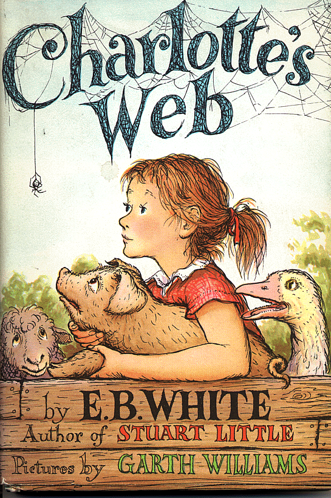{width="2.0191327646544184in"
height="3.0416666666666665in"}

In his classic and beloved novel, E. B. White tells the memorable story
of Wilbur, a little pig who becomes famous with the help of his clever
friend Charlotte and their chatty animal neighbours. As the runt of the
litter, Wilbur struggles to survive from the very beginning. Fern begs
her father, Mr. Arable, to raise Wilbur and nurse him to health. Fern
succeeds and Wilbur moves to Zuckerman Farm, where he learns the true
meaning of friendship from the wise grey spider Charlotte. When it
becomes apparent that Wilbur is being well fed for a reason, Charlotte
and Wilbur are determined to foil Mr. Zuckerman's plans. With the help
of Charlotte and her "terrific" webs, Templeton the rat, and other
barnyard friends, Wilbur becomes the prize-winning pig of the County
Fair and the most famous pig ever. Lessons of friendship, loyalty, and
truth bind this story together and show readers that friends come in all
shapes and sizes.

E. B. White

**AUTHOR NOTE**

**A Letter from E. B. White**

Where did the ideas for Charlotte and *Stuart Little* come from? Why did
E. B. White choose to write about a pig? Did his stories really happen?
Read the answers in this letter, which he wrote to all kids everywhere
shortly before his death.

Dear Reader:

I receive many letters from children and can\'t answer them all \--
there wouldn\'t be time enough in a day. That is why I am sending you
this printed reply to your letter. I\'ll try to answer some of the
questions that are commonly asked.

Where did I get the idea for *Stuart Little* and for *Charlotte\'s Web*?
Well, many years ago I went to bed one night in a railway sleeping car,
and during the night I dreamed about a tiny boy who acted rather like a
mouse. That\'s how the story of *Stuart Little* got started.

As for *Charlotte\'s Web*, I like animals and my barn is a very pleasant
place to be, at all hours. One day when I was on my way to feed the pig,
I began feeling sorry for the pig because, like most pigs, he was doomed
to die. This made me sad. So I started thinking of ways to save a pig\'s
life. I had been watching a big grey spider at her work and was
impressed by how clever she was at weaving. Gradually I worked the
spider into the story that you know, a story of friendship and salvation
on a farm. Three years after I started writing it, it was published. (I
am not a fast worker, as you can see.)

Sometimes I\'m asked how old I was when I started to write, and what
made me want to write. I started early \-- as soon as I could spell. In
fact, I can\'t remember any time in my life when I wasn\'t busy writing.
I don\'t know what caused me to do it, or why I enjoyed it, but I think
children often find pleasure and satisfaction in trying to set their
thoughts down on paper, either in words or in pictures. I was no good at
drawing, so I used words instead. As I grew older, I found that writing
can be a way of earning a living.

Some of my readers want me to visit their school. Some want me to send a
picture, or an autograph, or a book. And some ask questions about my
family and my animals and my pets. Much as I\'d like to, I can\'t go
visiting. I can\'t send books, either \-- you can find them in a
bookstore or a library. Many children assume that a writer owns (or even
makes) his own books. This is not true \-- books are made by the
publisher. If a writer wants a copy, he must buy it. That\'s why I
can\'t send books. And I do not send autographs \-- I leave that to the
movie stars. I live most of the year in the country, in New England.
From our windows we can look out at the sea and the mountains. I live
near my married son and three grandchildren.

Are my stories true, you ask? No, they are imaginary tales, containing
fantastic characters and events. In real life, a family doesn\'t have a
child who looks like a mouse; in real life, a spider doesn\'t spin words
in her web. In real life, a swan doesn\'t blow a trumpet. But real life
is only one kind of life \-- there is also the life of the imagination.
And although my stories are imaginary, I like to think that there is
some truth in them, too \-- truth about the way people and animals feel
and think and act.

Yours sincerely,

E. B. White

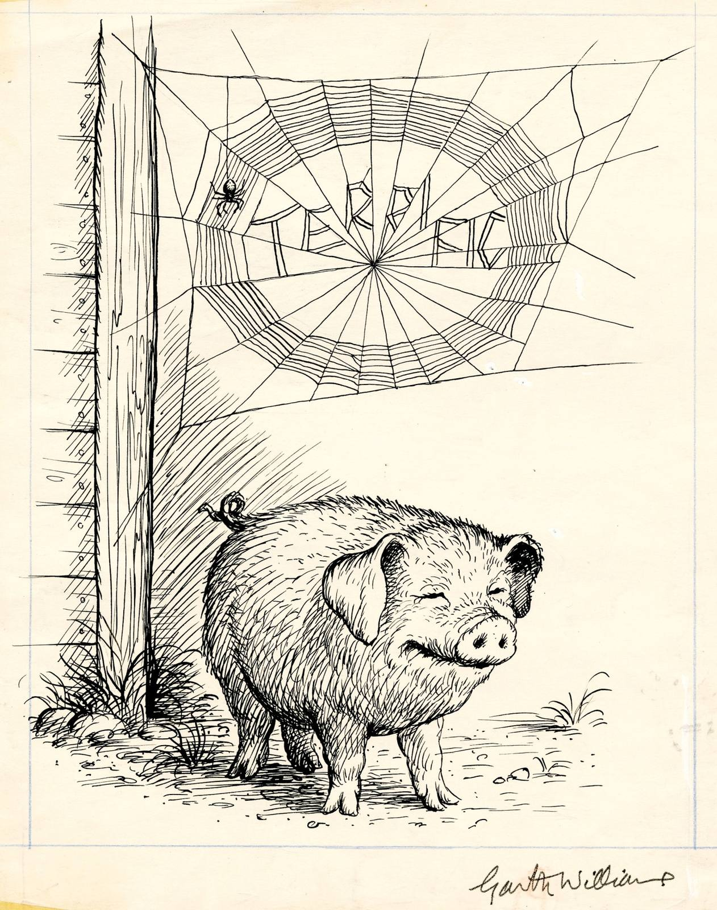{width="6.268055555555556in"
height="7.949944225721785in"}

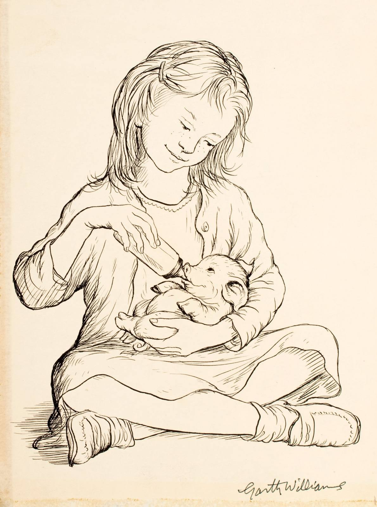{width="6.268055555555556in"
height="8.424266185476815in"}

**Charlotte's Web E.B.White**

**Chapter 1 Before Breakfast**

6 Readers

Narrator

Fern

Mrs Arable

Mr Arable

Avery

Teacher (one line)

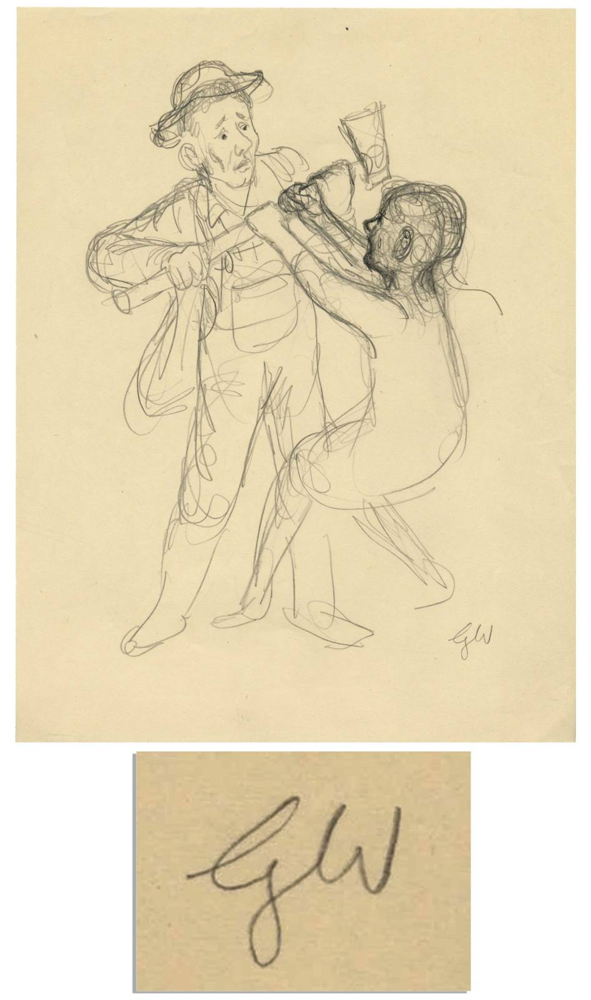{width="6.268055555555556in"
height="10.587931977252843in"}\
**Before Breakfast**

\"Where\'s Papa going with that axe?\" said Fern to her mother as they
were setting the table for breakfast.

\"Out to the hoghouse,\" replied Mrs. Arable. \"Some pigs were born last
night.\"

\"I don\'t see why he needs an axe,\" continued Fern, who was only
eight. \"Well,\" said her mother, \"one of the pigs is a runt. It\'s
very small and weak, and it will never amount to anything. So your
father has decided to do away with it.\"

\"Do away with it?\" shrieked Fern. \"You mean kill it? Just because
it\'s smaller than the others?\"

Mrs. Arable put a pitcher of cream on the table. \"Don\'t yell, Fern!\"
she said. \"Your father is right. The pig would probably die anyway.\"

Fern pushed a chair out of the way and ran outdoors. The grass was wet
and the earth smelled of springtime. Fern\'s sneakers were sopping by
the time she caught up with her father.

\"Please don\'t kill it!\" she sobbed. \"It\'s unfair.\"

Mr. Arable stopped walking.

\"Fern,\" he said gently, \"you will have to learn to control
yourself.\"

\"Control myself?\" yelled Fern. \"This is a matter of life and death,
and you talk about controlling myself.\" Tears ran down her cheeks and
she took hold of the ax and tried to pull it out of her father\'s hand.

\"Fern,\" said Mr. Arable, \"I know more about raising a litter of pigs
than you do. A weakling makes trouble. Now run along!\"

\"But it\'s unfair,\" cried Fern. \"The pig couldn\'t help being born
small, could it? If I had been very small at birth, would you have
killed me?\"

Mr. Arable smiled. \"Certainly not,\" he said, looking down at his
daughter with love. \"But this is different. A little girl is one thing,
a little runty pig is another.\"

\"I see no difference,\" replied Fern, still hanging on to the axe.
\"This is the most terrible case of injustice I ever heard of.\"

A queer look came over John Arable\'s face. He seemed almost ready to
cry himself.

\"All right,\" he said. \"You go back to the house and I will bring the
runt when I come in. I\'ll let you start it on a bottle, like a baby.
Then you\'ll see what trouble a pig can be.\"

When Mr. Arable returned to the house half an hour later, he carried a
carton under his arm. Fern was upstairs changing her sneakers. The
kitchen table was set for breakfast, and the room smelled of coffee,
bacon, damp plaster, and wood smoke from the stove.

\"Put it on her chair!\" said Mrs. Arable. Mr. Arable set the carton
down at Fern\'s place. Then he walked to the sink and washed his hands
and dried them on the roller towel.

Fern came slowly down the stairs. Her eyes were red from crying. As she
approached her chair, the carton wobbled, and there was a scratching
noise. Fern looked at her father. Then she lifted the lid of the carton.
There, inside, looking up at her, was the newborn pig. It was a white
one. The morning light shone through its ears, turning them pink.

\"He\'s yours,\" said Mr. Arable. \"Saved from an untimely death. And
may the good Lord forgive me for this foolishness.\"

Fern couldn\'t take her eyes off the tiny pig. \"Oh,\" she whispered.
\"Oh, look at him! He\'s absolutely perfect.\"

She closed the carton carefully. First she kissed her father, then she
kissed her mother. Then she opened the lid again, lifted the pig out,
and held it against her cheek. At this moment her brother Avery came
into the room. Avery was ten. He was heavily armed \-- an air rifle in
one hand, a wooden dagger in the other.

\"What\'s that?\" he demanded. \"What\'s Fern got?\"

\"She\'s got a guest for breakfast,\" said Mrs. Arable. \"Wash your
hands and face, Avery.\"

\"Let\'s see it!\" said Avery, setting his gun down. \"You call that
miserable thing a pig? That\'s a fine specimen of a pig \-- it\'s no
bigger than a white rat.\"

\"Wash up and eat your breakfast, Avery!\" said his mother. \"The school
bus will be along in half an hour.\"

\"Can I have a pig, too, Pop?\" asked Avery.

\"No, I only distribute pigs to early risers,\" said Mr. Arable. \"Fern
was up at daylight, trying to rid the world of injustice. As a result,
she now has a pig. A small one, to be sure, but nevertheless a pig. It
just shows what can happen if a person gets out of bed promptly. Let\'s
eat!\"

But Fern couldn\'t eat until her pig had had a drink of milk. Mrs.
Arable found a baby\'s nursing bottle and a rubber nipple. She poured
warm milk into the bottle, fitted the nipple over the top, and handed it
to Fern. \"Give him his breakfast!\" she said.

A minute later, Fern was seated on the floor in the corner of the
kitchen with her infant between her knees, teaching it to suck from the
bottle. The pig, although tiny, had a good appetite and caught on
quickly.

The school bus honked from the road.

\"Run!\" commanded Mrs. Arable, taking the pig from Fern and slipping a
doughnut into her hand. Avery grabbed his gun and another doughnut.

The children ran out to the road and climbed into the bus. Fern took no
notice of the others in the bus. She just sat and stared out of the
window, thinking what a blissful world it was and how lucky she was to
have entire charge of a pig. By the time the bus reached school, Fern
had named her pet, selecting the most beautiful name she could think of.

\"It\'s name is Wilbur,\" she whispered to herself.

She was still thinking about the pig when the teacher said: \"Fern, what
is the capital of Pennsylvania?\"

\"Wilbur,\" said Fern, dreamily. The pupils giggled. Fern blushed.

**Charlotte's Web E,B.White**

**Chapter 23 from Last Day**

4 Readers

Narrator

Wilbur

Charlotte

Templeton

**Charlotte's Web E.B.White**

**Chapter 21 Last Day \**

Charlotte and Wilbur were alone. The families had gone to look for Fern.
Templeton was asleep. Wilbur lay resting after the excitement and strain
of the ceremony. His medal still hung from his neck; by looking out of
the corner of his eye he could see it.

"Charlotte," said Wilbur after awhile, "why are you so quiet?"

"I like to sit still," she said. "I've always been rather quiet."

"Yes, but you seem specially so today. Do you feel all right?"

"A little tired, perhaps. But I feel peaceful. Your success in the ring
this morning was, to a small degree, my success. Your future is assured.
You will live, secure and safe, Wilbur. Nothing can harm you now. These
autumn days will shorten and grow cold. The leaves will shake loose from
the trees and fall. Christmas will come, and the snows of winter. You
will live to enjoy the beauty of the frozen world, for you mean a great
deal to Zuckerman and he will not harm you, ever. Winter will pass, the
days will lengthen, the ice will melt in the pasture pond. The song
sparrow will return and sing, the frogs will awake, the warm wind will
blow again. All these sights and sounds and smells will be yours to
enjoy, Wilbur---this lovely world, these precious days..."

Charlotte stopped. A moment later a tear came to Wilbur's eye. "Oh,
Charlotte," he said. "To think that when I first met you I thought you
were cruel and bloodthirsty!"

When he recovered from his emotion, he spoke again.

"Why did you do all this for me?" he asked. "I don't deserve it. I've
never done anything for you."

"You have been my friend," replied Charlotte. "That in itself is a
tremendous thing. I wove my webs for you because I liked you. After all,
what's a life, anyway? We're born, we live a little while, we die. A
spider's life can't help being something of a mess, with all this
trapping and eating flies. By helping you, perhaps I was trying to lift
up my life a trifle. Heaven knows anyone's life can stand a little of
that."

"Well," said Wilbur. "I'm no good at making speeches. I haven't got your
gift for words. But you have saved me, Charlotte, and I would gladly
give my life for you---I really would."

"I'm sure you would. And I thank you for your generous sentiments."

"Charlotte," said Wilbur. "We're all going home today. The Fair is
almost over. Won't it be wonderful to be back home in the barn cellar
again with the sheep and the geese? Aren't you anxious to get home?"

For a moment Charlotte said nothing. Then she spoke in a voice so low
Wilbur could hardly hear the words.

"I will not be going back to the barn," she said. Wilbur leapt to his
feet. "Not going back?" he cried. "Charlotte, what are you talking
about?"

"I'm done for," she replied. "In a day or two I'll be dead. I haven't
even the strength enough to climb down into the crate. I doubt if I have
enough silk in my spinnerets to lower me to the ground."

Hearing this, Wilbur threw himself down in an agony of pain and sorrow.
Great sobs wracked his body. He heaved and grunted with desolation.
"Charlotte," he moaned. "Charlotte! My true friend!"

"Come now, let's not make a scene," said the spider. "Be quiet, Wilbur.
Stop thrashing about!"

"But I can't stand it," shouted Wilbur. "I won't leave you here alone to
die. If you're going to stay here I shall stay, too."

"Don't be ridiculous," said Charlotte. "You can't stay here. Zuckerman
and Lurvy and John Arable and the others will be back any minute now,
and they'll shove you into that crate and away you'll go. Besides, it
wouldn't make any sense for you to stay. There would be no one to feed
you. The fair Ground will soon be empty and deserted."

Wilbur was in a panic. He raced round and round the pen. Suddenly he had
an idea---he thought of the egg sac and the five hundred and fourteen
little spiders that would hatch in the spring. If Charlotte herself was
unable to go home to the barn, at least he must take her children along.

Wilbur rushed to the front of his pen. He put his front feet up on the
top board and gazed around. In the distance he saw the Arables and the
Zuckermans approaching. He knew he would have to act quickly.

"Where's Templeton?" he demanded.

"He's in that corner, under the straw, asleep," said Charlotte.

Wilbur rushed over, pushed his strong snout under the rat, and tossed
him into the air.

"Templeton!" Screamed Wilbur. "Pay attention!"

The rat, surprised out of a sound sleep, looked first dazed then
disgusted.

"What kind of monkeyshine is this?" he growled. "Can't a rat catch a
wink of sleep without being rudely popped in the air?"

"Listen to me!" cried Wilbur. "Charlotte is very ill. She only has a
short time to live. She cannot accompany us home, because of her
condition. Therefore, it is absolutely necessary that I take her egg sac
with me. I can't reach it, and I can't climb. You are the only one that
can get it. There is not a second to be lost. The people are
coming---they'll be here in no time. Please, please, please, Templeton,
climb up and get the egg sac."

The rat yawned. He straightened his whiskers. Then he looked up at the
egg sac.

"So!" he said, in disgust. "So, it's old Templeton to the rescue again,
is it? Templeton do that, Templeton please run down to the dump and get
me a magazine clipping, Templeton please lend me a piece of string so I
can spin a web."

"Oh, hurry!" said Wilbur. "Hurry up, Templeton!"

But the rat was in no hurry. He began imitating Wilbur's voice.

"So, it's 'Hurry up, Templeton,' is it?" he said. "Ho, ho. And what
thanks do I ever get for these services, I would like to know? Never a
kind word for old Templeton, only abuse and wisecracks and snide
remarks. Never a kind word for a rat."

"Templeton," said Wilbur in desperation, "if you don't stop talking and
get busy, all will be lost, and I will die of a broken heart. Please
climb up!" Templeton lay back in the straw. Lazily he placed his
forepaws behind his head and crossed his knees, in an attitude of
complete relaxation.

"Die of a broken heart," he mimicked. "How touching! My, my! I notice
that it's always me you come to when in trouble. But I've never heard of
anyone's heart breaking on my account. Oh, no. Who cares anything about
old Templeton?"

"Get up!" screamed Wilbur. "Stop acting like a spoiled child!"

Templeton grinned and lay still. "Who made trip after trip to the dump?"
he asked. "Why, it was old Templeton! Who saved Charlotte's life by
scaring that Arable boy away with a rotten goose egg? Bless my soul, I
believe it was old Templeton. Who bit your tail and got you back on your
feet this morning after you had fainted in front of the crowd? Old
Templeton. Has it occured to you that I'm sick of running errands and
doing favors? What do you think I am, anyway, a rat-of-all-work?

Wilbur was desperate. The people were coming. And the rat was failing
him. Suddenly he remembered Templeton's fondness for food.

"Templeton," he said. "I will make you a solemn promise. Get Charlotte's
egg sac for me, and from now on I will let you eat first, when Lurvy
slops me. I will let you have your choice of everything in the trough
and I won't touch a thing until you're through."

The rat sat up. "You mean that?" he said.

"I promise. I cross my heart."

"All right, it's a deal," said the rat. He walked to the wall and
started to climb. His stomach was still swollen from last night's gorge.
Groaning and complaining, he pulled himself slowly to the ceiling. He
crept along till he reached the egg sac. Charlotte moved aside for him.
She was dying, but she still had strength enough to move a little. Then
Templeton bared his long ugly teeth and began snipping the treads that
fastened the sac to the ceiling. Wilbur watched from below.

"Use extreme care!" he said. "I don't want a single one of those eggs
harmed."

"Thith thtuff thicks in my mouth," complained the rat. "It'th worth than
caramel candy."

But Templeton worked away at the job, and managed to cut the sac adrift
and carry it to the ground, where he dropped it in front of Wilbur.
Wilbur heaved a great sigh of relief.

"Thank you, Templeton," he said. "I will never forget this as long as I
live."

"Neither will I," said the rat, picking his teeth. "I feel as though I'd
eaten a spool of thread. Will, home we go!"

Templeton crept into the crate and buried himself in the straw. He got
out of sight just in time. Lurvy and John Arable and Mr. Zuckerman came
along at that moment, followed by Mrs. Arable and Mrs. Zuckerman and
Avery and Fern. Wilbur had already decided how he would carry the egg
sac---there was only one way possible. He carefully took the little
bundle in his mouth and held it there on top of his tongue. He
remembered what Charlotte had told him---that the sac was waterproof and
strong. It felt funny on his tongue and made him drool a bit. And of
course he couldn't say anything. But as he was being shoved into the
crate, he looked up at Charlotte and gave her a wink. She knew he was
saying good-bye in the only way he could. And she knew her children were
safe.

"Good-bye!" she whispered. Then she summoned all her strength and waved
one of her front legs at him.

She never moved again. Next day, as the Ferris wheel was being taken
apart and the race horses were being loaded into vans and the
entertainers were packing up their belongings and driving away in their
trailers, Charlotte died. The Fair Grounds were soon forlorn. The
infield was littered with bottles and trash. Nobody, of the hundreds of
people what had visited the Fair, knew that a grey spider had played the
most important part of all. No one was with her when she died.

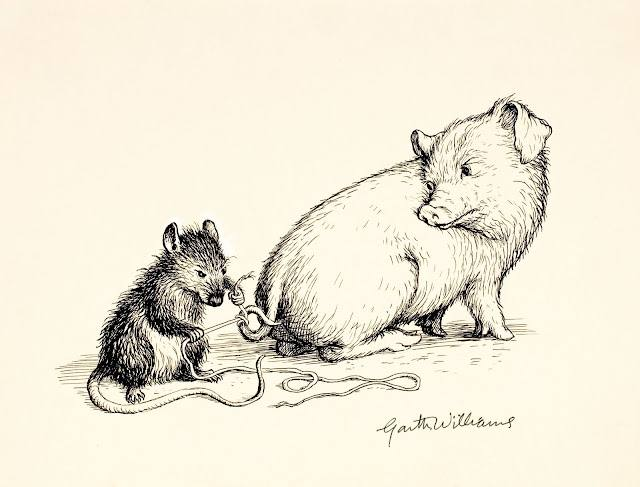{width="6.268055555555556in"
height="4.76959864391951in"}

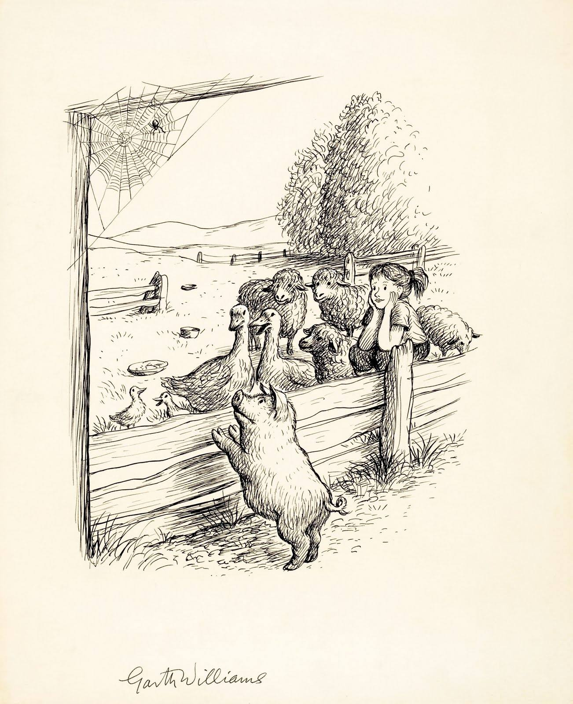{width="6.268055555555556in"
height="7.702679352580927in"}

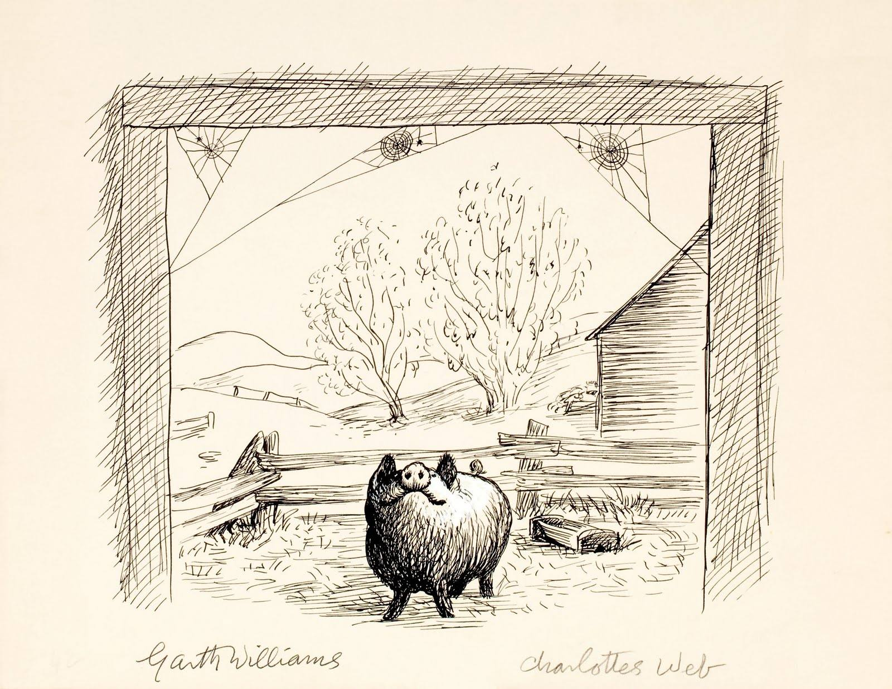{width="6.268055555555556in"
height="4.845990813648294in"}

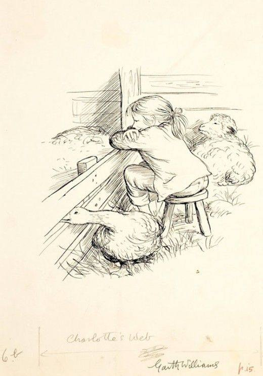{width="5.416666666666667in"
height="7.729166666666667in"}

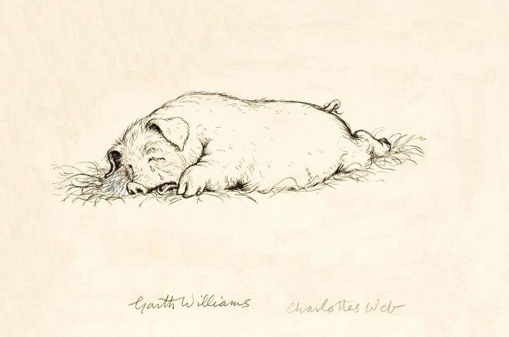{width="6.268055555555556in"
height="4.155993000874891in"}

{width="4.53125in"
height="5.208333333333333in"}

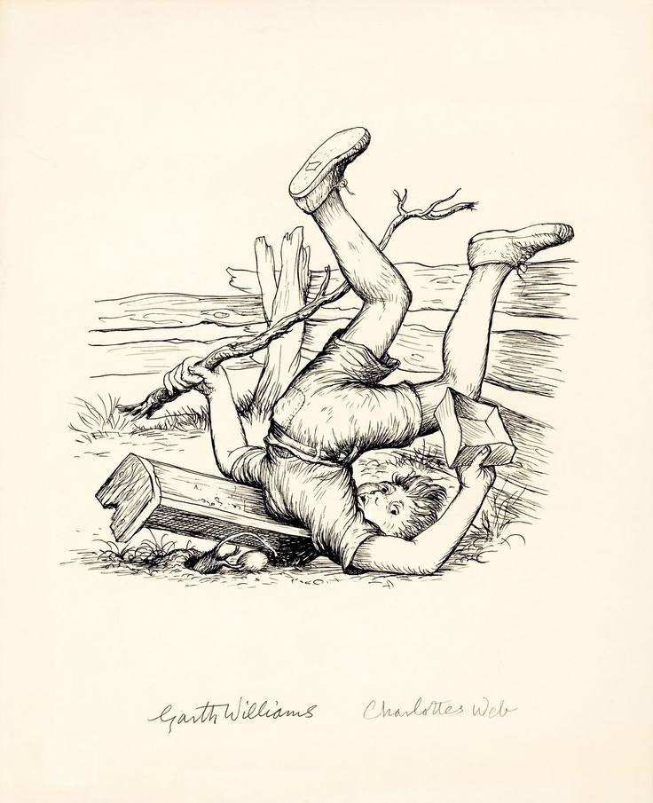{width="6.268055555555556in"
height="7.707323928258968in"}

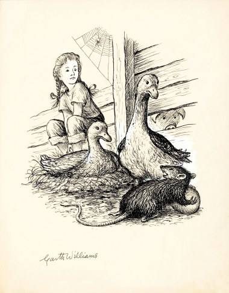{width="3.9583333333333335in"
height="5.0625in"}

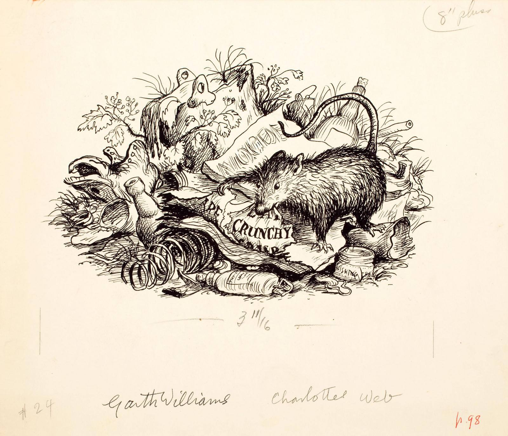{width="6.268055555555556in"
height="5.390528215223097in"}

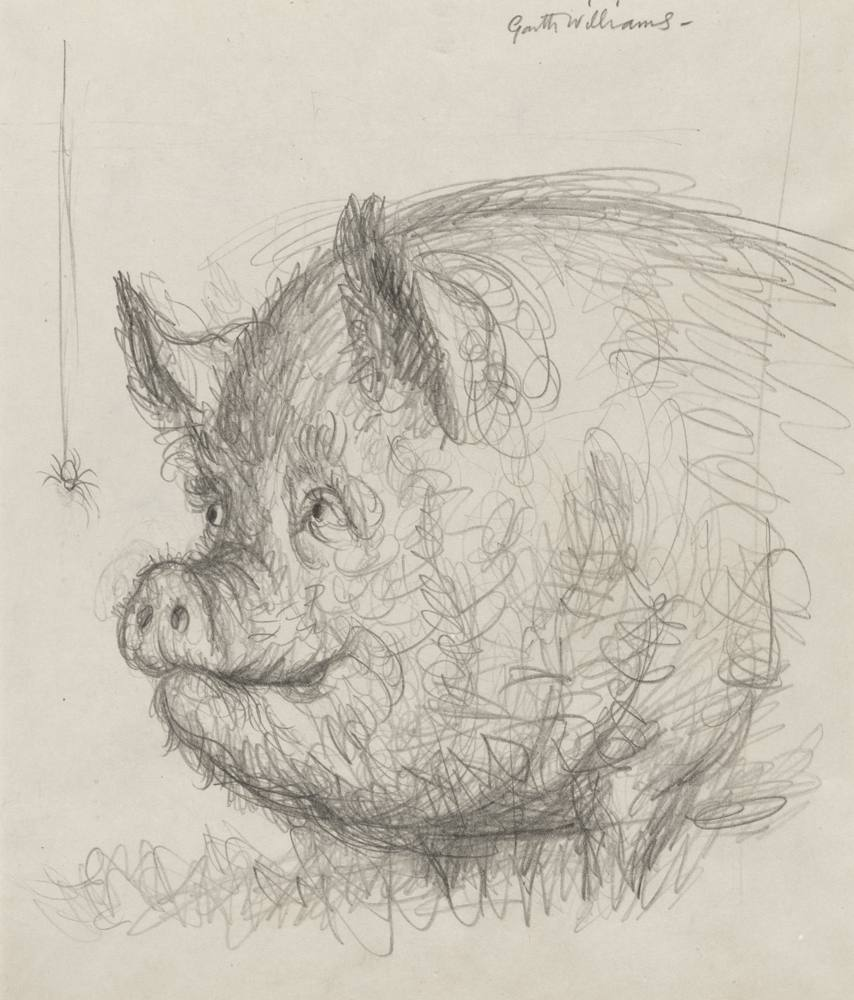{width="6.268055555555556in"
height="7.339643482064742in"}

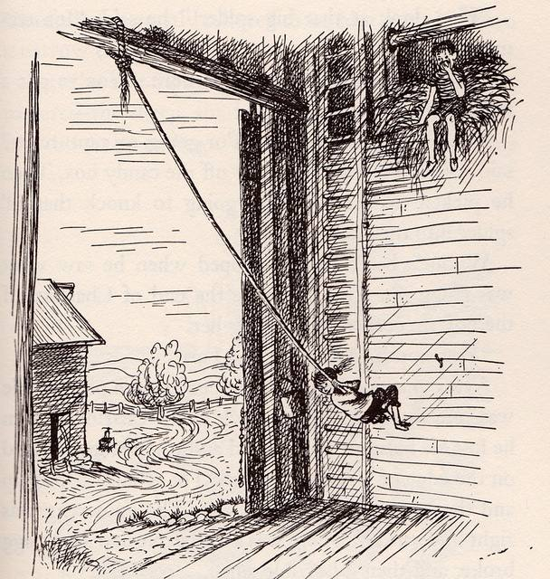{width="6.268055555555556in"
height="6.597952755905512in"}

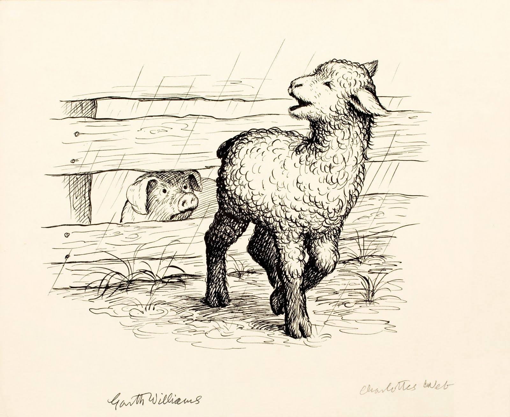{width="6.268055555555556in"
height="5.13588801399825in"}

**CHARLOTTE'S WEB: A Story about Friendship**

A lesson by Allison Dalton

Center for the Advancement of Ethics and Character

**AWARENESS**

Making a new friend can be difficult and a little scary, but it is
something we all experience. Appeal to students' firsthand experience in
making and being a friend. Ask students to remember a time when they
were in a new situation surrounded by people they did not know. Ask
students to reflect on the situation aloud as a group or individually in
writing. To guide them, ask:

• How did you feel?

• Were the people around you kind and welcoming or mean and unfriendly?

• How did that affect your attitude?

• Why can it be scary to meet new people and make new friends?

• Why is it important to welcome others when they are in a new
situation?

Read students the following passage about first impressions from page
41.

*Charlotte stood quietly over the fly, preparing to eat it. Wilbur lay
down and closed his eyes. He was tired from his wakeful night and from
the excitement of meeting someone for the first time. A breeze brought
him the smell of clover---the sweet-smelling world beyond his fence.*

*"Well," he thought, "I've got a new friend, all right! But what a
gamble friendship is! Charlotte is fierce, brutal, scheming,
bloodthirsty---everything I don't like. How can I learn to like her,
even though she is pretty and, of course, clever?"*

Wilbur was merely suffering the doubts and fears that often go with
finding a new friend. In good time he was to discover that he was
mistaken about Charlotte. Underneath her rather bold and cruel exterior,
she had a kind heart, and she was to prove loyal and true to the very
end.

Discuss the passage with students, asking:

• Did you ever have an experience like this, in which you thought of a
person as

mean or strange or scary at first, but later found out that he or she
was very nice?

• Can you learn to like someone you originally disliked? How?

• What do you think the speaker means by "What a gamble friendship is!"
(p. 41)? How can friendship be a gamble?

• What happens when people draw conclusions based on first impressions?

Keeping a friend is as important as making one. Read the students the
following quote from page 115: "Friendship is one of the most satisfying
things in the world." Ask students to respond with their thoughts.

• How can a friendship be satisfying?

• What makes a friendship so enjoyable?

• Is friendship always easy? Does it make a friendship better or worse
when friends face difficulties?

• There are many types of friendships. List different types (for
example,

friendships in the neighbourhood, school friends, friendships between
siblings,

friends from different out-of-school activities). How are these types of

friendships different from each other?

• In your experience, what is the most satisfying type of friendship?
Does that

mean all the other types are not important?

**UNDERSTANDING**

Build understanding of the plot, characters, and themes of Charlotte's
Web by discussing them as you read. Use these questions as a guide.

Chapters 1 and 2

Discuss the way Fern and Wilbur's friendship began.

• How was Fern a friend to Wilbur before she had even met him?

• Who or what tries to get in the way of their friendship? Why?

Mr. Arable wants to kill Wilbur because he is a runt, but Fern insists
this is unfair. "This is the most terrible case of injustice I ever
heard of," she announces on page 3. Ask the students the following
questions:

• What is a runt?

• What does "injustice" mean?

• Why does Fern think it would be an injustice to kill Wilbur?

• Is Fern right, or should Mr. Arable have been allowed to kill the pig?
Why or

why not?

Fern and Wilbur's friendship is strengthened once they finally meet.

• What does Fern do now that makes her a good friend to Wilbur?

• How does Wilbur show his friendship in return?

Chapters 3 and 4

Discuss the episode in which Wilbur escapes from the barn.

• Did the goose give Wilbur good advice?

• When all the animals were suggesting different actions, what did
Wilbur choose to do?

• Why didn't he listen to them?

• Did Wilbur make a good choice? Why or why not?

• Should we always listen to the advice that friends give us? Should we
listen

sometimes? Why or why not? How do we know when their advice is good or

bad?

At Zuckerman's barn, Wilbur has trouble making friends. Discuss Wilbur's
troubles.

• Wilbur feels bored and lonely at Zuckerman's barn, even though there
are many more animals there to keep him company. Why? What is the
difference between being lonely and being alone?

Wilbur makes a schedule for the day. He is planning to eat, sleep, dig a
hole,

watch the flies, stand and think, and scratch his back. It sounds like a
busy day

for a little pig, but he is still bored. Why aren't these things enough
to make him

happy?

• Wilbur tries to find a playmate. First he asks the goose to play with
him, then he asks the lamb. Why won't the lamb play with Wilbur? Do the
lamb's reasons

make sense?

• When Wilbur asks Templeton to play with him, the rat answers, "Play? I
hardly know the meaning of the word....I never do those things if I can
avoid them...I prefer to spend my time eating, gnawing, spying, and
hiding. I am a glutton but not a merrymaker" (pp. 29-30).

What is a glutton? What is a merrymaker?

• Does Templeton's life sound like fun? Why or why not? What is his life
missing?

Close to bedtime, Wilbur's horrible day gets a little better when a
voice calls down to him that it will be his friend.

• How do you think Wilbur feels when he hears this?

• Who do you think the speaker might be?

• "I've watched you all day and I like you," the voice says (p. 31).
What did

Wilbur say or do during the day that would have shown the speaker that
he would make a good friend?

Chapters 5, 6, and 7

When Wilbur finally meets his new friend, he finds out that they are
very different.

• List some of Charlotte and Wilbur's differences.

• What are some of the things that Wilbur dislikes about Charlotte, or
some of the things she does that scare him?

• What are some of her good qualities, or what does she do that Wilbur
likes?

• Does Charlotte fit in at the barn? How do the other animals react to
her?

All the animals react differently to the bad news that the old sheep
gives Wilbur.

• What does the old sheep think about the farmers' plan to kill Wilbur?
Why?

• How does Wilbur react to the news? How does Charlotte react? Fern?
Why?

Chapters 8 and 9

Mr. and Mrs. Arable are very surprised when they hear Fern talk about
the animals in Zuckerman's barn as if they could speak.

• Why do you think Fern has the ability to understand the animals?

• Why is Mrs. Arable worried about her daughter?

• Mr. Arable does not seem as worried as his wife. Why do you think he
is less

worried?

Wilbur tries to be like his best friend by spinning a web.

• Why does Wilbur want to learn to spin a web?

• What does Charlotte tell him when he fails the second time?

• Even though Wilbur does not learn how to spin a web, what does he
learn instead?

Wilbur is still worried about being killed at Christmastime.

• Why do you think Charlotte wants to think up a plan on her own? Should
she let Wilbur help her with the plan?

• How is Wilbur helping her by staying healthy and not worrying?

Chapters 10 and 11

Charlotte has some interesting ideas. She thinks that "people are not as
smart as bugs" (67), and that they are very gullible.

• What does "gullible" mean?

• Why does she think this?

• Are people truly gullible? Have you ever acted gullibly? Did anyone
take

advantage of you?

• Predict how Charlotte might take advantage of this quality.

When Avery tries to capture Charlotte things start to go badly but turn
out well in the end.

• Why does Avery want to capture Charlotte?

• Why doesn't he understand that he should leave Charlotte alone?

• How does Fern show friendship toward Charlotte?

• Does Avery eventually get what he deserved?

Charlotte finally reveals her plan to save Wilbur.

• How will writing a word on a spider's web save Wilbur from being
killed?

• How do the Zuckermans, Lurvy, the minister, and the people from town
react to the news of Charlotte's web? Why?

• How does Wilbur react? Why?

• What does Fern think of all the commotion?

• Has Wilbur changed at all? If he has not changed, why are people
treating him differently?

• Who continues to treat him the same as they had before?

• List the positive and negative results of Charlotte's web. Do some
results fall into both categories? (Perhaps a Venn diagram could be
used.)

Chapters 12 and 13

At the barn meeting, all the animals pitch in to help save Wilbur.

• Why do the animals want to save him now, even though most of them were
not

going to attempt anything to save him when they first heard the old
sheep's bad

news?

• Why does Templeton agree to help Charlotte and Wilbur? What do you
think of his reasons?

Other characters are changing, too.

• How are his friends' efforts to save him changing Wilbur? What new
things does Wilbur do? How does he feel different?

• Charlotte's next word will be radiant. What does radiant mean? Why
does

Wilbur feel radiant?

• Has Charlotte changed? Why or why not? What does she do that shows she
haschanged or remained the same?

• Charlotte's friendship with Wilbur has become very similar to Fern's
friendship with him just after he was born. How are these two
friendships alike? How are they different?

Chapters 14, 15, and 16

Dr. Dorian tells Mrs. Arable that "if Fern says the animals in
Zuckerman's barn talk, I am quite ready to believe her" (p. 110).

• Earlier in the book, who else said something similar about believing
the animals

could speak?

• Why does Mrs. Arable dislike Fern's friendship with the animals in
Zuckerman's barn?

• Why does Mrs. Arable think that Avery, who is always getting into
trouble and

getting hurt, is healthier than Fern?

• "Children pay better attention than grownups," says Dr. Dorian (p.
110). Is this

true? Why or why not? Who pays better attention, Fern or Mrs. Arable?
Why?

"It's hard to believe that \[Wilbur\] was the runt of the litter," says
Mr. Arable (p. 126).

• Why is it so hard to believe?

• Should Mr. Arable be amazed?

"You'll get some extra good ham and bacon, Homer, when it comes time to
kill that pig,"

Mr. Arable announces next(p. 126).

• How does Wilbur react? The Zuckermans? Fern? Avery? Why?

• Why does Mr. Arable's comment make what happens at the fair especially
important?

Chapters 17 and 18

Charlotte sees another pig in the stall next to Wilbur, and drops in on
him to investigate.

• What is the first thing Charlotte notices about Uncle?

• What happens when she tries to talk to him?

• Charlotte reports to Wilbur, "I took quite a dislike to him in our
brief interview," (p. 135). Do you think that Uncle is as rude and
unlikable as Charlotte believes him to be? Why did she dislike him? Is
it really because of his personality, or is there more to it?

• Why do Charlotte and Wilbur think that Uncle will be tough competition

tomorrow? What kind of qualities do you think the pigs will be judged
on? Is

Uncle really more likely to win than Wilbur? The last word Charlotte
will spin into her web will be "humble."

• What does "humble" mean?

• Is Wilbur truly humble?

• Why is it good for Wilbur to be humble?

Could being humble help him to win the prize?

• Are any of the other characters humble as

well? What do they do or what qualities do they

have which show they are humble? Which characters are not humble? How do

they show this?

Something is happening to Charlotte.

• How is Charlotte's behavior different from before?

• Have any of the other characters noticed this?

• What do you think is happening to her?

• What do you think the masterpiece Charlotte is going to show Wilbur in
the

morning will be?

Chapters 19 and 20

Everyone was about to give up when they saw the blue ribbon on Uncle's
stall door, but

soon they learned that Wilbur won a special prize.

• How does Wilbur react when Templeton tells him about Uncle's blue
ribbon?

• How do the Zuckermans and the Arables react? Why do they seem more
upset

than Wilbur, if they will not be eaten for losing?

• What does Fern do when she hears that Wilbur has not won? Why? Did
this

surprise you? Why or why not?

• How do the characters' reactions change when they hear the man on the

loudspeaker announce the special award?

• Who does not stay to watch Wilbur receive his award? Why not?

When Charlotte heard the announcer's words, she thought "this was her
hour of triumph" (p. 157).

• How is it Charlotte's hour of triumph when Wilbur is the one who won
the

award? Could Wilbur have won the prize without the help of his friends?

• This day was also "the greatest moment in Mr. Zuckerman's life," (p.
160). Why

is that?

• Who else is affected because Wilbur won the prize?

Templeton does something unusual in chapter 20.

• What is the out of character thing he does?

• Did you expect him to help Wilbur even though he did not have to?

• Why do you think he did it?

Chapters 21 and 22

Templeton climbs up the stall to get Charlotte's egg sac for Wilbur, but
only after Wilber promises to let him eat first for the rest of their
lives.

• Has Templeton learned anything from Wilbur and Charlotte?

Charlotte and Wilbur have one last talk before she dies.

• "Why did you do all this for me?" Wilbur asks Charlotte (p. 164). What
was her

answer?

• Wilbur tells Charlotte that if she will stay at the fair, he will
stay, too, but

Charlotte tells him to go home to the barn. Does Wilbur make the right
decision

by leaving? Why or why not?

• Charlotte dies at the fairground, all by herself. Do you think that
she was lonely? Was she ready to go? How did that affect her attitude
toward her solitary death?

After Charlotte's death, things continue to change, but some stay the
same.

• What changes on the farm?

• How does Wilbur continue to show his friendship for Charlotte, even
though she is no longer alive?

• How does Wilbur feel when the spiders begin to hatch? When so many of
them

leave and float away? When he discovers that three are left?

• "None of the new spiders ever quite took \[Charlotte's\] place in
\[Wilbur's\] heart," (p. 184). Is this good or bad? Will remembering
Charlotte forever make Wilbur happy or keep him sad about her death?

• Fern has left Wilbur as well. Does this upset him, or does he accept
it? Why?

**REFLECTION**

The following prompts can be used for further class discussion or as
writing assignments.

Tracing a friendship

Charlotte's Web follows a friendship from its beginning to its end,
including all the steps in between. Instruct students to choose either
Wilbur and Fern's friendship or Wilbur and Charlotte's friendship, and
trace the way it grows and changes over the course of the story. How did
the friendship begin? Do the two characters grow closer or drift apart?

Why? What major events prompt these changes? How does the friendship
end? Do the characters forget each other afterwards, or do they keep
some kind of connection? This activity could be completed in essay form
or as a timeline illustrating key points in the friendship.

The power of helping others

Before Charlotte dies, she and Wilbur have one last important
conversation. They discuss their friendship and why Charlotte spent so
much time and effort helping Wilbur. At one point, Charlotte tells her
friend. "By helping you, perhaps I was trying to lift up my life a
little. Heaven knows anyone's life can stand a little of that" (p. 164).
What does Charlotte mean by this statement? How can helping a friend
"lift up" the helper's life?

OR

Templeton is a character who would not understand Charlotte's statement
at all. "The rat had no morals, no conscience, no scruples, no
consideration, no decency, no milk of rodent kindness, no compunctions,
no higher feeling, no friendliness, no anything" (p. 46). What would the
barn be like if all the animals were like Templeton?

First impressions

When Charlotte meets Uncle at the fair, she immediately dislikes him.
Ask students to remember your earlier conversation on this topic.
Charlotte says that she dislikes Uncle's personality, and that she finds
him to be "too familiar, too noisy, and he cracks weak jokes" (p. 135).
Charlotte dislikes him for another reason, as well: because he is
Wilbur's competition. Should Charlotte immediately dislike him because
he is the competition?

Invite students to apply this situation to their own lives. Have they
ever been in a similar situation? Ask them to describe a time when they
had originally disliked someone without getting to know them and later
found out that the person would make a good friend.

Growing apart

After Charlotte died, Wilbur loved her children and grandchildren, but
"none of the new spiders ever took \[Charlotte's\] place in his heart"
(p. 184). Fern grew up, discovered other human friends, and did not
spend time in the barn any longer, but Wilbur remembered her fondly,
too. Does remembering old friends get in the way of making new friends?
Should we forget old friends who we

grow apart from or who move away? Why or why not?

Reflections on friendship

Charlotte taught Wilbur a great deal about how to make and be a friend.
What has Wilbur learned from his friendship with Charlotte? How does
this change the way he acts as a friend to the other animals on the farm
after Charlotte is gone? How does it affect his ability and desire to
make friends in the future? What will Wilbur look for in a friend, and
how will he try to act towards one? What have you learned about
friendship from Charlotte and Wilbur?
