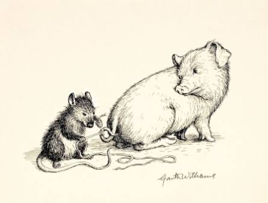
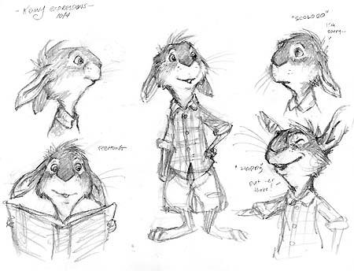
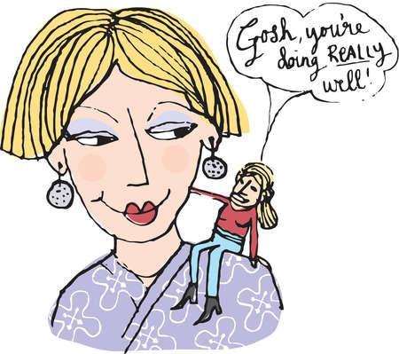
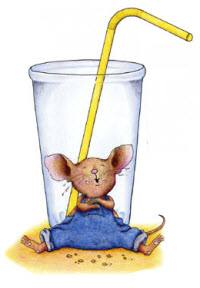
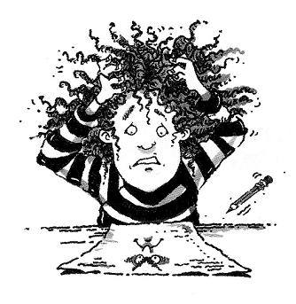
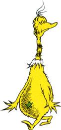

> **Voice**
>
> 
>
> **Contents**

**VOICE**

**Author's Voice Character's Voice**

Writer's Personality How Character:

Acts

Unique Thinks

Feelings & Emotions Speaks Lively Words & Attitude

Connects

Clear purpose

Thoughts

Tone

**Influenced by:**

Reading, Reading, Reading

Writing, Writing, Writing

Topic

Passion

Show Don't Tell

Angle e.g.

Humour

Seriousness

Sarcasm

> Mysteriousness
>
> Opinions
>
> Supported by Details/Reasons
>
> Audience
>
> Genre
>
> **Strengthened by All Writing Craft**

Word Choice

Verbs convey voice

Punctuation

Fluency

Rhythm/flow

Perspective

Point of View

> **Narrative Voice**
>
> First Person
>
> Second Person
>
> Third Person

**VOICE -- CONTENTS**

**Voice 1**

What is Voice?

> Teach ...
>
> Today you are you ...
>
> Voice: A Definition for Primary Students
>
> Show Don't Tell
>
> Voice -- Teaching
>
> Mentor Texts

**Voice 2**

Voice Revisited

Mentor Texts

**Voice 3**

Mentor Texts

**Voice 4 -- Voice & Emotion**

> The Importance of Voice
>
> Voice: Strong Voice and Emotion
>
> Chart: You Know Writing has Voice if ...
>
> Mentor Texts

**Voice 5 - Voice & Personification**

Mentor Texts

**Voice 6 - Voice & Personification 2**

Mentor Texts

**Voice 7 -- Voice & Personification 3**

Mentor Texts

**Voice 8 - Inner Voice**

Mentor Texts

**Voice 9 - Narrative Voice -- Novels**

Mentor Texts

**Voice 10 Narrative Voice**

> Voice
>
> Narrative Voice
>
> First Person
>
> Mentor Texts
>
> Third Person
>
> Mentor Texts

**Voice 11 Narrative Voice -- Perspective 2**

Second Person Point of View

Mentor Texts

**Voice 12 Narrative Voice -- Perspective 3**

Writing using 2^nd^ Person

The Narrative Voice that Tells the Story

Mentor Texts

**Voice 13 Narrative Voice - Perspective 4**

Second Person

Mentor Texts

**Voice 14 Voice in Non-Fiction**

> Voice
>
> Voice in Informational Text
>
> Mentor Texts

**Voice 15 Secondary**

Voice

Mentor Texts

**Voice 16 Voice & Personification 4**

Mentor Texts

**Voice 17 Voice in Persuasive Text**

> Road Map for Persuasive Writing
>
> Writing with Voice
>
> Mentor Texts

**Voice 18 Dr Seuss**

Mentor Texts

**Voice 19**

Writing with Voice

Mentor Texts

**Voice**

What is Voice?

Teach ...

Today you are you ...

Voice: A Definition for Primary Students

Show Don't Tell

Voice -- Teaching

The Best Story Eileen Spinelli

Voices in the Park Anthony Browne

A Walk in the Park Anthony Browne

Once Upon a Cool Motorcycle Dude Kevin O'Malley

Some Things Are Scary Florence Heide

Owl Moon Jane Yolen

Romeow & Drooliet Nina Laden

Larf Ashley Spires

The Prince of Butterflies Bruce Coville

The Bird House Cynthia Rylant

Voi**ce 2**

Voice Revisited

Neil Gaiman quote

The Relatives Came Cynthia Rylant

Let the Celebrations BEGIN! Margaret Wild

Rose Blanche Roberto Innocenti

Miss Rumphius Barbara Cooney

Dragons Love Tacos Adam Rubin

Postcards Simms Taback

Edward and the Pirates David McPhail

Mr George Baker Amy Hest

A Symphony of Whales Steve Schuch

**Voice is the author's fingerprint on the page.  By using voice the
reader feels more in touch with the writer's emotions, opinions, and
personality.**

**Voice 3**

My Rotten Red-Headed Older Brother Patricia Polacco

Touch the Sky Ann Malaspina

Dear Tooth Fairy Pamela Duncan Edwards

Testing Miss Malarkey Judy Finchler

The Paper Bag Princess Robert Munsch

No Bears Meg McKinlay

Buffalo Music Tracey Fern

Someday Eileen Spinelli

Hattie the Bad Jane Devlin

Gila Monsters meet you at the Airport Marjorie Sharmat

The Recess Queen Alexis O'Neill

When I Was Little Jamie Lee Curtis

When I Was Five Arthur Howard

Fireflies Julie Brinckloe

Amazing Grace Mary Hoffman

**Voice 4 -- Voice & Emotion**

The Importance of Voice

Voice: Strong Voice and Emotion

Chart: You Know Writing has Voice if ...

Mentor Texts:

I am the Dog I am the Cat Donald Hall

That Summer Tony Johnston

The Memory String Eve Bunting

Jangles David Shannon

Alice the Fairy David Shannon

My Big Dog Janet Stevens

Today I Feel Silly Jamie Lee Curtis

When Sophie gets Angry Molly Bang

The Lady in the Box Ann McGovern

Fly Away Home Eve Bunting

Gleam and Glow Eve Bunting

The Flat Rabbit Bardur Oskarsson

The Harmonica Tony Johnston

Crab Moon Ruth Horowitz

Knots on a Counting Rope Bill Martin Jr. and John Archambault

**Voice 5**

**Voice & Personification**

Little Red Writing Joan Holub

I Don't Want to be a Frog Dev Petty

I Stink Kate McMullan

Sarah Cynthia Sylvia Stout Shel Silverstein

The Day the Crayons Quit Drew Daywelt

Chester Melanie Watt

Creepy Carrots Aaron Reynolds

Two Bad Ants Chris Van Allsburg

Wolf Becky Bloom

The Spider and the Fly Mary Howitt

Goldilocks and Just One Bear Leigh Hodgkinson

Scarecrow Cynthia Rylant

The Black Rabbit Philippa Leathers

**Voice 6**

**Voice & Personification 2**

The Wolf Story Toby Forward

Memoirs of a Goldfish Devin Scillian

Help Me Mr. Mutt!

Expert Answers for Dogs With People Problems

Janet Stevens

The Pigeon Finds a Hot Dog Mo Willems

Good Dog Maya Gottfried

Prairie Chicken Little Jackie Hopkins

Goodnight Already! Jory John

I Want My Hat Back Jon Klassen

This is not My Hat Jon Klassen

Good Little Wolf Nadia Shireen

We Are In A Book! Mo Willems

Psssst! It\'s Me\... the Bogeyman Barbara Park

Stellaluna Janell Cannon

> 

**Voice 7 -- Voice & Personification 3**

Dumpy La Rue Elizabeth Winthrop

Yours Truly, Goldilocks Alma Flor Ada

Little Red Hen (Makes a Pizza) Philemon Sturgess

The Little Red Hen retold by Brenda Parkes

The Book about Moomin, Mymble and Little My

Tove Jansson

Psssst! It\'s Me\... the Bogeyman Barbara Park

Diary of a Worm Doreen Cronin

Ask the Answer Worm! S.K.Worm

Squirmin' Herman

Stranger in the Woods Carl R.Sams 11 & Jean Stoick

**Voice -- 8**

**Inner Voice**

Night in the Country Cynthia Rylant

My Father\'s Hands Joanne Ryder

Thank You Mr. Falker Patricia Polacco

Crow Call Lois Lowry

The Other Side Jaqueline Woodson

Wemberly Worried Kevin Henkes

Little White Rabbit Kevin Henkes

Henry's Freedom Box Ellen Levine

Wilma Unlimited Kathleen Krull

How Many Days to America? Eve Bunting

Train to Somewhere Eve Bunting

The Honest-to Goodness Truth Patricia McKissack

Enemy Pie Derek Munson

**Voice 9**

**Narrative Voice -- Novels**

The One and Only Ivan Katherine Applegate

Ivan the remarkable True Story of the Shopping Mall Gorilla

Katherine Applegate

Moominland Midwinter Tove Jansson

Because of Winn-Dixie Kate DiCamillo

![\[optional image
description\]](assets/Writing -Voice  Contents/media/media/image15.jpeg)

**Voice 10**

**Narrative Voice**

Voice

Narrative Voice

First Person

The Summer My Father Was Ten Pat Brisson

Up North at the Cabin Marsha Chall

Shortcut Donald Crews

Painting the Wind Patricia MacLachlan

I Am an Artist Pat Collins

Night Tree Eve Bunting

My Papa Leslie Jones Little

The Teacher from the Black Lagoon Mike Thaler

Not Norman Kelly Bennett

Yesterday I had the Blues Jeron Frame

The Day I Lost my Superpowers Michael Escoffier

Tough Cookie David Wisniewski

Third Person

David Gets in Trouble David Shannon

\"The Frog Prince\" The Brothers Grimm

The Frog Who Would Be King Kate Walker

The Frog Prince Continued Jon Scieszka

The Frog Principal Stephanie Calmenson

The Duck and the Darklings Glenda Millard

**Voice 11**

**Narrative Voice -- Perspective 2**

Second Person Point of View

Eat Like a Bear April Sayre

The Iridescence of Birds Patricia MacLachlan

If You Find a Rock Peggy Christian

Instructions Neil Gaiman

Have I Got a Book for You Melanie Watt

A Pig Parade is a Terrible Idea Michael Black

How to Babysit a Grandpa Jean Reagan

Stars Beneath Your Bed April Sayre

The Book That Eats People John Perry

**Voice 12**

**Narrative Voice -- Perspective 3**

**Writing using 2^nd^ Person**

The Narrative Voice that Tells the Story

Sky Boys How They Built the Empire State Building

> Deborah Hopkinson

The Westgate Bridge

So You Want to be a Rock Star Audrey Vernick

Is Your Buffalo Ready for Kindergarten? Audrey Vernick

Teach Your Buffalo to Play Drums Audrey Vernick

DO NOT OPEN THIS BOOK! Michaela Muntean

Cat Secrets Jef Czekaj

Dragons Love Tacos Adam Rubin

No Bears Meg McKinlay

Time of Wonder Robert McCloskey

The Good-bye Walk Joanne Ryder

You're Finally Here Melanie Watt

What to do if an Elephant Stands on Your Foot Michelle Robinson

**Voice 13 Narrative Voice**

**Perspective 4 Second Person**

The Secret Knowledge of Grown-Ups David Wisniewski

The Purple Kangaroo Michael Black

How to Lose All Your Friends Nancy Carlson

If You Want to See a Caribou Phyllis Root

If You Give a Mouse a Cookie Laura Numeroff

If You Give a Moose a Muffin Laura Numeroff

If You Give a Cat a Cupcake Laura Numeroff

If You Give a Pig a Pancake Laura Numeroff

If You Give a Pig a Party Laura Numeroff

If You Give a Dog a Donut Laura Numeroff

If You Take a Mouse to School Laura Numeroff

If You Take a Mouse to the Movies Laura Numeroff

If You Give a Mouse an iPhone Ann Droyd

Imagine a Day Sarah Thomson

Your Moon, My Moon Patricia MacLachlan

Always wear Clean Underwear Marc Gellman

**Voice 14**

> **Voice in Non-Fiction**

Voice

Voice in Informational Text

Worm

Oh, Rats!

The Story of Rats and People Albert Marrin

This is Your Life Cycle Heather Miller

In November Cynthia Rylant

Bat Loves the Night Nicola Davies

Ice Bear Nicola Davies

White Owl, Barn Owl Nicola Davies

One Tiny Turtle Nicola Davies

What's Eating You? Parasites

---The Inside Story Nicola Davies

Chameleons are Cool Steve Jenkins

Chameleon, Chameleon Joy Cowley

Zipping, Zapping, Zooming Bats Ann Earle

Red-Eyed Tree Frog Joy Cowley & Nic Bishop

Why We Must Save the Frogs! Save the Frog website

Red-Eyed Tree Frog National Geographic

Frogs Nic Bishop

Frogs Euclid Public Library

Gentle Giant Octopus Karen Wallace

Ape Steve Jenkins

**Voice 15**

**Secondary**

Voice

There's a Hair in My Dirt Gary Larson

Forest Sonya Hartnett

Monkeyman in 145th Street Short Stories

Walter Dean Myers

To This Day Shane Koyczan

Let the Celebrations BEGIN! Margaret Wild

Rose Blanche Ian McEwan

The Harmonica Tony Johnston

**Voice 16**

**Voice & Personification 4**

Prairie Chicken Little Jackie Hopkins

Henny Penny Vivian French

Chicken Little

Where's the Big Bad Wolf Eileen Christelow

Letters from a Desperate Dog Eileen Christelow

The Desperate Dog Writes Again Eileen Christelow

The Great Pig Escape Eileen Christelow

The Great Pig Search Eileen Christelow

Cinderella's Rat Susan Meddaugh

Lilly's Purple Plastic Purse Kevin Henkes

Chrysanthemum Kevin Henkes

Atlantic Brian Karas

**Voice 17**

**Voice in Persuasive Text**

Road Map for Persuasive Writing

Writing with Voice

Alexander, Who's Not (Do you hear me? I mean it!) Going to Move.

> Judith Viorst

Persuasive Letter Writing

Dear Mr Blueberry Simon James

Detective LaRue: Letters from Obedience School

Mark Teague

Hey, Little Ant Phillip and Hannah Hoose

Don't Let the Pigeon Stay Up Late! Mo Willems

Don't let the Pigeon Drive the Bus! Mo Willems

Earrings Judith Viorst

The True Story of the 3 Little Pigs Jon Scieszka

The Wretched Stone Chris van Allsburg

My Lucky Day Keiko Kasza

The Dog Who Cried Wolf Keiko Kasza

The Salamander Room Anne Mazer

Flossie & the Fox Patricia McKissack

Cloudy with a Chance of Meatballs Judi Barrett

I WANNA IGUANA Karen Orloff

I WANNA NEW ROOM Karen Orloff

**Voice 18 Dr Seuss**

Hooray for Doofendorfer Day

The Sneetches

Oh, the Places You'll Go!

The Butter Battle Book

The Lorax

**Voice 19**

Writing with Voice

Piggie Pie! Margie Palatini

A Fine, Fine School Sharon Creech

Fishing in the Air Sharon Creech

John Henry Julius Lester

The Five-Dog Night Eileen Christelow

Canoe Days Gary Paulsen

The Hating Book Charlotte Zolotow

Let's Be Enemies Janice Udry

Turtle, Turtle, Watch Out! April Sayre

Bears Out There Joanne Ryder

