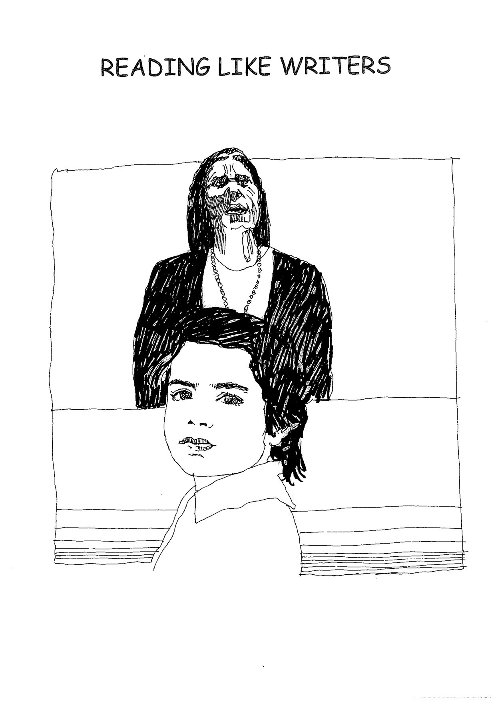

---

title: "Reading Like Writers"
source_file: "Writing/Craft/Reading Like Writers/Reading Like Writers  1-85.pdf"
pages: 85
conversion: "OCR (tesseract, local)"
converted: "2026-09-07"

tags: [jim-k, reviewed]
reviewed: "2026-09-10"
strand: writing
---

# Reading Like Writers

<!-- page 1 -->

<!-- scanned page embedded below -->

*[This passage was too garbled by OCR to reliably correct and has been left as scanned.]*

READING LIKE WRITERS
fr &
ELIS,
Had Th
if ah [penn ,
¥ i }
ii : if. ih
oe Nis,
P an 4 “
y/ Epa 4 i a
| in BIN
| og
Wy Wr wide , |
| i ANY,
it( he ne go thy mH]
ht Bes > Wi
dalle Ail yt
A” omy J 7
4
_ —
EE
ns ——————
eS

---

<!-- page 2 -->

READING LIKE WRITERS

Learning to write from writers
We want students to notice techniques in writing that they would like to
discuss with a view to using themselves.
Children are able to read texts in different ways:

- to read like a reader

- to read like a writer
First of all the class needs to become familiar with the text as a reader. If
we use the text as a read-aloud, we use appropriate reading strategies. E.g.
making connection, visualising, questioning, etc.
Later, we reread as writers, looking at the craft the writer has used.
Students can work as a whole class, making a list of what they see, or in
small groups, listing and talking.

Reading Like a Writer

* Find the craft.

* Talk about it, Why did the author use this craft?

« Name the craft.

° Have you seen this craft used in other texts?

* Think about using this craft in your writing.
Finding craft.

Look for specific examples.
Talk - Answer why.

Again trying to get students to be specific in their inquiry.
It is difficult to know the author's specific intention - but we are trying to
understand the text for ourselves. For the students, we want them to know
why they might use that crafting technique.
“Students need to know a wide variety of crafting possibilities for texts, but
the possibilities aren't the point. That students can use them to make good

---

<!-- page 3 -->

READING LIKE A WRITER
* Find the craft.
* Talk about it.
Why did the author use this craft?

* Name the craft.

* Have you seen this craft used in other
texts?

* Think about using this craft in your
writing.

---

<!-- page 4 -->

decisions about how to craft their texts is the point, and this is difficult for
us as teachers."

Wondrous Words by Katie Wood Ray (Ref. for this paper)
Naming craft.

This helps to organize the information about writing. We then have a
way of communicating techniques to the students. Often this provides the
opportunity to teach the real name. E.g. simile. If a technique doesn't have
a name, make one up.

Other texts,

Helps to broaden the understanding of the use of the technique.
Using the technique.

Once they see the author's purpose for using the technique, students
may choose to use it when they have a similar need.

Selection of Mentor Texts

Not all great books to read will lend themselves for use as a mentoring text.
We need to find texts that show the students something about writing
techniques that will help them to write well.

- Texts that have ‘a way with words’.

The way the author uses wondrous words, verbs,
adjectives, adverbs etc.

- Texts with interesting structures.

Use of repetition, lists, circular structure, etc.

- Texts with craft connections to other texts.

- Texts with voice.

- Texts with interesting leads and endings.

- Texts showing point of view.

Personification, different angles.

- Texts demonstrating conventions.

Punctuation, sentence length etc.

- Texts with strong character portraits.

- Texts with a sense of place and time.

- Texts with background information,

---

<!-- page 5 -->

The way the author goes about the writing.
Where does the author get ideas from? eg. Students do
not usually write fiction based on something that actually
happened to them. This is one idea they can get from
authors, or, writing about ordinary things.
* hair in ‘Hairs’ from A House on Mango Street.
° a visit, as in The Relatives Came.
Organising for Using Mentor Texts
- Baskets can be available with books by one mentor author
- Baskets with a variety of authors
- Individual copies available to students
Using Crafting Techniques
Wondrous Words
Create a WONDROUS WORDS wall chart with quotes from books.
Unforgettable Language
* The Very Hungry Caterpillar by Eric Carle
“In the light of the moon a little egg lay on a leaf." Etc.
* Owl Moon by Jane Yolen
* The BFG by Roald Dahl
° Tuck Everlasting by N.Babbit

---

<!-- page 6 -->

Striking Verbs
~ Catch the reader's attention, Add surprise.
° My Great Aunt Arizona by Gloria Houston
“For fifty-seven years my great-aunt Arizona hugged her
students.”
¢ Tuck Everlasting by Natalie Babbit
“A frog! Winnie caught just a glimpse of it as it scissored away
from shore"
* Secret Places by Eve Bunting
“There are warehouses with windows blinded by dust and names
paint-scrawled on their brick wails.”
“The phone wires rocked the moon in their cradle of lines.”
“The lines on the telephone and electric poles web the sky."
* Miz Berlin Walks by Jane Yolen
“I ran up and touched her hands and we knitted our fingers.”
* Maniac Magee by Jerry Spinelli
“.. especially when he got a load of the kid drowning in his
clothes."
Striking Adjectives
- again adding surprise.
° Miz Berlin Walks
“And if you listen real hard, you might even hear a block-long
tale.”
° The Relatives Came by Cynthia Rylant
“Then it was hugging time.”

---

<!-- page 7 -->

Out-of-place Adjectives
* My Mama had a Dancing Heart by Libba Moore
Gray
“and drink lemonade cold."
“drink hot tea spiced."
° Baby by Patricia MacLachlan
“My mother stood with her hands up to her face, shocked."
* Miz Berlin Walks
“But one (feather) rained into my hand, and it was all over gold."
Striking Adverbs
Authors sometimes make unexpected adverbs where we might
expect to see an -ly ending.
* Miz Berlin Walks
“I'd walk with Miz Berlin, side by side, step by step, waiting
cotton-quiet till she cleared her throat.”
Jane Yolen made the decision to use a noun-adjective combination to create
an adverb, rather that use quietly.
Make up Your Own Word
° Maniac Magee
“That's why his front steps were the only un-sat-on front steps
in town.”
“... and ~ unbefroggable! - the ‘ball’ was heading back home too."
* An Angel for Solomon Singer by Cynthia Rylant
“And the smiling-eyed waiter told Solomon Singer to come back
again to the Westway Café."

---

<!-- page 8 -->

¢ My Mama Had a Dancing Heart
“We'd do a seabird-flapping, dolphin-arching hello summer
ballet, with me following Mama, the sand stuck between the
toes of our up-and-down squish-squashing feet."
Use of ‘And’.

Enables the author to set something apart, and yet still be connected
to the rest of the text. It adds significance to that thought. Sometimes
indicates an afterthought.

So common that a great many texts will have examples.
* What You Know First by Patricia MacLachlan
“And so I can remember, too.”
* When I was young in the Mountains by C.Rylant
“And that was always enough.”
* Missing May by Cynthia Rylant
“And then a big wind came and set everything free."
Items in a series

Writers have turned the way they create lists into a crafting
technique. Using different punctuation allows the writer to use the rhythm
of the words as well as their meaning.

* The Relatives Came by Cynthia Rylant
“We were so busy hugging and eating and breathing together."

¢ Night in the Country by Cynthia Rylant
“_the groans and thumps and squeaks that houses make when
they are trying, like you, to sleep.”

© Scarecrow by Cynthia Rylant
“The earth has rained and snowed and blossomed and wilted and
yellowed and greened and vined itself all around him."

---

<!-- page 9 -->

* Dogteam by Gary Paulsen
“.. circled in the snow and the winter and our lives and all the
world."
Use of detail to slow down writing
The author slows down the writing by including specific information
about the people and the place.
* Mint Snowball by Naomi Shihab Nye
Specific details in this non-fiction narrative includes:
- relevant facts
- people's feelings
- how others may have felt
- description of place
- description of people
- description of exactly what they were doing and why
Class/small group/individual conference could see parts of students’ texts
where the piece could be slowed down ina similar way.
* Charlotte's Web by E.B.White
In E.B.White's description of the barn, he uses the sense of smell.

“The barn was very large. It was very old. It smelled of hay
and it smelled of manure. It smelled of the perspiration of tired horses and
the wonderful sweet breath of patient cows. It often had a sort of
peaceful smell...”

---

<!-- page 10 -->

Repeating Details
This creates a thread of continuity. Sometimes a small detail has
changed. E.g.. In Miz Berlin Walks, Miz Berlin's hair changes color. The
shiny black umbrella and paper fan are also mentioned throughout the text.
Repeating Sentence Structure
Repetition of kinds of words, and how they are put together. This
creates an interesting sound to the text.
* Secret Places
“The growl of traffic, the snort of trains, the beep-beep of a
backing track. The secret place has its own noise: The cackle
of coots, the quack of teals, the rah-rah of the mallards that
ring the sky."
* Night in the Country by Cynthia Rylant
“There are owls. Great owls with marble eyes who swoop among
the trees are not afraid of night in the country, Night birds.
There are frogs. Night frogs who sing songs for you every
night: reek reek reek reek. Night songs."
Vignette Texts with Repeating Lines or Phrases
The story moves from vignette to vignette with the help of a
repeating line or phrase. This helps to make a connection common to all
vignettes.
* When I was Young in the Mountains by C.Rylant
* When I was Little by Jamie Lee Curtis
* Grandpa Never Lies by Ralph Fletcher
Books containing a series of Short Memoirs
° Childtimes by Eloise Greenfield
* House on Mango Street by Sandra Cisneros

---

<!-- page 11 -->

Writing with a Big Idea in Mind

Students often respond to a text in an obvious way. A reread after
their initial writing can lead them to see the big idea that the author had in
mind. E.g.

° My Grandmother's Hair by Cynthia Rylant

The obvious thought this story leaves you with could be playing with
mother's hair. Some children may be able to make connections to this.
Discuss big ideas"

“What is this text really about?”

“What is the big idea?"
Could be -

What I want to be when I grow up.
Spending time with someone you love.

Work can be done with texts where the big idea isn't always obvious.
Use a variety of texts

Magazines

Newspapers

Picture Books etc.

eg. * The World of a Child in an Old Chair by Hank

Lubsen

Students might write about things that are special to them.
Extension:

Reread article. Outline -

- obtained chair

- how son used it

- importance to family

- son ‘now’

- start thinking of him growing up

- future of chair

- want to stop time but change is inevitable
What are the students’ thoughts?
Need to see big idea. Need to see this in the significance if their stories.

---

<!-- page 12 -->

Some texts will inspire big ideas beyond obvious connections.
° Plenty by Jean Little from A Round Slice of Moon
- things you want
- homelessness
- being charitable
- things we take for granted
- how lucky we are
- having your own money
- being spoiled
- children in poor countries
- difference between need and want
- if we could make laws
Ref. The No-Nonsense Guide to Teaching Writing
By Judy Davis & Sharon Hill

---

<!-- page 13 -->

Close-Echo Effect
This calls attention to words and repeats text rhythm, as the number
of syllables is repeated. The key words that are repeated often replace a
conjunction,
° Night in the Country
“There is no night so dark, so black as night in the country."
* Water Dance by Thomas Locker
“I wind through broad, golden valleys joined by streams, joined
by creeks."
° Miz Berlin Walks
“Without missing a step, without missing a word.”
e Hairs in House on Mango Street
“But my mother's hair, my mother's hair, like little rosettes, like
little candy circles..."
Voice
‘Writing with voice is writing into which someone has breathed. It has
that fluency, rhythm, and liveliness that exists naturally in the speech of
most people when they are enjoying a conversation ... Writing with real voice
has the power to make you pay attention and understand - the words go
deep.’
Writing with Power by Peter Elbow
° The Keeping Quilt by Patricia Polacco
* Knots on a Counting Rope by Bill Martin Jr
° A Taste of Blackberries by Doris Buchanan
Smith (novel)
* Where the Forest Meets the Sea by Jeannie
Baker
* Danny, the Champion of the World by R.Dahl
° Stevie by J.Steptoe
¢ Alexander, who used to be rich last Sunday
By Judith Viorst

---

<!-- page 14 -->

Helping Students Find Voice
- Write a lot - it develops voice
- Writer's Notebook. The more the notebook is used, the more a
true voice will appear
- Writing about something you love or care about
- Reading several books by the same author helps readers
understand what voice is. Reading them helps students develop
their own voice
- Create pictures for your readers with the words you choose, so the
reader can see what you see, and hear in their mind the same
voices you hear in your head when you write dialogue
- Certain genres help to develop voice
Poetry. Emotional and personal
Letter Writing
Memoir
Personal monologue - as if you were speaking to someone
- Write regularly about personal experiences
- Write from something from nature you love. Try speaking from
the point of view of one of the topics in nature
What would I say?
To whom would I speak?
What would my voice sound like?
- Include yourself in the writing piece
- Revision - read your piece to a friend
- Find your inner writing voice. Eg, Keeping a journal is like chatting
on paper.
Voice is the personality behind a writer's words.
Voice is influenced by audience and genre.
Inanimate Voice Text
An inanimate ‘character’ has the speaking role that narrates the text.
This brings these objects to life.
* Water Dance by Thomas Locker

---

<!-- page 15 -->

Narratives Sequenced by a series of Objects, People, or Animals
Sequenced in this way, rather than the more usual event sequencing.
¢ Wilfred Gordon McDonald Partridge by Mem
Fox
° The Very Hungry Caterpillar by Eric Carle
Whispering Parentheses
Parentheses used to ‘whisper’ an aside to the reader. Asa crafting
technique this brings the reader in; the writer seems to have direct contact
with the audience.
* An Angel for Solomon Singer by Cynthia Rylant
“When he reached the end of his list of dreams (the end was a
purple wall), he simply started all over again and ordered up a
balcony (but he didn't say the balcony out loud).
° Missing May by Cynthia Rylant (novel)
“May started talking about where they'd hung the swing as soon
as she hoisted herself out of the front seat (May was a big
woman),"
Italics
Used in a variety of ways:
- make noise
- give emphasis
- distinguish present from past
- show someone is remembering
- match speech patterns
* Water Dance by Thomas Locker
“Sometimes I fall from the sky
I am the rain.“

---

<!-- page 16 -->

¢ Night in the Country by Cynthia Rylant
“Night frogs sing songs for you every night: reek reek reek
reek, Night songs.”

° Maniac Magee by Jerry Spinelli

“You have eaten pizza before, haven't you?”

* In Baby by Patricia MacLachlan italics are used
throughout the book to set Sophie's memories ©
apart from the rest of the text, as well as in
other ways.

Runaway Sentences
Used to convey a sense of being frantic, of desperation, of
excitement, or of being carried away with something.

* Dogteam by Gary Paulsen

“Part of the night and dark and cold and moonlight and steam
from out breaths, into the soft beauty of the woods and the
quiet we run mile on mile until we see lights, see lights and find
that we have circled in the night, circled in the snow and the
winter and our lives and all the world and have come home.”
Sense of the dogs running.

* House on Mango Street

“But my mother’s hair, my mother’s hair, like little rosettes, like
little candy circles all curly and pretty because she pinned it in
pincurls all day, sweet to put your nose into when she is holding
you and you feel safe, is the smell of bread before you bake it,
is the smell when she makes room for you on her side of the
bed still warm with her skin and you sleep near her, the rain
outside falling and Papa snoring. The snoring, the rain, and
Mama's hair that smells like bread.”

Sense of being carried away with Mama's beauty.

---

<!-- page 17 -->

Sentence Fragments
Crafted for effect. Often used to clarify, reiterate, exclaim, or list.
° Maniac Magee (novel)
“For instance, he would eat dinner with Aunt Dot on Monday,
with Uncle Dan on Tuesday, and so on. Eight years of that.” p6
* Woodsong by Gary Paulsen (novel)
“Largely because of Disney and posed ‘natural’ wildlife films and
television programs I had preconceived ideas about wolves,
about what wolves should be and do. They never really spoke to
the killing. Spoke to the blood." pé,
Colons
Used to:
- set an idea off from others
- show someone is thinking or talking
- show something big is about to happen
* Scarecrow by Cynthia Rylant
* Miz Berlin Walks by Jane Yolen
Ellipses
- show an action is continuing
- transition from one action to another
- transition from one idea to another
- move time or place
- show that there just are not words for something
* Dogteam by Gary Paulsen
“Did you ... they sing, little jets of steam from their mouths.
Did you did you did you did you ...
Did you want it to last forever?”

---

<!-- page 18 -->

* Night in the Country by Cynthia Rylant
“Outside ...
A raccoon mother licks her babies.”
* Miz Berlin Walks by Jane Yolen
“Why Mary Louise, I smell the salt from the bay ..."
“Well, child, I recall once upon a time an old woman lived on our
street, oldest woman I'd ever seen ..."
* Dream Weaver by Jonathan London
“Yellow Spider's world is yours ...."
Narrative Poem Texts
Poetry is used to write for another genre. E.g. memoir, fiction. n/f.
° Out of the Dust by Karen Hesse
e Love That Dog by Sharon Creech
Lyrical Fact Texts
Contains lyrical language through poetry, or beautiful description.
Facts are included to support the style.
° Dream Weaver by Jonathan London
* Sky Tree by Thomas Locker
* Where Once There Was a Wood by Denise
Fleming
* Welcome to the Ice House by Jane Yolen
Circular Texts
Beginnings and endings that match
* House on Mango Street
° The Relatives Came
° Miz Berlin Walks
Beginnings
° Charlotte's Web by E.B.White
“Where's Papa going with that axe?" said fern to her mother as
they were setting the table for breakfast.

---

<!-- page 19 -->

® Matilda by Roald Dahl
“It's a funny thing about mothers and fathers. Even when their
own child is the most disgusting little blister you could ever
imagine, they still think that he or she is wonderful."

° The Very Hungry Caterpillar by Eric Carle
“In the light of the moon a little egg lay on a leaf.”

* Dogteam by Gary Paulsen
“Sometimes we run at night."

° Missing May by Cynthia Rylant
“When May died, Ob came back to the trailer, got out of his
good suit and into his regular clothes, then went and sat in the
Chevy for the rest of the night."

* Dream Weaver by Jonathan London
“Nestled in the soft earth beside the path, you see a little
yellow spider.”

* Love that Dog by Sharon Creech
“JACK
ROOM 105 - MISS STRETCHBERRY
SEPTEMBER 13
I don't want to
Because boys
Don't write poetry.
Girls do,
SEPTEMBER 21
I tried.
Can't do it.
Brain's empty.”

---

<!-- page 20 -->

e Harry Potter and the Prisoner of Azkaban by
J.K.Rowling
“Harry Potter was a highly unusual boy in many ways. For one
thing, he hated the summer holidays more than any other time
of year. For another, he really wanted to do his homework but
was forced to do it in secret, in the dead of night. And he also
happened to be a wizard.”
Endings
How many different kinds of endings can you find? E.g.
Circular * The Hobbit by J.R.Tolkien
° A Wrinkle in Time by M.L'Engle
Poignant * Wilfred Gordon McDonald Partridge by
Mem Fox
* Sadako and the Thousand Paper Cranes by
Eleanor Coerr
Surprise * The Art Lesson by Tomie dePaola
Strong Characters
° Tuck Everlasting by N.Babbit
° Crow Boy
° Miss Rumphius by Barbara Cooney
Sense of Place
* Owl Moon by Jane Yolen
* Tuck Everlasting
° Sarah, Plain and Tall by Patricia MacLachlan
° Snow White in New York by Fiona French
Tension/Conflict
° Island of the Blue Dolphins by Scott O'Dell
e The Summer of the Swans by Betsy Byars

---

<!-- page 21 -->

Point of View
° The True Story of the Three Little Pigs by Jon
Scieszka
° The Pain and the Great One by Judy Blume
° I'll Fix Anthony by Judith Viorst
Simile
° Out of the Dust by Karen Hesse
“Great Uncle Floyd
old as ancient Indian bones,
and mean as a rattler" (5)
“I glare at ma’s back with a scowl, foul as maggoty stew." (27)
“My dazzling Ma, round and ripe and striped like a melon."(56)
“Dust piled up like snow across the prairie.” (102)
“I hear the first drops,
Like the tapping of a stranger
at the door of a dream." (104)
“My father's voice starts and stops,
like a car short of gas,
like an engine choked with dust." (112)
. brown-tipped wheat
barely ankle high,
and sparse as the hair on a dog's belly.” (160)
* The Wringer by Jerry Spinelli
“The pigeon's eye is like a polished shirt button.”
“For a moment a dragonfly hovered before his eyes like a tiny
helicopter."

---

<!-- page 22 -->

SPRINGBOARD TEXTS
I've called these texts ‘springboard’, because I've used them for the
students to gather ideas for their own writing.
* The Three Little Pigs
The Jolly Postman by Janet & Allen Ahlberg
Great to teach letter writing. “The Three Little Pigs in ...”
* My Grandmother's Hair by Cynthia Rylant
Grandpa Never Lies by Ralph Fletcher
There are numerous book like these that can be used to
springboard ‘grandparent’ stories.
* The Very Hungry Caterpillar by Eric Carle
Innovate on text. “The Very Hungry ..."
* Meanies by Joy Cowley
Innovate on text. ‘Goodies.’
* Cookie's Week by Cindy Ward
Innovate on text, ‘Cookie’s Week at School.”
Like The Very Hungry Caterpillar, good for teaching days of the
week,
* When I was Young in the Mountains by Cynthia Rylant
“When I was Young in...”
* When I was Little by Jamie Lee Curtis
“When I was little .."
* Tell Me Again about the Night I was Born by Jamie Lee Curtis
“Tell me again ..."
* The Important Book by Margaret Wise Brown
“ The important thing about ...”

---

<!-- page 23 -->

* Snow White in New York by Fiona French
Upper grades - talk about setting and time. Also art (art
nouveau)
“Snow White in..."
* Twilight Comes Twice by Ralph Fletcher
Students write twilight poetry
* Wilfred Gordon McDonald Partridge by Mem Fox
List the definitions of memory. Students write their own
memory of each,
* “He Remembers..." by Paul Auster
“I remember ...”
* It Looked Like Spilt Milk by Charles Shaw
“It Looked Like ...”
Innovation on text for Prep - high frequency words,
“Sometimes it looked like a ...
But it wasn’t a...”
* Water Dance by Thomas Locker
Students write similar poetry.
* Edward the Emu by Sheena Knowles
Good for sequencing and as a retell.
* Four Famished Foxes and Fosdyke by Pamela Duncan Edwards
Fun with alliteration.
Students could use their dictionaries after choosing a letter.
List words in columns e.g. nouns, verbs, adjectives.
Write the story.
* I Know an Old Lady who Swallowed a Fly.
I Know an Old Lady who Swallowed a Pie by Alison Jackson

---

<!-- page 24 -->

*[This passage was too garbled by OCR to reliably correct and has been left as scanned.]*

s=
Ears
6B 2

. ut
=

_

; LS

Qa
38
Za
&z

7
s<=
2s
é<
#2
af
43

i=]

c

5

>

i=}

7
ie}
s=
Cae
+h
a

ied
~8
+
Re
Zo
29
a=

+
SE

u
¢x
8.2
3 8
an

un
+8
gS
ga

§ =
oO un
ae)

+
38 §
zs 8
33.2
eas

BOO

x3

+

. 3
ua

---

<!-- page 25 -->

Mentor Texts included:

The Very hungry Caterpillar

Owl Moon

Hairs

My Great Aunt Arizona

Secret Places

Miz Berlin Walks

The Relatives Came

My Mama Had a Dancing Heart

An Angel for Solomon Singer

What You Know First

When I was Young in the Mountains
Night in the Country

Scarecrow

Dogteam

Mint Snowball

When I was Little

Grandpa Never Lies

My Grandmother's Hair

The World of a Child in an Old Chair
Plenty

Water Dance

Wilfred Gordon McDonald Partridge
Dream Weaver

Where Once There was a Wood
Snow White in New York

The Important Book

Twilight Comes Twice

He Remembers

It Looked Like Spilt Milk

Four Famished Foxes and Fosdyke
I know an old lady who swallowed a pie,

---

<!-- page 26 -->

Texts mentioned - mostly novels and should be readily available.
Out of the Dust

Love That Dog

Sky Tree

Welcome to the Ice House

House on Mango Street

Charlotte's Web

Woodsong

Maniac Magee

Missing May

The Keeping Quilt

Knots on a Counting Rope

A Taste of Blackberries

Where the Forest meets the Sea
Danny the Champion of the World
Stevie

Alexander who used to be rich last Sunday
Childtimes

Tuck Everlasting

The BFG

Matilda

Harry Potter and the Prisoner of Azkaban
The Hobbit

A Wrinkle in Time

Sadako and the Thousand Paper Cranes
The Art Lesson

Crow Boy

Miss Rumphius

Sarah Plain and Tall

The Summer of the Swans

The True Story of the 3 Little Pigs
The Pain and the Great One

I'll Fix Anthony

The Wringer

Edward the Emu

---

<!-- page 27 -->

The Very Hungry Caterpillar by Eric Carle

In the light of the moon a little egg lay on a leaf.

One Sunday morning the warm sun came up and - pop! - out of the egg
came a tiny and very hungry caterpillar.

He started to look for some food.

On Monday he ate through one apple. But he was still hungry.

On Tuesday he ate through two pears. But he was still hungry.

On Wednesday he ate through three plums. But he was still hungry.

On Thursday he ate through four strawberries. But he was still hungry.
On Friday he ate through five oranges. But he was still hungry.

On Saturday he ate through one piece of chocolate cake, one ice-
cream cone, one pickle, one slice of Swiss cheese, one slice of salami,
one lollipop, one piece of cherry pie, one sausage, one cupcake, and
one slice of watermelon.

That night he had a stomachache!

The next day was Sunday again. The caterpillar ate through one nice
green leaf, and after that he felt much better.

Now he wasn’t hungry any more - and he wasn’t a little caterpillar any
more. He was a big, fat caterpillar!

He built a small house, called a cocoon, around himself. He stayed
inside for more than two weeks. Then he nibbled a hole in the cocoon,
pushed his way out and...

he was a beautiful butterfly!

---

<!-- page 28 -->

Owl Moon
BY JANE YOLEN

t was late one winter night, long past my bedtime, when Pa and I went owling. There was not

wind. The trees stood still as giant statues. And the moon was so bright the sky seemed to

shine. Somewhere behind us a train whistle blew, long and low, like a sad, sad song.

I could hear it through the woolen cap Pa had pulled down over my ears. A farm dog
answered the train, and then a second dog joined in. They sang out, trains and dogs, for a real
long time. And when their voices faded away it was as quiet as a dream. We walked on toward
the woods, Pa and I.

Our feet crunched over the crisp snow and little gray footprints followed us. Pa made a long
shadow, but mine was short and round. I had to run after him every now and then to keep up,
and my short, round shadow bumped after me.

But I never called out. If you go owling you have to be quiet, that’s what Pa always says.

Thad been wanting to go owling with Pa for a long, long time.

We reached the line of pine trees, black and pointy against the sky, and Pa held up his hand. I
stopped right where I was and waited. He looked up, as if searching the stars, as if reading a map
up there. The moon made his face into a silver mask. Then he called: “Whoo-whoo-who-who-
who-whooocce,” the sound of a Great Horned Owl. “Whoo-whoo-who-who-who-whooo000.”

Again he called out. And then again. After each call he was silent and for a moment we both
listened. But there was no answer. Pa shrugged and I shrugged. I was not disappointed. My
brothers all said sometimes there’s an owl and sometimes there isn’t.

We walked on. I could feel the cold, as if someone's icy hand was palm-down on my back.
And my nose and the tops of my cheeks felt cold and hot at the same time. But I never said a
word. If you go owling you have to be quiet and make your own heat.

We went into the woods. The shadows were the blackest things I had ever seen. They stained
the white snow. My mouth felt furry, for the scarf over it was wet and warm. I didn’t ask what
kinds of things hide behind black trees in the middle of the night. When you go owling you have
to be brave.

Then we came to a clearing in the dark woods. The moon was high above us. It seemed to fit
exactly over the center of the clearing and the snow below it was whiter than the milk in a cereal
bowl.

I sighed and Pa held up his hand at the sound. I put my mittens over the scarf over my mouth
and listened hard. And then Pa called: “Whoo-whoo-who-who-who-whooo000. Whoo-whao-
who-who-who-whoooo00. “I listened and looked so hard my ears hurt and my eyes got cloudy
with the cold. Pa raised his face to call out again, but before he could open his mouth an echo
came threading its way through the trees. “Whoo-whoo-who-who-who-whooo000.”

Pa almost smiled. Then he called back: “Whoo-whoo-who-who-who-whoood00” just if he and
the owl were talking about supper or about the woods or the moon or the cold. I took my mitten
off the scarf off my mouth, and I almost smiled, too.

---

<!-- page 29 -->

“Owl Moon” (continued)

The owl's call came Closer, from high up in the trees on the edge of the meadow. Nothing in
the meadow moved. All of a sudden an owl shadow, part of the big tree shadow, lifted off and
flew right over us. We watched silently with heat in our mouths, the heat of all those words we
had not spoken. The shadow hooted again.

Pa turned on his big flashlight and caught the owl just as it was landing on a branch.

For one minute, three minutes, maybe even a hundred minutes, we stared at one another.

Then the owl pumped its great wings and lifted off the branch like a shadow without sound.
It flew back into the forest. “Time to go home,” Pa said to me. I knew then I could talk I could
even laugh out loud. But I was a shadow as we walked home.

When you go owling you don’t need words or warm or anything but hope. That’s what Pa
says. The kind of hope that flies on silent wings under a shining Owl Moon. 8

---

<!-- page 30 -->

Hairs
BY SANDRA CISNEROS
Everybody in our family has different hair. My Papa’s hair is like a broom, all up in the
air. And me, my hair is lazy. It never obeys barrettes or bands. Carlos’ hair is thick and
straight. He doesn’t need to comb it. Nenny’s hair is slippery—slides out of your hand.
And Kiki, who is the youngest, has hair like fur.

But my mother’s hair, my mother’s hair, like little rosettes, like little candy circles all curly and
pretty because she pinned it in pincurls all day, sweet to put your nose into when she is holding
you, holding you and you feel safe, is the warm smell of bread before you bake it, is the smell
when she makes room for you on her side of the bed still warm with her skin, and you sleep near
her, the rain outside falling and Papa snoring. The snoring, the rain, and Mama’s hair that smells
like bread. #

From House on Mango Street.

---

<!-- page 31 -->

My Great-Aunt Arizona by Gloria Houston

*[The excerpt below from "My Great-Aunt Arizona" was too garbled by OCR (dense character-level errors throughout) to reliably correct and has been left as scanned.]*

My great-aunt Arizona was bom in a Log cabin her papa bullt iw the meadow ow
Henson Creek in the Blue Ridge Mountains. When she was born, the mailman
rode aovoss the bridge ow his big bay horse with a letter. The Letter was from her
brother, Galen, who was iw the cavalry, far away iw the west. The Letter sata, “If
the baby is a girl, please wane her Avizowa, awd she will be beautiful, Liee this
Land.”

Avizowa was a very tall little girl. She wore her Long brown hair iw braids, She
wore Long full dresses, and a pretty white aprow. She wore high-buttow shoes, awd
many petticoats, too. Arizona Liked to grow flowers. She lileed to read, and sing,
and square dance to the music of the fiddler ow Saturday night.

Avizona had a little brother Jim. They played together ow the farm. tw summer
they went barefoot and caught tadpoles in the creel.

tw the fall they climbed the mountains searching for galax and ginseng roots.

(w the winter they made snow cream with sugar, sow, and sweet oveam from
Mama’s cows.

When spring came, they helped Papa tap the maple trees awd catoh the sap tw
buckets. Then they made maple syrup and maple sugar to eat like candy.
Arizona awd her brother Jim walked up the road that wound by the eveele to the one-
room school. ALL the students in all the grades were there, together in one room. ALL
the students read thelr Lessons aloud at the same time. They made a great deal of
noise, so the room was called a blab school.

The students carried their Lunches in Lard buckets made of tin. They brought ham
awd biscuits. Sometimes they had a fried apple ple. They drank cool water from
the spring at the bottom of the hill. At recess they played games lilee tag and
William Matrimmatoe.

When Arizona had read all the books at the one-room school, she crossed the
mountains to the school in another village, a village called Wing. tt was so far
away that she rode her Papa’s mule. Sometimes she rode the mute through the
snow.

When Arizona's mother died, Arizona had to Leave school and stay home to care for
Papa and her brother Jim. She still Loved to read ~ and dream about the faraway
places she would visit one day. So she read and she dreamed, but she took care of
Papa and jim.

Then one day Papa brought home a new wife. Arizona could go away to school,
where she could Learn to be a teacher. Aunt Suzie invited Arizona to tive at her
house awa help with the chores. Aunt Suzie made her work very hard. But at
night Arizona could study - and dream of all the faraway places she would visit
one day.

Finally, Arizona returned to her home ow Henson Creek. She was a teacher at Last.
She taught in the one-room school. where she and Jim had sat. She made new
chalboards out of Lumber from Papa’s sawmill, awal covered them with black

---

<!-- page 32 -->

polish made for stoves. She still wore long full dresses and a pretty white aprow.
She wove high-button shoes and many petticoats, too. She grew flowers in every
window. She taught students about words and wummebers and the faraway places
they would visit someday.

“Have you been there?” the students asked.

“only ln my mind,” she answered. “But someday you will go.”

Arizona married the carpenter who helped build the wew Riverside School doww
where Hensou Creel joins the river. So Miss Arizona became Mrs Hughes, and for
the vest of her days she taught fourth-grade students who called her “Miz Shoes.”
Awa whew her daughter was born, Miz Shoes brought the baby to school, to the
sunny room where flowers grew Ln every window.

Every year Arizona had a Christians tree growing tw a pot. The girls and boys
made paper decorations to brighten up the tree. Then they planted their tree at the
edge of the school yard, year after year, until the entire playground was lined with
living Christmas trees, like soldiers guarding the room where Arizona taught,
with her long grey braids wound ‘round her head, with her Long full dress, and
pretty white aprow, with her high-button shoes, and many petticoats, too.

The boys and girls who were students in her class had boys and girls who were
students lw her class. And they had boys and girls whe were students in her
class. For fifty-seven years my great-aunt Arizona hugged her students. She
hugged then when their work was good, awd she hugged them whew it was not.
She taught them words and numbers, and about the faraway places they would
visit someday.

“Have you been there?” the students asked.

“only in my mind,” she answered. “But someday you will go.”

My great-aunt Arizona taught my dad, Jim's only sow. Awd she taught my
brother and me in the fourth grade. with her soft white braids woud ‘round her
head, she taught us about the faraway places we would visit someday.

My great-aunt Arizona died ow her alnetythird birtholay. But she goes with me
la my wind —a very tall Lady, in a long full dress, and a pretty white aprow, with
her high-buttow shoes, awa her raany petticoats, too. She's always there, iwa
sunny room with many flowers iw every window, awd a hug for me every day.
Did she ever go to the faraway places she taught us about? No, but my great-aunt
Arizona travels with me and with those of us whose lives she touched....

She goes with us tw our minds.

---

<!-- page 33 -->

Secret Places by Eve Bunting

*[The excerpt below from "Secret Places" was too garbled by OCR (dense character-level errors throughout) to reliably correct and has been left as scanned.]*

In the heart of the city where | live there is a secret place.
Close by is a freeway where cars and trucks boom, and a
railroad track with freight trains that shunt and grunt
There are warehouses with windows blinded by dust and names
paint-scrawled on their prick walls.
The lines on the telephone and electric poles web the sky.
Smokestacks blow clouds to dim the sune
But in the heart of the city where | lives low down, hidden, a
river runs
The water is dark and shallow in its concrete beds
Bushes and tangled weeds cling to the slopes of the concrete
walls.
Hardly anyone knows the iver is here. Hardly anyone cares.
Mes Arren knows, and Mr Ramirez, and Peter and Janet who are
married.
1 know, and my father knows, too. He works a forktift in one of
the brick warehouses, and | showed him the secret place the
day | found it
The white egret found it, 1006 | watch the bird float downs its
legs thin and reaching, its head plumes fanned.
The green-winged teal knows. The buffleheads that come to
water-skim know. And the circling mallards know.
Ive seen them here before. Peter says (ast year there was a
mallard nest lined with feathers from the mother’s breast.
Later there were ducktings.
“They'll nest here again,” Peter says.
{ jump up and down. “Ducklings! Perfect!”
Mes Arren and Mr Ramirez and Janet and Peter bring binoculars.
They let me look through them The sparrows lined up on the
barbed wire fence seem big as mud hens

---

<!-- page 34 -->

Peter tells me the names of the birds. He is tike a bird himself,
with hair the color of a cinnamon teat

in the heart of the city where / live there is always noise:
The growl of traffic, the snort of trains, the beep-beep of a
backing truck.

The secret place has its own noise:

The cackte of coots, the quack of tealsy the rah-rah of the
mallaeds that ring the sky.

Peter and Janet brought me here one night. We stood while
behind us the city jangled.

The secret place was at peace. The birds had nested, the river
van, slow as syrup. Tucked together, the ducks slept.

A coyote came +o lap the shadowed water

A possum carried her children to drink.

“How did they find this place?” | asked.

“They have always been here,” Janet saide “Before the city
grew there was wilderness. This is all that’s left. Wild things
need guiet We do, +00.”

The phone wires rocked the Moon in their cradle of tines.

The stars vested bright on the telephone poles.

“| want to tell everyone what's here,” | saids

“Be careful,” Peter said. “Some people might want to take the
secret place and change it.”

“Pd never want that +0 happen,” | said. “f told wy father, but
he is good with secrets. | will be careful who else | tell.”

f wilt only say that close to the freeway and a railroad track
and tally smoking chimneys, in the heart of the city where | lives
there is a secret place.

Hf you can find ft, there may be ducklings.

---

<!-- page 35 -->

Miz Berlin Walks by Jane Yolen:

*[The excerpt below from "Miz Berlin Walks" was too garbled by OCR (dense character-level errors throughout) to reliably correct and has been left as scanned.]*

Well, child, t recall once upon a time an old woman Lived on our street, oldest
woman Val ever seew. Her hair was white and fine like the fluff off a dandelion.
Her sleiw was the color of mille agate, Like some marbles. But old as she was, Miz
Berlin sure could wale. Every evening, just before dark, she would pass by our
house, going ‘round the Long block that takes more thaw an hour even if you go
veal fast. And Miz Berlin, she went real. slow.

Ow wice days she wore a flowery cotton dress. Ow cold days she wore a blue buttow
coat. On rainy days she carried a shiny black umbrella with long silver ribs. Ow
hot days she carried a paper fan. Oftimes she talked to herself or sang little songs,
toouldn‘t tell which, afraid to get too close, you see. Old Lady like that, talking
and singing to herself — Marna always said: “A body can’t be too careful.”

whew Miz Berlin passed by Vad wateh her go all down the road iw that unhurried
way, talking or singing or in quiet contemplation. And then one hot summer
eve, because { had nothing else to do - my best friend Frances Bird having gone
visiting Rin in Roawake — (jumped off the porch swing and ran right after Miz
Berlin. t expected her to yell “Scat!” or to put a curse ow me or to fix me with her
eye. But all she did was walk ow, wodding and talking to herself. She wever once
Looked behind. ‘Cept when | got close up, she cleared her throat. And then just as if
we'd been conversing she said: “well, child, | reoall the time it rained feathers in
Newport News. (was a girl thew, short and sassy, just Lee some ( could mention.
twas wading in the creek hunting crawdaddies with Bubba, when all about us
feathers began to fall. Some settled on the creek bawke and some floated Lv the
water, like boats setting off to Norfolk or Baltimore.”

C felt Litee ( was right there on the bane, in the creeks! Then we reached the corner,
and she stopped to tale a breath. | sighed and turned to go home. | wasw't yet
allowed out of sight of oxr house. But off Miz Berlin went, still nodding and
talking up a storm.

Of course, next evening, right after supper, | waited the Longest time, eating an toe
oveam ow the porch. twas fixing to ask her what happened to those feathers ‘cause |
just had to know the way the story ended. The wind started up brushing the
treetops with a faint wist-wist, and suddenly there she was coming up the
sidewalk, a paper fa iw her hand. 1 slipped off the porch ana followed her, step for
step. She seemed wot to enow | was there, and started that story right where she
had Left off.

“There was feathers to the right awd feathers to the Left, tickling my nose, and
falling ow Bubba's head.”

(finished my ice cream and wiped my sticky hands ow my flower sunsuit.
Without missing a step, without missing a word, she reached back and grabbed
hola of my hand, threading her fingers through mine. we walked side by side
then, her telling more of the tale.

---

<!-- page 36 -->

“So there | was in the creek, chilal. Some of those feathers, they were dove grey.
Awa some were crow black. Ana some were dirty white, lilee seagulls after the
swill. But one rained right into my hand, and it was all over gold.”

_Just then we'd got to the block's end and | had to go home, no time for questions, wo
time for the ena of the tale. Rules are rules, Mama says.
Next evening, without even aw ice cream, | waited ow the porch. Didn't dare bounce
my ball “A my wame is ...” — or skip rope for fear of missing her. Awd suddenly
there she was, coming up the walk, holding her silver-ribbed umbrella high against
the dark clouds. tran up and touched her hands and we knitted our fingers.
“was it aw angel feather?” | asked, searcely able to breathe.
“Like as wot,” she said, “for angels ave partial to Newport News.”
we didw't say a word more, just walked along to the block's end, both of us under
the black, umbrella in the pattering rain. Some stories take you that way. Most
evenings after that (a walle with Miz Berlin, side by side, step by step, waiting
cotton-quitt till she cleared her throat. Then if she said: “why Mary Louise, t
swell the salt from the bay ...” Va slip my hand into hers and we'd talle of sailing
ships — cruisers on the Chesapealee or pirate ships ov the Spanish Main. Ov if she
said: “Why Mary Louise, | feel a soft summer breeze ...” we might speak of the
hurricane of “48, when water Lapped like wet tongues at the front steps of houses all
the way to Kecoughtaw Road and trees were bent wear double. But if she said:
“well, child, | remember once upon a time ...” she'd tell a real whopper of a tale,
about clever Jack, or that bad girl with a mouth full of toads, or the ghost that
walked each wight under the whispering trees. Of course each story had to ena at
the corner of the block. | would run ow home stuffed full of tales, which { told over
awd over to vay dolly before falling asleep in order to keep ahold of therm.
Thew one evening in early March — it was a false spring when the blossoms ow the
trees were furled tight as a baby’s fist - Miz Berlin told me the story of her coming
into the world. tt was a hard tale full of hardscrabble dirt, a two-room cabin, and a
lot of hunger.
I waited all that wext evening for her to finish the story, only she never came.
When | went away down the block to where her house sat, awd up the walle first
time ever, the house was all darie and the blinds drawn down. | went back home
and cried in my sleep, not Ruowing why. Iw the morning my pillow was spotted
and damp. Mara told we at brealefast old Miz Berlin had fallen down the stairs.
Swapped her hip tw two. She was six weeles tw the hospital. when she came back to
her own house she still couldn't walk and she couldw’t talk, either. 1 had to finish
that story to my dolly the best way | could.
Bevery evening after that old Miz Berlin tried to rise out of bed and thew eried
because she couldn't manage. Leastways that’s what her nurse said when Mama
and | brought over one of Mama’s famous straw-apple ples. Miz Berlin up and
died soow after, and | thine | now why: even good habits are hard to breale.
Hearts breale so much easier.

---

<!-- page 37 -->

But evenings right before darke, when the wind whispers kindly through the tall
syoamoves folles around here say: Miz Berlin walks!

And if you squinch your eyes real hard you may be able to see her in a flowery
cottow dress carrying a silver-vibbed umbrella or — if it’s hot - a paper fan. And if
you listen real hard, you might even hear her tell a block-Long tale about the time
it rained feathers, or the hardsorabble birth, or the one that starts: “Well, child, !
veoall ove upow a time an old woman lived ow our street, oldest woman td ever
seen...”

---

<!-- page 38 -->

e
The Relatives Came
BY CYNTHIA RYLANT
\

t was in the summer of the year when the relatives came. They came up from Virginia. They

left when their grapes were nearly purple enough to pick, but not quite. They had an old

station wagon that smelled like a real car, and in it they put an ice chest full of soda pop and
some boxes of crackers and some bologna sandwiches, and they came from Virginia.

They left at four in the morning when it was still dark, before even the birds were awake.
They drove all day long and into the night, and while they traveled along they looked at strange
houses and different mountains and they thought about their almost purple grapes back home.
They thought about Virginia—but they thought about us, too. Waiting for them. So they drank up
all their pop and ate up all their crackers and traveled up all those miles until finally they pulled
into our yard.

Then it was hugging time. Talk about hugging! Those relatives just passed us all around their
car, pulling us against their wrinkled Virginia clothes, crying sometimes. They hugged us for
hours. Then it was into the house and so much laughing and shining faces and hugging in the
doorways. You'd have to go through at least four different hugs to get from the kitchen to the
front room. Those relatives! And finally after a big supper two or three times around until we all
got a turn at the table, there was quiet talk and we were in twos and threes through the house.

The relatives weren’t particular about beds, which was good since there weren't any extras, so
a few squeezed in with us and the rest slept on the floor, some with their arms thrown over the
closest person, or some with an arm across one person and a leg across another. It was different,
going to sleep with all that new breathing in the house.

The relatives stayed for weeks and weeks. They helped us tend the garden and they fixed any
broken things they could find. They ate up all our strawberries and melons, then promised we
could eat up all their grapes and peaches when we came to Virginia. But none of us thought about
Virginia much. We were so busy hugging and eating and breathing together.

Finally, after a long time, the relatives loaded up their ice chest and headed back to Virginia at
four in the morning. We stood there in our pajamas and waved them off in the dark. We watched
the relatives disappear down the road, then we crawled back into our beds that felt too big and
too quiet. We fell asleep.

And the relatives drove on, all day long and into the night, and while they traveled along they
looked at the strange houses and different mountains and they thought about their dark purple
grapes waiting at home in Virginia. But they thought about us, too. Missing them. And they
missed us. And when they were finally home in Virginia, they crawled into their silent, soft beds
and dreamed about next summer. &

---

<!-- page 39 -->

e
My Mama Had a Dancing Heart
BY LIBBA MOORE GREY

My Mama had a dancing heart and she shared that heart with me.

With a grin and a giggle, a hug and a whistle, we'd slap our knees and Mama would say:
“Bless the world it feels like a tip-tapping song-singing finger-snapping kind of day. Let’s
celebrate!” And so we did.

When a warm spring rain would come pinging on the windowpane, we'd kick off our shoes
and out into the rain we'd go.

We'd dance a frag-hopping leaf-growing flower-opening hello spring ballet.

High-stepping and splashing, the rain running down our faces, I'd slip-swish behind Mama
through the newly green grass.

And afterward we'd read rain poems and drink sassafras tea with lemon curls floating.

And in the summer when the waves would come splash-splashing on the shore, out we'd go
into the red-orange morning with kites and balloons tied to our wrists.

We'd do a seabird-flapping dolphin-arching hello summer ballet, with me following Mama,
the sand stuck between the toes of our up-and-down squish-squashing feet.

And afterward we'd seashell-pile the windowsill and drink lemonade cold.

And when the cool autumn winds would come puff-puffing through the clouds, and the
hold-on-tight leaves would finally let go and float-flutter to the ground, out we'd go into the eye-
blinking blue air, with Mama leading in a leaf-kicking leg-lifting hand-clapping hello autumn
ballet.

And afterward we'd wax paper-press leaves red and gold and drink hot tea spiced.

And when the winter snows came softly down shawling the earth, out we'd go and doa
body-flat arms-moving-up-and-down snow-angel hello winter ballet.

And then we'd stand up, Mama first, and dance in slow motion, like hand-mittened galoshes-
galumphing funny old snowmen.

And afterward we'd cut snowflakes paper-white delicate and sip cocoa with marshmallows
floating.

And now after satin-ribboning my feet and listening to the violins sing-swelling around
me,onto the stage I go air-daring leap-flying wing-soaring letting the spring rain summer waves
autumn leaves winter snow carry me along until the music slows and I feather-float down...
down to the ground.

And afterward I imagine that I hear my mama saying: “Bless the world it feels like a tip-tapping
song-singing finger-snapping kind of day. Let's celebrate!”

My Mama had a dancing heart and she shared that heart with me. @

---

<!-- page 40 -->

An Angel for Solomon Singer by Cynthia Rylant

Solomon Singer lived in a hotel for men near the corner of
Columbus Avenue and Eighty-fifth Street in New York City, and he did
not like it. The hotel had none of the things he loved.

His room had no balcony (he dreamed of beautiful balconies). It
had no fireplace @nd he knew he would surely think better sitting before
a fireplace). It had no porch swing for napping and no picture window
for watching the birds.

He could not have a cat. He could not have a dog, he could not
even paint his walls a different color and, oh, what a difference a yellow
wall or a purple wall would have made!

It is important to love where you live, and Solomon Singer loved
where he lived not at all, and it was this that drove him out into the
street each night. It was dreams of balconies and purple walls that took
him to the street.

Solomon Singer wandered.

He was a wanderer by nature, anyway. He had grown up in
Indiana, a place absolutely famous for wandering. So much of. Indiana
was mixed up in his blood that even now, fifty-odd years later, he could
not give up being a boy in Indiana and at night he journeyed the streets,
wishing they were fields, gazed at lighted windows, wishing they were
stars, and listened to the voices of all who passed, wishing for the
conversations of crickets.

Solomon Singer was lonely and had no one to love and not even a
place to love, and this was hard for him. He didn’t feel happy as he
wandered.

One evening, somewhere between Columbus Avenue and central
Park West, Solomon Singer wandered into a small restaurant called the
Westway Café. He liked the name. He was from the Midwest and liked
to imagine he was, each day, making his way west, that someday he
would again be west, and so the name meant something to him.

He opened up the plastic menu before him and there he read these
words: The Westway Café — where all your dreams come true. The menu told
him how much hamburgers and bowls of soup and pieces of pie and

other things cost. But it didn’t put a price on dreams. :

A voice quiet like Indiana pines in November said, "Good evening,
sir,” and Solomon Singer looked up into a pair of brown eyes that were
lined at the corners from a life of smiling. Solomon Singer smiled back
at the waiter and ordered a bowl of tomato soup, a cup of coffee, and a
balcony (but he didn’t say the balcony out loud).

The tomato soup was delicious, and he even got a second cup of
coffee free, and the smiling-eyed waiter told Solomon Singer to come

---

<!-- page 41 -->

back again to the Westway Café. Solomon Singer did, the very next

night.

6 He ordered two biscuits and some bacon and a large glass of
grapefruit juice and a fireplace (but he didn’t say the fireplace out loud).
The smiling-eyed waiter was glad to see him, glad to have him, and told
him, “Come back again,” and Solomon Singer did, the very next night.

For many, many nights Solomon Singer made his way west,
carrying a dream in his head, each night ordering it up with his supper.
‘When he reached the end of his list of dreams (the end was a purple
wall), he simply started all over again and ordered up a balcony (but he
didn’t say the balcony out loud).

And slowly and quietly with time, something happened. On
Solomon Singer’s walks each night to the Westway Café the streets
began to move before him like fields of wheat, and he thought them
beautiful.

The lights in the buildings twinkled and shone like stars, and he
thought them lovely. And the voices of all who passed sounded like the
conversations of friendly crickets, and he felt friendly toward them.

Rounding the corner off Columbus Avenue, seeing the lighted
window of the Westway Café, Solomon Singer felt as he had as a boy,
rounding the bend in Indiana and seeing the yellow lights of the house
where he lived..

Walking into the Westway Café, he felt at home as he had in
Indiana, and the smiling waiter greeted him as familiarly as his parents
had once greeted him in Indiana, when he would come in from
wandering the roads he loved.

The waiter’s name, it turned out, was Angel.

Solomon Singer went to the Westway Café every night for dinner
that first year and he dines there still. He hasn’t given up carrying a
dream in his head each time he goes, and one of his dreams has even
come true (he has sneaked a cat into his hotel room).

Solomon Singer has found a place he loves and he doesn’t feel
lonely anymore, and if ever you are near the Westway Café, wishing
instead you were in a field of conversational crickets beneath the shining
stars, go inside, and Angel will take your order and Solomon Singer will
smile and make you feel you are home.

---

<!-- page 42 -->

What You Know First by Patricia MacLachlan

I could

If I wanted

Tell Mama and Papa that I won’t go.

I won’t go, I'll say,

To a new house,

To the new place,

To a land I've never seen.

I could

If I wanted

Tell them to the baby -

He won’t care.

He doesn’t know about the slough

Where the pipits feed.

Where the geese sky-talk in the spring.

That baby hasn’t even seen winter

With snow drifting hard against fences,

And the horses breathing puffs like clouds in the air,

Ice on their noses.

The cold so sharp it cuts you.

I could

If I wanted

Stay here

With the new people,

If they'll have me.

I will live in the attic

With my books

And my paints

And paper so I can write letters

To Mama and Papa

If they miss me.

Or maybe

I'll live in a tree.

The tall cottonwood that was small
when Papa was small,

---

<!-- page 43 -->

But grew faster than he did.
Now it has branches
And crooks where I can sit
To look over the rooftop,
Over the windmill,
Over the prairie
So big that I can’t see
Where the land begins
Or where it ends.
Or
I'll live at Uncle Bly’s house by the river,
Listening to him sing
Cowboy songs
About buffalo
And cattle drives
Lightning storms
And love.
We'll eat pie for breakfast
Because Uncle Bly like it.
And no one tells him he can’t.
When Uncle Bly goes to Cheyenne
I'll live with Mr Boots, who shoes the horses
And lives in the red barn.
We'll sleep in the hay with our eyes open
Until they drop shut.
Listening
to the rain on the tin roof
the wind rattling the windows
Waking when the rooster crows
In sunlight.
My Mama is sad to leave, too.
She cried when we sold the farm -
The baby, in her arms, reached up to touch her tears.
And Papa took a long walk
when they came to take the cows away
after he whispered good-bye to Bess
after she leaned against him
The way she always does.

---

<!-- page 44 -->

So
Why are we leaving if everyone’s so sad?
And what is there to go to?
Mama says there’s an ocean
In the new place.
And Papa says there are trees.
I don’t need trees,
Only the one.
I don’t need an ocean
I’ve got an ocean of grass.
Mama says the baby would miss me
If I stay.
My Mama says how will he know about the way the
Cottonwood leaves rattle when it’s dry,
If I don’t tell him.
And how will he ever know Uncle Bly’s songs,
If I don’t sing them.
What you know first stays with you, my Papa says. :
But just in case I forget
I will take a twig of the cottonwood tree
I will take a little bag of prairie dirt
I cannot take the sky.
And I'll try hard to remember the songs,
And the sound of the rooster at dawn,
And how soft the cows’ ears are
When you touch them,
So the baby will know
What he knew first.
And so I can remember, too.

---

<!-- page 45 -->

When I Was Young in the Mountains
BY CYNTHIA RYLANT

When I was young in the mountains, Grandfather came home in the evening covered with the
black dust of a coal mine. Only his lips were clean, and he used them to kiss the top of my head.

When I was young in the mountains, Grandmother spread the table with hot corn bread,
pinto beans and fried okra.

Later, in the middle of the night, she walked through the grass with me to the johnny-house
and held my hand in the dark. I promised never to eat more than one serving of okra again.

When I was young in the mountains, we walked across the cow pasture and through the
woods, carrying our towels. The swimming hole was dark and muddy, and we sometimes saw
snakes, but we jumped in anyway.

On our way home, we stopped at Mr. Crawford’s for a pound of white butter. Mr. Crawford
and Mrs. Crawford looked alike and always smelled of sweet milk.

When I was young in the mountains, we pumped pails of water from the well at the bottom of
the hill, and heated the water to fill round tin tubs for our baths.

Afterward we stood in front of the old black stove, shivering and giggling, while
Grandmother heated cocoa on top.

When I was young in the mountains, we went to church in the schoolhouse on Sundays, and
sometimes walked with the congregation through the cow pasture to the dark swimming hole, for
baptisms.

My cousin Peter was laid back into the water and his white shirt stuck to him, and my
Grandmother cried.

When I was young in the mountains, we listened to frogs sing at dusk and awoke to cowbells
outside our windows. Sometimes a black snake came in the yard, and my Grandmother would
threaten it with a hoe.

If it did not leave, she used the hoe to kill it. Four of us once draped a very long snake, dead of
course, across our necks for photograph.

When I was young in the mountains, we sat on the porch swing in the evenings, and
Grandfather sharpened my pencils with his pocketknife. Grandmother sometimes shelled beans
and sometimes braided my hair. The dogs lay around us, and the stars sparkled in the sky. A
bobwhite whistled in the forest.

Bob-bob-bobwhite!

When I was young in the mountains, I never wanted to go to the ocean, and I never wanted to
go to the desert. I never wanted to go anywhere else in the world, for I was in the mountains. And
that was always enough. @

---

<!-- page 46 -->

Night in the Country by Cynthia Rylant

There is no night so dark, so black as night in the country,
In little houses people lie sleeping and dreaming about daytime
things, while outside - in the fields, and by the rivers, and deep in
the trees - there is only night and nighttime things.
There are owls. Great owls with marble eyes who swoop among the
trees and who are not afraid of night in the country. Night birds.
There are frogs. Night frogs who sing songs for you every night:
reek reek reek reek. Night songs.
And if you are one of those people in one of those little houses, and
if you cannot sleep, you will hear the sounds of night in the country
all around you.
Outside, the dog’s chain clinks as he gets up for a drink of water.
Far over the hill you hear someone open and close a creaking screen
door. You wonder who is up so late.
And, if you lie very still, you may hear an apple fall from the tree in
the back yard.

Listen:
Pump!
Later, the rabbits will patter into your yard and eat pieces of your
fallen apples. But only when they think you are asleep.
And all around you on a night in the country are the groans and
thumps and squeaks that houses make when they are trying, like
you, to sleep.

Outside ...
A raccoon mother licks her babies.
A cow nuzzles her calf.
An old pig rolls over in the barn.
And toward morning, one small bird will be the first to tell everyone
that night in the country is nearly over.
The owls will go to sleep, the frogs will grow quiet, the rabbits will
run away.
Then they will spend a day in the country listening to you.

---

<!-- page 47 -->

Scarecrow Cynthia Rylant
His hat is borrowed, his suit is borrowed, his hands are borrowed, even his
head is borrowed. And his eyes probably came out of someone's drawer.
But a scarecrow's life is all his own.
It takes a certain peace, hanging around a garden all day, It takes a love of
silence and air. A liking for long, slow thoughts. A friendliness towards
birds.
Yes, birds. Crows, grackles, starlings, jays. Ask them how they feel about a
scarecrow, and they'll say, “Lovely.” They ignore the pie-pan hands and the
button eyes and see instead the scarecrow's best gift: his gentleness.
They line up on his arms and can chat all day.
He knows he isn't real. A scarecrow understands right away that he is just
borrowed parts made to look like somebody.
But he knows this, too: that there is a certain wonder going on around him,
Seeds are being planted, and inside them there are ten-foot-tall sunflowers
and mammoth pumpkins that just go on forever.
And although the scarecrow knows that he can as quickly be turned back into
straw and buttons as he was turned into a man, he doesn't care.
He has been with the owls in evening and the rabbits at dawn. He has
watched a spider work for hours making a web like lace. He has seen the sun
tremble and the moon lie still.
The scarecrow doesn't care what he is made of or how long he might last, for
he has been a witness to life. The earth has rained and snowed and
blossomed and wilted and yellowed and greened and vined itself all around
him.
His hat has housed mice and his arms have rested birds. A morning glory has
held tight to his legs and a worm is living in his lapel.

---

<!-- page 48 -->

There is not much else a person might want, and the scarecrow knows this.
So he doesn't mind that there is always a smile on his face or that his eyes
are always open. He doesn't mind being up high. He doesn't mind staying
there.

The wind is brushing his borrowed head and the sun is warming his borrowed
hands and clouds are floating across his button-borrowed eyes.

The scarecrow is thinking his long, slow thoughts .. .

...and soon, birds will be coming by.

---

<!-- page 49 -->

Dogteam by Gary Paulsen
Sometimes we run at night.
tn the full moon when it is blue and white on the snow at the same time, so bright and
clean and. open you could read in the dark, we harness the dogs and run at night.
They tremble.
Some small songs of excitement when the harnesses are put on because they want to
run, breathe to run, eat to run, live to run...
But silent. Straining to run, to go, to join the snow and the moon and the night,
pulling against the tugs and the gangline tied to the sled, heaving until, finally, the
hook is freed from the snow and they are gone.
The dance.
Through the trees, in and out, the sled: whipping after them through the trees with no
sound but the song of the runners, the high-soft-shusshh-whine of the runners and the
soft jingle of their collars.
Into the night.
Away from camps, away from people, away from houses and fight and noise and into
only the one thing. Into only winter night they fly away and away and away.
A lake.
Frozen and flat and white in the moonlight we slip out of the woods onto the ice and
time for one breath, two, and across, the ice gone, creaking and moaning beneath us and
into the trees again, left, right, and we are not alone.
Wolves.

---

<!-- page 50 -->

They come alongside in the moonlight, moonwolves, snowwolves, nightwolves, they run
with us, pace the dogs, pace our hearts and our lives and then turn, turn away in the
blue dark.

‘And so we run.

Part of the night and dark and cold and moonlight and steam from our breaths, into
the soft beauty of the woods and the quiet we run mile on mile until we see lights, see
lights and find that we have circled in the night, circled in the snow and the winter and
our lives and all the world and have come home.

There.

Gleaming yellow kitchen fight, warm in the cold, deep cold, cold so ice-breath freezes on
eyelids, freezes eyes shut; cold so the light from the moon is frozen on the snow; cold so
all the dogs are coated with ice and the snaps on their collars and harness won't open
and their laughing-panting breath freezes on their cheeks and makes them all smiles,
dogsmiles, doglaughs.

There.

Home.

And we stop. Close now; so close we see people in the cabin, see the faces at the window.
The dogs look back. Why are they still in harness? Why are they standing? The
dance is over, is it not - is not the dogdance in the dogmoon and dogcold and dognight
over?

Did you ... they sing, little jets of steam from their mouths.

Did you did you did you did you ...

Did you want it to last forever?

---

<!-- page 51 -->

NAOMI SHIHAB NYE ;
Mint Snowball
ne
My great-grandfather on my mother's side tan a drugstore in a small town in
central Illinois. He sold pills and rubbing alcohol from behind the big cash register and
creamy i¢e cream from the soda fountain. My mother remembers the counter's long
polished sweep, its shining face. She twirled on the stools. Dreamy fans. Wide summer
afternoons. Clink of nickels in anybody's hand. He sold milkshakes, cherry cokes. old
fashioned sandwiches. What did an old fashioned sandwich look like? Dark wooden .
shelves. Silver spigots on chocolate dispensers. o .
My great-grandfather had one specialty: a Mint Snowball which he invented. Some
people drove ail the way in from Decatur just to taste it. First he stirred fresh mint leaves
with sugar and secret ingredients in a stall pot on the stove for a very long time. He
concocted a flamboyant elixir of mint. Its scent clung to his fingers even after he washed
his hands. Then he shaved ice into tiny particles and served it mounded in a glass dish. .
Permeated with mint syrup. Scoops of rich vanilla ice cream 'to each side. My mother took
a bite of minty ice and ice cream mixed together. The Mint Snowball tasted like winter.
She closed her eyes to see the Swiss village my great-grandfather's parents came from.
Snow frosting the roofs. Glistening. dangling spokes of ice. . .
- Before my great-grandfather died, he sold the recipe for the mint syrup to someone
in town for one hundred dollars. This hurt my grandfather's feelings. My grandfather
thought he should have inherited it to carry on the tradition. As far as the family knew, the .
person. who bought the recipe never used it. At least not in public. My mother had
watched my grandfather make the syrup so often she thought she could replicate it But
what did he have in those little unmarked bottles? She experimented. Once she came
close. She wrote down what she did. Now she has lost the paper.
Perhaps the clue to my entire personality connects to the list Mint Snowball. [have
always felt out-of-step with my environment, disjointed in the modern world. The crisp,
flush of cities makes me weep. Strip centers, Poodle grooming and Take-out Thai. I am
angry over lost department stores, wistful for something I have never tasted or seen.
Although I know how to do everything one needs to know-- change airplanes, find
my exit off the interstate, charge gas, send a fax -- there is something missing. Perhaps the
stoop of my great-grandfather over the pan, the slow patient swish of his spoon. The spin
of my mother on the high stool with her whole life in front of her, something fine and
fragrant still to happen. When [ breathe a handful of mint, even pathetic sprigs from my
sunbaked Texas earth, I close my eyes. Little chips of ice on the tongue, their cool slide
clown. Can we follow the long river of the word "refreshment" back to its spring? Is there
another land for me? Can I find any lasting solace in the color green? :
From In Short, Judith Kitchen & Mary Paurnier Jones, eds., New York, Norton, 1996.

---

<!-- page 52 -->

When | was Little
A four-year old's memoir of her youth.

Jamie Lee Curtis
When I was little, I was a baby.
When I was little, I cried a lot.
Now I use words.
When I was little, I didn't know I was a girl.
My mum told me.
When I was little, I had silly hair. Now I can wear it ina
ponytail or braids or pigtails or a pom-pom.
When I was little, I didn't get to eat Captain Crunch or paint
my toenails bubble-gum pink.
When I was little, I spilled a lot. My mum said I was a handful.
Now I'm helpful.
When I was little, I rode ina baby car seat. Now I ride like a
grown-up and wave at policeman.
When I was little, I went to Mummy and Me. Now I go to
nursery school and I have teachers and cubbies and naptime
and secrets.
When I was little I didn't understand time-outs. Now I do, but
I don't like them.

---

<!-- page 53 -->

When I was little, I made up words like “scoopeeloo.” Now I
make up songs.

When I was little, I swam in the pool with boys. I still do, but
now we wear bathing suits but we don't wear floaties.

When I was little, the slide at the park was so big. Now it's
smaller, but I still like my granny to wait at the bottom for me.
When I was little, I ate goo and yucky stuff. Now I eat pizza
and noodles and fruit and Chee-tos.

When I was little, I had two teeth. Now I have lots, and I
know how to brush them.

When I was little, I slept ina zoo. Now I sleep ina big bed
and get to play monkey.

When I was little, I kissed my mum and dad good night every
night.

I still do, but only after they each read me a book and we play
tickle torture.

When I was little, I didn't know what a family was.

When I was little, I didn't know what dreams were.

When I was little, I didn't know who I was.

Now I do.

---

<!-- page 54 -->

Grandpa Never Lies _ by Ralph Fletcher

Summers are the best. I get to spend a whole month at Grandma and Grandpa’s
little house in the woods.

We eat Grandma’s blueberry pancakes, track wild deer, hunt trilobite fossils,
swim, play cards, but mostly just talk.

When I ask what happened to Grandpa’s hair, he tells me, “A roaring tornado
made me bald — blew off my hair as it twisted through.”

And Grandpa never lies, so I know it’s true.

When I visit on cold fall days, we drink hot chocolate while Grandpa reads from a
book of fairy tales.

I see on the windows the blooming frost and ask about those delicate lines.
Grandpa tells me about the winter elves who come at dusk with magical brushes
to sketch on glass their silvery hues.

And Grandpa never lies, so 1 know it’s true.

In winter Grandpa and I go on long walks.

We always stop at Tolliver’s barn to pull down wicked icicle swords, each one
filled with sharp clear light. And challenge each other to a sword fight.

Grandpa tells me how the wind works at night, sharpening icicles as they grow.
And Grandpa never lies, so I know it’s so.

Then Grandma died. Suddenly. At the funeral I was too shocked to cry.

A month later Grandpa took me ice fishing at night.

He held my hand while we crossed Spy Pond and showed me how to cut out
circles of ice.

When I asked if he missed Grandma, fat young tears rolled down his cheeks. We
could hear the ice settle and moan.

He said, “Ice this deep can talk to you.”

And Grandpa never lies, so I know it’s true.

It’s spring now. Grandpa’s visiting.

---

<!-- page 55 -->

We like to wake up, just he and I, and sneak outside at sunrise while diamonds
dance all over the lawn.

He explains to me how spiders work, stringing water beads on the finest thread,
decorating their webs with morning dew.

And Grandpa never lies, so I know it’s true.

Mornings we eat cereal on the porch and make plans for the summer, when I'll
get to spend a whole month at Grandpa’s little house in the woods.

We'll dig for crystals, sleep under the stars, swim, play cards, but mostly just talk.
When he asks, “What’s your favorite thing?”

I tell him, “Spending time with you.”

And I never lie, so Grandpa knows it’s true.

---

<!-- page 56 -->

7 .
My Grandmother's Hair
BY CYNTHIA RYLANT

hen I was living in my grandparents’ small white house in Cool Ridge, West Virginia, I

loved to comb my grandmother's hair. I was a thin, blondheaded little girl, and I

would climb up on the back of the couch where my grandmother was sitting, straddle

her shoulders with my skinny six-year-old legs, and I would gently, most carefully, lift
a lock of her soft gray hair and make my little pink comb slide through it. This always quieted us
both, slowed down our heartbeats, and we would sigh together and then I would lift up another
lock.

We talked of many things as I combed her fine hair. Our talk was quiet, and it had to do with
those things we both knew about: cats, baking-powder biscuits, Sunday school class. Mrs.
Epperly’s big bull. Cherry picking. The striped red dress Aunt Violet sent me.

But we didn’t always talk. Sometimes we were quiet. We would just think, and my small
hands would move in my grandmother's hair, twirling, curling, rolling that soft grayness around.
We thought about good things, the big clock in the living room ticking, and sometimes my
grandmother would shiver and we laughed.

I often put bobby pins in her hair, made pin curls with them, and the rest of the morning or
afternoon my grandmother would wear these pin curls I had made. Later, I'd watch as she stood
before her mirror, taking them out one by one, and her gray locks would be tight as bedsprings
and would dance if you pulled on them. But when she brushed through these tight little wads of
curl, her hair became magic and grew and covered her face like a lion’s mane.

I thought-many times that I might grow up to be a hairdresser, twirling ladies’ gray locks into
magic curls and watching their faces light up as they saw themselves change.

But I became a writer instead. And used my pen like a little pink comb, and got quiet, and
thought good thoughts, and twirled and curled and rolled words into good stories. The stories
became books, and with the same hands I had once combed her hair with, I handed these books
to my grandmother and watched as she turned the pages one by one, the big clock in the living
room ticking.

Sometimes she shivered and we laughed.

There are many ways to learn to be a writer.

---

<!-- page 57 -->

[a ~ _
° ° °
The World of a Child in an Old Chair
ee '
By HANK LUBSEN There have even been times.when Nicholas has |
OT come right out and said, “Daddy, I really love my
Y wife’s great aunt passed away, and we were chair.” i
Vi given a chance to look over her old furniture One day I was sitting with him in the chair when,
before it was sold. So off we went to Aunt starting to get up, I leaned on the arm rest too hard
| Gertie’s apartment way up in the Bronx where we and heard the wood crack. i
| chose a beautiful mahogany bedroom set from the Linda let out a yell, ran for the wood glue and fran-
; 1920's. We were heading toward the door when Linda tically set about repairing the damage.
i stopped before a big old comfortable chair. It had “Relax,” I said. “It’s just a chair” She looked up at |
, wooden legs and arm rests and was upholstered in a me sadly, and I quickly realized my mistake. The chair
| beige, green, peach and orange floral pattern. had become so intertwined with our son’s early years
i “That,” I said, “is one ugly chair.” that it was clearly much more than “just a chair.”
| “The chair itself is not really ugly,” Linda coun- Nicholas is 4 now, and when he sits on the chair
tered, “It’s the pattern.” All we have to do is get it his feet already reach the edge of the cushion. I
| upholstered.” wonder how long it will be before his knees bend over j
f We rented a U-haul, filled it _ __. the edge and his feet hit the floor. |
| with our booty and brought it back There will come a day, I
: to our apartment in Brooklyn. The Adults see furniture. know, when he won't remember |
| bedroom set went into the master . . how he once felt about the chair. |
bedroom, and we put the chair in A child sees a pirate There will also come a day when |
the living room, right next to the ship to navigate a sea we'll practically have to tie him
TV. We stood back, trying to visual- . down just to get him to sit with us |
ize the chair upholstered in some- of carpeting. for a while in the living room. 4
thing new and tasteful. After that he will be off to |
‘Then our year-old son Nicholas =~ SSs—=CSCSC<(CS~«TSC live his own life.
threw his milk bottle on the seat And then one day Linda will
cushion, hoisted himself up, grabbed the bottle, took a walk in the front door with fabric swatches. She will
swig, leaned back, looked at us and smiled. In our spread.out the swatches on the chair and we will
turn, Linda and I laughed, suddenly recognizing the stand back to examine the different colors and pat-
folly of putting new upholstery in a living room inhab- terns. She will point to one and say, “How about that?”
ited by a 1-year-old. And I'll say, “Looks fine.” H
Nicholas quickly made the big ugly chair his own. So we will finally get the chair upholstered. We will !
Over the last few years he has slept, eaten and played be careful to keep the wood polished. We'll even pro-
on the chair. The grape juice and apple sauce stains claim a new house rule: “Hey, we just spent all this |
| bear witness, money to redo the chair, so no eating or drinking on it.”
‘The chair has served as his pirate ship, which he But as I think of the years ahead of us, and imag- :
has navigated through a sea of carpeting. With a blan- ine the new splendor of the chair, my heart sinks.
ket draped over its back and attached to a nearby door Because what we would really like is to stop time and
knob, the chair has made an excellent tent, a base keep our little boy and his ugly chair in our living
camp from which Nicholas has exploréd the jungles room forever.
and deserts of our living room. fl
Copyright © 1995 The New York Times Co. Reprinted with permission.
se
FIGURE 8-19, Reprint of a newspaper story used as a mentor text.

---

<!-- page 58 -->

Plenty

I have plenty of everything

but want.
I try to imagine hunger
Try to imagine that I have not eaten today,
‘That I must stand in line for a bowl of soup,
‘That my cheekbones angle out of my hollowed face;
But I smell the roast in the oven.
J hear the laden refrigerator hum.
I think of people whose walls are made of wind.
I stand outside in the cold.
I tell myself I am homeless and dressed in rags;
But my shiver lacks conviction.
I stand in fleece-lined boots and winter coat.
Home is a block away.
I leave my wallet at home.
Pretending I have no money,
I walk past stores and wish.
“I have no money, no money at all, no money — “
I turn my head in shame as I pass the bank.
I pay for a parcel of food. I gather clothes.
I adopt a child under a foster parent plan.

° I do what I can. I am generous. I am kind -

I still have plenty of everything

but want.

Jean Little

---

<!-- page 59 -->

. Water Dance ‘ .
poem written by Thomas Locker

SOME PEOPLE SAY that I am one thing. :
Others say that I am many.

” Ever since the world began
I have been moving in an endless circle. - | , , .
Sometimes I fall from the sky. :

. I am the rain. : 4 Ss :

. Sometimes I cascade. oO , .
I tumble :
down, . :

‘down, : ‘ :

over the moss-covered rocks, : : , .

through the forest shadows. _

I am the mountain stream, . .

At the foot of the mountains, i

I leap from a stone cliff. sO °

Spiraling. . :
‘Plunging. .

I am the waterfall. . , ;
in the shadows of the mountain, . : : ‘
I am still and deep. a : .

I fell ‘ : : .

and overflow. .

I am the lake. - .

I wind through broad, golden valleys . , cot

joined by steams, ;
joined by creeks a
I grow ever wider, . ;

broader and deeper. : :

I am the river. wot

.  I pass through a gateway .
_ of high stone palisades, _ .
_ leaving the land behind. : . .
Cool silver moonlight .
, ‘ sparkles and dances . ) . ,

on my waves.
I am the sea.. 4 ,

---

<!-- page 60 -->

Drawn upward
by warm sunlight,
in white-silver veils - .
I rise into the air. .
I disappear.
I am the mist.
In thousands of shapes I reappear . ,
high above the earth in the blue sky.
I float. . :
I drift.
I am the clouds. :
Carried by winds “
from distant seas :
I move, . ‘
growing heavier, :
growing darker, .
returning.
I am the storm front. -
At the wall of the mountains,
I rise up :
as gleaming power-filled towers
in the darkened sky. . .
I am the thunder head. . : :
I blind the sky with lightning. : :
* The earth trembles with my thunder.
I rage.
I drench the mountainside.
I am the storm.
Storms come. :
Storms pass. : .
I am countless droplets of rain
left floating in the silent air.
I reflect all the colors of sunlight. .
I am the rainbow . , ;
i
I am one thing. i
I am many things. i
I am water. . :
This is my dance through our world. i
. !
- i
: |

---

<!-- page 61 -->

Wilfred Gordon McDonald Partridge by Mem Fox

*[The excerpt below from "Wilfrid Gordon McDonald Partridge" was too garbled by OCR (dense character-level errors throughout) to reliably correct and has been left as scanned.]*

There way once a ymall boy called Wilfred Gordow McDonald
Partridge and what’y more he wast very old either.

His house way next door to awold people’y home and he knew
ali the people who lived there.

ie liked Mry Jordan who played the organ.

He listened to Mr Hosking who told him scary stories.

He played with Mr Tippett who way cragy about cricket.

He vawerrandys for Misy Mitchell who walked with w woodew
stick.

He admired Mr Drysdale who had w voice like w giant.

But hiy favourite persow of all way Misy Nancy Alisow Delacowrt
Cooper because she had four namey just avhe did. He called
her Misy Nancy and told her all hig secrets.

One day Wilfred Gordon heard hiy mother and father talking
about Miss Nancy.

“Poor old thing,” said hiy mother.

“Why ix she a poor old thing?” asked Wilfred Gordon.
“Because she’y lost her memory,” said hiy father.

“Tt uit surprising,” said hiy mother. “After all, she iy nimety-
in”

“What’y a memory?” asked Wilfred Gordow. He way alwayy
asking questions.

“Tt w something you remember,” said hig father.

But Wilfred Gordon wanted to know more, yo he called ow Mry
Jordan who played the organ.

“What’y a memory?” he asked.

“Something warn, my child, something warm.”

---

<!-- page 62 -->

He called ow Mr Hosking who told him scary stories.
“What’y a memory? “ he asked.

“Something from long ago; me lad, something frow long ago.”
He called ow Mr Tippett who way cragy about cricket.
“What’y aw memory?” he asked.

“Something that makey you cry, my boy, something that makey
yow cry.”

He called ow Miss Mitchell who walked with w woodew stick.
“What'y a memory? “he asked.

“Something that makey you laugh, my darling, something that
makey you laugh.”

He called ow Mr Drysdele who had w voice like a giant.
“What’y a memory?” he asked.

“Something ay precious ay gold, young man, something ay
precious ay god.”

So Wilfred Gordon went home again to look for memories for
Miss Nancy because she had lost her own.

He looked for the shoe-bow of shelly he had found long ago last
summer, and put them gently ww w basket.

He found the puppet ow stringy which always made everyone
laugh and he put that in the basket too:

He remembered with sadness the medal which hiy grandfather
had giver him and he placed it gently next to the shells.

Next he found hig football which way ay precious ay gold, and
last of all, ow hiy way to Miss Nancy's, he went into-the hew
howe and took w fresh, warn egg from under when.

---

<!-- page 63 -->

Then Wilfred Gordow called ow Miss Nancy and gave her each
thing one by one.

“What a dear, strange child to bring me all these wonderful
things,” thought Misy Nancy.

Thew she started to remember.

She held the warm egg and told Wilfred Gordow about the tiny
speckled blue eggy she had once found ww bird’y nest uvher
aunt’y garden.

She-put w shell to her ear and remembered going to the beach
by tram long ago and how hot she had felt wher button-up
boots.

She touched the medal and talked sadly of the big brother she
had loved who- had gone to the war and never returned.

She smiled at the puppet ow stringy and remembered the one
she had showw te her sister, and how she had laughed with w
mouth full of porridge.

She bounced the football to Wilfred Gordon and remembered
the day she had met him and all the secrety they had told.
And the two-of them smiled and wniled becouse Misty Nancy’y
memory had been found agaiw by a ynall boy, who way very
old either.

---

<!-- page 64 -->

Dream Weaver by Jonathan London

Nestled in the soft earth beside the path, you see a little yellow spider.

If you’re quiet and listen, maybe you can hear its feet on the sparkling web.
Seeing you, Yellow Spider seems to pause, her legs like threads.

“Don’t be afraid, little spider,”

You smile. Yellow Spider rests and floats, silently.

So tiny, yet the closer you look, the bigger she gets.

A sudden wind, and the trees hum, the branches creak, and Yellow Spider’s web
shimmers, like wind across a pond. But she hangs on and you stay with her. the
whole world is in these leaves.

Yellow Spider’s world is yours ....

A raindrop on a fallen leaf is a forest pool.

An ant comes along. Stops. Touches the water. Too deep. It backs up and circles
around.

A tiny snail oozes along. A giant! You watch, as still and silent as Yellow Spider.
Then around a bend - crash, thrash, crash. A hiker. “Watch out! The spider!”
Too late. When you look down you find Yellow Spider on a leaf beneath her
broken web.

“There you are.”

in the last light you lift the leaf and place Yellow Spider near her tattered
threads.

She waits, then begins to weave.

Yellow Spider glows like the evening star, gleaming over the sea beside the
crescent moon.

You want to stay but it’s time now. Time to go home.

“Good-bye, friend. Good night!”

You run in the moonlight down the mountain path to your home in the valley.
That night in your room, you climb into bed and close your eyes.

In your window the evening star hangs like Yellow Spider on her invisible thread.

---

<!-- page 65 -->

You drift into sleep and dream.
You are weaving a web, flinging it out - catching fallen stars ... then tossing them
back to the night, where they belong. Good night. Dream weaver.
Some Facts about Spiders.
1. Spiders have a lot of eyes. Many have 8 eyes.
2. Spiders have eight legs. They are arachnids, not insects.
3. Spiders can be as big as my hand or small like a dot.
4. Spiders live everywhere in the world. There are about 37,000 different
kinds of them.
5. The yellow spider in this story is an orb weaver.
6. Spiders construct webs to catch insects. The insects get stuck in them. The
spider then wraps them up in a blanket of silk to save for a meal later.
7. The stuff orb weavers and other spiders use to make webs is very strong.
It's called silk and can be stronger than a steel string when made just as
thick.
8. If a spider weighed one ounce, its web could hold four thousand ounces.
So if I made a web it would hold 32,000 pounds. Even all my friends in
school put together don’t weigh that much.
9. Spiders have been on earth for 300 million years.
10. Every night the orb weaver makes a new web. It takes about one hour to
make another one. The orb weaver then eats its old web.

---

<!-- page 66 -->

Where Once There Was a Wood by Denise Fleming
Where once there was a wood

a meadow

and a creek

where once the red fox rested and closed his eyes to sleep
where once the ferns unfurled and purple violets grew
where once the woodchuck left his den to catch the morning
dew

where once the horned owl hunted to feed her hungry brood
where once the heron fished and speared his glittering food
where once the brown snake slithered and slipped out of sight
where once the raccoons rambled and rummaged in the night
where once the berries ripened and waxwings came to feed
where once the pheasants roosted and fed on nuts and seed
Where once there was a wood

a Meadow and a creek

sit houses side by side

twenty houses deep.

---

<!-- page 67 -->

Snow White in New York by Fiona French

Once upon a time in New York there was a poor little rich girl called Snow White. Her
mother was dead and for a while she lived happily with her father.

But one day he married again...

All the papers said that Snow White’s stepmother was the classiest dame in New York.
But no one knew that she was the Queen of the Underworld. She liked to see herself in
the New York Mirror.

But one day she read something that made her very jealous.

‘Snow White the Belle of New York City.’

And she plotted to get rid of her stepdaughter.

‘Take her down town and shoot her.’ she said to one of her bodyguards.

The man took Snow White deep into the dark streets, but he could not do it.

He left her there, lost and alone.

Snow White wandered the streets all night, tired and hungry. In the early morning she
heard music coming from an open door. She went inside.

The seven jazz-men were sorry for her. ‘Stay here if you like,’ they said, ‘but you'll have
to work.’

‘What can I do?’ she asked.

‘Can you sing?’ said one of them.

The very first night Snow White sang there was a newspaper reporter in the club. He
knew at once that she would be a star.

Next day Snow White was on the front page of the New York Mirror. The stepmother
was mad with rage.

‘This time I shall get rid of her myself,’ she said.

And so she decided to hold a grand party in honor of Snow White’s success ...

but...

... secretly she dropped a poisoned cherry in a cocktail and handed it to Snow White
with a smile.

All New York was shocked by the death of beautiful Snow White.

Crowds of people stood in the rain and watched Snow White's coffin pass by.

The seven jazz-men, their hearts broken, carried the coffin unsteadily up the church
steps.

Suddenly one of them stumbled, and, to everyone’s amazement,

Snow White opened her eyes. The first person she saw was the reporter. He smiled at
her and she smiled back. The poisoned cherry that had been stuck in her throat was
gone.

She was alive. _

Snow White and the reporter fell in love. They had a big society wedding, and the next
day cruised off on a glorious honeymoon together.

\

---

<!-- page 68 -->

The Important Book by Margaret Wise Brown
The important thing about a spoon is that you eat with it.
It’s like a little shovel,

You hold it in your hand,

You can put it in your mouth,

It isn’t flat,

It’s hollow,

And it spoons things up.

But the important thing about a spoon is that you eat with it.
The important thing about a daisy is that it is white.

It is yellow in the middle,

It has long white petals,

And bees sit on it,

It has a ticklish smell,

It grows in green fields,

And there are always lots of daisies.

But the important thing about a daisy is that it is white.
The important thing about rain is that it is wet.

It falls out of the sky,

And it sounds like rain,

And makes things shiny,

And it does not taste like anything,

And is the color of air.

But the important thing about rain is that it is wet.

The important thing about grass is that it is green.

It grows,

And is tender,

With a sweet grassy smell.

But the important thing about grass is that it is green.
The important thing about snow is that it is white.

It is cold, and light,

It falls softly out of the sky,

It is bright,

And the shape of tiny stars, and crystals.

It is always cold.

And it melts.

But the important thing about snow is that it is white.

---

<!-- page 69 -->

The important thing about an apple is that it is round.

It is red.

You bite it, and it is white inside,

And the juice splashes in your face,

And it tastes like an apple,

And it falls off a tree.

But the important thing about an apple is that it is round.
The important thing about the wind is that it blows.

You can’t see it,

But you can feel it on your cheek,

And see it bend trees,

And blow hats away,

And sail boats.

But the important thing about the wind is that it blows.
The important thing about the sky is that it is always there.
It is true that it is blue,

And high,

And full of clouds,

And made of air,

But the important thing about the sky is that it is always there.
The important thing about a shoe is that you put your foot in it.
You walk in it,

And you take it off at night,

And it’s warm when you take it off.

But the important thing about a shoe is that you put your foot in it.
The important thing about you is that you are you.

It is true that you were a baby,

And you grew,

And now you are a child,

And you will grow,

Into a man,

Or into a woman.

But the important thing about you is that you are you.

---

<!-- page 70 -->

*[The "Twilight Comes Twice" excerpt spanning pages 70-73 was too garbled by OCR (dense character-level errors throughout) to reliably correct and has been left as scanned.]*

: Twhight Comes Twice
Twice each day
a crack opens
between night and day
Twice twilight
dips through that crack.
Tt stays only a short time
while night and. dayy
stand whispering secrets .
before they £f their
separate ways.
Dusk is the name
. Sor evening twhlight,
' Dusk gives the signal
for night to be born,
Duck deepens the edors
of ordinary things.
Even the conuron Gross
takes on a luster
that makes you
stop to look.
In the summer, dusk
hisses on the sprivflers,
Tt flushes out ,
© millions of mosquitoes ,
and armies of hats
to eat them,
} 1

---

<!-- page 71 -->

Fireflies appear, .
swimming through the air,
writing bright messages
in secret code,
Soulyy dusk pours ,
the syrup of darkness
ints the forest,
Crows gpther in the trees
for last minute. gossip
before nightfall.
In the park, dusk , ;
will let the Kids finish, , |
it they hurry, |
the Little league gore |
on the. baseball diamond, |
Two Fishermen stand |
at the edge of a lake
costing Far out .
into Fading light,
Streetlights flicker on
inthe deepening dusk.
‘Trains bring people home,
hungry ard tired from work, ;
Dusk prepares For the great
cdebration of night,
Tt sets the table caref ulye
Venus, a fe ew stars,
perhaps a crescent moon,
| |
: |

---

<!-- page 72 -->

When the ky is ful -
and singing with stars
ypu now that twilight
has given way
to true night,
Tn the early morming
a pale twilight touches
the edge of the sy :
It is called dawn,
Dawn is life a seed
that will gow irtto dagfight, .
With invisthle arms :
dawn erases the stars
From the backboard of night,
Soon, just the rnoon
. and a Few stars
remain,
Dawn picks
bits of dark
From between
the blades of grass
in your backyard,
INo_job és too small,
In the forest ,
dawn drinks up night's
leftover darkness,
‘the great Hack pods
and deep-rooted shadows,
) 3

---

<!-- page 73 -->

Wlking at dawn is .

a special Kind of walf.

Sounds ring out more dearly,

The air is stil moist

From the cod of the night

and gpur skin

feels all tingy dean,

Dawn signals the crows

to start their _ fabbering,

What a racket they make

in the willow tred : °

|

Down bdow, three robins

hop through wet grass

shopping for breakfast
worms,

Spiders rouse themselves

still stiff from the night

and go to work repairing

their dew-spangled webs

Dawn slowly brightens

the empty baseball field,

paishing the diamond

until it shines,
At the lake

a boy sits quietly,

trying not to disturb

Fish coming to feed,

4

---

<!-- page 74 -->

Streetlights flicker off. .
A delivery truck leaves

a bundle of newspapers

Outside the bakery ~

the smell of doughnuts

makes your stomach

rumble and growl,

As you set the table for breakfast,

dawn sets its own table,
with light that ushers in

a brand new day

5

---

<!-- page 75 -->

“He remembers...”
BY PAUL AUSTER

He remembers that he gave himself a new name, john, because all cowboys were named John,
and that each time his mother addressed him by his real name he would refuse to answer her. He
remembers running out of the house and lying in the middle of the road with his eyes shut,
waiting for a car to run him over. He remembers that his grandfather gave him a large photo of
Gabby Hayes and that it sat in a place of honor on the top of his bureau. He remembers thinking
the world was flat. He remembers learning how to tie his shoes. He remembers that his father’s
clothes were kept in the closet in his room and that it was the noise of hangers clicking together in
the morning that would wake him up. He remembers the sight of his father knotting his tie and
saying to him, Rise and shine little boy. He remembers wanting to be a squirrel, because he
wanted to be light like a squirrel and have a bushy tail and be able to jump from tree to tree as
though he were flying. He remembers looking through the venetian blinds and seeing his new-
born sister coming home from the hospital in his mother’s arms. He remembers the nurse in a
white dress who sat beside his baby sister and gave him little squares of Swiss chocolate. He
remembers that she called them Swiss although he did not know what that meant, He remembers
lying in his bed at dusk in midsummer and looking at the tree through his window and seeing
different faces in the configuration of the branches. He remembers sitting in the bathtub and
pretending that his knees were mountains and that the white soap was an ocean liner.
From The Invention of Solitude,

---

<!-- page 76 -->

It Looked Like Spilt Milk by Charles Shaw
Sometimes it looked like spilt milk.

But it wasn’t spilt milk.

Sometimes it looked like a rabbit.

But it wasn’t a rabbit.

Sometimes it looked like a bird.

But it wasn’t a bird.

Sometimes it looked like a tree.

But it wasn't a tree.

Sometimes it looked like an ice cream cone.
But it wasn’t an ice cream cone.

Sometimes it looked like a flower,

But it wasn’t a flower.

Sometimes it looked like a pig.

But it wasn’t a pig.

Sometimes it looked like a birthday cake.
But it wasn’t a birthday cake.

Sometimes it looked like a sheep.

But it wasn’t a sheep.

Sometimes it looked like a great horned owl.
But it wasn’t a great horned owl.
Sometimes it looked like a mitten.

But it wasn’t a mitten.

---

<!-- page 77 -->

Sometimes it looked like a squirrel.
But it wasn’t a squirrel.

Sometimes it looked like an angel.
But it wasn’t an angel.

Sometimes it looked like spilt milk.
But it wasn’t spilt milk.

It was just a cloud in the sky.

---

<!-- page 78 -->

Four Famished Foxes and Fosdyke by Pamela Duncan Edwards
Once down a foxhole lived a family of fox kits. There was Frank, there was
Floyd, there were Freddy and Flo. Fosdyke made five.

“Farewell,” cried their fox mum. “I’m off for five days in Florida. I feel you
can now find food for yourselves.”

“What fun!” cried Frank. “We'll filch fowl from the farmyard.”

“We're fierce! We're fearless!” agreed Floyd, Fred, and Flo.

“Frankly,” said Fosdyke, “I’m rather fond of French food.”
“Flibbertigibbet!” yelled Flo.

“what a fool!” added Frank.

“What a failure to foxhood,” the ferocious four cried.

“Fiddlesticks,” said Fosdyke, as he flambéed some fungi. “A fox is a fox,
whatever the food.”

February 4.

4:15 a.m.

The moon shone like a floodlight, as with furtive footsteps they crossed the
field toward the farmyard.

But oh, what a fracas faced the flabbergasted felons. The fowl were
forewarned and began to fight back. Four frantic foxes fled to their
foxhole to escape from the fray.

“I'm fainting,” gasped Frank.

“P’'m famished,” whispered Flo.

“How did those featherbrained fowl know we were near?”

“Don’t tell Fosdyke,” fussed Fred, “or he’ll know we have failed.”

Fosdyke was frosting a flan of fresh fruit.

“Fun hunting?” he asked.

“Fantastic!” they fibbed.

February 4.

4:45 4.m.

The moon’s light forged a path through the ferns to the farmyard.

Cried Frank, “Follow me. From the fight we'll not flinch. We are four
fearsome foxes. Those fowl are just finks.”

But Fergus the Foxhound soon finished their flimflam, as four fox tails lost
fangfuls of fur. “Flee!” barked Fred to his frightened family. They flew
from the farmyard as fast as they could.

“I’m fainting,” gasped frank.

“I'm famished,” whispered Flo.

“How did those featherbrained fowl know we were near?”

“Don’t tell Fosdyke,” fussed Fred, “or he'll know we have failed.”

---

<!-- page 79 -->

Fosdyke was flavoring fritters with a dressing of fiddleheads.

“Fun hunting?” he asked.

“Fantastic!” they fibbed.

The four little foxes were flustered and fretful.

Said Fosdyke, “I'll make some French fries for you.”

“Fathead,” screamed Flo. “We're foxes, flesh eaters; we don’t eat French
fries.”

“I do,” flipped Fosdyke. “And also French toast.”

February 4.

5:15 a.m.

Fingers of moonlight fell on the foxes as they flitted once more toward the
farmyard. Suddenly up flashed the figure of the furious farmer.

“Fiends,” he fumed, with a fierce frown.

Frank flinched. Fred floundered. Flo fell flat on her face, In a frantic
frenzy the four of them fled.

Fosdyke was frying a pan of fresh figs. “Fun hunting?” he asked, flinging
in fennel to taste.

“We're famished,” they howled.

“We're fed up,” they cried.

“We're finished with farmyards. We've got to find food!”

“Fabulous,” said Fosdyke. “For I’ve made quite a feast.”

“First-class food,” said Frank.

“All my favorites,” fawned Floyd.

“What fascinating flavors,” cried Freddy and Flo.

“But,” fretted Frank, “we’re still failures and fakes. How did those
flapdoodles figure out we were near?”

Said Fosdyke, “I feel I must tell you. It’s foolish to forage when there’s a
FULL MOON.’

In a flash the foxes faced up to their folly.

“Why, funny old Fosdyke,” the four of them cried, “how foxy of you to
fathom that out.”

“Furthermore,” said Fosdyke, “tomorrow’s going to be foggy. I fancy
you'll find that’s a fine time to set forth. But in case fate’s against you, I'll
be fixing a fondue, and I'll make it a feast big enough to feed five.”
February 5

5:15 a.m.

“For a fox is a fox, whatever the food.”

---

<!-- page 80 -->

I Know an Old Lady Who Swallowed a Pie by Alison Jackson
I know an old lady who swallowed a pie,

A Thanksgiving pie, which was really too dry.
Perhaps she'll die.

I know an old lady who swallowed some cider

That rumbled and mumbled and grumbled inside her.
She swallowed the cider to moisten the pie,

The Thanksgiving pie, which was really too dry.
Perhaps she'll de.

I know an old lady who swallowed a roll.

Just swallowed it whole - the entire roll!

She swallowed the roll to go with the cider

That rumbled and mumbled and grumbled inside her.
She swallowed the cider to moisten the pie,

The Thanksgiving pie, which was really too dry.
Perhaps she'll die.

1 know an old lady who swallowed a squash.

Oh my gosh, a fat yellow squash!

She swallowed the squash to go with the roll

She swallowed the roll to go with the cider

That rumbled and mumbled and grumbled inside her.
She swallowed the cider to moisten the pie,

The Thanksgiving pie, which was really too dry.
Perhaps she'll die.

I know an old lady who swallowed a salad.

She was looking quite pallid from eating that salad!
She swallowed the salad to go with the squash.

She swallowed the squash to go with the roll

She swallowed the roll to go with the cider

That rumbled and mumbled and grumbled inside her.
She swallowed the cider to moisten the pie,

The Thanksgiving pie, which was really too dry.

---

<!-- page 81 -->

Perhaps she'll die.

I know an old lady who swallowed a turkey.
Her future looked murky, after that turkey!

She swallowed the turkey to go with salad.

She swallowed the salad to go with the squash.
She swallowed the squash to go with the roll.
She swallowed the roll to go with the cider

That rumbled and mumbled and grumbled inside her.
She swallowed the cider to moisten the pie,

The Thanksgiving pie, which was really too dry.
Perhaps she'll die.

I know an old lady who swallowed a pot.

I kid you not — she swallowed a pot!

She swallowed the pot to go with the turkey.

She swallowed the turkey to go with the salad.
She swallowed the salad to go with the squash.
She swallowed the squash to go with the roll.
She swallowed the roll to go with the cider

That rumbled and mumbled and grumbled inside her.
She swallowed the cider to moisten the pie,

The Thanksgiving pie, which was really too dry.
Perhaps she'll die.

I know an old lady who swallowed a cake.

For goodness sake, a ten-layer cake!

She swallowed the cake to go with the pot.

She swallowed the pot to go with the turkey.

She swallowed the turkey to go with the salad.
She swallowed the salad to go with the squash.
She swallowed the squash to go with the roll
She swallowed the roll to go with the cider

That rumbled and mumbled and grumbled inside her.
She swallowed the cider to moisten the pie,

The Thanksgiving pie, which was really too dry.
Perhaps she'll die.

---

<!-- page 82 -->

I know an old lady
who swallowed some bread.
“I’M FULL,” SHE SAID.

---

<!-- page 83 -->

Brown Bear, Brown Bear, What do you see?
Brown bear, brown bear, what do you see?

I see a red bird looking at me.

Red bird, red bird, what do you see?

I see a yellow duck looking at me.

Yellow duck, yellow duck, what do you see?

I see a blue horse looking at me.

Blue horse, blue horse, what do you see?

I see a green frog looking at me.

Green frog, green frog, what do you see?

I see a purple cat looking at me.

Purple cat, purple cat, what do you see?

I see a white dog looking at me.

White dog, white dog, what do you see?

I see a black dog looking at me.

White dog, white dog, what do you see?

I see a black sheep looking at me.

Black sheep, black sheep, what do you see?

I see a goldfish looking at me.

Goldfish, goldfish, what do you see?

I see a monkey looking at me.

Monkey, monkey, what do you see?

I see children looking at me.

Children, children, what do you see?

We see a brown bear , a red bird, a yellow duck, a green frog, a purple
cat, a white dog, a black sheep, a goldfish, and a monkey looking at us.
That’s what we see.

---

<!-- page 84 -->

, .
My Grandmother's Hair
BY CYNTHIA RYLANT

When I was living in my grandparents’ small white house in Cool Ridge, West Virginia, I

loved to comb my grandmother’s hair. I was a thin, blondheaded little girl, and I

would climb up on the back of the couch where my grandmother was sitting, straddle

her shoulders with my skinny six-year-old legs, and I would gently, most carefully, lift
a lock of her soft gray hair and make my little pink comb slide through it. This always quieted us
both, slowed down our heartbeats, and we would sigh together and then I would lift up another
lock.

We talked of many things as I combed her fine hair. Our talk was quiet, and it had to do with
those things we both knew about: cats, baking-powder biscuits, Sunday school class. Mrs.
Epperly’s big bull. Cherry picking. The striped red dress Aunt Violet sent me.

But we didn’t always talk. Sometimes we were quiet. We would just think, and my small
hands would move in my grandmother's hair, twirling, curling, rolling that soft grayness around.
We thought about good things, the big clock in the living room ticking, and sometimes my
grandmother would shiver and we laughed.

I often put bobby pins in her hair, made pin curls with them, and the rest of the morning or
afternoon my grandmother would wear these pin curls I had made. Later, I'd watch as she stood
before her mirror, taking them out one by one, and her gray locks would be tight as bedsprings
and would dance if you pulled on them. But when she brushed through these tight little wads of
curl, her hair became magic and grew and covered her face like a lion’s mane.

I thought many times that I might grow up to be a hairdresser, twirling ladies’ gray locks into
magic curls and watching their faces light up as they saw themselves change.

But I became a writer instead. And used my pen like a little pink comb, and got quiet, and
thought good thoughts, and twirled and curled and rolled words into good stories. The stories
became books, and with the same hands I had once combed her hair with, I handed these books
to my grandmother and watched as she turned the pages one by one, the big clock in the living
room ticking.

Sometimes she shivered and we laughed.

There are many ways to learn to be a writer.

strand: writing
---

<!-- page 85 -->

